# 第六章：6 在 Python 中处理日期和时间

## 加入我们的 Discord 书籍社区


[`packt.link/zmkOY`](https://packt.link/zmkOY)

时间序列数据的核心是**时间**。**时间序列数据**是按顺序和定期时间间隔捕捉的一系列观测值或数据点。在 pandas 的 DataFrame 上下文中，时间序列数据有一个按顺序排列的`DatetimeIndex`类型的索引，如你在前面的章节中所见。**DatetimeIndex**提供了一个简便且高效的数据切片、索引和基于时间的数据分组方式。

熟悉在时间序列数据中操作日期和时间是时间序列分析和建模的基本组成部分。在本章中，你将找到一些常见场景的解决方案，帮助你在处理时间序列数据中的日期和时间时得心应手。

Python 有几个内置模块用于处理日期和时间，如`datetime`、`time`、`calendar`和`zoneinfo`模块。此外，Python 还有一些流行的库进一步扩展了日期和时间的处理能力，例如`dateutil`、`pytz`和`arrow`等。

本章将介绍`datetime`模块，但你将转向使用**pandas**进行更复杂的日期和时间操作，以及生成带有`DatetimeIndex`序列的时间序列 DataFrame。此外，`pandas`库包含多个继承自上述 Python 模块的日期和时间相关类。换句话说，你无需导入额外的日期/时间 Python 库。

你将会接触到 pandas 中的类，如`Timestamp`、`Timedelta`、`Period`和`DateOffset`。你会发现它们之间有很多相似性——例如，pandas 的`Timestamp`类相当于 Python 的`Datetime`类，且在大多数情况下可以互换。类似地，`pandas.Timedelta`等同于 Python 的`datetime.timedelta`对象。`pandas`库提供了一个更简洁、直观和强大的接口，帮助你处理大多数日期和时间操作，无需额外导入模块。使用 pandas 时，你将享受一个包含所有时间序列数据处理所需工具的库，轻松应对许多复杂的任务。

以下是我们将在本章中讨论的解决方案列表：

+   使用`DatetimeIndex`

+   向`DateTime`提供格式参数

+   使用 Unix 纪元时间戳

+   处理时间差

+   转换带有时区信息的`DateTime`

+   处理日期偏移

+   处理自定义工作日

在实际场景中，你可能并不会使用所有这些技巧或技术，但了解这些选项是至关重要的，尤其是在面对某些特定场景时，需要调整或格式化日期。

## 技术要求

在本章及之后的内容中，我们将广泛使用 pandas 2.1.3（发布于 2023 年 11 月 10 日）。这适用于本章中的所有示例。

请提前加载这些库，因为你将在本章中贯穿使用它们：

```py
import pandas as pd
import numpy as np
import datetime as dt
```

你将在接下来的内容中使用 `dt`、`np` 和 `pd` 别名。

你可以从 GitHub 仓库下载 Jupyter 笔记本，[`github.com/PacktPublishing/Time-Series-Analysis-with-Python-Cookbook./tree/main/code/Ch6`](https://github.com/PacktPublishing/Time-Series-Analysis-with-Python-Cookbook./tree/main/code/Ch6) 来进行跟随操作。

## 处理 DatetimeIndex

`pandas` 库提供了许多选项和功能，可以简化在处理时间序列数据、日期和时间时繁琐的任务。

在 Python 中处理时间序列数据时，通常将数据加载到具有 `DatetimeIndex` 类型索引的 pandas DataFrame 中。作为索引，`DatetimeIndex` 类扩展了 pandas DataFrame 的功能，使其能够更高效、智能地处理时间序列数据。这个概念在*第二章*《从文件中读取时间序列数据》和*第三章*《从数据库中读取时间序列数据》中已经多次展示。

在完成本示例后，你将充分理解 pandas 提供的丰富日期功能，以处理数据中几乎所有日期/时间的表示方式。此外，你还将学习如何使用 pandas 中的不同函数将类似日期的对象转换为 DatetimeIndex。

### 如何做到这一点……

在本示例中，你将探索 Python 的 `datetime` 模块，并了解 `Timestamp` 和 `DatetimeIndex` 类以及它们之间的关系。

1.  为了理解 Python 的 `datetime.datetime` 类与 pandas 的 `Timestamp` 和 `DatetimeIndex` 类之间的关系，你将创建三个不同的 `datetime` 对象，表示日期 `2021, 1, 1`。然后，你将比较这些对象以获得更好的理解：

```py
dt1 = dt.datetime(2021,1,1)
dt2 = pd.Timestamp('2021-1-1')
dt3 = pd.to_datetime('2021-1-1')
```

检查日期时间表示：

```py
print(dt1)
print(dt2)
print(dt3)
>>
2021-01-01 00:00:00
2021-01-01 00:00:00
2021-01-01 00:00:00
```

检查它们的数据类型：

```py
print(type(dt1))
print(type(dt2))
print(type(dt3))
>>
<class 'datetime.datetime'>
<class 'pandas._libs.tslibs.timestamps.Timestamp'>
<class 'pandas._libs.tslibs.timestamps.Timestamp'>
```

最后，让我们看看它们的比较：

```py
dt1 == dt2 == dt3
>> True
isinstance(dt2, dt.datetime)
>> True   
isinstance(dt2, pd.Timestamp)
>> True
isinstance(dt1, pd.Timestamp)
>> False
```

从前面的代码中可以看到，pandas 的 `Timestamp` 对象等同于 Python 的 `Datetime` 对象：

```py
issubclass(pd.Timestamp, dt.datetime)
>> True
```

请注意，`dt2` 是 `pandas.Timestamp` 类的一个实例，而 `Timestamp` 类是 Python 的 `dt.datetime` 类的子类（但反之不成立）。

1.  当你使用 `pandas.to_datetime()` 函数时，它返回了一个 `Timestamp` 对象。现在，使用 `pandas.to_datetime()` 处理一个列表并检查结果：

```py
dates = ['2021-1-1', '2021-1-2']
pd_dates = pd.to_datetime(dates)
print(pd_dates)
print(type(pd_dates))
>>
DatetimeIndex(['2021-01-01', '2021-01-02'], dtype='datetime64[ns]', freq=None)
<class 'pandas.core.indexes.datetimes.DatetimeIndex'>
```

有趣的是，输出现在是 `DatetimeIndex` 类型，它是使用你之前使用的相同 `pandas.to_datetime()` 函数创建的。此前，当对单个对象使用相同的函数时，结果是 `Timestamp` 类型，但当作用于列表时，它生成了一个 `DatetimeIndex` 类型的序列。你将执行另一个任务，以便更清楚地理解。

打印出 `pd_dates` 变量中的第一个元素（切片）：

```py
print(pd_dates[0])
print(type(pd_dates[0]))
>>
2021-01-01 00:00:00
<class 'pandas._libs.tslibs.timestamps.Timestamp'>
```

从前面的输出中，你可以推测出两个类之间的关系：`DatetimeIndex` 和 `Timestamp`。`DatetimeIndex` 是一个 `Timestamp` 对象的序列（列表）。

1.  现在你已经知道如何使用 `pandas.to_datetime()` 函数创建 `DatetimeIndex`，让我们进一步扩展，看看你还能使用这个函数做些什么。例如，你将看到如何轻松地将不同的 `datetime` 表示形式（包括字符串、整数、列表、pandas 系列或其他 `datetime` 对象）转换为 `DatetimeIndex`。

让我们创建一个 `dates` 列表：

```py
dates = ['2021-01-01',
         '2/1/2021',
         '03-01-2021',
         'April 1, 2021',
         '20210501',
          np.datetime64('2021-07-01'), # numpy datetime64
          datetime.datetime(2021, 8, 1), # python datetime
          pd.Timestamp(2021,9,1) # pandas Timestamp
          ]
```

使用 `pandas.to_datetime()` 解析列表：

```py
parsed_dates = pd.to_datetime(
                 dates,
                 infer_datetime_format=True,
                 errors='coerce'
                 )
print(parsed_dates)
>>
DatetimeIndex(['2021-01-01', '2021-02-01', '2021-03-01', '2021-04-01', '2021-05-01', '2021-07-01', '2021-08-01', '2021-09-01'],
              dtype='datetime64[ns]', freq=None)
```

请注意，`to_datetime()` 函数如何正确解析不同字符串表示形式和日期类型的整个列表，如 Python 的 `Datetime` 和 NumPy 的 `datetime64`。类似地，你也可以直接使用 `DatetimeIndex` 构造函数，如下所示：

```py
pd.DatetimeIndex(dates)
```

这将产生类似的结果。

1.  `DatetimeIndex` 对象提供了许多有用的属性和方法，用于提取附加的日期和时间属性。例如，你可以提取 `day_name`、`month`、`year`、`days_in_month`、`quarter`、`is_quarter_start`、`is_leap_year`、`is_month_start`、`is_month_end` 和 `is_year_start`。以下代码展示了如何做到这一点：

```py
print(f'Name of Day : {parsed_dates.day_name()}')
print(f'Month : {parsed_dates.month}')
print(f'Month Name: {parsed_dates.month_name()}')
print(f'Year : {parsed_dates.year}')
print(f'Days in Month : {parsed_dates.days_in_month}')
print(f'Quarter {parsed_dates.quarter}')
print(f'Is Quarter Start : {parsed_dates.is_quarter_start}')
print(f'Days in Month: {parsed_dates.days_in_month}')
print(f'Is Leap Year : {parsed_dates.is_leap_year}')
print(f'Is Month Start : {parsed_dates.is_month_start}')
print(f'Is Month End : {parsed_dates.is_month_end}')
print(f'Is Year Start : {parsed_dates.is_year_start}')
```

上述代码产生了以下结果：

```py
Name of Day : Index(['Friday', 'Monday', 'Monday', 'Thursday', 'Saturday', 'Thursday',
       'Sunday', 'Wednesday'],
      dtype='object')
Month : Index([1, 2, 3, 4, 5, 7, 8, 9], dtype='int32')
Month Name: Index(['January', 'February', 'March', 'April', 'May', 'July', 'August',
       'September'],
      dtype='object')
Year : Index([2021, 2021, 2021, 2021, 2021, 2021, 2021, 2021], dtype='int32')
Days in Month : Index([31, 28, 31, 30, 31, 31, 31, 30], dtype='int32')
Quarter Index([1, 1, 1, 2, 2, 3, 3, 3], dtype='int32')
Is Quarter Start : [ True False False  True False  True False False]
Days in Month: Index([31, 28, 31, 30, 31, 31, 31, 30], dtype='int32')
Is Leap Year : [False False False False False False False False]
Is Month Start : [ True  True  True  True  True  True  True  True]
Is Month End : [False False False False False False False False]
Is Year Start : [ True False False False False False False False]
```

这些属性和方法在转换你的时间序列数据集以进行分析时非常有用。

### 它是如何工作的……

`pandas.to_datetime()` 是一个强大的函数，可以智能地解析不同的日期表示形式（如字符串）。正如你在之前的 *第 4 步* 中看到的那样，字符串示例，如 `'2021-01-01'`、`'2/1/2021'`、`'03-01-2021'`、`'April 1, 2021'` 和 `'20210501'`，都被正确解析。其他日期表示形式，如 `'April 1, 2021'` 和 `'1 April 2021'`，也可以通过 `to_datetime()` 函数解析，我将留给你探索更多可以想到的其他示例。

`to_datetime` 函数包含了 `errors` 参数。在以下示例中，你指定了 `errors='coerce'`，这指示 pandas 将无法解析的任何值设置为 `NaT`，表示缺失值。在*第七章*《处理缺失数据》的数据质量检查部分，你将进一步了解 `NaT`。

```py
pd.to_datetime(
                 dates,
                 infer_datetime_format=True,
                 errors='coerce'
                 )
```

在 pandas 中，有不同的表示方式来表示缺失值——`np.NaN` 表示缺失的数值 (**Not a Number**)，而 `pd.NaT` 表示缺失的 `datetime` 值 (**Not a Time**)。最后，pandas 的 `pd.NA` 用于表示缺失的标量值 (**Not Available**）。

`to_datetime` 中的 `errors` 参数可以接受以下三种有效的字符串选项：

+   `raise`，意味着它将抛出一个异常（`error out`）。

+   `coerce` 不会导致抛出异常。相反，它将替换为 `pd.NaT`，表示缺失的日期时间值。

+   `ignore` 同样不会导致抛出异常。相反，它将保留原始值。

以下是使用 `ignore` 值的示例：

```py
pd.to_datetime(['something 2021', 'Jan 1, 2021'],
               errors='ignore')
>> Index(['something 2021', 'Jan 1, 2021'], dtype='object')
```

当 `errors` 参数设置为 `'ignore'` 时，如果 pandas 遇到无法解析的日期表示，它将不会抛出错误。相反，输入值将按原样传递。例如，从前面的输出中可以看到，`to_datetime` 函数返回的是 `Index` 类型，而不是 `DatetimeIndex`。此外，索引序列中的项是 `object` 类型（而不是 `datetime64`）。在 pandas 中，`object` 类型表示字符串或混合类型。

此外，你还探索了如何使用内置属性和方法提取额外的日期时间属性，例如：

+   **day_name():** 返回星期几的名称（例如，星期一，星期二）。

+   **month**: 提供日期的月份部分，作为整数（1 到 12）。

+   **month_name():** 返回月份的完整名称（例如，1 月，2 月）。

+   year: 提取日期的年份部分，作为整数。

+   **days_in_month**: 给出给定日期所在月份的天数。

+   quarter: 表示该日期所在年的季度（1 到 4）。

+   **is_quarter_start**: 布尔值，指示该日期是否为季度的第一天（True 或 False）。

+   **is_leap_year**: 布尔值，指示该日期年份是否为闰年（True 或 False）。

+   **is_month_start**: 布尔值，指示该日期是否为该月份的第一天（True 或 False）。

+   **is_month_end**: 布尔值，指示该日期是否为该月份的最后一天（True 或 False）。

+   **is_year_start**: 布尔值，指示该日期是否为该年份的第一天（True 或 False）。

### 还有更多内容……

生成 `DatetimeIndex` 的另一种方式是使用 `pandas.date_range()` 函数。以下代码提供了一个起始日期和生成的周期数，并指定了每日频率 `D`：

```py
pd.date_range(start=‘2021-01-01’, periods=3, freq=‘D’)
>>
DatetimeIndex([‘2021-01-01’, ‘2021-01-02’, ‘2021-01-03’], dtype=‘datetime64[ns]’, freq=‘D’)
```

`pandas.date_range()` 至少需要提供四个参数中的三个——`start`、`end`、`periods` 和 `freq`。如果没有提供足够的信息，将会抛出 `ValueError` 异常，并显示以下信息：

```py
ValueError: Of the four parameters: start, end, periods, and freq, exactly three must be specified
```

让我们探索使用 `date_range` 函数所需的不同参数组合。在第一个示例中，提供开始日期、结束日期，并指定每日频率。该函数将始终返回一个等间隔的时间点范围：

```py
pd.date_range(start=‘2021-01-01’,
               end=‘2021-01-03’,
               freq=‘D’)
>>
DatetimeIndex([‘2021-01-01’, ‘2021-01-02’, ‘2021-01-03’], dtype=‘datetime64[ns]’, freq=‘D’)
```

在第二个示例中，提供开始日期和结束日期，但不提供频率，而是提供周期数。请记住，该函数将始终返回一个等间隔的时间点范围：

```py
pd.date_range(start=‘2021-01-01’,
               end=‘2021-01-03’,
               periods=2)
>>
DatetimeIndex([‘2021-01-01’, ‘2021-01-03’], dtype=‘datetime64[ns]’, freq=None)
pd.date_range(start=‘2021-01-01’,
               end=‘2021-01-03’,
               periods=4)
>>
DatetimeIndex([‘2021-01-01 00:00:00’, ‘2021-01-01 16:00:00’,
               ’2021-01-02 08:00:00’, ‘2021-01-03 00:00:00’],
              dtype=‘datetime64[ns]’, freq=None)
```

在以下示例中，提供结束日期和返回的周期数，并指定每日频率：

```py
pd.date_range(end=‘2021-01-01’, periods=3, freq=‘D’)
DatetimeIndex([‘2020-12-30’, ‘2020-12-31’, ‘2021-01-01’], dtype=‘datetime64[ns]’, freq=‘D’)
```

请注意，如果信息足够生成等间隔的时间点并推断缺失的参数，`pd.date_range()` 函数最少可以接受两个参数。以下是只提供开始和结束日期的示例：

```py
pd.date_range(start=‘2021-01-01’,
               end=‘2021-01-03’)
>>
DatetimeIndex([‘2021-01-01’, ‘2021-01-02’, ‘2021-01-03’], dtype=‘datetime64[ns]’, freq=‘D’)
```

请注意，pandas 能够使用开始和结束日期构造日期序列，并默认采用每日频率。这里有另一个例子：

```py
pd.date_range(start=‘2021-01-01’,
               periods=3)
>>
DatetimeIndex([‘2021-01-01’, ‘2021-01-02’, ‘2021-01-03’], dtype=‘datetime64[ns]’, freq=‘D’)
```

通过 `start` 和 `periods`，pandas 有足够的信息来构造日期序列，并默认采用每日频率。

现在，这里有一个例子，它缺乏足够的信息来生成序列，并且会导致 pandas 抛出错误：

```py
pd.date_range(start=‘2021-01-01’,
               freq=‘D’)
>>
ValueError: Of the four parameters: start, end, periods, and freq, exactly three must be specified
```

请注意，仅凭开始日期和频率，pandas 并没有足够的信息来构造日期序列。因此，添加 `periods` 或 `end` 日期中的任何一个即可。

让我们总结从生成 DatetimeIndex 到提取 datetime 属性的所有内容。在以下示例中，您将使用 `date_range()` 函数创建一个包含日期列的 DataFrame。然后，您将使用不同的属性和方法创建附加列：

```py
df = pd.DataFrame(pd.date_range(start=‘2021-01-01’,
               periods=5), columns=[‘Date’])
df[‘days_in_month’] = df[‘Date’].dt.days_in_month
df[‘day_name’] = df[‘Date’].dt.day_name()
df[‘month’] = df[‘Date’].dt.month
df[‘month_name’] = df[‘Date’].dt.month_name()
df[‘year’] = df[‘Date’].dt.year
df[‘days_in_month’] = df[‘Date’].dt.days_in_month
df[‘quarter’] = df[‘Date’].dt.quarter
df[‘is_quarter_start’] = df[‘Date’].dt.is_quarter_start
df[‘days_in_month’] = df[‘Date’].dt.days_in_month
df[‘is_leap_year’] = df[‘Date’].dt.is_leap_year
df[‘is_month_start’] = df[‘Date’].dt.is_month_start
df[‘is_month_end’] = df[‘Date’].dt.is_month_end
df[‘is_year_start’] = df[‘Date’].dt.is_year_start
df
```

上述代码应生成以下 DataFrame：

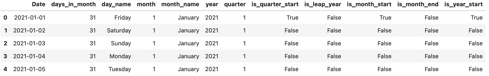

图 6.1 一个包含 5 行和 12 列的时间序列 DataFrame

> `Series.dt` 访问器
> 
> > 请注意，在前面的代码示例中，当处理 pandas **Series** 的 *datetime* 对象时，使用了 `.dt` 访问器。pandas 中的 `.dt` 访问器是用于访问 Series 的各种 datetime 属性的一个属性。在之前的例子中，您使用 `.dt` 访问了 `df[‘Date’]` Series 的 datetime 属性。

### 另见：

要了解更多关于 pandas 的 `to_datetime()` 函数和 `DatetimeIndex` 类的信息，请查看以下资源：

+   `pandas.DatetimeIndex` 文档： [`pandas.pydata.org/docs/reference/api/pandas.DatetimeIndex.html`](https://pandas.pydata.org/docs/reference/api/pandas.DatetimeIndex.html)

+   `pandas.to_datetime` 文档：[`pandas.pydata.org/docs/reference/api/pandas.to_datetime.html`](https://pandas.pydata.org/docs/reference/api/pandas.to_datetime.html)

## 提供格式参数给 DateTime

在处理从不同数据源提取的数据集时，您可能会遇到以字符串格式存储的日期列，无论是来自文件还是数据库。在之前的例子中，*使用 DatetimeIndex*，您探索了 `pandas.to_datetime()` 函数，它可以通过最小的输入解析各种日期格式。然而，您可能希望有更精细的控制，以确保日期被正确解析。例如，接下来您将了解 `strptime` 和 `strftime` 方法，并查看如何在 `pandas.to_datetime()` 中指定格式化选项，以处理不同的日期格式。

在本例中，您将学习如何将表示日期的字符串解析为 `datetime` 或 `date` 对象（`datetime.datetime` 或 `datetime.date` 类的实例）。

### 如何操作…

Python 的 `datetime` 模块包含 `strptime()` 方法，用于从包含日期的字符串创建 `datetime` 或 `date` 对象。您将首先探索如何在 Python 中做到这一点，然后将其扩展到 pandas 中：

1.  让我们探索一些示例，使用 `datetime.strptime` 解析字符串为 `datetime` 对象。您将解析四种不同表示方式的 `2022 年 1 月 1 日`，它们会生成相同的输出 – `datetime.datetime(2022, 1, 1, 0, 0)`：

```py
dt.datetime.strptime('1/1/2022', '%m/%d/%Y')
dt.datetime.strptime('1 January, 2022', '%d %B, %Y')
dt.datetime.strptime('1-Jan-2022', '%d-%b-%Y')
dt.datetime.strptime('Saturday, January 1, 2022', '%A, %B %d, %Y')
>>
datetime.datetime(2022, 1, 1, 0, 0)
```

请注意，输出是一个 `datetime` 对象，表示年份、月份、日期、小时和分钟。您可以仅指定日期表示方式，如下所示：

```py
dt.datetime.strptime('1/1/2022', '%m/%d/%Y').date()
>>
datetime.date(2022, 1, 1)
```

现在，您将获得一个 `date` 对象，而不是 `datetime` 对象。您可以使用 `print()` 函数获取 `datetime` 的可读版本：

```py
dt_1 = dt.datetime.strptime('1/1/2022', '%m/%d/%Y')
print(dt_1)
>>
2022-01-01 00:00:00
```

1.  现在，让我们比较一下使用 `datetime.strptime` 方法与 `pandas.to_datetime` 方法的差异：

```py
pd.to_datetime('1/1/2022', format='%m/%d/%Y')
pd.to_datetime('1 January, 2022', format='%d %B, %Y')
pd.to_datetime('1-Jan-2022', format='%d-%b-%Y')
pd.to_datetime('Saturday, January 1, 2022', format='%A, %B %d, %Y')
>>
Timestamp('2022-01-01 00:00:00')
```

同样，您可以使用 `print()` 函数获取 `Timestamp` 对象的字符串（可读）表示：

```py
dt_2 = pd.to_datetime('1/1/2022', format='%m/%d/%Y')
print(dt_2)
>>
2022-01-01 00:00:00
```

1.  使用 `pandas.to_datetime()` 相较于 Python 的 `datetime` 模块有一个优势。`to_datetime()` 函数可以解析多种日期表示方式，包括带有最少输入或规格的字符串日期格式。以下代码解释了这个概念；请注意省略了 `format`：

```py
pd.to_datetime('Saturday, January 1, 2022')
pd.to_datetime('1-Jan-2022')
>>
Timestamp('2022-01-01 00:00:00')
```

请注意，与需要整数值或使用 `strptime` 方法解析字符串的 `datetime` 不同，`pandas.to_datetime()` 函数可以智能地解析不同的日期表示方式，而无需指定格式（大多数情况下是如此）。

### 它是如何工作的…

在本教程中，您使用了 Python 的 `datetime.datetime` 和 `pandas.to_datetime` 方法来解析字符串格式的日期。当使用 `datetime` 时，您需要使用 `dt.datetime.strptime()` 函数来指定字符串中日期格式的表示方式，并使用格式代码（例如 `%d`、`%B` 和 `%Y`）。

例如，在 `datetime.strptime('1 January, 2022', '%d %B, %Y')` 中，您按确切顺序和间距提供了 `%d`、`%B` 和 `%Y` 格式代码，以表示字符串中的格式。让我们详细解析一下：

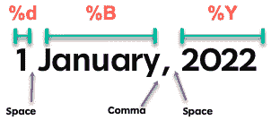

图 6.2 – 理解格式

+   `%d` 表示第一个值是一个零填充的数字，表示月份中的日期，后面跟一个空格，用于显示数字与下一个对象之间的间隔。

+   `%B` 用于表示第二个值代表月份的完整名称。请注意，这后面跟着逗号（`,`），用于描述字符串中准确的格式，例如 `"January,"`。因此，在解析字符串时，匹配格式至关重要，必须包含任何逗号、破折号、反斜杠、空格或使用的任何分隔符。

+   为了遵循字符串格式，逗号（`,`）后面有一个空格，接着是`%Y`，表示最后一个值代表四位数的年份。

> 格式指令
> 
> > 记住，你总是使用百分号（`%`）后跟格式代码（一个字母，可能带有负号）。这称为格式化指令。例如，小写的`y`，如`%y`，表示年份`22`（没有世纪），而大写的`Y`，如`%Y`，表示年份`2022`（包含世纪）。以下是可以在`strptime()`函数中使用的常见 Python 指令列表：[`docs.python.org/3/library/datetime.html#strftime-and-strptime-format-codes`](https://docs.python.org/3/library/datetime.html#strftime-and-strptime-format-codes)。

回想一下，你使用了`pandas.to_datetime()`来解析与`dt.datetime.strptime()`相同的字符串对象。最大不同之处在于，pandas 函数能够准确地解析字符串，而无需显式提供格式参数。这是使用 pandas 进行时间序列分析的诸多优势之一，尤其是在处理复杂日期和`datetime`场景时。

### 还有更多内容…

现在你已经知道如何使用`pandas.to_datetime()`将字符串对象解析为`datetime`。那么，让我们看看如何将包含日期信息的字符串格式的 DataFrame 列转换为`datetime`数据类型。

在下面的代码中，你将创建一个小的 DataFrame：

```py
df = pd.DataFrame(
        {'Date': ['January 1, 2022', 'January 2, 2022', 'January 3, 2022'],
         'Sales': [23000, 19020, 21000]}
            )
df
>>
Date  Sales
0     January 1, 2022   23000
1     January 2, 2022   19020
2     January 3, 2022   21000
df.info()
>>
<class 'pandas.core.frame.DataFrame'>
RangeIndex: 3 entries, 0 to 2
Data columns (total 2 columns):
 #   Column  Non-Null Count  Dtype
---  ------  --------------  -----
 0   Date    3 non-null      object
 1   Sales   3 non-null      int64
dtypes: int64(1), object(1)
memory usage: 176.0+ bytes
```

要更新 DataFrame 以包含 DatetimeIndex，你需要将`Date`列解析为`datetime`，然后将其作为索引分配给 DataFrame：

```py
df['Date'] = pd.to_datetime(df['Date'])
df.set_index('Date', inplace=True)
df.info()
>>
<class 'pandas.core.frame.DataFrame'>
DatetimeIndex: 3 entries, 2022-01-01 to 2022-01-03
Data columns (total 1 columns):
 #   Column  Non-Null Count  Dtype
---  ------  --------------  -----
 0   Sales   3 non-null      int64
dtypes: int64(1)
memory usage: 48.0 bytes
```

注意现在索引是`DatetimeIndex`类型，并且 DataFrame 中只有一列（`Sales`），因为`Date`现在是索引。

### 另请参见

要了解更多关于`pandas.to_datetime`的信息，请访问官方文档页面：[`pandas.pydata.org/docs/reference/api/pandas.to_datetime.html`](https://pandas.pydata.org/docs/reference/api/pandas.to_datetime.html)。

## 使用 Unix 纪元时间戳

**纪元时间戳**，有时称为**Unix 时间**或**POSIX 时间**，是一种常见的以**整数**格式存储`datetime`的方式。这个整数表示自参考点以来经过的秒数，对于基于 Unix 的时间戳，参考点是**1970 年 1 月 1 日**午夜（**00:00:00 UTC**）。这个任意的日期和时间代表了基准，从`0`开始。所以，我们每经过一秒钟就增加 1 秒。

许多数据库、应用程序和系统将日期和时间存储为数字格式，这样在数学上更容易处理、转换、递增、递减等。请注意，在 **Unix 纪元** 的情况下，它是基于 **UTC**（协调世界时），UTC 代表 **Universal Time Coordinated**。使用 UTC 是构建全球应用程序时的明确选择，它使得存储日期和时间戳以标准化格式变得更加简单。这也使得在处理日期和时间时，无需担心夏令时或全球各地的时区问题。UTC 是航空系统、天气预报系统、国际空间站等使用的标准国际时间。

你在某个时刻会遇到 Unix 纪元时间戳，想要更好地理解数据，你需要将其转换为人类可读格式。这就是本节要介绍的内容。再次提醒，你将体验使用 pandas 内置函数处理 Unix 纪元时间戳的简便性。

### 如何操作……

在我们开始将 Unix 时间转换为可读的 `datetime` 对象（这部分比较简单）之前，首先让我们对将日期和时间存储为数字对象（浮点数）这一概念有一些直观的理解：

1.  你将使用 `time` 模块（Python 的一部分）来请求当前的秒级时间。这将是从纪元开始以来的秒数，对于 Unix 系统来说，纪元从 1970 年 1 月 1 日 00:00:00 UTC 开始：

```py
import time
epoch_time = time.time()
print(epoch_time)
print(type(epoch_time))
>>
1700596942.589581
<class 'float'>
```

1.  现在，复制你得到的数字值并访问 [`www.epoch101.com`](https://www.epoch101.com)。该网站应该会显示你当前的纪元时间。如果你向下滚动，可以粘贴该数字并将其转换为人类可读格式。确保点击 **秒**，如图所示：

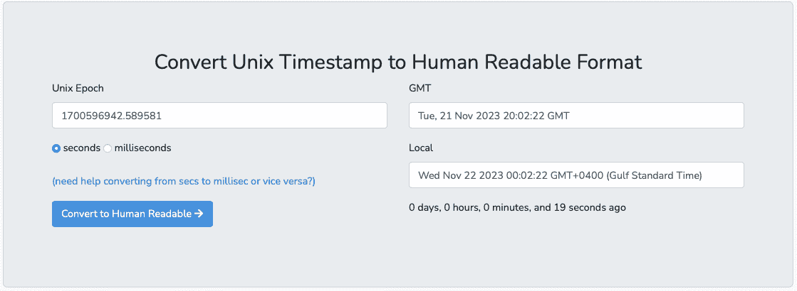

图 6.3：将 Unix 时间戳转换为 GMT 和本地时间的可读格式

注意，GMT 格式是 `Tue, 21 Nov 2023 20:02:22 GMT`，而我的本地格式是 `Wed Nov 22 2023, 00:02:22 GMT+0400 (海湾标准时间)`。

1.  让我们看看 pandas 如何转换纪元时间戳。这里的便利之处在于，你将使用你现在应该已经熟悉的相同的 `pandas.to_datetime()` 函数，因为你在本章的前两部分中已经用过它。这就是使用 pandas 的众多便利之一。例如，在以下代码中，你将使用 `pandas.to_datetime()` 来解析 Unix 纪元时间 `1700596942.589581`：

```py
import pandas as pd
t = pd.to_datetime(1700596942.589581, unit='s')
print(t)
>>
2023-11-21 20:02:22.589581056
```

注意需要将单位指定为秒。输出与 *图 6.3* 中的 GMT 格式相似。

1.  如果你希望 `datetime` 具有时区感知功能——例如，美国/太平洋时区——可以使用 `tz_localize('US/Pacific')`。不过，为了获得更精确的转换，最好分两步进行：

    1.  使用 `tz_localize('UTC')` 将时区不敏感的对象转换为 UTC。

    1.  然后，使用 `tz_convert()` 将其转换为所需的时区。

以下代码展示了如何将时间转换为太平洋时区：

```py
t.tz_localize('UTC').tz_convert('US/Pacific')
>>
Timestamp(2023-11-21 12:02:22.589581056-0800', tz='US/Pacific')
```

1.  让我们把这些内容整合在一起。你将把包含`datetime`列（以 Unix 纪元格式表示）的 DataFrame 转换为人类可读的格式。你将通过创建一个包含 Unix 纪元时间戳的新 DataFrame 开始：

```py
df = pd.DataFrame(
        {'unix_epoch': [1641110340,  1641196740, 1641283140, 1641369540],
                'Sales': [23000, 19020, 21000, 17030]}
                )
df
>>
      unix_epoch  Sales
0     1641110340  23000
1     1641196740  19020
2     1641283140  21000
3     1641369540  17030
```

1.  创建一个新列，命名为`Date`，通过将`unix_epoch`列解析为`datetime`（默认为 GMT），然后将输出本地化为 UTC，并转换为本地时区。最后，将`Date`列设为索引：

```py
df['Date'] = pd.to_datetime(df['unix_epoch'], unit='s')
df['Date'] = df['Date'].dt.tz_localize('UTC').dt.tz_convert('US/Pacific')
df.set_index('Date', inplace=True)
df
>>                            unix_epoch  Sales
Date       
2022-01-01 23:59:00-08:00     1641110340  23000
2022-01-02 23:59:00-08:00     1641196740  19020
2022-01-03 23:59:00-08:00     1641283140  21000
2022-01-04 23:59:00-08:00     1641369540  17030
```

注意，由于`Date`列是`datetime`类型（而不是`DatetimeIndex`），你必须使用`Series.dt`访问器来访问内建的方法和属性。最后一步，你将`datetime`转换为`DatetimeIndex`对象（即 DataFrame 索引）。如果你还记得本章中的*操作 DatetimeIndex*示例，`DatetimeIndex`对象可以访问所有`datetime`方法和属性，而无需使用`dt`访问器。

1.  如果你的数据是按天分布的，并且没有使用时间的需求，那么你可以仅请求日期，如以下代码所示：

```py
df.index.date
>>
array([datetime.date(2022, 1, 1), datetime.date(2022, 1, 2), datetime.date(2022, 1, 3), datetime.date(2022, 1, 4)], dtype=object)
```

注意，输出只显示日期，不包括时间。

### 它是如何工作的……

理解 Unix 纪元时间在从事需要精确和标准化时间表示的技术领域时尤为重要。

到目前为止，你使用了`pandas.to_datetime()`将字符串格式的日期解析为`datetime`对象，并通过利用格式属性（请参阅*提供格式参数给 DateTime*的示例）。在本例中，你使用了相同的函数，但这次没有提供格式值，而是传递了一个值给`unit`参数，如`unit='s'`。

`unit`参数告诉 pandas 在计算与纪元起始的差异时使用哪种单位。在此示例中，请求的是秒。然而，还有一个重要的参数你通常不需要调整，即`origin`参数。例如，默认值为`origin='unix'`，表示计算应基于 Unix（或 POSIX）时间，起始时间为`1970-01-01 00:00:00 UTC`。

下面是实际代码的样子：

```py
pd.to_datetime(1635220133.855169, unit='s', origin='unix')
>>
Timestamp('2021-10-26 03:48:53.855169024')
```

你可以修改`origin`，使用不同的参考日期来计算日期时间值。在以下示例中，`unit` 被指定为天，`origin` 设置为`2023 年 1 月 1 日`：

```py
pd.to_datetime(45, unit='D', origin='2023-1-1')
>>
Timestamp('2023-02-15 00:00:00')
```

### 还有更多内容……

如果你希望将`datetime`值存储为 Unix 纪元时间，可以通过减去`1970-01-01`，然后用`1`秒进行整除来实现。Python 使用`/`作为除法运算符，`//`作为整除运算符返回整除结果，`%`作为取余运算符返回除法的余数。

从创建一个新的 pandas DataFrame 开始：

```py
df = pd.DataFrame(
        {'Date': pd.date_range('01-01-2022', periods=5),
        'order' : range(5)}
                 )
df
>>
      Date        order
0     2022-01-01    0
1     2022-01-02    1
2     2022-01-03    2
3     2022-01-04    3
4     2022-01-05    4
```

你可以按如下方式进行转换：

```py
df['Unix Time'] = (df['Date'] -  pd.Timestamp("1970-01-01")) // pd.Timedelta("1s")
df
>>
      Date        order Unix Time
0     2022-01-01    0       1640995200
1     2022-01-02    1       1641081600
2     2022-01-03    2       1641168000
3     2022-01-04    3       1641254400
4     2022-01-05    4       1641340800
```

你现在已经生成了 Unix 时间戳。实现相似结果有多种方法。上述示例是 pandas 推荐的方法，详情请参阅此链接：[`pandas.pydata.org/pandas-docs/stable/user_guide/timeseries.html#from-timestamps-to-epoch`](https://pandas.pydata.org/pandas-docs/stable/user_guide/timeseries.html#from-timestamps-to-epoch)。

你将在下一个食谱中学到更多关于`Timedelta`的知识。

### 另请参见

要了解更多关于`pandas.to_datetime`的信息，请访问官方文档页面：[`pandas.pydata.org/docs/reference/api/pandas.to_datetime.html`](https://pandas.pydata.org/docs/reference/api/pandas.to_datetime.html)。

## 使用时间差进行操作

在处理时间序列数据时，你可能需要对`datetime`列进行一些计算，比如加减操作。例子包括将 30 天加到购买`datetime`上，以确定产品的退货政策何时到期或保修何时结束。例如，`Timedelta`类使得通过在不同的时间范围或增量（如秒、天、周等）上加减时间，得出新的`datetime`对象成为可能。这包括时区感知的计算。

在本节中，你将探索 pandas 中两种捕获日期/时间差异的实用方法——`pandas.Timedelta` 类和 `pandas.to_timedelta` 函数。

### 如何操作……

在本节中，你将使用假设的零售商店销售数据。你将生成一个销售数据框，其中包含商店购买的商品及其购买日期。然后，你将使用`Timedelta`类和`to_timedelta()`函数探索不同的场景：

1.  首先导入`pandas`库并创建一个包含两列（`item` 和 `purchase_dt`）的数据框，这些列会标准化为 UTC 时间：

```py
df = pd.DataFrame(
        {      
        'item': ['item1', 'item2', 'item3', 'item4', 'item5', 'item6'],
        'purchase_dt': pd.date_range('2021-01-01', periods=6, freq='D', tz='UTC')
        }
)
df
```

上述代码应输出一个包含六行（`items`）和两列（`item` 和 `purchase_dt`）的数据框：

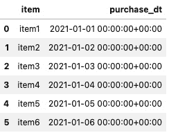

图 6.4：包含购买商品和购买日期时间（UTC）数据的数据框

1.  添加另一个`datetime`列，用于表示过期日期，设为购买日期后的 30 天：

```py
df['expiration_dt'] = df['purchase_dt'] + pd.Timedelta(days=30)
df
```

上述代码应向数据框中添加一个第三列（`expiration_dt`），该列设置为购买日期后的 30 天：

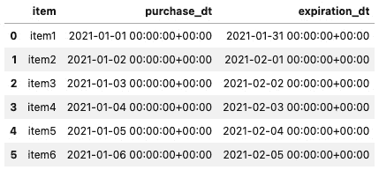

图 6.5：更新后的数据框，增加了一个反映过期日期的第三列

1.  现在，假设你需要创建一个特殊的退货延长期，这个时间设置为从购买日期起 35 天、12 小时和 30 分钟：

```py
df['extended_dt'] = df['purchase_dt'] +\
                pd.Timedelta('35 days 12 hours 30 minutes')
df
```

上述代码应向数据框中添加一个第四列（`extended_dt`），根据额外的 35 天、12 小时和 30 分钟，反映新的日期时间：

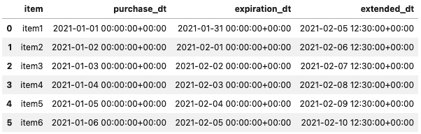

图 6.6：更新后的 DataFrame，新增第四列日期时间列，反映扩展后的日期

1.  假设你被要求将时区从 UTC 转换为零售商店总部所在时区，也就是洛杉矶时区：

```py
df.iloc[:,1:] = df.iloc[: ,1:].apply(
            lambda x: x.dt.tz_convert('US/Pacific')
                )
df
```

在将时区从 UTC 转换为美国/太平洋时区（洛杉矶）后，你将会覆盖`datetime`列（`purchased_dt`、`expiration_dt`和`extended_dt`）。DataFrame 的结构应该保持不变——六行四列——但数据现在看起来有所不同，如下图所示：


图 6.7：更新后的 DataFrame，所有日期时间列都显示洛杉矶（美国/太平洋时区）时间

1.  最后，你可以计算扩展后的到期日期与原始到期日期之间的差异。由于它们都是`datetime`数据类型，你可以通过简单的两个列之间的减法来实现这一点：

```py
df['exp_ext_diff'] = (
         df['extended_dt'] - df['expiration_dt']
        )
df
```

最终的 DataFrame 应该会有一个第五列，表示扩展日期与到期日期之间的差异：

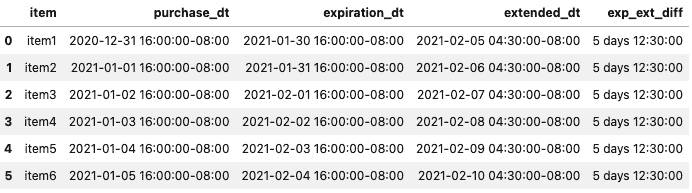

图 6.8：更新后的 DataFrame，新增第五列

由于 pandas 内置了处理时间序列数据和`datetime`的功能，这些类型的转换和计算变得更加简化，无需任何额外的库。

### 它是如何工作的…

时间差可以帮助捕捉两个日期或时间对象之间的差异。在 pandas 中，`pandas.Timedelta`类等同于 Python 的`datetime.timedelta`类，行为非常相似。然而，pandas 的优势在于它包含了大量用于处理时间序列数据的类和函数。这些内置的 pandas 函数在处理 DataFrame 时通常更简洁、高效。让我们做个简短实验，展示 pandas 的`Timedelta`类是 Python `timedelta`类的子类：

```py
import datetime as dt
import pandas as pd
pd.Timedelta(days=1) == dt.timedelta(days=1)
>> True
```

让我们验证一下`pandas.Timedelta`是否是`datetime.timedelta`的一个实例：

```py
issubclass(pd.Timedelta, dt.timedelta)
>> True
dt_1 = pd.Timedelta(days=1)
dt_2 = dt.timedelta(days=1)
isinstance(dt_1, dt.timedelta)
>> True
isinstance(dt_1, pd.Timedelta)
>> True
```

Python 的`datetime.timedelta`类接受这些参数的整数值——`days`、`seconds`、`microseconds`、`milliseconds`、`minutes`、`hours` 和 `weeks`。另一方面，`pandas.Timedelta`接受整数和字符串，如下代码所示：

```py
pd.Timedelta(days=1, hours=12, minutes=55)
>> Timedelta('1 days 12:55:00')
pd.Timedelta('1 day 12 hours 55 minutes')
>> Timedelta('1 days 12:55:00')
pd.Timedelta('1D 12H 55T')
>> Timedelta('1 days 12:55:00')
```

一旦你定义了`Timedelta`对象，就可以将其用于对`date`、`time`或`datetime`对象进行计算：

```py
week_td = pd.Timedelta('1W')
pd.to_datetime('1 JAN 2022') + week_td
>> Timestamp('2022-01-08 00:00:00')
```

在前面的示例中，`week_td`表示一个 1 周的`Timedelta`对象，可以将其加到（或减去）`datetime`中，得到时间差。通过添加`week_td`，你增加了 1 周。如果你想增加 2 周呢？你也可以使用乘法：

```py
pd.to_datetime('1 JAN 2022') + 2*week_td
>> Timestamp('2022-01-15 00:00:00')
```

### 还有更多…

使用`pd.Timedelta`非常简单，并且使得处理大规模时间序列 DataFrame 变得高效，无需导入额外的库，因为它已内置于 pandas 中。

在之前的*如何实现...*部分，你创建了一个 DataFrame，并基于`timedelta`计算添加了额外的列。你也可以将`timedelta`对象添加到 DataFrame 中，并通过它的列进行引用。最后，让我们看看它是如何工作的。

首先，让我们构建与之前相同的 DataFrame：

```py
import pandas as pd
df = pd.DataFrame(
        {      
        'item': ['item1', 'item2', 'item3', 'item4', 'item5', 'item6'],
        'purchase_dt': pd.date_range('2021-01-01', periods=6, freq='D', tz='UTC')
        }
)
```

这应该会生成一个如*图 6.4*所示的 DataFrame。现在，你将添加一个包含`Timedelta`对象（1 周）的新列，然后使用该列对`purchased_dt`列进行加减操作：

```py
df['1 week'] = pd.Timedelta('1W')
df['1_week_more'] = df['purchase_dt'] + df['1 week']
df['1_week_less'] = df['purchase_dt'] - df['1 week']
df
```

上述代码应该会生成一个带有三个额外列的 DataFrame。`1 week`列包含`Timedelta`对象，因此，你可以引用该列来计算所需的任何时间差：

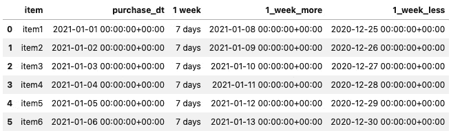

图 6.9：更新后的 DataFrame，新增三个列

让我们检查 DataFrame 中每一列的数据类型：

```py
df.info()
>>
<class 'pandas.core.frame.DataFrame'>
RangeIndex: 6 entries, 0 to 5
Data columns (total 5 columns):
 #   Column       Non-Null Count  Dtype             
---  ------       --------------  -----             
 0   item         6 non-null      object            
 1   purchase_dt  6 non-null      datetime64[ns, UTC]
 2   1 week       6 non-null      timedelta64[ns]   
 3   1_week_more  6 non-null      datetime64[ns, UTC]
 4   1_week_less  6 non-null      datetime64[ns, UTC]
dtypes: datetime64ns, UTC, object(1), timedelta64ns
memory usage: 368.0+ bytes
```

请注意，`1 week`列是一个特定的数据类型，`timedelta64`（我们的`Timedelta`对象），它允许你对 DataFrame 中的`date`、`time`和`datetime`列进行算术运算。

在*与 DatetimeIndex 一起工作*的食谱中，你探讨了`pandas.date_range()`函数来生成一个带有`DatetimeIndex`的 DataFrame。该函数基于开始时间、结束时间、周期和频率参数，返回一系列等间隔的时间点。

同样，你也可以使用`pandas.timedelta_range()`函数生成具有固定频率的`TimedeltaIndex`，它与`pandas.date_range()`函数的参数相似。下面是一个快速示例：

```py
df = pd.DataFrame(
        {      
        'item': ['item1', 'item2', 'item3', 'item4', 'item5'],
        'purchase_dt': pd.date_range('2021-01-01', periods=5, freq='D', tz='UTC'),
        'time_deltas': pd.timedelta_range('1W 2 days 6 hours', periods=5)
        }
)
df
```

输出结果如下：

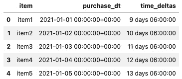

图 6.10：包含 Timedelta 列的 DataFrame

### 另见

+   若要了解更多关于`pandas.timedelta_range()`函数的信息，请参考官方文档：[`pandas.pydata.org/docs/reference/api/pandas.timedelta_range.html`](https://pandas.pydata.org/docs/reference/api/pandas.timedelta_range.html)。

+   若要了解更多关于`pandas.Timedelta`类的信息，请访问官方文档：[`pandas.pydata.org/docs/reference/api/pandas.Timedelta.html`](https://pandas.pydata.org/docs/reference/api/pandas.Timedelta.html)。

## 转换带有时区信息的 DateTime

在处理需要关注不同时区的时间序列数据时，事情可能会变得不可控且复杂。例如，在开发数据管道、构建数据仓库或在系统之间集成数据时，处理时区需要在项目的各个利益相关者之间达成一致并引起足够的重视。例如，在 Python 中，有几个专门用于处理时区转换的库和模块，包括 `pytz`、`dateutil` 和 `zoneinfo` 等。

让我们来讨论一个关于时区和时间序列数据的启发性示例。对于跨越多个大陆的大型公司来说，包含来自全球不同地方的数据是很常见的。如果忽略时区，将很难做出基于数据的商业决策。例如，假设你想确定大多数客户是早上还是晚上访问你的电子商务网站，或者是否顾客在白天浏览，晚上下班后再进行购买。为了进行这个分析，你需要意识到时区差异以及它们在国际范围内的解读。

### 如何操作...

在这个示例中，你将处理一个假设场景——一个小型数据集，代表从全球各地不同时间间隔访问网站的数据。数据将被标准化为 UTC，并且你将处理时区转换。

1.  你将首先导入 `pandas` 库并创建时间序列 DataFrame：

```py
df = pd.DataFrame(
        {      
        'Location': ['Los Angeles',
                     'New York',
                     'Berlin',
                     'New Delhi',
                     'Moscow',
                     'Tokyo',
                     'Dubai'],
        'tz': ['US/Pacific',
               'US/Eastern',
               'Europe/Berlin',
               'Asia/Kolkata',
               'Europe/Moscow',
               'Asia/Tokyo',
               'Asia/Dubai'],
        'visit_dt': pd.date_range(start='22:00',periods=7, freq='45min'),
        }).set_index('visit_dt')
df
```

这将生成一个 DataFrame，其中 `visit_dt` 是 `DatetimeIndex` 类型的索引，两个列 `Location` 和 `tz` 表示时区：

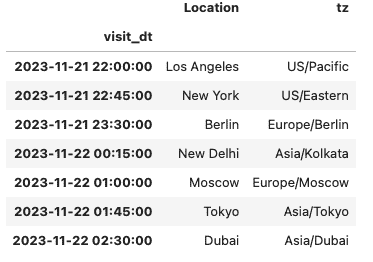

图 6.11：以 UTC 时间为索引的 DataFrame

1.  假设你需要将这个 DataFrame 转换为与公司总部东京所在的时区相同。你可以通过对 DataFrame 使用 `DataFrame.tz_convert()` 来轻松完成，但如果这样做，你将遇到 `TypeError` 异常。这是因为你的时间序列 DataFrame 并不具有时区感知能力。所以，你需要先使用 `tz_localize()` 将其本地化，才能使其具备时区感知能力。在这种情况下，你将其本地化为 UTC：

```py
df = df.tz_localize('UTC')
```

1.  现在，你将把 DataFrame 转换为总部所在的时区（`东京`）：

```py
df_hq = df.tz_convert('Asia/Tokyo')
df_hq
```

DataFrame 索引 `visit_dt` 将转换为新的时区：

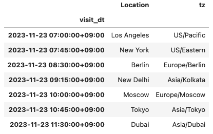

图 6.12：DataFrame 索引转换为总部所在时区（东京）

请注意，你能够访问 `tz_localize()` 和 `tz_convert()` 方法，因为 DataFrame 的索引类型是 `DatetimeIndex`。如果不是这种情况，你将会遇到 `TypeError` 异常，错误信息如下：

```py
TypeError: index is not a valid DatetimeIndex or PeriodIndex
```

1.  现在，你将把每一行本地化到适当的时区。你将添加一个新列，反映基于访问网站用户位置的时区。你将利用`tz`列来完成这个操作：

```py
df['local_dt'] = df.index
df['local_dt'] = df.apply(lambda x: pd.Timestamp.tz_convert(x['local_dt'], x['tz']), axis=1)
df
```

这应该会生成一个新的列`local_dt`，该列基于`visit_dt`中的 UTC 时间，并根据`tz`列中提供的时区进行转换：


图 6.13：更新后的 DataFrame，`local_dt`基于每次访问的本地时区

你可能会问，如果没有`tz`列怎么办？在哪里可以找到正确的`tz`字符串？这些被称为**时区**（**TZ**）数据库名称。它们是标准名称，你可以在 Python 文档中找到这些名称的一个子集，或者你可以访问这个链接查看更多信息：[`en.wikipedia.org/wiki/List_of_tz_database_time_zones`](https://en.wikipedia.org/wiki/List_of_tz_database_time_zones)。

### 它是如何工作的…

将时间序列的 DataFrame 从一个时区转换到另一个时区，可以使用`DataFrame.tz_convert()`方法，并提供像`US/Pacific`这样的时区字符串作为参数。在使用`DataFrame.tz_convert()`时，有几个假设需要记住：

+   DataFrame 应该具有`DatetimeIndex`类型的索引。

+   `DatetimeIndex`需要具备时区感知功能。

你使用了`DataFrame.tz_localize()`函数来使索引具备时区感知功能。如果你在处理不同的时区和夏令时，建议标准化为*UTC*，因为 UTC 始终一致且不变（无论你身在何处，或者是否应用了夏令时）。一旦使用 UTC，转换到其他时区非常简单。

我们首先在前面的步骤中将数据本地化为 UTC 时间，然后分两步将其转换为不同的时区。你也可以通过链式调用这两个方法一步完成，如以下代码所示：

```py
df.tz_localize('UTC').tz_convert('Asia/Tokyo')
```

如果你的索引已经具备时区感知功能，那么使用`tz_localize()`将会引发`TypeError`异常，并显示以下信息：

```py
TypeError: Already tz-aware, use tz_convert to convert
```

这表示你不需要再次本地化它。相反，只需将其转换为另一个时区即可。

### 还有更多…

看着*图 6.12*中的 DataFrame，很难立刻判断时间是上午（AM）还是下午（PM）。你可以使用`strftime`格式化`datetime`（我们在*提供格式参数给 DateTime*的例子中讨论过）。

你将构建相同的 DataFrame，将其本地化为 UTC 时间，然后转换为总部所在的时区，并应用新的格式：

```py
df = pd.DataFrame(
        {      
        'Location': ['Los Angeles',
                     'New York',
                     'Berlin',
                     'New Delhi',
                     'Moscow',
                     'Tokyo',
                     'Dubai'],
        'tz': ['US/Pacific',
               'US/Eastern',
               'Europe/Berlin',
               'Asia/Kolkata',
               'Europe/Moscow',
               'Asia/Tokyo',
               'Asia/Dubai'],
        'visit_dt': pd.date_range(start='22:00',periods=7, freq='45min'),
        }).set_index('visit_dt').tz_localize('UTC').tz_convert('Asia/Tokyo')
```

我们已经将这些步骤结合起来，生成的 DataFrame 应该类似于*图 6.12*中的数据。

现在，你可以更新格式，使用`YYYY-MM-DD HH:MM AM/PM`的模式：

```py
df.index = df.index.strftime('%Y-%m-%d %H:%M %p')
df
```

索引将从格式/布局的角度进行更新。然而，它仍然是基于东京时区的时区感知，并且索引仍然是`DatetimeIndex`。唯一的变化是`datetime`布局：

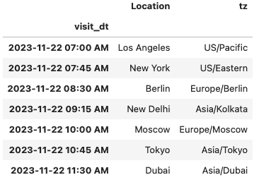

图 6.14 – 更新后的 DataFrame 索引，基于提供的日期格式字符串进行格式化

我相信你会同意，这样做能更轻松地向用户展示，快速确定访问是上午还是下午。

### 另见

要了解更多关于 `tz_convert` 的信息，你可以阅读官方文档 [`pandas.pydata.org/docs/reference/api/pandas.Series.dt.tz_convert.html 和 https://pandas.pydata.org/docs/reference/api/pandas.Timestamp.tz_convert.html`](https://pandas.pydata.org/docs/reference/api/pandas.Series.dt.tz_convert.html)。

## 处理日期偏移

在处理时间序列时，了解你所处理的数据以及它如何与正在解决的问题相关联至关重要。例如，在处理制造或销售数据时，你不能假设一个组织的工作日是周一到周五，或者它是否使用标准的日历年或财年。你还应该考虑了解任何假期安排、年度停产以及与业务运营相关的其他事项。

这时，偏移量就派上用场了。它们可以帮助将日期转换为对业务更有意义和更具相关性的内容。它们也可以帮助修正可能不合逻辑的数据条目。

我们将在这个示例中通过一个假设的例子，展示如何利用 pandas 偏移量。

### 如何做…

在本示例中，你将生成一个时间序列 DataFrame 来表示一些生产数量的每日日志。该公司是一家总部位于美国的公司，希望通过分析数据来更好地理解未来预测的生产能力：

1.  首先导入 `pandas` 库，然后生成我们的 DataFrame：

```py
np.random.seed(10)
df = pd.DataFrame(
        {      
        'purchase_dt': pd.date_range('2021-01-01', periods=6, freq='D'),
        'production' : np.random.randint(4, 20, 6)
        }).set_index('purchase_dt')
df
>>
             production
purchase_dt           
2021-01-01           13
2021-01-02           17
2021-01-03            8
2021-01-04           19
2021-01-05            4
2021-01-06            5
```

1.  让我们添加星期几的名称：

```py
df['day'] = df.index.day_name()
df
>>
             production        day
purchase_dt                      
2021-01-01           13     Friday
2021-01-02           17   Saturday
2021-01-03            8     Sunday
2021-01-04           19     Monday
2021-01-05            4    Tuesday
2021-01-06            5  Wednesday
```

在处理任何数据时，始终理解其背后的业务背景。没有领域知识或业务背景，很难判断一个数据点是否可以接受。在这个情境中，公司被描述为一家总部位于美国的公司，因此，工作日是从周一到周五。如果有关于周六或周日（周末）的数据，未经与业务确认，不应该做任何假设。你应该确认是否在特定的周末日期有生产例外情况。此外，意识到 1 月 1 日是节假日。经过调查，确认由于紧急例外，生产确实发生了。业务高层不希望在预测中考虑周末或节假日的工作。换句话说，这是一个一次性、未发生的事件，他们不希望以此为基础建立模型或假设。

1.  公司要求将周末/节假日的生产数据推迟到下一个工作日。在这里，您将使用 `pandas.offsets.BDay()`，它表示工作日：

```py
df['BusinessDay'] = df.index + pd.offsets.BDay(0)
df['BDay Name'] = df['BusinessDay'].dt.day_name()
df
>>
             production        day BusinessDay  BDay Name
purchase_dt                                          
2021-01-01           13     Friday  2021-01-01     Friday
2021-01-02           17   Saturday  2021-01-04     Monday
2021-01-03            8     Sunday  2021-01-04     Monday
2021-01-04           19     Monday  2021-01-04     Monday
2021-01-05            4    Tuesday  2021-01-05    Tuesday
2021-01-06            5  Wednesday  2021-01-06  Wednesday
```

由于周六和周日是周末，它们的生产数据被推迟到下一个工作日，即周一，1 月 4 日。

1.  让我们执行一个汇总聚合，按工作日添加生产数据，以更好地理解此更改的影响：

```py
df.groupby(['BusinessDay', 'BDay Name']).sum()
>>
                       production
BusinessDay BDay Name           
2021-01-01  Friday             137
2021-01-04  Monday             44
2021-01-05  Tuesday             4
2021-01-06  Wednesday           5
```

现在，周一被显示为该周最具生产力的一天，因为它是节假日后的第一个工作日，并且是一个长周末之后的工作日。

1.  最后，企业提出了另一个请求——他们希望按月（`MonthEnd`）和按季度（`QuarterEnd`）跟踪生产数据。您可以再次使用 `pandas.offsets` 来添加两列新数据：

```py
df['QuarterEnd'] = df.index + pd.offsets.QuarterEnd(0)
df['MonthEnd'] = df.index + pd.offsets.MonthEnd(0)
df['BusinessDay'] = df.index + pd.offsets.BDay(0)
>>
             production QuarterEnd   MonthEnd BusinessDay
purchase_dt                                         
2021-01-01           13 2021-03-31 2021-01-31  2021-01-01
2021-01-02           17 2021-03-31 2021-01-31  2021-01-04
2021-01-03            8 2021-03-31 2021-01-31  2021-01-04
2021-01-04           19 2021-03-31 2021-01-31  2021-01-04
2021-01-05            4 2021-03-31 2021-01-31  2021-01-05
2021-01-06            5 2021-03-31 2021-01-31  2021-01-06
```

现在，您已经有了一个 DataFrame，它应该能满足大多数企业的报告需求。

### 它是如何工作的…

使用日期偏移量使得根据特定规则增减日期或将日期转换为新的日期范围成为可能。pandas 提供了多种偏移量，每种偏移量都有其规则，可以应用到您的数据集上。以下是 pandas 中常见的偏移量列表：

+   `BusinessDay` 或 `Bday`

+   `MonthEnd`

+   `BusinessMonthEnd` 或 `BmonthEnd`

+   `CustomBusinessDay` 或 `Cday`

+   `QuarterEnd`

+   `FY253Quarter`

要查看更全面的列表及其描述，请访问文档：[`pandas.pydata.org/pandas-docs/stable/user_guide/timeseries.html#dateoffset-objects`](https://pandas.pydata.org/pandas-docs/stable/user_guide/timeseries.html#dateoffset-objects)。

在 pandas 中应用偏移量与进行加法或减法一样简单，如以下示例所示：

```py
df.index + pd.offsets.BDay()
df.index - pd.offsets.BDay()
```

### 还有更多…

根据我们的示例，您可能已经注意到，在使用 `BusinessDay`（`BDay`）偏移量时，它并未考虑到新年假期（1 月 1 日）。那么，如何既考虑到新年假期，又考虑到周末呢？

为了实现这一点，pandas 提供了两种处理标准节假日的方法。第一种方法是定义自定义节假日。第二种方法（在适用时）使用现有的节假日偏移量。

让我们从现有的偏移量开始。以新年为例，您可以使用 `USFederalHolidayCalendar` 类，它包含了标准节假日，如新年、圣诞节以及其他美国特定的节假日。接下来，我们来看看它是如何工作的。

首先，生成一个新的 DataFrame，并导入所需的库和类：

```py
import pandas as pd
from pandas.tseries.holiday import (
    USFederalHolidayCalendar
)
df = pd.DataFrame(
        {      
        'purchase_dt': pd.date_range('2021-01-01', periods=6, freq='D'),
        'production' : np.random.randint(4, 20, 6)
        }).set_index('purchase_dt')
```

`USFederalHolidayCalendar` 有一些假期规则，您可以使用以下代码检查：

```py
USFederalHolidayCalendar.rules
>>
[Holiday: New Years Day (month=1, day=1, observance=<function nearest_workday at 0x7fedf3ec1a60>),
 Holiday: Martin Luther King Jr. Day (month=1, day=1, offset=<DateOffset: weekday=MO(+3)>),
 Holiday: Presidents Day (month=2, day=1, offset=<DateOffset: weekday=MO(+3)>),
 Holiday: Memorial Day (month=5, day=31, offset=<DateOffset: weekday=MO(-1)>),
 Holiday: July 4th (month=7, day=4, observance=<function nearest_workday at 0x7fedf3ec1a60>),
 Holiday: Labor Day (month=9, day=1, offset=<DateOffset: weekday=MO(+1)>),
 Holiday: Columbus Day (month=10, day=1, offset=<DateOffset: weekday=MO(+2)>),
 Holiday: Veterans Day (month=11, day=11, observance=<function nearest_workday at 0x7fedf3ec1a60>),
 Holiday: Thanksgiving (month=11, day=1, offset=<DateOffset: weekday=TH(+4)>),
 Holiday: Christmas (month=12, day=25, observance=<function nearest_workday at 0x7fedf3ec1a60>)]
```

要应用这些规则，您将使用 `CustomerBusinessDay` 或 `CDay` 偏移量：

```py
df['USFederalHolidays'] = df.index + pd.offsets.CDay(calendar=USFederalHolidayCalendar())
df
```

输出结果如下：

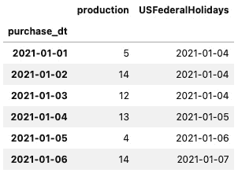

图 6.15 – 添加到 DataFrame 中的 USFederalHolidays 列，识别新年假期

自定义假期选项将以相同的方式工作。你需要导入`Holiday`类和`nearest_workday`函数。你将使用`Holiday`类来定义你的具体假期。在本例中，你将确定新年规则：

```py
from pandas.tseries.holiday import (
    Holiday,
    nearest_workday,
    USFederalHolidayCalendar
)
newyears = Holiday("New Years",
                   month=1,
                   day=1,
                   observance=nearest_workday)
newyears
>>
Holiday: New Years (month=1, day=1, observance=<function nearest_workday at 0x7fedf3ec1a60>)
```

类似于你如何将`USFederalHolidayCalendar`类应用于`CDay`偏移量，你将把你的新`newyears`对象应用于`Cday`：

```py
df['NewYearsHoliday'] = df.index + pd.offsets.CDay(calendar=newyears)
df
```

你将获得以下输出：

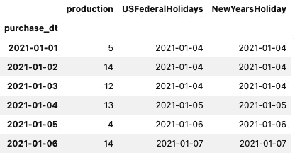

图 6.16 – 使用自定义假期偏移量添加的 NewYearsHoliday 列

如果你对`nearest_workday`函数以及它如何在`USFederalHolidayCalendar`规则和你的自定义假期中被使用感到好奇，那么以下代码展示了它的工作原理：

```py
nearest_workday(pd.to_datetime('2021-1-3'))
>>
Timestamp('2021-01-04 00:00:00')
nearest_workday(pd.to_datetime('2021-1-2'))
>>
Timestamp('2021-01-01 00:00:00')
```

如所示，函数主要判断一天是否为工作日，然后根据判断结果，它将使用前一天（如果是星期六）或后一天（如果是星期日）。`nearest_workday`还有其他可用规则，包括以下几种：

+   `Sunday_to_Monday`

+   `Next_Monday_or_Tuesday`

+   `Previous_Friday`

+   `Next_monday`

### 参见

欲了解更多有关`pandas.tseries.holiday`的详细信息，你可以查看实际的代码，它展示了所有的类和函数，可以作为一个很好的参考，访问[`github.com/pandas-dev/pandas/blob/master/pandas/tseries/holiday.py`](https://github.com/pandas-dev/pandas/blob/master/pandas/tseries/holiday.py)。

## 使用自定义工作日

不同地区和领土的公司有不同的工作日。例如，在处理时间序列数据时，根据你需要进行的分析，了解某些交易是否发生在工作日或周末可能会产生差异。例如，假设你正在进行异常检测，并且你知道某些类型的活动只能在工作时间内进行。在这种情况下，任何超出这些时间范围的活动都可能触发进一步的分析。

在本示例中，你将看到如何定制一个偏移量以适应你的需求，特别是在进行依赖于已定义的工作日和非工作日的分析时。

### 如何操作…

在本示例中，你将为总部位于约旦安曼的公司创建自定义的工作日和假期。在约旦，工作周是从星期日到星期四，而星期五和星期六是为期两天的周末。此外，他们的国庆节（一个假期）是在每年的 5 月 25 日：

1.  你将从导入 pandas 并定义约旦的工作日开始：

```py
import pandas as pd
from pandas.tseries.holiday import AbstractHolidayCalendar, Holiday
from pandas.tseries.offsets import CustomBusinessDay
jordan_workdays = "Sun Mon Tue Wed Thu"
```

1.  你将定义一个自定义类假期`JordanHolidayCalendar`和一个新的`rule`用于约旦的独立日：

```py
class JordanHolidayCalendar(AbstractHolidayCalendar):
    rules = [
        Holiday('Jordan Independence Day', month=5, day=25)
    ]
```

1.  你将定义一个新的`CustomBusinessDay`实例，并包含自定义假期和工作日：

```py
jordan_bday = CustomBusinessDay(
    holidays=JordanHolidayCalendar().holidays(),
    weekmask=jordan_workdays)
```

1.  你可以验证规则是否已正确注册：

```py
jordan_bday.holidays[53]
>>
numpy.datetime64('2023-05-25')
jordan_bday.weekmask
>>
'Sun Mon Tue Wed Thu'
```

1.  现在，你可以使用`pd.date_range`生成从 2023 年 5 月 20 日开始的 10 个**工作**日。生成的日期将排除周末（周五和周六）以及独立日假期（5 月 25 日）：

```py
df = pd.DataFrame({'Date': pd.date_range('12-1-2021', periods=10, freq=dubai_uae_bday )})
```

1.  为了更容易判断功能是否按预期工作，添加一个新列来表示星期名称：

```py
df['Day_name'] = df.Date.dt.day_name()
df
```

生成的时间序列应该具有新的自定义工作日，并包含约旦的节假日规则。

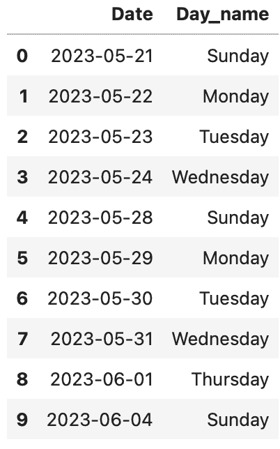

图 6.17：基于阿联酋自定义工作日和节假日生成的时间序列

在*图 6.17*中，你可以看到自定义的工作日从周日到周一，除了 5 月 25 日（星期四），因为这是约旦的国庆日，所有该日期被跳过。

这个示例可以进一步扩展，涵盖不同国家和节假日，以适应你正在进行的分析类型。

### 它是如何工作的……

这个配方基于“处理日期偏移量”配方，但重点是自定义偏移量。pandas 提供了几种偏移量，可以使用自定义日历、**节假日**和**weekmask**。这些包括以下内容：

+   `CustomBusinessDay`或`Cday`

+   `CustomBusinessMonthEnd`或`CBMonthEnd`

+   `CustomBusinessMonthBegin`或`CBMonthBegin`

+   `CustomBusinessHour`

它们的行为就像其他偏移量；唯一的区别是，它们允许你创建自己的规则。

在这个配方中，你导入了`CustomBusinessDay`类，创建了它的一个实例来为工作日创建自定义频率，考虑了周末和节假日。以下是你使用的代码：

```py
jordan_bday = CustomBusinessDay(
    holidays=JordanHolidayCalendar().holidays(),
    weekmask=jordan_workdays
)
```

这也等同于以下代码：

```py
jordan_bday = pd.offsets.CustomBusinessDay(
    holidays=JordanHolidayCalendar().holidays(),
    weekmask=jordan_workdays,
)
```

请注意，在定义工作日时，使用的是一串缩写的星期名称。这被称为`weekmask`，在自定义星期时，pandas 和 NumPy 都使用它。在 pandas 中，你还可以通过扩展`AbstractHolidayCalendar`类并包含特定的日期或节假日规则来定义自定义假期日历，正如前面关于约旦独立日的代码所展示的那样。

### 还有更多内容……

让我们扩展前面的示例，并向 DataFrame 中添加自定义工作时间。这将是另一个自定义偏移量，你可以像使用`CustomBusinessDay`一样使用它：

```py
jordan_bhour = pd.offsets.CustomBusinessHour(
    start="8:30",
    end="15:30",
    holidays=JordanHolidayCalendar().holidays(),
    weekmask=jordan_workdays)
```

在这里，你应用了相同的规则，自定义的`holidays`和`weekmask`用于自定义工作日，确保自定义的工作时间也遵守定义的工作周和节假日。你通过提供`start`和`end`时间（24 小时制）来定义自定义工作时间。

以下是你刚刚创建的自定义工作时间的使用示例：

```py
start_datetime = '2023-05-24 08:00'
end_datetime = '2023-05-24 16:00'
business_hours = pd.date_range(start=start_datetime, end=end_datetime, freq=jordan_bhour)
print(business_hours)
>>
DatetimeIndex(['2023-05-24 08:30:00', '2023-05-24 09:30:00',
               '2023-05-24 10:30:00', '2023-05-24 11:30:00',
               '2023-05-24 12:30:00', '2023-05-24 13:30:00',
               '2023-05-24 14:30:00'],
              dtype='datetime64[ns]', freq='CBH')
```

请注意，像`CustomBusinessDay`和`CustomBusinessHour`这样的自定义偏移量可以应用于无时区感知和有时区感知的日期时间对象。然而，是否需要将 DataFrame 设置为时区感知取决于具体的使用案例。在需要时，你可以使用`tz.localize()`或`tz.convert()`将 DataFrame 设置为时区感知（例如，先本地化再转换到你的时区），然后再应用自定义偏移量以获得更好的结果。

### 另请参见

+   要了解更多关于 pandas 的`CustomBusinessDay`，你可以阅读官方文档：[`pandas.pydata.org/docs/reference/api/pandas.tseries.offsets.CustomBusinessDay.html`](https://pandas.pydata.org/docs/reference/api/pandas.tseries.offsets.CustomBusinessDay.html)

+   要了解更多关于 pandas 的`CustomBusinessHours`，你可以阅读官方文档：[`pandas.pydata.org/docs/reference/api/pandas.tseries.offsets.CustomBusinessHour.html`](https://pandas.pydata.org/docs/reference/api/pandas.tseries.offsets.CustomBusinessHour.html)
