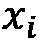
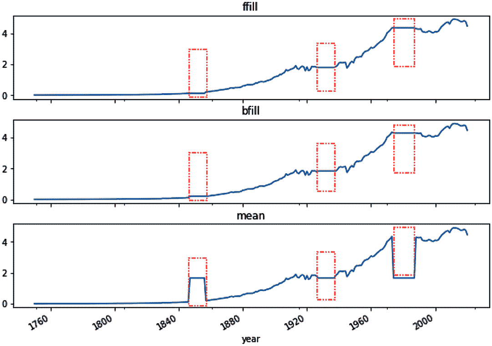

# 第七章：7 处理缺失数据

## 加入我们的书籍社区，访问 Discord


[`packt.link/zmkOY`](https://packt.link/zmkOY)

作为数据科学家、数据分析师或业务分析师，您可能已经发现，指望获得*完美*的干净数据集是过于乐观的。然而，更常见的情况是，您正在处理的数据存在缺失值、错误数据、重复记录、数据不足或数据中存在异常值等问题。

时间序列数据也不例外，在将数据输入任何分析或建模流程之前，您必须先对数据进行调查。理解*时间序列数据背后的业务背景*对于成功检测和识别这些问题至关重要。例如，如果您处理的是股票数据，其背景与 COVID 数据或传感器数据有很大不同。

拥有这种直觉或领域知识将使您能够预见分析数据时的期望结果以及哪些结果是可以接受的。始终尝试理解数据背后的业务背景。例如，数据最初为什么要被收集？数据是如何收集的？数据是否已经应用了某些业务规则、逻辑或变换？这些修改是在数据采集过程中应用的，还是内置在生成数据的系统中？

在发现阶段，这些前期知识将帮助您确定最佳的方法来清理和准备数据集，以进行分析或建模。缺失数据和异常值是数据清理和准备过程中需要处理的两个常见问题。您将在*第八章*《使用统计方法检测异常值》和*第十四章*《使用无监督机器学习检测异常值》中深入探讨异常值检测。本章将探索通过**插补**和**插值**技术处理缺失数据的方法。

以下是本章将涵盖的配方列表：

+   执行数据质量检查

+   使用 pandas 进行单变量插补处理缺失数据

+   使用 scikit-learn 进行单变量插补处理缺失数据

+   使用多变量插补处理缺失数据

+   使用插值处理缺失数据

## 技术要求

您可以从 GitHub 仓库下载 Jupyter 笔记本和所需的数据集，以便跟随教程：

+   Jupyter 笔记本：[`github.com/PacktPublishing/Time-Series-Analysis-with-Python-Cookbook./blob/main/code/Ch7/Chapter%207.ipynb`](https://github.com/PacktPublishing/Time-Series-Analysis-with-Python-Cookbook./blob/main/code/Ch7/Chapter%207.ipynb)

+   数据集：[`github.com/PacktPublishing/Time-Series-Analysis-with-Python-Cookbook./tree/main/datasets/Ch7`](https://github.com/PacktPublishing/Time-Series-Analysis-with-Python-Cookbook./tree/main/datasets/Ch7)

在本章及后续章节中，您将广泛使用 pandas 2.1.3（2023 年 11 月 10 日发布）。另外，您还将使用四个额外的库：

+   numpy (1.26.0)

+   matplotlob (3.8.1)

+   statsmodels (0.14.0)

+   scikit-learn (1.3.2)

+   SciPy (1.11.3)

如果您使用`pip`，则可以通过终端使用以下命令安装这些包：

```py
pip install matplotlib numpy statsmodels scikit-learn scipy
```

如果您使用`conda`，则可以通过以下命令安装这些包：

```py
conda install matplotlib numpy statsmodels scikit-learn scipy
```

在本章中，将广泛使用两个数据集进行插补和插值操作：*CO2 排放*数据集和*电子商店点击流*数据集。点击流数据集的来源为*在线购物的点击流数据*，来自*UCI 机器学习库*，您可以在这里找到：

[`archive.ics.uci.edu/ml/datasets/clickstream+data+for +online+shopping`](https://archive.ics.uci.edu/ml/datasets/clickstream+data+for)

CO2 排放数据集的来源为*Our World in Data*的年度*CO2 排放*报告，您可以在此处找到：[`ourworldindata.org/co2-emissions`](https://ourworldindata.org/co2-emissions)。

为了演示，两个数据集已经被修改，去除了部分观测值（缺失数据）。提供了原始版本和修改版本，用于评估本章讨论的不同技术。

在本章中，您将遵循类似的步骤来处理缺失数据：将数据导入 DataFrame，识别缺失数据，对缺失数据进行插补，评估与原始数据的对比，最后可视化并比较不同的插补技术。

这些步骤可以转化为函数以便重用。您可以为这些步骤创建函数：一个用于将数据读入 DataFrame 的函数，一个用于使用 RMSE 评分评估的函数，以及一个用于绘制结果的函数。

首先加载将在本章中使用的标准库：

```py
import pandas as pd
from pathlib import Path
import matplotlib.pyplot as plt
import numpy as np
```

### 函数 1 – read_datasets

`read_datasets`函数接受文件夹路径、CSV 文件名和包含日期变量的列名。

`read_datasets`函数定义如下：

```py
def read_dataset(folder, file, date_col=None, format=None, index=False):
    '''
    folder: is a Path object
    file: the CSV filename in that Path object.
    date_col: specify a column which has datetime
    index_col: True if date_col should be the index

    returns: a pandas DataFrame with a DatetimeIndex
    '''
    index_col = date_col if index is True else None

    df = pd.read_csv(folder / file,
                     index_col=index_col,
                     parse_dates=[date_col],
                     date_format=format)
    return df
```

### 函数 2 – plot_dfs

`plot_dfs()`函数接受两个 DataFrame：没有缺失数据的原始 DataFrame（`df1`，作为基准）和经过插补的 DataFrame（`df2`，用于对比）。该函数使用指定的响应列（`col`）创建多个时间序列子图。注意，插补后的 DataFrame 将包含额外的列（每个插补技术的输出列），绘图函数会考虑到这一点。通过遍历列来完成这一操作。该函数将为每个插补技术绘制图形以便视觉比较，并将在本章中多次使用。

这个`plot_dfs`函数定义如下：

```py
def plot_dfs(df1, df2, col, title=None, xlabel=None, ylabel=None):
    '''   
    df1: original dataframe without missing data
    df2: dataframe with missing data
    col: column name that contains missing data
    '''   
    df_missing = df2.rename(columns={col: 'missing'})

    columns = df_missing.loc[:, 'missing':].columns.tolist()
    subplots_size = len(columns)   
    fig, ax = plt.subplots(subplots_size+1, 1, sharex=True)
    plt.subplots_adjust(hspace=0.25)
    fig.suptitle = title

    df1[col].plot(ax=ax[0], figsize=(10, 12))
    ax[0].set_title('Original Dataset')
    ax[0].set_xlabel(xlabel)
    ax[0].set_ylabel(ylabel)   

    for i, colname in enumerate(columns):
        df_missing[colname].plot(ax=ax[i+1])
        ax[i+1].set_title(colname.upper())
    plt.show()
```

### 函数 3 – rmse_score

除了使用`plot_dfs`函数进行插补技术的视觉比较外，您还需要一种方法来数字化比较不同的插补技术（使用统计度量）。

这时，`rmse_score` 函数将派上用场。它接受两个 DataFrame：原始 DataFrame（`df1`）作为基准，以及要进行比较的填补后的 DataFrame（`df2`）。该函数允许你指定哪个列包含响应列（`col`），用于计算的基础。

`rmse_score` 函数定义如下：

```py
def rmse_score(df1, df2, col=None):
    '''
    df1: original dataframe without missing data
    df2: dataframe with missing data
    col: column name that contains missing data
    returns: a list of scores
    '''
    df_missing = df2.rename(columns={col: 'missing'})
    columns = df_missing.loc[:, 'missing':].columns.tolist()
    scores = []
    for comp_col in columns[1:]:
        rmse = np.sqrt(np.mean((df1[col] - df_missing[comp_col])**2))
        scores.append(rmse)
        print(f'RMSE for {comp_col}: {rmse}')
    return scores
```

## 理解缺失数据

数据缺失可能有多种原因，例如意外的停电、设备意外断电、传感器损坏、调查参与者拒绝回答某个问题，或者出于隐私和合规性原因故意删除数据。换句话说，缺失数据是不可避免的。

通常，缺失数据是非常常见的，但有时在制定处理策略时并未给予足够重视。处理缺失数据行的一种方法是删除这些观察值（删除行）。然而，如果你的数据本就有限，这种方法可能不是一个好的策略。例如，若数据的收集过程复杂且昂贵，则删除记录的缺点在于，如果过早删除，你将无法知道缺失数据是由于审查（观察仅部分收集）还是由于偏差（例如，高收入参与者拒绝在调查中共享家庭总收入）造成的。

第二种方法可能是通过添加一列描述或标记缺失数据的列来标记缺失数据的行。例如，假设你知道在某一天发生了停电。此时，你可以添加“停电”来标记缺失数据，并将其与其他标记为“缺失数据”的缺失数据区分开来，如果其原因未知的话。

本章讨论的第三种方法是估算缺失的数据值。这些方法可以从简单的、初步的，到更复杂的技术，后者使用机器学习和复杂的统计模型。但你怎么衡量最初缺失数据的估算值的准确性呢？

处理缺失数据时有多种选择和措施需要考虑，答案并非那么简单。因此，你应该探索不同的方法，强调彻底的评估和验证过程，以确保所选方法最适合你的情况。在本章中，你将使用**均方根误差**（**RMSE**）来评估不同的填补技术。

计算 RMSE 的过程可以分为几个简单的步骤：首先，计算误差，即实际值与预测值或估计值之间的差异。这是针对每个观测值进行的。由于误差可能是负值或正值，为了避免零求和，误差（差异）会被平方。最后，将所有误差求和并除以观测值的总数来计算平均值。这会给你**均方误差（MSE）**。RMSE 只是 MSE 的平方根。

RMSE 方程可以写成：

在我们估算缺失观测值时，是插补值，是实际（原始）值，*N*是观测值的数量。

> 用于评估多重插补方法的 RMSE
> 
> > 我想指出，RMSE 通常用于衡量*预测*模型的性能（例如，比较回归模型）。通常，较低的 RMSE 是理想的；它告诉我们模型能够拟合数据集。简单来说，它告诉我们预测值与实际值之间的平均距离（误差）。你希望最小化这个距离。
> > 
> > 在比较不同的插补方法时，我们希望插补的值尽可能接近实际数据，这些数据包含随机效应（不确定性）。这意味着我们并不寻求完美的预测，因此较低的 RMSE 分数不一定表示更好的插补方法。理想情况下，你希望找到一个平衡，因此在本章中，RMSE 与可视化结合使用，以帮助说明不同技术如何比较和工作。

提醒一下，我们有意删除了一些值（人为造成缺失数据），但保留了原始数据，以便在使用 RMSE 时进行对比。

## 执行数据质量检查

**缺失数据**是指在数据集中没有捕获或没有观察到的值。值可能会缺失于*特定特征*（列）或*整个观测*（行）。使用 pandas 加载数据时，缺失值将显示为`NaN`、`NaT`或`NA`。

有时，在给定的数据集中，缺失的观测值会被源系统中的其他值替换；例如，这可以是像`99999`或`0`这样的数字填充值，或者像`missing`或`N/A`这样的字符串。当缺失值被表示为`0`时，需要小心，并进一步调查以确定这些零值是否合法，还是缺失数据的标志。

在本教程中，你将探索如何识别缺失数据的存在。

### 准备工作

你可以从 GitHub 仓库下载 Jupyter 笔记本和所需的数据集。请参考本章的*技术要求*部分。

你将使用来自`Ch7`文件夹的两个数据集：`clicks_missing_multiple.csv`和`co2_missing.csv`。

### 如何操作…

`pandas`库提供了方便的方法来发现缺失数据并总结 DataFrame 中的数据：

1.  通过`read_dataset()`函数开始读取两个 CSV 文件（`co2_missing.csv`和`clicks_missing.csv`）：

```py
folder = Path('../../datasets/Ch7/')
co2_file = Path('co2_missing.csv')
ecom_file = Path('clicks_missing_multiple.csv')
co2_df = read_dataset(folder,
                      co2_file,
                      index=True,
                      date_col='year')
ecom_df = read_dataset(folder,
                       ecom_file,
                       index=True,
                       date_col='date')
ecom_df.head()
```

这将显示`ecom_df` DataFrame 的前五行：


图 7.1：`ecom_df` DataFrame 的前五行，显示了 NaN 和 NaT

上述代码的输出显示源数据集中有五个缺失值。`NaN`是 pandas 表示空*数值*的方式（`NaN`是**Not a Number**的缩写）。`NaT`是 pandas 表示缺失的`Datetime`值的方式（`NaT`是**Not a Time**的缩写）。

1.  要统计两个 DataFrame 中的缺失值数量，你可以使用`DataFrame.isnull()`或`DataFrame.isna()`方法。这会返回`True`（如果缺失）或`False`（如果不缺失）对于每个值。例如，要获取每一列缺失值的总数，你可以使用`DataFrame.isnull().sum()`或`DataFrame.isna().sum()`。

在 Python 中，布尔值（`True`或`False`）是整数的一个子类型。`True`等于`1`，`False`等于`0`。要验证这一概念，可以尝试以下操作：

```py
isinstance(True, int)
>> True
int(True)
>> 1
```

现在，让我们获取每个 DataFrame 中缺失值的总数：

```py
co2_df.isnull().sum()
>>
co2     25
dtype: int64
ecom_df.isnull().sum()
>>
price        1
location     1
clicks      14
dtype: int64
```

请注意，在上面的代码中同时使用了`.isnull()`和`.isna()`。它们可以互换使用，因为`.isnull()`是`.isna()`的别名。

1.  在前一步中，`co2_df`的`year`列和`ecom_df`的`date`列未包含在计数结果中。这是因为`isnull()`或`isna()`关注的是 DataFrame 的列，而不包括索引。我们的`read_datasets()`函数在*技术要求*部分将它们设置为**索引**列。一种简单的方法是将索引重置为列，如下所示：

```py
co2_df.reset_index(inplace=True)
ecom_df.reset_index(inplace=True)
```

现在，如果你执行`isnull().sum()`，你应该能看到`co2_df`的年份列和`ecom_df`的日期列包含在计数结果中：

```py
co2_df.isnull().sum()
>>
year     0
co2     25
dtype: int64
ecom_df.isnull().sum()
>>
date         4
price        1
location     1
clicks      14
dtype: int64
```

从结果来看，`co2_df`的`co2`列有`25`个缺失值，而`ecom_df`总共有`20`个缺失值（其中`4`个来自`date`列，`1`个来自`price`列，`1`个来自`location`列，`14`个来自`clicks`列）。

1.  要获取整个`ecom_df` DataFrame 的总计，只需在语句末尾再链式调用`.sum()`函数：

```py
ecom_df.isnull().sum().sum()
>> 20
```

类似地，对于`co2_df`，你可以再链式调用一个`.sum()`。

```py
co2_df.isnull().sum().sum()
>> 25
```

1.  如果你使用文本/代码编辑器（如 Excel 或 Jupyter Lab）检查`co2_missing.csv`文件，并向下滚动到*第 192-194 行*，你会发现其中有一些字符串占位符值：`NA`、`N/A`和`null`：


图 7.2：co2_missing.csv 显示了由 pandas 转换为 NaN（缺失）的字符串值

*图 7.2* 显示了这三种字符串值。有趣的是，`pandas.read_csv()`将这三种字符串值解释为`NaN`。这是`read_csv()`的默认行为，可以通过`na_values`参数进行修改。要查看 pandas 如何表示这些值，可以运行以下命令：

```py
co2_df[190:195]
```

这将产生以下输出：


图 7.3：`pandas.read_csv()`将 NA、N/A 和 null 字符串解析为 NaN 类型

1.  如果你只需要检查 DataFrame 是否包含任何缺失值，请使用`isnull().values.any()`。如果 DataFrame 中有任何缺失值，这将输出`True`：

```py
ecom_df.isnull().values.any()
>> True
co2_df.isnull().values.any()
>> True
```

1.  到目前为止，`isnull()`帮助识别了 DataFrame 中的所有缺失值。但如果缺失值被掩盖或替换为其他占位符值，例如`?`或`99999`，会怎样呢？这些值会被跳过并视为缺失（NaN）值。在技术上，它们并不是空单元格（缺失），而是具有值的。另一方面，领域知识或先验知识告诉我们，CO2 排放数据集是按年测量的，应该具有大于 0 的值。

同样，我们期望点击流数据的点击次数是数值型的。如果该列不是数值型的，应该引发调查，看看为什么 pandas 不能将该列解析为数值型。例如，这可能是由于存在字符串值。

为了更好地了解 DataFrame 的模式和数据类型，可以使用`DataFrame.info()`来显示模式、总记录数、列名、列的数据类型、每列非缺失值的计数、索引数据类型和 DataFrame 的总内存使用情况：

```py
ecom_df.info()
>>
<class 'pandas.core.frame.DataFrame'>
RangeIndex: 135 entries, 0 to 134
Data columns (total 4 columns):
 #   Column    Non-Null Count  Dtype        
---  ------    --------------  -----        
 0   date      132 non-null    datetime64[ns]
 1   price     134 non-null    float64      
 2   location  134 non-null    float64      
 3   clicks    121 non-null    object       
dtypes: datetime64ns, float64(2), object(1)
memory usage: 4.3+ KB
co2_df.info()
>>
<class 'pandas.core.frame.DataFrame'>
RangeIndex: 226 entries, 0 to 225
Data columns (total 2 columns):
 #   Column   Non-Null Count  Dtype 
---  ------   --------------  ----- 
 0   year     226 non-null    datetime64[ns]
 1   co2      201 non-null    float64
dtypes: float64(1), int64(1)
memory usage: 3.7 KB
```

`co2_df`的汇总输出看起来合理，确认我们有`25`个缺失值（226 个总记录减去 221 个非空值，得到 25 个缺失值）在`co2`列中。

另一方面，`ecom_df`的汇总显示`clicks`列的数据类型为`object`（表示混合类型），而不是预期的`float64`。我们可以进一步通过基础的汇总统计信息进行调查。

1.  要获取 DataFrame 的汇总统计信息，请使用`DataFrame.describe()`方法：

```py
co2_df.describe(include='all')
```

输出如下：


图 7.4：co2_df 的汇总统计信息，表明数据中存在零值

请注意使用`include='all'`来替代默认值`include=None`。默认行为是仅显示数字列的汇总统计信息。通过将值更改为`'all'`，结果将包括所有列类型。

`co2_df` DataFrame 的摘要统计确认了我们在 `co2` 列下有零值（最小值 = 0.00）。正如之前所指出的，先验知识告诉我们，`0` 代表一个空值（或缺失值）。因此，零值需要被替换为 `NaN`，以便将这些值纳入插补过程。现在，查看 `ecom_df` 的摘要统计：

```py
ecom_df.describe(include='all')
```

输出如下：


图 7.5：ecom_df 摘要统计，显示点击列中的 `?` 值

如你所见，`ecom_df` DataFrame 的摘要统计表明，我们在 `clicks` 列下有一个 `?` 值。这也解释了为什么 pandas 没有将该列解析为数值类型（因为存在混合类型）。类似地，`?` 值需要被替换为 `NaN`，以便将其视为缺失值并进行插补。

1.  将 `0` 和 `?` 的值转换为 `NaN` 类型。这可以通过使用 `DataFrame.replace()` 方法来完成：

```py
co2_df.replace(0, np.NaN, inplace=True)
ecom_df.replace('?', np.NaN, inplace=True)
ecom_df['clicks'] = ecom_df['clicks'].astype('float')
```

为了验证，运行 `DataFrame.isnull().sum()`，你应该注意到缺失值的计数已经增加：

```py
co2_df.isnull().sum()
>>
year        0
missing    35
dtype: int64
ecom_df.isnull().sum()
>>
date         4
price        1
location     1
clicks      16
dtype: int64
```

新的数字更好地反映了两个 DataFrame 中实际缺失值的数量。

### 它是如何工作的……

在使用 `pandas.read_csv()` 读取 CSV 文件时，默认行为是识别并解析某些字符串值，例如 `NA`、`N/A` 和 `null`，并将其转换为 `NaN` 类型（缺失值）。因此，一旦这些值变为 `NaN`，CSV 阅读器就可以基于剩余的非空值将 `co2` 列解析为 `float64`（数值型）。

这可以通过两个参数来实现：`na_values` 和 `keep_default_na`。默认情况下，`na_values` 参数包含一个字符串列表，这些字符串会被解释为 `NaN`。该列表包括 `#N/A`、`#N/A N/A`、`#NA`、`-1.#IND`、`-1.#QNAN`、`-NaN`、`-nan`、`1.#IND`、`1.#QNAN`、`<NA>`、`N/A`、`NA`、`NULL`、`NaN`、`n/a`、`nan` 和 `null`。

你可以通过提供额外的值给 `na_values` 参数来将其附加到此列表中。此外，`keep_default_na` 默认设置为 `True`，因此使用（附加）`na_values` 时，会与默认列表一起用于解析。

如果你将 `keep_default_na` 设置为 `False`，而没有为 `na_values` 提供新的值，则不会将任何字符串（如 `NA`、`N/A` 和 `null`）解析为 `NaN`，除非你提供自定义列表。例如，如果将 `keep_default_na` 设置为 `False` 且未为 `na_values` 提供值，则整个 `co2` 列会被解析为 `string`（对象类型），任何缺失值将以字符串的形式出现；换句话说，它们会显示为 `''`，即一个空字符串。

这是一个例子：

```py
co2_df = pd.read_csv(folder/co2_file,
                     keep_default_na=False)
co2_df.isna().sum()
>>
year    0
co2     0
dtype: int64
co2_df.shape
>> (226, 2)
```

请注意，我们没有丢失任何数据（`226` 条记录），但是没有显示任何 `NaN`（或缺失）值。我们来检查一下 DataFrame 的结构：

```py
co2_df.info()
>>
<class 'pandas.core.frame.DataFrame'>
RangeIndex: 226 entries, 0 to 225
Data columns (total 2 columns):
 #   Column  Non-Null Count  Dtype        
---  ------  --------------  -----        
 0   year    226 non-null    datetime64[ns]
 1   co2     226 non-null    object       
dtypes: datetime64ns, object(1)
memory usage: 3.7+ KB
```

注意 `co2` 列的 *dtype* 发生了变化。我们再检查一下从索引 `190` 到 `195` 的数据：

```py
co2_df[190:195]
```

输出如下：


图 7.6：没有 NaN 解析的 co2_df DataFrame 输出

最后，你可以检查缺失值是如何处理的：

```py
co2_df.iloc[132:139]
```

你会注意到所有七行都有空值（空字符串）。

在这个示例中，你探索了`.isna()`方法。一旦数据被读取到 DataFrame 或系列中，你可以访问`.isna()`和`.isnull()`这两个可互换的方法，如果数据缺失，它们会返回`True`，否则返回`False`。要获取每列的计数，我们只需链式调用`.sum()`函数，而要获取总计，则继续链式调用另一个`.sum()`函数：

```py
co2_df.isnull().sum()
co2_df.isnull().sum().sum()
```

### 还有更多内容…

如果你知道数据中总是会包含`?`，并且应该将其转换为`NaN`（或其他值），你可以利用`pd.read_csv()`函数并更新`na_values`参数。这将减少在创建 DataFrame 后清理数据所需的步骤：

```py
ecom_df = pd.read_csv(folder/ecom_file,
                      parse_dates=['date'],
                      na_values={'?'})
```

这将把所有的`?`替换为`NaN`。

### 另见

+   要了解有关`pandas.read_csv()`中的`na_values`和`keep_default_na`参数的更多信息，请访问官方文档：[`pandas.pydata.org/docs/reference/api/pandas.read_csv.html`](https://pandas.pydata.org/docs/reference/api/pandas.read_csv.html)

+   要了解更多关于`DataFrame.isna()`函数的信息，请访问官方文档：[`pandas.pydata.org/docs/reference/api/pandas.DataFrame.isna.html`](https://pandas.pydata.org/docs/reference/api/pandas.DataFrame.isna.html)

## 使用 pandas 进行单变量插补处理缺失数据

通常，插补缺失数据有两种方法：`单变量插补`和`多变量插补`。本示例将探讨 pandas 中可用的单变量插补技术。

在单变量插补中，你使用单一变量中的非缺失值（比如某一列或特征）来填补该变量的缺失值。例如，如果你的数据集中的销售列有一些缺失值，你可以使用单变量插补方法，通过平均销售额来填补缺失的销售数据。在这里，使用了单一列（`sales`）来计算均值（来自非缺失值）进行填补。

一些基本的单变量插补技术包括以下内容：

+   使用**均值**进行填补。

+   使用最后一个观察值进行前向填补（**前向填充**）。这可以称为**最后观察值向前填充**（**LOCF**）。

+   使用下一个观察值进行向后填补（**向后填充**）。这可以称为**下一个观察值向后填充**（**NOCB**）。

你将使用两个数据集，通过不同的技术进行缺失数据插补，然后比较结果。

### 准备工作

你可以从 GitHub 仓库下载 Jupyter 笔记本和所需的数据集。请参考本章的*技术要求*部分。

你将使用 `Ch7` 文件夹中的四个数据集：`clicks_original.csv`，`clicks_missing.csv`，`clicks_original.csv`，和 `co2_missing_only.csv`。这些数据集可以从 GitHub 仓库获取。

### 如何执行……

你将从导入库开始，然后读取四个 CSV 文件。你将使用数据集的原始版本来比较插补结果，以便更好地理解它们的表现。作为比较度量，你将使用 *RMSE* 来评估每种技术，并通过可视化输出结果来直观比较插补结果：

1.  使用 `read_dataset()` 函数读取四个数据集：

```py
co2_original = read_dataset(folder, 'co2_original.csv', 'year', index=True)
co2_missing = read_dataset(folder, 'co2_missing_only.csv', 'year', index=True)
clicks_original = read_dataset(folder, 'clicks_original.csv', 'date', index=True)
clicks_missing = read_dataset(folder, 'clicks_missing.csv', 'date', index=True)
```

1.  可视化 CO2 数据框（原始数据与缺失数据），并指定包含缺失值的列（`co2`）：

```py
plot_dfs(co2_original,
         co2_missing,
         'co2',
         title="Annual CO2 Emission per Capita",
         xlabel="Years",
         ylabel="x100 million tons")
```

`plot_dfs` 函数将生成两个图：一个是原始的无缺失值的 CO2 数据集，另一个是带有缺失值的修改后的数据集。


图 7.7：CO2 数据集，展示缺失值与原始数据的比较

从 *图 7.7* 可以看到 CO2 水平随时间显著上升，并且在三个不同的地方存在缺失数据。现在，开始可视化点击流数据框：

```py
plot_dfs(clicks_original,
         clicks_missing,
         'clicks',
         title="Page Clicks per Day",
         xlabel="date",
         ylabel="# of clicks")
```

`plot_dfs` 函数将生成两个图：一个是原始的无缺失值的点击流数据集，另一个是带有缺失值的修改后的数据集。


图 7.8：点击流数据集，展示缺失值与原始数据的比较

注意，输出显示从 5 月 15 日到 5 月 30 日的数据缺失。你可以通过运行以下代码来确认这一点：

```py
clicks_missing[clicks_missing['clicks'].isna()]
```

1.  现在你准备进行第一次插补。你将使用 `.fillna()` 方法，该方法有一个 `value` 参数，接受数字或字符串值，用来替代所有的 `NaN` 实例。此外，你还将使用 `.ffill()` 进行前向填充，使用 `.bfill()` 进行后向填充。

让我们利用 `method` 参数来插补缺失值，并将结果作为新列追加到数据框中。首先从 CO2 数据框开始：

```py
co2_missing['ffill'] = co2_missing['co2'].ffill()
co2_missing['bfill'] = co2_missing['co2'].bfill()
co2_missing['mean'] = co2_missing['co2'].fillna(co2_missing['co2'].mean())
```

使用 `rmse_score` 函数获取得分：

```py
_ = rmse_score(co2_original,
                    co2_missing,
                    'co2')
>>
RMSE for ffil: 0.05873012599267133
RMSE for bfill: 0.05550012995280968
RMSE for mean: 0.7156383637041684
```

现在，使用 `plot_dfs` 函数可视化结果：

```py
plot_dfs(co2_original, co2_missing, 'co2')
```

上面的代码生成的结果如下：



图 7.9：CO2 数据框架中三种插补方法的比较

将 *图 7.9* 中的结果与 *图 7.7* 中的原始数据进行比较。注意，无论是 `ffill` 还是 `bfill` 都比使用 `mean` 方法产生了更好的结果。两种技术都具有较低的 RMSE 得分，并且视觉效果更好。

1.  现在，在点击流数据框上执行相同的插补方法：

```py
clicks_missing['ffil'] = clicks_missing['clicks'].ffill()
clicks_missing['bfill'] = clicks_missing['clicks'].bfill()
clicks_missing['mean'] = clicks_missing['clicks'].fillna(clicks_missing['clicks'].mean())
```

现在，计算 RMSE 得分：

```py
_ = rmse_score(clicks_original,
                    clicks_missing,
                    'clicks')
>>
RMSE for ffil: 1034.1210689204554
RMSE for bfill: 2116.6840489225033
RMSE for mean: 997.7600138929953
```

有趣的是，对于 Clickstream 数据集，均值插补的 RMSE 分数最低，这与 CO2 数据集的结果形成对比。我们通过可视化结果来从另一个角度审视性能：

```py
plot_dfs(clicks_original, clicks_missing, 'clicks')
```

你会得到如下图形：


图 7.10：三种插补方法在 Clickstream 数据框中的比较

比较 *图 7.10* 中的结果与 *图 7.8* 中的原始数据。请注意，通过对两个不同数据集（CO2 和 Clickstream）进行插补，处理缺失数据时并没有一个 *放之四海而皆准的策略*。相反，每个数据集都需要不同的策略。因此，你应该始终检查结果，并根据数据的性质调整输出与预期的匹配。

### 它是如何工作的……

使用 `DataFrame.fillna()` 是最简单的插补方法。在前一节中，你使用了 `.fillna()` 中的 `value` 参数，并传递了均值（一个标量数字值）来填充所有缺失值。

使用的其他选项包括 **向后填充**（`.bfill()`），该方法使用缺失位置后的下一个观测值，并向后填充空缺。此外，还使用了 **向前填充**（`.ffill()`），该方法使用缺失位置前的最后一个值，并向前填充空缺。

### 还有更多……

`.fillna()` 中的 `value` 参数也可以接受一个 Python **字典**、一个 pandas **Series** 或一个 pandas **DataFrame**，而不仅仅是一个 **标量**。

#### 使用 Python 字典

让我们通过另一个示例演示如何使用 Python 字典为多列插补缺失值。首先读取 `clicks_missing_more.csv` 文件：

```py
clicks_missing = read_dataset(folder, 'clicks_missing_more.csv', 'date', index=True)
clicks_missing.isna().sum()
```

这应该会生成以下结果：

```py
price        5
location     6
clicks      16
dtype: int64
```

这里有三列包含缺失值。我们可以使用字典来定义一个映射，其中每个 **键值对** 对应 `clicks_missing` 数据框中的一列。我们可以为不同的列定义不同的统计量（*中位数*、*均值* 和 *众数*）作为插补策略。以下代码展示了这一点：

```py
values = {'clicks': clicks_missing['clicks'].median(),
         'price': clicks_missing['clicks'].mean(),
         'location': clicks_missing['location'].mode()}
clicks_missing.fillna(value=values, inplace=True)
clicks_missing.isna().sum()
```

前面的代码应该会生成以下结果，显示所有三列的缺失值都已填充。

```py
price       0
location    0
clicks      0
dtype: int64
```

`inplace=True` 参数会直接修改 `clicks_missing` 数据框，意味着所做的更改会直接应用于该数据框。

#### 使用另一个 DataFrame

你还可以使用另一个 pandas DataFrame（或 Series）来插补缺失值，前提是列名需要匹配，以便正确映射各列。在以下示例中，你将读取 `clicks_missing_more.csv` 文件和 `clicks_original.csv` 文件进行演示。

```py
clicks_missing = read_dataset(folder, 'clicks_missing_more.csv', 'date', index=True)
clicks_original = read_dataset(folder, 'clicks_original.csv', 'date', index=True)
```

你将使用 `clicks_original` 数据框来插补 `clicks_missing` 数据框中的缺失值。

```py
clicks_missing.fillna(value=clicks_original, inplace=True)
clicks_missing.isna().sum()
```

前面的代码应该会生成以下结果，显示所有三列的缺失值都已填充。

```py
price       0
location    0
clicks      0
dtype: int64
```

### 另请参见

要了解更多关于`DataFrame.fillna()`的信息，请访问官方文档页面：[`pandas.pydata.org/docs/reference/api/pandas.DataFrame.fillna.html`](https://pandas.pydata.org/docs/reference/api/pandas.DataFrame.fillna.html)。

在以下的步骤中，你将执行类似的单变量插补，但这次使用的是`Scikit-Learn`库。

## 使用 scikit-learn 进行单变量插补处理缺失数据

`Scikit-Learn`是 Python 中非常流行的机器学习库。`scikit-learn`库提供了大量的选项，涵盖日常机器学习任务和算法，如分类、回归、聚类、降维、模型选择和预处理。

此外，库还提供了多种选项来进行单变量和多变量数据插补。

### 准备工作

你可以从 GitHub 存储库下载 Jupyter 笔记本和必需的数据集。请参考本章的*技术要求*部分。

本步骤将使用之前准备好的三个函数（`read_dataset`、`rmse_score`和`plot_dfs`）。

你将使用`Ch7`文件夹中的四个数据集：`clicks_original.csv`、`clicks_missing.csv`、`co2_original.csv`和`co2_missing_only.csv`。这些数据集可以从 GitHub 存储库下载。

### 如何操作…

你将从导入库开始，然后读取所有四个 CSV 文件：

1.  你将使用`scikit-learn`库中的`SimpleImputer`类来执行单变量插补：

```py
from sklearn.impute import SimpleImputer
folder = Path('../../datasets/Ch7/')
co2_original = read_dataset(folder,
                            'co2_original.csv', 'year', index=True)
co2_missing = read_dataset(folder,
                           'co2_missing_only.csv', 'year', index=True)
clicks_original = read_dataset(folder,
                               'clicks_original.csv', 'date', index=True)
clicks_missing = read_dataset(folder,
                              'clicks_missing.csv', 'date', index=True)
```

1.  `SimpleImputer`接受不同的`strategy`参数值，包括`mean`、`median`和`most_frequent`。让我们探索这三种策略，并看看它们的比较。为每种方法创建一个元组列表：

```py
strategy = [
    ('Mean Strategy', 'mean'),
    ('Median Strategy', 'median'),
    ('Most Frequent Strategy', 'most_frequent')]
```

你可以循环遍历`Strategy`列表，应用不同的插补策略。`SimpleImputer`有一个`fit_transform`方法。它将两个步骤合并为一个：先拟合数据（`.fit`），然后转换数据（`.transform`）。

请记住，`SimpleImputer`接受 NumPy 数组，因此你需要使用`Series.values`属性，然后调用`.reshape(-1, 1)`方法来创建二维 NumPy 数组。简单来说，这样做的目的是将形状为`(226, )`的 1D 数组从`.values`转换为形状为`(226, 1)`的二维数组，即列向量：

```py
co2_vals = co2_missing['co2'].values.reshape(-1,1)
clicks_vals = clicks_missing['clicks'].values.reshape(-1,1)
for s_name, s in strategy:
    co2_missing[s_name] = (
        SimpleImputer(strategy=s).fit_transform(co2_vals))
    clicks_missing[s_name] = (
        SimpleImputer(strategy=s).fit_transform(clicks_vals))
```

现在，`clicks_missing`和`co2_missing`这两个 DataFrame 已经有了三列额外的列，每一列对应实现的插补策略。

1.  使用`rmse_score`函数，你现在可以评估每个策略。从 CO2 数据开始。你应该获得如下输出：

```py
_ = rmse_score(co2_original, co2_missing, 'co2')
>>
RMSE for Mean Strategy: 0.7156383637041684
RMSE for Median Strategy: 0.8029421606859859
RMSE for Most Frequent Strategy: 1.1245663822743381
```

对于 Clickstream 数据，你应该获得如下输出：

```py
_ = rmse_score(clicks_original, clicks_missing, 'clicks')
>>
RMSE for Mean Strategy: 997.7600138929953
RMSE for Median Strategy: 959.3580492530756
RMSE for Most Frequent Strategy: 1097.6425985146868
```

注意，RMSE 策略排名在两个数据集之间的差异。例如，`Mean`策略在 CO2 数据上表现最好，而`Median`策略在 Clickstream 数据上表现最好。

1.  最后，使用`plot_dfs`函数绘制结果。从 CO2 数据集开始：

```py
plot_dfs(co2_original, co2_missing, 'co2')
```

它会生成如下图表：


Figure 7.11: 比较 CO2 数据集的三种 SimpleImputer 策略

将 *Figure 7.11* 中的结果与 *Figure 7.7* 中的原始数据进行比较。对于 Clickstream 数据集，你应该使用以下内容：

```py
plot_dfs(clicks_original, clicks_missing, 'clicks')
```

这应该绘制出所有三种策略：


Figure 7.12: 比较 Clickstream 数据集的三种 SimpleImputer 策略

将 *Figure 7.12* 中的结果与 *Figure 7.8* 中的原始数据进行比较。

`SimpleImputer` 提供了一些基本策略，对某些数据可能合适，对其他数据则不一定。这些简单的填充策略（包括前一节 *使用 pandas 进行单变量填充处理缺失数据* 中的方法）的优点在于它们快速且易于实现。

### 它是如何工作的…

你使用 `SimpleImputer` 类实现了三种简单策略来填补缺失值：均值、中位数和最频繁值（众数）。

这是一种单变量填充技术，意味着仅使用一个特征或列来计算均值、中位数和最频繁值。

`SimpleImputer` 类有三个参数是你需要了解的：

+   `missing_values` 默认设置为 `nan`，更具体地说是 `np.nan`。NumPy 的 `nan` 和 pandas 的 `NaN` 很相似，正如下面的例子所示：

```py
test = pd.Series([np.nan, np.nan, np.nan])
test
>>
0   NaN
1   NaN
2   NaN
dtype: float64
```

`SimpleImputer` 将填补所有 `missing_values` 的出现情况，你可以使用 `pandas.NA`、整数、浮点数或字符串值来更新它。

+   `strategy` 默认为 `mean`，接受字符串值。

+   `fill_value` 可以用特定值替换所有 `missing_values` 的实例。这可以是字符串或数值。如果 `strategy` 设置为 `constant`，则需要提供自定义的 `fill_value`。

在 Scikit-Learn 中，用于预处理数据（如填补）的常见工作流程包括两个主要步骤：

1.  **拟合 Imputer**：首先，你使用 `.fit()` 方法对数据进行拟合。这一步涉及“训练” imputer，在填补的上下文中意味着从提供的数据中计算所需的统计数据（如均值、中位数等）。拟合过程通常在训练数据集上完成。

1.  **应用转换**：在拟合后，使用 `.transform()` 方法将 imputer 应用于数据。这一步骤实际上执行了填充操作，用计算出的统计数据替换缺失值。

在我们的示例中，这两个步骤被合并为一个，使用 `.fit_transform()` 方法。该方法首先对数据进行拟合（即计算所需的统计数据），然后立即应用转换（即替换缺失值）。在初始数据预处理阶段使用 `.fit_transform()` 是一种方便的方法。

此外，pandas 的 DataFrame 中，`.fillna()` 方法可以提供与 `SimpleImputer` 相同的功能。例如，`mean` 策略可以通过使用 pandas 的 `DataFrame.mean()` 方法，并将其传递给 `.fillna()` 来实现。

以下示例说明了这一点，并比较了 Scikit-Learn 和 pandas 的两个结果：

```py
avg = co2_missing['co2'].mean()
co2_missing['pands_fillna'] = co2_missing['co2'].fillna(avg)
cols = ['co2', 'Mean Strategy', 'pands_fillna']
_ = rmse_score(co2_original, co2_missing[cols], 'co2')
>>
RMSE for Mean Strategy: 0.7156383637041684
RMSE for pands_fillna: 0.7156383637041684
```

注意你是如何与 scikit-learn 的 `SimpleImputer` 类实现相同的结果的。`.fillna()` 方法使得在整个 DataFrame 中进行插补变得更加容易（逐列处理）。例如，如果你有一个包含多个缺失数据列的 `sales_report_data` DataFrame，你可以通过一行代码 `sales_report_data.fillna(sales_report_data.mean())` 来执行均值插补。

### 还有更多内容

scikit-learn 中的 SimpleImputer 的 `add_indicator` 选项是一个有用的功能，可以增强插补过程。它的作用是将一个 MissingIndicator 转换器添加到输出中（添加一个额外的二进制列，指示原始数据是否缺失，1 表示缺失，0 表示已观察到。这个功能可以用于将缺失信息编码为特征，从而提供额外的洞察）。

以下是如何使用 `add_indicator=True` 启用此功能的示例。在此示例中，你将使用 `.fit()` 方法，接着使用 `.transform()`：

```py
co2_missing = read_dataset(folder,
                           'co2_missing_only.csv', 'year', index=True)
co2_vals = co2_missing['co2'].values.reshape(-1,1)
imputer = SimpleImputer(strategy='mean', add_indicator=True)
imputer.fit(co2_vals)
imputer.get_params()
>>
{'add_indicator': True,
 'copy': True,
 'fill_value': None,
 'keep_empty_features': False,
 'missing_values': nan,
 'strategy': 'mean'}
```

然后你可以使用 `.transform()` 方法，并将两列添加到原始的 `co2_missing` DataFrame 中：

```py
co2_missing[['imputed', 'indicator']] = (imputer.transform(co2_vals))
co2_missing.head(5)
```

前面的代码应该会产生以下输出：


图 7.13：更新 co2_missing DataFrame，添加两列

注意如何添加了指示列，其中 0 表示原始观察值，1 表示缺失值。

### 参见

若要了解更多关于 scikit-learn 的 `SimpleImputer` 类，请访问官方文档页面：[`scikit-learn.org/stable/modules/generated/sklearn.impute.SimpleImputer.html#sklearn.impute.SimpleImputer`](https://scikit-learn.org/stable/modules/generated/sklearn.impute.SimpleImputer.html#sklearn.impute.SimpleImputer)。

到目前为止，你一直在处理单变量插补。一个更强大的方法是多变量插补，你将在接下来的示例中学习到这一方法。

## 使用多变量插补处理缺失数据

之前，我们讨论了填补缺失数据的两种方法：**单变量** **插补** 和 **多变量** **插补**。

正如你在之前的示例中看到的，单变量插补是使用一个变量（列）来替代缺失的数据，而忽略数据集中的其他变量。单变量插补技术通常实现起来更快、更简单，但在大多数情况下，多变量插补方法可能会产生更好的结果。

与使用单一变量（列）不同，在多元插补中，该方法使用数据集中的多个变量来插补缺失值。其理念很简单：让数据集中的更多变量参与进来，以提高缺失值的可预测性。

换句话说，单变量插补方法仅处理特定变量的缺失值，而不考虑整个数据集，专注于该变量来推导估算值。在多元插补中，假设数据集中的变量之间存在一定的协同作用，并且它们可以共同提供更好的估算值来填补缺失值。

在本示例中，你将使用 `Clickstream` 数据集，因为它有额外的变量（`clicks`，`price` 和 `location` 列），可以用来对 *clicks* 进行多元插补。

### 准备工作

你可以从 GitHub 仓库下载 Jupyter 笔记本和所需的数据集。请参考本章的 *技术要求* 部分。

此外，你还将利用本章前面定义的三个函数（`read_dataset`，`rmse_score` 和 `plot_dfs`）。

### 如何实现…

在这个示例中，你将使用 scikit-learn 进行多元插补。该库提供了 `IterativeImputer` 类，允许你传递一个回归模型来根据数据集中其他变量（列）预测缺失值：

1.  首先，导入必要的库、方法和类：

```py
from sklearn.experimental import enable_iterative_imputer
from sklearn.impute import IterativeImputer
from sklearn.ensemble import ExtraTreesRegressor, BaggingRegressor
from sklearn.linear_model import ElasticNet, LinearRegression
from sklearn.neighbors import KneighborsRegressor
```

将两个 Clickstream 数据集加载到数据框中：

```py
folder = Path('../../datasets/Ch7/')
clicks_original = read_dataset(folder,
                            'clicks_original.csv', 'date')
clicks_missing = read_dataset(folder,
                            'clicks_missing.csv', 'date')
```

1.  使用 `IterativeImputer`，你可以测试不同的估算器。那么，让我们尝试不同的回归器并比较结果。创建一个要在 `IterativeImputer` 中使用的回归器（估算器）列表：

```py
estimators = [
    ('bayesianRidge', BayesianRidge()),
    ('extra_trees', ExtraTreesRegressor(n_estimators=50)),
    ('bagging', BaggingRegressor(n_estimators=50)),
    ('elastic_net', ElasticNet()),
    ('linear_regression', LinearRegression()),
    ('knn', KNeighborsRegressor(n_neighbors=3))
]
```

1.  遍历估算器并使用 `.fit()` 在数据集上进行训练，从而构建不同的模型，最后通过在缺失数据的变量上应用 `.transform()` 进行插补。每个估算器的结果将作为新列附加到 `clicks_missing` 数据框中，以便进行得分并直观地比较结果：

```py
clicks_vals = clicks_missing.iloc[:,0:3].values
for e_name, e in estimators:
    est = IterativeImputer(
                random_state=15,
                estimator=e).fit(clicks_vals)
    clicks_missing[e_name] = est.transform(clicks_vals)[: , 2]
```

1.  使用 `rmse_score` 函数评估每个估算器：

```py
_ = rmse_score(clicks_original, clicks_missing, 'clicks')
```

这将打印出以下得分：

```py
RMSE for bayesianRidge: 949.4393973455851
RMSE for extra_trees: 1577.3003394830464
RMSE for bagging: 1237.4433923801062
RMSE for elastic_net: 945.40752093431
RMSE for linear_regression: 938.9419831427184
RMSE for knn: 1336.8798392251822
```

观察到贝叶斯岭回归、弹性网和线性回归产生了相似的结果。

1.  最后，绘制结果以便于不同估算器之间的可视化比较：

```py
plot_dfs(clicks_original, clicks_missing, 'clicks')
```

输出结果如下：


图 7.14：使用迭代插补比较不同的估算器

比较 *图 7.14* 中的结果与 *图 7.8* 中的原始数据。

在本章开始时，我们讨论了使用 RMSE（*均方根误差*）来评估填补方法可能会有些误导。这是因为我们进行填补的目标不一定是为了得到“最佳”分数（即最小的 RMSE 值），就像在预测建模中我们所追求的那样。相反，填补的目标是以一种尽可能接近原始数据集的真实特性和分布的方式来填补缺失的数据。

尽管 RMSE 存在局限性，但在比较不同填补方法时，它仍然能提供有价值的洞察。它帮助我们理解哪种方法能更接近实际值地估算缺失值，基于可用数据。

然而，必须认识到，在真实数据的背景下，较低的 RMSE 并不总意味着更“准确”的填补。这是因为真实数据集通常包含噪音和随机性，而一些填补方法可能无法捕捉到这些特性，尤其是那些产生最低 RMSE 值的方法。像 `BayesianRidge`、`ElasticNet` 和 `Linear Regression` 这样的算法可能会产生较低的 RMSE 值，但可能会**过度平滑**数据（请参见*图 7.14*中的这三种估计器），未能反映真实数据集中固有的随机性和变异性。

后续，在使用填补后的数据建立预测模型（如预测模型）时，我们需要认识到填补值的某些不完美性是可以接受的。这是因为我们通常不知道缺失数据的真实性质，而我们的目标是创建一个能为模型训练和分析提供“足够好”代表性的数据集。本质上，目标是实现平衡——一种提供合理缺失值估计的填补方法，同时保持数据的整体特性，包括其随机性和变异性。

### 它是如何工作的……

R 语言中的 MICE 包启发了 `IterativeImputer` 类的设计，后者由 scikit-learn 库实现，用于执行 `多元链式方程法填补`（[`www.jstatsoft.org/article/view/v045i03`](https://www.jstatsoft.org/article/view/v045i03)）。`IterativeImputer` 与原始实现有所不同，你可以在这里阅读更多内容：[`scikit-learn.org/stable/modules/impute.html#id2`](https://scikit-learn.org/stable/modules/impute.html#id2)。

请记住，`IterativeImputer` 仍处于实验模式。在下一节中，你将使用 `statsmodels` 库中的另一种 `MICE` 实现。

### 还有更多……

`statsmodels` 库中有一个 `MICE` 的实现，你可以用它来与 `IterativeImputer` 进行比较。这个实现更接近于 R 中的 `MICE` 实现。

你将使用相同的 DataFrame（`clicks_original` 和 `clicks_missing`），并将 `statsmodels` MICE 填补输出作为附加列添加到 `clicks_missing` DataFrame 中。

首先，加载所需的库：

```py
from statsmodels.imputation.mice import MICE, MICEData, MICEResults
import statsmodels.api as sm
```

由于你的目标是插补缺失数据，你可以使用`MICEData`类来封装`clicks_missing`数据框。首先创建`MICEData`的实例，并将其存储在`mice_data`变量中：

```py
# create a MICEData object
fltr = ['price', 'location','clicks']
mice_data = MICEData(clicks_missing[fltr],
                     perturbation_method='gaussian')
# 20 iterations
mice_data.update_all(n_iter=20)
mice_data.set_imputer('clicks', formula='~ price + location', model_class=sm.OLS)
```

`MICEData`为 MICE 插补准备数据集，并在循环中调用`update_all()`方法（执行 20 次）进行多次插补，每次基于数据集中的其他变量优化插补值。`perturbation_method='gaussian'`指定在插补过程中用于扰动缺失数据的方法。`'gaussian'`方法从正态（高斯）分布中添加噪声。

将结果存储在新列中，并命名为`MICE`。这样，你可以将得分与`IterativeImputer`的结果进行比较：

```py
clicks_missing['MICE']  = mice_data.data['clicks'].values.tolist()
_ = rmse_score(clicks_original, clicks_missing, 'clicks')
>>
RMSE for bayesianRidge: 949.4393973455851
RMSE for extra_trees: 1577.3003394830464
RMSE for bagging: 1237.4433923801062
RMSE for elastic_net: 945.40752093431
RMSE for linear_regression: 938.9419831427184
RMSE for knn: 1336.8798392251822
RMSE for MICE: 1367.190103013395
```

最后，绘制结果进行最终比较。这将包括来自`IterativeImputer`的一些插补结果：

```py
cols = ['clicks','bayesianRidge', 'bagging', 'knn', 'MICE']
plot_dfs(clicks_original, clicks_missing[cols], 'clicks')
```

输出如下：


图 7.15 比较 statsmodels MICE 实现与 scikit-learn IterativeImputer

将*图 7.15*中的结果与*图 7.8*中的原始数据进行比较。

总体而言，多元插补技术通常比单变量方法产生更好的结果。在处理具有更多特征（列）和记录的复杂时间序列数据集时，这一点尤其成立。尽管单变量插补器在速度和解释简便性方面更高效，但仍然需要平衡复杂性、质量和分析需求。

### 另见

+   要了解有关`IterativeImputer`的更多信息，请访问官方文档页面：[`scikit-learn.org/stable/modules/generated/sklearn.impute.IterativeImputer.html#sklearn.impute.IterativeImputer`](https://scikit-learn.org/stable/modules/generated/sklearn.impute.IterativeImputer.html#sklearn.impute.IterativeImputer)。

+   要了解有关`statsmodels` MICE 实现的更多信息，请访问官方文档页面：[`www.statsmodels.org/dev/imputation.html`](https://www.statsmodels.org/dev/imputation.html)。

+   一个有趣的库，`FancyImpute`，最初启发了 scikit-learn 的`IterativeImputer`，提供了多种插补算法，你可以在此查看：[`github.com/iskandr/fancyimpute`](https://github.com/iskandr/fancyimpute)。

## 使用插值处理缺失数据

另一种常用的缺失值插补技术是*插值*。pandas 库提供了`DataFrame.interpolate()`方法，用于更复杂的单变量插补策略。

例如，插值方法之一是线性插值。**线性插值**可以通过在两个围绕缺失值的点之间画一条直线来填补缺失数据（在时间序列中，这意味着对于缺失的数据点，它会查看前一个过去值和下一个未来值，并在这两者之间画一条直线）。而多项式插值则尝试在两个点之间画一条曲线。因此，每种方法都会采用不同的数学运算来确定如何填充缺失数据。

pandas 的插值功能可以通过**SciPy**库进一步扩展，后者提供了额外的单变量和多变量插值方法。

在这个例子中，你将使用 pandas 的`DataFrame.interpolate()`函数来检查不同的插值方法，包括线性插值、多项式插值、二次插值、最近邻插值和样条插值。

### 准备工作

你可以从 GitHub 仓库下载 Jupyter 笔记本和必要的数据集。请参考本章的*技术要求*部分。

你将使用之前准备好的三个函数（`read_dataset`，`rmse_score`和`plot_dfs`）。

你将使用来自`Ch7`文件夹的四个数据集：`clicks_original.csv`，`clicks_missing.csv`，`co2_original.csv`和`co2_missing_only.csv`。这些数据集可以从 GitHub 仓库中获取。

### 操作步骤…

你将对两个不同的数据集进行多次插值，然后使用 RMSE 和可视化对比结果：

1.  首先导入相关库并将数据读取到 DataFrame 中：

```py
folder = Path('../../datasets/Ch7/')
co2_original = read_dataset(folder,
                            'co2_original.csv', 'year', index=True)
co2_missing = read_dataset(folder,
                           'co2_missing_only.csv', 'year', index=True)
clicks_original = read_dataset(folder,
                               'clicks_original.csv', 'date', index=True)
clicks_missing = read_dataset(folder,
                              'clicks_missing.csv', 'date', index=True)
```

1.  创建一个待测试的插值方法列表：`linear`，`quadratic`，`nearest`和`cubic`：

```py
interpolations = [
    'linear',
    'quadratic',
    'nearest',
    'cubic'
]
```

1.  你将遍历列表，使用`.interpolate()`进行不同的插值操作。为每个插值输出附加一个新列，以便进行对比：

```py
for intp in interpolations:
    co2_missing[intp] = co2_missing['co2'].interpolate(method=intp)
    clicks_missing[intp] = clicks_missing['clicks'].interpolate(method=intp)
```

1.  还有两种附加的方法值得测试：*样条插值*和*多项式插值*。要使用这些方法，你需要为`order`参数提供一个整数值。你可以尝试`order = 2`来使用样条插值方法，尝试`order = 5`来使用多项式插值方法。例如，样条插值方法的调用方式如下：`.interpolate(method="spline", order = 2)`：

```py
co2_missing['spline'] = \
        co2_missing['co2'].interpolate(method='spline', order=2)
clicks_missing['spline'] = \
        clicks_missing['clicks'].interpolate(method='spline',order=2)
co2_missing['polynomial'] = \
        co2_missing['co2'].interpolate(method='polynomial',order=5)
clicks_missing['polynomial'] = \
        clicks_missing['clicks'].interpolate(method='polynomial',order=5)
```

1.  使用`rmse_score`函数比较不同插值策略的结果。从 CO2 数据开始：

```py
_ = rmse_score(co2_original, co2_missing, 'co2')
>>
RMSE for linear: 0.05507291327761665
RMSE for quadratic: 0.08367561505614347
RMSE for nearest: 0.05385422309469095
RMSE for cubic: 0.08373627305833133
RMSE for spline: 0.1878602347541416
RMSE for polynomial: 0.06728323553134927
```

现在，让我们检查 Clickstream 数据：

```py
_ = rmse_score(clicks_original, clicks_missing, 'clicks')
>>
RMSE for linear: 1329.1448378562811
RMSE for quadratic: 5224.641260626975
RMSE for nearest: 1706.1853705030173
RMSE for cubic: 6199.304875782831
RMSE for spline: 5222.922993448641
RMSE for polynomial: 56757.29323647127
```

1.  最后，进行可视化以更好地了解每种插值方法的效果。从 CO2 数据集开始：

```py
cols = ['co2', 'linear', 'nearest', 'polynomial']
plot_dfs(co2_original, co2_missing[cols], 'co2')
```

这应该会绘制出所选列：


图 7.16：对 CO2 数据集的不同插值策略进行比较

将*图 7.16*中的结果与*图 7.7*中的原始数据进行对比。

`线性`和`最近邻`方法在缺失值填充效果上似乎类似。可以通过 RMSE 评分和图表看到这一点。

现在，创建 Clickstream 数据集的图表：

```py
cols = ['clicks', 'linear', 'nearest', 'polynomial', 'spline']
plot_dfs(clicks_original, clicks_missing[cols], 'clicks')
```

这应该绘制所选列：


图 7.17: 比较 Clickstream 数据集上的不同插值策略

比较*图 7.17*中的结果与*图 7.8*中的原始数据。

从输出中，你可以看到当使用`5`作为多项式阶数时，`polynomial`方法如何夸大曲线。另一方面，`Linear`方法则尝试绘制一条直线。

值得注意的是，在实现的策略中，只有线性插值忽略了索引，而其他方法则使用数值索引。

### 它是如何工作的…

总体而言，插值技术通过检测相邻数据点（缺失点周围的数据）的模式，来预测缺失值应该是什么。最简单的形式是线性插值，它假设两个相邻数据点之间存在一条直线。另一方面，多项式则定义了两个相邻数据点之间的曲线。每种插值方法使用不同的函数和机制来预测缺失数据。

在 pandas 中，你将使用`DataFrame.interpolate`函数。默认的插值方法是线性插值（`method = "linear"`）。还有其他参数可以提供更多控制，决定如何进行插值填充。

`limit`参数允许你设置填充的最大连续`NaN`数量。回想之前的配方，*执行数据质量检查*，Clickstream 数据集有`16`个连续的缺失值。你可以限制连续`NaN`的数量，例如设置为`5`：

```py
clicks_missing['clicks'].isna().sum()
>> 16
example = clicks_missing['clicks'].interpolate(limit = 5)
example.isna().sum()
>> 11
```

仅填充了 5 个数据点，其余 11 个未填充。

### 还有更多…

其他库也提供插值，包括以下内容：

+   SciPy 提供了更广泛的选择，涵盖了单变量和多变量技术：[`docs.scipy.org/doc/scipy/reference/interpolate.html`](https://docs.scipy.org/doc/scipy/reference/interpolate.html).

+   NumPy 提供了几种插值选项；最常用的是`numpy.interp()`函数：[`numpy.org/doc/stable/reference/generated/numpy.interp.html?highlight=interp#numpy.interp.`](https://numpy.org/doc/stable/reference/generated/numpy.interp.html?highlight=interp#numpy.interp.)

### 另见

若要了解更多关于`DataFrame.interpolate`的信息，请访问官方文档页面：[`pandas.pydata.org/docs/reference/api/pandas.DataFrame.interpolate.html`](https://pandas.pydata.org/docs/reference/api/pandas.DataFrame.interpolate.html).
