# 第八章：8 使用统计方法进行异常值检测

## 加入我们的书籍社区，参与 Discord 讨论


[`packt.link/zmkOY`](https://packt.link/zmkOY)

除了缺失数据，如*第七章*《*缺失数据处理*》所讨论的内容，您可能遇到的另一个常见数据问题是**异常值**。异常值可以是点异常值、集体异常值或上下文异常值。例如，**点异常值**发生在某个数据点偏离其余数据集时——有时被称为**全局异常值**。**集体异常值**是指一组观察值，它们与总体不同，并且不遵循预期的模式。最后，**上下文异常值**是指当某个观察值在特定条件或上下文下被认为是异常值时，例如偏离邻近数据点的情况。需要注意的是，对于上下文异常值，如果上下文发生变化，同一观察值可能不再被视为异常值。

在本章中，您将接触到一些实用的统计技术，包括参数方法和非参数方法。在*第十四章*《*使用无监督机器学习进行异常值检测*》中，您将深入了解基于机器学习和深度学习的更高级技术。

在文献中，您会发现另一个常用的术语，**异常检测**，它与**异常值检测**是同义的。识别异常或异常值的方式和技术是相似的；它们的区别在于上下文和识别后采取的措施。例如，金融交易中的异常交易可能被视为异常，并触发反欺诈调查，以防止其再次发生。在不同的上下文中，研究人员在检查保留与移除这些点的总体影响后，可能会选择简单地删除调查数据中的异常数据点。有时，您可能会决定保留这些异常值，如果它们是自然过程的一部分。换句话说，它们是合法的，并选择使用不受异常值影响的稳健统计方法。

另一个与异常值检测相关的概念是**变点检测**（**CPD**）。在变点检测中，目标是预测时间序列数据中的剧烈且有影响的波动（增加或减少）。变点检测包含特定技术，例如**累积和**（**CUSUM**）和**贝叶斯在线变点检测**（**BOCPD**）。变点检测在许多情况下至关重要。例如，当机器的内部温度达到某个点时，可能会发生故障，或者如果您想了解打折价格是否促进了销售增长时，这也很重要。异常值检测和变点检测之间的区别至关重要，因为有时您可能需要后者。当这两种学科相交时，根据上下文，突发的变化可能表明异常值（异常）的潜在存在。

本章中您将遇到的食谱如下：

+   重新采样时间序列数据

+   使用可视化方法检测异常值

+   使用 Tukey 方法检测异常值

+   使用 z-score 检测异常值

+   使用修改后的 z-score 检测异常值

+   使用其他非参数方法检测异常值

## 技术要求

你可以从 GitHub 仓库下载 Jupyter Notebooks 和所需的数据集：

+   Jupyter Notebook：[`github.com/PacktPublishing/Time-Series-Analysis-with-Python-Cookbook-Second-Edition/blob/main/code/Ch8/Chapter%208.ipynb`](https://github.com/PacktPublishing/Time-Series-Analysis-with-Python-Cookbook-Second-Edition/blob/main/code/Ch8/Chapter%208.ipynb)

+   数据集：[`github.com/PacktPublishing/Time-Series-Analysis-with-Python-Cookbook-Second-Edition/tree/main/datasets/Ch8`](https://github.com/PacktPublishing/Time-Series-Analysis-with-Python-Cookbook-Second-Edition/tree/main/datasets/Ch8)

在本章中，你将使用**Numenta 异常基准**（**NAB**）提供的数据集，它提供了用于异常值检测的基准数据集。有关 NAB 的更多信息，请访问他们的 GitHub 仓库：[`github.com/numenta/NAB`](https://github.com/numenta/NAB)。

*纽约出租车数据集*记录了特定时间戳下纽约市出租车乘客的数量。该数据包含已知的异常值，用于评估我们异常值检测器的性能。数据集包含*10,320*条记录，时间范围是*2014 年 7 月 1 日*到*2015 年 5 月 31 日*。这些观测值是以 30 分钟的间隔记录的，对应于`freq = '30T'`。

为了准备异常值检测步骤，首先加载你将在整个章节中使用的库：

```py
import pandas as pd
import numpy as np
import matplotlib.pyplot as plt
from pathlib import Path
plt.rcParams[“figure.figsize”] = [16, 3]
```

将`nyc_taxi.csv`数据加载到 pandas DataFrame 中，因为它将在本章中贯穿始终：

```py
file = Path(“../../datasets/Ch8/nyc_taxi.csv”)
nyc_taxi = pd.read_csv(folder / file,
                     index_col=‘timestamp’,
                     parse_dates=True)
nyc_taxi.index.freq = ‘30T’
```

你可以存储包含异常值的已知日期，这些异常值也被称为**真实标签**：

```py
nyc_dates =  [
        ”2014-11-01”,
        ”2014-11-27”,
        ”2014-12-25”,
        ”2015-01-01”,
        ”2015-01-27”
]
```

如果你研究这些日期以获得更多的见解，你会发现类似以下总结的信息：

+   *2014 年 11 月 1 日，星期六*，是在纽约马拉松赛之前，官方的马拉松赛事是在 2014 年 11 月 2 日，星期日。

+   *2014 年 11 月 27 日，星期四*，是感恩节。

+   *2014 年 12 月 25 日，星期四*，是圣诞节。

+   *2015 年 1 月 1 日，星期四*，是元旦。

+   *2015 年 1 月 27 日，星期二*，是北美暴风雪事件，在 2015 年 1 月 26 日至 1 月 27 日之间，所有车辆被命令停驶。

你可以绘制时间序列数据，以便对你将在异常值检测中使用的数据有一个直观的了解：

```py
nyc_taxi.plot(title=“NYC Taxi”, alpha=0.6)
```

这应该生成一个频率为 30 分钟的时间序列：

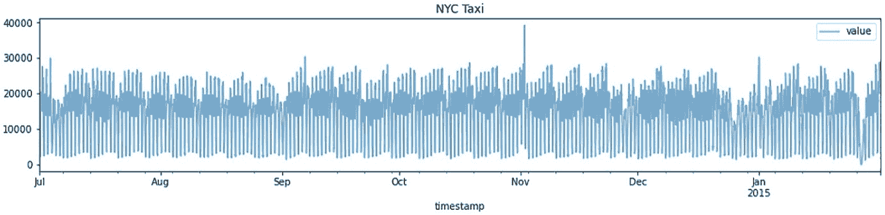

图 8.1：纽约市出租车时间序列数据的图示

最后，创建一个`plot_outliers`函数，你将在整个过程中使用该函数：

```py
def plot_outliers(outliers, data, method=‘KNN’,
                 halignment = ‘right’,
                 valignment = ‘bottom’,
                 labels=False):
    ax = data.plot(alpha=0.6)

    if labels:
        for I in outliers’'valu’'].items():
            plt.plot(i[0], i[1],’'r’')
            plt.text(i[0], i[1], ‘'{i[0].date()’',
                         horizontalalignment=halignment,
                         verticalalignment=valignment)
    else:
        data.loc[outliers.index].plot(ax=ax, style’'r’')

    plt.title(‘'NYC Taxi–- {method’')
    plt.xlabel’'dat’'); plt.ylabel’'# of passenger’')
    plt.legend(‘'nyc tax’'‘'outlier’'])
    plt.show()
```

随着我们推进异常值检测的步骤，目标是看看不同的技术如何捕捉异常值，并将其与真实标签进行比较。

## 理解异常值

异常值的存在需要特别处理和进一步调查，不能草率决定如何处理它们。首先，你需要检测并识别它们的存在，这一章正是讲解这个内容。领域知识在确定这些被识别为异常值的点、它们对分析的影响以及如何处理它们方面可以发挥重要作用。

异常值可能表示由于过程中的随机变化（称为噪声）、数据输入错误、传感器故障、实验问题或自然变异等原因导致的错误数据。如果异常值看起来像是人工合成的，通常是不希望看到的，例如错误数据。另一方面，如果异常值是过程中的自然一部分，你可能需要重新考虑是否删除它们，而选择保留这些数据点。在这种情况下，你可以依赖于**非参数**统计方法，这些方法不对底层分布做假设。

一般来说，异常值会在基于强假设的模型构建过程中引发副作用；例如，数据来自高斯（正态）分布。基于假设底层分布的统计方法和测试称为**参数方法**。

处理异常值没有固定的协议，异常值的影响程度会有所不同。例如，有时你可能需要分别在有异常值和没有异常值的情况下测试你的模型，以了解它们对分析的整体影响。换句话说，并非所有异常值都是相同的，也不应当一视同仁。然而，正如前面所述，拥有领域知识在处理这些异常值时至关重要。

现在，在使用数据集构建模型之前，你需要测试是否存在异常值，以便进一步调查它们的重要性。识别异常值通常是数据清洗和准备过程的一部分，之后才会深入进行分析。

处理异常值的常见方法是删除这些数据点，使它们不成为分析或模型开发的一部分。或者，你也可以希望使用*第七章，处理缺失数据*中提到的类似技术，如插补和插值，来替换异常值。其他方法，如平滑数据，可能有助于最小化异常值的影响。平滑方法，如指数平滑法，在*第十章，使用统计方法构建单变量时间序列模型*中有讨论。你也可以选择保留异常值，并使用对它们影响更为坚韧的算法。

有许多知名的异常值检测方法。该研究领域正在发展，范围从基本的统计技术到更先进的方法，利用神经网络和深度学习。在统计方法中，你可以使用不同的工具，例如可视化工具（箱型图、QQ 图、直方图和散点图）、z 分数、**四分位距**（**IQR**）和图基围栏，以及诸如 Grubbs 检验、Tietjen-Moore 检验或广义**极值学生化偏差**（**ESD**）检验等统计检验。这些方法是基本的、易于解释且有效的。

在你的第一个实例中，你将会在深入异常值检测之前，学习一个重要的时间序列转换技术——重采样。

## 重采样时间序列数据

在时间序列数据中，一个典型的转换操作是**重采样**。该过程意味着改变数据的频率或粒度水平。

通常，你对时间序列生成的频率控制有限。例如，数据可能在小的时间间隔内生成和存储，如毫秒、分钟或小时。在某些情况下，数据可能是按较大的时间间隔生成的，如按天、按周或按月。

对时间序列进行重采样的需求可能来源于你的分析性质以及数据需要达到的粒度级别。例如，你可以拥有按天记录的数据，但分析要求数据以周为单位，因此你需要进行重采样。这个过程称为**下采样**。进行下采样时，你需要提供某种聚合方式，如均值、总和、最小值或最大值等。另一方面，一些情况下需要将数据从每日重采样为每小时。这一过程称为**上采样**。在上采样时，可能会引入空值行，你可以使用插补或插值技术来填充这些空值。详见*第七章*，*处理缺失数据*，其中详细讨论了插补和插值方法。

在这个实例中，你将会使用`pandas`库来探索如何进行重采样。

### 如何操作……

在这个实例中，你将使用*技术要求*部分中早些时候创建的`nyc_taxis` DataFrame。该数据捕获了*30 分钟*间隔内的乘客数量。

1.  **下采样**数据至每日频率。当前，你有`10,320`条记录，当你将数据重采样至每日时，你需要对数据进行聚合。在这个例子中，你将使用`.mean()`函数。这将把样本数减少到 215 条记录。术语*下采样*表示样本数量减少，具体来说，我们正在减少数据的频率。

检查原始 DataFrame 的前五行：

```py
nyc_taxi.head()
>>
            value
timestamp   
2014-07-01 00:00:00    10844
2014-07-01 00:30:00    8127
2014-07-01 01:00:00    6210
2014-07-01 01:30:00    4656
2014-07-01 02:00:00    3820
```

重采样通过`DataFrame.resample()`函数来完成。对于按天重采样，你将使用`'D'`作为日期偏移规则，然后使用`.mean()`作为聚合方法：

```py
df_downsampled = nyc_taxi.resample('D').mean()
df_downsampled.head()
>>
            value
timestamp   
2014-07-01    15540.979167
2014-07-02    15284.166667
2014-07-03    14794.625000
2014-07-04    11511.770833
2014-07-05    11572.291667
```

请注意，现在`DatetimeIndex`的频率为每日频率，且乘客数量现在反映的是每日平均数。检查第一个`DatetimeIndex`以查看其频率：

```py
df_downsampled.index[0]
>>
Timestamp('2014-07-01 00:00:00', freq='D')
```

您还可以直接使用`.freq`属性检查频率：

```py
df_downsampled.index.freq
>>
<Day>
```

检查下采样后的记录数：

```py
df_downsampled.shape
>>
(215, 1)
```

事实上，您现在有`215`条记录。

1.  再次重采样`nyc_taxi`数据，这次使用 3 天频率。您可以使用偏移字符串`'3D'`来做到这一点。这次，请使用`.sum()`方法：

```py
df_downsampled = nyc_taxi.resample('3D').sum()
df_downsampled.head()
>>
            value
timestamp   
2014-07-01   15540.979167
2014-07-02   15284.166667
2014-07-03   14794.625000
2014-07-04   11511.770833
2014-07-05   11572.291667
```

检查`DatetimeIndex`的频率：

```py
df_downsampled.index.freq
>>
<3 * Days>
```

如果您使用`df_downsampled.shape`，您会注意到记录的数量减少到了 72 条。

1.  现在，将频率改为三（3）个工作日。`pandas`的默认值是从星期一到星期五。在*第六章，处理日期和时间*的*使用自定义工作日的技巧*中，您已经学习了如何创建自定义工作日。目前，您将使用默认的工作日定义。如果您查看上一步骤的输出，`2014-07-13`是星期天。使用`'3B'`作为`DateOffset`会将其推到下一个星期一，即`2014-07-14`：

```py
df_downsampled = nyc_taxi.resample('3B').sum()
df_downsampled.head()
>>
             value
timestamp   
2014-07-01  745967
2014-07-04  1996347
2014-07-09  3217427
2014-07-14  3747009
2014-07-17  2248113
```

有趣的输出显示，它跳过了从 2014-07-04 到 2014-07-09 的 5 天时间，然后又从 2014-07-09 跳到 2014-07-14。原因是*工作日规则*，它规定了我们有两（2）天作为周末。由于该函数是日历感知的，它知道在第一次 3 天的增量之后会有周末，所以它会加上 2 天的周末来跳过它们，从而形成了一个 5 天的跳跃。从 2014-07-04 开始，跳到 2014-07-09，然后从 2017-07-09 跳到 2017-07-14。类似的，从 2014-07-17 跳到 2014-07-22，依此类推。

1.  最后，让我们**上采样**数据，从 30 分钟间隔（频率）变为 15 分钟频率。这将会在每两个数据之间创建一个空条目（`NaN`）。您将使用偏移字符串`'T'`表示分钟，因为`'M'`用于按月聚合：

```py
df_upsampled = nyc_taxi.resample('15T').mean()
df_upsampled.head()
>>
                     value
timestamp   
2014-07-01 00:00:00    10844.0
2014-07-01 00:15:00    NaN
2014-07-01 00:30:00    8127.0
2014-07-01 00:45:00    NaN
2014-07-01 01:00:00    6210.0
```

请注意，上采样会创建`NaN`行。与*下采样*不同，在*上采样*时，您需要提供如何填充`NaN`行的说明。您可能会想知道为什么我们这里使用了`.mean()`？简单的答案是，无论您是使用`.sum()`、`.max()`还是`.min()`，例如，结果都不会有所不同。在*上采样*时，您需要使用插补或插值技术来填充缺失的行。例如，您可以使用`.fillna()`指定插补值，或者使用`.ffill()`或`.bfill()`方法：

```py
df_upsampled = nyc_taxi.resample('15T').ffill()
df_upsampled.head()
>>
                    value
timestamp   
2014-07-01 00:00:00    10844
2014-07-01 00:15:00    10844
2014-07-01 00:30:00    8127
2014-07-01 00:45:00    8127
2014-07-01 01:00:00    6210
```

前五条记录显示了使用前向填充的方法。如需更多关于使用`.fillna()`、`.bfill()`或`.ffill()`，或一般插补的相关信息，请参考*第七章，处理缺失数据*。

总体而言，pandas 中的重采样非常方便和直接。当您想要改变时间序列的频率时，这是一个很实用的工具。

### 它是如何工作的…

`DataFrame.resample()` 方法允许你在指定的时间框架内对行进行分组，例如按天、周、月、年或任何 DateTime 属性。`.resample()` 的工作原理是通过使用 `DatetimeIndex` 和提供的频率对数据进行分组，因此，此方法特定于时间序列 DataFrame。

`.resample()` 函数的工作方式与 `.groupby()` 函数非常相似；不同之处在于，`.resample()` 专门用于时间序列数据，并按 `DatetimeIndex` 进行分组。

### 还有更多...

在进行降采样时，你可以一次提供多个聚合操作，使用 `.agg()` 函数。

例如，使用`'M'`表示按月，你可以为 `.agg()` 函数提供一个你想要执行的聚合操作列表：

```py
nyc_taxi.resample('M').agg(['mean', 'min',
                            'max', 'median', 'sum'])
```

这应该生成一个包含五列的 DataFrame，每个聚合方法对应一列。索引列和`timestamp`列将按月进行分组：


图 8.2：使用 `.agg()` 方法进行多重聚合

请注意，`'M'` 或月频率的默认行为是在月末（例如 *2014-07-31*）。你也可以改为使用 `'MS'` 来设置为月初。例如，这将生成 *2014-07-01*（每月的第一天）。

### 另请参见

要了解更多关于 pandas `DataFrame.resample()` 的信息，请访问官方文档：[`pandas.pydata.org/docs/reference/api/pandas.DataFrame.resample.html`](https://pandas.pydata.org/docs/reference/api/pandas.DataFrame.resample.html)。

## 使用可视化方法检测异常值

使用统计技术检测异常值有两种常见方法：**参数性**方法和**非参数性**方法。**参数性**方法假设你知道数据的基础分布。例如，如果你的数据遵循正态分布。另一方面，**非参数性**方法则没有这样的假设。

使用直方图和箱型图是基本的非参数技术，可以提供数据分布和异常值存在的洞察。更具体地说，箱型图，也叫做 **箱线图**，提供了五个数值概述：*最小值*、*第一四分位数*（25 百分位数）、*中位数*（50 百分位数）、*第三四分位数*（75 百分位数）和 *最大值*。在箱线图中，须的扩展范围有不同的实现方式，例如，须可以延伸到 *最小值* 和 *最大值*。在大多数统计软件中，包括 Python 的 **matplotlib** 和 **seaborn** 库，须会延伸到所谓的 **Tukey's Lower and Upper Fences**。任何超出这些边界的数据点都被认为是潜在的异常值。在 *使用 Tukey 方法检测异常值* 这一配方中，你将深入了解实际的计算和实现。现在，让我们关注分析中的可视化部分。

在这个例子中，你将使用**seaborn**，这是另一个基于**matplotlib**的 Python 可视化库。

### 准备工作

你可以从 GitHub 仓库下载 Jupyter Notebook 和所需的数据集。请参考本章的*技术要求*部分。你将使用在*技术要求*部分中加载的 `nyc_taxi` 数据框。

你将使用 `seaborn` 版本 *0.11.2*，这是截至目前的最新版本。

要使用 `pip` 安装 `seaborn`，请使用以下命令：

```py
pip install seaborn
```

要使用 `conda` 安装 `seaborn`，请使用以下命令：

```py
conda install seaborn
```

### 如何操作...

在本例中，你将探索来自 `seaborn` 的不同图表，包括 `histplot()`、`displot()`、`boxplot()`、`boxenplot()` 和 `violinplot()`。

你会注意到，这些图表传达了相似的故事，但在视觉上，每个图表的呈现方式不同。最终，在调查数据时，你将对这些图表中的某些图表产生偏好，用于自己的分析：

1.  首先，导入 `seaborn` 库，开始探索这些图表如何帮助你检测异常值：

```py
Import seaborn as sns
sns.__version__
>> '0.13.1'
```

1.  回想一下*图 8.1*，`nyc_taxi` 数据框包含每 30 分钟记录的乘客数量。请记住，每个分析或调查都是独特的，因此你的方法应该与解决的问题相匹配。这也意味着你需要考虑数据准备方法，例如，确定需要对数据应用哪些转换。

对于本例，目标是找出哪些天存在异常观察值，而不是哪一天的哪个时间段，因此你将*重采样*数据以按天进行分析。你将首先使用 `mean` 聚合来**下采样**数据。尽管这样的转换会平滑数据，但由于 `mean` 对异常值敏感，因此你不会失去太多与查找异常值相关的细节。换句话说，如果某个特定时间段内存在极端异常值（一天有 48 个时间段），`mean` 仍然会保留这一信息。

在此步骤中，你将使用 `.resample()` 方法将数据下采样到每日频率，并使用 `‘D’` 作为偏移字符串。这将把观察值的数量从 `10,320` 减少到 `215`（即 `10320/48 = 215`）：

```py
tx = nyc_taxi.resample('D').mean()
```

1.  绘制新的 `tx` 数据框，并使用真实标签作为参考。你将调用你在*技术要求*部分中创建的 `plot_outliers` 函数：

```py
known_outliers= tx.loc[nyc_dates]
plot_outliers(known_outliers, tx, 'Known Outliers')
```

这应该会生成一个带有 `X` 标记的时间序列图，标记出已知的异常值。

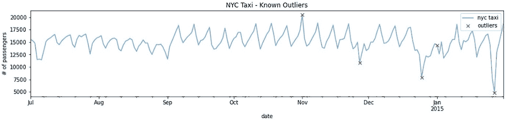

图 8.3：使用真实标签（异常值）对纽约出租车数据进行下采样后的绘图

1.  现在，让我们从第一个图开始，使用 `histplot()` 函数检查你的时间序列数据：

```py
sns.histplot(tx)
```

这应该会生成以下结果：

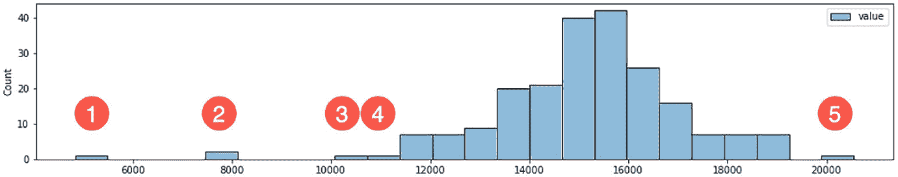

图 8.4：显示极端每日平均乘客乘车次数的直方图

在*图 8.4*中，标记为`1`、`2`、`3`、`4`和`5`的观测值似乎代表了极端的乘客数值。回想一下，这些数字表示的是重采样后的平均每日乘客数量。你需要问自己的是，这些观测值是否是离群值。直方图的中心接近 15,000 每日平均乘客数量。这应该让你质疑接近 20,000 的极端值（*标签* `5`）是否真的那么极端。类似地，标记为`3`和`4`的观测值（因为它们接近分布的尾部），它们是否真的是极端值？那么标记为`1`和`2`的观测值呢？它们的平均乘客数量分别为 3,000 和 8,000 每日乘客，似乎比其他值更极端，可能是实际的离群值。再一次，确定什么是离群值、什么不是离群值需要领域知识和进一步分析。没有具体的规则，你会发现在本章中，一些被普遍接受的规则实际上是任意的、主观的。你不应急于得出结论。

1.  你可以使用`displot()`绘制类似的图表，它具有一个`kind`参数。`kind`参数可以取三个值之一：`hist`表示直方图，`kde`表示核密度估计图，`ecdf`表示经验累积分布函数图。

你将使用`displot(kind='hist')`来绘制一个类似于*图 8.4*中的直方图：

```py
sns.displot(tx, kind='hist', height=3, aspect=4)
```

1.  箱型图提供的信息比直方图更多，可以更好地帮助识别离群值。在箱型图中，超出须状线或边界的观测值被认为是潜在的离群值。须状线表示上界和下界的视觉边界，这是数学家**约翰·图基**于 1977 年提出的。

以下代码展示了如何使用`seaborn`创建箱型图：

```py
sns.boxplot(tx['value'], orient='h')
```

以下图表显示了潜在的离群值：

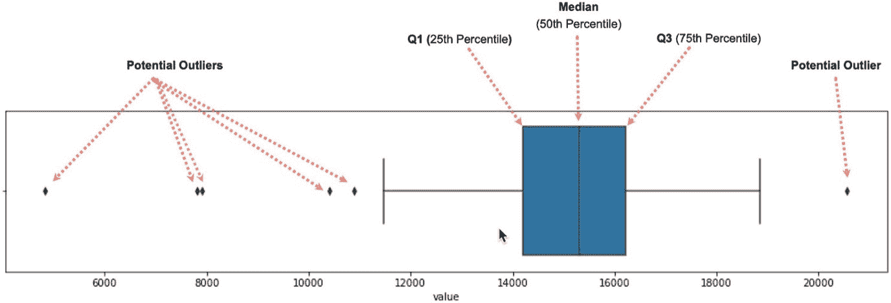

图 8.5：显示可能的离群值超出边界（须状线）的箱型图

箱体的宽度（**Q1**到**Q3**）称为**四分位数范围**（**IQR**），其计算方式为 75th 和 25th 百分位数的差值（**Q3** – **Q1**）。下边界的计算公式为`Q1 - (1.5 x IQR)`，上边界为`Q3 + (1.5 x IQR)`。任何小于下边界或大于上边界的观测值都被视为潜在的异常值。有关更多信息，请参阅*使用 Tukey 方法检测异常值*一文。`boxplot()`函数中的`whis`参数默认为`1.5`（1.5 倍 IQR），控制上下边界之间的宽度或距离。较大的值意味着较少的观测值会被视为异常值，而较小的值则会让非异常值看起来超出边界（更多的异常值）。

```py
sns.boxplot(tx['value'], orient='h', whis=1.5)
```

1.  **seaborn**中有两种额外的箱型图变种（`boxenplot()` 和 `violinplot()`）。它们提供与箱型图相似的见解，但呈现方式不同。*boxen 图*（在文献中称为*字母值*图）可以视为对常规箱型图的增强，旨在解决它们的一些不足之处，具体描述见论文*Heike Hofmann, Hadley Wickham & Karen Kafadar (2017) Letter-Value Plots: Boxplots for Large Data, Journal of Computational and Graphical Statistics, 26:3, 469-477*。更具体地说，boxen（字母值）图更适合用于处理较大数据集（用于显示数据分布的观测值较多，更适合区分较大数据集中的异常值）。`seaborn`实现的`boxenplot`基于该论文。

以下代码展示了如何使用`seaborn`创建 boxen（字母值）图：

```py
sns.boxenplot(tx['value'], orient='h')
```

这将生成类似于*图 8.5*中箱型图的图形，但箱体会延伸超出四分位数（**Q1**、**Q2**和**Q3**）。25th 百分位数位于 14,205 每日平均乘客数的位置，75th 百分位数位于 16,209 每日平均乘客数的位置。

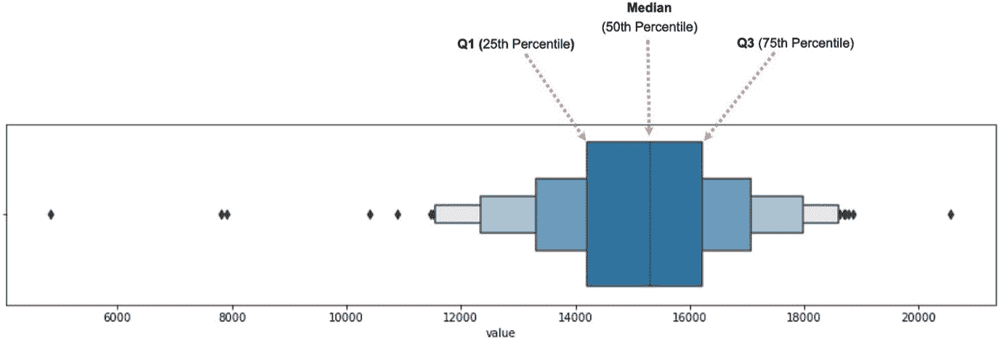

图 8.6：纽约市每日出租车乘客的 boxen（字母值）图

> 百分位值
> 
> > 你是否好奇我如何确定 25th、50th 和 75th 百分位的精确值？
> > 
> > 你可以通过`describe`方法为 DataFrame 或序列获取这些值。例如，如果你运行`tx.describe()`，你应该能看到一张描述性统计表，其中包括数据集的计数、均值、标准差、最小值、最大值、25th、50th 和 75th 百分位数值。

在*图 8.6*中，你可以获得超越分位数的乘客分布的额外洞察。换句话说，它扩展了箱形图以显示额外的分布，从而为数据的尾部提供更多的洞察。理论上，这些框可以一直延伸，以容纳所有数据点，但为了显示异常值，需要有一个停止点，这个点称为**深度**。在`seaborn`中，这个参数被称为`k_depth`，它可以接受一个数值，或者你可以指定不同的方法，如`tukey`、`proportion`、`trustworthy`或`full`。例如，`k_depth=1`的数值将显示与*图 8.5*中的箱形图相似的框（一个框）。作为参考，*图 8.6*显示了使用`Tukey`方法确定的四个框，这是默认值（`k_depth="tukey"`）。使用`k_depth=4`将产生相同的图形。

这些方法在*Heike Hofmann、Hadley Wickham & Karen Kafadar（2017）*的参考论文中有所解释。要探索不同的方法，你可以尝试以下代码：

```py
for k in ["tukey", "proportion", "trustworthy", "full"]:
    sns.boxenplot(tx['value'], orient='h', k_depth=k, orient='h')
    plt.title(k)
    plt.show()
```

这将产生四个图形；请注意，每种方法确定的框数不同。回顾一下，你也可以按数值指定`k_depth`：

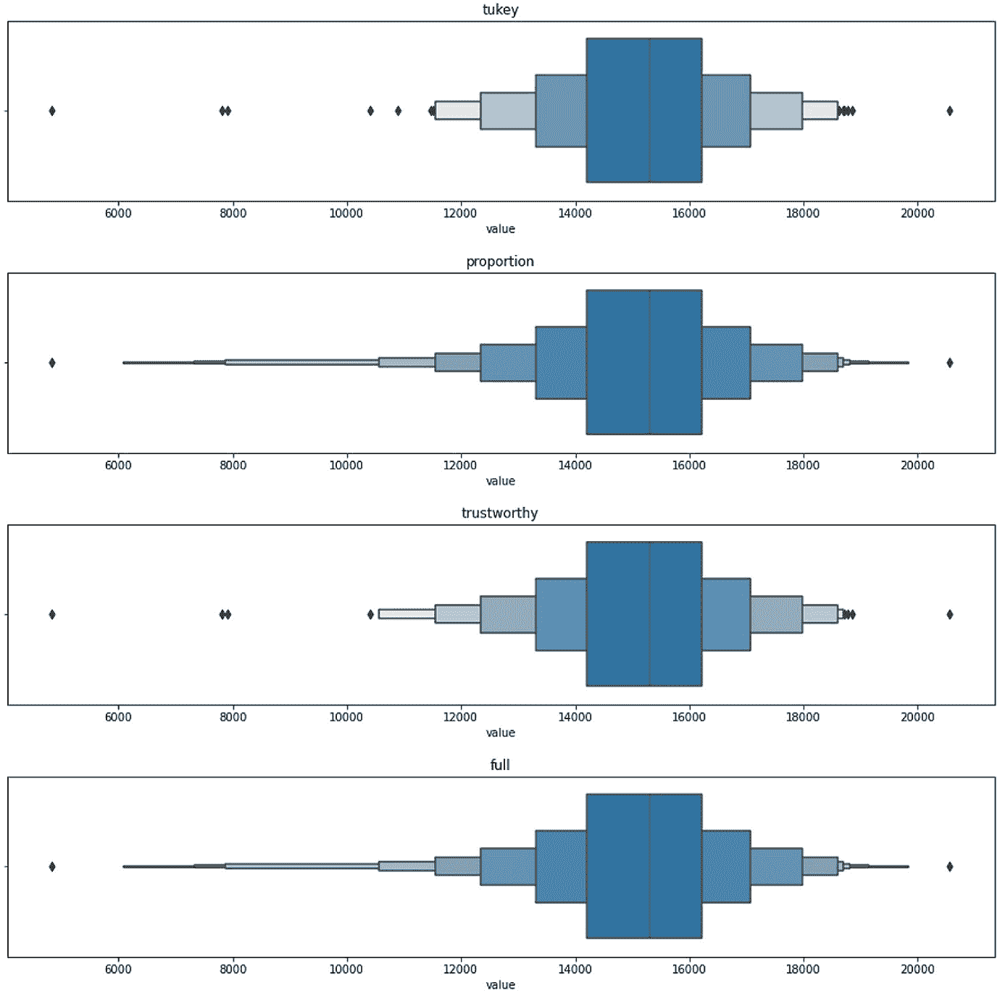

图 8.7：seaborn 中 boxenplot 函数可用的不同 k_depth 方法

1.  现在，最后的变体是提琴图，你可以使用`violinplot`函数来显示：

```py
sns.violinplot(tx['value'], orient='h')
```

这将产生一个介于箱形图和**核密度估计**（**KDE**）之间的混合图。核是一个估算概率密度函数的函数，较大的峰值（较宽的区域），例如，表示大多数点集中所在的区域。这意味着一个数据点出现在该区域的概率较高，而在较薄的区域，概率则较低。

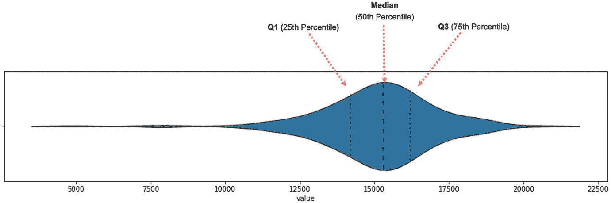

图 8.8：纽约市每日出租车乘客的提琴图

请注意，*图 8.8*显示了整个数据集的分布。另一个观察点是峰值的数量；在这种情况下，我们有一个峰值，这使得它成为一个单峰分布。如果有多个峰值，我们称之为多峰分布，这应该引发对数据的进一步调查。KDE 图将提供与直方图类似的洞察，但其曲线更加平滑。

### 它是如何工作的...

在本食谱中，我们介绍了几种图表，它们有助于可视化数据的分布并显示异常值。通常，直方图很适合显示分布，但箱形图（及其变体）在异常值检测方面要好得多。我们还探讨了箱线（字母值）图，它更适用于较大的数据集，比普通的箱形图更为合适。

### 还有更多...

在 **seaborn** 中，`histplot()` 和 `displot()` 都支持通过参数 `kde` 添加核密度估计（KDE）图。以下代码片段应该会生成一个相似的图形：

```py
sns.histplot(tx, kde=True)
sns.displot(tx, kind='hist', height=3, aspect=4, kde=True)
```

这应该会生成一个结合直方图和 KDE 图的图形，如下所示：

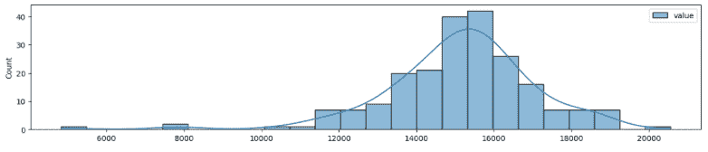

图 8.9：带有 KDE 图的直方图

此外，另一个有用的可视化方法用于发现异常值是 **滞后图**。滞后图本质上是一个散点图，但与绘制两个变量以观察相关性不同，举个例子，我们将同一变量与其滞后版本进行比较。这意味着，它是一个使用相同变量的散点图，但 *y* 轴表示当前时刻 (*t*) 的乘客数量，*x* 轴显示的是前一个时刻 (*t-1*) 的乘客数量，这被称为 **滞后**。滞后参数决定了回溯的周期数；例如，滞后 `1` 表示回溯一个周期，滞后 `2` 表示回溯两个周期。在我们的重采样数据（降采样至每日）中，滞后 `1` 代表前一天。

pandas 库提供了 `lag_plot` 函数，你可以像下面的示例所示使用它：

```py
from pandas.plotting import lag_plot
lag_plot(tx)
```

这应该会生成以下散点图：

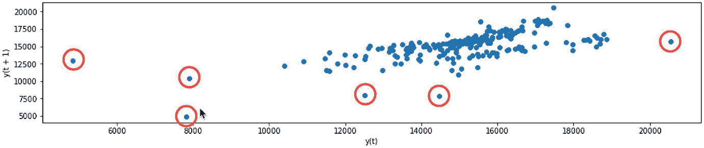

图 8.10：纽约市日均出租车乘客的滞后图

被圈出的数据点突出显示了可能的异常值。有些点看起来比其他点更加极端。此外，你还可以看到乘客数量与其滞后版本（前一天）的线性关系，表明存在自相关性。回顾基础统计学中的相关性，相关性显示了两个独立变量之间的关系，因此你可以把自相关看作是一个变量在某一时刻 (*t*) 和它在前一时刻 (*t-1*) 的版本之间的相关性。更多内容请参见 *第九章，探索性数据分析与诊断* 和 *第十章，使用统计方法构建单变量时间序列模型*。

在 *图 8.10* 中，*x* 轴和 *y* 轴的标签可能会有些混淆，*y 轴* 被标记为 *y(t+1)*。实际上，这表示了我们之前描述的同一个意思：*x* 轴表示的是先前的值（预测变量），而 *y* 轴表示的是它的未来值 *t+1*。为了更清晰地理解，你可以像下面的代码所示，手动使用 `seaborn` 重现 `lag_plot` 所生成的可视化效果：

```py
y = tx[1:].values.reshape(-1)
x = tx[:-1].values.reshape(-1)
sns.scatterplot(x=x, y=y)
```

这应该会生成一个与 *图 8.10* 相似的图形。

注意代码中，`y` 值从 *t+1* 开始（我们跳过了索引 `0` 处的值），直到最后一个观测值，而 `x` 值从索引 `0` 开始，到索引 `-1`（我们跳过了最后一个观测值）。这使得 *y* 轴上的值领先一个周期。

在下一个食谱中，我们将进一步探讨 **IQR** 和 **Tukey fences**，这两个概念我们在讨论箱形图时简要提到过。

### 另见

你可以通过`seaborn`文档了解我们使用的图表以及不同的选项。要了解更多信息，请访问相关网址：

+   对于箱型图（`boxplot`），你可以访问 [`seaborn.pydata.org/generated/seaborn.boxplot.html`](https://seaborn.pydata.org/generated/seaborn.boxplot.html)。

+   对于箱型图（`boxenplot`），你可以访问 [`seaborn.pydata.org/generated/seaborn.boxenplot.html`](https://seaborn.pydata.org/generated/seaborn.boxenplot.html)。

+   对于小提琴图（`violinplot`），你可以访问 [`seaborn.pydata.org/generated/seaborn.violinplot.html#seaborn.violinplot`](https://seaborn.pydata.org/generated/seaborn.violinplot.html#seaborn.violinplot)。

+   对于直方图（`histplot`），你可以访问 [`seaborn.pydata.org/generated/seaborn.histplot.html`](https://seaborn.pydata.org/generated/seaborn.histplot.html)。

+   对于分布图（`displot`），你可以访问 [`seaborn.pydata.org/generated/seaborn.displot.html#seaborn.displot`](https://seaborn.pydata.org/generated/seaborn.displot.html#seaborn.displot)。

## 使用 Tukey 方法检测异常值

这个示例将扩展前一个示例，*使用可视化检测异常值*。在*图 8.5*中，箱型图显示了四分位数，须状线延伸至上下边界。这些边界或围栏是使用 Tukey 方法计算得出的。

让我们在*图 8.5*的基础上，扩展一些其他组件的信息：

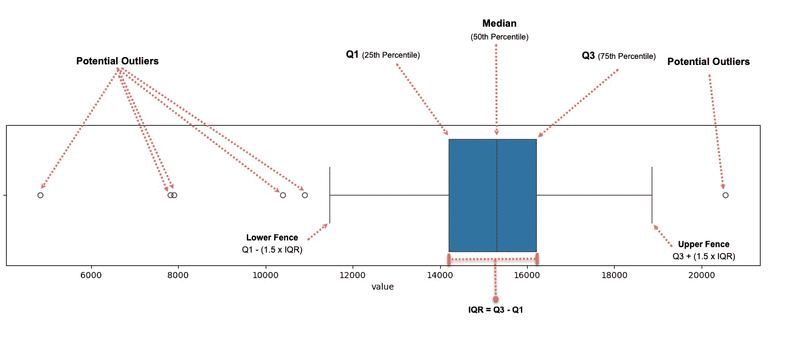

图 8.11：每日平均出租车乘客数据的箱型图

可视化图表非常有助于你对所处理数据的整体分布和潜在异常值有一个高层次的了解。最终，你需要通过编程识别这些异常值，以便隔离这些数据点，进行进一步的调查和分析。这个示例将教你如何计算 IQR，并定义落在 Tukey 围栏外的点。

### 如何操作...

大多数统计方法允许你发现超出某个阈值的极端值。例如，这个阈值可能是均值、标准差、第 10 或第 90 百分位数，或者其他你想要比较的值。你将通过学习如何获取基本的描述性统计量，特别是分位数，来开始这个示例。

1.  DataFrame 和 Series 都有`describe`方法，用于输出总结性描述性统计量。默认情况下，它显示四分位数：第一四分位数，即第 25 百分位数，第二四分位数（中位数），即第 50 百分位数，第三四分位数，即第 75 百分位数。你可以通过向`percentiles`参数提供一个值列表来定制百分位数。以下代码演示了如何获取额外百分位数的值：

```py
percentiles = [0, 0.05, .10, .25, .5, .75, .90, .95, 1]
tx.describe(percentiles= percentiles)
```

这应该生成以下 DataFrame：

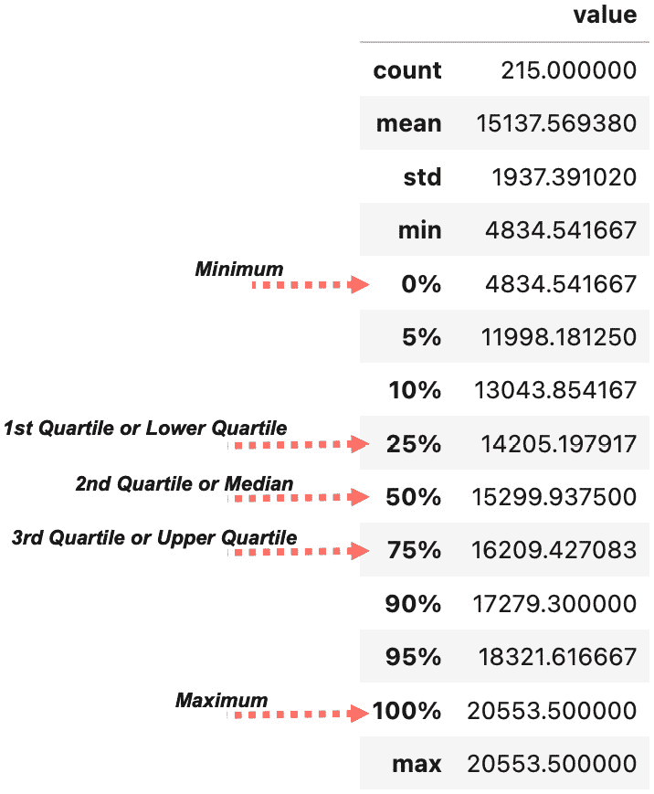

图 8.12：包含自定义百分位数的每日出租车乘客数据描述性统计

> 分位数与四分位数与百分位数
> 
> > 这些术语可能会让人混淆，但本质上，百分位数和四分位数都是分位数。有时你会看到人们更宽松地使用百分位数，并将其与分位数交替使用。
> > 
> > 四分位数将数据分为四个部分（因此得名），分别标记为*Q1*（第 25 百分位）、*Q2*（第 50 百分位或中位数）和*Q3*（第 75 百分位）。百分位数则可以取 0 到 100 之间的任何范围（在 pandas 中为 0 到 1，在 NumPy 中为 0 到 100），但最常见的是将数据分为 100 个部分。这些部分称为分位数。
> > 
> > 这些名称基本上表示应用于数据分布的分割类型（分位数的数量）；例如，四个分位数称为四分位数，两个分位数称为中位数，十个分位数称为十分位数，100 个分位数称为百分位数。

1.  NumPy 库还提供了`percentile`函数，该函数返回指定百分位数的值。以下代码解释了如何使用该函数：

```py
percentiles = [0, 5, 10, 25, 50, 75, 90, 95, 100]
np.percentile(tx, percentiles)
>>
array([ 4834.54166667, 11998.18125   , 13043.85416667, 14205.19791667,
       15299.9375    , 16209.42708333, 17279.3       , 18321.61666667,
       20553.5       ])
```

1.  在*图 8.11*中，注意到大多数极端值和潜在异常值位于低界限以下（低界限计算公式为`Q1 – (1.5 x IQR)`）或位于高界限以上（高界限计算公式为`Q3 + (1.5 x IQR)`）。IQR 是*Q3*与*Q1*的差值（`IQR = Q3 – Q1`），它决定了箱形图中箱体的宽度。这些上下界限被称为**Tukey 界限**，更具体地说，它们被称为**内界限**。**外界限**也有更低的`Q1 - (3.0 x IQR)`和更高的`Q3 + (3.0 x IQR)`界限。我们将重点关注内界限，并将任何超出这些界限的数据点视为潜在异常值。

你将创建一个名为`iqr_outliers`的函数，该函数计算 IQR、上界（内界限）、下界（内界限），然后过滤数据以返回异常值。这些异常值是任何低于下界或高于上界的数据点：

```py
def iqr_outliers(data):
    q1, q3 = np.percentile(data, [25, 75])
    IQR = q3 - q1
    lower_fence = q1 - (1.5 * IQR)
    upper_fence = q3 + (1.5 * IQR)
    return data[(data.value > upper_fence) | (data.value < lower_fence)]
```

1.  通过传递`tx`数据框来测试该函数：

```py
outliers = iqr_outliers(tx)
outliers
>>    
                  value
timestamp              
2014-11-01  20553.500000
2014-11-27  10899.666667
2014-12-25   7902.125000
2014-12-26  10397.958333
2015-01-26   7818.979167
2015-01-27   4834.541667 
```

这些日期（点）与*图 8.5*和*图 8.11*中根据 Tukey 界限识别的异常值相同。

1.  使用*技术要求*部分中定义的`plot_outliers`函数：

```py
plot_outliers(outliers, tx, "Outliers using IQR with Tukey's Fences")
```

这应生成类似于*图 8.3*中的图表，只不过`x`标记是基于 Tukey 方法识别的异常值：

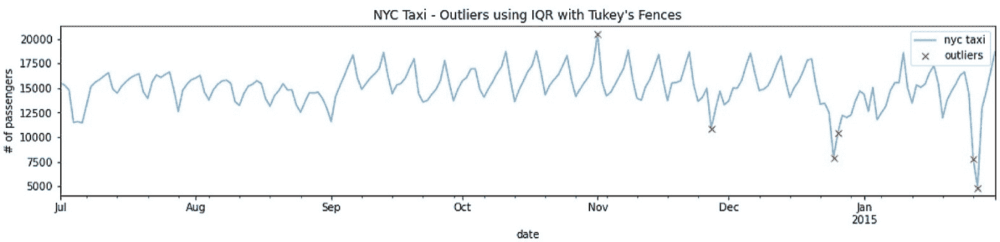

图 8.13：使用 Tukey 方法识别的每日平均出租车乘客数和异常值

比较*图 8.13*和*图 8.3*，你会看到这个简单的方法在识别已知的五个异常值中的四个方面做得非常好。此外，Tukey 方法还识别出了在*2014-12-26*和*2015-01-26*的两个额外的异常值。

### 它是如何工作的……

使用 IQR 和 Tukey’s fences 是一种简单的非参数统计方法。大多数箱线图实现使用 `1.5x(IQR)` 来定义上下界限。

### 还有更多……

使用 `1.5x(IQR)` 来定义异常值是很常见的；尽管有很多关于其理由的讨论，但这个选择仍然是任意的。你可以更改这个值进行更多实验。例如，在 `seaborn` 中，你可以通过更新 `boxplot` 函数中的 `whis` 参数来改变默认的 `1.5` 值。当数据符合高斯分布（正态分布）时，选择 `1.5` 是最有意义的，但这并不总是如此。一般来说，值越大，你捕获的异常值就越少，因为你扩展了边界（界限）。同样，值越小，更多的非异常值会被定义为异常值，因为你缩小了边界（界限）。

让我们更新 `iqr_outliers` 函数，接受一个 `p` 参数，这样你就可以尝试不同的值：

```py
def iqr_outliers(data, p):
    q1, q3 = np.percentile(data, [25, 75])
    IQR = q3 - q1
    lower_fence = q1 - (p * IQR)
    upper_fence = q3 + (p * IQR)
    return data[(data.value > upper_fence) | (data.value < lower_fence)]
```

在不同值上运行函数：

```py
for p in [1.3, 1.5, 2.0, 2.5,  3.0]:
    print(f'with p={p}')
    print(iqr_outliers(tx, p))
    print('-'*15)
>>
with p=1.3
                   value
timestamp              
2014-07-04  11511.770833
2014-07-05  11572.291667
2014-07-06  11464.270833
2014-09-01  11589.875000
2014-11-01  20553.500000
2014-11-08  18857.333333
2014-11-27  10899.666667
2014-12-25   7902.125000
2014-12-26  10397.958333
2015-01-26   7818.979167
2015-01-27   4834.541667
---------------
with p=1.5
                   value
timestamp              
2014-11-01  20553.500000
2014-11-27  10899.666667
2014-12-25   7902.125000
2014-12-26  10397.958333
2015-01-26   7818.979167
2015-01-27   4834.541667
---------------
with p=2.0
                   value
timestamp              
2014-11-01  20553.500000
2014-12-25   7902.125000
2015-01-26   7818.979167
2015-01-27   4834.541667
---------------
with p=2.5
                  value
timestamp             
2014-12-25  7902.125000
2015-01-26  7818.979167
2015-01-27  4834.541667
---------------
with p=3.0
                  value
timestamp             
2014-12-25  7902.125000
2015-01-26  7818.979167
2015-01-27  4834.541667
---------------
```

最佳值将取决于你的数据以及你需要多敏感的异常值检测。

### 另请参见

要了解更多关于 Tukey’s fences 用于异常值检测的内容，可以参考这个维基百科页面：[`en.wikipedia.org/wiki/Outlier#Tukey's_fences`](https://en.wikipedia.org/wiki/Outlier#Tukey's_fences)。

我们将在接下来的配方中探索另一种基于 z-score 的统计方法。

## 使用 z-score 检测异常值

**z-score** 是一种常见的数据标准化变换。当你需要比较不同的数据集时，这种方法非常常见。例如，比较来自两个不同数据集的两个数据点相对于它们的分布会更容易。之所以能做到这一点，是因为 z-score 将数据标准化，使其围绕零均值居中，并且单位表示的是偏离均值的标准差。例如，在我们的数据集中，单位是按日计的出租车乘客数量（以千人计）。一旦应用了 z-score 变换，你将不再处理乘客数量，而是单位表示的是标准差，这告诉我们一个观测值距离均值有多远。以下是 z-score 的公式：

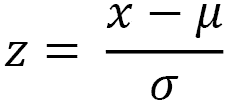其中 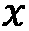 是一个数据点（观测值），mu (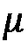) 是数据集的均值，sigma (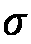) 是数据集的标准差。

请记住，z-score 是一种无损变换，这意味着你不会丢失诸如数据分布（数据形状）或观测之间关系的信息。唯一改变的是度量单位，它们正在被缩放（标准化）。

一旦使用 z-score 转换数据，您就可以选择一个阈值。所以，任何高于或低于该阈值的数据点（以标准差为单位）都被视为异常值。例如，您的阈值可以设置为离均值`+3`和`-3`标准差。任何低于`-3`或高于`+3`标准差的点可以视为异常值。换句话说，点离均值越远，它作为异常值的可能性就越大。

z-score 有一个主要的缺点，因为它是基于假设的参数统计方法。它假设数据服从高斯（正态）分布。那么，假设数据不是正态分布，您将需要使用修改版的 z-score，这将在下一个部分中讨论，*使用修改版 z-score 检测异常值*。

### 操作方法...

您将首先创建 `zscore` 函数，该函数接受一个数据集和一个阈值，我们称其为 `degree`。该函数将返回标准化后的数据和识别出的异常值。这些异常值是指任何高于正阈值或低于负阈值的点。

1.  创建 `zscore()` 函数来标准化数据，并根据阈值过滤掉极端值。请记住，阈值是基于标准差的：

```py
def zscore(df, degree=3):
    data = df.copy()
    data['zscore'] = (data - data.mean())/data.std()
    outliers = data[(data['zscore'] <= -degree) | (data['zscore'] >= degree)]

    return outliers['value'], data
```

1.  现在，使用 `zscore` 函数并存储返回的对象：

```py
threshold = 2.5
outliers, transformed = zscore(tx, threshold)
```

1.  要查看 z-score 转换的效果，您可以绘制一个直方图。转换后的 DataFrame 包含两列数据，原始数据标记为 `value`，标准化数据标记为 `zscore`：

```py
transformed.hist()
```

这应该会生成两个直方图，分别对应两列数据：

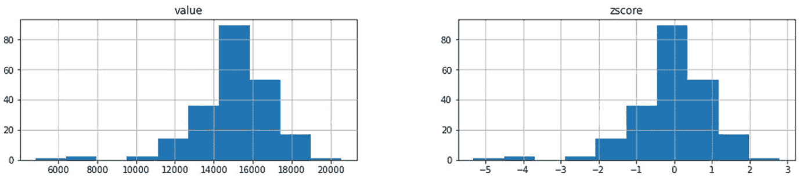

图 8.14：原始数据和标准化数据分布对比的直方图

注意数据的形状没有变化，这也是为什么 z-score 被称为 *无损转换* 的原因。两者唯一的区别是尺度（单位）。

1.  您使用阈值 `2.5` 运行了 `zscore` 函数，意味着任何与均值相距 2.5 标准差的数据点（无论正负方向）都将被视为异常值。例如，任何高于 `+2.5` 标准差或低于 `-2.5` 标准差的数据点都将被视为异常值。打印出捕获在 `outliers` 对象中的结果：

```py
print(outliers)
>>
timestamp
2014-11-01    20553.500000
2014-12-25     7902.125000
2015-01-26     7818.979167
2015-01-27     4834.541667
Name: value, dtype: float64
```

这种简单的方法成功地捕捉到了五个已知异常值中的三个。

1.  使用在 *技术要求* 部分中定义的 `plot_outliers` 函数：

```py
plot_outliers(outliers, tx, "Outliers using Z-score")
```

这应该会生成类似于 *图 8.3* 中的图形，只不过 `x` 标记是基于使用 z-score 方法识别的异常值：

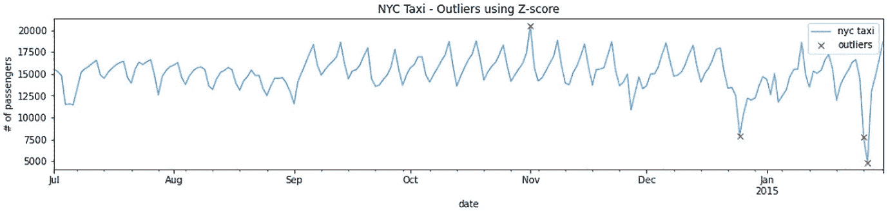

图 8.15：每日平均出租车乘客数和使用 z-score 方法识别的异常值

你需要多尝试几次，确定最佳阈值。阈值越大，你捕捉到的异常值就越少；阈值越小，更多的非异常值会被标记为异常值。

1.  最后，让我们创建一个`plot_zscore`函数，该函数接受标准化数据，并使用阈值线绘制数据。这样，你可以直观地看到阈值如何隔离极端值：

```py
def plot_zscore(data, d=3):
    n = len(data)
    plt.figure(figsize=(8,8))
    plt.plot(data,'k^')
    plt.plot([0,n],[d,d],'r--')
    plt.plot([0,n],[-d,-d],'r--')
```

使用阈值`2.5`运行该函数：

```py
data = transformed['zscore'].values
plot_zscore(data, d=2.5)
```

这应该生成一个包含两条水平线的散点图：

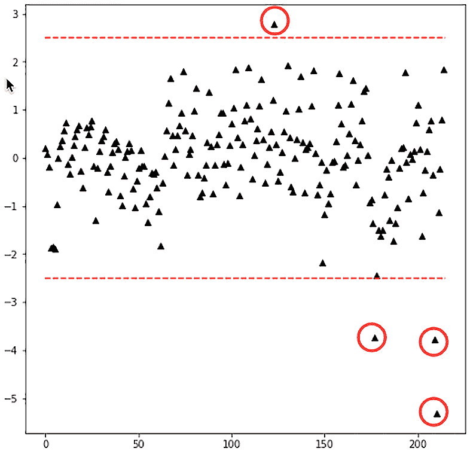

图 8.16：基于阈值线的标准化数据和异常值的图示

四个被圈出的数据点代表了`zscore`函数返回的异常值。使用不同的阈值运行该函数，以更深入理解这个简单的技术。

### 它是如何工作的...

z 分数方法是一种非常简单且易于解释的方法。z 分数被解释为与均值的标准差单位距离，均值是分布的中心。由于我们从所有观测值中减去均值，本质上是在进行数据的均值中心化。我们还通过标准差进行除法，以标准化数据。

*图 8.15*几乎解释了这种方法的理解。一旦数据被标准化，使用标准差阈值就变得非常容易。如果数据没有标准化，可能很难基于日常乘客量来确定阈值。

### 还有更多...

z 分数是一种参数化方法，假设数据来自高斯（正态）分布。`statsmodels`库中有几种测试可以检测数据是否符合正态分布。这些测试中的一个是*Kolmogorov-Smirnov*检验。零假设是数据来自正态分布。该检验返回检验统计量和`p`值；如果`p`值小于`0.05`，你可以拒绝零假设（数据不服从正态分布）。否则，你将无法拒绝零假设（数据服从正态分布）。

你将使用来自`statsmodels`库的`kstest_normal`函数。为了让结果更易于解释，创建`test_normal`函数如下：

```py
from statsmodels.stats.diagnostic import kstest_normal
def test_normal(df):
    t_test, p_value = kstest_normal(df)
    if p_value < 0.05:
        print("Reject null hypothesis. Data is not normal")
    else:
        print("Fail to reject null hypothesis. Data is normal")
```

使用`test_normal`函数运行检验：

```py
test_normal(tx)
>>
Reject null hypothesis. Data is not normal
```

正如预期的那样，该数据集不符合正态分布。在第九章《探索性数据分析与诊断》中，你将学习更多的正态性检验方法，具体内容在应用幂次变换配方中。但是要小心，这些检验通常在存在异常值时会失败。如果你的数据未通过正态性检验，那么可以使用《使用可视化检测异常值》一节中讨论的一些绘图方法，检查任何可能导致检验失败的异常值。

### 另请参见

要了解更多关于 z-score 和标准化的内容，可以参考这篇维基百科页面：[`en.wikipedia.org/wiki/Standard_score`](https://en.wikipedia.org/wiki/Standard_score)。

在接下来的方法中，你将探索一种与 z-score 非常相似的方法，这种方法对异常值更为鲁棒，并且更适合非正态数据。

## 使用修改版 z-score 检测异常值

在*使用 z-score 检测异常值*这一方法中，你体验了该方法的简单性和直观性。但是它有一个主要缺点：假设你的数据是正态分布的。

但是，如果你的数据不是正态分布的怎么办？幸运的是，存在一种修改版的 z-score，适用于非正态数据。常规 z-score 和修改版 z-score 之间的主要区别在于，我们用中位数代替均值：

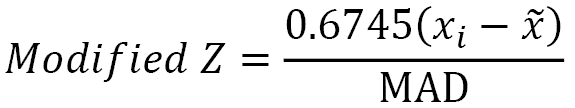其中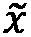(*tilde x*)是数据集的中位数，MAD 是数据集的中位绝对偏差：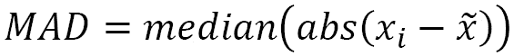

`0.6745`值是标准差单位，表示高斯分布中第 75 百分位数（*Q3*），用于作为归一化因子。换句话说，它用于近似标准差。这样，你从该方法中获得的单位是以标准差为度量的，类似于你如何解释常规 z-score。

你可以使用 SciPy 的**百分位点函数**（**PPF**），也称为**累积分布函数**（**CDF**）的反函数，来获得此值。只需为 PPF 函数提供一个百分位数，例如 75%，它将返回对应的下尾概率的分位数。

```py
import scipy.stats as stats
stats.norm.ppf(0.75)
>>
0.6744897501960817
```

这是公式中使用的归一化因子。

最后，修改版 z-score 有时也被称为**鲁棒 z-score**。

### 如何实现...

总体而言，该方法的工作原理与使用常规 z-score 方法时的步骤完全相同。你将首先创建`modified_zscore`函数，该函数接收一个数据集和一个我们称之为`degree`的阈值，然后该函数将返回标准化后的数据以及识别出的异常值。这些异常值是指超出正阈值或低于负阈值的点。

1.  创建`modified_zscore` `()`函数来标准化数据，并根据阈值过滤掉极端值。回想一下，阈值是基于标准差的：

```py
def modified_zscore(df, degree=3):
    data = df.copy()
    s = stats.norm.ppf(0.75)
    numerator = s*(data - data.median())
    MAD = np.abs(data - data.median()).median()
    data['m_zscore'] = numerator/MAD
    outliers = data[(data['m_zscore'] > degree) | (data['m_zscore'] < -degree)]

    return outliers['value'], data 
```

1.  现在，使用`modified_zscore`函数并存储返回的对象：

```py
threshold = 3
outliers, transformed = modified_zscore (tx, threshold)
```

1.  为了查看修改版 z-score 转换的效果，让我们绘制一个直方图。转换后的 DataFrame 包含两列数据，原始数据列标为`value`，标准化数据列标为`zscore`。

```py
transformed.hist()
```

这应该会生成两个直方图，分别对应两列数据：

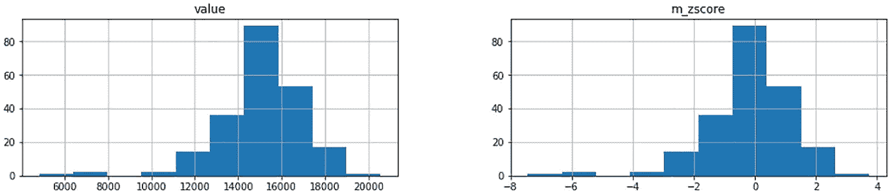

图 8.17：比较原始和修改版 z-score 标准化数据分布的直方图

比较*图 8.16*与*图 8.13*中的结果。两种方法，z-score 和修改后的 z-score 方法，都没有改变数据的形状。不同之处在于缩放因子。

1.  使用`modified_zscore`函数，设置阈值为`3`，这意味着任何数据点距离中位数三倍标准差的距离（无论方向如何）都会被视为异常值。例如，任何高于`+3`标准差或低于`-3`标准差的数据点都将被视为异常值。打印出`outliers`对象中捕获的结果：

```py
print(outliers)
>>
timestamp
2014-11-01    20553.500000
2014-11-27    10899.666667
2014-12-25     7902.125000
2014-12-26    10397.958333
2015-01-26     7818.979167
2015-01-27     4834.541667
Name: value, dtype: float64
```

有趣的是，修改后的 z-score 在捕捉五个已知异常值中的四个时表现得更好。

1.  使用前面在*技术要求*部分定义的`plot_outliers`函数：

```py
plot_outliers(outliers, tx, "Outliers using Modified  Z-score")
```

这应该会生成类似于*图 8.3*中的图表，只不过**x**标记是基于使用修改后的 z-score 方法识别的异常值：

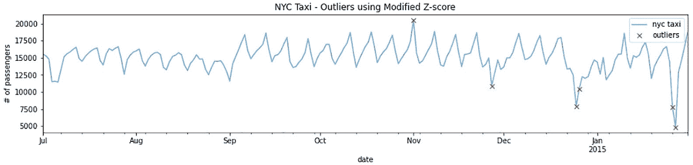

图 8.18：使用修改后的 z-score 方法识别的每日平均出租车乘客及异常值

你需要调整阈值来确定最佳值。阈值越大，你捕获的异常值就越少；阈值越小，更多的非异常值会被标记为异常值。

1.  最后，让我们创建一个`plot_m_zscore`函数，接受标准化数据并绘制带有阈值线的数据。通过这种方式，你可以直观地看到阈值如何隔离极端值：

```py
def plot_m_zscore(data, d=3):
    n = len(data)
    plt.figure(figsize=(8,8))
    plt.plot(data,'k^')
    plt.plot([0,n],[d,d],'r--')
    plt.plot([0,n],[-d,-d],'r--')
```

使用阈值为`3`来运行该函数：

```py
data = transformed['m_zscore'].values
plot_m_zscore(data, d=3)
```

这应该会生成一个带有两条水平线的散点图：

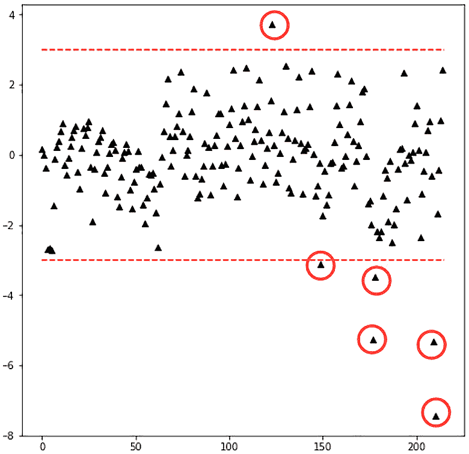

图 8.19：基于阈值线的标准化数据和异常值的图

六个圈中的数据点代表了由`modified_score`函数返回的异常值。使用不同的阈值运行此函数，以便对这种简单的技术有更深的直觉理解。

注意在*图 8.19*中，我们有一个数据点正好位于阈值线处。你认为这是异常值吗？通常，异常值检测时，你仍然需要进行尽职调查来检查结果。

### 它是如何工作的...

修改后的 z-score（稳健 z-score）方法与 z-score 方法非常相似，因为它依赖于定义标准差阈值。使得这种方法对异常值更加稳健的是它使用了中位数而不是均值。我们还使用了**中位数绝对偏差**（**MAD**）来代替标准差。

### 还有更多...

在前一个配方中，*使用 z-score 检测异常值*，我们使用了`statsmodels`中的`kstest_normal`来测试正态性。

另一个有用的图形是专门用来测试正态性并且有时可以帮助检测异常值的**分位数-分位数图**（**QQ 图**）。

你可以使用 SciPy 或 `statsmodels` 绘制 QQ 图。两者都会生成相同的图。以下代码展示了你如何使用其中任何一个绘图。

这展示了如何使用 SciPy 绘图：

```py
import scipy
import matplotlib.pyplot as plt
res = scipy.stats.probplot(tx.values.reshape(-1), plot=plt)
```

这展示了如何使用`statsmodels`绘图：

```py
from statsmodels.graphics.gofplots import qqplot
qqplot(tx.values.reshape(-1), line='s')
plt.show()
```

无论是 SciPy 还是`statsmodels`，都会生成以下图形：

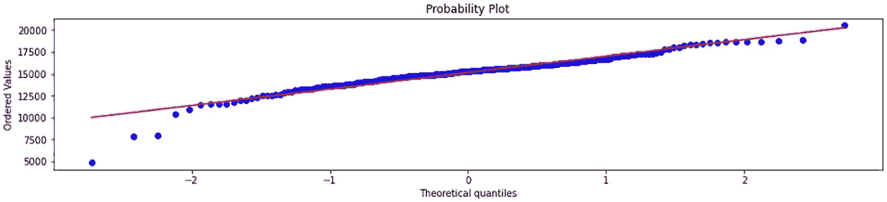

图 8.20：QQ 图，比较出租车乘客数据与假设的正态分布

实线代表正态分布数据的参考线。如果你比较的数据是正态分布的，所有数据点将会落在这条直线上。在*图 8.19*中，我们可以看到分布几乎是正态的（虽然不完美），并且在分布的尾部存在一些问题。这与我们在*图 8.16*和*图 8.13*中看到的情况一致，显示大多数异常值位于底部尾部（低于`-2`标准差）。

### 另见

若想了解更多关于 MAD 的信息，你可以参考维基百科页面：[`en.wikipedia.org/wiki/Median_absolute_deviation`](https://en.wikipedia.org/wiki/Median_absolute_deviation)。
