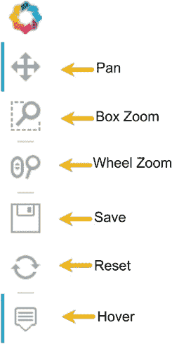
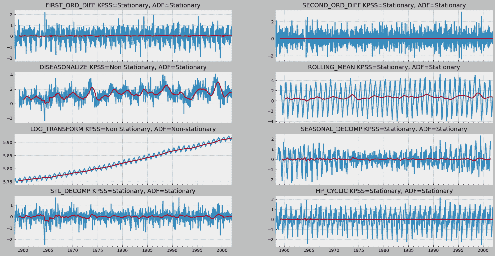

# 第九章：9 探索性数据分析与诊断

## 加入我们在 Discord 上的书籍社区


[`packt.link/zmkOY`](https://packt.link/zmkOY)

到目前为止，我们已经涵盖了从不同来源提取数据的技术。这些内容在*第二章*，*从文件读取时间序列数据*和*第三章*，*从数据库读取时间序列数据*中已经讨论过了。*第六章*，*在 Python 中处理日期和时间*，以及*第七章*，*处理缺失数据*，介绍了几种有助于准备、清理和调整数据的技术。

你将继续探索额外的技术，以便更好地理解数据背后的时间序列过程。在建模数据或进行进一步分析之前，一个重要步骤是检查手头的数据。更具体地说，你需要检查一些特定的时间序列特征，如平稳性、趋势和季节性的影响、以及自相关等。这些描述你所处理的时间序列过程的特征需要与该过程背后的领域知识相结合。

本章将建立在你从前几章学到的知识基础上，帮助你为从*第十章*开始创建和评估预测模型做准备，*构建单变量时间序列模型（使用统计方法）*。

在本章中，你将学习如何可视化时间序列数据，如何将时间序列分解为其组成部分（趋势、季节性和残差随机过程），如何检验模型可能依赖的不同假设（如平稳性、正态性和同方差性），以及如何探索数据转换技术以满足其中的一些假设。

本章中你将遇到的食谱如下：

+   使用 pandas 绘制时间序列数据

+   使用 hvPlot 绘制交互式时间序列数据

+   分解时间序列数据

+   检测时间序列的平稳性

+   应用幂次变换

+   测试时间序列数据的自相关性

## 技术要求

你可以从 GitHub 仓库下载所需的 Jupyter 笔记本和数据集，进行跟随学习：

+   Jupyter 笔记本： [`github.com/PacktPublishing/Time-Series-Analysis-with-Python-Cookbook./blob/main/code/Ch9/Chapter%209.ipynb`](https://github.com/PacktPublishing/Time-Series-Analysis-with-Python-Cookbook./blob/main/code/Ch9/Chapter%209.ipynb)

+   数据集： `github.com/PacktPublishing/Time-Series-Analysis-with-Python-Cookbook./tree/main/datasets/Ch9`

从本章起，我们将广泛使用 pandas 2.2.0（2024 年 1 月 20 日发布）。这适用于本章中的所有食谱。

我们将使用四个额外的库：

+   `hvplot` 和 `PyViz`

+   `seaborn`

+   `matplotlib`

如果你使用的是`pip`，你可以通过终端安装这些包，命令如下：

```py
pip install hvplot seaborn matplotlib jupyterlab
```

如果你使用的是`conda`，你可以通过以下命令安装这些包：

```py
conda install jupyterlab matplotlib seaborn
conda install -c pyviz hvplot
```

**HvPlot** 库将用于在 JupyterLab 中构建交互式可视化。如果你使用的是最新版本的 **JupyterLab**（`jupyterlab >= 3.0`），那么所有所需的扩展都会自动安装，因为它们已经捆绑在 `pyviz_comms` 包中。如果你使用的是较旧版本的 JupyterLab（`jupyterlab < 3.0`），那么你需要手动安装 `jupyterlab_pyviz` 扩展，具体步骤如下：

```py
jupyter labextension install @pyviz/jupyterlab_pyviz
```

在本章中，你将使用三个数据集（`Closing Price Stock Data`、`CO2` 和 `Air Passengers`）。CO2 和 Air Passengers 数据集由 `statsmodels` 库提供。Air Passengers 数据集包含了 1949 年至 1960 年的每月航空乘客人数。CO2 数据集包含了 1958 年至 2001 年间，位于毛纳罗亚山的每周大气二氧化碳浓度。Closing Price Stock Data 数据集包括 2019 年 11 月到 2021 年 11 月的微软、苹果和 IBM 的股票价格。

为了开始，你需要加载数据集，并将其存储为 pandas DataFrame，并加载在整个过程中需要的任何库或方法：

```py
import pandas as pd
from pathlib import Path
import matplotlib.pyplot as plt
from statsmodels.datasets import co2, get_rdataset
file = Path(‘../../datasets/Ch9/closing_price.csv’)
closing_price = pd.read_csv(file,
                            index_col=‘Date’,
                            parse_dates=True)
co2_df = co2.load_pandas().data
co2_df = co2_df.ffill()
air_passengers = get_rdataset(“AirPassengers”)
airp_df = air_passengers.data
airp_df.index = pd.date_range(‘1949’, ‘1961’, freq=‘M’)
airp_df.drop(columns=[‘time’], inplace=True)
```

现在，你应该已经有了三个数据框：`airp_df`、`closing_price` 和 `co2_df`。

## 使用 pandas 绘制时间序列数据

可视化是数据分析中的一个关键方面，尤其在处理时间序列数据时显得尤为重要。在前面的章节和示例中，你已经遇到过多次绘制数据的实例，这些实例对于突出特定点或得出关于时间序列的结论至关重要。可视化我们的时间序列数据使我们能够一眼识别出模式、趋势、异常值以及其他关键信息。此外，数据可视化有助于跨不同小组之间的沟通，并通过提供一个共同的平台促进各利益相关方（如商业专家和数据科学家）之间的建设性对话。

在时间序列分析以及机器学习领域，我们在探索性数据分析（EDA）中优先可视化数据，以全面理解我们正在处理的数据。在评估模型时，我们也依赖于可视化来比较它们的表现，并识别需要改进的地方。可视化在模型可解释性方面发挥着关键作用，使利益相关者能够理解模型如何进行预测。此外，在部署模型后，我们依赖可视化进行持续监控，寻找任何性能下降的迹象，如模型漂移。

pandas 库提供了内置的绘图功能，用于可视化存储在 DataFrame 或 Series 数据结构中的数据。在后台，这些可视化由 **Matplotlib** 库支持，后者也是默认选项。

pandas 库提供了许多方便的绘图方法。简单调用 `DataFrame.plot()` 或 `Series.plot()` 默认将生成折线图。你可以通过两种方式更改图表的类型：

+   使用`plot`方法中的`kind`参数，如`.plot(kind=`<charttype>`)`，通过替换`<charttype>`为图表类型来指定绘图类型。例如，`.plot(kind=“hist”)`将绘制一个直方图，而`.plot(kind=“bar”)`将绘制柱状图。

+   或者，你可以扩展`plot`方法。这可以通过链式调用特定的绘图函数来实现，例如`.hist()`或`.scatter()`，比如使用`.plot.hist()`或`.plot.line()`。

本配方将使用标准的 pandas `.plot()` 方法，并支持 Matplotlib 后端。

### 准备工作

你可以从 GitHub 仓库下载所需的 Jupyter 笔记本和数据集。请参考本章节的*技术要求*部分。

你将使用 Microsoft、Apple 和 IBM 的`Closing Price Stock`数据集，数据文件为`closing_price.csv`。

### 如何操作…

在这个配方中，你将探索如何绘制时间序列数据、改变主题、生成子图以及自定义输出的可视化效果：

1.  在 pandas 中绘图可以通过简单地在 DataFrame 或 Series 名称后添加`.plot()`来实现：

```py
closing_price.plot();
```

这将生成一张线性图，它是`kind`参数的默认选项，类似于`.plot(kind=“line”)`：


图 9.1：使用 pandas 绘制的多线时间序列图

你可以通过添加标题、更新轴标签以及自定义 *x* 和 *y* 轴刻度等方式进一步自定义图表。例如，添加标题和更新 y 轴标签，可以使用`title`和`ylabel`参数，如下所示：

```py
start_date = ‘2019’
end_date = ‘2021’
closing_price.plot(
          title=f’Closing Prices from {start_date} – {end_date}’,
          ylabel= ‘Closing Price’);
```

1.  如果你想看看价格之间的波动（上下浮动），一种简单的方法是**标准化**数据。为此，只需将每个股票的股价除以第一天的价格（第一行）。这将使所有股票具有相同的起点：

```py
closing_price_n = closing_price.div(closing_price.iloc[0])
closing_price_n.plot(
            title=f’Closing Prices from {start_date} – {end_date}’,
            ylabel= ‘Normalized Closing Price’);
```

这将生成如下图表：


图 9.2：使用简单的标准化技术，使得价格波动更加直观易比对

从输出中可以观察到，现在这些线条的起点（原点）已经设置为`1`。图表显示了时间序列图中价格之间的偏差：

```py
closing_price_n.head()
```

请注意，输出表格的第一行已设置为`1.0`：


图 9.3：标准化时间序列输出，所有序列的起点为 1

1.  此外，Matplotlib 允许你更改图表的样式。为此，你可以使用`style.use()`函数。你可以从现有模板中指定一个样式名称，或者使用自定义样式。例如，以下代码展示了如何从`default`样式切换到`ggplot`样式：

```py
plt.style.use('ggplot')
closing_price_n.plot(
          title=f'Closing Prices from {start_date} - {end_date}',
          ylabel= 'Normalized Closing Price');
```

前面的代码应该生成相同数据内容的图表，但样式有所不同。


图 9.4：使用来自 Matplotlib 的 ggplot 风格

`ggplot` 风格的灵感来自于 **R** 中的 `ggplot2` 包。

您可以探索其他吸引人的样式：`fivethirtyeight`，灵感来自 **fivethirtyeight.com**，`dark_background`，`dark-background`，和 `tableau-colorblind10`。

要查看可用的样式表的完整列表，您可以参考 Matplotlib 文档：[`matplotlib.org/stable/gallery/style_sheets/style_sheets_reference.html`](https://matplotlib.org/stable/gallery/style_sheets/style_sheets_reference.html)

如果您想恢复到原始主题，可以指定 `plt.style.use("default")`。

1.  您可以将您的图表保存为 jpeg、png、svg 或其他文件类型。例如，您可以使用 `.savefig()` 方法将文件保存为 `plot_1.jpg` 文件，并指定更高的 dpi 分辨率以保证打印质量。默认的 dpi 值为 100：

```py
plot = closing_price_n.plot(
            title=f'Closing Prices from {start_date} - {end_date}',
            ylabel= 'Norm. Price')
plot.get_figure().savefig('plot_1.jpg', dpi=300)
```

图表应作为 `plot_1.jpg` 图像文件保存在您的本地目录中。

### 它是如何工作的……

pandas 和 Matplotlib 库之间的协作非常好，双方有着集成并在 pandas 中增加更多绘图功能的雄心。

在 pandas 中，您可以通过向 `kind` 参数提供一个值来使用多种绘图样式。例如，您可以指定以下内容：

+   `line` 用于常用于展示时间序列的折线图

+   `bar` 或 `barh`（水平）用于条形图

+   `hist` 用于直方图

+   `box` 用于箱形图

+   `kde` 或 `density` 用于核密度估计图

+   `area` 用于面积图

+   `pie` 用于饼图

+   `scatter` 用于散点图

+   `hexbin` 用于六边形图

### 还有更多……

如前一节所示，我们将时间序列中的所有三列绘制在一个图中（同一图中的三条线图）。如果您希望每个符号（列）单独绘制呢？

这可以通过简单地将 `subplots` 参数设置为 `True` 来完成：

```py
closing_price.plot(
           subplots=True,
           title=f'Closing Prices from {start_date} - {end_date}');
```

上述代码将在 DataFrame 中为每一列生成一个子图。使用 `closing_price` DataFrame，这将生成三个子图。


图 9.5：使用 pandas 子图功能

### 另见

若要了解更多有关 pandas 绘图和可视化的功能，请访问官方文档：[`pandas.pydata.org/pandas-docs/stable/user_guide/visualization.html`](https://pandas.pydata.org/pandas-docs/stable/user_guide/visualization.html)

## 使用 hvPlot 绘制时间序列数据并进行交互式可视化

交互式可视化比静态图像更高效地分析数据。简单的交互，例如放大缩小或切片操作，可以揭示出更多有价值的见解，供进一步调查。

在本食谱中，我们将探索 **hvPlot** 库来创建交互式可视化。HvPlot 提供了一个高级 API 用于数据可视化，并且与多种数据源无缝集成，包括 pandas、Xarray、Dask、Polars、NetworkX、Streamlit 和 GeoPandas。利用 hvPlot 和 pandas 渲染交互式可视化需要最少的工作量，只需对原始代码做少量修改，就能创建动态可视化。我们将使用 'closing_price.csv' 数据集来探索该库在本食谱中的应用。

### 准备工作

你可以从 GitHub 仓库下载所需的 Jupyter 笔记本和数据集。请参阅本章的 *技术要求* 部分。

### 如何操作…

1.  首先导入所需的库。注意，hvPlot 有一个 pandas 扩展，使得使用更为方便。这将允许你使用与前面示例相同的语法：

```py
import pandas as pd
import hvplot.pandas
import hvplot as hv
closing_price_n = closing_price.div(closing_price.iloc[0])
```

使用 pandas 绘图时，你会使用 `.plot()` 方法，例如，`closing_price_n.plot()`。类似地，hvPlot 允许你通过将 `.plot()` 替换为 `.hvplot()` 来渲染交互式图表。如果你有内容密集的图表，这非常有用。你可以缩放到图表的特定部分，然后使用平移功能移动到图表的不同部分：

```py
closing_price_n.hvplot(
    title=f'Closing Prices from {start_date} - {end_date}')
```

通过将 `.plot` 替换为 `.hvplot`，你可以获得一个带有悬停效果的交互式可视化：


图 9.6：hvPlot 交互式可视化

同样的结果可以通过简单地切换 pandas 绘图后端来实现。默认后端是 `matplotlib`。要切换到 hvPlot，只需更新 `backend='hvplot'`：

```py
closing_price_n.plot(
    backend='hvplot',
    title=f'Closing Prices from {start_date} - {end_date}'
)
```

这应该会生成与*图 9.6*相同的图表。

注意右侧的小部件栏，其中包含一组交互模式，包括平移、框选缩放、滚轮缩放、保存、重置和悬停。



图 9.7：带有六种交互模式的小部件栏

1.  你可以将每个时间序列按符号（列）分割成独立的图表。例如，将数据分为三列，每列对应一个符号（或股票代码）：MSFT、AAPL 和 IBM。**子图**可以通过指定 `subplots=True` 来完成：

```py
closing_price.hvplot(width=300, subplots=True)
```

这应该会生成每列一个子图：


图 9.8：hvPlot 子图示例

你可以使用 `.cols()` 方法来更精确地控制布局。该方法允许你控制每行显示的图表数量。例如，`.cols(1)` 表示每行一个图表，而 `.cols(2)` 表示每行两个图表：

```py
closing_price.hvplot(width=300, subplots=True).cols(2)
```

这应该会生成一个图表，第一行有两个子图，第二行有第三个子图，如下所示：


图 9.9：使用 .col(2) 每行两个列的示例 hvPlot

请记住，`.cols()` 方法仅在 `subplots` 参数设置为 `True` 时有效，否则会导致错误。

### 工作原理…

由于 pandas 被广泛使用，许多库现在都支持将 pandas DataFrame 和 Series 作为输入。此外，Matplotlib 和 hvPlot 之间的集成简化了与 pandas 一起使用的绘图引擎的更换过程。

HvPlot 提供了几种方便的选项来绘制你的 DataFrame：你可以轻松切换后端，使用 `DataFrame.hvplot()` 扩展 pandas 功能，或利用 hvPlot 的原生 API 进行更高级的可视化。

### 还有更多内容…

hvPlot 允许你使用两个算术运算符，`+` 和 `*`，来配置图表的布局。

加号 (`+`) 允许你将两个图表并排显示，而乘号 (`*`) 则使你能够合并图表（将一个图表与另一个合并）。在以下示例中，我们将两个图表相加，使它们在同一行上并排显示：

```py
(closing_price_n['AAPL'].hvplot(width=400) +
 closing_price_n['MSFT'].hvplot(width=400))
```

这应该生成如下图所示的结果：


图 9.10：使用加法运算符并排显示两个图表

请注意，这两个图表将共享同一个小部件条。如果你对一个图表进行筛选或缩放，另一个图表将应用相同的操作。

现在，让我们看看如何通过乘法将两个图表合并成一个：

```py
(closing_price_n['AAPL'].hvplot(width=500, height=300) *
 closing_price_n['MSFT'].hvplot()).opts(legend_position='top_left')
```

上述代码应该生成一个结合了 AAPL 和 MSFT 的图表：


图 9.11：使用乘法运算符将两个图表合并为一个

最后，为了创建子组（类似于 "group by" 操作），其中每个组由不同的颜色表示，你可以使用下方演示的 `by` 参数：

```py
closing_price['AAPL'].hvplot.line(by=['index.year'])
```

这段代码生成了一个如预期的折线图，并按年份分段（分组显示），如图 9.12 所示：


图 9.12：按子组（按年份）绘制的折线图。

鉴于我们的数据涵盖了三年，你将在图表中看到三种不同的颜色，每种颜色对应不同的年份，如图例所示。

### 另请参阅

有关 hvPlot 的更多信息，请访问其官方网站：[`hvplot.holoviz.org/`](https://hvplot.holoviz.org/)。

## 时间序列数据的分解

在进行时间序列分析时，一个关键目标通常是预测，即构建一个能够做出未来预测的模型。在开始建模过程之前，至关重要的一步是提取时间序列的各个组成部分进行分析。这个步骤对整个建模过程中的决策至关重要。

一个时间序列通常由**三个**主要组成部分构成：趋势、季节性和残差随机过程。对于需要时间序列平稳的统计模型，可能需要估计并随之去除时间序列中的趋势和季节性成分。时间序列分解的技术和库通常提供趋势、季节性和残差随机过程的可视化表示和识别。

**趋势**成分反映了时间序列的长期方向，可能是向上、向下或水平的。例如，销售数据的时间序列可能显示出向上的趋势，表明销售随着时间的推移在增加。**季节性**是指在特定间隔内重复出现的模式，例如每年圣诞节前后的销售增长，这是一个随着假日季节的临近每年都会出现的模式。**残差**随机过程表示在去除趋势和季节性后，时间序列中剩余的部分，包含了数据中无法解释的变动性。

时间序列的**分解**是将其分离为三个组成部分的过程，并将趋势和季节性成分作为各自的模型来估计。分解后的组成部分可以根据它们之间的交互性质进行**加法**或**乘法**建模。

当你使用*加法*模型时，可以通过将所有三个组成部分相加来重建原始时间序列：


当季节性变化不随时间变化时，加法分解模型是合理的。另一方面，如果时间序列可以通过将这三部分相乘来重建，则使用*乘法*模型：


当季节性变化随时间波动时，使用*乘法*模型是合适的。

此外，你可以将这些成分分为可预测与不可预测的成分。可预测成分是稳定的、重复的模式，可以被捕捉和建模。季节性和趋势就是其中的例子。另一方面，每个时间序列都有一个不可预测的成分，它表现出不规则性，通常称为**噪声**，但在分解的上下文中被称为**残差**。

在本教程中，你将探索使用`seasonal_decompose`、**季节-趋势分解（LOESS）**（`STL`）和`hp_filter`方法来分解时间序列，这些方法在`statsmodels`库中可用。

### 准备工作

你可以从 GitHub 仓库下载所需的 Jupyter 笔记本和数据集。请参考本章节中的*技术要求*部分。

### 如何操作…

你将探索在 statsmodels 库中提供的两种方法：seasonal_decompose 和 STL。

#### 使用 seasonal_decompose

`seasonal_decompose`函数依赖于移动平均法来分解时间序列。你将使用*技术要求*部分中的 CO2 和航空乘客数据集。

1.  导入所需的库并设置`rcParams`，使可视化图表足够大。通常，statsmodels 生成的图表较小。你可以通过调整`rcParams`中的`figure.figsize`来修复这个问题，使本食谱中的所有图表都应用相同的大小：

```py
from statsmodels.tsa.seasonal import seasonal_decompose, STL
plt.rcParams["figure.figsize"] = [10, 5]
```

这将使所有图表的大小一致：宽度为 10 英寸，高度为 3 英寸（*W x H*）。

你可以应用诸如灰度主题之类的样式

```py
plt.style.use('grayscale')
```

1.  你可以使用`seasonal_decompose()`函数分解这两个数据集。但在此之前，你应该绘制你的时间序列，以了解季节性是否表现出*乘法*或*加法*特征：

```py
co2_df.plot(title=co2.TITLE);
```

这应该会显示一张显示 1960 年到 2000 年每周二氧化碳水平的线图，单位为**百万分之一**（**ppm**）。使用`.plot()`方法时，默认的图表类型是线图，参数为`kind="line"`。关于 pandas 绘图功能的更多信息，请参考*使用 pandas 绘制时间序列数据的食谱*。


图 9.13：显示上升趋势和恒定季节性变化的 CO2 数据集

`co2_df`数据展示了一个长期的线性趋势（向上），并且有一个以恒定速率重复的季节性模式（季节性变化）。这表明 CO2 数据集是一个加法模型。

同样，你可以探索`airp_df`数据框，观察航空乘客数据集中的季节性是否表现为*乘法*或*加法*行为：

```py
airp_df['value'].plot(title=air_passengers['title']);
```

这应该生成一张显示 1949 年至 1960 年每月乘客数量的线图：


图 9.14：显示趋势和逐渐增加的季节性变化的航空乘客数据集

`airp_df`数据展示了一个长期的线性趋势和季节性变化（向上）。然而，季节性波动似乎也在增加，这表明是一个乘法模型。

1.  对这两个数据集使用`seasonal_decompose`。对于 CO2 数据，使用加法模型，而对于航空乘客数据，使用乘法模型：

```py
co2_decomposed = seasonal_decompose(co2_df,model='additive')
air_decomposed = seasonal_decompose(airp_df,model='multiplicative')
```

`co2_decomposed`和`air_decomposed`都可以访问几种方法，包括`.trend`、`.seasonal`和`.resid`。你可以通过使用`.plot()`方法绘制所有三个组成部分：

```py
air_decomposed.plot();
```

以下是结果图：


图 9.15：航空乘客的乘法分解为趋势、季节性和残差

让我们将结果图分解成四个部分：

1.  这是我们正在分解的原始观察数据。

1.  *趋势*组件显示出上升的方向。趋势指示是否存在正向（增加或上升）、负向（减少或下降）或恒定（没有趋势或水平）长期运动。

1.  *季节性*组件显示季节性效应，表现为高低交替的重复模式。

1.  最后，*残差*（有时称为*噪声*）组件显示去除趋势和季节性后的数据中的随机变化。在这种情况下，使用了乘法模型。

同样，你可以绘制 CO2 数据集的分解图：

```py
co2_decomposed.plot();
```

这应该会生成以下图形：


图 9.16：CO2 加性分解为趋势、季节性和残差

1.  在重建时间序列时，例如，在乘法模型中，你将会将三个组件相乘。为了演示这一概念，使用`air_decomposed`，这是`DecomposeResult`类的一个实例。该类提供了`seasonal`、`trend`和`resid`属性以及`.plot()`方法。

在下面的代码中，你可以将这些组件相乘来重建时间序列：

```py
(air_decomposed.trend *
 air_decomposed.seasonal *
 air_decomposed.resid).plot() ;
```

它输出如下图：


图 9.17：重建航空乘客时间序列数据集

#### 使用 STL

另一种在`statsmodels`中的分解选项是**STL**。STL 代表*使用 LOESS 的季节性-趋势分解*，这是一种更先进的分解技术。在`statsmodels`中，`STL`类比`seasonal_decompose`函数需要更多的参数。你将使用的另外两个参数是`seasonal`和`robust`。`seasonal`参数用于季节性平滑器，并且*只能接受大于或等于 7 的奇数整数值*。同样，`STL`函数有一个趋势平滑器（`trend`参数）。

第二个参数是`robust`，它接受一个布尔值（`True` 或 `False`）。设置`robust=True`有助于消除异常值对季节性和趋势组件的影响。

1.  你将使用`STL`来分解`co2_df`数据框：

```py
co2_stl = STL(
    co2_df,
    seasonal=13,
    robust=True).fit()
co2_stl.plot(); plt.show()
```

这应该会生成与`seasonal_decompose`函数类似的子图，显示趋势、季节性和残差：


图 9.18：使用 STL 分解 CO2 数据集

比较`图 9.16`中的输出与`图 9.18`中的输出。

请注意，当你使用`STL`时，你提供了`seasonal=13`，因为数据具有年度季节性效应。季节性参数仅接受大于或等于 7 的奇数整数。

1.  季节性分解和 STL 都生成`DecomposeResult`类的实例，可以直接访问残差。你可以比较`seasonal_decompose`和 STL 的残差，如下所示：

```py
fig, (ax1, ax2) = plt.subplots(1, 2, figsize=(15, 4))
co2_stl.resid.plot(ax=ax1, title='Residual Plot from Seasonal Decomposition')
co2_decomposed.resid.plot(ax=ax2, title='Residual Plot from STL');
```

这应该会生成如下图，包含两个子图


图 9.19：比较季节分解与 STL 的残差图

你会注意到，残差图看起来不同，这表明两种方法使用不同的机制捕获了相似的信息。

### 它是如何工作的……

你使用了两种不同的时间序列分解方法。这两种方法都将时间序列分解为趋势、季节性和残差成分。

`STL` 类使用 **LOESS** 季节性平滑器，代表的是 **局部加权散点图平滑**。与 `seasonal_decompose` 相比，`STL` 在测量非线性关系方面更加稳健。另一方面，`STL` 假设成分是加性组合的，因此你不需要像 `seasonal_decompose` 那样指定模型。两种方法都可以从时间序列中提取季节性，以更好地观察数据的整体趋势。

`seasonal_decompose` 函数执行以下 *简化* 逻辑：

+   对时间序列数据进行平滑处理，以观察趋势。这是通过应用卷积滤波器来估计趋势。

+   一旦趋势被估计出来，它就会从时间序列中被移除（去趋势）。

+   剩下的去趋势时间序列会根据每个周期或季节组进行平均。季节性平均会将时间序列中对应每个季节的所有数据值取平均（例如，我们取每年的每个一月并对其进行平均）。

+   一旦季节性成分被估计出来，它就会被移除，剩下的就是残差。

`STL` 函数执行以下 *简化* 逻辑：

+   类似于 `seasonal_decompose`，时间序列通过平滑处理来估计趋势，但在 STL 中，这一过程是通过 LOESS 平滑来实现的。

+   一旦趋势被估计出来，它就会从时间序列中被移除（去趋势）。

+   对于季节性成分，STL 对去趋势后的数据应用了 Loess 平滑，但每个季节单独处理。

+   一旦季节性成分被估计出来，它就会被移除，剩下的就是残差。

### 还有更多……

**霍德里克-普雷斯科特滤波器** 是一种平滑滤波器，用于将短期波动（周期变化）与长期趋势分离。它在 statsmodels 库中实现为 `hp_filter`。

回顾一下，`STL` 和 `seasonal_decompose` 返回了三个成分（趋势、季节性和残差）。另一方面，`hp_filter` 只返回两个成分：**周期成分**和**趋势成分**。

首先从 statsmodels 库中导入 `hpfilter` 函数：

```py
from statsmodels.tsa.filters.hp_filter import hpfilter
```

要将你的时间序列分解为趋势和周期成分，只需将你的时间序列 DataFrame 提供给 `hpfilter` 函数，如下所示：

```py
co2_cyclic, co2_trend = hpfilter(co2_df)
```

`hpfilter` 函数返回两个 pandas Series：第一个 Series 是周期成分，第二个 Series 是趋势成分。将 `co2_cyclic` 和 `co2_trend` 并排绘制，以便更好地理解霍德里克-普雷斯科特滤波器从数据中提取了哪些信息：

```py
fig, ax = plt.subplots(1,2, figsize=(16, 4))
co2_cyclic.plot(ax=ax[0], title='CO2 Cyclic Component')
co2_trend.plot(ax=ax[1], title='CO2 Trend Component');
```

这应该会在同一行中产生两个子图（并排显示），如所示：


图 9.20：使用赫德里克-普雷斯科特滤波器的周期性和趋势成分

请注意，`hpfilter` 得到的两个成分是**加性**的。换句话说，要重构原始时间序列，你需要将 `co2_cyclic` 和 `co2_trend` 相加。

```py
(co2_cyclic + co2_trend).plot();
```


图 9.21：从 `hpfilter` 函数给出的趋势和周期成分重构 CO2 数据集

你可以将图 9.21 中从趋势和周期性成分重构的 CO2 图与图 9.13 中的原始 CO2 图进行比较。

### 另见

+   要了解更多关于`hpfilter()`的信息，请访问官方文档页面：[`www.statsmodels.org/dev/generated/statsmodels.tsa.filters.hp_filter.hpfilter.html#statsmodels.tsa.filters.hp_filter.hpfilter`](https://www.statsmodels.org/dev/generated/statsmodels.tsa.filters.hp_filter.hpfilter.html#statsmodels.tsa.filters.hp_filter.hpfilter)。

+   要了解更多关于`seasonal_decompose()`的信息，请访问官方文档页面：[`www.statsmodels.org/dev/generated/statsmodels.tsa.seasonal.seasonal_decompose.html`](https://www.statsmodels.org/dev/generated/statsmodels.tsa.seasonal.seasonal_decompose.html)。

+   要了解更多关于`STL()`的信息，请访问官方文档页面：[`www.statsmodels.org/dev/generated/statsmodels.tsa.seasonal.STL.html#statsmodels.tsa.seasonal.STL`](https://www.statsmodels.org/dev/generated/statsmodels.tsa.seasonal.STL.html#statsmodels.tsa.seasonal.STL)。

## 检测时间序列的平稳性

一些时间序列预测技术假设时间序列过程是**平稳的**。因此，确定你正在处理的时间序列（无论是观察到的时间序列还是你所拥有的实现）是否来源于**平稳**或**非平稳**过程是至关重要的。

一个平稳的时间序列表明特定的统计性质随时间不会发生变化，保持稳定，这使得建模和预测过程更加容易。相反，非平稳过程由于其动态特性和随时间的变化（例如，存在趋势或季节性）更难建模。

定义平稳性的方式有多种；有些方法严格，可能在现实数据中无法观察到，称为**强平稳性**。与之相反，其他定义则在标准上更为宽松，能够在现实数据中观察到（或通过变换得到），称为**弱平稳性**。

在本教程中，出于实际考虑，平稳性一词指的是“弱”平稳性，即定义为具有恒定均值*mu*（），恒定方差*sigma squared*（）和一致的协方差（或自相关）在相同距离的周期（*lags*）之间的时间序列。均值和方差作为常数有助于简化建模，因为你不需要将它们作为时间的函数来求解。

一般来说，具有趋势或季节性的时间序列可以认为是非平稳的。通常，通过图形直观识别趋势或季节性有助于判断时间序列是否平稳。在这种情况下，一个简单的折线图就足够了。但在本教程中，你将探索统计检验，帮助你从数值上识别时间序列是平稳还是非平稳。你将探索平稳性检验及使时间序列平稳的技术。

你将使用 `statsmodels` 库探索两种统计检验：**扩展迪基-福勒**（**ADF**）检验和**克维亚特科夫-菲利普斯-施密特-辛**（**KPSS**）检验。ADF 和 KPSS 都用于检验单变量时间序列过程中的单位根。需要注意的是，单位根只是时间序列非平稳的原因之一，但通常单位根的存在表明时间序列是非平稳的。

ADF 和 KPSS 都基于线性回归，并且是统计假设检验的一种。例如，ADF 的**零假设**表示时间序列中存在单位根，因此是非平稳的。另一方面，KPSS 的零假设相反，假设时间序列是平稳的。因此，你需要根据检验结果来判断是否可以拒绝零假设或未能拒绝零假设。通常，可以依赖返回的 p 值来决定是否拒绝或未能拒绝零假设。

> 请记住，ADF 和 KPSS 检验的解释不同，因为它们的零假设相反。如果 p 值小于显著性水平（通常为 0.05），则可以拒绝零假设，说明时间序列没有单位根，可能是**平稳**的。如果 KPSS 检验中的 p 值小于显著性水平，则表示可以拒绝零假设，表明该序列是**非平稳**的。

### 准备工作

你可以从 GitHub 仓库下载所需的 Jupyter notebook 和数据集。请参阅本章节的`技术要求`部分。

在本教程中，你将使用 CO2 数据集，该数据集之前已作为 pandas DataFrame 在本章节的`技术要求`部分加载。

### 如何操作…

除了通过时间序列图形的视觉解释来判断平稳性之外，一种更为具体的方法是使用*单位根检验*，例如 ADF KPSS 检验。

在*图 9.13*中，你可以看到一个上升的趋势和一个重复的季节性模式（年度）。然而，当存在趋势或季节性（在这种情况下，两者都有）时，这会使时间序列非平稳。并不是总能通过视觉轻松识别平稳性或其缺乏，因此，你将依赖统计检验。

你将使用 statsmodels 库中的 `adfuller` 和 `kpss` 检验，并在理解它们有相反的原假设的前提下解释它们的结果：

1.  首先从 statsmodels 导入 `adfuller` 和 `kpss` 函数：

```py
from statsmodels.tsa.stattools import adfuller, kpss
```

为了简化对检验结果的解释，创建一个函数以用户友好的方式输出结果。我们将该函数称为 `print_results`：

```py
def print_results(output, test='adf'):   
    pval = output[1]
    test_score = output[0]
    lags = output[2]   
    decision = 'Non-Stationary'
    if test == 'adf':
        critical = output[4]
        if pval < 0.05:
            decision = 'Stationary'
    elif test=='kpss':
        critical = output[3]
        if pval >= 0.05:
            decision = 'Stationary'           
    output_dict = {
    'Test Statistic': test_score,
    'p-value': pval,
    'Numbers of lags': lags,
    'decision': decision
    }
    for key, value in critical.items():
        output_dict["Critical Value (%s)" % key] = value

    return pd.Series(output_dict, name=test)
```

该函数接受 `adfuller` 和 `kpss` 函数的输出，并返回一个添加了标签的字典。

1.  运行 `kpss` 和 `adfuller` 检验。对于这两个函数，使用默认的参数值：

```py
adf_output = adfuller(co2_df)
kpss_output = kpss(co2_df)
```

1.  将两个输出传递给 `print_results` 函数，并将它们合并为 pandas DataFrame，便于比较：

```py
pd.concat([
print_results(adf_output, 'adf'),
print_results(kpss_output, 'kpss')
], axis=1)
```

这应该生成以下 DataFrame：


图 9.22：来自 ADF 和 KPSS 单位根检验的结果输出

对于 ADF，p 值为 0.96，大于 0.05，因此你*不能拒绝*原假设，因此时间序列是非平稳的。对于 KPSS，p 值为 0.01，小于 0.05，因此你*拒绝*原假设，因此时间序列是非平稳的。

接下来，你将探索六种使时间序列平稳的方法，如变换和差分。所涵盖的方法有一阶差分、二阶差分、减去移动平均、对数变换、分解和霍德里克-普雷斯科特滤波器。

本质上，通过去除趋势（去趋势化）和季节性效应可以实现平稳性。对于每个变换，你将运行平稳性检验，并比较不同方法的结果。为了简化解释和比较，你将创建两个函数：

+   `check_stationarity` 接受一个 DataFrame，执行 KPSS 和 ADF 检验，并返回结果。

+   `plot_comparison` 接受一个方法列表并比较它们的图表。该函数接受一个 `plot_type` 参数，因此你可以探索折线图和直方图。该函数调用 `check_stationarity` 函数，以捕捉子图标题的结果。

创建 `check_stationarity` 函数，这是对之前使用的 `print_results` 函数的简化重写：

```py
 def check_stationarity(df):
    kps = kpss(df)
    adf = adfuller(df)

    kpss_pv, adf_pv = kps[1], adf[1]
    kpssh, adfh = 'Stationary', 'Non-stationary'

    if adf_pv < 0.05:
        # Reject ADF Null Hypothesis
        adfh = 'Stationary'
    if kpss_pv < 0.05:
        # Reject KPSS Null Hypothesis
        kpssh = 'Non-stationary'
    return (kpssh, adfh) 
```

创建 `plot_comparison` 函数：

```py
def plot_comparison(methods, plot_type='line'):
    n = len(methods) // 2
    fig, ax = plt.subplots(n,2, sharex=True, figsize=(20,10))
    for i, method in enumerate(methods):
        method.dropna(inplace=True)
        name = [n for n in globals() if globals()[n] is method]
        v, r = i // 2, i % 2
        kpss_s, adf_s = check_stationarity(method)
        method.plot(kind=plot_type,
                    ax=ax[v,r],
                    legend=False,
                    title=f'{name[0]} --> KPSS: {kpss_s}, ADF {adf_s}')
        ax[v,r].title.set_size(20)
        method.rolling(52).mean().plot(ax=ax[v,r], legend=False) 
```

让我们实现一些使时间序列平稳或提取平稳成分的方法。然后，将这些方法合并成一个 Python 列表：

1.  **一阶差分**：也称为去趋势化，它通过将时间 `t` 的观测值减去时间 `t-1` 的前一个观测值来计算（

    

    在 pandas 中，可以使用`.diff()`函数来实现，这个函数的默认参数是`period=1`。注意，差分后的数据将比原始数据少一个数据点（行），因此需要使用`.dropna()`方法：

```py
first_order_diff = co2_df.diff().dropna()
```

1.  **二阶差分**：如果存在季节性或一阶差分不足时，这非常有用。这本质上是进行两次差分——第一次差分去除趋势，第二次差分去除季节性趋势：

```py
differencing_twice = co2_df.diff(52).diff().dropna()
```

1.  从时间序列中**减去移动平均**（滚动窗口），使用`DataFrame.rolling(window=52).mean()`，因为这是每周数据：

```py
rolling_mean = co2_df.rolling(window=52).mean()
rolling_mean = co2_df - rolling
```

1.  **对数变换**，使用`np.log()`，是一种常见的技术，用于稳定时间序列的方差，有时足以使时间序列平稳。简单来说，它所做的就是用每个观测值的对数值替代原始值：

```py
log_transform = np.log(co2_df)
```

1.  使用时间序列**分解**方法去除趋势和季节性成分，例如`seasonal_decompose`。从*图 9.13*来看，似乎该过程是加法性的。这是`seasonal_decompose`的默认参数，因此这里无需进行任何更改：

```py
decomp = seasonal_decompose(co2_df)
seasonal_decomp = decomp.resid
```

让我们也添加 STL 作为另一种分解方法

```py
co2_stl = STL(co2_df, seasonal=13,robust=True).fit()
stl_decomp = co2_stl.resid
```

1.  使用**霍德里克-普雷斯科特滤波器**去除趋势成分，例如使用`hp_filter`：

```py
hp_cyclic, hp_trend = hpfilter(co2_df)
```

现在，让我们将这些方法组合成一个 Python 列表，然后将该列表传递给`plot_comparison`函数：

```py
methods = [first_ord_diff, second_ord_diff,
           diseasonalize, rolling_mean,
           log_transform,  seasonal_decomp,
           stl_decomp, hp_cyclic]
plot_comparison(methods)
```

这应显示如图所示的 4 x 2 子图：



图 9.23：绘制不同方法使 CO2 时间序列平稳

通常，你不想对时间序列进行过度差分，因为一些研究表明，基于过度差分数据的模型准确性较低。例如，`first_order_diff`已经使时间序列平稳，因此无需进一步进行*差分*。换句话说，`differencing_twice`是不必要的。此外，注意到`log_transform`仍然是非平稳的。

注意中间线代表时间序列的平均值（移动平均）。对于平稳时间序列，均值应保持恒定，且更像是一条水平直线。

### 它是如何工作的…

平稳性是时间序列预测中的一个重要概念，尤其在处理金融或经济数据时尤为相关。我们之前将平稳性（弱平稳）定义为均值恒定、方差恒定、协方差一致。

如果时间序列是平稳的，则均值被认为是稳定且恒定的。换句话说，存在一种平衡，尽管值可能会偏离均值（高于或低于），但最终它总会回到均值。一些交易策略依赖于这一核心假设，正式称为*均值回归*策略。

`statsmodels`库提供了多个平稳性检验方法，例如`adfuller`和`kpss`函数。两者都被认为是**单位根检验**，用于确定是否需要差分或其他转换策略来使时间序列平稳。

记住，ADF 和 KPSS 检验基于不同的原假设。例如，`adfuller`和`kpss`的原假设是相反的。因此，你用来拒绝（或无法拒绝）原假设的 p 值在这两者之间的解读会有所不同。

在*图 9.22*中，测试返回了额外的信息，具体包括以下内容：

+   **检验统计量**值为 ADF 的 0.046 和 KPSS 的 8.18，均高于 1%的临界值阈值。这表明时间序列是非平稳的，确认你不能拒绝原假设。ADF 的临界值来自 Dickey-Fuller 表格。幸运的是，你不必参考 Dickey-Fuller 表格，因为所有提供 ADF 检验的统计软件/库都会在内部使用该表格。KPSS 也是如此。

+   **p 值**结果与检验统计量相关。通常，当 p 值小于 0.05（5%）时，你可以拒绝原假设。再次强调，在使用 ADF、KPSS 或其他平稳性检验时，确保理解原假设，以便准确解读结果。

+   **滞后期数**表示检验中自回归过程使用的滞后期数（ADF 和 KPSS）。在这两个检验中，使用了 27 个滞后期。由于我们的 CO2 数据是按周记录的，一个滞后期表示 1 周。因此，27 个滞后期代表我们数据中的 27 周。

+   使用的观测值数量是数据点的数量，排除了滞后期数。

+   最大化的信息准则基于**autolag**参数。默认值是`autolag="aic"`，对应**赤池信息准则（AIC）**。其他可接受的`autolag`参数值有`bic`（对应**贝叶斯信息准则（BIC）**）和`t-stat`。

你还探索了一些时间序列去趋势（移除趋势）的技术，以使其平稳。例如，你使用了一级差分、分解和对数变换来去除趋势的影响。去趋势稳定了时间序列的均值，有时这就是使其平稳所需的全部。当你决定去趋势时，本质上是移除一个干扰因素，这样你就能专注于那些不那么明显的潜在模式。因此，你可以构建一个模型来捕捉这些模式，而不会被长期趋势（向上或向下的波动）所掩盖。一个例子是一级差分方法。

然而，在存在季节性模式的情况下，您还需要去除季节性效应，这可以通过季节性差分来完成。这是在去趋势的第一阶差分之外进行的；因此，它可以称为二阶差分、双重差分，或者称为“差分两次”，因为您首先使用差分去除趋势效应，然后再次去除季节性。这假设季节性差分不足以使时间序列平稳。您的目标是使用最少的差分，避免过度差分。您很少需要超过两次差分。

### 还有更多内容…

在本食谱的介绍部分，我们提到过，ADF 和 KPSS 都使用线性回归。更具体地说，**普通最小二乘法**（**OLS**）回归用于计算模型的系数。要查看 ADF 的 OLS 结果，您需要使用`store`参数并将其设置为`True`：

```py
adf_result = adfuller(first_order_diff, store=True)
```

上面的代码将返回一个包含测试结果的元组。回归摘要将作为最后一项附加到元组中。元组中应该有四项：第一项，`adf_result[0]`，包含**t 统计量**；第二项，`adf_result[1]`，包含**p 值**；第三项，`adf_result[2]`，包含 1%、5%和 10%区间的**临界值**。最后一项，`adf_result[3]`，包含**ResultStore**对象。您也可以使用`adf_result[-1]`来访问最后一项，如以下代码所示：

```py
adf_result[-1].resols.summary()
```

`ResultStore`对象让您可以访问`.resols`，其中包含`.summary()`方法。这将生成如下输出：


图 9.24：ADF OLS 回归摘要及前五个滞后项及其系数

### 另见

要了解更多关于平稳性和去趋势的内容，请访问官方 statsmodels 页面：[`www.statsmodels.org/dev/examples/notebooks/generated/stationarity_detrending_adf_kpss.html`](https://www.statsmodels.org/dev/examples/notebooks/generated/stationarity_detrending_adf_kpss.html)。

## 应用幂次变换

时间序列数据可能很复杂，数据中嵌入着您需要理解和分析的重要信息，以便确定构建模型的最佳方法。例如，您已经探索了时间序列分解，理解了趋势和季节性的影响，并测试了平稳性。在前面的食谱中，*检测时间序列的平稳性*，您研究了将数据从非平稳转变为平稳的技术。这包括去趋势的概念，旨在稳定时间序列的均值。

根据你所进行的模型和分析，可能需要对观察数据集或模型的残差进行额外假设检验。例如，检验**同方差性**（也拼作 homoscedasticity）和**正态性**。同方差性意味着方差在时间上是稳定的。更具体地说，它是残差的方差。当方差不是常数，而是随时间变化时，我们称之为**异方差性**（也拼作 heteroscedasticity）。另一个需要检验的假设是正态性；该特定观察值是否来自正态（高斯）分布？有时，你可能还需要检查残差的正态性，这通常是模型诊断阶段的一部分。因此，了解特定模型或技术所做的假设非常重要，这样你才能确定使用哪些测试以及针对哪个数据集进行测试。如果不进行这些检查，你可能会得到一个有缺陷的模型或一个过于乐观或悲观的结果。

此外，在本教程中，你将学习**Box-Cox 变换**，它可以帮助你转换数据，以满足正态性和同方差性的要求。Box-Cox 变换的形式如下：


图 9.25：Box-Cox 变换

Box-Cox 变换依赖于一个参数，lambda（），并涵盖了对数变换和幂变换。如果为 0，则得到**自然对数变换**；否则，则为幂变换。该方法是尝试不同的值，然后测试正态性和同方差性。例如，**SciPy** 库有一个 `boxcox` 函数，你可以通过 `lmbda` 参数指定不同的值（有趣的是，在实现中这样拼写，因为 `lambda` 是 Python 的保留关键字）。如果将 `lmbda` 参数设置为 `None`，该函数将为你找到最佳的 lambda（）值。

### 准备工作

你可以从 GitHub 仓库下载所需的 Jupyter notebook 和数据集。请参考本章的*技术要求*部分。

在本教程中，你将使用空气乘客数据集，这个数据集已在本章*技术要求*部分作为 pandas DataFrame 加载。

你将使用 SciPy 和 `statsmodels`。

对于 `pip` 安装，请使用以下命令：

```py
> pip install scipy
```

对于 `conda` 安装，请使用以下命令：

```py
> conda install -c anaconda scipy
```

除了在*技术要求*部分中提到的准备工作外，你还需要导入在本教程中将使用到的常用库：

```py
import numpy as np
from statsmodels.graphics.tsaplots import plot_acf, plot_pacf
import statsmodels.api as sm
```

为了让图表更大、更易读，可以使用以下命令设置固定的尺寸（20, 8）——宽度为 20 英寸，高度为 8 英寸：

```py
plt.rcParams["figure.figsize"] = (20,8)
```

### 如何操作…

在本节中，你将扩展从上一节*检测时间序列平稳性*中学到的内容，并测试两个额外的假设：**正态性**和**同方差性**。

> 通常，平稳性是你需要关注的最关键假设，但熟悉额外的诊断技术将对你大有帮助。

有时，你可以通过图形来判断正态性和同方差性，例如，通过直方图或**Q-Q 图**。本节旨在教你如何在 Python 中编程执行这些诊断检验。此外，你还将了解**White 检验**和**Breusch-Pagan Lagrange**统计检验，用于*同方差性*。

对于正态性诊断，你将探索**Shapiro-Wilk**、**D'Agostino-Pearson**和**Kolmogorov-Smirnov**统计检验。总体而言，Shapiro-Wilk 倾向于表现最好，且能够处理更广泛的情况。

#### 正态性检验

statsmodels 库和 SciPy 库有重叠的实现。例如，Kolmogorov-Smirnov 检验在 SciPy 中实现为`ktest`，而在 statsmodels 中实现为`ktest_normal`。在 SciPy 中，D'Agostino-Pearson 检验实现为`normaltest`，Shapiro-Wilk 检验实现为`shapiro`：

1.  首先导入 SciPy 和 statsmodels 库提供的正态性检验：

```py
from scipy.stats import shapiro, kstest, normaltest
from statsmodels.stats.diagnostic import kstest_normal
```

1.  正态性诊断是一种基于原假设的统计检验，你需要确定是否可以接受或拒绝该假设。方便的是，以下你将实现的检验有相同的原假设。*原假设声明数据是正态分布的*；例如，当 p 值小于 0.05 时，你将拒绝原假设，表示时间序列不服从正态分布。让我们创建一个简单的函数`is_normal()`，它将根据 p 值返回`Normal`或`Not Normal`：

```py
def is_normal(test, p_level=0.05):
    stat, pval = test
    return 'Normal' if pval > 0.05 else 'Not Normal'
```

运行每个检验以检查结果：

```py
normal_args = (np.mean(co2_df),np.std(co2_df))
print(is_normal(shapiro(co2_df)))
print(is_normal(normaltest(co2_df)))
print(is_normal(normal_ad(co2_df)))
print(is_normal(kstest_normal(co2_df)))
print(is_normal(kstest(co2_df,
                   cdf='norm',
                   args=(np.mean(co2_df), np.std(co2_df)))))
>>
Not Normal
Not Normal
Not Normal
Not Normal
Not Normal
```

检验结果显示数据不来自正态分布。你不需要运行那么多检验。例如，`shapiro`检验是一个非常常见且受欢迎的检验，你可以依赖它。通常，像任何统计检验一样，你需要阅读关于该检验实现的文档，以了解检验的具体内容。更具体地，你需要了解检验背后的原假设，以便决定是否可以拒绝原假设或未能拒绝原假设。

1.  有时，你可能需要在模型评估和诊断过程中测试正态性。例如，你可以评估残差（定义为实际值和预测值之间的差异）是否符合正态分布。在*第十章*，*使用统计方法构建单变量时间序列模型*中，你将探索使用自回归和移动平均模型构建预测模型。目前，你将运行一个简单的自回归（AR(1)）模型，演示如何将正态性检验应用于模型的残差：

```py
from statsmodels.tsa.api import AutoReg
model = AutoReg(co2_df.dropna(), lags=1).fit()
```

你可以对残差运行`shapiro`检验。要访问残差，你可以使用`.resid`属性，如`model.resid`。这是你在*第十章*中构建的许多模型中的常见方法，*使用统计方法构建单变量时间序列模型*：

```py
print(is_normal(shapiro(model.resid)))
>>
'Not Normal'
```

输出结果表明残差不是正态分布的。残差不正态分布这一事实本身不足以确定模型的有效性或潜在改进，但结合其他测试，这应该有助于你评估模型的优劣。这是你将在下一章进一步探讨的话题。

#### 测试同方差性

你将测试模型残差的方差稳定性。这将是与之前正态性测试中使用的相同的 AR(1)模型：

1.  让我们首先导入本章所需的方法：

```py
from statsmodels.stats.api import (het_breuschpagan,
                                   het_white)
```

1.  你将对模型的残差进行同方差性测试。正如前面所述，理解这些统计测试背后的假设非常重要。原假设表示*数据是同方差的*，适用于这两个测试。例如，如果 p 值小于 0.05，你将拒绝原假设，这意味着时间序列是异方差的。

让我们创建一个小函数，命名为`het_test(model, test)`，该函数接受一个模型和一个测试函数，并根据 p 值返回`Heteroskedastic`或`Homoskedastic`，以确定是否接受或拒绝原假设：

```py
def het_test(model, test=het_breuschpagan):
    lm, lm_pvalue, fvalue, f_pvalue = (
        het_breuschpagan(model.resid,
                         sm.add_constant(
                             model.fittedvalues)
                        ))

    return "Heteroskedastic" if f_pvalue < 0.05 else "Homoskedastic"
```

1.  从 Breusch-Pagan 拉格朗日乘数检验开始诊断残差。在 statsmodels 中，你将使用`het_breuschpagan`函数，该函数接受`resid`（模型的残差）和`exog_het`（提供与残差异方差相关的原始数据，即解释变量）：

```py
het_test(model, test=het_breuschpagan)
>> 'Homoskedastic'
```

这个结果表明残差是同方差的，具有恒定方差（稳定性）。

1.  一个非常相似的测试是怀特（White）的拉格朗日乘数检验。在 statsmodels 中，你将使用`het_white`函数，它有两个参数，与你使用`het_breuschpagan`时相同：

```py
het_test(model, test=het_white)
>> 'Homoskedastic'
```

两个测试都表明自回归模型的残差具有恒定方差（同方差）。这两个测试都估计了辅助回归，并使用了残差的平方以及所有解释变量。

请记住，正态性和同方差性是你在诊断模型时可能需要对残差进行的一些测试。另一个重要的测试是自相关性测试，相关内容将在接下来的章节中讨论，*时间序列数据中的自相关性测试*。

#### 应用 Box-Cox 变换

Box-Cox 变换可以是一个有用的工具，熟悉它是很有帮助的。Box-Cox 将一个非正态分布的数据集转换为正态分布的数据集。同时，它稳定了方差，使数据呈同方差性。为了更好地理解 Box-Cox 变换的效果，你将使用包含趋势和季节性的航空乘客数据集：

1.  从 SciPy 库中导入 `boxcox` 函数：

```py
from scipy.stats import boxcox
```

1.  回顾本配方引言部分和 *图 9.22*，有一个 lambda 参数用于确定应用哪种变换（对数变换或幂变换）。使用默认的 `lmbda` 参数值为 `None` 的 `boxcox` 函数，只需提供数据集以满足所需的 `x` 参数：

```py
xt, lmbda = boxcox(airp_df['passengers'])
xts = pd.Series(xt, index=airp_df.index)
```

通过不提供 `lmbda` 的值并将其保持为 `None`，该函数将找到最佳的 lambda () 值。根据本配方的引言，你会记得在 `boxcox` 实现中 lambda 被拼写为 `lmbda`。该函数返回两个值，`xt` 用于保存变换后的数据，`lmda` 用于保存找到的最佳 lambda 值。

直方图可以直观地展示变换的影响：

```py
fig, ax = plt.subplots(1, 2, figsize=(16,5))
airp_df.hist(ax=ax[0])
ax[0].set_title('Original Time Series')
xts.hist(ax=ax[1])
ax[1].set_title('Box-Cox Transformed');
```

这应该生成以下两个图：


图 9.26：Box-Cox 变换及其对分布的影响

第二个直方图显示数据已被变换，总体分布发生了变化。将数据集作为时间序列图进行分析会很有意思。

绘制两个数据集，以比较变换前后的效果：

```py
fig, ax = plt.subplots(1, 2, figsize=(16,5))
airp_df.plot(ax=ax[0])
ax[0].set_title('Original Time Series')
xts.plot(ax=ax[1])
ax[1].set_title('Box-Cox Transformed');
```

这应该生成以下两个图：


图 9.27：Box-Cox 变换及其对时间序列数据的总体影响

注意观察变换后的数据集，季节性效应看起来比之前更稳定。

1.  最后，构建两个简单的自回归模型，比较变换前后对残差的影响：

```py
fig, ax = plt.subplots(1, 2, figsize=(16,5))
model_airp.resid.plot(ax=ax[0])
ax[0].set_title('Residuals Plot - Regular Time Series')
model_bx.resid.plot(ax=ax[1])
ax[1].set_title('Residual Plot - Box-Cox Transformed');
```

这应该生成以下两个图：


图 9.28：Box-Cox 变换及其对残差的影响

### 它是如何工作的…

Box-Cox 使我们能够将数据转换为正态分布且具有同方差性，它是一个包含对数变换和平方根变换等变换的幂变换家族的一部分。Box-Cox 是一种强大的变换方法，因为它支持根变换和对数变换，并且通过调整 lambda 值可以实现其他变换。

> 需要指出的是，`boxcox` 函数要求数据为正数。

### 还有更多…

AutoReg 模型有两个有用的方法：diagnostic_summary() 和 plot_diagnostics()。它们可以节省你编写额外代码的时间，测试模型残差的正态性、同方差性和自相关性。

以下代码展示了如何获取`model_bx`的诊断摘要：

```py
print(model_bx.diagnostic_summary())
```

这应显示 Ljung-Box 自相关检验结果和模型残差的同方差性检验。


图 9.29：自相关的 diagnostic_summary

要获得视觉摘要，可以使用以下代码：

```py
model_bx.plot_diagnostics(); plt.show()
```

`.plot_diagnostics()`函数将显示四个图表，您可以检查模型的残差。主要地，图表将显示残差是否从 Q-Q 图和直方图中呈现正态分布。此外，**自相关函数图**（**ACF**）将允许您检查自相关。您将在*第十章*的“*绘制 ACF 和 PACF*”一节中更详细地研究 ACF 图。


图 9.30：来自 plot_diagnostics()方法的输出

### 参见

要了解更多关于`boxcox`函数的信息，请访问官方 SciPy 文档：[`docs.scipy.org/doc/scipy/reference/generated/scipy.stats.boxcox.html`](https://docs.scipy.org/doc/scipy/reference/generated/scipy.stats.boxcox.html)。

## 测试时间序列数据中的自相关

**自相关**类似于统计学中的相关性（可以理解为高中学过的**皮尔逊相关**），用于衡量两个变量之间线性关系的强度，不同之处在于我们衡量的是*滞后时间序列值之间的线性关系*。换句话说，我们是在比较一个变量与其滞后的版本之间的关系。

在本节中，您将执行**Ljung-Box 检验**，检查是否存在直到指定滞后的自相关，以及它们是否显著偏离 0。*Ljung-Box 检验的原假设表示前期滞后与当前期无关*。换句话说，您正在检验自相关的不存在。

使用 statsmodels 中的`acorr_ljungbox`运行检验时，您需要提供一个滞后值。该检验将在所有滞后值（直到指定的最大滞后）上进行。

自相关测试是另一种有助于模型诊断的测试。如前面“*应用幂变换*”一节所讨论的那样，模型的残差需要进行假设检验。例如，当对残差进行自相关测试时，期望残差之间没有自相关。这确保了模型已经捕获了所有必要的信息。残差中的自相关可能表示模型未能捕捉到关键信息，需进行评估。

### 准备工作

您可以从 GitHub 仓库下载所需的 Jupyter 笔记本和数据集。请参考本章的*技术要求*部分。

你将使用来自 statsmodels 库的`acorr_ljungbox`。

### 如何操作…

你将使用存储在`co2_df` DataFrame 中的 CO2 数据集：

1.  从 statsmodels 库加载`acorr_ljungbox`：

```py
from statsmodels.stats.diagnostic import acorr_ljungbox
```

1.  由于数据不是平稳的（请回顾*检测时间序列平稳性*食谱），这次你将进行对数变换（对数差分）：

```py
co2_diff= np.log(co2_df).diff().dropna()
```

1.  运行 Ljung-Box 检验。首先设置`lags=10`：

```py
acorr_ljungbox(co2_diff, lags=10, return_df=True)
```

这将打印出前 10 个滞后的结果。


图 9.31：自相关检验的前 10 个滞后

这表明，对于所有滞后期直到滞后 10，自检验统计量都显著（*p 值 < 0.05*），因此你可以拒绝原假设。拒绝原假设意味着你拒绝没有自相关的假设。

### 它是如何工作的…

`acorr_ljungbox`是一个累积自相关直到指定滞后的函数。因此，它有助于确定结构是否值得建模。

### 还有更多…

我们将对`model_bx`模型的残差使用 Ljung-Box 检验，该模型是在*应用幂变换*食谱中创建的：

```py
acorr_ljungbox(model_bx.resid, return_df=True, lags=10)
```

这将打印出前 10 个滞后的结果：


图 9.32：自相关检验的前 10 个滞后，针对残差

从前面的例子中，p 值小于 0.05，因此你拒绝原假设，并且存在自相关。

### 另见

要了解更多关于`acorr_ljungbox`函数的信息，请访问官方文档：[`www.statsmodels.org/dev/generated/statsmodels.stats.diagnostic.acorr_ljungbox.html`](https://www.statsmodels.org/dev/generated/statsmodels.stats.diagnostic.acorr_ljungbox.html)。
