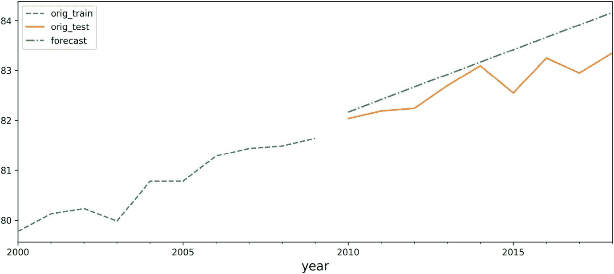
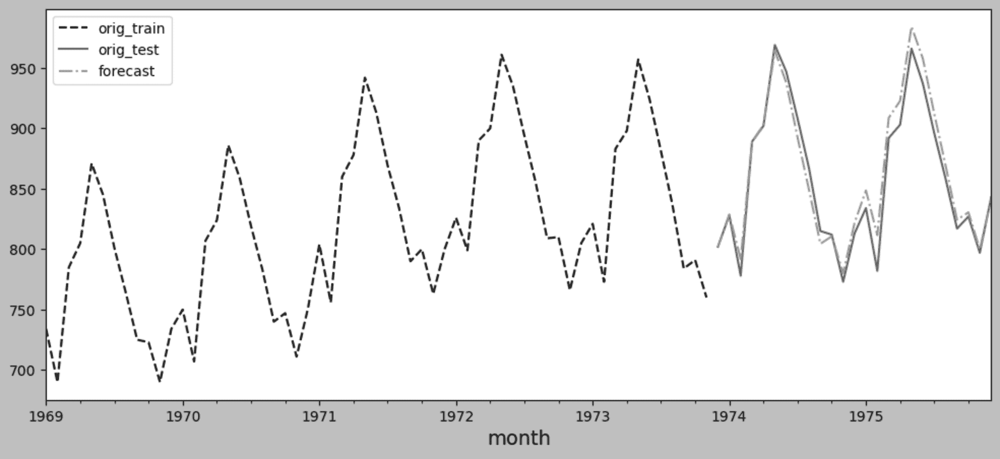
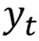

# 第十章：10 使用统计方法构建单变量时间序列模型

## 加入我们的书籍社区，加入 Discord


[`packt.link/zmkOY`](https://packt.link/zmkOY)

在*第九章*，*探索性数据分析与诊断*中，你已经接触了帮助你理解时间序列过程的几个概念。这些方法包括*时间序列数据分解*、*检测时间序列的平稳性*、*应用幂次变换*和*测试时间序列数据的自相关性*。这些技术将在本章讨论的统计建模方法中派上用场。

在处理时间序列数据时，可以根据你所处理的时间序列是**单变量**还是**多变量**、**季节性**还是**非季节性**、**平稳**还是**非平稳**、**线性**还是**非线性**，采用不同的方法和模型。如果你列出需要考虑和检查的假设——例如平稳性和自相关性——就会明显看出，为什么时间序列数据被认为是复杂和具有挑战性的。因此，为了建模这样一个复杂的系统，你的目标是获得一个足够好的近似，捕捉到关键的兴趣因素。这些因素会根据行业领域和研究目标的不同而有所变化，例如预测、分析过程或检测异常。

一些流行的统计建模方法包括**指数平滑**、**自回归积分滑动平均**（**ARIMA**）、**季节性 ARIMA**（**SARIMA**）、**向量自回归**（**VAR**）以及这些模型的其他变种，如 ARIMAX、SARIMAX、VARX 和 VARMA。许多实践者，如经济学家和数据科学家，仍然使用这些统计“经典”模型。此外，这些模型可以在流行的软件包中找到，如 EViews、MATLAB、Orange、KNIME 和 Alteryx，以及 Python 和 R 的库中。

在本章中，你将学习如何在 Python 中构建这些统计模型。换句话说，我只会简要介绍理论和数学，因为重点在于实现。如果你对这些模型的数学和理论感兴趣，我会在适当的地方提供参考文献，供你深入研究。

在本章中，我们将涵盖以下内容：

+   绘制 ACF 和 PACF

+   使用指数平滑法预测单变量时间序列数据

+   使用非季节性 ARIMA 预测单变量时间序列数据

+   使用季节性 ARIMA 预测单变量时间序列数据

+   使用 Auto_Arima 预测单变量时间序列数据

在深入这些方法之前，请特别注意即将到来的*技术要求*部分，在这一部分你将进行前期准备。这将消除任何干扰和重复编码，以便你可以专注于方法的核心目标以及每个实现背后的概念。

## 技术要求

你可以从本书的 GitHub 仓库下载 Jupyter Notebooks 和必要的数据集：

+   Jupyter Notebook: [`github.com/PacktPublishing/Time-Series-Analysis-with-Python-Cookbook./blob/main/code/Ch10/Chapter%2010.ipynb`](https://github.com/PacktPublishing/Time-Series-Analysis-with-Python-Cookbook./blob/main/code/Ch10/Chapter%2010.ipynb)

+   数据集: [`github.com/PacktPublishing/Time-Series-Analysis-with-Python-Cookbook./tree/main/datasets/Ch10`](https://github.com/PacktPublishing/Time-Series-Analysis-with-Python-Cookbook./tree/main/datasets/Ch10)

在开始学习本章的配方之前，请运行以下代码以加载将在全章中引用的数据集和函数：

1.  首先导入本章所有配方中将共享的基本库：

```py
import pandas as pd
import numpy as np
import matplotlib.pyplot as plt
import warnings
from statsmodels.tsa.api import (kpss, adfuller,
                              seasonal_decompose, STL)
from statsmodels.tools.eval_measures import rmspe, rmse
from sklearn.metrics import mean_absolute_percentage_error as mape
from statsmodels.graphics.tsaplots import plot_acf, plot_pacf
from itertools import product
from pathlib import Path
warnings.filterwarnings('ignore')
plt.rcParams["figure.figsize"] = [12, 5]
plt.style.use('grayscale')
warnings.filterwarnings('ignore')
```

1.  本章中您将使用两个数据集：`Life Expectancy from Birth` 和 `Monthly Milk Production`。将这两个以 CSV 格式存储（`life_expectancy_birth.csv` 和 `milk_production.csv`）的数据集导入到 pandas DataFrame 中。每个数据集来自不同的时间序列过程，因此它们将包含不同的趋势或季节性。一旦导入数据集，您将得到两个名为 `life` 和 `milk` 的数据框：

```py
life_file = Path('../../datasets/Ch10/life_expectancy_birth.csv')
milk_file = Path('../../datasets/Ch10/milk_production.csv')
life = pd.read_csv(life_file,
                   index_col='year',
                   parse_dates=True,
                  skipfooter=1)
milk = pd.read_csv(milk_file,
                   index_col='month',
                   parse_dates=True)
```

直观地检查数据，观察时间序列是否包含任何趋势或季节性。您可以随时返回本节中展示的图表作为参考：

```py
fig, ax = plt.subplots(2, 1, figsize=(16, 12))
life.plot(title='Annual Life Expectancy',
                        legend=False, ax=ax[0])
milk.plot(title='Monthly Milk Production',
                        legend=False, ax=ax[1]);­
```

这将显示两个时间序列图：


图 10.1：年度预期寿命和每月牛奶生产的时间序列图

上图展示了`life expectancy` 数据框的时间序列图，显示了一个积极（向上）的趋势，且没有季节性。该预期寿命数据包含了 1960 年至 2018 年（59 年）的每年出生时的预期寿命记录。原始数据集包含了各国的记录，但在本章中，您将使用*全球*的记录。

`monthly milk production` 数据框的时间序列图显示了一个积极（向上）的趋势，并且呈现出周期性（每年夏季）。该牛奶生产数据从 1962 年 1 月到 1975 年 12 月每月记录（共 168 个月）。季节性幅度和随时间变化的波动似乎保持稳定，表明其为加法模型。季节性分解明确了加法模型的水平、趋势和季节性，也能反映这一点。

如需深入了解季节性分解，请参考*第九章*中的*季节性分解时间序列数据*配方，位于*探索性数据分析与诊断*部分。

1.  你需要将数据分割成 `test` 和 `train` 数据集。你将在训练数据集上训练模型（拟合），并使用测试数据集来评估模型并比较预测结果。基于用于训练的数据所创建的预测称为**样本内**预测，而对未见数据（如测试集）进行的预测称为**样本外**预测。在评估不同模型时，你将使用样本外或测试集。

创建一个通用函数 `split_data`，根据测试拆分因子分割数据。这样，你也可以尝试不同的拆分方式。我们将在本章中引用这个函数：

```py
 def split_data(data, test_split):
    l = len(data)
    t_idx = round(l*(1-test_split))
    train, test = data[ : t_idx], data[t_idx : ]
    print(f'train: {len(train)} , test: {len(test)}')
    return train, test
```

1.  调用 `split_data` 函数，将两个数据框分割为 `test` 和 `train` 数据集（开始时使用 15% 测试集和 85% 训练集）。你可以随时尝试不同的拆分因子：

```py
test_split = 0.15
milk_train, milk_test = split_data(milk, test_split)
life_train, life_test = split_data(life, test_split)
>>
train: 143 , test: 25
train: 50 , test: 9
```

1.  你将经常检查平稳性，因为这是你将构建的许多模型的一个基本假设。例如，在*第九章*，*探索性数据分析与诊断*，在*检测时间序列平稳性*的食谱中，我们讨论了检验平稳性的重要性以及使用**扩展的迪基-富勒（Augmented Dickey-Fuller）**检验。创建一个可以在本章中引用的函数，用于执行检验并解释结果：

```py
def check_stationarity(df):
    results = adfuller(df)[1:3]
    s = 'Non-Stationary'
    if results[0] < 0.05:
        s = 'Stationary'
    print(f"'{s}\t p-value:{results[0]} \t lags:{results[1]}")
    return (s, results[0])
```

1.  在某些食谱中，你将运行模型的多个变体，寻找最优配置，这一做法通常被称为**超参数调优**。例如，你可以训练一个 ARIMA 模型并使用不同的参数值，从而生成多个 ARIMA 模型的变体（多个模型）。

`get_top_models_df` 函数将比较不同的模型——例如，多个 ARIMA 模型——以选择最佳模型及其相关的参数集。`get_top_models_df` 函数将接受一个字典，包含生成的模型、相关的参数和每个模型的评分。它返回一个数据框，详细列出表现最好的模型，便于比较。该函数允许你指定返回的最佳模型数量和用于选择模型的 `criterion`，例如均方根百分比误差（**RMSPE**）、均方根误差（**RMSE**）、平均绝对百分比误差（**MAPE**）、赤池信息量准则（**AIC**）、修正赤池信息量准则（**AICc**）或贝叶斯信息量准则（**BIC**）。这些指标在确定最适合你的数据分析需求的模型时至关重要。

例如，默认情况下你可能会选择根据 AIC 分数评估模型，但如果 RMSPE 或 RMSE 更适合你的具体情况，你可以轻松切换到这些指标。这种灵活性确保你可以根据数据的分析需求和复杂性量身定制模型选择过程。

```py
def get_top_models_df(scores, criterion='AIC', top_n=5):
    sorted_scores = sorted(scores.items(),
                           key=lambda item: item[1][criterion])

    top_models = sorted_scores[:top_n]
    data = [v for k, v in top_models]
    df = pd.DataFrame(data)

    df['model_id'] = [k for k, v in top_models]
    df.set_index('model_id', inplace=True)
    return df
```

1.  创建`plot_forecast`函数，该函数接受你已经训练的模型对象、起始位置以及训练和测试数据集，生成一个将预测值与实际值进行比较的图表。当你深入本章的配方时，情况将变得更加清晰：

```py
def plot_forecast(model, start, train, test):
    forecast = pd.DataFrame(model.forecast(test.shape[0]),
                            index=test.index)
    ax = train.loc[start:].plot(style='--')
    test.plot(ax=ax)
    forecast.plot(ax=ax, style = '-.')
    ax.legend(['orig_train', 'orig_test', 'forecast'])
    plt.show()
```

1.  最后，创建一个`combinator`工具函数，该函数接受一组参数值并返回这些选择的**笛卡尔积**。在进行超参数调优时，你将使用这个函数进行网格搜索。在网格搜索中，你会指定一组参数值的组合，分别训练多个模型，然后使用`get_top_models_df`函数评估最佳模型。例如，假设你的列表中包含三个不同参数的三个可能值。在这种情况下，`combinator`函数将返回一个包含 3x3 或九种可能组合的列表。当你深入本章的配方时，情况将变得更加清晰：

```py
def combinator(items):
    combo = [i for i in product(*items)]
    return combo
```

我们可以像*图 10.2*中所示的那样表示整体流程，图中展示了你如何利用刚刚创建的函数。


图 10.2：本章利用已准备好的辅助函数创建的整体过程

现在，让我们深入了解这些配方。

在第一个配方中，你将接触到**ACF**和**PACF**图，它们用于评估模型拟合、检查平稳性，并确定本章中将使用的一些模型（如 ARIMA 模型）的**阶数**（**参数**）。

## 绘制 ACF 和 PACF

在构建任何统计预测模型之前，如**自回归**（AR）、**移动平均**（MA）、**自回归移动平均**（ARMA）、**自回归积分移动平均**（ARIMA）或**季节性自回归积分移动平均**（SARIMA），你需要确定最适合你数据的时间序列模型类型。此外，你还需要确定一些必需参数的值，这些参数称为阶数。更具体地说，这些包括自回归（AR）或移动平均（MA）成分的滞后阶数。这个过程将在本章的*“使用 ARIMA 预测单变量时间序列数据”*部分进一步探讨。例如，自回归移动平均（ARMA）模型表示为`ARMA(p, q)`，其中`'p'`表示自回归阶数或 AR(p)成分，`'q'`表示移动平均阶数或 MA(q)成分。因此，ARMA 模型结合了 AR(p)和 MA(q)模型。

这些模型的核心思想基于这样一个假设：可以通过过去的数值来估计当前特定变量的值！[](img/file154.png)。例如，在一个自回归模型（AR）中，假设当前值！[](img/file155.png)，在时间！[](img/file156.png)可以通过其过去的值（）估算，直到`p`，其中`p`决定了我们需要回溯多少个时间步。如果！[](img/file158.png)，这意味着我们必须使用前两个周期！[](img/file159.png)来预测！[](img/file160.png)。根据时间序列数据的粒度，`p=2`可能代表 2 小时、2 天、2 个月、2 季度或 2 年。

要构建 ARMA(p,q)模型，你需要提供`p`和`q`阶数（即滞后）。这些被视为**超参数**，因为它们是由你提供的，用于影响模型。

参数和超参数这两个术语有时被交替使用。然而，它们有不同的解释，你需要理解它们之间的区别。

> 参数与超参数
> 
> > 在训练 ARMA 或 ARIMA 模型时，结果将生成一组被称为系数的参数——例如，AR 滞后 1 的系数值或 sigma——这些系数是算法在模型训练过程中估算出来的，并用于进行预测。它们被称为模型的参数。
> > 
> > 另一方面，（p，d，q）参数是 ARIMA(p，q，d)中的 AR、差分和 MA 的阶数。这些被称为超参数。它们在训练过程中提供，并影响模型生成的参数（例如系数）。这些超参数可以通过网格搜索等方法进行调优，以找到生成最佳模型的最佳参数组合。

现在，你可能会问，如何找到 AR 和 MA 模型的显著滞后值？

这就是**自相关函数**（**ACF**）和**偏自相关函数**（**PACF**）以及它们的图形发挥作用的地方。可以绘制 ACF 和 PACF 图，以帮助你识别时间序列过程是 AR、MA 还是 ARMA 过程（如果两者都存在），并识别*显著的*滞后值（对于`p`和`q`）。ACF 和 PACF 图都被称为**相关图**，因为这些图表示**相关性**统计。

ARMA 和 ARIMA 的区别，在于平稳性假设。ARIMA 中的`d`参数用于差分阶数。ARMA 模型假设过程是**平稳的**，而 ARIMA 模型则不假设，因为它处理差分问题。ARIMA 模型是一个更为广泛的模型，因为通过将差分因子`d=0`，它可以满足 ARMA 模型的需求。因此，`ARIMA(1,0,1)`就是`ARMA(1,1)`。

> **AR**阶数与**MA**阶数
> 
> > 你将使用 PACF 图来估计 AR 阶数，并使用 ACF 图来估计 MA 阶数。ACF 和 PACF 图的纵轴（y 轴）显示从 `-1` 到 `1` 的值，横轴（x 轴）表示滞后的大小。*显著*的滞后是任何超出阴影置信区间的滞后，正如你在图中看到的。

**statsmodels** 库提供了两个函数：`acf_plot` 和 `pacf_plot`。零滞后的相关性（对于 ACF 和 PACF）始终为 *1*（因为它表示第一个观测值与自身的自相关）。因此，这两个函数提供了 `zero` 参数，该参数接受一个布尔值。因此，为了在可视化中排除零滞后，可以传递 `zero=False`。

在 *第九章*，*探索性数据分析与诊断* 中，*测试时间序列数据中的自相关* 配方中，你使用了 **Ljung-Box** 测试来评估残差的自相关。在本例中，你还将学习如何使用 ACF 图来直观地检查 **残差自相关**。

### 如何操作…

在本例中，你将探索 `statsmodels` 库中的 `acf_plot` 和 `pacf_plot`。我们开始吧：

1.  你将在本例中使用寿命预期数据。如 *图 10.1* 所示，由于存在长期趋势，数据不是平稳的。在这种情况下，你需要对时间序列进行差分（去趋势），使其平稳，**然后**才能应用 ACF 和 PACF 图。

从差分开始，然后创建不包含零滞后的图：

```py
life_diff = life.diff().dropna()
fig, ax = plt.subplots(2,1, figsize=(12,8))
plot_acf(life_diff, zero=False, ax=ax[0])
plot_pacf(life_diff, zero=False, ax=ax[1]);
```

这将生成以下两个图：


图 10.3：差分后寿命预期数据的 ACF 和 PACF 图

如果你想查看更多滞后的计算 PACF 和 ACF，可以更新 `lags` 参数，如下所示：

```py
fig, ax = plt.subplots(2,1, figsize=(12,8))
plot_acf(life_diff, lags=25, zero=False, ax=ax[0])
plot_pacf(life_diff, lags=25,  zero=False, ax=ax[1]);
```

这将生成以下两个图：


图 10.4：前 25 个滞后的 ACF 和 PACF 图

ACF 图在滞后（阶数）1 处显示了一个显著的峰值。当滞后（垂直线）超出阴影区域时，表示显著性。阴影区域代表置信区间，默认设置为 `95%`。在 ACF 图中，只有第一个滞后显著，低于下置信区间，并且在此之后 *迅速消失*。其余的滞后均不显著。这表明是一个一阶移动平均 MA(1)。

PACF 图呈现 *渐变* 衰减并伴随震荡。通常，如果 PACF 显示渐变衰减，表示使用了移动平均模型。例如，如果你使用 ARMA 或 ARIMA 模型，一旦数据差分使其平稳后，它将表现为 `ARMA(0, 1)` 或 `ARIMA(0, 1, 1)`，表示一阶差分，`d=1`。在 ARMA 和 ARIMA 模型中，AR 阶数为 `p=0`，MA 阶数为 `q=1`。

1.  现在，让我们看看如何将 PACF 和 ACF 用于包含强烈趋势和季节性的更复杂的数据集。在*图 10.1*中，`月度牛奶生产`图显示了年度季节性效应和一个正向上升的趋势，表示这是一个非平稳时间序列。它更适合使用 SARIMA 模型。在 SARIMA 模型中，你有两个部分：非季节性部分和季节性部分。例如，除了之前看到的表示非季节性部分的 AR 和 MA 过程（分别由小写`p`和`q`表示），你还会有季节性部分的 AR 和 MA 阶数，分别由大写`P`和`Q`表示。这个模型可以表示为`SARIMA(p,d,q)(P,D,Q,S)`。你将在*使用季节性 ARIMA 预测单变量时间序列数据*的食谱中了解更多关于 SARIMA 模型的内容。

为了使此类时间序列平稳，你需要从季节性差分开始，以去除季节性效应。由于观测是按月进行的，因此季节性效应是按年观察的（每 12 个月或每个周期）：

```py
milk_diff_12 = milk.diff(12).dropna()
```

1.  使用你在本章早些时候创建的`check_stationarity`函数，执行增广的迪基-富勒（Augmented Dickey-Fuller）检验以检查平稳性：

```py
check_stationarity(milk_diff_12)
>> 'Non-Stationary     p-value:0.16079880527711382      lags:12
```

1.  差分后的时间序列仍然不是平稳的，因此你仍然需要进行第二次差分。这一次，你必须执行一阶差分（去趋势）。当时间序列数据包含季节性和趋势时，你可能需要进行两次差分才能使其平稳。将结果存储在`milk_diff_12_1`变量中，并再次运行`check_stationarity`：

```py
milk_diff_12_1 = milk.diff(12).diff(1).dropna()
check_stationarity(milk_diff_12_1)
>> 'Stationary     p-value:1.865423431878876e-05     
lags:11
```

太棒了——现在，你有了一个平稳过程。

1.  绘制`milk_diff_12_1`中平稳时间序列的 ACF 和 PACF 图：

```py
fig, ax = plt.subplots(1,2)
plot_acf(milk_diff_12_1, zero=False, ax=ax[0], lags=36)
plot_pacf(milk_diff_12_1, zero=False, ax=ax[1], lags=36);
```

这应该会生成以下 ACF 和 PACF 图：


图 10.5: 经差分后的月度牛奶生产的 PACF 和 ACF 图

对于季节性阶数`P`和`Q`，你应该诊断在滞后`s`、`2s`、`3s`等位置的峰值或行为，其中`s`是一个季节中的周期数。例如，在牛奶生产数据中，`s=12`（因为一个季节有 12 个月）。然后，我们观察 12（s）、24（2s）、36（3s）等位置的显著性。

从自相关函数（ACF）图开始，滞后 1 处有一个显著的峰值，表示 MA 过程的*非季节性*阶数为`q=1`。滞后 12 处的峰值表示 MA 过程的*季节性*阶数为`Q=1`。注意，在滞后 1 之后有一个截断，然后在滞后 12 处有一个峰值，之后又是截断（没有其他显著的滞后）。这些现象表明该模型是一个移动平均模型：非季节性部分是 MA(1)，季节性部分是 MA(1)。偏自相关函数（PACF）图也证实了这一点；在滞后 12、24 和 36 处的指数衰减表明这是一个 MA 模型。因此，SARIMA 模型应该是`ARIMA (0, 1,1)(0, 1, 1, 12)`。

> 尽管使用 ACF 和 PACF 图对于识别 ARIMA 阶数 p 和 q 很有用，但不应单独使用。在本章中，您将探索不同的技术，帮助您通过 AIC 和 BIC 等模型选择技术来确定阶数。

### 工作原理…

ACF 和 PACF 图可以帮助您理解过去观测值之间线性关系的强度以及在不同滞后期的显著性。

ACF 和 PACF 图显示出显著的自相关或部分自相关，超出了 **置信区间**。阴影部分表示置信区间，它由 `pacf_plot` 和 `acf_plot` 函数中的 `alpha` 参数控制。`statsmodels` 中 `alpha` 的默认值是 `0.05`（95% 置信区间）。显著性可以是任意方向；如果自相关强烈为正，它会接近 `1`（上方），如果强烈为负，则会接近 `-1`（下方）。

下表展示了一个示例指南，用于从 PACF 和 ACF 图中识别平稳的 AR 和 MA 阶数：


表 10.1：使用 ACF 和 PACF 图识别 AR、MA 和 ARMA 模型

### 还有更多…

在本食谱中，您使用了 ACF 和 PACF 图来估计应该为季节性和非季节性 ARIMA 模型使用哪些阶数（滞后）。

让我们看看 ACF 图如何用于诊断模型的 **残差**。检查模型的残差是评估模型的重要组成部分。这里的假设很简单：如果模型正确地捕捉到了所有必要的信息，那么残差中不应该包含任何在任意滞后期有相关性的点（即没有自相关）。因此，您会期望残差的 ACF 图显示出接近零的自相关。

让我们构建之前在本食谱中识别的季节性 ARIMA 模型 `SARIMA(0,1,1)(0,1,1,12)`，然后使用 ACF 来诊断残差。如果模型捕捉到了时间序列中嵌入的所有信息，您会期望残差 *没有自相关*：

```py
from statsmodels.tsa.statespace.sarimax import SARIMAX
model = SARIMAX(milk, order=(0,1,1),
                seasonal_order=(0,1,1, 12)).fit(disp=False)
plot_acf(model.resid, zero=False, lags=36);
```

这将生成以下自相关图：


图 10.6：SARIMA 残差的自相关图

总体来说，`SARIMA(0,1,1)(0,1,1,12)` 很好地捕捉到了必要的信息，但仍然有提升的空间。存在一个显著的滞后期（在滞后=12 时，超出了置信阈值），表明残差中存在某些自相关。

您可以进一步调整模型并尝试不同的季节性和非季节性阶数。在本章及后续食谱中，您将探索一种网格搜索方法来选择最佳的超参数，以找到最优模型。

如果您想进一步诊断模型的残差，您可以使用 `plot_diagnostics` 方法进行：

```py
model.plot_diagnostics(figsize=(12,7), lags=36);
```

这将生成以下图形：


图 10.7：使用 plot_diagnostics 方法进行的残差分析

请注意，生成的诊断图是基于标准化残差的，这是一种常见的技术，因为它使得在不同模型之间比较残差更加容易，因为它们是归一化的，并以标准差的形式表示。

你可以通过访问`model.standardized_forecasts_error`来复制相同的图表，如下所示：

```py
plot_acf(model.standardized_forecasts_error.ravel(), lags=36,
         title='Standardized Residuals ACF Plot');
```

和

```py
pd.DataFrame(model.standardized_forecasts_error.ravel(),
             index=milk.index).plot(title='Standardized Residuals Plot',
                                    legend=False);
```

生成的两个图应类似于以下图形，展示标准化残差的自相关和时间序列模式：


图 10.8：SARIMA 模型标准化残差的 ACF 图


图 10.9：SARIMA 模型标准化残差图

*图 10.6*与*图 10.8*之间的差异是由于尺度归一化。标准化可以减少异常值的影响，因为残差被缩小。这就是为什么在图 10.8 中，尽管 Lag 12 的自相关在两张图中都可见，但它位于置信区间的边界，而在*图 10.6*中则明显不同。同时，标准化可能会放大一些较小的自相关，这些自相关在原始的 ACF 图中可能最初是不可见的。在整个食谱中，你将依赖于`plot_diagnostics`方法进行残差诊断。

### 另见

+   若要了解更多关于 ACF 图的内容，请访问官方文档 [`www.statsmodels.org/dev/generated/statsmodels.graphics.tsaplots.plot_acf.html.`](https://www.statsmodels.org/dev/generated/statsmodels.graphics.tsaplots.plot_acf.html.)

+   若要了解更多关于 PACF 图的内容，请访问官方文档 [`www.statsmodels.org/dev/generated/statsmodels.graphics.tsaplots.plot_pacf.html`](https://www.statsmodels.org/dev/generated/statsmodels.graphics.tsaplots.plot_pacf.html).

这样，你就知道在构建 ARIMA 模型及其变体（例如，ARMA 或 SARIMA 模型）时，如何使用 ACF 和 PACF 图。在接下来的食谱中，你将学习本章的第一个时间序列预测技术。

## 使用指数平滑法预测单变量时间序列数据

在本食谱中，你将探索使用`statsmodels`库的**指数平滑**技术，它提供了与 R 语言`forecast`包中的流行实现（如`ets()`和`HoltWinters()`）类似的功能。在 statsmodels 中，指数平滑有三种不同的实现（*类*），具体取决于你所处理数据的性质：

+   **SimpleExpSmoothing**：当时间序列过程缺乏季节性和趋势时，使用简单指数平滑法。这也被称为单一指数平滑法。

+   **Holt**：Holt 指数平滑是简单指数平滑的增强版本，用于处理只包含趋势（但没有季节性）的时间序列过程。它被称为双指数平滑。

+   **ExponentialSmoothing**：Holt-Winters 指数平滑是 Holt 指数平滑的增强版本，用于处理同时具有季节性和趋势的时间序列过程。它被称为三重指数平滑。

**你可以像下面这样导入这些类：**

```py
from statsmodels.tsa.api import (ExponentialSmoothing,
                                SimpleExpSmoothing,
                                Holt)
```

`statsmodels` 的实现遵循*《预测：原理与实践》（作者：Hyndman, Rob J., and George Athanasopoulos）*中的定义，你可以在这里参考：[`otexts.com/fpp3/expsmooth.html`](https://otexts.com/fpp3/expsmooth.html)。

### 如何实现…

在这个示例中，你将对本章介绍的两个数据集进行指数平滑处理（*技术要求*）。由于`Holt`类和`SimpleExpSmoothing`类是`ExponentialSmoothing`类的简化版本，因此你可以使用后者来进行简单操作。与使用这三者不同，你可以使用`ExponentialSmoothing`类运行这三种不同类型，因为`ExponentialSmoothing`是更通用的实现。这种方法允许你使用单一更多功能的实现来管理不同类型的时间序列，无论它们是否表现出趋势、季节性或两者都有。让我们开始吧：

1.  导入`ExponentialSmoothing`类：

```py
from statsmodels.tsa.api import ExponentialSmoothing
```

1.  你将从寿命数据集开始，并使用`ExponentialSmoothing`类。

`ExponentialSmoothing` 需要多个参数（称为超参数），可以分为两种类型：在构建模型时指定的参数和在拟合模型时指定的参数。

1.  **模型构建：**

    +   `trend`：选择从‘`multiplicative`’（别名‘`mul`’）、‘`additive`’（别名‘`add`’）或 `None` 中进行选择。

    +   `seasonal`：选择从‘`multiplicative`’（别名‘`mul`’）、‘`additive`’（别名‘`add`’）或 `None` 中进行选择。

    +   `seasonal_periods`：代表季节周期的整数；例如，对于月度数据使用 12，季度数据使用 4。

    +   `damped_trend`：布尔值（`True` 或 `False`），指定趋势是否应该被阻尼。

    +   `use_boxcox`：布尔值（`True` 或 `False`），确定是否应用 Box-Cox 变换。

1.  **模型拟合：**

    +   `smoothing_level`：浮点数，指定作为**alpha**的平滑水平的平滑因子。

        

        ), 其有效值在 0 和 1 之间 (

        

        ).

    +   `smoothing_trend`：浮点数，指定作为**beta**的趋势的平滑因子 (

        

        ), 其有效值在 0 和 1 之间 (

        

        ).

    +   `smoothing_seasonal`：浮点数，指定作为*gamma*的季节性趋势的平滑因子。

        

        ), 其有效值在 0 和 1 之间 (

        

        ).

在后续的*如何运作...*部分，你将探索**霍尔特-温特斯（Holt-Winters）**的水平、趋势和季节性公式，以及这些参数是如何应用的。

1.  创建一个包含不同超参数值组合的列表。这样，在下一步中，你可以在每次运行中评估不同的超参数值组合。从本质上讲，你将训练不同的模型，并在每次迭代中记录其得分。一旦每个组合都被评估，你将使用`get_top_models_df`函数（来自*技术要求*部分）来确定表现最好的模型及其最佳超参数值，通过这个详尽的网格搜索过程。这个过程可能需要耗费一些时间，但幸运的是，有一种混合技术可以缩短搜索时间。

你可以使用`ExponentialSmoothing`类来找到`alpha`、`beta`和`gamma`的最佳值（）。这种方法无需在网格中指定这些值（尽管如果你更愿意控制过程，仍然可以指定）。这种简化意味着你只需提供剩余超参数的值，如`trend`和`seasonal`。你可以通过使用`seasonal_decompose()`函数绘制它们的分解，初步判断这些组件是乘法型还是加法型。如果仍不确定，详尽的网格搜索仍然是一个可行的替代方案。

对于`life`数据框，只有*trend*，因此你只需要探索*两个*参数的不同值；即`trend`和`damped`：

```py
trend = ['add', 'mul']
damped = [True, False]
life_ex_comb = combinator([trend, damped])
life_ex_comb
[('add', True), ('add', False), ('mul', True), ('mul', False)]
```

在这里，我们有两个参数，每个参数有两个不同的值，这为我们提供了 2x2 或四个总的组合来评估。

1.  遍历组合列表，并在每次迭代中训练（拟合）一个不同的模型。将评估指标捕捉到字典中，以便稍后比较结果。你将捕捉到的示例得分包括 RMSE、RMSPE、MAPE、AIC 和 BIC 等。请记住，大多数自动化工具和软件会在后台使用 AIC 和 BIC 分数来确定最佳模型：

```py
train = life_train.values.ravel()
y = life_test.values.ravel()
score = {}
for i, (t, dp) in enumerate(life_ex_comb):
    exp = ExponentialSmoothing(train,
                     trend=t,
                     damped_trend=dp,
                     seasonal=None)
    model = exp.fit(use_brute=True, optimized=True)   
    y_hat = model.forecast(len(y))
    score[i] = {'trend':t,
                'damped':dp,
                'AIC':model.aic,
                'BIC':model.bic,
                'AICc':model.aicc,
                'RMSPE': rmspe(y, y_hat),
                'RMSE' : rmse(y, y_hat),
                'MAPE' : mape(y, y_hat),
                'model': model}
```

在前面的函数中，你使用`life_train`来训练不同的模型，使用`life_test`来评估错误度量，如 RMSPE、RMSE 和 MAPE。

要使用`get_top_models_df`函数获取前几个模型，只需传递得分字典。目前，保持默认标准设置为`c=AIC`以保持一致性：

```py
model_eval = get_top_models_df(score, 'AIC', top_n=5)
```

1.  `get_top_models_df`函数将返回一个 DataFrame，显示排名前五的模型（默认为 5），根据所选标准进行排名，例如在此案例中是 AIC 分数。DataFrame 不仅包含所有附加得分，还将模型实例本身存储在名为'model'的列中。

要查看排名和各种得分，你可以执行以下代码：

```py
model_eval.iloc[:, 0:-1]
```

上述代码排除了最后一列，该列包含模型实例，因此显示的 DataFrame 包括 AIC、BIC、RMSE 等每个评估指标的列。


图 10.10：基于 AIC 分数排名的寿命预期数据的指数平滑模型

通常，对于基于信息准则（如 AIC、BIC 和 AICc）进行的模型选择，较低的值更好，表示模型拟合和复杂度之间的更优平衡。在我们的案例中，我们选择使用 AIC。如果您检查图 10.10 中的 DataFrame，会发现一些可以观察到的现象：

+   如果优先考虑信息准则（AIC、BIC、AICc），**模型 1**（趋势：加性，阻尼：False）会被视为最佳模型，因为它在所有三个信息准则中得分最低。该模型可能在模型复杂度和拟合度之间提供了最佳的折衷。

+   如果优先考虑误差指标（RMSPE、RMSE、MAPE），这些指标用于衡量预测精度，**模型 0**（趋势：加性，阻尼：True）会被认为是更优的，因为它的预测误差较小。

> 选择“获胜”模型将取决于您的具体目标和模型将被使用的上下文。如果您需要两者之间的平衡，您可能需要考虑其他因素或进一步验证，以决定选择模型 1 还是模型 0。

我们将继续使用 AIC 作为我们的选择标准。

1.  存储在 DataFrame 中的模型是 `HoltWintersResultsWrapper` 类的实例。您可以直接从 DataFrame 访问顶部模型，这样可以利用与该模型相关的其他方法和属性，如 `summary`、`predict` 和 `forecast`。要提取并与第一行的获胜模型进行交互，请使用以下代码：

```py
top_model = model_eval.iloc[0,-1]
```

您可以像下面这样访问 `summary()` 方法：

```py
top_model.summary()
```

上述代码将生成一个总结输出，提供一个表格布局，详细展示模型——例如，使用的参数值和计算出的系数：


图 10.11：寿命预期数据的指数平滑总结

总结将显示关键的信息，例如通过拟合过程自动推导出的**alpha**（*平滑水平*）和**beta**（*平滑趋势*）的最佳值。

1.  您可以使用 `forecast` 方法预测未来的值，然后将结果与测试集（模型未见过的数据）进行比较。我们在本章的*技术要求*部分介绍的 `plot_forecast()` 函数将用于生成并绘制预测结果，同时显示测试数据。要执行此可视化，将存储在 `top_model` 中的模型对象与 `training` 和 `test` 数据集一起传递给 `plot_forecast()`：

```py
plot_forecast(life_best_model, '2000', life_train, life_test)
```

`plot_forecast`函数中的`start`参数将数据从该点开始切片，以便更容易比较结果。可以将其视为聚焦于时间线的特定片段。例如，不是显示 1960 到 2018 年（59 个月）的数据，而是只请求从 2000 年开始的这一段数据。

这将生成一个图，其中 x 轴从 2000 年开始。应有三条线：一条线表示训练数据，另一条线表示测试数据，还有一条线表示预测值（预测值）：



图 10.12：将指数平滑预测与生命预期数据集的实际数据进行对比

简单指数平滑的预测结果是延伸自训练数据的上升趋势的直线。

1.  重复之前的过程，但使用`milk`数据框。请记住，这里最重要的区别是添加了季节性参数。这意味着你将添加两个额外的超参数来进行评估——即`seasonal`和`seasonal_periods`。

为不同选项构建笛卡尔积。对于`seasonal_periods`，你可以探索三个周期——4、6 和 12 个月。这应该会给你提供 24 个需要评估的模型：

```py
trend , damped= ['add', 'mul'], [True, False]
seasonal, periods = ['add' , 'mul'], [4, 6, 12]
milk_exp_comb = combinator([trend, damped, seasonal, periods])
```

循环遍历组合列表，训练多个模型并捕获它们的得分：

```py
train = milk_train.values.ravel()
y = milk_test.values.ravel()
milk_model_scores = {}
for i, (t, dp, s, sp) in enumerate(milk_exp_comb):
    exp = ExponentialSmoothing(train,
                        trend=t,
                        damped_trend=dp,
                        seasonal=s,
                        seasonal_periods=sp)
    model = exp.fit(use_brute=True, optimized=True)   
    y_hat = model.forecast(len(y))
    score[i] = {'trend':t,
                'damped':dp,
                'AIC':model.aic,
                'BIC':model.bic,
                'AICc': model.aicc,
                'RMSPE': rmspe(y, y_hat),
                'RMSE' : rmse(y, y_hat),
                'MAPE' : mape(y, y_hat),
                'model': model}
```

1.  训练完成后，运行`get_top_models_df`函数，根据 AIC 得分识别出最佳模型：

```py
model_eval = get_top_models_df(score, 'AIC', top_n=5)
model_eval.iloc[:, 0:-1]
```

这将显示以下数据框：


图 10.13：基于 AIC 得分排名的牛奶生产数据前 5 个指数平滑模型

要从结果中确定获胜模型，通常会查看各种度量标准，如 AIC、BIC、AICc（信息准则）以及误差度量，如 RMSPE、RMSE 和 MAPE。AIC、BIC 和 AICc 的较低值表示模型在拟合优度和复杂性之间有更好的平衡。RMSPE、RMSE 和 MAPE 的较低值表示更好的预测精度。

如果你检查图 10.13 中的数据框，你会发现有一些观察结果：

如果优先考虑信息准则（AIC、BIC、AICc），**模型 8**（趋势：加性，阻尼：False）似乎是最佳模型，因为它在所有信息准则中具有最低的值。这表明它在很好地拟合数据和保持简单性之间提供了一个有利的平衡。

如果优先考虑误差度量（RMSPE、RMSE、MAPE），**模型 2**（趋势：加性，阻尼：True）在预测精度方面表现更好。该模型具有最低的误差率，表明它在列出的模型中最准确地预测了未来值。

> 选择“获胜”模型将取决于您的具体目标以及模型将用于的上下文。如果您需要在两种方法之间找到平衡，您可能需要考虑其他因素或进一步验证，以决定选择模型 8 还是模型 2。

我们将继续使用 AIC 作为选择标准。

您可以使用以下命令显示最佳模型的汇总信息：

```py
top_model = model_eval.iloc[0,-1]
top_model.summary()
```

这应该生成一个汇总最佳模型的表格布局——例如，构建模型时使用的参数值和计算出的系数：


图 10.14：月度牛奶生产数据的指数平滑总结

请注意，`趋势`、`季节性`和`季节周期`的超参数值的最佳组合。最佳的 `季节周期` 为 12 个月或滞后期。汇总结果表将显示所有这些滞后的系数，并且这将是一个很长的列表。前面的截图仅显示了顶部部分。

此外，汇总还将显示关键的优化信息，如 alpha（*平滑水平*）、beta（*平滑趋势*）和 gamma（*平滑季节性*）的最佳值。

请记住，最佳模型是根据 AIC 分数选定的。因此，您应探索已捕捉到的不同指标，例如使用 `get_top_models_df(score, 'MAPE', top_n=5)`。

1.  将您使用最佳模型的预测与测试数据进行比较：

```py
plot_forecast(top_model, '1969', milk_train, milk_test);
```

这应该会生成一个从 1969 年开始的图表，展示三条线，分别表示训练数据、测试数据和预测（预测值）：



图 10.15：绘制指数平滑预测与实际月度牛奶生产数据的对比

总体而言，模型有效地捕捉了趋势和季节性，且与测试集中的实际值高度吻合。

### 它是如何工作的……

平滑时间序列数据有多种方法，包括简单移动平均法、简单指数平滑法、霍尔特指数平滑法和霍尔特-温特指数平滑法。

移动平均模型将过去的值视为相同，而指数平滑模型则更加注重（加权）最近的观察数据。在指数平滑中，较早观察数据的影响逐渐减少（加权衰减），因此得名“指数”。这一方法基于这样一个逻辑假设：较新的事件通常比较旧的事件更为重要。例如，在日常时间序列中，昨天或前天的事件通常比两个月前的事件更为相关。

简单指数平滑（单一）的公式，适用于没有趋势或季节性的时间序列过程，如下所示：

这里，`ExponentialSmoothing` 类的目标是找到平滑参数 **alpha** 的最佳值（）。在这个公式中， 代表当前时刻的期望（平滑）水平， 和  分别是当前时刻和之前时刻的平滑水平值， 是当前时刻的观测值（）。alpha（）参数至关重要，它作为水平平滑参数，决定了模型是否更信任过去（）还是当前（）。因此，当 趋近于零时，第一项（）趋近于零，更多的权重会被放在过去；而当 趋近于一时， 项趋近于零，更多的权重则会放在当前。选择 的因素有很多，包括系统中的随机性程度。系数 的输出值决定了模型如何加权当前和过去的观测值来预测未来事件（）。

这个解释与类似公式中所呈现的主题一致；虽然我们不会深入探讨每个细节，但整体概念保持一致。

Holt 的指数平滑（双重）公式包含了趋势（）及其平滑参数 beta（）。因此，一旦加入趋势，模型将输出两个系数的值——即 **alpha** 和 **beta**（）： Holt-Winters 指数平滑（三重）公式同时包含趋势（）和季节性（）。以下公式展示了 **乘法** 季节性作为示例： 当使用 `ExponentialSmoothing` 寻找最佳参数值时，它是通过最小化误差率（**误差平方和** 或 **SSE**）来实现的。因此，在每次循环中，你传入新参数值（例如，damped 为 `True` 或 `False`），模型通过最小化 SSE 来求解最优的 系数值。这个过程可以写成如下公式：

在一些教科书中，你会看到不同的字母用于表示水平、趋势和季节性，但公式的整体结构是相同的。

通常，指数平滑是一种快速且有效的技术，用于平滑时间序列以改善分析，处理异常值、数据插补和预测（预测）。

### 还有更多…

一个名为 **Darts** 的令人兴奋的库提供了一个 `ExponentialSmoothing` 类，它是基于 statsmodels 的 `ExponentialSmoothing` 类的封装。

要使用 `pip` 安装 Darts，请运行以下命令：

```py
pip install darts
```

要使用 `conda` 安装，请运行以下命令：

```py
conda install -c conda-forge -c pytorch u8darts-all
```

加载 `ExponentialSmoothing` 和 `TimeSeries` 类：

```py
from darts.models import ExponentialSmoothing
from darts import TimeSeries
```

**Darts** 期望数据是 `TimeSeries` 类的一个实例，因此在使用它来训练模型之前，你需要先将 pandas DataFrame 转换为 `TimeSeries`。`TimeSeries` 类提供了 `from_dataframe` 方法，你将在其中使用：

```py
model = ExponentialSmoothing(seasonal_periods=12)
ts = TimeSeries.from_dataframe(milk.reset_index(),
                                    time_col='month', value_cols='production', freq='MS')
```

在创建 `TimeSeries` 对象时，你必须指定哪一列是日期，哪一列包含观测值（数据）。你可以使用 `.fit()` 方法训练模型。一旦训练完成，你可以使用 `.predict()` 方法进行预测。要绘制结果，可以使用 `.plot()` 方法：

```py
train, test = split_data(ts, 0.15)
model.fit(train)
forecast = model.predict(len(test), num_samples=100)
train.plot()
forecast.plot(label='forecast', low_quantile=0.05, high_quantile=0.95)
```


图 10.16：使用 Darts 对每月牛奶生产数据进行 ExponentialSmoothing 预测

`darts` 库自动化了评估过程，以找到最佳配置（超参数）。Darts 的 `ExponentialSmoothing` 类是 statsmodels 的 `ExponentialSmoothing` 类的封装，这意味着你可以访问熟悉的方法和属性，例如 `summary()` 方法：

```py
model.model.summary()
```

这应该会生成熟悉的 statsmodels 表格总结和优化后的参数值。作为挑战，请比较 Dart 的总结与 *图 10.14* 中的结果。尽管你会发现你达到了类似的结果，但使用 Darts 时付出的努力更少。它自动选择了 *图 10.14* 中确定的最佳超参数。

Darts 库还包含另一个有用的类，名为 **StatsForecastAutoETS**，其功能来源于 StatsForecast 库中的 AutoETS 实现。与传统的 **ExponentialSmoothing** 类相比，AutoETS 通常因其更快的性能而受到赞扬。

要探索 **StatsForecastAutoETS** 的功能，可以参考以下代码片段：

```py
from darts.models import StatsForecastAutoETS
modelets = StatsForecastAutoETS(season_length=12)
modelets.fit(train)
etsforecast = modelets.predict(len(test))
train.plot()
etsforecast.plot(label='AutoETS');
```


图 10.17：使用 Darts 对每月牛奶生产数据进行 AutoETS 预测

你可以使用以下代码比较两个预测方法，ExponentialSmoothing 和 StatsForecastAutoETS：

```py
forecast.plot(label='ExponentialSmoothing')
etsforecast.plot(label='StatsForecastAutoETS');
```


图 10.18：比较 AutoETS 和 ExponentialSmoothing

上面的线表示 `ExponentialSmoothing` 预测结果，而下面的线表示 `StatsForecastAutoETS` 预测结果。

> **指数平滑与 ETS**
> 
> > ETS 和指数平滑密切相关，因为它们都使用过去数据点的平滑方法来预测时间序列数据。然而，它们在方法上有所不同。指数平滑通过最小化平方误差和来估计参数，而 ETS 则通过最大化似然估计。此外，指数平滑提供点预测（预测值），ETS 也提供相同的点预测，但附带预测区间。

### 参见

要了解更多有关 `ExponentialSmoothing` 类的信息，您可以访问 statsmodels 的官方文档：[`www.statsmodels.org/dev/generated/statsmodels.tsa.holtwinters.ExponentialSmoothing.html`](https://www.statsmodels.org/dev/generated/statsmodels.tsa.holtwinters.ExponentialSmoothing.html)。

> 您是否注意到在指数平滑中无需进行平稳性检验？指数平滑仅适用于非平稳时间序列（例如具有趋势或季节性的时间序列）。

在下一部分，在构建 ARIMA 模型时，您将进行平稳性检验，以确定差分阶数，并利用本章前面讨论过的 ACF 和 PACF 图。

## 使用 ARIMA 进行单变量时间序列数据预测

在本配方中，您将探索 ARIMA，使用 **statsmodels** 包进行实现。ARIMA 代表自回归集成滑动平均（Autoregressive Integrated Moving Average），它结合了三种主要成分：**自回归**或 `AR(p)` 模型、**滑动平均**或 `MA(q)` 模型和一个**集成**过程或 `I(d)`，它对数据应用差分。

ARIMA 模型通过 `p`、`d` 和 `q` 参数来表征，非季节性时间序列的 ARIMA 模型用符号 `ARIMA(p, d, q)` 来描述。`p` 和 `q` 参数表示**阶数或滞后**；例如，`AR` 的阶数为 `p`，`MA` 的阶数为 `q`。它们被称为滞后，因为它们表示我们需要考虑的“过去”时期的数量。您可能还会遇到另一种关于 `p` 和 `q` 的称呼，即**多项式的阶数**。

ARIMA 模型通过差分（一种时间序列转换技术）来处理非平稳时间序列数据，从而使非平稳时间序列变为平稳。差分的阶数或集成阶数 `d` 是构建模型时需要选择的参数之一。有关平稳性的复习，请参阅 *第九章，探索性数据分析与诊断中的检测时间序列平稳性配方*。

虽然 ARIMA 模型通过利用集成因子 '*d*' 设计用于处理趋势，但它们传统上假设数据集中没有季节性。然而，如果季节性是一个因素，那么季节性 ARIMA（SARIMA）模型就是合适的替代方案，因为它扩展了 ARIMA，包含季节性差分。

### 准备工作

首先，从 `statsmodels` 库加载本配方所需的类和函数：

```py
from statsmodels.tsa.arima.model import ARIMA
from statsmodels.stats.diagnostic import acorr_ljungbox
```

### 如何操作……

不同的时间序列模型适用于各种类型的数据。因此，选择一个与数据集的特征以及你所解决的具体问题相符合的模型至关重要。在本例中，你将使用`life`数据框，它呈现出趋势但没有季节性。

你将结合视觉检查（使用 ACF 和 PACF 图）和统计检验，以便做出关于 AR 和 MA 模型成分（即`p`和`q`阶数）的明智决策。这些方法在*第九章*，*探索性数据分析与诊断*中已有介绍，包括*自相关性检验*、*时间序列数据分解*和*时间序列平稳性检测*的相关内容。让我们开始吧：

1.  首先通过**分解**数据集，将其分为三个主要成分：趋势、季节性和残差（通常被认为是噪声）。你可以使用`seasonal_decompose`函数来实现这一点。

```py
decomposed = seasonal_decompose(life)
decomposed.plot();
```

你可以看到以下图表：


图 10.19：生命预期数据的分解

观察到分解结果显示数据集中有一个正向（上升）趋势。这表明数据随时间的一致增长。然而，数据中没有明显的季节性效应，这与我们对**生命**数据集的预期一致。

1.  你需要首先对数据进行去趋势处理。进行一次差分，然后使用本章前面创建的`check_stationarity`函数测试数据的平稳性：

```py
check_stationarity(life)
>>
Non-Stationary   p-value:0.6420882853800064      lags:2
life_df1 = life.diff().dropna()
check_stationarity(life_df1)
>>
Stationary     p-value:1.5562189676003248e-14      lags:1
```

现在，数据是*平稳的*。p 值显著，可以拒绝原假设。请注意，`diff()`的默认`periods`值为`1`。通常，`diff(periods=n)`表示当前时期`t`的观测值与其滞后版本`t-n`之间的差异。对于`diff(1)`或`diff()`，滞后版本是`t-1`（例如，前一个月的观测值）。

你可以使用`plot`方法绘制差分后的时间序列数据：

```py
life_df1.plot();
```

这将生成以下图表：


图 10.20：生命预期数据的一阶差分（去趋势）

接下来，你需要确定 ARIMA（p, d, q）模型的`p`和`q`阶数。

1.  ACF 和 PACF 图将帮助你估计 AR 和 MA 模型的合适`p`和`q`值。对平稳化后的`life_df1`数据使用`plot_acf`和`plot_pacf`：

```py
fig, ax = plt.subplots(1,2)
plot_acf(life_df1, ax=ax[0])
plot_pacf(life_df1, ax=ax[1]);
```

它会生成以下图表：


图 10.21：差分后的生命预期数据的 ACF 和 PACF 图

在前面的例子中，零滞后值被包含在图表中，以帮助你将其与过去的滞后期进行可视化比较。滞后期为 0 时，ACF 和 PACF 的值总是为 1；它们有时会被从图表中省略，因为它们并不提供有意义的信息。因此，更重要的是关注滞后期 1 及之后的滞后期，以确定它们的显著性。

ACF 图有助于识别 MA(q)组件的重要滞后。ACF 图在滞后 1 后显示截断，表示 MA(1)模型。相反，PACF 图有助于确定 AR(p)组件的重要滞后。你可以观察到滞后 1 后逐渐衰减并有振荡，表明在滞后 1 处是 MA 模型或 MA(1)。这表示没有 AR 过程，因此`p`阶数为零或 AR(0)。有关更多细节，请参考*表 10.1*。

MA(1)过程也叫做一阶移动平均过程，意味着当前值（在时间`t`时刻）受紧接其前一个值（在时间`t-1`时刻）的影响。

现在，你可以使用 p=0，q=1，d=1 的配置构建 ARIMA(p, d, q)模型，从而得到`ARIMA(0,1,1)`。通常，p 和 q 的最佳滞后值（阶数）并不一目了然，因此你需要通过评估多个 ARIMA 模型并使用不同的 p、d、q 参数来进行实验。这可以通过网格搜索等方法实现，类似于*使用指数平滑法预测单变量时间序列数据*中描述的方法。

1.  在训练集`life_train`上训练 ARIMA 模型，并查看模型的摘要。重要的是不要使用之前差分过的`life_df1`，因为 ARIMA 内部会根据`d`参数的值进行差分。在这个例子中，由于一阶差分（d=1）足以去趋势并使数据平稳，你将设置模型初始化中的`d=1`：

```py
model = ARIMA(life_train, order=(0,1,1))
results = model.fit()
results.summary()
```

你将看到如下摘要：


图 10.22：ARIMA(0,1,1)模型在预期寿命数据上的摘要

注意，在模型摘要中提供了 AIC 和 BIC 评分。虽然这些评分很有用，但它们在用于比较多个模型时最有意义，因为它们有助于评估模型拟合度，同时惩罚过度复杂的模型。

在这个例子中，ARIMA 模型主要是一个 MA 过程，差分因子（d=1），摘要结果仅提供了 MA(1)组件的系数值。有关更多信息，请参阅*如何工作…*部分。

1.  你需要验证模型的残差，以确定 ARIMA(0, 1, 1)模型是否充分捕捉了时间序列中的信息。你会假设模型预测的残差是随机的（噪声），并且不遵循任何模式。更具体地说，你期望残差中没有自相关。你可以从`acorr_ljungbox`检验开始，然后查看残差的自相关函数（ACF）图。如果模型效果良好，你应该不期望看到任何自相关：

```py
(acorr_ljungbox(results.resid,
                lags=25,
                return_df=True) < 0.05)['lb_pvalue'].sum()
>> 0
```

结果显示`0`，这是前 25 个滞后的结果的汇总，表示没有自相关。

也可以尝试查看 ACF 图：

```py
plot_acf(results.resid, zero=False);
```

这应该生成一个 ACF 图。在这里，你应该期望图表不会显示出显著的滞后。换句话说，所有垂直线应该更接近零，或者对于所有滞后都应该为零：


图 10.23：显示残差没有自相关的 ACF 图

该图表确认了没有自相关的迹象（视觉上）。

1.  你还可以检查残差的分布。例如，你应该期望残差符合正态分布，均值为零。你可以使用 QQ 图和**核密度估计**（**KDE**）图来观察分布并评估正态性。你可以使用`plot_diagnostics`方法来实现：

```py
results.plot_diagnostics();plt.show()
```

上面的代码将生成以下图表：


图 10.24：ARIMA(0,1,1)模型的视觉诊断

这些图表显示了与正态分布的轻微偏差。例如，一个完美的正态分布数据集将具有完美的钟形 KDE 图，并且所有点将在 QQ 图中完美对齐在直线上。

到目前为止，结果和诊断表明模型表现良好，尽管可能还有改进的空间。记住，构建 ARIMA 模型通常是一个迭代过程，涉及多轮测试和调整，以达到最佳结果。

1.  ARIMA 建模过程中的最后一步是预测未来的数值，并将这些预测与测试数据集进行比较，测试数据集代表的是未见过的或超出样本的数据。使用`plot_forecast()`函数，这个函数是在本章*技术要求*部分中创建的：

```py
plot_forecast(results, '1998', life_train, life_test)
```

执行此函数将生成一个图表，其中 x 轴从 1998 年开始。图表将显示三条线：实际数据分为两条线，一条是训练数据（`orig_train`），另一条是测试数据（`orig_test`），还有一条是`forecast`（预测值）。

这种视觉表现有助于评估 ARIMA 模型是否成功捕捉了数据集的潜在模式，以及它对未来数值的预测有多准确。


图 10.25：ARIMA(0,1,1)预测与实际预期寿命数据的对比

虚线（预测）似乎与预期的趋势不符，这与图 10.6 中的指数平滑模型结果不同，后者表现更好。为了解决这个问题，你可以运行多个具有不同(p, d, q)值的 ARIMA 模型，并比较它们的 RMSE、MAPE、AIC 或 BIC 分数，从而选择最佳拟合模型。你将在*后续内容...*部分探索这一选项。

### 它是如何工作的…

自回归模型或 AR(p) 是一个线性模型，利用前几个时间步的观测值作为回归方程的输入，来确定下一个步骤的预测值。因此，自回归中的*auto*部分表示*自身*，可以描述为一个变量对其过去版本的回归。典型的线性回归模型将具有以下方程：

这里，是预测变量，是截距，是特征或独立变量，是每个独立变量的**系数**。在回归分析中，你的目标是求解这些系数，包括截距（可以把它们当作权重），因为它们稍后会用于做预测。误差项，，表示残差或噪声（模型中未解释的部分）。

将其与自回归方程进行比较，你将看到相似之处：

这是一个阶数为`p`的 AR 模型，表示为`AR(p)`。自回归模型与回归模型的主要区别在于预测变量是，它是当前时刻的值，，而这些变量是的滞后（前）版本。在这个示例中，你使用了 ARIMA(0,1,1)，即 AR(0)，表示没有使用自回归模型。

与使用过去值的自回归模型不同，移动平均模型或 MA(q) 使用过去的误差（来自过去的估计）来进行预测：


将 AR(p) 和 MA(q) 模型结合会生成一个 ARMA(p,q) 模型（自回归滑动平均模型）。AR 和 ARMA 过程都假设时间序列是平稳的。然而，假设时间序列由于趋势的存在而不是平稳的，在这种情况下，除非进行一些转换，例如**差分**，否则不能在非平稳数据上使用 AR 或 ARMA 模型。这正是`life`数据的情况。

差分就是将当前值减去其前一个（滞后的）值。例如，差分阶数为一（lag=1）可以表示为。在 pandas 中，你使用了`diff`方法，默认设置为`periods=1`。

ARIMA 模型通过添加一个集成（差分）因子来使时间序列平稳，从而改进了 ARMA 模型。

你利用了 ACF 图和 PACF 图来估计 AR 和 MA 模型的阶数。自相关函数衡量当前观测值与其滞后版本之间的相关性。ACF 图的目的是确定过去的观测值在预测中的可靠性。

另一方面，**偏自相关函数**（**PACF**）类似于自相关，但去除了干预观测值之间的关系。

> ACF 与 PACF 通过示例对比
> 
> > 如果在滞后 1、2、3 和 4 处存在强相关性，这意味着滞后 1 的相关性度量会受到与滞后 2 的相关性的影响，滞后 2 又会受到与滞后 3 的相关性的影响，依此类推。
> > 
> > 在滞后 1 处的自相关函数（ACF）度量将包括这些先前滞后的影响，如果它们是相关的。相比之下，在滞后 1 处的偏自相关函数（PACF）会去除这些影响，以测量当前观察值与滞后 1 之间的纯关系。

ARIMA 之所以流行的原因之一是它能够推广到其他更简单的模型，如下所示：

+   ARIMA(1, 0, 0) 是一个一阶自回归或 AR(1)模型

+   ARIMA(1, 1, 0) 是一个*差分*的一级自回归模型

+   ARIMA(0, 0, 1) 是一个一阶移动平均或 MA(1)模型

+   ARIMA(1, 0, 1) 是一个 ARMA(1,1)模型

+   ARIMA(0, 1, 1) 是一个简单的指数平滑模型

### 还有更多……

有时候，很难确定时间序列是 MA 过程还是 AR 过程，或者确定`p`或`q`的最优阶数（滞后值）。你可以参考下面这个例子，使用一种朴素的网格搜索方法，通过尝试不同的`p`，`d`和`q`组合来训练其他 ARIMA 模型，然后再选择最优模型。

在这里，你将利用你在*技术要求*部分创建的`combinator()`函数。你将训练多个 ARIMA 模型，并使用`get_top_models_df()`来找到最佳模型。作为起点，尝试对三个超参数（p，d，q）进行(0,1,2)组合。你将测试 3x3x3 或 27 个 ARIMA 模型：

```py
pv, dv, qv = [list(range(3))]*3
vals = combinator([pv, dv, qv ])
score = {}
for i, (p, d, q) in enumerate(vals):
    m = ARIMA(life_train, order=(p,d,q))
    res = m.fit()
    y = life_train.values.ravel()
    y_hat = res.forecast(steps=len(y))
    score[i] = {'order': (p,d,q),
                'AIC':res.aic,
                'RMSPE': rmspe(y, y_hat),
                'BIC': res.bic,
                'AICc':res.aicc,
                'RMSE' : rmse(y, y_hat),
                'MAPE' : mape(y, y_hat),
                'model': res}
get_top_models_df(score, 'AIC')
```

这应该生成一个按 AIC 排序的 DataFrame。以下表格展示了前五个模型：


图 10.26：根据 AIC 得分排序的 27 个 ARIMA 模型的结果

你可以使用以下方法选择最佳模型：

```py
best_m = get_top_models_df(score, 'AIC').iloc[0,-1]
```

如果你运行`best_m.summary()`来查看模型摘要，你会注意到它是一个`ARIMA(0,2, 2)`模型。这进一步确认了我们之前的观察，这实际上是一个移动平均（MA）过程，但我们错过了阶数。

**赤池信息量准则**（**AIC**）是一种衡量模型最大似然估计和模型简洁性之间平衡的指标。过于复杂的模型有时可能会过拟合，意味着它们看起来像是学习了，但一旦面对未见过的数据时，它们的表现会很差。AIC 得分随着参数数量的增加而受到惩罚，因为它们增加了模型的复杂性：


在这里，*2k* 被视为惩罚项。

**贝叶斯信息准则**（**BIC**）与 AIC 非常相似，但在模型的复杂性上有更高的惩罚项。通常，BIC 的惩罚项更大，因此它倾向于鼓励具有较少参数的模型，相较于 AIC。因此，如果你将排序或评估标准从 AIC 更改为 BIC，你可能会看到不同的结果。BIC 更偏向选择简单的模型：

在这里， 是最大似然估计，*k* 是估计的参数数量，*n* 是数据点的数量。

若要使用最佳模型绘制预测图表，可以运行以下命令：

```py
plot_forecast(best_m, '1998', life_train, life_test);
```

这将产生以下图表：


图 10.26：ARIMA(0,2,2) 预测与实际的预期寿命数据对比

比较 *图 10.25* 中 ARIMA(0, 1, 1) 模型的输出和 *图 10.26* 中 ARIMA(0,2,2) 模型的输出。它们与图 10.12 中使用指数平滑法的结果相比如何？

在继续下一个示例之前，我们来对牛奶生产数据应用 ARIMA 模型，该数据与预期寿命数据不同，具有趋势和季节性：

```py
pv, dv, qv = [list(range(3))]*3
vals = combinator([pv, dv, qv])
score = {}
for i, (p, d, q) in enumerate(vals):
    m = ARIMA(milk_train, order=(p,d,q))
    res = m.fit()
    y = milk_test.values.ravel()
    y_hat = res.forecast(steps=len(y))
    score[i] = {'order': (p,d,q),
                'AIC':res.aic,
                'BIC': res.bic,
                'AICc':res.aicc,
                'RMSPE': rmspe(y, y_hat),
                'RMSE' : rmse(y, y_hat),
                'MAPE' : mape(y, y_hat),
                'model': res}
model = get_top_models_df(score, 'AIC').iloc[0,-1]
plot_forecast(model, '1971', milk_train, milk_test);
```

运行代码并检查 **model.summary()** 输出的顶级模型后，你会发现它识别为 ARIMA(2,2,2)。结果的预测图可能整体上表现较差，如图 10.27 所示——预测与实际牛奶生产数据对比。


图 10.27：ARIMA(2,2,2) 预测与实际的牛奶生产数据对比

这个结果是预期中的，因为标准的 ARIMA 模型并不设计用来处理季节性。下一个示例将介绍 SARIMA（季节性 ARIMA），它更适合建模具有季节模式和趋势的时间序列数据。

### 另见

若要了解更多关于 ARIMA 类的信息，你可以访问 statsmodels 的官方文档 [`www.statsmodels.org/dev/generated/statsmodels.tsa.arima.model.ARIMA.html`](https://www.statsmodels.org/dev/generated/statsmodels.tsa.arima.model.ARIMA.html)。

那么，具有趋势和季节性的 `milk` 数据怎么样呢？下一个示例将探索如何使用 SARIMA 模型处理此类数据。

> FORECAST 与 PREDICT 方法的区别
> 
> > 在 `plot_forecast` 函数中，我们使用了 forecast 方法。在 statsmodels 中，SARIMA 模型家族（如 ARMA 和 ARIMA）有两种方法可以进行预测：`predict` 和 `forecast`。
> > 
> > `predict` 方法允许你同时进行**样本内**（历史）和**样本外**（未来）的预测，因此该方法需要 `start` 和 `end` 参数。另一方面，`forecast` 方法仅接受 **steps** 参数，表示**样本外**预测的步数，从样本或训练集的末尾开始。

## 使用季节性 ARIMA 进行单变量时间序列数据预测

在本示例中，你将接触到一种增强型 ARIMA 模型，用于处理季节性，称为**季节性自回归积分滑动平均模型**或 **SARIMA**。与 ARIMA(p, d, q) 类似，SARIMA 模型也需要(p, d, q)来表示非季节性阶数。此外，SARIMA 模型还需要季节性成分的阶数，表示为(P, D, Q, s)。将两者结合，模型可以写成 SARIMA(p, d, q)(P, D, Q, s)。字母含义保持不变，字母的大小写表示不同的成分。例如，小写字母代表非季节性阶数，而大写字母代表季节性阶数。新参数` s `表示每个周期的步数——例如，对于月度数据，`s=12`，对于季度数据，`s=4`。

在 statsmodels 中，你将使用 `SARIMAX` 类来构建 SARIMA 模型。

在本示例中，你将使用`milk`数据，该数据包含趋势性和季节性成分。此数据已在*技术要求*部分准备好。

### 如何实现…

按照以下步骤操作：

1.  首先导入必要的库：

```py
from statsmodels.tsa.statespace.sarimax import SARIMAX
```

1.  从*图 10.1*中，我们确定了季节性和趋势性都存在。我们还可以看到季节性效应是加性的。一个季节的周期或期数为 12，因为数据是按月收集的。这可以通过 ACF 图进行确认：

```py
plot_acf(milk, lags=40, zero=False);
```

这应该会生成一个`milk`数据集的 ACF 图，并在特定滞后处显示明显的周期性波动：


图 10.28: ACF 图显示滞后 1、12 和 24 时有显著的峰值

注意，每 12 个月（滞后）会有一个重复的模式。如果这种模式不容易发现，可以尝试在差分数据后查看 ACF 图——例如，先对数据进行去趋势（一次差分），然后再绘制 ACF 图：

```py
plot_acf(milk.diff(1).dropna(), lags=40, zero=False);
```

这应该会生成一个差分数据的 ACF 图，使季节性峰值更加明显：


图 10.29 – 差分后的 ACF 图显示在滞后 1、12、24 和 36 时有显著的峰值

你也可以提取季节性成分并用其生成 ACF 图，如下代码所示：

```py
decomposed = seasonal_decompose(milk, period=12, model='multiplicative')
milk_s = decomposed.seasonal
plot_acf(milk_s, zero=False, lags=40);
```

ACF 图将显示经过分解后的季节性成分的自相关，并会讲述与*图 10.28*和*图 10.29*类似的故事。


图 10.30: 分解后的季节性成分的 ACF 图显示在滞后 1、12、24 和 36 时有显著的峰值

通常，处理月度数据时可以假设一个 12 个月的周期。例如，对于非季节性 ARIMA 部分，可以从`d=1`开始去趋势化，对于季节性 ARIMA 部分，可以将 `D=1` 作为起始值，前提是 `s=12`。

1.  假设你不确定`d`（非季节性差分）和`D`（季节性差分）的值，在这种情况下，你可以在差分后使用`check_stationarity`函数来判断季节性差分是否足够。通常，如果时间序列既有趋势又有季节性，你可能需要进行两次差分。首先进行季节性差分，然后进行一阶差分以去除趋势。

通过使用`diff(12)`进行季节性差分（*去季节化*），并测试这是否足以使时间序列平稳。如果不够，那么你需要继续进行一阶差分`diff()`：

```py
milk_dif_12 = milk.diff(12).dropna()
milk_dif_12_1 = milk.diff(12).diff(1).dropna()
sets = [milk, milk_dif_12, milk_dif_12_1]
desc = ['Original', 'Deseasonalize (Difference Once)', 'Differencing Twice']
fig, ax = plt.subplots(2,2, figsize=(20,10))
index, l = milk.index, milk.shape[0]
for i, (d_set, d_desc) in enumerate(zip(sets, desc)):
    v, r = i // 2, i % 2
    outcome, pval = check_stationarity(d_set)
    d_set.plot(ax= ax[v,r], title=f'{d_desc}: {outcome}', legend=False)
    pd.Series(d_set.mean().values.tolist()*l, index=index).plot(ax=ax[v,r])
    ax[v,r].title.set_size(20)
ax[1,1].set_visible(False)
plt.show()
```

这应该会生成 2x2 子图（每行两个图），其中额外的子图是隐藏的：


图 10.31：原始数据、季节差分数据和两次差分数据的平稳性比较

1.  现在，你需要估计非季节性（p, q）和季节性（P, Q）分量的 AR 和 MA 阶数。为此，你必须使用平稳数据上的 ACF 和 PACF 图，这些图可以在`milk_dif_12_1`数据框中找到：

```py
fig, ax = plt.subplots(1,2)
plot_acf(milk_dif_12_1, zero=False, lags=36, ax=ax[0], title=f'ACF - {d_desc}')
plot_pacf(milk_dif_12_1, zero=False, lags=36, ax=ax[1], title=f'PACF - {d_desc}')
plt.show()
```

这应该会在同一行中生成 ACF 和 PACF 图：


图 10.32：乳制品数据变为平稳后的 ACF 和 PACF 图

从自相关函数（ACF）图开始，可以看到在滞后 1 处有一个显著的峰值，表示 MA 过程的非季节性阶数。滞后 12 处的峰值表示 MA 过程的季节性阶数。注意，在滞后 1 之后有一个截断，接着是滞后 12 的峰值，然后又是另一个截断（之后没有其他显著的滞后）。这些都是移动平均模型的指示——更具体地说，是`q=1`和`Q=1`的阶数。

PACF 图也确认了这一点；在滞后 12、24 和 36 处的指数衰减表明是 MA 模型。在这里，季节性 ARIMA 将是 ARIMA(0, 1,1)(0, 1, 1, 12)。

1.  根据最初提取的 AR 和 MA 阶数信息构建 SARIMA 模型。以下代码将在训练数据集上拟合一个 SARIMA(0, 1, 1)(0, 1, 1, 12)模型。请注意，结果可能与*绘制 ACF 和 PACF*中的结果有所不同，因为在该配方中数据没有被拆分，但在这里已经拆分：

```py
sarima_model = SARIMAX(milk_train,
                       order=(0,1,1),
                       seasonal_order=(0,1,1,12))
model = sarima_model.fit(disp=0)
```

1.  现在，使用`plot_diagnostics`方法，它将在拟合模型后可用：

```py
model.plot_diagnostics(figsize=(15,7));
```

这将提供四个图——一个标准化残差图，一个 QQ 图，一个 ACF 残差图和一个带有核密度图的直方图：


图 10.33：SARIMA(0,1,1)(0,1,1,12)诊断图

残差的 ACF 图（相关图）未显示自相关（忽略滞后 0 处的尖峰，因为它总是 1）。然而，直方图和 QQ 图显示残差并不符合完美的正态分布。与随机残差（无自相关）相比，这些假设并不关键。总体来说，结果非常有前景。

你可以使用`summary`方法获取摘要：

```py
model.summary()
```

这应该以表格格式打印出关于模型的附加信息，包括季节性和非季节性成分的系数。回想一下，诊断图是基于标准化残差的。你可以绘制残差的 ACF 图而不进行标准化：

```py
plot_acf(model.resid[1:])
```

这应该生成如下的 ACF 图，其中显示了阈值之外的一些滞后，表明存在自相关，并且有改进的潜力。


图 10.34：SARIMA(0,1,1)(0,1,1,12)的残差 ACF 图

1.  使用`plot_forecast`函数绘制 SARIMA 模型的预测，并与测试集进行比较：

```py
plot_forecast(model, '1971', milk_train, milk_test);
```

这应该生成一个图表，x 轴从 1971 年开始：


图 10.35：使用 SARIMA(0,1,1)(0,1,1,12)的牛奶生产预测与实际生产对比

总体而言，SARIMA 模型在捕捉季节性和趋势效应方面表现得相当不错。你可以通过评估使用其他度量标准（例如 RMSE、MAPE 或 AIC 等）来迭代并测试(p, q)和(P, Q)的不同值。更多内容请参见*还有更多……*部分。

### 它是如何工作的……

SARIMA 模型通过加入季节性来扩展 ARIMA 模型，因此需要额外的一组季节性参数。例如，一个没有季节性成分的非季节性顺序为(1, 1, 1)的 SARIMA 模型会被指定为 SARIMA(1,1,1)(0,0,0,0)，这本质上简化为 ARIMA(1, 1, 1)模型。为了处理季节性，你需要将季节性顺序设置为非零值。

在 statsmodels 中，`SARIMAX`类将 AR、MA、ARMA、ARIMA 和 SARIMA 模型进行了一般化，使你能够拟合适合自己时间序列数据的模型，无论其是否具有季节性成分。同样，正如在*使用指数平滑法预测单变量时间序列数据*一节中所讨论的，`ExponentialSmoothing`类作为`SimpleExpSmoothing`和`Holt`模型的广义实现。

### 还有更多……

类似于*使用 ARIMA 预测单变量时间序列数据*一节中的方法，你可以执行一个朴素的网格搜索，以评估不同的非季节性(p, d, q)和季节性(P, D, Q, s)参数组合，从而确定最佳的 SARIMA 模型。

这可以通过利用`combinator()`函数来实现，遍历所有可能的参数组合，在每次迭代中拟合一个 SARIMA 模型。要确定前 N 个模型，可以使用`get_top_models_df`函数。

例如，考虑测试所有组合，其中非季节性（p, d, q）参数分别取值（0,1,2），季节性（P, D, Q）参数分别取值（0,1），同时将`s`（季节周期）保持为 12。这种设置将测试总共（3x3x3x2x2x2）= 216 个 SARIMA 模型。虽然这种暴力（朴素）方法在计算上可能非常密集，但它仍然是有效的方法。像`Auto_ARIMA`这样的自动时间序列库通常也采用类似的穷举网格搜索来优化模型参数：

```py
P_ns, D_ns, Q_ns = [list(range(3))]*3
P_s, D_s, Q_s = [list(range(2))]*3
vals = combinator([P_ns, D_ns, Q_ns, P_s, D_s, Q_s])
score = {}
for i, (p, d, q, P, D, Q) in enumerate(vals):
    if i%15 == 0:
        print(f'Running model #{i} using SARIMA({p},{d},{q})({P},{D},{Q},12)')
    m = SARIMAX(milk_train,
                order=(p,d,q),
                seasonal_order=(P, D, Q, 12),
                enforce_stationarity=False)
    res = m.fit(disp=0)
    y = milk_test.values.ravel()
    y_hat = res.forecast(steps=len(y))
    score[i] = {'non-seasonal order': (p,d,q),
                'seasonal order': (P, D, Q),
                'AIC':res.aic,
                'AICc': res.aicc,
                'BIC': res.bic,
                'RMSPE': rmspe(y, y_hat),
                'RMSE' : rmse(y, y_hat),
                'MAPE' : mape(y, y_hat),
                'model': res}
```

执行前面的代码后，它应该每 15 次迭代打印一次状态输出，如下所示：

```py
Running model #0 using SARIMA(0,0,0)(0,0,0,12)
Running model #15 using SARIMA(0,0,1)(1,1,1,12)
Running model #30 using SARIMA(0,1,0)(1,1,0,12)
Running model #45 using SARIMA(0,1,2)(1,0,1,12)
Running model #60 using SARIMA(0,2,1)(1,0,0,12)
Running model #75 using SARIMA(1,0,0)(0,1,1,12)
Running model #90 using SARIMA(1,0,2)(0,1,0,12)
Running model #105 using SARIMA(1,1,1)(0,0,1,12)
Running model #120 using SARIMA(1,2,0)(0,0,0,12)
Running model #135 using SARIMA(1,2,1)(1,1,1,12)
Running model #150 using SARIMA(2,0,0)(1,1,0,12)
Running model #165 using SARIMA(2,0,2)(1,0,1,12)
Running model #180 using SARIMA(2,1,1)(1,0,0,12)
Running model #195 using SARIMA(2,2,0)(0,1,1,12)
Running model #210 using SARIMA(2,2,2)(0,1,0,12)
```

请注意`enforce_stationarity=False`参数，以避免在进行初始网格搜索时可能出现的`LinAlgError`。

要识别按 AIC 排序的前 5 个模型，可以运行`get_top_models_df`函数：

```py
get_top_models_df(score, 'AIC')
```


图 10.36：按 AIC 排名的前 5 个 SARIMA 模型，针对牛奶生产数据

注意到前两个模型的 AIC 得分相似。通常，当两个模型的 AIC 得分相似时，较简单的模型更受偏好。例如，SARIMA(0,2,2)(0,1,1)模型比 SARIMA(2,2,2)(0,1,1)模型更简单。还有其他指标，如 AICc 和 BIC，在这种情况下，它们会更倾向于选择第二个模型（model_id=67），而不是第一个模型（model_id=211）。类似地，如果考虑 RMSPE 或 MAPE，你可能会选择不同的模型。

> **奥卡姆剃刀**
> 
> > 奥卡姆剃刀原理表明，当多个模型产生相似的质量，换句话说，能同样良好地拟合数据时，应该偏好较简单的模型。这一原理在评估多个模型时尤其有用，比如在评估多个 SARIMA 模型时。如果一些模型脱颖而出成为强有力的候选者，通常来说，简单的模型更受青睐，假设最初这些模型是等可能的候选者。

要根据 BIC 得分对模型进行排序，请重新运行该函数：

```py
get_top_models_df(score, 'BIC')
```

请查看下图中的结果（图 10.36），它展示了按 BIC 排名的前 5 个 SARIMA 模型，针对牛奶生产数据。


图 10.37：按 BIC 排名的前 5 个 SARIMA 模型，针对牛奶生产数据

比较图 10.36 和图 10.35 中的结果，你会注意到图 10.36 中的第三个模型（model_id = 35），即之前推导出来的 SARIMA(0,1,1)(0,1,1)模型。

现在，让我们根据 BIC 得分选择最佳模型：

```py
best_model = get_top_models_df(score, BIC).iloc[0,-1]
```

最后，你可以使用`plot_forecast`函数将模型的预测结果与实际数据一起可视化：

```py
plot_forecast(best_model, '1962', milk_train, milk_test);
```

这应该生成一个图表，x 轴从 1962 年开始，如图 10.37 所示：


图 10.38：使用 SARIMA(0,2,2)(0,1,1,12)的牛奶生产预测与实际生产对比

### 参见

要了解更多关于 SARIMAX 类的信息，可以访问 statsmodels 的官方文档：[`www.statsmodels.org/dev/generated/statsmodels.tsa.statespace.sarimax.SARIMAX.html`](https://www.statsmodels.org/dev/generated/statsmodels.tsa.statespace.sarimax.SARIMAX.html)。

## 使用`auto_arima`进行单变量时间序列预测

在这个示例中，你需要安装**pmdarima**，这是一个 Python 库，其中包括`auto_arima`——一个旨在自动化优化和拟合 ARIMA 模型的工具。Python 中的`auto_arima`实现灵感来源于 R 中`forecast`包中的流行`auto.arima`。

正如你在前面的示例中看到的，确定 AR 和 MA 组件的正确阶数可能会很具挑战性。虽然像检查 ACF 和 PACF 图这样的技术很有帮助，但找到最优模型通常需要训练多个模型——这一过程称为**超参数调优**，可能非常耗时费力。这正是`auto_arima`的亮点，它简化了这个过程。

与简单粗暴的手动网格搜索逐一尝试每种参数组合的方法不同，`auto_arima`使用了一种更高效的方法来寻找最优参数。`auto_arima`函数采用了一种**逐步** **算法**，其速度更快、效率更高，优于完整的**网格搜索**或**随机搜索**：

+   默认情况下，使用`stepwise=True`时，`auto_arima`会进行逐步搜索，逐步优化模型参数。

+   如果你设置`stepwise=False`，它将执行全面的“蛮力”网格搜索，遍历所有参数组合。

+   使用`random=True`时，它会执行随机搜索。

**逐步** **算法**由 Rob Hyndman 和 Yeasmin Khandakar 于 2008 年在论文*Automatic Time Series Forecasting: The forecast Package for R*中提出，该论文发表在《统计软件杂志》27 卷 3 期（2008 年）（[`doi.org/10.18637/jss.v027.i03`](https://doi.org/10.18637/jss.v027.i03)）。简而言之，**逐步**是一种优化技术，它更高效地利用了网格搜索。这是通过使用**单位根检验**和最小化信息准则（例如，**赤池信息量准则**（**AIC**）和**最大似然估计**（**MLE**）来实现的）。

此外，`auto_arima`还可以处理季节性和非季节性的 ARIMA 模型。对于季节性模型，设置`seasonal=True`以启用季节性参数（P、D、Q）的优化。

### 准备工作

在继续此示例之前，你需要安装`pmdarima`。

要使用`pip`安装，可以使用以下命令：

```py
pip install pmdarima
```

要使用`conda`安装，可以使用以下命令：

```py
conda install -c conda-forge pmdarima
```

你将使用在技术要求部分准备的“Milk Production”数据集。你将使用`milk_train`进行训练，使用`milk_test`进行评估。请回忆一下，数据包含了趋势和季节性，因此你将训练一个**SARIMA**模型。

### 如何做…

**pmdarima**库封装了**statsmodels**库，因此你会遇到熟悉的方法和属性。你将遵循类似的流程，首先加载数据，将数据拆分为训练集和测试集，训练模型，然后评估结果。这些步骤已在*技术要求*部分完成。

1.  首先导入`pmdarima`库

```py
import pmdarima as pm
```

1.  使用`pmdarima`中的`auto_arima`函数来找到 SARIMA 模型的最佳配置。对 Milk Production 数据集的先验知识是从`auto_arima`获得最佳结果的关键。你知道数据存在季节性模式，因此需要为*两个参数*提供值：`seasonal=True`和`m=12`，其中`m`代表季节中的周期数。如果没有设置这些参数（`seasonal`和`m`），搜索将仅限于非季节性阶数(p, d, q)。

`test`参数指定用于检测平稳性并确定差分阶数(`d`)的**单位根检验**类型。默认的检验是`kpss`。你将把参数改为使用`adf`（以保持与之前配方一致）。类似地，`seasonal_test`用于确定季节性差分的阶数(`D`)。默认的`seasonal_test`是`OCSB`，你将保持不变：

```py
auto_model = pm.auto_arima(milk_train,
                           seasonal=True,
                           m=12,
                           test='adf',
                           stepwise=True)
auto_model.summary()
```

摘要提供了所选 SARIMA 模型的详细配置，包括信息准则得分，如 AIC 和 BIC：


图 10.39：使用 auto_arima 选择的最佳 SARIMA 模型摘要

有趣的是，所选模型 SARIMA(0,1,1)(0,1,1,12)与在*使用季节性 ARIMA 预测单变量时间序列数据*配方中推导出的模型一致，在该配方中，你通过 ACF 和 PACF 图估算了非季节性阶数(p, q)和季节性阶数(P, Q)。

1.  为了监控在逐步搜索过程中评估的每个模型配置的性能，在`auto.arima`函数中启用`trace=True`参数：

```py
auto_model = pm.auto_arima(milk_train,
                           seasonal=True,
                           m=12,
                           test='adf',
                           stepwise=True,
                           trace=True)
```

该设置将打印由逐步算法测试的每个 SARIMA 模型的 AIC 结果，如图 10.39 所示：


图 10.40：auto_arima 基于 AIC 评估不同的 SARIMA 模型

最佳模型是基于 AIC 选择的，AIC 由`information_criterion`参数决定。默认情况下，设置为`aic`，但可以更改为其他支持的准则之一：`bic`、`hqic`或`oob`。

在*图 10.39*中，两个突出的模型具有相似的 AIC 分数，但非季节性（p，q）阶数大相径庭。优选模型（标记为数字 1）缺少非季节性自回归 AR(p)成分，而是依赖于移动平均 MA(q)过程。相反，第二个突出模型（标记为数字 2）仅包含非季节性成分的 AR(p)过程。这表明，尽管`auto_arima`显著有助于模型选择，但仍需小心判断和分析，以有效解释和评估结果。

若要探索信息准则的选择如何影响模型选择，请将`information_criterion`更改为`bic`并重新运行代码：

```py
auto_model = pm.auto_arima(milk_train,
                           seasonal=True,
                           m=12,
                           test='adf',
                           information_criterion='bic',
                           stepwise=True,
                           trace=True)
```


图 10.41：auto_arima 根据 BIC 评估不同的 SARIMA 模型

如图 10.40 所示，这将基于 BIC 从每次迭代中生成输出。值得注意的是，最终选择的模型与基于 AIC 从图 10.39 选择的模型相同。然而，请注意，第二个模型（标记为数字 2），尽管在图 10.39 中是一个接近的竞争者，但在 BIC 标准下已不再具有竞争力。

1.  使用`plot_diagnostics`方法评估模型的整体表现。这是你之前在 statsmodels 中使用过的相同方法。

```py
auto_model.plot_diagnostics(figsize=(15,7));
```

这应该会生成选定的 SARIMA 模型的残差分析诊断图，如图 10.41 所示：


图 10.42：基于选定的 SARIMA 模型的残差分析诊断图

若要访问模型摘要，请使用`summary`方法。这将生成图 10.42，显示由`auto_arima`选择的 SARIMA 模型摘要：


图 10.43：基于 auto_arima 选择模型的 SARIMA 模型摘要

1.  若要预测未来的周期，请使用`predict`方法。你需要指定要预测的周期数：

```py
n = milk_test.shape[0]
index = milk_test.index
ax = milk_test.plot(style='--', alpha=0.6, figsize=(12,4))
pd.Series(auto_model.predict(n_periods=n),
          index=index).plot(style='-', ax=ax)
plt.legend(['test', 'forecast']);
```

生成的图形，如图 10.43 所示，比较了预测值与测试数据。


图 10.44：将 auto_arima 的预测与实际测试数据进行对比

你可以通过将`return_conf_int`参数从`False`更新为`True`来获得预测的置信区间。这将允许你使用 matplotlib 的`fill_between`函数绘制上下置信区间。默认的置信区间设置为 95%（`alpha=0.05`）。

以下代码使用`predict`方法，返回置信区间，并将预测值与测试集进行对比：

```py
n = milk_test.shape[0]
forecast, conf_interval = auto_model.predict(n_periods=n,
                                             return_conf_int=True,
                                            alpha=0.05)
lower_ci, upper_ci  = zip(*conf_interval)
index = milk_test.index
ax = milk_test.plot(style='--', alpha=0.6, figsize=(12,4))
pd.Series(forecast, index=index).plot(style='-', ax=ax)
plt.fill_between(index, lower_ci, upper_ci, alpha=0.2)
plt.legend(['test', 'forecast']);
```

这应该生成一个图，带有阴影区域，表示实际值落在此范围内的可能性。理想情况下，你会更倾向于选择较窄的置信区间范围。

阴影区域基于图 10.44 中所示的置信区间的上下界：


图 10.45：将来自 auto_arima 的预测与实际测试数据及置信区间进行对比的图示

请注意，预测线位于阴影区域的中间位置，表示上下界的均值。

以下代码检查预测值是否与置信区间的均值一致：

```py
sum(forecast) == sum(conf_interval.mean(axis=1))
>> True
```

### 工作原理…

**pmdarima** 库中的 `auto_arima` 函数作为 **statsmodels** SARIMAX 类的封装器，旨在自动化识别最佳模型和参数的过程。此函数提供了三种主要方法来控制训练过程的优化，这些方法由 `stepwise` 和 `random` 参数决定：

+   **朴素暴力网格搜索**：通过设置 `stepwise=False` 和 `random=False`，对所有参数组合进行全面的网格搜索。该方法对每种组合进行详尽评估，虽然耗时，但非常彻底。

+   **随机网格搜索**：通过设置 `stepwise=False` 和 `random=True` 来激活参数空间中的随机搜索。这种方法随机选择组合进行测试，尤其在大参数空间中，虽然是随机的，但仍然有效，且速度较快。

+   **逐步搜索算法**：默认启用 `stepwise=True`，此方法使用启发式算法逐步探索参数空间，基于前一步的 AIC 或 BIC 分数，逐个添加或减少每个参数。与全面网格搜索相比，它通常更快、更高效，因为它智能地缩小了模型范围，聚焦于最可能提供最佳拟合的模型。

### 还有更多…

**pmdarima** 库提供了大量有用的函数，帮助你做出明智的决策，使你能够更好地理解你所处理的数据。

例如，`ndiffs` 函数执行平稳性检验，以确定差分阶数 `d`，使时间序列变得平稳。检验包括**增广迪基-富勒**（`adf`）检验、**克维亚茨科夫-菲利普斯-施密特-辛**（`kpss`）检验和**菲利普斯-佩龙**（`pp`）检验。

同样，`nsdiffs` 函数有助于估算所需的季节性差分阶数（`D`）。该实现包括两个检验——**奥斯本-崔-史密斯-比尔钦霍尔**（`ocsb`）检验和**卡诺瓦-汉森**（`ch`）检验：

```py
from pmdarima.arima.utils import ndiffs, nsdiffs
n_adf = ndiffs(milk, test='adf')
# KPSS test (the default in auto_arima):
n_kpss = ndiffs(milk, test='kpss')
n_pp = ndiffs(milk, test='pp') 
n_ch = nsdiffs(milk, test='ocsb', m=10, max_D=12,)
n_ocsb = nsdiffs(milk, test='ch' , m=10, max_D=12,)
```

`auto_arima`函数通过设置各种参数的最小和最大约束，允许对模型评估过程进行详细控制。例如，你可以指定非季节性自回归阶数`p`或季节性移动平均`Q`的限制。以下代码示例演示了如何设置一些参数和约束条件：

```py
model = pm.auto_arima(milk_train,
                      seasonal=True,
                      with_intercept=True,
                      d=1,
                      max_d=2,
                      start_p=0, max_p=2,
                      start_q=0, max_q=2,
                      m=12,
                      D=1,
                      max_D=2,
                      start_P=0, max_P=2,
                      start_Q=0, max_Q=2,
                      information_criterion='aic',
                      stepwise=False,
                      out_of_sample_siz=25,
                      test = 'kpss',
                      score='mape',
                      trace=True) 
```

如果你运行前面的代码，`auto_arima`将根据你提供的约束条件，为每个参数值的组合创建不同的模型。由于*stepwise*被设置为*False*，这就变成了一种暴力的**网格搜索**，其中每种不同变量组合的排列都会逐一测试。因此，这通常是一个比较慢的过程，但通过提供这些约束条件，你可以提高搜索性能。

通过启用`trace=True`，可以显示测试的每个模型配置的 AIC 得分。完成后，应该会打印出最佳模型。

这里采取的方法，设置`stepwise=False`，应该与你在*使用季节性 ARIMA 进行单变量时间序列预测*教程中采取的方法类似，该教程位于*更多内容...*部分。

#### 使用 Darts 的 AutoArima

在*使用指数平滑进行单变量时间序列预测*的教程中，你在*更多内容...*部分介绍了**Darts**库。

Darts 库提供了`AutoArima`类，它是**pmdarima**的**auto_arima**的一个轻量级封装。以下代码演示了如何利用 Darts 执行相同的功能：

```py
model = AutoARIMA(seasonal=True,
                           m=12,
                 stepwise=True)
ts = TimeSeries.from_dataframe(milk_train.reset_index(),
                                    time_col='month', value_cols='production', freq='MS')
darts_arima = model.fit(ts)
darts_forecast = model.predict(len(milk_test))
ts.plot(label='Training')
darts_forecast.plot(label='Forecast', linestyle='--');
```

这段代码生成的图表展示了预测结果，如图 10.45 所示：


图 10.46：使用 Darts 库的 AutoARIMA 进行预测

#### 使用 Darts 的 StatsForecastAutoARIMA

Darts 还提供了一个**Statsforecasts**的包装器，封装了其 Auto_ARIMA，提供了比 AutoArima 可能更快的实现。以下代码演示了如何使用`StatsForecastAutoARIMA`来执行相同的功能：

```py
from darts.models import StatsForecastAutoARIMA
model = StatsForecastAutoARIMA(season_length=12)
model.fit(ts)
pred = model.predict(len(milk_test))
ts.plot(label='Training')
darts_forecast.plot(label='AutoArima', linestyle='--');
pred.plot(label='StatsforecstsAutoArima');
```

这段代码生成的图表展示了 AutoARIMA 和 StatsForecastAutoARIMA 的预测对比，如图 10.47 所示：


图 10.47：使用 Darts 库的 StatsForecastAutoARIMA 进行预测

### 另见

若要了解有关`auto_arima`实现的更多信息，请访问官方文档：[`alkaline-ml.com/pmdarima/modules/generated/pmdarima.arima.auto_arima.html`](https://alkaline-ml.com/pmdarima/modules/generated/pmdarima.arima.auto_arima.html)。

在下一个教程中，你将学习一种新的算法，该算法提供了一个更简单的 API 来进行模型调优和优化。换句话说，你需要关注的参数大大减少。
