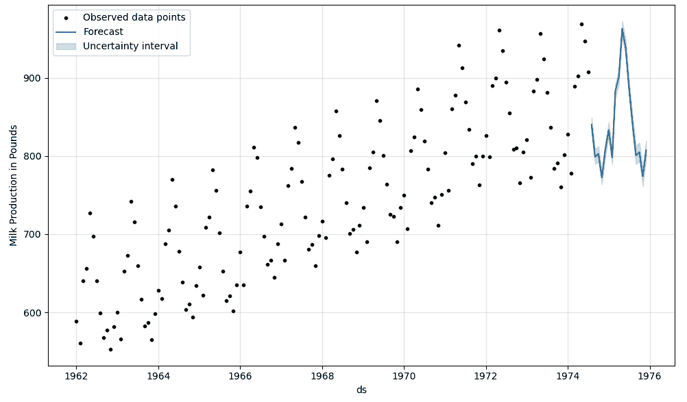
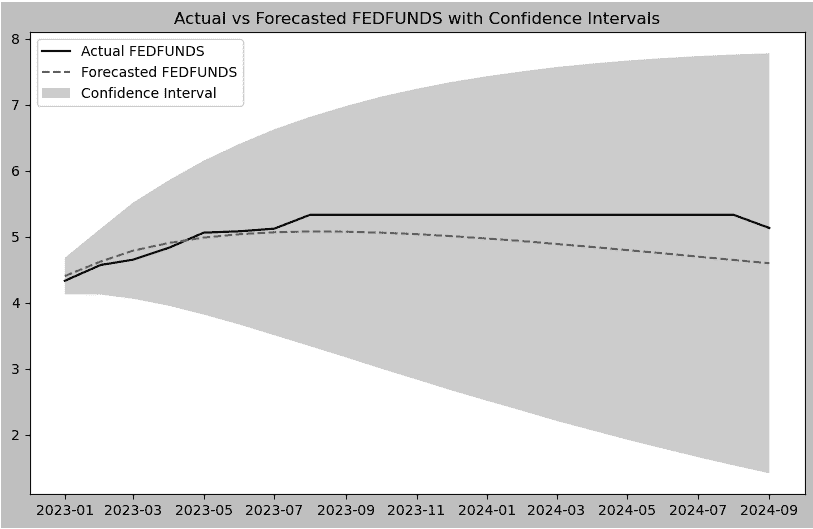
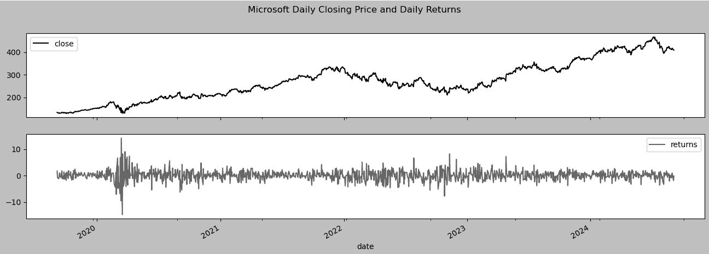

# 第十一章：11 种时间序列的附加统计建模技术

## 加入我们的 Discord 书籍社区


[`packt.link/zmkOY`](https://packt.link/zmkOY)

在*第十章*，*使用统计方法构建单变量时间序列模型*中，你学习了流行的预测技术，如*指数平滑法、非季节性 ARIMA*，*和季节性 ARIMA*。这些方法通常被称为经典的统计预测方法，具有快速、易实现和易解释的特点。

在本章中，你将深入学习基于上一章基础的额外统计方法。本章将介绍一些可以自动化时间序列预测和模型优化的库——Facebook（Meta）的`Prophet`库。此外，你将探索`statsmodels`的**向量自回归（VAR）**类，用于处理多变量时间序列，以及`arch`库，它支持用于金融数据波动性建模的**GARCH**模型。

本章的主要目标是让你熟悉**自动化预测工具**（如 Prophet），并介绍**多变量时间序列建模**的概念，使用 VAR 模型。你还将了解如何在金融时间序列中建模和预测**波动性**，这对于风险管理和财务决策至关重要。

在本章中，我们将涵盖以下食谱：

+   使用 Facebook Prophet 进行时间序列数据预测

+   使用 VAR 预测多变量时间序列数据

+   评估向量自回归（VAR）模型

+   使用 GARCH 预测金融时间序列数据中的波动性

## 技术要求

你可以从本书的 GitHub 仓库下载 Jupyter Notebooks 以便跟随学习，并下载本章所需的数据集：

+   Jupyter Notebooks: [`github.com/PacktPublishing/Time-Series-Analysis-with-Python-Cookbook./blob/main/code/Ch11/Chapter%2011.ipynb`](https://github.com/PacktPublishing/Time-Series-Analysis-with-Python-Cookbook./blob/main/code/Ch11/Chapter%2011.ipynb)

+   数据集: [`github.com/PacktPublishing/Time-Series-Analysis-with-Python-Cookbook./tree/main/datasets/Ch11`](https://github.com/PacktPublishing/Time-Series-Analysis-with-Python-Cookbook./tree/main/datasets/Ch11)

在本章的食谱中，你将使用一些常见的库。你可以通过以下代码提前导入它们：

```py
import pandas as pd
import numpy as np
import matplotlib.pyplot as plt
from pathlib import Path
import warnings
warnings.filterwarnings('ignore')
plt.rc("figure", figsize=(16, 5))
```

## 使用 Facebook Prophet 进行时间序列数据预测

**Prophet** 库是一个流行的开源项目，最初由 Facebook（现为 Meta）开发，基于 2017 年的一篇论文，提出了一种时间序列预测算法，标题为《*大规模预测*》。该项目因其简单性、能够创建高效的预测模型、以及处理复杂季节性、假期效应、缺失数据和异常值的能力而广受欢迎。Prophet 自动化了许多设计预测模型的过程，同时提供了丰富的内置可视化功能。其他功能包括构建增长模型（如**饱和预测**）、处理趋势和季节性的 不确定性，以及**检测变化点**。

在本教程中，您将使用 `Milk Production` 数据集进行性能基准测试。这是 *第十章，使用统计方法构建单变量时间序列模型* 中介绍的相同数据集。使用相同的数据集有助于理解和比较不同的方法。

Prophet 是一个**加性回归模型**，可以处理**非线性趋势**，特别是在存在强烈季节性效应时。该模型将时间序列数据分解为三个主要组成部分：*趋势*、*季节性*和*假期*，形式如下所示：


其中：

+   是趋势函数，

+   代表周期性季节性函数，

+   考虑到假期的影响，

+   是残差误差项。

Prophet 使用**贝叶斯推断**自动调整和优化模型组件。其背后依赖于**Stan**，一个最先进的贝叶斯建模平台，当前的 Python 接口为 **cmdstand** 和 **cmdstanpy**（取代了早期的 **PyStan**）。最近的更新提高了与 Apple M1/M2 芯片的兼容性，并增强了模型自定义选项，例如调整假期处理和缩放输出。

### 准备工作

您可以在本书的 GitHub 仓库中找到 Jupyter 笔记本和必要的数据集。有关更多信息，请参阅本章的 *技术要求* 部分。我们为本教程使用 Prophet 1.0 版本。

在安装像 Prophet 这样的新库时，创建一个新的 Python 环境总是一个好主意。如果您需要快速回顾如何创建虚拟 Python 环境，可以查看 *第一章，时间序列分析入门* 中的 *开发环境设置教程*。该章节介绍了两种方法：使用 `conda` 和 `venv`。

例如，您可以像以下示例一样使用 conda 创建环境：

```py
conda create -n prophet python=3.11 -y
```

上述代码将创建一个名为 `prophet` 的新虚拟环境。要使新的 `prophet` 环境在 Jupyter 中可见，可以运行以下代码：

```py
python -m ipykernel install --user --name prophet --display-name "Prophet"
conda activate prophet
```

一旦新环境被激活，您就可以安装 Prophet 库。要使用 **pip** 安装，您可以运行以下命令：

```py
pip install prophet
```

要使用 **conda** 安装，请使用以下命令：

```py
conda install -c conda-forge prophet
```

### 如何做到这一点…

Prophet 要求输入数据为一个包含两个特定列的 pandas DataFrame：一个名为`ds`的**datetime**列和一个名为`y`的目标变量列——这是你希望预测的变量。Prophet 不能直接处理`Datetimeindex`。因此，确保这些列明确命名非常重要。如果数据包含超过两列，Prophet 只会识别`ds`和`y`，并默认忽略其他列。然而，如果你想添加额外的预测变量（回归器），可以使用`add_regressor`方法。如果这些列缺失或命名不正确，Prophet 会抛出错误。

为确保数据格式正确，请按照以下步骤操作：

1.  首先读取`milk_productions.csv`文件并重命名列为`ds`和`y`：

```py
from prophet import Prophet
milk_file = Path('../../datasets/Ch11/milk_production.csv')
milk = pd.read_csv(milk_file, parse_dates=['month'])
milk.columns = ['ds', 'y']
milk.info()
>>
<class 'pandas.core.frame.DataFrame'>
RangeIndex: 168 entries, 0 to 167
Data columns (total 2 columns):
 #   Column  Non-Null Count  Dtype        
---  ------  --------------  -----        
 0   ds      168 non-null    datetime64[ns]
 1   y       168 non-null    int64        
dtypes: datetime64ns, int64(1)
memory usage: 2.8 KB
```

1.  将数据拆分为**测试集**和**训练集**。我们使用`90/10`的比例进行拆分，代码如下：

```py
idx = round(len(milk) * 0.90)
train = milk[:idx]
test = milk[idx:]
print(f'Train: {train.shape}')
print(f'Test: {test.shape}')
>>
Train: (151, 2)
Test: (17, 2)
```

1.  你可以通过以下一行代码创建一个 Prophet 类的实例，并使用`fit`方法在训练集上进行拟合。牛奶生产的时间序列是*按月*记录的，具有趋势和稳定的季节性波动（加性）。Prophet 的默认`seasonality_mode`是`additive`，所以保持原样即可：

```py
from prophet import Prophet
model = Prophet().fit(train)
```

1.  在你使用模型进行预测之前，需要进行一些设置。使用`make_future_dataframe`方法将`train` DataFrame 扩展到特定的预测期数，并按指定频率生成数据：

```py
future = m_milk.make_future_dataframe(len(test), freq='MS')
```

这会将训练数据延长 17 个月（`test`集中的期数）。总之，你应该拥有与牛奶 DataFrame（训练和测试）中相同数量的期数。频率设置为**月初**，即`freq='MS'`。`future`对象只包含一个列`ds`，其类型为`datetime64[ns]`，用于填充预测值：

```py
len(milk) == len(future)
>> True
print(future.tail())
>>
            ds
163 1975-08-01
164 1975-09-01
165 1975-10-01
166 1975-11-01
167 1975-12-01
```

1.  使用`predict`方法对`future` DataFrame 进行预测。结果将是一个与`forecast`长度相同的 DataFrame，但现在会增加一些额外的列：

```py
forecast = model.predict(future)
forecast.columns.tolist()
>>
['ds',
 'trend',
 'yhat_lower',
 'yhat_upper',
 'trend_lower',
 'trend_upper',
 'additive_terms',
 'additive_terms_lower',
 'additive_terms_upper',
 'yearly',
 'yearly_lower',
 'yearly_upper',
 'multiplicative_terms',
 'multiplicative_terms_lower',
 'multiplicative_terms_upper',
 'yhat']
```

请注意，Prophet 返回了许多细节，帮助你了解模型的表现。重点是`ds`和预测值`yhat`。`yhat_lower`和`yhat_upper`分别表示预测的不确定性区间（`yhat`）。

1.  `model`对象提供了两个绘图方法：`plot`和`plot_components`。首先使用`plot`方法来可视化 Prophet 的预测结果：

```py
model.plot(forecast,
           ylabel='Milk Production in Pounds',
           include_legend=True);
```

这应该会生成一个 Prophet 预测图：图中的点代表训练数据点，点上的线代表历史数据的估计预测，线条延伸到训练点之外，反映未来的预测。


图 11.4 – 使用 Prophet 绘制预测图（历史与未来）

如果你只想展示超出训练集的预测期，可以使用以下代码：

```py
predicted = model.predict(test)
model.plot(predicted,
           ylabel='Milk Production in Pounds',
          include_legend=True);
```

这里你只预测了测试数据集的长度。预测方法将仅捕获 `ds` 列（日期时间）。这将生成一个类似于*图 11.4*所示的图表，但它只会显示未来数据点（训练数据点之后）的预测线——即未来的预测。



图 11.5 – 使用 Prophet 绘制预测（历史和未来）

*图 11.4* 中的阴影区域表示不确定性区间。这由 `forecast` 数据框中的 `yhat_lower` 和 `yhat_upper` 列表示。

1.  接下来，重要的图表涉及预测组件。使用 `plot_components` 方法绘制这些组件：

```py
model.plot_components(forecast);
```

子图的数量将取决于预测中已识别的组件数量。例如，如果包括了假期，那么将会显示`holiday`组件。在我们的示例中，将有两个子图：`trend`和`yearly`：


图 11.6 – 绘制显示趋势和季节性（年度）的组成部分

*图 11.6* 展示了训练数据的趋势和季节性。如果你查看*图 11.6*，你会看到一个持续上升的趋势，自 1972 年以来逐渐稳定（放缓）。此外，季节性模式显示出夏季时生产量的增加。

趋势图中的阴影区域表示估算趋势的不确定性区间。数据存储在 `forecast` 数据框的 `trend_lower` 和 `trend_upper` 列中。

1.  最后，与样本外数据（测试数据）进行比较，看看模型的表现如何：

```py
ax = test.plot(x='ds', y='y',
                    label='Actual',
                    style='-.',
                    figsize=(12,4))
predicted.plot(x='ds', y='yhat',
               label='Predicted',
               ax=ax,
               title='Milk Production Actual vs Forecast');
```

将以下图表与*第十章的图 10.43*进行比较，看看**Prophet**与使用 `auto_arima` 获得的**SARIMA**模型有何不同：


图 11.7 – 将 Prophet 的预测与测试数据进行比较

注意，对于高度季节性的牛奶生产数据，模型表现非常出色。通常，Prophet 在处理强季节性时间序列数据时表现优异。

### 工作原理...

Prophet 精简了构建和优化时间序列模型的多个方面，但在开始时需要一些关键指令，以便 Prophet 正确调整模型。例如，在初始化模型时，你需要决定季节性效应是加法模型还是乘法模型。你还需要指定诸如数据频率（例如，对于按月数据的`freq='MS'`）等参数，并使用 `make_future_dataframe` 方法来扩展预测范围。

当你实例化模型 `model = Prophet()` 时，Prophet 会使用默认的参数值，例如 `yearly_seasonality='auto'`、`weekly_seasonality='auto'` 和 `daily_seasonality='auto'`。这使得 Prophet 可以**自动**根据数据来确定需要包含的季节性分量。在牛奶生产数据集中，只检测到年度季节性，如下所示：

```py
model.seasonalities
>>
OrderedDict([('yearly',
              {'period': 365.25,
               'fourier_order': 10,
               'prior_scale': 10.0,
               'mode': 'additive',
               'condition_name': None})])
```

Prophet 还提供了**不确定性区间**来预测结果，这些区间受到三个因素的影响：

+   **观测噪声**：指的是无法通过模型解释的观测数据中的随机变化。

+   **参数不确定性**：指的是在估计模型参数时的的不确定性。例如，调整 `mcmc_samples` 参数（**马尔可夫链蒙特卡罗** 或 **MCMC** 采样）来获取季节性分量的不确定性。默认值为零 (`0`)。

+   **未来趋势不确定性**：指的是基于历史数据对未来趋势变化的预期不确定性。例如，增加 `changepoint_prior_scale` 参数值可以增加预测的不确定性。默认值设置为 `0.05`。此外，区间宽度也可以通过 `interval_width` 参数进行调整（默认为 0.80 或 80%）。

默认情况下，`uncertainty_samples` 参数设置为 `1000`，这意味着 Prophet 会使用**哈密顿蒙特卡罗（HMC）**算法进行 1000 次模拟来估计不确定性。你可以调整此值以控制模拟次数，或者通过设置 `uncertainty_samples=0` 或 `uncertainty_samples=False` 来完全关闭不确定性估计。如果禁用不确定性样本，Prophet 会从预测结果中省略像 `yhat_lower` 和 `yhat_upper` 这样的不确定性区间。

```py
model = Prophet(uncertainty_samples=False).fit(train)
forecast = model.predict(future)
forecast.columns.tolist()
>>
['ds', 'trend', 'additive_terms', 'yearly', 'multiplicative_terms', 'yhat']
```

Prophet 的优势在于它能够**自动检测变化点**，这些是趋势发生显著变化的时间点。默认情况下，Prophet 会在训练数据的前 80% 中识别 25 个潜在变化点。你可以通过调整 `n_changepoints` 参数来修改此行为，或者通过 `changepoint_range` 控制用于变化点检测的历史数据量，默认值为 `0.8`（即 80%）。

你可以通过模型的 `changepoints` 属性检查检测到的变化点。例如，以下代码显示前五个变化点：

```py
model.changepoints.shape
>>
(25,)
model.changepoints.head()
>>
5    1962-06-01
10   1962-11-01
14   1963-03-01
19   1963-08-01
24   1964-01-01
Name: ds, dtype: datetime64[ns]
```

这些变化点也可以在图表上进行可视化。以下代码将变化点叠加到原始时间序列数据上：

```py
ax = milk.set_index('ds').plot(figsize=(12,5))
milk.set_index('ds').loc[model.changepoints].plot(style='X', ax=ax)
plt.legend(['original data', 'changepoints']);
```

这应该会生成一个图表，展示原始时间序列及 25 个潜在变化点，显示 Prophet 识别的趋势变化时刻。


图 11.8 – Prophet 所识别的 25 个潜在变化点

这些潜在变化点是从训练数据的前 80% 中估算出来的。

在接下来的章节中，你将更详细地探索变化点检测。

### 还有更多内容…

要绘制捕捉趋势中影响较大的变化点，你可以使用`add_changepoints_to_plot`函数，如以下代码所示：

```py
from prophet.plot import add_changepoints_to_plot
fig = model.plot(forecast, ylabel='Milk Production in Pounds')
add_changepoints_to_plot(fig.gca(), model, forecast);
```

这将生成类似于*图 11.8*的图表，但会有额外的变化点线和趋势线。图 11.9 中的 25 个变化点中有 10 个（垂直线是显著的变化点）。线性趋势线应与*图 11.6*中显示的趋势成分相同：


图 11.9 – 显示十个显著的变化点和趋势线

注意趋势线在识别出的变化点处的变化。这就是 Prophet 如何检测趋势变化的方式。由于应用了**分段回归**来构建趋势模型，趋势线并不是完全直线。当考虑*分段线性模型*时，你可以把它看作是多个线性回归线段（在显著变化点之间），然后将这些线段连接起来。这使得模型能够灵活地捕捉到趋势中的**非线性**变化，并进行未来预测。

Prophet 还包含**交叉验证**功能，以更好地评估模型在预测未来数据时的表现。交叉验证用于确保模型能够很好地泛化到未见过的数据，而不是出现过拟合或欠拟合的情况。此外，交叉验证还可以帮助你确定预测结果在多长时间内仍然可靠。

Prophet 提供了`cross_validation`和`performance_metrics`函数，允许你将数据拆分成训练集和测试集，并跨多个时段进行验证。这种方法通过在不同时间点进行预测并与实际值进行比较，帮助评估模型的准确性。

这是在 Prophet 中实现交叉验证的方法。

```py
from prophet.diagnostics import cross_validation, performance_metrics
df_cv = cross_validation(model, initial='730 days', period='180 days', horizon='365 days')
df_cv.head()
>>
         ds        yhat  yhat_lower  yhat_upper    y     cutoff
0 1964-03-01  689.889300  685.612439  694.504671  688 1964-02-19
1 1964-04-01  701.435214  697.157285  706.019257  705 1964-02-19
2 1964-05-01  776.047139  771.707065  780.994528  770 1964-02-19
3 1964-06-01  735.045494  730.374821  739.547374  736 1964-02-19
4 1964-07-01  671.333097  666.625404  675.994830  678 1964-02-19
```

在前面的代码中，我们指定了以下参数：

`initial`：初始训练期的大小。在我们的代码中，我们指定了 730 天，大约是 2 年，或者是 24 个月，用于我们的月度牛奶生产数据。

`period`：进行预测时切分点之间的间隔。在这个例子中，我们指定了 180 天（大约 6 个月）。这意味着在初始训练后，Prophet 会按 6 个月的增量向前推进。

`horizon`：预测的时间跨度（预测未来的时间长度）。在这个例子中，我们指定了 365 天或 1 年。这意味着 Prophet 将在每个切分点之后的 12 个月（1 年）内进行预测。

在执行交叉验证之后，你可以使用`performance_metrics`函数评估模型的表现。

```py
df_p = performance_metrics(df_cv)
print(df_p.iloc[: , 0:-1].head())
>>
horizon         mse       rmse        mae      mape     mdape     smape
0 41 days  226.788248  15.059490  12.300991  0.016356  0.016894  0.016345
1 42 days  220.336066  14.843721  11.849186  0.015699  0.015678  0.015694
2 45 days  214.385008  14.641892  11.647620  0.015503  0.015678  0.015503
3 46 days  207.646253  14.409936  11.380352  0.015170  0.014446  0.015164
4 47 days  242.132208  15.560598  12.179413  0.015953  0.014446  0.015986
```

该函数计算多个指标，如**平均绝对误差**（MAE）、**均方根误差**（RMSE）等。

你可以使用`plot_cross_validation_metric`函数来可视化交叉验证预测的表现：

```py
from prophet.plot import plot_cross_validation_metric
fig = plot_cross_validation_metric(df_cv, metric='rmse');
```

这应该会绘制不同预测时段的 RMSE。


图 11.10 – 显示模型在不同预测期的 RMSE 曲线

对图形的解释表明，该模型在短期预测期内表现较好，因为 RMSE 相对较低。随着预测期的增加，RMSE 似乎普遍增加。通常，我们期望这些模型在短期预测（1-3 个月）内表现更好，误差更小。

### 另请参见

+   Prophet 支持 Python 和 R。有关 Python API 的更多信息，请访问以下文档：[`facebook.github.io/prophet/docs/quick_start.html#python-api`](https://facebook.github.io/prophet/docs/quick_start.html#python-api)。

+   如果你有兴趣阅读关于 Prophet 算法的原始论文，可以通过此链接访问：[`peerj.com/preprints/3190/`](https://peerj.com/preprints/3190/)。

+   交叉验证也可以用于微调模型的超参数。你可以在这里了解更多：[`facebook.github.io/prophet/docs/diagnostics.html#hyperparameter-tuning`](https://facebook.github.io/prophet/docs/diagnostics.html#hyperparameter-tuning)

到目前为止，你一直在处理单变量时间序列。接下来的章节将教你如何处理多元时间序列。

## 使用 VAR 预测多元时间序列数据

在本章节中，你将探索用于处理多元时间序列的**向量自回归**（**VAR**）模型。在*第十章*，《使用统计方法构建单变量时间序列模型》中，我们讨论了 AR、MA、ARIMA 和 SARIMA 作为单变量单向模型的示例。而 VAR 则是**双向**且**多元**的。

> VAR 与 AR 模型的比较
> 
> > 你可以将阶数为 p 的 VAR，或称**VAR(p)**，视为单变量 AR(p) 的一种推广，用于处理多个时间序列。多个时间序列被表示为一个向量，因此命名为向量自回归。滞后为一（1）的 VAR 可以表示为 VAR(1)，涉及两个或更多变量。

还有其他形式的多元时间序列模型，包括**向量移动平均**（**VMA**）、**向量自回归移动平均**（**VARMA**）和**向量自回归积分移动平均**（**VARIMA**），它们是对其他单变量模型的推广。在实践中，你会发现由于其简单性，VAR 使用得最多。VAR 模型在经济学中非常流行，但你也会在其他领域看到它的应用，如社会科学、自然科学和工程学。

多变量时间序列的前提是，当利用多个时间序列（或输入变量）而不是单一时间序列（单一变量）时，可以增强预测的能力。简而言之，当你有两个或更多的时间序列，并且它们彼此间有（或假设有）相互影响时，VAR 就可以被使用。这些通常被称为**内生**变量，其关系是双向的。如果变量或时间序列之间没有直接关系，或者我们不知道它们是否存在直接的影响，则称其为**外生**变量。

> 外生与内生变量
> 
> > 当你开始深入研究 VAR 模型时，你会遇到关于**内生**和**外生**变量的引用。从宏观角度来看，这两者是相互对立的，在`statsmodels`中，它们分别被称为`endog`和`exog`。
> > 
> > **内生**变量受到系统内其他变量的影响。换句话说，我们预期一个状态的变化会影响其他状态。有时，这些变量在机器学习文献中被称为依赖变量。你可以使用**Granger 因果检验**来确定多个内生变量之间是否存在这种关系。例如，在`statsmodels`中，你可以使用`grangercausalitytests`。
> > 
> > 另一方面，**外生**变量位于系统外部，并且不直接影响其他变量。它们是外部影响因素。有时，这些变量在机器学习文献中被称为独立变量。

类似于 AR 模型，VAR 模型假设时间序列变量的**平稳性**。这意味着每个内生变量（时间序列）需要是平稳的。

为了说明 VAR 是如何工作的以及背后的数学公式，我们从一个简单的 VAR(1)模型开始，该模型包含**两个**（2）内生变量，表示为()。回顾一下*第十章*，*使用统计方法构建单变量时间序列模型*，AR(1)模型的形式如下：

一般来说，AR(p)模型是自我过去值的线性模型，其中(p)参数告诉我们应该追溯多远。现在，假设你有**两个**AR(1)模型，分别对应两个不同的时间序列数据。其形式如下：


然而，这两个模型是独立的，没有展示出任何相互关系或相互影响。如果我们创建这两个模型的**线性组合**（即自身过去值和另一个时间序列的过去值），我们将得到以下公式：


图 11.11 – 带滞后一期的 VAR 模型公式，或 VAR(1)

上述方程看起来可能很复杂，但最终，像 AR 模型一样，它仍然只是过去滞后值的线性函数。换句话说，在 VAR(1) 模型中，每个变量都将有一个滞后(1)的线性函数。当拟合 VAR 模型时，正如你将在本食谱中看到的那样，使用**最小二乘法**(**OLS**)方法来估计每个方程的 VAR 模型。

### 准备开始

在本食谱中，你将使用 `pandas_datareader` 库从 FRED（联邦储备经济数据）下载数据。相关文件也可以从本书的 GitHub 仓库下载。

使用**conda**安装：

```py
conda install -c anaconda pandas-datareader
```

使用**pip**安装：

```py
pip install pandas-datareader
```

### 如何操作……

在本食谱中，你将使用 `pandas_datareader` 库中的 `FredReader()` 函数来提取两个不同的时间序列数据集。正如 FRED 网站上所提到的，第一个符号 `FEDFUNDS` 是**联邦基金有效利率**，它*“是存款机构之间互相过夜交易联邦基金（存放在联邦储备银行的余额）的利率”*。简单来说，联邦基金有效利率影响借贷成本。它是*由联邦公开市场委员会（FOMC）设定的目标利率，用于确定银行向其他机构收取的利率，特别是借出其储备余额中的多余现金的利率。* 第二个符号是 `unrate`，代表**失业率**，它是指总劳动人口中正在积极寻找工作或愿意工作的失业人员的比例。

> 引用
> 
> > *美国联邦储备系统理事会*，*联邦基金有效利率 [FEDFUNDS]*，来自 FRED，圣路易斯联邦储备银行； https://fred.stlouisfed.org/series/FEDFUNDS，2024 年 10 月 6 日。
> > 
> > *美国劳动统计局*，*失业率 [UNRATE]*，来自 FRED，圣路易斯联邦储备银行； https://fred.stlouisfed.org/series/UNRATE，2024 年 10 月 6 日。

按照以下步骤进行：

1.  开始时加载必要的库并提取数据。注意，`FEDFUNDS` 和 `unrate` 都是按月报告的：

```py
import pandas_datareader.data as web
import pandas as pd
from statsmodels.tsa.api import VAR,adfuller, kpss
from statsmodels.tsa.stattools import grangercausalitytests
```

1.  使用 `FredReader` 提取数据，`FredReader` 封装了 FRED API，并返回一个 pandas DataFrame。对于 `FEDFUNDS` 和 `unrate` 符号，你将提取大约 34 年的数据（417 个月）：

```py
import pandas_datareader.data as web
start = "01-01-1990"
end = "01-09-2024"
economic_df = web.FredReader(
        symbols=["FEDFUNDS", "unrate"],
        start=start,
        end=end).read()
file = '../../datasets/Ch11/economic_df.pickle'
economic_df.to_pickle(file)
```

将数据框存储为 `pickle` 对象，如前面的代码最后一行所示。这样，你就不需要再次调用 API 来重新运行示例。你可以使用 `economic_df = pd.read_pickle(file)` 读取 `economic_df.pickle` 文件。

1.  检查数据，确保没有空值：

```py
economic_df.isna().sum()
>>
FEDFUNDS    0
unrate      0
dtype: int64
```

1.  将数据框的频率更改为月初（`MS`），以反映数据存储的方式：

```py
economic_df.index.freq = 'MS'
```

1.  绘制数据集进行可视化检查和理解：

```py
economic_df.plot(subplots=True); plt.show()
```

由于 `subplots` 设置为 `True`，这将为每一列生成两个子图：


图 11.12 – 绘制联邦基金有效利率和失业率

`FEDFUND`和`unrate`之间存在某种反向关系——随着`FEDFUNDS`的增加，`unrate`减少。从 2020 年开始，由于 COVID-19 疫情，出现了有趣的异常行为。我们可以进一步检查这两个变量之间的相关性：

```py
correlation_matrix = economic_df.corr()
correlation_matrix
>>
          FEDFUNDS    unrate
FEDFUNDS  1.000000 -0.435171
unrate   -0.435171  1.000000
```

`FEDFUNDS`和`unrate`之间的相关系数为-0.435，表明存在中等强度的负相关关系（反向相关）。这表明，随着联邦基金利率的上升，失业率趋向下降，反之亦然。

进一步，你可以执行**互相关函数**（CCF）分析`FEDFUNDS`和`unrate`之间不同滞后的相关性。CCF 有助于识别两个时间序列之间的滞后关系或时间依赖性。结果主要告诉我们一个系列是否领先或滞后于另一个系列。这并不是一个正式的因果性检验，你将在后续步骤中进行更深入的调查。

```py
from statsmodels.graphics.tsaplots import plot_ccf
import numpy as np
lags = np.arange(-12, 13)
plot_ccf(economic_df['FEDFUNDS'], economic_df['unrate'], lags=lags)
plt.grid(True)
```


图 11.13 – 前后 12 个月的互相关函数图，便于更好的解释

图中显示了超出阴影置信区间的尖峰，这表明存在显著的负相关。这暗示着`FEDFUNDS`的变化可能与`unrate`的相反变化有关，且这些变化发生在同一时段内。

1.  VAR 模型中的一个重要假设是**平稳性**。两个变量（这两个内生时间序列）需要是平稳的。创建一个`check_stationarity()`函数，该函数返回**扩展型迪基-富勒**（`adfuller`）检验的平稳性结果：

```py
from statsmodels.tsa.stattools import adfuller
def check_stationarity(df):
    adf_pv = adfuller(df)[1]
    result = 'Stationary' if adf_pv < 0.05 else "Non-Stationary"
    return result
```

使用`check_stationarity`函数评估每个内生变量（列）：

```py
for i in economic_df:
    adf = check_stationarity(economic_df[i])
    print(f'{i} adf: {adf}')
>>
FEDFUNDS adf: Stationary
unrate adf: Stationary
```

总体而言，这两个时间序列被证明是平稳的。

1.  绘制**ACF**和**PACF**图，以便对每个变量及其所属的过程（例如 AR 或 MA 过程）获得直观理解：

```py
from statsmodels.graphics.tsaplots import plot_acf, plot_pacf
for col in economic_df.columns:
    fig, ax = plt.subplots(1,2, figsize=(18,4))
    plot_acf(economic_df[col], zero=False,
             lags=30, ax=ax[0], title=f'ACF - {col}')
    plot_pacf(economic_df[col], zero=False,
              lags=30, ax=ax[1], title=f'PACF - {col}');
```

这应该生成`FEDFUNDS`和`unrate`的 ACF 和 PACF：


图 11.11 – `FEDFUNDS`和`unrate`的 ACF 和 PACF 图

`FEDFUNDS`和`unrate`的 ACF 和 PACF 图表明我们正在处理一个**自回归**（**AR**）过程。ACF 图显示出逐渐缓慢衰减，而 PACF 图则显示出在滞后 1 之后的急剧截断。`FEDFUNDS`的 PACF 图在滞后 2 和滞后 3 时显示出略微显著的（超出阴影区域）滞后，而`unrate`的 PACF 图在滞后 24 时显示出一定的显著性。我们可以暂时忽略这些。

1.  将数据分为训练集和测试集：

```py
train = economic_df.loc[:'2022']
test = economic_df.loc['2023':]
print(f'Train: {len(train)}, Test: {len(test)}')
>>
Train: 396, Test: 21
```

1.  你可以对数据进行缩放（**标准化**），尽管 VAR 模型并不要求标准化，且这两个时间序列的规模差异不大。在这一步中，你将进行缩放操作，*仅用于演示目的*，以展示如何进行此操作，并如何在后续步骤中反向转换结果以便进行解释。

    > 在实现 VAR 时，是否需要对变量进行标准化（缩放）常常存在争议。然而，VAR 算法本身并不要求变量必须进行标准化，因为它是**与规模无关的**。在实践中，通常保持变量的原始单位，以**保留系数和残差的可解释性**，这样可以用有意义的术语（例如百分比点）来解释。然而，如果变量在规模上差异显著，则可以应用标准化，以便**更容易比较系数**并更有效地检测**异常值**。
    > 
    > > 如果你选择标准化（例如，使用**Scikit-Learn**中的`StandardScalar`），需要注意，结果将以**标准差**为单位。你可以使用`inverse_transform`方法将数据还原到其原始单位，以便在解释结果时使用。这对于需要在原始变量规模的上下文中解释结果时非常有用。

1.  使用`StandardScalar`对数据进行缩放，通过`fit`方法拟合训练集。然后，使用`transform`方法对**训练集**和**测试集**应用缩放变换。变换将返回一个 NumPy `ndarray`，然后你可以将其作为 pandas DataFrame 返回。这样，你可以更方便地绘制图形并进一步检查 DataFrame：

```py
from sklearn.preprocessing import StandardScaler
scale = StandardScaler()
scale.fit(train)
train_sc = pd.DataFrame(scale.transform(train),
                        index=train.index,
                        columns=train.columns)
test_sc = pd.DataFrame(scale.transform(test),
                       index=test.index,
                       columns=test.columns)
```

1.  那么，如何确定 VAR 模型的最优**滞后期数**（**p**）呢？幸运的是，`statsmodels`中的 VAR 实现会自动选择最佳的 VAR 滞后期数。你只需要定义滞后的最大数量（阈值）；模型将确定最小化每个四种信息准则得分的最佳`p`值：**AIC**、**BIC**、**FPE**和**HQIC**。`select_order`方法会计算每个滞后期数的得分，而`summary`方法会显示每个滞后的得分。这些结果将有助于在训练（`fit`）模型时指定算法应使用哪些信息准则：

```py
model = VAR(endog=train_sc)
res = model.select_order(maxlags=10)
res.summary()
```

这应该显示所有`10`个滞后的结果。最低的得分会用`*`标记：

```py
VAR Order Selection (* highlights the minimums) 
==================================================
       AIC         BIC         FPE         HQIC  
--------------------------------------------------
0      -0.2862     -0.2657      0.7511     -0.2780
1       -7.345      -7.283   0.0006461      -7.320
2       -7.874      -7.772   0.0003805      -7.833
3       -7.960     -7.817*   0.0003491     -7.903*
4       -7.960      -7.775   0.0003492      -7.887
5       -7.951      -7.726   0.0003523      -7.862
6       -7.967      -7.701   0.0003467      -7.861
7      -7.974*      -7.667  0.0003443*      -7.852
8       -7.957      -7.609   0.0003502      -7.819
9       -7.947      -7.557   0.0003539      -7.792
10      -7.931      -7.501   0.0003593      -7.761
--------------------------------------------------
```

`res`对象是`LagOrderResults`类的一个实例。你可以使用`selected_orders`属性打印每个信息准则的选定滞后期数，该属性返回**最优滞后期数**的字典，包括**AIC**、**BIC**、**FPE**和**HQIC**：

```py
print(res.selected_orders)
>>
{'aic': 7, 'bic': 3, 'hqic': 3, 'fpe': 7}
```

在滞后期 7 时，*AIC*和*FPE*得分最低。另一方面，*BIC*和*HQ*得分在滞后期 3 时最低，表明该模型可能更简洁，滞后期数较少。

通常，*BIC*和*HQIC*倾向于偏好更**简洁的**模型（即滞后期数较少的模型），因为它们对模型复杂度施加更高的惩罚。相反，*AIC*和*FPE*则较为宽松，可能建议使用更高的滞后期数，因为它们对复杂度的惩罚较少。

在这种情况下，**滞后 3**似乎是更安全的选择，旨在追求简洁性并避免过拟合。然而，选择**滞后 7**将会得到一个更复杂的模型，可能捕捉到数据中的更多动态，但也带有更高的过拟合风险。

1.  要训练模型，必须使用*BIC*分数（或其他你选择的标准）。你可以通过更新`ic`参数来尝试不同的信息准则。`maxlags`参数是可选的——如果你留空，模型会根据所选信息准则自动确定最优滞后阶数，在此案例中为`'bic'`。

```py
results = model.fit(ic='bic')
```

这将自动选择最小化 BIC 分数的滞后阶数（即滞后 3）。你可以通过设置`ic='aic'`来尝试其他标准，如 AIC。如果你更倾向于手动指定最大滞后阶数，可以使用`maxlags`参数。请记住，如果同时使用了`maxlags`和`ic`，则`ic`将优先考虑。

1.  运行`results.summary()`将打印详细的总结，包括每个自回归过程的回归结果。

总结中包括了**方程数量**（对应变量的数量）、**信息准则**（AIC、BIC、HQIC 和 FPE）及其他细节，如**对数似然**。这些指标有助于评估模型的整体拟合度和复杂度。

```py
 Summary of Regression Results  
==================================
Model:                         VAR
Method:                        OLS
Date:           Mon, 07, Oct, 2024
Time:                     14:49:51
--------------------------------------------------------------------
No. of Equations:         2.00000    BIC:                   -7.83732
Nobs:                     393.000    HQIC:                  -7.92278
Log likelihood:           466.565    FPE:                0.000342624
AIC:                     -7.97888    Det(Omega_mle):     0.000330737
--------------------------------------------------------------------
```

在总结的最后，有**残差相关矩阵**。该矩阵显示了每个方程中残差（误差）之间的相关性。理想情况下，你希望这些非对角线值尽可能接近**零**。较低的相关性表明模型已经捕捉到了大部分变量之间的关系，且残差中剩余的相关性较小。

```py
Correlation matrix of residuals
            FEDFUNDS    unrate
FEDFUNDS    1.000000 -0.115904
unrate     -0.115904  1.000000
```

`FEDFUNDS`和`unrate`之间的残差相关性为`-0.1159`，相对较小，表明模型很好地捕捉到了这两个变量之间的关系。

1.  使用`k_ar`属性存储 VAR 滞后阶数，以便在以后使用预测方法时能再次使用：

```py
lag_order = results.k_ar
lag_order
>> 3
```

这显示选择的最优滞后阶数为 3。

最后，你可以使用`forecast`或`forecast_interval`方法进行预测。后者将返回预测值，以及**上**和**下置信区间**。这两种方法都需要过去的值和预测的步数。先前的值（`past_y`）将作为预测的初始值：

```py
past_y = train_sc[-lag_order:].values
n = test_sc.shape[0]
forecast, lower, upper = results.forecast_interval(past_y, steps=n)
```

1.  由于你对数据集应用了`StandardScalar`，预测值已被缩放。你需要应用`inverse_transform`将它们转换回原始数据的尺度。你还可以将预测和置信区间转换为 pandas DataFrame，方便使用：

```py
forecast_df = pd.DataFrame(scale.inverse_transform(forecast),
                           index=test_sc.index,
                           columns=test_sc.columns)
lower_df = pd.DataFrame(scale.inverse_transform(lower),
                        index=test_sc.index,
                        columns=test_sc.columns)
upper_df = pd.DataFrame(scale.inverse_transform(upper),
                        index=test_sc.index,
                        columns=test_sc.columns)
```

1.  绘制实际值与预测值`unrate`及其置信区间：

```py
idx = test.index
plt.figure(figsize=(10, 6))
plt.plot(idx, test['unrate'], label='Actual unrate')
plt.plot(idx, forecast_df['unrate'], label='Forecasted unrate', linestyle='dashed')
plt.fill_between(idx, lower_df['unrate'], upper_df['unrate'], alpha=0.2, label='Confidence Interval')
plt.title('Actual vs Forecasted unrate with Confidence Intervals')
plt.legend()
plt.show()
```

这应该绘制实际的测试数据，`unrate` 的预测（中间虚线），以及上下置信区间：


图 11.12 – 绘制带有置信区间的 unrate 预测

在 VAR 模型中，所有变量都同时进行预测，因为该模型假设系统中所有变量的过去值都会对每个变量的未来值产生影响。因此，即使你只关心预测 `unrate` 来自 `FEDFUNDS`，该模型也会基于 `unrate` 预测 `FEDFUNDS` 的未来值。你可以像绘制 `unrate` 的预测一样，绘制 `FEDFUNDS` 的预测，如下所示：

```py
idx = test.index
plt.figure(figsize=(10, 6))
plt.plot(idx, test['FEDFUNDS'], label='Actual FEDFUNDS')
plt.plot(idx, forecast_df['FEDFUNDS'], label='Forecasted FEDFUNDS', linestyle='dashed')
plt.fill_between(idx, lower_df['FEDFUNDS'], upper_df['FEDFUNDS'], alpha=0.2, label='Confidence Interval')
plt.title('Actual vs Forecasted FEDFUNDS with Confidence Intervals')
plt.legend()
plt.show()
```



图 11.13 – 绘制带有置信区间的 FEDFUNDS 预测

> 请记住，训练数据是设置到 2022 年底的，包括 2020 年 COVID-19 导致的重大经济冲击。因此，由于数据的巨大且突然而来的变化，模型的预测可能无法如预期般表现。
> 
> > 你可能需要调整训练-测试划分来适应这一事实，并对模型进行不同的实验。当处理像 COVID-19 这样的重要异常时，必须评估事件是**一次性异常**，其影响将逐渐消退，还是它代表了一种持久的变化，需要在模型中进行特殊处理。
> > 
> > 在这里，**领域知识**变得至关重要：理解经济背景将帮助你决定是否将此类事件建模，或将其视为不应影响未来预测的异常值。

### 它是如何工作的…

向量自回归模型（VAR）在**计量经济学**中非常有用。在评估 VAR 模型的性能时，通常会报告几个重要的分析结果，例如**Granger 因果关系检验**、残差（或误差）分析和**冲击响应分析**。这些对理解变量之间的相互作用至关重要。你将在下一个章节中探索这些内容，*评估向量自回归（VAR）模型*。

在*图 11.11*中，两个变量的 VAR(1) 模型产生了两个方程。每个方程将一个变量的当前值建模为其自身滞后值和另一个变量滞后值的函数。矩阵符号显示了**四个系数**和**两个常数**。每个方程有两个**系数**，分别用于两个变量的滞后值（例如，对于和对于）。**常数**和代表每个方程的截距。

在本配方中，选择的模型是针对两个变量的 VAR(3)模型。VAR(1)和 VAR(3)之间的主要区别在于由于附加滞后项，复杂性有所增加。在 VAR(3)模型中，你将需要求解**十二个系数**（每个变量三个滞后期）和**两个常数**。每个方程都是使用**OLS**估计的，如`results.summary()`输出所示。

*图 11.11*中表示的两个函数显示了 VAR(1)中每个变量不仅受到自身过去值的影响，还受到第二个（内生）变量的过去值的影响。这是 VAR 模型和 AR 模型（仅考虑变量自身滞后）的一个关键区别。VAR 模型捕捉了多个变量之间随时间变化的动态交互。

在下一个配方中，既然模型已经拟合完成，你将花时间绘制 VAR 特定的输出——例如，**脉冲响应（IRs）**和**预测误差方差分解（FEVD）**——以更好地理解这些相互作用以及变量之间的影响。

在本配方中，我们专注于使用模型进行**预测**；接下来，我们将专注于理解**因果关系**，使用 Granger 因果关系检验等工具，并通过额外的诊断评估模型的整体性能。

> VARIMA（向量 ARIMA）模型扩展了 VAR，用于通过加入**差分**来处理非平稳数据。我们在这里没有使用它，因为两个时间序列都是平稳的，所以不需要差分。在处理多个需要差分以实现平稳的非平稳变量时，可以考虑使用 VARIMA。

### 还有更多……

由于我们关注的是比较预测结果，观察包含两个内生变量的 VAR(3)模型是否比单变量 AR(3)模型表现更好是很有趣的。将多元 VAR(3)模型与更简单的 AR(3)（或 ARIMA(3,0,0)）模型进行比较有助于评估第二个变量（`FEDFUNDS`）的加入是否改善了对`unrate`的预测。

你可以尝试为**unrate**时间序列拟合 AR(3)或 ARIMA(3,0,0)模型，并使用相同的滞后值以保持一致性。由于`unrate`序列是平稳的，因此无需进行差分。回想一下，从之前的活动中，`lag_order`等于 3。

```py
from statsmodels.tsa.arima.model import ARIMA
model = ARIMA(train['unrate'],
              order=(lag_order,0,0)).fit()
```

你可以使用`model.summary()`查看 ARIMA 模型的摘要。拟合模型后，你可以通过绘制诊断图表来评估残差，以检查模型拟合是否存在问题：

```py
fig = model.plot_diagnostics(figsize=(12,6));
fig.tight_layout()
plt.show()
```

这将生成四个诊断子图：


图 11.14 – AR(3)或 ARIMA(3,0,0)模型诊断图输出

标准化残差图显示在 2020 年左右出现显著峰值，这可能是由于 COVID-19 的经济影响。根据 Q-Q 图，还可以观察到一些偏离正态分布的迹象，表明该模型可能未完全捕捉数据尾部行为。总体而言，AR 模型根据自相关图捕捉到了必要的信息。

现在，使用 AR(3)模型预测未来步骤，并将其与我们已经拟合并应用了`inverse_transform`的 VAR(3)模型进行比较：

```py
# Forecast from AR(3) model
ar_forecast = pd.Series(model.forecast(n), index=test.index)
# Plot the forecast for AR(3) against the actual data
idx = test.index
plt.figure(figsize=(10, 4))
plt.plot(idx, test['unrate'], label='Actual unrate')
plt.plot(idx, ar_forecast, label='Forecasted unrate', linestyle='dashed')
plt.title('AR(3) model - Actual vs Forecasted unrate')
plt.legend()
plt.show()
```

这应该会生成以下图表：


图 11.15 – AR(3)预测与实际结果对比（测试集）

同样的图表也可以为 VAR(3)模型绘制，该模型考虑了`FEDFUNDS`对`unrate`的影响：

```py
# plotting VAR(3) same code as before but without confidence intervals
idx = test.index
plt.figure(figsize=(10, 4))
plt.plot(idx, test['unrate'], label='Actual unrate')
plt.plot(idx, forecast_df['unrate'], label='Forecasted unrate', linestyle='dashed')
plt.title('VAR(3) model - Actual vs Forecasted unrate')
plt.legend()
plt.show()
```

这应该会生成以下图表：


图 11.16 – VAR(3)预测与实际结果对比（测试集）

最后，我们将计算**均方根误差**（**RMSE**）得分，以比较两个模型（VAR 和 AR）在测试数据上的表现：

```py
from statsmodels.tools.eval_measures import rmse
rmse_var = rmse(test['FEDFUNDS'], forecast_df['unrate'])
print('VAR(3) RMSE = ', rmse_var)
rmse_ar = rmse(test['FEDFUNDS'], ar_forecast)
print('AR(3) RMSE = ', rmse_ar)
>>
VAR(3) RMSE =  0.9729655920788434
AR(3) RMSE =  0.7693416723850359
```

AR(3)模型相较于 VAR(3)模型具有更低的 RMSE，表明仅考虑`unrate`过去值的简单 AR(3)模型在此案例中表现更佳。包含`unrate`和`FEDFUNDS`的 VAR(3)模型并未显著提高`unrate`的预测精度。

根据结果，可能更倾向于选择 AR(3)模型，因为其复杂度较低且预测精度较高。然而，当变量之间存在更强的相互作用时，VAR 模型可以提供**额外的洞察力**和更精确的预测。

### 另见...

要了解有关 statsmodels 中 VAR 类的更多信息，请访问官方文档：[`www.statsmodels.org/dev/generated/statsmodels.tsa.vector_ar.var_model.VAR.html`](https://www.statsmodels.org/dev/generated/statsmodels.tsa.vector_ar.var_model.VAR.html)。

## 评估向量自回归（VAR）模型

在拟合 VAR 模型之后，下一步是评估模型如何捕捉不同内生变量（多个时间序列）之间的相互作用和动态关系。了解这些关系有助于您评估因果关系，变量如何相互影响，以及一个变量的冲击如何在系统中传播。

在本配方中，您将继续上一个配方《*多元时间序列数据预测*》中使用*VAR*的内容，并探索各种诊断工具以加深您对 VAR 模型的理解。具体来说，测试格兰杰因果关系，分析**残差自相关函数**（**ACF**）图，使用**脉冲响应函数**（**IRF**）以及进行**预测误差方差分解**（**FEVD**）。

这些评估步骤将帮助你理解系统中变量之间的**因果关系**和**相互依赖关系**，确保你的模型正确捕捉到潜在的动态。

### 如何操作...

以下步骤接着上一个步骤进行。如果你没有执行过这些步骤，可以运行附带的**Jupyter Notebook**中的代码来继续进行。你将专注于诊断之前创建的 VAR(3)模型：

1.  首先，进行格兰杰因果关系检验，以确定一个时间序列是否可以用来预测另一个。在本例中，你需要找出`FEDFUNDS`是否可以用来预测`unrate`。

根据之前的步骤，你已经使用**BIC**准则选择了**3 个滞后期**。然而，你可以根据数据的特性或具体的研究问题，调整滞后期的顺序，并在需要时测试更高的滞后期。

1.  **格兰杰因果关系检验**在`statsmodels`中通过`grangercausalitytests()`函数实现，该函数在每个过去的滞后期上执行**四项检验**。你可以通过`maxlag`参数控制滞后期的数量。格兰杰因果关系检验用于确定一个变量的过去值是否影响另一个变量。

格兰杰因果关系检验中的**原假设**是第二个变量（在本例中为`FEDFUNDS`）不对第一个变量（在本例中为`unrate`）产生格兰杰因果关系。换句话说，假设在**影响或效应**方面没有**统计学意义**。要测试`FEDFUNDS`是否影响`unrate`，你需要在应用检验之前交换列的顺序：

```py
granger = grangercausalitytests(
            x=economic_df[['unrate', 'FEDFUNDS']],
            maxlag=3)
```

根据之前选择的 BIC 准则，测试的最大滞后期设为 3。输出将显示每个滞后期的*检验统计量*、*p 值*和*自由度*。重点关注**p 值**，以决定是否拒绝或接受原假设。

```py
Granger Causality
number of lags (no zero) 1
ssr based F test:         F=0.5680  , p=0.4515  , df_denom=413, df_num=1
ssr based chi2 test:   chi2=0.5721  , p=0.4494  , df=1
likelihood ratio test: chi2=0.5717  , p=0.4496  , df=1
parameter F test:         F=0.5680  , p=0.4515  , df_denom=413, df_num=1
Granger Causality
number of lags (no zero) 2
ssr based F test:         F=21.9344 , p=0.0000  , df_denom=410, df_num=2
ssr based chi2 test:   chi2=44.4039 , p=0.0000  , df=2
likelihood ratio test: chi2=42.1852 , p=0.0000  , df=2
parameter F test:         F=21.9344 , p=0.0000  , df_denom=410, df_num=2
Granger Causality
number of lags (no zero) 3
ssr based F test:         F=21.6694 , p=0.0000  , df_denom=407, df_num=3
ssr based chi2 test:   chi2=66.1262 , p=0.0000  , df=3
likelihood ratio test: chi2=61.3477 , p=0.0000  , df=3
parameter F test:         F=21.6694 , p=0.0000  , df_denom=407, df_num=3
```

由于滞后期 2 和 3 的 p 值都小于 0.05，这表明`FEDFUNDS`对`unrate`有**格兰杰因果关系**。换句话说，考虑到 2 个月或 3 个月的滞后期时，`FEDFUNDS`的过去值对`unrate`具有显著的预测能力。

1.  接下来，你将探讨残差图。之前步骤中的`results`对象`results = model.fit(ic='bic')`是`VARResultsWrapper`类型，与`VARResults`类相同，拥有相同的方法和属性。首先使用`plot_acorr`方法绘制残差的**ACF**图：

```py
results.plot_acorr(resid=True)
plt.show();
```

这将生成四个图（2x2 图——每个变量各两个）来展示残差的**自相关**和**交叉相关**。回忆*图 11.11*，对于两个变量，你将有两个函数，这将转化为 2x2 的残差子图。如果有三个变量，则会有一个 3x3 的子图：


图 11.17 – 残差自相关和交叉相关图

不幸的是，*图 11.17*中的图表没有正确的标签。第一行的图表对应数据框架中的第一个变量（`FEDFUNDS`），第二行对应第二个变量（`unrate`）。

你需要观察残差中没有显著的自相关性，这在*图 11.17*中是成立的。这将确认 VAR(3)模型已经有效捕捉了变量之间的动态关系（`FEDFUNDS` 和 `unrate`），并且残差中没有模型未能捕捉和考虑的剩余模式。

1.  如果你希望单独查看每个变量的残差，你可以通过提取`resid`属性来实现。这将返回一个每个变量残差的 DataFrame。你可以使用标准的`plot_acf`函数来创建自相关函数（ACF）图：

```py
for col in results.resid.columns:
    fig, ax = plt.subplots(1,1, figsize=(10,2))
    plot_acf(results.resid[col], zero=False,
             lags=10, ax=ax, title=f'ACF - {col}')
```

这将生成两个 ACF 图——一个用于`FEDFUNDS`，另一个用于`unrate`。这将确认相同的发现——即残差中没有显著的自相关性。

1.  接下来，你将进行**脉冲响应函数（IRF）**分析。IRF 帮助你可视化并理解一个变量的冲击如何随时间影响另一个变量（或其自身），这对于评估 VAR 模型中变量之间的动态相互作用至关重要。

你将使用`irf`方法分析系统对冲击的响应：

```py
irf_output = results.irf()
irf_output.plot()
plt.show()
```

`irf_output`对象是`IRAnalysis`类型，可以访问`plot()`函数：


图 11.18 – 显示一个变量的单位变化对另一个变量的冲击响应

**脉冲响应函数（IRF）**分析计算动态脉冲响应和近似标准误差，并显示一个变量的冲击（或脉冲）对其他变量随时间（滞后）变化的影响。在**VAR 模型**中，所有变量相互影响，IRF 追踪一个变量变化对其他变量随时间的影响。

例如，**FEDFUNDS → unrate**（位于*图 11.18*的左下角）显示了

`unrate`如何对`FEDFUNDS`增加一个单位在 10 个滞后期中的反应。立刻可以观察到`unrate`有明显的**急剧负响应**，这表明联邦基金利率的提高会降低失业率。该效应持续存在，但随着时间的推移逐渐减弱，这与货币政策如何影响经济中的就业一致。从*滞后期 2* 到 *滞后期 3*，我们可以看到有一个**稳定期**，响应水平有所平稳，这就是**滞后效应**开始显现的地方；初始下降发生得很快，但总的调整需要更长时间，因为`unrate`仍然低于起始点。在*滞后期 3* 之后，我们看到`unrate`略微上升，这种逐步调整表明`unrate`开始缓慢恢复，但在若干期内仍未完全回到冲击前的水平。

另一方面，**unrate → FEDFUNDS**（*图 11.18* 的右上角）显示了一个相对较小且略微正向的响应。这表明失业率（`unrate`）的提高会导致`FEDFUNDS`略微上升，但该效应会随着时间的推移减弱。

如果你只想查看一个变量对另一个变量的响应（而不是所有子图），你可以指定 `impulse` 和 `response` 变量：

```py
fig = irf_output.plot(impulse='FEDFUNDS', response='unrate', figsize=(5, 7))
fig.tight_layout()
plt.show()
```

1.  绘制累积响应效应：

```py
irf.plot_cum_effects()
plt.show()
```


图 11.19 – 累积脉冲响应函数图

累积响应图展示了冲击效果如何随着时间的推移逐渐累积。例如，**FEDFUNDS → unrate** 图（*图 11.19* 的左下角），你可以看到 FEDFUNDS 增加一个单位对`unrate`的累积效应会导致`unrate`持续下降。累积响应有助于你评估这些冲击的长期影响。

1.  接下来，你将进入**预测误差方差分解（FEVD）**，以量化系统中每个变量的**预测误差方差**有多少是由自身冲击和其他变量的冲击造成的。换句话说，你需要了解每个变量冲击的贡献。

你可以使用 `fevd()` 方法计算 FEVD：

```py
fv = results.fevd()
```

你可以使用 `fv.summay()` 和 `fv.plot()` 方法探索 FEVD 结果。它们提供相似的信息：

```py
fv.plot()
plt.show()
```

这将生成两个 FEVD 图（图 11.20），每个变量一个。


图 11.20 – FEDFUNDS 和 unrate 变量的 FEVD 图

x 轴表示从 0 到 9 的时期（滞后期），y 轴表示每个冲击对预测误差方差的贡献百分比（0 到 100%）。从视觉上看，每个冲击的贡献在每个时期的总条形中占据一定部分。

**FEDFUNDS 图**（顶部）显示，`FEDFUNDS`的整个预测误差方差由其自身的冲击解释。这意味着`unrate`的冲击对`FEDFUNDS`的预测误差方差没有影响。

另一方面，**失业率图**（底部）开始时显示，`unrate`的预测误差方差主要由其自身的冲击解释。然而，从*滞后 4 期*开始，`FEDFUNDS`的贡献开始增大。到*滞后 9 期*时，大约 30%的`unrate`方差可以归因于`FEDFUNDS`的冲击。这表明，在较长的时间范围内，`FEDFUNDS`成为`unrate`预测误差方差的更重要驱动因素。

### 它是如何工作的……

来自 statsmodels 的 VAR 实现提供了多个工具，帮助你理解不同时间序列（或内生变量）之间的动态关系。这包括格兰杰因果检验、脉冲响应函数（IRFs）和预测误差方差分解（FEVD）等方法。这些工具为你提供了不同的视角，帮助你理解系统中变量如何随时间互动，不论是通过因果关系还是一个变量的冲击如何影响其他变量。

除了理解变量之间的关系外，还提供了诊断工具（如残差分析和自相关图），帮助你评估模型拟合度，并判断是否需要进行调整（如模型阶数、差分或增加变量）。

### 还有更多……

在之前的*使用 VAR 预测多元时间序列数据*示例中，你手动创建了预测图。然而，`results`对象（即`VARResults`类的实例）提供了一种便捷的方式，使用`plot_forecast`方法可以快速绘制你的预测图。此函数会自动生成预测值及其置信区间。

```py
n = len(test)
results.plot_forecast(steps=n, plot_stderr=True);
```

在这里，`n`是未来的步数。这个操作应该会生成两个子图，每个变量都有一个预测图，如下图所示：


图 11.21 – FEDFUNDS 和失业率的预测图

### 另见…

要了解更多关于`VARResults`类及其所有可用方法和属性的信息，请访问官方文档：[`www.statsmodels.org/dev/generated/statsmodels.tsa.vector_ar.var_model.VARResults.html`](https://www.statsmodels.org/dev/generated/statsmodels.tsa.vector_ar.var_model.VARResults.html)。

## 使用 GARCH 模型预测金融时间序列数据的波动性

在处理金融时间序列数据时，一个常见的任务是衡量**波动性**，它代表了未来回报的不确定性。一般来说，波动性衡量的是在特定时期内回报的概率分布范围，通常通过**方差**或**标准差**（即方差的平方根）来计算。它被用作量化**风险**或**不确定性**的代理指标。换句话说，它衡量了金融资产回报围绕预期值的分散程度。更高的波动性意味着更高的风险。这有助于投资者理解他们能期望的回报水平，以及回报与预期值之间的差异频率。

我们之前讨论的大多数模型（如 ARIMA、SARIMA 和 Prophet）都专注于基于过去的值预测观察到的变量。然而，这些模型假设方差是恒定的（**同方差性**），并没有考虑方差随时间的变化（**异方差性**）。

在本教程中，你将处理另一种类型的预测：预测和建模方差随时间变化的情况。这就是所谓的波动性。一般而言，当存在不确定性时，波动性是衡量风险的一个重要指标，也是处理金融数据时的一个重要概念。

为了实现这一点，你将接触到一类与**自回归条件异方差（ARCH）**相关的新算法。ARCH 模型捕捉了方差随时间的变化，它将变化建模为来自过去时间点的平方误差项（*创新*）的函数。ARCH 的扩展是**GARCH**模型，代表**广义自回归条件异方差**。它通过增加一个移动平均成分来考虑过去的方差，从而提供了一个更灵活、更持久的波动性结构。

GARCH 在计量经济学中很受欢迎，金融机构广泛使用它来评估投资和市场风险。预测市场动荡和波动性与预测未来价格同样重要，许多交易策略——例如**均值回归**——都将波动性作为一个关键因素。

在继续之前，让我们分解一下一个典型 ARCH 模型的组成部分：

+   **自回归** - 这是我们在*第十章*，*使用统计方法构建单变量时间序列模型*中探讨过的一个概念，意味着变量的当前值受到其过去值的影响。在 ARCH 模型中，这意味着当前的波动性（*方差*）受过去的平方误差项（*创新*）的影响。

+   **异方差性** - 意味着模型在不同的时间点可能具有不同的幅度或波动性（方差随时间变化）。

+   **条件性** - 由于方差（波动性）不是固定的，它依赖于过去的信息。换句话说，在某一时点的方差条件性地依赖于该序列中过去的值，意味着随着新信息的到来，波动性会被更新。

在本例中，您将创建一个**GARCH 模型**，其阶数为（**p, q**），其中**p**表示滞后**方差**的数量（**GARCH 项**），**q**表示滞后**平方残差**的数量（**ARCH 项**）。

使用`arch` Python 库，您将通过`arch_model`函数实现这一点。该函数中的参数可以根据 GARCH 模型的假设分为三个主要组件：

+   `dist` ：控制创新项（残差）的分布假设，默认为 `'normal'`。

+   `mean` ：控制条件均值的模型，默认为`'Constant'`，即假设均值为常数。

+   `vol` ：控制波动率模型（条件方差），默认为`'GARCH'`。

> 在大多数文献中，**q**通常表示**ARCH 阶数**（滞后平方残差或创新项的数量），而**p**表示**GARCH 阶数**（滞后方差的数量）。然而，在`arch` Python 库中，**p**和**q**的角色是**颠倒**的。
> 
> > 在`arch`包中，**p**表示**平方残差**（**ARCH**组件）的滞后阶数，而**q**表示**滞后方差**（**GARCH**组件）的滞后阶数。
> > 
> > 这个区别在使用`arch`库指定和解释 GARCH 模型时非常重要，因为它与学术文献中使用的常规符号有所不同。
> > 
> > 例如，在`arch_model`中指定`p=2`和`q=1`，实际上会根据常规符号拟合一个**GARCH(1, 2)**模型（包含 1 个滞后方差和 2 个滞后残差）。

### 准备工作

在本例中，您将使用`arch`库，它包含了多个波动率模型以及金融计量经济学工具。该库的输出与 statsmodels 库的输出类似。撰写本文时，最新版本为`7.1.0`。

使用**pip**安装`arch`，请使用以下命令：

```py
pip install arch
```

使用**conda**安装`arch`，请使用以下命令：

```py
conda install -c conda-forge arch-py
```

### 操作步骤...

当使用`arch`库中的`arch_model`函数构建**GARCH**模型时，有几个关键参数：默认的**分布**是*normal*（`dist='normal'`），**均值**模型是常数（`mean='Constant'`），**波动率模型**是 GARCH（默认`vol='GARCH'`）。根据上下文，您还可以指定其他均值模型，如自回归模型（`'AR'`）。同样，您也可以选择其他波动率模型，如`'GARCH'`、`'ARCH'`、`'EGARCH'`、`'FIGARCH'`和`'APARCH'`。您还可以选择不同的分布，如`'gaussian'`、`'t'`、`'studentst'`、`'skewstudent'`。

本例中，您将使用**微软**的日收盘价数据集。请按照以下步骤进行：

1.  首先加载本例所需的库：

```py
from arch import arch_model
import pandas as pd
```

1.  加载`MSFT.csv`数据集：

```py
msft = pd.read_csv('../../datasets/Ch11/MSFT.csv',
                   index_col='date',
                    usecols=['date', 'close'],
                   parse_dates=True)
```

1.  你需要将每日股价转换为**每日股价收益**。这可以通过计算当前时间的价格与前一天的价格之间的比例来完成。在 pandas 中可以使用 `DataFrame.pct_change()` 函数，之后乘以 100 将收益表示为**百分比**。

`pct_change()` 函数接受一个 `periods` 参数，默认值为 `1`。如果你想计算 30 天的收益率，那么你需要将该值改为 `pct_change(periods=30)`：

```py
msft['returns'] = 100 * msft.pct_change()
msft.dropna(inplace=True, how='any')
```

`dropna` 步骤是必要的，因为计算 `returns` 会对第一行产生 `NaN`。

1.  你可以同时绘制每日股价和每日收益：

```py
title = 'Microsoft Daily Closing Price and Daily Returns'
msft.plot(subplots=True,
          title=title);
```

这将产生以下图表：



图 11.22 – 微软每日收盘价和日收益

1.  将数据拆分为训练集和测试集。对于短期波动率预测，你将检查模型如何预测接下来几天的波动率。在拆分数据时，你将留出最后 5 天作为测试数据。

```py
train = msft.returns[:-5] 
test = msft.returns[-5:]  
print(f'Train: {train.shape}')
print(f'Test: {test.shape}')
print(f'Train: {train.shape}')
print(f'Test: {test.shape}')
>>
Train: (1253,)
Test: (5,)
```

1.  拟合一个**GARCH(p, q)** 模型。从简单的 GARCH(1,1) 模型开始，使用所有默认选项——即 `mean='Constant'`，分布为 `dist='normal'`，波动率为 `vol='GARCH'`，`p=1`，`q=1`。GARCH(1,1) 是最常用的模型，也是波动率预测的一个很好的起点，因其简洁性和有效性在捕捉波动率集群方面表现出色。

```py
model = arch_model(train,
                   p=1, q=1,
                   mean='Constant',
                   vol='GARCH',
                   dist='normal')
results = model.fit(update_freq=5)
>>
Iteration:      3,   Func. Count:     22,   Neg. LLF: 2419.4197011866704
Iteration:      6,   Func. Count:     41,   Neg. LLF: 2409.599553434422
Iteration:      9,   Func. Count:     55,   Neg. LLF: 2409.592672855605
Optimization terminated successfully    (Exit mode 0)
            Current function value: 2409.59267285418
            Iterations: 9
            Function evaluations: 55
            Gradient evaluations: 9
```

拟合过程在九次（9）迭代中完成。使用 `update_freq=3` 会影响拟合过程中打印进度的频率。默认值是 1，意味着每次迭代都会打印输出。通过设置为三（3），我们每三次迭代打印一次输出。要打印总结，使用 `summary()` 方法：

```py
Print(results.summary())
```

这将产生以下输出：


图 11.22 – GARCH(1,1) 模型的总结

GARCH(1,1) 模型的*omega*、*alpha* 和 *beta* 参数（符号）是通过**最大似然**方法估计的。系数的 `p-value` 表明它们是*统计学上* *显著*的。

你可以通过从 `results` 对象中调用相应的属性来访问总结表中看到的几个组件——例如，`results.pvalues`，`results.tvalues`，`results.std_err`，或 `results.params`。

```py
print(results.params)
>>
mu          0.144878
omega       0.055152
alpha[1]    0.095416
beta[1]     0.891086
Name: params, dtype: float64
```

1.  接下来，你需要评估模型的表现。首先，使用 `plot` 方法绘制标准化残差和条件波动率：

```py
results.plot();
```

这应该产生以下图表：


图 11.23 – GARCH(1,1) 模型的诊断

如果模型拟合良好，那么**标准化残差**图应该呈现出白噪声的样子，表明残差中没有残余模式。该图似乎表现出随机性，没有明显的模式，表明拟合良好。**条件波动率**图显示了模型估计的时间变化波动率，反映了波动率随时间变化的情况。你可以看到反映市场状况的高波动和低波动时期。

绘制标准化残差的直方图。你可以使用`std_resid`属性来获取该数据：

```py
results.std_resid.hist(bins=20)
plt.title('Standardized Residuals')
```


图 11.24 – GARCH 模型标准化残差的直方图

直方图表明标准化残差大致符合正态分布，尽管你可以使用额外的统计检验，如**Jarque-Bera**检验，进行更正式的正态性评估。

1.  你还可以通过使用**Ljung-Box 检验**来测试**自相关性**，该检验检验无自相关性的原假设。在前 10 个滞后期中，使用`acorr_ljungbox`。p 值大于 0.05 表示无法拒绝原假设，表明该滞后期没有显著的自相关性。

```py
from statsmodels.stats.diagnostic import acorr_ljungbox
acorr_ljungbox(results.std_resid,
               lags=10,
               return_df=True)['lb_pvalue']
>>
1     0.050203
2     0.038038
3     0.077375
4     0.136003
5     0.195838
6     0.157237
7     0.201474
8     0.248204
9     0.153473
10    0.210838
Name: lb_pvalue, dtype: float64
```

来自 Ljung-Box 检验的 p 值表明，在大多数滞后期，标准化残差没有显著的自相关性。由于大多数 p 值大于 0.05，我们未能拒绝无自相关性的原假设，表明模型拟合良好。

1.  要进行预测，请使用`forecast()`方法。默认情况下，它会生成一步（1 步）预测。要获取`n`步预测，你需要更新`horizon`参数：

```py
msft_forecast = results.forecast(horizon=test.shape[0])
```

1.  要访问预测的未来方差（或波动率），请使用`msft_forecast`对象中的`variance`属性：

```py
forecast = msft_forecast.variance
print(forecast)
>>
                 h.1       h.2       h.3       h.4       h.5
date                                                       
2024-08-27  1.623692  1.656928  1.689714  1.722059  1.753967
```

你还可以评估预测的均值。回想一下，当你拟合模型时，你指定了均值为`Constant`。如果你检查均值，这一点将得到进一步验证：

```py
print(msft_forecast.mean)
>>
                 h.1       h.2       h.3       h.4       h.5
date                                                       
2024-08-27  0.144878  0.144878  0.144878  0.144878  0.144878
```

这将在所有时间段中输出一个常数值`0.144878`。

### 工作原理……

`GARCH(p,q)`可以写成如下形式：

Omega、alpha 和 beta（）是此处的参数。`p`阶通常被称为 GARCH 阶，而`q`被称为 ARCH 阶。

GARCH 模型的参数表示如下：

+   **Omega**：常数或基准方差

+   **Alpha**：滞后平方残差的系数（*ARCH 项*），衡量近期冲击对波动率的影响。

+   **Beta**：滞后方差的系数（*GARCH 项*），表示波动率随时间的持续性。

> 在`arch` Python 包中，**p**和**q**的角色被交换，**p**表示 ARCH 成分（滞后平方残差），**q**表示 GARCH 成分（滞后方差）。

你实现的 GARCH(1,1)模型可以写成如下形式：


> 时间序列中的创新与误差
> 
> > 在时间序列文献中，你会遇到**创新**这个术语，指的是无法通过过去的信息预测的意外和不可预测的新信息、冲击或误差。简而言之，你可以将**创新**视为每个时间步的预测误差或意外情况。虽然在机器学习中，我们通常称这些为预测误差，但在像 ARCH/GARCH 这样的时间序列模型中，我们使用**创新**这个术语来描述影响模型的新、出乎意料的信息。

### 还有更多...

之前，在实现 GARCH 模型时，你将均值设置为`'Constant'`。现在，让我们探讨将均值更改为`'Zero'`的影响，这实际上会将均值模型从方程中移除。

让我们从设置`mean='Zero'`开始：

```py
model = arch_model(train,
                   p=1, q=1,
                   mean='Zero',
                   vol='GARCH',
                   dist='normal')
results = model.fit(disp=False)
```

这将生成一个表格格式的 GARCH 总结：


图 11.25 – 带零均值的 GARCH(1, 1)

请注意，在图 11.25 中，没有像图 11.21 中那样的均值模型。使用**零均值**在你想将**波动性**建模与**均值**分开时很常见。当你主要关注建模波动性，而不需要用于基础回报的均值模型时，这种方法非常有帮助。

### 另见

要了解更多关于`arch`库的信息，请访问官方文档：[`arch.readthedocs.io/en/latest/univariate/introduction.html`](https://arch.readthedocs.io/en/latest/univariate/introduction.html)。
