# 第一章：什么是时间序列？

“时间是最智慧的顾问。” – 伯里克勒斯

历史是迷人的。它提供了我们起源的深刻叙述，展现了我们所走的路和我们奋斗的目标。历史赋予我们从过去汲取的教训，使我们更好地面对未来。

让我们以气象数据对历史的影响为例。天气模式的变化，从中世纪开始，直到 1783 年拉基火山爆发后加剧，给法国带来了广泛的困苦。这场气候动荡加剧了社会的不安，最终导致了 1789 年的法国大革命。（关于这一点，详细内容请参考*进一步* *阅读*部分。）

时间序列体现了这一叙事，数字回响着我们的过去。**它们是历史的量化**，是我们集体过去的数值化叙事，为未来提供了宝贵的经验。

本书将带你进行一段全面的时间序列之旅，从基础概念开始，指导你进行实践中的数据准备和模型构建技巧，最终涵盖诸如扩展性和部署到生产等高级主题，同时跟进跨行业的尖端应用最新进展。通过本书的学习，你将能够结合 Apache Spark 构建强大的时间序列模型，以满足你所在行业应用场景的需求。

本章作为本书旅程的起点，介绍了时间序列数据的基本概念，探讨了其顺序性质和所面临的独特挑战。内容涵盖了趋势和季节性等关键组成部分，为使用 Spark 框架进行大规模时间序列分析奠定了基础。对于数据科学家和分析师来说，这些知识至关重要，它为有效利用 Spark 的分布式计算能力来分析和预测时间相关数据，并在金融、医疗保健、营销等多个领域做出明智决策提供了基础。

本章将涵盖以下主题：

+   时间序列简介

+   将时间序列分解成其组成部分

+   时间序列分析中的额外考虑

# 技术要求

在本书的第一部分，奠定了基础，你可以不参与实际操作示例而跟随阅读（尽管推荐参与）。本书后半部分将更加侧重于实践。如果你希望从一开始就进行实际操作，本章的代码可以在本书的 GitHub 仓库中找到，地址为：

[`github.com/PacktPublishing/Time-Series-Analysis-with-Spark/tree/main/`](https://github.com/PacktPublishing/Time-Series-Analysis-with-Spark/tree/main/ch1)ch1

注意

请参考此 GitHub 仓库，以获取最新版本的代码，若在出版后有更新，将会进行注释说明。更新后的代码（如果有）可能与书中展示的代码部分有所不同。

以下动手实践部分将提供更多细节，帮助你开始进行时间序列分析。

# 时间序列简介

在这一部分，我们将了解什么是时间序列以及一些相关术语。通过动手实践的示例来可视化时间序列。我们将查看不同类型的时间序列及其特点。了解时间序列的性质对于我们在接下来的章节中选择合适的时间序列分析方法是必要的。

让我们从一个例子开始，这个时间序列表示的是自 1950 年以来毛里求斯每年的平均气温。数据的一个简短示例如*表 1.1*所示。

| **年份** | **平均气温** |
| --- | --- |
| 1950 | 22.66 |
| 1951 | 22.35 |
| 1952 | 22.50 |
| 1953 | 22.71 |
| 1954 | 22.61 |
| 1955 | 22.40 |
| 1956 | 22.22 |
| 1957 | 22.53 |
| 1958 | 22.71 |
| 1959 | 22.49 |

表 1.1：样本时间序列数据——平均气温

在可视化并解释这个例子时，我们将接触到一些与时间序列相关的术语。用于可视化这个数据集的代码将在本章的动手部分讲解。

在*下图*中，我们可以看到自 1950 年以来气温的变化。如果我们将注意力集中在 1980 年后的这段时间，我们可以更仔细地观察到温度的变化，呈现出类似的逐年升高的趋势（趋势——在两图中用虚线表示），直到当前的温度。

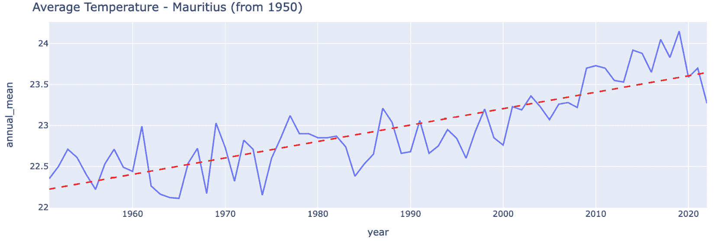

图 1.1：自 1950 年以来毛里求斯的平均气温

如果气温继续以相同的方式上升，我们正走向一个更温暖的未来，这也正是当前广泛接受的全球变暖的表现。与气温逐年上升的同时，每年夏季气温也会上升，冬季则会下降（**季节性**）。我们将在本章的动手部分可视化这一现象及温度时间序列的其他组成部分。

随着多年来气温逐渐升高（**趋势**），全球变暖对我们星球及其居民产生了影响（**因果关系**）。这一影响也可以通过时间序列来表示——例如海平面或降水量的测量。全球变暖的后果可能是剧烈的和不可逆的，这进一步突显了理解这一趋势的重要性。

这些时间序列的温度读数构成了我们所称的时间序列。对这种时间序列的分析和理解对我们的未来至关重要。

那么，更一般地说，什么是时间序列呢？它仅仅是一个*按时间顺序排列的测量序列，以及每个测量值由源系统生成的特定时间*。在温度的例子中，源系统是位于特定地理位置的温度计。

时间序列也可以以聚合形式表示，例如每年的平均气温，如*表 1.1*所示。

通过这个定义，并结合一个示例，我们将进一步探讨时间序列的性质。我们还将在本书的其余部分详细介绍这里提到的术语，如趋势、季节性和因果关系。

## 时间顺序

在本章开头，我们在定义时间序列时提到时间顺序，这是因为它是处理时间序列数据时与其他数据集的主要区别之一。顺序重要的一个主要原因是时间序列中的潜在自相关性，其中在时间`t`的测量值与`n`个时间步之前的测量值相关（**滞后**）。忽视这一顺序会使我们的分析不完整，甚至不正确。稍后我们将研究识别自相关性的方法，在*第六章*的探索性数据分析中详细讨论。

值得注意的是，在许多时间序列的情况下，自相关往往使得时间上较近的测量值之间的值更加接近，而与时间上较远的测量值相比，值的差异较大。

尊重时间顺序的另一个原因是避免在模型训练过程中发生数据泄露。在一些分析和预测方法中，我们会使用过去的数据训练模型，以预测未来目标日期的值。我们需要确保所有使用的数据点都在目标日期之前。时间序列数据中的数据泄露往往难以发现，这会破坏方法的完整性，并在开发阶段让模型表现得过于理想，而在面对新的未见数据时表现不佳。

本书的其余部分将进一步解释在这里提到的术语，如自相关、滞后和数据泄露。

本节讨论的时间顺序是时间序列的一个定义特征。在下一节中，我们将重点讨论规律性或其缺乏，这是另一个特征。

## 定期和不定期

时间序列可以是定期的或不定期的，这取决于它们的测量间隔。

定期时间序列在时间上的值是按规律的时间间隔预期的，比如每分钟、每小时、每月等等。这通常是源系统生成连续值的情况，这些值随后在规律的时间间隔内进行测量。这种规律性是预期的，但并不保证，因为这些时间序列可能会有间隔或值为零的情况，这可能是由于缺失的数据点或测量值本身为零造成的。在这种情况下，它们仍然会被视为定期的。

非规则时间序列是指在源头上测量的时间间隔不规则的情况。这通常发生在事件在不规则的时间点发生，并且会测量某种类型的值。这些不规则时间间隔的值可以通过降频重采样转换为规则间隔，从而变成规则时间序列。例如，一个不按每分钟发生的事件，可能每小时发生一次，按小时来看的话，它是规则的。

本书将主要关注规则时间序列。在时间序列的规则性之后，我们将在下一节考虑的另一个特征是平稳性。

## 平稳与非平稳

考虑到时间序列的统计性质随时间的变化，它们可以进一步分为平稳和非平稳。

**平稳时间序列**是指那些统计性质（如均值和方差）随时间变化不大的时间序列。

**非平稳时间序列**具有变化的统计性质。这些时间序列可以通过多种方法转换为平稳序列，例如，通过对差分进行一阶或多阶差分来稳定均值，使用对数值来稳定方差。这个区分非常重要，因为它决定了可以使用哪种分析方法。例如，如果某种分析方法假设时间序列是平稳的，那么可以先对非平稳数据进行上述转换。你将在*第六章*中学习如何识别平稳性。

注意

将非平稳时间序列转换为平稳时间序列可以去除趋势和季节性成分，但如果我们想分析这些成分，可能就不符合我们的需求。

本节内容对于理解时间序列的基本特性非常重要，这是在本书后半部分选择合适的分析方法的前提。*图 1.2*总结了可以使用的时间序列类型和转换操作。

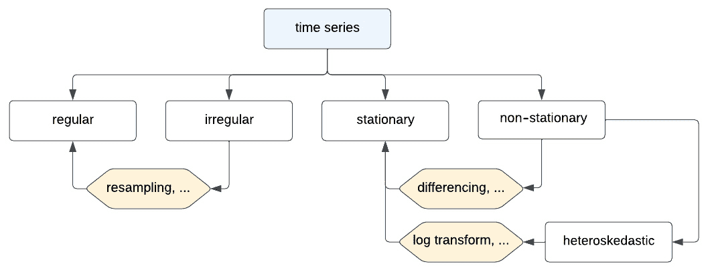

图 1.2：时间序列类型

这部分结束了本章的理论内容。在接下来的部分，我们将进行第一次动手实践，同时设置编码环境。本章将从可视化和分解时间序列开始。我们将在下一章深入探讨不同类型的时间序列分析及其使用场景。

# 动手实践：加载和可视化时间序列

让我们通过动手练习加载一个时间序列数据集并进行可视化。我们将尝试创建之前在*图 1.1*中看到的可视化表示。

## 开发环境

为了运行代码，你需要一个 Python 开发环境，在其中安装 Apache Spark 和其他所需的库。具体的库和安装说明将在相关章节中详细介绍。

### PaaS

一个简单的方法是使用免费的 Databricks Community Edition，它包含一个基于笔记本的开发界面，并且预安装了 Spark 和其他一些库。

注册 Databricks Community Edition 的说明可以在这里找到：

[`docs.databricks.com/en/getting-started/community-edition.html`](https://docs.databricks.com/en/getting-started/community-edition.html)

Community Edition 的计算能力是有限的，因为它是一个免费的基于云的 PaaS。你还可以注册 Databricks 的 14 天免费试用版，具体取决于你选择的注册选项，可能需要你首先拥有云服务提供商的账户。一些云服务提供商可能会有一些免费积分的促销活动，供你在开始时使用。这将为你提供比 Community Edition 更多的资源，时间有限。

你可以通过以下网址注册 Databricks 的免费试用版：[`www.databricks.com/try-databricks`](https://www.databricks.com/try-databricks)

Databricks 的开发团队是 Apache Spark 的原创作者，因此在这里工作会是一个不错的选择。

早期章节中的示例将使用 Community Edition 和 Apache Spark 的开源版本。我们将在 *第八章* 和 *第十章* 中使用完整的 Databricks 平台。

### 自定义

或者，你可以搭建自己的环境，设置完整的技术栈，例如在 Docker 容器中。这将在 *第三章* 中介绍，*Apache Spark 简介*。

## 代码

本节的代码位于本书 GitHub 仓库的 `ch1` 文件夹中的名为 `ts-spark_ch1_1.dbc` 的笔记本文件中，具体参考 *技术要求* 部分。

数据集的下载链接如下：[`github.com/PacktPublishing/Time-Series-Analysis-with-Spark/raw/main/ch1/ts-spark_ch1_1.dbc`](https://github.com/PacktPublishing/Time-Series-Analysis-with-Spark/raw/main/ch1/ts-spark_ch1_1.dbc)

## 数据集

一旦选择了开发和运行时环境，另一个需要考虑的因素是数据集。我们将使用的是毛里求斯年均地表空气温度数据，可以在气候变化知识门户网站上找到，网址为 [`climateknowledgeportal.worldbank.org/country/mauritius`](https://climateknowledgeportal.worldbank.org/country/mauritius)。

数据集的副本（文件名为 `ts-spark_ch1_ds1.csv`）可以在 GitHub 上的 `ch1` 文件夹中找到。可以使用前面提到的代码进行下载。

接下来，你将在 Databricks Community Edition 工作区中工作，这将是你自己的独立环境。

## 步骤：加载和可视化时间序列

现在我们已经完成了所有设置，让我们开始第一个编程练习。首先，登录 Databricks Community Edition 导入代码，创建一个集群，并最终运行代码：

1.  使用你在注册过程中指定的凭证登录到 Databricks Community Edition，如*图 1.3*所示。访问登录页面的 URL 为：[`community.cloud.databricks.com/`](https://community.cloud.databricks.com/)

    如果你还没有注册，请参考*开发环境*部分，了解如何进行注册。


图 1.3：登录 Databricks Community Edition

1.  进入工作区后，点击**创建笔记本**。见*图 1.4*。


图 1.4：创建笔记本

1.  从这里开始，我们将进入代码部分，首先导入提供的`ts-spark_ch1_1.dbc`笔记本，该笔记本可以在 GitHub 上找到，链接为*第一章*，如*图 1.5*所示。

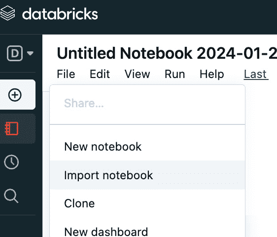

图 1.5：导入笔记本

1.  请注意，你可以从*技术要求*部分提供的 GitHub URL 下载*第一章*的文件到本地计算机，然后从那里导入，或者可以按*图 1.6*所示，指定以下原始文件 URL 进行导入：[`github.com/PacktPublishing/Time-Series-Analysis-with-Spark/raw/main/ch1/ts-spark_ch1_1.dbc`](https://github.com/PacktPublishing/Time-Series-Analysis-with-Spark/raw/main/ch1/ts-spark_ch1_1.dbc)

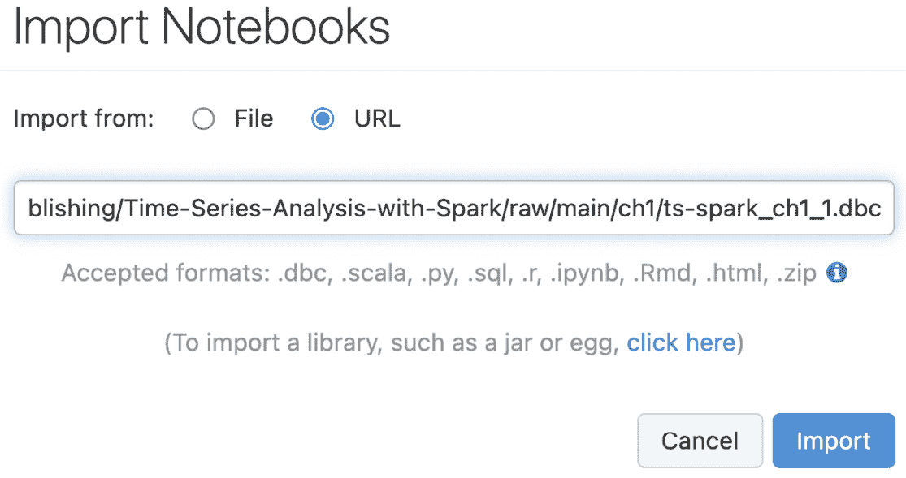

图 1.6：从文件或 URL 导入笔记本

1.  到现在为止，我们已经进入了实际的代码部分。你应该现在已经有了一个带有代码的笔记本，如*图 1.7*所示。

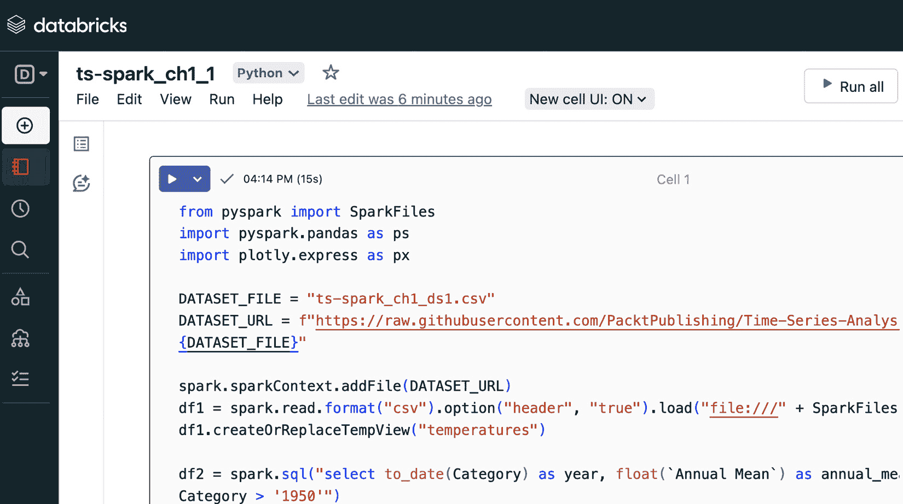

图 1.7：带代码的笔记本

1.  最后，让我们运行代码。点击**全部运行**，如*图 1.8*所示。

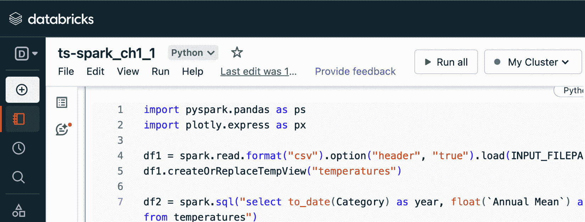

图 1.8：运行笔记本中的所有代码

1.  如果你还没有启动集群，你需要创建并启动一个新的集群。请注意，在 Databricks Community Edition 中，当集群未使用时会自动终止，在这种情况下，你将看到**附加集群已终止**的消息，如*图 1.9*所示，你需要选择另一个资源。

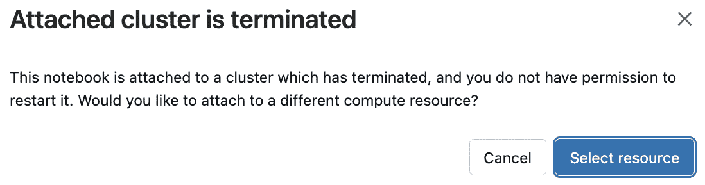

图 1.9：附加集群已终止

1.  从此时起，你可以选择连接到另一个活动集群（非终止状态的集群），或者选择创建一个新的资源，如*图 1.10*所示。

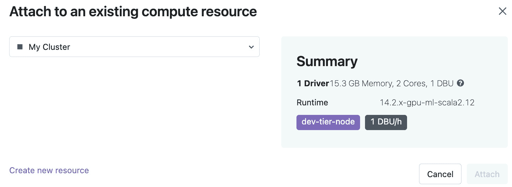

图 1.10：计算 – 创建新资源

1.  接下来，你需要为集群指定一个名称，并选择你想要使用的 Spark 版本，如*图 1.11*所示。这里的推荐做法是使用最新版本，除非由于需要在其他环境中运行的兼容性原因，你需要让代码在旧版本上工作。

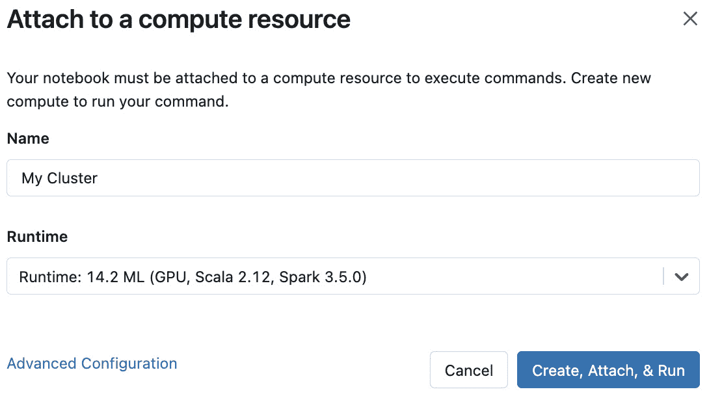

图 1.11：计算 – 创建、附加并运行

1.  一旦集群创建并启动（在这个免费环境中可能需要几分钟时间），代码就会运行，你将看到章节开头的*图 1.1*所示的图表作为输出。用于创建和显示图表的图形库提供了交互式界面，使你可以进行例如放大特定时间段的操作。

1.  由于这是第一次动手实践，我们已经详细介绍了逐步操作。在未来的实践部分，我们将专注于特定的数据集和代码，因为其他部分将非常相似。只要有差异，会提供额外的说明。

现在我们已经执行了代码，接下来我们将回顾主要部分。在本介绍性部分，我们将保持高层次的讨论，待介绍完 Apache Spark 概念后，后续章节将进一步深入细节：

1.  `import`语句添加了日期格式转换和绘制图表的库：

    ```py
    import pyspark.pandas as ps
    import Plotly, a graphing library that enables interactive visualization, converts data points into graphs.
    ```

1.  然后我们使用` spark.read`将 CSV 数据文件读取到表中：

    ```py
    df1 = spark.read.format("csv") \
        .option("header", "true") \
        .load("file:///" + SparkFiles.get(DATASET_FILE))
    df1.createOrReplaceTempView("temperatures")
    ```

1.  `spark.sql`语句基于源数据集中的年份列（命名为`Category`）选择数据集的一个子集：

    ```py
    df2 = spark.sql("select to_date(Category) as year, float(`Annual Mean`) as annual_mean from temperatures where Category > '1950'")
    ```

1.  最后，我们根据**普通最小二乘法**（**OLS**）回归绘制时间序列以及趋势线，如*图 1.1*所示：

    ```py
    fig = px.scatter(
        df2_pd, x="year", y="annual_mean",
        trendline="ols", 
        title='Average Temperature - Mauritius (from 1950)'
    )
    ```

1.  使用的绘图库`plotly`允许在用户界面上实现互动，例如鼠标悬停时显示数据点信息以及缩放。

从这一点开始，随时可以在代码和 Databricks 社区版环境中进行实验，我们将在本书的大部分初始章节中使用该环境。

在这一部分，你首次接触了时间序列和编码环境，从一个简单的练习开始。在下一节中，我们将详细讲解到目前为止介绍的一些概念，并将时间序列分解为其组成部分。

# 将时间序列分解为其组成部分

本节旨在通过分析时间序列的组成部分，进一步加深对时间序列的理解，并详细说明迄今为止介绍的几个术语。这将为接下来的章节奠定基础，使你能够根据分析的时间序列特性使用正确的方法。

时间序列模型可以分解为三个主要组成部分：趋势、季节性和残差：


注意

本书中的数学表示将采用简化的英文符号，以便于广泛的受众。关于时间序列的数学公式，请参考以下优秀资源：*《预测：原理与实践》*：[`otexts.com/fpp3/`](https://otexts.com/fpp3/)。

正如您将在接下来的实践部分看到的那样，这种成分的划分是基于拟合到时间序列数据的模型得出的。对于大多数实际数据集来说，这种分解仅仅是模型对现实的近似。因此，每个模型都会有自己对这些成分的识别和近似。整个目标是找到最适合时间序列的模型。这就是我们在*第七章*中将要构建和测试的内容。

让我们逐一分析这些成分，定义它们的含义，并根据一个示例数据集进行可视化，如*图 1.12*所示。

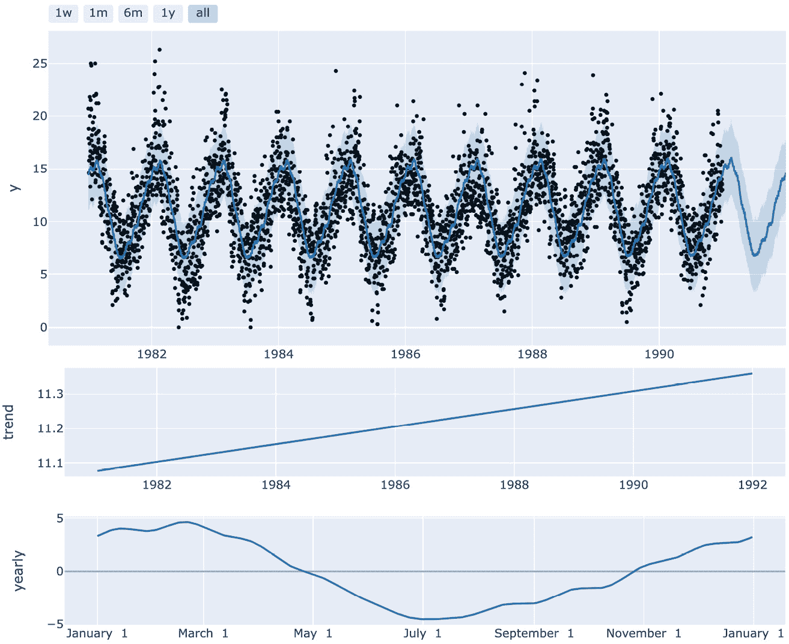

图 1.12：时间序列分解

## 系统性和非系统性成分

水平、趋势、季节性和周期性被称为**系统性**成分。它们代表了时间序列的基础结构，可以进行建模，因此可以预测。

除了系统成分外，还有一个**非系统性**部分无法建模，这部分被称为残差、噪声或误差。时间序列建模的目标是找到最适合系统成分的模型，同时最小化残差。

现在我们将详细介绍每个系统性和非系统性部分。

### 水平

**水平**，也称为基准水平，是序列的均值，作为基线，其他成分的效应会在其上叠加。有时，它会作为额外成分明确加入到前面的公式中。然而，水平并不总是出现在公式中，因为它可能不是分析的主要焦点，或者分解方法可能已经将其隐含在其他成分中。

### 趋势

**趋势**是指时间序列中值在一段时间内的总体变化方向：上升、下降或平稳。这种变化可以是线性的，如*图 1.1*和*图 1.12*所示，也可以是非线性的。趋势本身可以在不同的时间点发生变化，我们可以将其称为趋势变化点。更广泛地说，变化点是指时间序列的统计特性发生变化的时间点。这可能对模型参数，甚至我们用来分析时间序列的模型产生显著影响。

### 季节性和周期性

**季节性**表示时间序列在固定时间间隔内的变化。这通常是由季节性日历事件引起的。以我们的温度例子为例，每年夏季的温度都会相对于其他季节升高，冬季则下降，如*图 1.12*所示。类似地，礼品销售的时间序列可能会在每个圣诞节期间显示出销售的增加，形成其季节性模式。

多重季节性（间隔和振幅）可以在同一时间序列中产生组合效应，如*图 1.13*所示。例如，在温度的例子中，除了夏冬季的起伏变化外，白天温度升高，夜间温度下降。

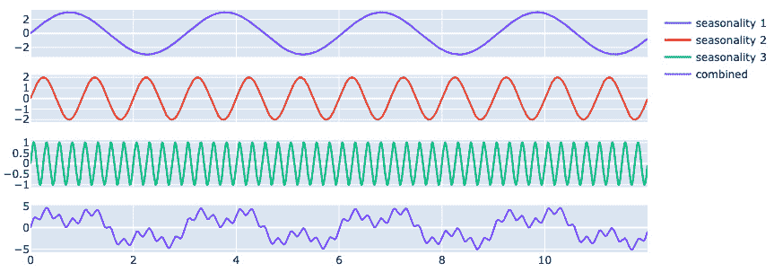

图 1.13：多重重叠的季节性（合成数据）

**周期性**是指类似季节性在不规则间隔发生的变化。时间序列中的周期性反映了外部周期对序列的影响。例如，经济衰退每隔若干年发生一次，并对经济指标产生影响。我们无法提前预测其发生时间，这与圣诞节的季节性不同，后者每年 12 月 25 日都能预测发生。

#### 残差或剩余项

**残差**或**剩余项**是指在模型已考虑了趋势、季节性和周期性之后所剩下的部分。残差可以使用**自回归**（**AR**）或**移动平均**（**MA**）方法进行建模。此时剩余的部分，也被称为噪声或误差，具有随机性，无法被建模。在*图 1.12*的最上方图表中，你可以将残差可视化为数据点与拟合线之间的距离。我们将在第六章中介绍如何测试残差，内容涉及探索性数据分析。

注意

当残差只是时间序列中的一部分随机时，整个序列可能完全是随机的，或者是一个随机游走。完全随机的序列将不依赖于先前的时间值，而对于随机游走，时间`t`的值依赖于`t-1`时的值（加上一些漂移和随机成分）。

### 加法型或乘法型

时间序列可以是**加法型**（前述公式）或**乘法型**。在加法型的情况下，季节性和残差成分不依赖于趋势。而在乘法型的情况下，它们随趋势变化，可以视为季节性成分的振幅变化——例如，较高的峰值和较低的谷值。

现在我们已经了解了时间序列的各个组成部分，接下来我们通过代码来实践一下。

## 实践操作：分解时间序列

以演示`ts-spark_ch1_2fp.dbc`为例。

位置 URL 如下：[`github.com/PacktPublishing/Time-Series-Analysis-with-Spark/raw/main/ch1/ts-spark_ch1_2fp.dbc`](https://github.com/PacktPublishing/Time-Series-Analysis-with-Spark/raw/main/ch1/ts-spark_ch1_2fp.dbc)

我们将使用的数据集是 1981 到 1990 年间澳大利亚墨尔本的每日最低温度，原始数据来自澳大利亚气象局，并可在 Kaggle 上通过以下链接获取：[`www.kaggle.com/datasets/samfaraday/daily-minimum-temperatures-in-me`](https://www.kaggle.com/datasets/samfaraday/daily-minimum-temperatures-in-me)

数据集的副本已提供在 GitHub 文件夹中，文件名为`ts-spark_ch1_ds2.csv`。

在本章中，我们将保持高层次的讨论，选取笔记本中的一些内容进行讲解，之后会在接下来的章节中详细介绍预测模型的其他概念：

1.  `import` 语句添加了用于预测模型和绘制图表的库：

    ```py
    from prophet import Prophet
    from prophet.plot import plot_plotly, plot_components_plotly
    ```

    使用的预测库是 `Prophet`，它是 Facebook 开源的库。无论是专家还是非专家，都可以使用它进行时间序列数据的自动预测。

1.  然后，我们使用 `spark.read` 将 CSV 数据文件读入表格中：

    ```py
    df1 = spark.read.format("csv") \
        .option("header", "true") \
        .load("file:///" + SparkFiles.get(DATASET_FILE))
    df1.createOrReplaceTempView("temperatures")
    ```

1.  `spark.sql` 语句将 `date` 和 `daily_min_temperature` 列转换为正确的格式和列名，这是 `Prophet` 所要求的：

    ```py
    df2 = spark.sql("select to_date(date) as ds, float(daily_min_temperature) as y from temperatures sort by ds asc")
    ```

1.  接下来，我们使用 `Prophet` 库根据 12 个月的季节性创建一个预测模型，并将其拟合到数据上：

    ```py
    model = Prophet(
        n_changepoints=20, 
        yearly_seasonality=True,
        changepoint_prior_scale=0.001)
    model.fit(df2_pd)
    ```

1.  该模型随后用于预测未来日期的温度：

    ```py
    future_dates = model.make_future_dataframe(
        periods=365, freq='D')
    forecast = model.predict(future_dates)
    ```

1.  最后，我们绘制了模型识别出的时间序列成分，如*图 1.12*所示：

    ```py
    plot_components_plotly(model, forecast)
    ```

现在我们已经对成分和预测做了基本讨论，让我们来探讨一下重叠季节性案例。

# 多重重叠季节性

我们将通过代码来创建*图 1.13*中的数据可视化。此部分代码位于名为 `ts-spark_ch1_3.dbc` 的笔记本文件中。

位置 URL 如下：[`github.com/PacktPublishing/Time-Series-Analysis-with-Spark/raw/main/ch1/ts-spark_ch1_3.dbc`](https://github.com/PacktPublishing/Time-Series-Analysis-with-Spark/raw/main/ch1/ts-spark_ch1_3.dbc)

该数据集是合成的，生成了三条不同的正弦曲线，代表三种重叠的季节性。

以下代码摘自笔记本。让我们从高层次进行查看：

1.  `import` 语句添加了用于数值计算和绘图的库：

    ```py
    import numpy as np
    from plotly.subplots import make_subplots
    ```

    NumPy 是一个开源的 Python 科学计算库，相比标准 Python，它在计算和内存使用上显著更高效。我们将在此使用它的数学函数。

1.  接下来，我们生成多个正弦曲线，使用`np.sin`来表示不同的季节性，并将它们叠加在一起：

    ```py
    (amp, freq) = (3, 0.33)
    seasonality1 = amp * np.sin(2 * np.pi * freq * time_period)
    (amp, freq) = (2, 1)
    seasonality2 = amp * np.sin(2 * np.pi * freq * time_period)
    (amp, freq) = (1, 4)
    seasonality3 = amp * np.sin(2 * np.pi * freq * time_period)
    combined = seasonality1 + seasonality2 + seasonality3
    ```

1.  最后，我们绘制了各个季节性以及它们的合成季节性，如*图 1.13*所示：

    ```py
    fig = make_subplots(rows=4, cols=1, shared_xaxes=True)
    fig.add_scatter(
        x=time_period, y=seasonality1, 
        row=1, col=1, name=f"seasonality 1")
    fig.add_scatter(
        x=time_period, y=seasonality2, 
        row=2, col=1, name=f"seasonality 2")
    fig.add_scatter(
        x=time_period, y=seasonality3, 
        row=3, col=1, name=f"seasonality 3")
    fig.add_scatter(
        x=time_period, y=combined, 
        row=4, col=1, name=f"combined")fig.show()
    ```

    从现在开始，尽管在笔记本中自由地尝试完整的代码。

在本节中，我们开始了分析时间序列的旅程，探讨了其潜在结构，并根据数据的性质铺平了进一步分析的道路。在下一节中，我们将涵盖一些关键的考虑因素和挑战，帮助你在整个过程中做好准备。

# 时间序列分析的额外考虑因素

本节可能是本书早期部分中最重要的一节。在导言部分，我们提到了一些时间序列的关键考虑因素，例如保持时间顺序、规律性和稳定性。在这里，我们列出了在实际项目中分析时间序列时遇到的关键挑战和额外的考虑因素。通过这样做，你可以根据本书中相关部分的指导以及进一步阅读来规划自己的学习和实践。

根据 2015 年发表的著名论文《机器学习系统中的隐性技术债务》，在高级分析项目中，只有一小部分工作与代码相关。剩余的时间大多数用于其他考虑因素，如数据准备和基础设施建设。

这些挑战的解决方案是非常具体的，依赖于你的具体背景。本章的目的是让你意识到这些考虑因素，如*图 1.14*所总结的。

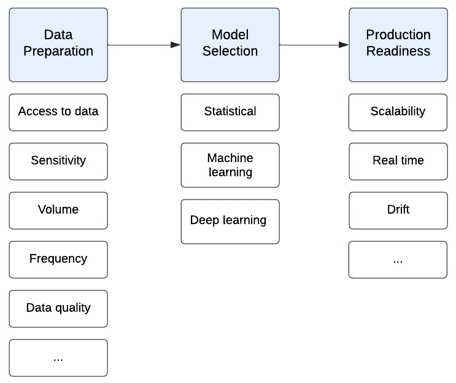

图 1.14：时间序列分析中的考虑因素和挑战

尽管这些考虑因素大多数与非时间序列分析（如机器学习）共享，但时间序列分析通常是高级分析方法中最具挑战性的。我们将在本书的其余部分详细讨论一些应对这些挑战的解决方案。

## 面对数据挑战

与所有数据科学和机器学习项目一样，数据是关键。你运行的分析和构建的模型的效果将取决于数据的质量。数据挑战各式各样，且非常依赖于你的具体环境和数据集。

我们将在这里列出一些常见的问题：

+   **数据访问** 可能是所有问题的起点。对于本书而言，我们将使用几个免费访问的数据集，因此这不是问题。在实际项目中，所需数据集的所有权可能属于你所在组织的其他部门，甚至可能完全属于另一家组织。在这种情况下，你将不得不经历获取数据集的过程，可能会涉及财务成本，并确保数据能够以可靠的方式进行传输，同时保证传输速度和数据的新鲜度。传输管道的构建将有其自身的成本，以及传输本身的成本。传输机制必须具备生产级别的能力，以支持操作需求：稳健、可恢复、可监控等。

    最初，你的数据访问需求将用于探索性数据分析和模型训练。批量导出可能足够。进入生产阶段后，你可能需要实时或近实时的数据访问。那时，考虑因素将完全不同。

一旦数据被摄取，接下来的要求是以安全且可用的方式存储它。使用专门的时间序列数据库是一个优化性能的选择，尽管对于大多数情况，通用存储已足够：

+   **敏感性**是另一个关键方面。在这里，开发和生产中可能会有不同的要求。然而，在许多情况下，开发和测试中使用的是生产数据的子集。某些包含**个人身份信息**（**PII**）的列需要进行遮蔽或加密，以遵守如欧洲 GDPR 等法规。在高度敏感的情况下，整个数据集可能需要加密。这对大规模处理来说是一个挑战，因为每次访问数据都可能需要解密和重新加密。这会带来处理开销。

    总结来说，端到端的安全性和数据治理将成为你的高优先级需求，这从第一天就开始了。你希望在每个阶段都避免安全性和合规性风险，包括开发阶段，尤其是当你处理敏感数据时。

+   **数据量**和**频率**在实时或近实时的大流量数据源中，将需要合适的平台来实现快速处理而不丢失数据。在预生产环境中，这一点可能不太明显，因为规模较小。性能和可靠性问题通常会在生产环境扩展时才显现出来。我们将在介绍 Apache Spark 时讨论扩展和流处理，这将帮助你避免此类问题。

+   **数据质量**是我们早期将面临的挑战，一旦数据访问问题解决，我们开始在探索阶段和开发中处理数据。挑战包括数据缺失、数据损坏、数据噪声，甚至对于时间序列数据来说，更为相关的是数据延迟和乱序。如前所述，对于时间序列数据，保持时间顺序非常重要。在我们讨论数据准备时，我们将进一步探讨解决数据质量问题的方法。

在数据挑战之后，下一步的重点是为需要解决的问题选择正确的方法和模型。

## 使用正确的模型

这对于那些刚接触时间序列的人来说可能是一个更大的挑战。正如我们到目前为止所看到的，时间序列具有不同的统计特性。一些分析和建模方法是基于对时间序列统计特性的假设而创建的，其中平稳性是常见的假设。如果使用不正确类型的时间序列，这些方法将无法按预期工作，甚至可能导致误导性结果。如果你已经识别出多个重叠的季节性，某些方法处理这些季节性也可能会是一个挑战。*图 1.14* 回顾了时间序列和分析模型的类型。模型的选择将在*第七章*，*构建和* *测试模型* 中进一步讨论。

选择正确的模型也在很大程度上取决于我们希望实现的结果，无论是预测未来一个或多个时间步长，还是同时分析一个（单变量）或多个（多变量）序列。对于一些领域，如受监管行业，通常还需要可解释性，而某些模型（如黑箱模型）可能难以满足这一要求。我们将在下一章《为什么时间序列重要》中进一步讨论时间序列分析的结果及如何选择合适的模型，包括用于异常和模式检测以及预测建模的模型。

## 维持空间和时间层次结构

请注意，另一个关键考虑因素是数据收集和分析的层次结构。这需要在不同层级之间保持一致性。为了说明这一点，让我们以一个多店零售商销售不同产品的时间序列预测为例。这里的空间层次结构可能位于产品和产品类别层级，以及特定商店和区域层级。时间层次结构将对应于每小时、每日、每季度等的销售情况。在这种情况下的挑战是确保单个产品和产品类别的预测一致性，以及例如，日度预测与季度预测的一致性。

最终，选择正确的模型取决于数据量，正如我们将在后续章节中讨论的构建模型的内容。

## 解决可扩展性问题

主要有两个因素影响可扩展性：数据量和处理复杂性。之前，我们讨论了数据量作为数据挑战。这里我们来考虑处理复杂性。**复杂性**可能来自于准备数据所需的数据转换的程度，以及需要管理的模型的数量、层次结构和大小：

+   **大量和复杂的模型层次结构**：在实际项目中工作时，您可能需要在相对较短的时间内并行运行数十甚至数千个模型 - 比如，如果您在商店工作并需要为商店中销售的成千上万种商品预测第二天的销售和库存水平。这种并行性的需求是使用 Apache Spark 的主要原因之一，我们将在本书中进一步了解。

+   **模型的大小**：可扩展性的另一个要求来自模型本身的大小，如果我们使用具有许多层和节点的深度学习技术，模型可能会非常庞大，并且具有高计算要求。

我们将在本书后面专门讨论扩展。

## 接近实时

早些时候，我们确定高频数据是一个重要的数据挑战。接近实时不仅需要数据级别的调整，还需要一个设计用于处理这种需求的处理管道。通常，模型是在一段时间内收集的数据批次上进行训练，然后部署到诸如预测或异常检测等任务中，其中实时处理变得至关重要。例如，在检测欺诈交易时，尽可能接近事件发生时识别异常是至关重要的。近乎即时数据处理的可行解决方案是 Apache Spark 结构化流，这是我们在本书后面讨论 Apache Spark 时将探讨的一个主题。

## 生产管理

前述考虑也适用于生产环境。此外，将开发的解决方案移入生产环境还有一些特定要求。如果管理不当，这些要求可能会带来挑战。

一旦正确的模型已经训练好并准备好使用，下一步是将其与任何必需的 API 包装器一起打包，以及数据管道和消耗模型的应用程序代码。这意味着一个涉及 DataOps、ModelOps 和 DevOps 的端到端过程。在我们讨论生产时，我们将在*第九章*更详细地讨论这些内容。

## 监控和解决漂移

一旦模型投入使用，随着时间的推移会发生变化，导致模型不再适合使用。这些变化大致分为以下几类：

+   数据集性质的变化（**数据漂移**）

+   输入和输出之间关系的变化（**概念漂移**）

+   意外事件，如 COVID，或在建模过程中遗漏的重要事件（**突发漂移**，一种概念漂移）

这些漂移将影响模型的性能，因此需要进行监控。在这种情况下的解决方案通常是根据新数据重新训练模型或找到在更新的数据集上性能更好的新模型。

本节概述了处理时间序列时的考虑因素和挑战。与处理其他数据集的通用性有很多共同之处，因此这里的指导在更广泛的背景下也将非常有用。然而，正如我们在介绍部分看到的那样，时间序列也有其特定的考虑因素。

# 总结

时间序列随处可见，本章介绍了它们的基本概念、组成部分以及处理中的挑战。我们从一些简单的代码开始探索时间序列，为后续章节的进一步实践奠定基础。本书的第一章讨论的概念将逐步加深，最终使我们能够扩展到大规模分析时间序列的程度。

现在您已经理解了时间序列的“是什么”，在下一章中，我们将探讨“为什么”，这将为在各个领域中应用打下基础。

# 进一步阅读

本节作为资源库，可帮助您进一步了解该主题：

+   *气候混乱助长了法国* *大革命*：[`time.com/6107671/french-revolution-history-climate/`](https://time.com/6107671/french-revolution-history-climate/)

+   Databricks 社区版: [`docs.databricks.com/en/getting-started/community-edition.html`](https://docs.databricks.com/en/getting-started/community-edition.html)

+   气候变化知识门户：[`climateknowledgeportal.worldbank.org/country/mauritius`](https://climateknowledgeportal.worldbank.org/country/mauritius)

+   *预测: 原理与实践* 由 Rob J Hyndman 和 George Athanasopoulos: [`otexts.com/fpp3/`](https://otexts.com/fpp3/)

+   *机器学习系统中的隐藏技术债务* (Sculley et al., 2015): [`papers.neurips.cc/paper/5656-hidden-technical-debt-in-machine-learning-systems.pdf`](https://papers.neurips.cc/paper/5656-hidden-technical-debt-in-machine-learning-systems.pdf)

# 加入我们的 Discord 社区

加入我们社区的 Discord 空间，与作者和其他读者讨论：

[`packt.link/ds`](https://packt.link/ds)

.jpg)
