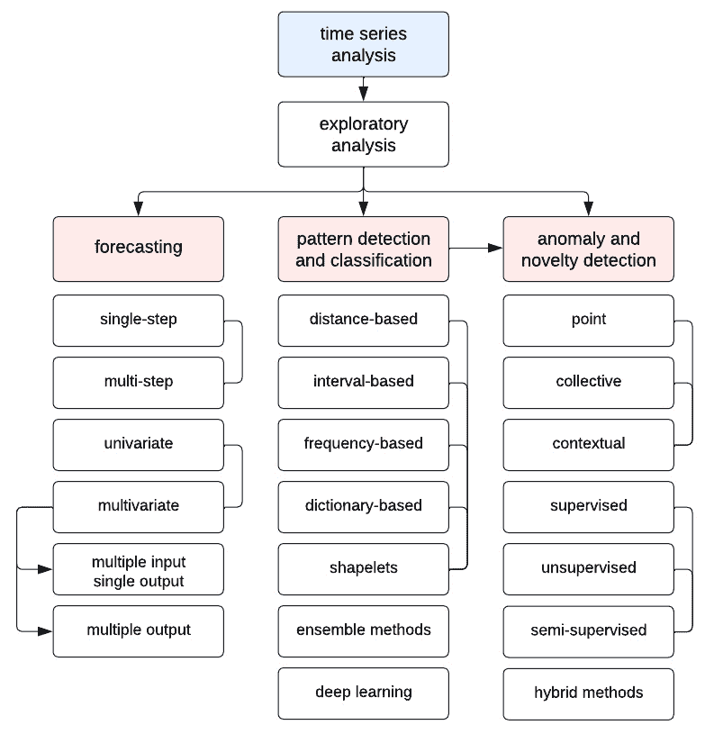
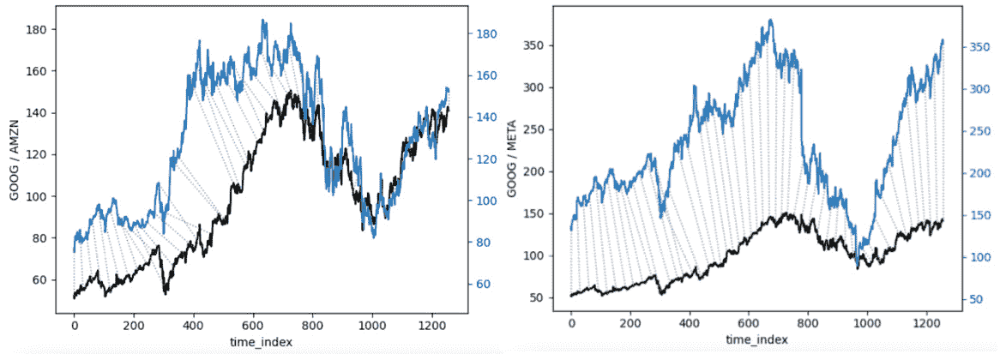
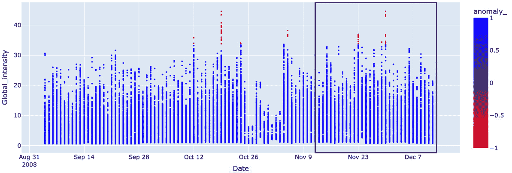
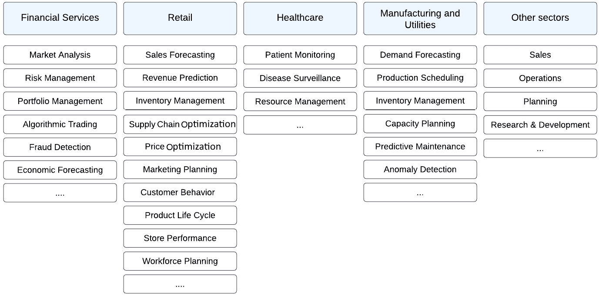
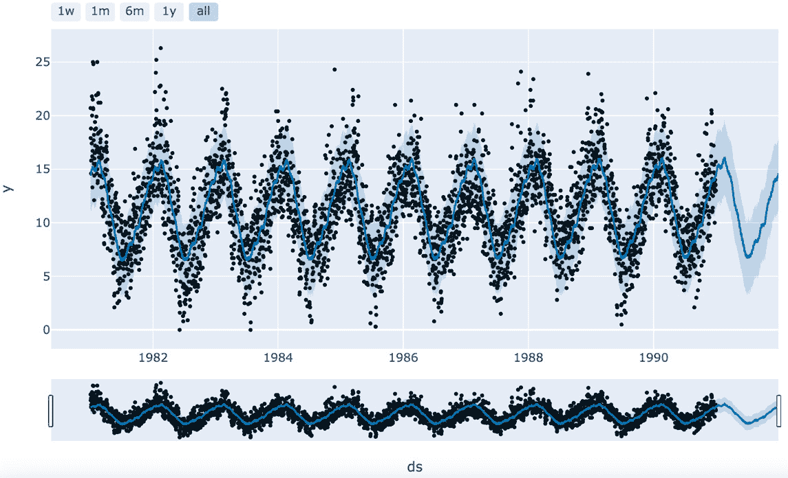
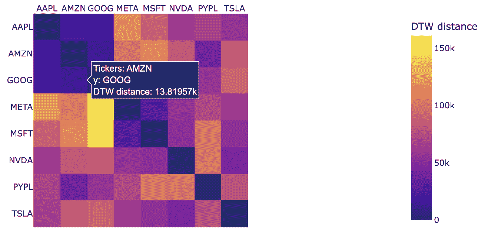
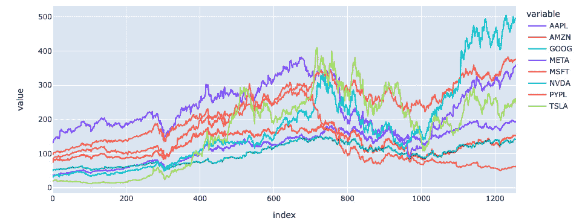

# 第二章：为什么需要时间序列分析？

本章深入探讨了分析时间序列数据的实际意义。它阐明了时间序列分析如何支持预测建模、趋势识别和异常检测。通过展示各行业的实际应用，本章强调了时间洞察在决策中的关键作用。掌握时间序列分析的重要性对专业人士至关重要，因为它凸显了对预测准确性、资源优化和战略规划的影响，促进了对面向时间的数据分析的全面理解。

本章将涵盖以下内容：

+   时间序列分析的需求

+   行业特定的应用案例

+   选择应用案例的动手实践

# 技术要求

在第一章之后，我们将在这里进一步提高代码的难度，目标是展示时间序列在选定应用案例中的使用。本章的代码可以在本书 GitHub 仓库的 `ch2` 文件夹中找到： https://github.com/PacktPublishing/Time-Series-Analysis-with-Spark/tree/main/ch2。

请参考这个 GitHub 仓库，获取代码的最新修订版本，若更新内容与本书中代码部分不同，更新将会在仓库中注释说明。

本章的动手实践部分将进一步详细介绍。

# 理解时间序列分析的需求

正如我们在上一章讨论的，时间序列在生活的各个方面以及所有行业中都存在。因此，分析时间序列的需求无处不在。本章将探讨不同行业的不同应用案例。在此之前，我们将在本节中研究其基本方法。这些方法大致可以分为预测、模式检测与分类，以及异常检测。*图 2.1*展示了本章将讨论的几个关键时间序列分析概念。



图 2.1：时间序列分析中的概念

现在，让我们更详细地讨论每一个部分。

## 预测

时间序列预测是基于先前观察到的数值来预测未来的值。这是通过建模时间序列数据中的基本模式——例如趋势、季节性和周期——来预测未来的数据点。例如，在我们在*第一章*中可视化的温度时间序列的例子中，我们可以使用预测模型根据从前几个月学习到的模式来预测下个月的温度。预测是时间序列分析中最常见的方法，本书将重点讨论这一方法。这可以是单步预测、多步预测、单变量预测或多变量预测。

### 单步预测

在单步预测中，我们根据对历史数据点的分析以及由此构建的模型，预测时间序列中的下一次发生事件。预测步骤的粒度通常与我们学习历史模式的数据集中的粒度相同。例如，如果我们的历史时间序列中包含的是每日温度，那么下一步将是第二天。如果我们将数据点汇总为例如月度平均值，并且对月度变化模式进行了建模，那么下一步将是下个月的平均温度。

虽然单步预测通常是我们能获得的最可靠的预测，但不幸的是，它对于许多需求来说是不够的，因为在现实生活中，我们往往需要比仅仅预测一个（时间）步骤更长远的计划。如果我们在做每日预测，我们不仅仅想预测明天的天气。我们希望能够预测未来几天、几周甚至几个月的情况。单步预测对于规划来说显然不足够。

### 多步预测

在多步预测中，我们使用从历史数据点构建的模型，预测时间序列中的多个下一步。我们还将预测的前一步作为输入。以我们的每日温度为例，这可能意味着对接下来一周的每天进行逐日预测。

#### 挑战

多步预测的挑战在于，后续的预测是基于先前的预测，这与单步预测不同，单步预测是基于实际数据点的。实际上，这意味着递归地逐步应用预测算法，每一步都将预测结果添加到数据集中，并使用历史和预测数据点来预测下一步。因此，预测中的不准确性随着每一步向未来推进而逐渐累积。

注意事项

这种多步预测中的预测误差累积是你希望与业务或任何为你构建预测的人提前沟通的限制。你需要确保在长期预测方面设定清晰的预期。

#### 解决方案

除了将预测限制在非常短的时间范围内外，还有几种方法可以应对多步预测的挑战：

+   首先，构建一个尽可能准确的模型，使得初步预测的结果接近现实。

+   另一种方法是使用模型组合，旨在平均化预测误差。

+   最后，限制预测间隔或步数，并在有新的测量数据时重新计算预测。

### 单变量预测

到目前为止，在**第一章**中，我们只考虑了单一变量（单变量）的时间序列，也就是特定位置的温度。另一个单变量时间序列的例子，在经济领域，是特定地区或国家的失业率。根据定义，单个时间序列是单变量的，无论是温度还是失业率。在现实世界中，需求往往是同时预测多个时间序列，这样我们能比单一时间序列提供的视角获得更全面的未来预测。以温度为例，这可能意味着需要考虑多个地点，或者额外预测空气中的污染物水平。对于经济预测，这可能意味着需要预测**国内生产总值**（**GDP**）以及失业率。这引出了多变量预测。

### 多变量预测

单变量是指单一的时间序列，而多变量预测有几种方式可以进行描述：

+   **多重输入**维度是指我们将多个变量（包括时间序列和非时间序列）作为输入提供给预测模型——例如，使用过去的温度和污染物水平来预测未来的温度。

+   **多重输出**预测使用预测模型来预测多个变量。以之前的温度示例为例，这意味着要同时预测温度和污染物水平。

正如我们从前面的例子中看到的，可能会有多个时间序列的不同场景。这些序列可以是**相关**的，如果它们有相同的潜在原因（这个原因本身也可以通过另一个时间序列来表示），它们就可能有**共动**关系。它们也可以有**因果依赖性**，即一个时间序列与另一个时间序列之间存在因果关系。它们还可能是**独立的**，我们只是同时进行预测。在**第六章**的探索性数据分析中，我们将讨论一些这些考虑因素。

总结来说，预测很少是单独进行的，我们需要同时分析的时间序列数量可能达到数百甚至数千。这个对多个时间序列的需求是使用并行执行工具（如 Apache Spark）的一个很好的理由，正如我们将在后续章节中看到的那样。

既然我们已经讨论了预测，现在让我们看看另一种分析方法，这将使我们能够对时间序列进行分类。

## 模式检测与分类

模式检测与分类是基于某些模式识别和分类时间序列。通常，时间序列遵循某种模式，我们可以识别并标记这些模式。这些标签允许我们通过将标记的模式与新的时间序列发生情况进行匹配，从而对时间序列进行分类。我们可以采取不同的方法来实现这一点，广义上可分为基于距离、基于区间、基于频率、基于字典、形状模式、集成方法和深度学习。接下来将详细介绍这些方法。

### 基于距离

基于距离的时间序列分类方法，使用**k-最近邻**（**kNN**）和**动态时间规整**（**DTW**），将在这里进行解释，这是分析时间序列数据的成熟方法。由于时间序列数据的偏移和扭曲，标准的欧几里得距离并不是衡量相似性的良好度量。DTW 通过将序列在时间上对齐提供了一种替代方案。它计算两条时间序列之间的最小距离，考虑所有可能的对齐方式，这使得其计算量较大。然后使用 kNN 根据时间序列的形状相似性来进行分类。

以下图表展示了使用动态时间规整（DTW）计算谷歌股票（下方，黑线）与亚马逊股票，以及谷歌股票与 Meta 股票之间的距离。我们将在本章的动手操作部分执行这个示例。



图 2.2：DTW 距离（GOOG – 黑线）

### 基于区间

使用这种方法，时间序列首先被划分为多个区间，并计算每个区间的描述性统计量。这些区间随后与分类器如随机森林或支持向量机一起作为特征向量使用。该方法的优势在于它能够捕捉时间序列在不同阶段的特性，这对于那些在时间上具有不均匀模式的时间序列非常有效。将时间序列汇总成带有统计特征的区间也是降低复杂性并提高可解释性的好方法。

### 基于频率

这种分类方法，例如**随机区间谱集成**（**RISE**），首先通过例如傅里叶变换将时间序列转换到频域。RISE 是一种基于分类器的集成方法，分类器如决策树，是通过随机区间和为这些区间提取的谱特征构建的。该方法的优势在于能够识别与频率相关或周期性特征，并且作为一种集成方法，它在提供准确性的同时具有鲁棒性。

### 基于字典

基于字典的时间序列分类方法将时间序列转换为符号表示，从而可以使用基于文本的技术进行分类。遵循这一方法的突出方法有：

+   **模式包**（**BoP**）：BoP 通过应用滑动窗口捕获局部模式，从而创建一个“模式包”。然后将其哈希为频率直方图，用作分类的特征向量。

+   **SFA 符号包**（**BOSS**）：BOSS 是一种更能抵御噪声并有效捕获关键模式的变体。它使用**符号傅里叶近似**（**SFA**）在不同分辨率下捕获时间序列。

+   **随机卷积核变换**（**ROCKET**）：ROCKET 为大数据集提供了更高的速度和效率。它生成并使用随机卷积核将时间序列转换为特征向量。

### Shapelets

这些是时间序列中的子序列，代表了特定类别模式。通过找到在时间序列或其他相关时间序列中匹配的形状，可以相应地对时间序列进行分类。当定义类别的特征在时间上是局部化的时候，例如交易金额突然增加，可能对应信用卡盗窃。Shapelets 还可以帮助解释性——一旦形状被充分理解，可以用于解释在时间上匹配的时间序列点。

### 集成

迄今为止提到的集成分类方法将相似类型的分类器分组。另一种方法，如**基于层次化投票的转换集成**（**HIVE-COTE**），则采用不同类型的分类器。其思想是基于不同分类器捕获的时间序列的不同方面构建集成。这些分类器是独立训练的，其预测结果根据层次化投票方法进行组合。与其他集成方法一样，这可以提高鲁棒性和准确性。此外，由于使用了各种技术，HIVE-COTE 是复杂多模式时间序列的一个良好选择。然而，这也带来了较高的计算成本。

### 深度学习

诸如**TimeNet**的方法利用深度神经网络自动提取时间序列中的特征、模式和关系。TimeNet 是预训练的，这使得它能够快速应用。它结合了**卷积神经网络**（**CNNs**）用于局部特征和**循环神经网络**（**RNNs**）用于顺序模式。这使得 TimeNet 能够有效地捕获低级和高级模式，从而学习层次化表示。其优点在于适应各种时间序列分类问题，同时减少了手动特征工程的需求。与其他深度学习方法类似，缺点在于需要大量数据进行预训练、需要的计算资源较多，以及缺乏可解释性。尽管如此，在多种复杂情况下，它们仍然是性能最先进的方法之一。

虽然本书不会像预测那样详细讨论时间序列的分类，但这仍是一个值得进一步研究的有前景领域，并且面临一系列操作性挑战。

这带我们进入最后一种分析类型，即从时间序列数据中检测异常。

## 异常检测

时间序列分析的第三类使用场景是异常检测，旨在标记意外的模式或事件。虽然这与模式识别和预测有关，但其目的是不同的：识别源系统行为的意外偏差。异常检测在多个领域至关重要，如金融、医疗保健和工业系统。这些异常可能表明严重事件的发生，例如系统故障、金融欺诈或网络入侵。

除了单变量或多变量外，异常还可以表现为以下几种形式：

+   **点**：这是指一个单一的数据点被识别为异常的情况。

+   **集合**：当多个数据点作为一组近似的测量值被标记为异常时，就属于此类情况。

+   **上下文**：某个数据点或集合在周围测量值的上下文中可能是异常的，而在另一个上下文中， 同一个数据点或集合可能不是问题。

异常也可以分为离群值和新颖性，离群值可能表示错误或故障，而新颖性则是之前未见过的模式，可能不是问题。

注意

为了使异常检测有效，数据准备阶段必须保留数据集中的异常值，这与通常在数据整理过程中所做的相反。

除了传统的统计和基于规则的方法，还有更新的机器学习技术。时间序列数据中的异常检测方法可以分为无监督、监督和半监督方法，每种方法都有其独特的技术和算法。异常分数通常是通过设置阈值来计算，用于标记异常。

### 无监督异常检测

无监督异常检测不需要标记数据。这假设异常与正常数据的差异足够大，可以在没有先验知识的情况下检测到。常见的方法包括：

+   **统计**方法，如**z-score**和**箱线图分析**，用于根据统计特性识别异常值。

+   **基于聚类**的方法，如**DBSCAN**或**k-means**，将相似的数据点聚集在一起，而异常点则是那些不属于任何聚类的点。

+   **基于密度**的方法，如 kNN 和**局部异常因子**（**LOF**），利用局部邻域的密度来识别异常。

+   **隔离森林**是一种基于树的模型，适用于高维数据，能够有效地将异常值隔离出来。

*图 2.3*中的图表显示了隔离森林模型的结果，用于检测家庭能源消费中的异常。



图 2.3：能耗异常检测

该模型是根据到 11 月 9 日为止的消费数据拟合的，然后用于之前未见过的数据。异常数据以红色/较浅的颜色显示。我们将在本章的实践部分运行此示例。

### 有监督异常检测

有监督异常检测适用于包含正常和异常情况的标注数据集。虽然能更好地检测异常，但它需要标注数据，这些数据可能比较难获得。相关技术包括以下几种：

+   **分类模型**，如传统的分类器（如逻辑回归）、**支持向量机**（**SVM**）或更复杂的模型，如 CNN 和 RNN，这些模型经过训练用来区分正常与异常实例。

+   **集成方法**，如随机森林或梯度提升，可以通过组合多个模型来提高检测精度。

### 半监督异常检测

半监督异常检测需要较少的标注数据，并结合大量未标注的数据。例如，在工业监控中，当我们从传感器读取的数据显示数据点有限时，这些测量值大多数对应设备的正常运行，可以标注为正常。然后，超出正常标签的新读数可以被标记为异常。

当标注一个大规模数据集昂贵时，半监督技术包括以下几种：

+   修改无监督技术以包含有限的可用标签——例如，修改基于密度的或聚类方法，以增强对标注异常的敏感性。

+   **新颖性检测**通过在正常数据上训练模型以找到其分布，类似于无监督统计方法，然后偏离该分布的值会被标记出来。一类 SVM 和自编码器就是这种技术的示例。

### 高级深度学习方法

使用深度学习技术的方法包括以下几种：

+   **自编码器**是神经网络，通过压缩然后重建输入数据。其原理是，这些模型能很好地重建正常数据，而对异常数据的重建误差较高。

+   序列类型的模型，如**长短期记忆**（**LSTM**）、**RNN**和**Transformers**，能够识别时间序列数据中的时间依赖性，因此在序列异常检测中非常有用。

注

从操作角度来看，异常检测系统是全面监控和告警架构的一部分。需要注意的是，在低延迟或实时检测和告警要求的情况下，卡尔曼滤波器常常被使用。

这总结了各种异常检测方法。选择异常检测方法取决于时间序列和异常的特征、可用的标记数据、计算资源以及实时检测的要求。混合方法和高级方法，特别是基于深度学习的方法，由于能够建模时间序列数据中的复杂模式和依赖关系，已在各种应用中取得了令人鼓舞的结果。

从时间序列分析的整体概述出发，我们现在来看看它们在各个行业中的使用及其影响。

# 行业特定的应用案例

我们在前一部分讨论了不同类型的时间序列分析。接下来我们将探讨它们在不同行业中的适用性。 在此之前，*图 2.4*中的图表能帮助你了解跨行业应用的多样性。



图 2.4：时间序列分析在各行业中的应用

让我们详细了解时间序列分析在各个行业中的应用。

## 金融服务

金融服务中的时间序列分析对于理解趋势、模式和未来行为至关重要。其应用广泛，能为决策、战略规划、风险管理和合规提供宝贵的见解。以下是时间序列分析在金融服务各个职能中的应用：

+   **市场分析**：通过分析资产的历史价格，包括趋势和季节性，预测未来资产价格。这有助于交易员和投资者决定交易哪些资产以及何时交易。

+   **风险管理**：除了前述内容，金融工具价格的另一个重要方面是它们的波动性，这需要进行分析，以更好地管理风险并制定减缓策略。这包括**风险价值**（**VaR**）建模，通过基于历史波动性和相关性来估算某个投资在一段时间内的潜在损失。风险管理的另一个领域是信用风险，包括偿还历史、违约和经济状况的时间序列数据。这有助于评估未来违约和损失的可能性。为此，预备金估算确保足够的资金被预留以应对潜在的贷款损失，而流动性管理确保保持足够的流动性。最后，在宏观经济层面，压力测试涉及分析历史上的最坏情况。

+   **投资组合管理**：这里的两个主要方面是优化资产配置和相关的投资组合表现评估。通过分析历史回报和资产之间的相关性，投资组合经理可以确定资产配置，以满足预期的风险回报特征。回顾其随时间的表现后，投资组合可以根据需要进行调整。

+   **算法交易**：从本质上讲，这涉及利用微秒或毫秒级的时间序列数据来做出高频交易决策。完整的周期包括开发策略、进行回测，然后一旦策略投入实际使用，就生成正确的交易信号。

+   **欺诈检测**：这里的核心思想是分析交易，识别并标记可能表明欺诈活动的模式，包括市场操纵或内幕交易。

+   **经济预测**：这用于预测例如利率和其他对中央银行、政府和金融机构政策制定有影响的经济指标。

从本质上讲，金融服务中的时间序列分析是支撑广泛活动的基础，从交易决策到投资组合管理和合规监管。它利用历史数据预测未来事件、管理风险并揭示有价值的洞察力。因此，时间序列分析推动了金融生态系统中的明智决策。

## 零售

零售行业中的时间序列分析使用按时间顺序排列的数据来进行决策、优化运营和提升客户体验。零售商可以洞察影响其业务的趋势、季节性变化和周期性行为。以下是一些关键的应用场景：

+   **销售预测和收入预测**：根据历史数据预测未来的销售情况，考虑季节性变化、趋势和外部因素（如假期和经济条件），有助于规划库存、员工和营销活动。这对于财务规划和投资决策至关重要。

+   **库存管理和供应链优化**：零售商可以通过分析购买模式和交货时间来优化库存水平。更好的需求规划和补货调度可以最大限度地减少缺货现象并减少过剩库存。在每个产品层级进行预测，有助于高效的库存补充。这也对供应链管理产生积极影响。零售行业中一个正在增加应用的相关案例是食品浪费预测和减少。

+   **价格优化与营销规划**：通过分析价格变动对销量的影响，可以确定最佳定价策略，从而最大化销售和利润。这包括对季节性价格敏感性、促销和营销活动的影响以及竞争定价的洞察。同时，这也优化了营销支出，更好地与季节性模式对接。

+   **客户行为分析与产品生命周期管理**：零售商可以通过了解客户购买习惯随时间的变化，来指导营销策略和产品开发。此分析有助于识别趋势，如购买渠道的变化或对某些产品类别的兴趣增加。这反过来有助于在产品推出、停产或重新上市方面做出更好的决策。通过更深入的客户行为分析，还可以制定有效的忠诚度项目，从而提高客户留存率。

+   **门店表现分析与员工规划**：通过比较不同地点的销售趋势，分析可以识别高表现的门店和需要帮助的门店。这有助于做出有关门店扩张或关闭的决策，并将人员配置与合适的门店及繁忙时段对接。其影响不仅体现在运营效率上，还能改善客户服务。

时间序列分析在零售中的应用影响着业务的方方面面，从库存和定价到营销和员工管理。通过利用历史数据，零售商可以做出明智的决策，从而提升运营效率、客户满意度和盈利能力。

## 医疗保健

时间序列分析在医疗保健中是跟踪健康相关数据的重要工具。此方法可以观察健康指标的模式、趋势和变化，这对改善患者护理、运营效率和临床结果至关重要。以下是医疗保健中的应用概述：

+   **患者监测**：在持续监测生命体征（如心率、血压等）时，可以使用时间序列分析对患者健康进行实时评估，并及早发现急性医疗事件。同样，通过分析可穿戴设备的数据，可以监测身体活动、睡眠模式及其他健康指标随时间的变化。这可以在临床环境中进行，也可以用于个人健康意识。

+   **流行病学与疾病监测**：这一需求的重要性在 COVID-19 期间得到了突出体现。必须随着时间推移追踪传染病的传播，以了解传播模式、识别疫情爆发，并相应规划公共干预措施。在个人层面，患有慢性病的患者可能需要根据病情的发展调整治疗计划。虽然相似，但这与监测生命体征在干预时间尺度上有所不同。

+   **医院资源管理**：由于大多数公立医院的资源紧张，能够预测医院的入院率以优化床位分配和人员安排是一个巨大的优势。

时间序列分析在医疗行业有众多其他应用，如医疗质量监测、药物研发和医学研究，尤其是在新冠疫情期间，公共卫生监测、分析和政策制定。

通过使用时间序列分析，医疗行业可以提升患者护理质量、提高运营效率，并推动医学研究，最终改善健康结果并推动更为科学的医疗政策。

## 制造业和公用事业

时间序列分析在制造业和公用事业领域至关重要，能够确保安全、优化运营并提高效率。以下是这些行业中时间序列分析的应用概述：

+   **制造业**：首先，在规划方面，通过需求预测、生产调度和库存管理，时间序列帮助满足市场需求而不造成过度生产。然后，为了保持生产运行，机器传感器将数据发送到预测性维护模型，以生成潜在故障的警告，从而进行及时维护。这可以显著减少停机时间，同时节省不必要的预防性维护。异常检测进一步帮助提前发现并限制质量问题。

+   **石油和天然气**：与制造业类似，预测性维护和异常检测确保减少停机时间，同时最大化产出。此外，由于该领域基础设施需要大量前期投资，因此准确的需求和价格预测对规划至关重要。

+   **公用事业**：公用事业领域的主要应用包括需求和负荷预测，进而帮助规划、配电管理和发展。这进一步促使了电网的最优利用，提高了客户服务，同时防止了停电。最后，时间序列分析和对新能源来源的预测确保它们能够与整体能源结构进行最优整合。

在所有这些领域，时间序列分析有助于资源优化、成本降低和战略规划，最终促进更具韧性和高效的运营。

注

一个主要且快速增长的时间序列数据来源是**物联网**（**IoT**）设备和传感器。这是因为连接设备数量的激增。此数据被收集、存储并分析——通常是实时的——应用场景遍及各行各业，其中一些已经讨论过，例如用于预测性维护的机器传感器数据、用于预测消费的能源表数据、健康追踪器等，涵盖范围广泛。

本节总结了行业特定用例，展示了时间序列分析在不同领域中的广泛应用。随着新分析方法和新业务需求的推动，应用案例不断创新并扩展。接下来，我们将通过行业特定数据集，展示一些时间序列分析方法的实际应用。

# 使用选定的用例进行动手实践

在这一动手实践部分，我们将使用行业特定的数据集，逐步演示一些选定的用例。

## 预测

对于预测用例，我们从 *第一章* 中关于温度的示例开始，加载数据集，分析其组成并可视化结果。重点放在过去——即历史数据。在接下来的步骤中，我们将重点展示与未来相关的代码部分——即预测。这基于 `ts-spark_ch1_2fp` 中的代码，我们已将其导入到 Databricks 社区版，并在 *第一章* 中详细介绍。

预测步骤如下：

1.  加载数据集，内容详见 *第一章*。

1.  使用 `Prophet` 库，模型在数据上创建并训练（拟合）：

    ```py
    model = Prophet(
        n_changepoints=20, 
        yearly_seasonality=True,
        changepoint_prior_scale=0.001)
    model.fit(df2_pd)
    ```

1.  接着我们使用 Prophet 中一个非常有用的函数 `make_future_dataframe` 来生成未来日期。这些日期将作为输入，并作为参数传递，用于进行预测部分，即使用 `predict` 函数：

    ```py
    future_dates = model.make_future_dataframe(
        periods=365, freq='D')
    forecast = model.plot_plotly generates *Figure 2**.5*. The right-most part of the graph does not have any collected data points as it is for the forecasted dates:

    ```

    plot_plotly(model, forecast, changepoints=True)

    ```py

    ```



图 2.5：温度预测

这是对预测的简要动手实践介绍。接下来我们将在本书的其他部分进行更多的预测，包括使用除 Prophet 之外的其他库。

## 模式分类

对于模式分类，我们将使用金融时间序列——更具体地说，科技公司股票的股价。我们将探讨使用两个不同的开源库进行 DTW，分别是 `fastdtw` 和 `dtw-python`。这基于 `ts-spark_ch2_1.dbc` 中的代码，我们可以从 GitHub 上的链接导入，并按照 *第一章* 中的说明，将其导入到 Databricks 社区版中。

代码 URL 如下所示：

[`github.com/PacktPublishing/Time-Series-Analysis-with-Spark/raw/main/ch2/ts-spark_ch2_1.dbc`](https://github.com/PacktPublishing/Time-Series-Analysis-with-Spark/raw/main/ch2/ts-spark_ch2_1.dbc)

让我们从 `fastdtw` 开始，以下是步骤代码：

1.  首先，我们导入必要的库：

    ```py
    import yfinance as yf
    import numpy as np
    from fastdtw import fastdtw
    yfinance library to download the share prices from Yahoo Finance for several technology companies for a date range:

    ```

    from_date = "2019-01-01"

    to_date = "2024-01-01"

    yftickers = [

    "AAPL", "AMZN", "GOOG", "META",

    "MSFT", "NVDA", "PYPL", "TSLA"]

    yfdata = {

    yftick: yf.download(

    yftick, start=from_date, end=to_date, multi_level_index=False)[使用 fastdtw 库来计算每对股票的 DTW 距离：

    ```py
    for i in range(num_tickers):
        for j in range(num_tickers):
            dtwdistance, _ = fastdtw(X[i], X[j])
            dtwmatrix[i, j] = float(dtwdistance)
    ```

    ```py

    ```

1.  然后我们使用以下代码绘制距离矩阵的热图：

    ```py
    fig = px.imshow(
        dtwmatrix,
        labels=dict(x="Tickers", y="", color="DTW distance"),
        x=yftickers,
        y=yftickers
    )
    fig.update_xaxes(side="top")
    fig.show()
    ```

    这创建了*图 2**.6*中的可视化，其中突出显示了 AMZN 和 GOOG 股价之间的 DTW 距离值。在分析的股票组合中，这两个股票的 DTW 距离最接近其他股价。



图 2.6：DTW 距离热图

显示 AMZN 和 GOOG 两个时间序列之间 DTW 距离测量的线在*图 2**.2*中可视化展示。

1.  所有股票代码的时间序列图可以通过以下代码简单地生成：

    ```py
    fig = px.line(yfdata, y=yftickers)
    fig.show()
    ```

    这创建了*图 2**.7*：



图 2.7：选定的技术股价格

1.  我们使用以下代码和`dtw-python`库来生成*图 2**.2*中的对齐图：

    ```py
    from dtw import *
    alignment = dtw(
        yfdata['GOOG'], yfdata['AMZN'], 
        keep_internals=True,
        step_pattern=rabinerJuangStepPattern(6, "c"))
    alignment.plot(
        type="twoway", offset=-2, 
        xlab="time_index", ylab="GOOG / AMZN")
    alignment = dtw(
        yfdata['GOOG'], yfdata['META'], 
        keep_internals=True,
        step_pattern=rabinerJuangStepPattern(6, "c"))
    alignment.plot(
        type="twoway", offset=-2, 
        xlab="time_index", ylab="GOOG / META")
    ```

这结束了模式分类的简要实践介绍——更具体地说，是基于 DTW 的距离计算方法的初步步骤，应用于金融时间序列。在这一步之后，你可以继续应用 kNN 分类算法。

## 异常检测

在本章的最后一个实践示例中，我们将探讨应用于家庭能耗的异常检测用例。这基于`ts-spark_ch2_2.dbc`中的代码，以及`ts-spark_ch2_ds2.csv`中的数据集。我们将按照*第一章*中解释的方法，将代码导入到 Databricks 社区版中。

代码网址如下：[`github.com/PacktPublishing/Time-Series-Analysis-with-Spark/raw/main/ch2/ts-spark_ch2_2.dbc`](https://github.com/PacktPublishing/Time-Series-Analysis-with-Spark/raw/main/ch2/ts-spark_ch2_2.dbc)

代码步骤如下：

1.  首先，我们导入必要的库：

    ```py
    from pyspark import SparkFiles
    from sklearn.ensemble import IsolationForest
    import plotly.express as px
    ```

    正如本章早些时候所讨论的，Isolation Forest 是一种基于树的模型，可以用来隔离异常值。

1.  使用 Spark 读取数据集：

    ```py
    df = spark.read.csv(
        "file:///" + SparkFiles.get(DATASET_FILE),
        header=True, sep=";", inferSchema=True
    )
    ```

    请注意，这是与我们在*第一章*中使用的`spark.load()`不同但等效的语法。

1.  为了进行列值的计算，我们需要将列的数据类型从字符串更改为双精度：

    ```py
    df = df.dropna() \
        .withColumn(
            'Global_active_power',
            df.Global_active_power.cast('double')) \
        .withColumn(
            'Global_reactive_power', 
            df.Global_reactive_power.cast('double')) \
        .withColumn(
            'Voltage', df.Voltage.cast('double')) \
        .withColumn(
            'Global_intensity', 
            df.Global_intensity.cast('double')) \
    ```

1.  然后，我们选择数据集的第一部分用于训练模型：

    ```py
    df_train = df_pd.iloc[:35000,:]
    ```

1.  然后可以创建并拟合 Isolation Forest 模型到训练数据集：

    ```py
    isoforest_model = IsolationForest(
        n_estimators=100, 
        max_samples='auto',
        contamination=float(0.0025), 
        random_state=123)
    isoforest_model.contamination level to specify the expected proportion of outliers in the dataset.
    ```

1.  然后可以使用该模型标记完整数据集中的异常：

    ```py
    df_pd['anomaly_'] = isoforest_model.predict(feature_col)
    ```

1.  最后，为了显示*图 2**.3*中的结果：

    ```py
    fig = px.scatter(
        df_pd, x='Date', y=feature_name,
        color='anomaly_', 
        color_continuous_scale=px.colors.sequential.Bluered_r)
    fig.update_traces(marker=dict(size=3))
    fig.add_vrect(x0=df_train_lastdate, x1=df_lastdate)
    fig.show()
    ```

这完成了使用能耗时间序列进行异常检测的实践介绍。正如本章所讨论的，Isolation Forest 方法在此处使用，但这只是众多可用方法之一。

# 总结

在本章中，我们重点讨论了分析时间序列数据在预测建模、趋势识别和异常检测中的实际意义。我们回顾了各行各业的实际应用，突出了时间序列分析的重要性，并且实践了两个不同领域的数据集。

在我们能够扩展这些及其他用例之前，我们需要一个额外的关键组件——Apache Spark，您将在下一章中了解它。

# 进一步阅读

本节作为一个资料库，汇集了可以帮助您加深对该主题理解的资源：

+   *《时间序列分析 - 数据、方法与应用》*，由 Chun-Kit Ngan 编著：[`www.intechopen.com/books/8362`](https://www.intechopen.com/books/8362)

+   **金融服务：**

    +   *《金融应用中的时间序列基础》*（Massimo Guidolin 和 Manuela Pedio 著）：[`www.sciencedirect.com/book/9780128134092/essentials-of-time-series-for-financial-applications`](https://www.sciencedirect.com/book/9780128134092/essentials-of-time-series-for-financial-applications)

    +   *《银行变量的时间序列预测技术》*（Arindam Bandyopadhyay 著）：[`academic.oup.com/book/43110/chapter-abstract/361614151?redirectedFrom=fulltext&login=false`](https://academic.oup.com/book/43110/chapter-abstract/361614151?redirectedFrom=fulltext&login=false)

+   **零售业：**

    +   *《基于时间序列分析的零售店盈利预测模型》*（Sridevi U. K. 和 Shanthi P 著）：[`www.researchgate.net/publication/325882164_A_profit_prediction_model_with_time_series_analysis_for_retail_store`](https://www.researchgate.net/publication/325882164_A_profit_prediction_model_with_time_series_analysis_for_retail_store)

    +   *《零售销售预测的比较研究》*（Hasan 等，2022）：[`arxiv.org/pdf/2203.06848.pdf`](https://arxiv.org/pdf/2203.06848.pdf)

+   **医疗保健：**

    +   *《医疗领域的人工智能：使用统计、神经网络和集成架构进行时间序列预测》*（Kaushik 等，2020）：[`www.frontiersin.org/articles/10.3389/fdata.2020.00004/full`](https://www.frontiersin.org/articles/10.3389/fdata.2020.00004/full)

    +   *《聚焦心血管疾病的医疗诊断和预后时间序列预测》*（Bui 等，2018）：[`www.researchgate.net/publication/320002542_Time_Series_Forecasting_for_Healthcare_Diagnosis_and_Prognostics_with_the_Focus_on_Cardiovascular_Diseases`](https://www.researchgate.net/publication/320002542_Time_Series_Forecasting_for_Healthcare_Diagnosis_and_Prognostics_with_the_Focus_on_Cardiovascular_Diseases)

+   **制造业** **与公用事业：**

    +   *《工业 4.0 中的时间序列预测：全面综述及未来发展展望》*（Kashpruk 等，2023）：[`www.mdpi.com/2076-3417/13/22/12374`](https://www.mdpi.com/2076-3417/13/22/12374)

    +   *《智能制造系统中的时间序列模式识别：文献综述与本体分析》*（Farahani 等，2023）：[`www.sciencedirect.com/science/article/pii/S0278612523000997`](https://www.sciencedirect.com/science/article/pii/S0278612523000997)

    +   *从智能电表数据测量家庭活动的能量强度*（Stankovic 等人，2016 年）：[`www.sciencedirect.com/science/article/pii/S0306261916313897`](https://www.sciencedirect.com/science/article/pii/S0306261916313897)

+   **库：**

    +   FastDTW: [`cs.fit.edu/~pkc/papers/tdm04.pdf`](http://cs.fit.edu/~pkc/papers/tdm04.pdf)

    +   dtw-python: [`dynamictimewarping.github.io/python/`](https://dynamictimewarping.github.io/python/)

# 加入我们的 Discord 社区

加入我们社区的 Discord 空间，与作者和其他读者进行讨论：

[`packt.link/ds`](https://packt.link/ds)

.jpg)
