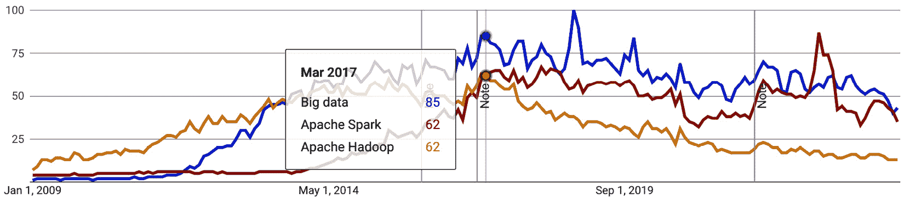
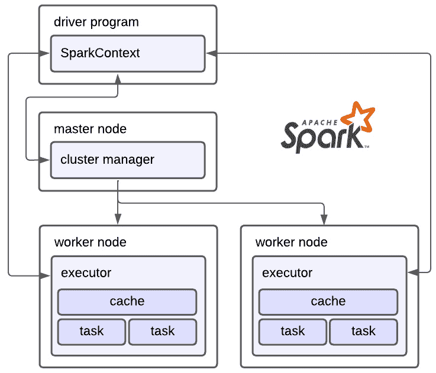
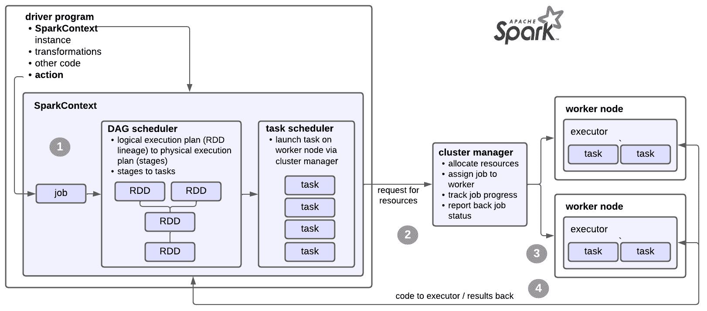
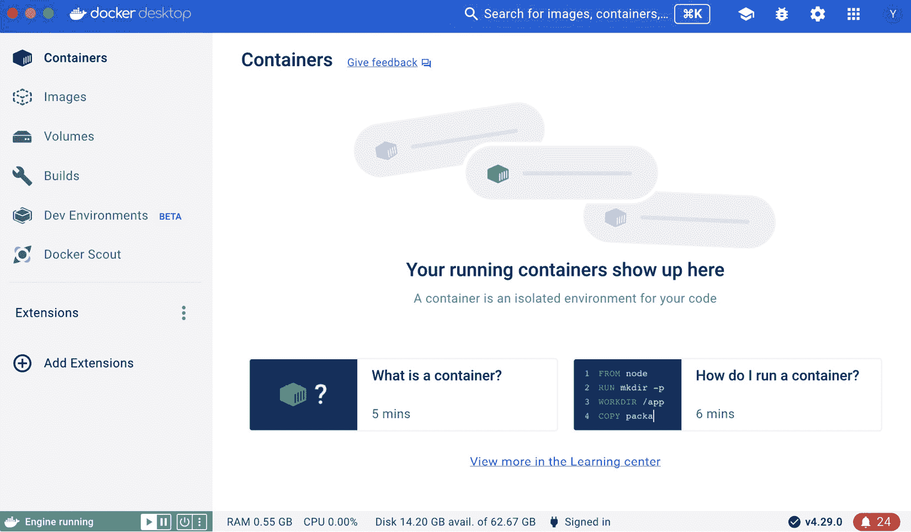
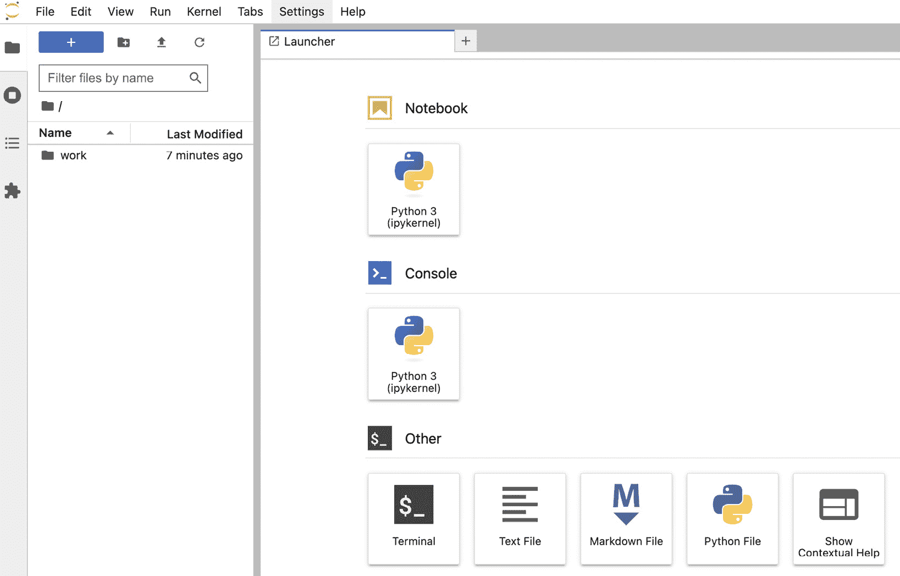
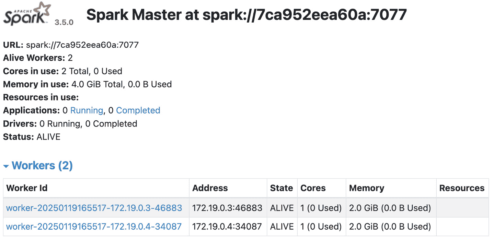

# 第三章：Apache Spark 简介

本章概述了 Apache Spark，解释了它的分布式计算能力以及处理大规模时间序列数据的适用性。它还解释了 Spark 如何解决并行处理、可扩展性和容错性的问题。这些基础知识非常重要，因为它为利用 Spark 在处理庞大的时间数据集时的优势奠定了基础，从而促进了高效的时间序列分析。了解 Spark 的作用，可以增强从业人员利用其强大计算能力的能力，使其成为可扩展、高性能时间序列应用的宝贵资源。

我们将覆盖以下主要内容：

+   Apache Spark 及其架构

+   Apache Spark 是如何工作的

+   Apache Spark 的安装

# 技术要求

本章的动手部分将着重于部署一个多节点的 Apache Spark 集群，以帮助熟悉部署过程中的重要组件。本章的代码可以在本书 GitHub 仓库的`ch3`文件夹中找到，网址为：https://github.com/PacktPublishing/Time-Series-Analysis-with-Spark/tree/main/ch3。

本章的动手实践部分将进一步详细介绍这一过程。此过程需要一些搭建开源环境的技能。如果你不打算搭建自己的 Apache Spark 环境，而是专注于时间序列并使用 Spark（而不是部署它），你可以跳过本章的动手部分。你可以使用像 Databricks 这样的托管平台，它预先构建了 Spark，我们将在未来的章节中使用该平台。

# 什么是 Apache Spark？

Apache Spark 是一个分布式计算系统，它是开源的，具有编程接口和用于大规模并行数据处理的集群，并且具备容错能力。Spark 最初作为伯克利 AMPLab 的一个项目启动于 2009 年，并于 2010 年成为 Apache 软件基金会的一部分，开源发布。Spark 的原始创始人后来成立了 Databricks 公司，提供基于其多云平台的托管版 Spark。

Spark 可以处理批处理和流处理，使其成为大数据处理中的一个广泛适用的工具。相较于现有的大数据系统，Spark 通过内存计算和优化的查询执行实现了显著的性能提升，能够对任何规模的数据进行非常快速的分析查询。它基于**弹性分布式数据集**（**RDDs**）和数据框架（DataFrames）的概念构建。这些是分布在计算机集群中的数据元素集合，能够并行操作并具备容错能力。在本章的其余部分，我们将进一步扩展这些概念。

## 为什么使用 Apache Spark？

使用 Spark 有许多优势，这也是其作为大规模数据处理解决方案受欢迎的原因，正如*图 3.1*所示，这一趋势基于 Google 趋势数据。我们可以看到，Apache Spark 软件在大数据话题上的兴趣不断增加，而 Hadoop 软件的趋势在 2017 年 3 月被 Apache Spark 软件超越后开始下降。



图 3.1：与 Hadoop 和大数据相比，Apache Spark 的兴趣不断增加

这一兴趣激增可以通过一些关键优势来解释，具体如下：

+   **速度**：与非 Spark Hadoop 集群相比，Spark 在内存中运行速度可快达 100 倍，甚至在磁盘上运行时也能快达 10 倍。

+   **容错性**：通过使用分布式计算，Spark 提供了一个容错机制，能够在故障发生时进行恢复。

+   **模块化**：Spark 支持 SQL 和结构化数据处理、机器学习、图处理和流数据处理。凭借各种任务的库，Spark 能够处理广泛的数据处理任务。

+   **可用性**：Spark 提供了 Python、Java、Scala 和 R 等 API，以及 Spark Connect，能够让广泛的开发者和数据科学家使用。

+   **兼容性**：Spark 可以在不同平台上运行——包括 Databricks、Hadoop、Apache Mesos 和 Kubernetes，独立运行或在云端。它还可以访问各种数据源，相关内容将在*接口和* *集成*部分中讨论。

Spark 日益流行以及其背后的诸多优势，是经过多年的演变而来的，接下来我们将进行回顾。

## 演变历程

Apache Spark 多年来经历了几次演进，以下是主要的版本发布：

+   **1.x**：这些是 Spark 的早期版本，起初基于 RDD 和一些分布式数据处理能力。

+   **2.x**：Spark 2.0（2016 年）引入了 Spark SQL、结构化流处理和 Dataset API，相比 RDD 更加高效。

+   **3.x**：自 2020 年起，Spark 3.0 进一步改进，增加了**自适应查询执行**（**AQE**），该功能根据运行时统计数据动态调整查询计划，增强了性能优化，并进行了动态分区剪枝。同时，新增对更新版本 Python 的支持，以及对**机器学习** **库**（**MLlib**）的扩展。

截至目前，最新版本为 3.5.3。为了了解项目的未来发展方向，接下来我们将聚焦于一些最新版本的亮点，具体如下：

+   **PySpark**为 Python 类型提示提供了用户友好的支持，支持在 Spark 上的 pandas API，并通过优化提升了性能。

+   自适应查询执行（Adaptive Query Execution）的改进促进了更高效的查询执行和资源利用。

+   **结构化流处理**的改进提升了稳定性和性能。

+   Kubernetes 支持更好的集成和资源管理能力，用于在 Kubernetes 上运行 Spark。这带来了更高的效率和易用性。

+   API 和 SQL 的增强带来了更高效的数据处理和分析，新功能和现有功能的改进提升了效率。这里的关键主题是更好的可用性和性能。

从前述内容可以看出，最近的关注点主要集中在对现代基础设施的支持、性能和可用性上。作为一个大规模数据处理和分析的工具，这使得 Spark 成为一个更加广泛采用的工具。

## Spark 的分发版

随着其流行度和广泛的应用，Spark 出现了多个分发版。这些分发版由不同的组织开发，Apache Spark 作为核心，提供了不同的集成能力、可用性特性和功能增强。与其他大数据工具捆绑在一起的这些分发版，通常提供改进的管理界面、增强的安全性以及不同的存储集成。

以下是最常见的分发版：

+   **Apache Spark**是由 Apache 软件基金会维护的原始开源版本，是其他分发版的基础。

+   **Databricks Runtime**是由 Databricks 公司开发的，这家公司由 Spark 的创始人创建。它针对云环境进行了优化，提供了一个统一的分析平台，促进了数据工程师、数据科学家和业务分析师之间的协作。Databricks 提供了经过优化的 Spark 性能，采用了 C++重写的版本**Photon**，互动笔记本，集成的数据工程工作流（包括**Delta Live Tables**（**DLT**）），以及与 MLflow 的机器学习支持，且作为其基于 Unity Catalog 的治理功能的一部分，提供企业级的合规性和安全性。

+   **Cloudera Data Platform**（**CDP**）将 Spark 作为其数据平台的一部分，平台中还包含了 Hadoop 和其他大数据工具。

+   **Hortonworks Data Platform**（**HDP**）在与 Cloudera 合并之前，提供了其自有的分发版，其中包括 Spark。

+   **Microsoft Azure**将 Spark 作为**Azure Databricks**的一部分，后者是 Azure 上的第一方服务，此外还包括 HDInsight、Synapse，以及未来的 Fabric。

+   **Amazon Web Services**（**AWS**）在其市场中提供 Databricks，以及作为云服务运行的**Elastic MapReduce**（**EMR**），可在 AWS 上运行如 Apache Spark 等大数据框架。

+   **Google Cloud Platform**（**GCP**）托管了 Databricks，以及**Dataproc**，这是 Google 为 Apache Spark 和 Hadoop 集群提供的云端托管服务。

从本地解决方案到云原生解决方案，再到与其他数据平台集成的解决方案，每种 Apache Spark 的分发版都能满足不同的需求。当组织选择分发版时，通常考虑的因素包括性能要求、管理的简便性、现有的技术栈以及每个分发版所提供的特定功能。

在了解了 Apache Spark 的基本概念、优势和演变之后，让我们深入探讨它的架构和组件。

# Apache Spark 架构

使用 Apache Spark 架构的主要目标是跨分布式集群处理大规模数据集。架构可以根据应用的具体需求而有所不同，无论是批处理、流处理、机器学习、报告查询，还是这些需求的组合。一个典型的 Spark 架构包括多个关键组件，这些组件共同满足数据处理需求。此类架构的示例可见于 *图 3.2*。



图 3.2：基于 Apache Spark 的架构示例（独立模式）

现在让我们深入探讨一下这些部分的具体功能。

## 集群管理器

集群管理器负责将资源分配给集群，集群是 Spark 工作负载执行的操作系统环境。包括以下几种：

+   **独立模式**：Spark 附带一个基本的集群管理器，使得搭建集群并开始使用变得容易。这个集群管理器节点也被称为主节点：

+   **Kubernetes**：Spark 可以部署到 Kubernetes 上，Kubernetes 是一个开源的基于容器的系统，能够自动化容器化应用的部署、管理和扩展。

+   **Apache Mesos**：作为集群管理器，Mesos 支持 Spark，同时也能运行 Hadoop MapReduce。

+   **Hadoop YARN**：在与 YARN 一起运行时，Spark 可以与其他 Hadoop 组件共享集群和数据集。

+   **专有和商业**：将 Spark 融入的解决方案通常有自己的集群管理器——通常是对先前开源版本的变种和改进。

接下来，我们将查看这些 Spark 集群中的内容。

## Spark Core、库和 API

一旦集群管理器提供了一个或多个集群，Spark Core 就会管理内存和故障恢复，以及与 Spark 作业相关的所有事务，如调度、分配和监控。Spark Core 抽象了存储的读写，使用 RDD 和最近的 DataFrame 作为数据结构。

在（并与之紧密合作）Core 的基础上，多个库和 API 提供了针对数据处理需求的附加功能。这些功能包括：

+   **Spark SQL** 允许通过 SQL 查询结构化数据。

+   **Spark Structured Streaming** 处理来自各种来源的数据流，例如 Kafka 和 Kinesis。

+   **MLlib** 提供多种机器学习算法，支持分类、回归、聚类等任务。

+   **GraphX** 允许使用图算法来创建、转换和查询图。

Spark 涉及数据处理，因此，解决方案中的一个重要部分是数据结构，接下来我们将讨论这个部分。

## RDD、DataFrame 和数据集

自本章开始以来，我们提到了几次 RDD 和 DataFrame，但没有详细说明，现在我们将对此进行详细讲解，并引入 Datasets。

简而言之，这些是内存中的数据结构，表示数据并为我们提供了一种程序化的方式，正式来说，这是一种抽象，来操作数据。每种数据结构都有其适用的场景，如下所示：

+   **RDD**是 Spark 的基本数据结构。它是不可变的和分布式的，可以在集群内存中存储数据。具有容错性，RDD 可以自动从故障中恢复。需要注意的是，在集群内存不足的情况下，Spark 确实会将部分 RDD 存储到磁盘上，但由于这一过程是由后台管理的，因此我们仍然将 RDD 视为存在内存中。

    随着越来越多操作变得可以通过更易用的 DataFrame 实现，你将越来越不可能使用 RDD，我们接下来将看到这一点。RDD 更适合进行低级转换，直接操作数据，当你需要对计算进行低级控制时，它们非常有用。

+   **DataFrame**是建立在 RDD 之上的分布式数据集合，具有命名的列。这类似于关系数据库中的表。除了更易用的高级 API，使代码更加简洁易懂外，DataFrame 还因为 Spark 的 Catalyst 优化器的支持，相较于 RDD 在性能上有了提升，我们将在本章后面讨论这一点。

    在之前的动手练习中，我们已经开始使用 DataFrame。你可能已经注意到在做练习时，除了 Spark DataFrame，还有 pandas DataFrame。虽然在概念上它们类似，但它们属于不同的库，底层实现有所不同。从根本上讲，pandas DataFrame 运行在单台机器上，而 Spark DataFrame 是分布式的。pandas DataFrame 可以转换为 pandas-on-Spark DataFrame，除了并行化的优势外，还能支持 pandas DataFrame API。

+   **Dataset**结合了 RDD 的类型安全性和 DataFrame 的优化。类型安全性意味着你可以在编译时捕捉数据类型错误，从而提高运行时的可靠性。然而，这取决于编程语言是否支持在编码时定义数据类型，并在编译时进行验证和强制执行。因此，Dataset 仅在 Scala 和 Java 中得到支持，而 Python 和 R 由于是动态类型语言，只能使用 DataFrame。

总结来说，RDD 提供低级控制，DataFrame 提供优化后的高级抽象，而 Dataset 则提供类型安全。选择使用哪种数据结构取决于你应用的具体需求。

到目前为止，我们讨论了内部组件。接下来，我们将探讨外部接口部分，介绍 Spark 如何在后端与存储系统集成，并在前端与应用和用户交互。

## 接口与集成

在考虑与环境的接口和集成时，有几种方法可以通过 Apache Spark 实现。这些方法如下：

+   `csv`、`json`、`xml`、`orc`、`avro`、`parquet` 和 `protobuf`。其中，Parquet 是最常见的格式，因为它在使用 snappy 压缩时提供了良好的性能。此外，Spark 可以通过扩展包来支持多种存储协议和外部数据源。Delta 就是其中之一，我们将在*第四章*和*第五章*中进一步讨论。其他格式包括 Iceberg 和 Hudi。请注意，我们这里讨论的是数据的磁盘表示形式，这些数据会被加载到之前讨论的基于内存的 RDD 和 DataFrame 数据结构中。

    我们已经通过目前为止的实践演练，积累了一些关于 Spark 和存储的经验，在这些演练中，我们已经从 Databricks Community Edition 的 Spark 集群读取了本地存储中的 CSV 文件。

+   **应用程序**：这是包含数据处理逻辑的代码，调用 Spark API 和库来执行数据变换、流处理、SQL 查询或机器学习等任务。开发人员可以使用 Python、R、Scala 或 Java 编写代码。然后，这些代码会在 Spark 集群上执行。

    我们在应用程序方面的经验也已经开始，通过到目前为止的实践代码。

+   **平台用户界面**：除了我们在实践演练中看到的 Databricks Community Edition 的 Web 界面，开源 Apache Spark 还提供一个 Web **用户界面**（**UI**），用于监控集群和 Spark 应用程序。它提供作业执行的阶段、资源使用情况和执行环境的洞察。其他集成了 Apache Spark 的数据平台也有自己的 UI。

+   **应用程序终端用户界面**：另一种 UI 是用于终端用户消费 Apache Spark 处理结果的界面。这可以是报告工具，或者例如在后端使用 Apache Spark 进行数据处理的应用程序。

在本节关于 Apache Spark 架构的内容中，我们看到架构如何支持从各种来源将数据引入 Spark 系统，通过 Spark 的库进行处理，然后将结果存储或提供给用户或下游应用程序。所选架构依赖于需求，如延迟、吞吐量、数据大小以及数据处理任务的复杂性和类型。在下一节中，我们将重点讨论 Spark 如何在大规模上执行分布式处理。

# Apache Spark 的工作原理

迄今为止，我们已经查看了各个组件及其角色，但对它们的交互了解还不多。接下来我们将讨论这一部分，以了解 Spark 如何在集群中管理分布式数据处理，从变换和操作开始。

## 变换和操作

Apache Spark 在高层次上执行两种类型的数据操作：

+   `filter` 和 `groupBy`。

+   `count`和`save`类型的操作，如写入 Parquet 文件或使用`saveAsTable`操作。Action 操作触发所有在 DAG 中定义的变换的执行，这导致 Spark 计算一系列变换的结果。

变换和动作之间的区别是编写高效 Spark 代码时需要考虑的重要问题。这使得 Spark 能够利用其执行引擎高效地处理作业，接下来将进一步解释。

## 作业、阶段和任务

Spark 应用程序作为作业执行，作业被拆分为多个阶段，再进一步拆分为多个任务，具体如下：

+   **作业**：当在 RDD、DataFrame 或 Dataset 上调用 Action 时，Spark 会提交一个作业。作业会转化为一个包含多个阶段的物理执行计划，接下来我们会解释这些阶段。Spark 作业的目的是作为逻辑工作单元执行一系列计算步骤，以实现特定目标，比如聚合数据或排序，并最终生成输出。

+   **阶段**：一个作业可以有多个阶段，这些阶段在物理执行计划中定义。阶段是一组连续的任务，可以在不跨集群移动数据的情况下完成。阶段之间的数据移动称为洗牌（shuffle）。将作业拆分为多个阶段是有益的，因为洗牌在性能上开销较大。一个阶段进一步被拆分为任务，接下来我们将讨论任务。

+   **任务**：作为最小的处理单元，任务是在 Spark 内存中的数据分区上执行的单个操作。每个任务处理不同的数据集，并且可以与其他任务并行运行。这些任务在工作节点上运行，接下来我们将讨论工作节点。

总结来说，作业、阶段和任务是层级相关的。Spark 应用程序可以有多个作业，这些作业基于数据洗牌边界被划分为多个阶段。阶段进一步细分为任务，这些任务在集群的不同分区上并行运行。这样的执行层级使得 Spark 能够高效地将工作负载分配到集群的多个节点，从而在大规模数据处理时提高效率。

现在我们已经了解了处理单元，接下来的问题是如何在计算资源上运行这些单元，包括驱动程序和工作节点。

## 驱动程序和工作节点

驱动程序和工作节点是集群管理器创建的计算资源，用于组成一个 Spark 集群。它们协同工作，利用多台机器的资源并行处理大数据集。

让我们详细讨论这些资源：

+   **驱动节点**：驱动节点是 Spark 应用程序的主进程运行的地方，主要负责以下任务：

    +   **资源**：驱动程序请求集群管理器分配资源，以便在工作节点上运行进程。

    +   **SparkSession**：这是一个由驱动程序创建的对象，用于以编程方式访问 Spark 并在集群上进行数据处理操作。

    +   **任务**：驱动节点将代码转化为任务，调度任务到工作节点上的执行器，并管理任务的执行。

+   **工作节点**：工作节点是数据处理的核心，数据通过所谓的执行器进程在工作节点上处理。执行器与存储交互，并将数据保存在自己的内存空间中，同时拥有自己的一组 CPU 核心。任务由驱动节点调度到执行器上执行，驱动节点与执行器之间直接通信，传递任务状态和结果。

**驱动节点和工作节点的交互**：*图 3.3* 总结了驱动节点和工作节点之间的交互顺序。



图 3.3：驱动节点和工作节点的工作示意图

步骤如下：

1.  **初始化**：当 Spark 应用程序启动时，驱动程序将作业转换为阶段，并进一步拆分为任务。

1.  **调度**：驱动节点在工作节点的执行器上调度任务，跟踪任务状态，并在发生故障时重新调度。

1.  **执行**：驱动节点分配的任务由工作节点上的执行器运行。此外，当数据需要在执行器之间传递时，驱动节点协调执行器之间的操作。这对于某些操作（如联接）是必需的。

1.  **结果**：最终，执行器处理任务的结果被发送回驱动节点，驱动节点汇总结果并将其发送回用户。

驱动节点和工作节点之间的这种协作过程是 Spark 的核心，它使得数据处理能够在集群中并行进行，并能够处理容错问题。

现在我们已经了解了 Spark 集群的工作原理，让我们深入探讨是什么使它更加高效和优化。

## Catalyst 优化器和 Tungsten 执行引擎

到目前为止，我们已经讨论了在不同版本中对 Apache Spark 的持续改进，其中两个显著的改进是 Catalyst 优化器和 Tungsten 执行引擎。它们在确保 Spark 过程优化、快速执行时间和高效资源利用方面发挥着关键作用。

### Catalyst 优化器

Catalyst 优化器是在 Spark SQL 中引入的一个查询优化框架，通过对查询的 **抽象语法树**（**AST**）进行树形转换，显著提高了查询性能。它通过多个阶段实现优化，具体如下：

1.  **分析**：查询被转化为一个名为逻辑计划的操作符树。

1.  **逻辑优化**：优化器使用基于规则的转换来优化逻辑计划。

1.  **物理规划**：逻辑计划被转换为物理计划，物理计划是基于选择的算法来进行查询操作的。

1.  **成本模型**：然后基于成本模型比较物理计划，以找到在时间和资源上最有效的计划。

1.  **代码生成**：作为最终阶段，物理计划被转换为可执行代码。

通过这些阶段，Catalyst 优化器确保运行最具性能和效率的代码。

### Tungsten 执行引擎

另一个关注点是 Spark 进程对 CPU 和内存的高效利用。Tungsten 执行引擎通过以下方式实现这一目标：

+   **代码生成**：Tungsten 与 Catalyst 优化器协作，生成优化且紧凑的代码，从而减少运行时开销，同时最大化速度。

+   **缓存意识**：减少缓存未命中可以提高计算速度。Tungsten 通过使算法和数据结构具备缓存意识来实现这一点。

+   **内存管理**：Tungsten 高效管理内存，提高了缓存的影响力，同时减少了垃圾回收的开销。

Catalyst 优化器与 Tungsten 执行引擎共同合作，通过优化查询计划、生成高效代码以及减少计算开销，显著提高了 Spark 的性能。这提升了 Spark 在大数据处理中的效率，且具备可扩展性和高速性。

现在我们已经了解了 Apache Spark 的工作原理，接下来将介绍如何设置我们自己的 Spark 环境。

# 安装 Apache Spark

到目前为止，在前面的章节中，我们已成功在 Databricks Community Edition 上执行了 Spark 代码。然而，这仅限于单节点集群。如果我们希望充分利用 Spark 的并行处理能力，就需要多节点集群。我们可以选择使用 Databricks 管理的**平台即服务**（**PaaS**）云解决方案，或其他等效的云 PaaS，或者我们可以构建自己的 Apache Spark 平台。这正是我们现在要做的，按照*图 3.2*中展示的*Apache Spark 架构*来部署环境。

注意

如果您不打算构建自己的 Apache Spark 环境，可以跳过本节的实践部分，改为使用受管 Spark 平台，如 Databricks，我们将在未来的章节中使用。

## 使用容器进行部署

我们可以直接在本地机器上安装 Apache Spark，但这将只给我们一个节点。通过将其部署在容器中，如 Docker，我们可以在同一台机器上运行多个容器。这有效地为我们提供了一种方法来构建一个多节点集群。这种方法的其他优势包括与本地执行环境的隔离，以及提供一种可移植且可重复的方式，将其部署到其他机器上，包括如 Amazon **弹性 Kubernetes 服务**（**EKS**）、**Azure Kubernetes 服务**（**AKS**）或**Google Kubernetes 引擎**（**GKE**）等基于云的容器服务。

在接下来的部分中，我们将使用 Docker 容器，首先安装 Docker，然后构建并启动包含 Apache Spark 的容器，最后验证我们的部署。

Docker 替代方案

您可以使用 Podman 作为 Docker 的开源替代方案。请在此查看更多信息：[`podman.io/`](https://podman.io/)。

### Docker

以下说明指导你如何安装 Docker：

1.  请参考以下链接，根据你的操作系统下载并安装 Docker：

    [`docs.docker.com/get-docker/`](https://docs.docker.com/get-docker/)

    对于 macOS 用户，请按照此处的说明操作：

    [`docs.docker.com/desktop/install/mac-install/`](https://docs.docker.com/desktop/install/mac-install/)

1.  一旦 Docker 安装完成，按*图 3.4*所示启动它。



图 3.4：Docker Desktop

在 macOS 上，你可能会看到 Docker Desktop 的警告：“**另一个应用程序更改了你的桌面配置**”。根据你的设置，以下命令可能解决此警告：

```py
ln -sf /Applications/Docker.app/Contents/Resources/bin/docker-credential-ecr-login /usr/local/bin/docker-credential-ecr-login
```

一旦 Docker Desktop 启动并运行，我们可以使用 Apache Spark 构建容器。

### 网络端口

以下网络端口需要在本地机器或开发环境中可用：

+   Apache Spark：`7077`，`8080`，`8081`

+   Jupyter Notebook：`4040`，`4041`，`4042`，`8888`

你可以使用以下命令检查当前端口是否被现有应用程序占用，在命令行或终端中运行：

```py
% netstat -an | grep LISTEN
```

如果你在已使用端口的列表中看到所需端口，你必须停止使用该端口的应用程序，或者修改`docker-compose`文件以使用其他端口。

作为示例，假设上述`netstat`命令的输出显示本地机器或开发环境中的端口`8080`已经在使用，并且你无法停止正在使用该端口的现有应用程序。

在这种情况下，你需要将`docker-compose.yaml`文件中用于 Apache Spark 的端口`8080`更改为另一个未使用的端口。只需在`:`左侧查找并替换`8080`为例如`8070`，前提是该端口未被占用，如以下示例所示：

+   来自：

    ```py
         ports:
          - '7077:7077'
          - '8080:8080'
    ```

+   到：

    ```py
         ports:
          - '7077:7077'
          - '8070:8080'
    ```

记下新端口，并在需要输入相应 URL 时使用此端口替代现有端口。在此示例中，端口`8080`已更改为`8070`，Airflow Web 服务器的匹配 URL 变更如下：

+   来自：[`localhost:8080/`](http://localhost:8080/)

+   到：[`localhost:8070/`](http://localhost:8070/)

注意

你需要更改以下各节中所有需要修改的 URL 中的网络端口，以配合本节内容。

### 构建并部署 Apache Spark

以下说明指导你如何构建和部署 Docker 镜像：

1.  我们首先从本章的 Git 仓库下载部署脚本，网址如下：

    [`github.com/PacktPublishing/Time-Series-Analysis-with-Spark/tree/main/ch3`](https://github.com/PacktPublishing/Time-Series-Analysis-with-Spark/tree/main/ch3)

    我们将使用适合 git 克隆的 URL，具体如下：

    [`github.com/PacktPublishing/Time-Series-Analysis-with-Spark.git`](https://github.com/PacktPublishing/Time-Series-Analysis-with-Spark.git)

    要做到这一点，启动终端或命令行并运行以下命令：

    ```py
    git clone https://github.com/PacktPublishing/Time-Series-Analysis-with-Spark.git
    cd Time-Series-Analysis-with-Spark/ch3
    ```

    请注意，上述命令适用于 macOS 或基于 Linux/Unix 的系统，您需要运行适用于 Windows 的等效命令。

1.  在 macOS 上，当您运行此命令时，可能会看到以下错误：

    ```py
    xcrun: error: invalid active developer path (/Library/Developer/CommandLineTools), missing xcrun at: /Library/Developer/CommandLineTools/usr/bin/xcrun
    ```

    在这种情况下，您需要使用以下命令重新安装命令行工具：

    ```py
    xcode-select --install
    ```

1.  现在我们可以开始容器的构建和启动。提供了一个 Makefile 来简化启动和停止容器的过程。以下命令构建容器的 Docker 镜像并启动它们：

    ```py
    make up
    ```

Windows 环境

如果您使用的是 Windows 环境，可以根据以下文档安装 Windows 版本的 Make：[`gnuwin32.sourceforge.net/packages/make.htm`](https://gnuwin32.sourceforge.net/packages/make.htm)

这将产生以下或等效的输出：

```py
docker-compose up -d
[+] Running 4/4
...
 ✔ Container ts-spark-env-spark-master-1    Started
 ✔ Container ts-spark-env-jupyter-1         Started
 ✔ Container ts-spark-env-spark-worker-1-1  Started
 ✔ Container ts-spark-env-ts-spark-env-spark-master-1), which is where the cluster manager runs, and two worker nodes (ts-spark-env-spark-worker-1-1 and ts-spark-env-spark-worker-2-1). In addition, there is a separate node (ts-spark-env-jupyter-1) for a notebook environment, called Jupyter Notebook, similar to what you have used in the previous chapters on Databricks Community Edition. In this deployment, this Jupyter node is also the driver node.
Let’s now validate the environment that we have just deployed.
Accessing the UIs
We will now access the UIs of the different components as a quick way to validate the deployment:

1.  We start with Jupyter Notebook at the following local URL: [`localhost:8888/lab`](http://localhost:8888/lab)

Note
You will need to change the network port in the preceding URL if you need to modify it as discussed in the *Network* *ports* section.
This will open the web page as per *Figure 3**.5*.


Figure 3.5: Jupyter Notebook

1.  The next (and important) UI is for the Apache Spark master node, accessible via the following local URL: [`localhost:8080/`](http://localhost:8080/)

    *Figure 3**.6* shows this master node UI, as well as the worker nodes connected.



Figure 3.6: Spark master node UI
We now have our own Apache Spark cluster running.
As a final step to conclude this chapter, you can stop the containers with the following command:

```

make down

```py

 If you do not intend to use it further, you can additionally delete the Docker containers created with the Delete action as explained here: [`docs.docker.com/desktop/use-desktop/container/#container-actions`](https://docs.docker.com/desktop/use-desktop/container/#container-actions)
Summary
In this chapter, we dove deep into the Apache Spark architecture, its key components, and its features. The key concepts, how it works, and what makes it such a great tool were explained. We then deployed a multi-node cluster representing an example architecture. The concepts presented in this chapter, while essential, cover only a part of an Apache Spark project. We will view such a project end to end in the next chapter.
Further reading
This section serves as a repository of sources that can help you build on your understanding of the topic:

*   Apache Spark official web page: [`spark.apache.org/`](https://spark.apache.org/)
*   *Mastering Apache Spark* (Packt Publishing) by Timothy Chen, Mike Frampton, and Tim Seear
*   *Azure Databricks Cookbook* (Packt Publishing) by Phani Raj and Vinod Jaiswal
*   Google Trends comparison: [`trends.google.com/trends/explore?date=2009-01-01%202024-08-28&q=%2Fm%2F0bs2j8q,%2Fm%2F0ndhxqz,%2Fm%2F0fdjtq&hl=en`](https://trends.google.com/trends/explore?date=2009-01-01%202024-08-28&q=%2Fm%2F0bs2j8q,%2Fm%2F0ndhxqz,%2Fm%2F0fdjtq&hl=en)
*   Cluster Overview: [`spark.apache.org/docs/latest/cluster-overview.html`](https://spark.apache.org/docs/latest/cluster-overview.html)
*   Spark Connect: [`spark.apache.org/docs/latest/spark-connect-overview.html`](https://spark.apache.org/docs/latest/spark-connect-overview.html)
*   Docker Compose: [`docs.docker.com/compose/`](https://docs.docker.com/compose/)
*   Make and Makefile: [`www.gnu.org/software/make/manual/make.html`](https://www.gnu.org/software/make/manual/make.html)
*   Jupyter: [`jupyter.org/`](https://jupyter.org/)

Join our community on Discord
Join our community’s Discord space for discussions with the authors and other readers:
[`packt.link/ds`](https://packt.link/ds)
.jpg)

```

# 第二部分：从数据到模型

在此基础上，本部分将提供时间序列分析项目中涉及的所有阶段的整体视图，重点关注数据和模型。从时间序列数据的导入和准备开始，我们将进行探索性分析，以了解时间序列的性质。数据准备和分析将引导我们选择用于分析、开发和测试的模型。

本部分包含以下章节：

+   *第四章*，*时间序列分析项目的端到端视图*

+   *第五章*，*数据准备*

+   *第六章*，*探索性数据分析*

+   *第七章*，*构建与测试模型*
