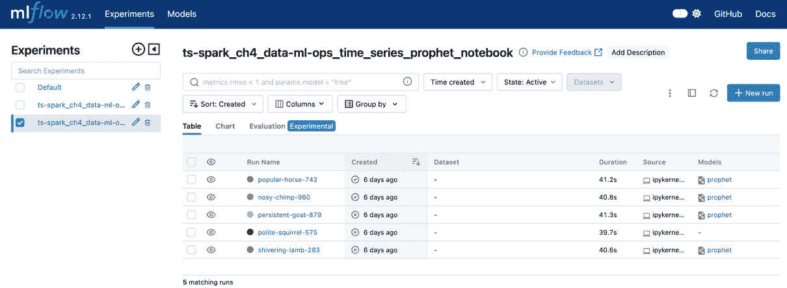

# 第四章：时间序列分析项目的端到端视角

在前几章中，我们介绍了时间序列分析及其多个应用场景，以及 Apache Spark——作为这种分析的关键工具——的基础，本章将引导我们完成整个时间序列分析项目的过程。从用例出发，我们将过渡到涵盖 DataOps、ModelOps 和 DevOps 的端到端方法。我们将涵盖关键阶段，如数据处理、特征工程、模型选择和评估，并提供关于如何使用 Spark 和其他工具构建时间序列分析管道的实用见解。

这种全面的时间序列分析项目视角将为我们提供一种结构化的方法，帮助我们处理现实世界的项目，增强我们实施端到端解决方案的能力。这里的信息将为我们提供一个框架，帮助我们以一致的方式使用 Spark，并确保时间序列分析项目的成功执行。我们将以两种实施方法作为结尾。

本章将涵盖以下主题：

+   由用例驱动

+   从 DataOps 到 ModelOps 再到 DevOps

+   实施示例与工具

让我们开始吧！

# 技术要求

本章的实操部分将是实现时间序列分析项目的端到端示例。该章节的代码可以在 GitHub 仓库中的 `ch4` 文件夹找到，链接如下：

[`github.com/PacktPublishing/Time-Series-Analysis-with-Spark/tree/main/ch4`](https://github.com/PacktPublishing/Time-Series-Analysis-with-Spark/tree/main/ch4)

本章的实操部分（*实施示例与工具*）将进一步详细说明。这需要一些构建开源环境的技能。如果你不打算构建自己的 Apache Spark 环境，且关注点仅在于时间序列分析并使用 Spark 和其他工具，而不是部署它们，那么你可以跳过本章的实操部分。你可以使用像 Databricks 这样的托管平台，它预装了 Spark、MLflow 以及用于工作流和笔记本的工具，正如我们在未来章节中所做的那样。

# 由用例驱动

在我们深入讨论如何进行端到端时间序列分析项目之前，像往常一样，先从*为什么*开始总是一个好的选择。可能有许多原因，通常是多种原因的组合，来证明启动时间序列分析项目的必要性。以下是一些原因：

+   **技术更新**：强调技术的原因可能是由于老化的平台需要替换，且无法再满足需求，或当有新技术出现，提供更好的性能、更低的成本或更多的功能，如高级机器学习模型或可扩展的云资源。

+   **方法研究**：对于专注于研究的组织或部门，主要驱动力是寻找新的、更好的方法，比如开发和测试用于分析时间序列的新算法。

+   **数据探索**：与研究类似，但需要更接近数据，这通常嵌入在企业的数据团队中。这里的需求是理解时间序列数据，而不一定需要预先定义的应用目标。其目的是发现数据中的模式、趋势和异常。

+   **用例**：在这种方法中，我们从结果出发，首先识别最终用户或相关方的具体需求和期望。然后，我们基于时间序列数据分析来设置项目，以回答这些需求。

尽管之前提到的所有理由都有其合理性，并且无疑是有效的，但多年来，我发现以业务驱动的用例方法在投资回报方面是最高的。我们在*第二章*中已经开始讨论基于时间序列的用例，涵盖了各个行业的应用场景，如库存预测、能源使用预测、金融市场趋势分析或传感器数据中的异常检测；在这里，我们将重点关注这种用例驱动的方法，并进一步探讨。

用例方法首先识别并定义现实世界中具体的业务应用或挑战。接着，选择最适合解决这些需求的技术方案。乍一看，这与任何商业环境中的项目似乎并无太大不同。这里的关键区别在于“具体”一词，用例方法强调的是具体、可衡量的业务成果。这遵循精益方法，因为我们希望避免那些无法为业务成果做出贡献的功能。

用例可以与敏捷软件开发方法中的用户故事进行对比。事实上，敏捷方法通常是实现用例的方式，通过简化的迭代开发过程，始终涉及用户的参与。

以下*图 4.1*概述了基于迄今为止讨论内容的用例驱动方法，包括它们的关键特征。


图 4.1：用例驱动方法

现在我们已经定义了用例驱动的方法，接下来我们将介绍这一方法的关键特征，如下所示：

+   **业务成果**：项目的成功通过业务指标来衡量，具体包括提高收入、降低成本、提升效率以及更好、更快速的决策制定。

+   **以用户为中心**：从一开始就与最终用户和相关方合作，明确他们的具体需求，项目目标除了回答这些需求外，还包括前述的业务成果。

+   **具体**：我们已经讨论过这个词几次。项目的具体性为其范围提供了明确的方向，使得执行更加灵活。我们希望解决一个具体的需求，例如销售预测，这个需求甚至可以更为细化，比如为特定产品线或区域进行预测。

+   **迭代性**：涉及最终用户和利益相关者的反馈和改进循环确保项目保持正轨，满足预期的商业成果。这再次强调了与敏捷方法的相似性，其短开发周期、增量交付、持续反馈和适应性。

遵循这些特征，确保用例范围足够小，能够在几个月内（如果不是几周的话）实现并带来价值。这些较小的用例通常意味着它们在开发资源上并行竞争。这就需要优先排序，以确保资源得到合理投资。以下标准通常用于优先排序用例：

+   **影响力**：这是用例预期商业影响的衡量标准，最好用货币价值来计算。如果结果是时间的减少，则需估算时间节省的等值货币价值。

+   **成本**：我们需要计算与用例相关的所有成本，从用例构想到用例上线并为业务带来价值的整个过程。成本可能与开发、基础设施、迁移、培训、支持和生产运营相关。

+   **投资回报率**（**ROI**）：这可以通过将影响力除以成本来简单估算。例如，对于一家希望更好地预测店铺库存的零售商，如果将库存预测用例投入生产的总成本为 50 万美元，而库存预测改进预计将带来三年 200 万美元的节省，则在此期间 ROI 为 4 倍。

+   **技术可行性**：用例的技术解决方案存在，并且能够在时间和预算内实现。

+   **数据可用性和可访问性**：数据可用且可访问，用以构建用例并将其投入运营。

根据前述标准，在资源竞争的情况下，具有高影响力、投资回报率（ROI）为 10 倍、可行且已有数据的用例，应优先于另一个影响较小、ROI 为 3 倍或没有数据访问的用例。

总结来说，从清晰理解用户需求开始，基于用例的项目确保了与业务的适用性和相关性，紧密对接利益相关者的目标，并能量化影响。然而，拥有一个好的用例仅仅是开始。接下来，我们将深入探讨从用例到成功完成时间序列分析项目、并实现商业成果的下一步。

# 从 DataOps 到 ModelOps 再到 DevOps

一旦确定了一个重要的用例，一些阶段发挥着至关重要的作用，从**数据操作**（**DataOps**）到**模型操作**（**ModelOps**），最后到**部署**（**DevOps**），将业务环境中的价值传递到实际应用中。一个覆盖这些阶段的完整端到端过程确保了我们可以持续地从一个用例交付到下一个，同时确保结果的可重复性。*图 4.2*概述了这些阶段，接下来将在本节中详细介绍。


图 4.2：DataOps、ModelOps 和 DevOps

## DataOps

DataOps 在时间序列分析项目中的应用包括最佳实践和过程，确保时间序列数据在生命周期中的流动、质量和访问。其目标是及时、高效且准确地进行时间序列分析和建模，从而得出可操作的业务洞察。

DataOps 实践涵盖完整的数据和元数据生命周期，通常可以分为数据源集成、数据处理、数据治理和数据共享。

### 来源集成

数据源集成首先涉及识别数据源并获取访问权限，然后从源中摄取数据。

**数据来源**可以是内部的或外部的。内部数据来源主要是数据库，例如交易记录、系统日志或用于遥测的传感器数据。外部数据来源包括市场数据、天气数据或社交媒体数据，而后者现在正成为主流。不同领域的数据来源在数据量、更新频率和数据格式上差异巨大。一旦确定并访问了数据来源，**数据摄取**就是将数据引入平台进行处理的过程。通常通过自动化的数据摄取管道来实现，按照特定的频率（每小时、每天等）批量运行或持续流式传输。数据摄取机制包括数据库连接、API 调用或基于 Web 的抓取等。

### 处理与存储

数据处理包括清理数据、将其转化为正确的格式，并为分析存储。推荐的方法是奖牌方法，如*图 4.3*所示，包含多个处理阶段，从原始数据到精加工数据，再到准备报告的数据。


图 4.3：数据处理的奖牌阶段

奖牌方法

数据处理的奖牌方法将数据组织为三个阶段：青铜、白银和黄金。这通常用于数据湖和 Delta Lake 架构。在青铜阶段，原始数据从不同来源摄取而不进行转化。白银阶段是通过数据清理、增强和转化来创建一个精加工的数据集。最后，黄金阶段代表最高质量的数据，已清洗、汇总并优化以进行高级分析、报告和商业智能。这种多层结构提高了数据质量，并便于数据管理。

一旦数据从源端摄取，**数据质量检查与清洗**是构建数据可信度的第一步。这包括处理缺失值、检测并修正错误、去除重复项以及筛选异常值。这些操作能提升数据质量，并为分析提供坚实的基础。对于时间序列数据，特定要求是在此阶段验证并维护时间一致性，以确保数据的顺序性。

来源的原始数据通常不适合直接用于分析，需要经过多次**转换**，使其适合时间序列分析。此过程包括将半结构化数据转换为结构化格式以便于更快速的访问等多项转换操作。粒度较小或间隔不规则的数据需要聚合到更高层级的时间间隔，例如将每分钟的数据聚合为每小时数据、每小时数据聚合为每日数据，依此类推。日期和时间字段可能需要特别处理，以确保其为可排序格式，并用于设置时间索引，以便更快速地检索。不同的时区需要相应处理。

在较小的项目中常被忽视，**元数据**在企业环境中是确保数据可追溯性和数据血缘治理的重要要求。例如，这些关于数据的信息包括源标识符、数据摄取和更新的时间、所做的更改以及历史版本。元数据作为数据摄取和转化管道的一部分进行捕获，并且原生支持诸如 Delta 这样的存储协议。

尽管迄今为止描述的所有数据处理可以在内存中完成，但对数据的长期**存储**和检索仍有需求，以便进行时间跨度较长的分析。此存储需要具有成本效益、可扩展性、安全性，并且能够提供进行及时分析所需的高性能。根据数据的体积和流动速度，可选择的存储方式包括专门的时间序列数据库如 InfluxDB，或结合使用 Delta 等存储协议的云端存储。

我们将在*第五章*中更深入探讨数据处理，特别是数据准备的内容。现在，我们将焦点转向治理和安全，这些是从风险角度来看，DataOps 中最关键的考虑因素之一。

### 监控、安全性与治理

数据监控、安全性和治理涵盖了多个交叉的数据实践领域，包括数据质量、隐私、访问控制、合规性以及政策。为了理解这些实践的重要性，让我们来看看在撰写本文时新闻中的以下内容：

一起网络安全事件影响了多个主要组织，包括 Ticketmaster、Banco Santander 和 Ticketek。一个名为 ShinyHunters 的黑客组织获取了 Ticketmaster 的数据库，并因此泄露了 5.6 亿用户的个人信息。泄露的内容包括姓名、地址、电话号码、电子邮件地址和支付详情。据报道，这些数据正在黑客论坛上以高价出售。Banco Santander 也发生了类似的泄露，影响了客户和员工。

+   [来源：[`www.wired.com/story/snowflake-breach-ticketmaster-santander-ticketek-hacked/`](https://www.wired.com/story/snowflake-breach-ticketmaster-santander-ticketek-hacked/)]

这些与第三方云数据仓库服务相关的数据泄露突显了网络安全的挑战，以及对监控、安全和治理强有力措施的需求。

#### 监控

这里的目标是及时识别问题，并能够采取纠正措施，理想情况下在其产生负面后果之前。监控内容包括数据本身、转换管道的执行状态，以及安全和治理漏洞。对于数据监控，这意味着通过衡量数据的准确性和完整性来跟踪数据质量，同时捕捉数据缺口和异常。实现这一目标的一种方法是与一系列特定的时间序列模式进行比较，正如我们在*第二章*的异常检测示例中所看到的。至于数据管道监控，主要跟踪其性能，以确保数据的新鲜度、**服务级别协议**（**SLA**）得到遵守，以及通过数据溯源和完整性跟踪其血统。从安全角度来看，我们希望及时发现任何数据泄露的尝试，并采取相应的行动。监控应为自动化过程，并具备警报功能。

#### 安全

无论是静态数据还是传输中的数据，我们都需要定义角色和相关权限，以确保访问控制。某些时间序列数据具有敏感性，只有授权人员才能查看或操作这些数据。

在受监管行业中，处理个人数据时，我们需要确保数据处理和存储实践符合相关法规（如 HIPAA、GDPR 等）。这还涉及确保隐私并管理个人数据的同意。

#### 治理

除了前述内容，数据治理实践负责分配角色和责任以管理数据。作为其中的一部分，数据管理员负责监督数据质量、合规性和政策。

通过建立正确的流程、人员和工具，我们可以确保预防数据泄露，并在发生时有效减轻其影响。

我们现在已经涵盖了以可信和有用的方式将数据摄取并转化为受治理和安全的数据的过程。作为 DataOps 的一部分，剩下的步骤就是将数据共享给用户或其他系统进行分析和消费。

### 共享与消费

在数据摄取和处理之后，我们希望经过整理的数据和分析结果能够对用户可见并可访问。一个集中的**数据目录**，包括描述和使用指南，可以让用户轻松发现并访问可用的数据集。

最后，作为 DataOps 阶段的一部分，我们希望数据科学家、分析师和其他用户能够使用数据进行探索、分析和报告。理想情况下，我们希望将其与治理结合，确保只有授权的用户访问和使用允许的数据集。访问方式和使用方法包括基于文件的访问、数据库连接和 API 等。

正如本节所讨论的，DataOps 是一系列确保数据可用、可访问和可用的过程。它是迭代的，通过来自消费者的反馈以及对数据、管道和实践的持续改进来实现。通过建立一个可扩展且灵活的基础设施，并以 Apache Spark 的处理能力和多功能性为核心，DataOps 确保数据科学家和分析师能够在需要时获得高质量的数据，以获取洞察并推动决策。

我们将在*第五章*《数据准备》中讨论 DataOps 的实际考虑。目前，让我们专注于 ModelOps，它是继 DataOps 之后的下一个阶段。

## ModelOps

虽然 DataOps 关注的是数据生命周期，ModelOps 关注的是模型生命周期——更具体地说，是统计和机器学习模型。其目标是从开发到部署管理模型，确保模型可靠、准确且可扩展，同时根据用例要求提供可操作的洞察。

ModelOps、MLOps 和 LLMOps

这些术语具有重叠的定义，有时可以互换使用。在本书中，我们将“ModelOps”作为不同类型模型（包括仿真模型、统计模型和机器学习模型）的更广泛生命周期管理实践来使用。我们将更具体地使用**机器学习运维**（**MLOps**）来指代机器学习模型，并将**大语言模型运维**（**LLMOps**）用于特指大语言模型生命周期中的相关考虑。因此，ModelOps 将指代这一系列实践的总和。

ModelOps 实践大致可以分为模型开发与测试，以及模型部署。

### 模型开发与测试

模型开发与测试涉及基于历史数据创建和微调时间序列分析模型。这个过程从特征工程开始，选择合适的算法，如自回归综合滑动平均（ARIMA）或长短期记忆（LSTM），并将数据划分为训练集和测试集。然后，模型通过反复训练和评估性能指标来确保准确性。接下来，通过在未见过的数据上测试模型，我们可以确保模型能够很好地推广到新的、真实的场景中。

我们现在将进一步详细介绍每个步骤：

1.  **特征工程**：与 DataOps 阶段重叠，特征工程是模型开发的初始阶段，关注的是从时间序列数据中识别现有特征并创建新特征。这包括创建滞后和滚动平均特征，其中使用前一时间步的数据计算新特征，以及创建捕捉时间相关特征的时间特征，如一天中的特定时间、星期几、月份或假期。此外，特征工程阶段还包括对时间序列进行平稳化的转换，如差分或对数变换，或通过重采样使时间序列变得规律化，如在*第一章*中所讨论的那样。我们将在*第八章*中看到如何使用 Apache Spark 进行特征工程，涉及模型开发。

1.  **模型选择**：选择模型是从一个不断增长的时间序列候选模型列表中挑选：ARIMA、Prophet、机器学习、深度学习模型（如 LSTM）等。正确的时间序列模型取决于可用的数据和我们要实现的用例，正如我们在*第二章*中的用例示例中看到的那样。**探索性数据分析**（**EDA**），在*第六章*中详细介绍，帮助我们理解数据的趋势、季节性和潜在模式，从而指导我们完成这一过程。然而，找到最佳模型是一个迭代过程，通过模型验证来不断完善，我们将在下一步中介绍这个过程。

1.  **数据集划分**：一旦我们有了候选模型，训练模型之前的第一步是将历史数据划分为训练集、验证集和测试集。在时间序列数据中进行此操作的具体考虑因素有两个：一是保持数据集内的时间顺序，二是确保在划分之间没有数据泄漏。

1.  **训练**：在这一阶段，模型通过调整其参数来拟合训练数据集。这可以是有监督的，使用预定义的标签或实际结果，或者是无监督的，如在*第二章*中解释的那样。在有监督训练的情况下，模型参数通过诸如梯度下降的过程进行调整，以最小化模型预测与实际结果之间的差异，使用损失函数进行优化。对于无监督训练，模型会进行调整，直到满足停止标准，如运行次数或分类类别数。

1.  **验证**：作为训练迭代的一部分，模型验证使用未见过的验证数据集，并采用如基于时间的交叉验证等技术。这是为了检查是否存在过拟合，并确保训练后的模型能够以可接受的准确性对未见过的数据进行泛化。模型的准确性通过如**平均绝对百分比误差**（**MAPE**）或**平均绝对误差**（**MAE**）等指标进行评估。作为一个迭代过程，这一阶段包括超参数调优，在此过程中，不同设置的模型被训练和验证，以找到最佳的模型配置。技术如网格搜索或贝叶斯优化被用来寻找最优的超参数。

参数与超参数

请注意参数和超参数之间的区别。这些术语常常被混淆。模型**参数**是通过训练过程从数据中学习得来的，例如神经网络的权重和偏差。**超参数**则是在模型训练之前定义的模型配置，举例来说，在神经网络中，超参数可以是定义其架构的节点数和层数。

1.  **测试** – 作为模型开发的最后一步，模型会在未见过的测试数据集上进行评估，并与不同的算法或模型类型进行比较。测试还可以包括超出模型准确度的其他标准，如响应时间，以及与模型配合使用的应用代码的集成测试。

模型训练、验证和测试将在*第七章*中详细讨论。

### 模型部署与监控

模型部署与监控涉及将时间序列分析模型从开发环境过渡到生产环境，并持续监控其性能。这种持续的监控使得模型能够在数据模式或被分析的底层系统行为发生变化时，进行重新训练和更新。

现在我们将进一步详细说明这些步骤：

1.  **部署**：模型被部署到生产环境中的模型服务框架中。这可以通过像 Kubernetes 和 Docker 这样的工具进行容器化，或者部署到基于云的解决方案中，例如 Databricks 模型服务、Amazon SageMaker、Azure 机器学习或 Google Vertex AI。一旦部署，模型可以用于批量推理，按定期间隔安排，或基于持续流数据源进行实时推理，或响应 API 请求。

1.  **监控**：一旦模型在生产环境中部署，就需要进行监控，以确保模型持续适配目的并有价值。随着**数据漂移**（数据特征随时间的变化）和**概念漂移**（模型对现实的表征随时间恶化），模型的准确性会下降。这可以通过模型监控来检测，并根据情况发送警报。

1.  **再训练**：当监控警报提示出现漂移时，如果漂移足够显著，下一步是对模型进行再训练。这可以手动启动，也可以自动化。如果再训练未能产生足够准确的模型，我们将不得不回到模型开发周期，寻找适合目的的其他模型。

1.  **治理**：这包括几个关键的考虑因素。我们需要在模型的整个生命周期和相关过程中跟踪模型版本和生命周期阶段。此外，为了审计目的，会保存训练、部署和准确性指标的日志，在某些情况下，还会保存模型推理的请求和响应。其他考虑因素包括模型的访问控制，并确保它符合所有法律和合规要求，尤其是在处理个人或敏感数据时。

总结来说，时间序列分析项目的 ModelOps 涵盖了从开发、部署到维护模型的端到端过程，同时与 DataOps 的相关数据需求有所交集。ModelOps 确保持续改进、可复现性、协作和与业务目标的适配性。它还维持模型的有效性，并确保模型随时间持续提供价值。

我们将在*第七章*中详细介绍 ModelOps 的实际考虑因素，*构建和测试模型*。接下来的阶段是 DevOps，我们现在将详细介绍。

## DevOps

紧接着 ModelOps 之后，DevOps 是一组实践和工具，旨在平滑**开发**（**Dev**）与**运维**（**Ops**）之间的交接。这适用于模型及其相关的应用程序代码。通过自动化时间序列应用的构建、测试、部署和监控，DevOps 确保它们是可靠的、可扩展的，并能持续为业务提供价值。

DevOps 实践大致可以分为**持续集成/持续部署**（**CI/CD**）、基础设施管理、监控和治理。

CI/CD

CI/CD 涉及自动化时间序列分析模型的集成和部署，以便对生产环境进行无缝更新。

这包括以下步骤：

1.  **代码和模型版本管理与仓库**：代码和模型的变化需要进行跟踪，并且如果需要，可以回滚到以前的版本。这意味着代码和模型需要进行版本控制，并存储在一个仓库中，便于访问不同的版本。

1.  **测试**：每当时间序列模型和相关代码发生变化时，确保没有回归是至关重要的。确保这一点的一种方法是通过自动化测试，进行单元测试和集成测试，这些测试可以在生产监控检测到性能下降时启动，或者在开发环境中模型或相关代码发生变化时启动。

1.  **部署**：一旦时间序列模型和代码在开发环境中准备好，接下来的步骤就是部署到预生产和生产环境。推荐使用 CI/CD 管道自动化此部署，以最小化由于手动步骤引起的错误风险，并使该过程成为无缝、可重复和可扩展的。

总结来说，CI/CD 管道确保新功能、改进和漏洞修复能够持续集成、测试和部署，同时最大程度地减少停机时间，提高新代码发布的效率。

### 基础设施管理

**基础设施即代码**（**IaC**）是一种推荐的配置方法，因为它使基础设施配置可以进行版本控制、自我文档化、可重现并且可扩展。这是设置计算、存储和网络配置一致性的一种方式。在云环境等虚拟环境中，基础设施本身在某种意义上是版本控制的，因为它是软件定义的。

除了前述核心资源外，安全特定的配置还需要为访问控制、加密和网络安全防火墙提供配置。

随着应用需求的变化，相应的工作负载也会变化，可能需要更多或更少的基础设施资源。一个可扩展的基础设施管理流程确保基础设施根据需求自动进行扩展。

### 监控、安全性和治理

DevOps 在监控、安全性和治理方面的要求与 DataOps 和 ModelOps 类似。DevOps 的范围涵盖了部署到生产环境中的一切，包括模型、代码和配置。这通常通过诸如应用程序、安全性和合规性监控、日志记录和警报、以及事件管理等流程来实现。

总结来说，DevOps 通过自动化部署、管理和扩展，确保应用程序（包括时间序列分析）具有高可用性和可扩展性。关键在于通过促进协作和使用自动化，使得从 *Dev* 到 *Ops* 的过渡无缝化，确保时间序列分析项目能够从用例概念演变为技术实现，再到驱动显著业务影响和价值的全面运营系统。

现在我们已经理解了时间序列分析项目的端到端阶段，接下来的部分将提供实际示例和工具，以实施我们在本章中所学的内容。

# 实施示例和工具

定义了端到端阶段后，本节将探讨两种实施示例：基于笔记本的方法和基于协调器的方法。

注意

如果你不打算构建自己的端到端环境，可以跳过本节的实践部分，使用像 Databricks 这样的托管平台，正如我们将在后续章节中所做的那样。

让我们从设置运行示例所需的环境开始。

## 环境设置

我们将使用 Docker 容器，正如在 *第三章* 中所示，用于平台基础设施。有关安装 Docker 的说明，请参考 *第三章* 中的 *使用容器进行部署* 部分。

Docker 的替代方案

你可以使用 Podman 作为 Docker 的开源替代方案。你可以在这里找到更多信息：[`podman.io/`](https://podman.io/)。

在我们可以部署 Docker 容器之前，我们将在下一部分验证容器将使用的网络端口是否存在冲突。

### 网络端口

以下网络端口需要在你的本地机器或开发环境中可用：

+   Apache Spark: `7077`、`8070` 和 `8081`

+   Jupyter Notebook: `4040`、`4041`、`4042` 和 `8888`

+   MLflow: `5001`

+   Airflow: `8080`

你可以通过以下命令检查现有应用程序是否正在使用这些端口，从命令行或终端运行：

```py
% netstat -an | grep LISTEN
```

如果你看到所需的端口已在使用的端口列表中，你必须停止使用该端口的应用程序，或者修改 `docker-compose` 文件以使用其他端口。

作为示例，假设前面的 `netstat` 命令输出显示本地机器或开发环境中端口 `8080` 已被占用，且你无法停止使用该端口的现有应用程序。

在这种情况下，你需要在 `docker-compose.yaml` 文件中将端口 `8080`（用于 Airflow Web 服务器）更改为另一个未使用的端口。只需搜索并将冒号（`:`）左边的 `8080` 替换为 `8090`，如果该端口未被占用，如下所示：

+   来自此：

    ```py
         ports:
          - '7077:7077'
          - '8080:8080'
    ```

+   例如：

    ```py
         ports:
          - '7077:7077'
          - '8090:8080'
    ```

记下新端口，并在需要输入对应 URL 时使用该端口。在此示例中，端口`8080`已更改为`8090`，Airflow Web 服务器的匹配 URL 更改如下：

+   从此开始：

    `http://localhost:8080/`

+   改为：

    `http://localhost:8090/`

注意

你需要在以下部分中的所有 URL 中更改网络端口，按照本节的说明进行修改。

### 环境启动

一旦 Docker 安装并运行，且网络端口配置已验证，以下指令将指导你设置和启动环境：

1.  我们首先从本章的 Git 仓库下载部署脚本，仓库地址如下：

    [`github.com/PacktPublishing/Time-Series-Analysis-with-Spark/tree/main/ch4`](https://github.com/PacktPublishing/Time-Series-Analysis-with-Spark/tree/main/ch4)

    我们将使用`git clone`友好的 URL，具体如下：

    [`github.com/PacktPublishing/Time-Series-Analysis-with-Spark.git`](https://github.com/PacktPublishing/Time-Series-Analysis-with-Spark.git)

    为此，启动终端或命令行并运行以下命令：

    ```py
    git clone https://github.com/PacktPublishing/Time-Series-Analysis-with-Spark.git
    git command:

    ```

    xcrun: 错误：无效的活动开发者路径（/Library/Developer/CommandLineTools），缺少 xcrun，路径为：/Library/Developer/CommandLineTools/usr/bin/xcrun

    ```py

    In this case, you will need to reinstall the command-line tools with the following command:

    ```

    xcode-select --install

    ```py

    ```

1.  现在我们可以开始构建和启动容器了。提供了一个 makefile 以简化启动和停止容器的过程。以下命令构建容器的 Docker 镜像并启动它们：

    ```py
    make up
    ```

Windows 环境

如果你使用的是 Windows 环境，你可以按照以下文档安装 Windows 版本的`make`：[`gnuwin32.sourceforge.net/packages/make.htm`](https://gnuwin32.sourceforge.net/packages/make.htm)

`make up`命令将输出以下或等效的内容：

```py
make prep && docker-compose up -d
sh prep-airflow.sh
[+] Running 9/9
✔ Container ts-spark-env-spark-master-1      Started
✔ Container ts-spark-env-postgres-1          Healthy ✔ Container ts-spark-env-mlflow-server-1     Started ✔ Container ts-spark-env-jupyter-1           Started ✔ Container ts-spark-env-airflow-init-1      Exited ✔ Container ts-spark-env-spark-worker-1-1    Started ✔ Container ts-spark-env-airflow-scheduler-1 Running ✔ Container ts-spark-env-airflow-triggerer-1 Running ✔ Container ts-spark-env-airflow-webserver-1 Running
```

1.  当你运行上面的`make` `up`命令时，你可能会看到以下错误：

    ```py
    open /Users/<USER_LOGIN>/.docker/buildx/current: permission denied
    make up command.
    ```

1.  如果你的环境中使用的是`bash`而不是`sh`，且脚本无法找到`sh`文件，你可能会遇到错误。在这种情况下，将 makefile 中的最后一行从"`sh prep-airflow.sh`"更改为"`bash prep-airflow.sh`"，然后再次运行`make` `up`命令。

经过该过程的结束，正如*第三章*所述，你将拥有一个运行中的 Spark 集群和一个独立的 Jupyter Notebook 节点。此外，我们在这里已部署以下组件：

+   **MLflow** – 一个开源平台，最初由 Databricks 开发，用于管理端到端的机器学习生命周期。MLflow 具有实验和部署功能，旨在与任何机器学习库和编程语言兼容。这使得它在各种环境和用例中具有灵活性，也解释了它被广泛采用的原因。

    你可以在这里找到更多信息：[`mlflow.org/`](https://mlflow.org/)。

+   **Apache Airflow** – 由 Airbnb 创建，Airflow 是一个开源平台，用于协调数据处理管道和计算工作流。通过能够以编程方式定义、调度和监控大规模的工作流，Airflow 被广泛采用，包括数据工程师和数据科学家在内，用于各种类型的工作流。

    你可以在这里找到更多信息：[`airflow.apache.org/`](https://airflow.apache.org/)。

+   **Postgres** – 这是 Airflow 后台使用的关系型数据库。

现在让我们验证刚刚部署的环境。

## 访问用户界面

现在我们将访问不同组件的**用户界面**（**UIs**），作为快速验证部署的一种方式：

1.  请按照*第三章*中的指示验证 Jupyter Notebook 和 Apache Spark 集群的部署。请注意，由于 Airflow Web 服务器使用端口`8080`，这是我们在*第三章*中为 Apache Spark 使用的相同端口，因此我们已将 Spark 主节点更改为以下本地网址：

    `http://localhost:8070/`

1.  MLflow 可以通过以下本地网址访问：

    `http://localhost:5001/`

    这将打开如*图 4.4*所示的网页。



图 4.4：MLflow

1.  下一个 UI，*图 4.5*，是 Airflow 界面，可以通过以下本地网址访问：

    `http://localhost:8080/`

    默认的用户名和密码是`airflow`，强烈建议更改。


图 4.5：Airflow

我们现在已经设置好环境，接下来将使用这个环境。

## Notebook 方法

我们使用了*第一章*中的笔记本，我们从 Databricks Community 版本开始。在*第三章*中，我们部署了自己的 Jupyter 笔记本环境，这是一个开源实现。正如我们到目前为止所看到的，笔记本提供了一个功能丰富的文档类型界面，在这里我们可以结合可执行代码、可视化和文本。这使得笔记本在数据科学和机器学习的互动和协作工作中非常流行。笔记本也可以构建为非交互式执行，这与它们已经在早期的数据科学和实验阶段中使用过的事实结合，使得它们能够方便地适应端到端的笔记本。

在这个第一个示例中，我们将使用基于*第一章*中介绍的基于 Prophet 的代码的全功能笔记本。如果你按照之前的*环境设置*部分中的指示操作，示例笔记本应该可以直接在 Jupyter Notebook UI 中访问，在左侧文件夹导航面板的`work / notebooks`位置，如*图 4.6*所示，网址为：`http://localhost:8888/lab`。


图 4.6：Notebook

笔记本也可以从以下 GitHub 位置下载：

[`github.com/PacktPublishing/Time-Series-Analysis-with-Spark/raw/main/ch4/notebooks/ts-spark_ch4_data-ml-ops.ipynb`](https://github.com/PacktPublishing/Time-Series-Analysis-with-Spark/raw/main/ch4/notebooks/ts-spark_ch4_data-ml-ops.ipynb)

本文重点更多地放在结构上，而非代码本身，代码内容与*第一章*变化不大，我们将笔记本分成了以下几个部分：

+   配置

+   DataOps

+   从源获取数据

+   转换数据

+   ModelOps

+   训练并记录模型

+   使用模型进行预测

除了前面解释的结构外，从*第一章*引入的代码中还有 MLOps 部分，接下来我们将详细说明。

### 使用 MLflow 进行 MLOps

在此笔记本示例中，我们使用 MLflow 作为工具来实现多个 MLOps 需求。以下代码片段专注于这一部分：

```py
mlflow.set_tracking_uri("http://mlflow-server:5000")
mlflow.set_experiment(
    'ts-spark_ch4_data-ml-ops_time_series_prophet_notebook')
with mlflow.start_run():
    model = Prophet().fit(pdf)
…
    mlflow.prophet.log_model(
        model, artifact_path=ARTIFACT_DIR,
        signature=signature)
    mlflow.log_params(param)
    mlflow.log_metrics(cv_metrics)
```

上述代码中使用的 MLflow 功能如下：

+   `set_tracking_uri` – 这个函数设置跟踪服务器的 URI，MLflow 将在该服务器上存储与模型相关的信息。这样可以集中管理模型数据，促进团队成员之间的协作。跟踪服务器可以是远程服务器，也可以是本地文件路径。

+   `set_experiment` – 这个函数会创建一个新实验，或者使用现有的实验。实验是运行（单独的模型训练或试验）的逻辑分组，有助于组织和比较不同的试验。

+   `start_run` – 这会启动一个新的 MLflow 运行，可以在给定的实验中进行。作为单次训练或试验的表示，`run`会将相关的工件（如参数、指标和模型）归类。

+   `prophet.log_model` – 该函数将一个 Prophet 模型作为工件记录到当前的 MLflow 运行中。

+   `log_params` – 该函数记录运行过程中使用的参数的键值对。参数是模型配置。

+   `log_metrics` – 该函数记录运行过程中评估的指标的键值对。指标是关于模型性能的数值（例如均方误差、准确率）。

结果可以通过 MLflow UI 在以下网址访问：`http://localhost:5001/`。

这将打开一个类似于*图 4.4*的 UI 页面，在左侧面板中，你可以导航到名为`ts-spark_ch4_data-ml-ops_time_series_prophet_notebook`的实验。UI 中看到的实验名称来自于前面的代码中的标记。

实验的**概览**标签，如*图 4.7*所示，包含实验的信息，如创建者、创建日期、状态、创建实验的源代码，以及从实验中记录的模型。它还显示了代码中记录的模型参数和指标。


图 4.7：MLflow 实验概览

**模型指标**标签，如*图 4.8*所示，可以用来搜索并查看指标图。


图 4.8：MLflow 模型指标

**Artifacts**标签页的初始界面，见*图 4.9*，显示了我们在代码中作为签名记录的模型架构。它还提供了如何使用模型的代码示例。


图 4.9：MLflow 模型架构

**MLmodel**部分位于**Artifacts**标签页中，显示了模型工件及其路径，见*图 4.10*。


图 4.10：MLflow 模型工件

在这个示例中，我们将使用 MLflow 到此为止。我们将在下一个示例中使用编排器和 MLflow 类似的方式，并在**第九章**《走向生产》中深入探讨 MLflow 的更多应用。现在，我们将关注笔记本方法的其他考虑因素。

### 多个笔记本

这里的笔记本示例仅是一个起点，可以根据自身用例的需求以及后续章节将讨论的技术进行适配和扩展。对于更复杂的需求，建议为以下内容使用单独的笔记本：

+   探索性数据分析与数据科学

+   特征工程

+   模型开发、选择及最佳模型的部署

+   生产数据管道，可能还包括特征工程

+   生产模型推理

+   监控

+   模型重训练

尽管笔记本因其交互性、协作简便性、相对简单性和多功能性而备受青睐，但它们也存在限制，接下来的章节将对此进行讲解。

### 限制

无论笔记本有多优秀，端到端时间序列分析的笔记本都面临若干挑战，具体如下：

+   缺乏调度和编排功能。这使得它难以超越简单的顺序工作流，开发复杂的工作流。

+   可扩展性问题。笔记本代码运行在笔记本内核中，受限于所在机器的资源。请注意，可以通过将任务从笔记本提交到 Apache Spark 集群中运行来解决此问题，正如我们在示例中所做的那样。

+   缺乏错误处理。如果笔记本单元格中的代码失败，整个工作流执行将停止。当然，可以编写错误处理代码，但这会增加额外的编码工作量。

为了应对这些挑战，我们接下来将考虑另一种方法，使用编排器。

## 编排器方法

在深入了解这种方法之前，首先让我们理解什么是编排器。我们将在此使用的 Airflow，之前作为示例提到过。

**编排器**在管理工作流（包括数据工程和处理）中扮演着核心角色。工作流或管道是一组计算任务，这些任务按一定顺序并行或顺序执行，通常依赖于前一个任务或多个任务的结果。除了调度工作流外，编排器通常还具备在调度前创建工作流和在调度后监控其执行的功能。

### 编排器的好处

使用调度器相较于仅使用笔记本的方法提供了以下优点：

+   在工作流中调度任务，考虑任务的依赖关系以及并行或顺序执行的要求。这还包括任务执行的条件逻辑。

+   可扩展和分布式任务执行。

+   监控和记录工作流执行，包括性能和错误。这对于生产环境至关重要。

+   错误处理和警报，提供重试、跳过到下一个任务或失败整个管道的可能性。这也是生产环境中的关键要求。

+   与其他系统和工具的集成。这是构建端到端工作流的必要条件，涵盖 DataOps、ModelOps 和 DevOps，这通常意味着需要使用不同的专业工具。

既然我们已经看到了这些优点，并且环境已设置好，Airflow 作为调度器，现在让我们开始实践。

### 创建工作流

第一步是创建工作流或**有向无环图**（**DAG**），也叫做 DAG。

如果你遵循了之前*环境设置*部分中的说明，示例 DAG 已经加载并可以直接通过 Airflow UI 访问，如*图 4.5*所示，网址为：`http://localhost:8080/`。此时，你可以跳到下一部分来运行 DAG，或者继续查看 DAG 代码的详细信息。

DAG 定义位于`dags`文件夹中的 Python 代码文件中，也可以从以下 GitHub 位置下载：

[`github.com/PacktPublishing/Time-Series-Analysis-with-Spark/raw/main/ch4/dags/ts-spark_ch4_airflow-dag.py`](https://github.com/PacktPublishing/Time-Series-Analysis-with-Spark/raw/main/ch4/dags/ts-spark_ch4_airflow-dag.py)

代码的核心与我们在之前笔记本示例中看到的非常相似。本节重点介绍与 Airflow 的集成以及定义 DAG 的任务，这些任务是 DAG 的各个步骤。

#### 任务定义 – Python 代码

当调度器运行任务时，它调用以下相应的 Python 函数作为需要执行的底层代码。注意传入的函数参数和返回值。这些与任务的定义对齐，我们将在接下来的部分看到：

1.  `ingest_data` – 对应任务`t1`。注意，`spark.read`将在 Spark 集群上运行：

    ```py
    def ingest_data():
        sdf = spark.read.csv(
            DATASOURCE, header=True, inferSchema=True)
        pdf = sdf.select("date", "daily_min_temperature").toPandas()
        return pdf
    ```

1.  `transform_data` – 对应任务`t2`：

    ```py
    def transform_data(pdf, **kwargs):
        pdf.columns = ["ds", "y"]
        pdf["y"] = pd.to_numeric(pdf["y"], errors="coerce")
        pdf.drop(index=pdf.index[-2:], inplace=True)
        pdf.dropna()
        return pdf
    ```

1.  `train_and_log_model` – 对应任务`t3`。注意，MLflow 函数，如`mlflow.set_experiment`和`mlflow.prophet.log_model`，会调用 MLflow 服务器。这里展示了代码的部分摘录：

    ```py
    def train_and_log_model(pdf, **kwargs):
        mlflow.set_experiment(
            'ts-spark_ch4_data-ml-ops_time_series_prophet')
        …
            mlflow.prophet.log_model(
                model, artifact_path=ARTIFACT_DIR,
                signature=signature)
        …
            return model_uri
    ```

1.  `forecast` – 对应任务`t4`。注意，`mlflow.prophet.load_model`从 MLflow 服务器加载模型。这里只是为了展示如何从 MLflow 服务器检索模型。实际上并非严格需要，因为我们本可以在本地保留对模型的引用：

    ```py
    def forecast(model_uri, **kwargs):
        _model = mlflow.prophet.load_model(model_uri)
        forecast = _model.predict(
            _model.make_future_dataframe(30))
        forecast[
            ['ds', 'yhat', 'yhat_lower','yhat_upper']
        ].to_csv('/data/ts-spark_ch4_prophet-forecast.csv')
        return '/data/ts-spark_ch4_prophet-forecast.csv'
    ```

这些任务由 DAG 引用，我们将在接下来定义它们。

#### DAG 定义

在前面的任务定义之上，我们有一个高层次的 Airflow DAG，它按照以下定义：

```py
dag = DAG(
    'ts-spark_ch4_data-ml-ops_time_series_prophet',
    default_args=default_args,
    description='ts-spark_ch4 - Data/MLOps pipeline example - Time series forecasting with Prophet',
    schedule_interval=None
)
```

这指向`default_args`，其中包含以下 DAG 参数。

```py
default_args = {
    'owner': 'airflow',
    'depends_on_past': False,
    'start_date': datetime(2024, 1, 1),
    'email_on_failure': False,
    'email_on_retry': False,
    'retries': 1,
    'retry_delay': timedelta(minutes=1),
}
```

这些的更多信息可以在以下 Airflow 文档中找到：

[`airflow.apache.org/docs/apache-airflow/stable/_api/airflow/models/baseoperator/index.html#airflow.models.baseoperator.BaseOperator`](https://airflow.apache.org/docs/apache-airflow/stable/_api/airflow/models/baseoperator/index.html#airflow.models.baseoperator.BaseOperator)

我们没有设置`schedule_interval`，因为我们希望通过 Airflow UI 手动触发 DAG。

#### DAG 任务

DAG 任务按以下方式定义。请注意引用了`dag`和先前定义的底层 Python 函数。使用`PythonOperator`意味着任务将调用 Python 函数：

1.  `t1`：

    ```py
    t1 = PythonOperator(
        task_id='ingest_data',
        python_callable=ingest_data,
        dag=dag,
    )
    ```

1.  `t2`：

    ```py
    t2 = PythonOperator(
        task_id='transform_data',
        python_callable=transform_data,
        op_kwargs={'pdf': t1.output},
        provide_context=True,
        dag=dag,
    )
    ```

    任务`t2`的一个显著特点是，任务`t1`的输出`t1.output`作为输入`pdf`传递给任务`t2`。

1.  `t3`：

    ```py
    t3 = PythonOperator(
        task_id='train_and_log_model',
        python_callable=train_and_log_model,
        op_kwargs={'pdf': t2.output},
        provide_context=True,
        dag=dag,
    )
    ```

    任务`t2`的输出`t2.output`作为输入`pdf`传递给任务`t3`。

1.  `t4`：

    ```py
    t4 = PythonOperator(
        task_id='forecast',
        python_callable=forecast,
        op_kwargs={'model_uri': t3.output},
        provide_context=True,
        dag=dag,
    )
    ```

    任务`t3`的输出`t3.output`作为输入`model_uri`传递给任务`t4`。

然后，这些任务通过以下代码配置，以便由 Airflow 按顺序进行协调：

```py
# Task dependencies
t1 >> t2 >> t3 >> t4
```

这就结束了在 Airflow 中定义工作流作为 DAG 的过程。这里的示例只是一个起点，展示了一个简单的顺序工作流，可以根据您的具体需求以及接下来章节中讨论的时间序列分析任务进行调整和扩展。

协调笔记本

请注意，还可以通过使用`PapermillOperator`操作符从 Airflow 任务调用笔记本，将协调器和笔记本方法结合起来。有关此操作符的更多信息，请访问：[`airflow.apache.org/docs/apache-airflow-providers-papermill/stable/operators.html`](https://airflow.apache.org/docs/apache-airflow-providers-papermill/stable/operators.html)。

一旦 DAG 编写完成并放置在 Airflow 的`dags`文件夹中，它将被 Airflow 自动识别，检查 Python 定义文件中的语法错误，然后列出可以运行的 DAG 列表，接下来我们将介绍这一部分内容。

### 运行工作流

可以通过点击 DAG 右侧的运行按钮(>)来启动工作流，正如*图 4.5*中所示的*访问 UI*部分。通过点击左侧面板中的 DAG 名称，可以在 Airflow UI 中查看 DAG 的详细信息和图形，如*图 4.11*所示。


图 4.11：Airflow DAG

要查看 DAG 中特定运行和任务的信息，请在左侧选择运行，然后从图形中选择任务。这将提供查看任务执行日志的选项。

另一个有趣的信息是不同任务的执行时间，可以通过同一界面中的**甘特图**标签查看。

我们这里只是在探索 Airflow 的表面，它是一个功能丰富的工具，超出了本书的范围。请参阅 Airflow 文档以获取更多信息。

如前所述，部分代码在 Apache Spark 集群上运行。根据*第三章*中的*图 3.6*，可以从 Spark 主节点可视化这一过程。URL 为：`http://localhost:8070/`。如果应用仍在运行，Spark UI 将显示一个运行中的应用程序。这个应用程序是从 Airflow 任务中启动的 Spark 代码。

对于 MLflow，你可以在以下 URL 中通过 MLflow UI 查看结果：`http://localhost:5001/`。

在 MLflow UI 页面上，类似于*图 4.4*，你可以在左侧面板中导航到名为`ts-spark_ch4_data-ml-ops_time_series_prophet`的实验。UI 中看到的实验名称来自代码，在之前的`train_and_log_model`代码中有所高亮显示。

`这就结束了本章讨论的第二种方法。我们将在接下来的章节中，使用我们学到的概念，基于这个编排器示例进行构建。

## 环境关闭

现在我们可以停止容器环境。提供的 makefile 简化了这个过程，使用以下命令：

```py
make down
```

这将产生如下或等效的输出：

```py
docker-compose down
[+] Running 10/10
 ✔ Container ts-spark-env-spark-worker-1-1  Removed
 ✔ Container ts-spark-env-mlflow-server-1   Removed
 ✔ Container ts-spark-env-airflow-scheduler-1Removed ✔Container ts-spark-env-airflow-webserver-1Removed ✔ ontainer ts-spark-env-jupyter-1          Removed ✔ Container ts-spark-env-airflow-triggerer-1Removed ✔ Container ts-spark-env-airflow-init-1     Removed ✔ Container ts-spark-env-postgres-1         Removed ✔ Container ts-spark-env-spark-master-1     Removed ✔ Network ts-spark-env_default              Removed
```

如果你不打算进一步使用它，可以按照此处的说明，删除通过`Delete`操作创建的 Docker 容器：[`docs.docker.com/desktop/use-desktop/container/#container-actions`](https://docs.docker.com/desktop/use-desktop/container/#container-actions)。

# 总结

本章详细介绍了时间序列分析项目的关键阶段，从选择与业务需求相对应的用例开始。接着，将该用例映射到技术解决方案，包括 DataOps、ModelOps 和 DevOps 组件。最后，我们探讨了两种实现方式，包括带有一体化笔记本和带有编排器的基准实现示例，这将在本书接下来的部分进一步扩展。

在下一章中，我们将专注于此，重点是通过数据准备进行 DataOps。

# 加入我们社区的 Discord

加入我们社区的 Discord 空间，与作者和其他读者进行讨论：

[`packt.link/ds`](https://packt.link/ds)

.jpg)
