# 第五章：数据准备

到目前为止，我们已经介绍了时间序列和 Apache Spark 的基础知识，以及时间序列分析项目的完整生命周期。在本章中，我们将深入探讨组织、清洗和转换时间序列数据的关键步骤，以便进行有效分析。内容包括处理缺失值、应对离群值和将数据结构化以适应 Spark 的分布式计算模型。这些信息非常宝贵，它们将帮助你确保数据质量并与 Spark 兼容，为准确高效的时间序列分析奠定坚实基础。适当的数据准备增强了后续分析过程的可靠性，使本章成为利用 Spark 从时间相关数据集中提取有意义见解的必备前提。

本章我们将涵盖以下主要内容：

+   数据摄取与持久化

+   数据质量检查与清洗

+   转换

# 技术要求

本章主要是动手编码，涵盖了时间序列分析项目中常见的数据准备步骤。本章的代码可以在本书 GitHub 仓库中的`ch5`文件夹找到，网址如下：

[`github.com/PacktPublishing/Time-Series-Analysis-with-Spark/tree/main/ch5`](https://github.com/PacktPublishing/Time-Series-Analysis-with-Spark/tree/main/ch5)

注意

本章的代码将与 Databricks Community Edition 一起使用，正如*第一章*和本章中所解释的方法一样。

# 数据摄取与持久化

在本节中，我们将介绍从数据源获取时间序列数据并将数据集持久化到存储的方式。

## 摄取

摄取是从源系统检索数据进行进一步处理和分析的过程。这个过程可以批量执行，用来一次性摄取大量数据，或按计划定期自动运行，比如每晚一次。或者，如果数据是源系统持续提供且需要实时获取的，则可以使用结构化流处理作为另一种摄取方法。

注意

从技术上讲，我们可以将数据摄取过程编码为结构化流处理，并将其配置为在触发的时间间隔运行。这为根据数据的新鲜度变化调整业务需求提供了灵活性，而无需重新开发摄取过程。

本章将重点讨论批量摄取，这是目前最常见的方法。我们还将简要讨论结构化流处理，它正在迅速获得应用，在一些组织中甚至超越了批量摄取。

### 批量摄取

批量摄取通常是通过文件存储或数据库完成的。

#### 从文件存储

正如我们在前几章的动手实践部分所看到的，读取文件是一个常用的批量摄取方法。使用 Apache Spark 时，可以通过`spark.read()`来实现：

```py
df = spark.read.csv("file_path", header=True, sep=";", inferSchema=True)
```

在这个例子中，我们从`file_path`存储位置读取一个 CSV 格式的文件。该文件的第一行包含了标题。不同的列由`；`字符分隔。我们希望 Spark 根据`inferSchema`自动推断文件中存在的数据列及其类型。

该示例基于`ts-spark_ch5_1.dbc`中的代码，我们可以从 GitHub 位置导入该文件，参考*技术要求*部分提到的*第五章*，并按照*第一章*中解释的方法，将其导入 Databricks 社区版。

代码的 URL 是[`github.com/PacktPublishing/Time-Series-Analysis-with-Spark/raw/main/ch5/ts-spark_ch5_1.dbc`](https://github.com/PacktPublishing/Time-Series-Analysis-with-Spark/raw/main/ch5/ts-spark_ch5_1.dbc)。

摄取的数据可以根据本章提供的代码示例进一步处理和分析，如*图 5.1*所示。

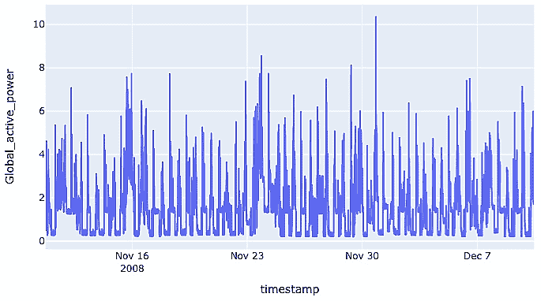

图 5.1：查看已摄取的数据

在读取文件时，也可以通过提供文件夹位置而非特定文件位置，从存储文件夹中读取多个文件。这是文件摄取的常见模式。另一个常用的功能是提供一个筛选器（`pathGlobFilter`），仅包括与模式匹配的文件名。

`spark.read`命令有许多其他选项，具体取决于正在读取的数据源。以下是关于数据源的 Apache Spark 文档，详细说明了这些选项：

[`spark.apache.org/docs/latest/sql-data-sources.html`](https://spark.apache.org/docs/latest/sql-data-sources.html)

#### 从数据库

另一个常用的数据源类型是关系型数据库。以下是从 PostgreSQL 读取数据的示例：

```py
df = spark.read \
    .format("jdbc") \
    .option("url", "jdbc:postgresql:dbserver") \
    .option("dbtable", "schema.tablename") \
    .option("user", "username") \
    .option("password", "password") \
    .load()
```

详细内容请参见以下文档：[`spark.apache.org/docs/latest/sql-data-sources-jdbc.html`](https://spark.apache.org/docs/latest/sql-data-sources-jdbc.html)

来自专门时间序列数据库（如 QuestDB）的数据，可以通过类似的方式摄取，如下所示：

```py
df = spark.read.format("jdbc") \
    .option("url", "jdbc:postgresql://localhost:8812/questdb") \
    .option("driver", "org.postgresql.Driver") \
    .option("user", "admin") \
    .option("password", "quest") \
    .option("dbtable", "timeseries_table") \
    .load()
```

详细内容请参见以下文档：

[`questdb.io/blog/integrate-apache-spark-questdb-time-series-analytics/`](https://questdb.io/blog/integrate-apache-spark-questdb-time-series-analytics/)

注意

您需要将特定数据库的 JDBC 驱动程序包含在 Spark 的类路径中。前面引用的文档对此进行了说明。

### 结构化流处理

对于基于事件驱动或近实时处理的 Apache Spark，时间序列数据可以从流数据源（如 Apache Kafka、Amazon Kinesis、Google Cloud Pub/Sub 和 Azure Event Hubs）中摄取。这通常涉及到使用对应的数据源连接器设置 Spark 结构化流处理。

以下示例展示了如何使用 Spark 从 Apache Kafka 摄取数据：

```py
df = spark \
    .readStream \
    .format("kafka") \
    .option("kafka.bootstrap.servers", "host1:port1,host2:port2") \
    .option("subscribe", "topic1") \
    .load()
```

Apache Spark 文档提供了关于从流数据源读取的更多详细信息：

[`spark.apache.org/docs/latest/structured-streaming-programming-guide.html#input-sources`](https://spark.apache.org/docs/latest/structured-streaming-programming-guide.html#input-sources)

一旦数据被摄取，下一步是将其持久化存储以进行进一步处理，如我们接下来所见。

## 持久化

数据通常会持久化到磁盘上的文件或数据库中。对于文件，Apache Spark 提供了一个成熟的解决方案——Delta Lake，一个开源存储协议。

注意

Apache Iceberg 是另一种常见的开源存储协议。

Delta 为 Apache Spark 和大数据工作负载提供了 ACID 事务，有效地将文件存储和数据库存储的优势结合在一起，这种结合被称为**湖仓**（*数据湖*和*数据仓库*的合并）。Delta 基于 Parquet 文件格式，提供如模式强制、数据版本控制和时间旅行等功能。

下面是一个示例，展示如何使用 Python 在 Delta 存储格式中持久化时间序列数据：

```py
df.delta_table_path storage location. The overwrite mode means that existing data at this location will be overwritten. With Delta format, the data is written as a table that is given the name specified in table_name.
This example is based on the code in `ts-spark_ch5_1.dbc`, which we imported in the earlier section on batch ingestion.
There are many other options for the `spark.write` command, depending on the destination being written to. The following Apache Spark documentation on saving details these options:
[`spark.apache.org/docs/latest/sql-data-sources-load-save-functions.html#saving-to-persistent-tables`](https://spark.apache.org/docs/latest/sql-data-sources-load-save-functions.html#saving-to-persistent-tables)
When the data is persisted in Delta format, in addition to the data, metadata is also stored together to disk. This can be retrieved with the following code:

```

# 将 Delta 表加载为 DeltaTable 对象

delta_table = DeltaTable.forPath(spark, delta_table_path)

# Delta 表的详细信息

print("Delta 表详情：")

delta_table.detail().display()

```py

 Note
In the code example, we did not have to install Delta as it is already installed when using the Databricks Community Edition. You will need to install the Delta packages if you are using another Apache Spark environment where Delta is not pre-installed. You can find the instructions here: [`docs.delta.io/latest/quick-start.html`](https://docs.delta.io/latest/quick-start.html).
*Figure 5**.2* shows some of the metadata such as location and creation date.
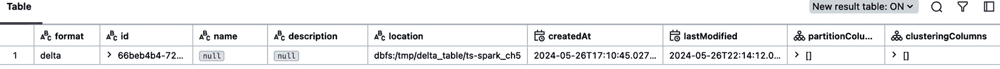

Figure 5.2: Metadata for the Delta table
Once data has been persisted, it can be read from storage as needed at a later stage for querying and analysis. The `spark.read` command can be used here as well, as per the following example:

```

spark.read.load(delta_table_path).display()

```py

 The Delta table storage location, `delta_table_path`, is passed to the `load` command, which retrieves the stored table from the disk storage.
As mentioned earlier, Spark can also write to a database, among other destinations. The following example shows how to write to a PostgreSQL database.

```

jdbcDF.write \

.format("jdbc") \

.option("url", "jdbc:postgresql:dbserver") \

.option("dbtable", "schema.tablename") \

.option("user", "username") \

.option("password", "password") \

.save()

```py

 This is further detailed in the following documentation: [`spark.apache.org/docs/latest/sql-data-sources-jdbc.html`](https://spark.apache.org/docs/latest/sql-data-sources-jdbc.html)
Note
You will need to include the JDBC driver for the particular database on the Spark classpath. The previously referenced documentation explains this.
As seen in this section, persistence allows longer-term storage and retrieval. Delta also stores different versions of the data whenever it changes, which we will investigate next.
Versioning
Data versioning is one of the key features provided by Delta Lake, allowing you to keep track of changes made to your data over time. This storage of different versions is done in an optimal way to minimize storage footprint.
With a record of different versions, Delta enables a functionality called **time travel**. With this, you can query data at specific versions or timestamps, revert to previous versions, and perform time travel queries. This is also useful from a reproducibility point of view, whereby we can go back to the specific version of data used previously, even if it has since changed, to audit, review, and redo an analysis.
The code provided in this chapter has an example of using versioning and time travel. The following extract shows how to read a specific version of the Delta table. `version_as_of` is an integer representing the version number:

```

df_ = spark.read.timestamp_as_of 表示感兴趣版本的时间戳：

```py
df_ = spark.read.history command, as follows:

```

print(f"Delta 表历史记录 - 修改后:")

delta_table.history().display()

```py

 An example of output from the history is shown in *Figure 5**.3*.
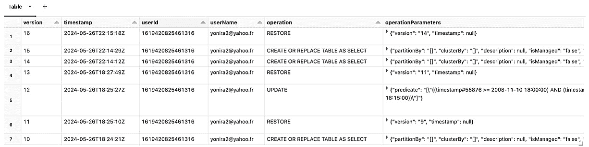

Figure 5.3: Delta table versions
Finally, it is possible to restore the Delta table back to a previous version with the `restoreToVersion` command, overwriting the latest version, as per the following:

```

delta_table.restoreToVersion(latest_version)

```py

 You can also find more information on time travel here:
[`delta.io/blog/2023-02-01-delta-lake-time-travel/`](https://delta.io/blog/2023-02-01-delta-lake-time-travel/)
This concludes the section on ingestion and persistence. We will now move on to verify and clean the data.
Data quality checks, cleaning, and transformation
Once the data has been ingested from source systems to a storage location from which we can access it, we will need to ensure that it is of usable quality and, if not, do the necessary cleaning and transformation.
Data quality checks
The outcome of any analysis done with the data can be only as good as the data, making data quality checks an important next step.
Consistency, accuracy, and completeness
Data quality checks for consistency, accuracy, and completeness are essential to ensure the reliability of your data. With its powerful tools for data processing and analysis, Apache Spark is suitable for implementing these checks. The following are examples of how you can perform data quality checks for consistency, accuracy, and completeness using Apache Spark in Python.
Consistency check
In the following consistency test example, we are counting the number of records for each date:

```

# 示例一致性检查：检查某列的值是否一致

consistency_check_result = df.groupBy("Date").count().orderBy("count")

print(f"数据一致性结果：")

consistency_check_result.display()

```py

 As per *Figure 5**.4*, this simple check shows that some dates do not consistently have the same number of records, which can indicate missing values for some dates.
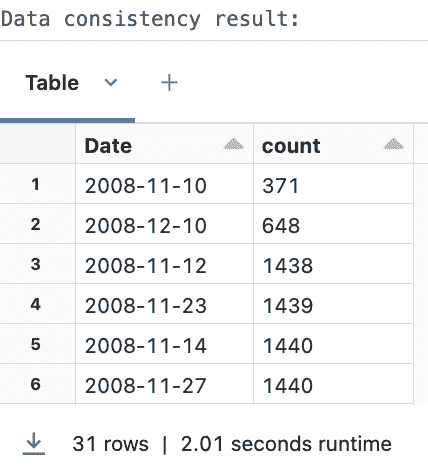

Figure 5.4: Consistency check results
Accuracy check
In the accuracy test example, we want to verify the accuracy of `Global_active_power`, as follows:

```

# 示例准确性检查：

# 检查某列中的值是否符合特定条件

accuracy_check_expression = "Global_active_power < 0 OR Global_active_power > 10"

# 检查

accuracy_check_result = df.filter(accuracy_check_expression)

accuracy_check_result_count = accuracy_check_result.count()

如果 accuracy_check_result_count == 0:

print(f"数据通过准确性检查 - !({accuracy_check_expression}).")

else:

print(f"数据未通过准确性检查 - {accuracy_check_expression} - 计数 {accuracy_check_result_count}:")

accuracy_check_result.display()

```py

 As per *Figure 5**.5*, this check shows that in two cases, `Global_active_power` is outside of the accuracy criteria that we have defined for this check. This indicates that either these values are wrong or that they are correct but are now going beyond the previously known ranges that we have used to define the criteria. We must update the criteria in this latter case.
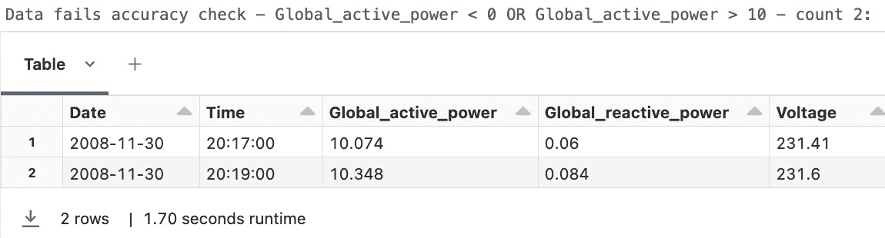

Figure 5.5: Accuracy check results
Completeness check
In the completeness test example, we want to verify whether `Global_active_power` has null values:

```

# 示例完整性检查：检查某列是否包含空值

completeness_check_expression = "Global_active_power is NULL"

# 检查

completeness_check_result = df.filter(

completeness_check_expression)

completeness_check_result_count = completeness_check_result.count()

如果 completeness_check_result_count == 0:

print(f"数据通过完整性检查 - !({completeness_check_expression})")

else:

print(f"数据未通过完整性检查 - {completeness_check_expression} - 计数 {completeness_check_result_count}:")

completeness_check_result.display()

```py

 Note
The consistency check example presented earlier can also be used for completeness.
These examples show basic data quality checks for consistency, accuracy, and completeness using Apache Spark. These checks can be extended and integrated into your data pipelines for more comprehensive data quality assurance.
Data quality framework
To better manage the suite of tests, it is recommended that a framework such as *Great Expectations* be used for data quality checks. You can find more information here: [`github.com/great-expectations/great_expectations`](https://github.com/great-expectations/great_expectations)
We will cover another framework approach with the integration of data quality in the Delta Live Tables pipeline, and monitoring and alerting in *Chapter 10*.
Once the data quality has been tested, the next step is to clean the data.
Data cleaning
The previous step of data quality checks indicates the issues with the data that need to be corrected, which we will now address.
Missing values
Apache Spark offers various methods to handle missing values in time series data. The following examples show how you can clean time series data for missing values using Apache Spark in Python.
Forward filling
The forward filling method to handle missing values replaces the missing values with the previous known value, with the values sorted in chronological order based on their timestamp. In the following code example, missing values for `Global_active_power` are replaced in this way. The `Window.rowsBetween` function in the following case goes from the first record to the current one. The `last` function then finds the last non-null value within that window. As the window slides over all the records, all the missing values are replaced with the last known value:

```

from pyspark.sql import functions as F

从 pyspark.sql 导入 Window

# 示例：通过向前填充处理缺失值

# "timestamp" 列按时间顺序排列

df = spark.sql(

f"从 {table_name} 表中选择时间戳和全局有功功率，并按时间戳排序"

)

window = Window.rowsBetween(float('-inf'), 0)

filled_df = df.withColumn(

"filled_Global_active_power",

F.last(df['Global_active_power'],

ignorenulls=True).over(window))

# 显示更新后的值

filled_df.filter(

"timestamp BETWEEN '2008-11-10 17:58:00' AND '2008-11-10 18:17:00'"

).display()

```py

 The result of forward filling can be seen in *Figure 5**.6*, where the filled values are shown in the `filled_Global_active_power` column.
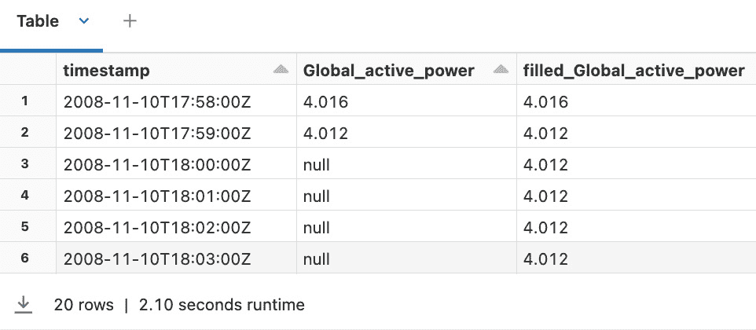

Figure 5.6: Forward filling
Forward filling works well when the last known value is a good indication of the next value, such as for a slow-changing value. It is not a good method when the value can change suddenly or when there is seasonality.
Backward filling
The backward filling method to handle missing values replaces the missing values with the next known value, with the values sorted in chronological order based on their timestamp. In the following code example, missing values for `Global_active_power` are replaced in this way. The `Window.rowsBetween` function in the following case goes from the current one to the last record. The `first` function then finds the next non-null value within that window. As the window slides over all the records, all the missing values are replaced with the next known value:

```

从 pyspark.sql 导入 functions 作为 F

从 pyspark.sql 导入 Window

# 示例：通过向后填充处理缺失值

# "timestamp" 列按时间顺序排列

df = spark.sql(

f"从 {table_name} 表中选择时间戳和全局有功功率，并按时间戳排序"

)

window = Window.rowsBetween(0, float('inf'))

filled_df = df.withColumn(

"filled_Global_active_power",

F.first(df['Global_active_power'],

ignorenulls=True).over(window))

# 显示更新后的值

filled_df.filter(

"timestamp BETWEEN '2008-11-10 17:58:00' AND '2008-11-10 18:17:00'"

).display()

```py

 The result of backward filling can be seen in *Figure 5**.7*, where the filled values are shown in the `filled_Global_active_power` column.
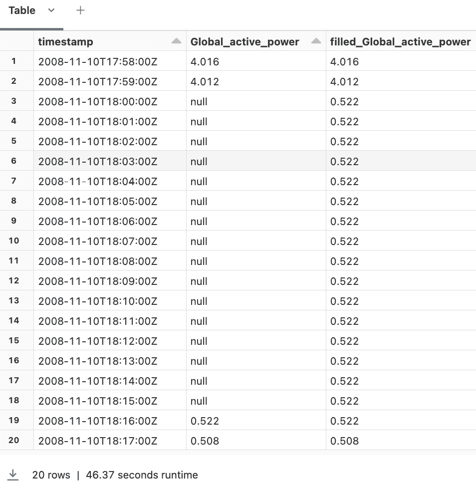

Figure 5.7: Backward filling
Backward filling works well when the next known value can reasonably indicate the previous value, such as with slow-changing data or when collecting data retrospectively with gaps in the past. However, it is not suitable for analyzing causality or leading indicators.
Interpolation
The interpolation method to handle missing values replaces the missing values with a combination, such as the average, of the previous and next non-missing values, with the values sorted in chronological order based on their timestamp.
Note
There are several different interpolation calculation methods, including linear, polynomial, and spline interpolation. The average method used here is a simple form of linear interpolation.
In the following code example, missing values for `Global_active_power` are replaced in this way. The `Window.rowsBetween` function, used twice, in the following case, goes from the first record to the current one for `windowF`, and from the current one to the last record for `windowB`. The `last` function then finds the previous non-null value within `windowF`, while the `first` function finds the next non-null value within `windowB`. These two non-null values are averaged. As the window slides over all the records, all the missing values are replaced by the averaged value:

```

从 pyspark.sql 导入 Window

# 示例：通过向后填充处理缺失值

# "timestamp" 列按时间顺序排列

df = spark.sql(

f"从 {table_name} 表中选择时间戳和全局有功功率，并按时间戳排序"

)

windowF = Window.rowsBetween(float('-inf'), 0)

windowB = Window.rowsBetween(0, float('inf'))

filled_df = df.withColumn(

"filled_Global_active_power", (F.last(

df['Global_active_power'], ignorenulls=True

).over(windowF) + F.first(

df['Global_active_power'], ignorenulls=True

).over(windowB))/2)

# 显示更新后的值

filled_df.filter(

"timestamp BETWEEN '2008-11-10 17:58:00' AND '2008-11-10 18:17:00'"

).display()

```py

 The result of interpolation can be seen in *Figure 5**.8*, where the filled values are shown in the `filled_Global_active_power` column.
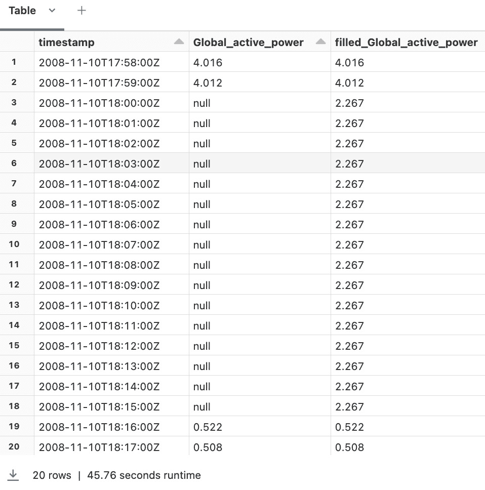

Figure 5.8: Interpolation
Interpolation works well for slow-changing values, when there is a predictable cyclical pattern, or when there is a small gap in data. It is not a good method when the value can change suddenly, is discrete, or when there is a large gap in data.
Of the three methods shown for handling missing values, the appropriate method to use is based on the characteristics of your time series data and the requirements of your analysis.
Data leakage
Note that the backward filling and interpolation methods can leak future data across the boundaries of training, validation, and test data splits. Use these methods within the splits, and not across, or use forward filling if this is going to be an issue.
Duplicates
The presence of duplicate values in time series data can skew analysis and lead to incorrect results. Apache Spark has functions to efficiently remove duplicate values. In the following example, we clean time series data for duplicate values using Apache Spark in Python.
The `dropDuplicates` function removes duplicates by comparing all columns by default and only considers a row to be a duplicate if all the columns match those of one or more other rows. This will not work if we have multiple rows with, say, the same `timestamp` column value but different values in one or more other columns. In this case, we can pass a subset of one or more columns as a parameter to be used to identify the duplicates, as opposed to using all the columns.
In the most common cases, we want to have one and only one row of values for each timestamp and consider the other rows with the same timestamp to be duplicates. Passing the timestamp as the subset parameter to `dropDuplicates` will remove all the other rows having the same timestamp value, as we will see in the following code example:

```

# 示例：基于所有列移除重复行

print(f"有重复行 - 计数: {df.count()}")

cleaned_df = df.dropDuplicates()

print(f"无重复行 - 计数: {cleaned_df.count()}")

# 示例：基于选定的列移除重复行

# 假设"timestamp"是识别重复项的列

cleaned_df = df.dropDuplicates(["timestamp"])

print(f"无重复时间戳 - 计数: {cleaned_df.count()}")

```py

 Depending on your dataset and use case, you can choose the appropriate method based on the columns that uniquely identify duplicates in your time series data.
Outliers
The detection and handling of outliers in time series data is crucial to ensure the accuracy of analysis and modeling. Apache Spark provides various functions to detect and handle outliers efficiently. The following example shows how to clean time series data for outliers using Apache Spark in Python.
The z-score method used is based on how far the data point is from the `mean` relative to the standard deviation, `stddev`. The parametrizable threshold value, `z_score_threshold`, then specifies beyond which z-score value the data point is considered an outlier. A high threshold will allow more data points in, while a low threshold will flag more outliers:

```

从 pyspark.sql 导入 functions 作为 F

# 示例：使用 z-score 检测离群值

# 计算"值"列中每个值的 z-score

mean_value = df.select(F.mean(

"Global_active_power")).collect()[0][0]

stddev_value = df.select(F.stddev(

"Global_active_power")).collect()[0][0]

z_score_threshold = 5  # 根据需要调整阈值

df_with_z_score = df.withColumn("z_score", (F.col(

"Global_active_power") - mean_value) / stddev_value)

# 过滤掉 z-score 超出阈值的行

离群值 = df_with_z_score.filter(~F.col("z_score").between(

-z_score_threshold, z_score_threshold))

cleaned_df = df_with_z_score.filter(F.col("z_score").between(

-z_score_threshold, z_score_threshold))

# 标记为离群值

df_with_outlier = df_with_z_score.withColumn(

"_ 离群值",

F.when(

(F.col("z_score") < -z_score_threshold) |

(F.col("z_score") > z_score_threshold), 1

).otherwise(0))

print(f"包含异常值 - 计数: {df.count()}")

print(f"Global_active_power - 平均值: {mean_value}, 标准差: {stddev_value}, z 分数阈值: {z_score_threshold}")

print(f"去除异常值后 - 计数: {cleaned_df.count()}")

print(f"异常值 - 计数: {outliers.count()}")

print("异常值:")

outliers.display()

```py

 *Figure 5**.9* shows the outcome of the outlier detection based on the z-score chosen.
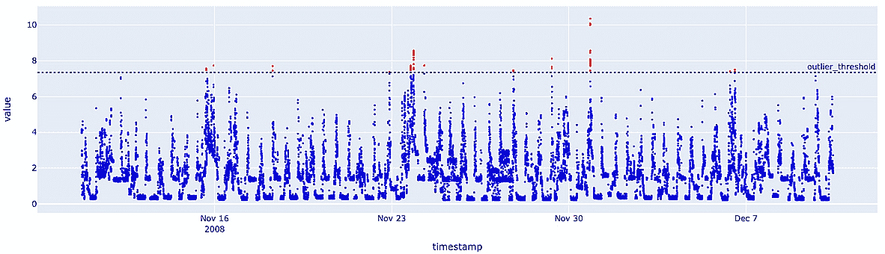

Figure 5.9: Outlier detection
Beyond this example, the choice of z-score threshold and outlier detection techniques is based on the data characteristics and requirements of the use case.
Note
Outliers can be indicative of one or more anomalies in the source system that generated the measurement, or data processing or transmission issues post source system. The identification of outliers flags the requirement to further investigate the source system and the data transmission chain to find the root cause.
After cleaning the data based on the issues identified with the data quality checks, other transformations, which we will look at next, are required to get the data into the right shape for the analytics algorithm to work.
Transformations
In this section, we will look at examples of normalizing and standardizing, and touch briefly on stationary transformation.
Normalizing
Normalizing time series data ensures that features are on a similar scale, which can improve the performance of machine learning algorithms while facilitating analysis. Apache Spark provides various functions for normalization. The following example shows how to normalize time series data using Apache Spark in Python.
The min-max normalization technique is used to scale the data points relative to the min-max range. The `min` and `max` values are calculated first. This brings the value to the range of `0` for the minimum value and `1` for the maximum value:

```

from pyspark.sql import functions as F

# 定义要归一化的列（例如，“value”列）

columns_to_normalize = ["Global_active_power"]

# 计算每列的最小值和最大值进行归一化

min_max_values = df.select(

[F.min(F.col(column)).alias(f"min_{column}")

for column in columns_to_normalize] +

[F.max(F.col(column)).alias(f"max_{column}")

for column in columns_to_normalize]

).collect()[0]

# 使用最小-最大归一化对数据进行归一化

for column in columns_to_normalize:

min_value = min_max_values[f"min_{column}"]

max_value = min_max_values[f"max_{column}"]

df = df.withColumn(

f"normalized_{column}",

(F.col(column) - min_value) / (max_value - min_value))

print(f"归一化后的 - {columns_to_normalize}:")

df.display()

```py

 *Figure 5**.10* shows the outcome of normalizing the example time series data.
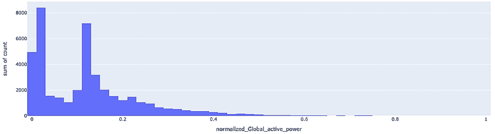

Figure 5.10: Normalizing
Depending on the specific requirements and data characteristics, the normalization method can be adjusted with the use of other techniques such as z-score normalization and decimal scaling, in addition to the min-max technique used in the example.
Standardizing
Standardizing time series data ensures that features are on a similar scale, which can improve the performance of machine learning algorithms while facilitating analysis. This method transforms the data such that it has a mean of `0` and a standard deviation of `1`. Apache Spark provides various functions for standardization. The following example shows how to standardize time series data using Apache Spark in Python.
This example uses `log` values to account for the skewness of the data. First, `mean` and  `stddev` are calculated. These values are then used in the formula to standardize:

```

from pyspark.sql import functions as F

# 定义要标准化的列（例如，“value”列）

columns_to_standardize = ["Global_active_power"]

# 计算每列的均值和标准差以

# 标准化

mean_stddev_values = df.select(

[F.mean(F.log(F.col(column))).alias(f"mean_{column}")

for column in columns_to_standardize] +

[F.stddev(F.log(F.col(column))).alias(f"stddev_{column}")

for column in columns_to_standardize]

).collect()[0]

# 使用 z-score 标准化对数据进行标准化

for column in columns_to_standardize:

mean_value = mean_stddev_values[f"mean_{column}"]

stddev_value = mean_stddev_values[f"stddev_{column}"]

df = df.withColumn(

f"standardized_{column}",

(F.log(F.col(column)) - mean_value) / stddev_value

)

print(f"标准化后的 - {columns_to_standardize}:")

df.display()

```py

 *Figure 5**.11* shows the outcome of standardizing the example time series data.
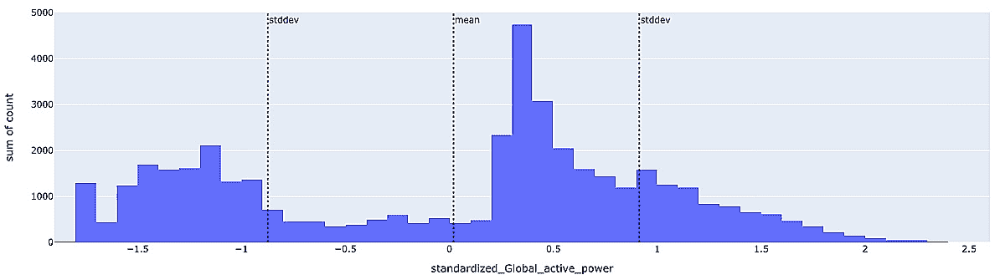

Figure 5.11: Standardizing
The standardization method can be adjusted depending on the specific requirements and data characteristics.
Stationary
In *Chapter 1*, we discussed the requirement of stationary time series for some analysis methods. Making time series data stationery involves removing trends and seasonality, which we will cover in the following chapter.
This concludes the section on testing for data quality and then cleaning and transforming time series data. We will cover the scalability considerations in data preparation when we discuss feature engineering in *Chapter 8*.
Summary
In conclusion, this chapter focused on the critical steps of organizing, cleaning, and transforming time series data for effective analysis. We have covered data preparation techniques using Apache Spark for ingestion, persistence, data quality checks, cleaning, and transformations. We looked at code examples for, among others, handling missing values and duplicates, addressing outliers, and normalizing data. This has set the stage for an accurate and efficient analytical process using Apache Spark. Proper data preparation significantly enhances the reliability of subsequent analytical processes, which is what we will progress toward in the next chapter.
Join our community on Discord
Join our community’s Discord space for discussions with the authors and other readers:
[`packt.link/ds`](https://packt.link/ds)
.jpg)

```

```py

```
