# 第六章：探索性数据分析

在加载和准备数据（在前一章已经介绍过）之后，我们将进行探索性数据分析，以揭示时间序列数据中的模式和见解。我们将使用统计分析技术，包括那些特定于时间模式的技术。这些步骤的结果对于识别趋势和季节性非常关键，并且为后续建模决策提供信息。使用 Apache Spark 进行强大的探索性数据分析确保全面掌握数据集的特征，增强后续时间序列模型和分析的准确性和相关性。

在本章中，我们将涵盖以下主要内容：

+   统计分析

+   重采样、分解和稳定性

+   相关性分析

# 技术要求

本章主要涵盖了时间序列分析项目中常用的数据探索技术，以实际操作为主。本章的代码可以在书籍的 GitHub 仓库的 `ch6` 文件夹中找到，网址为：[`github.com/PacktPublishing/Time-Series-Analysis-with-Spark/tree/main/ch6`](https://github.com/PacktPublishing/Time-Series-Analysis-with-Spark/tree/main/ch6)。

注意

我们将在代码示例中使用 Spark DataFrames，并将其转换为支持 pandas 的库的 DataFrames。这显示了如何可以互换使用两者。在使用 pandas 时将会提及。

# 统计分析

本节从时间序列数据的统计分析开始，涵盖数据概要分析以收集这些统计信息，分布分析和可视化。

本章的示例基于 `ts-spark_ch6_1.dbc` 中的代码，我们可以从 GitHub 上导入到 Databricks Community Edition，如*第一章*所述的方法，在*技术要求*部分提到。 

代码网址如下：[`github.com/PacktPublishing/Time-Series-Analysis-with-Spark/raw/main/ch6/ts-spark_ch6_1.dbc`](https://github.com/PacktPublishing/Time-Series-Analysis-with-Spark/raw/main/ch6/ts-spark_ch6_1.dbc)

我们将从家庭能源消耗数据集开始实际操作示例，这个数据集也在*第二章*和*第五章*中使用过。在用` spark.read`加载数据集后，如下代码片段所示，我们通过`df.cache()`将 DataFrame 缓存到内存中，以加速后续的处理。由于懒加载，缓存操作将在下一个动作时进行，而不是立即进行。为了强制进行缓存，我们添加了一个`df.count()`操作。然后，我们创建了一个`timestamp`列，将`Date`和`Time`列合并在一起。由于数值列已作为字符串加载，因此我们必须将它们转换为数值型的`double`数据类型才能进行计算。请注意，为了提高可读性，我们将对`df` DataFrame 的操作分成了多行代码，当然，也可以将这些操作链式调用写在一行代码中：

```py
…
# Code in cell 5
df = spark.read.csv(
    "file:///" + SparkFiles.get(DATASET_FILE),
    header=True, sep=";", inferSchema=True)
df.cache()
df.count()
…
# Code in cell 7
df = df.withColumn('Time', F.date_format('Time', 'HH:mm:ss'))
# Create timestamp column
df = df.withColumn('timestamp', F.concat(df.Date, F.lit(" "), df.Time))
df = df.withColumn(
    'timestamp',
    F.to_timestamp(df.timestamp, 'yyyy-MM-dd HH:mm:ss'))
# Fix data types
df = df \
    .withColumn('Global_active_power',
    df.Global_active_power.cast('double')) \
…
print("Schema:")
df.spark.read option inferSchema. The data types before conversion, displayed with printSchema(), are shown in *Figure 6**.1*.
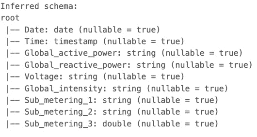

Figure 6.1: Inferred schema with data types
The updated schema is as per *Figure 6**.2*, showing the converted data types.
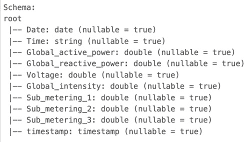

Figure 6.2: Updated schema with converted data types
We are now ready to profile the data.
Data profiling
Data profiling involves analyzing the dataset’s structure, quality, and statistical properties. This helps to identify anomalies, missing values, and outliers, ensuring data integrity. This process can also be comprehensive, including the analysis of trends, seasonal patterns, and correlations, guiding more accurate forecasting and modeling.
Note
Data profiling can also guide preprocessing steps such as normalization and transformation, covered in *Chapter 5*.
Apache Spark provides the convenient `summary()` function, as per the following code, for summary statistics:

```

#### 汇总统计

# 第 10 号单元格的代码

df.summary().display()

```py

 This generates the following outcome:
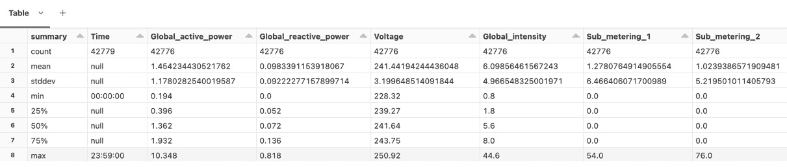

Figure 6.3: Summary statistics
While these summary statistics are useful, they are usually not sufficient. A data profiling tool such as YData Profiling, which we will look at next, provides more extensive analysis and reporting.
The following code extract shows how to launch a Profile Report with YData. Notable here is the use of a Pandas DataFrame, `pdf`, and of the time series mode (`tsmode` parameter), with the `sortby` parameter to sort by timestamp. We also want correlations to be included in the report. After the report is generated, it is converted to HTML for display with the `to_html()` function.

```

# 第 12 号单元格的代码

…

profile = ProfileReport(

pdf,

title='时间序列数据分析',

tsmode=True,

sortby='timestamp',

infer_dtypes=False,

interactions=None,

missing_diagrams=None,

correlations={

"auto": {"calculate": False},

"pearson": {"calculate": True},

"spearman": {"calculate": True}})

# 将分析报告保存为 HTML 文件

profile.to_file("time_series_data_profiling_report.html")

# 在笔记本中展示分析报告

report_html = profile.to_html()

displayHTML(report_html)

```py

 The generated report contains an **Overview** section, as per *Figure 6**.4*, with an indication, among other things, of the number of variables (columns), observations (rows), and missing values and duplicate counts.
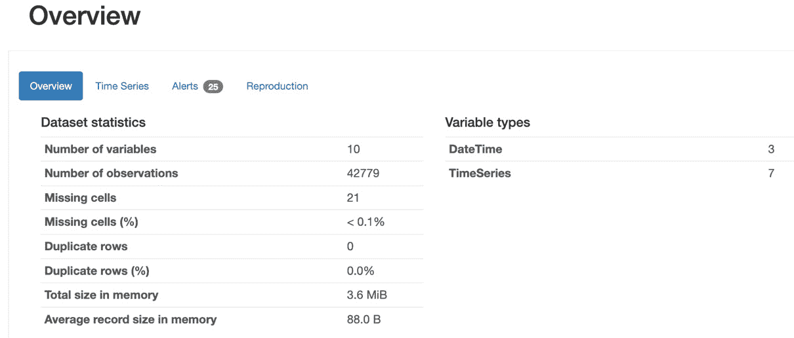

Figure 6.4: Data profile report – Overview
Scrolling down from **Overview**, we can see column-specific statistics, as shown in *Figure 6**.5*, such as the minimum, maximum, mean, number of zeros, and number of distinct values.
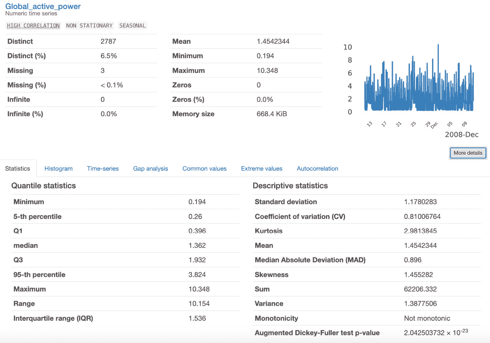

Figure 6.5: Data profile report – Details
This section has further sub-sections, such as **Histogram**, showing the distribution of values, and **Gap analysis**, as per *Figure 6**.6*, with indications of data gaps for the column.
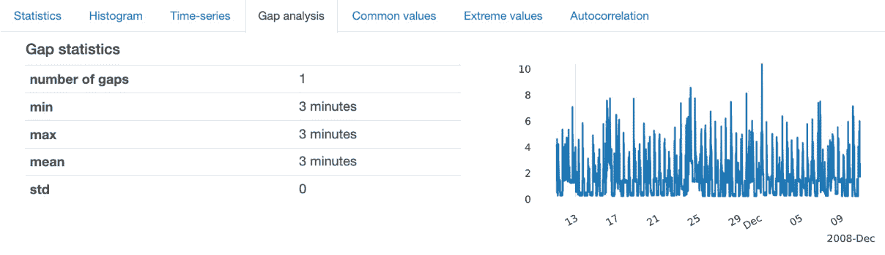

Figure 6.6: Data profile report – Gap analysis
With the time series mode specified earlier, we also get a basic **Time Series** part of the report, shown in *Figure 6**.7*
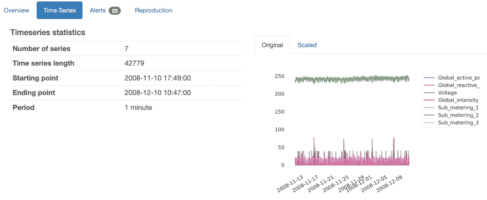

Figure 6.7: Data profile report – Time Series
Other sections of the report cover **Alerts**, shown in *Figure 6**.8*, with outcomes of tests run on the dataset, including time-series-specific ones, and a **Reproduction** section with details on the profiling run.
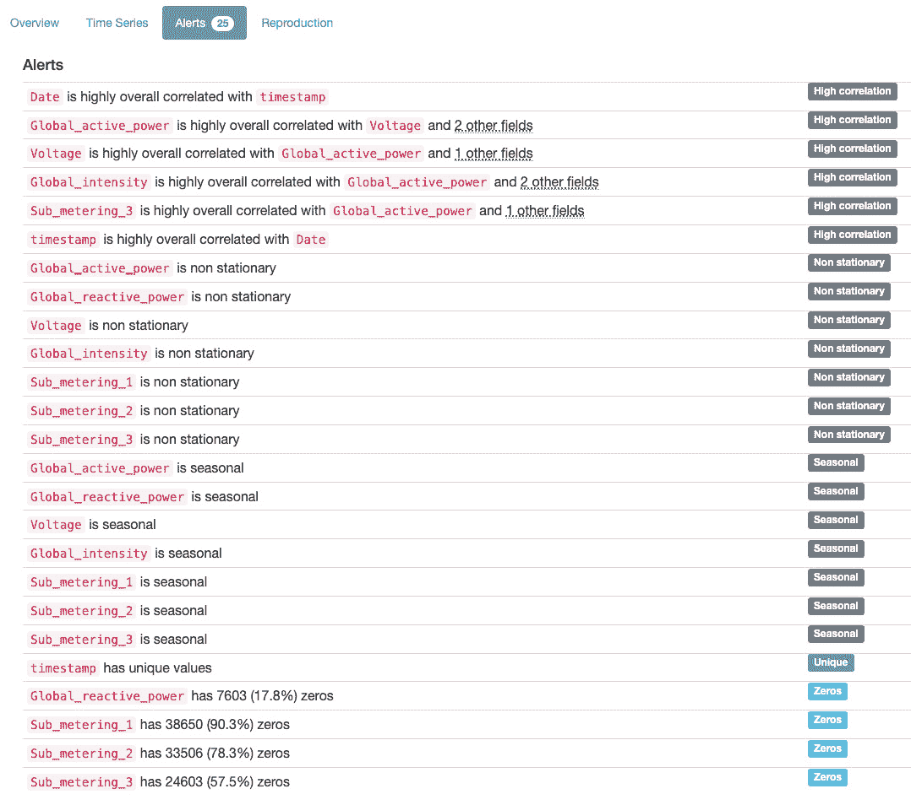

Figure 6.8: Data profile report – Time Series
This section provided an example of how to perform data profiling on time series data using YData Profiling and Apache Spark. Further information on YData Profiling can be found here: [`github.com/ydataai/ydata-profiling`](https://github.com/ydataai/ydata-profiling).
We will now drill down further in our understanding of the data, by analyzing the gaps in the dataset.
Gap analysis
In the previous section, we mentioned gap analysis for gaps in value for a specific column. Another consideration for time series data is gaps in the timeline itself, as in the following example with the household energy consumption dataset, where we are expecting values every minute.
In this case, we first calculate the time difference between consecutive timestamps using `diff()`, as in the following code, with a pandas DataFrame, `pdf`. If this is greater than `1 minute`, we can flag the timestamp as having a prior gap:

```

# 测试间隙

# 第 15 号单元格的代码

# 测试间隙

pdf['gap_val'] = pdf['timestamp'].sort_values().diff()

pdf['gap'] = pdf['gap_val'] > ps.to_timedelta('1 minute')

pdf[pdf.gap]

```py

 As *Figure 6**.9* shows, we found 3 gaps of 2 minutes each in this example.
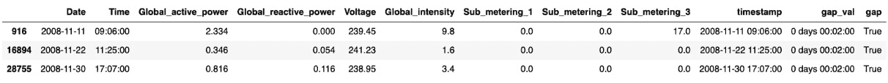

Figure 6.9: Gap analysis
Depending on the size of the gap and the nature of the dataset, we can adopt one of the following approaches:

*   Ignore the gap
*   Aggregate, for example, use the mean value at a higher interval
*   Use one of the missing-value handling techniques we saw in *Chapter 5*, such as forward filling

Regular or irregular time series
The gap analysis presented here assumes a regular time series. The approach is slightly different in detecting gaps in the timeline of irregular time series. The previous example of checking for the absence of values at every minute interval is not applicable for an irregular time series. We will have to look at the distribution of the count of values over the timeline of the irregular time series and make reasonable assumptions about how regularly we expect values in the irregular time series. For instance, if we are considering the energy consumption of a household, the time series may be irregular at minute intervals, but based on historical data, we expect energy use every hour or daily. In this case, not having a data point on a given hour or day can be indicative of a gap. Once we have identified a gap, we can use the same approaches as discussed for regular time series, that is, forward filling or similar imputation, aggregation at higher intervals, or just ignoring the gap.
We discussed here the specific problem of gaps in the time series. We mentioned that, to identify gaps, we can look at the distribution of the data, which will be covered next.
Distribution analysis
Distribution analysis of time series provides an understanding of the underlying patterns and characteristics of the data, such as skewness, kurtosis, and outliers. This helps detect deviations from normal distribution, trends, and seasonal patterns, and visualize the variability of the time series. This understanding then feeds into choosing the appropriate statistical models and forecasting methods. This is required as models are built on assumptions of the distribution of the time series. Done correctly, distribution analysis ensures that model assumptions are met. This also improves the accuracy and reliability of the predictions.
In this section, we will examine a few examples of distribution analysis, starting with the profiling output of *Figure 6**.5*, which shows a kurtosis of 2.98 and a skewness of 1.46\. Let’s explain what this means by first defining these terms.
**Kurtosis** indicates how peaked or flat a distribution is compared to a normal distribution. A value greater than 2, as in our example in *Figure 6**.5*, indicates the distribution is too peaked. Less than -2 means too flat.
**Skewness** indicates how centered and symmetric the distribution is compared to a normal distribution. A value between -1 and 1 is considered near normal, between -2 and 2, as in the example in *Figure 6**.5*, is acceptable, and below -2 or above 2 is not normal.
When both kurtosis and skewness are zero, we have a perfectly normal distribution, which is quite unlikely to be seen with real data.
Let’s now do some further distribution analysis with the following code extract. We want to understand the frequency distribution of `Global_active_power`, the distribution by day of the week, `dayOfWeek`, and the hour of the day. We will use the Seaborn (`sns`) visualization library for the plots, with the pandas DataFrame, `pdf`, passed as a parameter:

```

#### 分布分析

# 第 17 号单元格的代码

…

# 提取日期和小时

df = df.withColumn("dayOfWeek", F.dayofweek(F.col("timestamp")))

df = df.withColumn("hour", F.hour(F.col("timestamp")))

…

# 使用 Seaborn 和 Matplotlib 进行分布分析

…

sns.histplot(pdf['Global_active_power'], kde=True, bins=30)

plt.title(

'时间序列数据中 Global_active_power 的分布'

)

…

# 用箱线图可视化按星期几分布

…

sns.boxplot(x='dayOfWeek', y='Global_active_power', data=pdf)

plt.title(

'时间序列数据中 Global_active_power 的日分布'

)

…

# 用箱线图可视化按小时分布

…

sns.boxplot(x='hour', y='Global_active_power', data=pdf)

plt.title(

'时间序列数据中 Global_active_power 的小时分布'

)

…

```py

 We can see the frequency of occurrence of the different values of `Global_active_power` in *Figure 6**.10*, with the skewness to the left.
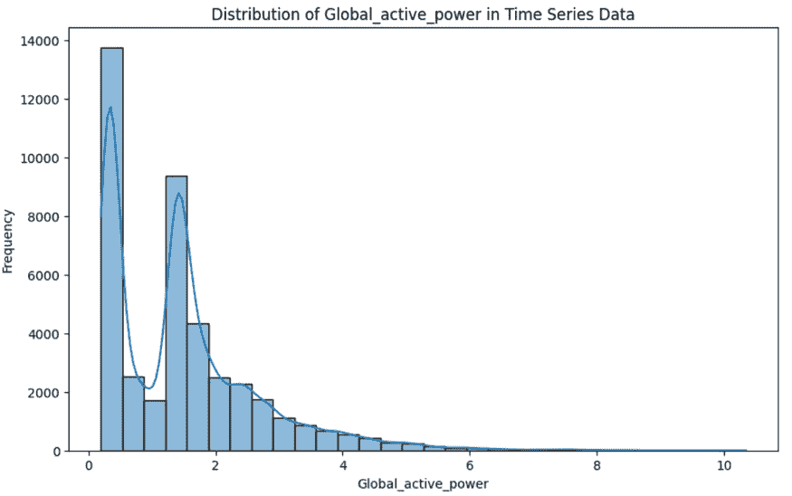

Figure 6.10: Distribution by frequency
If we look at the distribution by day of the week, as in *Figure 6**.11*, power consumption during the weekends is higher, as can be expected for a household, with 1 on the *x* axis representing Sundays and 7 Saturdays. The distribution is also over a broader range of values these days.
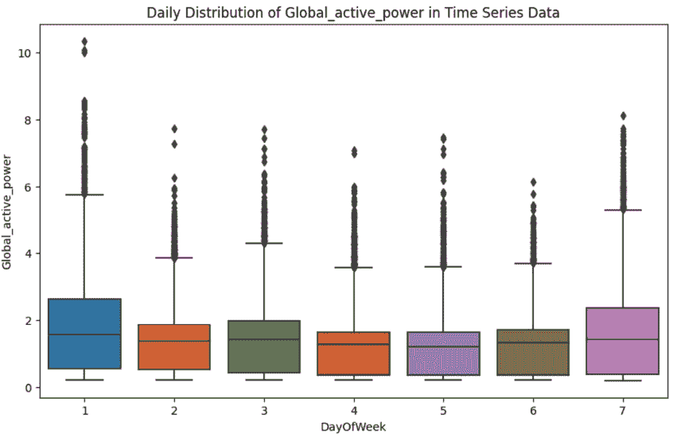

Figure 6.11: Distribution by day of the week
The distribution by hour of the day, as in *Figure 6**.12*, shows higher power consumption during the morning and evening, again as can be expected for a household.
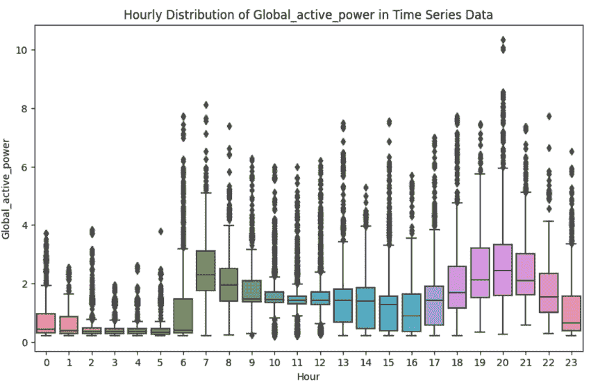

Figure 6.12: Distribution by hour of the day
You will also notice in the distribution plots the values that are flagged as outliers, lying beyond the whiskers. These are at a 1.5 **inter-quartile range** (**IQR**) above the third quartile. You can use other thresholds for outliers, as in *Chapter 5*, where we used a cutoff on the z-score value.
Visualizations
As we have seen so far in this book and, more specifically, this chapter, visualizations play an important role in time series analysis. By providing us with an intuitive and immediate understanding of the data’s underlying patterns, they help to identify seasonal variations, trends, and anomalies that might not otherwise be seen from raw data alone. Furthermore, visualizations facilitate the detection of correlations, cycles, and structural changes over time, contributing to better forecasting and decision-making.
Fundamentally, (and this is not only true for time series analysis) visualizations aid in communicating complex insights to stakeholders and, in doing so, improve their ability to understand and act accordingly.
Building on the techniques for statistical analysis seen in this chapter, we will now move on to other important techniques to consider while analyzing  time series—resampling, decomposition, and stationarity.
Resampling, decomposition, and stationarity
This section details additional techniques used in time series analysis, introduced in *Chapter 1*. We will see code examples of how to implement these techniques.
Resampling and aggregation
Resampling and aggregation are used in time series analysis to transform and analyze data at different time scales. **Resampling** is changing the frequency of the time series, such as converting hourly data to daily data, which can reveal trends and patterns at different time frequencies. **Aggregation**, on the other hand, is the summarizing of data over specified intervals and is used in conjunction with resampling to calculate the resampled value. This can reduce noise, handle missing values, and convert an irregular time series to a regular series.
The following code extract shows the resampling at different intervals, together with the aggregation. The original dataset has data every minute. With `resample('h').mean()` applied to the pandas DataFrame, `pdf`, we resample this value to the mean over the hour:

```

#### 重采样与聚合

# 第 22 号单元格的代码

…

# 将数据重采样为小时、天和周的频率，并按#均值聚合

hourly_resampled = pdf.resample('h').mean()

hourly_resampled_s = pdf.resample('h').std()

daily_resampled = pdf.resample('d').mean()

daily_resampled_s = pdf.resample('d').std()

weekly_resampled = pdf.resample('w').mean()

weekly_resampled_s = pdf.resample('w').std()

…

```py

 *Figure 6**.13* shows the outcome of the hourly resampling.
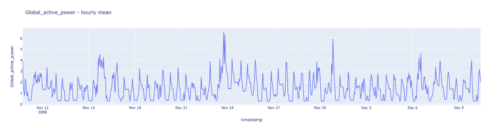

Figure 6.13: Resampled hourly
*Figure 6**.14* shows the outcome of the daily resampling.
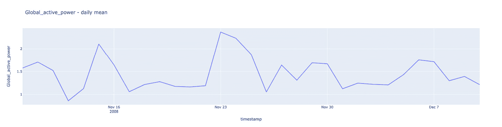

Figure 6.14: Resampled daily
*Figure 6**.15* shows the outcome of the weekly resampling.
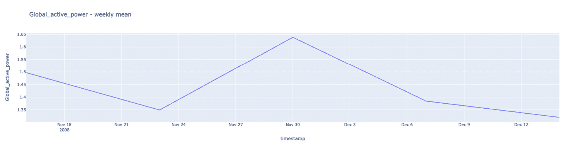

Figure 6.15: Resampled weekly
With these examples, we have resampled and aggregated time series data using Apache Spark. We will next expand on the time series decomposition of the resampled time series.
Decomposition
As introduced in *Chapter 1*, decomposition breaks down the time series into its fundamental components: trend, seasonality, and residuals. This separation helps uncover underlying patterns within the data more clearly. The trend shows long-term movement, while seasonal components show repeating patterns. Residuals highlight any deviation from the trend and seasonal components. This decomposition allows for each component to be analyzed and addressed individually.
The following code extract shows the decomposition of time series using `seasonal_decompose` from the `statsmodels` library. In *Chapter 1*, we used a different library, `Prophet`.

```

# 第 30 号单元格的代码

…

from statsmodels.tsa.seasonal import seasonal_decompose

# 执行季节性分解

hourly_result = seasonal_decompose(

hourly_resampled['Global_active_power'])

daily_result = seasonal_decompose(

daily_resampled['Global_active_power'])

…

```py

 *Figure 6**.16* shows the components of the hourly resampled time series. The seasonal component shows a pattern, with each repeating pattern corresponding to a day, and the ups in power consumption every morning and evening are visible.
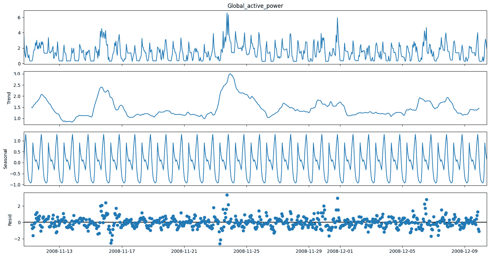

Figure 6.16: Decomposition of hourly data
*Figure 6**.17* shows the components of the daily resampled time series. The seasonal component shows a pattern, with each repeating pattern corresponding to a week, and the ups in power consumption every weekend are visible.
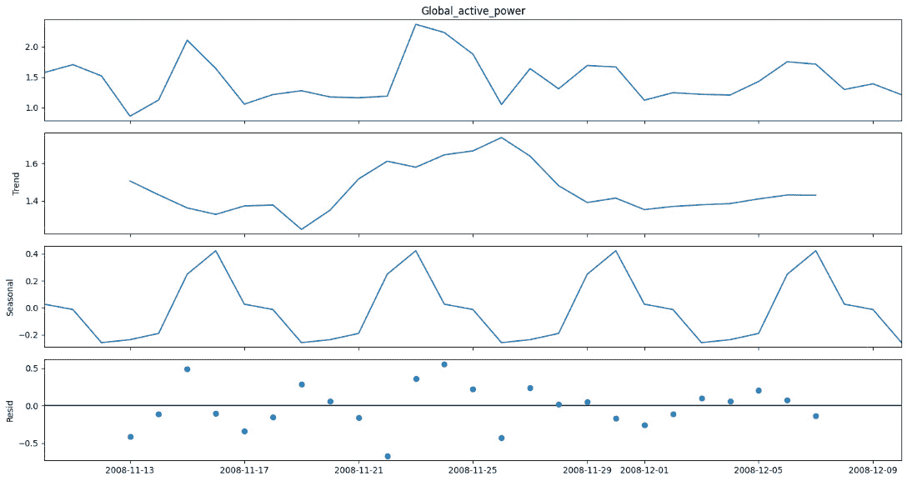

Figure 6.17: Decomposition of daily data
Now that we have performed time series decomposition using Apache Spark and `statsmodels` for time series at different resampling intervals, let's discuss the next technique. 
Stationarity
Another key concept related to time series data, introduced in *Chapter 1*, stationarity concerns the statistical properties of the series, such as mean, variance, and autocorrelation remaining constant over time. This is an assumption on which time series models, such as **AutoRegressive Integrated Moving Average** (**ARIMA**) are built. A series must be identified and converted to stationary before using such models. In general, stationary time series facilitate analysis and improve model accuracy.
The first step in handling non-stationarity is to check the time series, which we will look at next.
Check
The **Augmented Dickey-Fuller** (**ADF**) test and the **Kwiatkowski-Phillips-Schmidt-Shin** (**KPSS**) test are commonly used statistical tests to check for stationarity. Without going into the details of these tests, we can say they calculate a value, which is called the p-value. A value of p < 0.05 for ADF means that the series is stationary. Additionally, we can check for stationarity by visual inspection of the time series plot and **autocorrelation function** (**ACF**) plots, and by comparing summary statistics over different time periods. Mean, variance, and autocorrelation remaining constant across time suggest stationarity. Significant changes indicate non-stationarity.
The following example code checks for stationarity using the ADF test, `adfuller`, from the `statsmodels` library. We will use the hourly resampled data in this example.

```

#### 平稳性

# 代码位于第 33 行

…

from statsmodels.tsa.stattools import adfuller

# 执行扩展的 Dickey-Fuller 检验

result = adfuller(hourly_resampled)

# if Test statistic < Critical Value and p-value < 0.05

#   拒绝原假设，时间序列没有单位根

#   序列是平稳的

…

```py

 In this case, the p-value, as shown in *Figure 6**.18*, is less than 0.05, and we can conclude the time series is stationary from the ADF test.
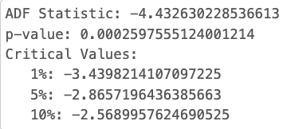

Figure 6.18: ADF test results – Power consumption dataset
Running the ADF test on the dataset for the annual mean temperature of Mauritius, used in *Chapter 1*, gives a p-value greater than 0.05, as shown in *Figure 6**.19*. In this case, we can conclude that the time series is non-stationary.
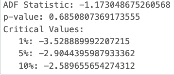

Figure 6.19: ADF test results – Annual mean temperature dataset
As we now have a non-stationary series, we will next consider converting it to a stationary series using differencing.
Differencing
The following code extract shows the conversion of a non-stationary time series to a stationary one. We’ll use differencing, a common method to remove trends and seasonality, which can make the time series stationary. By using a combination of the `Window` function and `lag` of 1, we can find the difference between an annual mean and the previous year’s value.

```

###### 差分

# 代码位于第 41 行

…

from pyspark.sql.window import Window

# 计算差分（差分处理）

window = Window.orderBy("year")

df2_ = df2.withColumn(

"annual_mean_diff",

F.col("annual_mean") - F.lag(

F.col("annual_mean"), 1

).over(window))

…

```py

 We can see the original time series compared to the differenced time series in *Figure 6**.20*. The removal of the trend is visible.
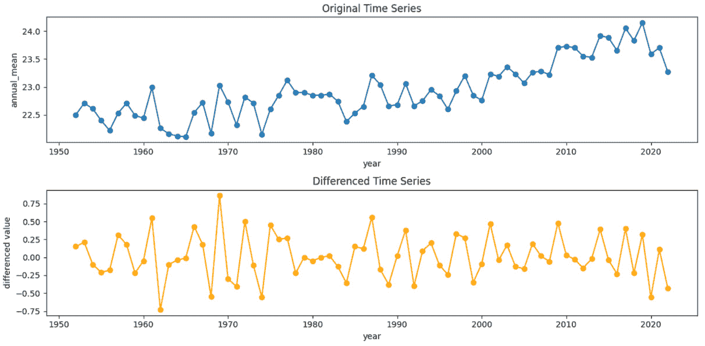

Figure 6.20: Differencing – Annual mean temperature dataset
Running the ADF test after differencing, gives a p-value less than 0.05, as shown in *Figure 6**.21*. We can conclude that the difference in time series is stationary.
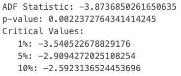

Figure 6.21: ADF test results – Differenced annual mean temperature dataset
Building on our understanding of techniques for exploratory analysis learned in this section, we will now move on to the last section of this chapter, which is about correlation of  time series data.
Correlation analysis
Correlation measures the relationship between two variables. This relationship can be causal, whether one is the result of the other. This section will explore the different types of correlation applicable to time series.
Autocorrelation
The **AutoCorrelation Function** (**ACF**) measures the relationship between a time series and its past values. High autocorrelation indicates that past values have a strong influence on future values. This information can then be used to build predictive models, for instance, in selecting the right parameters for models such as ARIMA, thereby enhancing the robustness of the analysis. Understanding autocorrelation also helps in identifying seasonal effects and cycles.
The **Partial AutoCorrelation Function** (**PACF**) similarly measures the relationship between a variable and its past values, but contrary to the ACF, with the PACF we discount the effect of values of the time series at all shorter lags.
Check
The following code shows how you can check for autocorrelation and partial autocorrelation using Apache Spark and `plot_acf` and `plt_pacf` from the `statsmodels` library.

```

#### 自相关

# 代码位于第 45 行

from statsmodels.graphics.tsaplots import plot_acf, plot_pacf

# 绘制自相关函数 (ACF)

plt.figure(figsize=(12, 6))

plot_acf(hourly_resampled['Global_active_power'], lags=3*24)

plt.title('自相关函数 (ACF)')

plt.show()

# 绘制偏自相关函数 (PACF)

plt.figure(figsize=(12, 6))

plot_pacf(hourly_resampled['Global_active_power'], lags=3*24)

plt.title('偏自相关函数 (PACF)')

plt.show()

…

```py

 The resulting ACF and PACF plots are shown in *Figure 6**.22*.
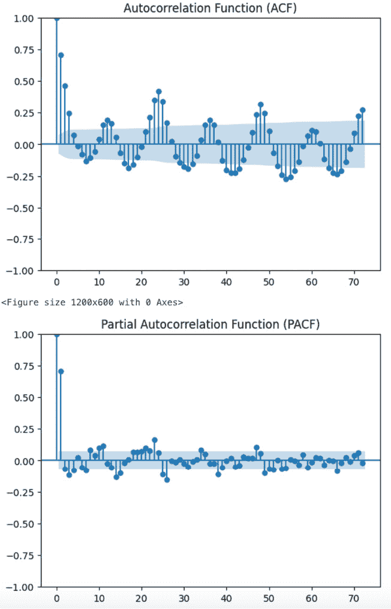

Figure 6.22: ACF and PACF plots
The outcomes of ACF and PACF indicate the nature of the time series and guide the selection of the appropriate models and parameters for forecasting. Let’s now make sense of these plots and how we can use their outcome.
Interpretation of ACF
We will consider the peaks and the decay from the ACF plot to interpret the outcome, using the upper graph in *Figure 6**.22* as an example.
Peaks in the autocorrelation plot outside the confidence interval indicate notable autocorrelations. Regular intervals point to seasonality. From the example, we can see autocorrelation at lags 1, 2, and 3 and seasonality at lags 12 and 24, which correspond to a 12- and 24-hour interval.
A slow decay in the autocorrelation plot suggests that the series is non-stationary with a trend. In this case, we can convert the series to stationary by differencing it, as discussed in the previous section on *Differencing*. This, however, is not the case in our example in *Figure 6**.22*, as there is no slow decay.
The outcome of the ACF can be used to define the `q` of an ARIMA model. Major peaks at lags 1, 2 and 3 in our example, means q=1, q=2, and q=3.
Interpretation of PACF
We will consider the peaks and the cut-off from the PACF plot to interpret the outcome, using the lower graph in *Figure 6**.22* as an example.
Peaks in the partial autocorrelation plot outside the confidence interval indicate notable partial autocorrelations. In the example, this is seen at lags 1, 12, and 24.
An immediate cut-off after some lags indicates an **autoregressive** (**AR**) component. In the example, this is after lag 1.
The outcome of the PACF can be used to define the AR parameter `p` of an ARIMA model. Major peaks at lag 1 in our example, means p=1.
Model parameters
Based on the interpretation of the ACF and PACF plots in *Figure 6**.22*, we can consider the following candidate ARIMA(p, d, q) models, where p is the PACF cut-off point, d is the order of differencing, and q is the ACF autocorrelation lag:

*   ARIMA(1, 0, 1)
*   ARIMA(1, 0, 2)
*   ARIMA(1, 0, 3)

We will discuss model selection and parameters in detail in the next chapter. The depth of our discussion here is just enough to conclude the discussion on ACF and PACF. Let’s move on to other lag analysis methods.
Lag analysis
In addition to ACF and PACF plots seen previously, we will explore another lag analysis method in this section.
We’ll start by calculating the different lag values of interest, as per the following code extract, using the `Window` and `lag` functions we have seen previously.

```

#### 滞后分析

# 代码位于第 49 行

…

window = Window.orderBy("timestamp")

# 创建滞后特征

hourly_df = hourly_df.withColumn(

"lag1", F.lag(F.col("Global_active_power"), 1).over(window))

hourly_df = hourly_df.withColumn(

"lag2", F.lag(F.col("Global_active_power"), 2).over(window))

hourly_df = hourly_df.withColumn(

"lag12", F.lag(F.col("Global_active_power"), 12).over(window))

hourly_df = hourly_df.withColumn(

"lag24", F.lag(F.col("Global_active_power"), 24).over(window))

…

```py

 This creates the lag columns, as shown in *Figure 6**.23*.
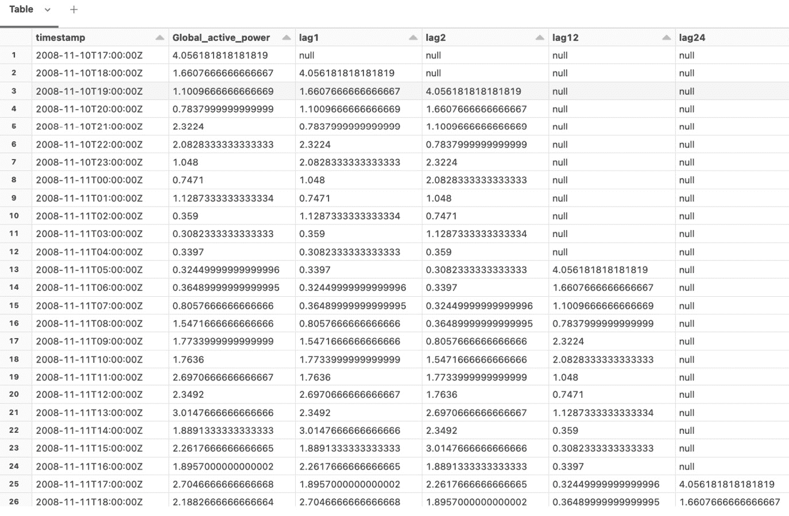

Figure 6.23: Lag values
We then calculate the correlation of the current values with their lag values, as in the following code, using the `stat.corr()` function.

```

# 代码位于第 50 行

…

# 计算滞后 1 的自相关

df_lag1 = hourly_df.dropna(subset=["lag1"])

autocorr_lag1 = df_lag1.stat.corr("Global_active_power", "lag1")

…

# 计算滞后 24 的自相关

df_lag24 = hourly_df.dropna(subset=["lag24"])

autocorr_lag24 = df_lag24.stat.corr("Global_active_power", "lag24")

…

```py

 *Figure 6**.24* shows the autocorrelation values, significant at lag 1, 2, and 24, as we saw on the ACF plot previously.
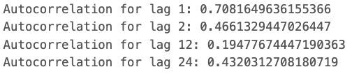

Figure 6.24: Autocorrelation at different lag values
Finally, by plotting the current and lag values together, we can see in *Figure 6**.25* how they compare to each other. We can visually confirm here the greater correlation at lag 1, 2, and 24.
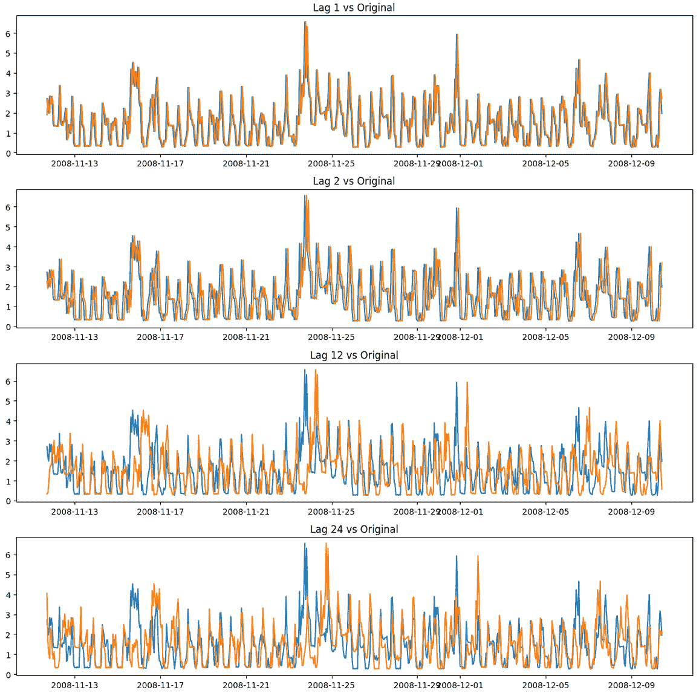

Figure 6.25: Comparison of current and lag values
This concludes the section on autocorrelation, where we looked at ACF and PACF, and how to calculate lagged features and their correlation using Apache Spark. While the lag analysis methods in this section have been used for autocorrelation, they can also be used for cross-correlation, which we will cover next, as another type of correlation, this time between different time series.
Cross-correlation
Cross-correlation measures the relationship between two different time series. One series may influence or predict the other over different time lags, in what is called a **lead-lag relationship**. Cross-correlation is used for multivariate time series modeling and causality analysis.
Going back to the profiling report we saw earlier, we can see a graph of the correlation of the different columns of the example dataset included in the report, as in *Figure 6**.26*.
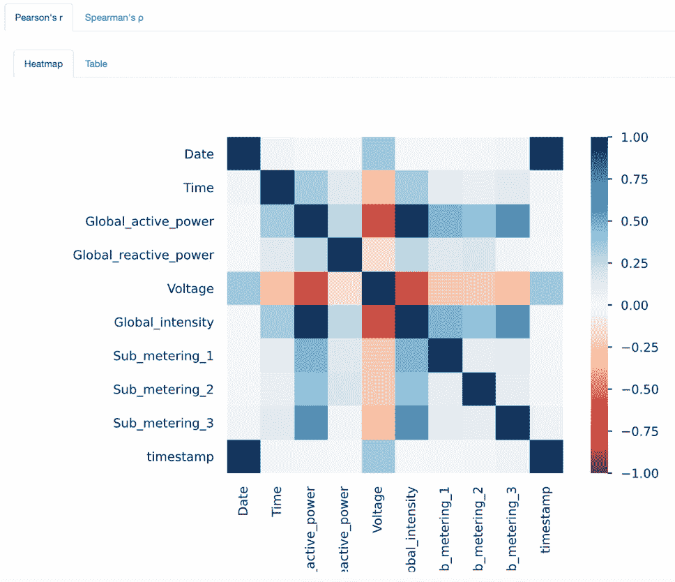

Figure 6.26: Cross-correlation heatmap
We can calculate the cross-correlation directly with the following code.

```

#### 互相关

# 代码位于第 53 行

…

# 计算 value1 和 value2 之间的互相关

cross_corr = hourly_df.stat.corr("Global_active_power", "Voltage")

…

```py

 The cross-correlation calculation yields the value in *Figure 6**.26*. As this correlation is at the same lag, it does not have predictive value, in the sense that we are not using the past to predict the future. However, this pair of attributes is still worth further analysis at different lags, due to the significant cross-correlation.


Figure 6.27: Cross-correlation value
Note
We know that P=IV, where P is electrical power, I is current, and V is voltage, indicates how power and voltage are related. Hence, these two time series are not independent of each other. Even if there is no further insight into the P and V relationship, we will continue this analysis as an example of cross-correlation analysis.
As cross-correlation at the same lag does not help much for prediction, we will now look at using different lag values with the following code. This uses the cross-correlation `ccf()` function, which calculates the cross-correlation at different lag values.

```

# 代码位于第 54 行

…

from statsmodels.tsa.stattools import ccf

hourly_ = hourly_resampled.iloc[:36]

# 计算互相关函数

ccf_values = ccf(hourly_['Global_active_power'], hourly_['Voltage'])

# 绘制互相关函数

plt.figure(figsize=(12, 6))

plt.stem(range(len(ccf_values)),

ccf_values, use_line_collection=True, markerfmt="-")

plt.title('互相关函数 (CCF)')

…

```py

 This generates the plot in *Figure 6**.27*, which shows the correlation of the two attributes at different lags.
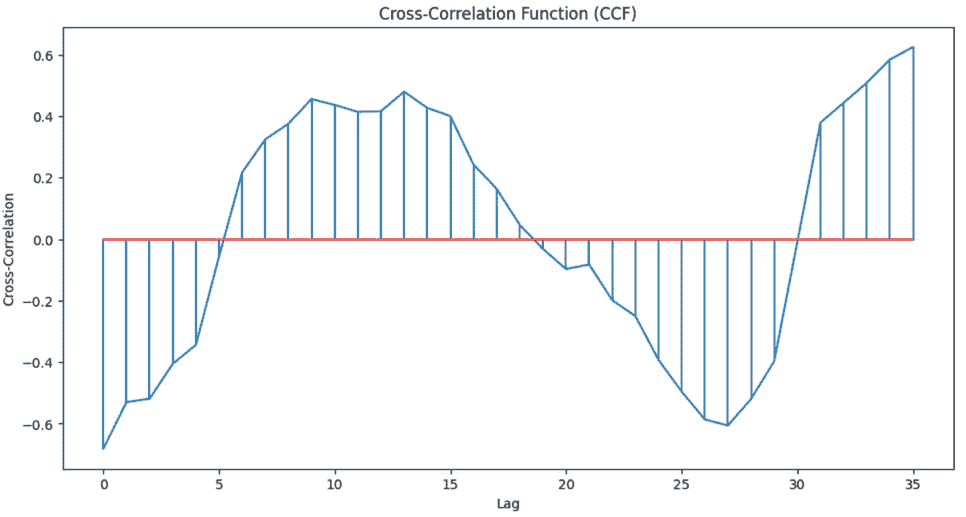

Figure 6.28: Cross-correlation function
To conclude, this section showed how to perform cross-correlation analysis by creating lagged features, and calculating and visualizing cross-correlation.
Summary
In this chapter, we used exploratory data analysis to uncover patterns and insights in time series data. Starting with statistical analysis techniques, where we profiled the data and analyzed its distribution, we then resampled and decomposed the series into its components. To understand the nature of the time series, we also checked for stationarity, autocorrelation, and cross-correlation. By this point, we have gathered enough information on time series to guide us into the next step of building predictive models for time series.
In the next chapter, we will dive into the core topic of this book, which is developing and testing models for time series analysis.
Join our community on Discord
Join our community’s Discord space for discussions with the authors and other readers:
[`packt.link/ds`](https://packt.link/ds)
.jpg)

```
