# 第七章：构建与测试模型

在覆盖了时间序列分析的数据准备和探索性数据分析阶段后，我们现在将重点转向为时间序列数据构建预测模型。我们将涵盖多种类型的模型以及如何决定选择哪个模型。我们还将学习如何训练、调整和评估模型。

本章所涉及的概念将作为模型开发的实用指南，为有效的时间序列模型提供基本构建块，并促进准确的预测和深入的分析。我们将考虑在实际项目中常见的执行约束，并最终对不同模型解决预测问题的结果进行比较。

我们将涵盖以下主要主题：

+   模型选择

+   开发与测试

+   模型比较

# 技术要求

本章的代码将在*开发与测试*部分中讲解，可以在本书的 GitHub 仓库的`ch7`文件夹中找到，网址如下：

[`github.com/PacktPublishing/Time-Series-Analysis-with-Spark/tree/main/ch7`](https://github.com/PacktPublishing/Time-Series-Analysis-with-Spark/tree/main/ch7)。

# 模型选择

在开发时间序列分析模型之前的第一步是选择使用哪个模型。正如在*第一章*中讨论的那样，时间序列分析的一个关键挑战是选择合适的模型。这个选择会影响分析的准确性、可靠性、效率和可扩展性等多个方面。反过来，这确保了分析能够得出更有根据的决策和更有效的结果，同时具有科学的严谨性和实际的实用性。

不同类型的模型各有其特点。

## 模型类型

时间序列分析模型可以分为统计模型、经典机器学习（ML）模型和深度学习（DL）模型：

+   **统计模型**用于时间序列分析，它们基于统计理论并假设时间序列的特征，如线性和平稳性。经典模型的例子包括**自回归滑动平均模型**（**ARIMA**）、**季节性自回归积分滑动平均外生模型**（**SARIMAX**）、**指数平滑法**（**ETS**）、**广义自回归条件异方差模型**（**GARCH**）和状态空间模型。

+   **经典机器学习模型**用于时间序列分析，采用无需显式编程的算法从数据中学习。这些模型能够处理非线性关系。然而，它们通常需要比经典模型更多的数据来进行训练。机器学习模型的例子包括线性回归、**支持向量机**（**SVMs**）、**k 近邻**（**kNN**）、随机森林和梯度提升机。

+   **深度学习模型**使用具有多个层次的神经网络来学习时间序列数据中的复杂模式。这些模型能够处理非线性关系和长期依赖性。然而，它们需要大量的训练数据和显著的计算资源。深度学习模型的例子包括**长短期记忆网络（LSTM）**、**卷积神经网络（CNN）**、**时间卷积网络（TCN）**、变换器（transformers）和自编码器（autoencoders）。

机器学习与深度学习

深度学习是机器学习的一个子集，它使用深度神经网络。按照常规做法，我们在这里使用“经典机器学习”这一术语，指的是那些不是基于神经网络的方法和模型。深度学习一词则用于描述使用神经网络的方法和模型。

之前提到的每个类别和模型都有独特的特点和方法，这决定了它们的适用性，我们接下来将进一步探讨这些内容。

## 选择标准

选择使用哪种模型是基于几个标准的。在*第一章*中关于选择正确模型的部分以及在*第四章*中初步讨论模型选择时，我们简要提到了这一点。模型在解决时间序列分析问题中的适用性取决于分析目标、数据特征、计算能力和可用时间等因素。

我们现在将深入探讨模型选择中的这些及其他重要因素。

### 使用场景类型

时间序列分析大体上可分为预测、分类和异常检测等使用场景，如在*第二章*中讨论的那样。我们将在这里简要回顾这些使用场景，并突出常用的模型。接下来的章节将深入讨论这些内容。

+   **预测**的目标是基于模型从过去的值中学习到的模式来预测未来的值。如在*第二章*中所述，预测可以是单步或多步，基于单一（**单变量**）或多个（**多变量**）时间序列。常用的模型如 ARIMA、SARIMA 和**指数平滑法**（**ETS**）因其简单性而被选择，并在预测任务中表现出强劲的性能。LSTM 和在本书前面章节中介绍的 Prophet，适用于更复杂的预测需求，并在这些场景下能更有效地工作。

+   **模式识别**和**分类**用于识别和理解模式，并相应地对时间序列进行分类。常用的模型基于分解方法，例如**使用 LOESS 的季节-趋势分解**（**STL**）和**多重 STL**（**MSTL**），以及傅里叶分析。我们在*第一章*和*第六章*中花了一些时间讨论分解方法。我们在*第二章*中简要讨论了傅里叶分析，此外还讨论了基于距离的方法、形状分析、集成方法和深度学习。

+   **异常检测**旨在识别时间序列中的异常值或异常。正如在*第二章*中所展示的，这种检测可以基于单变量或多变量序列，以及点、集体或上下文分析。最初标记为异常的点可能最终被认为是新颖的，即一种非问题的全新模式。常用的模型基于残差分析的能力，例如 ARIMA。机器学习模型也经常被使用，例如孤立森林，或者在异常值比例较高时，使用专门的方法，如**季节性混合极端学生化偏差**（**SH-ESD**）。我们在*第二章*中看到过使用孤立森林进行异常检测的代码示例，并讨论了监督、无监督、半监督和混合方法。

另一个模型选择标准是我们接下来将讨论的时间序列的统计性质。

### 时间序列的性质

时间序列的性质，即其统计特性，影响模型的选择。模型的研究和开发通常是基于对时间序列特性的特定假设，从而决定它们的适用性。本节将专注于适用性，并跳过定义，假设到目前为止，你已经熟悉我们将在本节中使用的术语，这些术语基于*第一章*的介绍和*第六章*中的代码示例：

+   **平稳**时间序列可以使用 ARIMA 建模，ARIMA 假设序列是平稳的。平稳时间序列的一个例子是某股票在三年期间的日收益百分比。假设市场没有发生显著的结构性变化，股票收益通常围绕稳定的均值波动，并具有一致的方差。

    非平稳时间序列可以通过差分转化为平稳序列，正如在*第六章*中看到的那样。差分后的序列可以与这些模型一起使用。或者，使用 Prophet 或机器学习模型来处理非平稳序列。非平稳时间序列的一个例子是月度失业率，它可能具有趋势，并与经济状况相关的周期性模式。

+   **季节性**时间序列需要能够处理季节性的模型，如 SARIMA、ETS、Prophet 或机器学习模型。我们在*第二章*中的编码示例中已经看到，使用 Prophet 预测温度的应用。

+   时间序列中的**趋势**可能会影响某些模型的表现，比如 ARIMA。在这种情况下，类似于平稳性，我们可以通过差分去除趋势成分，如*第六章*中的代码示例所示。然后可以使用 ARIMA 模型。或者，使用能够处理趋势的模型，如趋势模型、ETS、Prophet 或机器学习。

+   **波动性**时间序列可以通过模型处理，如**广义自回归条件异方差性**（**GARCH**）、**随机波动性 GARCH**（**SV-GARCH**）或机器学习。这些模型常用于高度波动的金融市场以及其他领域的预测和风险管理。

+   数据关系的**线性**意味着线性模型（如 ARIMA）适用。一个线性时间序列的例子是每日气温，其中今天的气温可以通过前两天气温的线性组合加上一些随机误差来预测。

    在非线性模式的情况下，具有神经网络的机器学习模型更为合适。一个非线性时间序列的例子是，当股票价格低于某个阈值（比如 100）时遵循一种关系，而当其高于该阈值时则遵循另一种关系。

数据分析的量和频率（接下来会讨论）是影响模型选择的时间序列的另一个特性。

### 数据的量和频率

数据的量和频率会影响所需的计算能力和分析所需的时间。它们的组合决定了选择何种模型进行分析。我们将在这里讨论数据的量和频率，而另外两个因素将在下一个部分进行讨论：

+   **小数据集**可以使用统计模型进行分析，例如 ARIMA 和 ETS。这些是适用于较小数据集的简单模型。一个小数据集的例子是过去几年某商店的每日销售数据。

+   **大数据集**非常适合机器学习模型，如梯度提升和 LSTM。这两者之间是相辅相成的：一方面是机器学习模型在处理大数据集时的计算能力和可扩展性，另一方面是需要大量数据进行模型训练以避免过拟合。机器学习模型可以学习大数据集中的复杂模式，但需要更多的计算资源。大数据集的例子包括分钟级股票价格或过去五年的传感器数据。

正如我们在*第八章*中将看到的，我们可以通过利用 Apache Spark 的分布式计算能力，将模型扩展到大数据集：

+   **低频率**时间序列，如日度、周度、月度、季度或年度，通常规模较小。如前所述关于小数据集，ARIMA 和 ETS 通常是这类数据集的好选择。

+   **高频率**时间序列可能具有快速变化、噪声、波动性和异方差性，可以使用诸如 GARCH 这样的模型来处理，这通常用于金融时间序列。

如果需要在数据到达速率以下的较低频率上进行分析，则可以通过重新采样和聚合将高频序列转换为低频序列，如*第六章*中所讨论的。重新采样会减少数据集的大小，同时平滑噪声和波动性。这打开了使用适合低频时间序列模型的可能性，正如之前讨论的那样。

高频率数据的减值

我们在这里讨论频率，指的是时间序列中连续数据点之间的时间间隔，也称为粒度。高频数据的另一个考虑因素是分析也需要高频率进行。这是由于高频数据随时间的快速减值。考虑到实时股票 tick 变化在发生时的关键性，但几小时后变得不那么相关。在这种情况下，模型必须能够进行极快的计算，潜在地实时进行。

更高的数据量和频率需要更多的计算资源，这将在接下来进行讨论。

### 计算约束

像任何其他项目一样，时间序列分析也是在预算内进行的。这意味着可用的资源量，包括执行分析过程的计算能力，是受限制的。同时，我们知道更高的数据量和频率需要更多的计算资源。我们还必须考虑分析需要多快才能完成，以使结果有用。在考虑这些约束条件的同时，让我们来探讨模型的选择：

+   **有限的计算**资源意味着我们可能需要考虑通过重新采样来减少数据集的大小，并使用 ARIMA 或 ETS 等简单模型的组合。机器学习模型虽然能更好地检测复杂模式和更大的数据集，但通常需要更多的计算资源。

+   **快速分析**需要使用更快的模型进行训练和预测。像 ARIMA 或 ETS 这样的模型，对于较小的数据集再次是很好的选择。

    如果需要对大型数据集进行快速分析，则可以选择以下选项：

    +   在下一章中，我们将介绍使用 Apache Spark 集群的分布式处理来扩展大型数据集。

    +   重新采样以将数据集大小转换为更小，并使用 ARIMA 或 ETS 等简单模型。

    +   使用机器学习模型时的注意事项：对于较大的数据集，训练和调优阶段会变慢。通过使用更多的计算资源可以提高预测速度，但这当然会带来更高的成本。值得注意的是，训练、调优和预测速度也可以通过使用 Apache Spark 的分布式处理来提高，正如我们将在下一章看到的那样。

+   **计算资源成本**是另一个可能限制使用计算密集型模型的重要因素。虽然较简单的统计模型可以在较便宜的标准资源上运行，但深度学习模型可能需要在高性能硬件上使用更昂贵的 GPU。

在考虑了计算需求如何影响模型选择后，我们将进一步考虑模型准确性、复杂性和可解释性如何决定使用哪个模型。

### 模型准确性、复杂性和可解释性

在模型选择时需要考虑的其他因素包括模型准确性、复杂性和可解释性：

+   **模型准确性**在许多情况下被错误地视为模型选择的决定性因素。准确性被故意列在选择标准的末尾，目的是强调同时考虑其他因素的重要性。最好的模型不一定是最准确的模型，而是为特定应用场景带来最大投资回报的模型。

    当需要高准确性时，特别是在预测中，可能需要更复杂的模型，如 SARIMAX 或深度学习。超参数调优作为开发过程的一部分，用于进一步提高准确性，但这会增加计算开销。

+   **复杂性**和**可解释性**通常是相互冲突的。对更高准确性的需求会导致使用更复杂的模型，而这些模型通常更难以解释，常被称为黑箱模型。

    如果可解释性至关重要，可以选择较简单的模型，如 ARIMA 或 ETS，这些模型还具有计算资源需求较低的额外优势。基于树的模型，如 GBM 或**时间序列树形管道**（**TSPi**），在准确性和计算需求之间提供了良好的平衡，而较简单的树形模型则提供了可解释性。

如果数据表现出复杂的模式且高准确性至关重要，可能没有太多选择，我们可能需要使用复杂的模型，这会在计算资源和可解释性上做出权衡。

## 模型选择概述

关于模型选择，有几个要点值得注意：

+   统计模型如 ARIMA 基于对时间序列的假设，需进行统计检验，并可能需要额外的预处理，以便在使用模型之前转换序列。

+   Prophet 和机器学习模型更广泛适用，但具有额外的复杂性和计算要求。

+   本节中提到的模型作为示例，适用于讨论的标准。其他模型，来自不断增长的公开可用模型和方法列表，可以并且应该被测试。找到最佳模型是一个实验和迭代的过程，取决于具体的应用场景。

正如我们在选择标准部分所看到的，多个因素会影响模型的选择，并决定在哪些方面投入更多的精力。哪些因素最为重要取决于项目的背景和使用场景。最佳的模型选择是能带来最高投资回报率的模型，这需要在这里讨论的不同因素之间进行权衡。

在此时，选定了模型后，我们已准备好进入下一开发步骤，即在我们的时间序列数据上训练模型。

# 开发与测试

在本节中，我们将比较不同类别模型的预测性能：统计模型、经典机器学习模型和深度学习模型。我们将使用六种不同的模型：SARIMA、LightGBM、LSTM、NBEATS、NHITS 和 NeuralProphet。这些模型因其广泛且经过验证的应用以及易于访问和使用而被选中。

我们将继续执行以下限制条件：

+   尽可能使用默认模型超参数进行比较，并将调整限制在少数几个案例中，具体内容将在后文说明。

+   完整的执行过程，从数据加载到模型训练、测试和预测，将限制在 15 分钟以内。

+   所使用的计算资源将受限于 Databricks 社区版计算资源，如*图 7.1*所示，具有 15.3 GB 的内存和 2 个 CPU 核心。

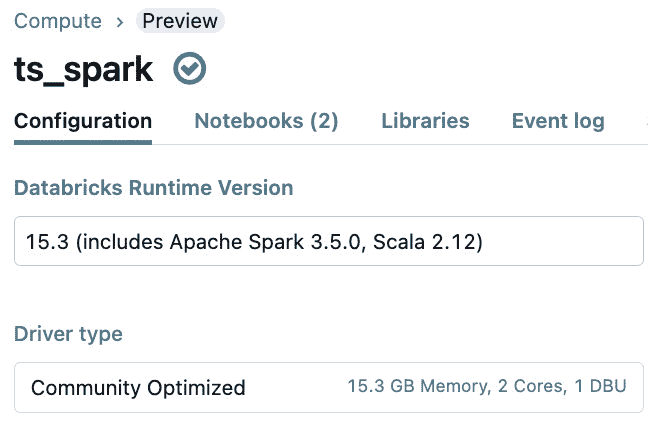

图 7.1：Databricks 社区版计算资源

在我们的实际项目中，我们常常面临时间和资源的限制。本节还旨在为您提供在这些限制条件下工作的工具。

单线程、多线程和集群

在本章的代码示例中，我们将使用`Pandas`和`NumPy`。`Pandas`在使用 CPU 核心时是单线程的，`NumPy`默认是多线程的，因此它会并行使用多个 CPU 核心。两者都绑定到单一机器上，无法利用多机器的 Spark 集群能力。我们将在*第八章*中讨论如何解决这一限制，该章节涉及扩展。在很多现有的代码示例中，你会发现使用了`Pandas`和`NumPy`，因此从这些库开始作为基础非常重要。然后，在*第八章*中，我们将讨论如何将单机代码转换为利用 Spark 集群能力的代码。

本节使用的时间序列数据是**第二章**中用于家庭能量消耗的扩展版本。我们将在本章余下的所有模型中使用相同的时间序列。数据集位于`ch7`文件夹中的`ts-spark_ch7_ds1_25mb.csv`。由于这是一个新数据集，我们将在下一节中通过探索数据的步骤进行介绍。

## 数据探索

在本节中，我们要检查数据集中的平稳性、季节性和自相关。这是理解时间序列特性的重要步骤。

本节的代码位于`ts-spark_ch7_1e_sarima_comm.dbc`。我们按照**第一章**中“实践操作：加载和可视化时间序列”部分的说明，将代码导入 Databricks 社区版。

代码的 URL 如下：

[`github.com/PacktPublishing/Time-Series-Analysis-with-Spark/raw/main/ch7/ts-spark_ch7_1e_sarima_comm.dbc`](https://github.com/PacktPublishing/Time-Series-Analysis-with-Spark/raw/main/ch7/ts-spark_ch7_1e_sarima_comm.dbc)

代码的第一部分加载并准备数据。我们在这里不详细讲解这部分内容，因为我们已经在**第五章**中涵盖了数据准备的内容，你可以参考笔记本中的代码。然而，数据探索部分与本章相关，因此让我们接下来进一步探索，从平稳性检查开始。

### 平稳性

我们可以通过运行**增强型迪基-富勒**（**ADF**）测试，使用以下代码来检查能量消耗时间序列是否平稳：

```py
from statsmodels.tsa.stattools import adfuller
# Perform Augmented Dickey-Fuller test
result = adfuller(data_hr[-300:]['Global_active_power'])
# if Test statistic < Critical Value and p-value < 0.05
#   reject the Null hypothesis, time series does not have a unit root
#   series is stationary
# Extract and print the ADF test results
print('ADF Statistic:', result[0])
print('p-value:', result[1])
print('Critical Values:')
for key, value in result[4].items():
    print(f'   {key}: {value}')
```

这给出了以下 ADF 统计量：

```py
ADF Statistic: -6.615237252003429
p-value: 6.231223531550648e-09
Critical Values:
 1%: -3.4524113009049935
 5%: -2.8712554127251764
 10%: -2.571946570731871
```

由于 ADF 统计量小于临界值，且 p 值小于 0.05，我们可以得出结论，时间序列是平稳的。

### 季节性

我们可以通过以下代码检查季节性：

```py
from statsmodels.tsa.seasonal import seasonal_decompose
# Decompose the time series data into seasonal, trend, and residual 
# components
results = seasonal_decompose(data_hr)
# Plot the last 300 data points of the seasonal component
results.seasonal[-300:].plot(figsize = (12,8));
```

这给出了*图 7**.2*中的季节性分解。

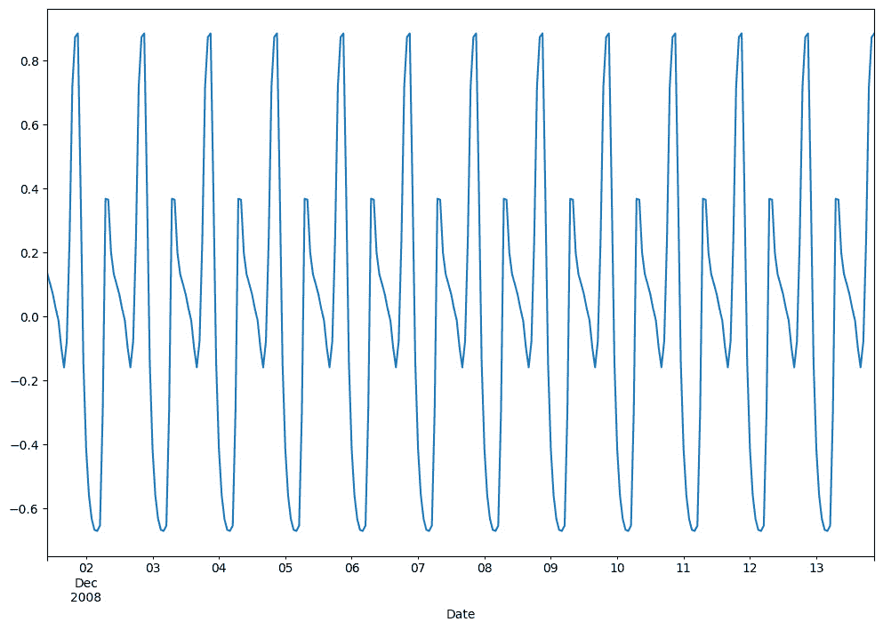

图 7.2：季节性分解

由于模式每 24 小时重复一次，我们可以得出结论，时间序列具有日常季节性。

### 自相关

我们可以通过以下代码检查自相关和偏自相关：

```py
import matplotlib.pyplot as plt
from statsmodels.graphics.tsaplots import plot_acf, plot_pacf
# Plot ACF to identify autocorrelation in 'data_hr' DataFrame
plot_acf(data_hr['Global_active_power'])
# Plot PACF to identify partial autocorrelation in 'data_hr' DataFrame
plot_pacf(data_hr['Global_active_power'])
# Display the ACF and PACF plots
plt.show()
```

这给出了*图 7**.3*中的自相关图。

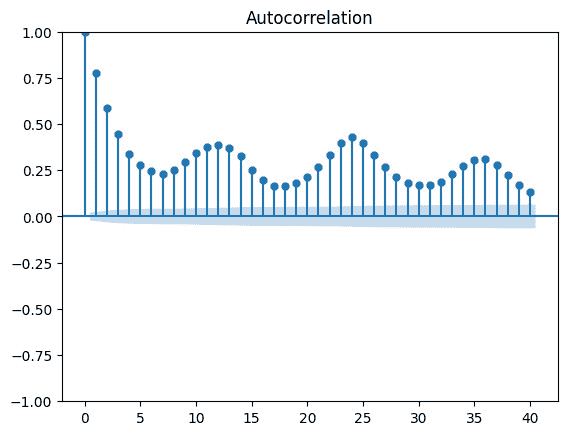

图 7.3：不同滞后（x 轴）下的自相关（y 轴）

我们可以看到在较低的滞后值（包括滞后 1）和滞后 12 时有较高的自相关性，以及在滞后 24 时季节性的影响。考虑到家庭中典型的能量消耗模式，这一点是合理的：

+   比如做饭、洗衣或看电视等活跃能量使用的时段，很可能会超过一个小时（滞后 1）

+   早晨和晚上（滞后 12）通常是活动的高峰期

+   日常例行活动意味着我们每 24 小时会有相似的活动周期（滞后 24）

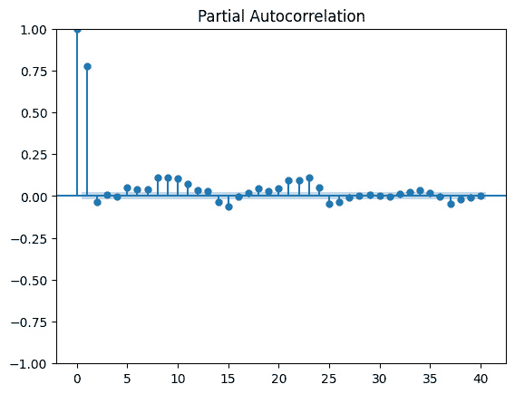

图 7.4：偏自相关

PACF 图显示在滞后 1 时有较高的偏自相关，并在滞后 10 和滞后 23 附近有明显的偏自相关。这与我们提到的家庭能源消费的典型模式一致。

## 统计模型 – SARIMA

我们将讨论的第一个模型是 SARIMA，它通过加入季节性组件扩展了 ARIMA 模型。虽然 ARIMA 模型解决了自相关、差分平稳性和移动平均等问题，SARIMA 在此基础上还考虑了数据中的季节性模式。

本节的代码位于 `ts-spark_ch7_1e_sarima_comm.dbc` 文件中。我们按照 *第一章* 中 *动手实践：加载和可视化时间序列* 部分的说明，将代码导入 Databricks 社区版。

代码 URL 如下：

[`github.com/PacktPublishing/Time-Series-Analysis-with-Spark/raw/main/ch7/ts-spark_ch7_1e_sarima_comm.dbc`](https://github.com/PacktPublishing/Time-Series-Analysis-with-Spark/raw/main/ch7/ts-spark_ch7_1e_sarima_comm.dbc)

### 开发与调优

在模型开发过程中，我们使用以下代码将数据集的最后 48 小时与训练数据分开。这将用于后续的测试，其他部分将用于训练：

```py
# Split the data into training and testing sets
# The last 48 observations are used for testing,
# the rest for training
train = data_hr[:-48]
test = data_hr[-48:]
```

我们将讨论两种结合训练和调优的方法，用于训练模型并找到最佳参数：`auto_arima` 和 `ParameterGrid`。

#### Auto ARIMA

使用 auto ARIMA 方法时，我们希望自动找到最小化 `pmdarima` 库的模型参数，以演示 auto ARIMA 方法。由于这是一个计算密集型操作，我们希望保持之前解释的时间（15 分钟）和资源（Databricks 社区版）限制，因此我们将数据集限制为最后 `300` 个数据点。

使用 `pmdarima` 的代码如下：

```py
import pmdarima as pm
# Create auto_arima model to automatically select the best ARIMA parameters
model = pm.auto_arima(
    # Use the last 300 observations of the series for modeling:
    train[-300:]["Global_active_power"],
    # Enable seasonal differencing:
    seasonal=True,
    # Set the seasonal period to 24
    # (e.g., 24 hours for daily data):
    m=24,
    # Set the degree of non-seasonal differencing to 0
    # (assumes data is already stationary):
    d=0,
    # Set the degree of seasonal differencing to 1:
    D=1,
    # Set the maximum value of AR (p) terms to consider:
    max_p=3,
    # Set the maximum value of MA (q) terms to consider:
    max_q=3,
    # Set the maximum value of seasonal AR (P) terms to consider:
    max_P=3,
    # Set the maximum value of seasonal MA (Q) terms to consider:
    max_Q=3,
    # Use AIC (Akaike Information Criterion) to select the best model:
    information_criterion='aic',
    # Print fit information to see the progression of
    # the model fitting:
    trace=True,
    # Ignore models that fail to converge:
    error_action='ignore',
    # Use stepwise algorithm for efficient search of the model space:
    stepwise=True,
    # Suppress convergence warnings:
    suppress_warnings=True
)
# Print the summary of the fitted model
print(model.summary())
```

以下代码输出展示了逐步搜索最小化 AIC 的参数集。这将是用于 ARIMA 模型的最佳参数集，用于预测家庭的能源消费：

```py
Performing stepwise search to minimize aic
…
ARIMA(1,0,1)(2,1,0)[24] intercept : AIC=688.757, Time=9.37 sec
…
ARIMA(2,0,2)(2,1,0)[24] : AIC=681.750, Time=6.83 sec
…
ARIMA(1,0,1)(2,1,0)[24] : AIC=686.763, Time=6.02 sec
Best model: ARIMA(2,0,2)(2,1,0)[24]
```

请注意，虽然这是一组最佳的模型参数，但考虑到时间和资源的限制，我们可能会发现，通过更长时间运行算法，我们能够找到更好的模型。

#### ParameterGrid

使用 `ParameterGrid` 方法时，我们将逐一遍历参数组合列表，以找到最小化 AIC 的模型参数。

使用 `ParameterGrid` 的代码如下：

```py
# Define parameter grid for SARIMAX model configuration
param_grid = {
    'order': [(0, 0, 0), (1, 0, 1), (2, 0, 0)],
    # Non-seasonal ARIMA orders
    'seasonal_order': [
        (0, 0, 0, 24),
        (2, 0, 1, 24),
        (2, 1, 1, 24)
    ],  # Seasonal ARIMA orders with period of 24
}
# Initialize variables to store the best AIC and
# corresponding parameters
best_aic = float("inf")
best_params = ["",""]
# Iterate over all combinations of parameters in the grid
for params in ParameterGrid(param_grid):
    print(
        f"order: {params['order']}, seasonal_order: {params['seasonal_order']}"
    )
    try:
        # Initialize and fit SARIMAX model with current parameters
        model = SARIMAX(
            train['Global_active_power'],
            order=params['order'],
            seasonal_order=params['seasonal_order'])
        model_fit = model.fit(disp=False)
        print(f"aic: {model_fit.aic}")
        # Update best parameters if current model has lower AIC
        if model_fit.aic < best_aic:
            best_aic = model_fit.aic
            best_params = params
    except Exception as error:
        print("An error occurred:", error)
        continue
```

尽管 auto ARIMA 和 `ParamaeterGrid` 在最小化 AIC 方面相似，但 auto ARIMA 使用起来要简单得多，仅需一行代码。

在 SARIMA 模型训练完成后，我们将接下来进行模型预测测试。

### 测试与预测

我们使用模型通过 `predict` 函数预测测试数据集，每次预测一个周期，每次预测后更新模型的实际值。这种迭代方法将 `forecast_step` 中的单步预测转化为多步预测：

```py
def forecast_step():
    # Predicts the next period with confidence intervals
    forecast, conf_int = model.predict(
        n_periods=1, return_conf_int=True)
…
# Iterate over each observation in the test dataset
for obs in test['Global_active_power']:
    forecast, conf_int = forecast_step()  # Forecast next step
    forecasts.append(forecast)  # Append forecast to list
…
    # Update the model with the new observation
    model.update(obs)
```

然后，我们可以在*图 7.5*和*图 7.6*中绘制预测值与实际值的对比图。

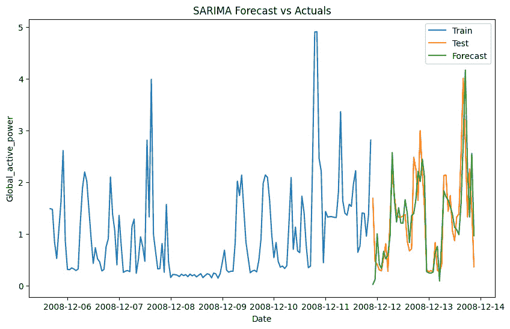

图 7.5：SARIMA 预测与实际值（训练与测试）

我们在*图 7.6*中放大了测试期，以便直观比较预测值与实际值。

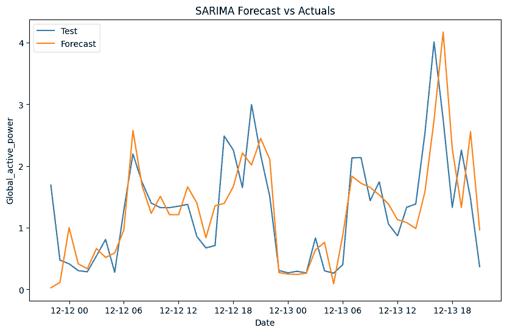

图 7.6：SARIMA 预测与实际值（缩放至测试数据）

虽然可视化图表可以帮助我们了解模型的预测能力，但我们仍然需要定量的指标来评估模型的好坏。这些指标还将帮助我们与其他模型进行预测准确度的比较。

时间序列预测有多种可用的评估指标。本章将展示以下三种指标的使用，突出它们如何服务于不同的目标：

+   **均方误差**（**MSE**）度量了预测值（F）与实际值（A）之间差值的平方平均值。当我们希望惩罚较大误差时，它效果很好。然而，由于平方误差会赋予较大差异更大的权重，因此它对异常值敏感。

![<math xmlns="http://www.w3.org/1998/Math/MathML" display="block"><mrow><mrow><mi>M</mi><mi>S</mi><mi>E</mi><mo mathvariant="italic">=</mo><mfrac><mn mathvariant="italic">1</mn><mi>n</mi></mfrac><mrow><msubsup><mo>∑</mo><mrow><mi>t</mi><mo mathvariant="italic">=</mo><mn mathvariant="italic">1</mn></mrow><mi>n</mi></msubsup><msup><mrow><mo>(</mo><msub><mi>F</mi><mi>t</mi></msub><mo mathvariant="italic">−</mo><msub><mi>A</mi><mi>t</mi></msub><mo>)</mo></mrow><mn mathvariant="italic">2</mn></msup></mrow></mrow></mrow></math>](img/2.png)

+   **对称平均绝对百分比误差**（**SMAPE**）是预测值（F）与实际值（A）之间绝对差值的平均值。它以百分比的形式表示，基于实际值和预测值的绝对值之和的一半。SMAPE 可调整数据的尺度，使其适用于不同数据集之间的比较。由于其对称缩放，它对极端值的敏感度较低。

![<math xmlns="http://www.w3.org/1998/Math/MathML" display="block"><mrow><mrow><mi>S</mi><mi>M</mi><mi>A</mi><mi>P</mi><mi>E</mi><mo mathvariant="italic">=</mo><mfrac><mrow><mn mathvariant="italic">100</mn><mi>%</mi></mrow><mi>n</mi></mfrac><mrow><msubsup><mo>∑</mo><mrow><mi>t</mi><mo mathvariant="italic">=</mo><mn mathvariant="italic">1</mn></mrow><mi>n</mi></msubsup><mfrac><mrow><mo>|</mo><msub><mi>F</mi><mi>t</mi></msub><mo mathvariant="italic">−</mo><msub><mi>A</mi><mi>t</mi></msub><mo>|</mo></mrow><mrow><mo>(</mo><mo>|</mo><msub><mi>A</mi><mi>t</mi></msub><mo>|</mo><mo mathvariant="italic">+</mo><mo>|</mo><msub><mi>F</mi><mi>t</mi></msub><mo>|</mo><mo>)</mo><mo mathvariant="italic">/</mo><mn mathvariant="italic">2</mn></mrow></mfrac></mrow></mrow></mrow></math>](img/3.png)

+   **加权绝对百分比误差**（**WAPE**）是一个归一化的误差度量，通过实际值加权绝对误差。当处理具有不同大小的数据时，它表现良好，但对大值误差敏感。

![<mml:math xmlns:mml="http://www.w3.org/1998/Math/MathML" xmlns:m="http://schemas.openxmlformats.org/officeDocument/2006/math" display="block"><mml:mi>W</mml:mi><mml:mi>A</mml:mi><mml:mi>P</mml:mi><mml:mi>E</mml:mi><mml:mo>=</mml:mo><mml:mfrac><mml:mrow><mml:mrow><mml:msubsup><mml:mo stretchy="false">∑</mml:mo><mml:mrow><mml:mi>t</mml:mi><mml:mo>=</mml:mo><mml:mn>1</mml:mn></mml:mrow><mml:mrow><mml:mi>n</mml:mi></mml:mrow></mml:msubsup><mml:mrow><mml:mo>|</mml:mo><mml:msub><mml:mrow><mml:mi>F</mml:mi></mml:mrow><mml:mrow><mml:mi>t</mml:mi></mml:mrow></mml:msub><mml:mo>-</mml:mo><mml:msub><mml:mrow><mml:mi>A</mml:mi></mml:mrow><mml:mrow><mml:mi>t</mml:mi></mml:mrow></mml:msub><mml:mo>|</mml:mo></mml:mrow></mml:mrow></mml:mrow><mml:mrow><mml:mrow><mml:msubsup><mml:mo stretchy="false">∑</mml:mo><mml:mrow><mml:mi>t</mml:mi><mml:mo>=</mml:mo><mml:mn>1</mml:mn></mml:mrow><mml:mrow><mml:mi>n</mml:mi></mml:mrow></mml:msubsup><mml:mrow><mml:mo>|</mml:mo><mml:msub><mml:mrow><mml:mi>A</mml:mi></mml:mrow><mml:mrow><mml:mi>t</mml:mi></mml:mrow></mml:msub><mml:mo>|</mml:mo></mml:mrow></mml:mrow></mml:mrow></mml:mfrac><mml:mo>×</mml:mo><mml:mn>100</mml:mn><mml:mi mathvariant="normal">%</mml:mi></mml:math>](img/4.png)

我们将看到两种不同的度量计算方法：模型库中包含的度量计算函数，以及一个独立的专门度量计算库。

#### 模型库中的度量函数

在这种方法中，我们希望使用模型库中已经包含的度量计算函数。我们将使用`sklearn`和`pmdarima`库进行度量计算，并在以下代码中演示：

```py
from sklearn.metrics import mean_squared_error
from pmdarima.metrics import smape
# Calculate and print the mean squared error of the forecasts
print(f"Mean squared error: {mean_squared_error(test['Global_active_power'], forecasts)}")
# Calculate and print the Symmetric Mean Absolute Percentage Error 
# (SMAPE)
print(f"SMAPE: {smape(test['Global_active_power'], forecasts)}")
```

这给出了以下结果：

```py
Mean squared error: 0.6131968222566936
SMAPE: 43.775868579535334
```

#### 单独的度量库

在这种第二种度量计算方法中，我们使用`SeqMetrics`库，如以下代码所示：

```py
from SeqMetrics import RegressionMetrics, plot_metrics
# Initialize the RegressionMetrics object with actual and
# predicted values
er = RegressionMetrics(
    test['Global_active_power'], forecasts)
# Calculate all available regression metrics
metrics = er.calculate_all()
# Plot the calculated metrics using a color scheme
plot_metrics(metrics, color="Blues")
# Display the Symmetric Mean Absolute Percentage Error (SMAPE)
print(f"Test SMAPE: {metrics['smape']}")
# Display the Weighted Absolute Percentage Error (WAPE)
print(f"Test WAPE: {metrics['wape']}")
```

这给出了以下结果：

```py
Test SMAPE: 43.775868579535334
Test WAPE: 0.4202224470299464
```

该库还提供了所有计算的度量的可视化，如*图 7.7*和*7.8*所示。

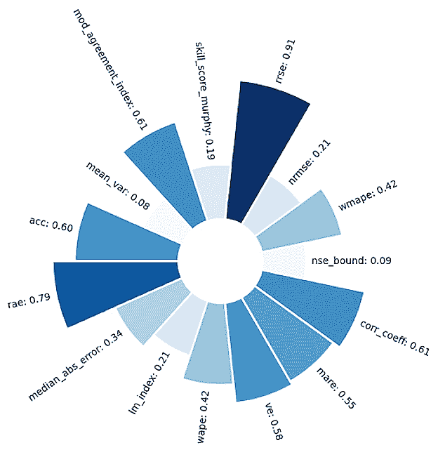

图 7.7：WAPE 的 SeqMetrics 显示

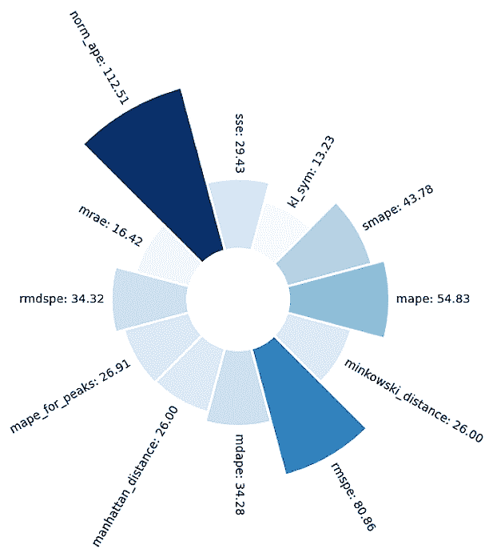

图 7.8：SMAPE 的 SeqMetrics 显示

在训练和测试完我们的第一个模型后，我们可以进入下一个模型，这是一个经典的机器学习模型。

## 经典机器学习模型 – LightGBM

我们将介绍的第二个模型是**Light Gradient Boosting Machine**（**LightGBM**），这是一个免费的开源梯度提升模型。它基于树学习算法，旨在高效且分布式。

本节的代码在`ts-spark_ch7_1e_lgbm_comm.dbc`中。我们将代码导入到 Databricks 社区版中，按照*第一章*中解释的方法进行操作。

代码的 URL 如下：

[`github.com/PacktPublishing/Time-Series-Analysis-with-Spark/raw/main/ch7/ts-spark_ch7_1e_lgbm_comm.dbc`](https://github.com/PacktPublishing/Time-Series-Analysis-with-Spark/raw/main/ch7/ts-spark_ch7_1e_lgbm_comm.dbc)

### 开发与调优

对于模型开发，我们使用以下代码将数据集的最后 48 小时从训练数据中分离出来，用于后续测试。其余部分用于训练：

```py
# Split the data into training and testing sets
# The last 48 observations are used for testing, the rest for training
train = data_hr[:-48]
test = data_hr[-48:]
```

我们将使用 `GridSearchCV` 方法为 `LGBMRegressor` 模型寻找最佳参数。`TimeSeriesSplit` 用于根据时间序列特性将训练数据集进行交叉验证划分：

```py
# Define the parameter grid for LightGBM
param_grid = {
    'num_leaves': [30, 50, 100],
    'learning_rate': [0.1, 0.01, 0.001],
    'n_estimators': [50, 100, 200]
}
# Initialize LightGBM regressor
lgbm = lgb.LGBMRegressor()
# Setup TimeSeriesSplit for cross-validation
tscv = TimeSeriesSplit(n_splits=10)
# Configure and run GridSearchCV
gsearch = GridSearchCV(
    estimator=lgbm,
    param_grid=param_grid,
    cv=tscv
)
gsearch.fit(X_train, y_train)
# Output the best parameters from Grid Search
print(f"Best Parameters: {gsearch.best_params_}")
```

我们找到了以下最佳参数：

```py
Best Parameters: {'learning_rate': 0.1, 'n_estimators': 50, 'num_leaves': 30}
```

基于训练数据集，这将是与 LightGBM 模型预测该家庭能耗时使用的最佳参数集。然后，我们可以用这些参数训练最终模型：

```py
final_model = lgb.LGBMRegressor(**best_params)
final_model.fit(X_train, y_train)
```

在训练好 LightGBM 模型后，我们将进行模型预测测试。

### 测试与预测

我们使用模型通过 `predict` 函数对测试数据集进行预测。请注意，在此情况下，我们并没有使用迭代式多步预测代码，而是使用了滞后值作为模型的输入特征：

```py
# Predict on the test set
y_pred = final_model.predict(X_test)
```

然后，我们可以在 *图 7.8* 和 *图 7.9* 中将预测值与实际值进行对比。

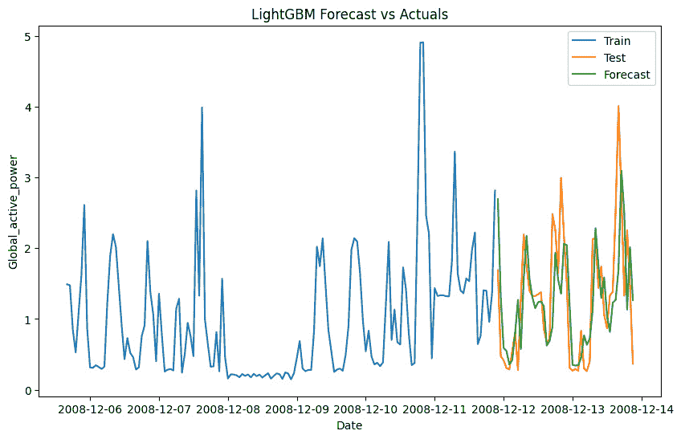

图 7.9：LightGBM 预测与实际值对比（训练与测试）

我们在 *图 7.9* 中放大测试期，以便直观比较预测值与实际值。

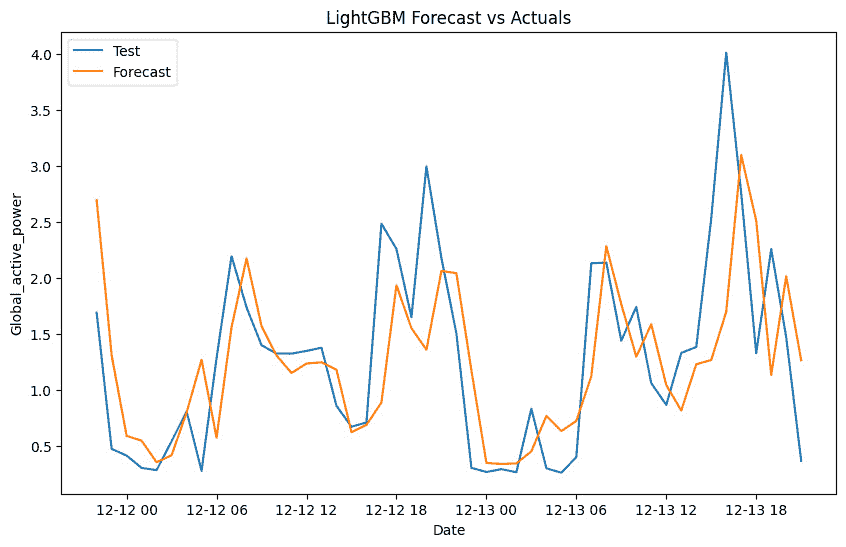

图 7.10：LightGBM 预测与实际值对比（测试数据放大）

根据预测值与实际值，我们可以计算 SMAPE 和 WAPE，得到以下值：

```py
Test SMAPE: 41.457989848314384
Test WAPE: 0.38978585281926825
```

现在我们已经训练并测试了统计学和经典机器学习模型，可以进入第三种模型类型——深度学习模型。

## 深度学习模型 - NeuralProphet

我们将介绍的第三个模型是 NeuralProphet，它是一个免费的开源深度学习模型，灵感来自于我们在前几章使用过的 Prophet 和 AR-Net。NeuralProphet 基于 PyTorch 构建。

本节代码位于 `ts-spark_ch7_1e_nprophet_comm.dbc` 文件中。我们按照 *第一章* 中的方式将代码导入 Databricks Community Edition。

代码链接如下：[`github.com/PacktPublishing/Time-Series-Analysis-with-Spark/raw/main/ch7/ts-spark_ch7_1e_nprophet_comm.dbc`](https://github.com/PacktPublishing/Time-Series-Analysis-with-Spark/raw/main/ch7/ts-spark_ch7_1e_nprophet_comm.dbc)

注意

请注意，此示例的笔记本需要 Databricks 计算 DBR 13.3 LTS ML。

### 开发

我们实例化了一个 `NeuralProphet` 模型，并通过 `n_lag` 参数指定我们希望使用过去 24 小时的数据进行预测。然后，我们在训练数据集上训练（`fit` 方法）该模型：

```py
# Initialize and fit the Prophet model
# model = NeuralProphet()
model = NeuralProphet(n_lags=24, quantiles=[0.05, 0.95])
metrics = model.fit(train_df)
```

只需这两行代码即可训练模型，接下来我们将进行模型预测测试。

### 测试与预测

在使用模型对测试数据集进行预测之前，我们需要为 NeuralProphet 准备数据，类似于之前为 Prophet 所做的准备。所需的格式是有一个`ds`列用于日期/时间，另一个`y`列用于预测目标。然后，我们可以使用`predict`方法。请注意，在此情况下，我们没有使用迭代的多步预测代码。在前一段代码中指定了滞后 24 作为参数，NeuralProphet 使用过去 24 个值的滑动窗口来预测下一个值：

```py
# Convert the DataFrame index to datetime,
# removing timezone information
test_df['ds'] = test_df.index.to_pydatetime()
test_df['ds'] = test_df['ds'].apply(
    lambda x: x.replace(tzinfo=None))
# Rename the target variable for Prophet compatibility
test_df = test_df.rename(columns={'Global_active_power': 'y'})
# Use the trained model to make predictions on the test set
predictions_48h = model.predict(test_df)
```

我们在*图 7.12*和*图 7.13*中将预测值与实际值进行对比。

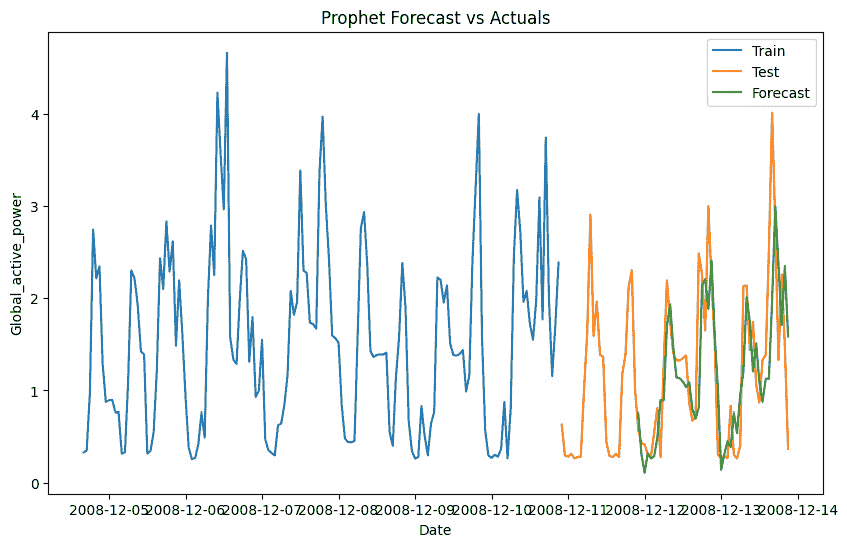

图 7.11：NeuralProphet 预测与实际值对比（训练与测试）

我们在*图 7.13*中放大测试期，以便进行预测与实际值的视觉对比。

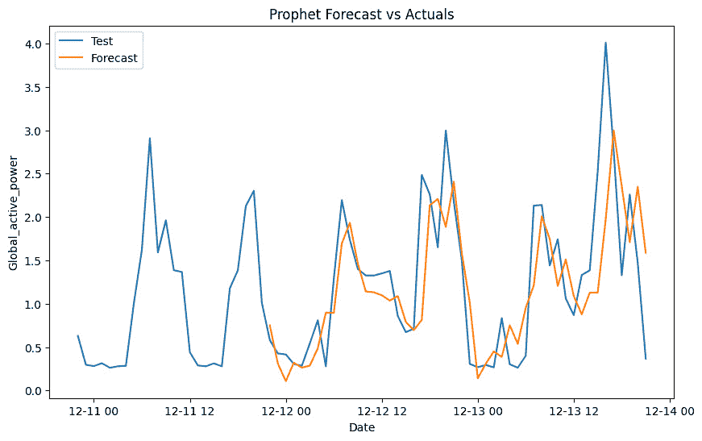

图 7.12：NeuralProphet 预测与实际值对比（放大测试数据）

基于预测和实际值，我们可以计算 SMAPE 和 WAPE，并获得以下值来衡量模型的准确性：

```py
Test SMAPE: 41.193985580947896
Test WAPE: 0.35355667972102317
```

我们将在后续的*模型* *比较*部分使用这些指标来比较本章中使用的不同模型。

到目前为止，我们已经训练并测试了每种类型的模型：统计模型、经典机器学习模型和深度学习模型。书中 GitHub 仓库中提供了其他一些常用的时间序列模型示例：

+   Prophet: `ts-spark_ch7_1e_prophet_comm.dbc`

+   LSTM: `ts-spark_ch7_1e_lstm_comm1-cpu.dbc`

+   NBEATS 和 NHITS: `ts-spark_ch7_1e_nbeats-nhits_comm.dbc`

我们鼓励你进一步探索这些内容。

拥有一个有效的模型很重要，但还不够。我们还需要能够解释我们使用的模型。接下来我们将介绍这一部分内容。

## 可解释性

可解释性在许多情况下都是一个关键要求，例如金融和受监管行业。我们将通过一种广泛使用的方法——**Shapley 加法解释**（**SHAP**）来解释数据集的不同特征如何影响预测结果。

我们将使用`shap`库中的`TreeExplainer`函数，应用于*经典机器学习模型 – LightGBM*部分的最终模型，计算 SHAP 值，从而了解每个特征对模型输出的影响。

```py
import shap
# Initialize a SHAP TreeExplainer with the trained model
explainer = shap.TreeExplainer(final_model)
# Select features for SHAP analysis
X = data_hr[[
    'Global_active_power_lag1', 'Global_active_power_lag2',
    'Global_active_power_lag3', 'Global_active_power_lag4',
    'Global_active_power_lag5', 'Global_active_power_lag12',
    'Global_active_power_lag24', 'Global_active_power_lag24x7'
]]
# Compute SHAP values for the selected features
shap_values = explainer(X)
# Generate and display a summary plot of the SHAP values
shap.summary_plot(shap_values, X)
```

然后，我们可以在*图 7.10*中绘制特征重要性。正如我们在前一部分的数据探索中所预期的那样，滞后 1 和滞后 24 是对预测贡献最大的特征。

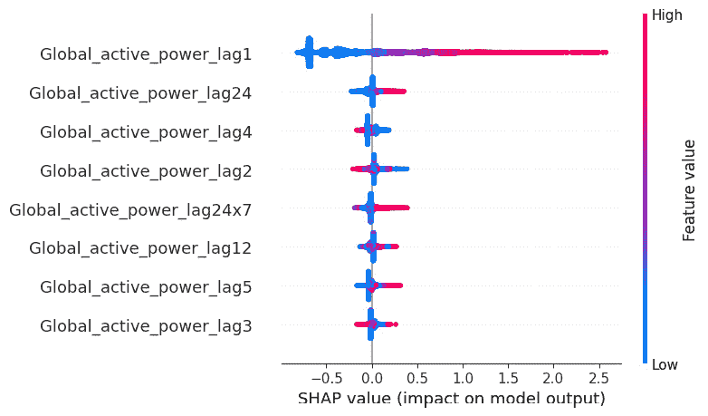

图 7.13：SHAP – 特征重要性

我们可以通过以下代码进一步分析，聚焦于某个特定的预测值，在此我们要解释第一个预测值的情况：

```py
# Plot a SHAP waterfall plot for the first observation's SHAP values # to visualize the contribution of each feature
shap.plots.waterfall(shap_values[0])
```

我们可以在*图 7.11*中看到特征的相对贡献，再次呈现滞后 1 和滞后 24 的主导地位，滞后 12 的贡献相对较小。这与我们在*数据探索*部分中的分析一致，在该部分中我们确认了这些滞后项在预测家庭能源消耗中的重要性。

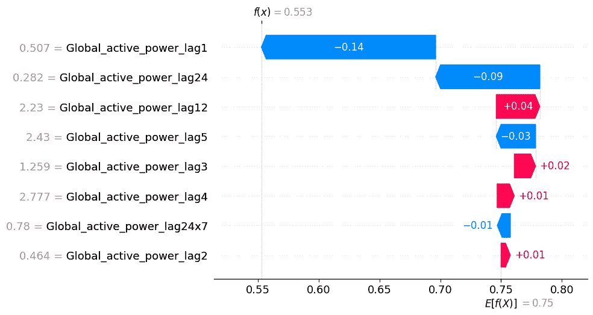

图 7.14：SHAP—特征重要性（首次观测）

# 模型比较

在结束本章之前，我们将根据我们所测量的指标和代码执行时间对所有测试过的模型进行比较。结果显示在*表 7.1*中。

| **模型** | **类型** | **SMAPE** | **WAPE** | **训练** | **调优** | **测试** | **总计（包括数据预处理）** |
| --- | --- | --- | --- | --- | --- | --- | --- |
| NeuralProphet | 深度学习/混合 | 41.19 | 0.35 | 60 秒 | - | 1 秒 | 90 秒 |
| LightGBM | 经典机器学习 | 41.46 | 0.39 | 60 秒 | 包含 | 包含 | 137 秒 |
| SARIMA | 统计模型 | 43.78 | 0.42 | 包含 | 420 秒 | 180 秒 | 662 秒 |
| Prophet | 统计/混合 | 47.60 | 0.41 | 2 秒 | - | 1 秒 | 70 秒 |
| NHITS | 深度学习 | 54.43 | 0.47 | 35 秒 | - | 包含 | 433 秒 |
| NBEATS | 深度学习 | 54.91 | 0.48 | 35 秒 | - | 包含 | 433 秒 |
| LSTM | 深度学习 | 55.08 | 0.48 | 722 秒 | - | 4 秒 | 794 秒 |

表 7.1：模型结果比较

以下是一些关于模型准确性的观察：

+   NeuralProphet 和 LightGBM 在 SMAPE 和 WAPE 指标下提供了最佳的预测准确性。SARIMA 的表现也不算差。

+   深度学习模型 NBEATS、NHITS 和 LSTM 作为单输入模型时预测准确性较差。我们建议进一步探索如何通过多输入来提升它们的表现。

以下内容涉及执行时间：

+   在所有情况下，我们都保持在 900 秒（15 分钟）的总执行时间限制内，使用 2 个 CPU 核心在单节点的 Databricks 社区版集群上运行。这对于 25MB 的数据集来说是可行的。我们将在*第八章*中看到如何为更大的数据集进行扩展。

+   Prophet、NBEATS 和 NHITS 的执行时间最佳，NeuralProphet 和 LightGBM 紧随其后，训练、调优和测试时间仍在 1 分钟以内。

+   即使我们将数据集限制为最后 300 个观测值，SARIMA 的执行时间仍然相对较高。这是由于 Auto ARIMA 算法在搜索最佳超参数时以及多步迭代预测代码的执行。

+   LSTM 的执行时间最长，这可以通过使用 CPU 而非 GPU 来解释，GPU 对于深度学习来说要快得多。

从这次模型比较的整体结论来看，NeuralProphet 和 LightGBM 是我们使用的数据集的最佳选择，几乎不需要调优，并且符合我们设定的计算和执行时间限制。

# 总结

在本章中，我们重点讨论了本书的核心主题，即时间序列分析模型的开发，特别是预测模型。从回顾不同类型的模型开始，然后介绍了选择合适模型的关键标准。在本章的第二部分，我们实践了多个模型的开发和测试，并根据准确性和执行时间进行了比较。

在下一章中，我们将扩展一个 Apache Spark 的优势领域：将时间序列分析扩展到大数据。

# 加入我们社区的 Discord

加入我们社区的 Discord 空间，与作者和其他读者进行讨论：

[`packt.link/ds`](https://packt.link/ds)

.jpg)

# 第三部分：扩展到生产环境及更远发展

在最后一部分，我们将讨论将第二部分中涉及的解决方案扩展和投入生产时需要考虑的因素和实际案例。随后，我们将以使用 Databricks 和生成式 AI 作为解决方案的一部分，来结束本书，并介绍如何进一步推进 Apache Spark 和时间序列分析的应用。

本部分包含以下章节：

+   *第八章*，*大规模处理*

+   *第九章*，*投入生产*

+   *第十章*，*进一步使用 Apache Spark*

+   *第十一章*，*时间序列分析的最新发展*
