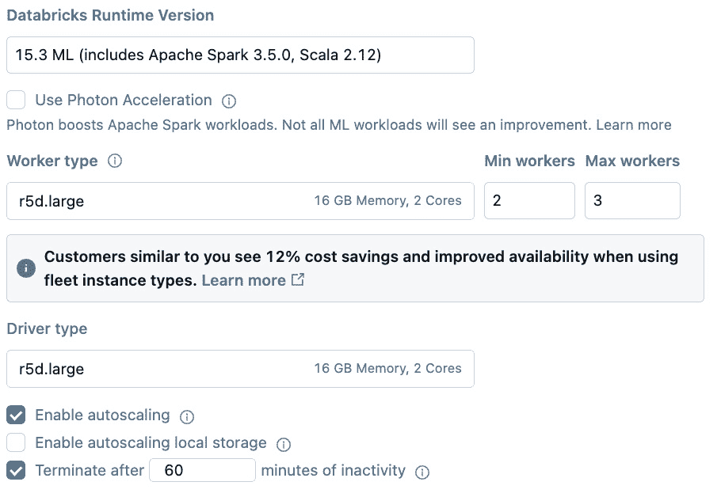

# 第八章：扩展计算能力

在上一章构建并测试模型后，我们将讨论在大型分布式计算环境中扩展时间序列分析的需求和注意事项。我们将讨论 Apache Spark 如何扩展**第七章**中的示例，内容从特征工程开始，接着是超参数调优，以及单模型和多模型训练。这些信息对于我们在时间紧迫的情况下分析大量时间序列数据至关重要。

在本章中，我们将涵盖以下主要话题：

+   为什么我们需要扩展时间序列分析？

+   扩展特征工程

+   扩展模型训练

# 技术要求

在进入主要话题之前，我们将先介绍本章的技术要求，具体如下：

+   书籍 GitHub 仓库中的`ch8`文件夹，网址为：

    [`github.com/PacktPublishing/Time-Series-Analysis-with-Spark/tree/main/ch8`](https://github.com/PacktPublishing/Time-Series-Analysis-with-Spark/tree/main/ch8)

+   **合成数据**：我们将使用合成数据库工具（Synthetic Data Vault），这是一个用于生成合成表格数据的 Python 库。你可以在这里找到更多关于合成数据库的信息：[`docs.sdv.dev/sdv`](https://docs.sdv.dev/sdv)。

+   **Databricks 平台**：虽然 Databricks 社区版是免费的，但其资源有限。类似地，在个人计算机或笔记本电脑上使用时，资源也可能受到限制。鉴于本章需要演示计算能力的扩展，我们将使用 Databricks 的非社区版。如**第一章**中所讨论的，你可以注册 Databricks 的 14 天免费试用版，但前提是你需要先拥有一个云服务提供商的账户。一些云服务提供商在开始时提供免费积分，这将为你提供比社区版更多的资源，且仅限时使用。请注意，试用期结束后，费用将转到你注册时提供的信用卡。

    使用的 Databricks 计算配置如*图 8.1*所示。这里展示的工作节点和驱动节点类型基于 AWS，与 Azure 和 GCP 上的配置不同。请注意，UI 界面可能会发生变化，在这种情况下，请参考最新的 Databricks 文档：

    [`docs.databricks.com/en/compute/configure.html`](https://docs.databricks.com/en/compute/configure.html)



图 8.1：Databricks 计算配置

# 为什么我们需要扩展时间序列分析？

扩展时间序列分析的需求通常源于需要更快地进行分析或处理更大的数据集。在本章中，我们将探讨如何在将数据集大小扩大五倍的同时，减少在*第七章*中实现的处理时间。这将得益于 Apache Spark 所提供的处理能力。

## 扩展后的数据集

为了测试 Spark 的可扩展性，我们需要一个比以往更广泛的数据集。虽然你可能已经拥有这样的数据集，但为了本章的目的，我们将扩展在*第七章*和之前章节中使用的家庭能源消耗数据集。扩展后的数据集将使用 Synthetic Data Vault 工具生成，如*技术要求*部分所述。

本节的代码位于`ts-spark_ch8_1.dbc`中。我们将代码导入到 Databricks 中，方法与*第一章*中*逐步操作：加载和可视化时间序列*部分对于社区版的讲解类似。

在这段代码中，我们希望使用一个家庭的数据生成四个其他家庭的能源消耗数据，以将数据规模扩大五倍。

我们首先捕获`pdf_main`的元数据，这是较小的参考数据集。元数据作为输入，用于创建一个名为`synthesizer`的`GaussianCopulaSynthesizer`对象，它表示数据的统计模型。然后，该合成器通过`fit`方法在参考数据集（`pdf_main`）上进行训练。最终，这个模型将用于通过`sample`方法生成合成数据。

较小的参考数据集（`pdf_main`）与客户标识符（`cust_id`）`1`相关联，合成数据集则与标识符`2`、`3`、`4`和`5`相关联：

```py
# Initialize metadata object for the dataset
metadata = SingleTableMetadata()
# Automatically detect and set the metadata from the Pandas DataFrame
metadata.detect_from_dataframe(pdf_main)
# Initialize the Gaussian Copula Synthesizer with the dataset metadata
synthesizer = GaussianCopulaSynthesizer(metadata)
# Fit the synthesizer model to the Pandas DataFrame
synthesizer.fit(pdf_main)
…
# Define the number of customer datasets to generate:
num_customers = 5
# Count the number of rows in the original dataset:
sample_size = df_main.count()
i = 1
df_all = df_main.withColumn(
    'cust_id', F.lit(i)
) # Add a 'cust_id' column to the original dataset with a constant 
# value of 1
…
    synthetic_data = spark.createDataFrame(
        synthesizer.sample(num_rows=sample_size)
) # Generate synthetic data matching the original dataset's size
…
```

在这个新的、更大的数据集上运行*第七章*中的代码将无法达到高效的性能。我们可以对更大的数据集进行纵向扩展或横向扩展时间序列分析。接下来，我们将解释这两种扩展方式。

## 扩展

扩展是一种更简单的扩展方式，不需要我们修改在*第七章*中编写的代码。通过增加更多的内存（RAM）和使用更强大的 CPU 或甚至 GPU，我们可以提高性能。这样做在一定程度上是有效的，但会在达到扩展极限、成本过高或回报递减时遇到瓶颈。实际上，由于系统瓶颈和开销，扩展并不会导致性能线性提升。

要进一步扩展，我们需要进行横向扩展。

## 横向扩展

扩展不仅仅是让我们的单一机器变得更强大，它还涉及增加更多的机器并行处理。这需要一种机制，让代码能够被分发并并行执行，而 Apache Spark 正是提供了这种机制。

在接下来的章节中，我们将介绍 Apache Spark 可用于扩展时间序列分析的几种不同方法：

+   特征工程

+   模型训练

# 特征工程

Apache Spark 可以利用其分布式计算框架扩展特征工程的处理。这使得特征工程任务能够进行并行处理，我们将在本节中展示如何操作。

我们将在*第五章*继续讨论数据准备，并改进*第七章*中的特征工程。我们将在本节中以*第七章*中*开发与测试*部分的基于 pandas 的代码示例为基础进行讨论。接下来的示例将展示如何将非 Spark 代码重写为 Spark 兼容代码，从而利用其可扩展性的优势。

虽然 Spark 可以用于多种特征工程方式，但我们将重点讨论以下三种与改进*第七章*代码相关的方式：

+   列转换

+   重采样

+   滞后值计算

接下来，我们将开始进行列转换的讨论。

## 列转换

在第一个代码示例中，我们将重写`ts-spark_ch7_1e_lgbm_comm.dbc`中已有的列转换代码，该代码用于*第七章*中的*开发与测试*部分。我们将通过使用`pyspark.sql.functions`库将代码修改为支持 Spark 的版本。为此，我们需要执行以下操作：

1.  使用`concat_ws`函数，将现有的`Date`和`Time`列合并，替换`Date`列。

1.  将`Date`列转换为时间戳格式（`to_timestamp`函数）。

1.  有选择性地（使用`when`和`otherwise`条件）将`Global_active_power`中的错误值`?`替换为`None`。

1.  使用`regexp_replace`函数将`Global_active_power`中的`,`替换为`.`，以确保符合`float`值的正确格式。

以下代码示例演示了前述步骤：

```py
from pyspark.sql import functions as F
# Combine 'Date' and 'Time' into a single 'Date' column of timestamp 
# type
df_all = df_all.withColumn(
    'Date',
    F.to_timestamp(
        F.concat_ws(' ', F.col('Date'), F.col('Time')),
        'd/M/yyyy HH:mm:ss')
)...
# Select only the 'cust_id', 'Date' and 'Global_active_power' columns
df_all = df_all.select(
    'cust_id', 'Date', 'Global_active_power'
)
# Replace '?' with None and convert 'Global_active_power' to float
df_all = df_all.withColumn(
    'Global_active_power',
    F.when(F.col('Global_active_power') == '?', None)
    .otherwise(F.regexp_replace(
        'Global_active_power', ',', '.').cast('float')
    )
)
# Sort the DataFrame based on 'cust_id' and 'Date'
df_all = df_all.orderBy('cust_id', 'Date')
```

在使用 Spark 并行化列转换后，我们接下来要讲解的代码优化是对时间序列数据进行重采样。

## 重采样

在第二个代码转换示例中，我们将重写`ts-spark_ch7_1e_lgbm_comm.dbc`中每小时重采样的代码，该代码用于*第七章*中的*开发与测试*部分。我们希望计算每个客户的`Global_active_power`的每小时均值。为此，我们需要执行以下操作：

1.  使用`date_format`函数将`Date`列转换为日期和小时组件。

1.  对每个客户（`groupBy`函数），将`Global_active_power`的重采样平均值转换为每小时的均值（使用`agg`和`mean`函数）。

以下代码展示了前述步骤：

```py
from pyspark.sql import functions as F
# Convert the 'Date' column to a string representing the
# start of the hour for each timestamp
data_hr = df_all.withColumn(
    'Date',
    F.date_format('Date', 'yyyy-MM-dd HH:00:00'))
# Group the data by 'cust_id' and the hourly 'Date',
# then calculate the mean 'Global_active_power' for each group
data_hr = data_hr.groupBy(
    'cust_id', 'Date').agg(
    F.mean('Global_active_power').alias('Global_active_power')
)
```

现在我们已经使用 Spark 对重采样过程进行了并行化，接下来我们要介绍的代码优化是计算时间序列数据的滞后值。

## 计算滞后值

在第三个例子中，使用 Apache Spark 进行特征工程的扩展时，我们将重写存在于 `ts-spark_ch7_1e_lgbm_comm.dbc` 中的滞后计算代码，该代码用于*第七章*中的*开发和测试*部分。我们希望为每个客户计算不同的滞后值。为此，我们需要执行以下操作：

1.  定义一个滑动日期窗口来计算每个客户的滞后值（`partitionBy` 函数）。我们已经为每个客户按日期排序（`orderBy` 函数）。

1.  计算滑动窗口上的不同滞后值（`lag` 和 `over` 函数）。

1.  请注意，由于滞后计算基于先前的值，数据集开头的某些滞后值可能没有足够的先前值进行计算，因此会为空。我们使用 `dropna` 函数删除这些空滞后值的行。

以下代码演示了上述步骤：

```py
from pyspark.sql.window import Window
from pyspark.sql import functions as F
# Define a window specification partitioned by -
# 'cust_id' and ordered by the 'Date' column
windowSpec = Window.partitionBy("cust_id").orderBy("Date")
# Add lagged features to the DataFrame to incorporate
#  past values as features for forecasting
# Apply the lag function to create the lagged column,
#  separately for each 'cust_id'
# Lag by 1, 2, 3, 4, 5, 12, 24, 168 hours (24 hours * 7 days)
lags = [1, 2, 3, 4, 5, 12, 24, 24*7]
for l in lags:
    data_hr = data_hr.withColumn(
        'Global_active_power_lag' + str(l),
        F.lag(F.col('Global_active_power'), l).over(windowSpec))
# Remove rows with NaN values that were introduced by
#  shifting (lagging) operations
data_hr = data_hr.dropna()
```

通过使用 Spark 函数而不是 pandas，我们将使 Spark 能够并行化处理大数据集的滞后计算。

现在我们已经介绍了不同的方法来利用 Apache Spark 提升*第七章*中特征工程部分的代码，接下来我们将深入探讨模型训练的扩展。

# 模型训练

在本节中，我们将涵盖以下几种不同的方式，即 Apache Spark 如何用于规模化模型训练：

+   超参数调优

+   单模型并行训练

+   多模型并行训练

这些方法使得在拥有大数据集或需要训练多个模型时能够高效地进行模型训练。

当使用不同的超参数重复训练同一模型时，超参数调优可能是昂贵的计算。我们希望能够利用 Spark 高效地找到最佳超参数。

同样地，对于大数据集，训练单一模型可能需要很长时间。在其他情况下，我们可能需要训练许多模型以适应不同的时间序列数据集。我们希望通过在 Spark 集群上并行化训练来加速这些过程。

我们将在下一节详细介绍这些方法，从超参数调优开始。

## 超参数调优

如*第四章*中所述，机器学习中的超参数调优是为机器学习算法找到最佳配置集的过程。这种寻找最佳超参数的过程可以使用 GridSearchCV、Hyperopt 和 Optuna 等库来并行化，这些库与 Apache Spark 结合提供后端处理并行性的框架。

我们在*第三章*中讨论了 Spark 的处理并行性。这里我们将更专注于使用 Optuna 与 Apache Spark 结合进行超参数调整。

如果你还记得，在*第七章*中，我们在单个节点上使用 GridSearchCV 调整了 LightGBM 模型的超参数。在这一节的代码示例中，我们将通过并行化过程来改进这一点。我们将使用 Optuna 与 Spark 一起，找到我们在*第七章*中探索的 LightGBM 模型的最佳超参数。

Optuna 是一个开源的超参数优化框架，用于自动化超参数搜索。您可以在这里找到有关 Optuna 的更多信息：[`optuna.org/`](https://optuna.org/)。

我们将通过定义一个 `objective` 函数开始调优过程（稍后我们将使用 Optuna 优化该函数）。此 `objective` 函数执行以下操作：

1.  在`params`中定义超参数值的搜索空间。

1.  初始化 LightGBM `LGBMRegressor`模型，使用特定于试验的参数。

1.  在训练数据集上训练（`fit`）模型。

1.  使用模型对验证数据集进行预测。

1.  计算模型的评估指标（`mean_absolute_percentage_error`）。

1.  返回评估指标。

以下代码展示了前面的步骤：

```py
import lightgbm as lgb
from sklearn.metrics import mean_absolute_percentage_error
import optuna
def objective(trial):
    # Define the hyperparameter configuration space
    params = {
        # Specify the learning task and
        #  the corresponding learning objective:
        "objective": "regression",
        # Evaluation metric for the model performance:
        "metric": "rmse",
        # Number of boosted trees to fit:
        "n_estimators": trial.suggest_int("n_estimators", 50, 200),
        # Learning rate for gradient descent:
        "learning_rate": trial.suggest_float(
            "learning_rate", 0.001, 0.1, log=True),
        # Maximum tree leaves for base learners:
        "num_leaves": trial.suggest_int("num_leaves", 30, 100),
    }
    # Initialize the LightGBM model with the trial's parameters:
    model = lgb.LGBMRegressor(**params)
    # Train the model with the training dataset:
    model.fit(X_train, y_train)
    # Generate predictions for the validation dataset:
    y_pred = model.predict(X_test)
    # Calculate the Mean Absolute Percentage Error (MAPE)
    #  for model evaluation:
    mape = mean_absolute_percentage_error(y_test, y_pred)
    # Return the MAPE as the objective to minimize
    return mape
```

一旦定义了目标函数，接下来的步骤如下：

1.  注册 Spark（`register_spark` 函数）作为后端。

1.  创建一个研究（`create_study`函数），它是一个包含试验的集合，用于最小化评估指标。

1.  在 Spark `parallel_backend` 上运行研究，以优化 `objective` 函数在 `n_trials` 上的表现。

以下代码展示了前面的步骤：

```py
from joblibspark import register_spark
# This line registers Apache Spark as the backend for
# parallel computing with Joblib, enabling distributed
# computing capabilities for Joblib-based parallel tasks.
register_spark()
…
# Create a new study object with the goal of minimizing the objective # function
study2 = optuna.create_study(direction='minimize')
# Set Apache Spark as the backend for parallel execution of –
# trials with unlimited jobs
with joblib.parallel_backend("spark", n_jobs=-1):
    # Optimize the study by evaluating the –
    #  objective function over 10 trials:
    study2.trial.value) and parameters (trial.params) for best_trial:

```

# 从优化研究中获取最佳试验

trial = study2.best_trial

# 打印最佳试验的目标函数值，

#    通常是准确性或损失

print(f"最佳试验准确率：{trial.value}")

print("最佳试验参数：")

# 遍历最佳试验的超参数并打印它们

for key, value in trial.params.items():

print(f"    {key}: {value}")

```py

 The outcome of the hyperparameter tuning, shown in *Figure 8**.2*, is the best hyperparameters found within the search space specified, as well as the related model accuracy.


Figure 8.2: Hyperparameter tuning – best trials
In addition to the scaling of the hyperparameter tuning stage, which we have seen in this section, Spark clusters can also be used to parallelize the next step, that is, fitting the model to the training data. We will cover this next.
Single model in parallel
Ensemble methods such as Random Forest and gradient boosting machines can benefit from task parallelism during the model training stage. Each tree in a Random Forest can be trained independently, making it possible to parallelize across multiple processors. Similarly in the case of Gradient Boosting models such as LightGBM and XGBoost, the tree’s construction can be parallelized, even though the boosting itself is sequential,
In *Chapter 7*’s example in the *Classical machine learning model* section, we used LightGBM. This model was not Spark enabled. Here, as we want to demonstrate training parallelism with a Spark-enabled Gradient Boosting model, we will use `SparkXGBRegressor` instead.
As a first step, we will build a vector of the features using `VectorAssember`, as shown in the following code:

```

from pyspark.ml.feature import VectorAssembler

# 定义一个列表来保存滞后特征列的名称

inputCols = []

# 遍历滞后间隔列表以创建特征列

# 名称

for l in lags:

inputCols.append('Global_active_power_lag' + str(l))

# 初始化 VectorAssembler 并使用

# 创建特征列名称并指定输出列名称

assembler = VectorAssembler(

inputCols=inputCols, outputCol="features")

```py

 We then create the `SparkXGBRegressor` model object, setting `num_workers` to all available workers, and specifying the target column with `label_col`:

```

from xgboost.spark import SparkXGBRegressor

# 初始化 SparkXGBRegressor 用于回归任务。

# `num_workers` 设置为默认的并行度级别 -

#    Spark 上下文，用于利用所有可用核心。

# `label_col` 指定目标变量列名

# 预测。

# `missing` 设置为 0.0，以处理数据集中的缺失值。

xgb_model = SparkXGBRegressor(

num_workers=sc.defaultParallelism,

label_col="Global_active_power", missing=0.0

)

```py

 As we have seen so far, hyperparameter tuning is an important step in finding the best model. In the following code example, we will use `ParamGridBuilder` to specify the range of parameters that are specific to the model and that we want to evaluate.
We then pass the parameters to `CrossValidator` together with `RegressionEvaluator`. We will use the root mean square error (`rmse`) as the evaluation metric. This is the default metric for `RegressionEvaluator`, making it suitable for our example here:

```

from pyspark.ml.tuning import CrossValidator, ParamGridBuilder

from pyspark.ml.evaluation import RegressionEvaluator

# 初始化超参数调整的参数网格

# - max_depth: 指定模型中树的最大深度

# - n_estimators: 定义模型中树的数量

paramGrid = ParamGridBuilder()\

.addGrid(xgb_model.max_depth, [5, 10])\

.addGrid(xgb_model.n_estimators, [30, 100])\

.build()

# 初始化回归评估器用于模型评估

# - metricName: 指定用于评估的指标

#    这里是 RMSE（均方根误差）

# - labelCol: 标签列的名称

# - predictionCol: 预测列的名称

evaluator = RegressionEvaluator(

metricName="rmse",

LabelCol = xgb_model.getLabelCol(),

PredictionCol = xgb_model.getPredictionCol()

)

# 初始化 CrossValidator 进行超参数调整

# - estimator: 需要调优的模型

# - evaluator: 用于模型评估的评估器

# - estimatorParamMaps: 用于调优的参数网格

cv = CrossValidator(

estimator = xgb_model, evaluator = evaluator,

estimatorParamMaps = paramGrid)

```py

 At this point, we are ready to build a pipeline (`Pipeline`) to train (`fit`) the model.  We will do this by combining in sequence the `VectorAssembler` (`assembler`) and `CrossValidator` (`cv`) stages:

```

from pyspark.ml import Pipeline

# 初始化一个包含两个阶段的管道对象：

# 一个特征组装器和一个交叉验证器用于模型调优

pipeline = filter function) 训练数据筛选为 cust_id 1。接着，我们使用所有记录（head function）进行训练，除去最后 48 小时的数据，因为这些数据将用于测试。最终得到的 train_hr DataFrame 包含了每小时的训练数据：

```py
# Filter the dataset for customer with cust_id equal to 1
train_hr = data_hr.filter('cust_id == 1')
# Create a Spark DataFrame excluding the last 48 records for training
train_hr = spark.createDataFrame(
    train_hr.head(train_hr.count() - 48)
)
# Fit the pipeline model to the training data
pipelineModel = pipeline.fit(train_hr)
```

同样，对于测试，我们将筛选出 `cust_id` `1`，并在这种情况下使用最后的 48 小时数据。然后，我们可以将模型（`pipelineModel`）应用于测试数据（`test_hr`），以获取这 48 小时的能耗预测：

```py
# Filter the dataset for customer with cust_id equal to 1 for testing
test_hr = data_hr.filter('cust_id == 1')
# Create a Spark DataFrame including the last 48 records for testing
test_hr = spark.createDataFrame(train_hr.tail(48))
…
# Apply the trained pipeline model to the test data to generate 
# predictions
predictions = RegressionEvaluator (the evaluator object) to calculate (the evaluate function) the RMSE:

```

# 使用评估器评估模型的性能

# 均方根误差（RMSE）指标

rmse = evaluator.evaluate(predictions)

```py

 For comparison, we also calculate the **Symmetric Mean Absolute Percentage Error** (**SMAPE**) and **Weighted Average Percentage Error** (**WAPE**) similarly to how we have done in the *Classical machine learning model* section of *Chapter 7*. The results are shown in *Figure 8**.3*.


Figure 8.3: XGBoost evaluation metrics
We plot the forecast against the actual values in *Figures 8.4* and *8.5*.


Figure 8.4: XGBoost forecast versus actuals (training and testing)
We zoom in on the testing period in *Figure 8**.5* for a visual comparison of the forecast and actuals.


Figure 8.5: XGBoost forecast versus actuals (zoom on test data)
In this section, we have seen parallelism in single-model training. This requires the use of a library, such as XGBoost used here, which supports a multi-node processing backend such as Apache Spark. In addition to ensemble methods, other models, such as deep learning, can benefit from training parallelism.
Multiple models can also be trained in parallel, which we will explore next.
Multiple models in parallel
Earlier in this chapter, we scaled the dataset to represent the household energy consumption of multiple customers. In this section, we will train a different machine learning model for each customer in parallel. This is required if we want to predict the energy consumption of individual customers based on their own historical consumption. There are several other use cases where such multi-model training is required, for example, in the retail industry when doing sales forecasting for individual products or stores.
Coming back to our energy consumption example, the `train_model` function does the following for each customer:

1.  Get the customer ID (`cust_id`) from the pandas DataFrame passed as input.
2.  Choose the features (`X`) and target (`y`) variables.
3.  Split (`train_test_split`) the dataset into training and testing, specifying `shuffle` as `False` to preserve the time order. As discussed in *Chapter 1*, this is an important consideration for time-series datasets.
4.  Perform hyperparameter tuning with `GridSearchCV` using `LGBMRegressor` as the model and `TimeSeriesSplit` for the dataset splits.
5.  Train (`fit`) the final model with the best hyperparameters (`best_params`) on the full training dataset.
6.  Test the final model on the test dataset and calculate the evaluation metrics (`rmse` and `mape`).
7.  Return the result of `train_model` in a DataFrame with `cust_id`, `best_params`, `rmse`, and `mape`.

The following code shows the function definition with the preceding steps:

```

def train_model(df_pandas: pd.DataFrame) -> pd.DataFrame:

# 提取用于训练模型的客户 ID

cust_id = df_pandas["cust_id"].iloc[0]

# 从 DataFrame 中选择特征和目标变量

X = df_pandas[[

'Global_active_power_lag1', 'Global_active_power_lag2',

'Global_active_power_lag3', 'Global_active_power_lag4',

'Global_active_power_lag5', 'Global_active_power_lag12',

'Global_active_power_lag24', 'Global_active_power_lag168'

]]

y = df_pandas['Global_active_power']

# 将数据集分为训练集和测试集，并保持

# 时间顺序

X_train, X_test, y_train, y_test = train_test_split(

X, y, test_size=0.2, shuffle=False, random_state=12

)

# 定义 LightGBM 模型调优的超参数空间

param_grid = {

'num_leaves': [30, 50, 100],

'learning_rate': [0.1, 0.01, 0.001],

'n_estimators': [50, 100, 200]

}

# 初始化 LightGBM 回归模型

lgbm = lgb.LGBMRegressor()

# 初始化 TimeSeriesSplit 进行交叉验证

# 尊重时间序列数据结构

tscv = TimeSeriesSplit(n_splits=10)

# 使用交叉验证进行网格搜索

gsearch = GridSearchCV(

estimator=lgbm, param_grid=param_grid, cv=tscv)

gsearch.fit(X_train, y_train)

# 提取最佳超参数

best_params = gsearch.best_params_

# 使用最佳参数训练最终模型

final_model = lgb.LGBMRegressor(**best_params)

final_model.fit(X_train, y_train)

# 对测试集进行预测

y_pred = final_model.predict(X_test)

# 计算 RMSE 和 MAPE 指标

rmse = np.sqrt(mean_squared_error(y_test, y_pred))

mape = mean_absolute_percentage_error(y_test, y_pred)

# 准备返回的结果 DataFrame

return_df = pd.DataFrame(

[[cust_id, str(best_params), rmse, mape]],

columns=["cust_id", "best_params", "rmse", "mape"]

)

return return_df

```py

 Now that the model training function is defined, we can launch it in parallel for each customer (the `groupBy` function), passing a pandas DataFrame of all the rows for this specific customer to the `applyInPandas` function.
pandas UDFs, mapInPandas, and applyInPandas
Using Spark-enabled libraries, as we did in the previous section with single-model parallel training, is usually faster for large datasets than single-machine libraries. There are, however, cases when we have to use a library that isn’t implemented natively for Spark’s parallel processing. In these situations, we can use pandas `mapInPandas`, or `applyInPandas`. These methods allow you to call pandas operations in a distributed way from Spark. The common use cases are as follows:
- **pandas UDF**: One input row for one output row
- **mapInPandas**: One input row for multiple output rows
- **applyInPandas**: Multiple input rows for one output row
Note that these are general guidance and that there is great flexibility in how these methods can be used.
In the example in this section, we use `applyInPandas` as we want to execute a pandas-enabled function for all the rows in the dataset corresponding to a specific customer for model training. We want the function to output one row with the result of model training for the specific customer.
Note how, in the following code extract, we specified the `train_model_result_schema` schema of the function’s return value. This is a requirement for serializing the result that is added to the `train``_model_result_df` pandas DataFrame:

```

from pyspark.sql.functions import lit

# 按客户 ID 对数据进行分组，并应用

# 将 train_model 函数应用于每个组，使用 Pandas UDF

# 结果 DataFrame 的模式由以下定义

#  train_model_result_schema

# 缓存结果 DataFrame 以优化性能

# 后续操作

train_model_result_df = (

data_hr

.groupby("cust_id")

.applyInPandas(train_model, schema=train_model_result_schema)

.cache()

)

```py

 *Figure 8**.6* shows the outcome of the multi-model training. It shows the best hyperparameters (the `best_params` column) and evaluation metrics (the `rmse` and `mape` columns) for each customer.


Figure 8.6: Multi-model training – best hyperparameters and evaluation metrics
With this example, we have trained five different models representing different customers. We have found the best hyperparameters to use for each model, which we are then able to use to do individual energy consumption forecasting.
With this, we conclude the different ways in which we can leverage Apache Spark to scale time-series analysis. Next, we will discuss some of the ways that the training process can be optimized.
Training optimization
When training machine learning models at a large scale, several inefficiencies and overheads can impact resource utilization and performance. These include the following:

*   Idle time waiting for resources such as GPU, network, and storage accesses, which can delay the training process.
*   Frequent checkpointing, which saves the model during training to avoid restarting in case of failure. This results in additional storage and time during model training.
*   Hardware or software failures during the training result in restarts, which waste resources and delay the training.

The following mitigation techniques can be used, depending on the model being trained and the library in use:

*   Eliminate the cause of idle wait times by provisioning sufficient compute, network, and storage resources
*   Avoid too frequent checkpointing
*   Rearrange features based on correlation with the target variable or their importance to facilitate convergence during model training
*   Reduce the dimensionality of the dataset, choosing the most informative features

While the implementation details of these techniques are beyond our scope here, we recommend researching and addressing these points when operating at a large scale due to the potentially high impact on cost, efficiency, and scalability.
Summary
In this chapter, we saw the need to scale the processing capacity for bigger datasets. We examined different ways of using Apache Spark to this end. Building on and extending the code examples from *Chapter 7*, we focused on scaling the feature engineering and model training stages. We looked at leveraging Spark to scale transformations, aggregations, lag values calculation, hyperparameter tuning, and single- and multi-model training in parallel.
In the next chapter, we will cover the considerations for going to production with time-series analysis, using and extending what we have learned so far.
Join our community on Discord
Join our community’s Discord space for discussions with the authors and other readers:
[`packt.link/ds`](https://packt.link/ds)
.jpg)

```

```py

```
