# 第九章：进入生产环境

在上一章中，我们已构建并测试了我们的时间序列分析模型，并展示了其可扩展性，接下来我们将探讨将时间序列模型部署到生产环境中的实际考量和步骤，使用 Spark 框架。此信息对于指导你从开发过渡到实际应用至关重要，确保时间序列模型在操作环境中的可靠性和有效性。许多机器学习项目停滞在开发和概念验证阶段，掌握部署到生产环境的细节将增强你将时间序列分析无缝集成到决策过程中。

在*第四章*中，我们介绍了时间序列分析项目的整体端到端视角，而在本章中，我们将专注于以下几个主要主题，帮助项目进入生产环境：

+   工作流

+   监控与报告

+   额外的考虑事项

# 技术要求

在本章中，我们将通过代码示例探讨如何在基于容器的环境中部署可扩展的时间序列分析端到端工作流。构建一个生产就绪的环境需要大量工作，远超我们在本章中可以合理涵盖的范围。我们将专注于提供一个示例作为起点。我们将看到迄今为止关于时间序列分析的知识如何结合起来，形成一个完整的端到端工作流。

本章的代码可以在以下网址找到：[`github.com/PacktPublishing/Time-Series-Analysis-with-Spark/tree/main/ch9`](https://github.com/PacktPublishing/Time-Series-Analysis-with-Spark/tree/main/ch9)

我们先从为示例设置环境开始。

# 环境设置

我们将使用 Docker 容器，如*第三章*和*第四章*中所述，用于平台基础设施。请按照*第三章*中*使用容器进行部署*部分和*第四章*中*环境设置*部分的说明设置容器环境。

一旦环境设置好，从本章的 Git 仓库下载部署脚本，链接地址为：

[`github.com/PacktPublishing/Time-Series-Analysis-with-Spark/tree/main/ch9`](https://github.com/PacktPublishing/Time-Series-Analysis-with-Spark/tree/main/ch9)

然后你可以按照*第四章*中*环境启动*部分的说明，启动容器环境。根据同一章中的*访问 UI*部分，快速进行组件的可视化验证。

在深入代码细节之前，让我们回顾一下工作流的概述，看看我们将在本节中构建的整体框架。

# 工作流

本章中的代码示例包含两个工作流。它们作为 **有向无环图**（**DAGs**）在 Airflow 中实现，类似于 *第四章*。可视化工作流的最佳方式是通过 Airflow 中的 DAG 视图，如 *图 9.1* 和 *9.2* 所示。

这两个工作流如下：

+   `ts-spark_ch9_data-ml-ops`：这是端到端流程的示例，见 *图 9.1*，包括以下任务：

    +   `get_config`

    +   `ingest_train_data`

    +   `transform_train_data`

    +   `train_and_log_model`

    +   `forecast`

    +   `ingest_eval_data`

    +   `transform_eval_data`

    +   `eval_forecast`

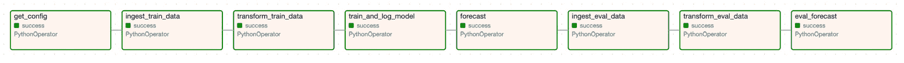

图 9.1：端到端工作流的 Airflow DAG

+   `ts-spark_ch9_data-ml-ops_runall`：这是第二个工作流，如 *图 9.2* 所示，它多次调用前一个工作流，并使用不同的日期范围。它模拟了现实中的情况，其中前一个端到端工作流会在定期间隔（如每日或每周）内启动，并使用新数据。

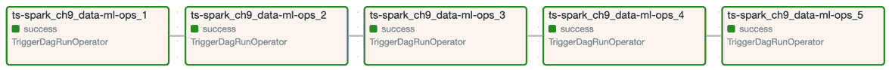

图 9.2：Airflow DAG，多个调用端到端工作流

这些 Airflow DAG 的代码位于 `dags` 文件夹中。它们是用 Python 编写的（`.py` 文件），可以通过文本编辑器或代码编辑器进行可视化查看。

模块化

值得注意的是，在这里的示例中，我们本可以将这些独立任务的所有代码合并成一个大任务。然而，我们将工作流拆分为多个任务，以说明模块化的最佳实践。在实际情况下，这样做有利于独立的代码修改、扩展以及任务的重新执行。不同的团队可能拥有不同任务的所有权。

工作流分离

我们在此示例中演示的工作流，在您自己的实现中可以进一步拆分。例如，通常会将模型训练相关任务、预测和模型评估拆分为各自独立的工作流，并在不同的时间间隔内启动。

我们将在接下来的章节中详细解释每个 DAG 和相关任务，从 `ts-spark_ch9_data-ml-ops_runall` 开始。

## 模拟与运行

如我们在 *图 9.2* 中看到的，`ts-spark_ch9_data-ml-ops_runall` 有五个任务，我们将在此进一步解释这些任务。

`_runall` 工作流的目的是模拟在定期间隔内，训练、预测和评估周期的真实执行过程。在我们的示例中，`_runall` 工作流的每个任务对应一次训练、预测和评估的循环。我们将每个任务称为一次运行，所有任务总共有五次运行，对应 `_runall` 的五个任务。这些任务将在定期的间隔内调度，如每日、每周、每月等。在这里的示例中，我们只是顺序执行它们，一个接一个。

每个任务都使用不同的参数调用 `ts-spark_ch9_data-ml-ops` 工作流。它们如下：

+   `runid`：一个整数，用于标识运行

+   `START_DATE`：用于训练的时间序列数据集的起始日期

+   `TRAIN_END_DATE`：训练数据集中的时间序列结束日期

+   `EVAL_END_DATE`：评估数据集中的时间序列结束日期

不同运行的配置方式是使用一个滑动窗口，其中训练数据为 5 年，评估数据为 1 年。在实际场景中，评估日期范围可能更短，对应于更短的预测期。

运行配置如下：

```py
conf_run1 = {
    'runid':          1,
    'START_DATE':     '1981-01-01',
    'TRAIN_END_DATE': '1985-12-31',
    'EVAL_END_DATE':  '1986-12-31',
}
conf_run2 = {
    'runid':          2,
    'START_DATE':     '1982-01-01',
    'TRAIN_END_DATE': '1986-12-31',
    'EVAL_END_DATE':  '1987-12-31',
}
…
```

任务按以下方式定义，以触发`ts-spark_ch9_data-ml-ops`工作流并将运行配置作为参数传递：

```py
# Define tasks
t1 = TriggerDagRunOperator(
    task_id="ts-spark_ch9_data-ml-ops_1",
    trigger_dag_id="ts-spark_ch9_data-ml-ops",
    conf=conf_run1,
    wait_for_completion=True,
    dag=dag,
)
t2 = TriggerDagRunOperator(
    task_id="ts-spark_ch9_data-ml-ops_2",
    trigger_dag_id="ts-spark_ch9_data-ml-ops",
    conf=conf_run2,
    wait_for_completion=True,
    dag=dag,
)
…
```

任务随后按以下顺序依次启动：

```py
t1 >> t2 >> t3 >> t4 >> t5
```

您可以从 Airflow DAG 视图中启动此`ts-spark_ch9_data-ml-ops_runall` Airflow DAG，如*图 9.3*所示，通过点击绿色突出显示的运行按钮（**>**）。

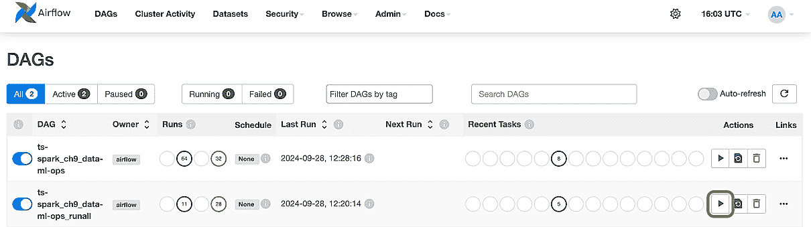

图 9.3：运行 Airflow DAG

本 DAG 的结果可以在*图 9.2*中看到，显示了各个任务的状态。

现在我们将讨论这些任务的细节，正如我们所见，它们使用不同的参数调用`ts-spark_ch9_data-ml-ops`工作流。我们从第一个步骤`get_config`开始，它负责处理这些参数。

## 配置

`ts-spark_ch9_data-ml-ops`工作流中的第一个任务是`t0`，它调用`get_config`函数来获取运行工作流所需的配置。这些配置作为参数传递给工作流。正如前面提到的，它们是运行标识符和时间序列数据的日期范围，工作流将基于这些范围运行。我们将看到它们在随后的任务中是如何使用的。

定义任务`t0`的代码如下：

```py
t0 = PythonOperator(
    task_id='get_config',
    python_callable=get_config,
    op_kwargs={'_vars': {
        'runid': "{{ dag_run.conf['runid'] }}",
        'START_DATE': "{{ dag_run.conf['START_DATE'] }}",
        'TRAIN_END_DATE': "{{ dag_run.conf['TRAIN_END_DATE'] }}",
        'EVAL_END_DATE': "{{ dag_run.conf['EVAL_END_DATE'] }}",
        },
    },
    provide_context=True,
    dag=dag,
)
```

`get_config`函数由任务`t0`调用，其代码如下：

```py
def get_config(_vars, **kwargs):
    print(f"dag_config: {_vars}")
    return _vars variable for use by subsequent tasks.
We can see the status of the task in the DAG view in Airflow as per *Figure 9**.1*.
Data ingestion and storage
At this step, after completion of the `t0` task, the `t1` task is launched by Airflow. It calls the `ingest_train_data` function to ingest the training data from the input CSV file as specified by the `DATASOURCE` variable. In this example, as it is a relatively small file, we ingest the full file every time. You will likely ingest only new data points incrementally at this stage.
The code for this step is as follows:

```

def ingest_train_data(_vars, **kwargs):

sdf = spark.read.csv(

DATASOURCE, header=True, inferSchema=True

)

sdf = sdf.filter(

(F.col('date') >= F.lit(_vars['START_DATE'])) &

(F.col('date') <= F.lit(_vars['TRAIN_END_DATE']))

)

data_ingest_count = sdf.count()

sdf.write.format("delta").mode("overwrite").save(

f"/data/delta/ts-spark_ch9_bronze_train_{_vars['runid']}"

)

_vars['train_ingest_count'] = data_ingest_count

return _vars

```py

 The data is ingested using Spark, with the `spark.read.csv` function, into a Spark DataFrame. We then filter the data for the range of dates that fall within the training dataset as per the `START_DATE` and `TRAIN_END_DATE` parameters.
We want to be able to later report on how much data we ingest every time. To enable this, we count the number of rows in the DataFrame.
Finally, in this task, we persist the ingested data with the `write` function to disk storage in `delta` format for use by the next steps of the workflow. As we will parallelize the workflow tasks in the future, and to avoid multiple parallel writes to the same disk location, we store the data for this specific run in its own table appended with `runid`. Note as well how we used the term `bronze` in the name. This corresponds to the **medallion** approach, which we discussed in the *Data processing and storage* section of *Chapter 4*. Persisting the data to storage at this stage can come in handy when we are ingesting a lot of data. This makes it possible in the future to change and rerun the rest of the pipeline without having to re-ingest the data.
The status of the task is visible in the DAG view in Airflow as per *Figure 9**.1*.
With the data ingested from the source and persisted, we can move on to the data transformation stage.
Data transformations
This stage corresponds to Airflow task `t2`, which calls the `transform_train_data` function. As its name suggests, this function transforms the training data into the right format for the upcoming training stage.
The code for this step is as follows:

```

def transform_train_data(_vars, **kwargs):

sdf = spark.read.format("delta").load(

f"/data/delta/ts-spark_ch9_bronze_train_{_vars['runid']}"

)

sdf = sdf.selectExpr(

"date as ds",

"cast(daily_min_temperature as double) as y"

)

sdf = sdf.dropna()

data_transform_count = sdf.count()

sdf.write.format("delta").mode("overwrite").save(

f"/data/delta/ts-spark_ch9_silver_train_{_vars['runid']}"

)

_vars['train_transform_count'] = data_transform_count

return _vars

```py

 We first read the data from `bronze`, where it was stored by the previous task, `t1`. This stored data can then be used as input to run the current task.
In this example, we do the following simple transformations:

*   Column level: Rename the `date` column as `ds`
*   Column level: Change `daily_min_temperature` to the double data type (the `cast` function) and rename it as `y`
*   DataFrame level: Remove all rows with missing values using the `dropna` function

As in the previous stage, we want to collect metrics specific to this stage so that we can later report on the transformations. To do this, we count the number of rows in the DataFrame after the transformations.
Note
This stage is likely to include several data checks and transformations, as discussed in the *Data quality checks, cleaning, and transformations* section of *Chapter 5*.
Finally, in this task, we persist the ingested data with the `write` function to disk storage in `delta` format for use by the next steps of the workflow. We call this data stage `silver`, as per the medallion approach explained previously.
Similarly to the previous tasks, we can see the task’s status in the DAG view in Airflow, as per *Figure 9**.1*.
With the data curated and persisted, we can move on to the model training stage.
Model training and validation
This stage is the longest in our example and corresponds to Airflow task `t3`, which calls the `train_and_log_model` function. This function trains and validates a Prophet forecasting model using the training data from the previous stage. As we saw in *Chapter 7*, choosing the right model involves a whole process, which we have simplified here to a minimum.
The code extract for this step is as follows:

```

def train_and_log_model(_vars, **kwargs):

sdf = spark.read.format("delta").load(

f"/data/delta/ts-spark_ch9_silver_train_{_vars['runid']}"

)

pdf = sdf.toPandas()

mlflow.set_experiment(

'ts-spark_ch9_data-ml-ops_time_series_prophet_train'

)

mlflow.start_run()

mlflow.log_param("DAG_NAME", DAG_NAME)

mlflow.log_param("TRAIN_START_DATE", _vars['START_DATE'])

…

mlflow.log_metric(

'train_ingest_count', _vars['train_ingest_count'])

…

model = Prophet().fit(pdf)

…

cv_metrics_name = [

"mse", "rmse", "mae", "mdape", "smape", "coverage"]

cv_params = cross_validation(

…

)

_cv_metrics = performance_metrics(cv_params)

cv_metrics = {

n: _cv_metrics[n].mean() for n in cv_metrics_name}

…

signature = infer_signature(train, predictions)

mlflow.prophet.log_model(

model, artifact_path=ARTIFACT_DIR,

signature=signature, registered_model_name=model_name,)

mlflow.log_params(param)

mlflow.log_metrics(cv_metrics)

…

mlflow.end_run()

return _vars

```py

 In this code example, we do the following:

1.  We first read the data from `silver`, where it was stored by the previous task, `t2`. Then, we can run the current task using the stored data as input.
2.  MLflow Tracking Server is used to save all the parameters and metrics for each run. We group them under an experiment called `ts-spark_ch9_data-ml-ops_time_series_prophet_train` and use `log_param` and `log_metric` functions to capture the parameters and metrics gathered so far in the run.
3.  We then train the Prophet model with the training data using the `fit` function.
4.  As a model validation step, we use the `cross_validation` function and retrieve the corresponding metrics with the `performance_metrics` function.
5.  The final step is to log the model to the MLflow Model Registry, using the `log_model` function, and all the related training and validation metrics with MLflow. Note that we log the model signature as a best practice to document the model in the MLflow Model Registry.

We can see the task’s status in the DAG view in Airflow, as per *Figure 9**.1*. The logged parameters and metrics are visible in MLflow Tracking server, as shown in *Figure 9**.4*.
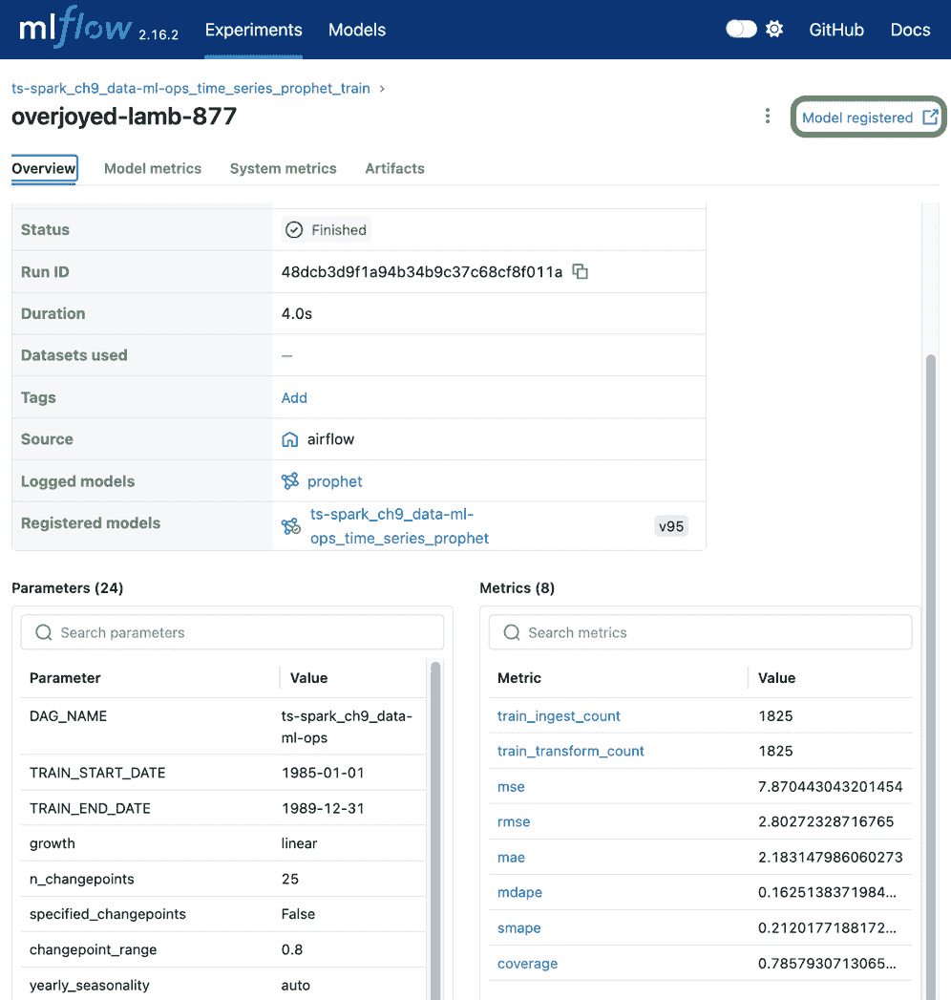

Figure 9.4: MLflow experiment tracking (training)
The model saved in the MLflow Model Registry is shown in *Figure 9**.5*.
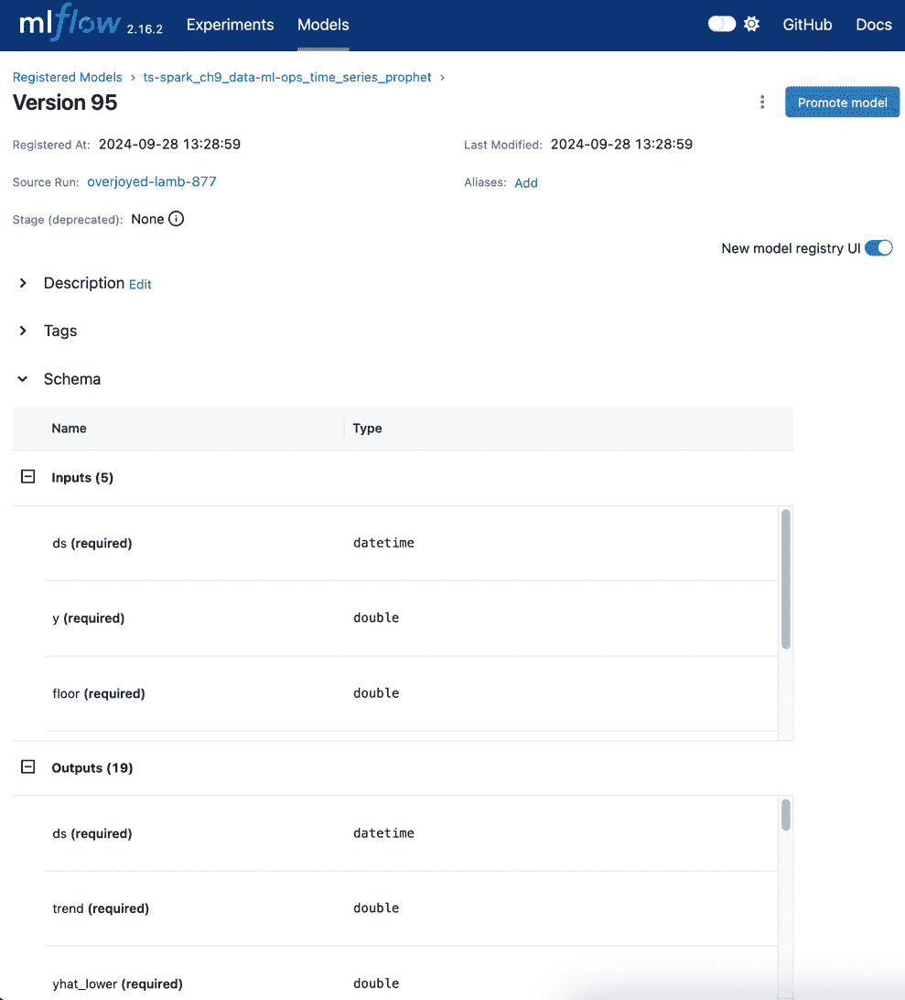

Figure 9.5: MLflow Model Registry
After the conclusion of the model training stage, we can progress to the next stage, where we will use the trained model to do forecasting.
Forecasting
This stage corresponds to Airflow task `t4`, which calls the `forecast` function. As its name suggests, this function infers future values of the time series. While we have this task in the same workflow as the prior training tasks, it is common for the forecasting task to be in a separate inferencing pipeline. This separation allows for scheduling the training and inferencing at different times.
The code for this step is as follows:

```

def forecast(_vars, **kwargs):

# Load the model from the Model Registry

model_uri = f"models:/{model_name}/{model_version}"

_model = mlflow.prophet.load_model(model_uri)

forecast = _model.predict(

_model.make_future_dataframe(

periods=365, include_history = False))

sdf = spark.createDataFrame(forecast[

['ds', 'yhat', 'yhat_lower', 'yhat_upper']])

sdf.write.format("delta").mode("overwrite").save(

f"/data/delta/ts-spark_ch9_gold_forecast_{_vars['runid']}")

print(f"forecast:\n${forecast.tail(30)}")

mlflow.end_run()

return _vars

```py

 We first load the model from the model registry, where it was stored by the previous task, `t3`. This model can then be used for forecasting in the current task.
In this example, we want to generate a forecast for 365 days in advance by calling the following:

*   The `make_future_dataframe` function to generate the future period
*   The `predict` function to forecast for these future times

Another approach to generating the future period is to get this as input from the user or another application calling the model. As for the 365-day forecasting horizon, this is a relatively long time to forecast. We discussed in the *Forecasting* section of *Chapter 2* how a shorter forecasting horizon is likely to yield better forecasting accuracy. We have used a long period in this example for practical reasons to showcase forecasting over a 5-year period, with 5 runs of 365 days each. These runs were explained in the earlier *Simulation and runs* section. Moving beyond the requirement of the example here, keep the forecasting horizon shorter relative to the span of the training dataset and the level of granularity.
Finally, in this task, we persist the forecasted data with the `write` function to disk storage in `delta` format for use by the next steps of the workflow. We call this data stage `gold` as per the medallion approach explained previously. This delta table, where the forecasting outcome is stored, is also known as the inference table.
With the forecasts persisted, we can move on to the model evaluation stage.
Model evaluation
This stage corresponds to Airflow tasks `t5`, `t6`, and `t7`, which call the `ingest_eval_data`, `transform_eval_data`, and `eval_forecast` functions respectively.
Note
In a production environment, we want to monitor the accuracy of our model’s forecast against real data so that we can detect when the model is not accurate enough and needs retraining. In the example here, we have these tasks in the same workflow as the prior forecasting task to keep the example simple enough to fit within this chapter. These tasks will be a separately scheduled workflow, which will be executed a posteriori of the event being forecasted. In the example, we are simulating the post-event evaluation by using the data points following the training data.
The `ingest_eval_data` and `transform_eval_data` functions are very similar to the `ingest_train_data` and `transform_train_data` functions, which we have seen in the previous sections. The main difference, as the name suggests, is that they operate on the evaluation and training data respectively.
We will focus on the `eval_forecast` function in this section, with the code extract as follows:

```

def eval_forecast(_vars, **kwargs):

sdf = spark.read.format("delta").load(

f"/data/delta/ts-spark_ch9_silver_eval_{_vars['runid']}")

sdf_forecast = spark.read.format("delta").load(

f"/data/delta/ts-spark_ch9_gold_forecast_{_vars['runid']}")

sdf_eval = sdf.join(sdf_forecast, 'ds', "inner")

…

evaluator = RegressionEvaluator(

labelCol='y', predictionCol='yhat', metricName='rmse')

eval_rmse = evaluator.evaluate(sdf_eval)

…

mlflow.set_experiment('ts-spark_ch9_data-ml-ops_time_series_prophet_eval')

mlflow.start_run()

mlflow.log_param("DAG_NAME", DAG_NAME)

mlflow.log_param("EVAL_START_DATE", _vars['START_DATE'])

…

mlflow.log_metric('eval_rmse', _vars['eval_rmse'])

mlflow.end_run()

return _vars

```py

 In this code example, we do the following:

1.  We first read the evaluation data from `silver`, where it was stored by the previous task, `t6`. We also read the forecasted data from `gold`, where it was stored earlier by the forecasting task, `t4`. We join both datasets with the `join` function so that we can compare the forecasts to the actuals.
2.  In this example, we use `RegressionEvaluator` from the `pyspark.ml.evaluation` library is used to do the calculation.
3.  As a final step, MLflow Tracking Server is used to save all the parameters and metrics for each run. We group them under an experiment called `ts-spark_ch9_data-ml-ops_time_series_prophet_eval` and use the `log_param` and `log_metric` functions to capture the parameters and metrics gathered so far in the run.

We can see the task’s status in the DAG view in Airflow, as per *Figure 9**.1*. The logged parameters and metrics are visible in MLflow Tracking Server, as shown in *Figure 9**.6*.
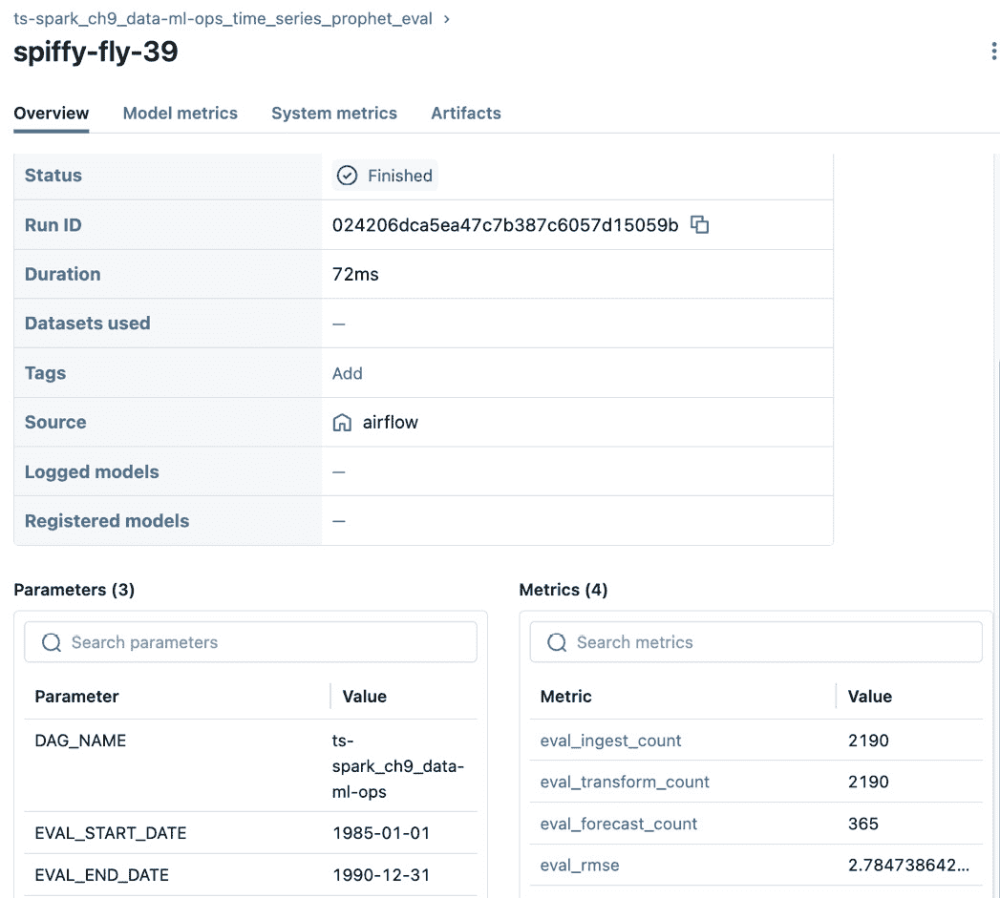

Figure 9.6: MLflow experiment tracking (evaluation)
As with the training experiment tracking shown in *Figure 9**.4*, we can see in the evaluation experiment in *Figure 9**.6* the ingest, transform, and forecast data counts, as well as the evaluation RMSE.
With this concluding the model evaluation stage, we have seen the end-to-end workflow example. In the next section, we will cover the monitoring and reporting part of the example.
Monitoring and reporting
The workflows we covered in the previous section are the backend processes in our end-to-end time series analysis example. In this section, we will cover the operational monitoring of the runs and the end user reporting of the forecasting outcome.
Monitoring
The work to collect the metrics has been done as part of the code executed by the workflows we have seen in this chapter. Our focus in this section is on the visualizations to monitor the workflows and the metrics.
Workflow
Starting with the workflow, as we have seen in *Figures 9.1* and *9.2*, the Airflow DAG shows the status of the runs. In case a task fails, as shown in *Figure 9**.7*, we can select the failed task in Airflow and inspect the event log and logs to troubleshoot.
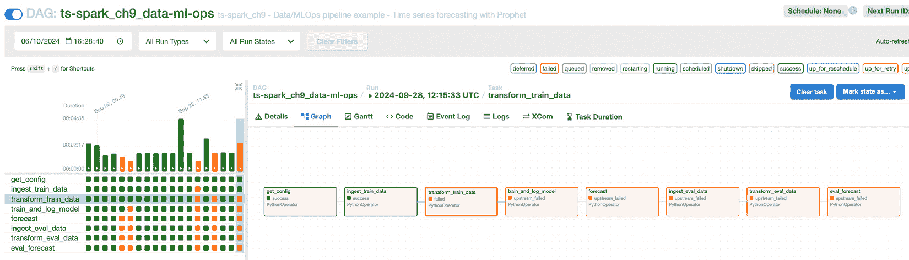

Figure 9.7: Airflow DAG with failed task
Training
We can visualize the training metrics for a specific run in MLflow Tracking Server, as shown in *Figure 9**.4*. We can also monitor the metrics across multiple runs and compare them in a table, as per *Figure 9**.8*.
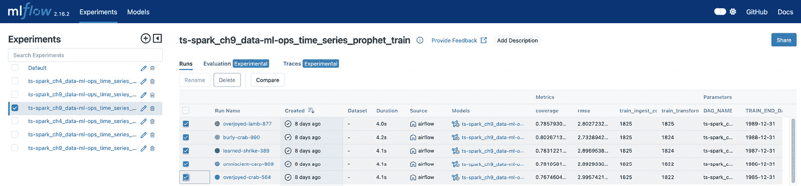

Figure 9.8: MLflow experiments (training) – select and compare
By selecting the five runs of our `_runall` workflow and clicking on the **Compare** button as in *Figure 9**.8*, we can create a scatter plot as per *Figure 9**.9*. This allows us to see the details for a specific run as well by hovering the mouse pointer over a data point in the graph.
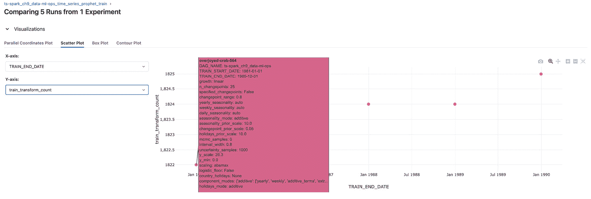

Figure 9.9: Training – plot by runs with details
An interesting metric to monitor is the count of training data transformed and ready for training, as per *Figure 9**.10*. We can see here that the first four runs had fewer data points for training than the last run.
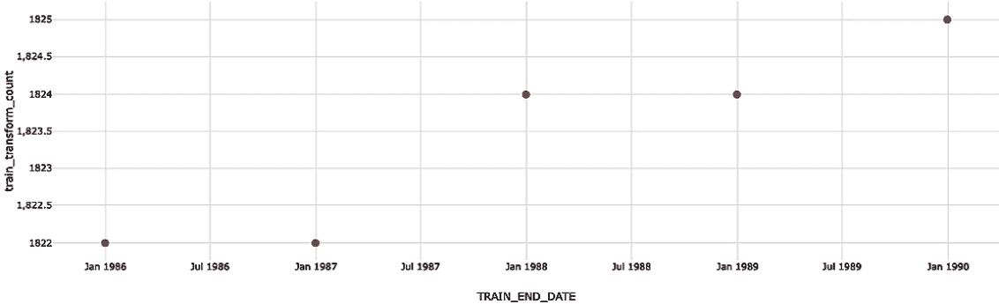

Figure 9.10: Training – transform count by runs
We can similarly monitor the RMSE for each training run, as per *Figure 9**.11*. We can see here that the model accuracy has improved (lower RMSE) in the last two runs. If the accuracy had dropped instead, then the question from an operational point of view would have been whether this drop is acceptable or there is a need to develop another model. In this situation, this decision is dependent on your specific requirement and what was agreed as an acceptable drop in accuracy.
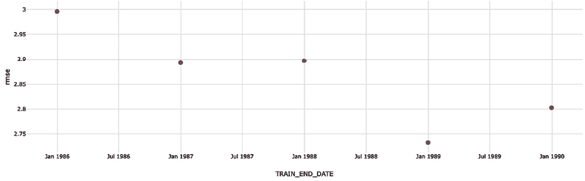

Figure 9.11: Training – RMSE by runs
After the model has been trained and is used for forecasting, we can evaluate the model’s forecasted values against actuals. We will cover the monitoring of the evaluation metrics next.
Evaluation
We can visualize the evaluation metrics for a specific run in MLflow Tracking Server, as shown in *Figure 9**.6*. We can also monitor the metrics across multiple runs and compare them in a table, as per *Figure 9**.12*.
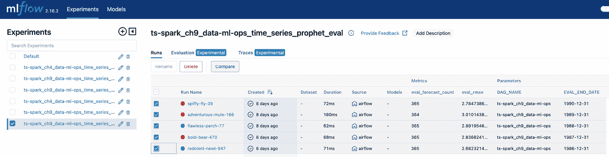

Figure 9.12: MLflow experiments (evaluation) – select and compare
By selecting the five runs of our `_runall` workflow and clicking on the **Compare** button as in *Figure 9**.12*, we can create a scatter plot as per *Figure 9**.13*. This allows us to also see the details for a specific run by hovering the mouse pointer over a data point in the graph.
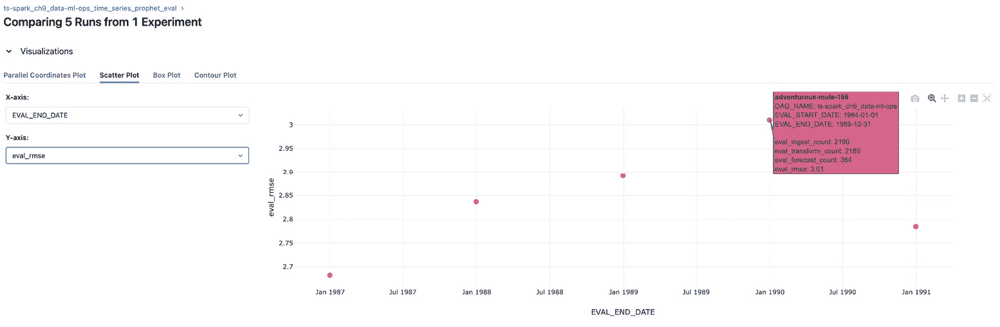

Figure 9.13: Evaluation – RMSE by runs with details
An interesting metric to monitor is the count of forecasted data points, as per *Figure 9**.14*. We can see here that all the runs had the expected number of data points, except the fourth run, having one less. This can be explained by the fact that the evaluation dataset missed one data point during this time period.
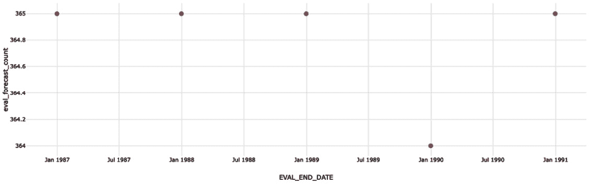

Figure 9.14: Evaluation – forecast count by runs
We can similarly monitor the RMSE for each evaluation run, as per *Figure 9**.13*. We can see here that the model accuracy dropped gradually (higher RMSE) until the fourth run and then improved in the last run. If the drop had persisted instead, the question from an operational point of view would have been whether this drop is acceptable or there is a need to develop another model. This decision is dependent on your specific requirement and what has been agreed as an acceptable drop in accuracy.
This concludes the section on monitoring. While using MLflow was sufficient for the example here, most organizations have dedicated monitoring solutions into which MLflow metrics can be integrated. These solutions also include alerting capabilities, which we have not covered here.
We have explored the process to reach an outcome so far, but have not seen the outcome yet. In the next section, we will report on the forecasting outcome.
Reporting
We will use a Jupyter notebook in this example to create a set of graphs to represent the forecasting outcome. The `ts-spark_ch9_data-ml-ops_results.ipynb` notebook can be accessed from the local web location, as shown in *Figure 9**.15*. This Jupyter environment was deployed as part of the *Environment* *setup* section.
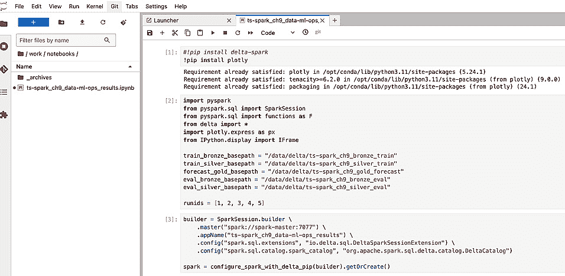

Figure 9.15: Reporting – notebook to create a graph
After running the notebook, we can see at the end of the notebook the graph, as per *Figure 9**.16*, of the forecasts (gray lines) and actuals (scatter plot) for the different runs. The forecast captures the seasonality well, and most of the actuals fall within the uncertainty intervals, which are set at 80% by default on Prophet.
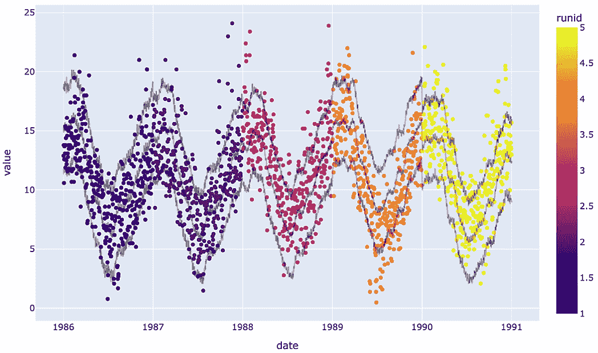

Figure 9.16: Reporting – actuals (scatter plot) compared to forecasts (gray lines)
We can zoom into specific runs as per *Figures 9.17* and *9.18*. These match with the RMSE values we saw in the earlier *Monitoring* section, as we will detail next.
As we can see in *Figure 9**.13*, the first run had the lowest RMSE. This is reflected in *Figure 9**.17*, with most actuals falling within the forecasting interval.
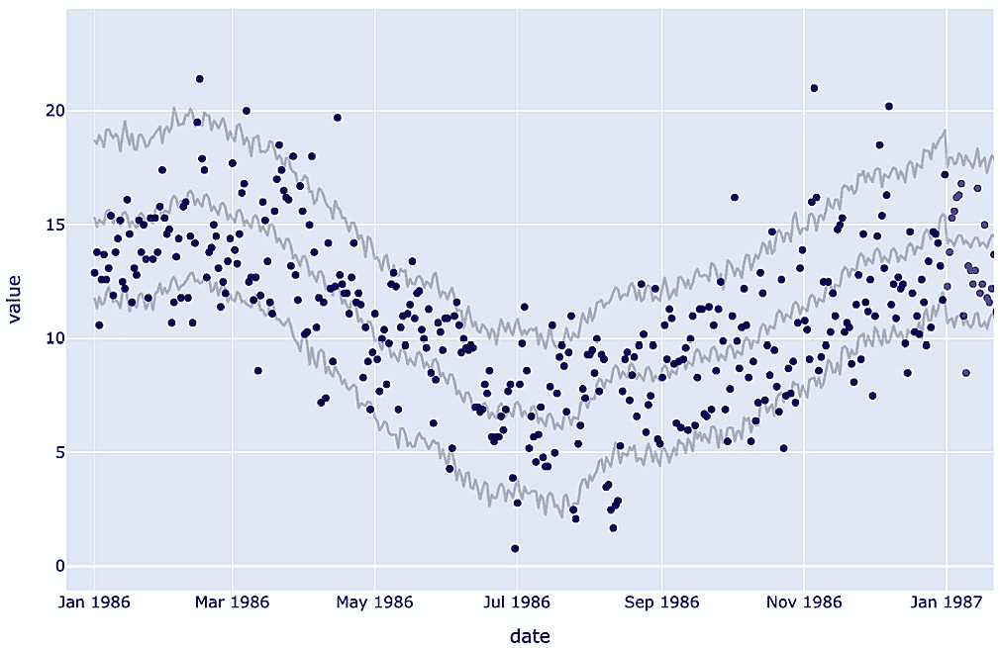

Figure 9.17: Reporting – actuals compared to forecasts (run with lowest RMSE)
In *Figure 9**.13*, the fourth run had the highest RMSE. This is reflected in *Figure 9**.18*, with many more actuals than in the first run falling outside the forecasting interval.
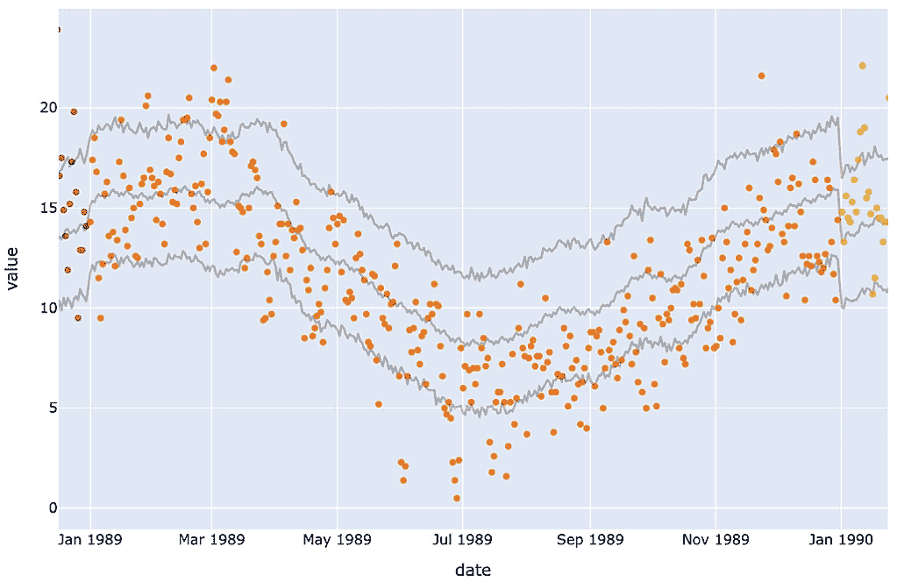

Figure 9.18: Reporting – actuals compared to forecasts (run with highest RMSE)
At this point, the output of the Jupyter notebook can be exported as a report in several formats, such as HTML or PDF. While using Jupyter was sufficient for the example here, most organizations have reporting solutions into which the forecasting outcome can be integrated.
Additional considerations
We will discuss here some of the additional considerations that apply when going to production, in addition to what we already covered in the example in this chapter.
Scaling
We covered scaling extensively in *Chapter 8*. The environment and workflows in this chapter can be scaled as well. At a high level, this can be achieved in the following ways:

*   Airflow server: scale up by adding more CPU and memory resources
*   Airflow DAG: run the tasks in parallel
*   Spark cluster: scale up by adding more CPU and memory resources
*   Spark cluster: scale out by adding more workers
*   Model: use Spark-enabled models or parallelize the use of pandas, as discussed in the previous chapter

You can find more information about Airflow DAGs, including parallel tasks, here: [`airflow.apache.org/docs/apache-airflow/stable/core-concepts/dags.html`](https://airflow.apache.org/docs/apache-airflow/stable/core-concepts/dags.html)
To relate this to our Airflow DAG example in this chapter, we defined the tasks as sequential in the following way in the code for `ts-spark_ch9_data-ml-ops_runall`:

```

t1 >> t2 >> t3 >> t4 >> t5

```py

 The code to run tasks `t3` and `t4` in parallel is as follows:

```

t1 >> t2 >> [t3, t4] >> t5

```py

 With regard to the considerations for scaling the Spark cluster, refer to *Chapter 3* and, more specifically, the *Driver and worker nodes* section, for a detailed discussion.
Model retraining
We already included retraining in our example workflow at every run using a sliding window of the most recent data. In practice, and to optimize resource utilization, the retraining can be scheduled at a less frequent interval in its own separate workflow. We discussed tracking the model’s accuracy metrics across runs of the workflow in the *Monitoring* section. The trigger of this retraining workflow can be based on the accuracy dropping below a predefined threshold. The appropriate value for the threshold depends on your specific requirements.
Governance and security
In *Chapter 4*, in the *From DataOps to ModelOps to DevOps* section, we discussed the considerations for governance and security at various points. Securing your environment and production rollout is beyond the scope of this book. As these are key requirements, and we will not be going into further details here, we highly recommend referring to the following resources to secure the components used in our example:

  **Apache Spark**
 |
  [`spark.apache.org/docs/latest/security.html`](https://spark.apache.org/docs/latest/security.html)
 |

  **MLflow**
 |
  [`mlflow.org/docs/latest/auth/index.html`](https://mlflow.org/docs/latest/auth/index.html)
[`github.com/mlflow/mlflow/security`](https://github.com/mlflow/mlflow/security)
 |

  **Airflow**
 |
  [`airflow.apache.org/docs/apache-airflow/stable/security/index.html`](https://airflow.apache.org/docs/apache-airflow/stable/security/index.html)
 |

  **Jupyter**
 |
  [`jupyter.org/security`](https://jupyter.org/security)
 |

  **Docker**
 |
  [`www.docker.com/blog/container-security-and-why-it-matters/`](https://www.docker.com/blog/container-security-and-why-it-matters/)
 |

  **Unity Catalog**
 |
  [`www.unitycatalog.io/`](https://www.unitycatalog.io/)
 |

Table 9.1: Resources on security and governance for components in use
This concludes the section on the additional considerations before going to production.
Summary
In this chapter, we focused on the crucial phase of moving projects into production, especially given the challenges many projects face in achieving this transition and delivering measurable business results. We saw an example of an end-to-end workflow, covering the stages of data ingestion, storage, data transformations, model training and validation, forecasting, model evaluation, and monitoring. With this example, we brought together what we have learned in this book in view of planning for a production rollout.
In the next chapter, we will explore how to go further with Apache Spark for time series analysis by leveraging the advanced capabilities of a managed cloud platform for data and AI.
Join our community on Discord
Join our community’s Discord space for discussions with the authors and other readers:
[`packt.link/ds`](https://packt.link/ds)
.jpg)

```
