# 第十章：进一步了解 Apache Spark

在上一章中，我们利用开源组件将时间序列分析投入生产。这需要大量的努力来设置和管理平台。在本章中，我们将通过使用 Databricks 作为基于云的托管**平台即服务**（**PaaS**）解决方案，进一步利用 Apache Spark。我们将使用一个基于 Databricks 构建的端到端时间序列分析示例，采用先进的功能，如 Delta Live Tables 结合流处理管道、AutoML、Unity Catalog 和 AI/BI 仪表盘。

本章将介绍以下主要内容：

+   Databricks 组件和设置

+   工作流

+   监控、安全性和治理

+   用户界面

# 技术要求

在本章中，我们将通过代码示例，探索如何在 Databricks 上部署一个可扩展的端到端时间序列分析解决方案，从下一节的环境设置开始。

本章的代码位于以下网址：

[`github.com/PacktPublishing/Time-Series-Analysis-with-Spark/tree/main/ch10`](https://github.com/PacktPublishing/Time-Series-Analysis-with-Spark/tree/main/ch10)

# Databricks 组件和设置

我们将使用 Databricks 环境，如在*第八章*中所述，作为平台基础设施。请按照*第八章*中的*技术要求*部分的说明来设置 Databricks 环境。

## 工作区、文件夹和笔记本

环境设置完成后，请按照此处提供的链接中的说明导入笔记本：

1.  浏览 Databricks 工作区：[`docs.databricks.com/en/workspace/index.html`](https://docs.databricks.com/en/workspace/index.html)

1.  创建一个名为`ts_spark`的文件夹，以及一个名为`ch10`的子文件夹：[`docs.databricks.com/en/workspace/workspace-objects.html#folders`](https://docs.databricks.com/en/workspace/workspace-objects.html#folders)

1.  将本示例的笔记本导入到`ch10`文件夹中：[`docs.databricks.com/en/notebooks/notebook-export-import.html#import-a-notebook`](https://docs.databricks.com/en/notebooks/notebook-export-import.html#import-a-notebook)

    总共有八个笔记本，它们可以从以下网址导入：

    +   [`github.com/PacktPublishing/Time-Series-Analysis-with-Spark/raw/main/ch10/ts_spark_ch10_dlt_features.dbc`](https://github.com/PacktPublishing/Time-Series-Analysis-with-Spark/raw/main/ch10/ts_spark_ch10_dlt_features.dbc)

    +   [`github.com/PacktPublishing/Time-Series-Analysis-with-Spark/raw/main/ch10/ts_spark_ch10_evaluate_forecast.dbc`](https://github.com/PacktPublishing/Time-Series-Analysis-with-Spark/raw/main/ch10/ts_spark_ch10_evaluate_forecast.dbc)

    +   [`github.com/PacktPublishing/Time-Series-Analysis-with-Spark/raw/main/ch10/ts_spark_ch10_generate_forecast.dbc`](https://github.com/PacktPublishing/Time-Series-Analysis-with-Spark/raw/main/ch10/ts_spark_ch10_generate_forecast.dbc)

    +   [`github.com/PacktPublishing/Time-Series-Analysis-with-Spark/raw/main/ch10/ts_spark_ch10_model_training.dbc`](https://github.com/PacktPublishing/Time-Series-Analysis-with-Spark/raw/main/ch10/ts_spark_ch10_model_training.dbc)

    +   [`github.com/PacktPublishing/Time-Series-Analysis-with-Spark/raw/main/ch10/ts_spark_ch10_model_training_automl.dbc`](https://github.com/PacktPublishing/Time-Series-Analysis-with-Spark/raw/main/ch10/ts_spark_ch10_model_training_automl.dbc)

    +   [`github.com/PacktPublishing/Time-Series-Analysis-with-Spark/raw/main/ch10/ts_spark_ch10_reset.dbc`](https://github.com/PacktPublishing/Time-Series-Analysis-with-Spark/raw/main/ch10/ts_spark_ch10_reset.dbc)

    +   [`github.com/PacktPublishing/Time-Series-Analysis-with-Spark/raw/main/ch10/ts_spark_ch10_update_data.dbc`](https://github.com/PacktPublishing/Time-Series-Analysis-with-Spark/raw/main/ch10/ts_spark_ch10_update_data.dbc)

    +   [`github.com/PacktPublishing/Time-Series-Analysis-with-Spark/raw/main/ch10/ts_spark_ch10_update_model.dbc`](https://github.com/PacktPublishing/Time-Series-Analysis-with-Spark/raw/main/ch10/ts_spark_ch10_update_model.dbc)

导入笔记本后，我们可以接下来设置集群。

## 集群

我们可以为集群使用 Databricks **机器学习运行时**（**MLR**）或无服务器计算。

MLR 集群预加载了用于**机器学习**（**ML**）的常见库。它在你的云提供商账户中实例化虚拟机。云提供商将向你收取虚拟机的费用。在创建集群时，选择一个小型实例，配备最小的 CPU 和内存，以最小化此费用。对于本章的示例，这样就足够了。请参阅*第八章*中关于设置 Databricks 集群的*技术要求*部分。

MLR 集群具有 AutoML 示例所需的库，我们将在后续部分中讲解。如果你不想为相关虚拟机产生 MLR 相关的云提供商费用，可以跳过该示例的代码执行。我们将提供一个不使用 AutoML 的替代工作流。

注意

在撰写本文时，这些虚拟机的云提供商费用已超出免费云提供商试用账户提供的免费额度。这意味着你需要升级到付费云提供商账户，费用将通过你在创建账户时指定的信用卡进行扣费。虚拟机和云基础设施的费用并不包含在免费的 Databricks 试用账户内。

无服务器集群已包含在您的 Databricks 费用中，因为底层虚拟机由 Databricks 完全管理。这意味着它不会产生额外的云服务商费用。然而，无服务器集群在写作时需要安装 ML 库，正如您在代码示例中所看到的。未来，Databricks 可能会提供预加载 ML 库的无服务器集群。

注意

Databricks 已开始在写作时将无服务器功能包含在免费试用账户中。这意味着如果在 Databricks 免费试用账户的时间和费用限制内，您使用无服务器集群执行本章代码将是免费的。未来此政策可能会有所变化。

您可以在以下资源中找到更多关于 MLR 和无服务器集群的信息：

+   [`docs.databricks.com/en/machine-learning/databricks-runtime-ml.html`](https://docs.databricks.com/en/machine-learning/databricks-runtime-ml.html)

+   [`docs.databricks.com/en/compute/serverless/index.html`](https://docs.databricks.com/en/compute/serverless/index.html)

在涵盖集群之后，我们将接下来使用 Delta Live Tables 配置数据管道。

## 使用 Delta Live Tables 进行流处理

Databricks **Delta Live Tables**（**DLT**）是一个低代码声明式的数据管道构建解决方案。在我们的示例中，我们将使用 DLT 构建特征工程管道，从源文件获取数据，检查数据质量，并将其转换为可以用于训练时间序列模型的特征。您可以在以下链接中找到更多关于 DLT 的信息：

[`www.databricks.com/discover/pages/getting-started-with-delta-live-tables`](https://www.databricks.com/discover/pages/getting-started-with-delta-live-tables)

我们将在*实施* *工作流*部分深入探讨 DLT 配置的细节。

## 工作流

Databricks 工作流相当于我们在*第四章*和*第九章*中使用的 Airflow DAGs。您可以在以下链接中找到更多关于工作流，也称为**任务**的信息：

[`docs.databricks.com/en/jobs/index.html`](https://docs.databricks.com/en/jobs/index.html)

我们接下来将深入探讨*任务*配置的细节。

# 实施工作流

本章的代码示例包括四个工作流。这些工作流在 Databricks 中作为任务实现。查看任务的最佳方式是通过 Databricks 中的**工作流** > **任务** > **任务**视图，参考*图 10.1*、*10.2*、*10.3*和*10.4*。

任务如下：

+   `ts-spark_ch10_1a_ingest_and_train` – 该任务用于数据摄取、特征工程和模型训练，显示在*图 10.1*中。它包括以下任务：

    +   `reset`

    +   `dlt_features`

    +   `model_training`

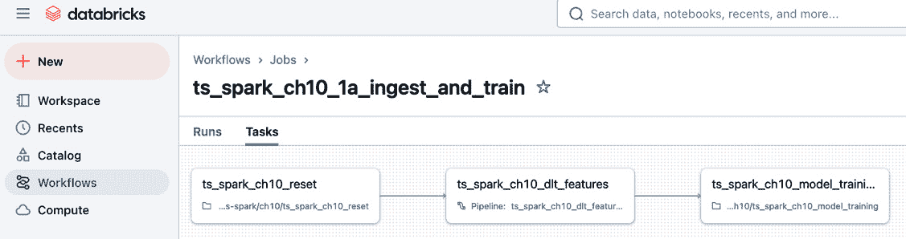

图 10.1：数据摄取、特征工程和模型训练任务

+   `ts-spark_ch10_1b_ingest_and_train_automl` – 第二个作业，如*图 10**.2*所示，是第一个作业的另一个版本，区别在于使用了 AutoML，具体内容将在*使用 AutoML 训练*部分进行解释。

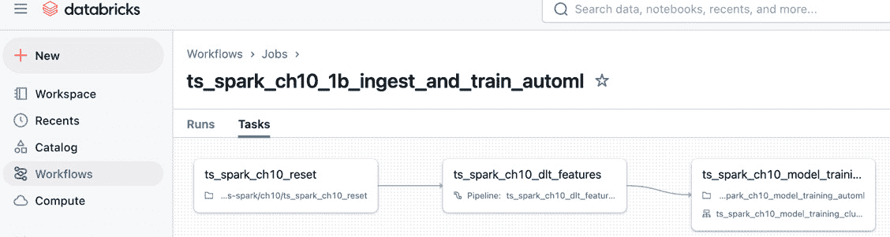

图 10.2：数据摄取、特征工程和模型训练（AutoML）作业

+   `ts-spark_ch10_2b_ingest_and_forecast` – 该作业用于摄取新数据、重新训练模型，并生成和评估预测，如*图 10**.3*所示。它包括以下任务。

    +   `dlt_features`

    +   `update_model`

    +   `generate_forecast`

    +   `update_data`

    +   `evaluate_forecast`

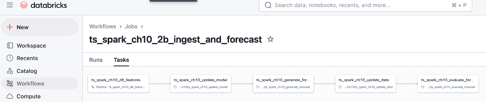

图 10.3：摄取新数据、重新训练模型并生成预测作业

+   `ts-spark_ch10_2a_update_iteration` – 如*图 10**.4*所示，该作业多次调用前一个作业以摄取新数据。它模拟了现实世界中的情境，即以固定时间间隔（例如每日或每周）启动前一个端到端工作流，并处理新数据。

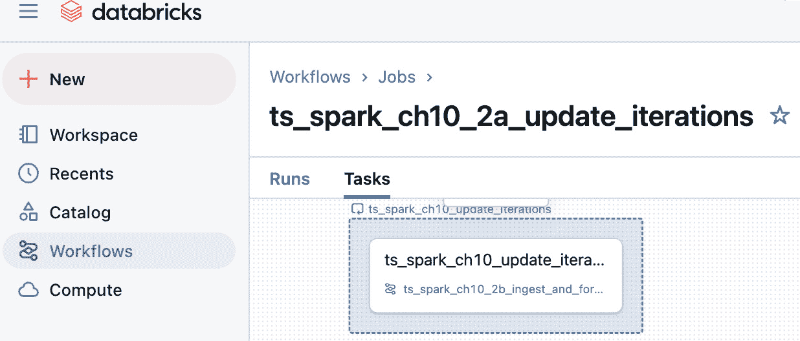

图 10.4：多次调用摄取和处理新数据作业

模块化和任务分离

与*第九章*一样，我们将作业拆分为多个任务，以展示模块化的最佳实践。这有助于独立修改代码、扩展和任务重跑。任务的所有权可以由不同的团队负责。根据您的需求，您可以进一步拆分这些作业，以便分别启动任务。

我们将在接下来的章节中详细解释每个作业和相关任务，从摄取和训练作业开始。

要设置本章所需的作业，请按照以下链接中的说明创建作业并配置任务：

+   [`docs.databricks.com/en/jobs/configure-job.html#create-a-new-job`](https://docs.databricks.com/en/jobs/configure-job.html#create-a-new-job)

+   [`docs.databricks.com/en/jobs/configure-task.html#configure-and-edit-databricks-tasks`](https://docs.databricks.com/en/jobs/configure-task.html#configure-and-edit-databricks-tasks)

请参考接下来的章节中的表格，查看创建作业和相关任务时的配置，并将`<USER_LOGIN>`替换为您自己的 Databricks 用户登录。

## 摄取和训练

`ts-spark_ch10_1a_ingest_and_train`作业，如*图 10**.1*所示，将在本节中详细介绍。

*表 10.1* 显示了`ts_spark_ch10_1a_ingest_and_train`作业的配置，您可以在之前提供的 URL 中按照说明使用。请注意，为简便起见，我们给每个任务起了与其运行的代码笔记本或管道相同的名称。

| **作业** | `ts_spark_ch10_1a_ingest_and_train` |
| --- | --- |
| **任务 1** | 任务名称 | `ts_spark_ch10_reset` |
|  | 类型 | 笔记本 |
|  | 来源 | 工作空间 |
|  | 路径（笔记本） | `/``Workspace/Users/<USER_LOGIN>/ts-spark/ch10/ts_spark_ch10_reset` |
|  | 计算 | 无服务器 |
| **任务 2** | 任务名称 | `ts_spark_ch10_dlt_features` |
|  | 类型 | 管道 |
|  | 管道 | `ts_spark_ch10_dlt_features` |
|  | 触发管道的完整刷新 | R |
|  | 依赖 | `ts_spark_ch10_reset` |
| **任务 3** | 任务名称 | `ts_spark_ch10_model_training` |
|  | 类型 | 笔记本 |
|  | 来源 | 工作区 |
|  | 路径（笔记本） | `/``Workspace/Users/<USER_LOGIN>/ts-spark/ch10/ts_spark_ch10_model_training` |
|  | 计算 | 无服务器 |
|  | 依赖 | `ts_spark_ch10_dlt_features` |

表 10.1：作业配置 – ts_spark_ch10_1a_ingest_and_train

### reset

`reset` 任务执行以下操作：

+   重置 Databricks 目录 `ts_spark`，该目录用于本示例

+   从 GitHub 下载本章节的数据文件到 `ts_spark` 目录下创建的卷

此任务的代码位于 `ts_spark_ch10_reset` 笔记本中。

目录和卷

Databricks 的 Unity Catalog 提供数据治理和管理功能。它将数据组织成三级层次结构：目录、模式（相当于数据库）以及表、视图或卷。表格数据存储在表和视图中，而文件存储在卷中。在我们的代码示例中，我们使用一个单独的目录 `ts_spark` 和卷来存储数据文件。

### dlt_features

此任务用于数据摄取和特征工程。它实现为 `ts_spark_ch10_dlt_features` DLT 管道，如*图 10.5*所示。

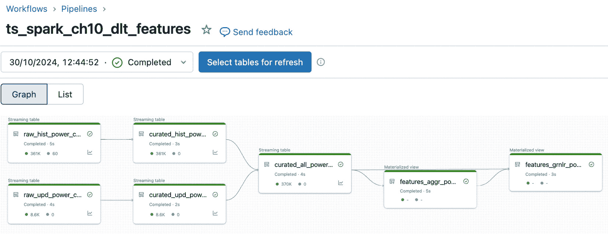

图 10.5：特征工程管道

您可以在这里查看并放大*图 10.5*的数字版本：[`packt.link/D9OXb`](https://packt.link/D9OXb)

要设置本章节所需的 DLT 管道，请按照以下链接中的指示创建管道：

[`docs.databricks.com/en/delta-live-tables/configure-pipeline.html#configure-a-new-delta-live-tables-pipeline`](https://docs.databricks.com/en/delta-live-tables/configure-pipeline.html#configure-a-new-delta-live-tables-pipeline)

请注意，您需要先创建 `ts_spark` 目录，才能设置 DLT 管道。请参阅以下说明，通过目录浏览器创建 `ts_spark` 目录：[`docs.databricks.com/aws/en/catalogs/create-catalog?language=Catalog%C2%A0Explorer`](https://docs.databricks.com/aws/en/catalogs/create-catalog?language=Catalog%C2%A0Explorer)

创建管道时，请参考*表 10.2*中的配置，并将 `<USER_LOGIN>` 替换为您自己的 Databricks 用户登录。

| **管道** | `ts_spark_ch10_dlt_features` |
| --- | --- |
| **通用** | 管道名称 | `ts_spark_ch10_dlt_features` |
|  | 无服务器 | R |
|  | 管道模式 | 触发式 |
| **源代码** | 路径（笔记本） | `/``Workspace/Users/<USER_LOGIN>/ts-spark/ch10/ts_spark_ch10_dlt_features` |
| **目标** | 存储选项 | `Unity Catalog` |
|  | 默认目录 / 默认模式 | `ts_spark /` `ch10` |

表 10.2：DLT 配置 – ts_spark_ch10_dlt_features

此管道任务的代码位于`ts_spark_ch10_dlt_features`笔记本中，包含以下步骤：

1.  使用 Auto Loader 从`vol01_hist`卷中的文件读取历史数据，检查数据，并将数据存储在`raw_hist_power_consumption`流表中。

Auto Loader

Databricks Auto Loader，也称为代码中的`cloudfiles`，可以高效地增量导入到达云存储位置的新数据文件。你可以通过以下链接了解更多关于 Auto Loader 的信息：[`docs.databricks.com/en/ingestion/cloud-object-storage/auto-loader/index.html`](https://docs.databricks.com/en/ingestion/cloud-object-storage/auto-loader/index.html)。

数据质量检查

Databricks DLT 可以包括数据质量检查，以确保数据管道中的数据完整性，基于质量约束进行校验。你可以通过以下链接了解更多关于 DLT 中数据质量检查的信息：[`docs.databricks.com/en/delta-live-tables/expectations.html`](https://docs.databricks.com/en/delta-live-tables/expectations.html)。

1.  使用 Auto Loader 从`vol01_upd`卷中的文件读取更新数据，检查数据，并将数据存储在`raw_upd_power_consumption`流表中。

1.  从`raw_hist_power_consumption`流表中读取原始历史数据，转换数据，并将结果存储在`curated_hist_power_consumption`流表中。

1.  从`raw_upd_power_consumption`流表中读取原始更新数据，转换数据，并将结果存储在`curated_upd_power_consumption`流表中。

1.  从`curated_hist_power_consumption`和`curated_upd_power_consumption`流表中追加数据，并将合并结果存储在`curated_all_power_consumption`流表中。

1.  从`curated_all_power_consumption`流表中读取整理后的数据，使用 Tempo 计算`features_aggr_power_consumption`物化视图。

Tempo

Databricks Tempo 是一个开源项目，简化了在 Apache Spark 中处理时间序列数据。你可以通过以下链接了解更多关于 Tempo 的信息：[`databrickslabs.github.io/tempo/`](https://databrickslabs.github.io/tempo/)。

1.  从`features_aggr_power_consumption`物化视图中读取汇总数据，使用 Tempo 与`curated_all_power_consumption`流表进行`AsOf`连接。然后，将结果存储在`features_gnlr_power_consumption`物化视图中。

这些步骤对应于“金银铜”方法中的数据转换阶段，这部分在*第四章*的*数据处理和存储*章节中进行了讨论。

### model_training

此任务用于训练一个 Prophet 模型，使用在之前`dlt_features`任务中计算的特征。`model_training`的代码位于`ts_spark_ch10_model_training`笔记本中。步骤如下：

1.  从`features_aggr_power_consumption`读取特征。

1.  将`Date`列重命名为`ds`，并将`hourly_Global_active_power`重命名为`y`。这些列名是 Prophet 所要求的。

1.  启动一个 MLflow 运行以追踪训练过程。

1.  将 Prophet 模型拟合到数据集。

1.  将模型注册到 Unity Catalog，并将别名设置为`Champion`。

请注意，这个笔记本展示的是简化的模型训练，足以说明本章示例中的训练步骤。它没有包括完整的模型实验过程和超参数调整，这部分内容在*第七章*中有所讨论。

## 使用 AutoML 进行训练

另一种模型训练方法是使用 Databricks AutoML 来为给定的数据集找到最佳模型。

AutoML 是 Databricks 中的一项功能，自动化了机器学习模型开发的过程。它包含数据分析、特征工程、模型选择和超参数调整等任务。此功能使用户能够快速生成回归、分类和预测问题的基线模型。通过其“玻璃盒”方法，AutoML 提供每个模型的底层代码，这与不显示代码细节的“黑盒”方法不同。AutoML 可以通过 UI 使用，如*图 10.6*所示，也可以通过编程方式使用，如本章提供的示例所示。

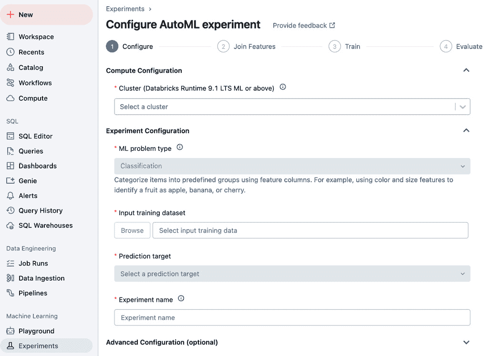

图 10.6：Databricks AutoML

你可以在此处找到有关 AutoML 的更多信息：

[`www.databricks.com/product/automl`](https://www.databricks.com/product/automl)。

`ts-spark_ch10_1b_ingest_and_train_automl`作业是如何在训练任务中以编程方式包括 AutoML 的示例。此任务的代码位于`ts_spark_ch10_model_training_automl`笔记本中。步骤如下：

1.  从`features_aggr_power_consumption`读取特征。

1.  调用`databricks.automl.forecast`函数，它负责重命名列、启动一个 MLflow 运行以追踪训练过程，并根据指定的`primary_metric`（示例中使用的是`mdape`）找到最佳的预测模型。

1.  将模型注册到 Unity Catalog，并将别名设置为`Champion`。

`ts_spark_ch10_1b_ingest_and_train_automl`作业的配置见*表 10.3*。

| **任务（可选）** | `ts_spark_ch10_1b_ingest_and_train_automl` |
| --- | --- |
| **任务 1** | 任务名称 | `ts_spark_ch10_reset` |
|  | 类型 | 笔记本 |
|  | 来源 | 工作空间 |
|  | 路径（笔记本） | `/``Workspace/Users/<USER_LOGIN>/ts-spark/ch10/ts_spark_ch10_reset` |
|  | 计算 | 无服务器 |
| **任务 2** | 任务名称 | `ts_spark_ch10_dlt_features` |
|  | 类型 | 管道 |
|  | 管道 | `ts_spark_ch10_dlt_features` |
|  | 触发管道的完整刷新 | R |
|  | 依赖于 | `ts_spark_ch10_reset` |
| **任务 3** | 任务名称 | `ts_spark_ch10_model_training_automl` |
|  | 类型 | 笔记本 |
|  | 来源 | 工作空间 |
|  | 路径（笔记本） | `/``Workspace/Users/<USER_LOGIN>/ts-spark/ch10/ts_spark_ch10_model_training_automl` |
|  | 计算 | *参考之前关于集群的部分以选择计算类型* |
|  | 依赖于 | `ts_spark_ch10_dlt_features` |

表 10.3：作业配置 - ts_spark_ch10_1b_ingest_and_train_automl

请注意，除了简化与之前不使用 AutoML 的训练方法步骤之外，我们还可以找到最佳模型。

## 导入和预测

`ts-spark_ch10_2b_ingest_and_forecast` 作业，如 *图 10.3* 所示，将在本节中详细介绍。

`ts_spark_ch10_2b_ingest_and_forecast` 作业的配置如 *表 10.4* 所示。

| **作业** | `ts_spark_ch10_2b_ingest_and_forecast` |
| --- | --- |
|  | 作业参数 | 键：`upd_iter` 值：`1` |
| **任务 1** | 任务名称 | `ts_spark_ch10_dlt_features` |
|  | 类型 | 管道 |
|  | 管道 | `ts_spark_ch10_dlt_features` |
|  | 触发管道的完全刷新 | R |
| **任务 2** | 任务名称 | `ts_spark_ch10_update_model` |
|  | 类型 | 笔记本 |
|  | 来源 | 工作区 |
|  | 路径（笔记本） | `/``Workspace/Users/<USER_LOGIN>/ts-spark/ch10/ts_spark_ch10_update_model` |
|  | 计算 | 无服务器 |
|  | 依赖于 | `ts_spark_ch10_dlt_features` |
| **任务 3** | 任务名称 | `ts_spark_ch10_generate_forecast` |
|  | 类型 | 笔记本 |
|  | 来源 | 工作区 |
|  | 路径（笔记本） | `/``Workspace/Users/<USER_LOGIN>/ts-spark/ch10/ts_spark_ch10_generate_forecast` |
|  | 计算 | 无服务器 |
|  | 依赖于 | `ts_spark_ch10_update_model` |
| **任务 4** | 任务名称 | `ts_spark_ch10_update_data` |
|  | 类型 | 笔记本 |
|  | 来源 | 工作区 |
|  | 路径（笔记本） | `/``Workspace/Users/<USER_LOGIN>/ts-spark/ch10/ts_spark_ch10_update_data` |
|  | 计算 | 无服务器 |
|  | 依赖于 | `ts_spark_ch10_generate_forecast` |
| **任务 5** | 任务名称 | `ts_spark_ch10_evaluate_forecast` |
|  | 类型 | 笔记本 |
|  | 来源 | 工作区 |
|  | 路径（笔记本） | `/``Workspace/Users/<USER_LOGIN>/ts-spark/ch10/ts_spark_ch10_evaluate_forecast` |
|  | 计算 | 无服务器 |
|  | 依赖于 | `ts_spark_ch10_update_data` |

表 10.4：作业配置 - ts_spark_ch10_2b_ingest_and_forecast

### dlt_features

该任务与前面 *导入和训练* 部分中使用的 `ts_spark_ch10_dlt_features` DLT 管道相同，如 *图 10.5* 所示，只不过这次我们将调用该管道来处理来自 `vol01_upd` 卷的新数据文件。

### update_model

该任务用于使用先前 `dlt_features` 任务中计算的特征来训练 Prophet 模型。`update_model` 的代码位于 `ts_spark_ch10_update_model` 笔记本中。该任务与 *模型训练* 部分中讨论的任务类似，唯一的区别是我们现在有了新数据来包含在训练中。步骤如下：

1.  从 `features_aggr_power_consumption` 中读取特征。

1.  将 `Date` 列重命名为 `ds`，并将 `hourly_Global_active_power` 列重命名为 `y`。这些列名是 Prophet 所要求的。

1.  将 Prophet 模型拟合到数据集。

1.  将模型注册到 Unity Catalog，并设置别名为`Champion`。

更新完最新模型后，我们可以使用它进行下一步的预测。

### generate_forecast

该任务使用之前训练好的模型来生成和存储预测结果。`generate_forecast`的代码位于`ts_spark_ch10_generate_forecast`笔记本中。步骤如下：

1.  从 Unity Catalog 加载`Champion`模型。

1.  为接下来的 24 小时生成预测。

1.  将预测结果与模型的名称和版本一起存储在`forecast`表中。

在生成预测后，我们可以将预测的时间段与实际数据进行比较，实际数据将在接下来获取。

### update_data

该任务只是将新的时间段的数据文件从`vol01_upd_src`卷复制到`vol01_upd`。`update_data`的代码位于`ts_spark_ch10_update_data`笔记本中。

### evaluate_forecast

该任务计算并存储预测准确度指标。`evaluate_forecast`的代码位于`ts_spark_ch10_evaluate_forecast`笔记本中。步骤如下：

1.  将`features_aggr_power_consumption`实际数据表与之前创建的`forecast`表连接。

1.  计算`mdape`指标。

1.  将计算得到的指标与模型的名称和版本一起存储在`forecast_metrics`表中。

1.  将数据质量检查结果存储在`dq_results`表中。

在评估完预测后，我们可以报告结果和指标。我们将在*用户界面*部分介绍这一部分内容。在进入这部分之前，先详细说明如何协调多个新数据到达并进行相应处理的迭代过程。

## 更新迭代

`ts-spark_ch10_2a_update_iteration`作业，如*图 10.4*所示，模拟了现实中我们在定期时间间隔（如每天或每周）处理新数据的情况。它调用`ts-spark_ch10_2b_ingest_and_forecast`作业七次，对应一周的每日新数据。每次调用都会触发一个新的数据文件的端到端处理，如前面的*获取和预测*部分所描述。

`ts_spark_ch10_2a_update_iterations`作业的配置见*表 10.5*。

| **作业** | `ts_spark_ch10_2a_update_iterations` |
| --- | --- |
| **任务 1** | 任务名称 | `ts_spark_ch10_update_iterations` |
|  | 类型 | 每个 |
|  | 输入 | [1,2,3,4,5,6,7] |
| **任务 2（添加一个任务以** **循环遍历）** | 任务名称 | `ts_spark_ch10_update_iterations_iteration` |
|  | 类型 | 运行作业 |
|  | 作业 | `ts_spark_ch10_2b_ingest_and_forecast` |
|  | 作业参数 | 键：`upd_iter` 值：`{{input}}` |

表 10.5：作业配置 – ts_spark_ch10_2a_update_iterations

## 启动作业

配置并解释完作业后，我们将启动这些作业，这些作业将执行本章的代码。有关运行作业的更多信息，请参见：

[`docs.databricks.com/en/jobs/run-now.html`](https://docs.databricks.com/en/jobs/run-now.html)

按照以下顺序进行操作：

1.  点击`ts-spark_ch10_1a_ingest_and_train`。等待任务完成。

1.  点击`ts-spark_ch10_2a_update_iteration`。

在启动并执行作业后，我们可以查看它们的状态，下一节将对此进行详细解释。

# 监控、安全和治理

正如我们在*第四章*的*从 DataOps 到 ModelOps 再到 DevOps*部分和*第九章*的*治理与安全*部分中讨论的那样，生产环境和涉及敏感数据的工作负载的关键要求是必须具备适当的监控、安全和治理。这通过利用像 Databricks 与 Unity Catalog 这样的托管平台的内置功能得到极大的促进。如果我们开发和测试自己定制的平台，替代方法将需要相当多的时间和精力，才能稳健地满足这些要求。

## 监控

可以通过`ts-spark_ch10_2b_ingest_and_forecast`任务来进行作业监控。我们可以查看不同的运行、它们的参数、持续时间、状态等信息，这些对于监控非常有用。

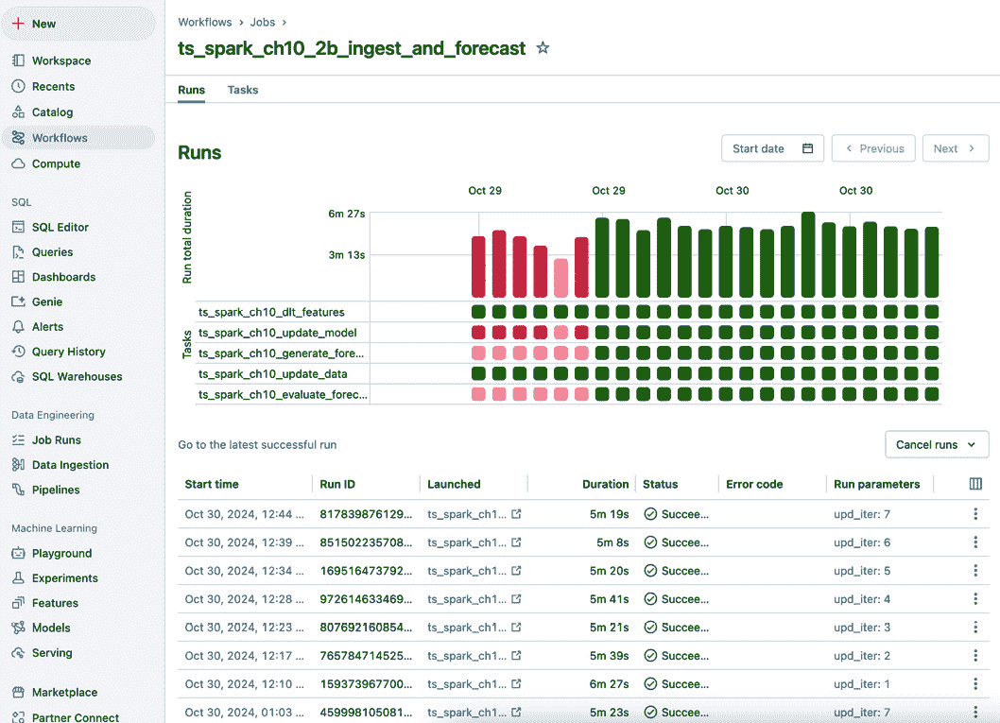

图 10.7：Databricks Workflows – 作业 – 运行

`ts_spark_ch10_dlt_features` DLT 管道的监控可以通过**Workflows** > **Pipelines**页面完成，如*图 10.8*所示。我们可以看到不同的阶段、数据检查、持续时间和状态等信息，这些对于监控非常有用。

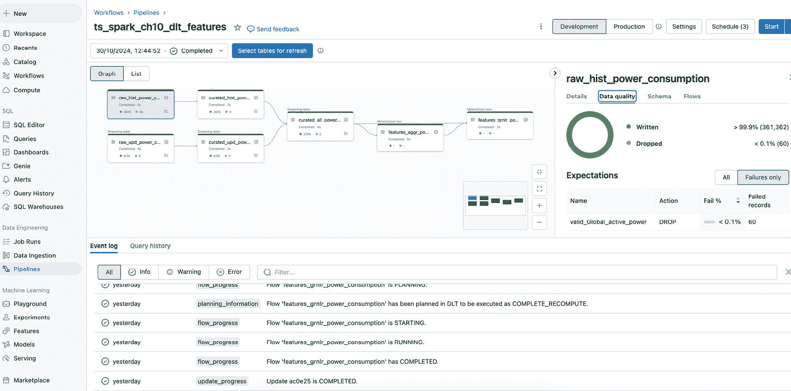

图 10.8：Databricks DLT 管道

你可以在此处找到更多关于可观察性、监控和警报的信息：

+   [`docs.databricks.com/en/delta-live-tables/observability.html`](https://docs.databricks.com/en/delta-live-tables/observability.html)

+   [`www.databricks.com/blog/lakehouse-monitoring-unified-solution-quality-data-and-ai`](https://www.databricks.com/blog/lakehouse-monitoring-unified-solution-quality-data-and-ai)

+   [`docs.databricks.com/en/lakehouse-monitoring/index.html`](https://docs.databricks.com/en/lakehouse-monitoring/index.html)

+   [`docs.databricks.com/aws/en/lakehouse-monitoring/monitor-alerts`](https://docs.databricks.com/aws/en/lakehouse-monitoring/monitor-alerts)

## 安全

如*图 10.9*所示，使用 Unity Catalog 设置表格及其他对象的访问权限只需要几次点击。

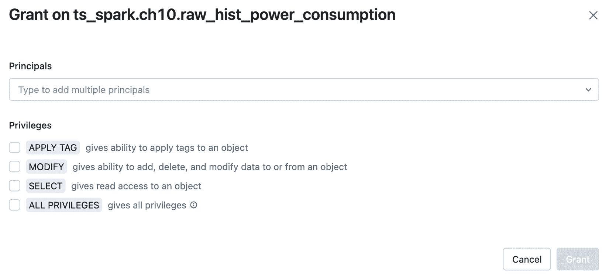

图 10.9：Databricks Unity Catalog – 设置权限

还可以根据以下资源在表格内定义更加细粒度的访问控制，细化到行或列级别：

[`www.databricks.com/resources/demos/videos/governance/access-controls-with-unity-catalog`](https://www.databricks.com/resources/demos/videos/governance/access-controls-with-unity-catalog)

你可以在此处找到更多关于安全的信息：

[`docs.databricks.com/en/security/index.html`](https://docs.databricks.com/en/security/index.html)

## 治理

治理的重要考虑因素之一是能够追踪数据资产的血缘关系，如*图 10.10*所示。我们可以看到数据的来源、多个中间阶段，以及数据存储的最终表格。Unity Catalog 会在 Databricks 中自动跟踪这一过程，让我们能够实时监控数据流。

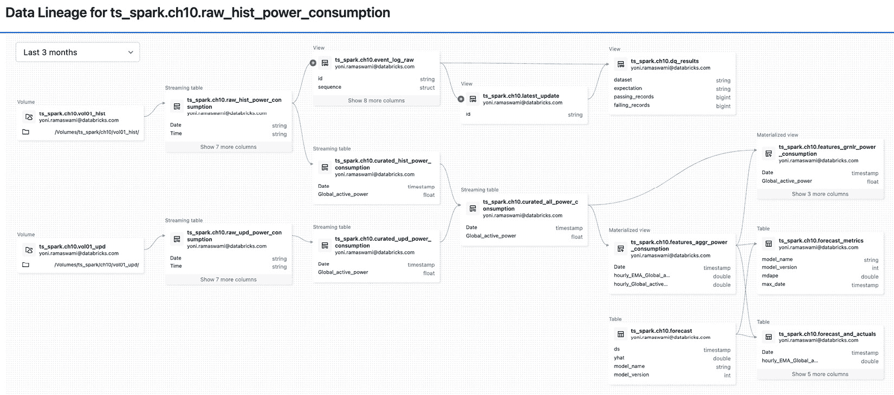

图 10.10：Databricks Unity Catalog – 血缘视图

你可以在这里找到并放大*图 10.10*的数字版本：

https://packt.link/D6DyC

我们仅简要提及了使用 Databricks Unity Catalog 进行治理和安全性。你可以在这里找到更多信息：

[`www.databricks.com/product/unity-catalog`](https://www.databricks.com/product/unity-catalog)

了解如何利用 Databricks 这样的平台进行监控、安全性和治理后，我们将继续揭示如何展示时间序列分析的结果。

# Databricks 用户界面 — AI/BI 仪表板

在展示我们迄今为止进行的时间序列分析结果时，Databricks 提供了多种用户界面的选项，包括 AI/BI 仪表板、Genie 空间、基于 AI 的聊天机器人和 Lakehouse 应用。我们将在本节中介绍 AI/BI 仪表板，其它选项将在下一章中讨论。

在本书中，我们广泛使用了各种图表来表示数据和分析结果。这要求我们在笔记本中执行代码来创建图表。当我们能够编写代码并拥有执行环境时，这种方式非常有效。然而，在无法编写代码的情况下，常见的展示数据和分析结果的方式是使用报告仪表板。Databricks AI/BI 仪表板便提供了这种功能，如*图 10.11*所示。

Databricks AI/BI 仪表板是一个集成到 Databricks 平台中的解决方案，用于创建报告和仪表板。它具备 AI 驱动的功能，帮助生成查询和数据可视化。仪表板可以发布并共享，供他人使用。

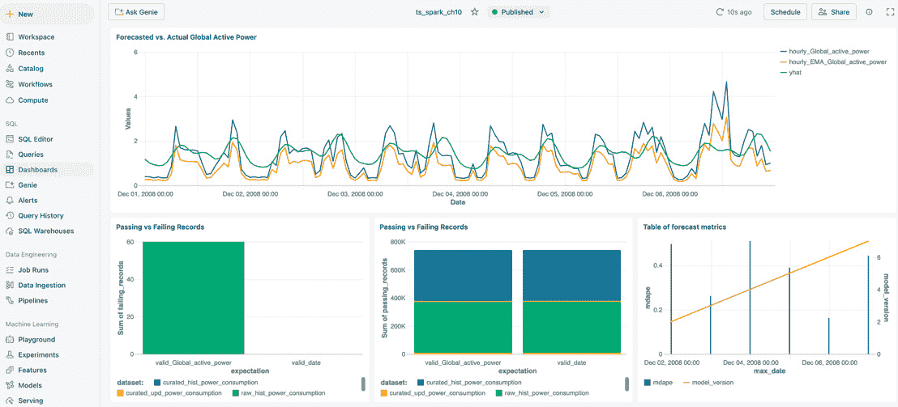

图 10.11：Databricks AI/BI 仪表板

要在自己的环境中安装此仪表板，首先，下载它并从以下位置获取：

[`github.com/PacktPublishing/Time-Series-Analysis-with-Spark/blob/main/ch10/ts_spark_ch10.lvdash.json`](https://github.com/PacktPublishing/Time-Series-Analysis-with-Spark/blob/main/ch10/ts_spark_ch10.lvdash.json)

然后，您可以按照这里的说明将仪表板文件导入到自己的环境中：

[`docs.databricks.com/en/dashboards/index.html#import-a-dashboard-file`](https://docs.databricks.com/en/dashboards/index.html#import-a-dashboard-file)

注意

你需要一个 SQL 仓库来运行仪表板。请参考以下说明来创建 SQL 仓库：

[`docs.databricks.com/aws/en/compute/sql-warehouse/create`](https://docs.databricks.com/aws/en/compute/sql-warehouse/create)

在这个仪表板中，我们将以下内容整合在一个视图中：

+   实际值与预测值的图表

+   通过数据质量检查的记录数（失败和通过）

+   不同模型版本的指标

您可以通过以下链接找到更多关于 AI/BI 仪表板的信息：

+   [`www.databricks.com/blog/introducing-aibi-intelligent-analytics-real-world-data`](https://www.databricks.com/blog/introducing-aibi-intelligent-analytics-real-world-data)

+   [`docs.databricks.com/en/dashboards/index.html`](https://docs.databricks.com/en/dashboards/index.html)

# 总结

通过在托管的 Spark 平台上进行时间序列分析的端到端示例，本章展示了如何利用 Databricks 的开箱即用功能进一步推动 Apache Spark 的应用。我们从通过流处理管道进行数据摄取开始，到特征工程和模型训练，再到推理和报告，同时确保监控、安全性和治理得到了落实。通过将 Databricks 上预构建的功能与我们自己的自定义代码相结合，我们实现了一个可以扩展到更多使用场景的解决方案。

这将引导我们进入最后一章，在本章中，我们将扩展一些近期在时间序列分析中的发展。

# 加入我们的 Discord 社区

加入我们社区的 Discord 空间，与作者和其他读者进行讨论：

[`packt.link/ds`](https://packt.link/ds)

.jpg)
