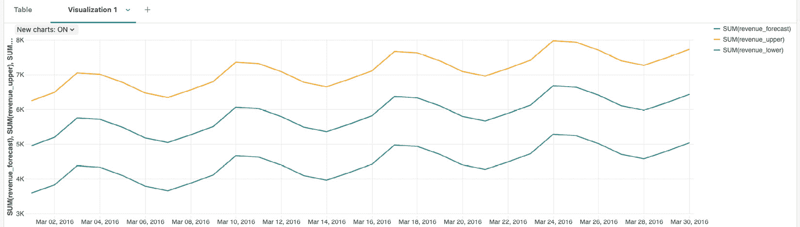
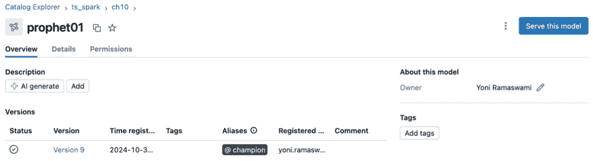
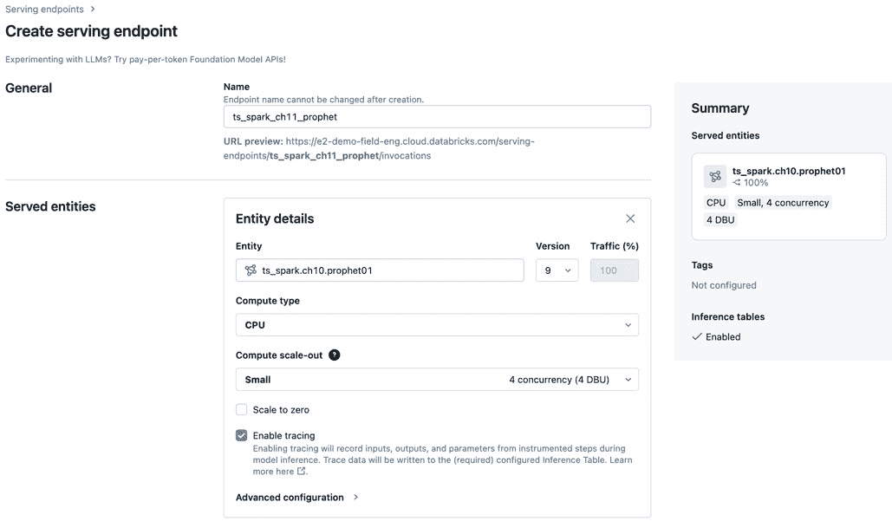
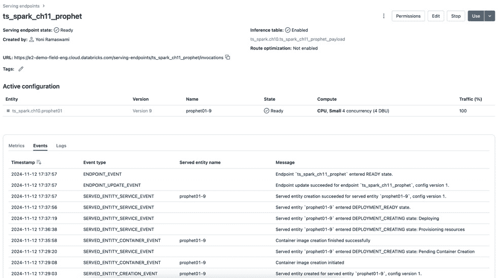
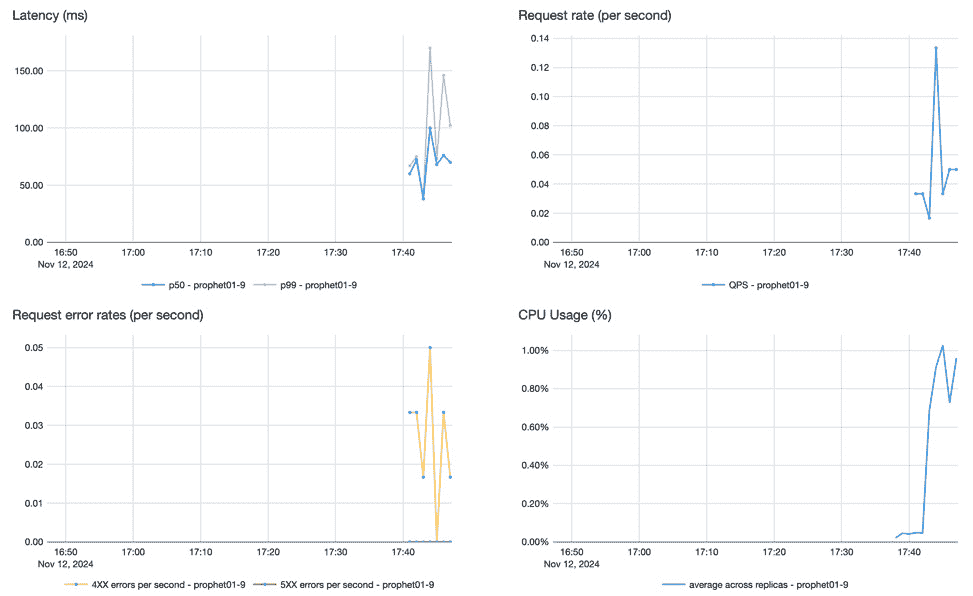
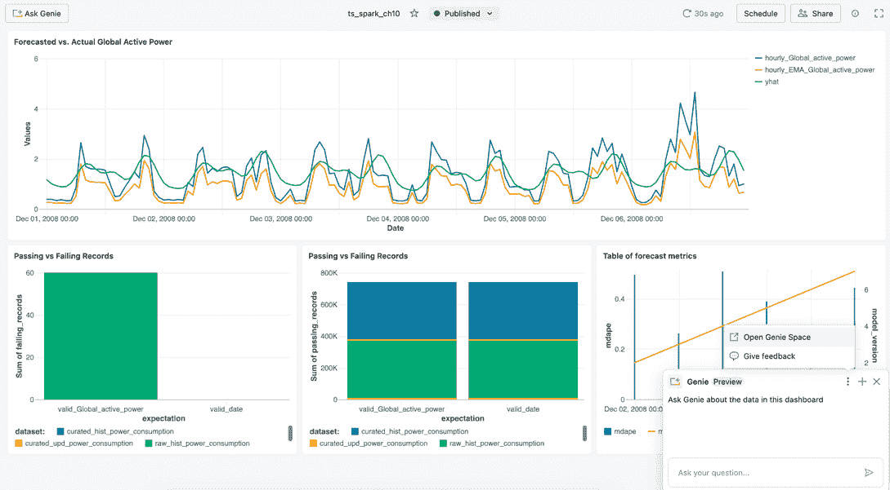
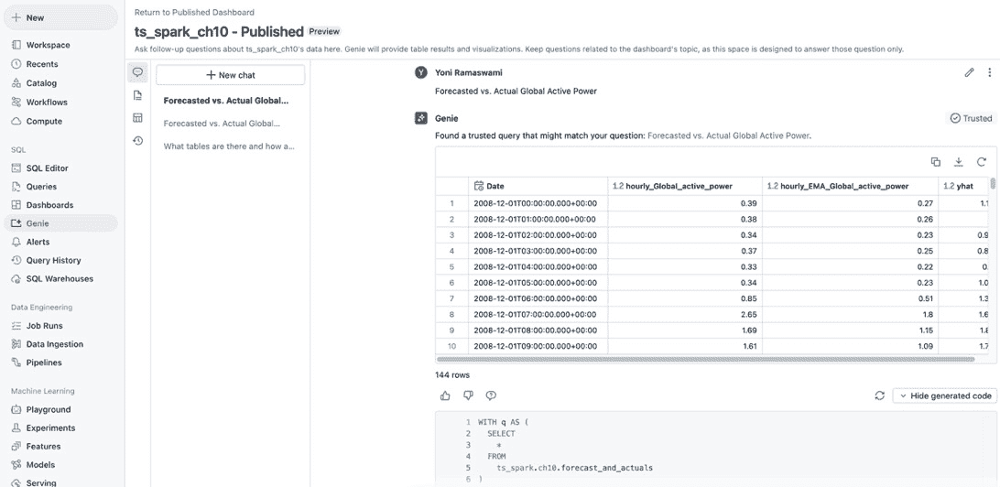
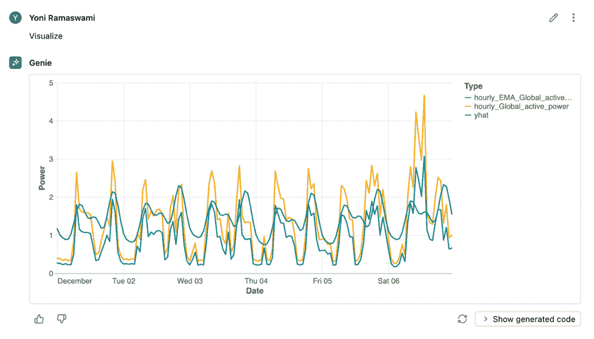

# 第十一章：时间序列分析的最新发展

当我们走到本书的最后一章时，让我们简要回顾一下我们走过的历程。从在*第一章*中介绍时间序列及其组成开始，我们在*第二章*中查看了时间序列分析的不同应用场景。接着，我们在*第三章*中介绍了 Apache Spark 及其架构，以及它是如何工作的。在深入探讨 Apache Spark 如何用于时间序列分析之前，我们在*第四章*中回顾了一个端到端的时间序列项目的整体框架。随后，我们将焦点转向项目的主要阶段，从*第五章*到*第九章*，涵盖了数据准备、探索性数据分析、模型开发、测试、扩展和生产部署。在*第十章*中，我们讨论了通过使用如 Databricks 这样的托管数据和 AI 平台，如何进一步利用 Apache Spark。

在本章的结尾，我们将探讨时间序列分析领域的最新发展，涵盖新兴的方法论、工具和趋势。我们将介绍一种来自生成式 AI 领域的时间序列预测方法。拥有一个预测机制固然很棒，但还不够。另一个有趣的发展方向是如何通过 API 向数据分析师和应用程序提供并按需提供预测结果。最终用户也可以通过新的方法受益，使时间序列分析的结果以非技术性的方式对他们可访问。

在本章中，我们将讨论以下主要内容：

+   时间序列的生成式 AI

+   通过 API 提供预测

+   民主化时间序列分析的访问

# 技术要求

我们将使用 Databricks 环境作为平台基础设施。要设置环境，请按照*第十章*中*环境设置*部分的说明进行操作。

本章的代码可以在此 URL 找到：

[`github.com/PacktPublishing/Time-Series-Analysis-with-Spark/tree/main/ch11`](https://github.com/PacktPublishing/Time-Series-Analysis-with-Spark/tree/main/ch11)

# 时间序列分析中的生成式 AI

尽管传统的时间序列模型有效，但在大规模数据或复杂模式下，它们在性能和准确性上存在局限性。

生成式人工智能，特别是**时间序列变换器**（**TSTs**），为这些挑战提供了解决方案。类似于**自然语言处理**（**NLP**）中的 transformer 模型，TSTs 擅长捕捉长序列上的复杂、非线性依赖关系。这种能力使它们适用于包含缺失值、季节性和不规则模式的真实世界数据。TSTs 使用自注意机制分析时间序列数据并识别季节性模式。这些模型在庞大数据集上进行预训练以创建基础模型，然后可以针对特定时间序列应用进行微调。

最近，已发布了几个预构建的 TST，使我们能够利用它们的功能，而无需努力工程化这些解决方案。示例包括 Chronos、Moira、TimesFM 和 TimeGPT 等。

在下一节中，我们将研究如何使用其中之一与 TimesFM。

## TimesFM 简介

**TimesFM**，简称**时间序列基础模型**，是由谷歌研究开发的开源预测模型，专门设计用于时间序列数据。TimesFM 建立在基于 transformer 的架构上，具有多功能性，可以处理从短期到长期预测的各种任务。与 Chronos 等将时间序列类似于自然语言处理的模型不同，TimesFM 包括针对时间序列数据的专门机制，如季节性处理、支持缺失值和捕捉多变量依赖关系。

在超过 1000 亿真实世界时间序列点上进行预训练，TimesFM 有效地推广到新数据集，通常在没有额外训练的情况下提供准确的零-shot 预测。这种广泛的预训练使 TimesFM 能够识别时间序列数据中的短期和长期依赖关系，使其非常适用于需要了解季节模式和趋势的应用程序。

要了解 TimesFM 架构的概述和详细解释，我们建议查阅原始研究论文，*一种仅解码器的时间序列基础模型* *预测*，请点击这里：

[`research.google/blog/a-decoder-only-foundation-model-for-time-series-forecasting/`](https://research.google/blog/a-decoder-only-foundation-model-for-time-series-forecasting/)

我们将在下一节中通过一个预测示例看到 TimesFM 的实际应用。

## 预测

在本节的时间序列预测示例中，我们将使用在*技术要求*部分设置的 Databricks 环境。本节的代码可以从以下 URL 上传到 Databricks 工作区：

[`github.com/PacktPublishing/Time-Series-Analysis-with-Spark/raw/main/ch11/ts_spark_ch11_timesFM.dbc`](https://github.com/PacktPublishing/Time-Series-Analysis-with-Spark/raw/main/ch11/ts_spark_ch11_timesFM.dbc)

你可以使用 Databricks 无服务器计算来执行代码，正如我们在*第十章*中所做的那样。或者，你可以使用 Databricks Runtime for ML。由于 TimesFM 在撰写时支持的 Python 版本要求，必须使用 14.3 版本。

我们将在这里通过代码示例逐步讲解如何安装和使用 TimesFM。完整代码请参见笔记本：

1.  安装以下必要的库：`timesfm[torch]`、`torch`和`sktime`。

1.  指定超参数（`hparams`），并从 Hugging Face 的检查点加载 TimesFM 模型（`huggingface_repos_id`）。请注意，`500m`指的是模型支持的 5 亿个参数，由于与 Databricks 的兼容性，我们将使用`pytorch`版本：

    ```py
    # Initialize the TimesFm model with specified hyperparameters 
    # and load from checkpoint
    model = timesfm.TimesFm(
        hparams = timesfm.TimesFmHparams(
            backend="gpu",
            per_core_batch_size=32,
            horizon_len=128,
            num_layers=50,
            use_positional_embedding=False,
            context_len=2048,
        ),
        checkpoint = timesfm.TimesFmCheckpoint(
            huggingface_repo_id="google/timesfm-2.0-500m-pytorch"
        )
    )
    ```

    虽然我们使用了超参数的默认值，但你需要进行实验，根据你的预测需求找到最佳的超参数。

    加载 TimesFM 模型后，我们可以引入用于预测的数据集。我们将重新使用来自*第十章*的能源消耗数据集。在进行下一步之前，你必须执行代码示例，包括上一章中的特征工程管道。

1.  我们将从`features_aggr_power_consumption`表中读取数据，并将 Spark DataFrame 转换为 pandas DataFrame，这是 TimesFM 所需要的。`Date`列重命名为`date`，并转换为模型所期望的`datetime`格式：

    ```py
    # Define catalog, schema, and table names
    CATALOG_NAME = "ts_spark"
    SCHEMA_NAME = "ch10"
    ACTUALS_TABLE_NAME = f"{CATALOG_NAME}.{SCHEMA_NAME}.features_aggr_power_consumption"
    FORECAST_TABLE_NAME = f"{CATALOG_NAME}.{SCHEMA_NAME}.forecast"
    # Load data from the actuals table into a Spark DataFrame
    sdf = spark.sql(f"""
        SELECT * FROM {ACTUALS_TABLE_NAME}
    """)
    # Convert Spark DataFrame to Pandas DataFrame
    df = sdf.toPandas()
    # Convert 'Date' column to datetime format
    df['get_batched_data_fn function. The important part, shown in the following code extract, is the mapping of inputs and outputs. The code is based on an adaptation of an example from TimesFM([`github.com/google-research/timesfm/blob/master/notebooks/covariates.ipynb`](https://github.com/google-research/timesfm/blob/master/notebooks/covariates.ipynb)):

    ```

    # 创建批量时间序列数据管道的函数

    # 数据

    def get_batched_data_fn(

    …

    examples["inputs"].append(

    sub_df["hourly_Global_active_power"][

    start:(context_end := start + context_len)

    ].tolist())

    …

    examples["outputs"].append(

    sub_df["hourly_Global_active_power"][

    context_end:(context_end + horizon_len)

    ].tolist())

    …

    ```py

    ```

1.  然后，我们可以遍历输入数据的批次，使用`forecast`函数生成预测，代码示例如下：

    ```py
    # Iterate over the batches of data
    for i, example in enumerate(input_data()):
        # Generate raw forecast using the model
        raw_forecast, _ = model.forecast(
            inputs=example["inputs"],
            freq=[0] * len(example["inputs"])
        )
    ```

1.  我们使用`mdape`指标来评估预测效果，正如我们在前几章所做的那样。这与*第十章*类似：

    ```py
    # Calculate and store the evaluation metric for the forecast
    metrics["eval_mdape_timesfm"].extend([
        mdape(
            pd.DavtaFrame(raw_forecast[:, :horizon_len]),
            pd.DataFrame(example["outputs"])
        )
    ])
    ```

    这将得到以下结果：

    ```py
    eval_mdape_timesfm: 0.36983413500008916
    ```

正如我们在本节中所看到的，使用基于预训练的 Transformer 模型（如 TimesFM），并且使用默认的超参数，能够提供与我们在前几章中使用的不同方法相当的准确性。通过超参数调优和协变量的使用（下文将讨论），我们可以进一步提高准确性。

## 协变量支持

TimesFM 的一个重要特性是它支持外部**协变量**，因为时间序列很少是孤立出现的。经济指标或天气条件等多种因素可能与时间序列相关联，将这些因素纳入分析可以提高预测的准确性。简单来说，协变量是一个独立的变量，可以帮助我们预测时间序列。

TimesFM 支持单变量和多变量预测，包含协变量，使其能够捕捉目标序列与这些外部变量之间的相关性。通过将协变量作为并行序列输入，模型可以学习它们与未来值之间的关系，从而增强其在外部因素对结果产生显著影响的实际场景中的适应性。例如，我们可以通过估算道路交通来预测污染水平。这一支持协变量的能力使得 TimesFM 在预测上相较于传统时间序列模型和其他不包含这些变量的基础模型具有优势。

您可以在这里找到有关协变量支持的更多信息和示例：

[`community.databricks.com/t5/technical-blog/genai-for-time-series-analysis-with-timesfm/ba-p/95507`](https://community.databricks.com/t5/technical-blog/genai-for-time-series-analysis-with-timesfm/ba-p/95507)

## 其他生成式 AI 模型和多模型预测

您可以测试其他生成式模型，以找到最适合您用例的模型。一种方法是使用 Databricks 的 **多模型预测**（**MMF**）解决方案加速器。该加速器为需要在多个时间序列上创建预测的组织提供了解决方案，例如销售、需求或库存预测。该仓库提供了一个可扩展的方法，使用 Databricks 同时部署和管理多个预测模型。它包括笔记本、模型模板和数据管道等资源，简化了在大规模上训练、评估和部署时间序列模型的过程。

您可以在此找到更多信息：

[`github.com/databricks-industry-solutions/many-model-forecasting`](https://github.com/databricks-industry-solutions/many-model-forecasting)

随着生成式 AI 和 MMF 成为我们时间序列分析工具包的一部分，让我们探索如何增强预测结果对应用和数据分析师的可用性。

# 通过 API 提供预测

本书的主要部分集中在准备和分析时间序列数据集上。我们还涵盖了如何在笔记本和报告仪表板中以表格和图形的形式呈现分析结果。然而，在许多情况下，预测必须按需提供给数据分析师和应用程序。我们现在将探讨如何实现这一目标。

## 通过 ai_forecast 简化预测

在这种情况下，数据分析师可以访问时间序列数据，并希望将其作为输入来获取预测，而无需首先开发一个模型。通过将预测功能抽象为 Databricks 平台上的 `ai_forecast` 函数，可以大大简化没有预测模型和算法知识的用户进行预测的过程。

您可以在以下 URL 查看一个简单示例：

[`github.com/PacktPublishing/Time-Series-Analysis-with-Spark/raw/main/ch11/ts_spark_ch11_aiforecast.dbc`](https://github.com/PacktPublishing/Time-Series-Analysis-with-Spark/raw/main/ch11/ts_spark_ch11_aiforecast.dbc)

这段代码基于文档中的示例，链接在本节末尾提供：

```py
SELECT *
FROM AI_FORECAST(
    TABLE(aggregated),
    horizon => '2016-03-31',
    time_col => 'ds',
    value_col => 'revenue'
)
```

运行此示例的输出如*图 11.1*所示。



图 11.1：ai_forecast 示例输出

您可以在此处找到并放大*图 11.1*的数字版本：

https://packt.link/vg87q

请注意，在撰写本文时，此功能仍处于公开预览阶段，因此您可能需要向 Databricks 请求访问权限才能试用它。

您可以在此处找到更多信息：

[`docs.databricks.com/en/sql/language-manual/functions/ai_forecast.html`](https://docs.databricks.com/en/sql/language-manual/functions/ai_forecast.html)

虽然像`ai_function`这样简化且预定义的函数是快速生成预测的好方法，但我们可能希望使我们自己定制开发的预测模型能够轻松供其他应用访问，接下来我们将介绍如何做到这一点。

## 模型服务

在某些情况下，我们需要从另一个应用程序中以编程方式获取模型的预测。对于这种应用间集成，使用 REST API 是一种常见做法。提供 REST API 接口的一种方式是使用 Databricks 的**模型服务**。

Databricks 的模型服务提供了部署、管理和查询 ML 和 AI 模型的功能，支持实时推理和批量推理。已部署的模型可以通过 REST API 访问，从而集成到 Web 或客户端应用程序中。支持多种模型类型，包括以 MLflow 格式打包的自定义 Python 模型和提供的开放基础模型。该服务旨在高可用性和低延迟，并能自动扩展以应对需求变化。

这是提供模型服务的步骤概览。请注意，这不是一个实际的示例。此处展示的截图仅用于说明步骤：

1.  按照*图 11.2*中的步骤访问 Unity Catalog 中的模型，并点击右上角的**服务此模型**按钮。



图 11.2：Unity Catalog 中的模型

1.  按照*图 11.3*中的步骤创建服务端点。此时将显示访问 REST API 以调用模型的 URL。



图 11.3：创建服务端点

1.  创建服务端点时，我们可以启用推理表，如*图 11.4*所示，以存储与模型 REST API 交互的所有输入和输出。


图 11.4：推理表

1.  创建后，服务端点将显示为**准备就绪**状态，如*图 11.5*所示，并可以使用。



图 11.5：服务端点已准备就绪

1.  当使用服务端点时，可以根据*图 11.6*来监控其指标。



图 11.6：服务端点指标

你可以在此找到有关模型服务的更多信息：

[`docs.databricks.com/en/machine-learning/serve-models.html`](https://docs.databricks.com/en/machine-learning/serve-models.html)

正如我们在本节中看到的，通过 REST API 暴露我们的时间序列分析模型，使得将分析与其他应用程序集成变得更加容易。继续讨论时间序列分析的可访问性，接下来我们将探讨如何为最终用户简化这一过程。

# 普及时间序列分析的访问

在本节中，我们将探索访问时间序列结果的创新方法如何使非技术用户受益。这使得我们能够将时间序列分析普及化，惠及更广泛的受众。

## Genie 空间

在第一种方法中，我们将使用 Databricks 上类似自然语言聊天机器人的界面，称为 **Genie 空间**。

Databricks Genie 空间是一个对话式 UI，使业务用户能够用自然语言提问并获得分析见解，而无需技术专长。这通过配置 Genie 空间与相关数据集、示例查询和说明来实现。然后，用户可以用自然语言与系统互动，提出关于数据的问题和可视化需求。Genie 使用带注释的表格和列元数据将用户查询转化为 SQL 语句。这些语句用于查询数据，以便 Genie 可以向用户提供响应。

为了实践这一点，我们将使用在 *第十章* 中创建的仪表板，如 *图 11.7* 所示。这是访问 Genie 的一种方式——在仪表板上，我们可以点击左上角的 **询问 Genie** 按钮。这将打开右下角的聊天机器人界面，我们可以开始用自然语言输入问题。或者，我们可以选择将 Genie 空间打开为全屏模式。



图 11.7：从仪表板访问 Genie 空间

在 *图 11.8* 中，我们可以看到完整的 Genie 空间，包括查询、结果和用于获取结果的生成 SQL。



图 11.8：Genie 空间查询和结果

该示例中的查询是显示 **预测与实际**，这也可以作为可视化请求，如 *图 11.9* 所示。



图 11.9：Genie 空间可视化

你可以在此找到有关 Databricks Genie 空间的更多信息：[`docs.databricks.com/en/genie/index.html`](https://docs.databricks.com/en/genie/index.html)

## 应用

在需要更多应用式交互性的情况下，仪表盘或聊天机器人界面不足以满足用户需求。Databricks 应用提供了一个平台，可以在 Databricks 环境中直接构建和部署应用。目前处于公开预览阶段，Databricks 应用支持如 Dash、Shiny、Gradio、Streamlit 和 Flask 等开发框架，用于创建数据可视化、AI 应用、自助分析和其他数据应用。

你可以在这里找到更多关于 Databricks 应用的信息：[`www.databricks.com/blog/introducing-databricks-apps`](https://www.databricks.com/blog/introducing-databricks-apps)

# 总结

在本章的最后，我们深入探讨了时间序列分析的最新进展，重点关注新兴的方法论、工具和趋势。我们尝试了将生成式 AI 这一创新方法应用于时间序列预测的前沿领域。为了响应对通过 API 进行预测的需求增长，我们探索了如何为数据分析师和应用提供按需预测服务。最后，我们使用了 AI 聊天机器人和 Databricks 应用，旨在使非技术用户也能便捷地进行时间序列分析。

当我们到达本书的尾声，回顾我们的旅程和所获得的技能时，我们已经在使用 Apache Spark 和其他组件进行时间序列分析项目的多个阶段上打下了坚实的基础。凭借*第二章*中讨论的多个应用场景、本书中获得的实践技能，以及本章中的最新进展，我们已经具备了成功实施可生产、可扩展并具备未来适应性的时间序列分析项目所需的所有要素。

我们以 Pericles 关于时间重要性的智慧建议开始了这本书——现在，在本书的结尾，我们具备了揭示时间序列中隐藏的宝贵洞察并将其运用到实际中的能力。愿这些知识使你能够以新的思路和信心应对挑战。祝你在时间序列分析和 Apache Spark 的学习旅程中取得成功！

# 加入我们在 Discord 的社区

加入我们社区的 Discord 空间，与作者和其他读者讨论：

[`packt.link/ds`](https://packt.link/ds)

.jpg)
