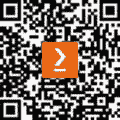

# 前言

**Snowpark** 是一个强大的框架，帮助您在 Snowflake 数据云中解锁无限可能。然而，没有适当的指导，利用 Snowpark 的 Python 功能可能会颇具挑战。本书包含大量实用示例和代码片段，将指导您成功使用 Snowpark 与 Python。

*《雪地公园终极指南》* 帮助您了解雪地公园及其如何在数据云中整合各种工作负载，例如数据工程、数据科学和数据应用。

从配置到编码风格以及数据操作、收集、准备、转换、聚合和分析等工作负载，本指南将为您提供所需的知识，以充分利用此框架。您将了解如何构建、测试和部署数据管道和数据科学模型。随着您的进步，您将能够在 Snowflake 中本地部署数据应用，并使用 Snowpark 容器服务操作 LLMs。

到最后，您将能够充分利用 Snowpark 的功能，并将您的 Snowflake 开发者职业生涯推向新的高度。

# 本书面向对象

本书面向数据工程师、数据科学家、数据架构师、应用开发者和寻求深入了解 Snowpark 功能和最佳实践，以使用 Python 编程语言在 Snowpark 中部署各种工作负载的数据从业者。

# 本书涵盖内容

*第一章*，*探索 Snowpark*，将引导您了解 Snowpark 及其独特功能。您将学习如何利用 Python 与 Snowpark 协同工作，以及如何将其应用于各种工作负载。到本章结束时，您将掌握 Snowpark 的功能和优势，包括更快的数据处理速度、提高数据质量和降低成本。这些指导章节旨在为您提供对 Snowpark 的全面理解，以及如何利用其价值来解决您的特定用例。

*第二章*，*使用 Snowpark 建立基础*，教导您如何配置和操作 Snowpark，建立编码风格和结构，并探索工作负载。您还将获得与 Snowpark 高效工作的实际知识和技能，包括设置环境、结构化代码以及利用它处理不同的工作负载。

*第三章*，*使用 Snowpark 简化数据处理*，教导用户如何在 Snowpark 中处理数据。它涵盖了数据收集、准备、转换、聚合和分析。到本章结束时，用户将获得管理数据源、清理和转换数据以及执行高级分析任务的实际知识和技能。

*第四章*, *使用 Snowpark 构建数据工程管道*，涵盖了构建可靠的数据管道、有效的调试和日志记录、使用 DataOps 进行高效部署以及 Snowpark 的测试驱动开发。本章将为用户提供开发、测试和部署数据管道的实用技能，从而在 Snowpark 中实现可靠和高效的通道。

*第五章*, *使用 Snowpark 开发数据科学项目*，涵盖了 Snowpark 在数据科学项目中的应用，以及探索数据科学管道，包括数据准备、探索和具有 Snowpark 特性的模型训练。这些材料面向希望使用 Snowpark 处理大量数据并构建精确机器学习模型的数据科学家和其他专业人士。

*第六章*, *使用 Snowpark 部署和管理机器学习模型*，探讨了在 Snowpark 中实现机器学习模型并构建特征存储库。此外，读者还可以学习将模型注册集成到 Snowpark 中，并监控和运营他们的机器学习模型。本章面向希望熟练掌握使用 Snowpark 部署和管理机器学习模型技术的数据科学家和专家。

*第七章*, *使用 Snowpark 开发原生应用程序*，将探讨原生应用程序框架以及如何使用 Snowpark 开发、部署、管理和货币化原生应用程序。本章面向渴望在 Snowflake 中构建应用程序的开发者。

*第八章*, *Snowpark 容器服务简介*，介绍了 Snowpark 容器服务并讨论了如何在 Snowflake 中部署容器中的应用程序。本章面向在 Snowflake 中构建容器应用的开发者。

# 要充分利用本书

要充分利用本书，您应该具备基本的 SQL 知识、熟练的 Python 技能、对数据工程和数据分析基础的了解，以及熟悉 Snowflake 数据云平台。

| **本书涵盖的软件/硬件** | **操作系统要求** |
| --- | --- |
| Snowflake | Windows, macOS, 或 Linux (任何) |
| Python | Windows, macOS, 或 Linux (任何) |
| Visual Studio Code | Windows, macOS, 或 Linux (任何) |
| Chrome 或另一个最新浏览器 |  |

您需要一个 Snowflake 账户。您可以在[`signup.snowflake.com/`](https://signup.snowflake.com/)注册试用。

**如果您正在使用本书的数字版，我们建议您亲自输入代码或从本书的 GitHub 存储库（下一节中提供链接）获取代码。这样做将帮助您避免与代码复制和粘贴相关的任何潜在错误。**

# 下载示例代码文件

你可以从 GitHub 下载本书的示例代码文件，网址为[`github.com/PacktPublishing/The-Ultimate-Guide-To-Snowpark`](https://github.com/PacktPublishing/The-Ultimate-Guide-To-Snowpark)。如果代码有更新，它将在 GitHub 仓库中更新。

我们还有其他来自我们丰富的书籍和视频目录的代码包，可在[`github.com/PacktPublishing/`](https://github.com/PacktPublishing/)找到。查看它们！

# 使用的约定

本书使用了多种文本约定。

**文本中的代码**: 表示文本中的代码单词、数据库表名、文件夹名、文件名、文件扩展名、路径名、虚拟 URL、用户输入和 Twitter 昵称。以下是一个示例：“一个名为`MY_EVENTS`的事件表使用默认列结构创建。”

代码块设置为以下格式：

```py
current_runs = dag_op.get_current_dag_runs(dag)
for r in current_runs:
    print(f"RunId={r.run_id} State={r.state}")
```

任何命令行输入或输出都按照以下方式编写：

```py
conda create --name def_gui_3.8_env --override-channels --channel https://repo.anaconda.com/pkgs/snowflake python=3.8
```

**粗体**: 表示新术语、重要单词或你在屏幕上看到的单词。例如，菜单或对话框中的单词以**粗体**显示。以下是一个示例：“**模型注册**是一个集中式存储库，使模型开发者能够有效地组织、共享和发布机器学习模型。”

**提示或重要注意事项**

看起来是这样的。

# 联系我们

我们欢迎读者的反馈。

**一般反馈**: 如果您对本书的任何方面有疑问，请通过 customercare@packtpub.com 给我们发邮件，并在邮件主题中提及书名。

**勘误**: 尽管我们已经尽一切努力确保内容的准确性，但错误仍然可能发生。如果您在这本书中发现了错误，我们将不胜感激，如果您能向我们报告，我们将不胜感激。请访问[www.packtpub.com/support/errata](http://www.packtpub.com/support/errata)并填写表格。

**盗版**: 如果你在互联网上以任何形式遇到我们作品的非法副本，如果你能提供位置地址或网站名称，我们将不胜感激。请通过版权@packtpub.com 与我们联系，并提供材料的链接。

**如果您有兴趣成为作者**: 如果您在某个主题上具有专业知识，并且您有兴趣撰写或为本书做出贡献，请访问[authors.packtpub.com](http://authors.packtpub.com)。

# 分享你的想法

一旦你阅读了《Snowpark 终极指南》，我们很乐意听听你的想法！请[点击此处直接进入此书的亚马逊评论页面](https://packt.link/r/1-805-12341-6)并分享你的反馈。

你的评论对我们和科技社区都很重要，并将帮助我们确保我们提供高质量的内容。

# 下载本书的免费 PDF 副本

感谢您购买本书！

你喜欢在路上阅读，但无法携带你的印刷书籍到处走吗？

你的电子书购买是否与您选择的设备不兼容？

别担心，现在每购买一本 Packt 书籍，您都可以免费获得该书的 DRM 免费 PDF 版本。

在任何地方、任何设备上阅读。直接从您最喜欢的技术书籍中搜索、复制和粘贴代码到您的应用程序中。

优惠远不止这些，您还可以获得独家折扣、时事通讯和每日邮箱中的精彩免费内容。

按照以下简单步骤获取福利：

1.  扫描二维码或访问以下链接



[`packt.link/free-ebook/9781805123415`](https://packt.link/free-ebook/9781805123415)

2. 提交您的购买证明

3. 就这些了！我们将直接将您的免费 PDF 和其他福利发送到您的邮箱
