# 第六章：使用 Snowpark 部署和管理 ML 模型

在 Snowpark 中开发数据科学时，模型的无缝部署和有效管理已成为关键组成部分。上一章介绍了如何准备数据和训练模型。本章深入探讨了利用 Snowpark 高效部署和管理**机器学习**（**ML**）模型的复杂性，从部署到与特征存储和模型注册表的集成，探讨了在 Snowpark 中简化 ML 模型的基本要素。

在本章中，我们将涵盖以下主要主题：

+   在 Snowpark 中部署 ML 模型

+   管理 Snowpark 模型数据

# 技术要求

请参考上一章的*技术要求*部分以设置环境。

支持材料可在[`github.com/PacktPublishing/The-Ultimate-Guide-To-Snowpark`](https://github.com/PacktPublishing/The-Ultimate-Guide-To-Snowpark)找到。

# 在 Snowpark 中部署 ML 模型

在上一章中，我们学习了如何开发 ML 模型。现在模型已经准备好了，我们必须将它们部署到 Snowpark 中。为了使开发者更容易部署模型，Snowpark ML 库包含了一系列函数，这些函数涵盖了引入新的开发接口以及旨在安全地促进特征和模型部署的附加功能。Snowpark MLOps 通过提供高级模型管理能力和 Snowflake 生态系统内的集成部署功能，无缝地补充了 Snowpark ML 开发 API。在以下小节中，我们将探讨模型注册表并将模型部署用于推理以获取预测。

## Snowpark ML 模型注册表

**模型注册表**是一个集中式存储库，使模型开发者能够高效地组织、共享和发布 ML 模型。它简化了团队和利益相关者之间的协作，促进了组织内所有模型生命周期的协作管理。组织模型对于跟踪各种版本、快速识别最新版本以及深入了解每个模型的超参数至关重要。一个结构良好的模型注册表可以增强结果的复现性和有说服力的比较。它还允许跟踪和分析模型准确度指标，使决策更加明智并实现持续改进。以下图表显示了将模型部署到模型注册表的过程：

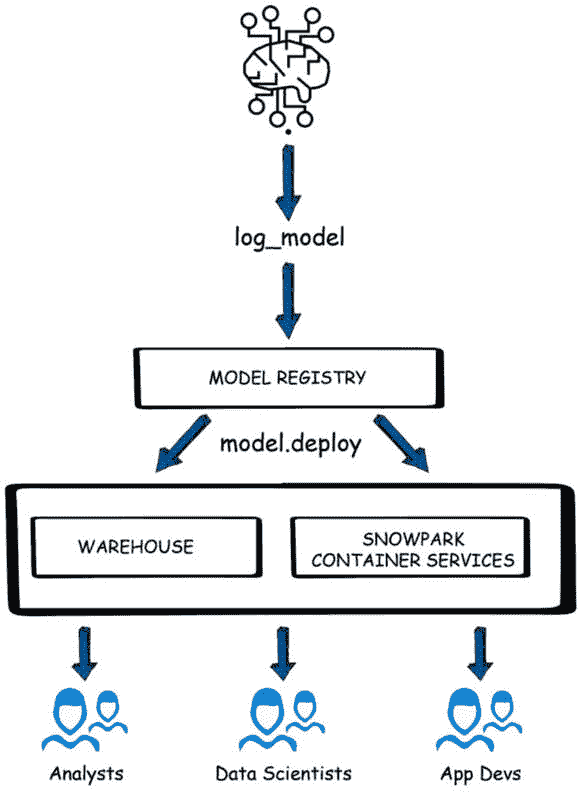

图 6.1 – 将模型部署到模型注册表

模型注册表是一个 Python API，它管理 Snowflake 环境中的模型，为 Snowflake 中的模型提供可扩展、安全的部署和管理能力。Snowpark 模型注册表建立在原生的 Snowflake 模型实体之上，集成了内置的版本支持，以实现更流畅的模型管理。

### 准备模型

为了说明模型注册过程，我们将高效地构建一个使用最少参数的 XGBoost 模型，利用 *共享自行车* 数据集上的网格搜索。上一章中准备的 `BSD_TRAINING` 表是我们构建 XGBoost 模型的基础数据集。

在这里，我们正在创建一个特征列表并找到标签和输出列：

```py
FEATURE_LIST = [ "HOLIDAY", "WORKINGDAY", "HUMIDITY", "TEMP", "ATEMP", 
    "WINDSPEED", "SEASON", "WEATHER"]
LABEL_COLUMNS = ['COUNT']
OUTPUT_COLUMNS = ['PREDICTED_COUNT']
df = session.table("BSD_TRAINING")
df = df.drop("DATETIME","DATE")
df.show(2)
```

这将打印出以下 DataFrame：

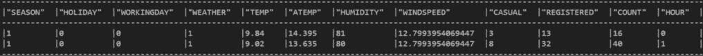

图 6.2 – 模型 DataFrame

为了简化，我们将专注于优化 XGBoost 中的两个参数：

```py
from snowflake.ml.modeling.model_selection import GridSearchCV
from snowflake.ml.modeling.xgboost import XGBRegressor
param_grid = {
    "max_depth":[3, 4, 5, 6, 7, 8],
    "min_child_weight":[1, 2, 3, 4],
}
grid_search = GridSearchCV(
    estimator=XGBRegressor(),
    param_grid=param_grid,
    n_jobs = -1,
    scoring="neg_root_mean_squared_error",
    input_cols=FEATURE_LIST,
    label_cols=LABEL_COLUMNS,
    output_cols=OUTPUT_COLUMNS
)
```

此代码使用 Snowflake 的 ML 模块执行梯度提升回归器的超参数调优网格搜索。它探索了 `max_depth` 和 `min_child_weight` 在指定范围内的组合，旨在根据提供的输入和标签列优化模型。

下一步的逻辑进展是将数据集划分为训练集和测试集：

```py
train_df, test_df = df.random_split(weights=[0.7, 0.3], seed=0)
grid_search.fit(train_df)
```

这种划分对于促进模型拟合至关重要，使我们能够在指定的训练数据集上训练模型。

#### 提取最佳参数

成功使用 XGBoost 模型训练我们的数据集后，下一步是确定通过网格搜索定义的最佳参数值。Snowpark ML 提供了一种与 `scikit-learn` 包中类似的方法。接下来的代码反映了提取这些最佳参数的步骤，并随后可视化它们，使过程易于理解：

```py
import pandas as pd
import seaborn as sns
import matplotlib.pyplot as plt
gs_results = grid_search.to_sklearn().cv_results_
max_depth_val = []
min_child_weight_val = []
for param_dict in gs_results["params"]:
    max_depth_val.append(param_dict["max_depth"])
    min_child_weight_val.append(param_dict["min_child_weight"])
mape_val = gs_results["mean_test_score"]*-1
```

上一段代码使用了 `pandas`、`seaborn` 和 `matplotlib` 来分析并可视化 Snowpark ML 模型的网格搜索结果。它提取了参数，例如 `max_depth` 和 `min_child_weight`，以及相应的 **平均绝对百分比误差**（**MAPE**）值以进行评估。以下代码展示了这些值：

```py
gs_results_df = pd.DataFrame(data={
    "max_depth":max_depth_val,
    "min_child_weight":min_child_weight_val,
    "mape":mape_val})
sns.relplot(data=gs_results_df, x="min_child_weight",
    y="mape", hue="max_depth", kind="line")
```

上一段代码从列出的 `max_depth`、`min_child_weight` 和 `mape` 值创建了一个名为 `gs_results_df` 的 `pandas` DataFrame。然后它使用 `seaborn` 生成线图，可视化学习率、MAPE 分数和不同估计器数量之间的关系。最后，`matplotlib` 的 `plt.show()` 命令显示了以下图表：

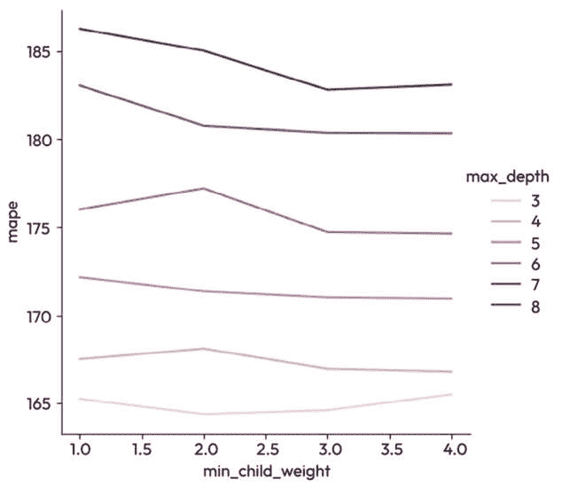

图 6.3 – 数据图

仔细观察前面的图表，可以明显看出 `max_depth` 值为 `8` 与 `min_child_weight` 学习率为 `2` 的组合产生了最佳结果。值得注意的是，与 `scikit-learn` 类似，Snowpark ML 提供了提取这些最佳参数的简化方法，简化了过程，提高了用户便利性：

```py
grid_search.to_sklearn().best_estimator_
```

代码将 Snowpark ML 网格搜索结果转换为与 `scikit-learn` 兼容的格式，然后检索最佳估计器，代表具有最佳超参数的模型：

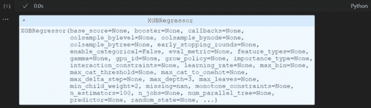

图 6.4 – Snowpark ML 网格搜索结果

在下一节中，我们将使用 Snowpark 模型注册表来记录模型。

### 记录最佳模型

拥有我们的最佳模型在手，模型注册表的关键阶段展开。与之前创建的模型非常相似，我们可以扩展此过程以涵盖多个模型，通过模型注册表逐一注册。在这种情况下，我们将只注册我们的最佳模型。我们将深入探讨如何逐步注册和无缝部署模型。

关于模型注册表和特征存储的说明

当我们编写本章时，模型注册表和特征存储都处于私有预览阶段。一旦它们对所有用户开放，API 方法可能与我们在这本书中看到的不同。

接下来，我们需要创建一个注册表来记录我们的模型：

```py
from snowflake.ml.registry import model_registry
registry = model_registry.ModelRegistry(session=session,
    database_name="SNOWPARK_DEFINITIVE_GUIDE",
    schema_name="MY_SCHEMA", create_if_not_exists=True)
ModelRegistry instance with session information, specified database, and schema names. If not existing, it creates a registry in the SNOWPARK_DEFINITIVE_GUIDE database and MY_SCHEMA schema.
```

以下代码准备记录模型到模型注册表所需的基本详细信息：

```py
optimal_model = grid_search.to_sklearn().best_estimator_
optimal_max_depth = \
    grid_search.to_sklearn().best_estimator_.max_depth
optimal_min_child_weight = \
    grid_search.to_sklearn().best_estimator_.min_child_weight
optimal_mape = gs_results_df.loc[
    (gs_results_df['max_depth']==optimal_max_depth) &
    (gs_results_df['min_child_weight']== \
        optimal_min_child_weight), 'mape'].values[0]
```

它提取了网格搜索确定的最佳模型，并检索了特定的超参数，如 `max_depth`、`min_child_weight` 和最佳参数值。

完成所有必要的模型注册步骤后，前面的代码无缝地将收集到的信息整合，以正式将我们的最佳 XGBoost 模型注册到模型注册表中：

```py
model_name = "bike_model_xg_boost"
model_version = 1
X = train_df.select(FEATURE_LIST).limit(100)
registry.log_model( model_name=model_name,
                    model_version=model_version,
                    model=optimal_model,
                    sample_input_data=X,
                    options={"embed_local_ml_library": True, \
                             "relax": True})
registry.set_metric(model_name=model_name,
                    model_version=model_version,
                    metric_name="mean_abs_pct_err",
                    metric_value=optimal_mape)
```

代码为模型分配了一个名称（`bike_model_xg_boost`）和一个版本（`1`），并将其与相关的详细信息（包括样本输入数据和特定选项）一起记录到注册表中。此外，它为注册的模型设置了一个自定义指标，MAPE（`mean_abs_pct_err`），以及其对应的值（`optimal_mape`）。为了验证注册成功，执行以下代码：

```py
registry.list_models().to_pandas()
```

这将确认我们的 XGBoost 模型和梯度提升模型（此处仅展示 XGBoost 模型以避免不必要的重复）是否适当地列在模型注册表中：

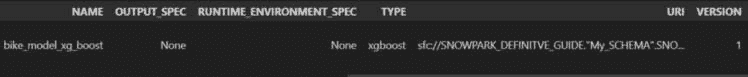

图 6.5 – 已注册到模型注册表的模型

在使用各种模型和参数配置进行实验的迭代旅程中，我们通过一种结构化的方法，勤奋地将每个模型在模型注册表中注册，确保每个经过微调和优化的模型都能高效地存储以供将来使用。在下一节中，我们将使用 Snowpark MLOps 从注册表中部署模型并预测其结果。

### 模型部署

在前面的章节中，我们 navigated the intricate landscape of deploying models through complex **用户定义函数**（**UDFs**）或存储过程。然而，新的 Snowpark 模型注册表简化了繁琐的过程。它通过提供一个简化和标准化的框架来处理生产环境中的预测模型，从而增强了模型的可维护性。这种方法论的转变优化了运营效率，并与数据科学动态领域的当代实践无缝对接。标准的模型部署将遵循以下命名约定：

```py
model_deployment_name = model_name + f"{model_version}" + "_UDF"
registry.deploy(model_name=model_name,
                model_version=model_version,
                deployment_name=model_deployment_name,
                target_method="predict",
                permanent=True,
                options={"relax_version": True})
predict target method, ensuring permanence in the deployment. Additionally, it includes an option to relax version constraints during deployment. Just as we’ve showcased the catalog of registered models, an equivalent insight into deployed models can be obtained using the following line of code:
```

```py
registry.list_deployments(model_name, model_version).to_pandas()
```

此功能提供了系统内从注册到部署的模型全面视图：

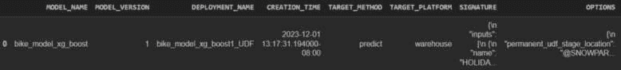

图 6.6 – 自行车模型部署

现在，让我们利用我们的部署模型来推断测试数据的预测，并评估我们的预测与实际结果之间的准确性：

```py
model_ref = model_registry.ModelReference(
    registry=registry,
    model_name=model_name,
    model_version=model_version)
result_sdf = model_ref.predict(
    deployment_name=model_deployment_name,
    data=test_df)
result_sdf.show()
```

代码初始化一个`ModelReference`对象，通过引用其名称和版本链接到注册表中的特定模型。随后，它利用此引用使用指定的部署预测提供的测试数据，结果生成一个 Snowpark DataFrame（`result_sdf`）。最后，它通过`show()`方法显示预期结果，如下面的截图所示：

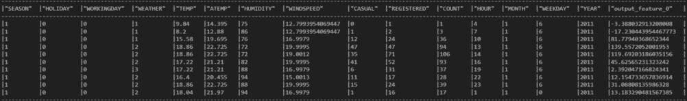

图 6.7 – 模型结果 DataFrame

在观察了涵盖模型开发、注册和部署的全面周期后，值得注意的是，此过程可以通过模型注册表复制到任何模型构建任务中。在下一节中，我们将阐明模型注册表中固有的几个有益方法，提高其可用性并增强整体建模体验。现在我们已经部署了模型，我们将探讨其他模型注册表方法。

### 模型注册表方法

除了概述的模型部署功能外，模型注册表通过几个旨在有效维护和日常管理活动的有益方法扩展了其效用。在本节中，我们将探讨这些方法中的一些，以增强我们对其实际应用的了解。我们将从模型指标开始。

#### 模型指标

将指标链接到您的模型版本是模型注册库中的一个关键功能。此功能作为基本方面，提供了一种系统性的方法来区分测量每个模型版本的性能。通过关联指标，用户可以获得关于不同迭代有效性的宝贵见解，便于根据跨各个版本的模型性能的定量评估做出明智的决策。它还有助于自动化流程，如果模型指标低于阈值值，则重新训练。这种故意的指标集成丰富了全面的模型管理功能，并建立了一个结构化的框架，用于持续模型评估和改进：

```py
registry.set_metric(model_name=model_name,
                    model_version=model_version,
                    metric_name="mean_abs_pct_err",
                    metric_value=optimal_mape)
```

上一行设置了一个自定义指标 `mean_abs_pct_err`，用于模型注册库中特定模型版本，将计算出的 MAPE 值分配给该模型以量化其性能。这增强了模型注册库跟踪和评估不同模型版本有效性的能力：

```py
registry.get_metric_value(model_name=model_name,
                          model_version=model_version,
                          metric_name="mean_abs_pct_err")
```

这将打印以下输出：

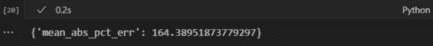

图 6.8 – mean_abs_pct_err 的 MAPE 值

除了设置之外，我们还可以从模型注册库中检索与特定模型版本关联的特定自定义指标 `mean_abs_pct_err` 的值。它允许用户访问和分析定量性能指标，以进行实际模型评估和不同版本之间的比较：

```py
registry.get_metrics(model_name=model_name, 
    model_version=model_version)
```

类似于检索已部署模型的特定指标，类似的方法允许我们访问给定已部署模型的所有相关指标的综合列表。这有助于全面理解模型性能，提供有关其评估的各种指标的详细概述，有助于对其有效性进行全面分析：

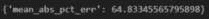

图 6.9 – mean_abs_pct_err 的指标

我们可以在注册库中找到模型的指标值。在下一节中，我们将介绍模型标签和描述。

#### 模型标签和描述

为已部署模型设置标签名称和描述对于有效的实验跟踪和文档至关重要。标签和描述提供了关于模型目的、配置和显著特性的背景和见解。这有助于维护结构化和信息化的记录，提高可重复性，并促进对实验结果的更全面分析：

```py
registry.set_tag(model_name=model_name,
                 model_version=model_version,
                 tag_name="usage",
                 tag_value="experiment")
registry.list_models().to_pandas()[["NAME", "TAGS"]]
```

提供的代码首先为模型注册库中特定模型版本设置了一个名为 `stage` 的标签，值为 `experiment_1`。这种标记是模型目的或使用的上下文标记。随后的行检索并显示所有模型的名称及其相关标签，展示了每个模型的标记信息：

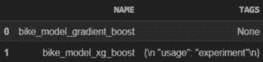

图 6.10 – 模型标签

另一个值得注意的方面是，可以根据需要修改和删除标签，允许动态调整我们的实验设计。这种能力使用户能够迭代地改进与模型关联的上下文信息，提供有意义的、不断发展的标签。修改和删除标签的能力增强了实验设计的灵活性。它确保了模型周围的文档和上下文能够适应实验生命周期中不断变化的见解和要求：

```py
registry.remove_tag(model_name=model_name,
                    model_version=model_version,
                    tag_name="usage")
registry.list_models().to_pandas()[["NAME", "TAGS"]]
```

提供的代码启动从模型注册表中删除特定标签的操作，该标签名为`usage`，针对特定模型版本。在此操作之后，下一行检索并以表格格式显示所有模型的名称及其关联的标签。这展示了删除指定标签后的更新信息，提供了模型及其更改的标签配置的全面视图：

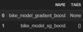

图 6.11 – 移除的模型标签

我们还可以为部署的模型提供描述性信息，提供有价值的背景知识并有助于未来的参考。提供有意义的描述增强了模型目的、配置或其他相关细节的可理解性。以下代码块是自我解释的，并反映了设置标签的过程，它允许将描述性叙述分配给部署的模型，确保关键信息在后续分析或实验中得以封装：

```py
registry.set_model_description(model_name=model_name,
    model_version=model_version,
    description="this is a test model")
print(registry.get_model_description(model_name=model_name,
    model_version=model_version))
```

模型描述已设置并可检索以在屏幕上显示：

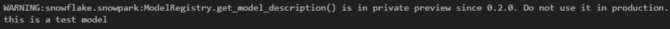

图 6.12 – 模型描述

现在我们已经设置了模型标签和描述，我们将探讨如何访问注册表的历史记录。

#### 注册表历史

访问注册表历史是一项非常有价值的特性，它提供了模型版本、相关指标、标签和描述的按时间顺序的记录。这种历史视角增强了模型开发中的透明度，并使数据科学家能够做出明智的决定，跟踪性能趋势，并精确地迭代改进模型。因此，ML 注册表及其历史跟踪功能成为数据科学工具箱中的关键资产，促进了模型开发、部署和持续改进的结构化和高效方法：

```py
registry.get_history().to_pandas()
```

代码检索并将模型注册表的整个历史记录转换为`pandas` DataFrame，以表格形式全面展示所有记录的事件和变更：

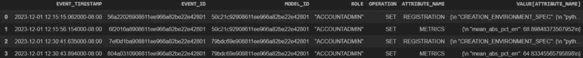

图 6.13 – 注册表历史

在注册表历史记录中缩小搜索范围是一种常见做法，可以通过指定模型名称和版本来实现。这种有针对性的过滤允许进行更深入的探索，与在模型注册表历史记录中导航时的典型偏好相一致：

```py
registry.get_model_history(model_name=model_name,
    model_version=model_version).to_pandas()
```

此代码获取并转换特定模型版本的特定历史记录，通过其名称和版本标识，将其转换为`pandas` DataFrame：

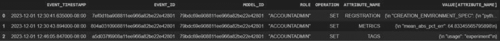

图 6.14 – 注册表历史过滤器

生成的 DataFrame 提供了与该特定模型版本在注册表中相关的所有事件和变化的详细时间记录。在下一节中，我们将学习关于模型注册表的操作。

#### 模型注册表操作

在当代机器学习领域，模型的生命周期正在不断缩短，导致部署模型的持续时间变短。同时，具有不同参数的实验产生了许多模型，它们的后续部署被注册。这种激增需要一种深思熟虑的方法来管理模型，包括定期的清理过程，以保持模型注册表的流畅和高效：

```py
registry.delete_deployment(model_name=model_name,
    model_version=model_version,
    deployment_name=model_deployment_name)
    registry.list_deployments(model_name, model_version).to_pandas()
```

上一段代码通过模型名称、版本和部署名称从模型注册表中删除特定的部署实例，确保部署模型的清理和管理高效：


图 6.15 – 删除特定部署

它作为删除过时或不希望部署的方法。我们还可以使用以下代码从注册表中删除整个模型：

```py
registry.delete_model(model_name=model_name,
    model_version=model_version)
registry.list_models().to_pandas()
```

与删除部署类似，此代码将从模型注册表中删除一个模型：

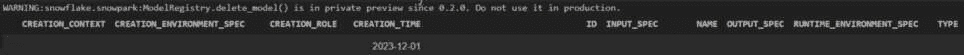

图 6.16 – 删除模型

我们可以看到整个模型已从注册表中删除。在下一节中，我们将探讨模型注册表的好处。

### 模型生命周期中模型注册表的好处

Snowpark 模型注册表简化了整个生命周期中机器学习模型的管理。让我们深入了解 Snowpark 中的模型注册表如何协助机器学习模型生命周期的各个阶段：

1.  **模型开发**：在开发阶段，数据科学家可以使用 Snowpark 在 Snowflake 中直接构建、训练和验证机器学习模型。模型注册表提供了一个集中位置来存储和版本控制这些模型，使得跟踪更改、比较性能和与团队成员协作变得更加容易。

1.  **模型部署**：一旦模型经过训练和验证，就需要将其部署到生产环境中进行推理。模型注册表通过提供跨不同环境的标准化接口来促进无缝部署，确保模型部署过程的连贯性和可靠性。

1.  **模型监控**：监控已部署模型的性能对于检测漂移并确保随着时间的推移持续准确性至关重要。模型注册表可以与监控工具集成，以跟踪模型性能指标，如准确率、精确率、召回率和 F1 分数，从而实现主动维护和优化。

1.  **模型治理**：确保符合监管要求和组织政策对于负责任的 AI 部署至关重要。模型注册表通过提供访问控制、审计日志和版本控制等功能来支持治理，这有助于组织在整个模型生命周期中保持可见性和控制力。

1.  **模型再训练和更新**：机器学习模型需要定期再训练和更新以适应不断变化的数据分布和业务需求。模型注册表通过允许数据科学家使用更新的数据和算法无缝再训练模型，同时保留模型版本的世系和历史，简化了这一过程。

1.  **模型退役**：随着模型变得过时或被更新的版本所取代，它们需要优雅地退役。模型注册表通过存档过时模型、记录退役原因并确保相关利益相关者得到变更通知来简化退役过程。

模型注册表提供了一个有组织的框架用于模型管理，并提供了高效维护的功能，包括设置和跟踪指标、标签和描述。注册表的历史跟踪功能已成为一个有价值的特性，使用户能够深入了解模型随时间演化的过程。标签和描述提供了上下文，并促进了实验跟踪，以便访问和过滤注册表的历史记录，从而实现对模型相关活动的全面视图。总的来说，模型注册表成为 Snowpark ML 的一个强大补充，集中管理模型，促进实验，并确保模型开发和部署的流程流畅且有序。

总体而言，Snowpark 中的模型注册表在简化机器学习模型的生命周期方面发挥着关键作用，从开发、部署到监控、治理、再训练和退役。通过提供一个集中平台来管理模型，它帮助组织最大化其机器学习投资的效益，同时最小化运营成本和风险。

# 管理 Snowpark 模型数据

在上一节中，我们介绍了使用模型注册表部署机器学习模型。本节将探讨使用特征存储管理 Snowpark 模型。Snowpark ML 特征存储简化了特征工程过程，对于机器学习至关重要，它显著影响了基于所采用特征的质量的模型性能。本章将帮助我们了解使用特征存储和管理 Snowpark 模型。 

## Snowpark 特征存储

Snowpark 特征存储库是为数据科学家和机器学习工程师提供的一体化解决方案。它简化了机器学习特征在模型训练和推理过程中的创建、存储、管理和提供，并通过 Snowpark 机器学习库进行访问。特征存储库定义、管理和检索特征，由一个用于特征元数据管理和持续特征处理的托管基础设施支持。其主要功能是使这些特征能够方便地用于未来机器学习模型的持续开发。特征存储库在机器学习特征工程领域的数据输入、跟踪和管理中发挥着关键作用：


图 6.17 – 特征存储库

通过利用 Snowpark 特征存储库，该库旨在通过提供更高的效率来简化并增强这一过程，数据科学家和机器学习从业者可以保持模型训练、版本控制和推理特征的单一、更新源。我们将使用*共享单车*数据集和前一小节中开发的机器学习模型来展示特征存储库如何增强模型开发和部署周期。

## 特征存储库的好处

利用特征存储库为机器学习项目提供了几个好处。首先，它们通过保存已开发的特征，允许快速访问和重新用于新的机器学习模型，从而节省时间和精力。其次，它们通过提供一个集中注册所有机器学习特征的注册表，确保跨团队保持一致的定义和文档。第三，特征存储库通过集中管理特征管道，确保训练和推理之间的一致性，并持续监控数据管道中的任何差异，帮助维持模型的最佳性能。

此外，特征存储库通过提供有关每个机器学习模型训练数据和部署数据的详细信息，增强了安全和数据治理，促进了迭代和调试。将特征存储库与云数据仓库集成增强了数据安全性，确保模型和训练数据都得到保护。最后，特征存储库通过提供一个集中平台，用于开发、存储、修改和共享机器学习特征，促进了团队间的协作和思想共享，适用于多种商业应用。

## 特征存储库与数据仓库的比较

深入探讨特征存储库与数据仓库之间的区别，有助于了解它们在增强机器学习项目价值中的协作作用。

### 相似性 – 共同特性和功能

特征存储库和数据仓库在运营方法上表现出相似之处。它们都依赖于 **提取、转换、加载**（**ETL**）管道来促进数据管理和可访问性。此外，它们作为具有元数据的存储库，促进了组织团队之间的无缝数据共享和利用。

### 最终用户 – 定制化效用

一个显著的差异在于它们的主要用户群体。数据仓库传统上服务于深陷于生成全面业务报告的分析师，深入历史数据以获取战略洞察。相反，特征存储库专门服务于沉浸在预测 ML 模型开发中的数据科学家。虽然后者可能从数据仓库中获取补充洞察，但他们的核心功能是利用特征存储库以简化模型开发和推理。

### 数据类型 – 结构差异

结构上，数据仓库在具有良好定义模式的数据库中存储特定领域的数据。这种结构化格式简化了相关信息的查询和检索，非常适合分析工作。相反，特征存储库包含用于 ML 模型训练的关键特征值集合。这些值包括定量和分类变量，为模型开发过程提供了细粒度的洞察。

### ETL 管道 – 分歧的轨迹

ETL 管道的运营动态进一步突出了特征存储库和数据仓库之间的差异。数据仓库中的 ETL 流程主要关注数据清洗和转换，确保在定义的方案中数据的准确性和一致性。相比之下，特征存储库的管道则涉及更复杂的旅程，包括数据提取、转换和特征工程。特征存储库中的转换通常涉及复杂的计算和聚合，以提炼对模型训练和推理至关重要的复杂洞察，强调了它们在 ML 生命周期中的关键作用。

现在我们已经掌握了特征存储库的本质，理解了它们与数据仓库的区别和重要性，让我们更深入地探讨构成特征存储库的各个组成部分。

在下一节中，我们将开始创建一个针对 *共享单车* 数据集的基本特征存储库，专注于与天气相关的特征。这个过程包括以下步骤：

1.  创建特征存储库

1.  创建特征实体

1.  选择和转换天气特征

1.  创建一个特征视图

1.  生成包含特征视图的丰富数据集

1.  构建一个由丰富数据集支持的 ML 模型

1.  促进基于训练模型的预测

让我们详细讨论每一个。

#### 创建一个特征存储库

开始使用 Snowflake 特征存储涉及创建一个新的特征存储或连接到现有的一个。这是通过向`FeatureStore`构造函数提供特定细节来完成的，包括 Snowpark 会话、数据库名称、特征存储名称和默认仓库名称。`creation_mode`参数对于确定是否应该创建一个新特征存储（如果不存在）至关重要。为了实现这一功能，我们将使用以下代码：

```py
from snowflake.ml.feature_store import (
    FeatureStore, FeatureView, Entity, CreationMode)
fs = FeatureStore(
    session=session,
    database="SNOWPARK_DEFINITIVE_GUIDE",
    name="BIKE_SHARING_FEATURES",
    default_warehouse="COMPUTE_WH",
    creation_mode=CreationMode.CREATE_IF_NOT_EXIST,
)
```

这将打开一个到特征存储的会话，并允许在 Snowpark 会话中访问它。下一步将是设置此特征存储上的特征实体。

#### 创建特征实体

实体是与特征和特征视图相关的基本元素，通过定义连接键为特征查找提供基石。用户可以生成新的实体并在特征存储中正式注册它们，从而促进各种特征之间的连接和关系。此代码创建了一个名为`WEATHER`的实体，具有`ID`连接键，将其注册在特征存储（`fs`）中，然后显示特征存储中的实体列表：

```py
entity = Entity(name="ENTITY_WEATHER", join_keys=["ID"])
fs.register_entity(entity)
fs.list_entities().show()
```

这将生成以下输出：

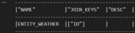

图 6.18 – 特征实体

`ENTITY_WEATHER`实体已创建，ID 作为连接键。下一步是设置特征视图。

#### 创建特征视图

在特征存储中，特征视图充当综合管道，系统性地将原始数据在固定时间间隔内转换为相互关联的特征。这些特征视图从指定的源表实例化，确保在引入新数据时增量且高效地更新。在我们之前的章节中，我们探索了一个包含各种天气相关特征的数据集。为了有效地预处理这些数据，我们使用了 Snowpark 管道。

通过这个管道，我们对`SEASON`和`WEATHER`列使用了独热编码技术进行转换。此外，我们对`TEMP`列进行了归一化，以确保一致性并便于模型训练。鉴于我们在之前的章节中详细讨论了此管道的每个步骤，我们将简要回顾它，更多地关注高级概述而不是深入解释：

```py
import snowflake.ml.modeling.preprocessing as snowml
from snowflake.ml.modeling.pipeline import Pipeline
from snowflake.snowpark.types import IntegerType
# CREATING ID COLUMN
from snowflake.snowpark.functions \
    import monotonically_increasing_id
df = df.withColumn("ID", monotonically_increasing_id())
df = df.drop("DATETIME","DATE")
CATEGORICAL_COLUMNS = ["SEASON","WEATHER"]
CATEGORICAL_COLUMNS_OHE = ["SEASON_OE","WEATHER_OE"]
MIN_MAX_COLUMNS = ["TEMP"]
import numpy as np
categories = {
    "SEASON": np.array([1,2,3,4]),
    "WEATHER": np.array([1,2,3,4]),
}
```

这个代码块利用了 Snowflake 的机器学习能力进行数据预处理。它导入了必要的模块，例如预处理函数和`Pipeline`类。代码创建了一个新的`ID`列，为每一行提供唯一的标识符，并删除了不必要的列。它定义了分类列及其经过独热编码后的版本列表，以及需要归一化的列。此外，它还指定了每个分类列的类别，可能用于编码目的，从而便于有效的机器学习模型处理：

```py
preprocessing_pipeline = Pipeline(
    steps=[
        (
            "OE",
            snowml.OrdinalEncoder(
                input_cols=CATEGORICAL_COLUMNS,
                output_cols=CATEGORICAL_COLUMNS_OHE,
                categories=categories
            )
        ),
        (
            "MMS",
            snowml.MinMaxScaler(
                clip=True,
                input_cols=MIN_MAX_COLUMNS,
                output_cols=MIN_MAX_COLUMNS,
            )
        )
    ]
)
transformed_df = preprocessing_pipeline.fit(df).transform(df)
transformed_df.show()
```

在第一步中，对 `CATEGORICAL_COLUMNS` 列表中指定的类别列应用有序编码器 (`OE`)，将其转换为 `CATEGORICAL_COLUMNS_OHE` 列表中定义的独热编码版本。`categories` 参数指定每个类别列的类别，可能用于编码目的。

在第二步中，使用 min-max 缩放器 (`MMS`) 对 `MIN_MAX_COLUMNS` 列表中指定的列进行归一化。此缩放器确保这些列中的值缩放到特定的范围，通常是 `0` 到 `1` 之间，同时保留它们的相对比例。

预处理管道随后应用于 `df` DataFrame，使用 fit-transform 模式，其中管道首先拟合到数据以学习参数（例如，用于有序编码的类别映射），然后应用于转换 DataFrame。转换后的 DataFrame 然后使用 `show()` 方法显示。总体而言，此代码通过使用指定的管道预处理其列，为进一步分析或模型训练准备 DataFrame。结果 DataFrame 如下所示：

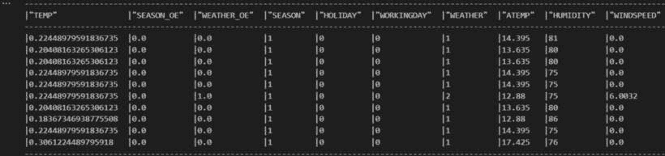

图 6.19 – 转换后的 DataFrame

在整个模型构建过程中，使用特征子集构建了各种模型，例如天气特征和时间相关特征。此外，通过组合数据开发模型以确保卓越的性能。为了加速模型构建过程并减少数据工程开销，我们将与天气相关的特征组织到一个专用的特征视图中。随后，我们将利用这个特征视图在接下来的部分生成数据集并构建 XGBoost 模型：

```py
feature_df = transformed_df.select(["SEASON_OE",
    "WEATHER_OE", "TEMP", "ATEMP", "HUMIDITY",
    "WINDSPEED", "ID"])
fv = FeatureView(
    name="WEATHER_FEATURES",
    entities=[entity],
    feature_df=feature_df,
    desc="weather features"
)
fv = fs.register_feature_view(
    feature_view=fv,
    version="V1",
    block=True
)
fs.read_feature_view(fv).show()
```

代码从 DataFrame 中选择特定列以创建特征 DataFrame (`feature_df`)。然后，它构建一个名为 `WEATHER_FEATURES` 的特征视图，与之前定义的实体相关联，并在特征存储库 (`fs`) 中以版本 `V1` 注册。结果 DataFrame 如下所示：

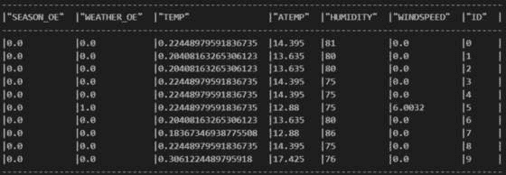

图 6.20 – 特征 DataFrame

一旦开发完成，特征可以系统地存储在特征存储库中，从而促进它们在各种机器学习模型和团队之间的重用或无缝共享。这一功能显著加速了新机器学习模型的创建，消除了从头开始构建每个特征的冗余。同样，我们可以通过组合相似的特征来创建另一个特征视图，作为租赁特征。

#### 准备数据集

一旦我们的特征管道被精心配置并准备就绪，我们可以启动它们的部署以生成训练数据。随后，这些特征管道成为促进模型预测的关键工具，标志着从特征工程到机器学习模型实际应用的顺利过渡：

```py
#GENERATING TRAINING DATA
spine_df = session.table("BSD_TRAINING")
spine_df = spine_df.withColumn("ID",
    monotonically_increasing_id())
spine_df = spine_df.select("ID", "COUNT")
spine_df.show()
train_data = fs.generate_dataset(
    spine_df=spine_df,
    features=[
        fv.slice([
            "HUMIDITY","SEASON_OE","TEMP",
            "WEATHER_OE","WINDSPEED"
        ])
    ],
    materialized_table=None,
    spine_timestamp_col=None,
    spine_label_cols=["COUNT"],
    save_mode="merge",
    exclude_columns=['ID']
)
train_data.df.show()
```

创建训练数据变得简单，因为物化特征视图本身包含关键元数据，如用于**点时间**（**PIT**）查找的连接键和时间戳：

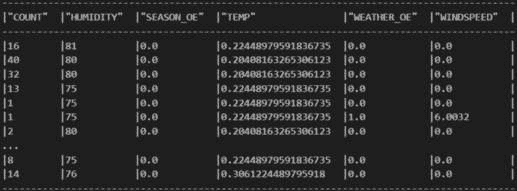

图 6.21 – 训练数据

该过程主要涉及提供脊柱数据——之所以称为脊柱数据，是因为它作为由特征连接丰富的基础结构。在我们的案例中，脊柱数据包括要预测的特征——`COUNT`——以及连接键列 ID。此外，通过切片，可以灵活地生成包含特征视图内特征子集的数据集。现在我们已经准备好了训练数据，我们将使用它来训练模型并使用特征存储库预测数据输出。 

所有数据的准备——无论是用于训练还是运营使用——都需要通过特征管道进行细致的处理。这些管道类似于传统数据管道，它们汇总、验证和转换数据输出，使其适合输入到 ML 模型中。适当的特征管道编排确保在数据被输入到模型之前对其进行精炼，从而保持从训练过程中提取的特征的完整性和相关性。

#### 模型训练

在前一章中，我们详细介绍了模型构建过程，因此在本节中，我们将专注于使用从特征存储库的特征视图生成的训练数据集来构建模型。我们在训练梯度提升模型时使用了与上一章类似的方法，但只是使用了特征视图：

```py
from snowflake.ml.modeling.model_selection import GridSearchCV
from snowflake.ml.modeling.ensemble \
    import GradientBoostingRegressor
FEATURE_LIST = ["TEMP", "WINDSPEED", "SEASON_OE", "WEATHER_OE"]
LABEL_COLUMNS = ['COUNT']
OUTPUT_COLUMNS = ['PREDICTED_COUNT']
param_grid = {
    "n_estimators":[100, 200, 300, 400, 500],
    "learning_rate":[0.1, 0.2, 0.3, 0.4, 0.5],
}
grid_search = GridSearchCV(
    estimator=GradientBoostingRegressor(),
    param_grid=param_grid,
    n_jobs = -1,
    scoring="neg_root_mean_squared_error",
    input_cols=FEATURE_LIST,
    label_cols=LABEL_COLUMNS,
    output_cols=OUTPUT_COLUMNS
)
train_df = train_data.df.drop(["ID"])
grid_search.fit(train_df)
```

Snowpark 的优雅之处体现在这种简单性上，因为使用特征视图无缝训练模型不需要进行任何重大修改。我们将创建测试数据，使用以下代码测试模型的准确性：

```py
test_df = spine_df.limit(3).select("ID")
enriched_df = fs.retrieve_feature_values(
    test_df, train_data.load_features())
enriched_df = enriched_df.drop('ID')
enriched_df.show()
```

这通过从 `spine_df` 的前三行中选择 `ID` 列创建了一个测试 DataFrame (`test_df`)。然后，它使用特征存储库和从特征视图生成的训练数据检索并显示测试数据框的特征值：

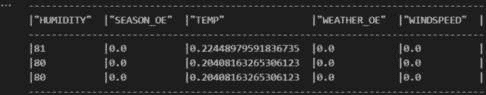

图 6.22 – 测试数据

现在测试数据已经准备好了，我们可以使用这些数据来预测模型并获取结果。

#### 模型预测

在本节中，我们将使用从特征存储库生成的测试数据来进行预测：

```py
pred = grid_search.predict(enriched_df.to_pandas())
pred.head()
```

预测结果显示了预测的计数值，显示了在给定小时使用共享自行车的客户数量：

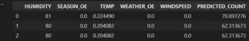

图 6.23 – 模型预测

这展示了使用特征存储库构建 Snowpark ML 模型的简便性和改进。在下一节中，我们将强调使用特征存储库的一些好处。

## 何时使用特征存储库以及何时避免使用特征存储库

特征存储库在需要高效管理特征并在多个模型或团队之间重用的情况下特别有利。它们在以下场景中表现出色：

+   **特征重用**：特征需要在不同的机器学习模型或团队之间重用或共享，以减少特征工程中的重复工作

+   **一致性和治理**：确保在多样化的机器学习项目或团队中，特征的定义、文档和治理保持一致至关重要

+   **模型性能**：通过确保训练和推理管道中特征定义的一致性来维持模型性能的峰值，从而避免由于差异导致的性能下降

+   **数据协作**：通过提供一个集中平台用于特征开发、存储、修改和共享，促进涉及机器学习项目的不同团队或利益相关者的协作

+   **可扩展性**：高效处理大量特征和数据，尤其是在数据持续演变或更新的环境中

然而，在以下场景中，特征存储可能并非必要：

+   **简单模型**：对于具有少量特征和最小复杂性的简单模型，设置和维护特征存储的开销可能超过其带来的好处

+   **静态数据**：在数据相对静态且不需要频繁更新或特征工程的情况下，对特征存储的需求可能有限

+   **有限的协作**：当机器学习项目涉及一个规模小、紧密合作的团队，且不需要广泛协作或特征共享时，使用特征存储可能是不必要的

+   **资源限制**：资源或基础设施有限的组织可能发现有效实施和维护特征存储具有挑战性

总结来说，虽然特征存储为机器学习项目中的高效特征管理提供了众多好处，但其采用应根据每个项目或组织的具体需求和限制进行仔细考虑。

# 摘要

本章讨论了模型注册表以及有意义的标签和描述的重要性，提供了上下文并促进了实验跟踪。我们还强调了操作模型注册表的不同方法。我们探讨了 Snowflake Feature Store 在 Snowpark ML 生态系统中的功能，以及如何利用它来管理 Snowflake 模型。

在下一章中，我们将学习如何使用 Snowpark 框架开发原生应用程序。
