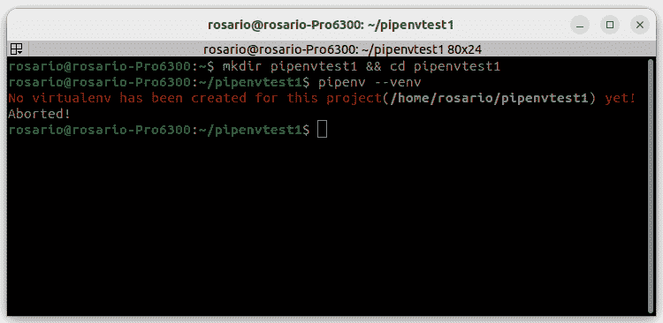

# 第二章：设置 Python 编程环境

在开始使用 Streamlit 编程之前，我们需要准备好开发环境。设置 Python 编程环境，特别是在 Linux 系统中（例如 Ubuntu），可以通过几个简单的步骤完成：更新（或安装）Python，安装代码编辑器或 IDE（可以选择免费的，例如**Sublime Text**），设置虚拟环境（本书中使用的是**pipenv**，但其他工具也可以），安装依赖项。完成这些步骤后，我们应该能拥有一个完全可用的 Python 编程环境（无论是在 Ubuntu 还是其他任何**操作系统**（**OS**）上），可以用于开发我们的 Web 应用。

本章将介绍环境配置。我们需要准备好所有工具，以便顺利、高效地使用 Streamlit 进行开发。因此，首先，我们需要选择操作系统（OS），可以是物理机或虚拟机，支持 Windows、macOS 或 Linux（我们首选的解决方案）。接下来，我们需要决定使用哪种编辑器或**集成开发环境**（**IDE**）来进行编码。某些编辑器非常高级且昂贵，而其他一些则简单但免费的。最后，我们将讨论虚拟环境及其使用优势。

在本章中，我们将讨论以下主要内容：

+   设置操作系统

+   IDE 选择

+   什么是虚拟环境？

# 技术要求

在本章中，我们将使用以下库、包和工具：

+   VirtualBox

+   Ubuntu

+   Python 3

    +   Sublime Text

    +   `pipenv`

    +   `pipenv`-管道

# 设置操作系统

拥有一个高效的环境是至关重要的。操作系统是所有内容运行的地方。即使我们首先需要选择操作系统，从这个角度来看，我们其实是幸运的，因为 Streamlit 是基于 Python 的框架。这个编程语言几乎可以在任何操作系统上运行，所以我们可以自由选择我们想要的操作系统——例如 macOS、Windows、任何 Linux 发行版，或者如果你喜欢，甚至是任何 BSD 系统。

出于几个我们稍后会解释的原因，我们首选 Ubuntu。如果你对其使用或安装有所顾虑，请放轻松，因为首先，Ubuntu 使用起来非常简单。而且，如果你不想将其作为唯一操作系统安装在机器上，你完全可以使用虚拟化软件，这是一种非常有用的工具，可以让你在一个操作系统内部运行另一个操作系统！此外，掌握如何管理虚拟化工具并在其上安装任何操作系统，将是未来非常有用的技能！

由于我们不仅需要操作系统，还需要其他工具（如 IDE），因此最佳选择可能是采用免费工具以保持成本尽可能低。因此，为了最小化开支，我建议你使用 Ubuntu，这是一款非常用户友好、易于使用和安装的 Linux 发行版。你可以从 Ubuntu 的官方网站（[`ubuntu.com/`](https://ubuntu.com/)）下载并安装到你的计算机上：


图 2.1：Ubuntu 首页

如果你不想将 Ubuntu 与主操作系统并行安装（即不使用“双重启动”模式），并且想避免在启动计算机时需要选择 Linux 发行版，那么可以考虑使用虚拟化软件。最终的选择取决于你的个人喜好。主要目标是使你能够在主操作系统中运行 Ubuntu，将其视为一个普通的软件程序。一种非常有效且免费的解决方案是 Oracle VirtualBox，它适用于任何类型的操作系统：


图 2.2：VirtualBox 首页

无论你是使用真实的 Ubuntu 操作系统还是虚拟化版本，都没有关系；关键是你能够启动并使用它。当你运行新安装的 Linux Ubuntu 时，请在终端中输入以下命令进行更新：

```py
sudo apt update
```

现在，是时候检查系统是否安装了 Python 了，因此打开终端并简单输入以下命令：

```py
python3
```

你应该得到一些内容，类似于以下图片：


图 2.3：Ubuntu 终端中的 Python 3

如我们所见，Python 3 已经在 Ubuntu 中安装，当我们输入`python3`时，可以进入 Python 并开始编程。在*图 2.3*中，我们只打印了一个漂亮的`Hello Streamlit!`消息，然后退出。

如果在输入`python3`时遇到错误，可能是你的系统将 Python 作为`python`而不是`python3`。在这种情况下，你应该使用`python`而不是`python3`。

让我们检查一下`pip`是否安装在我们的 Ubuntu 系统中。输入以下命令：

```py
pip --version (or pip3 --version)
```

如果`pip`没有安装，我们可以通过输入以下命令来安装它：

```py
sudo apt install python3-pip
```

在下图中，我们可以看到`pip`安装是多么简单：


图 2.4：pip3 安装

现在，为了熟悉`pip`，我们将安装几个将来非常有用的工具：`tree`和`terminator`。

`tree`是一个简单的工具，用于在终端中以树状图形式可视化文件和文件夹。我们可以通过输入以下命令来安装它：

```py
sudo apt install tree
```

安装完成后，只需输入`tree`，你就能看到工作目录的漂亮树状图，如下图所示：


图 2.5：“tree”命令

`terminator`是一个替代终端，具有一些高级功能，比如水平和垂直分屏、焦点切换、缩放和偏好设置，但最重要的功能肯定是可以根据需要将屏幕分割成多个分屏。让我们通过输入以下命令来安装它：

```py
sudo apt install terminator
```

然后，安装完成后，只需输入`terminator`。如下面的图所示，通过右键点击，你可以创建任意数量的新的终端分屏，无论是垂直的还是水平的：


图 2.6：Terminator 及其分屏

最后，最重要的是要确保 Python 能够运行。我们更倾向于在 Ubuntu 上运行它，这样既便宜又简单，但如果你想使用自己的操作系统，也完全没有问题。只需要再次确认你是否已经安装了 Python 3 版本，如果没有，请从 Python 的官方网站下载并安装它（[`www.python.org/`](https://www.python.org/)），并选择与你的操作系统相匹配的版本：


图 2.7：Python 官方网站

到这个阶段，我们已经完成了大约 50%的工作，因为我们已经有了一个新鲜的操作系统，并且安装了 Python 和`pip`，同时还准备了一些很不错的工具，比如 terminator 和 tree。我们现在缺少的就是一个漂亮的编辑器，所以让我们来安装一个吧！

# IDE 选择

拥有一个好的 IDE 对于 Python 编程非常重要。它提供了许多有用的功能，帮助你更快速、更少出错地编写代码，并保持代码整洁且结构良好。例如，自动完成功能可以通过在你输入时建议代码补全，从而节省大量时间。这减少了打字错误。语法高亮使代码更易读，通过为不同的元素上色来区分。IDE 中的强大调试工具使得调试变得更加轻松和高效。重构功能有助于保持代码的结构清晰和可读。代码风格检查（Linting）可以检查你的代码是否符合风格规范，提高代码质量。

市面上有一些优秀的工具，比如 PyCharm 和 VSCode，但这些工具通常比较重且价格略贵。为了我们的编程会话，我们可以使用一款相对轻量的应用程序，至少在开始阶段，它可以免费安装和使用：Sublime Text。

Sublime Text 拥有许多不错的功能，你可以自行探索，包括编程语言识别和语法高亮。你可以直接从它的主页安装（[`www.sublimetext.com/`](https://www.sublimetext.com/)），并仔细按照说明进行操作：


图 2.8：Sublime Text 主页

现在，在 Terminator 的工作目录中，只需输入`subl .`，Sublime Text 就会打开。请在右下角的扩展列表中选择**Python**：


图 2.9：在 Sublime Text 中选择 Python 语法

考虑到 Python 已安装且 Sublime Text 已配置，我们可以立即开始使用 Streamlit 进行编码，但这不是最佳选择。在 Python 中，每次开始一个新项目时，我们倾向于安装一些特定的包和库，如果每次都把这些新的东西安装到相同的基本环境中，迟早我们环境会变得一团糟。避免这种潜在混乱的一个非常干净的方式就是使用虚拟环境，接下来我们来看看它们是什么。

# 什么是虚拟环境？

虚拟环境是 Python 开发中的有用工具，它允许你将与特定项目相关的包安装与系统的 Python 安装隔离开来。这意味着你可以为不同的项目创建具有不同包依赖项的独立环境。

使用 Python 标准库中的 `venv` 模块创建虚拟环境非常简单。基本步骤如下：

1.  通过运行以下命令创建虚拟环境：

    ```py
    venv folder that contains the isolated environment.
    ```

1.  激活虚拟环境。

    在 Unix/Linux 系统中，运行以下命令：

    ```py
    pip:

    ```

    pip install package-name

    ```py

    ```

1.  完成后，你可以通过以下命令停用环境并切换回全局 Python 安装：

    ```py
    deactivate
    ```

虚拟环境使你能够轻松尝试不同的包组合，而不会影响全局的 Python 安装或其他虚拟环境。

若要全面了解 Python 中的虚拟环境，请查看 Real Python 网站 ([`realpython.com/python-virtual-environments-a-primer/#use-third-party-tools`](https://realpython.com/python-virtual-environments-a-primer/#use-third-party-tools))：


图 2.10：Real Python 网站上的 Python 虚拟环境

除了内置的 `venv` 模块外，还有一些第三方工具，如 `virtualenv` 和 `pipenv`，用于管理 Python 中的虚拟环境。以下是使用这些第三方工具的各种好处：

+   `virtualenv` 和 `pipenv` 工具具有一些附加的便捷功能，使它们比 `venv` 模块更易于使用。例如，`pipenv` 会自动创建一个 **Pipfile** 来跟踪包的依赖关系和版本。

+   `pipenv` 同时管理环境和包依赖关系，使你的设置完全可重现。

+   `venv` 和 `pipenv` 都有帮助将开发依赖项与生产依赖项分开管理的功能。

+   `venv` 模块是 Python 标准库中的一个较新添加的功能。

+   `virtualenv` 和 `pipenv` 是第三方工具，它们可以与不同版本的 Python 一起使用，不像 `venv` 只能与特定的 Python 安装版本兼容。

因此，总结一下，虽然`venv`模块是 Python 标准库的一部分，但像`poetry``pipenv`这样的第三方工具提供了更多功能、灵活性和兼容性，用于管理您的虚拟环境。但对于简单的需求，`venv`模块运作良好，并且具有内置于 Python 中的优点。

在前面列表中提到的所有原因足以使`pipenv`成为我们管理和创建虚拟环境的选择。

现在，我们将继续进行`pipenv`的安装，并描述其主要命令。

我们可以通过输入以下命令一起安装`pipenv`和`pipenv-pipes`：

```py
sudo python3 –m pip install pipenv pipenv-pipes
```

接下来，让我们创建一个名为`pipenvtest1`的测试目录：

```py
mkdir pipenvtest1 && cd pipenvtest1
```

使用列表或树，我们可以检查此文件夹是否为空：

```py
pipenv --venv
```

我们将得到显示在*图 2**.11*中的输出。它告诉我们，目前没有虚拟环境：



图 2.11：pipenv --venv

在此时执行`pipenv shell`命令时，`pipenv`将在当前目录中搜索名为`Pipfile`的文件。此文件是创建虚拟环境所必需的。如果没有 Pipfile，则将与虚拟环境一起创建，并且我们将在屏幕上得到成功创建虚拟环境的消息：


图 2.12：虚拟环境创建

现在，通过从工作目录启动 Sublime Text，我们可以看到已创建了一个`Pipfile`，我们可以探索其内容。它包含有关虚拟环境的所有信息，例如 Python 版本、已安装的软件包（目前为空），以及开发软件包（同样为空）：


图 2.13：Pipfile 内容

要在我们的新虚拟环境中安装任何软件包，我们只需输入以下内容：

```py
pipenv install <package_name>
```

例如，我们可以尝试使用`numpy`：


图 2.14：软件包安装

正如我们可以在屏幕上读到的那样，软件包已成功安装，`Pipfile`已更新，现在包含`numpy`，并且已创建和更新了一个新的包含所有哈希和依赖项列表的`Pipfile.lock`文件。让我们在 Sublime Text 中看看它：


图 2.15：具有软件包和 Pipfile.lock 的 Pipfile

另一个非常有趣的选项是在`Pipfile.lock`文件中创建一个需求文件，在我们部署 Web 应用程序时非常有用。因此，要创建一个`requirements.txt`文件，我们只需输入以下内容：

```py
pipenv lock –r > requirements.txt
```

请注意，从`pipenv`版本 2022.8.13 开始，上述命令已更改为以下内容：

```py
pipenv requirements > requirements.txt
```

在`pipenv`内部，我们可以通过使用`run`指令运行任何类型的命令。因此，如果我们想要运行 Python，我们只需输入以下内容：

```py
pipenv run python
```

通过运行 `pipenv check` 命令，可以检查包的更新，如果发现有更新，将会相应地执行更新。

卸载一个包（并从 Pipfile 中移除它）非常简单。实际上，我们只需要输入以下命令：

```py
pipenv uninstall <package_name>
```

除了 `pipenv`，我们还安装了 `pipenv`-pipes，这是一款很有趣的工具。通过在终端中输入 `pipes`，我们可以获取已安装虚拟环境的列表。然后，我们可以使用光标在列表中浏览，选择所需的虚拟环境进行激活，如下图所示：


图 2.16：管道

当我们处于虚拟环境中并想要退出，恢复到原始状态时，只需在终端输入 `exit`。

要删除一个虚拟环境，我们可以进入它的目录并执行以下命令：

```py
pipenv --rm
```

这个命令会移除虚拟环境，但不会删除目录中的文件：


图 2.17：虚拟环境删除

如果我们想要删除目录及其所有文件，则需要手动操作。

# 总结

在这一章中，我们为接下来的活动做好了准备。我们学会了如何创建一个开发环境，同时保持低成本（几乎是免费的）。因此，我们决定使用 Ubuntu 作为我们的主要操作系统。随后，我们确保已经安装了 Python，并安装了 `pip`。选择 IDE 也很简单，因为我们选择了 Sublime Text，一个轻量级、功能强大且先进的文本编辑器。

之后，我们集中在 Python 的虚拟环境上。在这种情况下，我们选择了 `pipenv`，因为它功能强大、易于使用，并且拥有许多高级功能。我们花了一些时间对这个工具及其主要功能和使用说明进行了较为全面的概述。

现在，一切准备就绪，所以在下一章，我们将进行一个关于 Streamlit 基本功能的速成课程。你准备好了吗？
