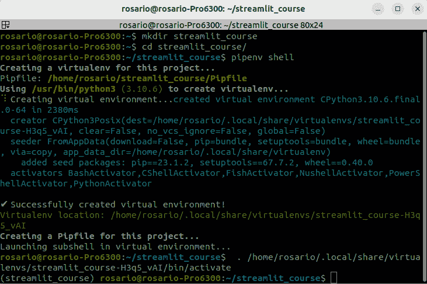
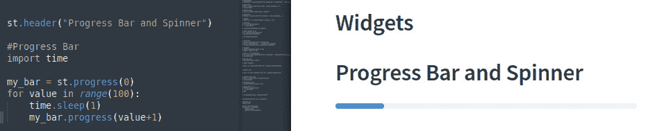

# 第三章：探索 Streamlit 的特性和功能

本章是一个面向初学者的教程，介绍了 Streamlit Python 框架的核心功能，旨在帮助您快速轻松地开始使用该库。本章涵盖了 Streamlit 的基本概念，如创建和自定义小部件、布局用户界面，以及添加可视化和图表。

到本章结束时，您应该能够创建并运行 Streamlit 应用程序，并且对该库的功能和特性有深入的理解。这是我们共同激动人心的旅程的第一步！

在本章中，我们将涵盖以下主要主题：

+   安装并启动 Streamlit

+   Streamlit 特性和小部件

+   数据框、图表和可视化

+   日期、时间等

# 技术要求

+   在本章中，我们将使用以下库、包和工具：

    +   Sublime Text

    +   Python 3

    +   `pipenv`

    +   `streamlit`

    +   CSV 文件

+   本章的代码可以在本书的 GitHub 仓库中找到：[`github.com/PacktPublishing/Web-App-Development-Made-Simple-with-Streamlit/tree/fcb2bd740a2df7263b4470164805926fee3157a1/Chapter03`](https://github.com/PacktPublishing/Web-App-Development-Made-Simple-with-Streamlit/tree/fcb2bd740a2df7263b4470164805926fee3157a1/Chapter03)

# 安装并启动 Streamlit

最后，我们准备好编写代码来创建美丽的 Web 应用程序了！我们从哪里开始？我们必须做的第一件事是安装 Streamlit。

所以，让我们创建一个新的目录——我们将其命名为 `streamlit_course`。进入该目录后，通过输入常用的 `pipenv shell` 命令来准备一个新的虚拟环境。运行 `pipenv shell` 命令后，您将看到如下输出：



图 3.1：创建 streamlit_course 虚拟环境

安装 Streamlit 非常简单——只需使用一个简单的命令，如其官方网站上所示 ([www.streamlit.io](http://www.streamlit.io))：


图 3.2：安装 Streamlit

由于我们正在使用 `pipenv` 和刚刚创建的 `streamlit_course` 虚拟环境，我们需要稍微修改*图 3.2*中建议的指令，如下所示：

```py
pipenv install streamlit
```

您将得到以下结果：


图 3.3：使用 pipenv 安装 Streamlit

这样，Streamlit 将轻松安装，并且 `Pipfile` 会被更新。

现在，让我们通过输入以下命令来创建一个空文件，用作我们的 Python 脚本：

```py
touch app.py
```

如我们所见，在 `streamlit_course` 目录中，我们有三个文件：


图 3.4：streamlit_course 目录中的文件

到目前为止，我们已经安装了 Streamlit，并且有一个空的 Python 文件。虽然这并不多，但我们已经准备好启动我们的第一个 Web 应用了！

启动 Streamlit 的指令非常简单——只需键入 `streamlit run <python_file_name.py>`，在我们的例子中，Python 文件就是我们刚刚创建的空白 `app.py` 文件。然而，由于我们处在一个 `pipenv` 虚拟环境中，我们必须告诉 `pipenv` 我们希望启动某个应用。因此，我们需要写下以下内容：

```py
pipenv run streamlit run app.py
```

通过这种方式，`pipenv` 启动了 Streamlit，运行 `app.py` 文件。我们的浏览器会打开一个空白页面，但如果我们仔细查看地址栏，会看到 `localhost:8501` 上有东西在运行。我们的 Streamlit Web 应用在本地机器上运行，使用的是标准的 `8501` 端口（如果终端要求你输入电子邮件，直接按 *Enter* 键即可）：


图 3.5：Streamlit 运行在 localhost:8501

此时，我们的 Web 应用可以通过添加控件和元素来进行改进。在我们的 terminator 中打开另一个终端（另一个平铺窗口），进入虚拟环境，并用 `"``subl ."` 启动我们的 Sublime Text 编辑器。

# Streamlit 特性和控件

第一步已经完成：Streamlit 已经启动并运行。现在我们需要做的是添加文本、控件、元素等，制作既美观又能正常运行的内容。

要开始用漂亮且实用的控件填充我们的 Web 应用，我们需要编写一些 Python 代码。最佳方式是将 Sublime Text 和浏览器并排放置，正如下图所示：


图 3.6：Sublime Text 和浏览器并排显示

这种可视化非常方便，因为我们可以立即看到我们对代码所做的任何更改（实时显示，只要我们保存代码更改），在编辑器中直接显示，在浏览器中只需从 Web 应用的右上角菜单中选择 **Always Rerun**：


图 3.7：代码更改和 Always Rerun

所以，让我们导入 Streamlit（使用 `st` 作为别名）并开始处理一些文本。我们可以编写以下代码：

```py
import streamlit as st
st.title("Streamlit Basics")
```

结果如 *图 3.8* 所示：


图 3.8：代码更改及其对 Web 应用的影响

`st.title` 返回一长串文本。我们可以在 Sublime Text 中使用许多其他文本维度。例如，我们可以编写并保存以下代码：

```py
st.header("This is a header")
st.subheader("This is a subheader")
st.text("This is a simple text")
st.write("This is a write dimension")
```

由于我们已经选择了 **Always Rerun**，我们会立即看到浏览器中的 Web 应用发生变化，展示出我们希望可视化的标题、副标题、文本以及写入文本的维度：


图 3.9：不同的文本维度

Streamlit 甚至可以直接管理 markdown。这非常简单，因为我们只需要使用 `markdown` 并将文本传递给括号。例如，我们可以编写如下内容：

```py
st.markdown("[Streamlit](https://www.streamlit.io)")
```

这样，我们可以在屏幕上写下“Streamlit”一词，作为指向官方 Streamlit 网站的超链接。如果我们希望将链接直接显示在屏幕上，可以写如下内容：

```py
st.markdown("https://www.streamlit.io")
```

在 Streamlit 中，我们可以非常简单地使用 HTML —— 只需要创建一个包含所有 HTML 代码的变量，然后将其放入一个带有 `unsafe_allow_html` 参数设置为 `True` 的 markdown 指令中。让我们来看一下：

```py
html_page = """
<div style="background-color:blue;padding:50px">
<p style="color:yellow;font-size:50px">Enjoy Streamlit!</p>
</div>
"""
st.markdown(html_page, unsafe_allow_html=True)
```

这是我们得到的结果：


图 3.10：Markdown 与 HTML

查看将 `unsafe_allow_html` 设置为 `False` 时会发生什么。

## 彩色文本框

在文本方面，我们可以使用不同颜色的文本框来指示警告、错误等。这样的颜色编码在构建网页应用时非常有用。让我们看一下代码：

```py
st.success("Success!")
st.info("Information")
st.warning("This is a warning!")
st.error("This is an error!")
```

第一个代码块返回一个绿色框，里面有一些文字；第二个返回一个浅蓝色框，包含文字；第三个返回一个黄色框，里面有文字；最后一个是一个包含错误信息的红色框：


图 3.11：彩色文本框

彩色文本框非常有趣，因为我们可以用它们来提醒某些问题，比如使用红色调表示错误，或者用绿色调表示成功案例。此外，我们还可以利用这一特性为文本增添一些生气。

## 图片、音频和视频

在 Streamlit 中，管理多媒体（如图片、音频和视频）非常简单。首先，处理图片时，我们需要导入 PIL 库，然后添加几行代码：

```py
from PIL import Image
img = Image.open("packt.jpeg")
st.image(img, width=300, caption="Packt Logo")
```

这是输出结果：


图 3.12：st.image

请注意，JPEG 图像与我们的 `app.py` 文件在同一目录中。如果需要，我们可以更改图像的宽度和标题。

使用视频的方式与此类似——我们可以将视频文件放在与 `app.py` 文件相同的目录中并打开它：

```py
video_file = open("SampleVideo_1280x720_1mb.mp4","rb")
video_bytes = video_file.read()
st.video(video_bytes)
```

在框中，有播放/暂停、音量控制和全屏按钮：


图 3.13：来自文件的 st.video 小部件

我们还可以通过使用 URL 和 `st.video` 小部件直接从网络打开视频。例如，我们可以编写如下内容：

```py
st.video("https://www.youtube.com/watch?v=q2EqJW8VzJo")
```

结果如下所示：


图 3.14：来自 URL 的 st.video 小部件

对于音频文件，我们也可以做差不多的操作。我们可以编写如下内容：

```py
audio_file = open("sample1.mp3", "rb")
audio_bytes = audio_file.read()
st.audio(audio_bytes, format="audio/mp3")
```

请注意，这次我们需要指定格式。再次强调，默认情况下，我们会得到播放/暂停按钮和音量控制：


图 3.15：st.audio 小部件

现在，让我们看一下另一个在接下来的章节中非常有用的小部件。首先是“按钮”小部件。因此，请注释掉我们到目前为止写的所有代码（我们可以通过在要忽略的代码行前面加上`#`来创建注释），除了导入 Streamlit 的指令，然后继续。我们可以先写一个简单的指令：

```py
st.button("Play")
```

这个指令给我们一个漂亮的按钮，标签上写着**播放**。然而，当我们点击它时，什么也不会发生！


图 3.16：st.button 小部件

什么也不会发生，因为没有与按钮相关的代码，所以如果我们稍微修改前一行代码，情况就会发生变化，如下所示：

```py
if st.button("Play"):
      st.text("Hello world!")
```

如我们所见，当点击**播放**按钮时，一段漂亮的文本**Hello World!**将会出现：


图 3.17：与 st.button 关联的事件

许多其他小部件的工作方式与此相同，例如`"Checkbox"`。假设我们写下以下代码：

```py
if st.checkbox("Checkbox"):
      st.text("Checkbox selected")
```

我们将得到*图 3.18*所示的结果：


图 3.18：st.checkbox 小部件

单选按钮的工作方式有点不同——我们必须指定一个选项列表，然后决定选择每个选项时发生什么：

```py
radio_but = st.radio("Your Selection", ["A", "B"])
if radio_but == "A":
      st.info("You selected A")
else:
      st.info("You selected B")
```

上述代码将给我们以下结果：


图 3.19：st.radio 小部件

此外，在 selectbox 中，我们需要指定一个选项列表：

```py
city = st.selectbox("Your City", ["Napoli", "Palermo", "Catania"])
```

我们选择了一个选项（在这种情况下是一个意大利城市），它将保存在`city`变量中：


图 3.20：st.selectbox 小部件

在这种情况下，我们希望进行多选。我们可以通过以下方式使用`multiselect`小部件：

```py
occupation = st.multiselect("Your Occupation", ["Programmer", "Data Scientist", "IT Consultant", "DBA"])
```

代码与之前的非常相似，但这次我们可以选择多个选项。可以通过下图看到，我们选择了两个职位（如果需要，我们可以点击**x**按钮取消已选择的选项）：


图 3.21：st.multiselect 小部件

Multiselect 是一种非常优雅的多选方式，保持界面简洁且功能完善。

## 输入文本和数字

我们的网页应用程序中的另一个极其有用的功能是*输入*，即输入一些信息的过程。在这种情况下，我们有许多开箱即用的小部件可供使用。

在`text_input`小部件中，我们只需指定一个标签或标题和一个占位符，非常简单！

```py
Name = st.text_input("Your Name", "Write something…")
st.text(name)
```

我们写的所有内容将保存在`name`变量中，并通过`st.text()`打印到屏幕上：


图 3.22：st.text_input 小部件

以同样简单的方式，我们也可以输入数字。这次，可以直接写入数字或使用 `st.number_input`：

```py
Age = st.number_input("Input a number")
```

这是输出结果：


图 3.23：st.number_input 小部件

回到文本输入，如果需要输入多行文本，我们可以使用 `text_area` 小部件，像这样：

```py
message = st.text_area("Your Message", "Write something...")
```

如我们所见，这次将显示一个更宽的文本区域：


图 3.24：st.text_area 小部件

`text_area` 是当我们需要输入长文本时的完美工具，它可以根据我们的需求进行配置。

## 滑块

另一个非常棒的输入小部件是滑块（slider），我们只需要指定起始值和结束值，就能在屏幕上得到一个很好的选择器。语法非常简单：

```py
select_val = st.slider("Select a Value", 1, 10)
```

这是输出结果：


图 3.25：st.slider 小部件

滑块非常好看，并且在完成任务方面非常有效。

## 气球

一个非常好用的小部件是 `balloons`。想象一下你希望在某个好事情发生后表达喜悦的情景。在这种情况下，你可以通过点击按钮来使用它，如下面的代码所示：

```py
if st.button("Balloons"):
      st.balloons()
```

看看点击按钮后会发生什么！

# DataFrame、图表和可视化

现在，是时候处理 DataFrame 了，让我们来注释一些内容，并继续探索小部件。

DataFrame 是 pandas 库给其数据命名的名称。当一个文件（如 CSV 文件）被导入 pandas 时，结果将是一个 DataFrame。我们可以把 DataFrame 想象成 Excel 或 Google Sheets 表格——即由列和行组成的数据。列是特征或变量，行是记录或案例。因此，为了简化，我们可以说 DataFrame 是由列和行组成的数据结构。

首先，我们需要安装 pandas，使用以下命令：

```py
pipenv install pandas
```

如果你按照我们的建议，使用 `pipenv` 进行虚拟环境管理，可以运行以下命令：

```py
pip install pandas
```

如果你使用的是标准的 Python 安装，那么请写下以下代码：

```py
st.header("Dataframes and Tables")
import pandas as pd
df = pd.read_csv("auto.csv")
st.dataframe(df.head(10))
```

首先，请注意，本书中使用的所有文件都可以在其 GitHub 仓库中找到，包括 `auto.csv` 文件。现在，让我们来注释一下代码。

首先，我们导入 pandas，这是一种强大的数据/数据集管理库，使用 `pd` 别名。之后，我们将 `auto.csv` 文件加载到一个名为 `df`（即 DataFrame）的变量中，然后我们通过 `dataframe` 小部件可视化 DataFrame 的前 10 行（即它的头部）。

结果如图所示：


图 3.26：st.dataframe 小部件

如我们所见，得益于 `st.dataframe`，我们可以以非常美观的格式查看 CSV 文件，所有列和行都类似于 Microsoft Excel 表格。如果我们滚动到最底部或右侧部分，我们可以左右滚动，向上/向下滚动。此外，我们还可以最大化 DataFrame！

如果我们更喜欢的话，也可以以 *表格* 格式查看 DataFrame，因为我们还提供了一个非常不错的 `table` 小部件。不过，不幸的是，在这种情况下，我们无法滚动数据。

所以，假设我们编写以下代码：

```py
st.table(df.head(10))
```

然后，我们将得到如下表格：


图 3.27：st.table 小部件

Streamlit 开箱即用地也可以管理绘图——例如，我们可以显示面积图、条形图和折线图。我们需要做的就是拥有一个 DataFrame。

Streamlit 会与图表一起，自动显示所有可视化变量的列表（以不同的颜色显示）（请注意，我们只使用了“mpg”和“cylinders”）。

在这里，我们可以使用我们在前一个示例中加载的数据框。

所以，让我们编写以下代码：

```py
st.area_chart(df[["mpg","cylinders"]])
```

我们将得到如下的面积图：


图 3.28：st.area_chart 小部件

让我们编写以下代码：

```py
st.bar_chart(df[["mpg","cylinders"]].head(20))
```

然后，我们将得到如下的条形图：


图 3.29：st.bar_chart 小部件

让我们编写以下代码：

```py
st.line_chart(df[["mpg","cylinders"]].head(20))
```

接下来，我们将得到如下的折线图：


图 3.30：st.line_chart 小部件

如果进入图表部分，我们可以进行放大和缩小。点击每个图表右上角的三个点，我们可以将图表保存为 PNG 文件，查看源代码，进行其他操作：


图 3.31：开箱即用的绘图功能

最后，正如我们在 DataFrame 中看到的那样，我们可以最大化所有图表，查看它们的全屏效果：


图 3.32：全屏绘图

使用 Streamlit，我们可以通过 `matplotlib` 和 `seaborn` Python 包绘制更加美观的图表。因此，首先，我们需要安装这些包：

```py
pipenv install matplotlib seaborn
```

如果我们在一个纯 Python 环境中，我们可以运行以下代码：

```py
pip install matplotlib seaborn
```

此时，我们可以像这样导入这些包：

```py
import matplotlib.pyplot as plt
import seaborn as sns
```

现在，我们已经准备好开始绘制图表。在这里，我们正在绘制数据框的相关矩阵的热图：

```py
fig, ax = plt.subplots()
corr_plot = sns.heatmap(df[["mpg","cylinders", "displacement"]].corr(), annot= True)
st.pyplot(fig)
```

第一行指令创建了一个空的图形。第二行利用 `seaborn` 创建了一个热图（带注释），用于绘制来自 `df` 数据框的相关矩阵。最后，第三条命令使用 `matplotlib.pyplot` 绘制图形，Streamlit 会直接管理它。以下是结果：


图 3.33：使用 Seaborn 绘制热图

请注意，我们已经显示了带标签的相关性图和带颜色和注释的热图。

# 日期、时间等等

另一个我们可以在 Streamlit 中轻松管理的非常有用的元素是日期和时间——即日期、小时等。

例如，要在屏幕上打印今天的日期，我们只需要写出以下内容：

```py
import datetime
today = st.date_input("Today is",datetime.datetime.now())
```

这里，第一行简单地导入了 `datetime` 包，而第二行通过 Streamlit 的 `date_input` 提示用户选择一个日期。此日期将保存在 `today` 变量中：


图 3.34：st.date_input 小部件

继续处理日期和时间，我们也可以以类似的方式处理时间，如下所示：

```py
import time
hour = st.time_input("The time is",datetime.time(12,30))
```

这一次，我们导入了 `time` 模块并使用 `time_input`，其中我们指定时间为 12:30。在屏幕上，我们可以选择任何想要的时间：


图 3.35：st.time_input 小部件

Streamlit 功能强大且易于使用，我们甚至可以管理 JSON 格式或编程语言格式（如 Julia 或 Python）的文本。

让我们输入以下内容：

```py
data = {"name":"John","surname":"Wick"}
st.json(data)
```

在这里，我们创建了一个名为 `data` 的变量，包含两个键值对，通过 `st.json` 小部件以 JSON 格式显示在屏幕上——简单清晰：


图 3.36：st.json 小部件

如果我们点击箭头，就可以关闭/最小化 JSON。

显示代码也非常简单——我们只需使用 `st.code` 并指定编程语言作为参数（对于 Python，这不是必要的，因为它是默认值）。以下是一个例子：

```py
st.code("import pandas as pd")
```

我们将看到以下输出：


图 3.37：Python 的 st.code 小部件

在 Julia 的情况下，我们必须指定编程语言，因此可以写出以下内容：

```py
julia_code = """
function doit(num::int)
      println(num)
end
"""
st.code(julia_code, language='julia')
```

这是结果：


图 3.38：Julia 的 st.code 小部件

我们还可以将进度条和旋转器作为标准小部件使用。让我们看看它们是如何工作的。

例如，要创建一个从 0 到 100 的进度条，每 0.1 秒增加 1，我们可以写出以下内容：

```py
import time
my_bar = st.progress(0)
for value in range(100):
      time.sleep(0.1)
      my_bar.progress(value+1)
```

结果非常好。对于更快的进度条，我们可以使用 `time.sleep(0.01)`，而对于更慢的进度条，我们可以使用 `time.sleep(1)`。以下是结果：



图 3.39：st.progress 小部件

旋转器的工作方式与进度条差不多，因此我们可以写出以下内容：

```py
import time
with st.spinner("Please wait..."):
      time.sleep(10)
st.success("Done!")
```

非常简单，我们可以设置一个初始消息 *等待 10 秒钟*，如下所示：


图 3.40：st.spinner 小部件在等待时间中的状态

最后，我们可以打印 *完成!*（绿色表示成功），如下所示：


图 3.41：st.spinner 小部件完成后的状态

非常好！

现在我们已经介绍了进度条和加载动画，可以结束这个对 Streamlit 主要功能和小部件的简短介绍，它充当了一个全身心投入的速成课程。

# 总结

在本章中，我们探讨了 Streamlit 的主要开箱即用功能和小部件。我们从创建一个空的 Python 文件和启动 Streamlit 开始，展示了如何使用“重新运行”功能管理其 Web 界面，并利用其实时更新功能。

接着，我们学习了如何以不同方式处理文本，涉及文本的大小、颜色和格式。我们还探索了多媒体小部件，如图像、音频和视频。

许多元素，如按钮、复选框、单选按钮等，也得到了说明和应用。

本地原生支持许多不同种类的输入——输入文本、数字、日期、时间等非常简单。像文本区域或滑块这样的控件也可以直接使用。

正如我们所见，数据图表的创建非常简单——我们可以使用数据框架（DataFrames）并用一行代码绘制条形图、折线图或面积图。即使是热力图也是一个清晰且整洁的选择。

即使是以编程语言风格格式化文本，如 Python 或 Julia，也只需要几行代码。

最后，我们看到，如果我们需要等待一些计算或活动来处理我们的应用程序，我们可以使用进度条或加载动画在屏幕上创建一个“请稍等...”的效果。

所有这些组件都是我们将要使用的工具箱的基本元素，从下一章开始，我们将用它们来构建我们的实际 Web 应用程序。通过这样做，我们将扩展对 Streamlit 更高级功能的了解！

# 第二部分：构建一个基本的 Web 应用程序以掌握 Streamlit 的基本技能

第二部分深入探索了 Streamlit 的实践部分，重点是构建一个基本但强大的 Web 应用程序。它从配置 Streamlit 环境和管理软件包的基本知识开始，为应用程序开发奠定了实际基础。接着，本节展示了如何有效地组织和显示内容，结合了诸如列、折叠框和**自然语言处理**（**NLP**）技术等高级元素。随后，你将探讨如何实现 NLP 进行文本分析和处理，将这些技能应用于增强你的 Web 应用程序。本部分最后提供了一个全面的指南，介绍了如何使用 Streamlit Share 分享和部署这些应用程序到云端，帮助你将应用程序提供给更广泛的受众。本部分旨在增强你对 Streamlit 技能的信心，为后续更复杂的应用开发做好准备。

本部分包括以下章节：

+   *第四章*，*Streamlit 基础 – 配置环境、管理软件包等*

+   *第五章*，*使用列、折叠框和 NLP 技术组织和显示内容*

+   *第六章*，*在 Streamlit 中实现自然语言处理技术用于文本分析和处理*

+   *第七章*，*使用 Streamlit Share 共享和部署您的应用程序到云端*
