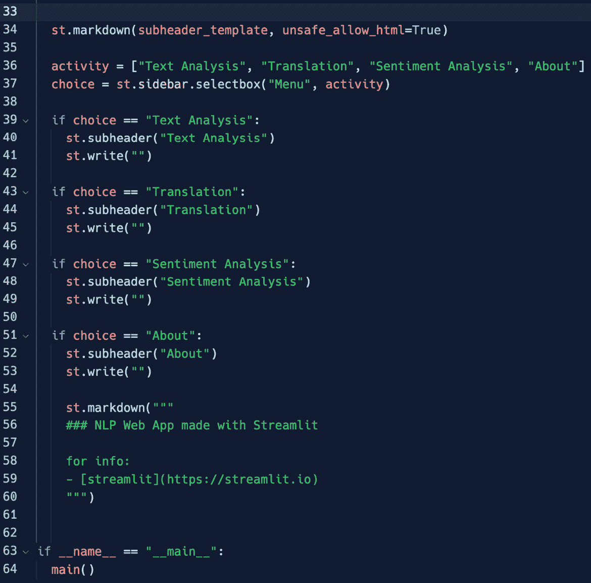

# 第四章：Streamlit Essentials – 配置环境、管理软件包等

本章介绍了使用 Streamlit 框架构建 Python Web 应用程序的基础知识。它是为想要从零开始学习如何开发 Web 应用程序的初学者设计的，涵盖了几个重要的主题，包括设置虚拟环境、安装和管理软件包、创建应用程序框架，以及为应用程序添加菜单和装饰。

本章是一个由四个章节组成的部分的第一章。在这些章节中，我们将学习如何在开发基本 Streamlit 技能的同时构建基础的 Web 应用程序。我们采用的是一种*边做边学*的方法，因此我们将从零开始构建、测试和部署一个真正工作的 Web 应用程序——一个**自然语言处理**（**NLP**）应用程序。那么，让我们开始吧！

本章首先回顾了虚拟环境的概念，并解释了它们在 Python 开发中的重要性。一旦开发环境设置完成，焦点将转向创建应用程序框架，这涉及到定义应用程序的结构和布局。这样的框架是一个非常有价值的资源，可以用于未来的 Web 应用程序开发。之后，我们将介绍如何为应用程序添加菜单和装饰，以创建一个漂亮、好看且用户友好的 Web 界面。

到本章结束时，你应该对如何使用 Streamlit 构建 Python Web 应用程序有一个基本的理解，并且能够利用你创建的框架，创建一个带有自定义菜单和装饰的应用程序。

在本章中，我们将涵盖以下主要内容：

+   配置我们的环境

+   安装和导入软件包

+   应用程序框架构建

+   构建菜单并添加装饰

# 技术要求

+   在本章中，我们将使用以下库、软件包和工具：

    +   Sublime Text

    +   Python 3

    +   `pipenv`

    +   `streamlit`

    +   `textblob`

    +   `spacy`

    +   `neattext`

    +   `matplotlib`

    +   `wordcloud`

+   本章的代码可以在本书的 GitHub 仓库中找到：[`github.com/PacktPublishing/Web-App-Development-Made-Simple-with-Streamlit/tree/4306036e2ddf9a714f2f058f76363aac5b402d5b/Chapter04`](https://github.com/PacktPublishing/Web-App-Development-Made-Simple-with-Streamlit/tree/4306036e2ddf9a714f2f058f76363aac5b402d5b/Chapter04)

# 配置我们的环境

我们终于到了这里，正在从零开始构建我们的第一个 Web 应用程序！从零开始意味着从一开始就工作，甚至在空的 Python 文件之前。方法很简单——我们从坐下来一起编码开始。让我们先创建我们的虚拟环境，这个环境将专门用于我们将要开发的这个新应用程序：

1.  正如我们在前面的章节中所学到的，我们必须启动我们的 Terminator 终端，并使用以下指令创建一个名为 `web_app1` 的空目录：

    ```py
    mkdir web_app1
    ```

1.  然后，我们必须在终端中输入以下指令：

    ```py
    cd web_app1
    ```

1.  最后，我们必须编写以下内容：

    ```py
    pipenv shell
    ```

如我们之前所见并且已经知道，最后的指令将通过 `pipenv` 创建虚拟环境，如 *图 4.1* 所示：


图 4.1：在 pipenv 中创建虚拟环境

由于它能大大帮助我们管理代码和 Streamlit 的执行，我们将 Terminator 终端分成两部分，水平分割。

1.  在下方的窗口中写入以下内容：

    ```py
    web_app1 by moving the cursor up or down, then hitting *Enter*:
    ```


图 4.2：选择虚拟环境

一旦进入虚拟环境，你的终端提示符中会看到其名称，位于括号中（在我们的例子中是 `web_app1`）。

1.  我们在 `web_app1` 内，所以可以通过输入以下内容来打开我们的编辑器 Sublime Text：

    ```py
    subl .
    ```

注意

请注意空格后的点（`.`）；换句话说，`subl` 和点（`.`）之间有一个空格。

通过这样做，Sublime Text 将从我们的工作文件夹中启动：


图 4.3：从虚拟环境启动 Sublime Text

有了这个，我们的虚拟环境就正常工作了，编辑器也准备好了。这意味着现在可以处理网络应用程序所需的所有包。我们需要安装这些包，以使 Web 应用程序正常工作。

# 安装和导入包

为了使我们的网络应用程序正常工作，我们需要以下 Python 包：

+   `streamlit`：这是核心——即使魔法发生的框架

+   `textblob`：这是一个用于基本情感分析和其他一些基本 NLP 任务的不错包（NLP 是计算机理解人类语言、其含义、语法等的方式）

+   `spacy`：这是一个相当先进的包；它是最先进的技术，可以用于几乎任何 NLP 任务

+   `neattext`：一个非常简单的文本清理包

+   `matplotlib`：Python 最著名的用于绘制图表、图形等的包

+   `wordcloud`：一个专注于美观词云创建和可视化的包

我们可以通过输入以下唯一指令，在我们的虚拟环境中安装所有这些包（所以我们必须已经进入虚拟环境）：

```py
pipenv install streamlit textblob spacy neattext matplotlib wordcloud
```

请注意，此操作可能需要几分钟才能完成：


图 4.4：包安装

如果你检查 Sublime Text 中的 Pipfile，你会看到所有包都已正确安装，如 *图 4.5* 所示：


图 4.5：包含已安装包的 Pipfile

*spaCy* 是一个非常强大的 NLP 包，并且需要为每种我们要管理的语言下载专门的语言模型。因此，在我们开始编码之前，我们需要下载英语语言模型。让我们在终端中输入以下指令：

```py
pipenv run python –m spacy download en_core_web_sm
```

该指令将下载`en_core_web_sm`英语语言模型，文件大小为 12.8MB。文件名非常自解释：`en`表示英语，`core_web`表示该模型是在一个包含来自网络的文本数据集上训练的，`sm`表示小型（如果你想了解所有语言、模型及其大小，可以查看 spaCy 的官方网站）：


图 4.6：下载 spaCy 语言模型

现在，我们拥有了开始编码所需的一切。只差一个东西：Python 文件！没有它，我们无法编码。让我们通过输入一个简单的指令来创建它：

```py
touch app.py
```

以下是输出：


图 4.7：app.py 文件

到目前为止，一切准备就绪：我们的环境已经设置好，包已经安装完毕，我们的空`app.py`文件也已经存在。

我们现在已经准备好开始编写第一个真正的 Web 应用代码了。

第一步是打开`app.py`文件，使用 Sublime Text 导入我们已经安装的所有库，以便编写代码，如*图 4.8*所示：


图 4.8：导入必要的库

上面的代码导入了`streamlit`并使用`st`别名，同时导入了所有的 NLP 包（`textblob`、`spacy`和`neattext`）以及所有的可视化库。请注意，对于`matplotlib`，我们使用了`Agg`引擎，因为在 Streamlit 中，它比默认引擎表现得更好。

导入完成后，我们终于准备好编写第一个真正的 Web 应用代码了。现在就开始吧！

# 应用框架搭建

首先，我们需要一个主函数——一个包含应用所有业务逻辑和前端内容的函数。这就是 Streamlit 的强大之处——可以直接在 Python 代码中构建前端。无需使用不同的编程语言、文件等；一切都在同一个地方，使用相同的语言编写。编写这个函数非常简单——我们可以添加*图 4.9*所示的代码：


图 4.9：导入必要的库和主函数

代码的第一部分是非常自解释的——我们只是导入了前面几页中介绍的所有库。需要注意的是，当我们导入`matplotlib`（绘图所需的库）时，我们指定了希望使用`Agg`引擎（如果没有这个指令，`matplotlib`会使用默认的引擎）。在 Streamlit 的早期版本中，这个`Agg`引擎表现得更好，但在最近的版本中，`matplotlib`的标准引擎也表现良好。所以，建议是尝试有无这个指令，并且只有在真正有改进的情况下才使用它。

所以，感谢 `def`，我们可以创建一个名为 `main` 的函数。目前，这个函数只是将一个标题打印到屏幕上（`st.title`）：*NLP* *Web App*。

就是这样——我们已经准备好启动我们用 Streamlit 制作的 Web 应用程序。在浏览器中，我们将看到我们的漂亮标题：*NLP* *Web App*。

要在终端中运行应用程序，我们应该输入 `streamlit run app.py`。然而，由于我们处于 `pipenv` 环境中，我们需要输入以下命令：

```py
pipenv run streamlit run app.py
```

这条指令启动了一个 Web 服务器，将我们的 Streamlit 应用程序运行在 `8501` 端口上。我们的 Streamlit 应用程序是 `app.py` 文件中的代码。

浏览器将立即在 `localhost port 8501` 上打开，我们将看到 Web 应用程序，如 *图 4.10* 所示：


图 4.10：Web 应用程序在 localhost:8501 上运行

此时，Web 应用程序什么也不做，只是显示 *NLP Web App* 标题，并在右上角显示 *汉堡菜单*。请探索菜单中的所有选项。

现在需要理解的是，通常所有应用程序都会执行一组任务，假设是三四个任务或 *N*（任何数字），因此所有应用程序都有相同的 *框架*，即一个通用的结构或支撑骨架，使每个任务得以实现。这些任务可以包含在应用程序菜单中，并通过 *选择框* 构建，允许用户选择要执行的操作。我们可以将这个选择框放在应用程序的左侧。所以，假设 *NLP Web App* 的任务是 `st.title` 这一行：

```py
activity = ["Text Analysis", "Translation", "Sentiment Analysis", "About"]
choice = st.sidebar.selectbox("Menu", activity)
```

现在，保存 `app.py` 文件并点击 Web 应用程序中的 **Always rerun**（右上角）；这样，一旦我们保存新代码，所有新代码行都会立即执行。如 *图 4.11* 所示，我们在 Web 应用程序的左侧添加了菜单。这个菜单包含了我们在 *活动* 列表中包含的四个任务。如果需要，你可以点击 **x** 按钮以最小化左侧栏：


图 4.11：左侧菜单

为了让我们的菜单执行某些操作，我们必须为每个菜单项添加一些逻辑。我们可以通过在主函数中添加以下代码来实现。此时，当我们选择菜单中的某个特定选项时，我们只会显示一些子标题：


图 4.12：向主菜单添加一些逻辑

*图 4.12*中的代码相当简单：我们创建了一个包含四个项目的列表（`activity`变量），并用它来填充侧边栏中的*selectbox*。这意味着这个 selectbox 只会显示四个选项。当我们选择其中一个选项时（例如，`if`s（四个 if 语句，因为我们有四个选项）来理解选择框中的值）。简单来说，我们检查`if`我们在选择框中的选择*等于*菜单中的任何一项；如果是，我们就打印一个子标题（目前，相关操作只是打印一个子标题；未来我们会编写更复杂的操作），子标题包含该项的名称和一个空白行。所以，如果我们选择**情感分析**，我们会在屏幕上打印一个**情感分析**的子标题，如*图 4.13*所示：


图 4.13：“情感分析”选项来自左侧菜单

到此为止，应该清楚，任何类型的逻辑都必须应用在`main`函数中的特定`if`条件下。例如，如果我们希望**关于**部分做一些比仅仅显示包含**关于**文本的子标题更复杂的操作，我们可以按以下方式编写其业务逻辑代码：


图 4.14：“关于”部分中的业务逻辑

总结来说，当`choice`变量*等于*`st.write("")`时，接下来是一些使用 Markdown 语言格式化的文本。

我们用`st.markdown`指令编写的代码非常容易理解；我们只是在屏幕上打印（使用 Markdown 格式）关于我们网站应用的一些信息，并提供一个可以点击的链接指向 Streamlit 网站，考虑到`streamlit`)`指令只是 Markdown 语法，用于在文本中插入超链接：


图 4.15：我们网站应用的“关于”部分

到目前为止，我们已经为网站应用创建了一个非常整洁的框架（即结构），导入了我们将使用的所有库，创建了一个主函数，在该函数中我们创建了一个菜单（...，该菜单将在应用的左侧显示，并且是可折叠的），其中包含我们网站应用将要涵盖的所有任务，并且创建了`if`条件。

真令人惊讶的是，这个简单的框架可以应用于我们今后构建的所有网站应用。我们需要更改或调整的只是任务列表（左侧菜单中的列表）以及每个项目的业务逻辑。

重点是，即使现在网站应用运行良好，它也并不吸引人。因此，让我们尝试添加一些装饰。

# 构建菜单并添加装饰

*NLP Web App* 可能是一个不错的应用程序标题，但说实话，它现在只是一些黑色文字在白色背景上，因此并不是非常吸引人。

Streamlit 的一个伟大特点是我们可以非常轻松地使用 HTML。所以，让我们在 `main` 函数中添加一些简单的 HTML 代码，来让一切看起来更加时尚！我们可以将位于主函数声明之后的旧代码 `st.title("NLP Web App")` 替换为以下代码：


图 4.16：向我们的标题中添加一些 HTML

在 `title_template` 中，我们指定了 *背景颜色*（蓝色）、*填充大小* 和 *文本样式*（h1）及其 *颜色*（青色）。通过 `st.markdown` 指令，正如我们之前学到的，我们只是将 HTML 进行可视化；你可以通过更改背景和文本颜色、填充、文本等来自由调整。这是最终效果：


图 4.17：我们应用程序的彩色标题

效果非常棒。

现在，让我们创建一个副标题。为此，我们可以使用副标题并使用几乎相同的 HTML 代码。我们只需要再添加几行代码，如下图所示：


图 4.18：标题和副标题的最终代码

我们以与处理 `title_template` 在 *图 4.16* 中的方式相同的方式来处理这个问题：我们在一个变量中定义了一些 HTML（在这个例子中是 `subheader_template`），然后通过 `st.markdown` 和设置 `unsafe_allow_html` 参数为 `True` 来进行可视化。

如前所述，一切都可以根据你的想法完全自定义。这是最终的效果：


图 4.19：最终的彩色标题和副标题

由于我们把这些装饰代码放在了主函数的最前面，也就是在创建左侧菜单和负责选择各种任务的 `if` 条件语句之前，因此，当我们切换各种菜单项时，彩色 HTML 标题和头部不会发生变化，因为它们固定在屏幕顶部，并且为我们的网页应用程序提供了非常好的 *样式一致性*。简而言之，由于我们将这段 HTML 代码放在了主函数的开头，它将应用于整个网页应用程序，而不是某个特定的任务——一切都会受到这个标题的影响。这个标题将成为我们网页应用程序的固定元素。

如果我们在浏览器中查看我们的网页应用程序面板，我们会看到图标和标题是默认的，因为图标是 Streamlit 的，而标题则是我们 Python 文件的名称（`app.py`）：


图 4.20：网页应用在浏览器中的默认图标和标题

让我们定制这两个非常重要的特性。在 Streamlit 中，确实有一个专门用于这个目的的指令——但这是非常重要的——它必须紧接在`streamlit import`行后面。这条指令是`set_page_config`。让我们将它添加到我们的`app.py`文件中，然后解释它是如何工作的：


图 4.21：set_page_config 指令

`set_page_config`接受以下几个参数：

+   `page_title`：我们的页面标题；这是一个字符串

+   `page_icon`：一个图标（图像文件）或一个表情符号（表情符号本身或其代码）

+   `layout`：这可以是`centered`或`wide`

+   `initial_sidebar_state`：这可以是`wide`、`expanded`或`collapsed`

你可以尝试不同的配置，并且可以轻松找到 Streamlit **文档**部分中的相关信息，其中包含输入参数和输出结果。

下图解释了`set_page_config()`指令。如你所见，这里有一些我们没有探讨的不同配置，你可以将它们结合起来，以完全自定义你的 Web 应用程序。因此，请务必仔细查看 Streamlit 的官方文档，以便从这个令人惊叹的框架中获得最大价值：


图 4.22：Streamlit 的官方文档

现在我们已经查看了 Streamlit 的官方文档，接下来让我们看看具有新页面标题和图标的 Web 应用程序：


图 4.23：浏览器面板中的图标和标题定制

如你所见，在浏览器的与我们 Web 应用程序相关的标签上，我们有一整套定制化内容：一个代表拇指的图标和一个个性化的标题，显示为*NLP Web App*。这就是我们在*图 4.21*中看到的代码的结果。

如果你愿意，你可以尝试替换我们用作图标的👍表情符号，改为你喜欢的 PNG 文件等图像。你还可以查看当我们将`initial_sidebar_state`设置为`wide`、`expanded`或`collapsed`，并将`layout`设置为 wide 时，Web 应用程序的表现。

我们为 Web 应用程序框架添加的装饰简洁、整洁且美观，但直到现在，除了**关于**部分（可以认为已经完成），其余部分需要通过一些业务逻辑来完成，以便让各种**文本分析**、**翻译**和**情感分析**任务正常工作。这正是我们将在下一章中做的事情。

下图展示了我们所编写的所有代码。值得一提的是，在仅仅 64 行代码的情况下（包括空行和注释），我们已经构建了一个可以在网页上运行的 Web 应用程序，它可以被浏览器使用，并且包含菜单、一些部分、HTML、标题和装饰：



图 4.24：app.py 文件

最棒的是，你可以根据需要随时重用它！

# 总结

在这一章中，我们从零开始。首先，我们准备了`pipenv`环境，安装了 web 应用所需的所有包，最后创建了一个空的 Python 文件。

然后，我们构建了一个可以随时重用的*骨架*，用于开发新的 web 应用程序。这个骨架由一个初始化部分组成，我们在其中导入所有需要的包，以及一个*主*函数，用来包含我们 web 应用的所有业务逻辑。

在主函数的第一部分，必须应用一些功能到整个 web 应用中，比如标题和副标题，我们通过非常漂亮且丰富多彩的 HTML 创建了它们，还有网页浏览器的面板图标和标题。

在主函数的第二部分，我们创建了一个菜单，显示在我们 web 应用的左侧，让用户从我们 web 应用可以执行的各种任务中进行选择。选择菜单中的一个任务后，web 应用将展示相应的部分，并执行其特定的任务。我们之所以实现这个功能，是因为我们想从一个非常简单的案例开始。**关于**部分现在运行良好，展示了 web 应用的名称/标题以及一些有用的信息——在这个案例中，是指向 Streamlit 网站的有效链接。

一切运作良好，并根据我们的意愿和未来需求进行了定制。这表明这个骨架是我们开发者工具包中的一大利器！

在下一章中，我们将开始构建我们应用程序的完整业务逻辑，使用并学习一些非常强大的控件，比如列和展开器，以及一些 NLP 技术！
