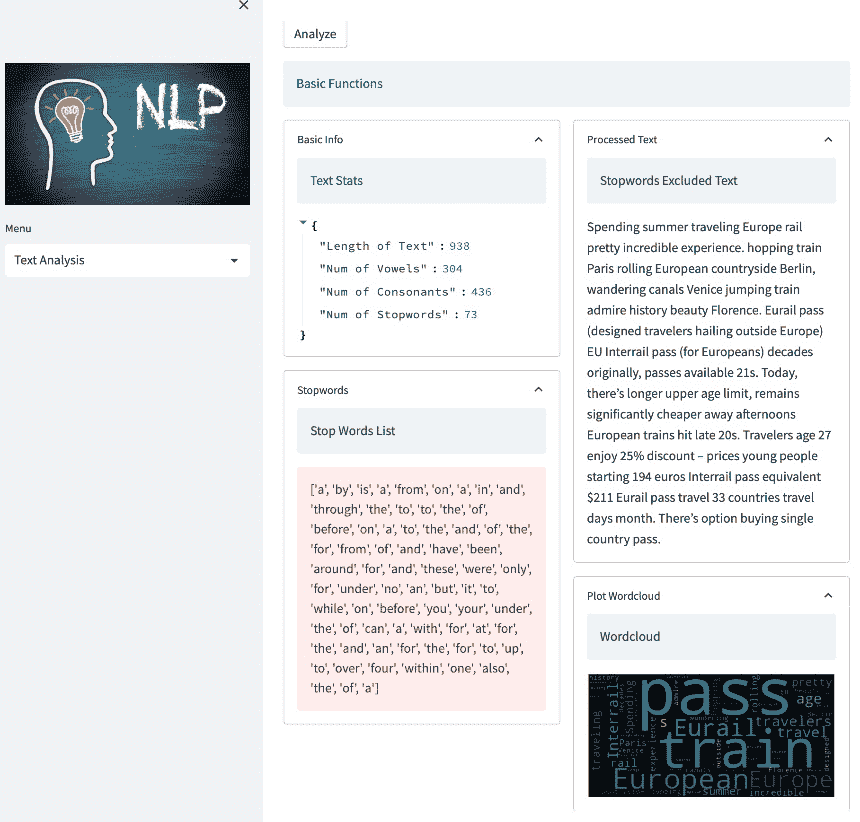
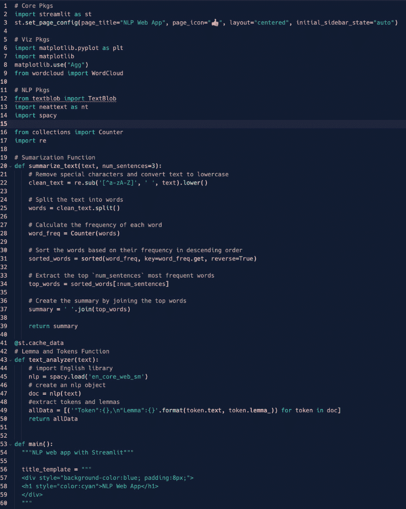

# 第五章：使用列、扩展器和 NLP 技术组织和显示内容

在本章中，我们将开发所有实现*第四章*中所构建的骨架应用所需的业务逻辑。我们将学习 Streamlit 的一些极其重要的功能。

列和扩展器是 Streamlit 框架中的两个布局功能，它们允许在 Web 应用程序中更灵活、有序地显示内容。

列允许将屏幕水平分为多个部分，每个部分包含自己的内容。这对于并排显示多个可视化图表或数据表，或将应用程序界面的不同部分分开非常有用。扩展器则允许在列内折叠和展开内容部分。这对于隐藏不太重要或不常用的应用界面部分非常有用，用户只有在需要时才会展开它们。

在 NLP 中，标记是通过空格或标点符号分割的单个文本单元。词元则是单词的基本或词典形式，它可能与文本中出现的屈折或派生形式不同。

到本章结束时，我们的第一个 Web 应用应该看起来更加完整，您也应该对如何使用 Streamlit 构建 Python Web 应用有更广泛的了解。

在本章中，我们将讨论以下主要主题：

+   在 Web 应用程序中组织和排列内容

+   根据重要性隐藏和显示内容

+   介绍 NLP 概念——标记和词元

# 技术要求

+   在本章中，我们将使用以下库、包和工具：

    +   Sublime Text

    +   Python 3

    +   `pipenv`

    +   Streamlit

    +   Spacy

    +   `neattext`

    +   `matplotlib`

+   本章中的代码可以通过以下 GitHub 链接访问：[`github.com/PacktPublishing/Web-App-Development-Made-Simple-with-Streamlit/tree/bd70c6ee45d046134e71c3c8a93c3d97172bf3f9/Chapter05`](https://github.com/PacktPublishing/Web-App-Development-Made-Simple-with-Streamlit/tree/bd70c6ee45d046134e71c3c8a93c3d97172bf3f9/Chapter05)

# 在 Web 应用程序中组织和排列内容

在*第四章*中，我们建立了第一个 Web 应用的基础，并编写了一些 Python 代码，执行后会得到以下结果：


图 5.1: *第五章*起始点

我们完成了**关于**部分，对颜色进行了一些装饰，并为 Web 浏览器页面添加了一个图标（即所谓的*favicon*）和标题。

现在是时候完成菜单中的三个剩余功能：**文本分析**、**翻译**和**情感分析**。

## 添加装饰

然而，在完成菜单中的三个功能之前，让我们先给 Web 应用的侧边栏添加一些装饰。因此，再次打开 Sublime Text 编辑器并重新开始编写代码。

我们需要在代码中 *第 35-36 行* 的标题后立即向侧边栏添加一张图片。这是一个简单的编码任务，如下图所示：


图 5.2: st.sidebar.image

这个过程非常简单：我们正在将一个图片添加到侧边栏 `(st.sidebar)` 中。我们只需要在 Google 中输入 `NLP`，下载一张图片，并将其保存为 `nlp.jpg`，放在与 Python 脚本相同的文件夹中。由于我们将 `unsafe_allow_width` 参数设置为 `True`，所以图片的宽度将与侧边栏中所有其他元素的宽度完全相同。如果你愿意，可以使用 `width` 参数来代替 `unsafe_allow_width`，具体方式如下：

```py
width = 200
```

你可以尝试不同的宽度（如 100、300 等）并观察不同的效果。

在 *图 5.3* 中，我们可以看到上次装饰的结果：


图 5.3: 侧边栏中的图片

我们的 web 应用开始变得吸引人了！现在我们可以进入文本分析部分了。

## 添加文本分析部分

在这一部分，我们将使用 `textblob`，一个处理文本数据的 Python 库。它提供了一个简单的 API，可以处理常见的自然语言处理任务，如词性标注、情感分析、分类等。欲了解更多详情，请访问 [pypi.org](http://pypi.org)（著名的 Python 包索引）。

和往常一样，我们需要通过输入以下命令来在我们的虚拟环境中安装该包：

```py
pipenv install textblob
```

然后，我们将其导入到 Python 脚本中，在 `importing` `libraries` 部分的最开头添加以下行：

```py
from textblob import TextBlob
```

无论如何，如果你仔细阅读了 *第四章*，你应该已经完成了这部分，但为了保险起见，还是最好再重复一遍。

让我们跳转到脚本中的 *文本分析* 部分，最终添加其特定的业务逻辑。正如我们在编码过程中看到的那样，*文本分析* 是一个专注于文本统计（如长度、单词数等）、停用词、词干和标记等功能的函数。我们将在接下来的页面中快速解释这些概念。此外，除了自然语言处理（NLP）概念之外，这里非常重要的是理解如何使用各种 Streamlit 小部件、函数和技术细节，以便创建和构建稳健、高效的 Web 应用。

### 添加文本框

目前，在这一部分，我们只有一个标题和一个子标题。为了进行文本分析，我们当然需要一些文本，因此作为第一步，让我们添加一个文本框，以便输入所有我们想要的文本：


图 5.4: st.text_area

我们使用 `text_area` 获取一些文本，并将其存储在名为 `raw_text` 的变量中。尝试稍微调整 `st.text_area` 的参数，特别是试试看如果不使用 *height* 会发生什么。

### 添加分析按钮

我们想对在 `text_area` 中输入的文本做点什么。所以，为了更好地理解它是如何工作的，我们来添加一个名为 **Analyze** 的按钮，当点击该按钮时，会将我们的文本显示在屏幕上。代码非常简单，如下图所示：


图 5.5：用于显示文本的按钮

为了保持界面的整洁，我们在文本区域输入一些内容——例如 `Hello everybody!`——然后点击按钮，看看我们写的内容显示在屏幕上。结果如下：


图 5.6：大家好！

要执行任何自然语言处理任务，TextBlob 需要将任何文本转换为一个 `Blob` 对象，这是这个优秀库的一个特定功能。让我们来看看如何操作。

### 创建 Blob 对象

要使用 TextBlob 执行所有自然语言处理任务，我们必须确保能够创建这个 Blob 对象，而 Blob 只有在文本区域包含一些文本时才能创建——换句话说，文本区域不能是空的。

让我们稍微修改一下前面的代码，确保文本区域不是空的，并且 `Blob` 对象可以顺利创建：


图 5.7：TextBlob 在实际应用中

所以，*如果* `text_area` 中没有文本，它的长度（`len`）就为零，我们会显示一个警告信息；否则（`else`），我们会创建一个 `TextBlob` 对象，将其保存为名为 `blob` 的变量，并显示一个确认信息（`OK`）。

现在，我们的 `TextBlob` 对象已经开始工作了。

### 添加基本功能

到目前为止，我们已经正确编辑了所有代码，准备实现一些真正的文本分析功能。实际上，我们稍后会使用 `TextBlob` 来进行情感分析功能。现在，我们只是用它来检查应用程序是否正常运行，如果你愿意，可以像这样注释掉下面这一行代码：

```py
#blob = TextBlob(raw_text)
```

我们从 `st.write("OK")` 这一行开始，代码如下：

```py
st.info("Basic Function")
```

到目前为止，我们处于如下截图所示的阶段：


图 5.8：基本功能

现在是时候理解如何使用列、展开器和更高级的编码来在屏幕上显示和隐藏信息了。

# 根据重要性隐藏和显示部分内容

从一个非常广泛的角度来看，应用程序只是用来可视化、转换和保存信息的一种方式。并非总是同时显示所有可用信息是一个明智的做法。例如，将所有信息显示在一个屏幕上可能会让我们的应用程序显得非常拥挤。在其他情况下，我们并不希望同时展示所有信息，因为我们只想看到某个特定的信息，这些信息是我们关心的。因此，在我们的 web 应用中隐藏和正确显示信息是一项非常有价值的技能。

## 添加列、展开器和文本框

列非常有用，因为它们允许我们创建一些*层*或*不同的部分*。这意味着，通过使用列，我们可以将屏幕分成任意多的垂直部分，并将这些部分（或列）用于我们认为应该在特定——或者说专用——容器中展示的任何特定目的。我们需要做的就是创建或声明这些小部件。

我们通过使用`with`指令开始使用它们。让我们详细看看：


图 5.9：列和扩展器

`col1, col2 = st.columns(2)`这一行仅仅创建了两个名为`col1`和`col2`的列。在接下来的两行`with`中，我们使用这些列。在每一列中，我们创建一个*扩展器*；每个扩展器都有自己的标签（`Basic Info`和`Processed Text`）。扩展器是可点击的，因为它们有*上箭头*和*下箭头*符号。点击这些符号，我们可以*展开*或*收起*这些小部件以显示它们的内容——在我们的示例中，仅包含`st.write`和`st.success`指令。浏览器中的效果非常漂亮：


图 5.10：我们网页应用中的列和扩展器

由于我们还希望在我们的网页应用中包含一些*高级功能*，让我们复制最新的代码部分，以便创建另外一对列和扩展器，再加上一个`info`文本框：


图 5.11：新的列和扩展器

我们添加的代码与之前已经评论过的相同。它对网页应用的影响如下：


图 5.12：我们的应用布局即将完成

总结一下，到目前为止我们已经有了两层、两个扩展器和每层两个列；效果非常干净且平衡。现在我们可以处理四个功能：两个基本功能和两个高级功能。

## 添加两个基本功能

让我们从第一个基本功能开始：`neattext`包，它对我们的统计非常有用，因为它有一个名为`word_stats`的函数。如果你还没有导入它，是时候这么做了。

`word_stats`返回一个字典，所以是一个`key:value`数据结构；我们需要做的就是从中获取信息（将其放入`word_desc`变量中），然后将所有内容在适当的列中显示。以下截图显示的代码显然属于`col1`：


图 5.13：文本统计信息

我们可以通过一个简单的`key:value`组合来访问统计信息。然而，所需代码的逻辑超出了本书的范围，本书专注于 Streamlit。需要理解的关键点是，任何特定的功能必须在正确的列部分中进行编码。这就是我们在网页应用中看到的：


图 5.14：文本统计功能在屏幕上的效果

现在，让我们添加第二个基本功能：`nexttext`库对**处理过的文本**也非常有用，且这个任务相当简单。我们可以跳到代码的**处理过的文本**部分，并添加一个非常简单的指令，如下图所示：


图 5.15：处理过的文本扩展器

我们可以使用`neattext`的`remove_stopwords()`方法去除输入文本中的停用词，然后将其转换为字符串（`str`），并保存在名为`processed_text`的变量中；最后，我们将处理过的文本显示在屏幕上。结果如下：


图 5.16：处理过的文本功能在屏幕上的效果

结果很好，但我们还可以做得更好——例如，在屏幕上显示我们从文本中移除的停用词列表。请注意，停用词是指那些*常见的单词*，它们并没有为我们的原始文本添加任何信息。

我们可以将这个列表添加到第一列，再添加一个扩展器，正好位于第一个扩展器下方；以下是代码：


图 5.17：提取停用词的代码

所以，我们添加了第二个扩展器`(st.expander()"Stopwords")`，并再次使用`neattext`提取`stopwords (extract_stopwords)`并将其放入一个变量`(stop_w)`中，然后使用`st.error`在屏幕上打印这个变量。结果如下：


图 5.18：停用词可视化

一切正常：**文本统计**告诉我们有多少停用词，**停用词列表**以列表形式显示这些停用词，而**处理后的文本**则显示去除这些项后的文本。

## 添加词云

由于`Wordcloud`库，如*第四章*中所建议的那样。这一次，我们可以在第二列中再添加一个扩展器，并编写几行代码，如下图所示：


图 5.19：词云绘制代码

几行代码后，词云就会出现！所以，我们添加了另一个扩展器，然后使用`generate`方法从原始文本中创建词云，再定义一个图形及其大小。最后，使用`plt`（我们已导入`pyplot`）绘制不带`轴`的词云。我们使用了更长的原始文本，以便生成更丰富的词云。词云中出现的单词越大，说明它们在文本中出现得越频繁。结果如下：


图 5.20：屏幕上的词云

现在我们的**基础功能**部分真的完成了。我们有一段美观的文本，展示了章节的开始，以及两列内容，每列中有两个展开器，所有功能都运行良好且流畅。现在是时候处理一些高级功能了，如处理令牌、词元和摘要功能。我们将在本章稍后详细讨论这些内容。

# 引入 NLP 概念——令牌和词元

让我们通过在 Python 和 Streamlit 中创建一个简单的摘要函数来开始探索**高级功能**。尽管许多包和库提供强大的摘要功能，本书更侧重于 web 应用开发，而非 NLP 或摘要技术。

## 添加摘要函数

虽然名字很直观，`summarization` 函数是一个用来总结句子或文本的代码段，它只提取最重要的部分。这项任务可以通过许多方法实现——一些非常简单，比如我们提出的这个函数，旨在展示如何使用 Streamlit 开发复杂的 web 应用，而一些方法则非常复杂，利用人工智能和神经网络。*图 5.21* 展示了我们如何添加 `summarize_text` 函数的代码：


图 5.21：summarize_text 函数

一个注意点是，在引入 NLP 包后，我们导入了两个新库：

```py
from collections import Counter
import re
```

它们都是 Python 标准库；第一个是包含计数器的集合，第二个是正则表达式包。

在完成这个导入操作后，我们通过编写以下代码来定义 `summarize_text` 函数：

```py
def summarize_text(text, num_sentences=3):
```

这个函数非常简单：它接受文本作为输入，通过将其转换为小写来清洗文本，接着将文本分割为单词，计算每个单词的频率（这就是我们需要计数器的原因），根据频率对单词进行排序，提取最频繁的单词，然后通过将这些高频词汇连接起来生成总结。

这个函数可以在摘要的展开器中使用，示例如下：


图 5.22：Summarize 展开器

在 `col4` 的展开器中，我们只是使用 `summarize_text` 函数，传入文本 (`raw_text`)，并将结果显示在屏幕上，如下所示：


图 5.23：总结操作

好吧，这个功能并不是最完美的，但为什么不尝试自己改进它呢？例如，你可以通过 API 调用，添加许多公司在线提供的高级摘要功能。

接下来，让我们了解什么是令牌和词元。

## 令牌和词元

**Tokens** 和 **lemmas** 是 NLP 中非常经典的概念。Tokens 是文本中最小的 *单位*，通常用单词来表示。所以，如果我们说 *I write code*，我们有三个 tokens：*I*、*write* 和 *code*。根据粒度的不同，事情可能变得更复杂，因为有时 tokens 可以由单个字母表示。但我们并不考虑字母，只关注单词。请注意，即使是单词，tokenization 也可能充满挑战；例如，在句子 *I’m writing code* 中，我们有多个 tokens —— 三个或四个。在第一种情况下，*I’m* 是一个独特的 token，而在第二种情况下，我们可以将 *I’m* 视为两个单词，拥有两个不同的 tokens。

其实并没有标准的对错方法，所有的东西都取决于语言和要考虑的使用场景。Lemmas 是由所谓的 *纯文本* 组成的，所以如果我们说 *code*、*coding* 或 *coder*，我们可以假设这三个词的词根都是 *code*。

对于 *Tokens&Lemmas*，我们可以使用 `spacy`，这是一个非常强大的 NLP 库，之前在 *第四章* 中我们已经导入了它。也许你还记得，在 *第四章* 中，我们还下载了 spaCy 使用的英文模型（`en_core_web_sm`）。现在，我们正在同时使用这个库和模型。

就像我们做总结时一样，让我们编写一个函数来处理 tokens 和 lemmas。我们可以在总结函数后立即写下类似的代码：


图 5.24：Lemmas 和 tokens 功能

首先，我们加载 spaCy 的英文模型，然后从文本中创建一个 `nlp` 对象（这是 `spacy` 库特有的对象）（`doc=nlp(text)`），通过这个对象，我们可以提取 tokens 和 lemmas（`token.text` 和 `token.lemma_`），并将它们保存到一个字典中（键值对结构），命名为 `allData`。最后，我们返回这个 `allData` 变量。

请注意我们函数开头的奇怪 `@st.cache_data`。这是一个 *装饰器*，它告诉 Streamlit 将此函数管理的数据保存到缓存中，因此除非函数的输入发生变化，否则每次我们调用这个函数时，响应都会非常快速。

请查看 Streamlit 的官方文档关于缓存的内容（[`docs.streamlit.io/library/advanced-features/caching`](https://docs.streamlit.io/library/advanced-features/caching)），因为这确实是一个可以大大提升响应速度的功能：


图 5.25：Streamlit 官方文档关于缓存的内容

我们的 *Tokens&Lemmas* 函数已经准备好，可以在我们的最终扩展器中使用。

## 使用 text_analysis 函数

在使用 *Tokens&Lemmas* 功能之前，我们先稍微清理一下文本；让我们看看如何操作：


图 5.26：*Tokens&Lemmas* 扩展器

在使用我们刚才讨论的`text_analysis`函数之前，我们将使用`neattext`来清理文本。首先，我们将删除停用词，然后删除标点符号，最后删除特殊字符，如`"@"`、`"#"`等。

我们将把清理后的文本传递给`text_analyzer`，然后将结果打印到屏幕上。

请注意，由于`text_analyzer`函数返回的是一个字典——更确切地说，是一个字典的列表——我们以 JSON 格式打印它（`st.json(tandl)`）；这是结果：


图 5.27：屏幕上的 Tokens&Lemmas

为了更清楚地说明，tokens 是我们清理文本后的单词，而 lemmas 是被称为*标准形态*的单词；例如，我们可以看到单词*spending*的 lemma 是*spend*，token*traveling*的 lemma 是*travel*，依此类推。

最后，为了测试一切是否正常工作，我们可以从网络上复制一些文本——例如，来自 CNN 网站的某篇文章摘录——并将其放入我们的网络应用程序中。这是关于旅行和旅程的文章的结果：



图 5.28：文本分析测试

结果相当令人印象深刻；请注意，使用仅仅是 Python、Streamlit 和一些库，我们已经制作出了一个非常漂亮且可用的 web 应用程序，可以直接在线使用。我们所需要的只是一个浏览器！

如果可能的话，尽量从设备上使用应用程序——例如，平板电脑或智能手机——并且确保它们和你编码的计算机在同一个（Wi-Fi）网络上。这就是这些 web 应用程序的优点：可以随时随地访问！我们一次编写代码，随时随地使用，无需本地安装、管理补丁、更新版本等等。一切都在一个地方，用户通过浏览器访问。如果有变更或新版本，我们只需更新服务器端的代码，这样用户就不用为此操心了。顺畅、简洁、易用！

像往常一样，下面是到目前为止所写代码的截图：



图 5.29：代码 – 第一部分

在第一部分中，我们导入了相关包，设置了页面配置，并定义了`"summarize_text"`和`"text_analyzer"`函数。


图 5.30：代码 – 第二部分

在第二部分中，我们编写了`"main"`函数，用来可视化应用程序的主标题，侧边栏中的菜单使用`IF`语句使得菜单选项能够被选择，并使用了一些有趣的小部件，例如列和展开器。


图 5.31：代码 – 第三部分

在第三部分，我们完成了`"main"`函数，然后为**翻译**和**情感分析**功能创建了占位符，最后利用简单的 Markdown 创建了一个美丽的**关于**部分。

让我们再次强调 Streamlit 的强大，因为只需要几行代码，我们就能创建一个完整的包含后端和前端部分的网页应用。

# 总结

在本章中，我们开始通过在侧边栏添加一张美丽的图片来完成装饰。应用程序应始终正常工作，但赋予它一个相当美观的*外观*总是一个不错的主意。

装饰完成后，我们集中关注菜单的第一个选项：**文本分析**。**文本分析**是一个相当复杂的部分，为了使其既清晰、美观又高效，我们决定将我们的网页应用分为不同的部分，每个部分覆盖不同的主题。实现这一目标的最佳方法是学习如何使用列和扩展器。我们创建的**文本分析**部分有两层，一层是**基础功能**，另一层是**高级功能**，通过使用列和扩展器，我们可以以非常有效和优雅的方式管理这两层。

列允许我们将任何内容放置到不同的列中，而扩展器则允许我们*展开*或*收起*任何想要展示或隐藏的内容。

拥有外观美观且布局合理的部分和主题对我们的应用程序非常重要，但一个极为重要的点是拥有性能优良的代码。

代码应该以快速、流畅的方式运行，加载并展示信息的时间不应过长。这也是我们在 Streamlit 中首次考虑缓存的原因。

在下一章，我们将完成菜单中剩余的两个选项：**翻译**和**情感分析**。
