# 第六章：在 Streamlit 中实现 NLP 技术进行文本分析和处理

翻译和情感分析是**自然语言处理**（**NLP**）中用于分析和处理文本数据的非常重要的技术。

翻译是将文本从一种语言转换为另一种语言的过程。情感分析是识别一段文本的情感色调或情感的过程。它用于分析客户反馈、社交媒体情感和产品评价。

这两者都是强大的技术，能够使 NLP 应用程序处理和分析文本数据，并从中提取有价值的见解。在本章中，我们将继续探索 Streamlit Web 应用程序的创建，同时学习更多关于这些技术的知识。在上一章中，我们完成了 Web 应用程序菜单中的**文本分析**部分，现在，我们终于准备好完成这个应用程序的所有部分。

到本章结束时，我们的第一个 Web 应用程序基本完成，你将充分理解如何使用 Streamlit 按步骤、非常简单地构建 Python Web 应用程序。

在本章中，我们将涵盖以下主要主题：

+   深入探讨 NLP 技术

+   学习更多关于语言翻译的知识

+   深入了解情感分析

+   我们第一个 Web 应用程序的回顾

# 技术要求

+   在本章中，我们将使用以下库、包和工具：

    +   Sublime Text

    +   Python 3

    +   `pipenv`

    +   Streamlit

    +   `spacy`

    +   `textblob`

    +   `neattext`

    +   `deep_translator`

+   本章中的代码可以通过以下 GitHub 链接访问：[`github.com/PacktPublishing/Web-App-Development-Made-Simple-with-Streamlit/tree/c51973f13b69b94065544c4a33057412986e9b99/Chapter06`](https://github.com/PacktPublishing/Web-App-Development-Made-Simple-with-Streamlit/tree/c51973f13b69b94065544c4a33057412986e9b99/Chapter06)

# 深入探讨 NLP 技术

我们的 Web 应用程序已经有了一个结构良好的框架，可以应用于未来的应用程序，这一点非常重要。此外，我们的应用程序提供了高度的自定义功能，例如可以在浏览器中设置标题和图标。我们还完成了菜单中的**文本分析**和**关于**部分。要查看我们开发的当前状态，请参阅*图 6.1*。

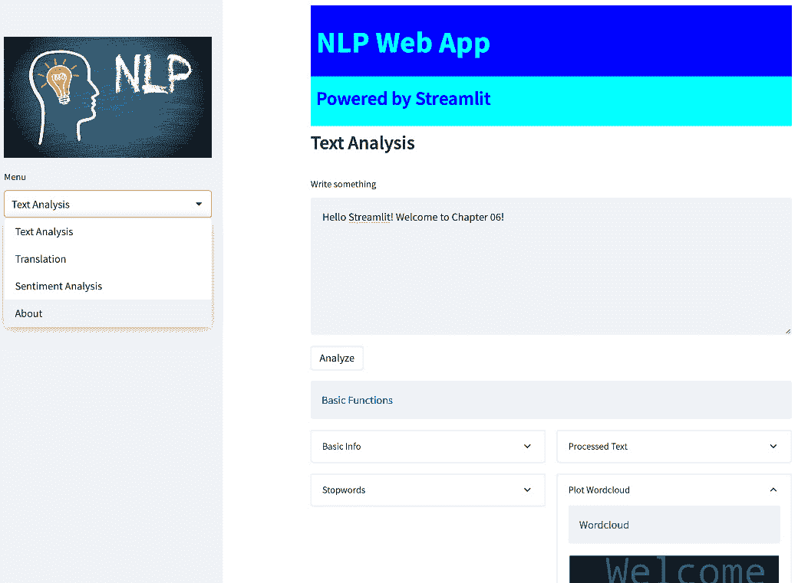

图 6.1：第六章的起点

当我们点击**翻译**或**情感分析**时，我们仅在 Web 应用程序的主界面看到一个子标题，提醒我们当前所在的部分，除此之外没有其他内容。所以，现在是时候编写这两个功能了。

在深入代码之前，让我们先尝试理解翻译和情感分析到底是什么。

## 什么是翻译？

自然语言处理中的**翻译**是自动将文本或语音从一种语言转换为另一种语言的任务。它有助于消除语言障碍，促进全球交流。**机器翻译**（**MT**）的进展彻底改变了这一领域，**统计机器翻译**（**SMT**）和**神经机器翻译**（**NMT**）发挥了关键作用。由深度学习和 Transformer 模型驱动的 NMT 捕捉上下文并生成更流畅的翻译。挑战包括保留风格、处理习语和适应特定领域。未来有望进一步推进准确和文化敏感的翻译系统，促进跨文化理解。

## 什么是情感分析？

**情感分析**，或称为**意见挖掘**，是自然语言处理中旨在从文本中提取情感或主观信息的任务。它涉及将文本分类为*积极*、*消极*或*中立*的情感。传统方法依赖于规则和词汇表，而包括深度学习和预训练模型（如 BERT）在内的机器学习技术已经彻底改变了情感分析的方式。挑战包括细粒度分析和基于方面的情感分析。未来将在准确性、语言覆盖和伦理考虑方面取得进展。情感分析为各种应用的决策提供了宝贵的见解。

情感分析提供了对文本中表达的意见和情感的见解。它帮助企业了解客户反馈、市场趋势和公众情绪。通过分析情感，公司可以改进产品、量身定制营销策略并做出数据驱动的决策。情感分析还应用于社交媒体监控、声誉管理和公众意见分析。

结合起来，翻译和情感分析提供了增强的客户理解能力。企业可以跨语言分析情感，从多语言来源中获取见解。这种整合使得能够全面了解市场上客户的情感，帮助识别模式、改进领域和文化上下文的适应。

这些工具还有助于社会和政治分析。通过跨语言分析情感，研究人员和决策者可以更广泛地理解公众对各种主题、政策和社会运动的情感。这有助于有效沟通和知情决策。

让我们从菜单上的**翻译**选项开始。

# 深入探讨语言翻译

翻译打破语言障碍，促进全球交流和跨文化理解。它使企业能够在国际上扩展业务，与不同的受众建立联系并促进文化交流。机器翻译的进步使得准确和可访问的翻译服务广泛可用，改变了我们在日益互联的世界中交流的方式。

要将翻译功能添加到我们的网页应用程序中，我们必须按照非常精确的顺序添加几行代码。

## 添加文本区域

正如你所想，执行翻译的第一步是引入一个文本区域，在这里我们可以写下需要翻译的文本。我们很清楚，这个操作非常简单，因为它只需要一行代码。所以，第一步是将我们的代码放置在菜单的适当位置，如*图 6.2*所示：

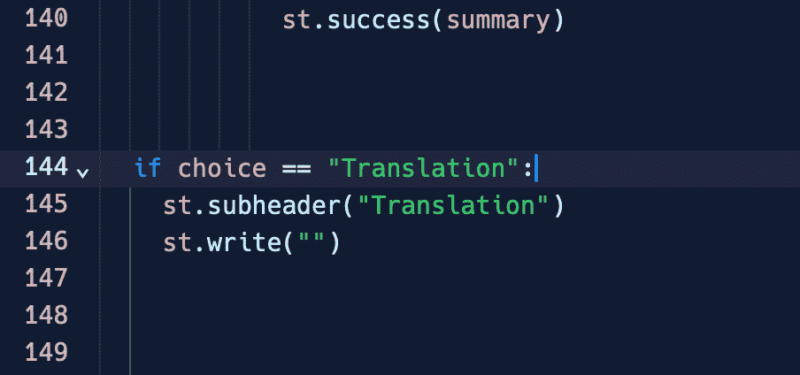

图 6.2：翻译部分

然后，添加`text_area`，如*图 6.3*所示：

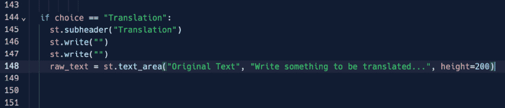

图 6.3：一个新的文本区域

现在，通过在浏览器中重新运行我们的网页应用，新的文本区域将会显示出来。我们放入这个新`text_area`中的文本会存储在一个名为`raw_text`的变量中。在处理文本时，检查我们是否有要处理的文本或者内容是否为空总是一个好主意，所以我们可以向代码中添加一个简单的`if`语句，如下所示：

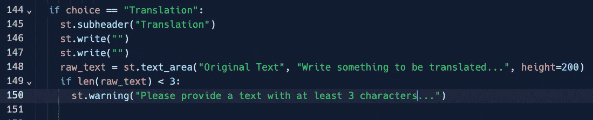

图 6.4：文本长度检查

现在，如果文本长度少于三个字符，我们希望打印一条警告信息。这是因为许多翻译库需要一定的最小字符数才能处理文本。所以，如果我们写了，比如`hi`，我们会得到以下结果：

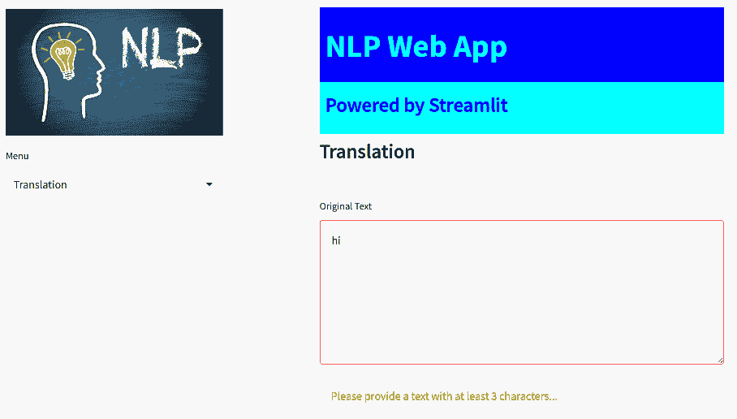

图 6.5：浏览器端的文本长度检查

现在要翻译的文本已经准备好，我们需要处理翻译本身。

## 执行翻译任务

执行翻译任务时，我们将使用一个名为`deep_translator`的新库。所以，首先，我们只需输入以下命令来安装它：

```py
pipenv install deep_translator
```

之后，我们通过输入以下内容来导入这个库：

```py
from deep_translator import GoogleTranslator
```

如你所见，我们正在利用`GoogleTranslator`服务。

如果你想了解更多关于`deep_translator`的信息，请查看其在 PyPI 上的专属页面([`pypi.org/project/deep-translator/`](https://pypi.org/project/deep-translator/))。你将发现许多非常有价值的功能可以探索。

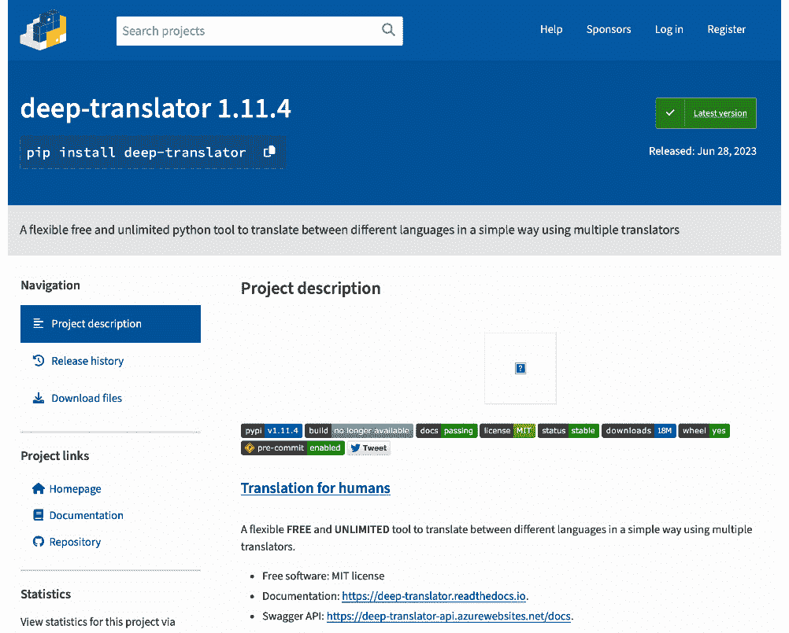

图 6.6：PyPI 上的 Deep-translator

定义翻译的语言非常重要。因此，我们将创建一个`select_box`，让用户选择特定的语言：

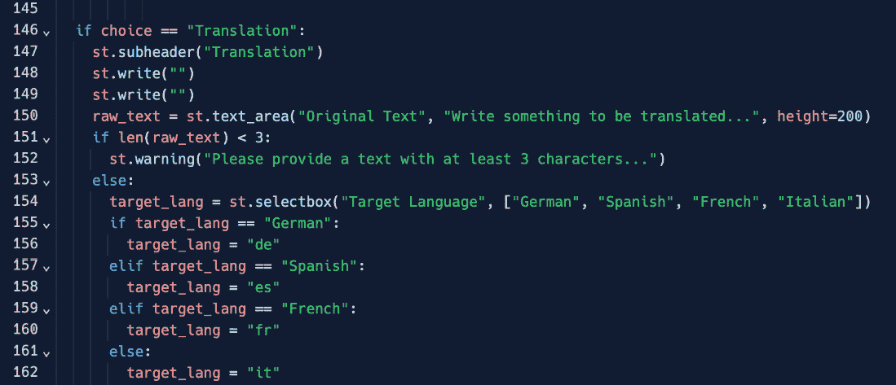

图 6.7：文本语言选择

这段代码非常简单：我们只是从一个小的子集（实际上是一个列表）中选择一个语言，并为其分配正确的代码（`de`代表德语，`es`代表西班牙语，等等）。

最后，现在我们有了目标语言，我们只需要执行翻译操作，并且可以通过点击**翻译**按钮来完成；这是完整的代码：

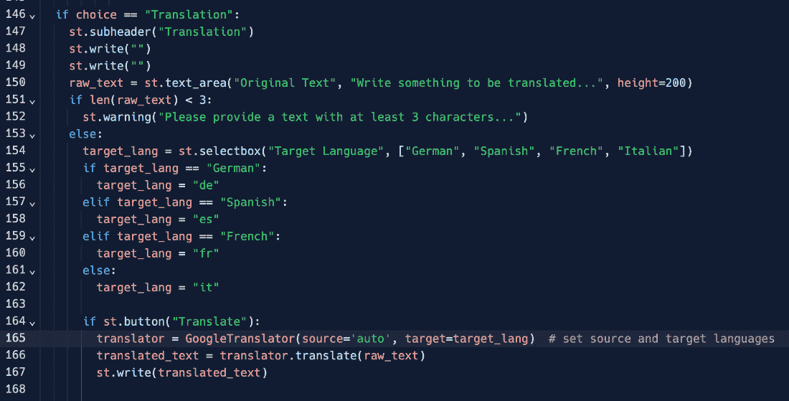

图 6.8：翻译功能代码

所以，当`deep_translator`包中的`GoogleTranslator`功能（之前已导入）将结果放入`translated_text`变量中时，再将其显示在屏幕上。

这是浏览器端的结果：

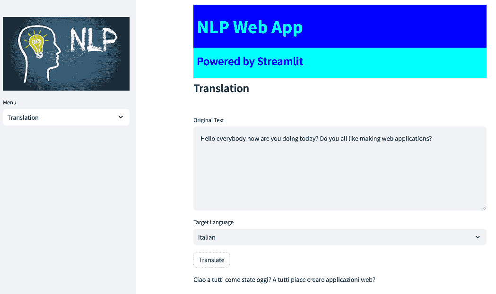

图 6.9：翻译功能运行中

一切都非常整洁清晰，且运行完美！当然，你可以根据需要个性化这个功能，例如，添加更多目标语言或对输入文本执行不同类型的检查。

*图 6**.10* 显示了**目标语言**选择的运行情况：

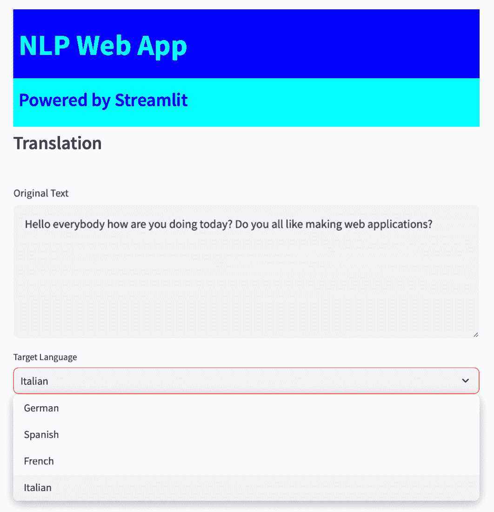

图 6.10：目标语言选择

到目前为止，我们写的代码不到 200 行，我们的网页应用已经运行得非常好。通过少量的代码，我们就能搭建一个后台和前端，业务逻辑在服务器上运行，展示层则位于浏览器上。一切都是用 Python 实现的，非常简单。这就是 Streamlit 的强大之处。

接下来，我们进入最后一个自然语言处理任务：情感分析。正如我们在介绍中发现的那样，这是一个非常有趣的话题。

# 深入情感分析

情感分析任务相当简单，因为我们可以利用已经导入的`TextBlob`。所以，让我们从目前非常简单的代码开始，它现在只是将一个子标题打印到屏幕上：

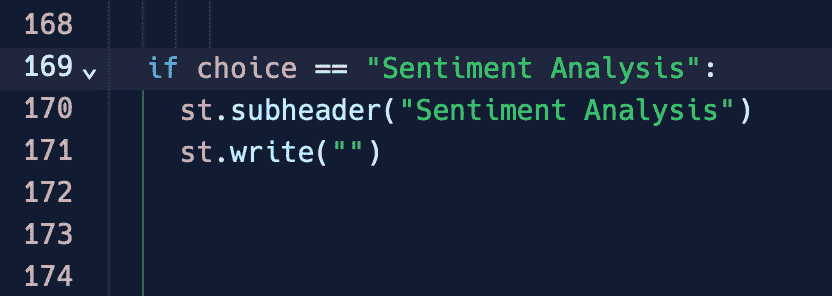

图 6.11：情感分析部分

目前，当我们从网页应用菜单中选择**情感分析**时，我们只是得到一个子标题和下面的一些空白区域。

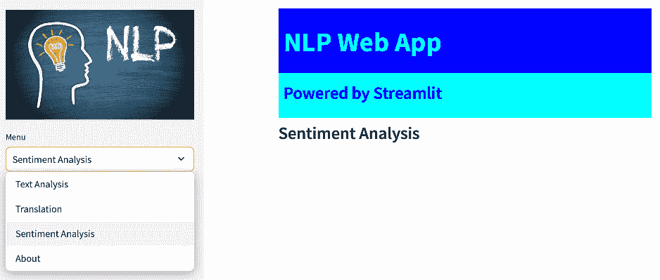

图 6.12：情感分析起点

让我们从创建一个文本区域开始，因为我们需要一个地方来添加我们想要分析的文本，以便提取其情感。现在添加一个`text_area`对我们来说非常简单：


图 6.13：用于情感分析的`text_area`

这是先前更改后的浏览器端结果：

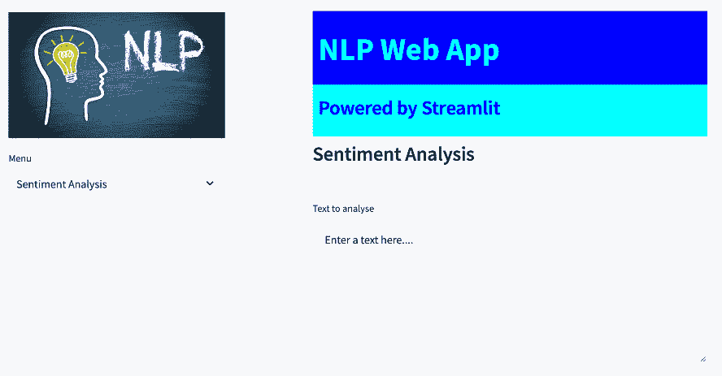

图 6.14：浏览器中的文本区域

现在，我们可以在文本区域中输入一些内容，并将其存储在一个名为`raw_data`的变量中。

像往常一样，我们有一个很好的选项，那就是添加一个按钮——我们可以叫它例如`raw_text`长度，在文本缺失的情况下，我们可以打印一个警告信息。

这是我们可以使用的简单代码示例：


图 6.15：评估按钮和检查`raw_text`长度

如果`raw_text`不为空，我们可以使用`TextBlob`来创建一个`blob`对象。之后，我们可以使用 blob 的`sentiment`方法来获取我们刚刚写的文本的情感，最后可以将结果写到屏幕上。以下是代码：

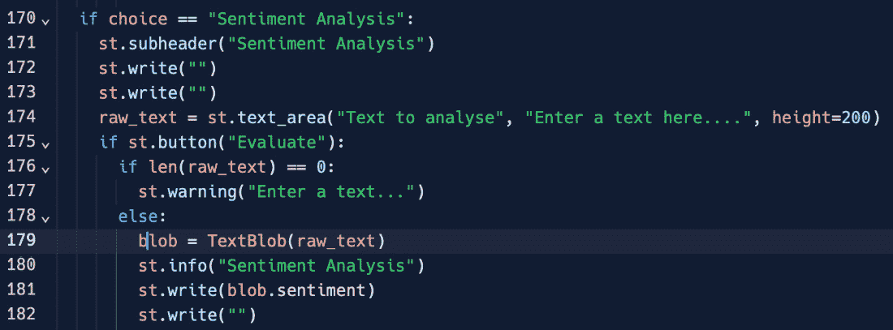

图 6.16：TextBlob 提供的情感方法

*图 6.17* 和 *图 6.18* 显示了浏览器中最新代码修改的结果。

第一个案例是积极情感，因为极性值非常高。

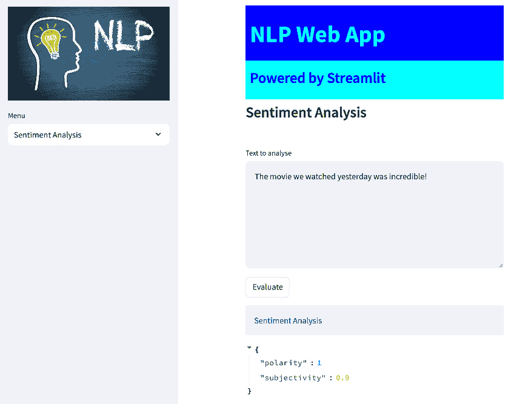

图 6.17：积极情感示例

第二种情况是负面情感，基于相当低的极性值。

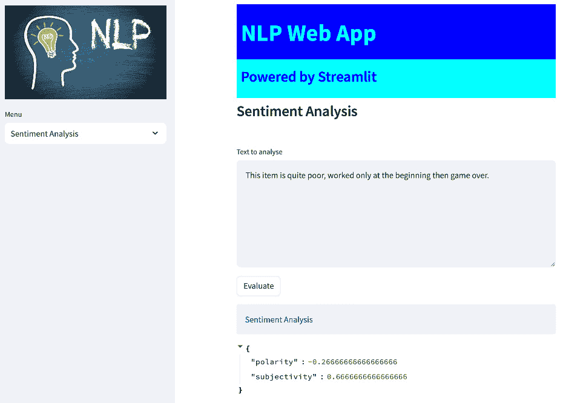

图 6.18：负面情感示例

在*图 6.19*中，我们可以看到点击**Evaluate**按钮时出现的警告，但没有文本可以考虑。

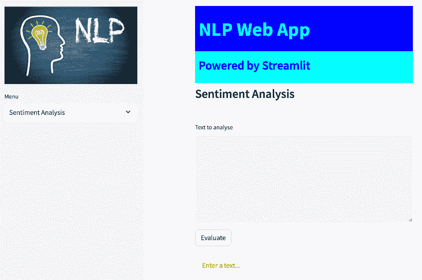

图 6.19：输入文本... 警告

如我们所见，TextBlob 的情感分析返回了两个值：`极性`和`主观性`。让我们更详细地了解这些术语的含义：

+   `–1` 到 `+1`。具体来说，`-1`表示非常负面的情感，`+1`表示非常积极的情感，所有接近`0`的值通常被认为是中性结果。

+   `0` 到 `1`。值接近`0`表示非常客观的结果，而接近`1`的值表示非常主观的结果。

因此，对于句子*I loved that movie, it’s really great!*，我们得到的结果如下：

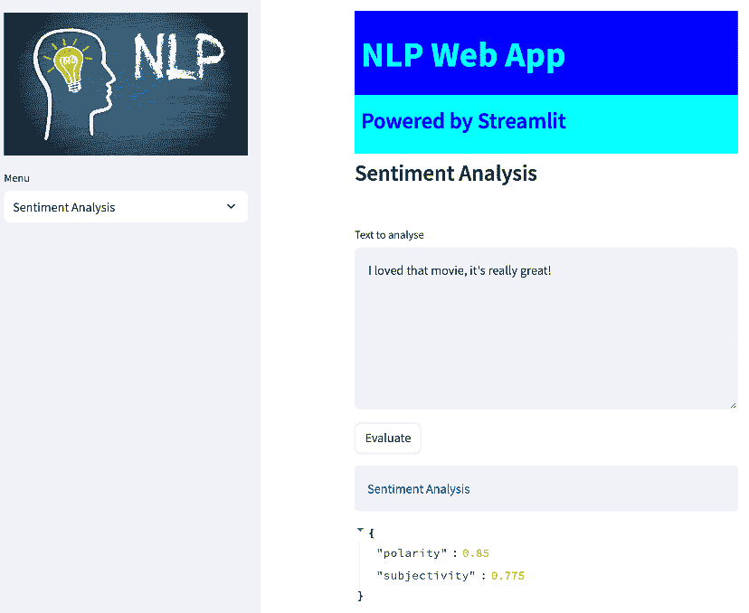

图 6.20：高极性和高主观性

这部电影获得了`0.85`的高极性分数，并由于使用了第一人称代词*I loved*，使得主观性分数也很高。这表明这是一个高度主观的观点。让我们写点不一样的内容，例如以下内容：

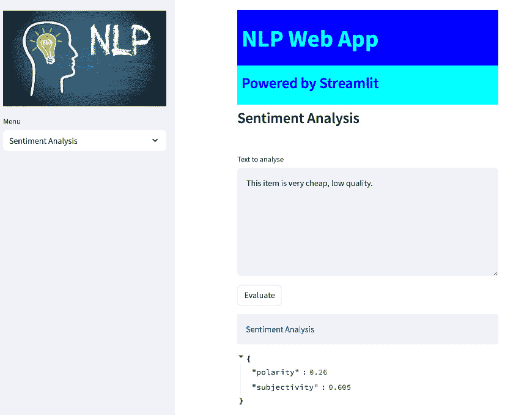

图 6.21：中性情感

我们的语句的极性为`0.26`，表示中立，因为我们陈述的是一个事实性声明。主观性几乎平衡，因为事实既包含个人视角也包含普遍视角。

就这样！我们的第一个 Web 应用程序真的完成了！我们仅仅使用 Python、纯 Python 和一些免费的库，就实现了所有我们在一开始定义的任务！

让我们花点时间回顾一下到目前为止所做的工作。

# 我们的第一个 Web 应用程序回顾

这真是令人难以置信，但我们真的做到了！从零开始，从一个空白文件出发，我们创建了一个功能良好的 Web 应用程序，完成了许多任务，并为我们提供了非常不错的输出。

首先，我们创建了一个 Python 环境，并在其中安装了所有必需的库。然后，我们开始构建应用程序的框架。这一点非常重要，因为这个框架包含一个菜单，里面有我们 web 应用程序的所有主要功能以及管理这些功能的代码部分，这些内容可以在我们每次创建新应用程序时重用。

该应用程序的代码是使用 Streamlit 中的基本控件创建的，即标题、副标题、按钮、文本框、警告、信息等，还有一些非常有趣的组件，例如列和扩展器。

我们还学会了如何在 web 应用程序中添加一些基本的 HTML，以及一些基本的 Markdown。我们利用这些技术对标题进行了美化。接着，我们继续讨论了自定义功能。我们还看到了一种方式，可以为应用程序的网页浏览器窗口关联一个漂亮的图标和有意义的标题或名称。

我们深入探讨了一些 NLP 的基础概念：词元、词形、停用词、词云、文本摘要、情感分析、极性和客观性。我们的 web 应用程序现在还包含一个非常有用的**关于**部分，里面有信息和工作链接，可以根据需要进行自定义。

下面是我们应用程序最终版本的一些截图：

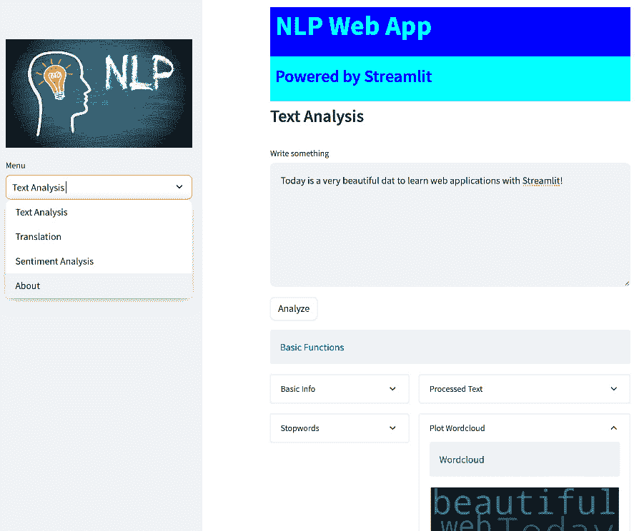

图 6.22：文本分析

在*图 6.22*中，我们可以看到屏幕左侧的完整菜单，以及应用于文本框中短句的**文本分析**功能的结果，主界面显示了这些信息。

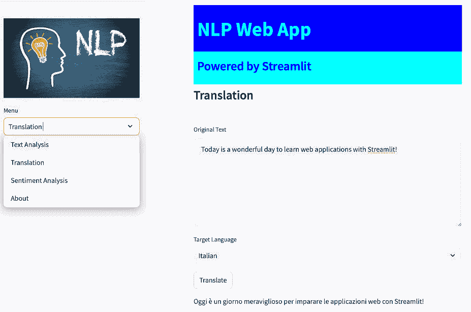

图 6.23：翻译

*图 6.23*展示了**翻译**功能的行为。这一点非常直观：在文本框中输入句子，选择目标语言，然后点击**翻译**按钮，翻译任务便会执行，结果会显示在屏幕上。

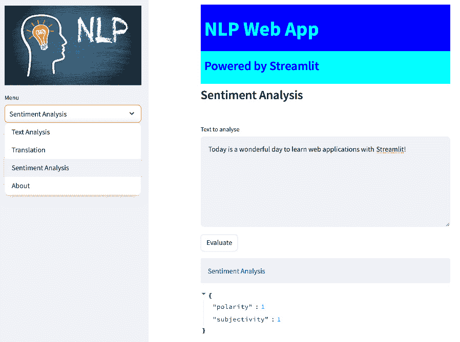

图 6.24：情感分析

*图 6.24*展示了一个**情感分析**的例子，在此例中，显示了非常高的极性。

我们在 NLP web 应用程序的截图序列中，以**关于**部分作为结尾，如*图 6.25*所示。

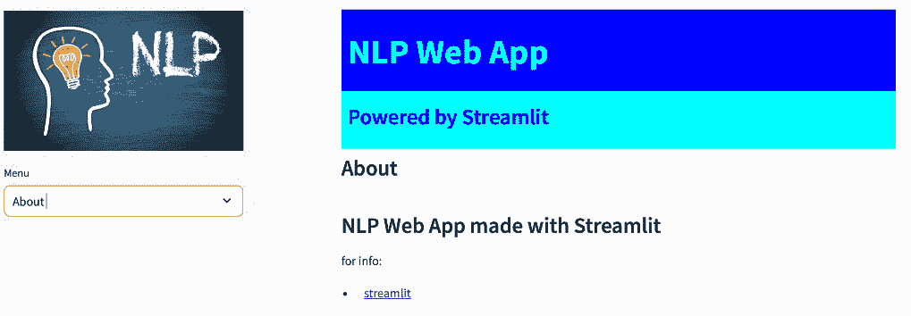

图 6.25：关于部分

**关于**部分非常有用，因为它包含关于作者的信息、外部网页的链接等。

下面是我们到目前为止一起编写的所有代码：

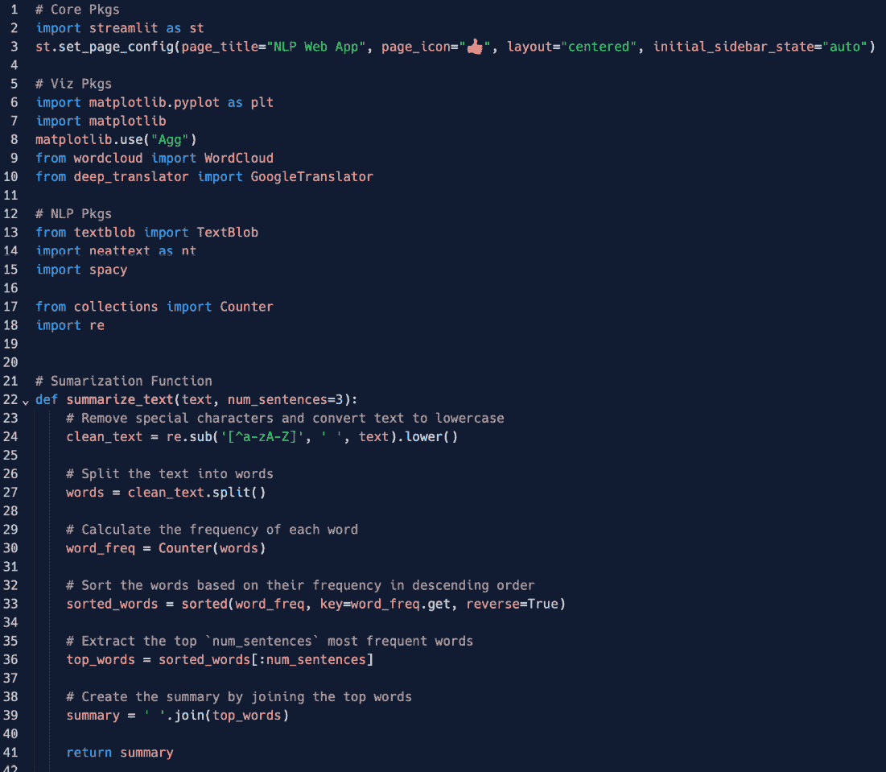

图 6.26：NLP web 应用程序代码部分 1

在第一部分中，我们导入了必要的包，设置了页面配置，并定义了`summarize_text`函数。

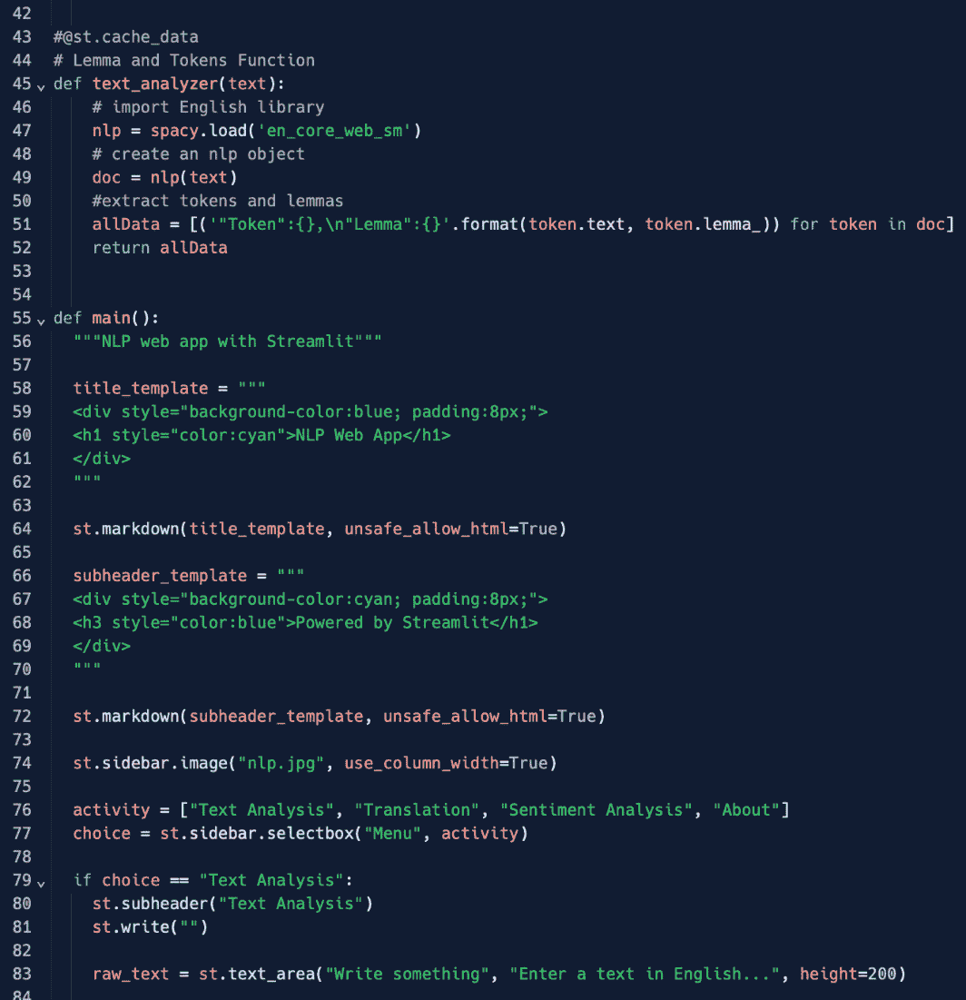

图 6.27：NLP web 应用程序代码部分 2

在第二部分中，我们编写了`text_analyzer`函数，然后是`main`函数，该函数包含了应用程序的主标题、副标题以及侧边栏中的菜单。

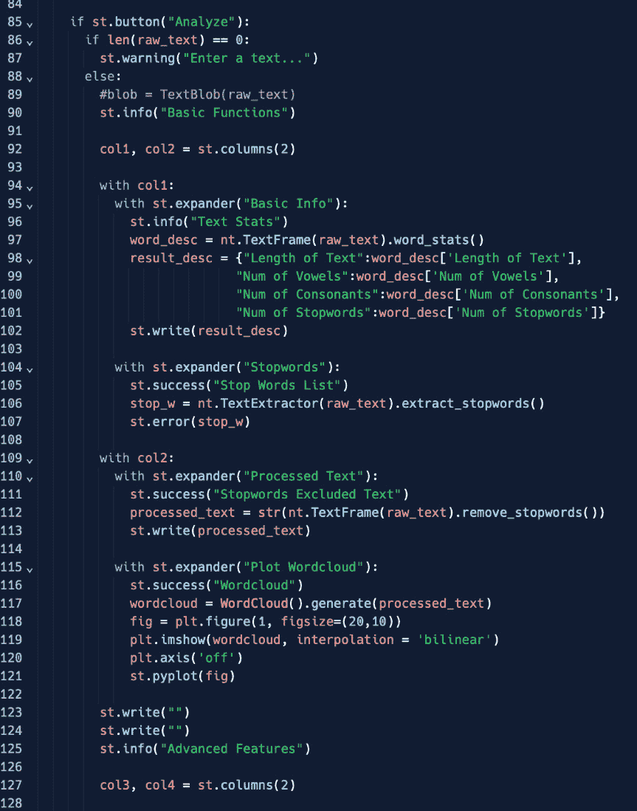

图 6.28：NLP 网页应用程序代码第三部分

在第三部分中，我们使用`if`循环和许多高级控件（如列和扩展器）开发了`main`函数。

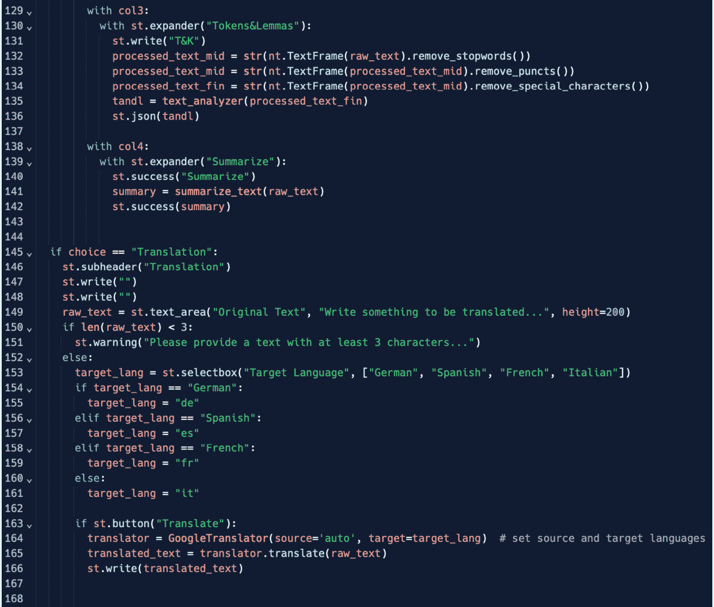

图 6.29：NLP 网页应用程序代码第四部分

在第四部分中，我们主要开发了**翻译**功能，使得可以插入文本并选择语言。

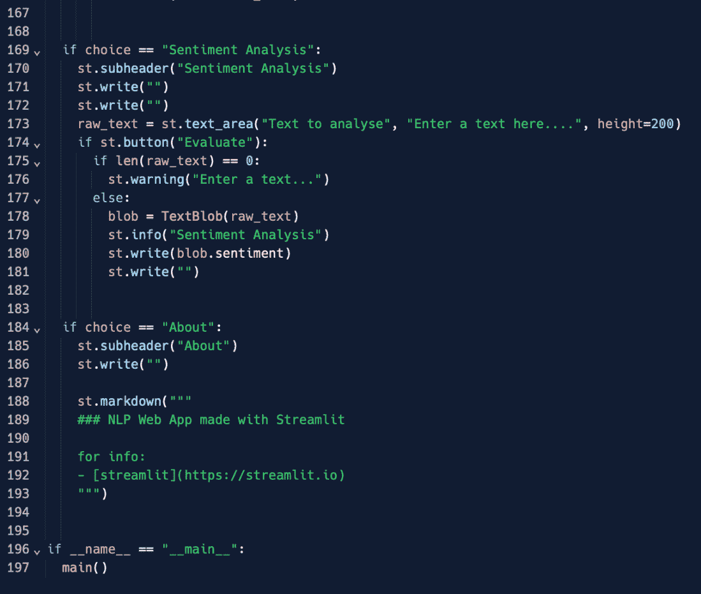

图 6.30：NLP 网页应用程序代码第五部分

在第五部分中，我们实现了`TextBlob`库，然后通过添加**关于**部分完成了网页应用程序的开发。

我们网页应用程序的完整代码清单明确展示了 Streamlit 的强大之处。不到 200 行代码就足以创建一个功能完备、界面相当漂亮的网页应用程序。我们仅使用了标准的 Python，而不需要 HTML、CSS、JavaScript 等技术。

# 总结

我们的 NLP 网页应用程序已经完成并且运行了，你应该为此感到非常骄傲！

我们还回顾了主要的要点和收获。那么，我们还能做些什么呢？

如果我们仔细考虑一下，虽然我们的应用程序运行得很好，但它仅限于本地，或者至少是在与我们编写代码的机器处于同一网络内。

要把一个网页应用程序定义为真正的网页应用程序，它需要是公开的。这意味着它必须能够在任何地方访问。

为了能够在任何地方访问，我们的网页应用程序需要托管在互联网上的一个服务器上，并拥有一个真正的公共 URL。

要将我们的网页应用程序部署到互联网上的真实服务器上，我们需要进行部署，而这正是我们将在下一章中做的事情。
