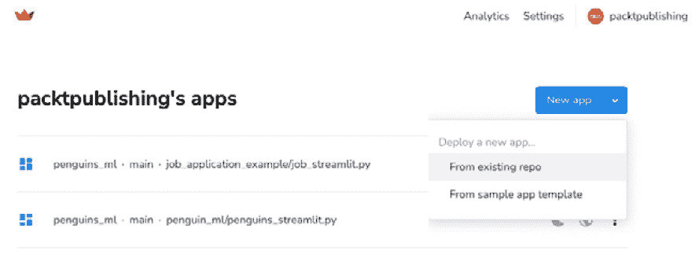
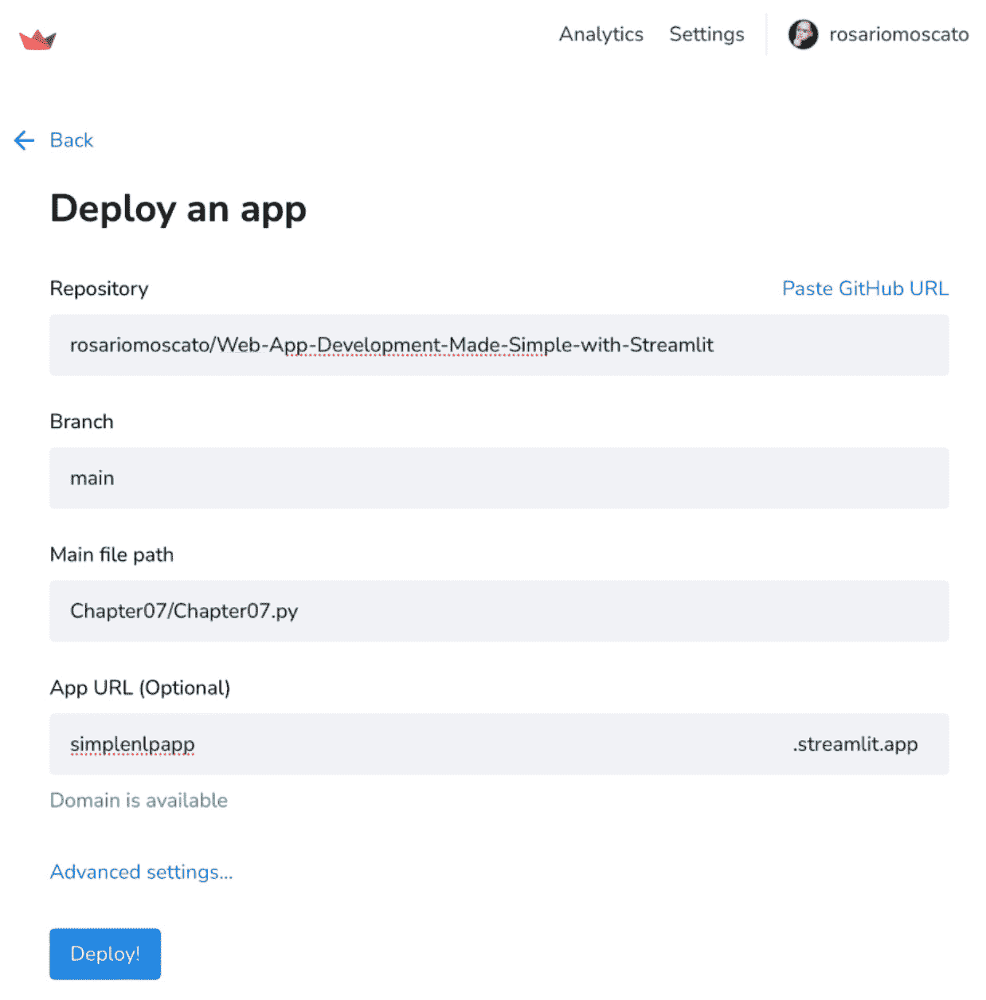
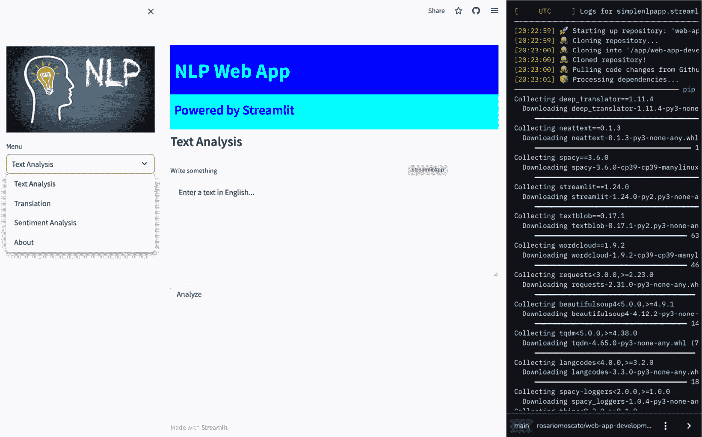
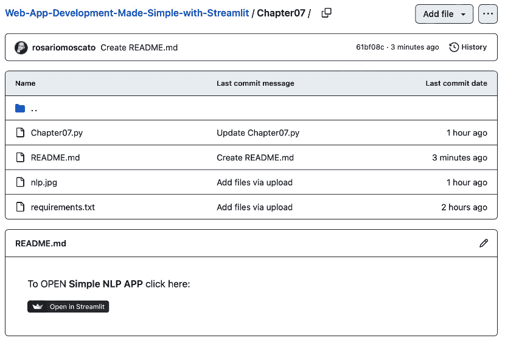

# 第七章：使用 Streamlit Share 在云端分享和部署你的应用

Streamlit Share 是 Streamlit 框架提供的一项服务，允许用户通过几次点击将其使用 Streamlit 构建的 Web 应用程序部署到云端。Streamlit Share 提供了一种免费且简便的方式，可以与他人共享我们的 Web 应用程序，并让它们在任何有互联网连接的地方都能访问。

要在 Streamlit Share 上部署 Streamlit 应用，用户必须将其 GitHub 仓库连接到 Streamlit Share 平台。Streamlit Share 会处理其余的部分，自动在云端构建并部署应用。Streamlit Share 为用户提供了几个好处，包括无缝部署、自动扩展和简便的协作。

总体而言，在 Streamlit Share 上部署是一种便捷且用户友好的方式，可以将 Streamlit Web 应用程序部署到云端并与他人共享。

在上一章中，我们已经完成并测试了我们的 NLP Web 应用程序，现在是通过 Streamlit Share 部署它的最佳时机，也许还能展示给我们的朋友和同事，让他们用任何浏览器尝试和玩转我们的创作。

以这种方式部署的 Web 应用程序甚至是一个很好的“作品集”，可以展示给他人，证明我们的能力！

在本章中，我们将涵盖以下主要主题：

+   理解部署的重要性

+   GitHub 简要介绍

+   熟悉 Streamlit Share 服务

# 技术要求

+   在本章中，我们将使用以下库、包和工具：

    +   Sublime Text

    +   Python 3

    +   `pipenv`

    +   Streamlit

    +   GitHub

    +   Streamlit Cloud

+   本章的代码可以在本书的 GitHub 仓库中找到：[`github.com/PacktPublishing/Web-App-Development-Made-Simple-with-Streamlit/tree/8d935899f9f128c8cd62d93627711de7c9388b15/Chapter07`](https://github.com/PacktPublishing/Web-App-Development-Made-Simple-with-Streamlit/tree/8d935899f9f128c8cd62d93627711de7c9388b15/Chapter07)。

# 理解部署的重要性

**Web 应用程序部署**是指将 Web 应用程序提供给用户的过程。这包括将应用程序的代码、数据和配置文件复制到 Web 服务器，并配置服务器以运行该应用程序。

Web 应用程序部署的重要性有很多原因，以下是其中的一些：

+   *部署确保你的应用程序对用户可用*：一旦你的应用程序被部署，它将可以通过互联网访问。这意味着用户可以使用你的应用程序进行任务操作，比如购物、浏览或与企业互动。

+   *部署使得更新你的 Web 应用程序变得简单*：当你对 Web 应用程序进行更改时，可以通过几次点击将它们部署到生产环境中。这使得你能够快速且轻松地向用户交付新功能和修复 bug。

+   *部署有助于提高 web 应用程序的安全性*：在部署 web 应用程序时，您可以采取措施提高其安全性，例如配置防火墙和实施安全最佳实践。这有助于保护您的应用程序免受攻击和数据泄露。

+   *部署可以帮助您提高 web 应用程序的性能*：在部署 web 应用程序时，您可以通过配置服务器、优化代码和使用缓存来优化其性能。这可以帮助改善用户体验并减少服务器负载。

简而言之，web 应用程序部署是开发过程中的一个重要环节。接下来，让我们学习一些关于 web 应用程序部署的最佳实践。

## Web 应用程序部署的最佳实践

通过遵循这些最佳实践，您可以确保您的 web 应用程序具有高可用性、安全性和性能：

+   *使用预发布环境*：预发布环境是您的生产环境的副本，您可以在将更改部署到生产环境之前在其中测试这些更改。这有助于确保您的更改在发布给用户之前是稳定且正常工作的。

+   *自动化部署过程*：自动化可以帮助减少部署 web 应用程序所需的时间和资源。有许多不同的工具可帮助您自动化部署过程。

+   *使用版本控制系统*：版本控制系统帮助您跟踪 web 应用程序代码的更改。这使得在部署过程中如果出现问题时，可以轻松回滚更改。

+   *彻底测试您的应用程序*：在部署 web 应用程序之前，彻底测试它非常重要。这包括测试应用程序的功能、性能和安全性。

+   *部署后监控您的应用程序*：一旦您的 web 应用程序被部署，监控其性能和可用性非常重要。这帮助您识别并解决可能发生的任何问题。

通过遵循这些实践，您的 web 应用程序可以顺利并成功地部署。

## Web 应用程序部署的其他好处

这里是 web 应用程序部署的其他好处：

+   *提高可扩展性*：通过将 web 应用程序部署到可扩展的基础设施，您可以轻松应对流量的增加。这对在销售或营销活动期间经历流量激增的企业尤为重要。

+   *降低成本*：通过自动化部署过程，您可以减少部署 web 应用程序所需的时间和资源。这从长远来看可以为您节省资金。

+   *提高灵活性*：通过可重复的自动化部署过程，您可以快速、轻松地将新功能和修复补丁部署到您的 web 应用程序。这为您提供了应对不断变化的客户需求的灵活性。

总的来说，web 应用程序的部署是开发过程中一个关键的部分。那么，有没有办法简化这些最佳实践的采用呢？

我们非常幸运，因为 Streamlit Share 采用了我们提到的最佳实践，从定义上来说，我们可以确保以最佳方式部署我们的 web 应用程序。

拥有一个采纳所有这些最佳实践的服务对我们来说是一个巨大的优势，因为我们可以专注于 web 应用程序的实际业务逻辑。我们的主要任务将是编写代码并确保我们的 web 应用程序正常工作，满足并实现我们所有的需求和目标，同时可以确保部署和分享方式是完美的，而我们无需过多担心这些问题。

在接下来的部分，我们将学习关于 Streamlit Share 和 Streamlit Cloud 的内容。

## 什么是 Streamlit Share 和 Streamlit Cloud？

**Streamlit Share** 是一项免费服务，它允许你仅用几次点击就能将 Streamlit 应用部署到 web 上。一旦你创建了 Streamlit 应用，你可以通过点击 Streamlit 应用中的 **Share** 按钮将其分享至 Streamlit Share。这将为你的应用创建一个独特的 URL，你可以将其与任何人分享。

**Streamlit Cloud** 是一个服务，它允许你部署一个私人应用和无限制的公共应用，因此比 Streamlit Share 提供更多的功能和灵活性。使用 Streamlit Cloud，你可以将你的 Streamlit 应用部署到可扩展的基础设施上，添加自定义域名，并与其他服务集成。请访问官方页面获取最新信息：[`streamlit.io/cloud`](https://streamlit.io/cloud)。

为了结束这一部分，让我们再次强调部署的重要性。这是使我们的 web 应用程序对任何人都可用的最简单方法。Streamlit 提供了一个非常易于管理的云服务。除了应用程序代码，我们所需要的唯一东西就是一个 GitHub 仓库。

# GitHub 简介

**GitHub** 是一个用于版本控制和协作的代码托管平台。它允许你将代码存储在一个中心位置，跟踪代码随时间的变化，并与他人合作完成项目。

使用 GitHub 有很多理由，以下是其中的一些：

+   *版本控制*：GitHub 允许你跟踪代码随时间的变化。这对任何项目都是至关重要的，因为它使你能够在需要时回退到先前的代码版本。

+   *协作*：GitHub 使得与他人合作项目变得非常简单。你可以创建一个仓库并邀请他人与你合作。这是一个很好的方式来获取对你代码的反馈和其他人的帮助。

+   *文档*：GitHub 可以用来存储项目的文档。这是一个很好的方式来跟踪项目的需求、设计和实施。

+   *托管*：GitHub 也可以用来托管你的项目。这意味着你可以让其他人查看和下载你的代码。

+   *免费*：GitHub 是免费的，你可以选择将你的仓库设置为公开或私有。如果你需要更多的资源，可以选择付费计划并查看 [`github.com/pricing`](https://github.com/pricing)。

+   *受欢迎的*：GitHub 是全球最受欢迎的代码托管平台。这意味着有一个庞大的用户和开发者社区，可以帮助你解决项目中的问题。

+   *功能丰富的*：GitHub 提供了广泛的功能，使你可以轻松跟踪更改、与他人协作并托管项目。

+   *安全的*：GitHub 使用行业标准的安全措施来保护你的代码。

你应该使用 GitHub 来管理任何你想跟踪更改、协作或托管的项目。这包括个人项目、工作项目和开源项目。

尽管如此，使用 GitHub 仍然有一些缺点：

+   *可能会很复杂*：GitHub 对初学者来说可能有些复杂。

+   *可能会很慢*：GitHub 有时会很慢，尤其是当流量很大时。

这些缺点可以很容易克服：

+   首先，通过学习 GitHub 的语法和功能，可以缓解其复杂性。经过几次操作后，一切都会更加顺畅。

+   对于需要保护的敏感信息，我们始终可以创建私有仓库——只要了解何时真正需要这样做即可。

+   最后，在大流量情况下，服务可能会稍微变慢，但全天的某些时段，速度和响应性都不会是问题。

GitHub 是 Streamlit 生态系统中的关键部分。GitHub 与 Streamlit Share 有几种关联方式：

+   *Streamlit 应用托管在 GitHub 上*：当你创建一个 Streamlit 应用时，可以选择将其托管在 GitHub 上。这意味着你的应用代码将存储在 GitHub 仓库中。这是一个很好的方式，可以让其他人查看并下载你的应用。

+   *Streamlit Share 使用 GitHub OAuth*：Streamlit Share 允许你与他人分享应用，而无需分享你的 GitHub 用户名和密码。当你使用 Streamlit Share 时，Streamlit 会请求你授权访问你的 GitHub 账户。这样，Streamlit 就可以为你的应用创建一个新的 GitHub 仓库，并将应用部署到 GitHub Pages 上。

+   *Streamlit 的 Community Cloud 与 GitHub 集成*：正如我们之前所解释的，Streamlit 的 Community Cloud 是一个让你轻松部署、管理和分享 Streamlit 应用的平台。当你在 Community Cloud 中创建 Streamlit 应用时，可以选择将其链接到你的 GitHub 账户。这使你可以轻松管理应用的代码，并与他人协作。

总之，如果你想创建、分享并协作开发 Streamlit 应用，你就需要使用 GitHub。

现在我们已经掌握了所有理论信息，准备以非常有效的方式开始分享我们的 Web 应用，让我们不要犹豫，开始吧！

# 熟悉 Streamlit Share 服务

现在我们已经讲解了理论，接下来让我们以一种非常简单顺利的方式，了解如何部署我们的 NLP Web 应用！

首先，你需要访问 [`share.streamlit.io`](https://share.streamlit.io)：


图 7.1: Streamlit Share 网页

当你进入页面时，必须使用你的 GitHub 账号登录，使用你 GitHub 账号的邮箱（或用户名）和密码。如果你还没有 GitHub 账号，你需要注册一个（[`github.com`](https://github.com)）。

现在，在登录之前，我强烈建议你仔细阅读 Streamlit 官方文档，了解如何分享应用，因为你可以找到关于如何分享私人和公开应用的非常详细的信息：


图 7.2: Streamlit 官方“分享你的应用”文档

一旦你使用 GitHub 账号登录，你将看到一个类似下面的页面（在我的页面中，有很多已经发布/部署的应用；而刚开始时，你的页面会是空的）：


图 7.3: 登录后显示的页面

页面左上角有 Streamlit 的 logo，而右侧则是菜单中的**分析**和**设置**区域，以及你的账户名。

为了能够正常工作，我们将要部署的 Web 应用需要代码中包含所有必需的库。有多种方法可以收集所有这些必需包的列表，但最简单的一种方法是使用 `pipreqs` 包。所以，在命令行中，我们可以输入以下内容：

```py
pip install pipreqs
```

这个安装过程非常快。安装完成后，你可以在命令行中再次输入一个非常简单的指令：

```py
pipreqs my_application_folder_name
```

这里，`my_application_folder_name`是你的应用程序 Python 文件所在的文件夹。

该指令将生成一个名为`requirements.txt`的文件。如果你打开它，你会看到它包含了我们将要部署的 Python Web 应用所需的所有包/库的列表：


图 7.4: “requirements.txt”文件

很好——我们已经准备好所有所需的东西！在正式部署之前，你必须上传 Web 应用的 Python 文件，也就是 `app.py` 或 `whatevername.py` 文件，以及你刚刚生成的 `requirements.txt` 文件，还有我们在侧边栏中使用的 `nlp.jpg` 图片文件（如果不更新图片文件，程序会报运行时错误）。你的 GitHub 应该包含这两个文件，并且应该像这样：


图 7.5: GitHub 上需要的部署文件

如果您处于*图 7.5*所示的阶段，一切已经准备好进行部署。请返回 Streamlit Share 页面，点击**新应用**，然后选择**从现有仓库**，如*图 7.6*所示：



图 7.6：从现有仓库创建“新应用”

现在，系统将要求您提供有关仓库的一些信息，包括其名称（在**仓库**下）、**分支**、**主文件路径**和**应用程序 URL（可选）**，如*图 7.7*所示：



图 7.7：部署应用所需的信息

所需的信息取决于您如何将文件上传到 GitHub。然而，提供这些信息是很简单的。您需要提供仓库的名称，它将作为表单中的一个备选项显示。您还需要提供分支的名称，通常为`main`。另外，您需要提供应用程序代码文件的名称，应该是`app.py`或您的 Python 文件名。最后，强烈建议您填写所有人将用来连接您的 web 应用程序的公共 URL 名称。差不多就是这些！然后，您可以点击**部署！**，然后静静等待奇迹发生。

在 web 应用程序部署过程中，您应该会看到一条很棒的消息，写着**您的应用程序正在烘焙中**，并附带一些由精美甜点图片组成的动画：


图 7.8：您的应用正在烘焙中

一会儿后，您的 web 应用程序将在云端上线运行！


图 7.9：NLP web 应用已部署

这非常简单且整洁。一旦我们的应用在云端运行，我们可能需要对其进行管理。让我们看看通过点击 web 应用程序右下角的**管理应用**，我们可以访问哪些功能：



图 7.10：部署“终端”

首先，我们会看到类似安装终端的界面——即一个报告我们部署过程中所有进展的终端。此外，我们还可以点击右上角的三个点，获取一些非常重要的功能：


图 7.11：Streamlit Share 中的功能

首先，通过选择**下载日志**，我们可以下载部署日志，这在出现问题时非常有用。之后，我们可以访问应用程序的分析数据，重启 web 应用程序，删除它，或者进入一些设置。此外，我们还可以查看所有已经部署的 web 应用程序，并检查文档或请求支持。

如果我们选择**设置**，我们将能访问三个额外的选项，如*图 7.10*所示：


图 7.12: 应用程序设置

在**常规**部分，我们可以修改我们应用的 URL，在**共享**部分，我们可以决定我们的 Web 应用是私有的还是公开的，在**机密**部分，我们可以指定——如果我们使用它们——外部服务的 API 密钥，而无需与每个人共享。

现在，我们可以做一些其他既简单又非常有用的事情：我们可以在 GitHub 仓库中添加一个写着**在 Streamlit 中打开**的徽章或按钮。这样，任何人只需点击这个徽章，就可以轻松直接访问我们已部署的 Web 应用程序。

这个操作非常直接，因为我们只需要向我们的仓库中添加一个包含几行代码的`README.md`文件。

因此，让我们将包含以下截图中显示的代码的`README.md`文件添加到我们的 GitHub 仓库中：


图 7.13: README.md 文件的内容

第一个 URL，也就是第一个`https://`，是指向徽章或图片的链接，而第二个 URL，也就是第二个`https://`，只是我们刚刚部署的 Web 应用程序的 URL，请用你应用的真实 URL 进行自定义。

下图展示了我们在 GitHub 仓库中的效果：



图 7.14: “在 Streamlit 中打开”徽章

正如我们之前提到的，点击徽章后，你将被重定向到我们刚刚部署的 Web 应用程序。

在关闭本章之前，请注意，当我们在安装所有所需的 Python 包后开发我们的 NLP 应用程序时，我们使用以下命令下载了*spaCy 英语模型*：

```py
python -m spacy download en_core_web_sm
```

当我们在 Streamlit Share 上部署应用程序时，我们只需要一个`requirements.txt`文件。那么，我们怎么获得我们的 spaCy 英语模型呢？

如果我们遇到与`NOT FOUND en_core_web_sm`相关的错误，要修复它，我们需要在`requirements.txt`文件中做一个非常简单的更改——只需要用以下两行替换与`spacy`相关的那一行：

```py
spacy>=2.2.0,<3.0.0
https://github.com/explosion/spacy-models/releases/download/en_core_web_sm-2.2.0/en_core_web_sm-2.2.0.tar.gz#egg=en_core_web_sm
```

通过这种方式，英语模型将被下载到我们的工作空间，一切将顺利运行！

如果我们停下来几秒钟，仔细思考一下，我们会明白在这一部分，我们取得了一个令人难以置信的成果。一个之前只存在于我们小环境中的 Web 应用（我们的计算机或本地网络），现在可以被任何有互联网连接的人访问。任何地方的人都可以与我们的 Web 应用进行交互并使用它。这种技能是非常宝贵的。我们不仅可以开发漂亮的 Web 应用程序，还可以让它们面向任何人。我们的应用程序现在可以服务于一个极其广泛的受众。

# 总结

恭喜！你已经部署了你的第一个 Web 应用程序，现在，任何人都可以通过你指定的 URL 访问并享受它！

如果现在回顾一下，你可以想象我们已经走了多远。从一个完全空白的文件和空文件夹开始，我们已经构建了一个拥有许多功能的完整 Web 应用程序。

关键在于，这个新开发的 Web 应用程序只存在于开发者的计算机或私人网络中，除非它被部署到云端。

本章中我们学习了将其部署到云端。应用程序的部署是一个真正的“大事”，因为我们可以让我们的创作随时随地都能访问！

对已经部署的内容进行更改和改进非常简单，因为我们只需根据新的想法修改代码、进行测试并将其上传到 GitHub 仓库。之后，Streamlit Share 会以一种神奇的方式自动无缝更新部署。

我们可以将代码上传到 GitHub，Streamlit Share 会处理其余的事情：简单！

从下章开始，我们将实现一个比我们刚完成的更复杂的新 Web 应用。通过这个过程，我们将学习并掌握 Streamlit 的所有主要高级功能！

# 第三部分：使用 Covid-19 检测工具开发高级技能

在第三部分，本书将重点转向更高级的 Streamlit 功能，并以 Covid-19 检测工具的开发为实际案例研究。首先，书中将引导您完成针对构建**人工智能**（**AI**）驱动 Web 应用的高级环境设置和包管理，特别适合集成复杂的 AI 模型。接着，它深入探讨了通过定制和 UI 功能优化 Streamlit Web 应用的**用户体验**（**UX**），强调直观且富有吸引力的界面设计的重要性。然后，书中讨论了如何利用预训练模型，展示了如何创建专业化和个性化的应用程序，这在 AI 和机器学习时代是至关重要的技能。最后，它涵盖了在 Streamlit Share 上部署和管理复杂库的内容，确保你能熟练处理复杂的应用需求。本部分内容是将你的技能从中级提升到高级的关键，为你提供了专业级 Streamlit 开发的准备。

本部分包含以下章节：

+   *第八章*，*构建 AI 驱动 Web 应用的高级环境设置与包管理*

+   *第九章*，*通过定制和 UI 功能优化 Streamlit Web 应用的用户体验（UX）*

+   *第十章*，*利用预训练模型* *创建* *专业化和个性化的 Web 应用*

+   *第十一章*，*在 Streamlit Share 上部署和管理复杂的库*
