# 第八章：构建 AI 驱动的 Web 应用的高级环境设置与包管理

在*第八章*到*第十二章*中，我们将一起构建一个新的网络应用：一个可以从图像中检测 COVID-19 存在与否的工具。为此，我们将利用一个预训练的模型（我们不深入探讨 AI 和模型训练，而是直接使用一个预训练的卷积神经网络），通过这种方式，我们将学习如何将 AI 模型集成到我们的 Web 应用中，并围绕它们构建一整套服务！

简单来说，预训练模型是一个已经由别人提前训练好的 AI 模型，用来进行预测——例如分类或回归。为了训练该模型，通常需要一个与所研究问题相关的数据集。因此，在 COVID-19 检测的案例中，一个二分类模型（二分类意味着只有两种可能的解决方案：COVID 或非 COVID）已经在过去被训练，现在可以在我们的 Web 应用中使用。

本章深入讲解了我们在*第四章*中看到的内容。本章旨在帮助你更好地理解如何从零开始开发一个 Web 应用，添加需要更高技能的更多功能。因此，我们将再次设置一个虚拟环境，安装和管理包，创建应用框架，并为应用添加菜单和装饰。在这一部分，我们将一起构建一个新的 Web 应用，获得更多高级技能。

本章将覆盖以下主要内容：

+   配置我们的环境

+   安装和导入包

+   构建应用框架

+   构建菜单并添加装饰

# 技术要求

+   在本章中，我们将使用以下库、包和工具：

    +   Sublime Text

    +   Python 3

    +   `pipenv`

    +   Streamlit

+   本章中的代码可以通过以下 GitHub 链接访问：[`github.com/PacktPublishing/Web-App-Development-Made-Simple-with-Streamlit/tree/d5860f2916d79752d4b03c615da68f5bbdb4ed63/Chapter08`](https://github.com/PacktPublishing/Web-App-Development-Made-Simple-with-Streamlit/tree/d5860f2916d79752d4b03c615da68f5bbdb4ed63/Chapter08)

# 配置我们的环境

事实上，我们已经在前一个项目的开始创建了一个虚拟环境，在*第四章*中，因此我们应该对这项任务非常熟练。让我们从创建一个空目录开始，可以简单地命名为`covid`。那么，让我们在终端中输入以下指令：

```py
mkdir covid
```

然后，我们可以通过输入以下命令进入新目录：

```py
cd covid
```

现在是创建我们虚拟环境的时候了。我们知道这项操作非常简单，因为我们可以使用`pipenv`，就像在*第四章*中做的那样。所以，再次提醒，在我们的目录中输入以下命令（非常重要的是要在`covid`目录内）：

```py
pipenv shell
```

虚拟环境将很快创建完成，我们应该进入一个类似于下图所示的阶段：

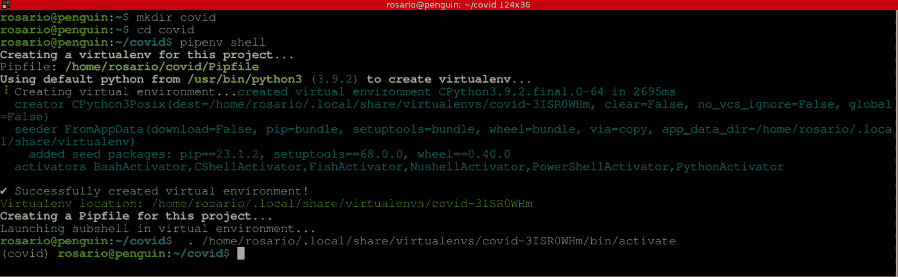

图 8.1: 创建虚拟环境

如*图 8.1*所示，创建了一个名为`covid`的新目录。然后，我们进入该目录，并通过输入`pipenv shell`来创建虚拟环境，虚拟环境的名称与目录名相同。我们使用的工具（`pipenv`）提供了一个积极的输出（绿色文本），并自动打开了新的虚拟环境。实际上，在截图的最后一行开始部分，括号中的`covid`表明我们处于虚拟环境中。

此时，环境已经准备好，但仍然是空的，因为我们还缺少在代码中使用的所有库。让我们来看一下需要哪些包。

# 安装和导入包

现在，我们已经进入了`covid`目录，并且虚拟环境已经创建完成，是时候安装我们在网页应用中要用到的所有包了。

我们需要五个不同的库：

+   `Streamlit`，我们用于网页应用的神奇框架

+   `numpy`，一个用于高级数值计算的库

+   `tensorflow`，用于管理神经网络的包

+   `Pillow`，一个用于图像管理的库

+   `opencv-python`，计算机视觉包

让我们通过依次输入以下指令来安装所有内容：

```py
pipenv install streamlit numpy tensorflow Pillow opencv-python
```

这个安装过程可能会花一些时间。当它完成时，我们的屏幕上应该会显示如下内容：

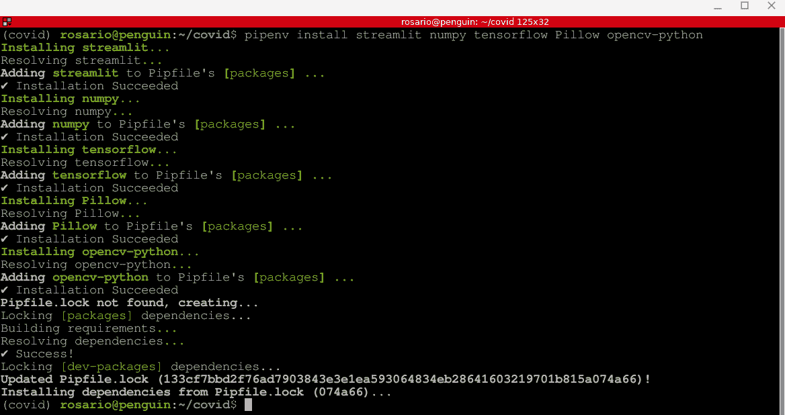

图 8.2: 包安装

现在我们可以启动编辑器 Sublime Text。你会看到，在`covid`目录中，现在有两个*著名*的文件，`Pipfile`和`Pipfile.lock`，它们包含了我们虚拟环境的配置、已安装的库以及依赖列表：

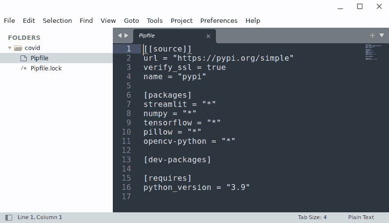

图 8.3: Pipfile

现在我们可以创建一个新文件，并像往常一样命名为`app.py`，然后我们可以写下以下内容：

```py
   touch app.py
```

一切终于准备好开始编写代码了。

显然，我们必须从导入库开始，这非常简单，正如下图所示：

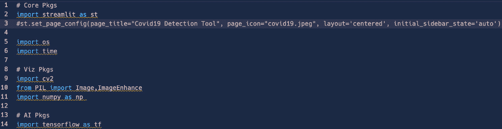

图 8.4: 导入库

和之前的网页应用一样，我们需要创建一个主函数。我们可以通过添加一些`html`代码来实现，目的是为我们的应用设置标题。由于我们已经导入了 Streamlit，像往常一样，在`import streamlit as st`这一行之后，作为第一条指令添加页面配置的代码（我们设置了标题、图标——你可以使用任何图片——以及初始的侧边栏状态）。完整代码如下：

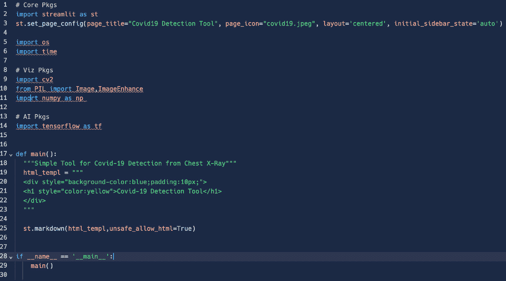

图 8.5: 第一个应用草图

目前，我们只导入了库并添加了非常少的代码行，但网页应用已经可以启动了。我们可以通过输入以下常见的指令来启动：

```py
pipenv run streamlit run app.py
```

在下图中，可以看到在本地浏览器打开`8501`端口后获得的结果：


图 8.6：应用首次启动

没有错误！现在我们可以继续构建应用框架。

# 构建应用框架

到此为止，我们应该已经相当擅长构建应用的框架了，因为我们之前开发的 NLP 网页应用做得非常好。事实上，如果你还记得，我们首先定义并构建了一个简单的框架，只包含一个菜单，菜单中有所有网页应用应包含的功能，然后才一步一步地实现这些功能。现在，我们将采用同样的方法。

在构建*COVID*应用的框架之前，让我们先为应用添加一些装饰——例如，标题下方的文本和侧边栏中的一张图片。

带有两行新代码的代码如下所示：

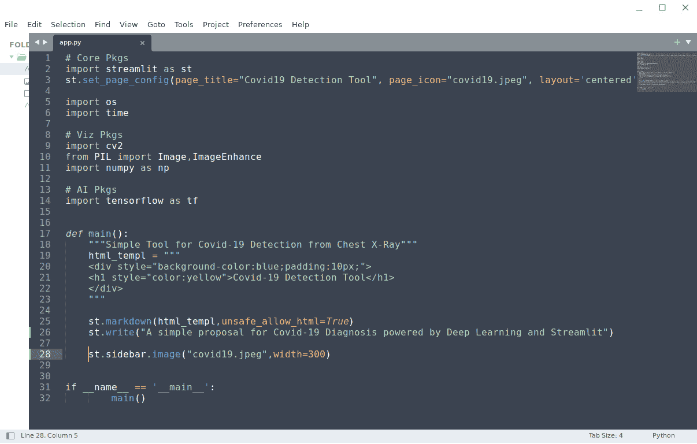

图 8.7：标题下方的文本和侧边栏创建

正如我们已经知道的，第三行的代码负责网页应用的配置，设置页面标题（`Covid-19 Detection Tool`）、页面图标（`covid19.jpeg image`）和页面布局（`centered`）。

网页端产生的结果如下：

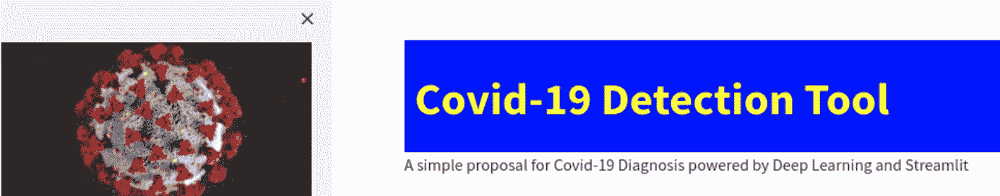

图 8.8：侧边栏中的图片和标题下方的文本

现在，让我们在侧边栏中添加一个非常重要的小部件：`file_uploader`。我们将使用的指令如下：

```py
image_file = st.sidebar.file_uploader("Upload an X-Ray Image (jpg, png or jpeg)", type=["jpg", "png", "jpeg"])
```

正如我们在网页端所看到的，`image_file`。第一个参数只是一个标签（文本`type`），包含了一个允许用户选择的文件类型列表。

紧接着`file_uploader`，最好插入一个检查（一个`if`语句），以确保已经上传了图片，只有在这种情况下才打开它（利用我们一开始导入的`Pillow`库）。

一旦我们有了图片，并且只有当上传的图片可以被打开时，我们才可以执行其他操作——例如，在前面的`if`语句内部添加一个`if`语句。最终，我们的主函数中的代码将如下所示：

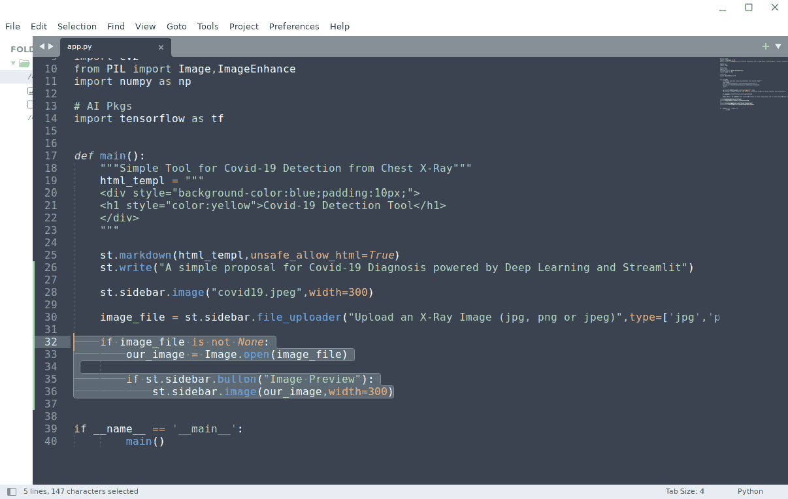

图 8.9：如何管理图片

非常简单地，我们可以选择一张图片，当我们点击**图片预览**按钮时，就可以在屏幕上、侧边栏中看到它，如下图所示：

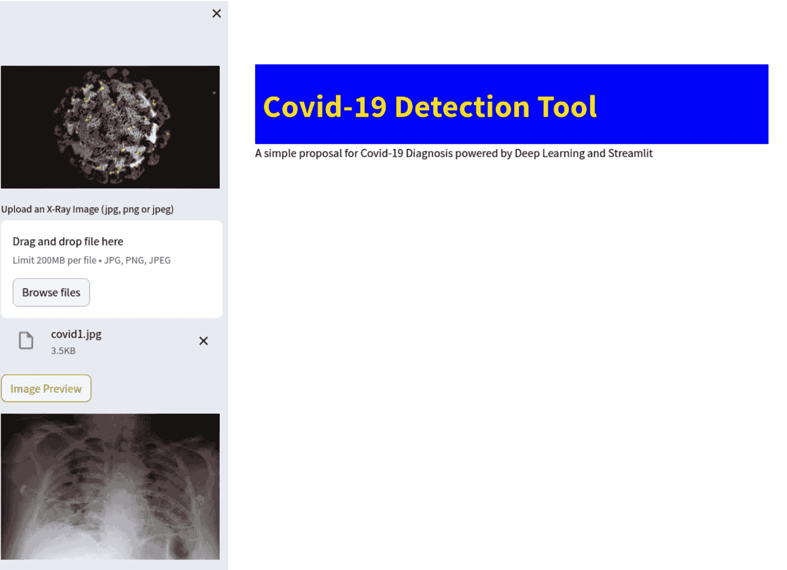

图 8.10：在侧边栏中上传并预览图片

到这时，我们已经有了一个完整的应用框架，并且能够上传并在侧边栏中显示图片。我们现在准备开始构建菜单了。

# 构建菜单并添加装饰

现在，我们可以在侧边栏中添加一个选择框，这将是 web 应用程序的菜单，并提供开发指南。这个菜单将有三个选项——`if` 子句，内部的那个，因为它只有在已经上传有效图像时才有意义。肯定地，选择框后面我们可以放置三个选项（三个 `if` 子句），它们将包含每个菜单选项的代码。

我们已经在 NLP web 应用程序中以相同的方式构建了一个菜单；代码非常简单：

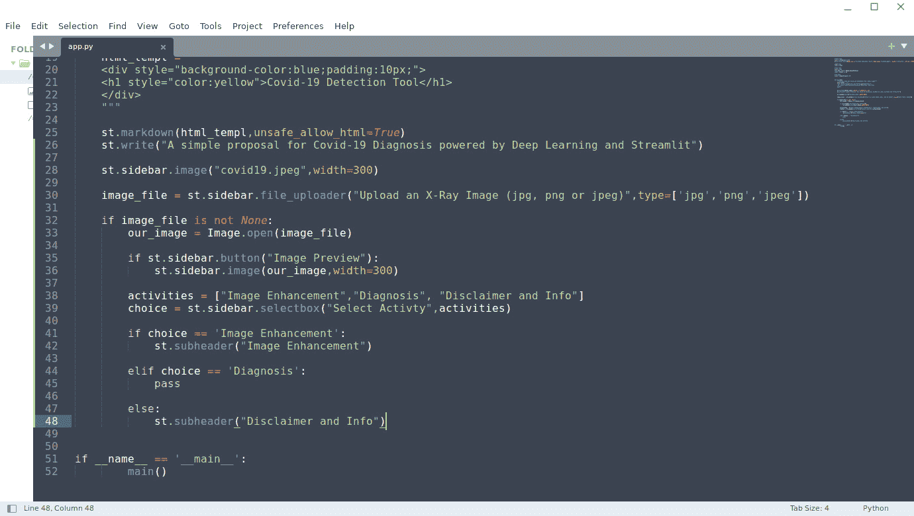

图 8.11: 菜单（选择项）及其选项部分

这是我们正在做的：

+   在*第 38 行*，我们创建了一个包含所有菜单选项的列表

+   然后，在*第 39 行*，我们在侧边栏中添加了一个选择框，以便可视化此列表中包含的所有项目。

+   然后，从*第 41 行*到*第 48 行*，我们检查哪个菜单选项已被选中，并仅将信息打印到屏幕上——例如，`st.subheader`（`pass`）。

我们使用 `st.subheader` 或 `pass` 函数（它只是一个什么都不做的函数）打印的消息是简单的占位符，在接下来的章节中，我们将开发与它们相关的代码。到目前为止，应用程序菜单看起来是这样的：

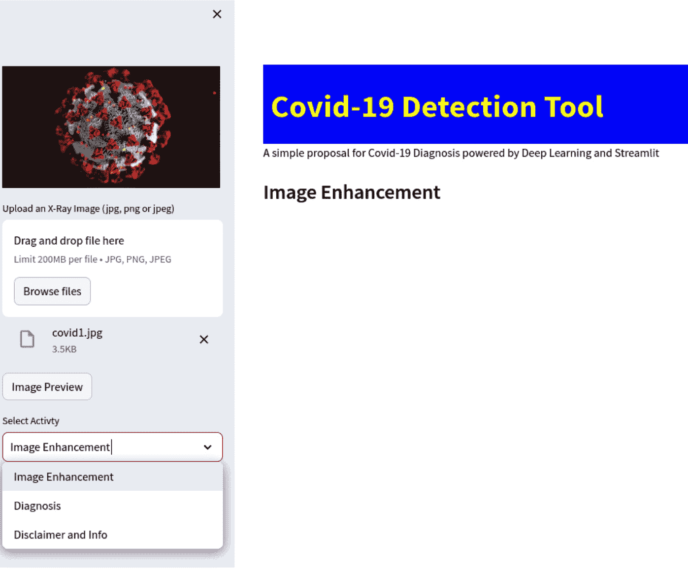

图 8.12: 浏览器中的菜单

作为最终装饰，在关闭本章之前，我们可以在侧边栏添加一个**关于作者**按钮，以此显示所有关于 web 应用程序作者的信息，包括他们的网站链接、电子邮件等。以下是代码：

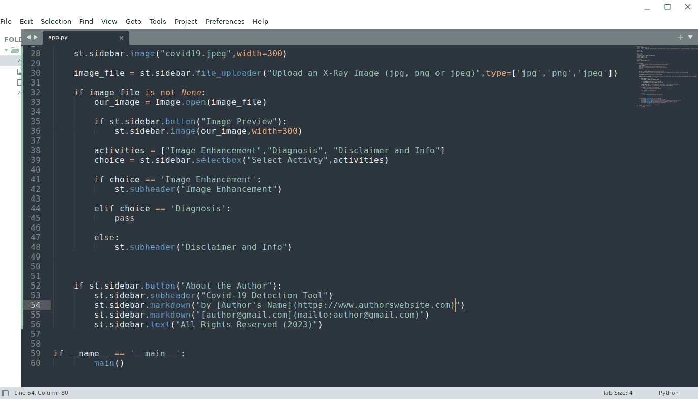

图 8.13: 关于作者按钮代码

这是浏览器中的效果：

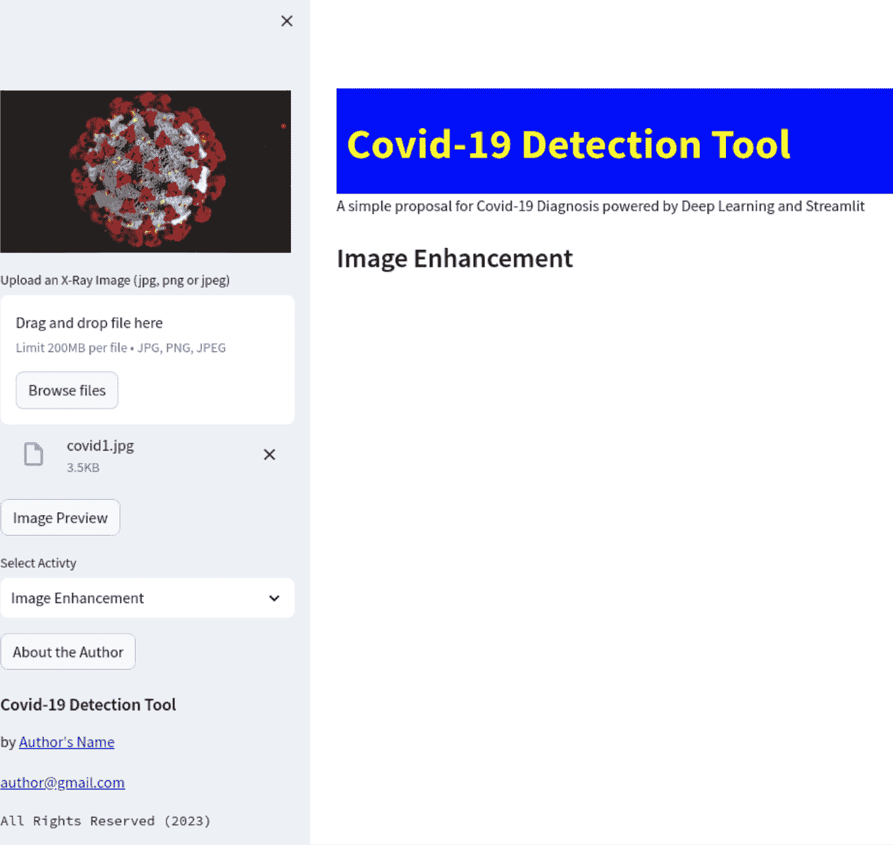

图 8.14: 关于作者的详细信息

在本节中，我们为我们的新 web 应用程序创建了菜单。现在，在侧边栏中有多个选项，用户可以清晰地选择他们想做的操作。这种方法非常有用，因为它可以在我们开始开发新应用时随时应用。在左侧的侧边栏中，我们有一个菜单，列出了 web 应用程序中所有可用的功能，在主界面部分，我们展示了标题和信息，并让用户从他们的案例中插入数据。

# 总结

在本章中，我们巩固了关于虚拟环境和包安装的知识。之后，像往常一样，我们从一个空文件开始，开发了我们应用程序的框架。

首先，我们导入了所有库并创建了一个主函数。我们还创建了一些漂亮的装饰，比如 HTML 中的标题、一个美丽的图标和侧边栏中非常有趣的图片。我们还发现了如何通过筛选文件类型来上传文件，并且一旦文件导入后，我们学会了如何利用 `Pillow` 库来可视化这些图片。

另一个重要步骤是建立我们应用程序的菜单，包含所有的语音，最后我们创建了一个按钮，显示有关作者的所有信息，并包含一些可链接的元素，比如他们的网站和电子邮件地址。

从下一章开始，我们将专注于开发菜单的三种声音，目前它们只是空的容器：**图像增强**、**诊断**和**免责声明** **及信息**。
