# 第十章：利用预训练模型创建专门化和个性化的 Web 应用程序

到目前为止，我们已经使用了 Streamlit 的组件和库（由 Python 编写）来创建和构建我们的 Web 应用程序。然而，使用 Streamlit，我们可以做得更多。

这个令人难以置信的框架在与**人工智能**（**AI**）模型结合进行预测时极为强大。开发**机器学习**（**ML**）模型或神经网络是一个非常复杂的过程，超出了本书的范围，但考虑到有许多表现优秀的预训练模型可以为不同的使用场景提供解决方案，了解如何在我们的 Web 应用程序中使用这些模型，以提高其效果和实用性，是非常重要的。

简单来说，在 Streamlit 中导入并使用预训练 ML 模型是一种高级技术，可以创建非常强大的 Web 应用程序。用户可以导入任何类型的预训练模型，并使用它在 Streamlit Web 应用程序中对新数据进行预测。这为开发者开启了一个全新的、更具定制化和专门化的应用世界，可以根据特定需求量身定制。

在本章中，我们将涵盖以下主要主题：

+   理解预训练 ML 模型的好处

+   创建定制的 Web 应用程序以改善用户体验

+   利用机器学习（ML）的预测

# 技术要求

+   在本章中，我们将使用以下库、包和工具：

    +   Sublime Text

    +   Python 3

    +   `pipenv`

    +   Streamlit

    +   `OpenCV`

    +   Pillow

    +   `numpy`

    +   `tensorflow`

+   本章的代码可以在本书的 GitHub 仓库中找到：[`github.com/PacktPublishing/Web-App-Development-Made-Simple-with-Streamlit/tree/7c29f4eca8b189b4f711cc8f724c6dee9dba60ab/Chapter10`](https://github.com/PacktPublishing/Web-App-Development-Made-Simple-with-Streamlit/tree/7c29f4eca8b189b4f711cc8f724c6dee9dba60ab/Chapter10)。

# 理解预训练 ML 模型的好处

在这一简短部分中，我将尝试阐明为什么在我们的 Web 应用程序中使用预训练的 ML 模型是一个非常好的、有价值的想法。

近年来，机器学习（ML）迅速发展，为增强 Web 应用程序提供了前所未有的机会，能够为其增加智能和预测功能。Streamlit 是一个流行的 Python 库，用于创建交互式 Web 应用程序，因其简单性和灵活性而受到广泛欢迎。当与预训练的 ML 模型结合时，Streamlit 可以帮助开发人员构建能够利用 AI 巨大潜力的 Web 应用程序。

预训练的 ML 模型是已经在大规模数据集上训练好的模型，用于处理各种任务，如图像识别、自然语言处理等。这些模型已经学习到丰富的数据表示，并且可以针对特定应用进行微调。将预训练模型集成到 Streamlit Web 应用程序中，可以显著增强其功能并提供无缝的用户体验。

以下是使用预训练 AI 模型的一些关键好处：

+   **高效开发**：使用预训练模型的主要好处之一是减少了开发时间。开发者不需要从零开始训练模型，而是可以利用现有的预训练模型，节省时间和资源。Streamlit 简单的界面增强了这一效率，使开发者能够快速将这些模型集成到他们的应用中。

+   **改善用户体验**：预训练模型将最先进的能力带入 Web 应用，启用图像识别、情感分析和语言翻译等功能。用户可以更自然地与应用互动，使其更加吸引人且易于使用。例如，由预训练模型驱动的产品推荐系统可以增强基于 Streamlit 构建的电子商务网站的购物体验。

+   **可扩展性和性能**：预训练模型通常被设计用于处理复杂任务，使其适用于广泛的应用场景。Streamlit 高效地提供 Web 应用的能力，使其成为预训练模型的完美搭档。无论是处理大型数据集，还是执行实时预测，Streamlit 和预训练模型的结合确保了高可扩展性和性能。

+   **定制和微调**：虽然预训练模型提供了坚实的基础，开发者仍然可以对这些模型进行微调，以适应特定需求。Streamlit 的灵活性使得定制化模型和量身定制的用户界面的集成变得更加容易。这一结合使开发者能够创建独特且高度专业化的应用程序。

预训练机器学习模型在基于 Streamlit 的 Web 应用中的潜在应用广泛且多样。以下是一些例子：

+   **医疗健康**：Streamlit 应用可以利用预训练模型进行医学图像分析、疾病诊断和患者风险预测，为医疗专业人员提供有价值的工具。

+   **电子商务**：由预训练模型驱动的推荐系统可以提升产品发现，推动销售并提高用户满意度。

+   **自然语言处理**：情感分析、聊天机器人和语言翻译可以提升各类应用中的用户互动，从客户支持到社交媒体平台。

+   **金融**：欺诈检测、信用评分和股市预测可以从预训练模型的预测能力中受益，帮助企业做出明智的决策。

总结来说，预训练的机器学习模型与基于 Streamlit 的网页应用程序的融合代表了 AI 驱动开发领域的一个有前景的前沿。这种协同作用使开发者能够快速高效地创建智能互动的网页应用程序。随着技术的进步，这种结合的潜在应用仅限于我们的想象力。通过在 Streamlit 中利用预训练模型的强大功能，我们可以提供前沿的解决方案，改变我们与网页应用程序的交互方式，使它们变得更智能、更具吸引力，也更有用，适用于各个领域的用户。

# 创建定制化的网页应用程序以改善用户体验

现在，是时候完成我们的*Covid-19 检测工具*网页应用程序了。到目前为止，我们已经实现了几个功能，比如**图像增强**和**免责声明及信息**，但我们仍然缺少**诊断**部分。*图 10.1*展示了我们目前为止完成的部分：

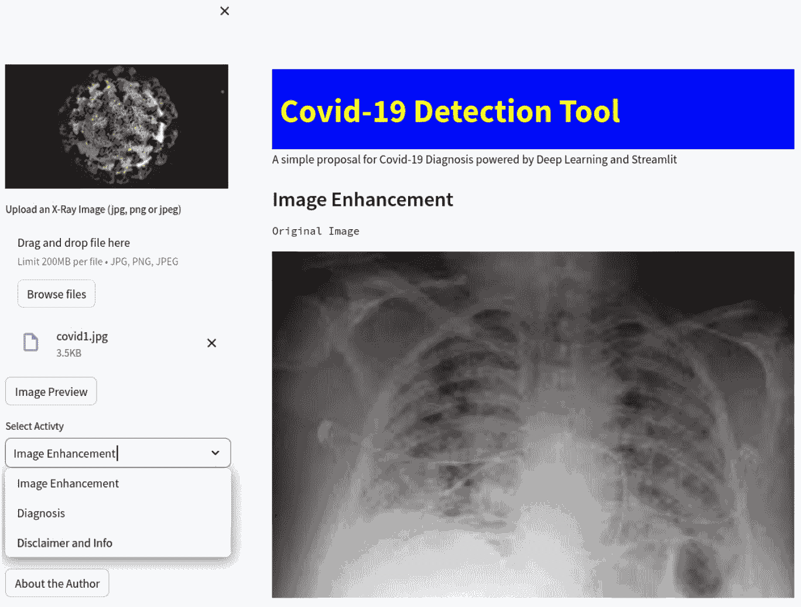

图 10.1：到目前为止我们开发的 Covid-19 检测工具网页应用程序

正如我在*第九章*中提到的，**诊断**的任务是从图片，特别是从胸部 X 光片中，判断一个病人是否患有 Covid-19。

这种预测可以通过使用预训练的 AI 模型来执行，在我们的案例中是**卷积神经网络**（**CNN**）。CNN 是一种具有特殊结构或形状的神经网络，在计算机视觉相关任务上表现非常出色。**计算机视觉**简而言之就是让计算机理解图片中发生了什么，它的内容、其中表示的物体等等。

那么，让我们看看如何在 Streamlit 中使用预训练的 AI 模型来执行计算机视觉任务，在这种情况下是进行预测。

我们需要从我们在*第九章*停止的地方继续：与菜单中**诊断**选项相关的`if`语句，如下图所示：

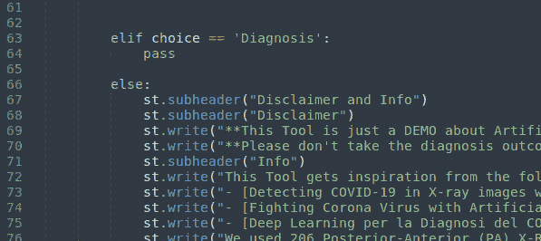

图 10.2：菜单中的“诊断”选项

第一步是在侧边栏中添加一个按钮。这样，当用户点击该按钮（其标签为**诊断**）时，工具将执行二元分类，利用预训练模型预测 X 光图像是否代表 Covid-19 病例。

添加按钮我们知道是非常简单的——只需要在`choice=='Diagnosis'`之后立即输入以下几行代码：

```py
if st.sidebar.button('Diagnosis'):
```

我们将使用的 CNN 是通过黑白图像训练的。因此，首先，当用户点击`numpy`时，这是我们已经导入的一个库。我们需要的三行代码如下：

```py
new_img = np.array(our_image.convert('RGB'))
new_img = cv2.cvtColor(new_img, 1) #0 is original, 1 is grayscale
Gray = cv2.cvtColor(new_img, cv2.COLOR_BGR2GRAY)
```

第一行代码将图像转换为数组，第二行将图像转换为灰度域，最后一行将其转换为纯黑白图像。请注意，我们正在使用 `cv2`，这是文件开头导入的 Python 计算机视觉库。

这张黑白图像保存在一个名为 `gray` 的变量中。

注意

学习我们正在导入并使用的几个 Python 包超出了本书的范围；然而，查看 `cv2`（OpenCV）官方网站 [`opencv.org/`](https://opencv.org/) 可能是一个非常有趣的活动。

在转换上传的图像后，我们已经准备好在屏幕上写一些文本（`"Chest X-Ray"`）来为我们的操作提供一些上下文，并打印出黑白图像：

```py
st.text("Chest X-Ray")
st.image(gray, width=400, use_column_width= True)
```

到目前为止，我们已经添加的代码如下：

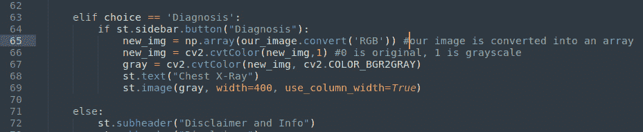

图 10.3：我们已添加到诊断菜单的代码

从浏览器的角度来看，您应该看到如下内容：

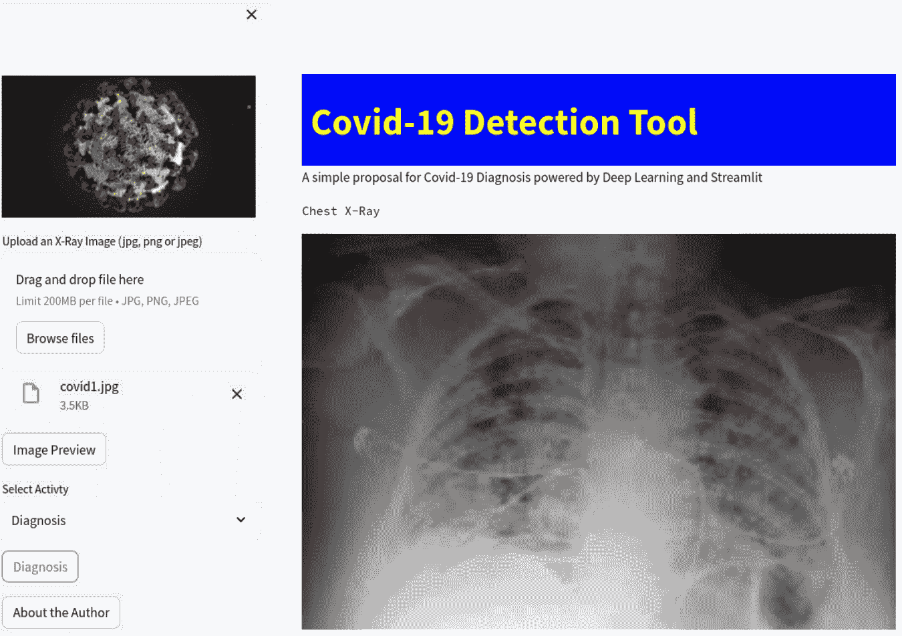

图 10.4：诊断按钮和黑白图像

由于 CNN 是用特定格式的黑白图像进行训练的，包括大小和数值，在进行预测之前，我们必须对感兴趣的图像进行预处理，以获得神经网络所期望的相同格式。

神经网络是用大小为 200 像素乘 200 像素，数值范围从 0 到 1 的图像进行训练的，其中 0 表示黑色，1 表示白色。

我们需要编写的代码，以确保上传的图像符合神经网络所需的格式如下：

```py
IMG_SIZE = (200, 200)
img = cv2.equalizeHist(gray)
img = cv2.resize(img, IMG_SIZE)
img = img/255 #normalization
```

第一行仅是一个图像大小定义，保存在常量中。第二行执行图像均衡化操作，这个操作可能会提高图像的清晰度。第三行根据保存在常量中的 `IMG_SIZE` 尺寸调整图像大小，最后一行对图像进行归一化处理（通常，灰度值从 0（黑色）到 255（白色）；将所有值除以 255，得到的值范围是 0 到 1，分别表示黑色和白色）。

*图 10.5* 显示了我们刚才解释的代码行：

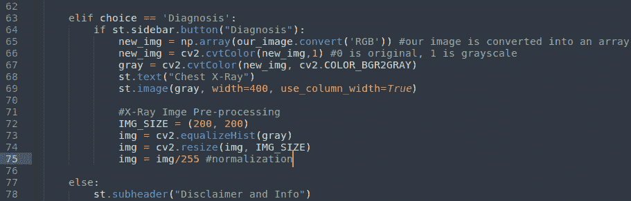

图 10.5：X 光图像的预处理

我们用来管理神经网络的库名为 `tensorflow`，它要求图像以精确的格式（`n,m,p,q`）提供，其中 `n`、`m`、`p` 和 `q` 都是整数。不幸的是，我们的图像的形状仅为 `(200,200)`。因此，在我们使用它进行预测之前，必须先调整它的大小；这是我们应该使用的指令：

```py
X_Ray = img.reshape(1, 200, 200, 1)
```

通过这种方式处理图像，我们为机器学习分类器提供了非常好的输入。我们将在下一节学习如何处理这个任务。

# 利用机器学习的预测结果

到目前为止，一切准备就绪。现在，为了能够根据 X 光图像进行 Covid-19 的预测，我们需要加载我们预训练的模型（该模型可以在本章的 GitHub 仓库中找到；链接可以在*技术要求*部分找到），并将其与上传的图片一起使用（图片经过我们在*创建定制化 Web 应用程序以改善用户体验*部分中编写的代码处理）。正如在*理解预训练机器学习模型的优势*部分中所解释的，使用预训练模型是一种轻松快速的解决问题的方法，无需自己花时间开发 AI 模型。在我们具体的案例中，我们只需要加载并使用他人开发并提供的模型，就可以从图像中预测是否存在 Covid-19。

让我们开始编写代码：

```py
model = tf.keras.models.load_model("./models/Covid19_CNN_Classifier.h5")
```

在前面的代码中，`tf`是`tensorflow`的别名，`keras`是它的一个模块。所以，我们只需将预训练模型的路径传递给`load_model`方法（请注意，`tensorflow`模型的文件类型是`h5`），并将其保存到一个名为`model`的变量中。请注意，预训练的 CNN 被放置在一个名为`models`的目录中，所以如果你改变了它的位置，请相应地更新代码中的路径。

这是我们到目前为止实现的代码：

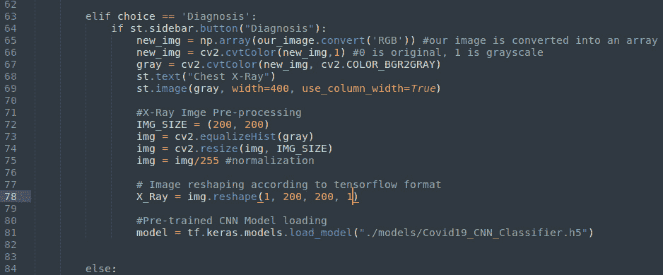

图 10.6：图像重塑和模型加载

我们的模型变量有一个名为`predict`的方法，该方法返回一个包含两个元素的列表：没有 Covid 的概率和 Covid 的概率。由于我们进行的是二分类（真或假，也就是没有 Covid 或有 Covid），我们需要知道图片是否代表 Covid 病例；我们可以通过使用 `np`（`numpy`）的 `argmax` 方法来实现这一点。`argmax` 检查列表中的值，并提供最大值的索引，在我们的情况下是`0`或`1`（`0`表示没有 Covid，`1`表示有 Covid）。所以，如果预测结果是一个列表，如[`0.70`, `0.30`]，`argmax`将返回`0`；索引从`0`开始（因为`0.70`大于`0.30`），这意味着诊断结果是没有 Covid，因为没有 Covid 的概率是`70%`，而 Covid 的概率是`30%`。

为了完成菜单中的**诊断**选项，我们可以添加以下代码：

```py
diagnosis_proba = model.predict(X_Ray)
diagnosis = np.argmax(diagnosis_proba, axis=1)
```

下面是我们实现的代码：

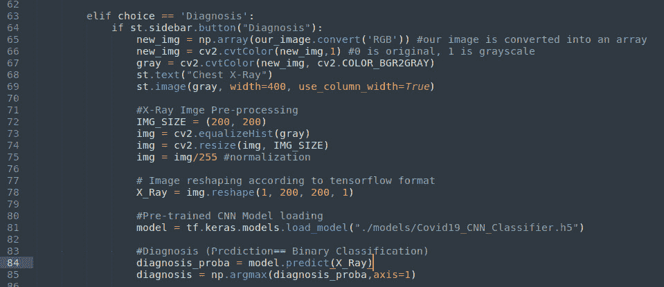

图 10.7：我们是如何获取预测结果的

到此为止，我们已经拥有了显示结果所需的一切。

现在，作为第一个前端元素，我们必须在侧边栏创建一个进度条，用于显示诊断预测的状态。为此，我们可以编写以下代码：

```py
my_bar = st.sidebar.progress(0)
```

进度条总是与定时器一起工作的，因此我们应该在 Python 文件的开头就*导入时间模块*。这就是我们在开始这个项目时所做的（见第八章中的*图 8.4*）。让我们继续添加以下代码：

```py
for percent_complete in range(100):
time.sleep(0.05)
my_bar.progress(percent_complete + 1)
```

通过这种方式，我们创建了一个`for`循环，每次暂停`0.05`秒后激活进度条，延伸`1`个单位（进度条初始值为`0`），由于进度条的范围从`0`到`100`单位，因此此操作会重复`100`次。

该进度条表示预测正在进行中，直到它达到最大值并停止延伸。

当进度条完全展开时，我们可以在屏幕上打印诊断结果，解释我们正在处理哪种预测。为此，我们可以输入以下内容：

```py
if diagnosis == 0:
st.sidebar.success("DIAGNOSIS: NO COVID-19")
else:
st.sidebar.error ("DIAGNOSIS: COVID-19")
```

这是我们为前端部分添加的代码——也就是在浏览器中可视化的部分：

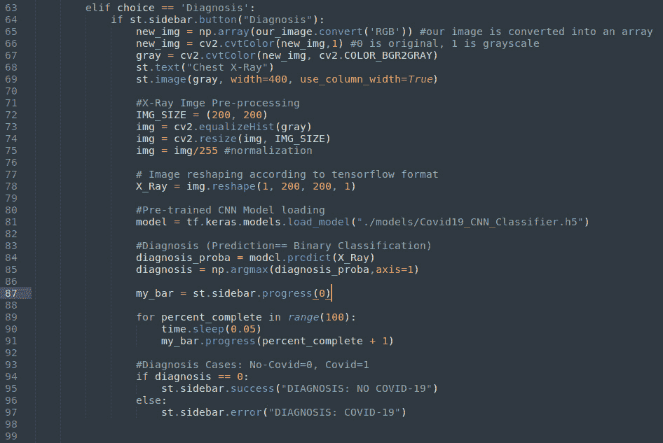

图 10.8：我们如何获得预测并将其可视化到屏幕上

这是浏览器中没有 Covid 预测时的结果：

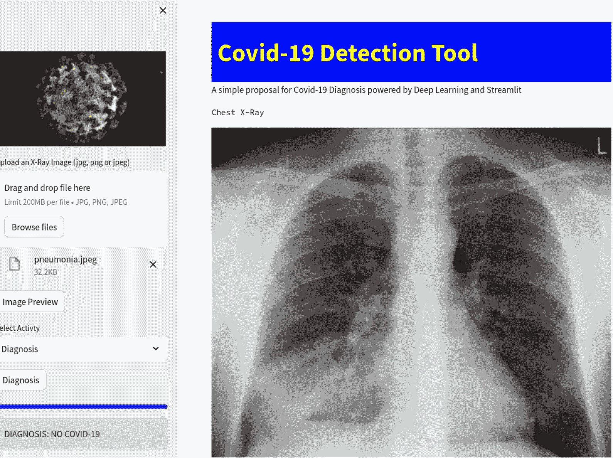

图 10.9：没有 Covid 的诊断结果

由于我们用来执行预测的模型仅仅是一个*玩具模型*，并且通过它做出的诊断没有临床价值，因此最好在我们的应用中添加一个最终的免责声明。

让我们添加类似这样的内容：

```py
st.warning("This Web App is just a DEMO about Streamlit and Artificial Intelligence and there is no clinical value in its diagnosis!")
```

我们的菜单中**诊断**选项的最终代码如下：

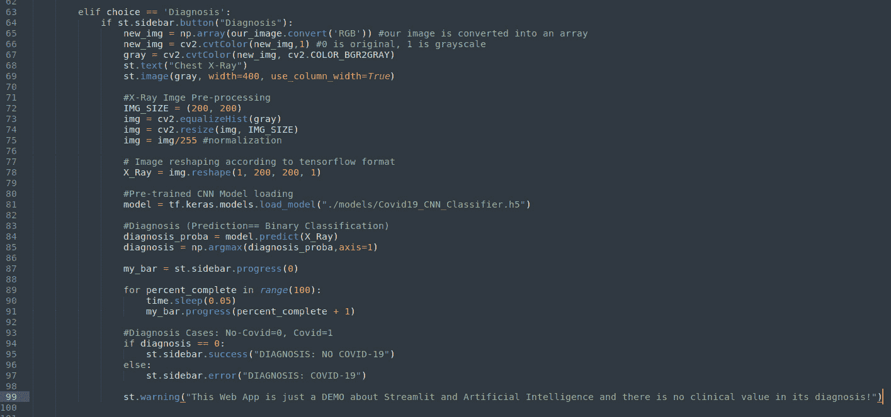

图 10.10：菜单中“诊断”选项的完整代码

这是浏览器中的免责声明：

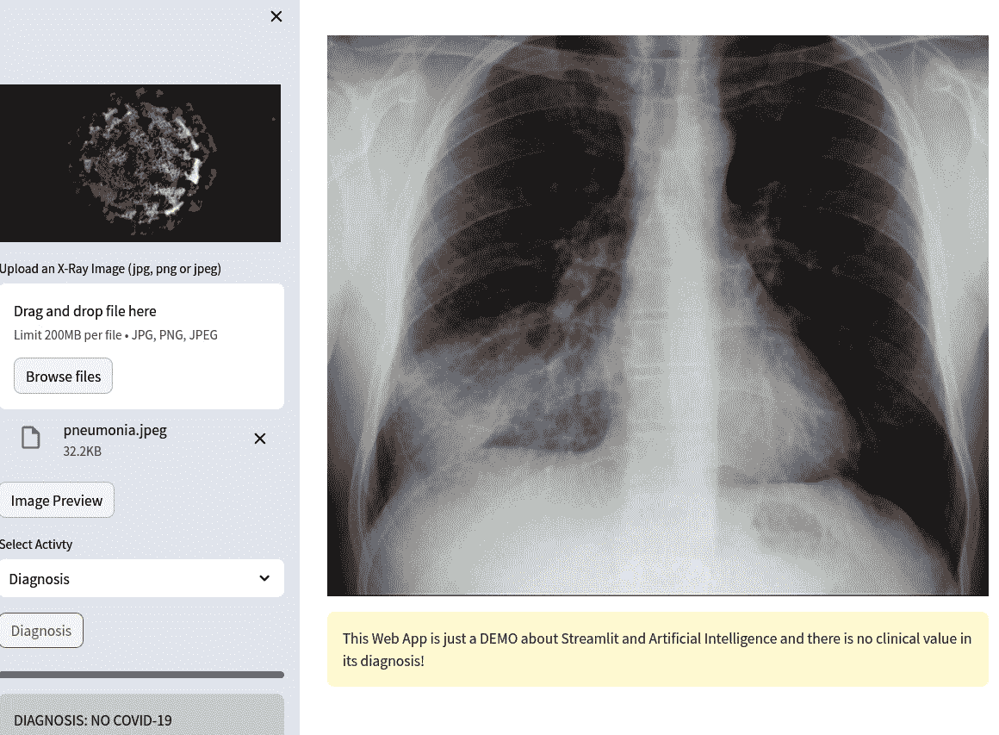

图 10.11：带免责声明的预测

请记住，这里重点不是要获得一个高性能的模型来预测 Covid-19 病例，而是理解如何将 AI 模型集成到 Streamlit 中。

让我们更深入地探讨我们在这一章中取得的成就。

首先，除了`tensorflow`，像我们在网页应用中使用的那样，AI 模型还可以使用其他包进行训练，如`scikit-learn`。因此，在将模型加载到您的 Streamlit 网页应用之前，仔细阅读用于训练模型的特定包的文档是非常重要的。不同的包通常采用不同的语法来加载它们的模型。这意味着，根据您决定采用的模型，您必须在代码中使用不同的语法。

第二个也是最重要的点是，我们刚刚实现的这个网页应用非常强大，因为它执行了多个复杂的任务，如图像增强、诊断等。尽管它很复杂，但当我们统计写下的代码行数时，会发现从头到尾我们只写了大约 130 行 Python 代码（包括注释）。这正是 Python 和 Streamlit 结合的真正力量。在几行代码中，我们实现了一个执行多个复杂任务的网页应用，甚至利用了 AI。更重要的是，我们还具备了所有典型的部件，这些部件通常包含在非常专业的应用中，如各种文本、按钮、进度条等。

像往常一样，考虑到这次代码更加复杂，下面是我们刚刚完成的网页应用的完整代码截图：

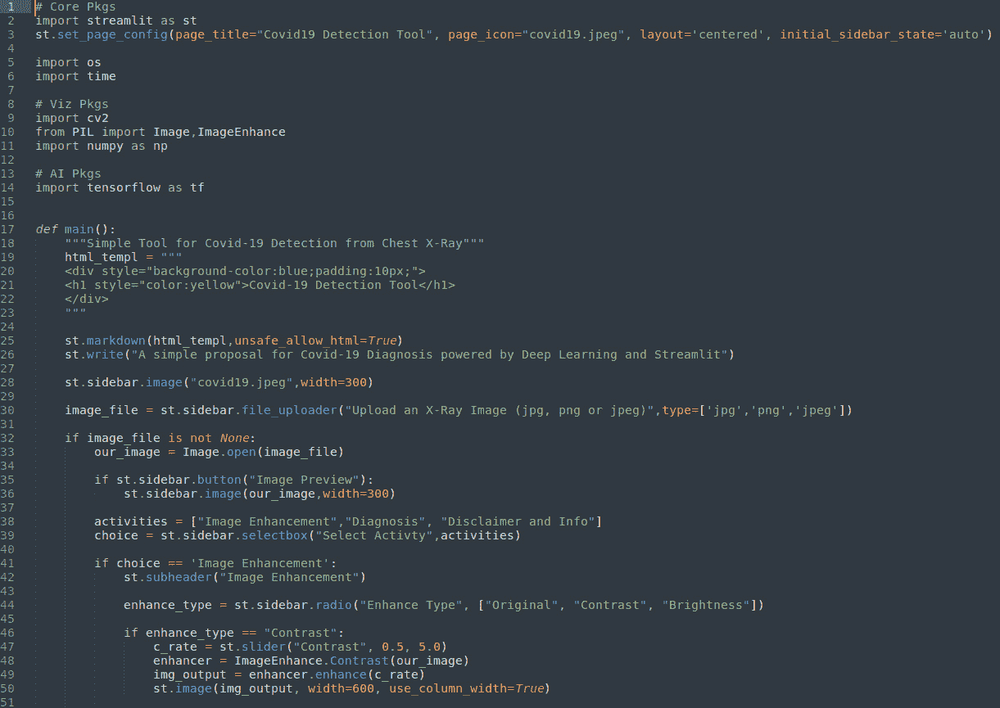

图 10.12：Covid-19 检测工具网页应用第一部分

首先，我们导入了库并定义了主函数。主函数从创建一个美观的标题开始，然后继续显示一个`file_uploader`小部件。之后，出现了一个包含三种声音的菜单——**图像增强**、**诊断**和**免责声明及信息**：

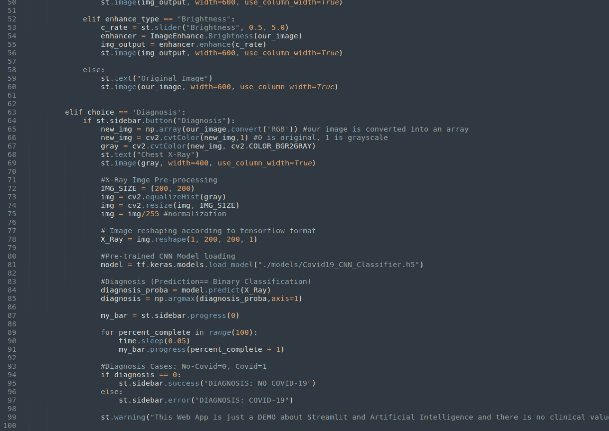

图 10.13：Covid-19 检测工具网页应用第二部分

然后，我们主要处理了**图像增强**功能，并完成了**诊断**部分。在这部分中，我们对图像进行了预处理，为 ML 模型做准备，加载了分类模型和预训练的 CNN，执行了预测，并引入了一些漂亮的小部件，如进度条：

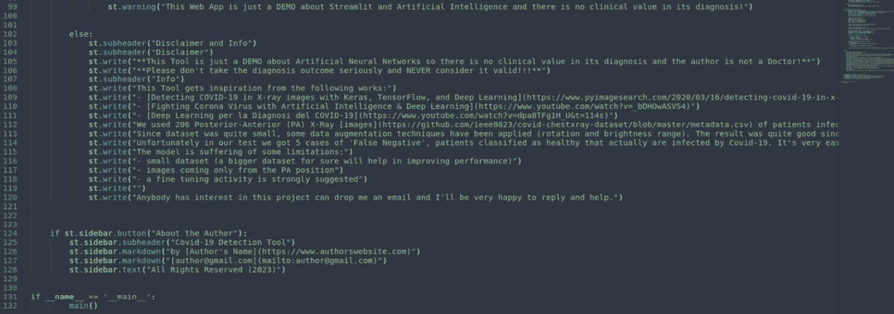

图 10.14：Covid-19 检测工具网页应用第三部分

最后，我们为**免责声明及信息**部分提供了简单的文本，并创建了**关于作者**的信息页面。

# 摘要

本章非常重要，因为我们学会了如何将 AI 集成到我们的网页应用中。

AI 是一项具有高度颠覆性的技术，当在我们的应用程序中得到妥善管理和利用时，能够彻底改变游戏规则。在这一章中，我们学到了如何将独立开发和训练的 AI 模型集成到 Streamlit 中。许多包和工具可以创建 AI 模型，几乎所有这些模型都可以被集成到 Streamlit 中；这只是一个检查适当文档并遵循规则的问题。

将 AI 模型加载到我们的网页应用程序中只是这个过程的一部分，因为每个模型都需要以特定格式输入信息。因此，我们提供给模型的所有数据必须进行预处理，以确保符合该特定格式。这就是为什么我们花费了大量时间处理并转换我们上传的 X 光图像，使其兼容我们使用的 CNN 模型的原因。上传的图像被转换为黑白图像，接着进行了调整大小和形状转换。

输入以正确格式提供非常重要；否则，模型将无法理解该做什么，并会生成运行时错误。在预处理图像之后，我们专注于预测；我们学习了如何进行预测并进行解读。最后，我们涵盖了前端部分，并利用进度条等美丽的效果在网页浏览器中展示预测结果。我们观察到，在处理诸如健康等敏感话题时，包含免责声明是良好的实践，以避免潜在问题。

拥有一个可用的应用程序是一个很好的起点，但这并不是我们工作的真正结论。正如我们在自然语言处理网页应用程序中所做的那样，我们仍然需要将我们的新工具部署到云端，因为只有通过部署，才能构建出一个做得好、表现优异的应用程序，并且能够为广泛的客户群体提供服务。这正是我们将在下一章中完成的任务。
