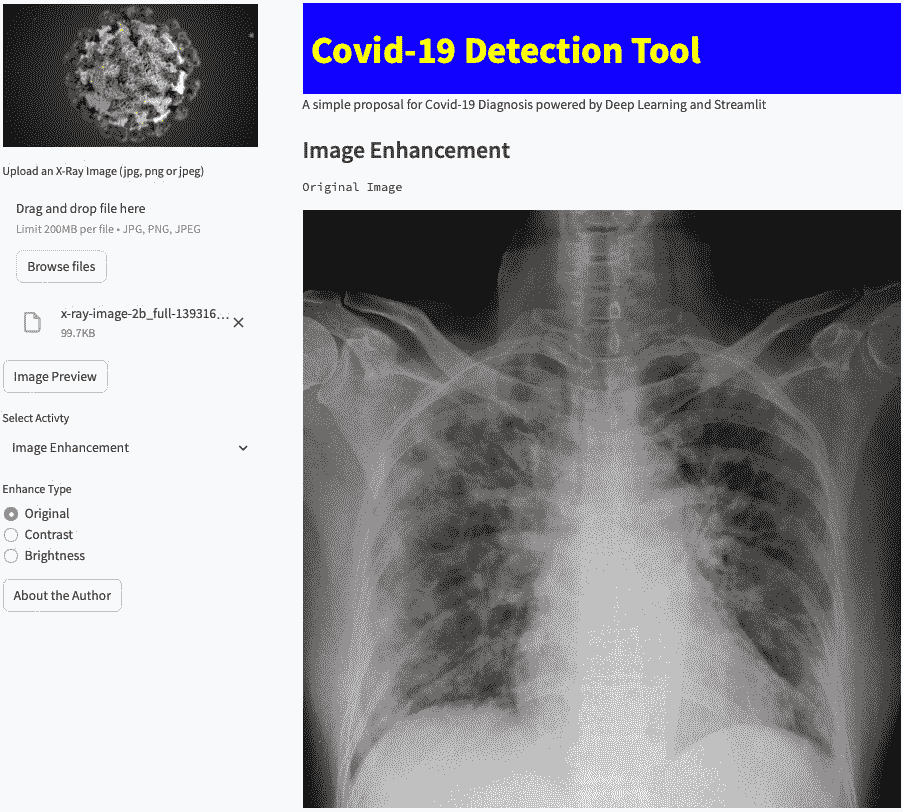

# 第十一章：在 Streamlit Share 上部署和管理复杂库

让我们继续探索在 Streamlit Share 上的部署，Streamlit 框架提供的一个服务，允许用户通过简单的几次点击将他们使用 Streamlit 实现的网页应用程序部署到云端。这一次，我们需要打包*Covid-19 检测工具*应用并尝试部署它。这里将涉及许多大型库，因此任务稍微复杂一些。

当我们处理大型文件时，部署任务变得更加困难，因为 GitHub 在文件大小上有一些限制；实际上，不能直接上传大于 25MB 的文件。在我们的*Covid-19 检测工具*应用中，不幸的是，AI 模型的文件大小超过了 25MB。上传到 GitHub 的文件不能大于这个大小，至少在撰写本书时是这样的。

我们可以使用一些技巧来绕过这个限制；在本章中，我将展示一个相当聪明的方法来做到这一点。

在本章中，我们将讨论以下主要主题：

+   巩固云部署技能

+   避免不良行为

+   管理困难的库

+   在 Streamlit Cloud 上部署应用

# 技术要求

+   在本章中，我们将使用以下库、包和工具：

    +   Sublime Text

    +   Python 3

    +   `pipenv`

    +   Streamlit

    +   GitHub

    +   Streamlit Cloud

+   本章的代码可以在本书的 GitHub 仓库中找到：[`github.com/PacktPublishing/Web-App-Development-Made-Simple-with-Streamlit/tree/8e8d3b20f3de84b5ce02bc2352f86ad1c8018a4a/Chapter11`](https://github.com/PacktPublishing/Web-App-Development-Made-Simple-with-Streamlit/tree/8e8d3b20f3de84b5ce02bc2352f86ad1c8018a4a/Chapter11)

# 巩固云部署技能

考虑到我们已经进入本书的*第十一章*，我们应该意识到，实施一个网页应用程序只是过程的一部分，过程直到网页应用程序被部署和共享后才算结束。

我们已经理解了网页应用程序部署的重要性，因为我们在本书的第一部分创建 NLP 网页应用程序时已经涉及过这个话题，而且因为它是我们在访问 Streamlit 网站时看到的第一个内容之一：


图 11.1：Streamlit 关于应用程序共享的标语

当我们点击主菜单中的**Cloud**语音时，我们会被重定向到一个页面，页面包含一个关于部署的快速视频和一条重要声明：**直接从 Streamlit 部署、管理并分享你的应用程序，与世界分享——全部** **免费**：


图 11.2：Streamlit Cloud

这里最重要的信息是*与世界分享你的应用程序*。网页应用程序是一种存在于网络上的东西——这才是它的真正本质。

当我们部署 NLP 应用程序时，我们采用了相当顺畅的流程：

1.  我们创建了一个需求文件。

1.  我们将 Web 应用程序托管在 GitHub 上。

1.  我们已登录 Streamlit Cloud。

1.  我们通过 Streamlit Cloud/GitHub 连接共享了 Web 应用程序。

这个过程与我们的*Covid-19 检测工具*应用程序相同，但有一个重要区别：我们必须管理一个外部的大型文件——也就是用于检测 Covid-19 病例的 CNN 预训练模型。让我们学习如何处理这种大文件。

# 避免不良行为

不良行为是指任何缺失、错误或不完整的操作，导致部署时出现运行时问题，最终导致部署任务失败。出于这个原因，在本节中，我们将学习完成任何部署所需的步骤。

## 创建一个列出所有安装并用于开发 Python 代码的包的列表

运行我们的 Web 应用程序所需的第一件事是列出所有安装和用于开发 Python 代码的包。正如我们所知，有多种方法可以获取这个列表，但最简单的方式是使用`pipreqs`。让我们来看一下：

1.  首先，让我们通过在终端中输入以下命令来安装`pipreqs`：

    ```py
    requirements.txt file with the following simple instruction:

    ```

    covid 是包含我们 Web 应用程序所有代码的目录名称。

    ```py

    ```

1.  最后，我们只需通过写入以下指令来检查需求文件是否包含所有内容：

    ```py
    cat ./covid/requirements.txt
    ```

*图 11.3* 显示了`requirements.txt`文件的内容：


图 11.3：requirements.txt 文件

现在我们已经拥有了所有代码和需求文件，我们准备在 GitHub 上创建一个专门的仓库。

## 创建一个 GitHub 仓库

让我们使用稍后将用于连接 Streamlit Cloud 的同一账户登录 GitHub。

一旦进入 GitHub，我们可以按照以下步骤创建一个新仓库：

1.  在**Repositories**页面点击**New**标签。我们应该看到以下屏幕：


图 11.4：在 GitHub 上创建新仓库

1.  输入仓库名称，例如`covid19-book`，并添加描述（这不是必需的）。

1.  保持仓库为公开，并勾选**添加 README 文件**。

1.  最后，点击**创建仓库**。

稍等片刻，我们会看到以下页面：


图 11.5：新仓库为空

如我们所见，新的仓库是空的。我们必须将 Python 文件和`requirements.txt`文件添加到其中。这个操作非常简单——我们只需要点击**Add file**并上传我们感兴趣的文件。

原则上，我们已经准备好前往 Streamlit Cloud 部署应用程序并与全世界分享它。

然而，每当我们处于部署过程的这一阶段时，我们必须特别注意我们的操作。如果我们尝试将新创建的仓库中的文件部署到 Streamlit Cloud，我们将遇到运行时错误，应用程序将无法运行。让我们学习如何修复这个问题。

## 避免运行时错误

为了避免部署过程中出现运行时错误，我们必须考虑我们的 Web 应用程序正常运行所需的内容。

我们需要的第一个项是 Covid-19 图像，该图像显示在*Covid-19 检测工具*应用程序的左侧边栏中。这个操作非常简单，因为我们只需将`covid19.jpeg`文件添加到我们的仓库中。

第二个需要注意的事项是，目前编写本书时，Streamlit 版本存在与`opencv`库相关的一些问题：在尝试导入该库时会出现问题。为了解决此问题，我们必须通过点击`packages.txt`在仓库中创建一个新文件。该文件必须包含以下指令：

```py
libgl1
```

通过这种方式，Streamlit Cloud 将在部署时安装所有正确的依赖项。

当使用*Covid-19 检测工具*应用程序时，我们必须特别注意的第三个事项如下。当我们上传 X 射线图像并点击**诊断**以确定是否为 Covid-19 病例时，预训练的 CNN 模型将被运行。如果 Web 应用程序无法找到该模型，我们可能会遇到问题。

这里需要注意的一点是，上传 AI 模型文件并不足够，因为如果我们仔细检查我们在*第 81 行*编写的代码，我们会看到该模型必须放在一个名为`models`的目录中，并且该目录与`app.py`文件处于同一层级。简而言之，我们必须在 GitHub 仓库中重新创建与 Python 代码中指示的相同文件和目录结构；否则，我们需要的文件——特别是 CNN 模型——将永远找不到：


图 11.6：第 81 行显示了我们需要放置 CNN 模型文件的位置

最后，出现了一个相当大的问题。当我们尝试上传`Covid19_CNN_Classifier.h5`时，我们发现由于文件大于 25 MB，GitHub 网页只能接受小于此大小的文件，因此无法进行此操作。

在下一节中，我们将学习如何解决这个问题。

# 管理困难的库

为了解决文件大小问题，我们必须安装 GitHub 桌面应用程序，目前该应用程序仅适用于 Windows 或 macOS。因此，请按照以下步骤操作：

1.  从[desktop.github.com](http://desktop.github.com)下载并安装 GitHub 桌面应用程序。

1.  然后，登录到你的 GitHub 账户并授权。你应该会看到以下窗口：


图 11.7：GitHub 桌面应用程序

1.  现在，选择`covid19-book`仓库（如果你使用了其他名称，必须寻找该名称）并点击**克隆...**。

    仓库的克隆副本将创建在你的机器上，如*图 11.8*所示：


图 11.8：在本地克隆 GitHub 仓库

1.  克隆操作完成后，打开你在 Mac Finder 或 Windows 文件资源管理器中的本地仓库文件夹，如*图 11.9*所示：


图 11.9：本地仓库文件夹

1.  现在，创建`models`目录并将`Covid19_CNN_Classifier.h5`文件复制到其中：


图 11.10：大文件已复制到正确的目录中

1.  返回 GitHub Desktop 应用程序，在这里你会看到我们刚刚添加的大文件。在`adding cnn model`中写一些内容，然后点击**提交** **到主分支**：


图 11.11：大文件已复制到正确的目录中

1.  现在，选择**推送原始数据**，如*图 11.12*所示：


图 11.12：推送原始数据

现在，你可以在浏览器中检查大文件是否已包含在你的 GitHub 仓库中：


图 11.13：包含所有必要文件的 GitHub 仓库

我们在这里学到的非常重要，因为处理复杂的库或大文件的情况非常常见，知道如何正确管理这些问题能够带来很大差异。处理这种问题使得我们能够部署任何我们可能开发的 Web 应用程序。

# 在 Streamlit Cloud 上部署应用程序

最难的部分已经过去。从现在起，我们可以按照与 NLP Web 应用相同的程序进行操作。以下是步骤：

1.  通过选择**继续使用 Github**并授权，使用你用于 GitHub 的相同帐户登录 Streamlit Cloud。

1.  进入后，选择**新应用**。

在部署的应用程序中，你应该只看到我们在*第七章*中创建的应用。窗口应该像*图 11.14*所示：


图 11.14：在 Streamlit Cloud 上创建新应用

1.  在选择`app.py`后，为应用程序的 URL 指定一个有意义的名称，如*图 11.15*所示：


图 11.15：在 Streamlit Cloud 上部署 Web 应用程序

1.  当一切准备好时，点击**部署！**并等待，因为**你的应用正在烘焙中**：


图 11.16：部署动画

在此过程结束时，你的*Covid-19 检测工具*应用程序将被部署，并准备好与大家分享。

这是部署过程完成后我们新的网页应用的样子：



图 11.17：部署在 Streamlit Cloud 上的 Covid-19 检测工具应用程序

如*图 11.17*所示，应用程序现在已经在网络上运行，其 URL 一目了然，因为它包含了`covid19-book-chapter11`。

再次强调，正确的部署能力在网页应用程序开发过程中是至关重要的。只有当网页应用程序部署到云端并且任何人都可以使用时，我们才能认为这个过程已经完成。本章内容使我们能够部署任何类型的网页应用，甚至包括那些包含复杂库和大文件的应用。

重要说明

根据你安装的软件包版本，可能还需要安装`opencv-python`库。如果在部署过程中收到此建议，只需像往常一样安装该库（使用`pipenv install...`），将其添加到`requirements.txt`文件中，然后按照 GitHub 的标准部署流程完成部署。

# 总结

干得好！部署*Covid-19 检测工具*应用程序是一个复杂的过程。正如我们所见，有许多潜在问题需要避免。

首先，我们需要重新创建与 Python 代码中相同的文件和目录结构，并且不能忘记将图片文件也包含在 GitHub 仓库中。

第二个问题是允许 Streamlit Cloud 管理与`opencv`相关的所有依赖项。为此，需要向仓库中添加一个`packages.txt`文件，其中包含获取这些依赖项的指令。

最后，我们发现 GitHub——至少是它的在线版本——仅管理小于 25 MB 的文件，但有时，比如使用 CNN AI 模型时，我们需要上传更大的文件。这项操作要求我们安装 GitHub Desktop 应用程序，并在本地（在我们的计算机上）克隆仓库。一旦我们将仓库克隆到本地，就可以添加这个大文件并将其推送回源（Git *服务器*）。这样，即使是超过 50 MB 的 AI 模型文件，也可以存储在 GitHub 仓库中。

一旦我们解决了所有这些问题，就准备好将网页应用程序部署到 Streamlit Cloud 并与大家共享了。

从下一章开始，我们将讨论一些非常高级的话题，如智能文件上传、为我们的网页应用添加登录和注册功能、管理数据库等。

# 第四部分：安全且可定制网页应用的高级技术

本书的第四部分致力于掌握创建安全且高度可定制的 Web 应用所需的高级技术。首先，介绍了智能文件上传方法，专为专业级 Web 应用定制，确保高效且用户友好的文件管理。接着，本节探讨了安全性问题，提供了关于如何创建安全的登录和注册流程的深入指导，这是任何涉及用户数据的 Web 应用的基石。然后，本部分讲解了页面定制、主题个性化以及多页面布局的实现，旨在提供更具针对性和吸引力的用户体验。此外，还涵盖了通过表单、会话状态管理和自定义子域来增强 Web 应用，为 Web 应用增添了一层复杂性和功能性。最后，本书以关键要点总结和深刻的结论收尾，总结了所学内容，并为 Web 应用开发的未来做好准备。此部分对于那些希望将 Web 应用从基础功能提升至卓越水平的开发者至关重要，重点关注定制、安全性和高级用户参与。

本部分包含以下章节：

+   *第十二章*，*智能文件上传——专业 Web 应用的高级技巧*

+   *第十三章*，*为 Web 应用创建安全的登录和注册流程*

+   *第十四章*，*页面定制、主题个性化与多页面实现*

+   *第十五章*，*通过表单、会话状态和自定义子域增强 Web 应用*

+   *第十六章*，*总结与结论*
