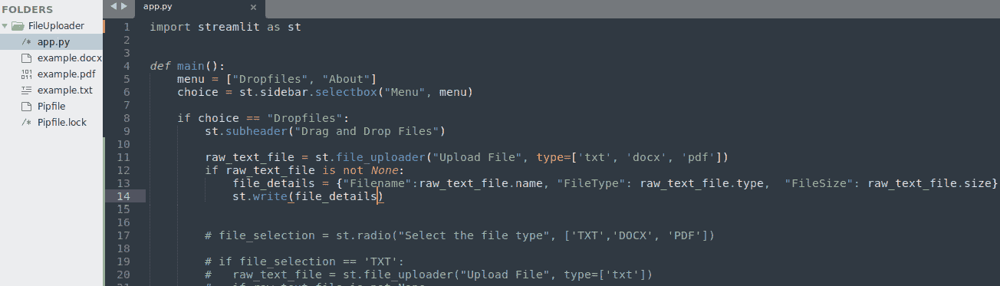

# 第十二章：智能文件上传 – 专业 Web 应用程序的高级技术

到了这一步，我们几乎掌握了实现和部署高效、美观的 Web 应用程序所需的所有技能。尽管如此，我们的 Web 应用程序仍然有些“天真”，离专业应用还有一定距离。从本章开始，我们将处理一些高级技术，帮助使我们的产品看起来更加完善和专业。

我们从文件上传器开始，这是我们在*Covid-19 检测工具*应用程序中已经使用过的小部件，当时我们需要上传胸部 X 光图像。

我们现在想做的是将文件上传器提升到一个新的层次，深入定制它，自动检测我们要打开的文件类型，并采取适当的操作。这种行为赋予我们的 Web 应用程序非常专业的形象，并使其易于使用。

在本章中，我们将讨论以下主要主题：

+   理解文件上传器的定制功能

+   为 Web 应用程序创建合适的文件上传器

+   使用智能组件简化 Web 应用程序

# 技术要求

+   在本章中，我们将使用以下库、包和工具：

    +   Sublime Text

    +   Python 3

    +   `pipenv`

    +   Streamlit

    +   `docx2txt`

    +   `pdfplumber`

+   本章的代码可以在本书的 GitHub 仓库中找到：[`github.com/PacktPublishing/Web-App-Development-Made-Simple-with-Streamlit/tree/57674ee5b5c58769120051cfb466f4b4d658c20c/Chapter12`](https://github.com/PacktPublishing/Web-App-Development-Made-Simple-with-Streamlit/tree/57674ee5b5c58769120051cfb466f4b4d658c20c/Chapter12)。

# 理解文件上传器的定制功能

上传文件是一个简单的任务。实现方式有很多种，不同的方法会对所谓的*用户体验*产生不同的影响：用户对应用程序本身的感知方式。此外，更好地实现上传功能可以加速整个应用程序，使用户的操作更加便捷。假设我们要上传一个包含文本的文件。它可能是一个`.txt`文件，即纯文本文件，也可能是`.docx`文件，Microsoft Word 文件，甚至是`.pdf`文件。一种方法是询问客户，*你需要上传哪种文件（.txtx，.docx，.pdf）？* 如果用户回答`.txt`，应用程序将启动为此文件格式定制的`file_uploader`小部件；如果答案是`.docx`，则会执行为 Microsoft Word 定制的`file_uploader`小部件，依此类推。这个方法效果很好，但有点过于复杂。

如果用户更新了文件，而 Web 应用程序能在没有人工干预的情况下自动识别文件类型，怎么办？

让我们学习如何根据两种方法实现这一功能，一种需要用户提供信息，另一种则完全自动化。

## 创建一个新的虚拟环境

首先，我们将创建一个专门用于本章的新虚拟环境。请按照以下步骤进行：

1.  创建一个新文件夹，并命名为`FileUploader`。

1.  接下来，进入新创建的文件夹，一旦进入，像往常一样输入`pipenv shell`以创建虚拟环境。

    这些指令如*图 12.1*所示：


图 12.1：为本章创建新的虚拟环境

1.  之后，我们唯一需要的库是 Streamlit，所以我们输入以下内容：

    ```py
    pipenv install streamlit
    ```

    几秒钟后，我们的环境将配备最新的 Streamlit 版本。

1.  像往常一样，在开始编写代码之前，我们需要创建一个空的 Python 文件，这是一项非常简单的操作。我们可以通过输入以下指令来完成：

    ```py
    touch app.py
    ```

这里，`app.py`是我们文件的名称。

我们可以使用自己喜欢的 IDE（例如 Sublime Text）打开`app.py`文件。

## 构建应用程序骨架

当我们拥有一个空文件时，最佳的起始选项总是使用我们之前在两个 Web 应用程序中采用的*骨架*。因此，我们可以导入库——在这种情况下，仅是 streamlit——然后定义一个包含菜单的主函数。本章应用程序的菜单非常简洁，仅包含两个选项：**Dropfiles**和**About**。

在下图中，我们可以看到用于此特定情况的骨架是多么简洁：


图 12.2：我们的应用程序骨架

以下是*图 12.2*中展示的代码的详细说明：

+   在*第 1 行*，我们导入了库（此处为`streamlit`），而在*第 4 行*，我们定义了`main`函数——即包含我们应用程序业务逻辑的函数。

+   在*第 5 行*，我们有一个名为`menu`的列表，包含了 Web 应用程序菜单中的值（这个 Web 应用程序可以提供的功能）。

+   在*第 6 行*，我们从侧边栏的菜单列表开始创建一个下拉框。

+   在*第 8 行*和*第 13 行*，我们添加了一个`if`语句，根据在*第 6 行*的下拉框中选择的选项，进入适当的代码执行。

到此，我们已经完成了应用程序的骨架。现在，我们可以在终端中输入以下指令：

```py
pipenv run streamlit run app.py
```

到此为止，我们可以启动 Web 应用程序并在浏览器中查看：


图 12.3：首次执行我们的新 Web 应用

如我们所见，在侧边栏中，有一个下拉框提供了菜单中的两个选项。

让我们专注于菜单中的**Dropfile**选项。

## 为应用程序菜单创建单选按钮

我们可以使用单选按钮让用户选择他们想要上传的文件类型。我们来添加以下代码：

```py
file_selection = st.radio("Select the file type", ['TXT', 'DOCX', 'PDF'])
```

这样，文件选择会存储在一个名为`file_selection`的变量中。到目前为止，我们的应用程序如下所示：


图 12.4：使用单选按钮选择文件类型

一旦用户选择了一个选项，我们就准备使用所选文件类型来打开`file_uploader`。在这种情况下，可以采用以下代码：

```py
raw_text_file = st.file_uploader("Upload File", type=['txt'])
if raw_text_file is not None:
try:
raw_text = str(raw_text_file.read(),"utf-8")
st.info("Text from TXT file")
st.write(raw_text)
except:
st.warning("TXT File Fetching Problem...")
```

很容易，在上传文件（类型为`txt`）后，我们可以检查文件是否为空，使用`utf-8`编码读取文件，并将其显示在屏幕上。如果上传的文件为空，我们只需在屏幕上打印一个警告，显示**TXT 文件** **获取问题...**。

*图 12**.5* 显示了在 IDE 中的代码：


图 12.5：上传 .txt 文件

当我们切换到浏览器时，会发生一些有趣的事情。即使我们的目录中有三个不同的文本文件——即`'txt'`、`'docx'`和`'pdf'`——由于我们指定了`txt`作为文件类型，文件上传工具只能看到并打开`.txt`文件：


图 12.6：在左侧的目录中，有三种不同的文件，但我们只能打开 .txt 文件

此时，为了管理其他文件类型，我们应该编写与处理`txt`类型时几乎相同的代码，但还需要指定不同的文件类型。因此，代码可以演变成如下所示：


图 12.7：询问用户文件类型

*图 12**.7*中的代码包含了一些`pass`调用，用于处理`.docx`和`.pdf`文件。如果你想完成相关功能，必须导入适当的库并读取文件内容。

这里的重点是，当以这种方式处理文件上传时，即使代码在技术上运行得很好，我们也不得不执行一些我们不太喜欢的操作：

+   在开始时询问用户文件类型

+   重复（我们只是复制和粘贴）很多冗余代码

现在我们已经探讨了这个解决方案，让我们尝试实现一些更优雅、更简洁的方法，能够自动读取文件类型，而不需要询问用户。

# 为 web 应用程序创建一个合适的文件上传器

正如你所想，这次我们没有使用单选按钮。相反，我们直接上传文件。因此，参考*图 12**.7*，让我们注释掉*第 11 行*到*第 31 行*之间的所有代码。

立刻在子标题中，在*第 10 行*，我们可以添加`file_uploader`，这次包括所有三种类型：

```py
raw_text_file = st.file_uploader('Upload File', type=['txt', 'docx', 'pdf'])
```

当我们尝试从浏览器上传文件时，这时在我们的目录中，我们将看到所有三种类型的文件，并且能够选择其中一个。

正如我们在*图 12**.5*中的*第 15 行*所做的，我们可以通过编写以下代码来检查文件是否为空：

```py
if raw_text_file is not None:
```

在这个`if`语句之后，我们必须获取文件的详细信息。我们需要这些信息来理解我们选择的是哪种类型的文件，以及如何管理它。通过使用包含我们上传文件的`raw_file_text`变量，我们可以使用三个方法，分别是`name`、`type`和`size`，来收集我们需要的详细信息。

这些详细信息将被放入一个字典中，我们称之为`file_details`。让我们在代码中看到它：



图 12.8: 文件上传与文件详细信息检测的代码

这是浏览器中的结果：


图 12.9: 浏览器中的文件上传与文件详细信息检测

正如我们所看到的，在目录中，我们有三种类型的文件，并且可以选择其中任何一个，因为文件的详细信息已经正确截取。在`.txt`文件的情况下，我们得到了正确的文件名、`text/plain`类型及其大小。

让我们看看`.docx`和`.pdf`文件的类型。这里显示的`.docx`文件具有一个非常长的类型：


图 12.10: .docx 文件

与此同时，`.pdf`文件的名字较短：


图 12.11: .pdf 文件

这三种不同类型的文件是我们管理文件自动上传所需的全部内容。要打开`.pdf`和`.docx`文件，我们需要安装合适的库（`pdfplumber`和`docx2txt`）。因此，请在终端中键入以下命令：

```py
pipenv install pdfplumber docx2txt
```

第一个包处理`.pdf`文件，而第二个包处理`.docx`文件。

安装完成后，我们必须将这些库导入到`app.py`文件中，方法是键入以下内容：

```py
import docx2txt
import pdfplumber
```

这样，我们就有了所有需要的信息。因此，参考*图 12.8*，从*第 15 行*继续，我们可以编写如下代码：

```py
if raw_text_file.type == "text/plain":
try:
      raw_text = str(raw_text_file.read(), "utf-8")
st.info("Text from TXT file")
except:
st.write("TXT File Fetching Problem...")
```

上面的代码检查我们上传的文件类型是否为`text/plain`。在这种情况下，它读取文件内容，将其存储在名为`raw_text`的变量中，并在屏幕上显示标签“**来自 TXT 文件的文本**”。这个检查发生在一个 try 循环中，因此，如果发生错误，屏幕上会打印一个简单的异常。

我们为`.txt`文件所使用的代码也适用于其他类型的文件；唯一的区别是文件类型和读取文件内容所需的库（即我们刚刚导入的`pdfplumber`和`docx2txt`）。

让我们看一下*图 12.12*中展示的代码：


图 12.12: 自动上传文件的代码

在*第 27 行*，我们使用了`pdfplumber`，因为文件类型是`"application/pdf"`，而在*第 35 行*，我们使用了`docx2txt`，因为需要打开的是`.docx`文件。

最后，在*第 42 行*，我们自动将打开的文件内容打印到屏幕上。

这是在`.docx`文件情况下的结果；请注意文件类型的非常长的名称：


图 12.13：.docx 文件被自动识别并打开

`.pdf`文件的应用行为是相同的：


图 12.14：.pdf 文件被自动识别并打开

到目前为止，我们已经学习了两种文件上传方式：一种是询问用户文件类型，另一种是让文件上传过程自动化。两种方法都是有效的，选择哪种取决于具体情况。使用智能组件简化网页应用应该始终是首选方案。

# 使用智能组件简化网页应用

到目前为止，我们已经学习了有效的网页应用设计原理。现在，我们可以开始关注用户体验，用户体验应该始终是简单、直观且美观的。

带有单选按钮的方法，从功能角度来看，效果很好，但使得事情变得有点复杂，因为它需要用户在开始时进行干预，并在屏幕上显示一个难看的单选按钮。

另一种方法非常整洁且极其干净，因为屏幕上仅显示一个文件上传小部件，用户只需点击（或使用拖放）即可选择文件，无需任何其他干预。

这是因为网页应用拦截了文件类型属性，并利用它打开文件，通过选择合适的库来读取文件内容。

这种方法相当聪明，区分了一个新手开发的应用和一个看起来非常专业的应用之间的差异。

# 总结

在本章中，我们学习了如何通过不同方式和不同方法管理文件上传：第一种是随时指定文件类型以触发适当的功能，第二种是使文件类型检测自动化并无缝进行。

第一个方法涉及用户，而第二个方法使我们的应用使用非常流畅。

在下一章中，我们将继续探索先进的功能和解决方案，以使我们的网页应用更加专业。
