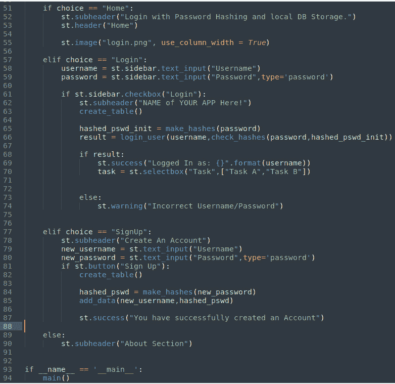

# 第十三章：为 Web 应用程序创建安全的登录和注册过程

让我们继续探索一些高级技巧，让我们的网页应用看起来更专业、运行得更顺畅。

在本章中，我们将学习如何实现一个登录和注册页面，该页面使用**安全散列算法 256**（**SHA-256**）加密，并以安全且用户友好的方式连接到数据库。通过采用这种方法，我们将能够验证我们的网页应用用户并永久存储他们的凭据。登录和注册页面通常由一个表单组成，用户可以在其中输入用户名和密码以访问网页应用。当用户登录时，他们的凭据会使用 SHA-256 进行哈希处理，并与数据库中存储的哈希值进行比较（在本例中，我们使用的是**SQLite3**）。如果哈希值匹配，用户将通过身份验证并获得访问应用的权限。注册页面允许新用户通过输入所需的用户名和密码来创建帐户。

在本章中，我们将讨论以下主要内容：

+   理解登录和注册页面背后的逻辑

+   什么是 SHA-256，为什么我们应该使用它？

+   连接到关系型数据库并与其交互

+   从数据库中检索或保存凭据

# 技术要求

+   在本章中，我们将使用以下库、包和工具：

    +   Sublime Text

    +   Python 3

    +   `pipenv`

    +   Streamlit

    +   Pillow

    +   `Sqlite3`

    +   `hashlib`

+   本章的代码可以在本书的 GitHub 仓库中找到：[`github.com/PacktPublishing/Web-App-Development-Made-Simple-with-Streamlit/tree/main/Chapter13`](https://github.com/PacktPublishing/Web-App-Development-Made-Simple-with-Streamlit/tree/main/Chapter13)。

# 理解登录和注册页面背后的逻辑

当用户在网站或应用程序上创建帐户时，通常会要求提供用户名和密码。用户名是用户的唯一标识符，而密码是只有用户自己应该知道的秘密。

网站或应用程序随后将用户名和密码存储在数据库中。然而，密码不会以明文形式存储。相反，它会被转换为**哈希**。哈希是一种单向函数，这意味着计算密码的哈希值很容易，但反向操作、从哈希值计算密码却非常困难。

这样做是出于安全考虑。如果黑客获取了数据库的访问权限，他们将无法读取明文密码。他们只能读取哈希值。即使黑客知道使用的哈希算法，破解密码仍然是非常困难的。

当用户登录时，他们需要输入用户名和密码。然后，网站或应用程序会计算用户输入密码的哈希值，并与数据库中存储的哈希值进行比较。如果两个哈希值匹配，用户便成功登录。

下面是关于登录和注册页面背后逻辑的逐步解释：

1.  用户在注册页面输入他们的用户名和密码。

1.  网站或应用程序将密码转换为哈希值。

1.  网站或应用程序将用户名和密码的哈希值保存到数据库中。

1.  用户将被重定向到登录页面。

1.  用户在登录页面输入他们的用户名和密码。

1.  网站或应用程序会计算用户输入的密码的哈希值，并将其与存储在数据库中的哈希值进行比较。

1.  如果这两个哈希值匹配，用户就成功登录。

1.  如果这两个哈希值不匹配，用户就没有成功登录。

将用户名和密码的哈希值永久存储在数据库中很重要，原因有几点：

+   允许用户登录他们的账户

+   允许用户在忘记密码时恢复密码

+   预防未经授权访问用户账户

如果用户名和密码的哈希值没有永久存储在数据库中，用户将无法登录账户或在忘记密码时恢复密码。此外，未经授权的用户也能通过猜测正确的用户名和密码来访问用户账户。

需要注意的是，尽管密码以哈希值的形式存储在数据库中，但黑客仍然有可能破解它们。然而，破解哈希值比破解明文密码要困难得多。

下面是创建强密码的一些提示：

+   使用大小写字母、数字和符号的组合

+   请确保您的密码至少包含 12 个字符

+   避免在密码中使用常见的单词或短语，例如`qwerty`、`12345678`、`user`、`admin`等

+   不要在密码中使用您的名字、生日或其他个人信息

+   为每个网站或应用程序使用不同的密码

现在，注册/登录页面的重要性应该已经很明确，同时也意识到避免使用弱密码的重要性。接下来是时候了解什么是安全哈希算法了。

# 什么是 SHA-256，为什么我们应该使用它？

SHA-256 是一种加密哈希函数，它根据数据输入生成一个 256 位的哈希值。它是*SHA-2 哈希函数族*的一部分（更多详情请查看[`justcryptography.com/sha-2/`](https://justcryptography.com/sha-2/)），该哈希函数族由**美国国家安全局**（**NSA**）设计，并由**美国国家标准与技术研究院**（**NIST**）于 2001 年发布。

SHA-256 是一种广泛使用的哈希函数，适用于多种应用场景，包括以下内容：

+   **密码存储**：SHA-256 用于安全地存储密码。当用户在网站或应用程序上创建帐户时，密码会被转换为 SHA-256 哈希并存储在数据库中。当用户登录时，他们的密码会被转换为 SHA-256 哈希，并与存储在数据库中的哈希进行比较。如果两个哈希匹配，则用户成功登录。

+   **数字签名**：SHA-256 可以用来创建数字签名。**数字签名**是一种加密技术，允许消息的发送者验证自己的身份和消息的完整性。为了创建数字签名，发送者计算消息的 SHA-256 哈希，然后用他们的私钥加密该哈希。然后，发送者将消息和加密的哈希一起发送给接收者。接收者计算消息的 SHA-256 哈希，并用发送者的公钥解密加密的哈希。如果两个哈希匹配，则接收者可以确认消息是有效的且没有被篡改。

+   **文件完整性验证**：SHA-256 可以用来验证文件的完整性。为此，首先计算文件的 SHA-256 哈希并存储起来。当需要文件时，再次计算该文件的 SHA-256 哈希，并与存储的哈希进行比较。如果两个哈希匹配，则文件被认为是完整的。

SHA-256 被认为是一个非常安全的哈希函数。它能抵抗碰撞攻击，这意味着很难找到两个不同的输入产生相同的哈希值。它还能够抵抗预映像攻击，即很难找到一个输入，产生给定的哈希值。

下面是使用 SHA-256 的一些理由：

+   它是一个非常安全的哈希函数

+   它被广泛使用并得到支持

+   它相对容易实现

+   它是免费的

如果你需要一种安全的方式来存储密码、创建数字签名或验证文件的完整性，那么 SHA-256 是一个不错的选择。

现在我们已经拥有了所有需要的信息，让我们开始编码。像往常一样，我们必须遵循一些典型的步骤来设置一个新的虚拟环境：

1.  创建一个名为`Login_Skeleton`的新目录。

1.  进入这个目录并输入`pipenv shell`来创建一个新的虚拟环境。

1.  安装`streamlit`和`pillow`包。

1.  创建一个名为`app.py`的空 Python 文件。

1.  启动你的 IDE（Sublime Text）。

*图 13.1* 显示了从创建新目录到安装所需库的所有步骤：


图 13.1: 虚拟环境与 app.py 文件准备

现在，我们准备编辑`app.py`文件中的 Python 代码。

在 Sublime Text 中，我们可以开始为我们新的登录/注册网页应用编写代码，如*图 13.2*所示：


图 13.2：启动代码

前面的代码应该非常熟悉。以下是我们所做的事情的分解：

+   一开始，在*第 1 行*和*第 2 行*，我们导入所需的库——在这种情况下是`streamlit`和`Pillow`。

+   之后，在*第 5 行*，我们创建了一个`main()`函数：

    +   在`main()`函数中，我们在`html_temp`变量（*第 8 行*）中编写一些 HTML 代码，以设置 Web 应用中的大标题，指定背景颜色、内边距和文本颜色

    +   然后，我们使用`st.markdown`指令可视化 HTML 代码（*第 14 行*）

+   接下来，我们在*第 16 行*创建一个包含我们想要显示的菜单选项的列表，并在屏幕左侧的侧边栏中添加一个选择框。

+   然后，我们检查选择项（*第 19 行*），如果它是`Home`，我们做某些事情：目前，我们只是将一些文本写入`subheader`格式。同时，如果选择项是`Login`（*第 25 行*），我们跳过（我们将在*创建登录菜单*小节中开发这部分代码）；`Signup`（*第 28 行*）也是如此。

+   最后，我们添加了一个`About`部分（*第 32 行*），在这里我们可以自由地写任何我们想写的内容。

请注意，在`st.image`指令中，这张名为`login.png`的图片必须与`app.py`文件位于同一目录中，如*图 13.2*中的编辑器的`Folder`部分所示。

和往常一样，当我们执行以下命令时，Web 应用程序将被执行：

```py
pipenv run streamlit run app.py
```

浏览器中的结果非常简单和干净：


图 13.3：浏览器中的登录/注册 Web 应用

在左侧，我们有带有菜单的侧边栏，而中间是**Home**部分，里面有一张漂亮的图片。

框架已经准备好。现在是时候将我们的 Web 应用程序连接到数据库，以便我们可以保存所有的用户名/密码数据并在合适的时候使用它。

# 连接到关系数据库并与之交互

正如在*理解登录和注册页面背后的逻辑*部分中解释的那样，我们希望将账户信息保存在数据库中。因此，我们必须导入数据库库。如前所述，我们使用的是**SQLite3**数据库。所以，首先，让我们通过输入以下命令来安装它的 Python 库：

```py
pipenv install sqlite3
```

然后，只需通过在`app.py`文件中写入`import sqlite3`来导入该库。

让 SQLite3 数据库为我们工作是一个非常简单的任务。为此，我们需要通过指定数据库的名称（在我们的例子中是`userdata.db`）作为参数来打开一个*连接*，并创建一个*游标*来执行其中的操作。

在*第 6 行*和*第 7 行*中（在*图 13.4*中），连接和游标被创建：


图 13.4：连接到数据库及其游标

总结一下，*连接*（`conn`）打开与数据库的连接，而*游标*（`c`）使我们能够在数据库中进行操作。本质上，我们需要三个不同的操作：

+   表格创建

+   数据插入

+   数据检索

实现这些操作的最佳方式是为每个操作创建一个专门的函数，如下图所示：


图 13.5：数据库函数

让我们仔细看看这三个函数：

+   第一个函数名为`create_table`。简单来说，这个函数创建一个名为`userstable`的表，但仅当该表在数据库中不存在时才会创建。`userstable`表有两列，分别是`username`和`password`，每列都包含文本类型的数据。需要理解的是，`CREATE TABLE`指令是通过我们在*图 13.4*中创建的光标传递给数据库的。因此，光标利用打开的连接，使得我们能够将操作（或函数）传递给数据库。

+   第二个函数名为`add_data`，因为它负责在我们通过`create_table`函数创建的`userstable`表中插入数据或值。因此，我们将两个值——用户名和密码——作为参数传递给`add_data`函数，它按以下顺序将这两个值插入到`userstable`表中：将用户名值插入到`username`列，将密码值插入到`password`列。同样，光标负责执行该指令。`conn.commit()`非常重要，因为如果没有这个*commit*，新的用户名和数据将不会被存储到数据库中。

+   第三个函数名为`login_user`，与`add_data`函数类似，它有两个参数：`username`和`password`。它接收这两个值并在`userstable`表中查找，然后检索（`fetchall`）所有结果并将它们放入一个名为`data`的变量中。这个`data`变量作为函数的最终输出返回。通过这种方式，我们可以检查用户名和密码是否存在于数据库中。同样，光标负责执行这些命令。

有了这三个函数，我们可以继续处理`app.py`文件。

## 创建登录菜单

首先，我们需要两个文本输入框，一个用于用户名，一个用于密码，然后我们可以将它们放入侧边栏中。接下来，我们在以下图示的*第 46 行*和*第 47 行*中添加两行代码：


图 13.6：用户名和密码的文本输入框

在*第 47 行*指定`type='password'`后，我们输入的密码将被隐藏；点击*眼睛*图标，我们可以在浏览器中清楚地看到密码，如下图所示：


图 13.7：密码是隐藏的

到此为止，登录的逻辑应该已经相当清晰：我们输入用户名和密码，并在数据库中查找它们，以了解特定用户是否被允许登录我们的应用程序。

和往常一样，让我们看一下执行此功能的代码：


图 13.8：登录部分的代码

这是图*13*.*8*中代码的详细说明：

+   在*第 49 行*，我们添加了一个复选框；当它被选中时，在 Web 应用的`main`部分打印一个新的副标题。

+   在此之后，*第 51 行*，我们执行了前面描述的`create_table`函数。这样，一个名为`userstable`的新表将被创建在数据库中，但仅当它不存在时。

+   在*第 53 行*，执行`login_user`函数，并使用*第 46*和*第 47 行*上的两个`text_inputs`小部件输入的用户名和密码作为参数。

+   如果数据获取的结果是积极的，我们将打印带有*成功*标志的**已登录...**消息，并显示一个带有一些占位符的选择框；否则，我们将打印一个*警告*，指出**用户名/密码不正确**消息。

如果现在尝试登录，您将收到**用户名/密码不正确**消息，因为数据库中没有数据。

要填充数据库，我们必须实现`SignUp`函数。让我们看看如何实现。

## 创建注册菜单

逻辑与`Login`函数相同，但我们必须进行一些更改，如下面的代码所示：


图 13.9：注册部分的代码

这里是我们所做的事情的详细说明：

+   在*第 66*和*第 67 行*，我们有两个`text_input`小部件来收集用户名和密码，但这次，我们将它们放在 Web 应用程序的`main`部分而不是侧边栏中。

+   在此之后，*第 68 行*，我们添加一个带有`Sign Up`标签的按钮。当按下此按钮时，我们执行`create_table`函数（我们必须确保`userstable`表存在；否则，我们将获得运行时错误）。

+   在*第 71 行*，我们执行了`add_data`函数。我们已经解释过这个函数（参见*图 13.5*），所以我们知道通过将`text_input`小部件输入的用户名和密码传递给它，我们在数据库中创建了一个新记录。这个新记录将包含新的用户名和密码。

+   最后，在*第 73 行*，我们打印一个美丽的*成功*消息来确认帐户的创建。

让我们看看 Web 应用程序的实际操作。

## 运行应用程序

在菜单中选择`user1`，以及密码，例如`12345`（请记住，在实际使用中，您应该使用更强的密码）：


图 13.10：使用注册创建新帐户

然后，点击**Sign Up**按钮；您将收到一个**您已成功创建一个帐户**消息。

有了这个，我们已经将我们的第一个帐户插入到我们的数据库中。这意味着我们可以尝试登录。

从菜单中选择**登录**，输入用户名（**user1**）和密码（**12345**），并进入网页应用。我们会看到**登录为：user1**的消息和任务列表（我重复一下，这些只是占位符）：


图 13.11：使用“登录”进入网页应用

当我们尝试使用错误的用户名或密码登录时，系统会显示以下输出：


图 13.12：使用错误的用户名/密码登录

我们输入了 `user100`，但该用户名在数据库中不存在，因此无法登录。我们无法进入网页应用，因此无法查看任务列表。

网页应用运行得非常顺利。接下来，我们将为我们的应用添加一个漂亮的图形用户界面。

## 添加图形用户界面

在命令行中，请安装**SQLite 的 DB 浏览器**，这是一个非常好用的 SQLite 数据库管理图形界面。输入以下命令：

```py
sudo apt install sqlitebrowser
```

安装完成后，请启动应用程序；图形用户界面将如以下图所示：


图 13.13：SQLite 的 DB 浏览器

这样，我们就可以准备好打开在我们网页应用中创建的数据库了：

1.  点击**文件** | **打开数据库**。

1.  如 `Login_Skeleton` 目录所示，其中有一个名为 `userdata.db` 的文件。选择它并打开：


图 13.14：打开 userdata.db 数据库

你应该能看到你数据库的结构，如下图所示：


图 13.15：数据库结构

如我们所知，数据库中有一个名为 `userstable` 的表，该表有两列文本：`username` 和 `password`。

1.  选择 `Browse` `Data` 标签。

    如下图所示，`userstable` 表包含我们之前创建的账户——用户名为 **user1**，密码为 **12345**：


图 13.16：我们表格中保存的账户

这里有一个与安全性相关的大问题：密码是*明文*存储的。任何能够访问我们数据库中 `userdata.db` 文件的人都可以读取它。这就是我们必须在代码中引入哈希加密的原因——为了让任何人几乎不可能以这么简单的方式发现我们的密码。我们将在下一节中看到如何做。

# 从数据库中获取或保存凭据

从理论角度来看，我们已经讨论了哈希是什么，以及为什么我们需要使用哈希。从实践角度来看，有很多 Python 库可以使用（例如，`sha256`和`pycrypto`），但最容易使用且非常有效的是`hashlib`。这个库在 Python 中默认安装，因此我们不需要在虚拟环境中安装它；只需将其导入到`app.py`文件中即可。

在利用`hashlib`时，我们只需使用它的`sha256`方法来创建密码的哈希加密。再次强调，*SHA-256*从安全角度来看是一种非常强大的加密方式。

这些是我们需要的哈希处理过程中的新代码行：


图 13.17：make_hashes 函数

下面是我们所做的操作的分解：

+   在*第 5 行*，我们导入了`hashlib`。

+   在*第 12 行*和*第 13 行*，我们创建了一个新函数`make_hashes`。这个函数只有一个输入参数：密码。这个密码被传递给`sha256`方法，生成哈希值。该哈希值会被转换为十六进制并返回。

正如我们所知，哈希值是无法解码的。这意味着，一旦我们将密码转换为哈希，就无法再将其转换回来。因此，为了完成用户的身份验证/登录，我们必须在`text_input`中输入密码，将其转换为哈希，然后将结果与数据库中存储的哈希进行比较。如果两个哈希码相同，则意味着输入的密码正确；否则，表示密码与保存的密码不同。

实现此过程需要对我们的代码进行一些修改：

1.  首先，我们必须将输入的密码转换为哈希。这可以通过我们刚才讨论的`make_hashes`函数来完成。

1.  然后，我们需要将这个哈希值与数据库中保存的哈希进行比较。

第一个代码更改影响了**登录**部分，如下图所示：


图 13.18：输入密码的哈希处理

以下是我们在前面的代码中所做的事情：

+   在*第 60 行*，我们对输入的密码进行哈希处理。

+   在*第 61 行*，利用`check_hashes`函数，我们将哈希过的密码与数据库中保存的哈希密码进行比较。如果它们相同，则表示登录过程成功。

让我们编写`check_hashes`函数；代码非常简短，如下图所示：


图 13.19：“check_hashes”函数

以下是我们在前面的代码中所做的事情：

+   在*第 15 行*，我们定义了一个新函数，只有两个参数：密码（明文）和哈希文本（保存在数据库中的密码哈希）。

+   在*第 16 行*，我们可以看到，如果密码的哈希值（通过`make_hashes`函数得到）与数据库中存储的哈希值相同，我们将返回哈希文本（密码的哈希版本）；否则，我们将返回`False`。

因此，回到*图 13.18*中显示的*第 61 行*代码，当`check_hashes`返回哈希密码时，`result`变量为`True`，代码进入`if`循环的`success`部分。否则，当`check_hashes`返回`False`时，`result`变量也为`False`，代码进入`if`循环的`else`部分，拒绝登录。

现在，如果我们尝试使用之前保存的账户（**user1**，**12345**）登录到 Web 应用程序，我们将失败并收到警告。原因是，在我们的数据库中，我们保存的密码没有进行哈希处理，因此密码是以明文存储的。

为了完成所有的登录/注册 Web 应用程序代码，我们必须稍微修改**注册**部分，确保账户的密码以哈希版本保存：


图 13.20：最终的“注册”部分

以下是我们在前面的代码中所做的操作：

+   在*第 84 行*，我们创建了输入密码的哈希值

+   在*第 85 行*，我们将其与相关的用户名一起保存到数据库中

到此为止，我们已经完成了编码。我们可以尝试使用 Web 应用程序的全部功能，从创建一个用户名为`user2`、密码为`09876`的新账户开始：


图 13.21：创建新账户

如我们所见，在数据库浏览器中，新密码已经作为哈希代码被保存：


图 13.22：新密码的哈希版本

任何获取数据库文件的人都可以读取其内容，但无法理解密码是什么，因为从哈希值中获取明文密码几乎是不可能的。

让我们尝试登录：


图 13.23：使用新账户登录

输入的密码被转换为哈希值，并与存储在数据库中的哈希值进行比较；由于两个哈希值匹配，我们得到了以下结果：


图 13.24：登录成功

登录过程已成功完成，用户可以访问应用程序的任务。

很有趣的是，理解即使给定的文本与另一个文本只有微小差异，它的哈希值也会完全不同。向数据库中添加另一个账户，这次使用密码如`09875`，并检查它的哈希值与来自`09876`密码的哈希值有多么不同。

本章充满了复杂的信息，但我们得到的结果非常有价值：一个完整的应用骨架，可以用于所有需要管理注册、登录、哈希和永久保存数据的网页应用。

一如既往，以下是我们开发的所有代码：


图 13.25: 注册/登录骨架 – 第一部分

在代码的第一部分，我们开始导入库（*第 1-5 行*），然后创建了与数据库的连接和游标（*第 6-7 行*）。之后，我们导入了`hashlib`库（*第 10 行*）并创建了`make_hashes`和`check_hashes`函数（*第 12 行*和*第 15 行*）。在*第 22 行*和*第 26 行*，我们定义了两个函数，用于创建新表并向数据库添加数据，而在*第 31 行*，我们定义了管理用户登录的函数。

在*第 37 行*，我们定义了`main`函数，添加了一些 HTML 代码以使应用更美观，并实现了应用程序菜单：



图 13.26: 注册/登录骨架 – 第二部分

在代码的第二部分，我们管理了菜单。因此，如果用户选择**登录**，我们实现了相应的代码（*第 57-74 行*）。当用户选择**注册**时，我们实现了专门处理此功能的代码（*第 77-87 行*）。最后，在*第 90 行*，我们有**关于**部分。

本章非常重要，因为一个应用几乎总是需要管理账户，因此需要用户名和密码。为了正确完成这项任务，加密密码非常安全是关键。

# 总结

在本章中，我们理解了登录和注册页面背后的逻辑，并根据这里总结的最佳实践学到了一个非常可靠的账户实现和管理方式。

当用户在我们的网页应用中注册时，他们提供用户名和密码。用户名作为唯一标识符，而密码是只有用户自己知道的秘密。为了安全起见，这些凭证存储在数据库中，但密码不会以明文形式保存。相反，它们会被转换为哈希值，这是一种从密码中容易计算但难以逆转的单向函数。这确保了即使黑客访问了数据库，他们也无法轻易破解密码。

在登录过程中，用户输入的密码会被哈希处理并与存储的哈希值进行比较；如果匹配，用户将获得访问权限。存储这些哈希值对于允许用户登录和恢复密码至关重要。尽管破解这些哈希值是可能的，但比破解明文密码要困难得多。

实现强健的业务代码是任何 Web 应用程序的主要目标，因为通过这样做，可以解决代码应当解决的任何问题。为客户提供更美观的界面、设计精良的应用程序以及高度定制的工具，是一个真正的 Web 应用程序设计师应该具备的另一项关键技能。这正是我们将在下一章讨论的内容。
