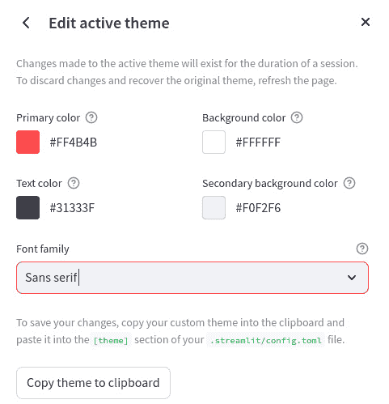
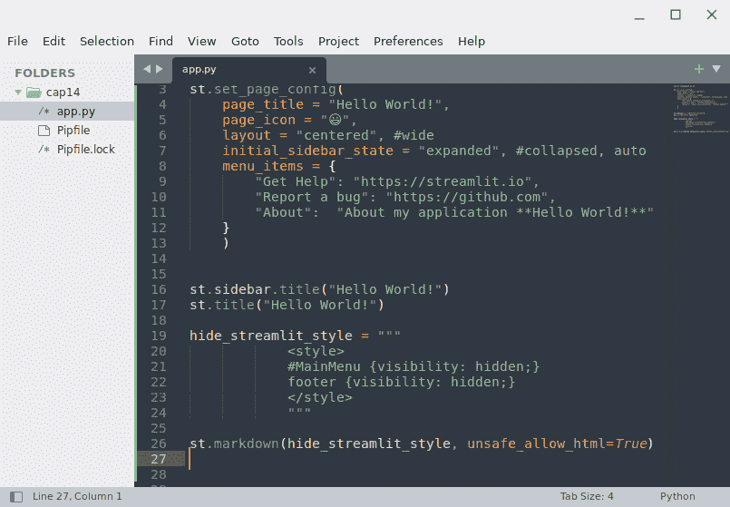

# 第十四章：自定义页面、个性化主题和实现多页面

Streamlit 最近增加了许多高级功能，使得定制我们的应用程序变得更加简便和精准。现在，我们可以配置我们的页面，比如隐藏*汉堡菜单*或页脚。例如，可以更改许多标准链接，并深度个性化主题、颜色和样式。最后，我们可以本地处理多页面，使用非常特定的方式命名和配置文件夹。

所有这些新特性是深度自定义我们网页应用程序的一种非常强大的方式，使它们的外观和行为完全符合我们在项目设计阶段的设想。

在本章中，我们将涵盖以下主要内容：

+   了解与深度自定义相关的新特性

+   创建深度定制页面

+   了解主题和`.toml`文件

+   探索多页面功能

# 技术要求

+   在本章中，我们将使用以下库、包和工具：

    +   Sublime Text

    +   Python 3

    +   `pipenv`

    +   Streamlit

+   本章节的代码可以在本书的 GitHub 仓库找到：[`github.com/PacktPublishing/Web-App-Development-Made-Simple-with-Streamlit/tree/e54d7b3d8840a3971ab8241acf6a1a6212e51f77/Chapter14`](https://github.com/PacktPublishing/Web-App-Development-Made-Simple-with-Streamlit/tree/e54d7b3d8840a3971ab8241acf6a1a6212e51f77/Chapter14)

# 了解与深度自定义相关的新特性

本章节不需要新的包——我们只需要 Streamlit。首先，创建一个新的空 Python 文件；如常，你可以将其命名为`app.py`。然后，打开 IDE。我们可以通过仅仅导入`streamlit`并在侧边栏和网页应用的主部分添加一个标题来开始编程，如*图 14.1*所示：


图 14.1：启动代码

启动应用程序会在`8501`端口的 localhost 上打开浏览器，通常我们会看到类似这样的界面：


图 14.2：启动网页应用

这非常简单：我们在侧边栏和网页应用的主部分都得到相同的标题。仔细观察，我们可以发现一些非常有趣的元素可以进行定制：


图 14.3：应用标题与图标、页脚及菜单

在*图 14.3*中，我们可以看到以下内容：

+   在红色部分，我们可以看到我们网页应用的*标题*和*图标*。此时，这些是默认的：Streamlit 的图标和我们的 Python 文件名。

+   在绿色部分，我们可以看到所谓的*页脚*。

+   在黄色部分，我们可以看到*三个点菜单*。在 Streamlit 的早期版本中，这就是所谓的*汉堡菜单*。

从*三个点菜单*开始，点击它。我们将看到如下弹出菜单：


图 14.4：三个点菜单

在这个弹出菜单中，有几个选项：

+   **重新运行**，在代码更改后重新运行 Web 应用

+   **打印**，打印屏幕内容

+   **录制屏幕录像**，录制我们的 Web 应用

+   **清除缓存**，一键清除缓存

另外两个选项，**关于**和**设置**，非常有趣，因为它们可以自定义，帮助我们个性化应用程序的外观和感觉。

让我们打开**设置**，我们将看到以下新窗口：


图 14.5：设置

从这个菜单中，我们可以在底层代码更新时自动更新应用程序。我们还可以选择以宽屏或正常模式运行，并设置主题；可以选择**浅色**、**深色**，或者与系统设置相同（**使用系统设置**）。

自定义级别甚至更深。实际上，点击**编辑活动主题**后，我们将看到以下窗口：



图 14.6：编辑活动主题窗口

在这个窗口中，我们可以自定义**主色**、**文本颜色**、**背景色**和**次背景色**的值。此外，我们可以从列表中选择字体，并将配置复制到剪贴板。

如字体选择下方的注释所示，如果我们希望这些选择永久生效，我们必须编辑`.streamlit`目录下名为`config.toml`的文件；这是一个隐藏文件夹。我们将在*理解主题和 .toml 文件*部分处理这个文件。

现在，是时候看看如何自定义我们的页面了。

# 创建深度自定义页面

现在，让我们回到代码，处理*图 14.3*中标红的标题和图标：


图 14.7：set_page_config 方法

在*第 3 行*，紧接着`import streamlit as st`后，我们使用`st.set_page_config`方法设置页面配置。通过这种方式，我们可以自定义页面标题和图标（支持表情符号，甚至是 PNG 或 ICO 文件），设置主区域内容的布局（可以是宽屏或居中），并决定侧边栏在启动时是展开还是折叠。

根据*图 14.7*中报告的配置，结果如下：


图 14.8：自定义页面

你可以尝试不同的设置，使用所有可用的参数。

使用`set_page_config`方法，我们可以做得更多。事实上，通过添加*图 14.9*中显示的几行代码，我们可以修改*三点菜单*和**关于**部分：


图 14.9：使用 set_page_config 的完整自定义

下面是我们在前面的代码中所做的工作：

+   在*第 9 行*和*第 10 行*，我们为*三点菜单*添加了两个选项，分别是**获取帮助**和**报告 Bug**。它们分别将用户引导到 Streamlit 网站和 GitHub。你可以在这里插入任何你想要的 URL。

+   在*第 11 行*，我们添加了一个注释，将在菜单的**关于**选项中显示；这个注释支持标准的 Markdown 语法。

*图 14.10* 显示了新的*三点菜单*和定制的**关于**部分并排展示：


图 14.10：定制的三点菜单和关于部分

接下来，参考*图 14.3*中显示的*页脚*，让我们通过一个非常简短的指令来学习如何去除它：


图 14.11：去除页脚的指令

以下是我们在前面代码中所做的操作：

+   在*第 19 行*，我们添加了非常简单的 HTML 代码，将页脚的可见性设置为*隐藏*

+   在*第 25 行*，像往常一样，使用 `st.markdown` 和 `unsafe_allow_html`，我们使用了那个 `html` 代码

非常有趣的是，只需在 `footer` 行之前再添加一行代码，我们就可以轻松去除*三点菜单*。最终的代码如下：



图 14.12：去除页脚和主菜单的指令

网页应用如下所示：


图 14.13：没有页脚和主菜单的网页应用

在这一部分，我们学习了如何利用 `set_page_config` 指令来定制页面。此外，我们还学会了如何从 Streamlit 页面中去除 `footer` 行和*三点菜单*。在下一部分，我们将学习如何处理*主题*。

# 理解主题和 .toml 文件

在本章开始时，在*理解与深度定制相关的新功能*部分，我们学习了如何直接从浏览器更改网页应用的主题。Streamlit 自版本 0.79.0 起原生支持自定义主题，这意味着我们可以直接从后台定制主题，而无需在浏览器中进行操作。

我们已经看到有一个隐藏的目录叫 `.streamlit`，并且在这个目录中，有一个名为 `config.toml` 的文件。

如果我们想定制主题，首先必须打开这个 `config.toml` 文件，然后向其中添加以下指令：


图 14.14：使用 config.toml 文件进行主题配置

*图 14.14*中的配置是经典的浅色主题。如果你想要完全不同的效果，可以使用你喜欢的颜色代码，并在无衬线、衬线或等宽字体之间选择。要快速查看颜色代码，可以在互联网上搜索*HTML 颜色代码*，或者访问像[`html-color.codes/`](https://html-color.codes/)这样的站点。

例如，假设我们采用以下 HTML 颜色代码：


图 14.15：一个完全不同的主题配置

我们将得到一个相当强烈的结果，如下图所示：


图 14.16：一个相当强烈的主题，使用了等宽字体

非常简单！定制主题只需使用 HTML 颜色代码和一个 TOML 文件。现在，让我们来了解什么是*多页面*。

# 探索多页面功能

Streamlit 中的多页面是将你的应用组织成多个页面的一种方式，每个页面有其独立的内容。这对于功能丰富的大型应用或需要为不同用户划分不同部分的应用非常有用。

要在 Streamlit 中创建一个多页面应用，只需要在与你的主应用文件同一文件夹下创建一个名为`pages`的新文件夹。然后，在`pages`文件夹中创建新的 Python 文件，每个文件将代表你应用中的一个不同页面。

一旦创建了页面，你就可以开始为它们添加内容。你可以使用任何你想要的 Streamlit 小部件和函数，就像在常规的 Streamlit 应用中一样。

当你运行你的应用时，Streamlit 将自动检测`pages`文件夹中的页面，并将它们添加到侧边栏的导航栏中。用户可以点击不同的页面在它们之间导航。

根据前面的解释，一切听起来都很简单；正如我们将看到的，确实如此。

## 创建多页面

让我们构建一个简单的多页面网页应用。像往常一样，我们将从构建应用的框架开始：

1.  首先，我们将创建一个新文件，命名为`app.py`。

1.  然后，在 Sublime Text 中打开`app.py`文件并导入`streamlit`。

1.  现在，创建一个`main`函数，只显示标题，如*图 14.17*所示：


图 14.17：我们“多页面”网页应用的基本框架

如你所见，前面的代码会在浏览器中生成一个相当简单的网页应用。结果如下：


图 14.18：起始点

请注意，主题仍然是我们在*理解主题和.toml* *文件*部分配置的主题。

现在，让我们创建一个名为`pages`的目录。这个目录必须与我们的主文件处于同一级别——也就是说，它必须与`app.py`文件在同一个文件夹中。我们可以在终端中输入以下指令：

```py
mkdir pages
```

现在，我们可以进入`pages`目录，然后创建一个名为`page1.py`的新文件。为此，我们必须在终端中输入以下指令：

```py
cd pages
touch page1.py
```

我们文件夹的结构如*图 14.19*所示：


图 14.19：我们文件夹和文件的结构

有一个包含`app.py`文件的`root`目录和一个名为`pages`的目录。`pages`目录中还有一个名为`page1.py`的文件。

如果我们查看浏览器，会看到 Streamlit 自动识别出了两个页面——一个名为`app`，另一个名为`page1`：


图 14.20：侧边栏中的两个页面

侧边栏中的两个页面名称与我们目录中 Python 文件的名称相同，只是没有`.py`后缀。

点击`page1`后，我们会看到一个空白页面，因为`page1.py`文件仍然为空。让我们返回到 Sublime Text 并添加一些代码：


图 14.21：一些简单的代码，添加到 page1.py 文件中

新的代码非常简单——它只是将**Page1**打印到屏幕上。结果是：


图 14.22：点击`page1`后的结果

我们可以继续按照相同的方式，在`pages`目录中创建一个名为`page2.py`的新文件。在终端中，我们只需输入以下内容：

```py
cd pages
touch page2.py
```

然后，进入 Sublime Text，我们可以像编辑`page1.py`那样编辑`page2.py`文件，如下图所示：


图 14.23：一些简单的代码，添加到 page2.py 文件中

这是在 Web 应用中的结果：


图 14.24：我们多页面 Web 应用中的新页面

正如我们所看到的，侧边栏中的列表中有一个新页面。点击**page2**后，Web 应用程序的主界面中将显示一个新页面。

让我们在`pages`目录中创建另一个文件，这次命名为`new_feature.py`。我们将把与`page1.py`和`page2.py`相同的代码添加到其中。浏览器中的结果是：


图 14.25：侧边栏中的页面按字母顺序排列

我们可以看到侧边栏中的页面是按字母顺序排列的。如果我们想更改页面的顺序，必须以特定的方式更改它们的名称。

在终端中，输入以下内容：

```py
mv page1.py 01_page1.py
```

通过这种方式，我们将旧的`page1.py`重命名为`01_page1.py`。

同样，我们可以将旧的`page2.py`重命名为`02_page2.py`，并将旧的`new_feature.py`重命名为`03_new_feature.py`：

```py
mv page2.py 02_page2.py
mv new_feature.py 03_new_feature.py
```

如果我们现在检查浏览器，我们会看到页面顺序发生了变化：


图 14.26：侧边栏中的页面现在按照自定义顺序排列

侧边栏中页面的顺序现在遵循我们对文件所做的更改，因为我们将 01、02 和 03 放在它们名称的开头。

如我们所见，Streamlit 非常智能，因为它没有将编号放在页面名称的开头，而只是显示它们的真实名称。

如果我们检查*图 14.26*中显示的浏览器地址栏，我们会看到 *new feature* 页面的 URL 是 `localhost:8501/new_feature`。因此，Streamlit 使用页面名称相应地更改 URL。

## 从一个页面传递变量到另一个页面

多页功能非常强大，因为可以将变量从一个页面传递到另一个页面。让我们学习如何利用这个功能。

让我们对 `app.py` 文件（即主页）做一个小修改，如下图所示：


图 14.27：在“app.py”文件中添加的新变量

在*第 3 行*，我们创建了一个名为 `my_variable` 的文本变量，并在*第 8 行*将其打印到屏幕上。以下是在 Web 应用中的结果：


图 14.28：在应用页面上显示的新变量

在主页上——即在`app.py`文件中创建的`my_variable`。

现在，在 Sublime Text 中，我们将更改`01_page1.py`代码，如下图所示：


图 14.29：“01_page1.py”文件中的代码更改

这里是我们正在做的事情：

+   在*第 4 行*，我们从 `app` 文件中导入了 `my_variable`。

    请注意，根据特定语法，我们不需要写 `from app.py`，只需写 `from app` —— 即文件名中省略 `.py` 后缀。

+   然后，在*第 7 行*，我们将导入的变量打印到屏幕上。

这是在 web 应用中的结果：


图 14.30：在 page1 页面上显示的新变量

结果非常有趣：在这里，我们展示了在另一个页面上创建的变量的内容，在**page1**页面上！

我们还将以下面方式修改 `02_page2.py` 文件：


图 14.31：在 02_page2.py 文件中添加的新变量

在*第 3 行*，我们引入了一个新变量，并在*第 6 行*打印它。以下是在 Web 应用中的结果：


图 14.32：在 page2 页面上显示的新变量

现在，让我们尝试在 `page1` 中打印我们在 `page2` 中创建的变量。为此，我们这次需要对 `01_page1.py` 文件使用稍微不同的代码，如下图所示：


图 14.33： “01_page1.py” 文件的新代码

这是我们所做的：

+   在 *第 5 行*，我们从 `02_page2.py` 文件导入了 `my_variable_page2`。然而，由于该文件位于 `pages` 文件夹内，我们必须写 `from` `pages.02_page2 import...`。

+   在 *第 9 行*，我们打印了 `my_variable_page2` 变量。

当我们切换到浏览器时，我们会遇到以下错误：


图 14.34：脚本执行错误

正如错误所解释的那样，我们遇到了 *无效的十进制字面量*。这意味着当我们尝试从 `pages.02_page2…` 导入时，如 *图 14.33* 所示，Streamlit 无法处理文件名开头的 `02`。

要解决此问题，我们必须按以下方式重命名文件：

```py
mv 02_page2.py page2.py
```

因此，我们必须按照如下方式更改 `01_page1.py` 文件中的代码：


图 14.35：对 01_page1.py 文件的最终代码更改

现在，我们已经正确地从 `pages.page2` 导入了内容。检查浏览器后，我们会看到一切正常：


图 14.36：page1 显示来自其他页面的变量

`app.py`）和来自 `page2.app` 的变量，这意味着变量在不同页面之间正确交换。

这证明了要在文件之间交换变量，我们不必在文件名中使用数字。

我们的主要任务是实现完全满足特定需求的 Web 应用程序，例如我们使用 *Covid-19 检测工具* 应用程序实现的疾病检测。然而，使这些应用程序既美观又易于使用也是非常重要的。深度定制是让我们应用程序既具有吸引力又易于使用的方式。

# 总结

在本章中，我们专注于 Streamlit 中的高级定制技术。我们深入探讨了那些可以实现深度定制的新功能，允许开发更具个性化和复杂性的网页。本章指导你创建高度定制的页面，强调根据特定需求量身定制用户界面和功能的能力。

本章的大部分内容都致力于理解主题和使用 TOML 文件。这涉及到探索如何操作主题以改变 Streamlit 应用程序的外观，使其更加吸引人并符合品牌要求。TOML 文件的使用也被详细解释，展示了如何有效地使用它们来定义和管理这些主题。

最后，本章探讨了 Streamlit 的多页面功能。我们学习了如何将 Streamlit 应用程序结构化为多个页面，从而增强其组织性和用户导航性。我们提供了实际示例和最佳实践，帮助您实现多页面应用程序，确保您能够有效地将复杂的 Streamlit 项目组织成更易管理和用户友好的格式。本章内容使您能够将 Streamlit 应用程序提升到更高的定制化和复杂度水平。

在下一章，我们将学习如何使用 Streamlit 的表单、会话状态和可自定义子域功能来增强我们的 Web 应用程序。
