# 第十五章：使用表单、会话状态和可自定义子域名增强 Web 应用

在 Streamlit 中，*表单*、*会话状态*和*可自定义子域名*都是可以提供更多高级定制和功能的特性，适用于 Web 应用程序。

*表单*允许用户在 Streamlit 网页应用中创建交互式表单，可以用来收集用户输入并根据特定的一组输入执行操作。表单可以包含多种输入元素，如文本字段、下拉菜单和复选框。

*会话状态*是一个功能，允许用户在他们的 Web 应用的不同会话之间存储和持久化数据。这对于存储用户偏好或应用设置非常有用。

最后，*可自定义子域名*允许用户为他们的 Streamlit 应用创建一个自定义子域名，这对于品牌化或创建更易记的 URL（而不是使用自动生成的标准匿名 URL）非常有用。

在这一章中，我们将涵盖以下主要内容：

+   什么是表单，我们在什么情况下以及为什么使用它们？

+   什么是会话状态（Session State），我们在什么情况下使用它？

+   什么是可自定义子域名，它们提供了什么可能性？

# 技术要求

+   在这一章中，我们将使用以下库、包和工具：

    +   Sublime Text

    +   Python 3

    +   `pipenv`

    +   Streamlit

+   这章中的代码可以通过以下 GitHub 链接访问：[`github.com/PacktPublishing/Web-App-Development-Made-Simple-with-Streamlit/tree/217479d2112ded99cfdd820a85709296ba5356b2/Chapter15`](https://github.com/PacktPublishing/Web-App-Development-Made-Simple-with-Streamlit/tree/217479d2112ded99cfdd820a85709296ba5356b2/Chapter15)

# 什么是表单，我们在什么情况下以及为什么使用它们？

**Streamlit 表单**是一个功能，允许你在 Streamlit 应用中创建交互式网页表单。这些表单可以通过各种小部件（如文本框、选择框、复选框等）收集用户输入。当用户提交表单时，Streamlit 会自动捕获输入值，并使其可用于你的 Python 代码。

使用 Streamlit 表单非常简单。你可以通过 `st.form()` 定义表单的边界，并在其中添加小部件。Streamlit 提供了多种输入组件，使得用户可以轻松输入信息，如文本输入、数字输入等。这种与 Python 的集成消除了手动处理表单的需求。

Streamlit 表单提供了定制选项，以改善用户体验。你可以添加标签、默认值和提示信息来引导用户。此外，你还可以控制表单的布局和样式，以匹配你的应用设计。

表单提交总是通过提交按钮触发，这样你就可以捕获用户输入并根据它执行操作。

总结来说，表单是小部件的组合，我们可以独立运行不同组合的表单。让我们写一些简单的代码来展示这一特性：

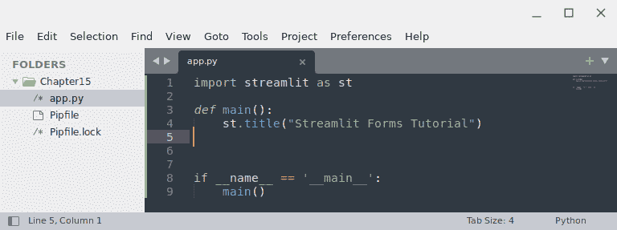

图 15.1：表单的起始点

上述代码非常简单：在导入`streamlit`后，我们仅仅在屏幕上打印了一个标题。结果如下：

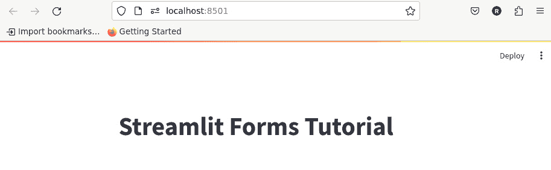

图 15.2：从浏览器角度的起始点

在我们的代码中引入表单时，基本上有两种方法。让我们一一看看它们。

## 上下文管理器方法

引入表单的第一种方式是*上下文管理器方法*，这是一种优雅的方法，使用`with`语句。`with`语句使得我们可以在代码块的开头（*第 8 行*，见*图 15.3*）声明表单，然后以常规方式使用指令，输入`st.`并加上小部件的名称。所以，写下这个代码：

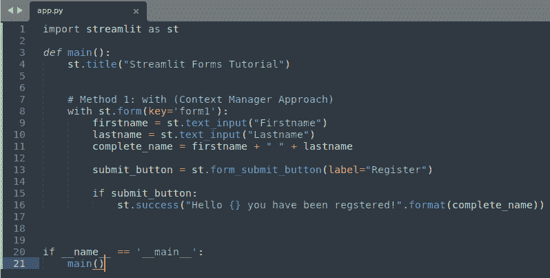

图 15.3：上下文管理器方法

以下是*图 15.3*中展示的代码解析：

+   在*第 8 行*，我们使用`with`语句创建了一个表单。请注意，表单的唯一参数是它的键，可以是任何类型的文本。

+   之后，在*第 9 行*和*第 10 行*，我们在新表单中插入了几个小部件，具体来说是两个`text_input`实例，用于保存假设用户的名字和姓氏。

+   在*第 11 行*，我们将名字和姓氏合并在一起。

+   *第 13 行*非常重要，因为每个表单都需要通过提交按钮激活，该按钮必须使用`form_submit_button`方法创建。在这种情况下，作为参数，我们使用要在表单中显示的标签。

+   最后，在*第 15 行*，我们使用了一个`if`语句来重新检查按钮是否已被按下；如果是的话，我们会打印一个成功信息。

这是浏览器中的结果：

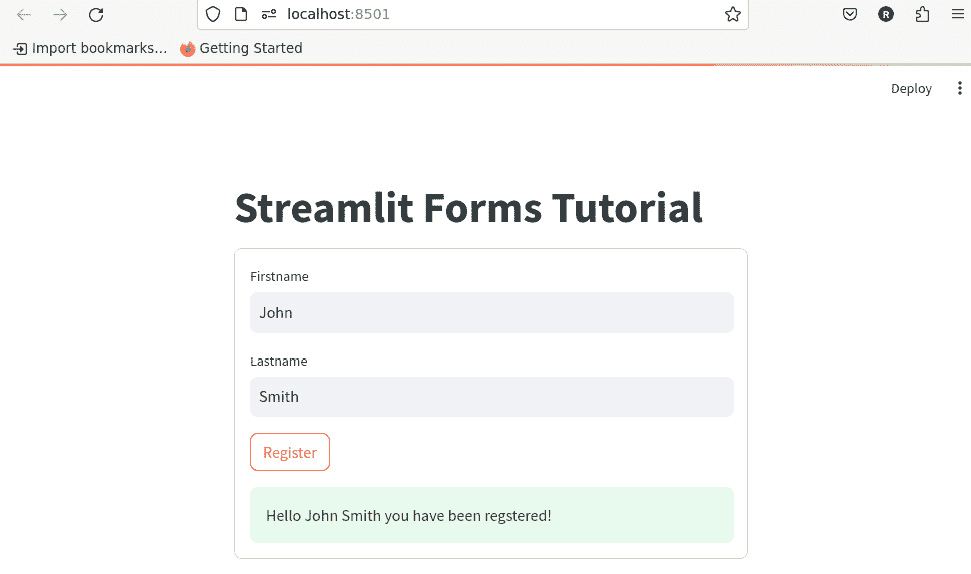

图 15.4：使用上下文管理器方法在浏览器中的结果

当我们点击`text_input`实例和按钮时。

为了将信息从表单中移除，我们可以稍微修改代码，如下图所示：

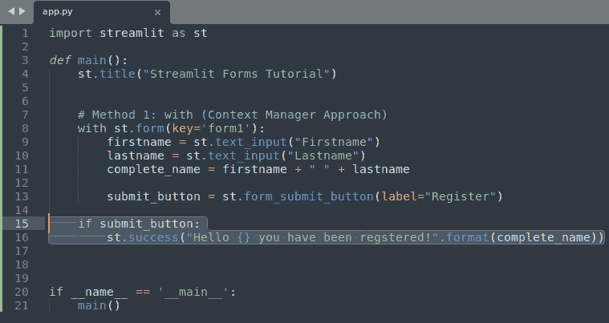

图 15.5：将成功信息保持在表单外

现在，`if`语句的缩进已更改为准确地位于`with`语句下方，也就是说，位于表单外部——也就是它的代码块之外。结果是：

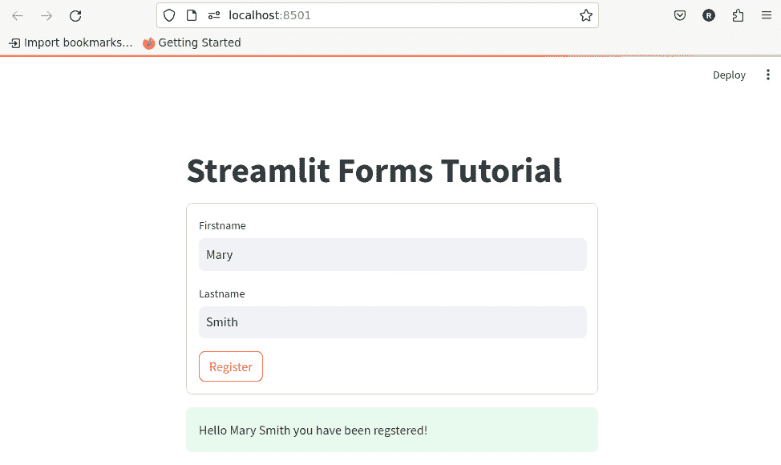

图 15.6：问候信息的不同位置

现在，让我们看看第二种方法，一种经典的方法，用来引入表单。

## 经典方法

经典方法相当直接，因为它不需要`with`语句：

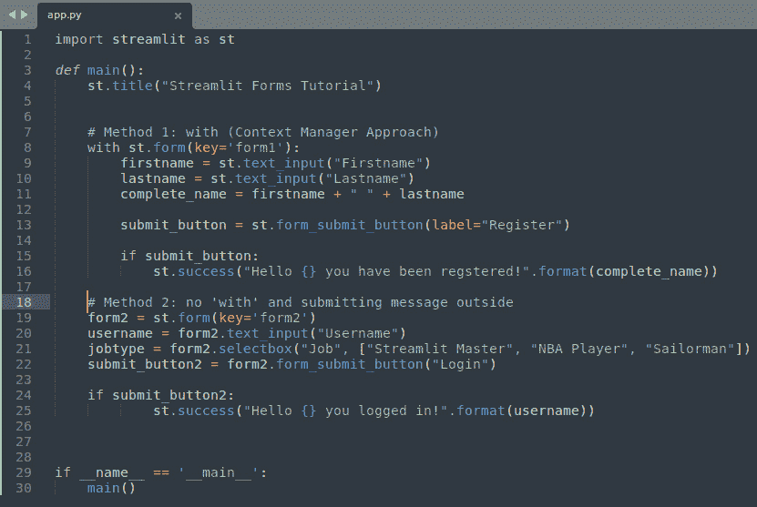

图 15.7：在我们的代码中引入表单的经典方法

这次我们做的事情是：

+   在*第 19 行*，我们直接引入了表单。

+   之后，在*第 20 行*和*第 21 行*，我们分别创建了两个新小部件，`text_input`和`selectbox`。

+   在*第 22 行*，我们创建了一个提交按钮。和往常一样，一个`if`语句检查提交按钮是否被点击。需要理解的是，在这种情况下，`if`语句的缩进始终与表单的缩进保持在同一层级，因此成功消息将始终位于表单框之外。

下面是使用这两种方法创建的两个表单在浏览器中的展示效果：

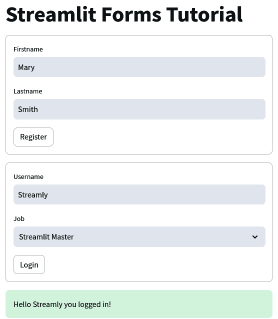

图 15.8：使用上下文管理器和经典方法创建的两个表单

请注意，我们可以独立地将数据（这意味着使用小部件）插入到这两个表单中。实际上，这两个提交按钮是完全不相关的。

表单是将小部件和组件分隔在我们 web 应用的特定区域中的一种非常强大的方式。现在让我们看看如何处理所谓的*会话*。

# 什么是会话状态，我们何时使用它？

Streamlit 于 2019 年发布，而*有状态性*在相当长的一段时间里是一个小问题，因为状态没有本地管理。然而，从 0.8.4 版本开始，情况发生了变化，官方声明（[`blog.streamlit.io/session-state-for-streamlit/`](https://blog.streamlit.io/session-state-for-streamlit/)）如下：

*现在你可以跨应用交互存储信息* *并重新运行！*

老实说，这个声明真的很完美，因为它传达了关于会话的一切。Streamlit 的**会话状态**功能提供了一种高效而复杂的会话管理方法。此功能支持在多次重新运行之间存储变量，促进在输入小部件上创建交互事件，并允许使用回调函数有效地管理这些事件。

会话状态的强大功能增强了各种应用程序的开发。这些功能包括以下几点：

+   集成相互依赖的小部件

+   开发引人入胜的有状态游戏，如战舰和井字棋

+   进行数据和图像标注任务

+   扩展功能以应对多样化和复杂的需求，如在多个请求之间持久化用户数据以及高效管理资源和数据

通常，使用没有会话状态的 Streamlit 意味着与小部件交互时会触发重新运行，导致脚本中定义的变量在每次执行时都会重置。相反，使用会话状态可以跨重新运行保留变量值，这在需要保持变量状态而无需重新初始化时特别有用。

让我们使用以下代码来看一个小示例并进一步理解。首先编写以下代码：

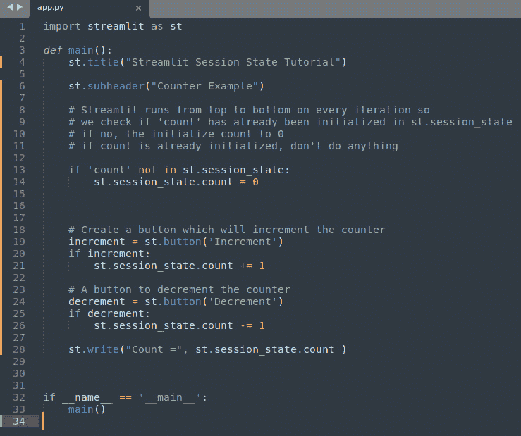

图 15.9：代码中的会话状态

Session State 的核心思想既简单又巧妙：Streamlit 每次迭代时都会从上到下执行，因此我们检查我们关注的变量（示例中的 `count`）是否已经在 `st.session_state` 中初始化。如果尚未初始化，我们将其初始化为一个特定的值（在我们的例子中是 `0`）；否则，我们什么都不做。

因此，`st.session_state` 就是一种 *集合*，用于保存我们不希望每次都初始化的变量。

前面的代码非常简单。下面是详细的解析：

+   在 *第 13 行*，我们检查 `count` 变量是否不在 `session_state` 中；如果不在，我们将其初始化为 `0`。

+   在 *第 19 行*，我们创建了一个按钮来递增 `count` 变量，并通过 `st.session_state.count` 执行此操作；这样，我们就能记住 `count` 变量的值。

+   在 *第 24 行*，我们做了相同的操作，但是是对 `count` 变量进行递减。

+   最后，在 *第 28 行*，我们在屏幕上可视化显示 `count` 变量的值。

这是浏览器中的结果：

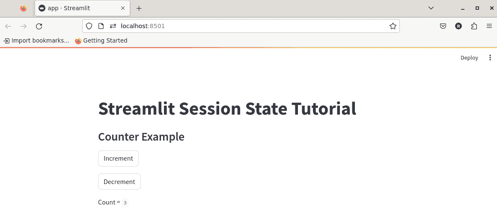

图 15.10：Session State 的应用

请验证每次点击 **递增** 或 **递减** 按钮时，**Count** 的值是否会自动更新。

*图 15.9* 中的代码展示了值在重新运行时的持久性。然而，让我们探讨一个更复杂的场景。在 Streamlit 中，可以将 *回调* 分配给不同的小部件，如 `st.button` 或 `st.slider`。这通过使用 `on_change` 参数实现，允许更高级的互动和功能。

回调函数，通常称为 *回调后* 函数，是一段可执行的代码，作为参数传递给另一段代码。这个安排预期接收代码会在指定的时刻执行回调函数。此类执行的典型场景包括用户交互，如点击按钮或调整滑块 —— 本质上是每当检测到变化时。

使用 Session State 可以通过回调函数管理与小部件修改或按钮点击相关的事件。这意味着，当一个回调函数与小部件关联时，小部件的任何变化都会启动一个特定的序列：首先执行回调函数，然后应用程序会从上到下地执行。

让我们看看回调函数的实际应用：

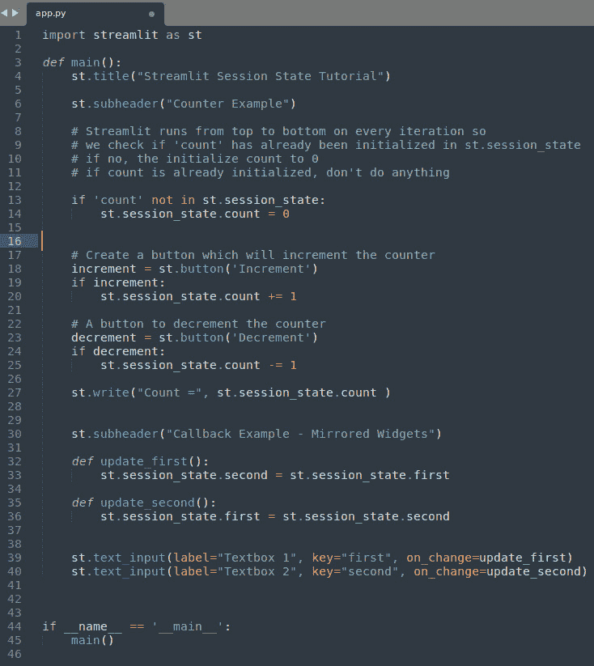

图 15.11：代码中的回调函数

下面是 *图 15.11* 中代码的详细解析：

+   在 *第 32 行*，我们定义了一个名为 `update_first` 的回调函数。这个函数将 `session_state` 小部件中 *第二个* 变量的值更新为始终存储在 `session_state` 小部件中的 *第一个* 变量的值。

+   在 *第 35 行*，我们定义了第二个回调函数，它与第一个完全相同，但会根据 *第二个* 变量的值更新 *第一个* 变量的值。

+   在*第 39 行和 40 行*，我们引入了两个`text_input`小部件。在它们的参数中，像往常一样，我们可以找到标签和键，但这次有一个新内容：`on_change`。

    在这里，当小部件中发生变化（比如插入文本）时，回调函数开始起作用，`update_first`函数在*第 39 行*执行，而`update_second`函数在*第 40 行*执行。

通过这种方式，我们创建了两个具有镜像值的小部件。浏览器中的结果如下：

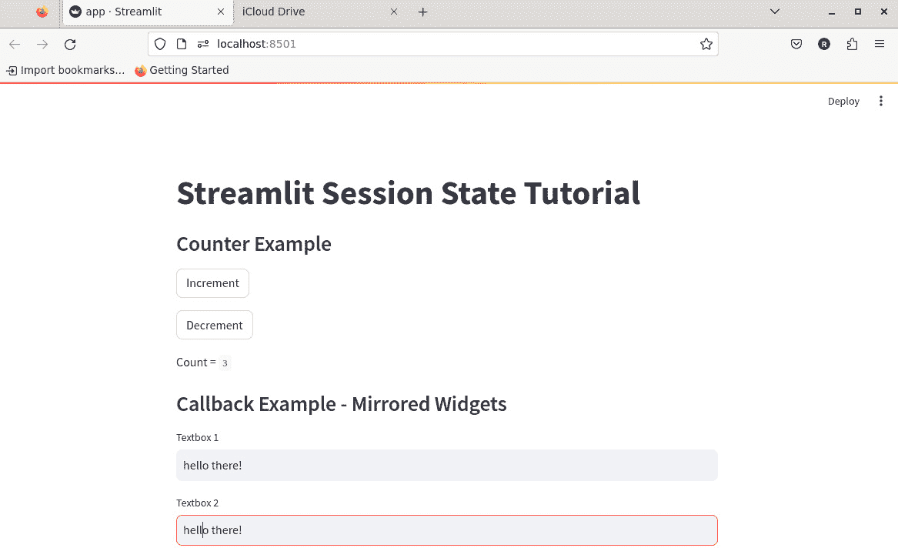

图 15.12：回调操作的结果

如我们所见，每次在第一个输入框中插入文本时，第二个输入框也会被更新，反之亦然。

会话状态可能是 Streamlit 最强大的功能之一。请仔细学习如何利用它。

现在让我们来看一下*自定义子域名*所带来的优势。

# 什么是自定义子域名，它们提供了哪些可能性？

我们已经在 Streamlit Cloud 上部署了两个应用程序：*NLP 应用*和*COVID-19 检测工具*。因此，我们对这个过程非常熟悉，甚至知道如何解决因大文件或需要非常规库而出现的问题。

在我们将应用程序部署到 Community Cloud 后，它会分配一个自动生成的子域名，结构基于我们的 GitHub 仓库。这个子域名是应用程序独有的，用于与他人分享该应用。然而，默认的子域名往往很笨重，并且不太友好。例如，下面这样的子域名可能并不容易记住：

```py
https://streamlit-demo-self-driving-streamlit-app-8jya0g.streamlit.app
```

为了增强共享性和识别度，我们可以选择建立一个自定义子域名。这一自定义使得子域名能够更好地代表我们应用的内容、个人品牌或其他任何偏好方面。自定义 URL 的格式如下：

```py
<your-custom-subdomain>.streamlit.app
```

要定制你应用在 Streamlit Cloud 工作区内的子域名，请按照以下简单步骤操作：

1.  导航至你应用的右侧，点击**︙**溢出菜单，然后选择**设置**：

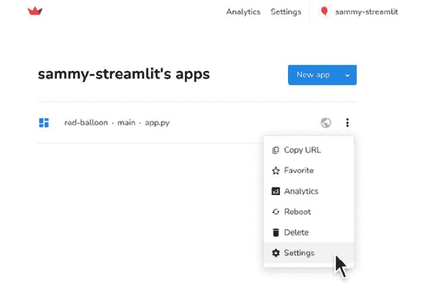

图 15.13：在 Streamlit Cloud 上的部署应用设置

1.  在应用设置模态框中，访问**常规**标签。这里，你会看到你应用的当前唯一子域名。

1.  为你的应用 URL 选择一个长度在`6`到`63`个字符之间的自定义子域名。

1.  点击**保存**以确认：

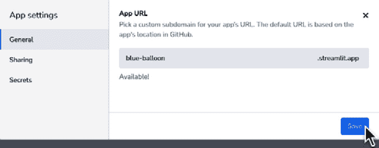

图 15.14：我们应用的新子域名

这个过程既快速又高效。完成后，你的应用将通过新设置的自定义子域名 URL 进行访问。如果所选的自定义子域名不可用（例如已经被使用），系统会显示错误消息，提示你选择其他子域名，下面的截图演示了这一点：

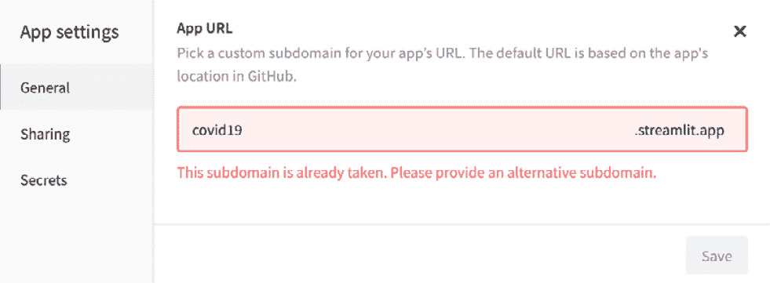

图 15.15：“该子域名已被占用”错误信息

能够选择一个完美符合我们网页应用目标的子域名是一个非常强大的自定义功能。

# 总结

在本章中，我们讨论了一些能够真正提升我们网页应用水平的主题。

首先，我们了解了什么是表单以及如何使用它们，发现将独立的小部件组放入我们的网页应用中会带来很大不同。我们需要做的就是定义这些表单，并在其中包含一些小部件，使用按钮来触发这些小部件。甚至按钮也是可以自定义的，因为它可以放在表单内，也可以放在表单外。

此外，我们还学到了 Session State 是我们手中的一个极其强大的工具。最终，我们可以保存变量的值，这为我们打开了一个令人难以置信的使用场景。而且，借助回调，我们可以决定在用户与小部件交互时该做什么，调用完全自定义的函数，完美契合我们的需求。

最后，通过自定义我们部署的网页应用的子域名，我们实现了两个目标：让它们更容易记住，并为它们增添了一丝专业感！

在接下来的最后一章中，我们将总结我们共同经历的这段长旅程，重点讨论 Streamlit 框架的相关考虑事项，分析重要的收获，并提出一些下一步的建议。
