# 第一章：ArcGIS Pro 功能与术语

在本章中，我们将介绍以下食谱：

+   确定您的计算机能否运行 ArcGIS Pro

+   确定您的 ArcGIS Pro 许可级别

+   打开现有的 ArcGIS Pro 项目

+   打开和导航地图

+   添加和配置图层

+   创建项目

# 简介

ArcGIS Pro 在桌面 GIS 领域迈出了巨大的步伐。这个新的 64 位解决方案使 GIS 专业人士能够充分利用现代计算机硬件，这带来了桌面软件前所未有的性能和功能。它还拥有全新的现代功能区界面。这与我们在 ArcMap 或 ArcCatalog 中习惯的基于工具栏的界面完全不同。虽然对于完全的新用户来说更加直观，但对于现有的 ArcGIS Desktop 用户来说可能有些挑战。

在本章中，您将开始探索 ArcGIS Pro。您首先将确定您的计算机是否有能力运行这款强大的软件。然后您将确定哪些许可级别可供您使用。这很重要，因为它将影响您完成本书中的一些食谱的能力。

然后，您将进入 ArcGIS Pro 的工作环境。您将从学习如何打开现有的 ArcGIS Pro 项目开始。然后您将打开并导航地图。从那里，您将学习添加新图层及其属性配置的方法。

最后，您将学习如何从头开始创建一个新项目。这包括添加新地图和导入 ArcMap 地图文档。

# 确定您的计算机能否运行 ArcGIS Pro

与 32 位的 ArcMap 和 ArcCatalog 应用程序不同，ArcGIS Pro 支持超线程（使用多核心处理器）、图形处理单元以及超过 4 GB 的 RAM。这也意味着 ArcGIS Pro 需要更多的计算机资源来正常运行。

ArcGIS Pro 2.1 的最低要求如下：

+   Windows 64 位操作系统：

    +   Windows 7、8.1 或 10

    +   Windows Server 2008 R2、2012、2012 R2 或 2016

+   超线程双核处理器

+   4 GB RAM

+   32 GB 硬盘空间

+   2 GB 显存

+   Microsoft .NET Framework 4.6.1

+   Microsoft Internet Explorer 11

+   DirectX 11

+   OpenGL 3.3

+   着色器模型 4.1

+   像素着色器 4.0

+   顶点着色器 4.0

请记住，这些都是最低要求。在 ArcGIS Pro 方面，硬件越多越好。一般来说，我建议至少 12 GB 的 RAM、i5 双核处理器以及带有独立 GPU 和内存的独立显卡。对于一整套推荐的硬件规格，你可能需要查看 Packt 出版社的另一本书籍《学习 ArcGIS Pro》。

在这个食谱中，您将学习如何使用系统要求工具来验证您的计算机是否可以运行 ArcGIS Pro。这是一个由 Esri 提供的免费工具。

# 准备工作

为了完成这个食谱，您需要确保您有权访问互联网，并且有足够的权限在您的计算机上安装软件。

# 如何操作...

1.  打开您喜欢的网页浏览器，例如 Google Chrome、Microsoft Internet Explorer 或 Firefox。

1.  访问[`pro.arcgis.com`](http://pro.arcgis.com).

1.  点击以下截图所示的“Get Started”标签：

1.  点击“查看系统要求”中的链接。

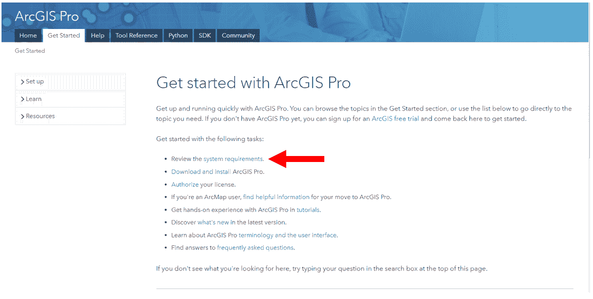

1.  点击页面右侧“本主题”框中的“支持的操作系统”链接。

1.  点击检查您的计算机运行 ArcGIS Pro 2.1 的能力：

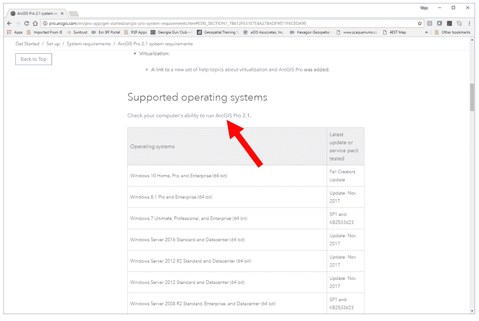

浏览器中应打开一个新标签页，并将其带到由 System Requirements Lab 提供的“Can You RUN It”页面。

1.  点击此处所示的“Can You RUN It”按钮，下载 `Detection.exe` 文件：

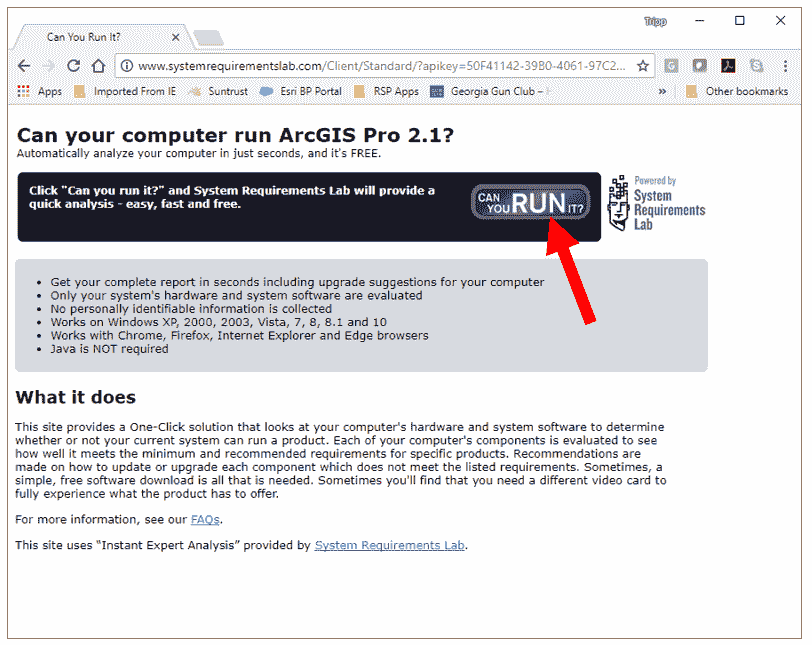

1.  下载完 `Detection.exe` 文件后，单击它以运行文件。此可执行文件将检查您的计算机规格，并生成一份报告，指示您的计算机是否能够运行 ArcGIS Pro。

1.  当硬件检测应用程序完成后，返回您的网页浏览器查看结果。它可能会显示您的系统已通过，类似于以下截图：

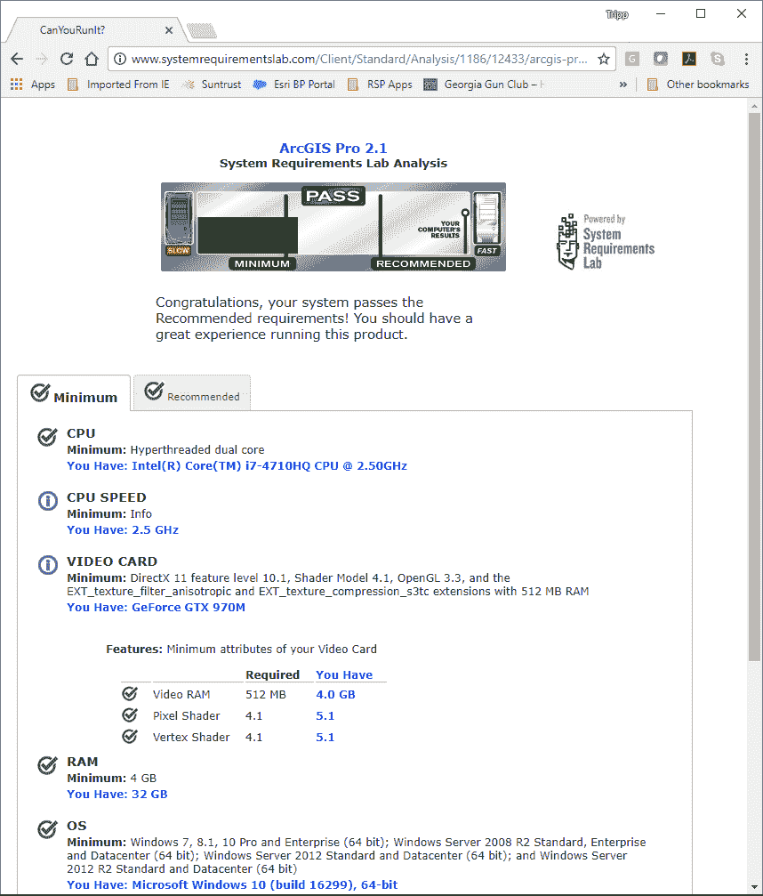

注意，您可以看到您的系统是否满足运行 ArcGIS Pro 的最低和推荐规格。如果您的系统仅满足最低规格，您可能预期 ArcGIS Pro 将运行缓慢，并且需要更频繁地重新启动应用程序。

如果您的系统未通过，您将需要升级报告指示低于所需规格的组件或软件。这可能只是更新您的驱动程序或 Internet Explorer。如果您的 CPU、RAM 或显卡未能满足最低要求，可能需要您购买新的硬件。

如果您的系统满足或超过系统要求，您可以下载并安装 ArcGIS Pro。请参阅位于 [`pro.arcgis.com/en/pro-app/get-started/install-and-sign-in-to-arcgis-pro.htm`](http://pro.arcgis.com/en/pro-app/get-started/install-and-sign-in-to-arcgis-pro.htm) 的安装说明。

# 它是如何工作的...

ArcGIS Pro 运行有效必须满足非常具体的要求。在这个菜谱中，您下载并使用了 Esri 提供的工具来验证您的系统是否满足或超过了这些要求。此工具检查了成功运行 ArcGIS Pro 所需的硬件和软件依赖项，并提供了一份详细的报告，让您确信您的计算机是否具备所需的性能。

# 确定您的 ArcGIS Pro 许可级别

ArcGIS Pro 有三个不同的许可级别：基本、标准和高级。许可级别决定了用户可用的功能级别。基本功能最少，高级功能最多，标准功能介于两者之间。

通常，基本许可允许您可视化 GIS 数据，制作地图，执行简单的数据编辑，以及进行基本的 GIS 数据分析。标准许可在基本许可的基础上增加了更多高级编辑和数据验证工具。高级许可通过添加更多数据分析工具，扩展了基本和标准许可的功能。要查看 ArcGIS Pro 每个许可级别的完整功能列表，请访问[`pro.arcgis.com/en/pro-app/get-started/license-levels.htm`](http://pro.arcgis.com/en/pro-app/get-started/license-levels.htm)。

了解您正在使用的许可级别非常重要，这样您就知道您可以使用哪些功能。本书中的一些食谱可能需要标准或高级许可。在本食谱中，您将学习如何确定您的 ArcGIS Pro 许可级别。

# 准备工作

您需要确保您已成功安装 ArcGIS Pro 2.0 或更高版本。如果您尚未安装 ArcGIS Pro，请参阅[`pro.arcgis.com/en/pro-app/get-started/install-and-sign-in-to-arcgis-pro.htm`](http://pro.arcgis.com/en/pro-app/get-started/install-and-sign-in-to-arcgis-pro.htm)以获取安装说明。

# 如何操作...

1.  前往屏幕左下角的 Windows 开始按钮。

1.  滚动到 ArcGIS 程序组并点击 ArcGIS Pro：

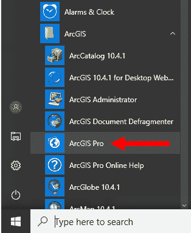

根据您正在运行的 Windows 版本，您的 Windows 开始按钮和显示可能略有不同。您可能还需要点击“所有程序”以查看 ArcGIS 程序组。如果您右键单击 ArcGIS Pro 图标，可以选择将其添加到您显示器底部的任务栏。这使得启动 ArcGIS Pro 更快、更简单。

1.  弧度 GIS Pro 的启动窗口将出现。点击启动窗口左下角的“关于 ArcGIS Pro”。

1.  在“关于 ArcGIS Pro”窗口中，选择左侧的“许可”选项。这将显示您的 ArcGIS Pro 许可信息：

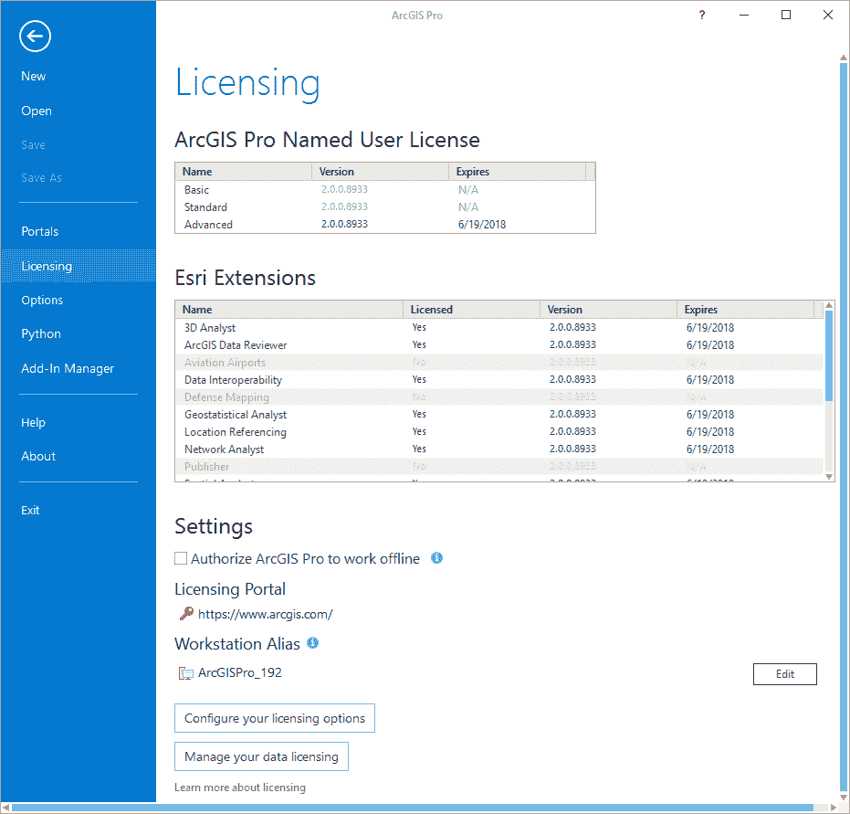

如果您已经打开了一个 ArcGIS Pro 项目，您可以从项目窗格访问此相同信息。

在许可窗口的顶部，您将看到您被分配的许可级别。如图所示，我有访问高级许可级别的权限。从这里，您还可以查看您有权访问哪些扩展。扩展是 ArcGIS Pro 的附加组件，提供额外的功能，通常专注于特定的用途，如 3D 分析或网络分析。同样，在图中，您可以看到我有访问几个扩展的权限：

**问题**：您被分配了哪个许可级别，基本、标准还是高级？

**答案**:

**问题**：您是否有访问任何扩展，如果有，是哪些？

**答案**:

1.  一旦你确定了你可以访问的许可证级别，如果你不继续到下一个食谱，你可以关闭 ArcGIS Pro。如果你继续，请保持 ArcGIS Pro 打开。

# 它是如何工作的...

在本食谱中，你学习了如何确定你能够访问的 ArcGIS Pro 许可证级别。你是通过从 ArcGIS Pro 启动窗口转到“关于 ArcGIS Pro”窗口来做到这一点的。从那里，你通过点击左侧的“许可证”选项来访问你的许可证级别信息。

许可证级别很重要，因为它决定了你在程序中可以访问哪些功能。正如你将在本书中看到的那样，一些食谱将要求你访问更高级别的许可证。

# 更多...

许可证窗口允许你做的不仅仅是查看分配给你的许可证级别和扩展。它还允许你确定你想要使用的 ArcGIS Pro 许可证类型，检查出用于现场使用的许可证，等等。

ArcGIS Pro 支持三种基本的许可类型：单用户、并发用户和命名用户。命名用户是默认选项，需要你在组织的 ArcGIS Online 或 ArcGIS Portal 中拥有用户名和密码。单用户许可证是传统的软件许可证，软件仅许可给一台计算机。并发许可证有时被称为网络许可证。这些许可证使用许可证管理器，通常安装在服务器上，并控制同时运行软件的用户数量。要了解更多关于 ArcGIS Pro 支持的许可证类型，请访问[`pro.arcgis.com/en/pro-app/get-started/licensing-arcgis-pro.htm`](http://pro.arcgis.com/en/pro-app/get-started/licensing-arcgis-pro.htm)。

# 打开现有的 ArcGIS Pro 项目

ArcGIS Pro 使用具有`.aprx`文件扩展名的项目文件。项目存储 2D 地图、3D 场景、数据库连接、文件夹连接、自定义工具箱等。当你启动 ArcGIS Pro 时，你必须打开一个项目。

在本食谱中，你将学习如何打开现有项目。在本章的后面部分，你将学习如何创建新项目。

# 准备工作

要完成本食谱，你需要确保你已经下载并安装了与本书相关的数据。如果你遵循了安装说明，数据和项目应该位于`C:\Student\ArcGISProCookbook`。你还需要访问互联网。你还需要安装 ArcGIS Pro 2.1 或更高版本。本食谱可以使用 ArcGIS Pro 的任何许可证级别完成：基本、标准或高级。

# 如何做...

1.  如果你在上一个食谱的结尾关闭了 ArcGIS Pro，请打开 ArcGIS Pro。如果你仍然有 ArcGIS Pro 打开，请点击位于“关于 ArcGIS Pro”窗口左上角的返回箭头。

1.  在 ArcGIS Pro 启动窗口中，点击“打开另一个项目”，如图所示：

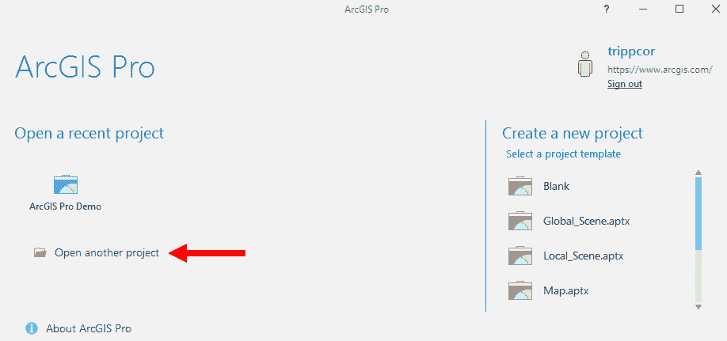

1.  点击看起来像文件文件夹的“浏览”按钮。

1.  在左侧面板的“计算机”下，选择 C:\。

如果在左侧面板中“计算机”下没有看到任何内容，请点击小箭头。这将展开计算机的内容，因此您应该看到 C:\ 驱动器。

如果您将书籍数据安装到另一个驱动器，请选择包含书籍数据的驱动器。

1.  在右侧面板中，向下滚动直到您看到“学生”文件夹，然后双击它。

1.  双击“ArcGISProCookbook”文件夹。

1.  双击“Chapter1”文件夹。

1.  选择“Chapter 1 Ex 1.aprx”文件夹并点击“确定”。

您现在已打开了您的第一个 ArcGIS Pro 项目。如果它成功打开，ArcGIS Pro 应该看起来类似于以下内容：

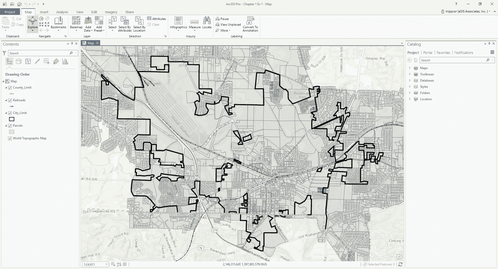

# 它是如何工作的...

在您开始使用 ArcGIS Pro 之前，您必须首先打开一个项目。要打开项目，您必须导航到其存储位置。在这个菜谱中，如果您在默认位置安装了数据，项目存储在您的计算机的 `C:\` 驱动器的一系列文件夹中，因此完整路径是 `C:\Student\ArcGISProCookbook\Chapter1`。您可以通过导航到该位置来访问此项目。

项目可以保存在您的本地计算机或网络服务器上。您还可以将项目保存到外部和闪存驱动器。如果您在这些设备上保存并尝试访问项目，可能会遇到问题，因为数据传输速度较慢。

# 还有更多...

如果您想打开另一个项目，不需要关闭 ArcGIS Pro。ArcGIS Pro 不允许您在已经打开项目的情况下打开另一个项目。这将关闭当前项目并打开您选择的项目。要执行此操作，请按照以下步骤进行。

1.  点击 ArcGIS Pro 界面顶部的快速访问工具栏上的“打开”按钮，如图所示：

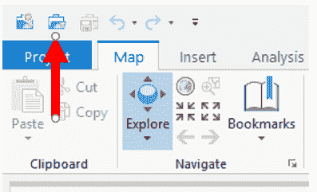

1.  在出现的“打开项目”窗口中，使用与打开当前项目相同的方法导航到 `C:\Student\ArcGISProCookbook\Chapter1`。

1.  选择“Chapter 1 Ex 1A.aprx”文件并点击“确定”。

您最初打开的项目现在应该已关闭，并打开了一个新的项目，其外观类似于以下内容：

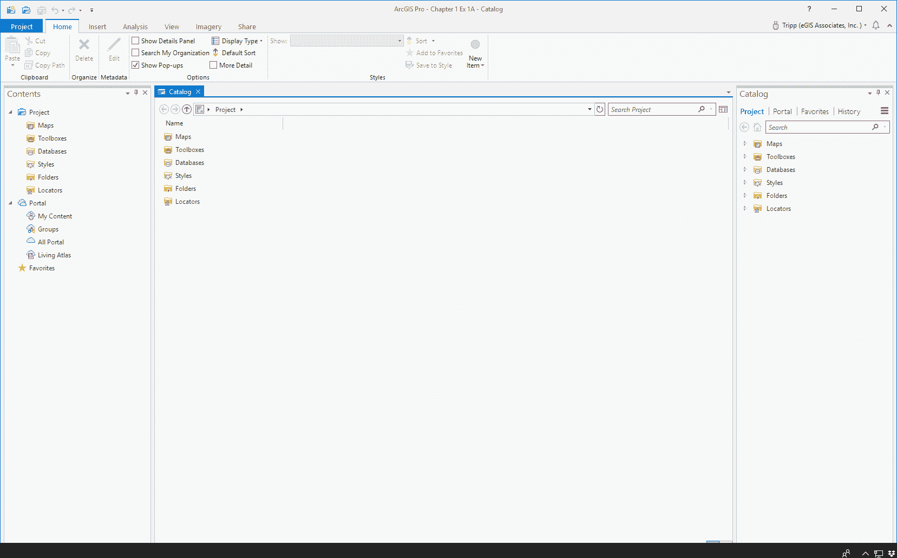

您现在已使用两种不同的方法在 ArcGIS Pro 中打开了两个项目。您会发现，在使用 ArcGIS Pro 时，通常至少有两种方法可以完成任何任务。通常还有更多。

1.  如果您不继续到下一个菜谱，请关闭 ArcGIS Pro 而不保存项目。

您还可以使用 *Ctrl* + *O* 作为快捷键打开新项目。*Ctrl*+*S* 作为保存项目的快捷键，*Ctrl*+*N* 作为创建新项目的快捷键。

# 打开和导航地图

现在您已经学会了如何打开现有的项目，是时候学习如何打开项目内存储的地图了。项目可以包含二维地图、三维场景、数据连接、布局、样式、工具箱等等。然而，二维地图仍然是 GIS 专业人员工作的主要画布。

在这个菜谱中，您将学习如何打开现有的二维地图。一旦打开，您将学习如何在地图内导航。

# 准备工作

如果您已成功完成所有之前的菜谱，您不需要做任何更多的事情来继续这个菜谱。如果您尚未完成本章中的其他菜谱，您在开始这个菜谱之前需要完成它们。

# 如何操作...

1.  如果您在上一道菜谱结束时关闭了 ArcGIS Pro，请启动它并打开位于 `C:\Student\ArcGISProCookbook\Chapter1` 的第一章 Ex 1A 项目。

如果您不记得如何操作，请参考之前的菜谱或单击最近打开的项目列表中的项目名称。

1.  在 ArcGIS Pro 界面右侧的目录窗格中，通过点击“地图”一词左侧的小箭头展开“地图”文件夹。

如果目录窗格没有打开，请检查它是否未设置为自动隐藏。如果是，您将在右侧看到一个名为“目录”的小标签。只需单击标签即可使目录窗格打开。如果您已关闭目录窗格，请单击功能区中的“视图”选项卡。然后单击“目录”下方的小箭头并选择“目录窗格”。

1.  右键单击地图并选择“打开”，如图所示：

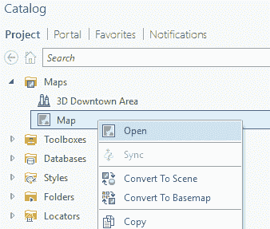

您刚刚打开了一个现有的项目地图。一个项目可以包含多个地图，这些地图可以是二维或三维的。三维地图被称为场景。现在您将学习如何在地图内导航。

1.  单击功能区中的“地图”选项卡。

1.  在功能区地图选项卡的导航工具组中单击“探索”工具。

探索工具是万能的。它允许您平移、缩放并访问地图中要素的数据。对于使用过 ArcMap 的人来说，探索工具取代了识别、放大、缩小和平移工具。

1.  将鼠标指针移至地图上，然后滚动鼠标滚轮远离自己以放大地图。当你放大到所需的缩放比例时停止。

1.  现在将鼠标滚轮向相反方向滚动以缩小地图。当你缩小到所需的缩放比例时停止。

1.  要返回地图的全范围，请单击功能区地图选项卡导航组中的“全范围”按钮，如图所示：

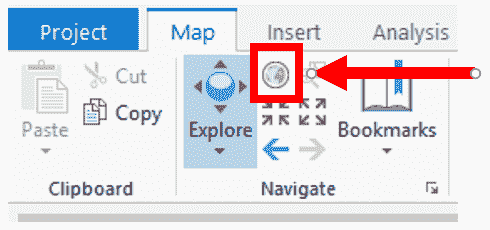

1.  在功能区地图选项卡的导航组中单击“书签”。

1.  从出现的窗口中选择华盛顿公园。这将使您在地图中放大到预定义的区域，该区域专注于华盛顿公园。您的地图现在应该看起来类似于以下：

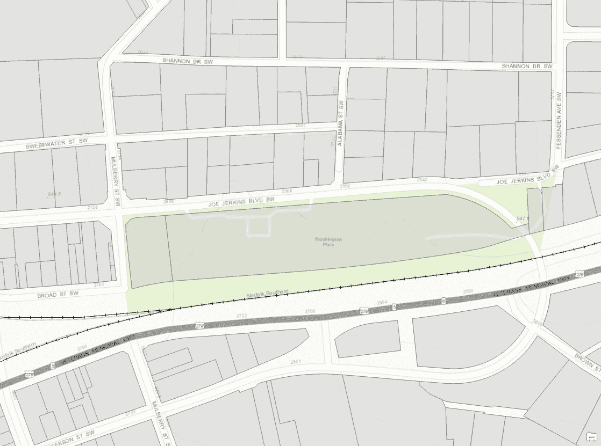

1.  现在你想要更靠近地缩放到华盛顿公园北边的区块。再次选择探索工具。

1.  按住你的*Shift*键，并在 Mulberry ST SW 和 Sweetwater ST SW 的交汇处附近点击。继续按住*Shift*键，并拖动你的鼠标指针到东南方向，直到你到达 Alabama St SW 和 Joe Jerkins Blvd SW 的交汇处。当你拖动鼠标时，你应该在地图上看到一个虚线矩形框出现。这代表了你想要缩放的区域。一旦你创建了一个看起来与以下图像相似的框，释放*Shift*键和鼠标按钮：

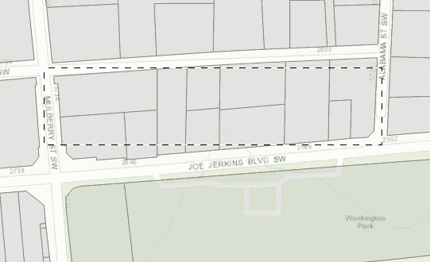

1.  确保探索工具在地图选项卡中仍然处于活动状态。

1.  在地图中，点击你刚刚缩放的区块中最西北角的土地。

**问题**：当你点击这个土地时会发生什么？

**答案**：

如果你仔细查看出现的信息窗口，你会注意到它显示的是城市界限的信息，而不是土地。你需要调整探索工具的设置。

1.  通过点击位于右上角的小 X 来关闭信息窗口。

1.  点击探索工具下方的箭头，并选择“可见图层”。

1.  再次点击相同的土地。

1.  在信息窗口的左下角，查看正在识别的要素数量。它应该显示 1/2。

1.  点击位于数字 2 旁边的箭头。这将显示你点击的土地的信息，而不是城市界限。

1.  完成后关闭信息窗口。

1.  尝试点击地图中的其他功能，并使用与探索工具相关的一些其他选项，看看它们是如何工作的。

1.  点击“全图范围”按钮返回到地图的全范围。

1.  通过点击快速访问工具栏中的“保存项目”按钮来保存你的项目。

# 它是如何工作的...

在这个菜谱中，你通过打开上一个菜谱中打开的项目中包含的现有地图来开始探索项目的内容。一旦你从那个目录窗格中打开了地图，你就开始使用探索工具在地图内导航。你使用探索工具首先在地图内缩放和放大。然后，你使用“全图范围”按钮返回到地图视图的全范围。接下来，你使用书签缩放到地图中的华盛顿公园。从那里，你使用探索工具和*Shift*键以及鼠标的组合缩放到一个更具体的区域。

一旦你缩放到你感兴趣的区块，你使用探索工具检索有关特定土地的信息。

# 添加和配置图层

现在你已经知道如何启动 ArcGIS Pro 并打开一个项目，以便你可以开始访问功能。你已经学会了如何打开现有的地图并在地图内导航。你甚至可以使用探索工具查看地图中显示的要素信息。

但这些图层是如何添加到地图中的？ArcGIS Pro 是如何知道如何在地图中显示你所看到的图层的？这是你在 ArcGIS Pro 旅程中的下一步。

在这个菜谱中，你将学习向地图添加新图层的各种方法。然后，你将发现如何配置与图层相关的各种属性，例如其名称和符号。

# 准备工作

如果你已经完成了之前的菜谱，你应该准备好进行这个菜谱。如果你还没有完成，你需要先完成它们。这个菜谱建立在之前的菜谱之上。

# 如何做到这一点...

1.  启动 ArcGIS Pro 并打开 `Chapter 1 Ex 1A.aprx` 项目，如果你在上一个菜谱的结尾关闭了 ArcGIS Pro。

1.  如果地图尚未打开，请打开名为“Map”的地图。

如果你不确定如何打开地图，你应该参考之前的练习。

如你所见，这是一张非常简单的地图。你可能想要添加一些新的图层来显示更多信息。

1.  点击“添加数据”按钮。不要点击文字“添加数据”。你想要点击文字上方的图标。

1.  在“添加数据”对话框的左侧窗口中，如果你没有看到以下图像中的内容，请单击左侧的箭头以展开“项目”。

1.  双击“数据库”以在对话框右侧的窗口中看到两个数据库：Chapter 1 Ex 1 和 Trippville_GIS 地理数据库：

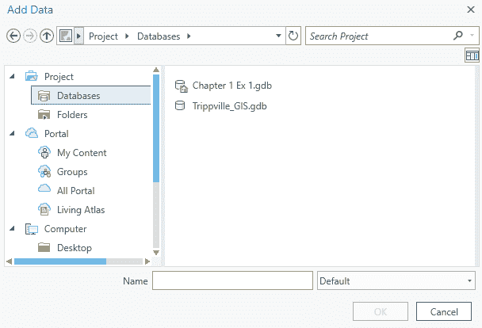

1.  双击 Trippville_GIS 地理数据库以显示其内容。

1.  双击“基础特征数据集”。

1.  选择 Buildings 特征类。

1.  按住 *Ctrl* 键，单击 Natwtr_Body 和 Natwtr_Stream 特征类。

1.  一旦你选择了这三个特征类，请单击“确定”将它们作为三个新图层添加到你的地图中。

你刚刚使用“添加数据”按钮添加了三个新图层到你的地图。这只是你可以用来向地图添加新图层的好几种方法之一。你将在本菜谱的后面使用其他一些方法。现在，你将调整与你刚刚添加的图层相关的一些属性。

当你在 ArcGIS Pro 中向地图添加一个新图层时，软件将使用随机颜色显示该新图层。此外，它将根据图层的类型自动将新图层添加到你的地图内容中。点图层将被添加到顶部。线图层将被添加到点图层下方。多边形图层将被添加到线图层下方。栅格图层被添加到多边形下方，基础地图被放置在最底部。在地图中，绘图顺序从列表底部的图层开始，并在上一图层之上绘制每个后续图层，因此最后绘制的图层是列表顶部的图层。

1.  右键单击你刚刚添加到地图中的 Natwtr_Stream 图层，并选择菜单底部的“属性”。

1.  点击对话框左侧窗口中的选项列表。查看您可以从此对话框配置的一些图层属性。您将在执行配方时对这些属性进行一些调整。

1.  在图层属性对话框中，从左侧窗口选择“常规”。

1.  在“名称”下方位于 Natwtr_Stream 的单元格中，将其替换为“溪流和小溪”。

1.  点击左侧窗口中的“元数据”。

1.  按照截图所示，在元数据中输入以下值：

    +   标题：`溪流和小溪`

    +   标签：`自然水体，溪流，小溪`

    +   摘要：`Trippville 市内的溪流和小溪`

    +   描述：`此图层显示了 Trippville 市及其周边大部分溪流和河流的总体位置。`

    +   来源：`eGIS Associates, Inc.`

    +   使用限制：`此数据仅用于培训`

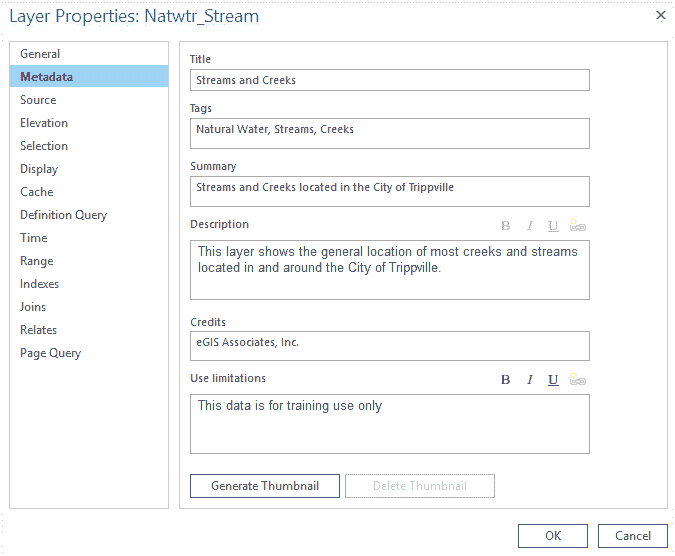

您的图层属性窗口现在应该看起来与前面的截图相似。

1.  点击“确定”以应用您对 Natwtr_Stream 图层属性所做的更改。

1.  使用以下值重复此过程，以更新 Natwtr_Body 图层添加后的属性。完成操作后，请记住点击“确定”：

    +   常规：名称：`湖泊和池塘`

    +   元数据：

        +   标题：`湖泊和池塘`

        +   标签：`自然水体，湖泊，池塘`

        +   摘要：`` `Trippville 市内的湖泊和池塘` ``

        +   描述：`此图层显示了 Trippville 市及其周边大部分湖泊和池塘的总体位置。`

        +   来源：`eGIS Associates, Inc.`

        +   使用限制：`此数据仅用于培训`

现在，您将溪流和小溪图层移动到湖泊和池塘图层下方。

1.  在内容窗格中选择“溪流和小溪”图层。

1.  按住鼠标左键，将图层拖动到湖泊和池塘图层下方。完成操作后，您的内容窗格应该类似于以下图片。记住，您的颜色可能不同：

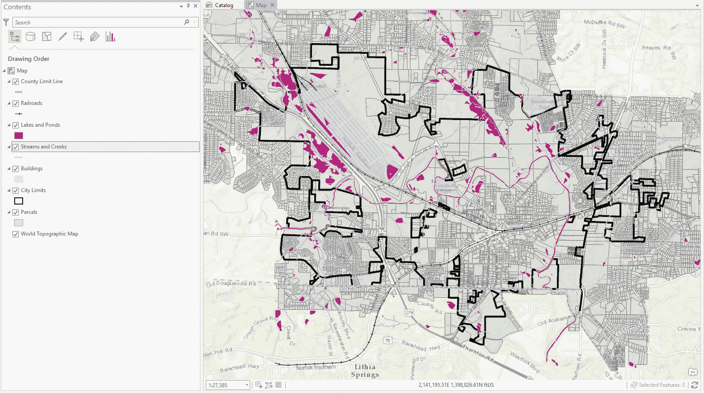

1.  点击湖泊和池塘图层下方的符号修补，以便调整符号设置。

1.  符号面板将在界面右侧打开。确保您正在查看图库，并在搜索框中输入 lake：

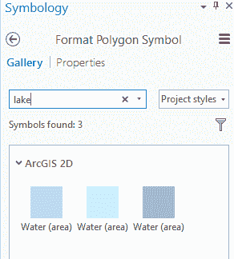

1.  选择一个提供的符号。任何符号都适用。

1.  点击位于符号面板中“图库”旁边的“属性”选项卡，如图所示：

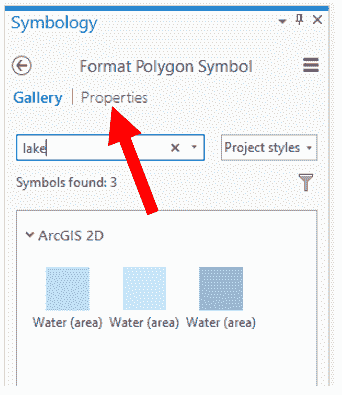

1.  点击轮廓颜色下拉箭头，从提供的调色板中选择克里特蓝。

1.  将轮廓宽度设置为 1 点，如图所示：

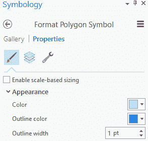

1.  点击符号面板底部的“应用”。

1.  按照同样的步骤，点击溪流和小溪图层的符号修补。

1.  在图库中搜索“Stream”并选择应显示的“Water (Line)”符号。

你的地图现在应该看起来像这样。Building 图层的颜色可能不同，具体取决于你在添加图层时 ArcGIS Pro 分配的颜色：

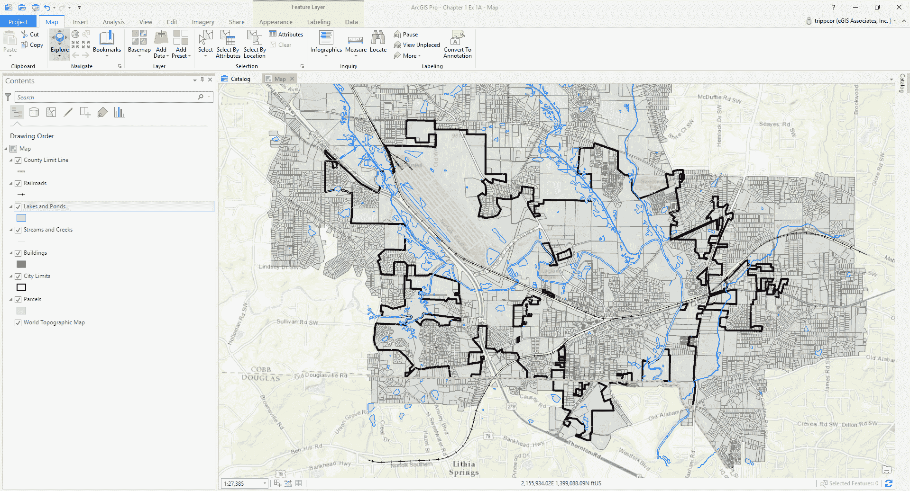

1.  现在将更改建筑物的符号，以便你可以确定类型。在内容窗格中选择 Buildings 图层。

1.  在功能区特征层上下文菜单中，选择“外观”选项卡。

1.  点击位于符号按钮下方的小箭头。

1.  从提供的菜单中选择“唯一值”。

1.  符号窗格将再次打开，但外观可能略有不同。在字段 1 旁边，点击下拉菜单并选择 Building Type。

1.  点击“配色方案”并选择一个所需的配色方案，例如基本随机。注意，内容窗格中 Buildings 图层的符号已更改，以反映你新的符号设置。

1.  关闭符号窗格。

1.  在内容窗格中右键单击 Buildings 图层并选择“缩放到图层”。你现在可以看到每个建筑物的类型，如下面的截图所示。你的建筑物可能根据你选择的配色方案以不同的颜色显示：

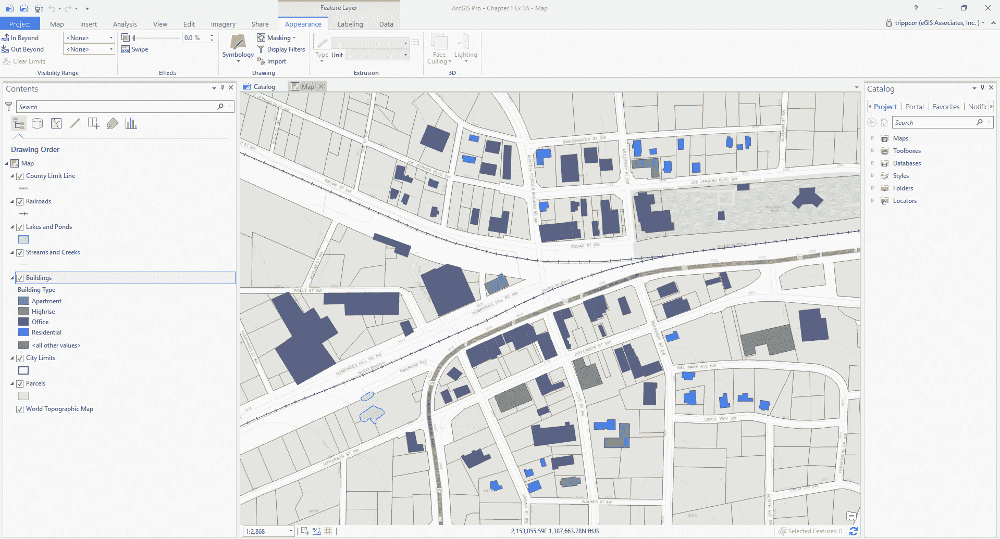

1.  通过点击功能区中的“项目”选项卡并选择“保存”来保存你的项目。

建议你经常保存项目。这有助于防止 ArcGIS Pro 或你的系统出现问题时丢失工作。

1.  在目录窗格中，通过点击左侧的小箭头展开数据库文件夹。

如果你意外关闭了目录窗格或内容窗格，请点击功能区中的“视图”选项卡以重新打开它们。

1.  展开 Trippville_GIS 地库的内容。

1.  右键单击 Power_Poles 特征类并选择“添加到当前地图”：

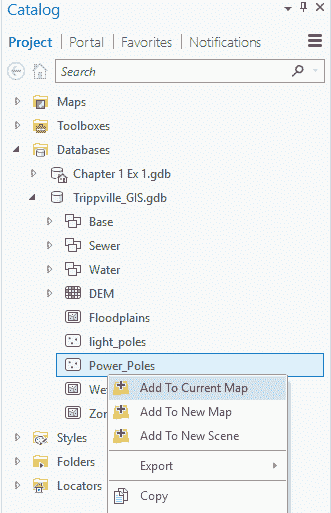

1.  Power Poles 图层已添加到你的地图中。在图层名称下右键单击符号以显示调色板。

1.  从调色板中选择 Mars Red 以更改 Power Poles 图层符号的颜色。你的地图现在应该看起来类似于这个：

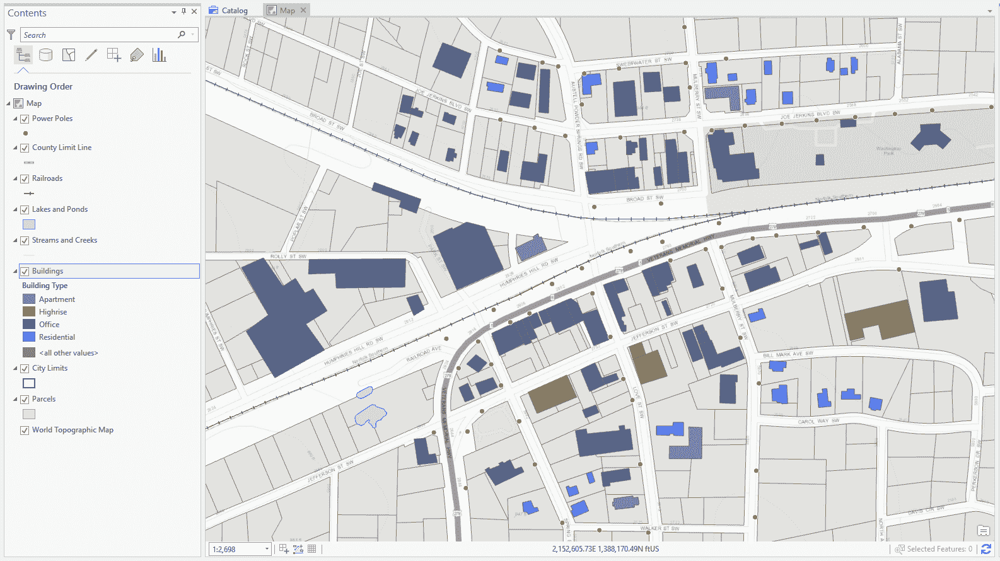

1.  点击功能区中的“共享”选项卡。

1.  在“共享”选项卡的“另存为”组中选择“地图文件”。

1.  在“另存为 MAPX 文件”窗口的左侧选择 C:\。

1.  如有必要，向下滚动并双击 Student 文件夹。

1.  双击 ArcGISProCookbook 文件夹。

1.  双击 MyProjects 文件夹。

1.  在“另存为 MAPX 文件”窗口底部的“名称”单元格中输入 TrippvilleBuildingTypeMap 并点击“保存”。

你刚刚创建了一个地图文件，这将允许你快速轻松地将此地图添加到其他项目中。你将在下一个菜谱中使用此文件。

1.  关闭 ArcGIS Pro 并在需要时保存你的项目。

# 它是如何工作的...

在这个菜谱中，你首先向地图添加了新的图层。你使用添加数据按钮一次性添加了多个图层。一旦添加了新图层，你就开始调整它们的属性，以便在地图中更有用。首先，你使用比与地理数据库中要素类原始关联的名称更具描述性和可理解性的名称重命名了图层。然后，你更新了图层的元数据，以便使用地图的其他人能够更好地理解其目的。

在更新了你添加的图层的一些基本属性之后，你开始调整符号化，以便地图更容易阅读。你将河流、溪流、湖泊和池塘层的颜色设置为蓝色，以便它们看起来像它们所代表的特征，此外，人们习惯于在地图上以这种方式看到它们。你通过单击位于每个图层下方的符号补丁并更改符号化面板中的符号属性来执行这些调整。

建筑层需要更多的努力，因为你需要更改符号化，以便在地图中区分每种建筑类型。这要求你基于存储在建筑层属性表中的字段中的建筑属性来设置符号化。为此，你转到外观选项卡并选择了唯一值符号化。然后，你配置这种符号化类型以使用来自属性表的图层“建筑类型”字段。一旦将符号化类型指向该字段，它就会自动为找到的每种建筑类型创建一个唯一的符号。在这种情况下，它创建了一个独特的符号，允许你确定建筑类型（例如，房屋或公寓）。

你通过在地理数据库中的要素类上右键单击并在当前地图中添加它，从目录面板添加了电力杆层。然后，你通过右键单击符号并从提供的调色板中选择火星红来调整电力杆符号的颜色。

最后，你基于你制作的地图创建了一个地图文件，这样你就可以快速轻松地将地图添加到其他项目中。该地图将包含你刚刚配置的所有图层属性和设置，因此你不需要再次经历这个过程。

# 创建项目

我们已经多次提到，在能够访问 ArcGIS Pro 中包含的功能之前，你必须首先打开一个项目。你在之前的菜谱中已经体验到了这一点，当时你打开并处理了现有项目。这些项目已经配置好，包含多个项目项，包括地图和数据库连接。这些项目是如何创建的？

在这个菜谱中，你将使用 ArcGIS Pro 中包含的四个项目模板之一创建一个新的项目。你将看到 ArcGIS Pro 在创建新项目时创建的结构。

# 准备工作

要完成这个菜谱，您只需确保您已安装 ArcGIS Pro，有访问许可证，并且已下载并安装了本书的数据。这个菜谱甚至不需要您完成之前的菜谱，尽管这可能有助于更好地理解您正在做什么。

# 如何操作...

1.  启动 ArcGIS Pro。

1.  当 ArcGIS Pro 启动窗口出现时，在右侧的“创建新项目”中选择“空白模板”：

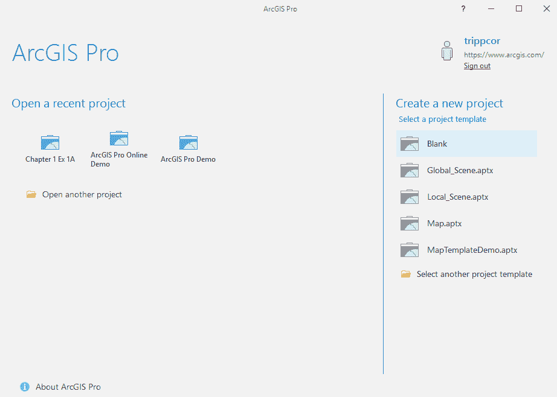

1.  在“名称”单元格中，将您的新项目命名为`%your name%Chapter1NewProject`（例如`TrippChapter1Newproject`）。

1.  点击位于“位置”单元格旁边的浏览按钮。它看起来像一个小文件文件夹，带有一个蓝色箭头。

1.  在“计算机”下，点击 C:\驱动器。

1.  滚动并双击“学生”文件夹。

1.  双击“ArcGISProCookbook”文件夹。

1.  选择“我的项目”文件夹并点击“确定”。不要双击它。

1.  确认您的“创建新项目”对话框窗口看起来像这样，除了名称将包含您的姓名：

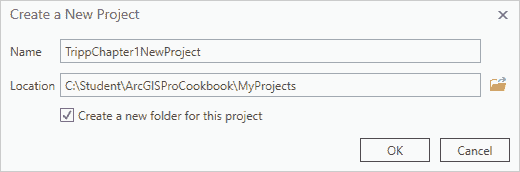

1.  一旦您确认已正确输入所有内容，请点击“确定”。

您现在已使用空白模板在 ArcGIS Pro 中创建了第一个新项目。这创建了一个全新的项目。该项目包含您在项目中找到的最小数量的项目。您现在可以开始探索您的新项目。

1.  在目录窗格中展开“工具箱”文件夹。

**问题**：您在这个文件夹中看到了什么？

**答案**：

1.  在目录窗格中展开“数据库”文件夹。

**问题**：您在这个文件夹中看到了什么？

**答案**：

1.  展开项目中的其他文件夹。

**问题**：您注意到您的新项目中缺少了什么？

**答案**：

您应该已经注意到，您的新项目中包含一个单独的自定义工具箱和与项目同名的文件地理数据库。这些是在您创建新项目时由 ArcGIS Pro 自动创建的。您也应该注意到，默认情况下还自动连接了几个样式和定位器。

地理数据库有三种基本类型：个人、文件和 SDE。ArcGIS Pro 仅支持文件和 SDE 地理数据库。它不支持个人地理数据库。要了解更多关于地理数据库的信息，请访问[`pro.arcgis.com/en/pro-app/help/data/geodatabases/overview/what-is-a-geodatabase-.htm`](http://pro.arcgis.com/en/pro-app/help/data/geodatabases/overview/what-is-a-geodatabase-.htm)。

这个新项目缺少几个关键元素，您需要它们来执行任何 GIS 工作。首先，它缺少一张地图。其次，如果您展开与项目连接的地理数据库，您会发现它是空的。因此，您还需要数据。现在，您将连接到一个现有的地理数据库，然后添加一张地图。

1.  在目录窗格中右键单击“数据库”文件夹，然后选择“添加数据库”：

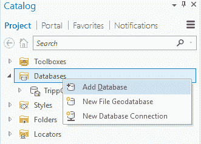

1.  在出现的“选择现有地理数据库”窗口的左侧区域点击计算机下的 C:\：

1.  滚动并双击 Student 文件夹。

1.  然后双击 ArcGISProCookbook 和 Databases。

1.  选择 Trippville_GIS.gdb 并点击确定。不要双击 Trippville_GIS 地理数据库。

1.  右键点击你刚刚添加到项目中的 Trippville_GIS.gdb，并选择添加到新项目，如图所示：

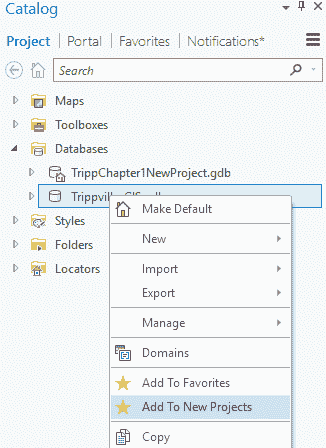

你刚刚添加了一个连接到你在其他菜谱中使用的 Trippville GIS 地理数据库。在那其中，数据库连接已经建立。现在你知道是如何做到的。一旦添加了连接，然后将其添加到你的收藏夹中，并设置它将自动添加到你创建的任何新项目中。

你仍然需要添加一个地图。你可以用与上一个菜谱相同的方式来做。然而，在这个菜谱中，你将导入你在上一个菜谱中创建的地图文件。

1.  点击功能区中的插入选项卡：

1.  在功能区插入选项卡的项目组中点击导入地图工具：

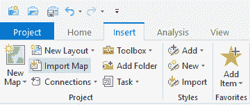

1.  使用添加数据库连接的相同过程，导航到`C:\Student\ArcGISProCookbook\MyProjects`文件夹。

1.  选择 TrippvilleBuildingTypeMap.mapx 文件并点击确定。

如果你没有完成上一个菜谱，你可以导航到`C:\Student\ArcGISProCookbook\Chapter1`并选择 Chapter1Ex1AResults.mapx 文件。

现在应该有一个看起来熟悉的地图被添加到你的项目中。它包含了你在上一个菜谱中创建的所有图层，以及你配置的符号和属性。

1.  使用*Ctrl*+*S*快捷键保存你的项目。

# 它是如何工作的...

在这个菜谱中，你创建了你的第一个新项目。你使用了空白模板，它为 ArcGIS Pro 创建了一个非常基础的项目。使用空白模板创建的项目包括连接到具有与项目相同名称的自定义工具箱和地理数据库，以及几个样式和定位器。工具箱和地理数据库在创建新项目时由 ArcGIS Pro 自动创建。它们都是空的，目的是让你将项目特定的项目保存到它们中。然而，在大多数情况下，你的组织已经有一个建立的 GIS 数据库。

一旦你创建了项目，你添加了一个连接到现有的地理数据库 Trippville_GIS。这个数据库包含了你在其他菜谱中使用的三普维尔市的 GIS 数据。实际上，这是你将在本书剩余部分使用的主要数据库。所以，你将其添加到你的收藏夹中，并设置为自动添加到你创建的所有新项目中。

在您建立了与主地理数据库的连接之后，您导入了一个新地图。这个新地图是基于您在先前的菜谱中创建的地图文件。新地图已添加了已添加的图层及其配置好的属性，为您节省了大量精力。

# 更多...

在上一个菜谱中，您使用空白模板创建了一个新项目。如您所见，此模板自动创建了项目结构，包括项目地理数据库、自定义工具箱等。空白模板不是 ArcGIS Pro 中包含的唯一模板。在创建新项目时，您还可以使用其他几个模板。让我们快速了解一下它们。

# ArcGIS Pro 库存项目模板

当您创建新项目时，您可能已经注意到了，ArcGIS Pro 还包括三个其他项目模板：全球场景、本地场景和地图。每个模板都将创建略微不同的项目：

| **名称** | **描述** | **创建的项目项** |
| --- | --- | --- |
| 地图 | 创建一个新项目，该项目自动包含一个新的 2D 地图 |

+   项目工具箱

+   项目文件地理数据库

+   项目地图地理数据库

+   2D 地图

|

| 本地场景 | 创建一个新项目，该项目自动包含一个新的本地 3D 地图 |
| --- | --- |

+   项目工具箱

+   项目文件地理数据库

+   项目场景地理数据库

+   3D 本地场景

|

| 全球场景 | 创建一个新项目，该项目自动包含一个新的全球 3D 地图，类似于您第一次打开 Google Earth 时所体验到的 |

当您第一次打开它时所体验到的 Google Earth |

+   项目工具箱

+   项目文件地理数据库

+   项目场景地理数据库

+   3D 全球场景

|

此外，根据所选的新项目模板，还将连接到标准样式、定位器和任何设置为添加到新项目的收藏夹，添加到创建的项目中。

使用您在前面菜谱中学到的技能，尝试使用除空白模板之外的其他模板创建一个新项目。看看它们之间有何不同。
