# 第二章：创建和存储数据

在本章中，我们将介绍以下菜谱：

+   将栅格和矢量数据添加到地图中

+   创建新的地理数据库

+   创建新的 Shapefile

+   将 CAD 数据添加到地图中

+   从表中绘制 X，Y 点

+   地理编码地址

# 简介

正如你所看到的，ArcGIS Pro 是一种强大的数据可视化工具。然而，你只是刚刚触及表面。ArcGIS Pro 非常强大的一个原因是它能够利用许多不同的数据类型和格式。

与其他程序不同，例如 Word、Excel 或甚至 AutoCAD，ArcGIS Pro 并不局限于单一文件类型。根据你之前菜谱的经验，你了解到 ArcGIS Pro 使用具有 `.aprx` 扩展名的项目。在这些项目中，你访问了文件地理数据库以向地图添加新图层，并且你能够导入具有 `.mapx` 扩展名的地图文件。这些只是你可以带入 ArcGIS Pro 的许多不同文件中的三个。随着你使用 ArcGIS Pro 时间的增长，你将遇到更多。

在本章中，你将开始探索你可以与 ArcGIS Pro 一起使用的各种数据格式及其限制。你将从两个基本数据类别，即栅格和矢量，开始，以确保你对 GIS 数据有一个良好的基础理解。从那里，你将学习如何创建 Esri 数据存储类型，如地理数据库和 shapefile。接下来，你将了解如何访问非 Esri CAD 格式，以便将它们添加到你的地图中。最后，你将探索在 ArcGIS Pro 中使用传统表格数据的方法。

# 将栅格和矢量数据添加到地图中

GIS 数据通常可以分为栅格或矢量。在这些类别中，有许多具体的格式。在 ArcGIS Pro 项目中，你通常会结合栅格和矢量数据来创建地图、编辑数据和执行分析。那么，这两个数据类别之间的区别是什么？我如何在 ArcGIS Pro 中使用这些数据？

在这个菜谱中，你将通过将它们添加到地图中来探索矢量数据和栅格数据。你将执行各种步骤，以帮助你更好地理解它们在 ArcGIS Pro 中的工作方式。

# 准备工作

对于这个菜谱，你需要确保你已经安装了本书的示例数据和 ArcGIS Pro 软件。ArcGIS Pro 基础许可证级别对于这个菜谱就足够了。建议你在开始这个菜谱之前完成第一章或具有使用 ArcGIS Pro 的先前经验。

# 如何操作...

1.  启动 ArcGIS Pro。

1.  在 ArcGIS Pro 启动窗口中，点击打开另一个项目。

1.  从打开窗口中选择计算机，然后点击右侧区域中的浏览：

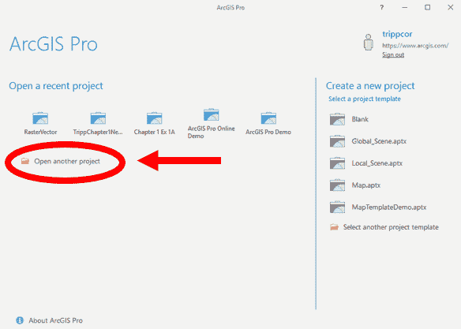

1.  通过在打开项目窗口左侧的区域中点击 `C:\`，导航到 `C:\Student\ArcGISProCookbook\Chapter2\RasterVector`。然后双击 Student、ArcGISProCookbook、Chapter2 和 RasterVector 文件夹。

1.  选择 RasterVector.aprx 项目文件并点击确定。

项目将以单张航空照片打开。航空照片是栅格数据的一个例子，也是您最常用的之一。

1.  在功能区中选择地图选项卡，然后点击位于书签下的小箭头。

1.  选择 Raster 1 书签以放大到地图中的特定位置。

您的地图现在应该非常接近地放大到您刚才查看的航空照片：

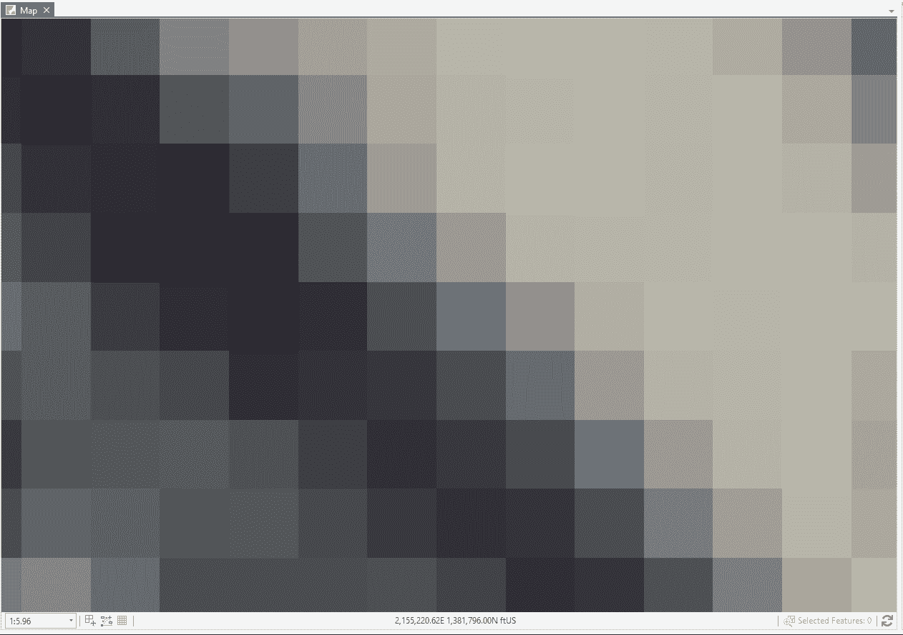

由于缩放比例，图像出现像素化。

现在的航空照片看起来像一系列单独的方块。这些被称为单元格，尽管许多人错误地称它们为像素。

所有栅格都由分配了数值的单元格组成。您可以将它们视为类似于电子表格。分配给每个单元格的值可以根据栅格的目的表示不同的属性。在彩色航空照片的情况下，例如您在本食谱中一直在使用的，分配给单元格的值等于要显示的每个波段的颜色。

1.  在导航组中，在地图选项卡上激活探索工具。

1.  在航空照片中单击一个单元格以查看与所选单元格链接的信息：

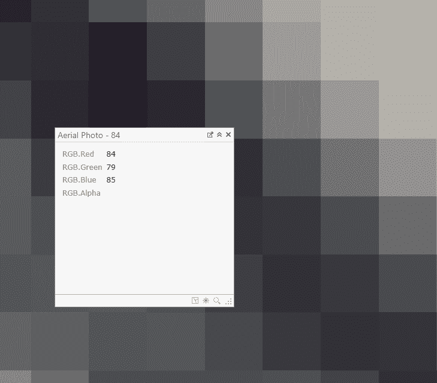

如您所见，单元格存储信息。在这种情况下，它存储用于显示照片中存储的红色、绿色和蓝色波段的值。当这三个波段重叠时，您可以看到真实颜色。

栅格可以有一个波段或多个波段。波段类似于图层。大多数航空照片有三个波段：红色、绿色和蓝色。然而，如果是多光谱的，它们也可能有红外波段。这些额外的波段允许您提取有关植被和不透水表面的信息。

1.  通过点击右上角的小 X 关闭信息窗口。

1.  在内容窗格中右键单击航空照片层，然后选择属性。

1.  在图层属性窗口的右侧单击源。

1.  如有必要，通过单击小箭头展开数据源选项。

1.  查看显示的表格中的数据集单元格。

**问题**：表格中列出的是哪个数据集对应于航空照片层？

**答案**：

1.  完成后点击确定。

航空照片层的来源是 152380.sid。这通常被称为**先生 SID**文件。栅格有多种格式，先生 SID 只是其中之一。其他常见的栅格格式包括：**联合图像专家小组**（**JPEG**/**JPG**）、**可移植网络图形**（**PNG**）、**标签图像文件格式**（**TIFF**）和**ERDAS Imagine**（**IMG**）。

1.  在内容窗格中右键单击航空照片层，然后选择缩放到图层。

1.  在 ArcGIS Pro 界面右侧的目录窗格中，点击位于窗格顶部、项目旁边的门户选项卡。

1.  如下所示，点击生活图集按钮：

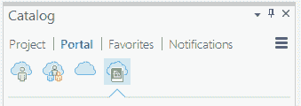

1.  在搜索框中输入 `DEM`。

**数字高程模型**（**DEM**）是一种常用的栅格格式，用于表示地面上高程的变化。

1.  右键点击 Terrain: Hillshade 并选择添加到当前地图：

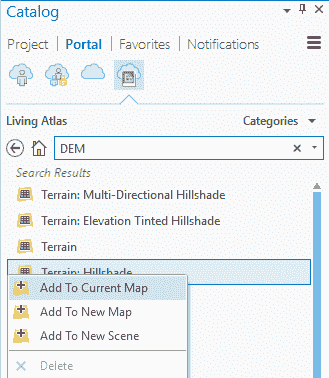

您刚刚添加了一个来自 Esri 的 ArcGIS Online 生活图谱中托管的网络服务栅格图层。生活图谱中的数据对每个人都是可用的，可以在 ArcGIS Pro 和其他 GIS 应用程序中使用。

1.  点击位于地图选项卡导航组中的全图按钮。它看起来像一个小地球仪。这会将您带到地图的全图范围。您将看到更多您刚刚添加的新地面图层。

1.  现在您将更仔细地查看。在地图选项卡中，点击位于书签下的箭头，并选择 DEM Zoomed：

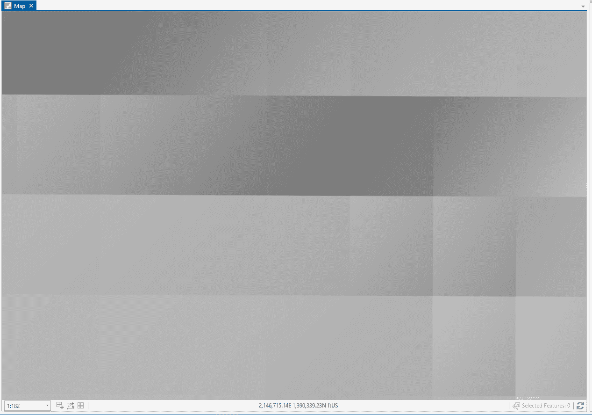

放大后的 DEM

1.  现在查看地图中现在显示的两个栅格图层，并将它们进行比较。

**问题**：航空照片有多少个波段？

**答案**：

**问题**：Terrain: Hillshade 有多少个波段？

**答案**：

1.  在地图选项卡中激活探索工具。

1.  在 Terrain: Hillshade 图层中点击一个单元格以访问与单元格链接的信息。

1.  查看提供的信息。将其与您为航空照片图层执行相同操作时看到的信息进行比较。

1.  完成后关闭信息窗口。

如您所见，您添加的地面图层与航空照片图层有很大的不同，尽管它们都是栅格图层。航空照片图层有三个波段，而地面图层只有一个波段。地面图层还附加了比航空照片更多的信息给每个单元格。这是因为地面图层是为了做更多的事情而创建的，而不仅仅是展示图片。它被设计成您可以确定一个区域的高程并基于高程进行分析。您将在本书的后面有机会做到这一点。

现在，您将更仔细地查看矢量数据。您将要处理的大多数数据很可能以矢量形式存储，这意味着它将是一个点、线或多边形。

1.  点击全图按钮以查看整个地图。

1.  通过点击位于图层名称旁边的复选框来关闭 Terrain: Hillshade 图层。

1.  在目录窗格中，选择窗格顶部的项目选项卡。

1.  展开数据库文件夹，以便您可以看到连接到项目的两个地理数据库。

1.  展开 Trippville_GIS.gdb，以便您可以看到其内容。

1.  在 Trippville_GIS 地理数据库中展开基础要素数据集。

要素数据集是地理数据库中的组织单元。它们在计算机文件夹中起类似的作用。它们允许您在地理数据库中存储相关要素类到一个共同的容器中，以便您可以轻松找到它们。存储在要素数据集中的所有要素类共享相同的坐标系。这使得存储在要素数据集中的要素类可以参与拓扑和几何网络。要素数据集仅存在于地理数据库中。您在其他 GIS 数据格式（如 shapefiles）中找不到它们。

1.  选择包裹要素类并将其拖放到地图视图中。

1.  点击地图选项卡中书签下的箭头并选择包裹。

1.  在地图选项卡中激活探索工具并单击地图上显示的一个包裹。

**问题**：哪些信息字段与包裹相关联？

**答案**：

1.  关闭信息窗口。

1.  在目录表中右键单击包裹层。从出现的菜单中选择属性表：

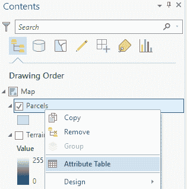

您应该看到属性表在底部打开。这是查看与矢量图层相关属性的另一种方式。

**问题**：使用探索工具看到的字段与属性表中的字段有什么区别？

**答案**：

您应该在探索工具信息窗口和属性表中看到相同的信息字段。然而，信息的呈现方式却相当不同。属性表以表格格式呈现图层中所有要素的数据。信息窗口一次只呈现一个要素的信息。

所有矢量图层都将附有一个属性数据库表。这个属性表将包括默认字段和用户定义字段的组合。默认字段是由软件创建和维护的字段。它们将根据数据类型和格式而变化。用户定义字段是由软件用户创建的，并且必须手动维护。

1.  在地图选项卡中激活选择工具。

1.  双击地图中的一个包裹。

1.  查看您已打开的包裹属性表的底部。它应该显示为“1/8,129 已选择”。

如果它仍然显示为“0/8,129 已选择”，则说明您没有选择任何包裹。这可能是由于图层没有被设置为可选择的。尝试转到内容窗格中的“按选择列表”按钮，并验证包裹层是否被设置为可选择层。

1.  点击位于左侧的“显示所选记录”按钮：

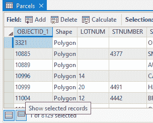

现在应该只显示一个记录，因为您只选择了一个包裹。

1.  再次点击选择工具。

1.  点击地图的左上角并绘制一个类似于以下图像的矩形：

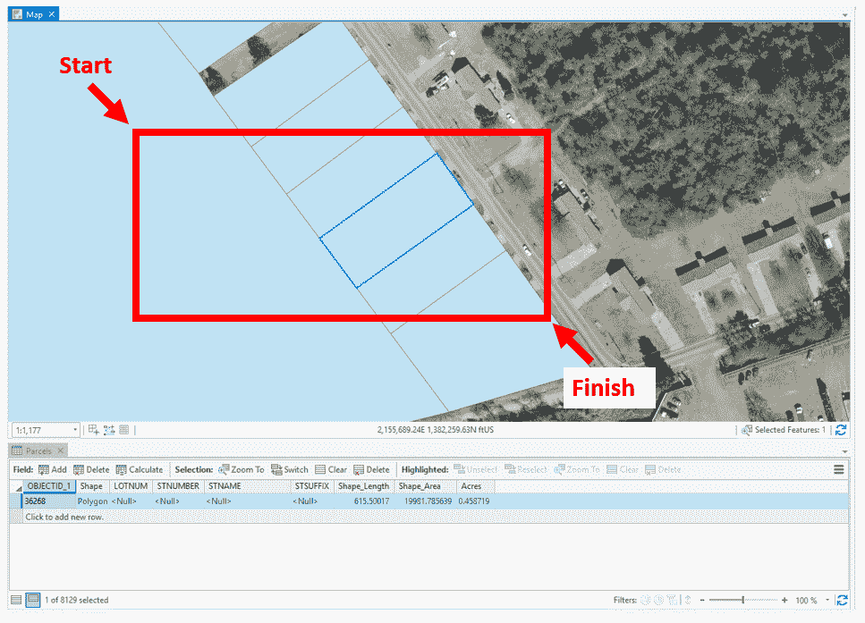

选择窗口位置

1.  现在查看“地块”属性表。由于它们已被选中，你现在应该会在表中看到额外的记录。

当处理矢量数据时，地图中的特征与属性表中的记录之间存在一对一的关系。

1.  点击位于“选择”组中的“地图”标签上的“清除”按钮，取消选择所有选定的要素。

1.  通过点击位于表顶部小标签旁边“地块”一词旁边的小 X 来关闭属性表。

1.  现在点击工具栏中的“编辑”标签。

1.  在“编辑”标签上激活选择工具。

1.  点击沿道路放置的小地块之一。现在该地块应该被选中。

1.  点击位于功能区“编辑”标签上的“工具”窗口中的“顶点”按钮。

如果你点击“顶点”按钮时选择消失，那么地块图层可能没有被设置为可编辑图层。为了验证，请点击内容窗格中的“按编辑列表”按钮。

1.  注意地块显示的变化。你现在应该会看到构成地块多边形的顶点。

矢量数据使用构成特征的顶点的*x*、*y*坐标进行存储。正如你所看到的，每个这样的特征随后都与存储在属性表中的附加属性相关联。因此，所有矢量数据都包括两个组成部分，几何形状和属性。具有相同几何形状（点、线或多边形）和相同属性表的矢量数据组被称为**要素类**。

与栅格数据类似，在使用 ArcGIS Pro 时可能会遇到几种类型的矢量文件。其中一些最常见的是：

+   **地理数据库要素类**：存储在几种类型的地理数据库中。在目录窗格中以灰色图标显示。是 ArcGIS Pro 的首选存储格式。

+   **Shapefile**：Esri 格式，存储单个要素类。由多个文件组成，包括 SHP、DBF、SHX 等。在目录窗格中以绿色图标显示。

+   **AutoCAD 图纸**：具有 DWG 文件扩展名，存储多个要素类。

+   **AutoCAD 图纸交换文件**：具有 DXF 文件扩展名，存储多个要素类。在目录窗格中以带有指南针的蓝色图标显示。

+   **Microstation 图纸**：具有 DGN 文件扩展名，存储多个要素类。在目录窗格中以带有指南针的蓝色图标显示。

1.  全图缩放并保存你的项目。

1.  如果你不再继续到下一个菜谱，请关闭 ArcGIS Pro。

# 它是如何工作的...

在这个菜谱中，你学习了如何将栅格和矢量数据添加到地图中。首先，你打开了一个包含地图的现有项目，该地图已经包含了一个单栅格层，这是航拍彩色照片。然后你使用书签放大到该层以进一步检查它。书签允许你通过存储创建书签时的地图视图的范围和比例来返回地图中的特定位置。这允许你轻松返回地图上的特定位置。项目内包含的书签数量没有限制。

一旦你使用书签放大到该位置，你就使用了探索工具来访问与航拍照片中的单元格链接的信息，以发现它包含三个波段。每个波段都分配了不同的数值给单元格，使得在 ArcGIS Pro 中可以显示真彩色。这些信息在一个 HTML 窗口中呈现，该窗口显示与单元格、要素或被识别的要素相关的属性。此功能还允许你访问包裹层的信息，这是一个矢量数据集。从这一点，你能够看到矢量和栅格数据集可以有不同的属性，可以根据其目的进行自定义。

在这个菜谱中，你添加了一个表示地形或高程的栅格层。这来自 Esri Living Atlas，作为一个由 Esri 的 ArcGIS Online 托管的网络服务。栅格和矢量都可以作为网络服务发布。这些通常通过 REST 点连接来访问。**REST**代表**表示状态转移**。这些类型的连接提供了跨网络的互操作性和良好的性能。

最后，你将包裹矢量层添加到你的地图中并对其进行了探索。当你将其添加到地图中时，包裹多边形在地图视图中显示出来。ArcGIS Pro 通过读取构成每个包裹边界的每个顶点的 *x* 和 *y* 坐标来实现这一点。当你选择一个包裹并使用编辑选项卡上的顶点按钮显示其顶点时，这得到了演示。

这些坐标通常存储在一个现实世界的坐标系中，这使得它可以与其他图层一起在地球上正确地显示位置。每个顶点的 *x* 和 *y* 坐标被称为坐标对。每一对描述一个独特的位置。在多边形的情况下，至少需要四个坐标对来完全描述位置和形状。一条线只需要两个，一个点只需要一个。你将在本书的后面部分了解更多关于现实世界坐标系的内容。

除了查看地块层的空间组件外，你还能查看相关的属性表。你看到了在地图中选择要素如何改变属性表中选择的记录，这证明了地图中显示的要素与属性表中列出的记录之间的一对一关系。这表明矢量数据包括两个组件：空间/几何和属性。

空间要素与表中记录之间的链接是通过使用每个要素的**ObjectID**或**FeatureID**（有时称为**FID**）在数据本身内自动完成的。

# 创建新的地理数据库

正如我们提到的，有许多 GIS 数据存储格式。然而，地理数据库是 ArcGIS Pro 的首选存储格式。它比其他格式（如 shapefiles、coverages 或 DWG 文件）具有许多优势。

首先，它可以在单个数据库中存储表格、栅格和矢量数据。这使得管理并访问所有 GIS 数据变得更容易，因为它们都在一个地方。

其次，它允许使用拓扑、几何网络、域和子类型进行数据验证。这使你能够找到并纠正数据中的错误。

第三，地理数据库是可扩展的，因此随着你的组织发展，它们可以增长。有几种类型的地理数据库。每种都是为支持不同大小的组织而设计的。因此，随着你的发展，你的地理数据库也可以增长。

在前面的食谱中，你使用了现有的地理数据库。你使用了它们包含的数据来创建各种地图。在这个食谱中，你将学习创建新地理数据库所需的基本技能。

# 准备工作

如果你已经完成了前面的食谱，你应该准备好开始。

# 如何做到这一点...

1.  如果你完成了前面的练习后关闭了 ArcGIS Pro，请启动 ArcGIS Pro 并单击“打开另一个项目”。如果你仍然有 ArcGIS Pro 打开，请单击功能区中的“项目”选项卡，然后从窗格左侧的区域选择“打开”。

1.  点击浏览按钮，导航到`C:\Student\ArcGISProCookbook\Chapter2\Creating a Geodatabase`。

1.  选择“Creating a Geodatabase.aprx”并单击“确定”：

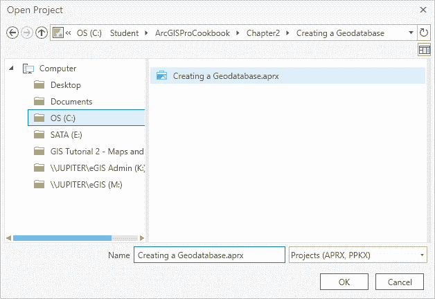

1.  在内容或目录窗格中的数据库文件夹上右键单击，两者都适用：

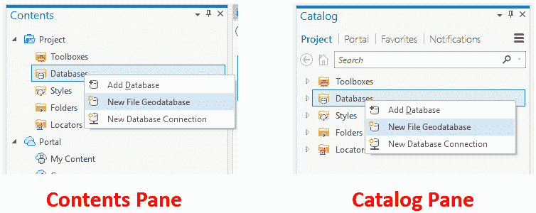

1.  选择新建文件地理数据库。

1.  在左侧面板中，双击 C:\，然后导航到`C:\Student\ArcGISProCookbook\MyProjects`。

1.  将你的新地理数据库命名为`MyGeodatabase`并单击“保存”：

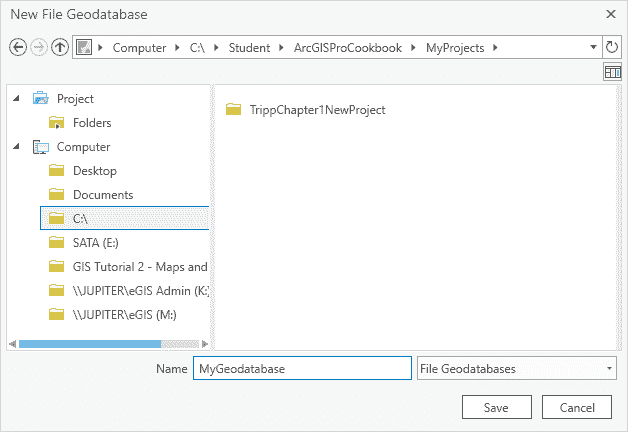

你刚刚使用 ArcGIS Pro 创建了你第一个地理数据库。它是一个文件地理数据库。如果你还记得上一章，文件地理数据库是存在的三种基本类型的地理数据库之一。

文件地理数据库是为只有一到两个主要用户的小型组织设计的。它将信息存储在单个文件夹中的多个文件中，该文件夹具有`.gdb`扩展名。默认情况下，文件地理数据库可以存储多达 1 TB 的要素数据集，包含在地理数据库中以及数据库根目录下。要素数据集类似于你电脑上用于存储相关文件的文件夹。要素数据集用于在地理数据库中分组相关的要素类。每个要素数据集可以存储的数据总量可以通过配置关键字更改为 4 或 256 TB。要了解更多关于地理数据库文件配置关键字的详细信息，请访问[`pro.arcgis.com/en/pro-app/help/data/geodatabases/overview/configuration-keywords-for-file-geodatabases.htm`](http://pro.arcgis.com/en/pro-app/help/data/geodatabases/overview/configuration-keywords-for-file-geodatabases.htm)。

现在你已经创建了一个新数据库，你需要创建实际存储你数据的项目。这包括要素类和要素数据集。我们将从一个简单的要素类开始。

1.  右键单击你刚刚创建的 MyGeodatabase.gdb。你可以从目录视图或窗格中这样做。

如果你尝试从目录窗格创建新要素类，你可能需要展开数据库文件夹，以便你可以看到你刚刚创建的新文件地理数据库。

1.  在菜单中转到“新建”选项，并从那里选择要素类：

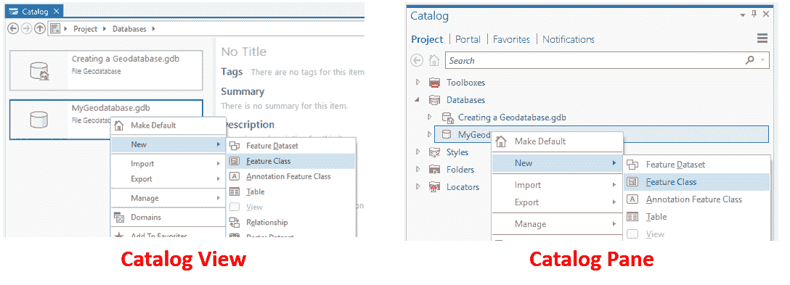

1.  地理处理窗格应该出现在右侧，要素类位置已经填写。将新要素类命名为`Side_Walks`。

地理数据库中的要素类名称有一些限制你应该知道。它们必须以字母开头。尽管名称可以包含数字，但不能以数字开头。此外，名称不能包含空格或特殊字符。唯一的例外是下划线。名称的长度受你存储地理数据库文件的计算机操作系统的限制。然而，我通常建议尽可能保持它们尽可能短，以避免在需要将数据库转换为其他格式时可能遇到的问题。

1.  通过下拉菜单选择多边形来设置几何类型。

1.  接受所有其他默认设置，并验证你的创建要素类工具看起来像以下图片：

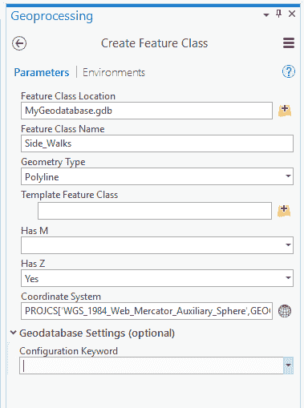

1.  一旦你确认了正确的设置，请点击运行。

1.  当工具完成时，关闭地理处理窗格。

1.  在目录窗格中，展开 MyGeodatabase.gdb 以便你可以看到其内容。

你应该看到你刚刚创建的新要素类。这仅仅是创建新要素类的一部分。第二部分是定义你想要保留的属性并将其与你要存储在新要素类中的要素关联起来。所以现在你将创建一些属性字段。

1.  右键单击你刚刚创建的 Side_Walks 特征类。转到设计并选择字段，如图所示：

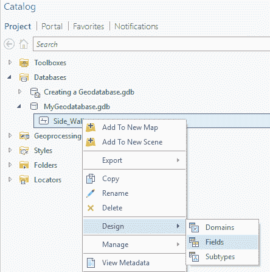

1.  设计视图将在界面中间打开。注意，一些字段已经创建。这些是折线地理数据库特征类的默认字段。

**问题**：当你创建新的特征类时，自动创建了哪些默认字段？

**答案**：

1.  点击“点击此处添加新字段”。

1.  在字段名称单元格中，输入`Street`。

1.  在别名单元格中点击，并输入`Street Sidewalk Follows`。

1.  在数据类型单元格中点击，并从下拉菜单中选择文本。

1.  在长度单元格中点击，并将`255`替换为`50`。

数据库字段也有几个限制。第一个是名称，它与特征类的名称有相同的限制。此外，你必须指定一个数据类型。字段类型通常包括：文本或字符串、长整数、短整数、单精度或浮点、双精度、日期、二进制大对象、全局唯一标识符和栅格。要了解更多关于这些不同字段类型的信息，请访问[`pro.arcgis.com/en/pro-app/help/data/geodatabases/overview/arcgis-field-data-types.htm`](http://pro.arcgis.com/en/pro-app/help/data/geodatabases/overview/arcgis-field-data-types.htm)。

1.  点击位于功能区字段标签页中的更改组中的新建字段按钮。这是添加新字段的另一种方法。

1.  填写以下属性：

    +   字段名称：`Install_Date`

    +   别名：`Date Sidewalk was installed`

    +   数据类型：`日期`

1.  使用这些技能，尝试为路面类型添加另一个字段。它应该是一个限制为 15 个字符的文本字段：

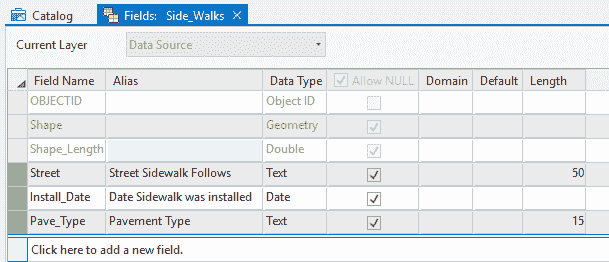

你的设计视图应该看起来类似于这个。你的路面类型字段名称和别名可能不同，但只要长度相同即可接受。

1.  点击位于字段标签页上的功能区中的保存按钮，以保存你创建的新字段到特征类中。

1.  通过点击位于带有字段：Side_Walks 的视图上方的标签页上的小 X 来关闭设计视图。

1.  使用你在前面的菜谱中学到的技能添加一个新的地图，然后将你刚刚创建的新特征类添加到地图中。

新的特征类应该出现在内容面板中。然而，没有显示任何内容，因为它为空。在本书的后面部分，你将学习如何编辑图层以在其中创建新特征。现在，你将学习如何将一个新的特征数据集添加到你的地理数据库中。

1.  在目录面板中，右键单击 MyGeodatabase.gdb。转到新建并选择特征数据集：

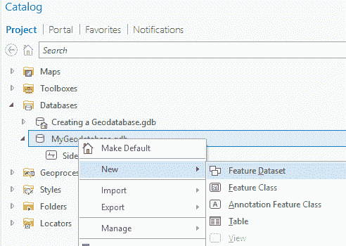

1.  在地理处理面板中，应该出现创建特征数据集工具。输出应该已经定义为`MyGeodatabase`。将你的新特征数据集命名为`Property`。

1.  接受默认的坐标系。它应该设置为 `WGS_84_Web_Mercator_Auxilary_Sphere`。这是大多数在线地图系统使用的坐标系，包括谷歌地球、ArcGIS Online 和必应地图。

1.  点击运行以创建新的要素数据集。

1.  完成后关闭地理处理面板。

你现在应该能在你的 `MyGeodatabase` 数据库中看到新的要素数据集。它在地理数据库中被三个重叠的正方形所标识。这是要素数据集的常见图标。

它是空的，所以你将在其中创建几个新的要素类，你将在本书后面的部分用一些要素填充它们：

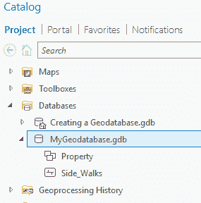

1.  右键单击你刚刚创建的新要素数据集，并使用你创建 Side_Walks 要素类时使用的方法，创建一个新的要素类，具有以下属性：

    +   要素类名称：`Property_Lines`

    +   要素类类型：`Polyline`

1.  使用你为 Side_Walks 要素类使用的方法，添加以下属性字段：

    +   字段 1:

        +   字段名称：`Type`

        +   别名：`Property Line Type`

        +   数据类型：`Text`

        +   长度：`10`

    +   字段 2:

        +   字段名称：`Length_FT`

        +   别名：`Length in Feet`

        +   数据类型：`Float`

挑战你的技能

使用你学到的技能，在同一个要素数据集中创建另一个新的要素类，称为 Parcels。它应该是一个多边形要素类。一旦创建了新的要素类，添加用于绘制的英亩和平方英尺的字段。两者都应该是浮点字段类型。

# 它是如何工作的...

在这个菜谱中，你学习了如何创建一个新的文件地理数据库。然后你在你创建的地理数据库中创建了一个新的要素类。一旦创建了新的要素类，你就在你创建的要素类的属性表中添加了几个属性字段。

你已经学习了如何在你的地理数据库中创建一个新的要素数据集。如你所回忆的，从之前的菜谱中，要素数据集是地理数据库中的一个组织单元。它们允许你将相关的要素类分组在一起，以便更容易找到，并且可以参与拓扑。记住，存储在同一个要素数据集中的所有要素类将具有相同的坐标系。你将在本书的后面部分了解更多关于坐标系的内容。

一旦你创建了新的要素数据集，你使用之前在菜谱中学到的技能在其中添加了新的要素类，这包括创建几个属性字段。

# 创建一个新的 Shapefile

虽然地理数据库是 ArcGIS Pro 的主要格式，但 Shapefiles 可能是你最常遇到的 GIS 数据格式。它已成为默认的数据共享格式，因为许多 GIS 应用程序能够使用它们。这包括 QGIS、AutoCAD Map 3D、MapInfo、Map Window 和 Manifold。此外，大多数高级 GPS/GNSS 单元也能够输入或导出 shapefiles。这使得它们在需要在不同平台之间共享数据时非常灵活。

然而，它们确实有一些限制。首先，shapefile 只能存储一个要素类。这意味着 shapefile 将只包含点、线或多边形，不能包含要素类型的混合。其次，shapefile 建立在旧技术之上。它们是在 20 世纪 90 年代为与 Esri 现在已停用的 ArcView GIS 应用程序一起使用而开发的。shapefile 使用 dBase 表来存储其属性。这极大地限制了可以存储的数据量，以及字段和字段名称的数量。最后，与地理数据库不同，shapefile 没有验证其包含数据的原生能力。

但由于它们的流行和多功能性，你可能经常需要创建新的 shapefile。在这个菜谱中，你将学习如何创建一个新的 shapefile。

# 准备工作

在你开始这个菜谱之前，你需要完成本章中之前的菜谱。你还需要安装 ArcGIS Pro 和示例数据。ArcGIS Pro 基本许可证应该足以完成这个菜谱。

# 如何操作...

1.  如果你在上一个菜谱的结尾关闭了 ArcGIS Pro，请打开 ArcGIS Pro。如果你仍然有 ArcGIS Pro 打开，请单击位于关于 ArcGIS Pro 窗口左上角的返回箭头。

1.  在 ArcGIS Pro 启动窗口中，单击打开另一个项目，如图所示：

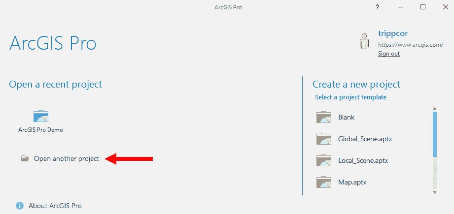

1.  单击看起来像文件夹的浏览按钮。

1.  使用你学到的技能，导航到`C:\Student\ArcGISProCookbook\Chapter2`。选择 Creating a Shapefile.aprx 并单击确定。

项目应该以包含引用你在上一个菜谱中创建的三个要素类的图层打开。它们仍然是空的。接下来，你将创建一个新的 shapefile 来存储将由使用能够使用 shapefile 的 GPS 单元进行清点的现场工作人员清点的路标。

1.  在功能区，单击分析选项卡。

1.  在地理处理组中，选择工具按钮以打开地理处理面板。

地理处理意味着对地理空间数据进行操作。这包括分析、数据转换、投影坐标系、创建新的要素类和添加数据字段。你用来执行这些功能的工具被称为**地理处理工具**。

1.  在地理处理面板中，单击位于收藏和门户之间的工具箱选项卡：

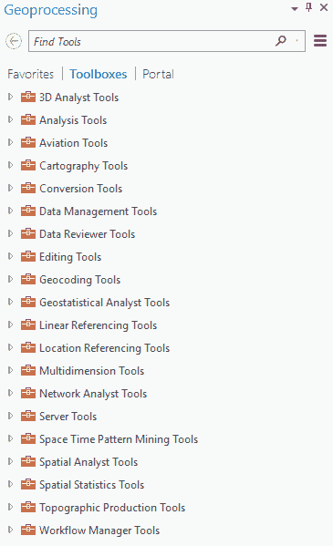

1.  单击位于数据管理工具旁边的箭头，以展开其内容。

1.  单击位于要素类工具集旁边的箭头，以展开其内容：

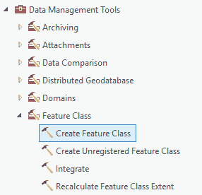

1.  双击创建要素类工具。

1.  单击位于要素类位置单元格右侧的浏览按钮。

1.  在要素类位置对话框窗口的左侧区域，向下滚动到计算机并选择 C:\。

1.  在右侧区域，向下滚动并双击学生文件夹。

1.  双击 ArcGISProCookbook 文件夹。

1.  选择 MyProjects 文件夹。不要双击它：

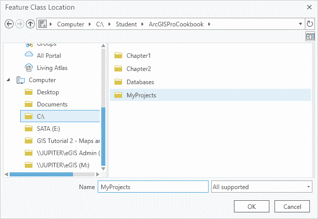

1.  点击“确定”。

1.  在“要素类名称”单元格中，键入`ST_Signs`。

1.  您将使用与您在上一道菜谱中创建的地理数据库要素类相同的坐标系。因此，点击坐标系单元格中的下拉箭头。

1.  从显示的列表中选择 Side_Walks。这应该将坐标系设置为 WGS_1984_Web_Mercator_Auxillery_Sphere。

1.  验证工具看起来是否与以下图形相同。如果相同，请点击运行：

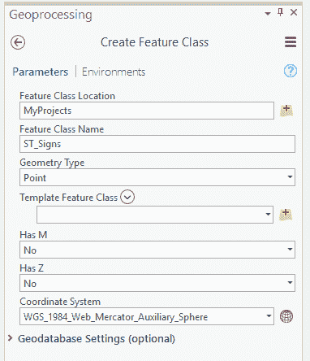

1.  完成后关闭“地理处理”面板。

此工具也可以用来创建地理数据库要素类。您只需确保要素类位置设置为地理数据库或地理数据库中的要素数据集。

现在您已经创建了新的 shapefile，您将验证它是否正确创建。为此，您需要连接到您创建 shapefile 的文件夹。

1.  在“目录”面板中右键单击“文件夹”，然后选择“添加文件夹连接”。

1.  在“添加文件夹连接”对话框窗口左侧的区域中选择 C:\。

1.  在右侧区域向下滚动并双击 Student 文件夹。

1.  双击 ArcGISProCookbook 文件夹。

1.  选择 MyProjects 并点击“确定”。不要双击文件夹。

1.  如果需要，展开“目录”面板中文件夹的内容。然后展开您刚刚添加的 MyProjects 文件夹连接的内容。

1.  如果您的 shapefile 已成功创建，您应该在该文件夹中看到 ST_Signs.shp 文件列出：

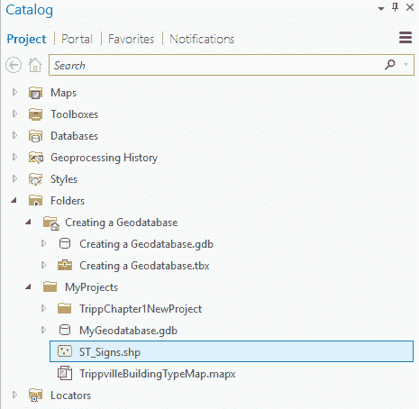

1.  查看界面左侧的“内容”面板。新的 shapefile 应该已经自动添加为地图上的新图层。如果没有，则将 shapefile 从“目录”面板拖放到地图视图中，将其添加为图层。

1.  在“内容”面板中右键单击 ST_Signs 图层。从出现的菜单中选择“设计”然后“字段”：

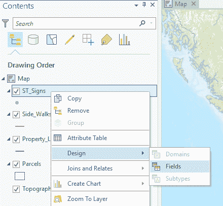

1.  使用与地理数据库要素类相同的流程，添加以下属性字段。对于未指定的任何属性，接受默认值：

    +   字段 1：

        +   字段名称：`Date_Inst`

        +   字段别名：`安装日期`

        +   数据类型：`日期`

    +   字段 2：

        +   字段名称：`Type`

        +   字段别名：`Sign Type`

        +   数据类型：`文本`

        +   长度：`15`

    +   字段 3：

        +   字段名称：`Cond`

        +   字段别名：`条件`

        +   数据类型：`文本`

        +   长度：`5`

    +   字段 4：

        +   字段名称：`Date_Col`

        +   字段别名：`Data Collected`

        +   数据类型：`日期`

请记住，字段名不能包含空格或特殊字符（除下划线外），并且必须以字母开头。此外，因为这是一个 shapefile，名称的长度限制为 10 个字符。

1.  验证属性表是否与以下图像相同，并在功能区“字段”选项卡中点击“保存”按钮：

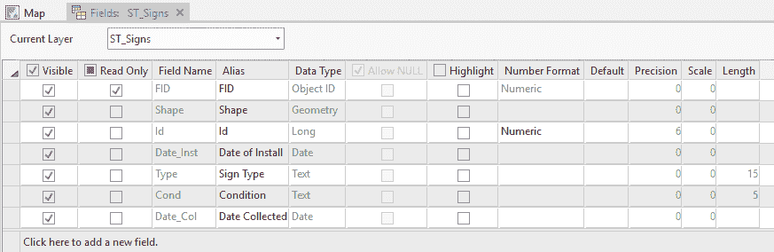

你可能会收到一个警告，表明日期数据类型无效。忽略这个警告，因为它是不正确的，可能是 ArcGIS Pro 2.0 中的一个错误。这个问题在 ArcGIS 2.1 中已修复。

1.  如果你不会继续到下一个菜谱，请保存你的项目并关闭 ArcGIS Pro。

# 它是如何工作的...

在这个菜谱中，你创建了一个新的 shapefile，用于存储有关路标的信息。你使用了创建要素类地理处理工具来生成新的 shapefile。在你创建了新的 shapefile 之后，你向表中添加了属性字段，以存储有关路标的附加信息。

# 将 CAD 数据添加到地图中

最终进入 GIS 的许多数据最初是由工程师、测量员和景观建筑师创建的。他们通常会使用计算机辅助绘图或设计软件，通常称为 CAD。有两个主要的 CAD 应用程序，AutoCAD 和 Microstation，以及几个较小的竞争对手。这些通常会生成被称为图纸的文件。

ArcGIS Pro 允许你将这些图纸添加到你的地图中。一旦添加，你可以调整显示属性，执行查询，甚至将 CAD 数据导入到你的 GIS 数据中。

在这个菜谱中，你将学习如何将 CAD 文件添加到地图中。一旦添加，你将学习如何调整一些显示属性。在第七章“转换数据”中，你将学习如何将 CAD 数据导入 GIS。

# 准备工作

你需要确保 ArcGIS Pro 和本书的示例数据都已安装。这个菜谱可以使用 ArcGIS Pro 基本许可证完成。

这个菜谱不是基于之前的菜谱。因此，在开始这个菜谱之前，你不需要完成任何之前的菜谱。

# 如何操作...

1.  如果你在上一个菜谱的末尾关闭了 ArcGIS Pro，请启动它，并打开位于 `C:\Student\ArcGISProCookbook\Chapter2\Using CAD Data` 的 `Using CAD Data.aprx` 项目。

1.  在 ArcGIS Pro 界面右侧的目录窗格中，通过单击“文件夹”一词左侧的小箭头来展开文件夹。

1.  展开第二章文件夹，以便你可以看到其内容。

1.  定位到 Subdivision_NAD83.dwg 文件。它应该有一个带有指南针的蓝色图标。

CAD 文件将具有三种文件扩展名之一：DWG、DXF 或 DGN。像 shapefile 和地理数据库要素类一样，它们也是矢量数据。

DWG 是 Autodesk 基于 AutoCAD 产品线的原生格式。这包括 AutoCAD、Map 3D 和 Civil 3D。使用其他竞争对手应用程序，如 IntelliCAD 或 TurboCAD，也可以创建 DWG 文件。

DXF 文件也是 AutoCAD 格式。它们用于与其他不原生使用 DWG 格式的 CAD 应用程序共享数据。

DGN 是 Bentley Microstation 产品线的原生格式。Microstation 是 AutoCAD 的主要竞争对手。在美国，Microstation 被交通部和国防部使用。

对于 ArcGIS Pro 来说，这些文件的工作方式都相同。因此，您将使用 DWG 文件进行的流程也适用于 DXF 和 DGN 文件。

1.  展开“Subdivsion_NAD83.dwg”文件。

1.  注意，绘图文件包含多个要素类，包括注释、多面片、点、折线和多边形。

1.  选择“Subdivision_NAD83.dwg”文件。将其拖放到 Trippville 地图视图中。

1.  右键单击“Subdivision_NAD83-多边形组”，并选择“缩放到图层”。

您的地图现在应该看起来像以下图像：

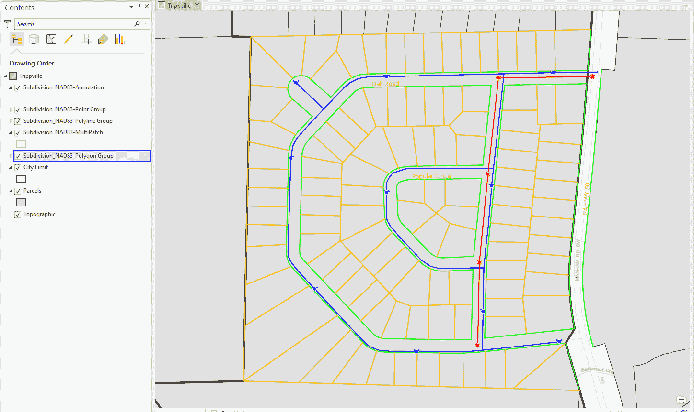

地图已缩放到“Subdivision_NAD83-多边形组”

您刚刚将整个 AutoCAD 绘图文件添加到您的地图中。该绘图文件显示了将在 Trippville 市建设的新的分区。现在您将探索您刚刚添加到地图中的绘图。

您可以添加单个要素类而不是整个绘图。一般来说，最好只将您需要的数据添加到地图中。否则，您可能会被信息淹没。

1.  在内容面板中展开“Subdivision_NAD83 – 多边形组”图层。

**问题**：哪些图层包含在“多边形组”图层中？

**答案**:

1.  点击位于“多边形组”图层下的“地块”图层中的符号，以打开符号面板。

1.  确保在符号面板中选择“属性”选项卡。

1.  点击位于“颜色”旁边的下拉箭头，并选择“黑色”。然后点击应用。

1.  现在将线宽从`1.5`改为`1`，然后点击应用。

尽管 DWG 文件不是 ArcGIS Pro 的本地格式，但您仍然可以显示它们并调整它们的一些属性。

1.  关闭符号面板。

1.  在功能区中点击“地图”选项卡，并激活“探索”工具。

1.  确保在“多边形组”图层中选中“地块”图层。

1.  点击“探索”工具下方的下拉箭头，并选择“内容中的选中项”：

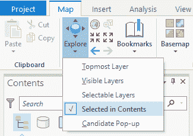

1.  在地图中点击“地块”图层中的一条线，可以打开显示您所点击线的信息窗口：

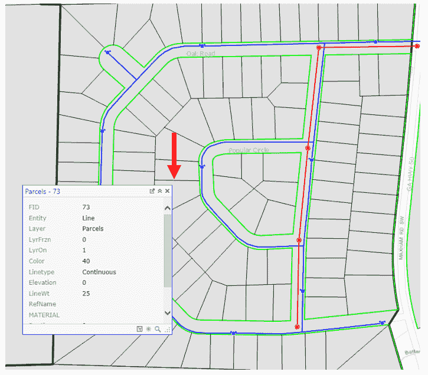

正如您所看到的，即使绘图文件不是 Esri 格式，它也像 shapefile 或地理数据库要素类一样包含属性数据。在 ArcGIS Pro 中，您可以使用这些属性，就像使用存储在 Esri 格式中的数据相关的属性一样。

1.  如果您打算继续下一个食谱，请保存您的项目并保持 ArcGIS Pro 打开。如果您不继续，您应该保存您的项目并关闭 ArcGIS Pro。

# 它是如何工作的...

在这个食谱中，您通过将目录地图中的绘图文件拖放到地图视图中，将整个 AutoCAD 绘图文件添加到您的地图中。一旦将绘图文件添加到地图中，您通过缩放到新添加的图层之一并展开组图层的内容，探索了内容面板中添加的一些图层。

然后，您通过单击图层下的符号并调整符号面板中的颜色和宽度，更改了新添加的绘图文件图层之一的符号。

最后，您使用探索工具访问关于某个地块线的属性信息。您看到即使绘图文件是在另一个应用程序中创建的，AutoCAD，它仍然具有属性，就像 shapefile 或地理数据库要素类一样。

# 从表中绘制 X，Y 点

从外部来源获取的数据可能只是一个包含一些包含 *X* 和 *Y* 数据信息的表格。这可能来自测量员、使用智能手机收集数据的人或其他来源。数据可能是一个电子表格、文本文件、CSV 文件，甚至是一个数据库表。

如果数据包含位置坐标，您可以将这些坐标转换为地图中的点。这被称为事件层。坐标可以位于任何已知的坐标系中，只要它们都是相同的，这意味着表中所有记录的所有坐标都必须列在相同的坐标系中。

在本菜谱中，您将从独立数据库表中绘制犯罪地点。此表包含多个记录，每个记录都有一个纬度和经度坐标。您将使用这些信息来绘制位置。

# 准备工作

如果您已经完成了前面的菜谱，您应该为这个菜谱做好准备。本菜谱不需要完成前面的菜谱。您需要确保 ArcGIS Pro 和样本数据已安装。本菜谱可以使用 ArcGIS Pro 基本许可证完成。

# 如何操作...

1.  启动 ArcGIS Pro 并打开位于 `C:\Student\ArcGISProCookbook\Chapter2\` 的 `Plot XY from Table.aprx` 项目。

1.  在目录窗格中，展开数据库文件夹。

1.  展开 Trippville_GIS 数据库，以便您可以查看内容。

1.  您应该看到一个 `Crimes_2014` 数据库表。右键单击该表并选择添加到当前地图：

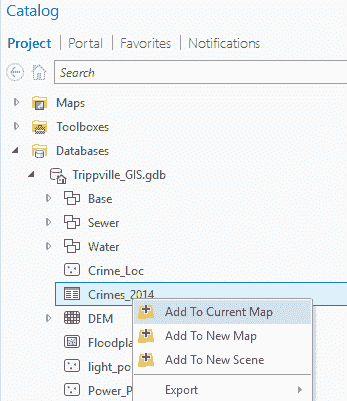

1.  `Crimes_2014` 表应该出现在内容窗格中。右键单击该表并单击打开。

**问题**：您在表中看到了哪些字段？

**答案**:

您应该看到六个不同的字段。最重要的是最后的两个，纬度和经度。这些是标识每个犯罪地点的坐标。现在您将使用这些坐标在地图上创建点以显示位置。

1.  通过单击顶部的标签中的小 X 关闭表。

1.  在内容窗格中右键单击表并选择显示 XY 数据：

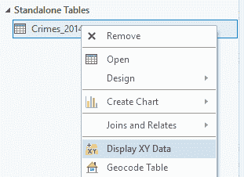

1.  地处理窗格应该打开，并带有创建 XY 事件图层工具。它应该自动填充所需的变量。验证您的工具是否看起来像以下图像。如果是，请单击运行。如果不是，请进行适当的调整：

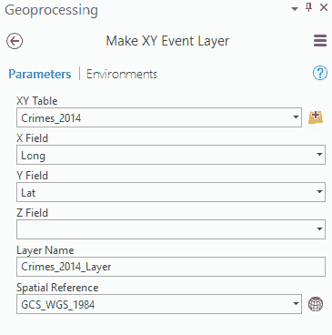

1.  应该在内容窗格中显示一个名为`Crimes_2014_Layer`的新图层。如果它显示，请关闭地理处理窗格。

如果空间参考未设置为`GCS_WGS_1984`，请单击小地球图标以正确设置。您需要转到地理坐标系统并选择世界。

美国 GPS 系统使用 WGS 1984 地理坐标系统报告位置。您将在本书的后面部分了解更多关于坐标系统及其在 ArcGIS Pro 中如何工作的信息。

1.  在内容窗格中右键单击`Crimes_2014_Layer`。选择属性表。

1.  将您在属性表中看到的内容与您打开`Crimes_2014`表时看到的内容进行比较。它们应该相同，只有一个例外。

**问题**：有一个例外是什么？

**答案**：

1.  保存您的项目并关闭 ArcGIS Pro。

您创建的图层仍然与原始表相关联。因此，如果表发生变化，图层也会发生变化。此相同的过程适用于电子表格、CSV 文件和文本文件，只要它们的格式相似。坐标不必是纬度和经度。它们可以是任何现实世界的坐标系统，例如州平面、UTM 或 WGS 84 Web Mercator 辅助球体，只要您知道它是。

# 它是如何工作的...

在本食谱中，您使用独立数据库表在地图上创建点，以显示犯罪的位置。您通过在数据库中右键单击该表并将其添加到当前地图中来实现这一点。

一旦您将表添加到地图中，您就查看表以确保它包含每个记录的坐标值。这就像打开表并查看其中包含的数据一样简单。

最后，您在内容窗格中的表格上右键单击并选择显示 XY 数据。这打开了具有“创建 XY 事件层”工具的地理处理窗格。因为您的表使用了几个默认字段，所以它自动填充了所需的变量。一旦此工具运行，地图上就会出现一个新的点层，显示表中的犯罪实际位置。

# 地理编码地址

在上一个食谱中，您看到了数据可以不是传统的 GIS 格式。它可以是包含 X 和 Y 坐标以及其他信息的独立表。然后可以将其转换为地图上的点。X 和 Y 坐标并不是我们识别位置的唯一方式。

显示位置的另一种甚至更常见的方式是使用地址。这就是在 GPS 时代之前，邮政投递员知道邮件需要投递的地方。ArcGIS Pro 也可以使用地址来识别位置。这被称为地理编码。

简而言之，地理编码是将地址或一系列地址转换为地图或 GIS 上的位置的过程。在本食谱中，您将学习如何在 ArcGIS Pro 中地理编码地址。这包括确定 GIS 中的参考数据，创建地址定位器，并最终地理编码检查表。

# 准备工作

除了安装 ArcGIS Pro 和书中的数据外，您还需要安装 Microsoft Excel 或类似的应用程序，才能完成此配方。

# 如何操作...

1.  在您开始 ArcGIS Pro 之前，您需要检查您将要地理编码的检查电子表格。打开 Windows 文件资源管理器。

您应该在显示器的底部任务栏上的文件夹中看到一个类似于文件文件夹的图标。这将打开文件资源管理器。

1.  在文件资源管理器中，根据您使用的 Windows 版本，展开桌面和“此电脑”或“我的电脑”，位于文件资源管理器左侧的区域。

1.  点击 C:\ 驱动器，以便在右侧区域查看其内容。它可能标有 OS 或本地驱动器：

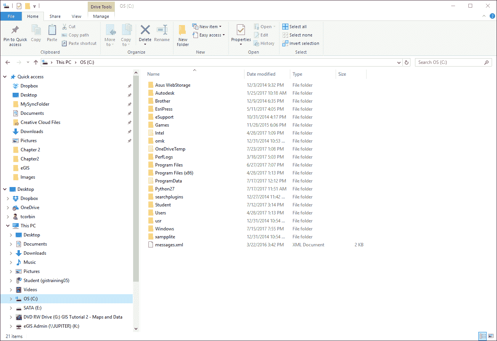

查看文件资源管理器中的 C: 驱动器

1.  在右侧区域显示 `C:\` 驱动器内容的区域，向下滚动直到您看到学生文件夹，然后双击它。

1.  继续使用相同的过程导航到 `C:\Student\ArcGISProCookbook\Chapter2`。一旦到达第二章文件夹，您应该看到几个文件。其中之一是 Inspections.xls。

1.  双击 Inspections.xls 文件以打开它。

1.  查看您刚刚打开的电子表格。注意它包含的信息：

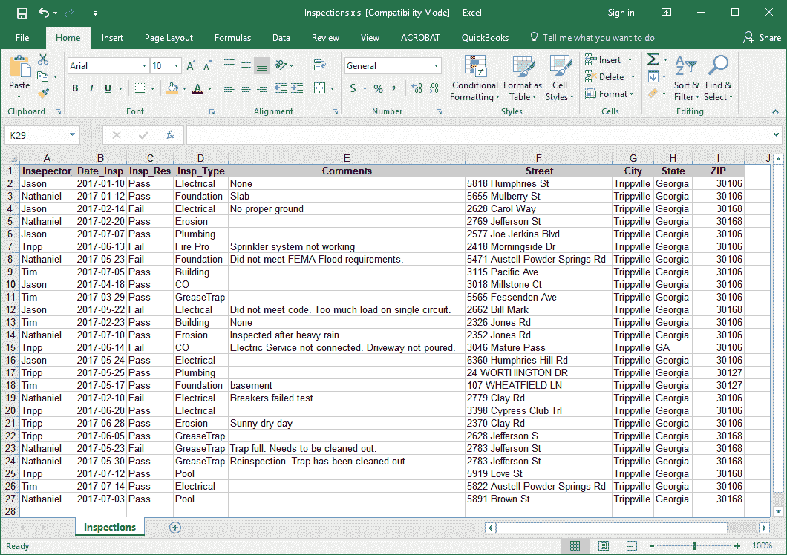

此电子表格表示来自您 GIS 外部的许可和检查系统的导出。该系统没有在地图上显示数据的能力，但市政经理希望看到城市内完成的检查地点。如您所见，电子表格确实包括了检查发生的地址。您将使用该地址将每个检查的位置地理编码到地图上。

1.  启动 ArcGIS Pro 并打开位于 `C:\Student\ArcGISProCookbook\Chapter2` 的 `Geocoding.aprx` 项目。

1.  展开 Inspections.xls 电子表格，右键单击 Inspections$ 表，选择“添加到当前地图”，如图所示：

1.  展开第二章文件夹。

1.  展开目录窗格中的文件夹。

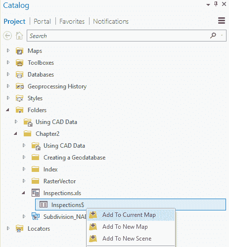

您刚刚将您检查的电子表格添加到您的地图中，以便您可以对其进行地理编码。在您对电子表格中的数据进行地理编码之前，您首先需要创建一个定位器。如果您使用的是所有自己的数据，ArcGIS Pro 中的地理编码需要三个组件。您需要您想要地理编码的表格、具有地址信息的 GIS 中的参考数据，以及一个定位器。

参考数据通常是道路中心线、地址点或地块多边形。地址点通常提供最高的精度。其次是地块多边形。最不准确的是道路中心线。

**定位器**是您源数据与您尝试进行地理编码的数据之间的翻译器。它提供了进行地理编码所需的基本设置和选项。有几种定位器样式取决于您的参考数据以及地址信息的格式化方式。

因此，在你可以创建定位器之前，你必须首先确定你的源数据。这将是一个已经包含地址信息的 GIS 层。

1.  由于 Trippville 地理数据库中没有地址点层，你知道那将不会是你的参考数据。你确实有地块多边形，所以右键点击内容面板中的 Parcels 层并选择属性表。

1.  检查 Parcels 层的属性表以确定它是否有地址数据。

**问题**：Parcels 层是否包含地址信息？

**答案**:

Parcels 层确实包含一些地址信息。它有街道名称、街道号码和街道后缀。然而，并非所有地块都有完整的信息。此外，它还缺少地址中包含的其他信息，如邮政编码、城市和州。由于附加到地块的信息不完整，它不适合作为参考层。现在是时候查看街道中心线，看看它们是否包含更完整的地址信息。

1.  关闭 Parcels 属性表。

1.  右键点击 Street Centerline 层并选择属性表。

1.  查看 Street Centerline 层的属性表。你可能需要滚动以查看所有数据字段。

**问题**：Street Centerline 的地址数据是否比 Parcels 层更完整？

**答案**:

Street Centerline 层确实包含更完整的地址信息。它包含了道路左右两侧的地址范围。它还包括道路名称和类型的字段。此外，它还包括每个道路左右两侧的邮政编码和城市的字段。这些信息足以创建完整的地址。因此，Street Centerlines 层是作为参考层的最佳选择，即使它可能不会产生最准确的数据点。现在你已经准备好创建你的定位器了。

1.  关闭 Street Centerlines 层的属性表。

1.  在功能区中点击“分析”标签。

1.  点击工具按钮以打开地理处理窗口。

1.  在地理处理面板顶部点击“工具箱”标签。

1.  展开地理编码工具工具箱并点击创建地址定位器工具：

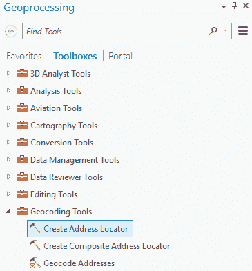

1.  在创建地址定位器工具中，从下拉列表中选择它以设置地址定位器样式为 US Addresses – Dual Ranges。

你选择的样式取决于参考数据的几何形状以及地址信息在表中的格式。例如，US Address Dual Range 样式仅适用于线或折线要素类参考数据，并需要标识道路左右两侧起始和结束地址的字段。其他样式有其他要求。要了解更多关于地址定位器样式的信息，请访问[`pro.arcgis.com/en/pro-app/help/data/geocoding/understand-locator-styles.htm`](http://pro.arcgis.com/en/pro-app/help/data/geocoding/understand-locator-styles.htm)。

1.  在“参考数据”下，从下拉列表中选择“街道中心线”。它应该自动设置为你的主表。

1.  字段图应该自动填充。滚动列表并验证所有带有“*”符号的字段名称都与别名名称相关联。别名名称是街道中心线表中的属性字段名称。

1.  点击输出地址定位器右侧的浏览按钮。

1.  在输出地址定位器窗口的左侧区域中，滚动到“计算机”下的 C:\。

1.  选择 C:\。

1.  在窗口右侧的区域中向下滚动并双击“学生”文件夹。

1.  双击“ArcGISProCookbook”文件夹。

1.  双击“我的项目”文件夹。

1.  在“名称”单元格中输入`Trippville_Locator`并点击保存。

1.  确认你的“创建地址定位器”工具看起来像以下图像。如果是这样，点击运行：

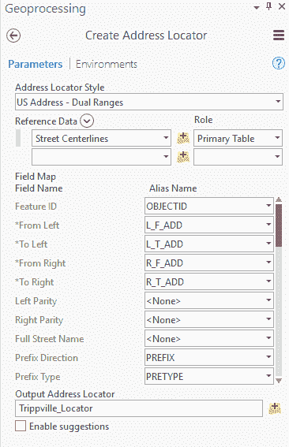

1.  工具完成后，关闭“地理处理”窗格。

你刚刚创建的定位器应该会出现在“定位器”文件夹中的目录窗格中。这会让你知道它已经被成功创建。

1.  在目录窗格中右键单击你创建的“Trippville_Locator”。选择“定位器属性”。

1.  在定位器属性窗口的左侧区域中选择“地理编码选项”。

1.  滚动到“侧偏移”并设置为`35`。侧偏移是指地理编码过程将新点创建在中心线多远的位置。由于我们知道大多数街道的通行权在 50 到 60 英尺之间，35 应该将点放置在或靠近它所属的地块上。

1.  从下拉列表中将侧偏移单位设置为英尺并点击确定。

1.  在内容窗格中右键单击“Inspections$”表，然后选择“地理编码表”：

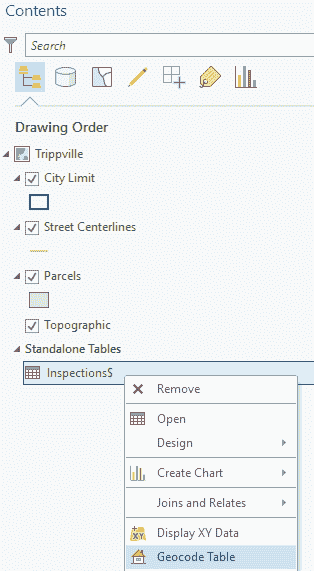

1.  地理处理窗格将打开，并带有“地理编码地址”工具。输入表将自动设置为“Inspections$”表。将输入地址定位器设置为`Trippville_Locator`。

1.  接受所有其他默认设置并点击运行：

**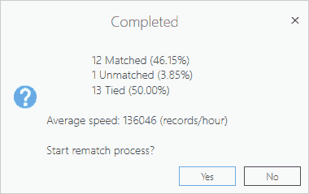**

1.  当“地理编码地址”工具完成后，将出现一个窗口，并在内容窗格中添加一个新图层以显示结果。点击是以开始重匹配过程。

1.  你很幸运，只有一个地址没有匹配。

1.  在“重匹配地址”窗格中，确保在顶部选中“未匹配”。在“街道或交叉口”单元格中，你可以看到“Nature Pass”已被拼写错误。点击单元格并更正名称为“Nature Pass”。

1.  地图应该自动缩放到最佳匹配，并在“重匹配地址”窗格的底部出现一个网格，其中最佳匹配位于顶部。其他接近匹配也将被展示。

1.  选择标记为 A 的顶部匹配项。

1.  点击网格顶部的绿色小勾号以将其匹配到选定的匹配项。

1.  关闭“重匹配地址”和“地理处理”窗格。

1.  在内容窗格中，右键单击“Inspections_GeocodeAddresses”图层，然后选择“缩放到图层”：

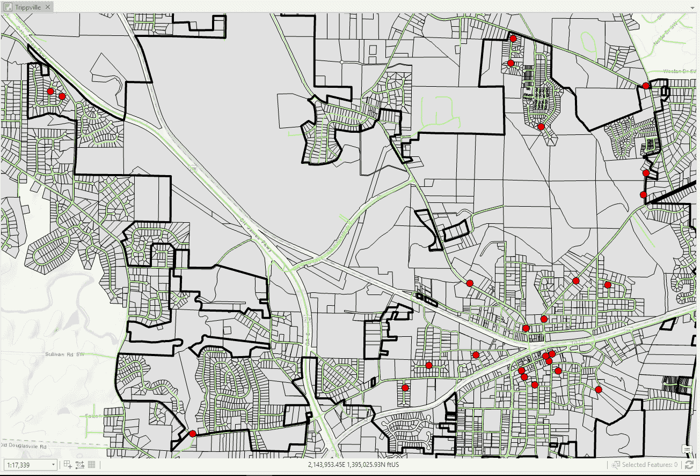

地图缩放到“检查 _GeocodeAddresses”图层

1.  使用您学到的技能，打开“检查 _GeocodeAddresses”图层的属性表。

1.  检查表以查看地理编码过程创建的字段。

1.  保存您的项目并关闭 ArcGIS Pro。

# 它是如何工作的...

在这个菜谱中，您对从您 GIS 外部导出的许可和检查系统检查表进行了地理编码。为此，您首先必须确定一个参考图层。参考图层是一个包含地址数据的 GIS 图层。您检查了您的地块和街道中心线图层，以确定哪一个将是最好的参考图层。您确定街道中心线图层是最好的，因为地址信息的完整性。

您随后创建了一个新的定位器，允许您使用中心线作为您的参考。您使用了地理编码工具箱中找到的“创建地址定位器”地理处理工具。

一旦创建了定位器，您就能够对检查表进行地理编码。这将在您的地图中创建一个新的点图层，显示检查的位置。在您运行初始地理编码时，有一个检查没有匹配。这是因为名字拼写错误。您在“重新匹配地址”窗口中更正了这一点，将其匹配到正确的位置。
