# 将数据链接在一起

在本章中，我们将介绍以下菜谱：

+   连接两个表

+   使用连接的表标注要素

+   在连接的表中查询数据

+   创建和使用关联

+   空间连接要素

+   使用现有数据创建和使用关系类

# 简介

您现在知道，GIS 数据不仅包括您在地图上可能看到的内容。每个图层都附加了额外的信息，这些信息存储在属性表中。此外，您在地图中显示的所有数据并不都存储在传统的 GIS 格式中。一些可能存储在独立的表中，甚至存储在电子表格中。如果它们包含地址或 *x* 和 *y* 坐标，这些也可以在地图中显示。

然而，在各种数据库中存在大量数据，这些数据可能没有 *x* 和 *y* 坐标，或者地址，甚至可能不是我们 GIS 的一部分，但我们需要能够使用这些信息在 GIS 中进行查询、显示信息或进行分析。这些数据可能来自其他系统，例如税务评估、许可、检查、工作订单和资产管理系统。如果我们想使用这些系统存储的数据，我们必须能够将其链接到我们的 GIS 数据。ArcGIS Pro 提供了一些方法来实现这一点，即连接和关联。

在其他时候，我们可能需要将我们 GIS 中的数据传输或链接在一起。ArcGIS Pro 支持几个工具，允许您执行此操作，包括空间连接和在地理数据库中创建关系类。

在本章中，您将学习在 ArcGIS Pro 中链接数据以增强数据集功能的步骤。您将学习如何创建和使用连接和关联。您将执行空间连接，根据空间关系在两个图层之间结合属性。最后，您将学习如何在地理数据库中创建和配置关系类。您将从创建一个与另一个图层关联的注释要素类的一个简单关系类开始。然后您将手动创建关系类，这将连接两个要素类。

# 连接两个表

连接是两种基本方法之一，可用于在 ArcGIS Pro 中链接数据。连接将两个数据集连接在一起，在项目中的单个地图中创建一个单一虚拟数据集。这允许您使用连接的数据进行查询、标注和符号化，使用来自两个连接数据集的信息。

在这个菜谱中，您将把地块图层连接到一个包含所有者名单的表中。您将学习连接两个表所需的条件以及如何完成连接。

# 准备工作

对于这个菜谱，您需要确保已安装书籍数据和 ArcGIS Pro。ArcGIS Pro 基本许可证级别对于这个菜谱就足够了。

# 如何做...

1.  要开始，您需要启动 ArcGIS Pro。

1.  在 ArcGIS Pro 的开始窗口中，点击打开另一个项目。

1.  在打开窗口中选择计算机，然后点击右侧区域中的浏览：


1.  通过点击打开项目窗口左侧的 C:\，导航到`C:\Student\ArcGISProCookbook\Chapter3\Joining Data`。然后双击 Student、ArcGISProCookbook、Chapter3 和 Joining Data 文件夹。

1.  选择“Joining Data.aprx”项目文件并点击“确定”。

项目将以一个名为“托马斯维尔市”的单个地图打开。该地图包含两个图层，City Limits 和 Parcels，以及地形底图。首先，你将查看地块层的属性表中的信息。

1.  在内容窗格中，右键点击“地块”层，然后从出现的菜单中选择“属性表”。地块层的属性表应该在地图视图底部的窗口中打开。

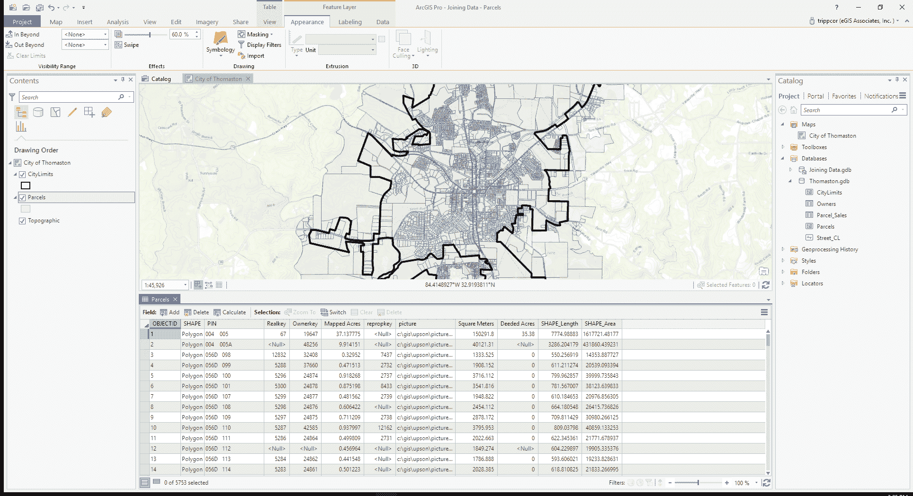

1.  仔细查看属性表包含的字段，并回答以下问题：

**问题**：地块属性表包含哪些字段？

**答案**：

如你所见，该表包含关于地块的信息，例如**地块识别号**（**PIN**）、RealKey、OwnerKey 等。然而，它并没有包含任何关于谁拥有这些地块的信息。然而，你知道这些信息在位于县税务评估办公室的**计算机辅助大量评估**（**CAMA**）系统中是可用的。

他们已经为你提供了一个包含该县所有土地所有者信息的表格。现在你需要将它与你的地块层连接起来。

1.  在目录窗格中，通常位于界面的右侧，通过点击左侧的小箭头展开数据库文件夹。

1.  展开 Thomaston.gbd，以便查看其内容。你应该能看到至少三个要素类（CityLimits、Parcels 和 Street_CL）以及几个独立的表（Owners 和 Parcels_Sales）。

1.  右键点击“所有者”表，然后选择“添加到当前地图”。

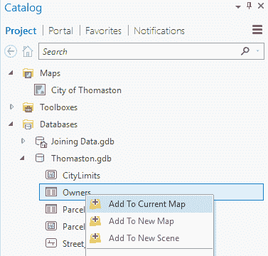

新添加的表应该出现在内容窗格的底部列表中。现在你将查看这个新添加表中的数据。

1.  在内容窗格中，右键点击你刚刚添加的所有者表，然后选择“打开”。所有者表应该在地块属性表相同的区域打开。

1.  查看所有者表，注意它包含的字段。然后回答以下问题：

**问题**：所有者表包含哪些字段？

**答案**：

如你所见，这个表确实包含了该县所有土地所有者的信息。然而，它并没有包含任何关于他们拥有的地块的信息。为了将所有者信息与地块连接起来，你必须识别一个**键字段**。键字段是每个表中包含两个你试图链接的表共有的数据的字段。现在你将在每个表中识别一个键字段，你将使用它来将它们连接起来。

关键字段在两个表中不需要有相同的名称。名称可以不同。然而，它们必须是相同的数据类型，并包含相同的数据值。通过相同的数据值，这意味着它们必须完全相同。这包括如果关键字段包含文本，则大小写和空格的数量。这就是为什么如果可能的话，最好使用数值。

1.  在表格视图区域，单击表格顶部的选项卡，上面写着所有者。按住鼠标按钮并开始向下拖动。表格视图中应出现一系列图标。将鼠标拖到右侧有填充米色区域的图标，如图所示。然后释放鼠标：

**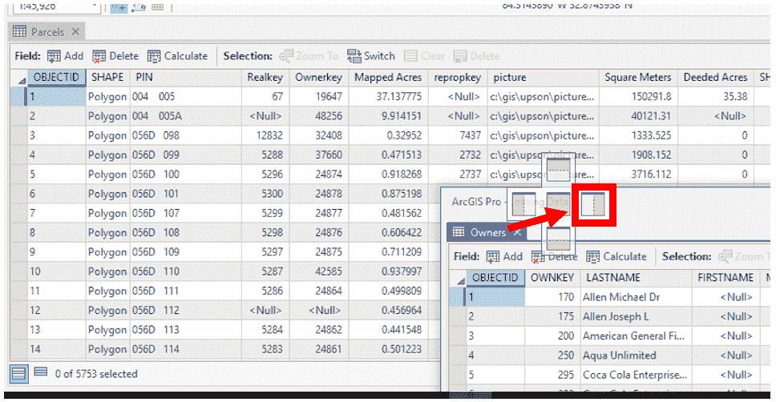**

点击所有者选项卡并将其拖动到停靠图标。

您现在应该看到两个表并排，如下面的图像所示。这允许您同时看到两个表中的数据。

****

两个表并排停靠

在 ArcGIS Pro 中，您实际上可以将表拖出，以便在它们自己的窗口中单独查看。然后，这些单独的窗口可以放置在您的显示中的任何位置，包括在其他监视器上。它们也可以单独调整大小。这可以使同时查看多个表更容易。

1.  在包裹表中，右键单击所有者键字段并选择降序排序。

1.  在所有者表中，右键单击所有者键字段并选择降序排序。

1.  检查并比较每个表中的这些字段的值，然后回答以下问题：

**问题**：这两个字段看起来包含相同的值吗？

**答案**：

现在您已经验证了这两个字段包含类似值，您需要验证字段类型是否相同。

1.  在包裹表中的所有者键字段上右键单击，然后从出现的菜单中选择字段：

**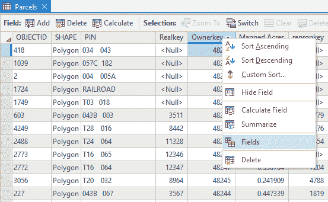**

1.  在所有者表中对所有者键执行相同的操作。

您的表格视图现在应该看起来像这样：

****

侧边表设计视图

1.  验证包裹表中的所有者键字段和所有者表中的所有者键字段的数据类型是否相同。

如您所见，字段都是双精度数据类型。由于字段包含相同的数据值且字段类型相同，因此可以使用这些字段将两个表链接起来。现在，是时候将它们链接起来。

1.  通过单击小 X 关闭表和字段选项卡。

在连接表之前不需要关闭表。如果需要，可以保持它们打开。但在连接之前关闭它们会更整洁，以减少屏幕杂乱。

1.  在内容面板中，右键单击包裹层。转到连接和关系并选择添加连接。

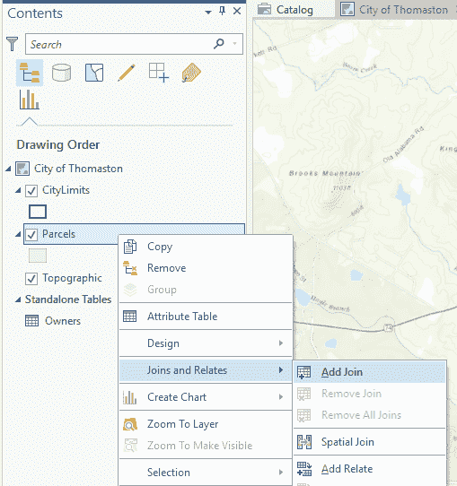

地理处理面板应该打开，并带有添加连接工具。

1.  确认添加连接工具中的层名称或表视图设置为 Parcels。

1.  对于输入连接字段，选择 OwnerKey。

1.  对于连接表，通过点击单元格中的小下拉箭头选择所有者。所有者表可能会自动填充到单元格中。如果是这样，您不需要更改它。

1.  如果需要，使用下拉箭头将输出连接字段设置为 OwnKey。它可能已经自动设置。

1.  确认添加连接工具看起来像以下截图。如果是这样，点击运行：

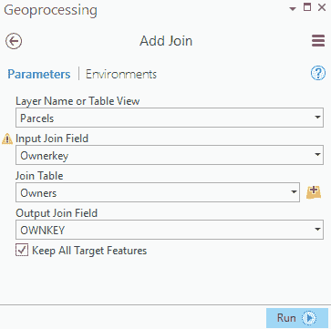

1.  一旦添加连接工具成功完成，点击窗格右上角的小 X 关闭地理处理窗格。

1.  在内容窗格中右键点击地块层，选择属性表。

1.  使用 Parcels 表底部的滚动条浏览表字段。

**问题**：您现在连接了地块和所有者表，看到了什么？

**答案**：

如您所见，之前在所有者表中存在的字段现在已经被添加到了地块属性表中。现在这些字段已经添加，您可以使用这些信息来定位特定所有者的所有地块，或者用所有者标签标记地块。让我们来测试一下。在下一个菜谱中，您将开始使用连接表中的字段来标记地块。

1.  点击标签页中显示的表名旁边的小 X 关闭 Parcels 表。

1.  在功能区中点击“项目”标签，然后点击左侧面板中的“保存”。

1.  如果您正在继续下一个菜谱，请保持 ArcGIS Pro 打开。如果您不继续，您可以关闭 ArcGIS Pro。

# 它是如何工作的...

在这个菜谱中，您将所有者表连接到了地块表。ArcGIS Pro 根据每个表中的键字段将这两个表链接在一起。键字段不需要有相同的名称，但必须具有完全相同的值和相同的数据类型。然后 ArcGIS Pro 比较这两个表，当值相同的地方，它会将这些字段和值添加到地图的主表中。当值不同时，它会为连接字段留空或空值。

连接只存在于您创建它的地图中。它不会应用于 ArcGIS Pro 项目中的其他地图。它也不会永久应用于要素类或表。连接在您想要链接来自其他系统或数据集的数据时效果最佳，这些数据集不会直接在您的 GIS 中维护，例如，所有者表是在县 CAMA 系统中维护的。您只需定期下载数据的更新版本，并用新表替换旧表，这样当您打开包含连接的地图时，您总是看到最新的可用信息。

# 使用连接表标记要素

现在您已经学会了如何连接表，并看到了它是如何将它们链接起来以提供更多信息，那么您可以用这些信息做什么呢？简而言之，您可以用连接信息做任何您可以在层的属性表中用正常属性做的事情。

在这个配方中，您将学习如何使用连接表中的数据标记要素。您将使用 PIN 和业主名称标记每个地块。您将使用新的 Arcade 语言来完成这项工作。您将在第十一章中了解更多关于 Arcade 的信息，*介绍 Arcade*。

# 准备工作

在您开始这个之前，您需要完成前面的配方。

# 如何做到这一点...

1.  如果您在完成前面的配方后关闭了 ArcGIS Pro，请按照前面配方开头所示的同一步骤打开`Joining Data.aprx`项目。

1.  在功能区地图标签页上点击书签。选择标签书签。这将使您放大到位于城市中心的区域。

1.  在内容窗格中选择地块层，以便出现带有三个新标签的要素层上下文菜单。

1.  在功能区中点击标签页。

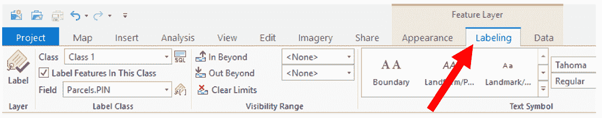

1.  点击标签页上的标签组中的标签按钮。它应该位于功能区最左侧。

文本将出现在地图上，显示每个地块的 PIN。正在显示的值是从地块层的属性表中提取的。如果您查看标签页上的标签类组，您会看到一个字段设置。它设置为 Parcels.PIN。这意味着正在显示的值是来自原始地块表的 PIN 字段中的值。您现在将使用 Arcade 语言构建一个表达式，该表达式将使用地块表的 PIN 和所有者从连接的业主表中标记每个地块。

1.  点击位于字段单元格右侧的表达式按钮。标签类面板应该出现在界面的右侧。这就是您将构建您的标签表达式的地方：

**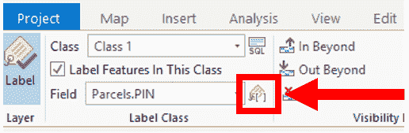**

1.  在标签类面板的表达式区域中点击`$feature[‘Parcels.Pin’]`，在表达式区域中输入`“PIN: “+`，如以下所示：

**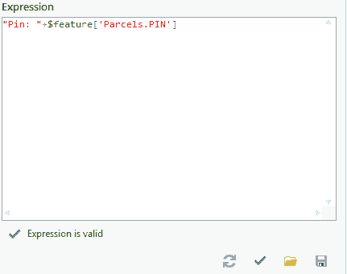**

1.  点击表达式区域底部的验证按钮。它看起来像绿色的勾号。如果它说表达式有效，请继续。如果不有效，请仔细检查您的表达式与前面的图形，以确保您输入了正确的语法。

1.  在表达式区域中，将以下内容添加到您已经创建的表达式末尾：`+Textformatting.Newline+"业主: "`.

1.  在标签类面板的字段窗口中，向下滚动直到看到 Owners.LASTNAME。双击 Owners.LASTNAME 将其添加到表达式中。

您的完整标签表达式现在应该是这样的：

```py
"PIN: "+$feature['Parcels.PIN']+Textformatting.Newline+"Owner: "+$feature['Owners.LASTNAME']
```

1.  再次点击验证按钮以验证您的语法。如果它说，您的表达式有效，请点击应用。如果不，请验证您的表达式。如果您继续遇到问题，请阅读以下提示：

如果您在创建表达式时遇到问题，可以加载一个已经创建的表达式。只需点击位于验证按钮旁边的导入按钮，导航到`C:\Student\ArcGISProCookbook\Chapter3\Joining Data`。选择`PIN_Owner_Label_Expression.lxp`。然后点击确定导入表达式。

1.  保存您的项目。

您已经使用原始地块属性表中的 PIN 字段和所有者表中的 LastName 字段找到的每个地块进行标记。您还添加了描述性文本到标签，使其更容易知道标签是什么。现在您将清理您的标签，使它们更容易阅读。

ArcGIS Pro 支持多种语言编写标签表达式。除了 Arcade 之外，您还可以使用 Python、VBScript 和 Jscript 编写表达式。为 ArcMap 编写的标签表达式，并保存到表达式文件（`.exp`）中，与 ArcGIS Pro 不兼容。

1.  在标签类窗格中，点击位置选项卡，如图下所示：

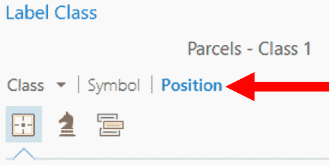

1.  点击标签类窗格位置选项卡中的位置按钮。

1.  如果需要，展开放置选项，并从下拉菜单中选择土地地块放置。

1.  定位到说水平在多边形的地方，点击下拉箭头。在多边形中选择直线。

1.  点击标签类窗格顶部的适配策略按钮。它看起来像一枚骑士棋子。

1.  点击小箭头展开“缩小尺寸”。

1.  点击旁边的“减少字体大小”框以启用此功能。

1.  设置以下参数：

    +   字体大小减少：

        +   下限：4.0

        +   步长间隔：1.0

    +   字体宽度压缩：

        +   下限：60

        +   步长间隔：5.0

标签类窗格现在应该看起来像以下截图：

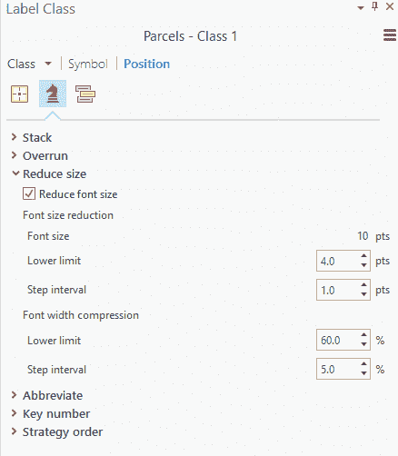

1.  点击功能区中的标签选项卡。

1.  在可见范围组中，点击“超出”的下拉箭头，选择<当前>。这意味着您刚刚配置的标签只有在放大到地图当前比例时才会显示。如果您缩小以显示更大的区域，标签将不会显示。

**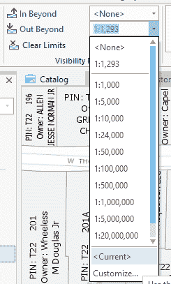**

1.  保存您的项目。

在这个菜谱中，您使用 Esri 的新 Arcade 表达式语言，将地图中的地块用 PIN 字段在地块属性表中的值和从上一个菜谱中连接到地块的所有者表中的 LASTNAME 字段的值进行标记。您是这样做的。

在表达式的第一部分，您添加了描述性文本，使用户知道标签的值是什么。您在 Arcade 中使用双引号来完成此操作。这告诉 ArcGIS Pro 简单地显示双引号内找到的文本值。例如，您的表达式包含`“PIN: “`。这产生了一个在地图上显示为`PIN:`的标签。

然后是对数据库字段的引用。在 Arcade 中，您使用`+`来表示表达式的另一部分，然后是`$feature[‘Parcels.PIN’]`。这显示了在地块属性表中的 PIN 字段中找到的值。必须在表达式的每一部分之间使用`+`符号。然后，您在标签的另一行上显示所有者名称，在表达式中使用`Textformatting.Newline`。一旦将所有者名称设置为单独一行，您通过在表达式中包含`“Owner: “`来添加更多描述性文本。最后，您通过在表达式的末尾包含`$feature[‘Owners.LASTNAME’]`来调用连接的所有者表中的 LASTNAME 字段，显示了每个地块在地图上的标签，如下所示：

+   PIN：`T22 028`

+   所有者：`未知`

然后，您在标签类窗格中调整了几个标签的配置设置，以使标签更好地适应地块并更容易阅读。您通过将放置选项设置为土地地块放置来完成此操作。这会自动应用 ArcGIS Pro 中预先配置的一些设置，用于在地块内放置文本。这清理了几个重叠的标签，但仍有许多地块没有标签。

因此，接下来您将定位设置为多边形中的直线，而不是默认的横向。这允许 ArcGIS Pro 在需要时以对角线方式在多边形内适应标签，首先调整字体大小。这允许 ArcGIS Pro 为更多地块添加标签，但仍然不是全部。

接下来，您转到拟合策略，调整标签的字体大小。您启用了“减小字体大小”。这允许 ArcGIS Pro 在您指定的参数内自动调整字体大小，以帮助将标签适应地块。通过这次调整，您能够为视图中的所有地块添加标签。

# 在连接的表中查询数据

标记不是您可以使用连接表做的唯一事情。您还可以使用连接的信息来执行查询和分析。在本食谱中，您将执行查询以定位 Thomaston 市拥有的所有地块。然后，您将使用地理处理工具将此信息导出到电子表格中。

# 准备工作

在您执行此食谱之前，您必须完成本章中标题为“连接两个表”的食谱。您还需要安装 Microsoft Excel 或类似的应用程序，该程序可以打开电子表格。

# 如何做到这一点...

1.  如果你完成了前面的食谱后关闭了 ArcGIS Pro，请按照前面食谱开头所示的同一步骤打开`Joining Data.aprx`项目。否则，继续此食谱。

1.  点击功能区上的地图标签页。

1.  点击地图标签页上的导航组中的全范围按钮。它看起来像一个小地球。

1.  在功能区地图标签页上的选择组中点击选择属性工具。这将在地理处理窗格中打开选择图层属性工具。

1.  使用下拉箭头将图层名称或表视图设置为包裹。

1.  确保选择类型设置为新的选择。

1.  在表达式下，点击添加条款按钮。

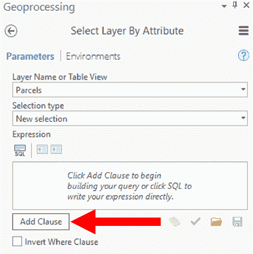

1.  使用下拉箭头将字段设置为 LASTNAME。

1.  确保运算符设置为等于。

1.  在最后一个单元格中，要么输入汤姆斯顿市，要么使用下拉箭头从显示的值列表中选择它。

**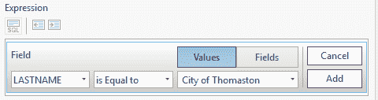**

1.  确认你的条款看起来像前面的截图，然后点击添加。

1.  点击位于表达式下方下面的验证按钮，以确保你的语法正确。验证按钮看起来像绿色的勾号。

1.  如果你的 SQL 表达式有效，点击运行。

1.  点击位于内容窗格顶部的列表按选择按钮。按钮是三个多边形，一个蓝色和两个白色。查看包裹右侧的数字。确认你已经选择了 84 个包裹。

你刚刚使用属性查询选择了汤姆斯顿市拥有的所有包裹。你能够做到这一点是因为使用了连接的“所有者”表中的数据。

如果你已经熟悉编写 SQL where 子句，你可以点击位于表达式下方的小 SQL 按钮，手动输入你刚刚构建的查询。正确的语法将是`Owners.LASTNAME = 'City of Thomaston'`。

1.  点击位于地理处理窗格顶部的圆形中的小箭头。

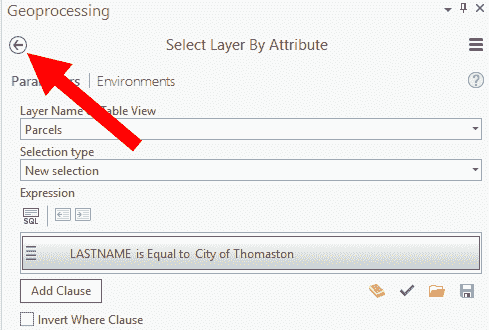

1.  点击位于工具箱标签页顶部的工具箱标签。

1.  通过点击小箭头展开转换工具箱。

1.  使用相同的方法扩展 Excel 工具集。

1.  双击“表到 Excel”Python 脚本。

在工具箱中，不同的图标表示不同类型的工具。锤子表示系统工具。卷轴表示 Python 脚本。一系列连接的方块表示使用模型构建器创建的模型。

1.  使用下拉箭头将输入表设置为包裹。

1.  对于输出 Excel 文件，点击单元格末尾的浏览按钮。

1.  在出现的“另存为”窗口中，导航到位于`C:\Student\ArcGISProCookbook\`的 MyProjects 文件夹。

1.  在文件名单元格中输入“汤姆斯顿市拥有的包裹”。

1.  确认你的“另存为”窗口看起来类似于以下截图，然后点击保存。你在 MyProject 文件夹中看到的文件夹将不同。


1.  您的 Table to Excel 工具应该看起来如下。如果它看起来是这样，请点击运行。

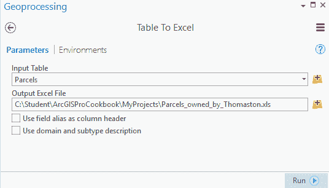

当您运行具有选定要素的地理处理工具时，该工具仅对选定的要素起作用。因此，在这种情况下，您只导出了由汤姆斯顿市拥有的地块到电子表格中。

1.  打开文件资源管理器。它通常位于您的任务栏靠近开始按钮的位置，看起来像是一个放在夹子里的文件文件夹。

1.  在左侧的树状结构中，根据您正在运行的操作系统选择 This PC 或 My Computer。

1.  双击您的 C:\ 驱动器。

1.  导航到 `C:\Student\ArcGISProCookbook\MyProjects`。您应该能看到您刚才从 ArcGIS Pro 创建的电子表格。

1.  双击 Parcels_owned_by_Thomaston.xls 文件以打开它。花点时间探索电子表格，看看您创建了什么。

1.  审查完电子表格后，关闭它并返回 ArcGIS Pro。

1.  在 ArcGIS Pro 中点击回到地图选项卡。

1.  在功能区地图选项卡的“选择”组中点击清除按钮。这将取消选择所有选定的要素。

1.  关闭地理处理面板。

1.  保存您的项目并关闭 ArcGIS Pro。

在本菜谱中，您查询了汤姆斯顿市拥有的所有地块，然后将所选列表导出到电子表格中。要查询市拥有的地块，您使用查询构建器创建了一个 SQL WHERE 子句。这允许您在不了解 SQL 的情况下创建 SQL 表达式。

**SQL** 代表 **结构化查询语言**。SQL 是数据库用于通信的标准语言。它允许您在关系数据库中执行许多功能。WHERE 子句允许您选择满足特定标准的记录（或 GIS 中的要素）。在您刚刚完成的菜谱中，标准是地块所有者等于汤姆斯顿市，因此它被称为 WHERE 子句。像所有语言一样，SQL 有一个特定的语法，必须遵循才能工作。您使用的 ArcGIS Pro 查询构建器知道这个语法，并会根据您提供的参数自动创建正确的表达式。您使用了创建要素类地理处理工具来生成新的 shapefile。在您创建了新的 shapefile 之后，您向表中添加了属性字段，这些字段将存储有关街道标志的附加信息。

在您选择了汤姆斯顿市拥有的地块之后，您使用转换工具箱和 Excel 工具集中的 Table to Excel python 脚本工具将它们导出到电子表格中。Python 是一种脚本语言，它已被大量集成到 ArcGIS 平台中。可以创建 Python 脚本来帮助自动化和简化工作流程。要了解更多关于使用 Python 与 ArcGIS 的信息，我们推荐 Packt Publishing 出版的 Eric Pimpler 所著的 *Programming ArcGIS with Python Cookbook, 2nd Edition*。

# 创建和使用关联

连接（Join）只是您在 ArcGIS Pro 中可以用来链接数据的几种基本方法之一。另一种方法是“关联”（Relate）。关联将两个表连接在一起，但与添加信息到主表的连接不同，关联后的两个表仍然保持独立。这允许您查看链接表中所有相关的记录。

当您的主表中有一个记录与链接表中的多个记录匹配，或者当主表中有多个记录与链接表中的多个记录匹配时，关联（Relate）效果最佳。在这些情况下，连接（Join）可能不会很好地工作，因为它会有多个匹配的记录。

在本食谱中，您将在包裹和土地销售表之间创建一个关联。土地销售表包含过去几年内发生的所有土地销售。此表也来自县 CAMA 系统，就像所有者表一样。一旦关联这两个表，您将看到如何查看所选包裹的所有销售记录。

# 准备工作

您需要确保 ArcGIS Pro 和书籍数据已安装。本食谱不基于之前的食谱，因此，在开始本食谱之前，您不需要完成任何之前的食谱。

# 如何操作...

1.  启动 ArcGIS Pro 并打开位于`C:\Student\ArcGISProCookbook\Chapter3\Creating and using a Relate`的`Creating and using a Relate.aprx`项目。

1.  在 ArcGIS Pro 界面的右侧的目录窗格中，单击小箭头以展开数据库。

1.  展开 Thomaston.gdb 地理数据库，以便查看其内容。

1.  右键单击“包裹销售”表并选择“添加到当前地图”。该表应随后出现在内容窗格列表的底部。

1.  右键单击“包裹”层并选择“属性表”。

1.  右键单击“包裹销售”表并选择“打开”。

1.  使用您在之前的食谱中学到的技能，尝试确定每个表中的关键字段，这些字段将用于将两个表连接在一起。请记住，关键字段必须包含相同的数据值，并且是相同的字段数据类型。字段名称不需要相同。

**问题**：每个表中的关键字段是什么？

**答案**：

审查完每个表后，关键字段应该很容易识别。Realkey 是每个表中唯一具有相同数据值和相同数据类型的字段。

1.  在“包裹属性表”（Parcels Attribute Table）中，右键单击“Realkey”字段并选择“降序排序”。

1.  在“包裹属性表”中，找到具有 15812 实际键值（Realkey value）的记录。

您也可以使用“按属性选择”工具创建一个查询，该查询将选择所有具有 15812 实际键值（Realkey value）的包裹。

**问题**：表中包含实际键值（Realkey value）为 15812 的行数有多少？

**答案**：

1.  在“包裹销售”表（Parcels_Sales table）中，右键单击“REALKEY”字段并选择“降序排序”。

1.  在 Parcels_Sales 表中，找到 REALKEY 值为 15812 的行。您可能需要向下滚动直到看到该值，或者您可以使用“按属性选择”工具来选择记录。

**问题**：Parcels_Sales 表中有多少条记录的 REALKEY 值为 15812？

**答案**：

您现在应该知道有一个地块和两个销售记录具有 15812 的 realkey 值。这意味着您有一个一对多基数，这对于关联来说效果很好。现在您需要配置关联以将地块与 Parcels_Sales 表链接起来。

**基数**指的是一个表中的记录与另一个表中基于键字段中找到的值匹配的记录数。有四种类型的基数：一对一、一对多、多对一和多对多。这两个表中的记录之间的关系可能会影响您如何使用它们。传统上，在较老的 Esri 软件（如 ArcMap）中，如果您有一对一或多对多，您总是会想使用连接。如果您有一对多或多对多，您总是会想使用关联。但在 ArcGIS Pro 中并非如此。ArcGIS Pro 提供了更多的灵活性，因此您可以根据需要使用数据来选择连接或关联。

1.  在内容窗格中右键单击“地块”图层。转到“连接和关联”并选择“添加关联”。添加关联工具应该在 ArcGIS Pro 界面右侧打开地理处理窗格。

**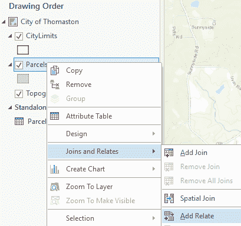**

1.  确保图层名称或表格视图设置为“地块”。由于您在“地块”图层上右键单击以添加关联，因此这应该会自动填充。

1.  使用下拉箭头将输入关联字段设置为 Realkey。

1.  关联表和输出关联字段应该会自动填充，因为您的地图中没有其他独立的表。

1.  将关联名称更改为“地块销售”。

1.  确认您的添加关联工具看起来与以下图像类似。如果它确实如此，请点击运行。

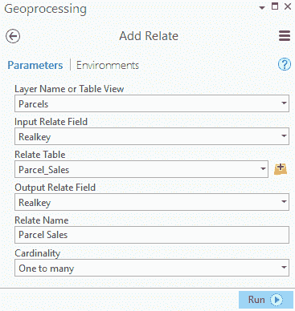

1.  一旦添加关联工具成功完成，请关闭地理处理窗格。

1.  保存您的项目。

1.  在功能区中选择地图标签页。

1.  通过点击激活“探索”工具。将鼠标指针移至城市的大致中心，通过将鼠标滚轮远离您来放大地图，直到您的地图比例与以下类似。

**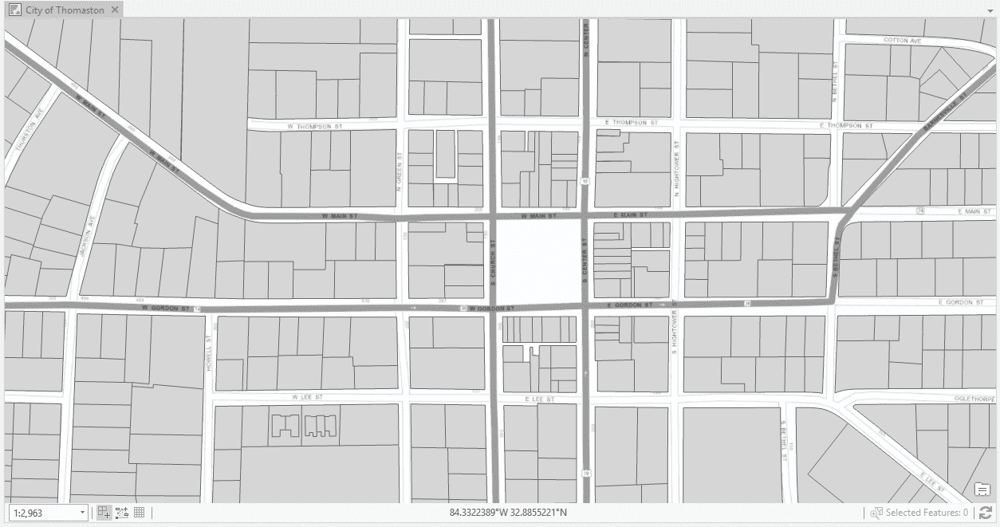**

以城镇广场为中心，放大到 1:2,900 +/-

1.  在表格视图中点击“地块属性表”。

1.  点击内容窗格顶部附近的“按选择列表”按钮。

1.  如果已勾选，请点击位于 CityLimits 图层旁边的复选框，使其不可选择。

1.  在内容窗格中选择“地块”图层。

1.  在功能区地图标签页中选择选择工具。

1.  点击以下截图所示的地块：

****

选择位于城镇广场正西方向的地块

1.  点击功能区中的数据选项卡。

1.  点击相关数据按钮，并选择如前所示 Parcel_Sales:Parcel_Sales：

**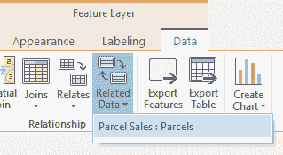**

显示所选地块被出售两次的记录应显示在 Parcels_Sales 表中。因此，如您所见，这两个表是链接的，但仍然保持独立。

1.  尝试选择几个其他地块，看看它们是否被出售多次。一些地块可能甚至一次都没有被出售。您可能需要为每个选择点击相关数据按钮，以查看相关记录。

1.  保存您的项目。

# 还有更多……

如在此菜谱中之前提到的，基数在选择是否使用连接或关联来链接表时是一个主要考虑因素，尤其是在使用较老的 Esri 应用程序，如 ArcMap 时。在 ArcMap 中，如果您有一对一或多对一基数，您应始终使用连接。然而，如果您有一对多或多对多，您应在 ArcMap 中使用关联，否则您将丢失数据，因为结果将是一个包含空值或仅显示第一个找到的匹配记录值的连接表。

ArcGIS Pro 的工作方式并非如此。只要它们位于同一数据库中，您就可以连接两个表，无论其基数如何。如果您在 ArcGIS Pro 中连接了具有一对多或多对多基数的两个表，您将看到所有匹配的记录。ArcGIS Pro 通过在表视图中为每个匹配项创建虚拟记录来实现这一点，如下所示：

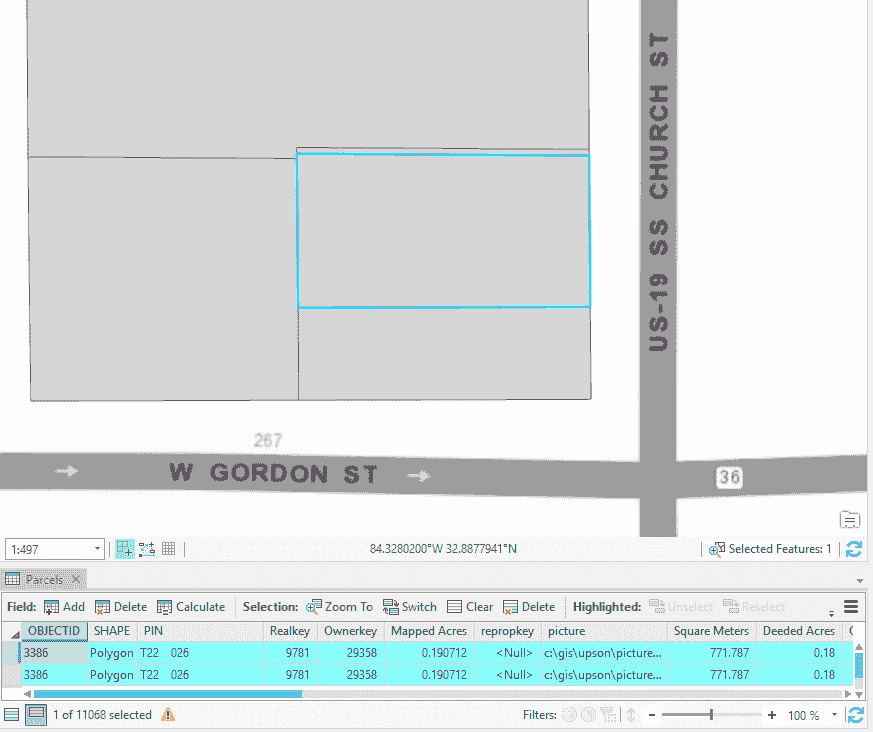

单个地块被选中，但在属性表中显示了两个记录

如您所见，您选中了一个单一的地块，但在图层表视图中显示了两个记录。这是因为 Parcels_Sales 表被连接到 Parcels 属性表。如您在菜谱中看到的，这些表之间存在一对多基数。因此，Parcel_Sales 表中有两个与所选地块相关的销售记录，并且都显示出来。

在 ArcGIS Pro 中，这种方法通过一对多和多对多连接表具有其他优势。您可以使用连接表中每条记录的值来标记要素。这是 ArcMap 用户无法做到的。然而，请记住，这仅适用于同一数据库中的表。如果表位于两个不同的数据库中，或者格式不同，例如将电子表格链接到地理数据库要素类，那么关于何时使用连接和何时使用关联的正常规则仍然适用。

如果您愿意，可以使用在此和上一个菜谱中学到的技能将 Parcel_Sales 表连接到 Parcels 层。然后通过在查看属性表的同时选择几个地块来探索这种连接的工作方式。

# 空间要素连接

因此，在之前的菜谱中，您已经看到了如何使用连接或关联将外部数据链接到图层或其他表。然而，如果您想从一个图层传输数据到另一个图层，但没有可用于链接数据的键字段，该怎么办？也许这两个图层相互重叠，或者相邻，或者共享某种其他空间关系，肯定应该有某种方式可以根据空间关系将两个图层链接或连接在一起。

您可以根据空间关系将两个图层合并在一起。这被称为**空间连接**。空间连接创建一个新的要素类，根据您在运行工具时定义的空间关系将连接要素类的属性添加到目标要素类。目标要素类和连接要素类不必是同一类型。您可以空间连接线与多边形、点与线或点与多边形，以及相同要素类型的要素。

当您运行空间连接工具时，您可以指定连接操作。这决定了如果发现多个连接特征与单个目标特征具有相同的空间关系，则如何在输出要素类中处理目标特征和连接特征之间的连接。此选项包括：

+   JOIN_ONE_TO_ONE：当选择此选项时，如果目标层中的单个特征与连接层中的多个特征匹配，因为它们具有相同的空间关系，则将根据您配置的字段映射合并规则聚合所有匹配的连接特征的属性。例如，如果您将目标层设置为道路中心线，并且一条道路中心线穿过您连接层中的两个湿地多边形，则这两个湿地多边形的属性将在被传输到输出线要素类之前进行聚合。如果一个湿地多边形的面积值为 2 英亩，另一个的面积值为 5 英亩，并且指定了平均值合并规则，则输出要素类中的聚合值将是 3.5。

+   JOIN_ONE_TO_MANY：当选择此选项时，如果目标层中的单个特征被发现与连接层中的多个特征匹配，因为它们具有相同的空间关系，则结果输出要素类将包含多个记录，代表单个目标特征及其与连接层中每个匹配特征的匹配。使用与之前相同的例子，如果一条道路中心线穿过两个湿地多边形，输出要素类将包含两个道路中心线：一个将具有它穿过的其中一个湿地多边形的属性，另一个将具有另一个湿地多边形的属性。

在这个菜谱中，你被要求为每条污水管线和污水检查井分配其所在流域的名称。这是污水管理员每年必须提交给州政府的年度报告。你拥有你所在地区的现有流域边界，并且你有污水管线和污水检查井图层，因此你将使用空间连接地理处理工具将每个流域的名称分配给其内部的污水要素。

# 准备工作

这个菜谱可以用 ArcGIS Pro 的任何许可级别完成。不需要完成任何其他菜谱，尽管建议你完成第一章，“ArcGIS Pro 功能和术语”中的菜谱。这将确保你拥有成功完成此菜谱所需的基本技能。当然，你必须在开始之前安装示例数据。

# 如何做到这一点...

1.  启动 ArcGIS Pro 并打开位于`C:\Student\ArcGISProCookbook\Chapter3\Spatial Join\`的`Spatial_Join.aprx`项目。

1.  在内容面板中右键单击“污水检查井”图层，然后单击“属性表”。

1.  探索“污水检查井”图层属性表并回答以下问题：

**问题**：你在“污水检查井”图层的属性表中看到了哪些字段？

**答案**：

你会注意到它没有指明每个检查井位于哪个流域。因此，你需要为每个检查井添加这个属性。幸运的是，你确实有一个显示每个流域边界及其名称的流域图层。你将能够使用空间连接将此信息添加到检查井中。首先，你将探索“流域”图层的属性表。然后，你将使用空间连接工具。

1.  右键单击“流域”图层并选择“属性表”。

1.  探索“流域”图层属性表中的字段。

**问题**：你在“流域”图层的属性表中看到了哪些字段？

**答案**：

1.  在工具栏中单击“分析”选项卡。

1.  从工具栏中的“分析”选项卡的工具组中选择“空间连接”工具。这将打开包含“空间连接”工具的地理处理面板。


选择“空间连接”工具

1.  使用下拉箭头将目标要素设置为“污水检查井”。

1.  使用下拉箭头将连接要素设置为“流域”。

1.  对于输出要素类，单击浏览按钮。然后在输出要素类对话框窗口左侧的树中选择项目下的数据库文件夹。

1.  双击“Spatial_Join.gdb”。

1.  在“名称”单元格中键入`Sewer_Manholes_Watersheds`并单击“保存”。

1.  使用下拉箭头将连接操作设置为“一对一连接”。

1.  将匹配选项设置为“在内部”。这是将流域名称与流域内的每个检查井连接的空间关系。

1.  确认你的空间连接工具看起来如下，然后单击“运行”。

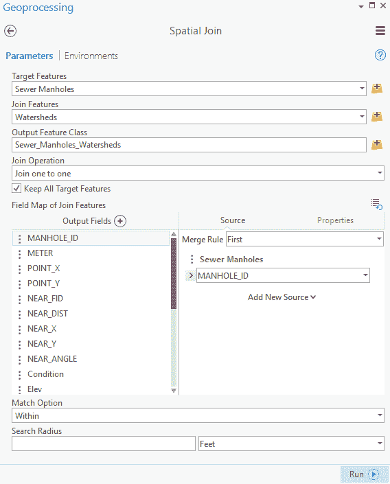

1.  当空间连接工具完成时，关闭地理处理面板。

1.  应该已经有一个新的图层添加到您的地图中，称为`Sewer_Manhole_Watersheds`。右键单击这个新图层并选择属性表。

**问题**：这个新图层的属性表包含哪些字段？

**答案**：

**问题**：新的表格与下水道检查井和流域图层的属性表相比如何？

**答案**：

如您所希望看到的，新图层包含了下水道检查井和流域图层的合并属性。输出是一个新的点图层，因为目标是下水道检查井，它是一个点图层。

1.  关闭属性表并保存您的项目。

1.  现在，使用相同的过程在下水道线和流域之间执行空间连接。但是，这次将匹配选项设置为相交，并将输出要素类设置为`Sewer_Lines_Watersheds`。

1.  您的空间连接工具应该看起来像这样。如果它确实如此，请单击运行。

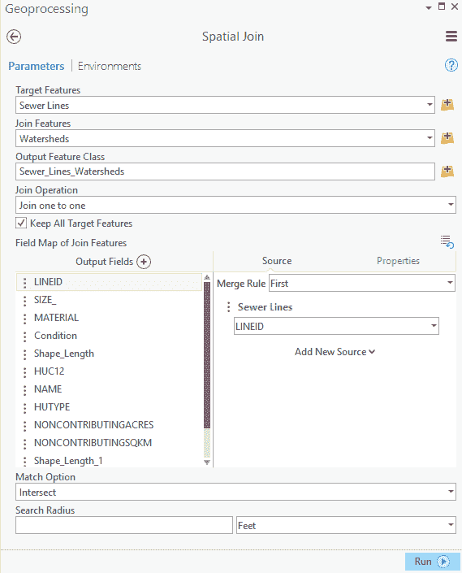

1.  `Crimes_2014`表应该出现在内容面板中。右键单击表并单击打开。

1.  一旦工具完成，关闭地理处理面板并保存您的项目。

当工具完成时，您创建的新图层应该被添加到地图中。如果您打开属性表，您也会看到它也包含了来自两个输入的合并属性。这次，输出是一个线图层而不是点图层，因为目标图层是下水道线图层，正如其名称所示，它是一个线图层。

1.  关闭 ArcGIS Pro。

您现在已经看到了如何使用空间连接将两个不同图层中的数据合并到一个单独的图层或要素类中。这可以增加您可以对数据进行分析的类型或您如何显示数据的方式。记住，当您执行空间连接时，它确实创建了一个新的数据层。这意味着您的原始数据仍然完好无损，供您使用。

# 创建特征链接注释

您现在已经看到了如何使用连接或关联，基于一个共同的键字段，基于空间关系将数据链接在一起。这些方法非常有用。然而，它们确实有限制。连接和关联仅存在于单个地图中，并且不容易转移到其他地图或项目中。空间连接创建新的要素类或表，同时仍然保留原始数据不变。那么，是否有办法永久地将两个表或两个要素类链接在一起？

答案是肯定的，如果数据都在同一个地理数据库中。在地理数据库中，您可以创建一个关系类。关系类永久地将数据链接在一起，并且链接会传递到您使用数据的任何地图、场景或项目中。您可以在两个要素类、两个独立表或一个要素类和一个独立表之间创建关系类。

关系类别比我们在之前的菜谱中查看的其他方法提供了更大的灵活性。您不仅可以链接数据以便访问附加信息，相关数据还可以影响行为或内容。例如，如果我将下水道线要素类与检查井要素类相关联，关系类别可以配置为允许一个要素类的属性值传递到另一个要素类，或者如果我在一个要素类中删除一个要素，它也会删除另一个要素类中连接的要素。

最容易创建的关系类别之一被称为**要素链接标注**。在此菜谱中，您将创建要素链接标注并探索其行为。

# 准备工作

要完成此菜谱，您需要 ArcGIS Pro 的标准或高级许可证。基本许可证不支持此级别的功能。如果您不确定您拥有哪种许可证，可以通过以下方式进行检查。打开 ArcGIS Pro，在启动窗口的左下角，您通常会选择一个项目来打开的地方，点击关于 ArcGIS Pro。然后从左侧的列表中选择许可证。这将显示您可用的许可证级别以及您可能有权访问的任何扩展。

如果您只有基本许可证，请咨询您的账户管理员，看他们是否可以至少暂时为您分配标准或高级许可证。如果无法获得更高版本的许可证，您可以通过访问他们的网站，在[`www.esri.com/arcgis/trial`](http://www.esri.com/arcgis/trial)从 Esri 请求试用许可证。这将为您提供访问 ArcGIS Pro 的高级许可证以及更多功能的权限。

# 如何操作...

1.  您将首先启动 ArcGIS Pro。然后打开位于`C:\Student\ArcGISProCookbook\Chapter3\FeatureLinkedAnno`的`FeatureLinkedAnno.aprx`。

1.  项目应从一个名为 `Trippville` 的单个地图开始。在地图选项卡上的导航组中点击书签按钮。选择标注区域以缩放到 Trippville 的中间位置。

1.  在内容窗格中，选择 Street Centerline 层。

1.  从功能区，选择标注选项卡，它出现在要素层上下文选项卡中。

1.  在标注选项卡上的地图组中，选择更多下拉菜单。

1.  点击标注选项卡最左侧的标注按钮以打开 Street Centerlines 层的标注。确保未选中使用 Maplex 标注引擎。如果是，点击它以取消激活。如果您收到有关切换标注引擎的警告，请点击是。

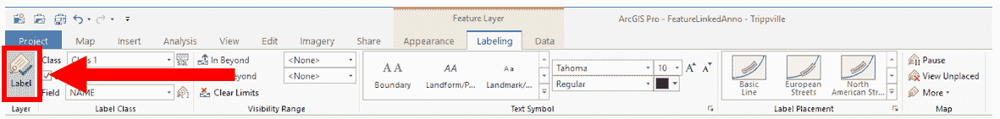

在最左侧选择标注按钮

1.  在标注选项卡上的标注类别组中，使用下拉箭头滚动到字段，将字段定位设置为 ST_NAME。

1.  在标注选项卡上的标注位置组中，选择曲线线。

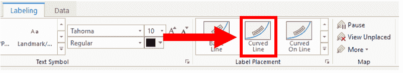

1.  请验证在标签选项卡的文本符号组中，您的字体设置为 Tahoma，大小为 10，颜色为黑色。

您已经为地图上的街道名称添加了标签。如果您已配置一切，您的地图现在应该看起来非常类似于以下图像。由于您的显示器尺寸不同或您可能打开了其他窗格，您的地图可能不会完全匹配。

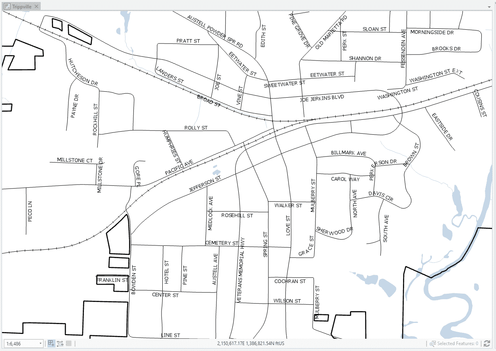

1.  在功能区中单击地图选项卡。

1.  在地图选项卡的右侧末端，单击“转换为注释”按钮。这将打开 Geoprocessing 窗格中的“将标签转换为注释”工具。

ArcGIS Pro 支持在地图或场景中显示两种类型的文本。第一种是标签。标签是与特定图层及其关联属性相关联的动态文本。用户可以配置一些设置，计算机将在尝试确定标签放置位置或是否放置标签时使用这些设置。然而，用户无法单独放置一个标签并保证它始终出现或位于一致的位置。最终决定由计算机做出。标签非常有用，因为它们会自动调整，以适应您的地图视图的大小或位置变化。注释是显示文本的另一种方法。注释是固定文本，可以单独放置和修改。这提供了对文本的更大控制，允许您将其放置在您想要的确切位置，并以您想要的方式显示。它的主要缺点是维护起来更加费时，并且不能在所有比例下工作。要素关联注释是两者的最佳结合。它提供了注释的控制，并具有标签的一些动态行为，您将在本食谱中看到这一点。

1.  请验证输入地图设置为 Trippville。

1.  单击位于输出地理数据库右侧的浏览按钮。在出现的输出地理数据库窗口左侧的面板中，单击数据库文件夹。双击 Trippville_GIS.gdb。选择 Base 要素数据集，然后单击确定。

1.  对于范围，使用下拉箭头从列表中选择 Street Centerlines 图层。

1.  通过单击其旁边的框来启用“创建与要素关联的注释”。将出现两个其他选项，即“在添加新要素时创建注释”和“在要素形状修改时更新注释”。确保它们都处于启用状态。

1.  将输出图层更改为 StreetNames。

1.  请验证您的“将标签转换为注释”看起来如下所示，然后单击运行：

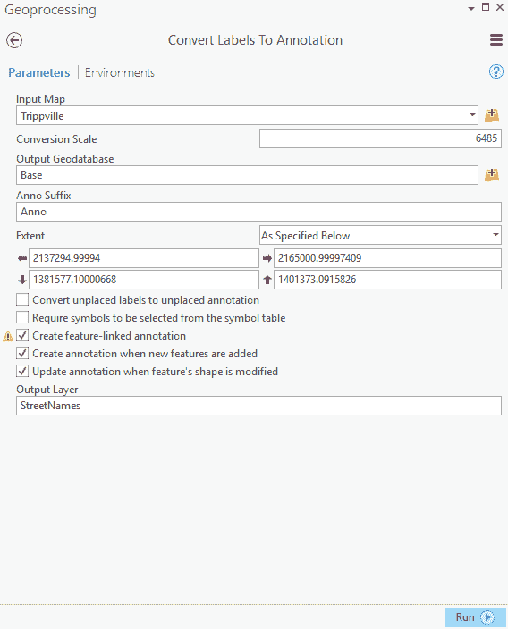

1.  如果工具运行成功，您刚刚创建的新 StreetNames 图层应该会出现在内容窗格中。如果新图层没有出现，请关闭 Geoprocessing 窗格。

1.  现在，让我们看看您创建的内容。在内容窗格中，通过单击位于图层名称旁边的小箭头来展开 StreetNames 图层。

1.  选择 Street_CenterlinesAnno 层。右键点击它，并从出现的上下文菜单底部选择属性。

1.  在图层属性窗口的左侧面板上的列表中选择源选项，然后回答以下问题：

**问题**：新层的数据类型和要素类型是什么？

**答案**:

**问题**：引用该层的要素类所命名的数据库是什么，它位于哪里？

**答案**:

**问题**：您创建的、由新层引用的要素类的名称是什么？

**答案**:

当您回答前面的问题时，您可以看到，将数据转换为注释工具不仅在您的地图中创建了一个新层，还在地理数据库中创建了一个新的要素类。它是一个注释要素类，是标准多边形要素类的专用版本；基本上它像一个文本框。像所有要素类一样，注释要素类是矢量数据的一种形式。因此，它既有空间组件也有属性组件。

1.  点击确定以关闭图层属性窗口。

1.  在内容面板中右键点击 Street_CenterlinesAnno 层。从出现的上下文菜单中选择属性表。

1.  花点时间探索您刚刚创建的新层的属性表，然后回答以下问题：

**问题**：Street_CenterlineAnno 层的表中包含哪些属性字段？

**答案**:

1.  点击内容面板顶部附近的位置的“按选择列表”按钮。它看起来像三个多边形，其中一个有蓝色填充。

1.  将 Street Centerlines 和 Street_CenterlinesAnno 层设置为可选择，其他所有层设置为不可选择。带有复选框的层是可选择层，没有复选框的层是不可选择层。要更改可选择或不可选择的状态，只需点击层名称旁边的复选框。

1.  在功能区中的地图标签页中点击选择工具。如果您点击下拉箭头，选择矩形。

1.  在地图上点击 Pine 街的东南方向，继续按住鼠标按钮并将指针移动到 Pine 街的西北方向，如图所示，以便选择街道中心线和道路名称。

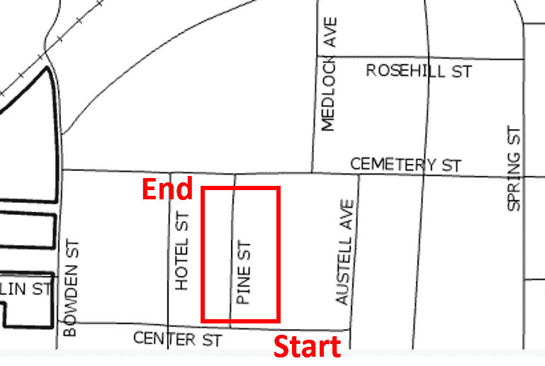

1.  在内容面板中右键点击 Street Centerline 层，并从出现的上下文菜单中选择属性表。

1.  在表视图的底部，点击“显示所选记录”按钮，仅显示所选街道中心线的属性。

1.  查看所选街道的属性值。特别注意 ObjectID 的值。

1.  确保在内容面板中仍然选中了街道中心线层，然后在功能区中的要素层上下文菜单中点击数据标签页。

1.  在功能区数据选项卡的关系组中，选择相关数据按钮。选择出现的 Anno_80_85:Street_CenterlinesAnno 选项。识别关系的数字可能不同。这应该打开 Street_CenterlinesAnno 层的属性表并选择相关的注释记录。

1.  查看所选记录的属性值，然后回答以下问题：

**问题**：Street_CenterlinesAnno 层的哪些字段包含与所选街道中心线相似的值？

**答案**：

您对所选街道中心线和相关注释的值进行比较应该已经揭示，街道中心线的 Object ID 与注释的 FeatureID 值匹配，街道中心线的 ST_NAME 值与注释的 TextString 值匹配。

两个要素类通过关系类相互链接，使用街道中心线的 ObjectID 和注释的 FeatureID 作为键字段，类似于您在之前的菜谱中使用键字段创建连接和关联的方式。正如您接下来将看到的，ST_NAME 字段和 TextString 字段也作为关系类的一部分进行链接。

1.  确保您仍然选择了 Pine St 中心线，然后单击功能区上的编辑选项卡。

1.  在编辑选项卡的选项组中，单击位于选择组中的属性按钮。

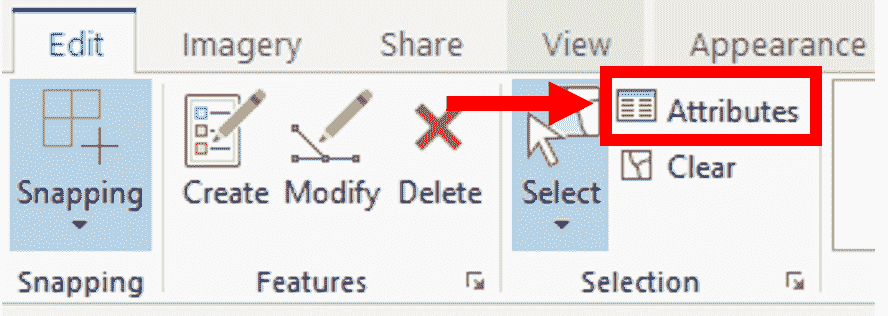

1.  在属性面板顶部的窗口中，选择街道中心线层。这应该在您选择层下方显示与该区域 Pine St 相关联的所有属性列表。

1.  在 ST_NAME 所在的单元格中单击，该单元格当前包含值`PINE ST`，并输入`OAK AVE`。完成后按*Enter*键。

注意地图中街道名称注释的变化。它也应该已经改变，因为 ST_NAME 字段与注释层的 TextString 字段相链接。在街道中心线层中更改 ST_NAME 值会自动更新注释层的值，这是由于您创建的关系类。对于链接的注释要素，这是一个单向关系。这意味着更改只从街道中心线层推送到 Street_CenterlinesAnno 层，但不会从 Street_CenterlinesAnno 层推送到街道中心线层。

1.  在编辑选项卡上，在选项组中单击清除按钮以清除选择。

1.  在内容面板中，右键单击街道中心线层并选择将其作为唯一可选择的层。

您可能需要确保您仍在内容面板中的列表选项下查看。

1.  从编辑选项卡上的选择组中选择选择工具。

1.  单击新命名的 Oak Ave（以前是 Pine St）的街道中心线。

1.  在选择 Oak Ave 并且只选择 Oak Ave 的情况下，按你的*Delete*键或在功能区编辑选项卡上的特征组中的*Delete*按钮上单击。

注意，当你删除 Oak Ave 的街道中心线时，注释也会被删除。关系类不仅将字段链接在一起，还在每个特征类中的特征之间创建链接，因此删除中心线也会删除所有相关的注释特征。就像你之前探索的字段关系一样，这只是一个单向关系。这意味着如果你删除注释，它不会删除相关的街道中心线。

并非所有关系类都是单向关系。特征链接注释只是关系类如何工作的一个例子。它们可以根据你希望达成的目标以几种不同的方式配置。

1.  在功能区编辑选项卡上的管理编辑组中，选择丢弃以丢弃你已做的所有编辑。

1.  在目录窗格中，展开数据库文件夹，以便看到连接到项目的两个地理数据库。

1.  展开 Trippville_GIS.gdb 地理数据库以查看其内容。

1.  现在扩展基础特征数据集并检查其内容。你应该能看到两个由你所使用的两个图层引用的特征类，即 Street_Centerlines 和 Street_CenterlinesAnno。你也应该看到当你创建特征链接注释图层 Anno_80_85 时创建的关系类。再次强调，你的关系类名称可能包含不同的数字。

因为特征类和关系类作为对象存在于你的地理数据库中，它们可以被用于其他地图、场景或项目中。这比你在过去食谱中执行的连接和关联提供了更大的灵活性。

# 它是如何工作的...

正如你在本食谱中看到的那样，特征链接注释将一个图层中的文本链接到另一个图层中的特征。它是通过关系类来做到这一点的。就像连接和关联一样，关系类依赖于两个特征类的属性表中的键字段来在注释层中的文本特征和另一个特征类中引用的特征之间建立基本链接。在特征链接注释的情况下，键字段是在你使用转换为注释工具将街道中心线的标签转换为注释时自动确定的，并且配置了关系类。

特征链接注释利用了关系类提供的附加功能。除了将两个要素类关联起来以便您定位相关特征或记录外，它还允许您将特征的变化推送到注释中。这被称为**复合关系**。在复合关系中，源特征的存在或值控制或改变目标特征或记录的存在或值。您在更改中心线的街道名称并删除中心线时看到了这一演示，这导致了街道注释层的更改。

# 使用现有数据创建和使用关系类

您已经在前一个菜谱中看到了关系类的强大功能。您看到了如何将两个要素类链接在一起，不仅允许您访问链接特征的信息，还可以控制某些行为。然而，所有这些都是由“转换为注释”工具自动设置的。在许多情况下，您希望链接在一起的数据已经存在。那么，您如何创建一个关系类来将现有数据链接在一起？

在这个菜谱中，您将在一个要素类和一个独立表之间创建一个关系类。这将是在本章前面“创建和使用关联”菜谱中关联的相同地块层和销售表之间。然而，一旦建立了关系类，链接就变得永久，与关联不同，关联仅限于创建它的地图中。

# 准备工作

要完成这个菜谱，您需要 ArcGIS Pro 的标准或高级许可证。基本许可证不支持此级别的功能。如果您不确定您拥有哪种许可证，可以通过以下步骤进行检查。打开 ArcGIS Pro，在启动窗口的左下角，您通常会选择一个项目来打开的地方，点击“关于 ArcGIS Pro”。然后从左侧的列表中选择许可证。这将显示您可用的许可证级别，以及您可能有权访问的任何扩展。

如果您只有基本许可证，请咨询您的账户管理员，看他们是否可以至少暂时为您分配标准或高级许可证。如果无法获得更高版本的许可证，您可以通过访问他们的网站，在 [`www.esri.com/arcgis/trial`](http://www.esri.com/arcgis/trial) 从 Esri 获取试用许可证。这将为您提供访问 ArcGIS Pro 高级许可证以及更多内容的权限。

# 如何操作...

1.  正常情况下，您需要启动 ArcGIS Pro 并打开位于 `C:\Student\ArcGISProCookbook\Chapter3\RelationshipClass\` 的 `RelationshipClass.aprx`。项目应该以一个名为 Thomaston 的单个地图打开。如果您完成了前面的“创建和使用关联”菜谱，它应该看起来很熟悉。

1.  在内容面板中，您需要确认您能看到包裹层和包裹销售表。如果没有，请使用您已学到的技能，从连接到项目的 Thomaston.gdb 地理数据库中将它们添加到地图中。

1.  为了在包裹层和包裹销售表之间创建关系类，您需要确定两件事：每个表中的关键字段和基数。如果您完成了*创建和使用关系*配方，您将使用相同的关键字段，并且应该已经知道基数，因此您可以跳到*步骤 12*并继续。如果您没有完成该配方，请继续下一步。

1.  右键单击包裹层并选择属性表。

1.  右键单击包裹销售表并选择打开。

1.  点击位于表视图顶部的包裹销售名称，并将其拖动，直到鼠标指针位于前面的停靠图标上，如图所示：

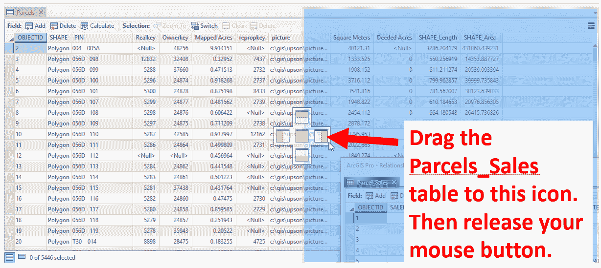

拖动并停靠表，以便它们可以并排显示

现在，两个表应该并排显示，这样您可以更容易地评估每个表：

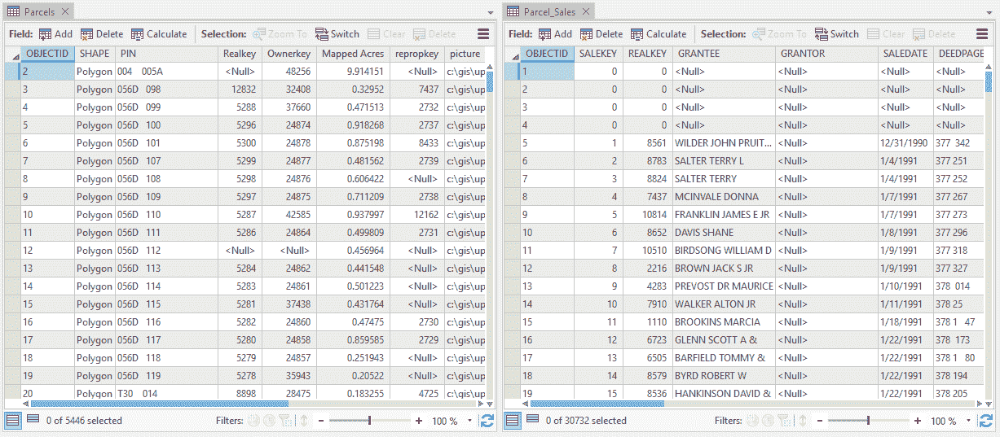

并排查看表

1.  审查每个表，以确定您将用于将两个表链接在一起的关键字段。请记住，关键字段必须包含相同的数据值，并且是相同的字段数据类型。字段名称不需要相同。

**问题**：每个表中的关键字段是什么？

**答案**：

审查完每个表后，关键字段应该很容易找到。Realkey 是每个表中唯一具有相同数据值和相同数据类型的字段。

1.  在包裹属性表中，右键单击 Realkey 字段并选择降序排序。

1.  在包裹属性表中，找到具有 15812 Realkey 值的记录。

**问题**：表中包含 15812 这个 Realkey 值的行数有多少？

**答案**：

1.  在包裹销售表中，右键单击 REALKEY 字段并选择降序排序。

1.  在包裹销售表中，找到具有 15812 REALKEY 值的行。您需要向下滚动直到看到该值，或者可以使用按属性选择工具来选择记录。

**问题**：包裹销售表中有多少条记录的 REALKEY 值为 15812？

**答案**：

1.  通过点击表视图名称旁边的小 X 关闭两个表。

1.  如果您在任一表中选择了任何记录，请点击地图选项卡上的选择组中的清除按钮。

您现在应该知道有一个包裹和两个销售记录具有 15812 这个 realkey 值。这意味着您有一个一对一的基数。因此，您知道您将需要创建关系类，该类将链接包裹层到包裹销售表。

1.  在目录视图中，展开数据库文件夹，以便您可以看到连接到项目的两个数据库。

1.  展开 Thomaston.gdb 地理数据库，然后右键单击它并选择关系。创建关系工具应在地理处理面板中打开。

1.  使用下拉箭头将原始表设置为 Parcels。这确立了 Parcels 作为关系的主表。

1.  使用下拉箭头将目标表设置为 Parcels_Sales。这将其确立为关系的次要或子表。

1.  输出关系类应自动填充为 Parcels_Parcels_Sales。如果您想更改名称，或者接受默认值。

1.  前向路径标签和反向路径标签也应自动填充。接受这些默认值。

1.  使用下拉箭头将消息方向设置为无，因为我们只想能够在表之间查看相关记录。我们不是试图让一个表控制另一个表中的信息。

1.  使用下拉箭头，将基数设置为 One to Many (1:M)，因为这是您之前确定的基数。

1.  将原始主键设置为 Realkey，将原始外键设置为 REALKEY。

1.  验证您的创建关系类看起来是否如下所示。如果是，请点击运行。

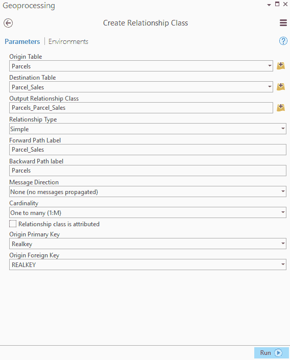

在地理处理面板中创建关系类窗口

1.  一旦工具成功完成，请关闭地理处理面板。

1.  在目录面板中，查看 Thomaston.gdb 地理数据库的内容。您应该看到您刚刚创建的新关系类。

1.  在目录面板中，右键单击关系类并选择属性。

1.  花点时间审查属性。它们应该反映您在创建关系类工具中定义的设置。

1.  审查完属性后，点击确定。

1.  现在来检查您创建的新关系类是否工作。在内容面板中选择地块层。

1.  使用探索工具，将视图缩放到 Thomaston 市中心的中心。放大以便您可以轻松地看到单个地块的边界。这应该在比例约为`1:4800`的位置。

1.  在功能区中的地图选项卡上，激活选择工具并点击地图上的单个地块。所选地块应有一个蓝色高亮边框。

1.  在功能区中的要素层上下文菜单中点击数据选项卡。

1.  选择相关数据按钮和显示的 Parcels_Parcels_Sales: Parcels 选项。Parcels_Sales 表应该打开，显示与您所选地块相关的任何销售。如果没有显示销售，请尝试选择另一个地块。

每次选择一个新的地块时，您都需要点击相关数据按钮来刷新表格视图。

1.  一旦您已验证关系类正在工作，请关闭表格视图。

1.  保存您的项目并关闭 ArcGIS Pro。

在本食谱中，你创建了一个关系类，将地块要素类链接到独立的地块销售表。这样永久性地将这两个对象在地理数据库中链接起来，因此你可以选择地图中的地块，并轻松地看到每次它从地块销售表中销售的情况。

此链接是通过在每个表中标识的关键字段建立的。关系类（如关联或连接）使用的关键字段必须包含相同的精确值，并且字段类型（文本、长整数、短整数等）必须相同。然而，字段名称不需要相同。然后 ArcGIS Pro 能够找到两个表中具有相同值的记录并将它们链接起来，正如你在本食谱中看到的那样演示的。

与连接或关联不同，关系类是地理数据库的一部分。这意味着每次你将地块要素类添加到任何项目中的地图时，你都可以通过相关数据功能自动访问地块销售表中的数据。

一旦创建了一个关系类，你就无法更改其配置。如果你想将简单的关系更改为复合关系，例如，你必须创建一个全新的关系类。
