# 第六章：投影和坐标系基础

在本章中，我们将涵盖以下内容：

+   确定现有地图的坐标系

+   设置新地图的坐标系

+   更改地图的坐标系

+   为数据定义坐标系

+   将数据投影到不同的坐标系

# 简介

GIS 之所以成为如此强大的可视化和分析工具之一，是因为它能够将多个信息层叠加到地图上。将我们的 GIS 数据放入现实世界的坐标系和投影中，是我们能够做到这一点的原因。通过将数据放入现实世界系统，我们将其与地球联系起来。这使得我们能够在地球表面上的任何地方定位特征，然后将它们带入地图中，以便我们可以看到这些特征在空间上的关系。

在 ArcGIS Pro 中，我们可以使用两种基本的坐标系类型，地理坐标系和投影坐标系。地理坐标系基于地球的 3D 模型，称为椭球体或地球椭球。椭球体通过大地基准与物理地球相联系。地理坐标系使用度作为它们的主要测量单位。

每个度数可以进一步分解为不同的子单位，例如十进制度数、分钟、十进分钟或分钟和秒。你经常会听到地理坐标系被称为**纬度**和**经度**：

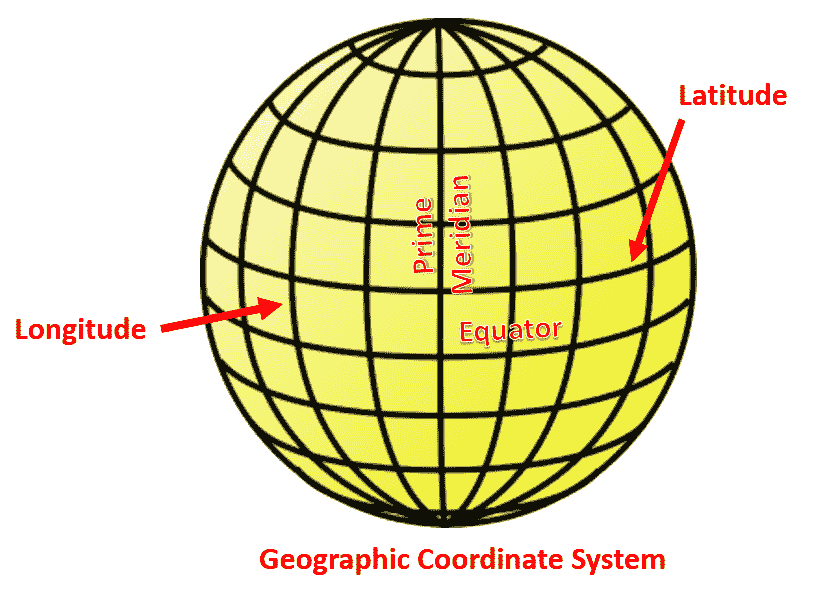

地理坐标系中主要使用的参考线是**赤道**和**本初子午线**。这些是确定定位特征位置所需的纬度和经度值的起点。地理坐标系可以非常精确地识别地球上的特征位置。然而，如图所示，纬度和经度线之间的距离并不一致。这取决于你在地球上的位置。这使得测量距离和面积变得困难。这就是投影坐标系发挥作用的地方。

投影坐标系在二维平面上定位和显示数据，使用笛卡尔坐标系。这使我们能够应用标准的线性测量单位，如英尺和米。投影坐标系的起点与地理坐标系相联系。这就是将投影坐标系与地球联系起来的原因。从起点出发，定义了*x*轴和*y*轴，以及单位，如下面的图所示。由于投影坐标系使用统一的单位，我们能够轻松地测量距离和面积：

当然，将三维表面（如地球）展平确实会向我们的数据中引入扭曲。因此，我们有不同的方法将三维模型中的数据投影到二维平面上以减少这些扭曲。有三种基本类型的投影，即平面投影、圆锥投影和圆柱投影。从那里它们可以变得更加复杂。

只要您的所有数据都位于现实世界的坐标系中，无论其类型如何，ArcGIS Pro 都可以在单个地图或场景中显示它，即使图层位于不同的坐标系中。它将在该地图或场景中实时将数据投影到公共坐标系。因此，确保所有空间数据都分配了正确的坐标系非常重要。否则，您的数据可能显示不正确，分析结果也可能不正确。

在本章中，您将学习如何在 ArcGIS Pro 中使用坐标系。您将从学习如何确定现有地图的坐标系开始。然后，您将学习如何为新地图设置坐标系。接下来，您将学习如何更改现有地图的坐标系。然后，您将学习如何为数据定义坐标系。最后，您将学习如何将数据从一个坐标系投影到另一个坐标系。

# 确定现有地图的坐标系

您在 ArcGIS Pro 中创建的每个地图和场景都使用坐标系来显示数据的位置。然而，它不仅会影响特征如何以及在哪里显示，还会影响您可以做什么。地图使用的坐标系可能会影响您是否可以通过 ArcGIS Online 分享它，图层叠加的好坏，等等。因此，了解您的地图使用的是哪种坐标系非常重要。

您添加到地图的第一个图层将定义该地图的坐标系。但如果你正在处理一个现有的地图，可能是一个别人创建的地图，你该如何确定你正在处理的现有地图的坐标系呢？

在本配方中，您将学习如何确定已分配给现有地图的坐标系。

# 准备工作

此配方确实要求在计算机上安装示例数据。您不需要完成任何先前的配方。然而，建议您在开始此配方之前完成第一章中的配方，*ArcGIS Pro 功能和术语*，或者在使用 ArcGIS Pro 之前有一些经验。您可以使用任何 ArcGIS Pro 许可级别完成此配方。

# 如何操作...

1.  请先使用在第一章中学习的技能启动 ArcGIS Pro，或根据您以前的用户经验。

1.  在 ArcGIS Pro 的启动窗口中，点击“打开另一个项目”：

1.  从打开窗口中选择计算机，然后点击右侧区域中的浏览。

1.  通过点击打开项目窗口左侧的`C:\`，导航到`C:\Student\ArcGISProCookbook\Chapter6\CoordinateSystems`。然后双击 Student、ArcGISProCookbook、Chapter6 和 CoordinateSystems 文件夹。

1.  选择 CoordinateSystems.aprx 项目文件，然后点击确定。

项目将以 Trippville 基本地图可见的方式打开。这是一个由其他人显然创建的现有地图：

1.  查看地图视图的底部，你应该会看到一个小的状态栏。这个状态栏显示地图的当前比例尺、启用功能的按钮、坐标显示以及其他信息：

1.  在地图内移动鼠标指针，同时观察鼠标指针坐标显示。然后回答前面的问题：

**问题**：地图中显示的是什么单位？

**答案**：

当你在地图内移动鼠标指针并观察坐标显示时，你应该看到值发生变化。第一个显示的值是鼠标指针在地图中的 X 值。第二个值是鼠标指针位置的 Y 值。显示单位为 US 英尺，如坐标右侧的 ftUS 所示。

当与投影坐标系统一起工作时，你可能看到 X 值也被称为**东向**，Y 值被称为**北向**。

通过查看坐标显示中的值可以帮助你确定你的地图可能使用的坐标系统类型，地理坐标或投影坐标。X 值大于 180 和 Y 值大于 90 可能表明你的地图正在使用投影坐标系统。

你可以在地图属性窗口中控制鼠标指针坐标显示中使用的单位。在常规选项中，你可以设置显示单位为任何你希望的价值。这可以与主要地图单位不同，主要地图单位基于分配给地图的坐标系统。

现在，是时候确定 Trippville 基本地图中确切使用的坐标系统了。

1.  在内容面板中，右键单击 Trippville 基本地图，并从出现的菜单中选择属性，如图所示：

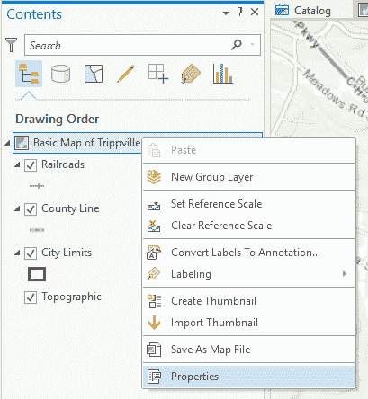

1.  在地图属性窗口的常规选项中，查看各种设置并回答以下问题：

**问题**：地图单位是什么？

**答案**：

**问题**：显示单位是什么？

**答案**：

1.  在地图属性窗口的左侧面板中点击坐标系统选项。

1.  在地图属性窗口的右侧面板中查看，在当前 XY 坐标系统下。回答以下问题：

**问题**：地图的当前 XY 坐标系统是什么？

**答案**：

1.  点击位于当前 XY 旁边的详细信息，如图下截图所示：

1.  检查与地图分配的坐标系统相关的详细信息。回答以下问题：

**问题**：正在使用哪种类型的坐标系统？

**答案**：

**问题**：指定的坐标系统正在使用哪种基准？

**答案**：

**问题**：为指定的坐标系统引用的是哪种椭球体或椭球面？

**答案**：

如你现在所看到的，地图正在使用乔治亚州平面西区，该区参考了 1983 年北美基准（NAD 83）。这是一个使用 GRS 80 椭球体的投影坐标系统。

1.  关闭坐标系统详细信息窗口和地图属性窗口。

1.  保存你的项目。

1.  如果你不会继续到下一个配方，你可以关闭 ArcGIS Pro。如果你会继续，请保持 ArcGIS Pro 打开。

你现在知道了如何确定现有地图的坐标系统。了解你所使用的坐标系统非常重要，因为它构成了图层之间空间交互的基础。如果地图未分配坐标系统，那么你将无法将图层组合成单个地图并期望它们正确叠加。

# 为新地图设置坐标系统

你现在知道了如何确定现有地图的坐标系统。但是，你如何将坐标系统分配给新地图？这相当简单。如前所述，你添加到新地图的第一个图层将设置地图的坐标系统。

在此配方中，你将在前一个配方中使用的项目中创建一个新的地图。然后，你将看到已为新地图分配了什么坐标系统。接下来，你将在地图中添加一个新的图层，并查看这将对地图的坐标系统产生什么影响。最后，你将添加另一个位于不同坐标系统中的图层，并检查这是否会改变地图的坐标系统。

# 准备工作

此配方确实需要将样本数据安装在计算机上。建议你在开始此配方之前完成本章中的前一个配方以及第一章中的配方，即 *ArcGIS Pro 功能和术语*。这将确保你具备完成此配方所需的基本技能和理解。你可以使用任何 ArcGIS Pro 许可级别完成此配方。

# 如何操作...

1.  如果你在此配方开始之前关闭了 ArcGIS Pro，你需要启动 ArcGIS Pro。然后，使用你以前学到的技能，打开位于 `C:\Student\ArcGISProCookbook\Chapter6\CoordinateSystems` 的 `CoordinateSystems.aprx` 项目。

1.  在功能区点击“插入”选项卡。

1.  在插入选项卡的项目组中点击“新建地图”按钮。正如你在以前的配方中看到的演示，这将创建一个新空白二维地图在你的项目中。新地图应该自动打开并命名为“地图”。

1.  在内容面板中，右键单击地图，然后从出现的菜单中选择属性，如图所示：

1.  在地图属性窗口左侧的面板中单击坐标系。然后回答以下问题：

**问题**：您刚刚创建的新地图当前分配了什么坐标系？

**答案**：

如您所见，您添加的新地图已被分配了一个坐标系，尽管您还没有添加图层。分配的坐标系基于默认自动添加的底图。如果底图是来自 ArcGIS Online 的 Esri 提供的底图之一，那么分配给您的地图的坐标系将是 WGS 1984 Web Mercator (辅助球体)。

WGS 1984 Web Mercator (辅助球体)是大多数商业网络地图系统使用的标准坐标系，包括 Google Maps、Bing Maps 和 Esri ArcGIS Online 内容。

如果您正在使用自定义底图，坐标系将是分配给自定义底图的坐标系。如果您已将 ArcGIS Pro 配置为不自动使用底图，则坐标系将未定义。

现在，让我们看看您向新地图添加图层时会发生什么。

1.  通过单击取消关闭地图属性窗口。

1.  在目录面板中，展开数据库文件夹，以便您可以看到其内容。

1.  展开 Trippville_GIS.gdb 地理数据库。

1.  右键单击区域要素类，然后选择将其添加到当前地图。

1.  保存您的项目。

1.  在内容面板中，右键单击您刚刚添加的区域图层，然后从出现的菜单中选择属性。

1.  在左侧面板中选择源选项，如图所示：

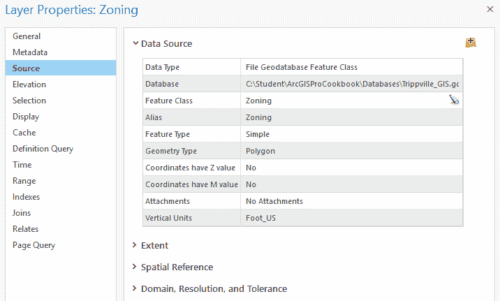

1.  在右侧面板中向下滚动，直到您看到空间参考选项。

1.  通过单击位于左侧的小箭头展开空间参考，以便您可以看到其内容。

1.  检查图层的空间参考信息，然后回答以下问题：

**问题**：区域图层的投影坐标系是什么？

**答案**：

通过单击取消关闭图层属性窗口。

1.  在内容面板中，如图所示右键单击地图：

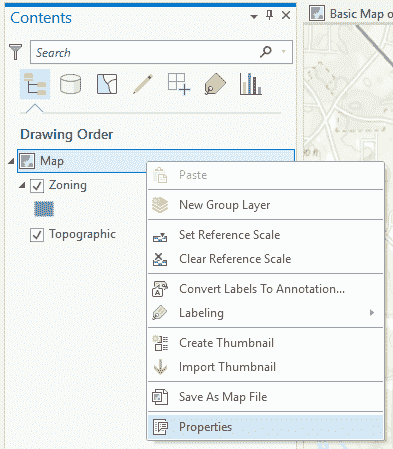

1.  在地图属性窗口左侧的面板中选择坐标系选项。

1.  在右侧面板中查看当前 XY 下面的区域，然后回答以下问题：

**问题**：地图分配了什么坐标系？

**答案**：

**问题**：自您添加新图层以来，地图的坐标系是否已更改？

**答案**：

如您所见，您地图的坐标系已更改。现在它使用的是 NAD 1983 State Plane Georgia West FIPS 1002 Feet 坐标系。现在，让我们看看如果您向地图中添加另一个图层，它是否会再次更改：

1.  通过点击取消关闭地图属性窗口。

1.  在目录窗格中，展开文件夹文件夹，以便你可以看到其内容。

1.  展开坐标系文件夹以查看其内容。

1.  选择高程等高线 shapefile，并将其拖放到地图中。这将将其作为新图层添加到你的地图中。

1.  使用与分区图层相同的方法检查高程等高线图层的空间参考。然后回答以下问题：

**问题**：分配给高程等高线图层的坐标系是什么？

**答案**：

1.  关闭图层属性窗口。

1.  使用与该食谱第 17 步中相同的方法再次打开地图的属性。验证地图使用的坐标系，并回答以下问题：

**问题**：你的地图的坐标系是否再次更改？

**答案**：

尽管高程等高线图层位于 GCS WGS 1984 地理坐标系中，但你的地图的坐标系并没有改变。只有添加到地图的第一个图层会改变坐标系。所有其他图层都会即时投影以匹配地图的坐标系：

1.  关闭地图属性窗口。

1.  保存你的项目。

1.  如果你不会继续到下一个食谱，你可以关闭 ArcGIS Pro。否则请保持打开状态。

现在，你可以为任何你创建的新地图设置坐标系。这很重要，原因与你需要知道任何你可能工作的现有地图的坐标系相同：GIS 依赖于使用真实世界的坐标系来正确显示我们地图中数据的位置。只要我们使用的数据位于并正确分配了正确的坐标系，ArcGIS Pro 就能在分配给地图的通用坐标系中显示数据。

# 更改地图的坐标系

现在你已经知道如何确定现有地图的坐标系，以及如何为新地图设置一个。但你是如何更改地图或场景的坐标系的呢？

你可能想知道为什么你想要改变地图的坐标系。你可能会想要改变分配给地图的坐标系的几个原因。正如引言中提到的，某些坐标系更适合特定的操作。如果你需要测量面积或距离以进行分析或编辑，投影坐标系是最佳选择，尤其是对于像县、市或区这样的小区域。如果你试图展示跨越广大区域（如国家或世界）的特征位置，那么地理坐标系通常是最好的选择。如果你作为网络地图发布，可能需要地图位于 WGS 1984 Web Mercator（辅助球体）坐标系，以符合其他数据集。因此，如果你需要做这些中的一件，而你的地图位于不同的坐标系中，你可能需要更改它。幸运的是，更改地图的坐标系并不困难，正如你即将看到的。

更改地图的坐标系统不会更改地图中引用的底层数据的坐标系统。这意味着如果你在地图中有一个作为层的 shapefile，并且该 shapefile 位于 NAD 83 UTM Zone 16N 米，那么如果你将地图坐标系统更改为 WGS 1984 Web Mercator（辅助球体），这不会改变 shapefile 存储的坐标系统。换句话说，更改地图的坐标系统不会将引用的数据投影到新的坐标系统。你将在本章的后面学习如何将数据投影到不同的坐标系统。

在这个配方中，你将学习如何更改地图中使用的坐标系统。

# 准备工作

建议你在开始这个配方之前完成本章中所有之前的配方。这将确保你拥有成功完成此配方所需的基本知识和理解。此配方可以用 ArcGIS Pro 的所有许可级别完成。你还需要安装样本数据。

# 如何操作...

1.  如果你在这个配方开始之前关闭了 ArcGIS Pro，你需要启动 ArcGIS Pro 并使用你之前学到的技能打开位于`C:\Student\ArcGISProCookbook\Chapter6\CoordinateSystems`的`CoordinateSystems.aprx`项目。如果你是从上一个配方继续的，项目应该已经打开，你可以继续到下一步。

1.  确保 Trippville 的基本地图在地图视图中是活动地图。如果地图仍然打开，点击地图视图区域顶部的 Trippville 基本地图标签页，如图下截图所示。如果你在之前的配方中关闭了地图，你需要重新打开它。要重新打开地图，展开目录窗格中的地图文件夹。然后在地图文件夹中的 Trippville 基本地图上右键单击，并从出现的菜单中选择打开，如图所示：

激活地图或打开地图（如果需要）

1.  将鼠标指针移至地图的大致中心并回答问题。尽量记住你使用的位置。你将在本配方的后续任务中需要知道它。

**问题**：鼠标指针的位置的 x 和 y 坐标是多少？（记住，你可以从地图视图底部的状态栏中获取这个值。）

答案：

如你所见，x 坐标将大约在 2,150,000 这个值附近，而 y 坐标大约在 1,390,000 这个值附近。当然，你的值可能会有所不同，但应该在大致范围内：

1.  在内容窗格中右键单击 Trippville 基本地图，如图下截图所示，并选择属性：

你也可以在内容窗格中双击地图名称来打开地图属性。这也适用于图层。

1.  点击地图属性面板左侧的坐标系统选项。它应该看起来像以下这样：

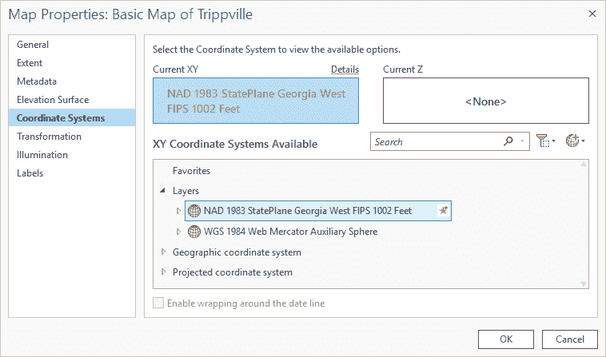

你将把地图的坐标系统从 NAD 1983 State Plane Georgia West FIPS 1002 Feet 更改为 WGS 1984 Web Mercator (辅助球体)，以便稍后作为网络地图发布：

1.  通过点击位于其左侧的小箭头来展开投影坐标系统选项。

1.  向下滚动到世界，并将其展开。

1.  向下滚动，直到看到 WGS 1984 Web Mercator (辅助球体)。它将位于列表的底部附近。

1.  从列表中选择 WGS 1984 Web Mercator (辅助球体)。你的当前 XY 值应更改以反映你选择的坐标系统，如下面的截图所示：

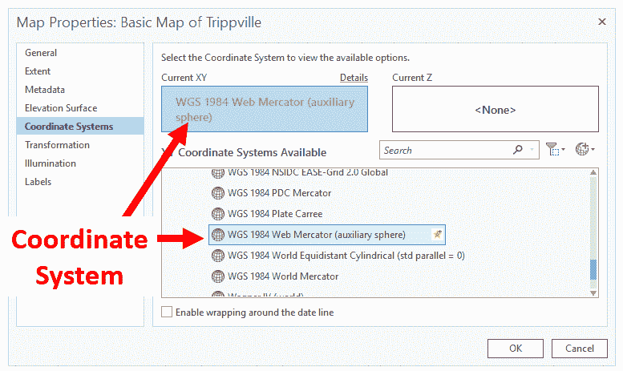

1.  一旦你确认已经选择了正确的坐标系统，点击“确定”以应用更改。

1.  保存你的项目。

1.  现在，将鼠标指针移动到大约与你在*步骤 3*中使用的相同位置，作为地图的估计中心。

1.  将结果与你在*步骤 3*中得到的结果进行比较，并回答以下问题：

**问题**：在更改了坐标系统之后，地图大约中心的坐标是否有所不同？

**答案**：

如您所见，地图大约中心的坐标确实已经改变。它们非常不同。但这是否也改变了图层及其源数据的坐标系统？之前提到过，它们不应该改变，但让我们验证一下以确保：

1.  在内容面板中，使用你在过去菜谱中学到的技能打开城市边界层的属性。

你访问图层属性的方式与访问地图属性的方式相同。

1.  点击图层属性窗口左侧的源选项。

1.  在右侧面板中向下滚动，直到看到空间参考。然后通过点击小箭头来展开空间参考。

1.  查看分配给城市边界层的项目坐标系统。然后回答以下问题：

**问题**：分配给图层的坐标系统与地图的坐标系统相同还是不同？

**答案**：

1.  通过点击“取消”关闭图层属性窗口。

1.  如果你不再继续到下一个菜谱，请保存你的项目并关闭 ArcGIS Pro。如果你要继续，请保持 ArcGIS Pro 和项目打开。

正如您刚刚验证的那样，图层源坐标系并未改变。它仍然存储在它一直使用的相同坐标系中。因此，仅更改地图的坐标系并不会改变源数据的坐标系。它只会改变在特定地图中显示的方式。ArcGIS Pro 会动态地将数据从存储的坐标系投影到地图显示的坐标系。当处理来自多个组织的数据，而这些组织可能不使用与您相同的坐标系时，这非常有用。不过，有一点需要记住的是，动态投影会使用更多的计算机资源，并且每次您在地图中平移或缩放时，都会减慢数据的渲染速度。

# 定义数据的坐标系

您现在知道如何分配和更改地图中使用的坐标系。地图并不是唯一分配坐标系的元素。我们的数据也被分配了坐标系，或者至少应该是这样。如果您的数据没有分配坐标系，那么 ArcGIS Pro 可能无法正确显示所有其他数据的位置。如果您的数据分配了错误的坐标系，这也同样适用。

您的数据中的坐标系信息存储在哪里？这取决于您正在处理的数据类型。如果是一个存储在地理数据库中的要素类，那么坐标系信息存储在地理数据库本身中。如果您正在处理 shapefile，那么分配的坐标系存储在一个以`.prj`扩展名结尾的文件中。

如果您正在处理 CAD 数据，即`.dwg`、`.dxf`或`.dgn`文件，那么您还需要一个`.prj`文件，以便 ArcGIS Pro 知道它所在的坐标系。虽然一些 CAD 文件可以在绘图内部分配坐标系，但 ArcGIS Pro 无法访问文件的这个部分，因此您必须有一个外部的`.prj`文件。

如您在第二章“创建和存储数据”中看到的，在“创建新的地理数据库”配方中，当您在地理数据库中创建新的要素类时，您会被要求在创建要素类工具中分配坐标系。因此，在大多数情况下，当您创建新的要素类或 shapefile 时，您将在创建时为该数据分配坐标系。然而，您会发现许多现有或遗留数据集没有定义坐标系。这主要适用于 shapefile 和 CAD 文件。

就是因为数据集没有分配坐标系统，并不意味着它不是在现实世界坐标系统中创建的。大多数所有形状文件都是在现实世界坐标系统中创建的。它们只是缺少 ArcGIS Pro 和其他 Esri 产品所需的`.prj`文件，以知道坐标系统是什么。许多 CAD 文件也是如此，尽管你将遇到更多不在现实世界坐标系统中的 CAD 文件。你将在后面的章节中了解更多关于这一点。如果缺少坐标系统的数据是在与你的其他数据相同的坐标系统中创建的，你仍然可以使用它来制作地图、执行分析等，而无需为数据定义坐标系统。当你尝试将不同坐标系统的数据进行混合时，如果你尝试将数据发布到网络服务或将其转换为其他格式，你将开始遇到问题。因此，通常认为始终为所有数据定义坐标系统是最佳实践。

在本菜谱中，你将学习如何为没有坐标系统的数据定义坐标系统。在这种情况下，它将是一个在现实世界坐标系统中创建的 CAD 文件，这与你的其他所有数据都不同。

# 准备工作

建议你在开始本菜谱之前完成本食谱手册中第二章，“创建和存储数据”，的内容。第二章“创建和存储数据”将帮助你更好地理解数据及其在 ArcGIS Pro 中的创建方式。这为你理解本菜谱提供了部分基础理解。

此菜谱适用于 ArcGIS Pro 的所有许可级别。在开始之前，你需要确保样本数据也已安装。

# 如何操作...

1.  如果你在本菜谱开始之前关闭了 ArcGIS Pro，你需要启动 ArcGIS Pro。一旦 ArcGIS Pro 启动，请使用你在过去菜谱中学到的技能打开位于`C:\Student\ArcGISProCookbook\Chapter6\CoordinateSystems`的`CoordinateSystems.aprx`项目。如果你是从上一个菜谱继续的，项目应该已经打开，你可以继续。

1.  确保 Trippville 的基本地图在地图视图中是活动的。如果你不确定如何操作，请参考上一个菜谱中的*步骤 2*。

1.  在“目录”窗格中，展开“文件夹”以查看其内容。

1.  展开坐标系统文件夹。

1.  展开“Northern Subdivision.DWG”文件。这是一个包含有关在 Trippville 市附近新建分区信息的 AutoCAD 绘图文件。

1.  在“Northern Subdivision.DWG”文件中的多段线要素类上右键单击，然后选择“添加到当前地图”。

新图层应该出现在“内容”窗格中，然而，你将不会在地图上看到它被绘制出来。现在你将开始调查原因：

1.  右键单击北方子分区-折线层并选择如以下截图所示的缩放到图层：

**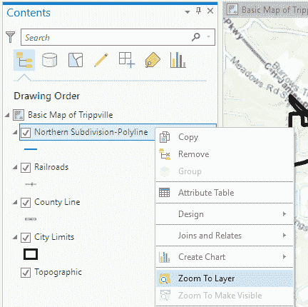**

1.  将鼠标指针移到地图视图中，并观察地图在地图视图底部的状态栏中显示坐标读数。

如您所见，该层已在地图中绘制。它只是没有出现在正确的位置。让我们继续调查一下，看看为什么它没有在所有其他数据的相关位置正确绘制层：

1.  双击北方子分区-多边形层以打开图层属性窗口。

1.  从窗口左侧的面板中选择源选项。

1.  在右侧面板中向下滚动，直到看到空间参考。

1.  展开空间参考并回答以下问题：

**问题**：北方子分区-折线层分配了什么坐标系？

**答案**：

如您所见，ArcGIS Pro 指示这个新层具有未知坐标系。这意味着对于 ArcGIS Pro 来说，数据不在现实世界的坐标系中。然而，在与创建绘图文件的人交谈后，您发现它位于 UTM 16N 坐标系中。ArcGIS Pro 只是不知道这一点，因为没有投影文件告诉它数据位于该坐标系。您需要为绘图文件创建投影文件：

1.  在功能区中点击分析标签。

1.  在分析标签页中，点击位于地理处理组中的工具按钮。这将打开地理处理面板。

1.  在地理处理面板中，点击顶部附近的功能包标签。这将显示 ArcGIS Pro 中包含的所有系统功能包。

1.  展开数据管理工具箱。

1.  选择定义投影工具，如指示：

**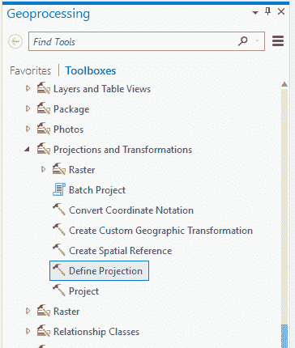**

1.  滚动直到看到投影和变换工具集。

1.  对于输入数据集或要素类，点击下拉箭头并从列表中选择北方子分区-多边形层。

1.  对于坐标系，点击选择坐标系图标，它看起来像一个小线框地球仪。这将打开坐标系窗口。

1.  在可用的 XY 坐标系中，展开投影坐标系，如以下截图所示：

****

1.  在列表中向下滚动并展开 UTM。

1.  向下滚动并展开 NAD 1983。

1.  向下滚动并选择如以下截图所示的 NAD 1983 UTM 区 16N，然后点击确定：

**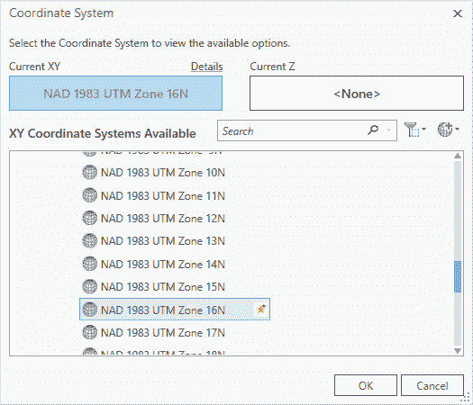**

1.  确认您的定义投影工具看起来与以下截图相同，然后点击运行：

当定义投影工具完成时，北方子分区-折线层应该从地图视图中消失：

1.  在内容窗格中右键单击北方分区-多段线层，并选择缩放到图层。如有必要，使用鼠标滚轮缩小视图，以便您可以看到该层与其他层的关系。

您的地图视图应类似于以下截图。新的分区位于 Trippville 市正北方。这是正确的位置。请记住，您的颜色和比例可能不同：

****

新的分区现在在 Trippville 市正确位置显示

由于您已定义了坐标系统，创建了图层引用的绘图文件的`.prj`文件，因此图层现在显示在正确的位置。这允许 ArcGIS Pro 将图层从创建数据时使用的 NAD 1983 UTM 16N 坐标系统投影到地图使用的 NAD 1983 State Plane GA West 坐标系统。ArcGIS Pro 在定义坐标系统后会在实时投影数据：

1.  关闭地理处理窗格以释放屏幕空间。

定义投影工具还将分配坐标系统并为 shapefile、DXF 和 DGN 文件生成`.prj`文件。在使用此工具之前，您确实需要确保数据位于现实世界的坐标系统，并知道该坐标系统是什么。定义投影工具不会将未在现实世界坐标系统中创建的数据进行地理编码，也不会将数据从一个坐标系统投影到另一个坐标系统。

1.  保存您的项目以确保您不会丢失任何工作。

1.  如果您不继续到下一个配方，请关闭 ArcGIS Pro。如果您继续，请保持 ArcGIS Pro 打开。

此配方说明了为您的 GIS 数据分配坐标系统的重要性。正如您所看到的，如果没有它，数据将不会显示在正确的位置。这使得它无法作为地图的一部分使用或执行分析。而且，得到分配了错误坐标系统的数据也并不罕见。本配方中描述的行为和过程也可以用来为错误分配了坐标系统的数据分配正确的坐标系统。

# 将数据投影到不同的坐标系统

您现在知道如何更改地图的坐标系统，以及如何为缺少坐标系统的数据分配一个坐标系统。但您如何更改数据的坐标系统？这个过程称为投影数据。

当你需要将数据从一个坐标系统移动或投影到另一个坐标系统时，这需要比你在上一个食谱中重新定义分配的坐标系统多得多的工作。它需要 ArcGIS Pro 重新计算该数据集中所有要素的坐标值。这意味着所有这些要素将具有新的坐标，代表它们移动到的坐标系统中的值。为了计算新的坐标值，ArcGIS Pro 必须为每个要素执行许多计算，以考虑可能的基准、单位、参考位置、地球模型等方面的变化。因此，对于较大的数据集，这可能需要很长时间。

你用来将数据从一个坐标系统移动到另一个坐标系统的工具是投影工具。此工具位于数据管理工具箱和投影与变换工具集中。在这个食谱中，你将使用投影工具将数据从一个坐标系统移动到另一个坐标系统。你将把 Trippville 城市边界从其当前坐标系统投影到 WGS 1984 Web Mercator（辅助球体）坐标系统，以便在 ArcGIS Online 上发布。

# 准备工作

与之前的食谱一样，建议你在处理这个食谱之前完成这本食谱中第二章，*创建和存储数据*的所有食谱。第二章，*创建和存储数据*将帮助你更好地理解数据及其在 ArcGIS Pro 中的创建方式。这为理解并完成这个食谱提供了部分基础理解。

这个食谱可以在 ArcGIS Pro 的所有许可级别上完成。要完成这个食谱的最后部分，你还需要连接到 ArcGIS Online。你的用户账户需要是二级，并且具有发布者权限。

# 如何操作...

1.  如果你在这道食谱开始之前关闭了 ArcGIS Pro，你需要启动 ArcGIS Pro。然后使用你在之前的食谱中学到的技能，打开位于`C:\Student\ArcGISProCookbook\Chapter6\CoordinateSystems`的`CoordinateSystems.aprx`项目。如果你在完成上一个食谱时没有关闭 ArcGIS Pro，项目应该已经打开，你可以继续操作。

1.  确保 Trippville 的基本地图在地图视图中是活动地图。如果你不确定如何操作，请参考本章中“更改地图坐标系统”食谱的*步骤 2*。

1.  在内容面板中，双击 City Limits 层以打开图层属性。

1.  点击窗口左侧面板中的源选项。

1.  在图层属性窗口的右侧面板中，滚动选项直到找到空间参考。

1.  展开空间参考选项并回答以下问题：

**问题**：城市边界层的投影坐标系统是什么？

**回答**：

您可以看到 City Limits 图层正在存储在 NAD 1983 State Plane Georgia West 坐标系统中。您希望将此图层投影到 WGS 1984 Web Mercator（辅助球体）坐标系统中，这样它将更容易与其他在线内容集成。WGS 1984 Web Mercator（辅助球体）坐标系统是大多数公共地图网站使用的，例如 Google Earth、Bing Maps 和 Esri ArcGIS Online：

1.  通过点击取消来关闭图层属性窗口。

1.  点击工具栏上的分析选项卡。

1.  点击工具按钮，在分析选项卡上的地理处理组中，以打开地理处理面板。

1.  点击 Geoprocessing 面板顶部的工具箱选项卡，如图所示：

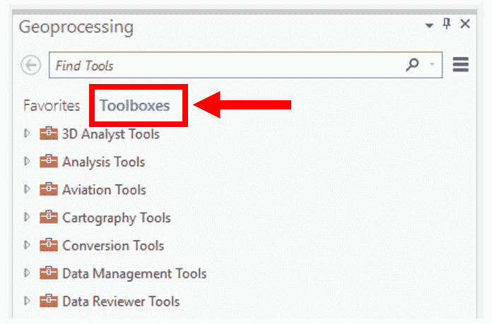

1.  点击位于其旁边的小箭头以展开数据管理工具工具箱。

1.  向下滚动并展开投影和变换工具集，通过点击其旁边的小箭头：

1.  点击项目工具以打开它。

批量投影工具与投影工具做同样的事情，但允许您输入多个要素类或数据集。

1.  点击输入数据集或要素类的下拉箭头，从列表中选择 City Limits。

1.  点击位于输出数据集或要素类单元格右侧的浏览按钮，如图所示：

****

1.  在输出数据集或要素类窗口中，从左侧面板中选择数据库。您可能需要首先展开项目选项。

1.  双击右侧面板中的 Trippville_GIS.gdb 地理数据库。

1.  在底部名称单元格中，键入`City_Limits_Web`。

1.  确认您的输出数据集或要素类窗口看起来像以下截图，然后点击保存：

********

1.  点击位于输出坐标系右侧的小线框地球仪，以打开坐标系窗口。

1.  在底部面板中，展开投影坐标系统。

1.  在投影坐标系统的不同类型列表中滚动，直到看到 World。展开 World 选项，以便查看其内容。

1.  向下滚动，直到看到 WGS 1984 Web Mercator（辅助球体）并选择它。

1.  确认您的坐标系窗口看起来像截图，然后点击确定：

**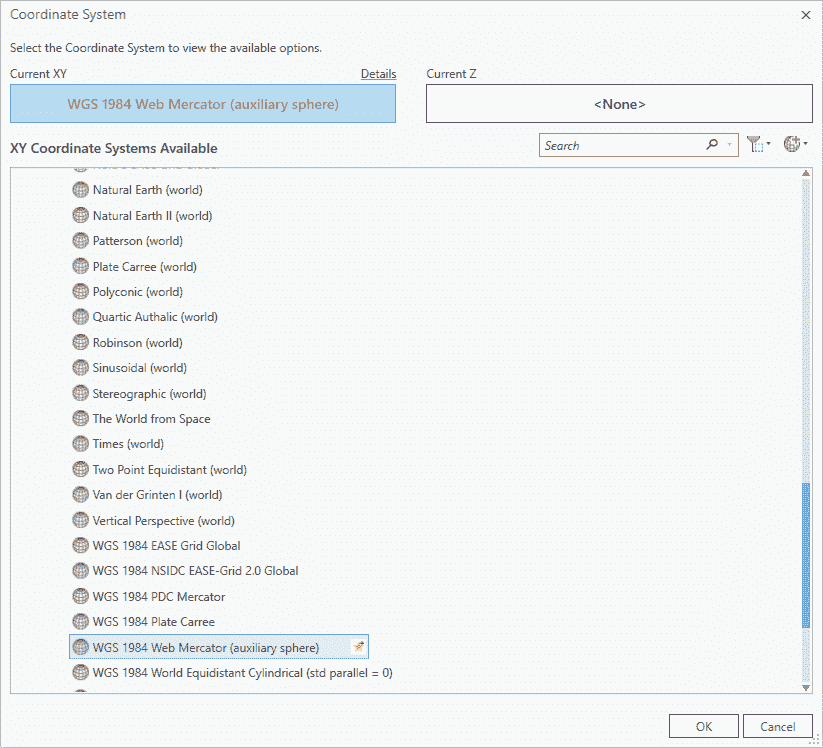**

坐标系窗口，选择 WGS 84 Web Mercator（辅助球体）坐标系

1.  确认您的项目工具看起来像以下截图，然后点击底部的运行按钮。当完成后，新的 City_Limits_Web 图层将被添加到您的地图中：

注意，地理变换会被自动应用。变换在投影数据时应用数学调整，以考虑不同基准面的差异。City Limits 层的原始坐标系参考的是 1983 年北美基准（NAD 1983）。WGS 1984 Web Mercator（辅助球面）坐标系参考的是 WGS 84 基准。虽然这两个都是以地球为中心的基准，但它们略有不同。在数据投影时必须考虑这种差异。这就是变换所做的事情。

此外，请注意，项目工具创建了一个新的要素类，而原始的一个保持不变。这提供了一个安全网，以防你选择了错误的输出坐标系：

1.  当项目工具完成时关闭地理处理窗格并保存你的项目。

1.  在内容窗格中右键点击 City_Limits_Web 图层并选择复制，如图所示：

**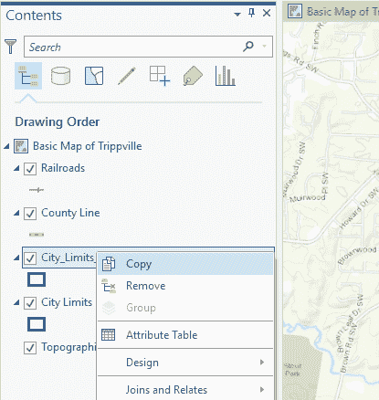**

1.  在功能区中点击“插入”标签。

1.  在“插入”标签的“项目”组中点击“新建地图”按钮以将新地图添加到你的项目中。

1.  在内容窗格中的地图上右键点击并选择粘贴，如图所示：

****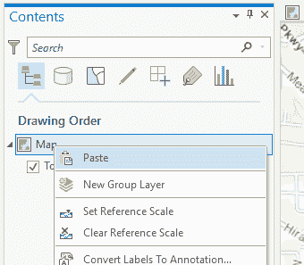****

如果粘贴选项变灰，你可能需要回到 Trippville 的基本地图并再次复制图层。

1.  在功能区中点击“共享”标签。

1.  在“共享为”组中点击“网络层”按钮，这将打开“作为网络层共享”工具窗格。

如果此按钮变灰或不可用，可能是因为你没有登录到 ArcGIS Online。查看 ArcGIS Pro 界面的右上角。如果显示“登录”，你尚未连接到 ArcGIS Online，需要这样做。点击“登录”以登录到你的 ArcGIS Online 账户。

1.  在名称单元格中输入`City_of_Trippville_Limits`。

在网络层的名称中不允许使用空格和特殊字符，但下划线除外。

1.  确保图层类型设置为要素。

1.  为描述输入以下内容：`This layer represents the current boundary for the City of Trippville.`

1.  为标签输入以下内容，并确保在每项之间按下*Enter*键：`Trippville`，`City`，`Boundary`，`Limits`。

1.  根据需要设置你的共享选项。如果你使用的是你组织的 ArcGIS Online 主账户，最好将其设置为仅我的内容，否则你组织中的其他用户可能会看到并有权访问你即将共享的图层。

1.  核实你的“作为网络层共享”工具看起来像以下截图，然后点击窗格顶部附近的位置的配置标签：

**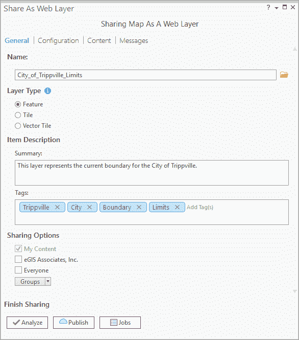**

分享地图为网络层窗口

1.  查看配置下的选项；你不会更改这些。当你完成选项的审查后，点击窗格顶部附近的内容标签。

1.  确认您的网络层将包括 City_of_Trippville_Limits 和 City_Limits_Web。

1.  点击面板底部的“分析”按钮，查看是否有任何可能阻止网络层成功发布的问题。

你应该会收到两个警告，如图中所示。警告通过黄色三角形中的感叹号表示。警告表明某些内容违反了推荐的设置或实践，但不会阻止网络层发布。另一方面，错误会导致网络层发布失败：

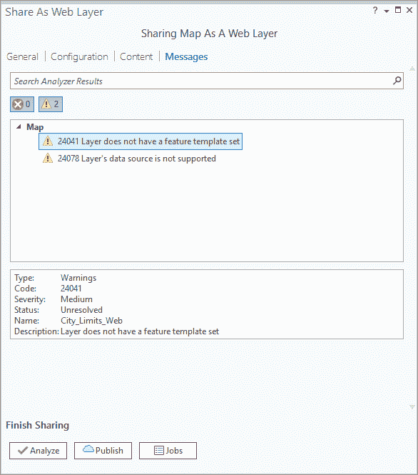

如所示，第一个警告表明一个图层缺少功能模板。由于你不会允许在发布到网络时编辑此图层，这不会成为问题，可以忽略。第二个警告表明图层的数据源不受支持，指的是底图。我们不需要关心底图，因为如果你在 Web 地图中使用 City_Limits_Web 图层，可以在 ArcGIS Online 中添加一个。你将在第十二章“介绍 ArcGIS Online”和第十三章“将您的内容发布到 ArcGIS Online”中了解更多关于创建 Web 地图的内容。第十二章和第十三章。这些警告不应对层发布到网络产生不利影响。

1.  点击“共享为网络层”面板底部的“发布”按钮。这将此层发布到 ArcGIS Online。根据您的网络连接，此操作可能需要一些时间才能完成。

1.  一旦工具成功发布网络层，点击工具底部的“管理网络层”，如图所示。这将启动您的网络浏览器并带您到 ArcGIS Online 登录屏幕：

****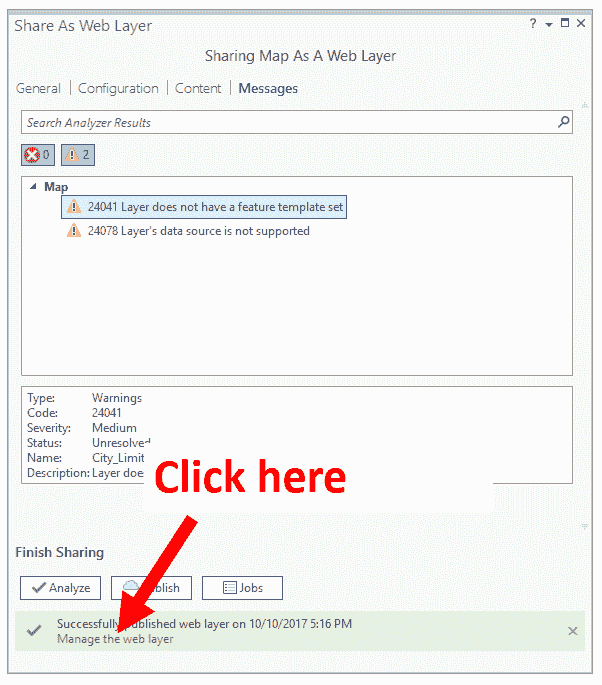****

1.  按照以下截图所示登录您的 ArcGIS Online 账户：

**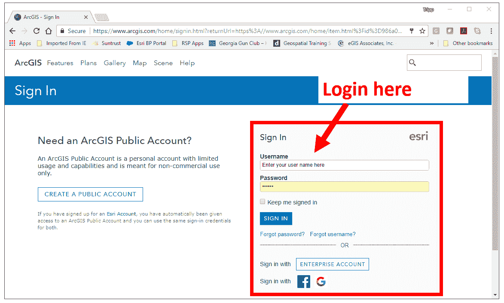**

ArcGIS Online 登录页面

现在，你应该会看到与您刚刚发布的网络层相关的属性。网络层现在是存储在 ArcGIS Online 中的您数据的副本，并作为网络要素服务提供。现在，让我们看看您在 ArcGIS Online 地图查看器中发布的网络层：

1.  点击您在网页右侧的“在地图查看器中打开”按钮。这将打开您在 Web 地图中创建的网络层：

**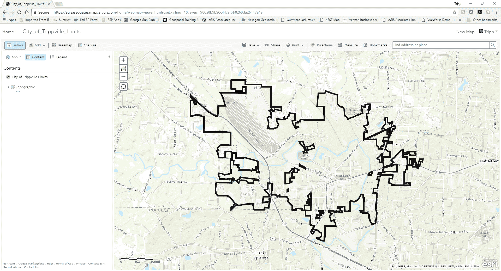**

显示您的网络层的 ArcGIS Online 地图查看器应用程序

1.  在网络查看器中探索您创建的网络层。完成后，关闭浏览器。

1.  返回到 ArcGIS Pro。

1.  关闭“共享为网络层”面板。

1.  保存您的项目。

1.  关闭 ArcGIS Pro。

您刚刚使用投影工具将一个图层投影到了一个新的坐标系。您将城市边界图层投影到了大多数网络地图应用使用的坐标系，这样它就可以在未来更容易地与其他基于网络的 GIS 数据进行集成，然后您将该图层发布到了 ArcGIS Online。接下来，您通过 ArcGIS Online 地图查看器查看了您发布的新图层。在第十二章，*介绍 ArcGIS Online*，您将了解更多关于 ArcGIS Online 的信息以及您如何使用它来与组织内外的人共享和访问数据。
