# 第七章：转换数据

在本章中，我们将介绍以下菜谱：

+   将 Shapefile 转换为地理数据库要素类

+   将多个 Shapefile 合并成一个地理数据库要素类

+   将表格数据导出到 Excel 电子表格

+   将 Excel 电子表格导入到 ArcGIS Pro

+   将选定的要素导入现有图层

# 简介

如你所注意到的，GIS 数据有多种格式。有地理数据库、Shapefile、CAD 文件、DBF 文件、栅格、电子表格等等。ArcGIS Pro 允许你使用所有这些格式。然而，ArcGIS Pro 在处理某些格式时有一些限制。其中一些是只读的，例如 CAD 文件或电子表格。其他你可以读取和编辑，例如 Shapefile 和地理数据库。此外，如果你有数据分布在多个位置、格式和文件中，这可能会使其难以使用。

如果你将编辑和分析数据，建议将所有必需的数据合并成单一格式。对于 ArcGIS Pro 来说，主要存储格式是地理数据库。Shapefile 通常被视为次要选项。为了合并你的数据源，你可能需要将来自一个或多个源的数据转换和合并成单一来源。ArcGIS Pro 提供了多种方法和工具来完成这项任务。哪种方法最适合将取决于几个因素，包括：

+   现有的数据格式

+   目标数据格式

+   需要转换多少数据以及文件数量？

+   你是在进行全面转换还是需要选择特定的特征？

+   你是否试图将多个文件合并成一个？

+   你是将其导入 GIS 还是导出到其他应用程序中使用？

所有这些考虑因素都将有助于确定哪种转换方法和工具最适合你的情况。

在本章中，你将学习几种不同的方法和工具，这些方法和工具将允许你在 ArcGIS Pro 内部转换和合并数据。你将从学习如何将简单的 Shapefile 转换为新的地理数据库要素类开始。然后你将扩展这些技能，学习如何将多个 Shapefile 合并成一个地理数据库要素类。

接下来，你将学习如何将你的 GIS 中的表格数据导出到电子表格中，这样你就可以轻松地将其包含在报告中或进行额外的计算。然后你将反转该工作流程，将电子表格导入到你的 GIS 中。

从那里，你将学习如何将特定特征从一个来源转换为另一个来源。你将学习的方法在转换数据时提供了高水平的控制和准确性。

最后，你将学习如何将 CAD 和栅格文件进行地理配准，以便根据特定的坐标系将它们放置在正确的位置。这将使转换这些数据变得容易得多。

# 将 Shapefile 转换为地理数据库要素类

Shapefiles 是您在 GIS 职业生涯中遇到的最常见的 GIS 数据格式之一。几乎每个启用 GIS 的应用程序都可以读取、导入、导出和编辑 shapefile。这包括 QGIS、AutoCAD Map 3D、Civil 3D、Geomedia 和其他许多应用程序。这导致 shapefiles 成为在多个平台上共享 GIS 数据的常用格式。从工程、规划和测绘公司以 shapefile 格式接收数据并不罕见。

在此菜谱中，您将收到一个包含几个暴雨排水结构位置的 shapefile，这些结构由当地测绘公司收集。您将把这个 shapefile 集成到 Trippville 市的地数据库中。

# 准备工作

此菜谱确实需要将样本数据安装在计算机上。虽然不需要完成任何之前的菜谱，但建议您至少回顾第一章，*ArcGIS Pro 功能与术语*，以确保您具备成功完成此菜谱所需的专业技能。您可以使用任何 ArcGIS Pro 许可级别完成此菜谱。

# 如何操作...

1.  您需要启动 ArcGIS Pro 才能开始此菜谱。

1.  在 ArcGIS Pro 启动窗口中，点击打开另一个项目：

1.  在打开窗口中选择计算机，然后在右侧区域点击浏览。

1.  通过在打开项目窗口的左侧区域点击 C:\，导航到`C:\Student\ArcGISProCookbook\Chapter7\Convert Single Shapefile`。然后双击 Student、ArcGISProCookbook、Chapter7 和 Convert Single Shapefile 文件夹。

1.  选择 Convert Single Shapefile.aprx 项目文件，然后点击确定。

项目将以 Trippville 暴雨地图可见的方式打开。这是一张显然由其他人创建的现有地图。您会注意到，如果您查看内容窗格，该地图不包含任何暴雨图层。您将添加从当地测绘公司收到的 shapefile：

1.  在目录窗格中，点击位于“文件夹”旁边的箭头，以便查看其内容。然后展开 Convert Single Shapefile 文件夹，以便查看其内容。

1.  您应该能在您刚刚展开的文件夹中看到 Stormwater_Structures.shp 文件。在您使用此文件之前，您应该检查其元数据以确保它是您要找的。

1.  右键单击 Stormwater_structures.shp 文件，并从出现的菜单中选择查看元数据，如图所示：

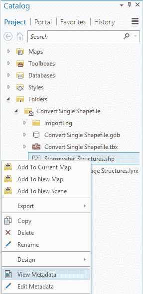

ArcGIS Pro 使用不同颜色的图标来识别数据格式。shapefiles 显示为绿色图标，CAD 文件显示为蓝色图标，地数据库显示为灰色图标。

目录视图应该打开，显示您所选 shapefile 的元数据。这将为您提供有关 shapefile 的基本信息。

元数据是关于你的数据的数据。它提供了有关数据是如何创建的、何时创建的、多久更新一次、其预期用途是什么等信息。为所有 GIS 数据集创建和维护元数据被认为是最佳实践。然而，找到没有元数据的数据并不罕见。这对于 shapefile 尤其如此，因为它们必须手动创建和维护。ArcGIS 将为地理数据库要素类和表自动创建至少一些元数据。

1.  花点时间阅读 shapefile 的元数据。完成后，通过点击视图区域顶部的标签页上的 x 来关闭目录视图。这应该会带你回到地图。

1.  现在是时候将 shapefile 添加到地图上了。右键单击 Stormwater_Structures.shp 文件，从出现的菜单中选择“添加到当前地图”，如图所示：

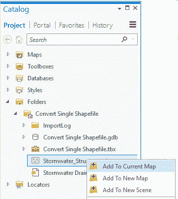

从目录窗格添加新图层到当前地图

Stormwater Structures 层现在应该出现在你的内容窗格中。接下来，你将审查与你刚刚添加的层相关的属性数据。

1.  在内容窗格中右键单击 Stormwater_Structures 层。选择属性表，如图所示。这将打开位于地图视图下方的属性表，除非你已经将表窗口移动到另一个位置：

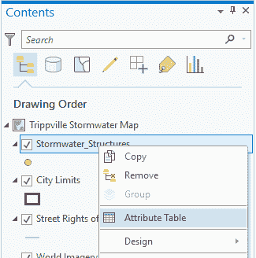

**问题**：shapefile 的属性表中包含哪些字段？

**答案**:

**问题**：shapefile 中存储了多少个结构/特征？

**答案**:

表窗口是可停靠和可解耦的，因此你可以将其移动到任何你希望的位置，包括另一个显示器。与 ArcMap 不同，ArcGIS Pro 允许你为每个表打开自己的窗口，提供更大的查看灵活性。

你应该在属性表中看到只有四个字段，FID、Shape、Id 和 Typ。FID 和 Shape 是 shapefile 的默认字段。Id 和 Typ 是用户定义的字段。默认字段是由创建数据的软件创建和维护的。用户定义的字段是由用户创建和维护的。默认字段和用户定义的字段会因应用程序和格式而异。

Typ 字段用于标识结构类型，CB 代表集水井，AD 代表区域排水沟，DI 代表跌水井。这些都是常见的雨水排水结构。

在查看元数据和属性字段之后，你现在对将要转换的数据有了更好的理解。在开始使用数据进行分析或创建地图之前，确保你知道你正在处理的数据总是好的。

1.  通过点击标签页上标记为 Stormwater_Structures 的 x 来关闭表窗口。现在地图应该再次填满整个视图区域。

1.  在目录窗格中，展开数据库文件夹，以便查看其内容。

1.  通过单击位于数据库名称左侧的小箭头来展开 Trippville_GIS.gdb 地理数据库。

1.  查看地理数据库的内容。你应该会注意到其中包含三个要素数据集：基础、下水道和水。

要素数据集在地理数据库中具有多个用途。首先，它们帮助你更好地组织相关数据。其次，它们确保存储在其中的所有数据共享一个共同的坐标系，这意味着它们都在同一个坐标系中。这使得数据能够参与拓扑和几何网络，这些网络用于确保数据质量并提供额外的功能。

ArcGIS Pro 的早期版本不支持几何网络，但 2.1 版及以后的版本将支持。几何网络将被重命名为公用网络。公用网络将允许你追踪你的公用网络并执行各种类型的分析。要了解更多关于公用网络的信息，请访问[`www.esri.com/esri-news/arcnews/spring17articles/introducing-utility-network-for-arcgis`](http://www.esri.com/esri-news/arcnews/spring17articles/introducing-utility-network-for-arcgis)。

在将 Stormwater_Structures shapefile 转换为地理数据库要素类之前，你将为暴雨系统创建一个新的要素数据集。这将允许你以后在地理数据库中轻松找到数据，并允许你在需要时创建一个公用网络。

1.  在目录面板中，右键单击 Trippville_GIS.gdb 地理数据库。在出现的菜单中，转到新建并选择要素数据集，如以下截图所示。这将在地理处理面板中打开创建要素数据集工具：

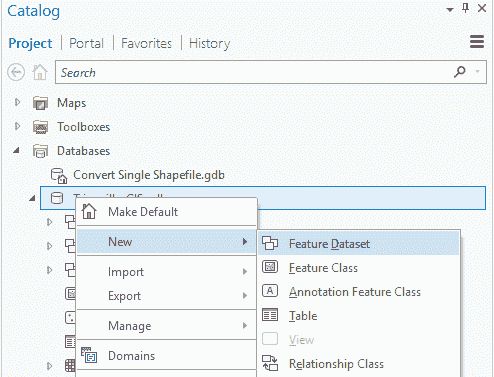

1.  输出地理数据库应自动设置为 Trippville_GIS.gdb，因为它是你选择并右键单击的那个。对于要素数据集名称，键入`Stormwater`。

1.  在坐标系选项下，单击单元格最右侧的小下拉箭头。从列表中选择街道通行权，如图所示：

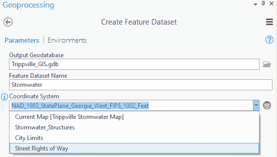

现在坐标系应设置为 NAD_1983_StatePlane_Georgia_West_FIPS_1002_Feet。

1.  验证创建要素数据集工具的外观是否与以下截图相同。如果相同，请点击位于面板底部的运行按钮：

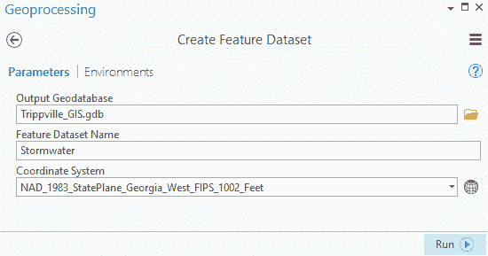

工具完成后，你应该会在 Trippville_GIS.gdb 地理数据库中看到你刚刚创建的新要素数据集。你将把包含暴雨结构体的 shapefile 转换为新的要素类，该要素类将存储在你刚刚创建的要素数据集中。

1.  在内容面板中，右键单击 Stormwater_Structures 图层。在出现的菜单中，转到数据并选择如图所示导出要素选项。这将打开地理处理面板中的复制要素工具。这通常出现在界面的右侧：

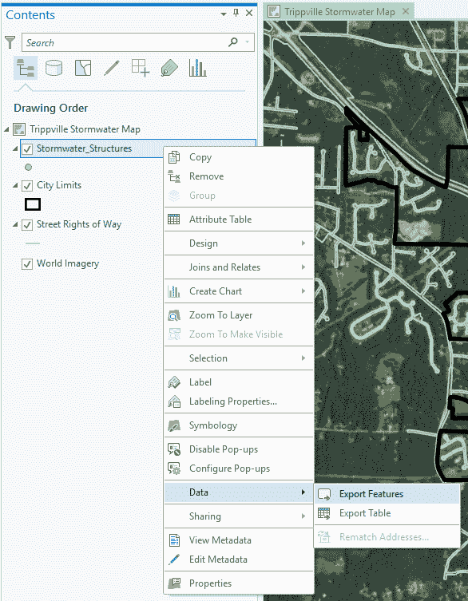

从内容面板导出要素

1.  输入要素应该自动设置，因为你右键单击了一个特定的图层来访问该工具。点击位于输出要素类窗口最右侧的浏览按钮。

1.  在打开的输出要素类窗口中，选择窗口左侧面板中项目下的数据库文件夹。应该在右侧面板中出现两个数据库：Convert Single Shapefile.gdb 和 Trippville_GIS.gdb。

1.  双击 Trippville_GIS 地理数据库。

1.  双击你之前创建的 Stormwater 要素数据集。

1.  在输出要素类窗口底部靠近名称的单元格中，键入 `Stormwater_Structures` 并点击保存。

1.  确认复制要素工具看起来与截图相同，然后单击运行按钮：

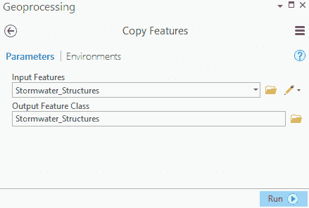

如果工具运行成功，你的地图中应该会出现一个新的图层。现在你将验证 ArcGIS Pro 是否成功转换了 shapefile。

1.  通过单击面板右上角的小 x 关闭地理处理面板。

1.  在内容面板中，单击按来源列表按钮。它应该是从左数第二个，看起来像一个圆柱体。

1.  注意，你有两个 Stormwater_Structures 图层。然而，它们位于两个不同的位置。

**问题**：两个 stormwater_structures 存储在哪里？

**答案**：

如你所见，其中一个 stormwater_structures 图层存储在 Trippville GIS 地理数据库中。另一个存储在 Convert Single Shapefile 文件夹中。地理数据库中的那个是你刚刚转换的。另一个是原始的 shapefile。复制要素工具在地理数据库中创建了一个新的要素类，而源 shapefile 保持不变。现在你已经验证它确实在地理数据库中创建了要素类，你需要验证它是否转换了所有要素。

1.  右键单击存储在 Trippville_GIS.gdb 中的 Stormwater_Structures 图层，并在出现的菜单中选择属性表。

1.  查看表格窗口的底部，以查看图层中包含的总记录/要素数。

**问题**：它是否与 Shapefile 中的要素数量匹配？（如果你不记得，请回顾一下在打开 shapefile 属性表并回答其中存储了多少要素的问题时的这一部分。）

**答案**：

如果复制要素工具运行正确，shapefile 和地理数据库要素类应该包含相同数量的记录/要素。

1.  在内容窗格中右键单击“Stormwater_Structures”形状文件层，并从出现的菜单中选择“移除”。你不再需要在你的地图中使用形状文件层。

1.  点击位于 ArcGIS Pro 界面左上角快速访问菜单中的“保存项目”按钮。

# 还有更多…

就像在 ArcGIS Pro 中可以做的许多事情一样，完成一项任务的方式不止一种。将形状文件转换为地理数据库要素类也不例外。例如，你可以直接从数据管理工具箱和地理处理窗格中的要素工具集中访问“复制要素”工具。

你还可以有第三种方法将形状文件转换为地理数据库要素类。你也可以使用“要素类到要素类”地理处理工具。让我们看看它是如何工作的。

你已经收到了一个包含来自同一地方测绘公司的暴雨排水管道的形状文件。你想要将这些转换为你在本食谱中之前创建的要素数据集：

1.  如果需要，在目录窗格中展开 Trippville_GIS.gdb 的内容。它可能仍然是从你之前的工作中展开的。

1.  右键单击“Stormwater”要素数据集。选择“导入”和“要素类……”这将打开地理处理窗格中的“要素类到要素类”转换工具：

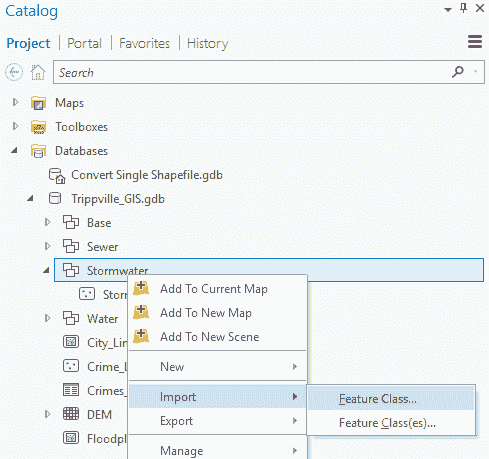

1.  输出位置应该已经设置好了。点击输入要素最右侧的“浏览”按钮。

1.  在“输入要素”窗口中，在项目下的左侧面板中选择“文件夹”。在窗口的右侧面板中应该会出现“转换单个形状文件”文件夹。

1.  双击“转换单个形状文件”文件夹。

1.  点击“Stormwater_Pipes.shp”并点击“确定”。

1.  将输出要素类设置为`Pipes`。你不需要更改任何其他工具设置。

1.  确认你的“要素类到要素类”工具看起来如下，然后点击运行：

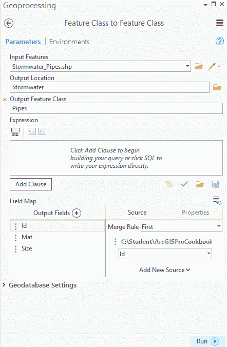

要素类到要素类转换工具

1.  如果工具运行成功，一个新的“Pipes”层应该会出现在你的地图中。这个新层指向你刚刚在 Trippville_GIS 地理数据库中创建的新要素类。

1.  让我们验证工具是否创建了一个新的要素类。在目录窗格中，展开“数据库”文件夹，然后展开 Trippville_GIS.gdb 地理数据库和“Stormwater”要素数据集。

1.  确认你看到了“Pipes”要素类。

1.  如果你这样做，请关闭地理处理窗格并保存你的项目。

如果任何地理处理工具，如“要素类到要素类”工具失败，你总是可以点击目录窗格中的“历史”选项卡来查看发生了什么。你可以点击你在 ArcGIS Pro 会话期间执行的任何地理处理操作，并查看它是否成功。如果没有成功，你可以看到生成的错误，这样你可以排查为什么它没有工作。

1.  如果您不继续到下一个菜谱，您可以关闭 ArcGIS Pro。如果您继续，请保持 ArcGIS Pro 打开。

因此，您现在已经看到了两种不同的工具，您可以使用这些工具将形状文件转换为地理数据库要素类。这些工具不仅限于转换形状文件。它们还可以转换其他空间数据格式，包括覆盖、DWGs、DGNs、DXFs 以及更多。

# 将多个形状文件合并为一个单一的地理数据库要素类

您现在知道如何将单个形状文件转换为单个地理数据库要素类。那么，如果您有多个形状文件需要合并为一个单一的公共地理数据库要素类呢？您能在 ArcGIS Pro 中做到这一点吗？

当然可以。这不是一个不常见的流程。您经常需要将多个形状文件或地理数据库要素类合并为一个单一的要素类。将多个来源合并为一个可以使得数据处理更加容易。例如，您正在从事一项区域交通研究，您从三个县收到了道路数据。如果您想分析交通流量或按类型计算该地区的道路总长度，如果所有数据都在一个单一的要素类中，这将容易得多。也许您负责维护为同时服务于城市和县的 911 中心的数据。城市和县为新建筑分配地址并更新其相应管辖区地址点文件。您需要将这两个文件合并以用于 911 软件。这些只是两个可能的例子，在这些情况下，您可能希望将多个形状文件或地理数据库要素类合并在一起。

在这个菜谱中，您将合并三个不同的形状文件到一个单一的公共地理数据库要素类。您已经派出三个现场小组收集街道标志的位置，作为道路主管要求您创建的标志清单的一部分。每个小组都将标志位置数据收集到一个形状文件中。因此，您现在有三个单独的形状文件，需要合并到一个单一的地理数据库要素类中。这将使得未来的数据管理和处理更加容易。

# 准备工作

这个菜谱确实需要将样本数据安装到计算机上。您不需要完成任何之前的菜谱。尽管建议您回顾第一章，*ArcGIS Pro 功能和术语*，以及本章中的上一个菜谱，以确保您对完成此菜谱所需的基本技能有基本了解。此菜谱可以使用任何 ArcGIS Pro 许可级别完成。

# 如何操作...

1.  如果您在开始此菜谱之前关闭了 ArcGIS Pro，您需要启动 ArcGIS Pro。

1.  使用您在之前的菜谱中学到的技能，打开位于 `C:\Student\ArcGISProCookbook\Chapter7` 的 `Convert Multiple Shapefiles.aprx` 项目。

项目应该以 Street Sign Inventory 地图打开。如果你查看内容面板，你会看到三个 Street_Signs 图层。这些是您的野外工作人员收集的三个 shapefile。你将花点时间调查这三个图层，以便你知道你要处理的内容。

1.  在内容面板中右键单击 Street_Signs_Day1 图层，从出现的菜单中选择属性表。花点时间调查属性表，然后回答以下问题：

**问题**：这个图层是什么类型的 shapefile？

**答案**：

**问题**：它包含哪些属性字段？

**答案**：

1.  对其他两个 Street_Signs 图层重复此过程。将前两个问题的答案与每个图层进行比较。注意任何相似之处或不同之处。

正如你刚刚发现的，所有三个图层都是点特征，并且具有共同的属性表结构或模式。虽然合并多个字段时通常不需要共同的模式，但它确实经常有帮助。为了合并多个图层，必须匹配的一项是特征类型。你只能合并点与点、线与线、多边形与多边形。

现在你已经验证了特征类型匹配并且属性字段相同，你可以准备将这三个图层合并在一起以创建一个单一的图层：

1.  关闭三个 Street_Signs 图层的属性表。这将释放一些屏幕空间。

1.  点击功能区中的分析选项卡。

1.  点击分析选项卡中的地理处理组中的工具按钮。这将打开地理处理面板。

1.  点击地理处理面板中的工具箱选项卡，如图所示：

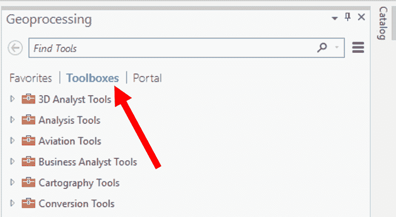

1.  在地理处理页面顶部的搜索框中输入`Merge`并按你的*Enter*键以定位合并工具。

1.  从显示的列表中选择合并（数据管理工具）。它应该接近顶部，如以下截图所示：

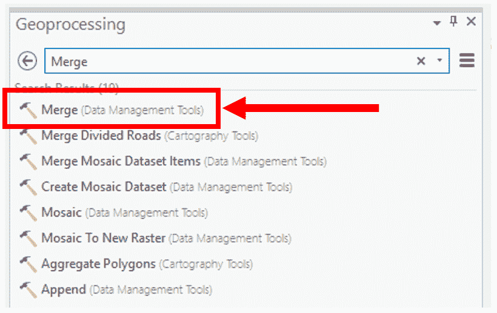

在地理处理面板中选择合并工具。

现在合并地理处理工具应该已经在地理处理面板中打开。这是你将用来合并三个单独的 shapefile 的工具。

1.  在输入数据集下，点击小下拉箭头并选择 Street_Signs_Day1。当你这样做时，应该在其下方出现另一个输入框，允许你添加另一个输入。

1.  点击第二个出现的输入框末尾的小下拉箭头并选择 Street_Signs_Day2。

1.  重复此过程以将 Street_Signs_Day3 作为合并工具的最后一个输入添加。

1.  点击输出数据集框右侧的浏览按钮。

1.  在出现的输出数据集窗口中，从窗口左侧的面板中选择数据库。

1.  双击窗口右侧面板中的 Trippville_GIS 地理数据库。

1.  在名称单元格中输入`StreetSigns`并点击保存。

1.  验证你的合并工具看起来是否如下截图所示。如果是，点击运行：

**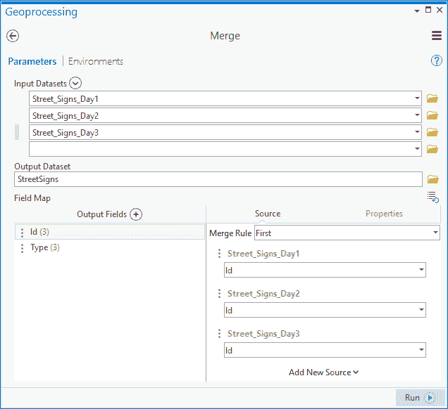**

合并地理处理工具

当工具成功运行时，你应该会在地图上看到一个新的 StreetSigns 图层被添加。这个新图层应该覆盖原始三个图层中的所有点，但请注意它们仍然存在。合并工具，就像大多数地理处理工具一样，创建新数据而不改变原始输入数据。但让我们验证一下以确保。

1.  在内容窗格中单击位于列表来源标签页的按钮。它看起来像灰色圆柱体。

1.  定位地图中所有可见的 Street Signs 图层。注意它们的来源存储在哪里，并回答以下问题：

**问题**：你刚刚创建的 StreetSigns 图层存储在哪里？

**答案**:

**问题**：三个 Street_Signs 形状文件存储在哪里？

**答案**:

**问题**：这些是否相同？

**答案**:

如你现在所看到的，StreetSigns 图层正在引用一个存储在 Trippville_GIS 地理数据库中的地理数据库要素类，而 Street_Signs 形状文件存储在 Convert Single Shapefile 文件夹中。这两个位置非常不同。因为我们没有在任何图层名称旁边看到红色的感叹号，我们知道数据源仍然存在，并且没有数据被删除。

每次你在内容窗格中图层名称前看到红色感叹号时，你就知道该图层已丢失与源数据的连接。

1.  右键单击每个 Street_Signs 图层，并从出现的菜单中选择移除。这将它们从地图中移除以减少混乱和困惑。从地图中移除图层不会删除源数据。

1.  右键单击 StreetSigns 图层，并从出现的菜单中选择属性表。

1.  查看属性表，并将其与查看形状文件属性表时看到的内容进行比较。

**问题**：StreetSigns 图层的属性表与三个形状文件的属性表相比如何？

**答案**:

1.  保存你的项目。

如你所见，新 StreetSigns 图层的属性表包含与原始三个形状文件完全相同的字段。此外，记录数等于三个形状文件总记录数的总和。合并地理处理工具将三个形状文件的内容（空间和属性）合并到一个单一的地理数据库要素类中。

# 更多内容...

如果你想将多个文件或要素类合并到一个新的单一要素类中，合并地理处理工具工作得很好。如果你想从形状文件或地理数据库要素类中添加新数据到现有的信息图层中怎么办？例如，你的现场工作人员外出定位额外的街牌。你不想创建另一个图层。相反，你希望将新标志添加到现有图层中。你将如何做到这一点？

这就是 Append 地理处理工具发挥作用的地方。Append 工具会将来自输入表、文件或要素类的新的记录添加到现有的记录中。让我们看看它是如何工作的，以便你能更好地理解其工作原理。你将把一个包含额外标志位置的新 shapefile 添加到你刚刚创建的 StreetSigns 层中：

1.  在功能区点击地图选项卡。

1.  在地图选项卡的图层组中点击添加数据按钮。

1.  点击添加数据窗口左侧面板中项目下的文件夹文件夹。

1.  在右侧面板中双击 Convert Single Shapefile 文件夹。

1.  选择 Street_Signs_Day4.shp 文件，然后点击确定将 shapefile 添加为图层到地图中。

1.  右键点击你刚刚添加到地图中的 Street_Signs_Day4 层，并从显示的菜单中选择缩放到图层。这将使你更容易看到刚刚添加的图层。正如你所看到的，这个图层包含位于城市西部的更多标志数据。

1.  使用你之前在这个菜谱中使用的相同过程打开 Street_Signs_Day4 层的属性表。

1.  查看属性表内容，并注意表中的要素/记录数量。使用这些信息来回答以下问题：

**问题**：Street_Signs_Day4 shapefile 包含多少条记录/要素？

**答案**：

1.  打开 StreetSigns 层的属性表，并注意它包含的记录/要素数量。使用这些信息来回答以下问题。

**问题**：StreetSigns 层包含多少条记录/要素？

**答案**：

1.  在功能区点击分析选项卡。

1.  点击分析选项卡上的地理处理组中的工具按钮。

1.  在出现的地理处理面板中，点击工具箱选项卡。

1.  定位并展开数据管理工具工具箱。

1.  展开通用工具集，并找到 Append 工具，如下面的截图所示：

**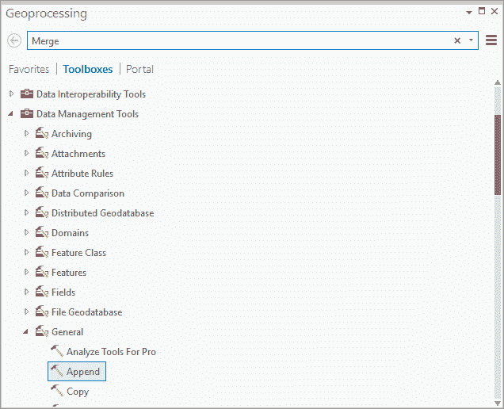**

1.  点击 Append 工具，在地理处理面板中打开它。

1.  点击输入数据集单元格右侧的小下拉箭头，并选择 Street_Signs_Day4。

1.  点击位于目标数据集右侧的小下拉箭头，并从显示的列表中选择 StreetSigns。

1.  确认你的 Append 工具看起来如下，然后点击运行：

**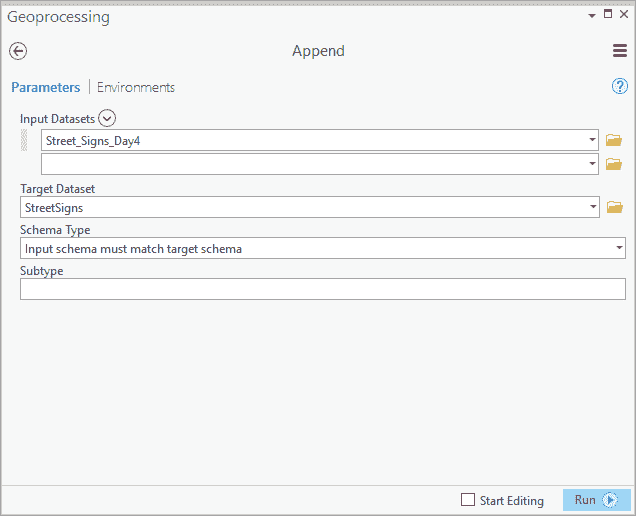**

地理处理面板中的 Append 工具。

注意，与使用合并工具时不同，你的地图中没有添加新的图层。这是因为没有创建新的图层。Street_Signs_Day4 shapefile 的要素已经被添加到现有的 StreetSigns shapefile 中。让我们验证这是否发生了。

1.  在内容面板中，选择按绘制顺序列表按钮。它位于左侧的第一位。

1.  通过点击层名左侧的框来关闭 Street_Signs_Day4 层，使其不再包含复选标记。

你现在应该看到在街牌图层中显示的来自 shapefile 的特征副本。这表明来自 shapefile 的特征被复制到了地理数据库特征类中。现在检查属性以确保它们已被复制。

1.  在内容面板中，选择按选择列表按钮。

1.  确保将街牌图层设置为可选。

1.  右键单击 Street_Signs_Day4 图层并选择缩放到图层。这确保了你已放大到该图层覆盖的区域。

1.  在功能区中点击地图标签。

1.  在地图标签的“选择”组中点击“选择”按钮。

1.  在你的地图上，点击以下图中所示的下右角。继续按住鼠标按钮，并拖动鼠标指针到西北方向，直到你达到所示的大致位置，创建一个矩形，这将允许你选择从 shapefile 复制的所有特征：

**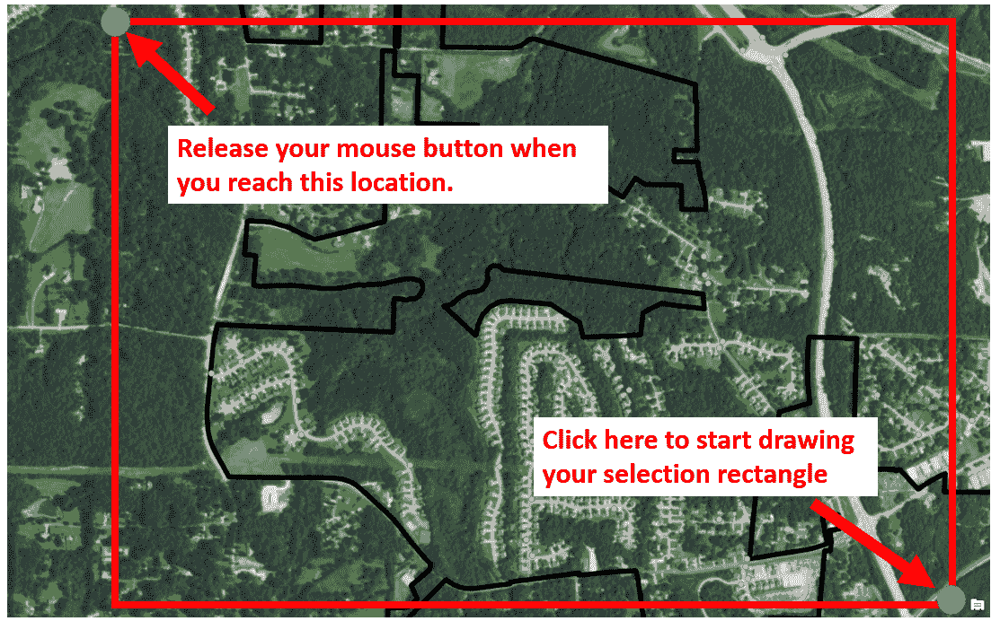**

街牌选择矩形

1.  右键单击街牌图层并选择属性表。

1.  点击属性表底部的“显示选中记录”按钮。这将过滤表格，使得只有选中的特征可见。

1.  注意记录总数。将其与你在使用追加工具之前的记录数进行比较。使用这些信息来回答以下问题：

**问题**：选中的记录是否都包含属性值？

**答案**：

**问题**：表中的总记录数与你在运行追加工具之前的记录数相比如何？

**答案**：

如你所见，属性值也从 shapefile 复制到了新的地理数据库特征类。街牌图层中的新总记录数应该等于 shapefile 中的记录数加上追加工具之前街牌图层的预追加工具记录数。追加工具只是将 shapefile 中的记录/特征添加到了街牌图层。

1.  如果它仍然打开，请关闭属性表和地理处理面板。

1.  保存你的项目并关闭 ArcGIS Pro。

正如你所经历的，合并和追加地理处理工具非常适合将多个数据集合并成一个。这可以减少你必须管理的总数据集数量，并使执行分析变得容易得多。

# 将表格数据导出到 Excel 电子表格

很多次，我们合作的人不是 GIS 专业人士或者没有访问 GIS 软件的权限。他们可能需要其他格式的数据。最常见的需求格式之一是电子表格。电子表格是几乎每个有电脑的人都能处理的东西。它们可以进行计算、汇总数据、创建图表等等。

虽然你不能将空间数据导出到电子表格中，但 ArcGIS Pro 允许你将表格数据导出到电子表格兼容的格式。这包括 Microsoft Excel 的 XLS、XLSX 和 CSV 文件。你能够使用 ArcGIS Pro 将属性和独立数据库表格导出到电子表格中。与其他大多数操作一样，有多种方法可以完成。

在这个食谱中，你将学习两种不同的方法将表格转换为电子表格兼容格式。道路管理员要求你给他提供你一直在工作的街道标志清单的副本，这样他就可以按类型对所有的标志进行一般计数，并且可以将其与他在笔记本中保存的标志列表进行比较。他还希望你能给他一份包含城市内所有道路的电子表格。你将使用不同的方法来完成这些任务。

# 准备工作

这个食谱要求你已经完成了之前的食谱。它还要求你安装了电子表格软件，例如 Microsoft Excel 或 Open Office。这个食谱也可以使用 ArcGIS Pro 的所有许可级别完成。

# 如何做到这一点...

1.  你首先需要启动 ArcGIS Pro 并打开位于 `C:\Student\ArcGISProCookbook\Chapter7\` 的 `Convert Multiple Shapefiles.aprx` 项目，使用你在之前的食谱中学到的技能。

1.  在内容窗格中定位 StreetSigns 图层。

1.  右键单击 StreetSigns 图层，然后向下到数据。然后选择导出表格，如以下截图所示。这将在地理处理窗格中打开复制行工具：

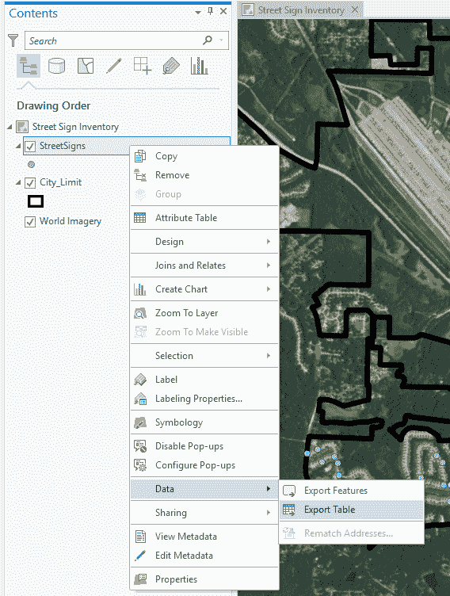

访问导出表格功能

1.  输入行应该已经设置为 StreetSigns 图层，因为你右键单击它以访问工具。现在点击位于输出表格右侧的浏览按钮。

1.  点击位于输出表格窗口左侧面板中项目下的 Folders 文件夹。

1.  在右侧面板中双击 Convert Single Shapefile 文件夹。

1.  在名称单元格中输入 `StreetSignsInventory.csv` 并点击窗口底部的保存按钮。

1.  确认你的复制行工具看起来如下，然后点击运行：

**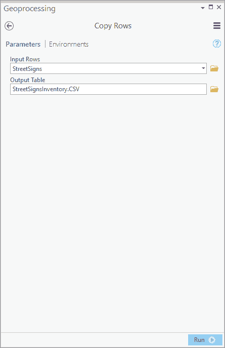**

复制行工具可以用来将多种类型的表格数据转换为其他格式。此工具的输入可以包括地理数据库、shapefile、dBase 表格、Microsoft Excel 电子表格、CSV 文件和 TXT 文件。输出可以是地理数据库独立表格、dBase 表格以及 CSV 和 TXT 文件。要了解更多关于复制行工具的信息，请访问 [`pro.arcgis.com/en/pro-app/tool-reference/data-management/copy-rows.htm`](http://pro.arcgis.com/en/pro-app/tool-reference/data-management/copy-rows.htm)。

记住，如果你在一个图层或表中选择了要素或记录，复制行工具只会将所选项目导出到新的输出表格中。

当复制行工具完成时，您应该在内容面板中看到一个新表出现。这就是您刚刚创建的 CSV 文件。让我们看看它是否可以在 Microsoft Excel 或您安装的电子表格应用程序中打开。

1.  打开您的 Windows 资源管理器或文件资源管理器，具体取决于您使用的 Windows 版本。通常在任务栏底部有一个图标，可以打开 Windows 资源管理器或文件资源管理器。图标看起来像一个文件文件夹坐在一个支架上。

文件/Windows 资源管理器与 Internet Explorer 不同。Internet Explorer 是一个网络浏览器。文件/Windows 资源管理器允许您浏览您的计算机、网络和连接的驱动器的内容。

1.  在文件资源管理器窗口左侧的面板中找到目录树，找到桌面并将其展开，以便您可以看到其内容。

1.  在目录树中找到“此电脑”或“我的电脑”并将其展开，以便您可以看到其内容。

1.  点击 C:驱动器。它通常命名为本地驱动器或操作系统。

1.  在右侧面板中，找到“学生”文件夹并双击它。

1.  双击 ArcGISProCookbook 文件夹以打开它。

1.  双击“第七章”和“将单个 Shapefile 文件夹转换为”以打开它们。

1.  滚动直到找到 StreetSignsInventory.CSV 文件，双击以打开它。

1.  花点时间查看文件内容。您应该看到三列。第一行应包含属性表中的字段名称。其余行包含属性表中的数据。它应该看起来类似于以下内容：

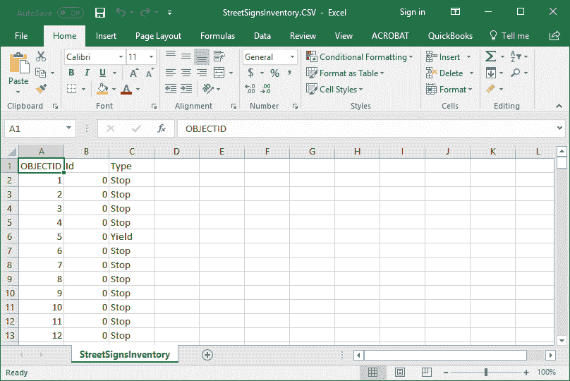

1.  完成 CSV 文件的审查后，关闭它。如果被要求保存，请不要保存。

您刚刚已将 StreetSigns 层的属性表转换为 CSV 文件，并将其作为电子表格打开。因此，您已完成了第一个任务。现在您需要导出街道中心线的属性。实际上，在导出之前您需要准备数据，因为您将看到，您的街道中心线数据实际上超出了城市界限。

1.  返回到 ArcGIS Pro。如果您意外关闭了 ArcGIS Pro，请参考本食谱的第一步重新打开正确的项目。

1.  在目录树中，展开数据库文件夹，以便您可以看到其内容。

1.  接下来，展开 Trippville_GIS.gdb 地理数据库和基础要素数据集。

1.  将 Street_Centerlines 要素类拖放到地图视图中。

如您所见，数据超出了 Trippville 的城市界限。道路主管只想获取城市界限内的道路部分的数据，因此您需要裁剪数据。

1.  在功能区中点击“分析”选项卡。

1.  在功能区工具组中点击“裁剪工具”。这将打开地理处理面板中的裁剪工具。

1.  点击位于单元格最右侧的“输入要素”下拉箭头。从列表中选择 Street_Centerlines。

1.  对于剪辑要素，重复此过程，选择 City_Limit 图层。

1.  接受输出要素类的默认名称。验证您的剪辑工具看起来如下，然后点击运行：

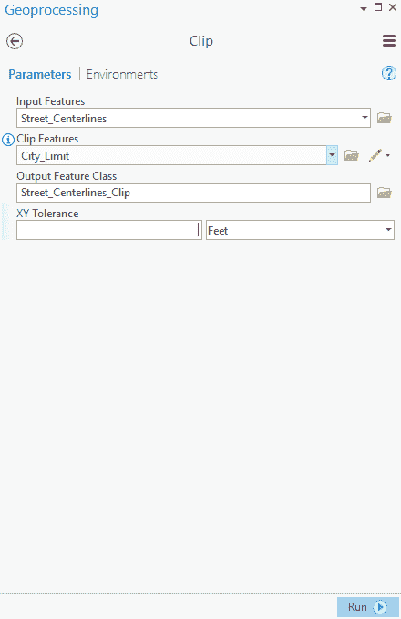

地理处理面板中的剪辑工具

当剪辑工具完成时，您的地图中将会出现一个新图层，其中只包含 Trippville 城市界限内的道路部分：

1.  关闭地理处理面板并保存您的项目。

1.  在功能区中点击 Analysis 标签以确保它处于活动状态。然后点击位于地理处理组中的 Tools 按钮。

1.  在地理处理面板顶部点击工具箱标签，如图所示：

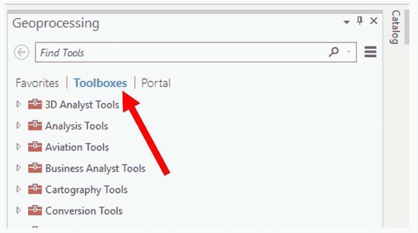

点击中心处的工具箱标签

1.  在地理处理面板中定位并展开 Conversion Tools 工具箱。

1.  展开 Excel 工具集以显示 Excel to Table 和 Table to Excel Python 脚本工具。

您可能会想知道如何判断这些是 Python 脚本工具。这是因为工具旁边的图标。滚动条，如显示在这两个工具旁边，表示 Python 脚本工具。锤子表示系统工具，如您在本食谱中之前使用的剪辑工具。一组多色菱形表示使用 ModelBuilder 创建的模型工具。

1.  选择 Table to Excel 工具。这将打开工具在地理处理面板中。

1.  点击输入表的下拉箭头，并从列表中选择 Street_Centerline_Clip。

1.  对于输出 Excel 文件，点击位于最右侧的浏览按钮。

1.  在刚刚打开的保存为窗口的左侧面板中，定位到 This PC 或 My Computer 并点击它。

1.  在右侧面板中，定位到 C:\驱动器并双击它。C:\驱动器通常被称为本地驱动器或操作系统。

1.  在右侧面板中定位到 Student 文件夹并双击它。

1.  定位到 ArcGISProCookbook 文件夹并双击它。

1.  定位到“我的项目”文件夹，并双击它。

1.  在保存为窗口底部附近的位置的文件名框中，键入`Street_Centerlines_Trippville`并点击保存。

1.  验证您的 Table to Excel 工具看起来如下，然后点击运行：

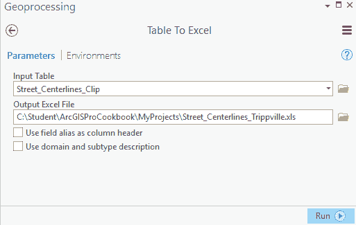

如果工具运行成功，它应该在您指定的文件夹中创建一个新的电子表格。现在您将验证结果。

1.  打开 Windows 资源管理器或文件资源管理器，就像您在本食谱中之前所做的那样。

1.  使用本食谱中第 10-14 步相同的方法，导航到`C:\Student\ArcGISProCookbook\MyProjects`。

1.  定位到您刚刚创建的 Street_Centerlines_Trippville.xls 文件，并双击它以打开文件。

1.  花点时间检查您创建的电子表格。它应该看起来类似于下面的截图。如果您愿意，可以在 ArcGIS Pro 中打开 Street_Centerlines 层的属性表并与两个进行比较：

导出的电子表格

1.  当您检查完电子表格的内容后，请关闭它和您的文件资源管理器窗口。

1.  返回 ArcGIS Pro 并保存您的项目。

1.  如果您不继续进行下一个菜谱，请关闭 ArcGIS Pro。如果您继续，您可以选择保持 ArcGIS Pro 打开。

您现在已经使用了两种方法将数据从 GIS 导出为 Microsoft Excel 等应用程序可以打开的格式。这种能力进一步扩展了您 GIS 的实用性和灵活性。它打开了与其他非空间应用程序集成的能力。

# 将 Excel 电子表格导入 ArcGIS Pro

您已经学会了如何在 ArcGIS Pro 中将数据从 GIS 格式导出到电子表格。但如果你需要反过来操作呢？人们使用电子表格来存储各种信息。这是因为它们创建起来既快又简单，而且非常灵活。那么，使用 ArcGIS Pro 将电子表格引入您的 GIS 需要什么？

在 ArcGIS Pro 中处理电子表格时，请记住，简单总是更好的选择。ArcGIS Pro 允许您查看 XLS 和 XLSX 文件。它将电子表格显示为数据库表。您可以查看、查询和链接电子表格。链接仅限于使用连接或关联，这些您在第三章，“链接数据”中已了解。

在 ArcGIS Pro 中使用电子表格时存在一些限制。ArcGIS Pro 将电子表格视为数据库表。因此，它将数据库限制应用于电子表格。这包括以下内容：

+   电子表格中第一行非空行的值成为字段名称。

+   每一列必须有一个唯一的名称。

+   每一列都不能包含特殊字符。下划线（_）是被允许的。

+   字段名称（第一行的值）限制为 64 个字符。

+   单元格中的值不能超过 255 个字符。

+   每个字段必须以字母字符开头。它不能以数字开头。

如果电子表格未能满足这些限制中的任何一项，ArcGIS Pro 将不允许您查看电子表格。这意味着您可能需要自定义或简化电子表格，以便它在 ArcGIS Pro 中工作。此外，ArcGIS Pro 还不允许您编辑电子表格。

如果您需要编辑电子表格中的数据或将其永久地作为您 GIS 数据的一部分，您需要将其转换。ArcGIS Pro 有一个工具可以将电子表格转换为数据库表。这可以是 dBase 或独立的地数据库表。

在这个菜谱中，您将在 ArcGIS Pro 中查看包含检查信息的电子表格。这将从您在 Excel 或其他电子表格应用程序中检查电子表格的内容开始，以确保它不违反某些限制。然后您将在 ArcGIS Pro 中打开它。

# 准备工作

建议您在执行此菜谱之前，完成本食谱中第三章，*Linking Data together*的所有菜谱。第三章，*Linking Data together*将为您提供在 ArcGIS Pro 中处理数据库表更好的理解。您还需要安装 Microsoft Excel 或类似的电子表格应用程序。此菜谱可以使用 ArcGIS Pro 的所有许可级别完成。

# 如何操作...

1.  打开 Windows 资源管理器。它应该是一个看起来像任务栏上的文件文件夹的图标。

1.  在左侧面板中，根据您的操作系统，展开“此电脑”或“我的电脑”的内容。

1.  定位并展开 C:\驱动器，通常标记为 OS 或本地驱动器。

1.  点击 Student 文件夹，以便其内容出现在右侧面板中。

1.  双击 ArcGISProCookbook 文件夹

1.  双击 Chapter7 文件夹。

1.  双击 Inspections2016to2017.xls 文件以打开它。电子表格应在您的电子表格应用程序（如 Microsoft Excel）中打开。它应该看起来像下面的截图：

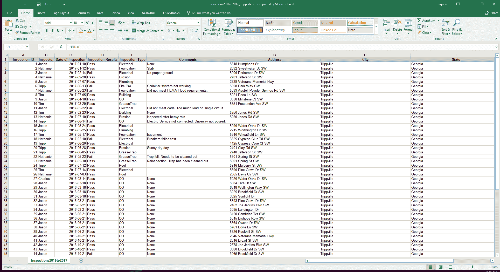

检查电子表格

1.  检查电子表格，将其与菜谱开头的限制进行比较。然后回答以下问题：

**问题**：当您在 ArcGIS Pro 中打开电子表格时，第一行的值将成为列名，这些值是什么？

**回答**：

**问题**：第一行的每个值是否都是唯一的？

**回答**：

**问题**：第一行的值是否包含任何特殊字符？

**回答**：

**问题**：第一行的任何值是否超过 64 个字符？

**回答**：

**问题**：任何单元格中的值是否超过 255 个字符？

**回答**：

如您所见，这是一个简单的电子表格。它不包含很多标题信息或复杂的方程式，这些可能会在 ArcGIS Pro 中引起问题。事实上，它符合 ArcGIS Pro 所需的大部分限制。然而，第一行中的几个值违反了限制，因为它们包含特殊字符（空格）。在您可以将电子表格带入 ArcGIS Pro 之前，您需要调整这些值。

1.  您需要更改单元格 A1 中的值。将`Inspection ID`替换为`Insp_ID`。

1.  将单元格 C1 中的`Date of Inspection`替换为`Date_Insp`。

1.  将单元格 D1 中的`Inspection Results`替换为`Insp_results`。

1.  将单元格 E1 中的`Inspection Type`替换为`Insp_Typ`。

1.  确认您已正确替换第 1 行的值，然后保存电子表格并关闭它：

**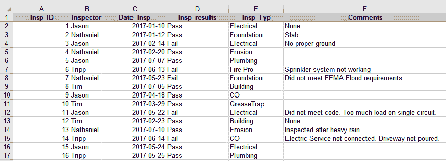**

1.  启动 ArcGIS Pro，并使用您在之前的菜谱中学到的技能打开位于`C:\Student\ArcGISProCookbook\Chapter7`的`Import Spreadsheet.aprx`项目。项目应打开带有 Trippville 市地图。

1.  现在，你将刚刚编辑的电子表格添加到 ArcGIS Pro 中。点击功能区地图选项卡上的图层组中的添加数据按钮。

1.  在左侧面板中，展开计算机选项，以便你可以看到其内容。

1.  点击 C:\驱动器，使其内容出现在右侧面板中。

1.  在右侧面板中向下滚动，直到看到学生文件夹。双击学生文件夹。

1.  双击 ArcGISProCookbook 文件夹。

1.  双击 Chapter7 文件夹。

1.  双击 Inspections2016to2017.xls 文件。选择 Inspections2016to2017$工作表，然后点击确定。工作表应该作为独立表出现在内容面板中。

1.  右键单击 Inspoections2016to2017$独立表，并从出现的菜单中选择打开。工作表以表格形式打开，应该看起来非常熟悉。注意这个工作坊包含的信息字段：

**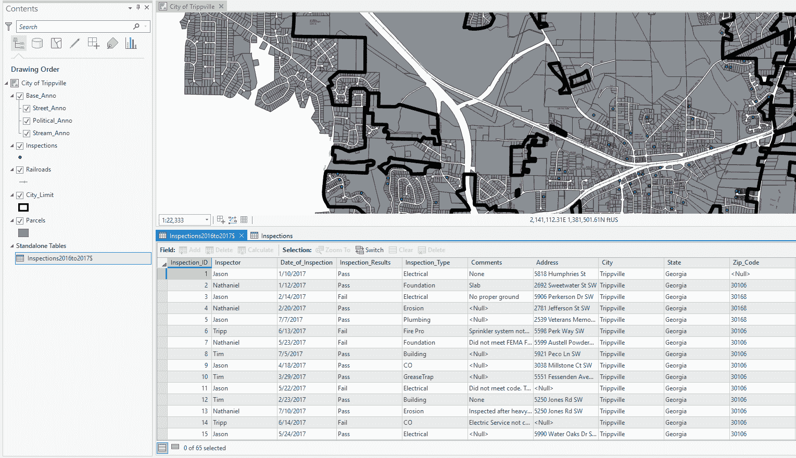**

如果你查看地图中的图层列表，你会看到一个检查层。这个图层显示了你在 ArcGIS Pro 中刚刚导入的工作表中引用的检查位置。现在你将检查这个图层：

1.  在内容面板中，右键单击检查层，并从出现的菜单中选择属性表。

如你所见，这个表格非常简单。它只包含三个字段，ObjectID、Shape 和 InspID，因此图层只存储每个检查的位置。如果你将其与添加的工作表连接，那么你将对每个检查了解得更多。这反过来会增加你在 ArcGIS Pro 中使用数据的能力。现在你将工作表连接到检查层。

1.  在内容面板中，右键单击检查层，选择连接和关联，然后添加连接，如图所示。这将在地理处理面板中打开添加连接工具：

1.  图层名称或表视图应该已经分配。点击输入连接字段的下拉箭头，从列表中选择 InspID。

1.  连接表也应该自动分配为 Inspections2016to2017$工作表，因为它是你地图中唯一的独立表。点击输出连接字段的下拉箭头，选择 Inspection_ID。

1.  确认你的添加连接表工具看起来像以下截图，然后点击运行：

**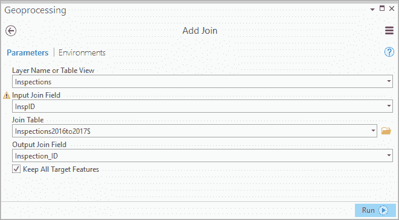**

1.  回顾一下检查属性表，它最初只包含两个字段。现在你应该看到工作表的信息已经添加到这个表中。

1.  关闭地理处理面板。

1.  保存你的项目。

现在你已经将工作表数据连接到检查层，你可以使用这些额外的信息进行标签、符号化和查询，就像这些额外的信息一开始就是图层的一部分一样。唯一不能做的是在 ArcGIS Pro 中编辑来自工作表的信息。这需要你将其转换。

你使用的转换方法将取决于你打算如何使用来自电子表格的数据。如果你想将电子表格数据保留在单独的表中，你可以使用 Excel 到表工具。如果你希望永久性地将数据与图层连接，你可以将连接的图层导出到新的要素类中。你现在将执行这两步。

1.  右键点击检查层，然后在出现的菜单中选择数据。然后选择如图所示导出要素选项。这将打开地理处理面板中的复制要素工具。

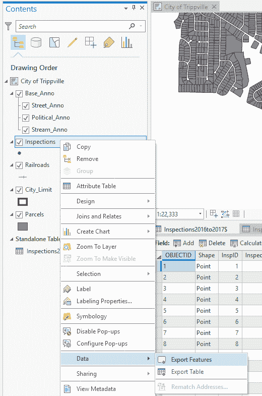

1.  输入要素值应该自动填充。点击输出要素类单元格末尾的浏览按钮。

1.  在输出要素类窗口的左侧面板中选择项目下的数据库文件夹。

1.  双击窗口右侧面板中的 Trippville_GIS.gdb 地理数据库。然后，在窗口底部附近的名字单元格中输入`Inspections_more_data`并点击保存按钮。

1.  确认你的复制要素工具看起来像以下截图，然后点击运行：

**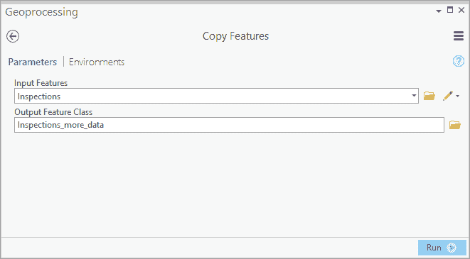**

地理处理面板中的复制要素工具

1.  关闭地理处理面板。

1.  新的 Inspections_more_data 图层应该出现在内容面板中。打开此新图层的属性表，回答以下问题：

**问题**：你创建的图层包含哪些属性字段？

**答案**：

如你所见，新图层包含检查层属性表和 Inspections2016to2017$工作表独立表中的所有信息。现在所有这些信息都是单个图层的一部分，你可以编辑所有数据。

1.  使用快速访问工具栏上的保存按钮保存你的项目。

能够导入和使用来自外部源的数据大大增加了你 GIS 的灵活性。它可以为你提供访问大量新信息以包含在分析中的途径。

# 还有更多……

你刚刚将电子表格连接到检查层，并将其导出到一个新的要素类中，该要素类包含来自连接源的综合信息。但如果你想要检查层和电子表格数据保持分离，但仍然可以从 ArcGIS 中进行编辑，你该如何做？

在那种情况下，你可能想将电子表格转换为真正的独立数据库表。这将允许它们保持独立，但根据需要它们仍然可以连接，或者甚至可以在它们之间设置一个关系类。保持它们独立也有其他优点。首先，如果你的组织需要继续通过电子表格输入数据，你可以轻松地用电子表格的新副本替换独立表。作为一个独立表，你可以仅通过网页表单或移动应用程序与他人共享表格进行编辑和更新。这些只是其中的一些优点。

让我们看看如何将电子表格导出为 GIS 数据库中的独立表：

1.  在功能区中点击分析选项卡。

1.  在分析选项卡上的地理处理组中，点击工具按钮。这将再次打开地理处理面板。

1.  如果需要，点击地理处理面板顶部附近的位置的工具箱选项卡。

1.  定位并展开转换工具箱。

1.  在转换工具箱中定位并展开 Excel 工具集。

1.  你应该看到两个工具，Excel 到表和表到 Excel。你之前在配方中使用了表到 Excel Python 工具。现在你将使用 Excel 到表工具。点击 Excel 到表工具。这将打开地理处理面板中的工具。

1.  点击输入 Excel 文件的浏览按钮。这将打开一个新窗口，允许你导航到要转换的 Excel 文件。

1.  在左侧面板中，定位并展开此电脑或我的电脑。

1.  选择 C:\，通常标记为 OS 或本地驱动器。C:\驱动器的内容应显示在右侧的面板中。

1.  滚动直到看到学生文件夹，然后双击学生文件夹。

1.  双击 ArcGISProCookbook 文件夹。

1.  双击 Chapter7 文件夹。

1.  选择 Inspections2016to2017.xls 文件，然后点击打开按钮。

不要双击 Inspections2016to2017.xls 文件。这将打开其内容而不是选择它，正如所期望的。这将导致工具最终失败。

1.  点击输出表的浏览按钮。

1.  在输出表窗口的左侧面板中，点击位于项目下的数据库文件夹。

1.  双击 Trippville_GIS.gdb 地理数据库。

1.  在输出表窗口的名称单元格中，靠近底部，输入 `Inspections_2016_2017`。然后点击保存按钮。

1.  确认你的 Excel 到表工具看起来如下，然后点击运行：

**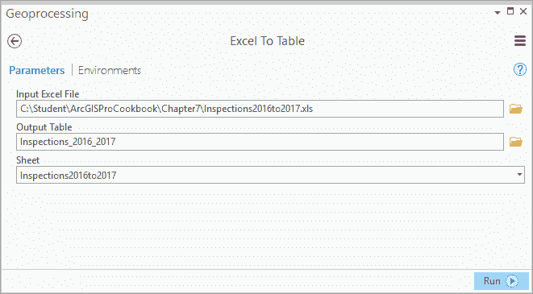**

在地理处理面板中，使用 Excel 到表工具将电子表格导入到地理数据库中

当工具完成时，内容面板中会出现一个新的独立表。这是你刚刚创建的新表。现在你将删除检查层和电子表格之间的连接，并替换为与新表的连接：

1.  右键单击检查层，在出现的菜单中转到连接和关联。选择移除连接，如以下截图所示。这将在地理处理面板中打开移除连接工具：

**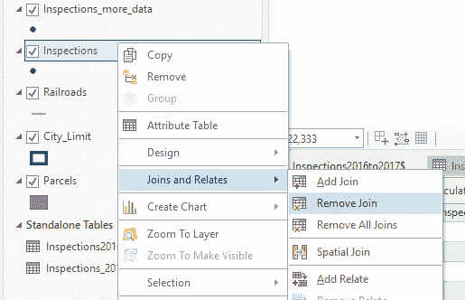**

移除数据表连接

1.  所有必需的参数应自动填充，因为与检查层关联的只有一个连接。因此，请验证您的移除连接工具看起来像以下截图，然后点击运行：

**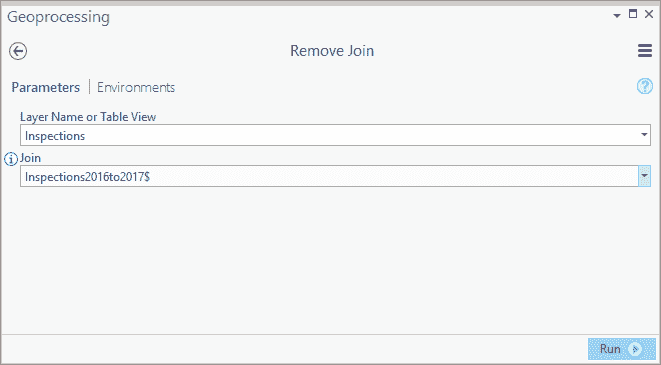**

如果需要，您可以在 ArcGIS Pro 中将多个表连接或关联到单个层或表中。但是，请注意您连接或关联的数量，因为它可能会对性能产生负面影响，并变得难以管理。

1.  使用您在第三章中学习的技能，“将数据链接在一起”，以及在本菜谱中较早的部分，将 Inspections_2016_2017 独立表连接到检查层。

1.  右键单击 Inspections2016to2017$ 独立表并选择移除。这将从地图中删除该表，但不会删除文件。

1.  打开检查层的属性表，并验证 Inspections_2016_2017 的数据是否已连接。

1.  关闭地理处理面板和任何您正在查看的打开的表格。

1.  保存您的项目并关闭 ArcGIS Pro。

# 将所选要素导入现有层

在本章中，您已经学习了将整个数据集导入您的地理数据库或从您的地理数据库导出到其他格式的各种方法。如果您只想导入少量选定的要素或记录怎么办？

默认情况下，您已经使用的地理处理工具，如复制要素、合并、追加和 Excel 到表格，如果已选择，将自动限制为所选要素或记录。然而，这些工具中的大多数都会创建新的要素类或表格。它们不仅仅是向现有数据集中添加数据。ArcGIS Pro 允许您从一层复制数据并将其粘贴到另一现有层中。这允许您选择您想要转换或导入的确切要素。

在本菜谱中，您将从 shapefile 复制记录并将其粘贴到指向地理数据库要素类的现有层中。您将通过首先执行查询来选择要导入现有地理数据库层的 shapefile 中的要素来完成此操作。然后，您将复制并粘贴这些要素从 shapefile 到地理数据库层。您正在处理的 shapefile 代表在 Trippville 市正在建设的新分区。

# 准备工作

您不需要完成之前的菜谱才能完成这个菜谱。这个菜谱可以在 ArcGIS Pro 的所有许可级别下完成。您需要确保已安装书籍的样本数据。假设到这一点，您已经完成了书籍中的某些菜谱，或者至少在过去使用过 ArcGIS Pro 并且知道如何打开现有项目。

# 如何操作...

1.  使用您在之前的菜谱中学到的技能启动 ArcGIS Pro，并打开位于`C:\Student\ArcGISProCookbook\Chapter7`的`Convert Selected Data.aprx`项目。

1.  注意地图视图中心的大块地。这就是将成为新分区的地块。在内容面板中选择“按绘制顺序列表”按钮。它是左侧的第一个按钮。

1.  打开“新分区形状文件”图层。一旦可见，您将能够看到新的分区。

1.  新项目应该以 Trippville 市地图缩放到新分区的区域打开。在内容面板中点击“按编辑列表”按钮。按钮图标看起来像一支铅笔。

1.  右键点击街道权属图层，并从出现的菜单中选择“将此作为唯一可编辑图层”，如图所示：

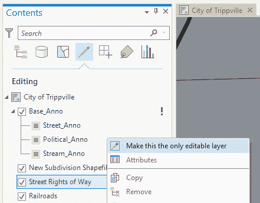

1.  在内容面板中点击“按选择列表”按钮。它位于“按编辑列表”按钮的左侧。

1.  在功能区点击地图标签。在“选择”组中选择“按属性选择”工具。这将在地理处理面板中打开“按属性选择图层”工具。

1.  点击图层名称和表视图的下拉箭头。从提供的列表中选择“新分区形状文件”。

1.  确保选择类型设置为“新选择”。

1.  点击“添加条款”按钮。

1.  按照以下截图所示构建表达式，然后点击“添加”按钮：

**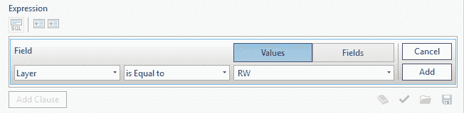**

1.  点击位于您刚刚创建的选择表达式下面的“验证”按钮，它看起来像绿色的勾号。如果它说“SQL 表达式有效”，则点击“运行”按钮。这将选择所有在“新分区形状文件”中被属性标记为 RW（代表权属）的线条。

您应该选择了 258 个功能，您可以通过查看内容面板来验证。您应该在“新分区形状文件”图层旁边看到所选功能的数量。所选功能将在地图上突出显示，如图所示：

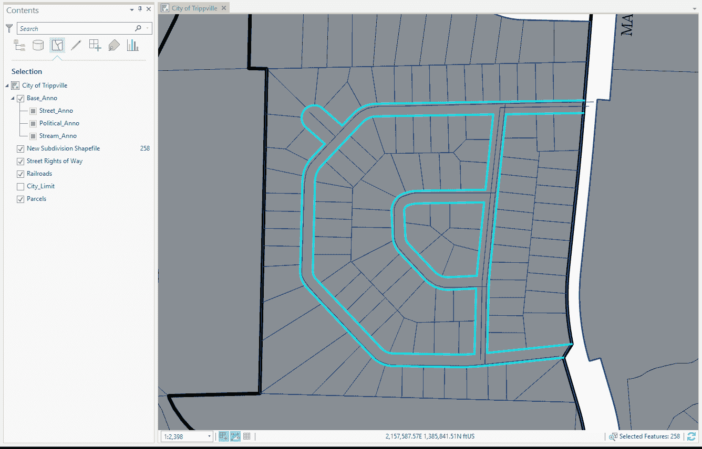

已选街道权属线

现在，您将复制您已选择的功能并将它们粘贴到街道权属图层中。

1.  在功能区点击“编辑”标签页。

1.  点击编辑标签页上的“选择”组中的“选择”工具。

1.  点击位于“编辑”标签页上的“剪贴板”组中的“复制”按钮。

1.  点击位于“编辑”选项卡中“剪贴板”组下方的下拉箭头，并选择“特殊粘贴”，如图所示：

**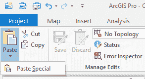**

1.  确保将“粘贴到模板”设置为“街道通行权”，如图所示，然后点击“确定”：

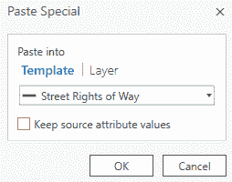

1.  在“内容”窗格中查看。注意，现在在“新子分区形状文件层”中没有选择任何功能。相反，现在在“街道通行权层”中有 258 个功能被选中。您只是从一层复制了功能并将其粘贴到另一个现有层中。

1.  点击位于功能区“编辑”选项卡“选择”组中的“清除”按钮，以清除您的选择功能。

1.  在“内容”窗格中，点击“按绘制顺序列表”按钮，关闭“新子分区形状文件层”，以验证您是否成功将功能复制到了“街道通行权层”。

1.  在功能区“编辑”选项卡的“管理编辑”组中点击“保存”按钮，将您刚刚复制到“街道通行权层”的新功能保存。当被询问是否保存所有编辑时，点击“是”。

1.  保存您的项目并关闭 ArcGIS Pro。

此方法允许您从引用 CAD 文件（DWG、DGN 或 DXF）、形状文件和地理数据库要素类的层中复制功能，并将其粘贴到另一个层中，只要该层引用的是形状文件或地理数据库要素类。
