# 第九章：空间统计和热点分析

在本章中，我们将介绍以下内容：

+   识别热点

+   寻找地理分布的平均中心

+   识别地理分布的中心特征

+   计算数据的地理分散度

# 简介

如果你已经完成了上一章，你已经开始了解 ArcGIS Pro 带来的分析能力。你已经看到它如何被用来查找彼此靠近的特征，并计算这些距离以及其他属性。但是，如果你不是只想找到最近的特征或计算特征之间的距离呢？如果你想要确定数据中是否存在任何空间聚类，看看是否存在某种模式或可能的起点？

这种分析通常被称为聚类或热点分析。它使用各种方法来确定数据的空间分布和相关值，以便你可以看到聚类、确定中心点、方向分布等。这是通过计算可以由其他属性（如大小、总金额或计数）加权的空间统计来完成的。

ArcGIS Pro 包含超过 25 种不同的空间统计计算工具。这些工具都存储在空间统计工具箱中，并分为五个不同的工具集，包括分析模式、映射聚类、测量地理分布、建模空间关系和实用工具。这个工具箱中的大多数工具都可以在所有许可级别上与核心 ArcGIS Pro 产品一起使用。这意味着即使拥有基本许可，你也可以执行一些相当惊人的分析。

在本章中，你将有机会在 ArcGIS Pro 中使用一些空间统计和热点分析工具。你将执行热点分析，以确定城市中哪些地区因犯罪而遭受了最大程度的损害或损失。这将帮助城市确定它可能希望集中执法活动的地区。

接下来，你将计算一个专业组织成员的平均中心，以便你可以确定在哪里举办会议，使其位于所有成员的平均质心。

然后，你将确定一个公司使用的中心建筑，以确定其企业总部搬迁的位置，使其位于所有其他办公室的中心。这将使每个人都更容易前往总部参加会议，并减少整体旅行预算。

最后，你将分析一系列犯罪案件，以确定它们是否不仅在一个一般区域内集中，而且在某个特定方向上也是集中或聚类的。这将有助于确定一条特定的道路或其他交通方式可能是一个影响因素。

# 识别热点

警察局长向您寻求帮助。他正在申请一项补助金，通过社区警务计划资助更多警察。他需要确定是否存在犯罪发生且损害或损失比其他地区更多的区域。如果存在这样的区域，他可以在补助金申请中将其作为正当理由。

他已经为您提供了涵盖 2013 年和 2014 年的城市犯罪数据。这些数据已经进行了地理编码，因此您有一个显示犯罪位置的点层，并附有犯罪类型、发生日期、响应警官、美元金额的损害或损失以及涉及的受害者数量。补助金要求所有数字都汇总到人口普查区块级别。您将不得不使用空间连接工具将犯罪数据按人口普查区块进行聚合。

在本菜谱中，您将使用热点分析工具来查看是否存在任何犯罪地理集群，这些集群对受害者的损害或损失高于正常水平。为了执行此分析，您首先需要使用空间连接将点数据聚合到人口普查区块中，以汇总犯罪数据。

# 准备工作

本菜谱需要将样本数据安装到您的计算机上。建议您在处理这些菜谱之前完成前一章的菜谱。还建议您完成第三章（cbca2a90-3539-4243-8ca3-0010b6f91584.xhtml）中找到的“Joining Features Spatially”菜谱，*链接数据在一起*。这将确保您对如何访问分析工具和一般工作流程有更好的基础理解。您可以使用任何 ArcGIS Pro 许可级别完成此菜谱。

# 如何操作...

1.  使用您从执行前一个菜谱中获得的技术，启动 ArcGIS Pro 并打开位于 `C:\Student\ArcGISProCookbook\Chapter9\Spatial Stats Hotspots` 的 `Spatial Stats Hotspots.aprx` 项目。

1.  项目应打开带有 Union City 犯罪地图。此地图包含警察局长提供的犯罪位置、街道、城市界限、地块、人口普查区块和警察巡逻区。在我们开始分析之前，我们需要更好地了解我们将要处理的数据。在内容窗格中右键单击犯罪位置层并选择属性表。花点时间探索该表并回答以下问题：

**问题**：犯罪位置层的属性表中有哪些字段？

**答案**：

**问题**：在属性表中识别出哪些类型的犯罪？

**答案**：

**问题**：在表中你能找到的最大损失或损害是多少？

**答案**：

您可以通过右键单击表中的字段名并选择所需的排序来按升序或降序对字段进行排序，就像您在电子表格中做的那样。

1.  使用相同的过程打开人口普查区块层的属性表。查看其内容并回答以下问题：

**问题**：犯罪地点图层属性表中包含哪些字段？

**答案**：

您现在对将要处理的数据有了更好的理解。由于热点分析是在区域内寻找空间聚类，因此通常使用多边形输入而不是点来获得更好的结果。因此，建议您汇总或总结点数据以获得最佳结果。这意味着您需要将犯罪地点数据汇总到人口普查区块图层中，以便您可以看到每个区块中发生了多少犯罪以及每个区块的总损失。您将使用空间连接工具来完成此操作。

1.  关闭犯罪地点和人口普查区块图层的打开的属性表。

1.  在功能区中单击分析选项卡。然后单击工具组中的空间连接工具。这将打开地理处理功能区中的工具。

1.  使用下拉箭头将目标要素设置为人口普查区块。

1.  使用下拉箭头将连接要素设置为犯罪地点。

1.  接受输出要素类的默认值。

1.  使用下拉箭头设置连接操作为“一对一”，并确保已勾选“保留所有目标要素”。

如果您还记得第三章中提到的“链接数据”，您有关于连接操作的两种选择：一对一连接或一对多连接。如果找到多个匹配项，一对一连接选项将汇总数据或求和值。这正是我们想要的。如果选择了一对多连接选项，工具将为每个在目标要素和连接要素之间找到的匹配项创建多个记录。要了解更多关于空间连接工具的信息，请访问[`pro.arcgis.com/en/pro-app/tool-reference/analysis/spatial-join.htm`](http://pro.arcgis.com/en/pro-app/tool-reference/analysis/spatial-join.htm)。

1.  在输出字段面板中，向下滚动直到看到 DL_Dollars 并选择它。这是犯罪地点图层中的损失和损害字段。如图所示，在右侧面板中将合并规则设置为求和，以便将所有发生在相关人口普查区块内的犯罪的总损失相加：

1.  选择位于 DL_Dollars 下方的 Victims_No，并将其合并规则设置为求和。

1.  将匹配选项设置为包含。这将汇总特定人口普查区块内包含的所有犯罪地点。

1.  由于我们只想汇总人口普查区块内的犯罪，因此不要设置搜索半径。

1.  确认您的空间连接工具看起来如下，然后单击运行：

1.  关闭地理处理面板。

应该在内容面板中出现了新的图层。这是空间连接工具的结果。它应该已经按人口普查区块汇总了犯罪数据。让我们检查结果以验证。

1.  右键单击 Census_Blocks_SpatialJoin 图层，并从出现的菜单中选择属性表。

1.  花点时间滚动查看字段，看看哪些字段存在。然后回答以下问题：

**问题**：这个新层包含哪些字段，而原始的普查区块层没有包含？

**答案**：

**问题**：哪个普查区块包含的犯罪损害或损失金额最大？

**答案**：

如您所见，犯罪地点表中的字段已添加到您创建的新层中的普查区块字段。美元中的损害或损失和受害者数量现在代表给定普查区块内发生的所有犯罪的总额。您也应该看到了一个新的字段“Join_Count”。这为您提供了每个普查区块中包含的犯罪数量的计数。

现在，是时候执行热点分析，以确定由于犯罪而造成最大损害或损失的区域。但在我们这样做之前，我们需要将那些具有空损害值的普查区块更新为 0，以避免分析时出现问题。

1.  在功能区中点击“地图”标签页。然后在“选择”组中点击“按属性选择”工具。

1.  确保图层名称或表视图设置为您刚刚创建的新层。

1.  选择类型也应设置为“新选择”。

1.  点击“添加条款”按钮。

1.  使用下拉箭头将字段设置为“美元中的损害或损失”并选择运算符为“空”。验证您的条款看起来如下，然后点击“添加”：

1.  验证您的“按属性选择图层”工具看起来如下，然后点击“运行”以选择所有没有“美元中的损害或损失”字段值的区块：

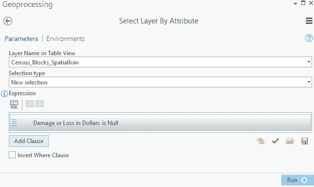

1.  在“Census_Blocks_SpatialJoin”属性表中，右键单击“美元中的损害或损失”字段，并从出现的菜单中选择“计算字段”。

1.  这将在地理处理面板中打开“计算字段”工具。在位于“DL_Dollars”下方和代码块区域上方的表达式单元格中，键入`0`。然后点击“运行”。

您刚刚使用“计算字段”工具将没有匹配犯罪数据的普查区块填充为损害或损失值为 0。您即将使用的热点分析工具在分析的字段有缺失或空值时表现不佳。现在，是时候开始热点分析了。

1.  关闭“Census_Blocks_SpatialJoin”层的属性表。

1.  确保在功能区中激活“地图”标签页。然后点击“选择”组中的“清除”按钮以取消选择所有选定的记录。

记住，所有地理处理工具在运行时将自动仅使用所选要素。为了确保我们分析每个普查区块，我们必须确保没有任何区块被选中。如果我们使用仍然选中的普查区块运行此工具，它将找不到任何热点或簇，因为它们所有都有损害或损失值为 0。

1.  在功能区点击分析标签。然后点击地理处理组中的工具按钮以打开地理处理面板。

1.  点击窗口顶部的工具箱标签。向下滚动到空间统计工具箱。它在列表的底部附近。

1.  展开空间统计工具箱。然后展开映射簇工具集。

1.  点击热点分析（Getis-Ord GI*）工具以在地理处理面板中打开它。

1.  将您的输入要素类设置为使用下拉箭头选择 Census_Blocks_SpatialJoin。

1.  使用下拉箭头将输入字段设置为损失或损害美元。这是您将要分析的字段。

输入字段必须是数值字段类型。这意味着它必须是长整数或短整数、浮点数或双精度浮点数字段类型。它不能是文本、日期或其他字段类型。

1.  将输出要素类设置为 Crime_Hotspots_DamageLoss，通过在单元格中输入该名称。

1.  将空间关系概念设置为固定距离带。此设置确定特征如何根据彼此的空间关系进行分析。

1.  将距离带或阈值距离和自潜在场留为未定义，因为这些是可选参数。

1.  确认您的热点分析（Getis-Ord Gi*）工具看起来如下，然后点击运行：

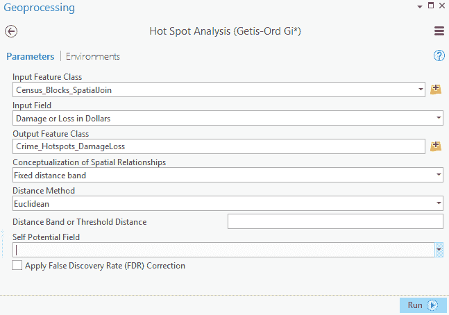

当热点分析工具完成后，将在您的地图中添加一个新图层。该图层将根据数据的统计显著性或置信度自动符号化。置信度越高，热点或冷点越明显。在这种情况下，热点是那些在美元损失或损害程度最高的区域。冷点将是那些损失或损害美元显著较少的区域。

您的分析结果已确定两个热点或簇，与周围区域相比，美元损失或损害的金额显著：

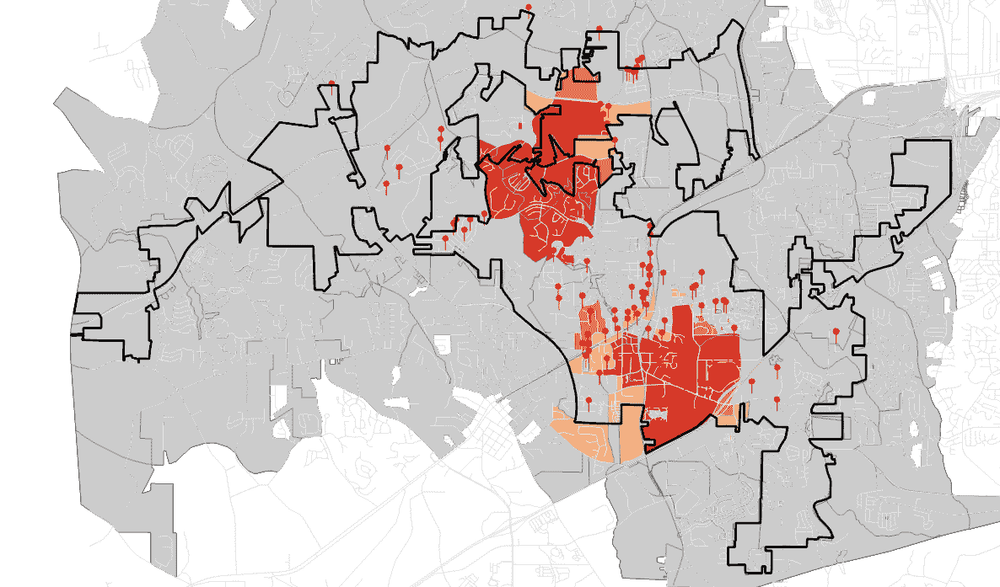

如您所见，没有冷点。这意味着现在有一些区域与周围邻居相比，平均损害程度显著低于平均水平。

1.  保存您的项目。

1.  如果您不继续下一个食谱，您可以关闭 ArcGIS Pro。如果您继续，请保持 ArcGIS Pro 打开。

# 寻找地理分布的平均中心

当我们在寻找数据簇或试图确定数据的整体地理分布时，许多这些工具首先做的事情之一就是确定数据的质量中心。从那里，它可以比较附近的特征以寻找簇，确定数据的区域浓度，查看方向分布，等等。

然而，找到我们数据地理分布的中心可以是一个强大的分析工具。这可以让我们战略性地定位新设施，选择一个中心会议地点，规划对事件的反应，等等。我们可以计算三种类型的中心：均值、特征和中值。

均值中心最容易计算。它只是您正在分析的图层中所有特征的 x 和 y 坐标的平均值。结果是均值中心。这可以用于跟踪随时间的变化或移动，例如从城市到郊区的人口迁移。您也可以用它来找到一个对所有与会者都位于中心的会议地点。

中值中心有时被称为最小距离中心。简单来说，它代表的是在给定图层中距离所有特征最近的位置的坐标对。区域会根据存在的特征数量自动加权。特征数量多的区域会将中值中心拉向它们，比特征数量少的区域更明显。这有助于定位可能依赖其他结构支持的新设施。

中心特征定位一个与所有其他特征最近存在的特征。如果您正在寻找一个位于其他设施中心的位置，这可能很有用。例如，您正在计划消防员的培训。您希望在一个现有的消防站举行，因为他们有您需要的培训设备。中心特征将允许您定位到其他站最接近的消防站。

在此配方中，您被要求找到一个中心位置来举办一个专业组织的会议。您已经提供了一个显示所有成员位置的图层。您将使用均值中心工具来确定所有成员的地理均值中心。这将确定您应该寻找举办会议的区域。

# 准备工作

此配方需要将样本数据安装到计算机上。您不需要完成任何之前的配方，尽管建议您阅读本书的前三章，或者拥有与 ArcGIS Pro 相似的经验，以确保您具备完成此配方所需的基础知识。您可以使用任何 ArcGIS Pro 许可级别完成此配方。

# 如何操作...

1.  如果您在开始此配方之前关闭了 ArcGIS Pro，您需要启动 ArcGIS Pro 并打开位于`C:\Student\ArcGISProCookbook\Chapter9\Spatial Stats Hotspots`的 Spatial Stats Hotspots 项目，使用您在之前的配方中学到的技能。

1.  在目录窗格中，展开地图文件夹。然后右键单击成员中心地图，从出现的菜单中选择打开。这将打开一个包含您需要完成配方剩余部分工作的图层的地图。

如你所见，这个组织有成员分布在美国各地。因此，选择一个中心位置来举办会议对于减少所有成员的旅行时间和成本非常重要。

1.  点击功能区中的分析选项卡。

1.  点击地理处理组中的工具按钮以打开地理处理面板。

1.  点击面板顶部的工具箱选项卡。

1.  滚动到空间统计工具箱并展开，以便查看其内容。

1.  展开测量地理分布工具集。注意这个工具集中包含的各种工具。你应该会看到计算之前讨论过的各种中心的工具，以及其他工具。

1.  点击平均中心工具以打开它。

1.  使用下拉箭头将输入要素类别设置为成员。

1.  接受输出要素类别的默认值。

1.  在此分析中，留空权重字段、案例字段和维度字段。你将在未来的分析中使用它们。

1.  确认你的平均中心工具看起来如下，然后点击运行：

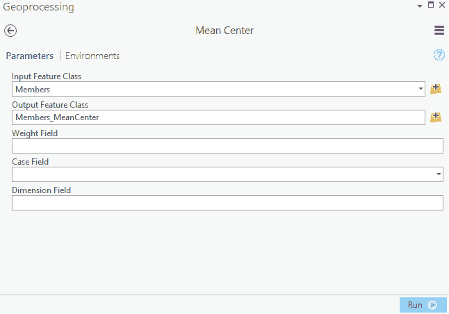

结果应产生一个位于密苏里州黎巴嫩以北、里奇兰德以西的点，如下截图所示。这代表着组织中所有成员的平均地理中心：

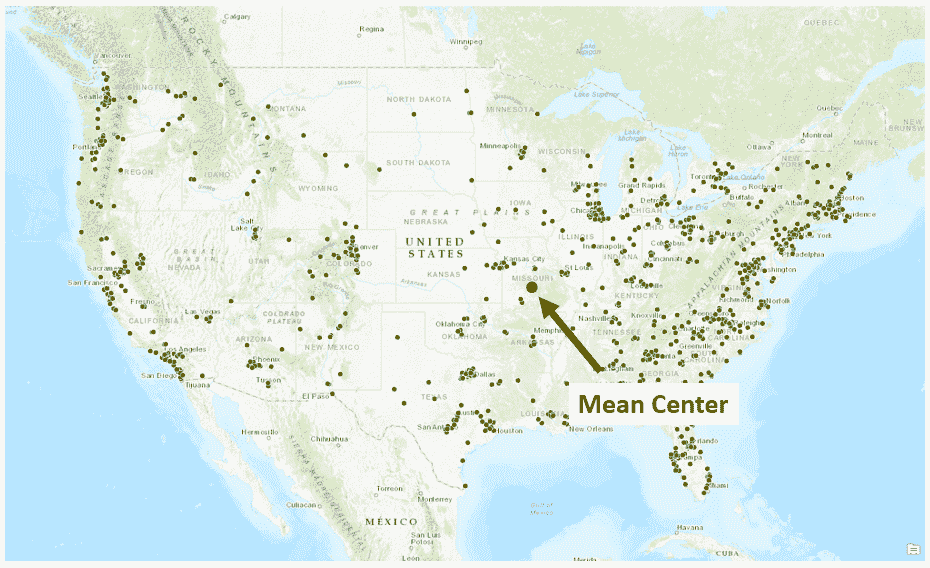

平均中心分析结果

1.  关闭地理处理面板。

1.  保存你的项目。

你刚刚计算了一个专业组织成员的平均中心，以帮助他们选择下一次会议的地点。你使用了位于空间统计工具箱中的平均中心工具和测量地理分布工具集来完成这项工作。

# 更多内容...

你刚刚使用平均中心工具计算了专业组织成员的平均中心。然而，当你运行工具时，你留下了几个参数为空，包括权重字段和案例字段。这两个参数都可以改变工具的结果，并大大增加其灵活性。

通常当我们分析数据时，并非所有输入都是相等的，即使在单个图层中也是如此。有些可能需要比其他输入更大的影响力。当我们试图计算中心时，这一点尤为正确。我们可以通过使用加权字段来反映这种不平等的影响力。

当我们不使用加权字段计算中心时，就像你对成员所做的那样，所有要素都被同等对待。没有单个要素或位置比另一个要素或位置对最终结果有更大的权重或影响力。然而，如果你使用权重字段，某些位置在计算平均中心时比其他位置受到更多的考虑。这将导致中心被拉向那些加权位置，如下面的截图所示：

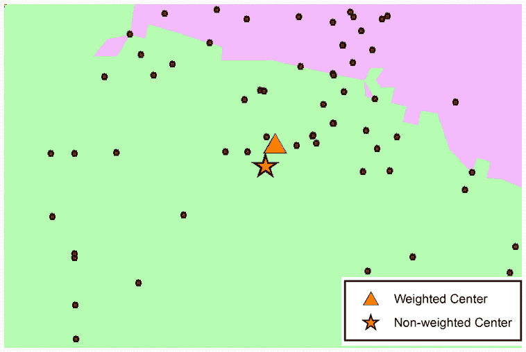

在运行分析时，每个要素所携带的权重基于输入要素类的属性表中的一个字段。此属性字段必须是数值类型字段。文本字段不能用作加权字段。数值较高的将比数值较低的有更大的影响力，这会导致计算出的中心点更靠近那些具有较高权重的点。

案件字段根据该字段中找到的值对要素进行分组。这意味着你的结果将返回多个中心点。你将为每个要素分组计算一个中心位置。

那么，让我们看看这两个字段是如何工作的。警察局长需要更多帮助来处理他的拨款申请。他试图确定每个警察巡逻区域内新警署的可能位置。这些区域代表警署的巡逻和响应区域。他需要知道每个区域内发生的犯罪事件的平均中心。他希望那些受害者数量最多的犯罪比那些受害者数量最少的犯罪更重要。你将使用相同的平均中心工具为警察局长执行此分析。然而，这次你将为权重字段和案件字段参数提供值：

1.  确保空间统计热点项目仍然打开。

1.  点击地图视图顶部的 Union City 犯罪地图标签。你之前在先前的菜谱中执行热点分析所使用的地图现在应该显示出来。

1.  右键单击 Crime_Hotspots_DamageLoss 图层，并从出现的菜单中选择移除。同样，对于空间连接和人口普查区图层也要重复此过程。这只是为了清理地图，使其更容易阅读和工作。

1.  在内容面板中，确保你处于按绘制顺序列表。这是面板顶部左侧的第一个按钮。

1.  打开警察巡逻区域图层，使其可见。现在你可以看到警察局长所提到的区域。

1.  使用你学到的技能，在地理处理面板中打开平均中心工具。

如果你忘记了如何做，请参考在先前的菜谱中计算成员的平均中心时使用的步骤 3-7。

1.  使用下拉箭头将输入要素类设置为犯罪地点。

1.  接受为输出要素类提供的默认值。

1.  使用下拉箭头将权重字段设置为受害者数量。

1.  将案件字段设置为警察巡逻区域。

1.  确认你的平均中心工具看起来如下，然后点击运行：

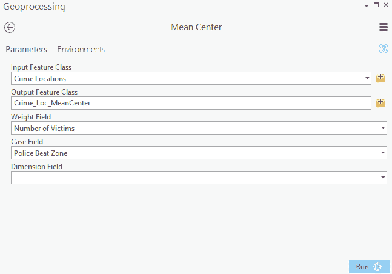

1.  关闭地理处理面板。

你现在应该看到，每个警察巡逻区域都定位了一个中心点。这是每个区域内所有犯罪事件的地理平均中心，按受害者数量加权：

使用案件字段计算的平均中心结果

这意味着中心被拉向了受害者数量最多的犯罪。如果你想看到权重字段对结果的影响，你可以重新运行 Mean Center 工具，而不应用权重字段。根据受害者数量的不同，加权中心和未加权中心之间的差异会有所不同。

1.  保存你的项目。

1.  关闭 ArcGIS Pro。

# 确定地理分布的中心特征

你现在知道如何计算一组要素的地理中心。正如你所看到的，这非常有用，可以帮助定位新的结构、事件地点等。它还可以用来比较两组数据，看是否有随时间的变化或移动。但如果你需要知道一组中的哪个要素是最中心的呢？你能做到吗？

你可以使用 Center Feature 工具来完成这项工作。这个工具位于 Spatial Statistics Tools 工具箱和 Measuring Geographic Distributions 工具集中。Central Feature 工具识别输入要素类中点、线或多边形的最中心要素。它是通过计算每个要素的重心到其他每个要素的重心的距离来做到这一点的。一旦计算完成，该工具会选择距离所有其他要素最近的要素并将其复制到一个新的输出要素类。如果存在 Z（高程）坐标，最短距离计算也将尊重这些坐标。像 Mean 和 Median Center 工具一样，如果你愿意，也可以使用权重和案例字段。这个工具在投影坐标系中效果最好。使用地理坐标系可能会因为单位的不一致性而扭曲结果。要了解更多关于此工具如何计算中心要素的具体信息，请访问[`pro.arcgis.com/en/pro-app/tool-reference/spatial-statistics/h-how-central-feature-spatial-statistics-works.htm`](http://pro.arcgis.com/en/pro-app/tool-reference/spatial-statistics/h-how-central-feature-spatial-statistics-works.htm)。

在这个食谱中，你正在为最近与其他公司合并的 ACME GIS 公司工作。这导致许多新的地点被添加。首席执行官认为，将总部从目前位于芝加哥地区的总部搬迁到一个更中心的位置可能最好。这将有助于减少会议和其他活动的旅行时间。因此，他要求你确定组织中最中心的办公室。他确实希望你在分析时考虑到每个地点的员工数量。在分析中应给予员工数量较多的办公室更大的考虑。

# 准备工作

建议你在开始这个之前，先完成本章中的其他食谱。这将确保你对如何访问所需的工具以及完成此食谱所需的基本概念有一个良好的基础理解。

在继续之前，你还需要确保样本数据已安装。

# 如何做到...

1.  启动 ArcGIS Pro 并打开位于 `C:\Student\ArcGISProCookbook\Chapter9\Spatial Stats Hotspots` 的 `Spatial Stats Hotspots.aprx` 项目，使用你在过去菜谱中学到的技能。如果你最近完成了前面的菜谱，这个项目应该包含在你的最近打开的项目列表中。

1.  在目录窗格中，展开“地图”文件夹。然后右键单击“ACME GIS Office Locations”地图并选择“打开”。这将打开一个地图，如图下所示，显示 ACME GIS 公司所有办公室的位置：

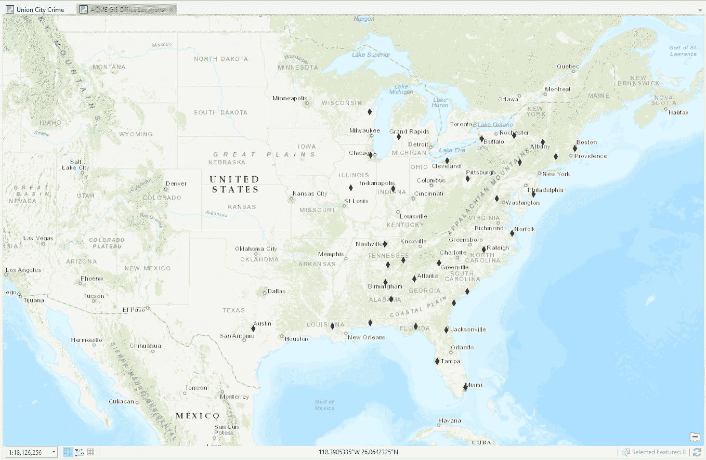

显示 ACME GIS 办公地点的地图

1.  和往常一样，在使用数据之前，你应该先了解你的数据。因此，在内容窗格中右键单击“Office Locations”图层，然后从出现的菜单中选择“属性表”。

1.  查看可用的字段并回答以下问题：

**问题**：属性表中与“Office Locations”关联的字段有哪些？

**答案**：

**问题**：ACME GIS 有多少个办公室？

**答案**：

**问题**：哪个办公室的员工最多？

**答案**：

如你所见，这张表为每个办公室提供了许多属性。它包含包含每个位置的地址信息以及当前在该位置工作的员工数量的字段。

1.  通过单击表格视图顶部标签页中表名称旁边的较小“X”关闭“Office Locations”属性表。

1.  抽空看看办公室的空间分布。看看你是否能估计出哪个办公室是中心特征。

如你所见，许多位于美国东海岸。阿巴拉契亚山脉和肯塔基州之间有一个缺口。这是因为 ACME GIS 在与另一家公司合并之前，主要在美东部分设有办公室。另一家公司主要在美国东南部设有办公室。

1.  在功能区单击“分析”选项卡。然后在地理处理组中单击“工具”按钮。这会打开地理处理窗格。

1.  在地理处理窗格顶部单击“工具箱”标签页。

1.  展开空间统计工具箱和测量地理分布工具集。

1.  单击“中心特征”工具以打开它。

1.  通过单击下拉箭头并从显示的列表中选择图层，将输入要素类设置为“Office Locations”。

1.  为输出要素类输入`Central_Office`，完全替换默认值。

1.  接受欧几里得作为距离方法。

1.  在尝试定位中心特征时，你将不会使用 CEO 要求的权重字段。所以，留空。你稍后会使用员工数量字段来加权结果重新运行此工具。这将允许你看到权重字段对结果的影响。

1.  将“Self Potential Weight Field”和“Case Fields”留空。

1.  确认你的“中心特征”工具看起来如下，然后单击“运行”：

地理处理面板中的中心特征工具

在你的内容面板中会出现一个新图层，这是中心特征工具的结果。正如你所见，前面也有说明，如果不用加权字段，位于南卡罗来纳州格林维尔市的办公室是最中心的：

**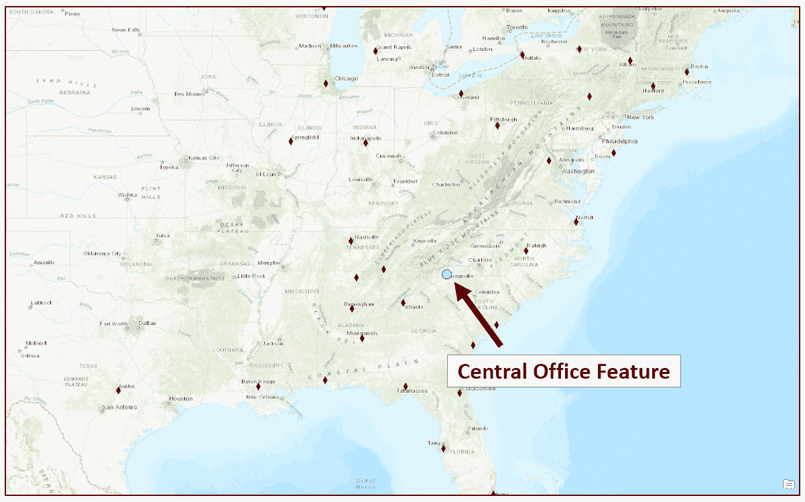**

现在我们来看看当你将每个办公室的员工数作为权重字段应用于分析时会发生什么。

1.  地理处理面板应该仍然打开，中心特征工具也应该打开。输入要素类应该仍然设置为办公室位置。

1.  将输出要素类更改为 `Central_Office_Weighted`。

1.  再次，接受欧几里得作为距离方法。

1.  将权重字段设置为员工数量。

1.  留下其他参数为空。确认你的中心特征工具看起来如下，然后点击运行：

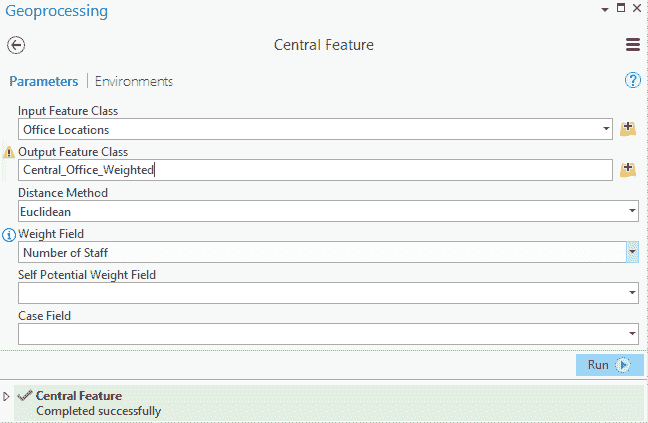

当你将每个办公室的总员工数应用于分析时，结果会发生变化。现在中心办公室是印第安纳波利斯办公室。这是一个向西北方向的大幅移动：

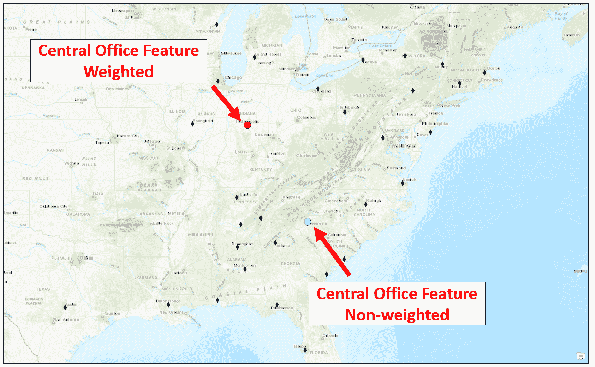

显示加权与非加权不同结果的地图

这表明北部办公室的员工数量比南部多。这种差异足以将中心特征拉到一个全新的位置。

1.  保存你的项目。

1.  如果你不再继续下一个菜谱，你可以关闭 ArcGIS Pro。如果你要继续，请保持项目打开。

你现在知道如何在图层内定位中心特征。这可以非常适用于多种目的，例如在现有设施中定位新的运营点，通过比较观测结果来尝试找到蔓延火灾的起点，或者根据人口最多的地方定位新的设施。

# 计算数据的地理分散度

你现在可以确定一组数据的地理中心和中心特征。正如你所见，这是一种非常强大的分析类型。它可以帮助你定位新位置，确定一系列事件的焦点，找到一组要素的质量中心，等等。但如果你需要知道要素最密集的区域在哪里，或者数据在其地理中心周围是紧凑还是分散？这种分析可以帮助你定位数据簇或看到行为的变化。

ArcGIS Pro 的“标准距离”工具位于“空间统计工具箱”中，以及“测量地理分布”工具集允许您进行此操作。它测量围绕一组要素平均中心的分布紧凑性。计算出的距离越小，数据分散度越低，越紧凑。计算出的距离越大，数据分散度越高，意味着它越不紧凑。此工具的输出将是一个用于 2D 分析的新多边形要素类或 Multipatch 3D 球体。因此，此工具也适用于 3D 数据分析。要了解更多关于此工具如何计算数据分散的信息，请访问[`pro.arcgis.com/en/pro-app/tool-reference/spatial-statistics/h-how-standard-distance-spatial-statistic-works.htm`](http://pro.arcgis.com/en/pro-app/tool-reference/spatial-statistics/h-how-standard-distance-spatial-statistic-works.htm/)。

由于您在社区警务补助金方面的帮助，警察局长印象深刻，并再次寻求帮助。他认为随着年份的推移和假期的临近，犯罪模式正在发生变化。他希望在假期临近时，将巡逻从住宅区转移到购物中心、商业区和州际公路附近。然而，市议会认为这可能会让市民不满，因此他们反对警察资源的转移。

首长要求您帮助确定犯罪模式是否真的发生了变化，正如他所相信的那样，并为他提供可以提交给市议会以支持他观点的东西。他还希望对每个警察巡逻区进行分析。在本食谱中，您将使用标准距离工具确定上半年和下半年每个警察巡逻区的犯罪集中度。这将让您通过展示中心位置以及集中区域的变动，来观察犯罪模式是否随着年份的推移真正发生了变化。

# 准备工作

建议您在开始本食谱之前，先完成本章中的其他食谱。这将确保您对如何访问所需的工具以及完成本食谱所需的基本概念有一个良好的基础理解。

在继续之前，您还需要确保已安装样本数据。

# 如何操作...

1.  如果在最后一个食谱之后关闭了 ArcGIS Pro，请使用您在之前的练习中学到的技能重新打开`Spatial Stats Hostspots.aprx`项目。如果 ArcGIS Pro 在最后一个食谱中仍然打开，请继续下一步。

1.  如果需要，关闭地图上除城市边界、犯罪地点、街道、地块和警察巡逻区之外的所有图层。您的地图应如下所示：

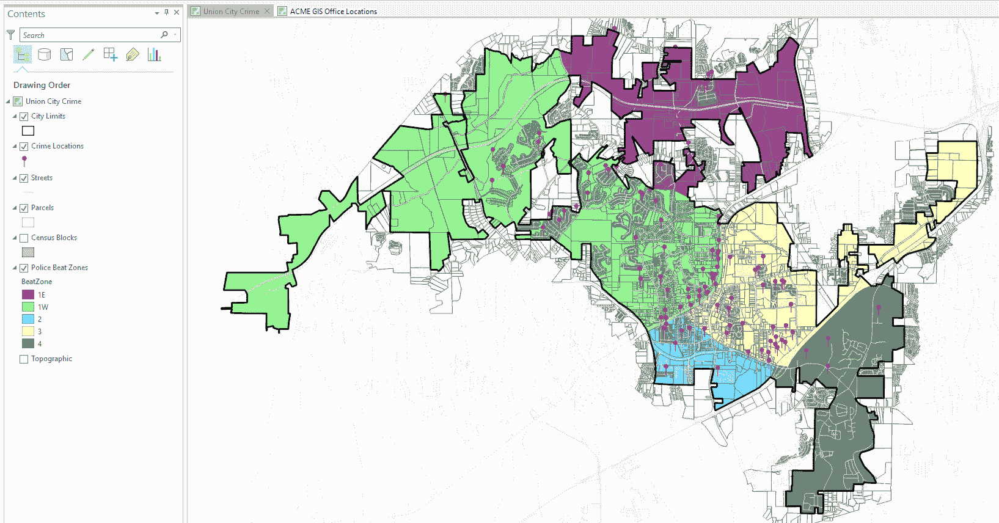

1.  将新的犯罪数据添加到您的地图中。在目录窗格中，展开数据库文件夹。

1.  展开 Spatial Stats Hotspots.gdb 地理数据库。

1.  在功能区中展开 UnionCity 要素数据集，右键单击 Crimes_Loc_2017 要素类，并选择“添加到当前地图”。这将向您的地图添加一个新图层。

1.  确保在内容面板中选择了新图层，然后点击功能区中的外观标签。

1.  点击绘图组中的导入按钮。这将在地理处理面板中打开“从图层应用符号”工具。

1.  确保输入图层设置为 Crim_Loc_2017。

1.  使用下拉箭头将符号图层设置为 Crime Locations。

1.  所有其他参数应保持为空。点击运行以将 Crime Locations 图层的符号应用到 Crime_Loc_2017 图层。

1.  工具完成后，关闭地理处理面板。

1.  右键单击 Crime Locations 图层并选择“删除”。

您已为警察局长需要进行的分析准备好了地图。现在，我们将开始分析上半年犯罪分布。我们将从选择所有在或之前于 2017 年 6 月 30 日发生的犯罪开始。

1.  在功能区选择地图标签，然后点击选择组中的“按属性选择”按钮。这将在地理处理面板中打开“按属性选择图层”工具。

1.  如果需要，使用下拉箭头确保图层名称或表视图设置为 Crime_Loc_2017。

1.  确保选择类型设置为“新选择”。

1.  点击添加子句按钮开始构建查询。

1.  使用下拉箭头将字段设置为 Date_Occur。

1.  确保运算符设置为“是”或“在...之前”，使用下拉箭头进行设置。

1.  值应设置为 06/30/2017。您可以直接输入或使用位于值右侧的日历按钮。

1.  验证您的查询看起来如下，然后点击添加按钮：

1.  您的“按属性选择图层”应如下所示。请验证并点击运行：

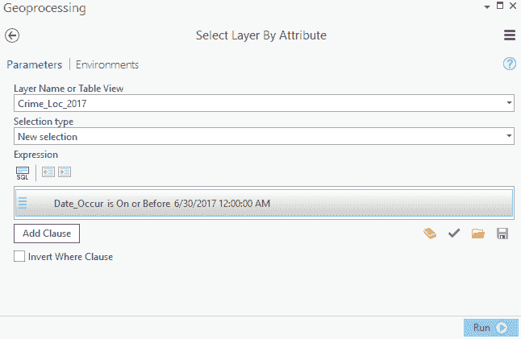

当您运行查询时，地图内应选择大约 70 起犯罪。这应该是发生在上半年所有的犯罪。您可以通过打开 Crime_Loc_2017 图层的属性表，并将表格设置为仅显示所选记录来验证这一点。然后按 Date_Occur 字段排序。

现在您已经选择了上半年发生的犯罪，现在是时候分析它们的地理分布了。

1.  在地理处理面板中，点击位于面板左上角的返回按钮。它是一个位于圆圈内的箭头。然后点击面板顶部的工具箱标签。

1.  在工具箱列表中向下滚动，直到您看到空间统计工具箱并展开它。

1.  扩展测量地理分布的工具集。

1.  点击标准距离工具以在地理处理面板中打开它。

1.  使用下拉箭头将输入要素类设置为 Crime_Loc_2017。

1.  将输出标准距离要素类设置为“Crime_Distribution_First_Half”，将此值输入到单元格中。

1.  将圆圈大小设置为 1 个标准差。

1.  保留权重字段为空。您不需要为该分析应用权重，因为负责人没有告诉您需要对某些罪行比其他罪行应用更大的权重。所有罪行都应同等对待。

1.  您将应用一个案例字段，这样您就可以按警察巡逻区细分分析。将案例字段设置为“警察巡逻区”。

1.  确认您的“标准距离”工具看起来如下，然后点击“运行”：

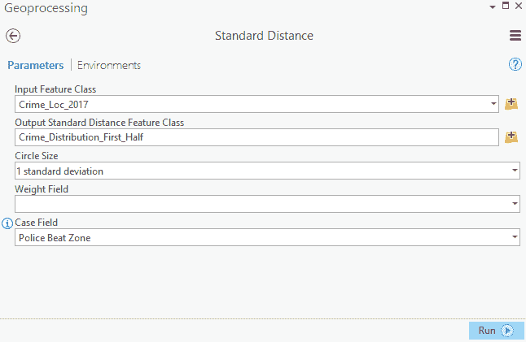

工具完成后，您的地图上会出现一个新的图层。这代表 2017 年上半年在该市发生的犯罪地理分布。地图应看起来像这样：

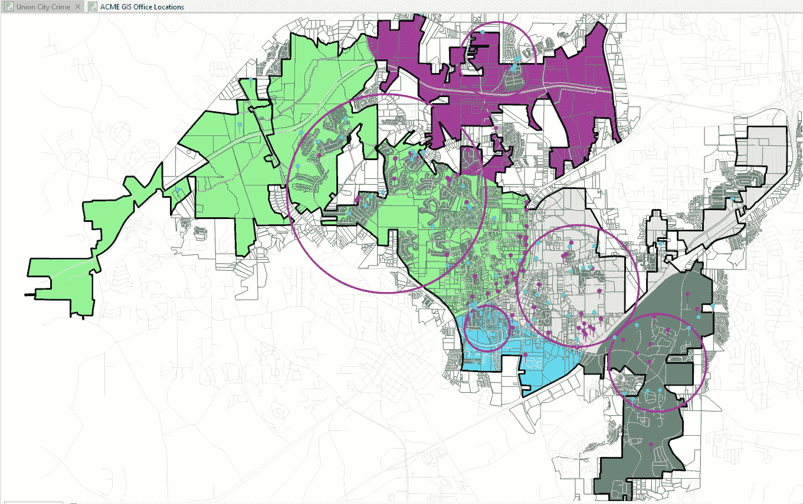

圆圈代表每个警察巡逻区围绕均值中心的犯罪集中度。因此，您应该有五个圆圈。请注意，每个区域发生的所有犯罪并不都在圆圈内。这是因为圆圈代表犯罪的总体分布或集中度。

现在您已经知道了上半年的分布情况，是时候分析下半年的情况了。

1.  在功能区中选择“地图”标签。然后点击位于选择组中的“清除”按钮，取消选择所有选定的要素。

1.  在选择组中点击“按属性选择”按钮，以便构建查询以选择 2017 年下半年发生的所有犯罪。

1.  使用下拉箭头将图层名称或表视图设置为“Crimes_Loc_2017”。

1.  确保选择类型设置为“新选择”。

1.  点击“添加子句”按钮开始构建您的查询。

1.  使用下拉箭头将字段设置为“Date_Occur”。

1.  确保运算符设置为“在...之后”，使用下拉箭头进行设置。

1.  值应设置为 06/30/2017。您可以直接输入该日期，或者使用位于值右侧的日历按钮。

1.  确认您的查询看起来如下，然后点击“添加”按钮：

1.  您的“按属性选择图层”应看起来如下。确认无误后点击“运行”。

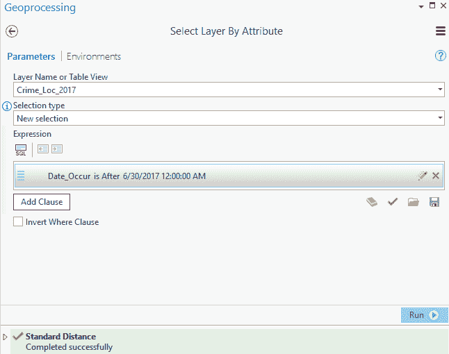

现在您应该已经选择了 2017 年下半年发生的所有犯罪。这意味着您应该选择了 82 起犯罪。您可以使用与验证先前选择相同的方法来验证这一点。

1.  在地理处理面板中，点击面板左上角的“后退”按钮，它是一个位于圆圈内的箭头。然后点击面板顶部的“工具箱”标签。

1.  在工具箱列表中向下滚动，直到您看到“空间统计工具”工具箱，然后展开它。

1.  展开测量地理分布的工具集。

1.  点击标准距离工具，在地理处理面板中打开它。

1.  使用下拉箭头将输入要素类设置为 Crime_Loc_2017。

1.  将输出标准距离要素类设置为 Crime_Distribution_Last_Half，通过在单元格中输入该值来实现。

1.  将圆圈大小设置为 1 个标准差。

1.  留空权重字段。您不需要为此分析应用权重，因为局长没有告诉您对某些犯罪比其他犯罪应用更大的权重。它们都应该同等对待。

1.  您将应用一个案例字段，因此可以根据警察巡逻区将分析分解。将案例字段设置为警察巡逻区。

1.  确认您的标准距离工具与以下内容相似，然后点击运行：

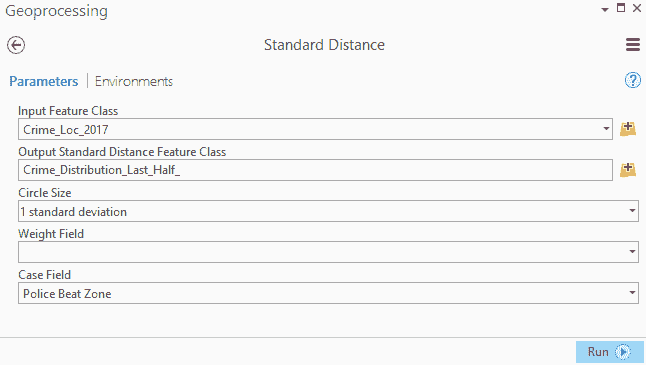

1.  工具完成后，关闭地理处理面板。

1.  在地图选项卡上的选择组中点击清除按钮，以取消选择所有要素。

您现在可以看到去年下半年的犯罪分布情况，并直观地将其与上半年进行比较：

看起来警察局长是正确的。数据显示，犯罪集中确实向商业区、购物中心和州际区域转移。您可以看到，1W 区域向东南方向收缩并转移到罗斯福高速公路沿线的商业区，该高速公路穿过城市的中心。对于 3 区，它沿着香农公园路收缩，另一条主要商业干道也是如此。2 区实际上在去年下半年向香农公园路和罗斯福高速公路两侧扩展。1E 区的集中度保持大致相同，但确实向南转移到美国 29 号公路、斯卡伯勒路和斯通沃尔特尔路交汇处。这是另一条主要动脉，拥有大量的商业开发。

1.  保存您的项目并关闭 ArcGIS Pro。

因此，如您所见，您的分析支持了警察局长的理论。他似乎是对的。您现在可以向他提供他需要带去市议会的数据，以便他们可以就警察资源的分配做出明智的决定。
