# 第十二章：介绍 ArcGIS Online

在本章中，我们将介绍以下食谱：

+   登录您的 ArcGIS Online 账户

+   在 ArcGIS Online 中创建简单的网络地图

+   在 ArcGIS Pro 中访问 ArcGIS Online 内容

+   在 ArcGIS Pro 中访问简单的人口统计数据

+   使用 ArcGIS Online 地理处理服务

# 简介

ArcGIS Online 是 Esri 的 GIS 云解决方案。它允许您和您的组织轻松共享数据、地图、工具和应用程序，然后可以通过互联网访问。在 ArcGIS Online 之前，您需要拥有一个专门的 GIS 网络服务器，例如 ArcGIS Server，以向用户提供基于网络的 内容。

那么，什么是云解决方案？如今，“云”这个词被广泛使用，但很少有人真正了解它。简单来说，云解决方案是一种利用互联网来交付产品的解决方案。这可以是硬件（服务器）、平台（Windows、iOS、Linux）或软件（Microsoft 365、Constant Contact、Salesforce）的形式。

ArcGIS Online 是 **软件即服务（SaaS**）的一个示例：

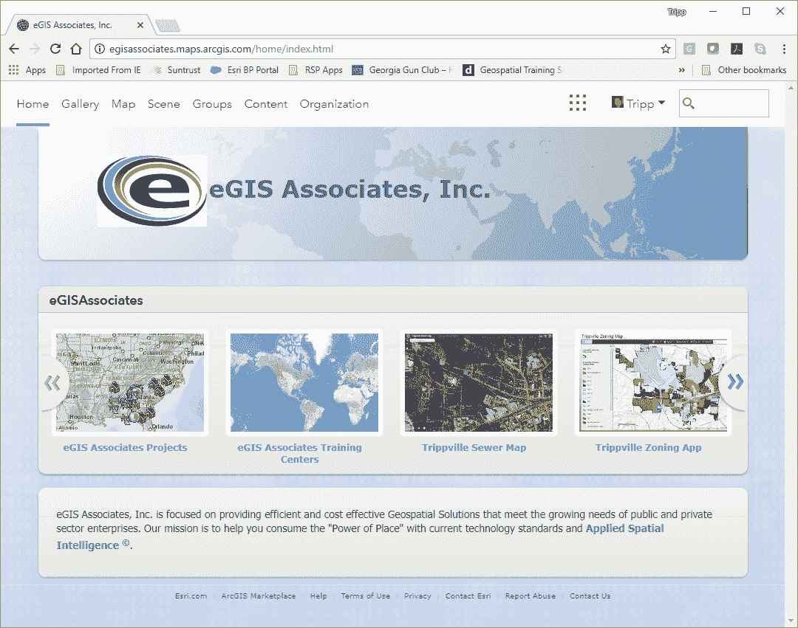

ArcGIS Online 网页门户的示例

作为一项 SaaS 服务，ArcGIS Online 提供了创建交互式地图和应用程序、共享和管理数据以及与其他 ArcGIS 应用程序或其他供应商解决方案集成的必要工具。ArcGIS Online 还提供了控制谁可以访问您的数据的安全功能。就像您自己的本地网络一样，ArcGIS Online 要求用户登录以创建、修改或上传内容。当您在 ArcGIS Online 中发布内容时，您可以选择与谁共享。您可以选择不与任何人共享，这意味着只有您可以访问它。您可以选择与您组织的成员共享，与特定组的一部分共享，或者您可以选择与所有人共享内容。所有这些假设您是二级用户。ArcGIS Online 甚至可以与您自己的本地网络安全和登录集成。

ArcGIS Online 支持两个用户级别，一级和二级。一级用户允许访问和查看内容。因此，他们可以查看通过网页应用程序共享的数据，或者打开允许他们查看和查询数据的移动应用程序。一级用户不允许创建、修改、上传或共享内容。这些功能需要您成为二级用户。

Level 2 用户比 Level 1 用户有更大的访问权限于 ArcGIS Online 内容。他们的访问权限和能力由分配给用户名的角色决定。ArcGIS 包含四个基本用户角色：查看者、用户、发布者和管理员。每个角色都基于前一个角色的能力。查看者角色限制用户只能查看。因此，他们会被限制与 Level 1 用户相同的基本访问权限。用户角色允许用户编辑要素、添加项目并分享内容。发布者角色允许用户发布托管网络地图以及分析网络地图中图层的表现。管理员有管理其他用户、配置组织设置和管理 ArcGIS Pro 许可证的能力。您还可以创建自定义角色，这些角色可以混合和匹配四个主要角色的能力。要了解更多关于不同的 ArcGIS Online 用户角色的信息，请访问 [`doc.arcgis.com/en/arcgis-online/reference/roles.htm`](http://doc.arcgis.com/en/arcgis-online/reference/roles.htm)。

在 ArcGIS Online 中进行操作会消耗积分。在 ArcGIS Online 中进行的多数操作都会消耗一定数量的积分。这包括存储数据、托管应用程序和使用 ArcGIS Online 服务。有些操作消耗的积分非常少，例如存储数据。在 ArcGIS Online 中存储每 1 GB 数据每月仅消耗大约 1.2 积分。其他功能消耗的积分更多，例如地理编码或报告。地理编码 1,000 个地址需要 40 积分。要了解更多关于积分及其工作方式的信息，请访问 [`doc.arcgis.com/en/arcgis-online/reference/credits.htm`](http://doc.arcgis.com/en/arcgis-online/reference/credits.htm)。积分相对便宜。您只需 100.00 美元就可以获得 1,000 积分。

每个 ArcGIS Pro 许可证包括一个 Level 2 ArcGIS Online 用户和 100 积分。ArcGIS Pro 许可证级别无关紧要。如果一个组织（即企业、机构、政府单位）是许可证的所有者，则它们会被合并。因此，如果一座城市拥有三个 ArcGIS Pro 许可证，那么它们将获得三个 Level 2 用户和 300 积分。这些积分每年都会更新，只要 ArcGIS Pro 许可证软件维护得到续订。

在使用 ArcGIS Online 及其内容时，有一些操作是不需要消耗积分的。以下是一些不需要消耗 ArcGIS Online 积分的操作列表：

+   使用 Esri 基础地图

+   上传和下载数据

+   添加和使用来自您自己的 GIS 服务器的服务

+   用户简单查看、查询和打印网络地图

+   地理编码单个地址

+   登录您的账户

+   管理您的 ArcGIS Online 用户或软件许可证

+   查看您组织的 ArcGIS Online 使用情况

+   配置您的 ArcGIS Online 账户和组织

ArcGIS Pro 与 ArcGIS Online 深度集成。在 ArcGIS Pro 中，您可以轻松访问大量数据、地图和其他服务，这些服务扩展了您 GIS 的功能。您还会发现，两者之间的许多工作流程都非常相似。这使得用户在两种解决方案之间切换变得更加容易。

在本章中，您将有机会探索 ArcGIS Online 并了解它是如何与 ArcGIS Pro 集成的。您将从探索您对 ArcGIS Online 的访问权限开始。您将学习如何登录您的账户并开始访问内容。然后，您将学习如何使用现有的 ArcGIS Online 数据创建一个非常简单的网络地图。接下来，您将探索 ArcGIS Online 与 ArcGIS Pro 的集成。您将学习如何将数据层从 ArcGIS Online 带入您自己的地图。然后，您将学习如何从 ArcGIS Online 访问人口统计信息。最后，您将学习如何访问 ArcGIS Online 的一些地理处理工具。

# 登录您的 ArcGIS Online 账户

如前所述，ArcGIS Online 是一个基于云的解决方案。这意味着它是网络的一部分，因此您可以通过网络浏览器访问它，就像访问任何其他网络资源一样。这意味着您几乎可以在任何有互联网连接的地方访问您的 ArcGIS Online 账户和内容。这也意味着您可以使用多种设备来访问它。这包括不仅仅是您的台式计算机或笔记本电脑，还包括您的智能手机或平板电脑。

在这个食谱中，您将学习如何登录并访问您的 ArcGIS Online 账户。您将探索可能对您可用的资源。

# 准备工作

这个食谱需要您拥有 ArcGIS Online 账户和互联网访问权限。您需要是 2 级用户。如果您没有 ArcGIS Online 用户登录或不想使用您组织的账户来完成本章的食谱，您可以从 Esri 获取试用许可证，网址为 [`www.esri.com/arcgis/trial`](http://www.esri.com/arcgis/trial)。

您还需要一个支持 HTML 5 和 JavaScript 的网络浏览器。这包括当前版本的 Chrome、Edge、Firefox 和 Safari。Internet Explorer 11 或更新版本也受支持。其他浏览器也可能工作，但尚未由 Esri 测试。

您不需要完成本书中的任何其他食谱来完成这个食谱，也不需要安装任何 GIS 软件。

# 如何操作...

1.  打开您喜欢的网络浏览器，例如 Chrome、Firefox 或 Edge。

1.  前往 [www.arcgis.com](http://www.arcgis.com)。这是 ArcGIS Online 的网页地址。当网站加载时，它应该看起来类似于这个。请注意，由于 ArcGIS Online 是基于云的，Esri 经常进行更新和更改：

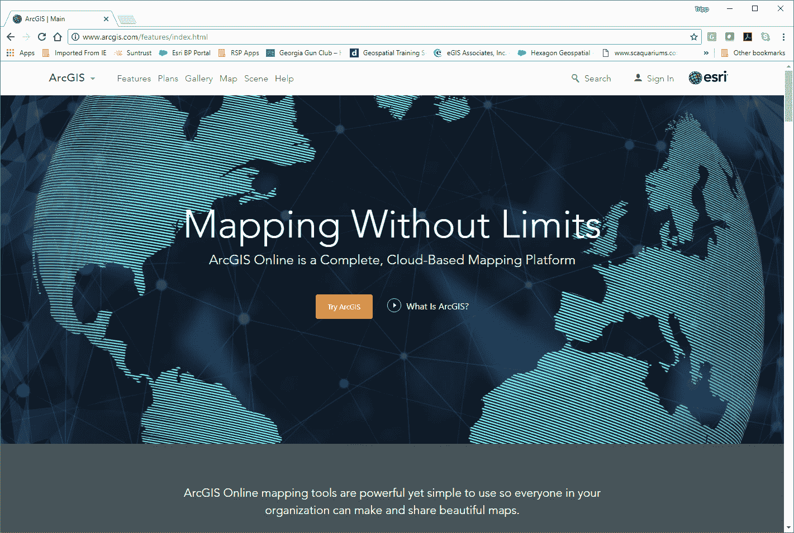

我的经验表明，Chrome 或 Firefox 通常比 Internet Explorer 或 Edge 工作得更好。

1.  点击页面右上角靠近 Esri 标志的“登录”按钮。

1.  在登录页面指定位置输入您的用户名和密码。然后点击“登录”按钮。如果需要，勾选“保持登录”框，这样您就不必每次都输入登录信息：

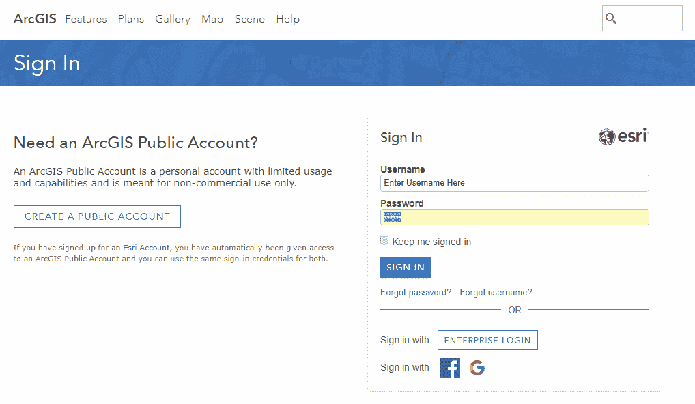

在登录页面有一些需要注意的事项。首先，ArcGIS Online 也支持免费公共账户。这些账户在可使用功能上有限制。它们只能存储最多 2 GB 的数据。它们在分享内容的能力上也有限制。基本上，您要么与所有人分享，要么与没有人分享。

还请注意，您可以将 ArcGIS Online 与您的网络登录集成，或者您可以使用您的 Facebook 或 Google 登录。

您现在已登录到您的 ArcGIS Online 账户。您看到的页面将取决于您的用户角色。如果您是管理员，您将自动转到组织页面。该页面列出了与您的组织关联的所有现有 ArcGIS Online 用户及其角色：

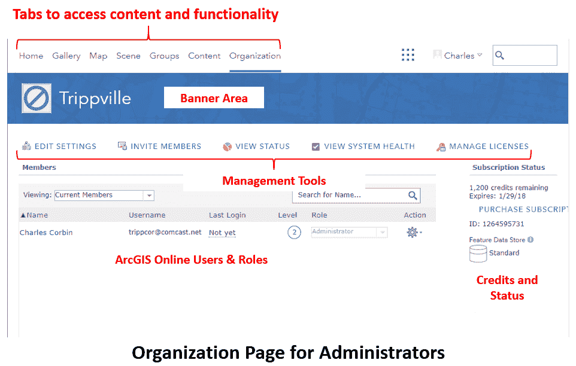

如果您是发布者、用户或查看者，您将看到您组织的首页。如果首页已配置，它将包含您可以访问的关键内容。这可能包括网络地图和应用程序，如下所示：

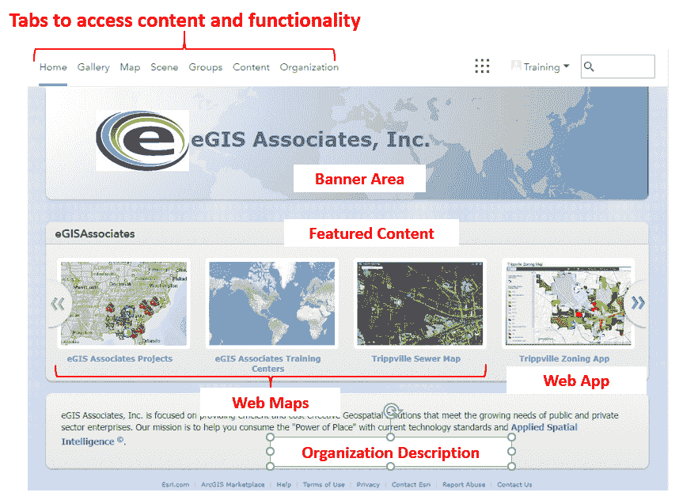

ArcGIS Online 示例首页布局

1.  点击页面顶部的“内容”标签。

1.  花点时间探索“我的内容”、“我的收藏”、“我的组”和“我的组织”标签页。这将显示您已创建的内容或通过组或您的组织与您共享的内容。

如果您之前从未使用过您的 ArcGIS Online 账户，您可能没有任何内容。所以，如果您在内容标签页中看不到任何内容，请不要担心。

您现在将向您的 ArcGIS Online 账户添加一个网络影像服务。由于此服务来自另一个服务器，它不会消耗您任何积分。

1.  点击“我的内容”标签页。

1.  点击位于“我的内容”标签页左上角的“添加项目”，并选择“从网络”，如下面的截图所示：

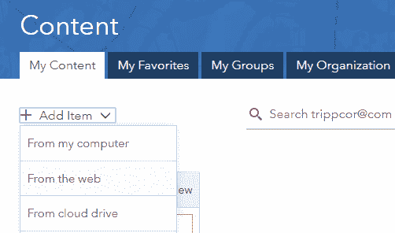

1.  确保类型设置为 ArcGIS Server 网络服务。

1.  在 URL 中输入以下内容：`https://services.nconemap.gov/secure/rest/services/Imagery/Orthoimagery_2017/ImageServer`。

1.  将标题设置为“北卡罗来纳州航空影像”。

1.  在标签中输入以下内容，每输入一个后按一下 *Enter* 键：`NC`、`Aerials`、`Imagery` 和 `2017`。

1.  确认您的“从网络添加项目”窗口看起来如下，然后点击“添加项目”按钮：

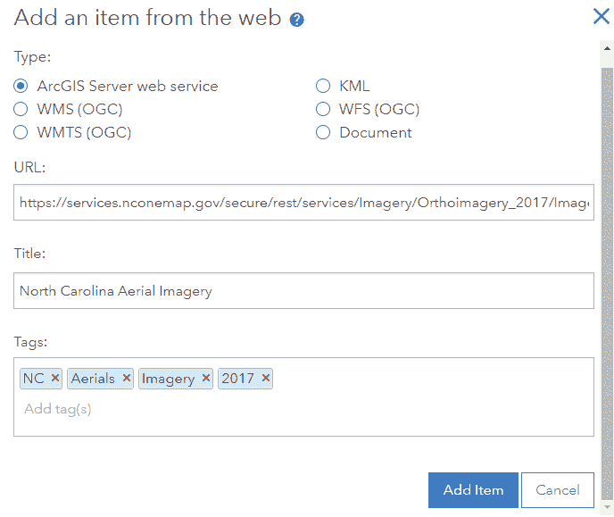

新项目添加后，您将看到新项目的属性页面。这允许您查看和配置与您添加的项目相关的属性。由于您使用现有的网络服务添加了此项目，属性已经根据提供图像服务的网络服务器的设置进行了配置。

1.  花点时间回顾一下您刚刚添加到您内容的项目的所有属性。

1.  点击页面右侧的“在地图查看器中打开”按钮。这将允许您使用 ArcGIS Online 网络查看器应用程序查看您刚刚添加到 ArcGIS Online 内容中的服务。

您的网络浏览器现在将显示您刚刚添加的新北卡罗来纳州航空影像服务，如下面的截图所示。稍后，您将了解 ArcGIS Online 地图查看器的整体功能。现在，您只需验证您的项目已成功添加且可使用。

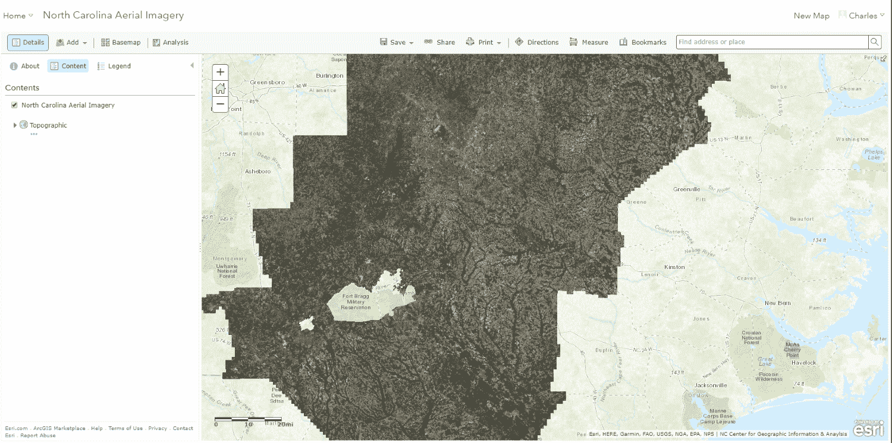

新的带有航空影像的 ArcGIS Online 网络地图

1.  将鼠标指针放在地图中航空影像的大致中心位置，并使用滚动轮放大。放大直到您可以看到单个房屋和道路。如您所见，这是一些高分辨率的摄影。

1.  点击页面左上角“主页”按钮旁边的下拉箭头。从出现的菜单中选择内容。这将带您回到内容页面。

您现在应该能看到您添加到您账户的新北卡罗来纳州航空影像服务。如果您看到了，说明您已成功将内容添加到您的 ArcGIS Online 账户。

1.  关闭您的网络浏览器。

您现在已成功登录到您的 ArcGIS Online 账户。您不仅访问了您的账户，还以网络影像服务的形式添加了内容。然后，您使用 ArcGIS Online 地图查看器应用程序查看此服务。

# 在 ArcGIS Online 中创建简单的网络地图

现在您已经知道如何登录您的 ArcGIS Online 账户并添加一些内容，是时候扩展这项技能并学习如何使用公开内容创建简单的网络地图了。ArcGIS Online 包含大量数据，不仅由 Esri 提供，还有其他用户提供，您有权自由访问和使用。这种信息共享是 ArcGIS Online 成为非常有价值资源的原因之一。

在 ArcGIS Online 中创建地图与在 ArcGIS Pro 中创建地图非常相似。首先，您开始创建一个新的地图。然后，您选择您的底图。接下来，您开始添加图层并配置它们。然后，您保存您的地图。所以，如您所见，步骤非常相似。

在本配方中，您将为 Trippville 市创建一个简单的网络地图。这包括一些简单的图层，例如城市边界、道路和自然水系特征。

# 准备工作

此配方要求您拥有至少分配了发布者级别角色的 ArcGIS Online 账户。您还需要互联网访问以及支持 HTML5 和 JavaScript 的网络浏览器。您需要完成本章中的第一个配方，以确保您知道如何访问和登录您的 ArcGIS Online 账户。

完成此练习不需要 ArcGIS Pro。

# 如何操作...

1.  使用你在本章第一个食谱中获得的知识和技能，使用你的网络浏览器登录到你的 ArcGIS Online 账户。

1.  点击你看到的 ArcGIS Online 页面顶部的“地图”标签。这将带你到地图查看器应用。

地图查看器应用不仅用于查看现有数据或地图。你还可以创建地图、编辑数据、共享地图等。这是一个非常强大的工具。它并不像你在 ArcGIS Pro 中的地图或场景中能做的那样。

1.  点击地图查看器界面左上角的底图按钮。选择街道底图。

1.  点击你刚刚使用的底图按钮左侧的“添加”按钮。从出现的菜单中选择“搜索图层”，如图所示：

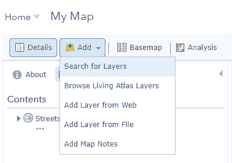

1.  使用下拉箭头将“输入”设置为 ArcGIS Online，如图所示：

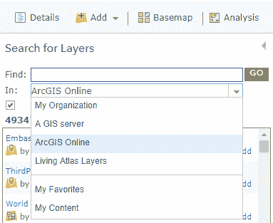

1.  在“查找”旁边的单元格中输入`Trippville`并按*Enter*键或点击“GO”按钮。搜索应该返回几个结果。花点时间浏览结果，以查看为 Trippville 市发布的所有信息。

1.  滚动直到你看到由 Trippcor 发布的 Trippville_City_Limit，这是本书的作者。点击特征服务右侧的“添加”选项。

1.  定位并添加 Trippville_Natwtr_Body 特征服务，并点击“添加”选项。你可以选择任何人发布的任何服务。谁发布它对这个食谱不重要。

1.  继续重复此过程以下图层：

    +   Trippville_RW

    +   Trippville_Railroad

    +   Trippville_Parcels

1.  在添加所有必要的图层后，点击位于搜索图层窗格底部的“完成添加图层”按钮。

你的地图应该看起来与以下截图相似。像 ArcGIS Pro 和 ArcMap 一样，ArcGIS Online 将为你的图层分配随机颜色。因此，你的图层可能看起来与这个截图略有不同：

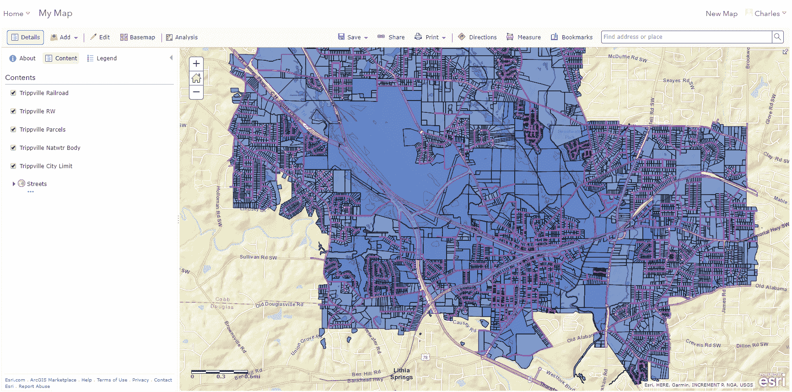

在 ArcGIS Online 中创建的新 Trippville 网络地图

就像在 ArcGIS Pro 中的地图一样，你现在需要配置你的网络地图中的图层。然而，在我们这样做之前，你将保存你的地图。

1.  点击地图查看器应用中靠近顶部中间的“保存”按钮。从出现的菜单中选择“另存为”，如图所示：

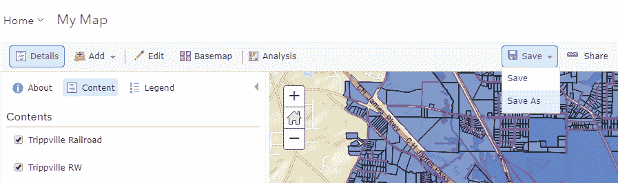

在 ArcGIS Online 中保存地图

1.  在出现的“保存地图”窗口中输入以下值，然后点击“保存地图”：

    +   标题：`Trippville 基础地图`。

    +   标签：`Trippville`、`地图`、`城市`、`界限`、`铁路`、`地块`、`自然水体`（在每个标签之间按 *Enter* 键）。

    +   摘要：`此地图显示了 Trippville 市的整体边界和基本特征`。

    +   保存到文件夹：接受 ArcGIS Online 提供的任何值。

1.  确认你的“保存地图”窗口看起来与以下截图相似，然后点击“保存地图”。记住你的“保存到文件夹”将不同：

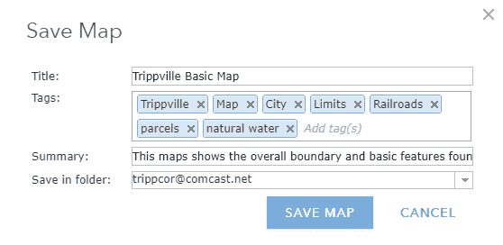

ArcGIS Online 没有自动保存功能。因此，*请记得尽早并经常保存*。

1.  开始配置您的图层。您将从 Trippville City Limit 图层开始。将鼠标指针悬停在地图查看器左侧的内容窗格中的图层上。然后选择如图所示的变化样式按钮。这将打开变化样式窗格：

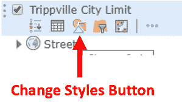

1.  确保已将“选择要显示的属性”设置为仅显示位置。

1.  点击位于选择绘图样式（单个符号）图形中间的选项按钮。这将带您到一个面板，您可以在其中调整图层的符号设置。

1.  点击“符号”以打开一个窗口来调整此图层的符号。在这种情况下，您想使城市边界空心，并带有粗黑轮廓。这将使您能够轻松地看到城市内部区域并识别边界。

1.  点击顶部的填充标签，然后点击如图所示的“无颜色”：

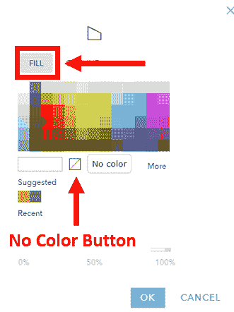

调整 ArcGIS Online 中的符号

1.  点击位于窗口顶部填充标签旁边的轮廓标签。

1.  选择位于第二行底部的黑色方块。应将其颜色代码设置为#1A1A1A。

1.  将线宽设置为`4` PX。

1.  点击“确定”以关闭窗口。

1.  再次点击“确定”然后点击“完成”以应用您所做的所有调整。

1.  将鼠标指针放在 Trippville City Limit 图层上，并将其拖到图层列表的顶部，以便您可以看到它。

如 ArcGIS Pro 和 ArcMap 一样，ArcGIS Online 会根据要素类型自动按顺序放置新图层。点位于列表顶部。线位于点下方。多边形位于线下方，栅格位于多边形下方。您可以使用与 ArcGIS Pro 相同的过程在您的网络地图中更改图层的绘制顺序。只需将它们拖放到所需的顺序即可。

1.  再次将鼠标指针悬停在 Trippville City Limit 图层上。这次，点击如图所示的更多选项：

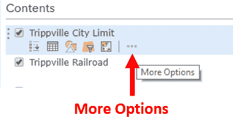

1.  从出现的菜单中选择重命名选项。

1.  将图层重命名为`City Limits`并点击“确定”。内容窗格中图层的名称应更改为您刚刚输入的新值。

1.  现在根据指示更改符号并重命名其他图层：

    +   Trippville_Railroad

        +   将其重命名为`Railroad`

        +   将颜色设置为中等灰色（#999999）

    +   Trippville_RW

        +   将其重命名为`Road Rights of Way`

        +   将颜色设置为绿色，这是第五行的第八列（#38A800）。

        +   将图案设置为虚线

    +   Trippville_Parcels

        +   将其重命名为`Parcels`

        +   将填充设置为无颜色

        +   将轮廓设置为深灰色，这是第二行的第二列（#707070）。

    +   Trippville_Natwtr_Body

        +   将其重命名为`Lakes and Rivers`

        +   将填充设置为浅蓝色，这是第四行的第十列（#00A9E6）。

        +   将轮廓设置为深蓝色，这是第 5 行的第 11 列（#004DA8）

1.  点击位于内容面板中的“图例”选项卡，以查看您对符号所做的更改的结果。

1.  确认您的地图看起来如下，然后点击“保存”按钮保存您的作品：

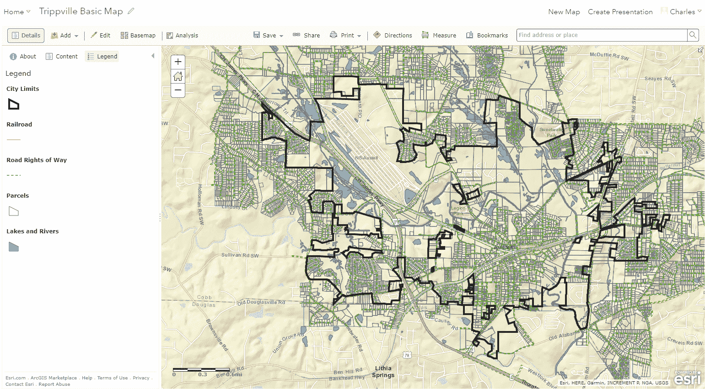

Trippville 基础地图结果

您还可以访问 [`arcg.is/1PKPLi`](http://arcg.is/1PKPLi) 来比较您的工作与作者的结果。

您刚刚在 ArcGIS Online 中创建了您的第一个网络地图。您使用了其他人已经为 Trippville 市发布的现有数据。这只是 ArcGIS Online 中可用数据的一个小样本。您可以找到人口统计信息、航空照片、地形模型等等。如果您没有数据，这是一个很好的起点。

1.  点击位于地图查看器应用顶部“主页”旁边的下拉箭头。从出现的菜单中选择“内容”。

1.  抽空回顾一下您的内容。

如果您在完成第一个配方之前没有使用过 ArcGIS Online，现在您的“内容”中有两个项目可用。一个是您刚刚创建的 Web Map，另一个是在第一个配方中添加的影像图层。随着您继续本章的其余部分，您的内容和项目类型将继续增长。

1.  关闭您的网络浏览器。

# 在 ArcGIS Pro 中访问 ArcGIS Online 内容

您不仅限于使用 ArcGIS Online 地图查看器来访问 ArcGIS Online 中所有可用的内容。您还可以从 ArcGIS Pro、ArcMap 以及其他 Esri 应用程序中访问它。实际上，您已经以基础地图的形式访问了 ArcGIS Online 内容，这些基础地图是您创建的每一张地图和场景的一部分。所有这些内容都是由 Esri 通过 ArcGIS Online 提供的。

在此配方中，应急管理主任要求您准备一张可以在即将到来的天气事件中使用的地图。它需要包括天气雷达信息和天气预警。这将需要叠加城市已有的 GIS 信息，以便其他 ArcGIS Pro 用户可以监控天气事件的发展。

# 准备工作

此配方不需要您完成本章中之前的配方，然而，建议您确保您对 ArcGIS Online 是什么以及它是如何工作的有所了解。您应该在继续此配方之前完成 第一章，*ArcGIS Pro 功能和术语*，或具有使用 ArcGIS Pro 的等效经验。

此配方适用于 ArcGIS Pro 的所有许可级别。在开始此配方之前，您必须安装示例数据。

# 如何操作...

1.  启动 ArcGIS Pro 并打开`ArcGISOnline.aprx`项目。此项目位于`C:\Student\ArcGISProCookbook\Chapter12\ArcGISOnline`。该项目应打开时显示天气响应地图，如图所示。如果不是，请使用您在过去的食谱中学到的技能从目录窗格中打开它。

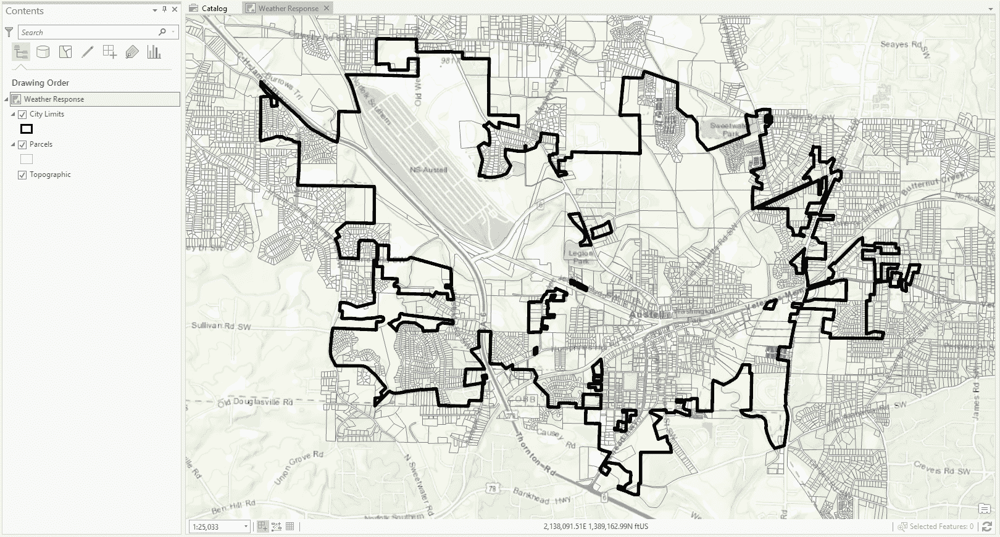

当 ArcGISOnline 项目打开时，应显示天气响应地图

如您所见，这是一张包含 Trippville 区域城市界限和地块的简单地图。这些信息来自您过去在食谱中使用的相同的 Trippville_GIS 地理数据库。现在您将添加一些来自 ArcGIS Online 的数据层。

1.  在目录窗格中，点击门户标签。

1.  现在点击所有门户按钮。它看起来像一朵简单的云。它应该是从左数第三个按钮。这将允许您访问所有用户共享的 ArcGIS Online 内容。

1.  在搜索框中输入`Weather`。这将返回许多标记有 Weather 关键词的 ArcGIS Online 数据列表，您可以访问这些数据。

1.  选择 Recent Weather Radar Imagery Service。然后右键单击它并选择添加到当前地图。这将从 ArcGIS online 添加一个图层到您的地图，显示天气雷达。根据 Trippville 区域当前的天气情况，这可能显示无内容或大量活动。这是一个来自**国家海洋和大气管理局**（**NOAA**）的实时数据流。

1.  在目录窗格中，找到 NOAA NWS Warnings 并将其添加到您的地图中，使用之前相同的过程。同样，这是一个来自 NOAA 的实时数据流，因此根据您添加此图层时的天气情况，它可能也会显示为空。

您已从 ArcGIS Online 添加了两个图层到您的 ArcGIS Pro 地图。这两个图层将在 Trippville 市发生重大天气事件时提供基本的天气信息。这些都是国家级别的图层。让我们加入一些来自其他来源的内容。

1.  在目录窗格中，将搜索更改为`Georgia Weather`。记住在输入新值时按*Enter*键。

1.  滚动并找到 NWS_Local_Storm_Reports 并将其添加到您的地图中。这是一个来自乔治亚州紧急管理署的数据流。这将为您提供 Trippville 市在天气紧急情况下的本地信息。

1.  在目录窗格中，将搜索更改为`Georgia Rivers and Streams`。

1.  滚动并找到 Rivers Streams Atlanta Region。将此数据添加到您的地图中，就像添加其他图层一样。

1.  在内容窗格中，点击按来源列表按钮，然后回答以下问题：

**问题**：地图中每一层的来源是什么？

**答案**:

**问题**：所有这些图层是否都存储/托管在 ArcGIS Online 中？

**答案**:

您的地图现在包含来自多个来源的数据。您有引用您本地 Trippville_GIS 地理数据库的图层。您有多个从包括 NOAA、GEMA 和亚特兰大区域委员会在内的多个机构发布的图层。然而，并非所有这些数据都直接存储在 ArcGIS Online 中。唯一实际存储在 ArcGIS Online 中的图层是底图。所有其他图层都是通过它们自己的本地 GIS 服务器发布到 ArcGIS Online 的。

ArcGIS Online 提供了通道，允许他人轻松访问数据。因此，正如您所看到的，ArcGIS Online 为多个机构和地区之间共享信息提供了一个极好的资源。

1.  探索您从 ArcGIS Online 添加的图层的某些限制。在内容面板中点击“按绘图顺序列表”按钮。

1.  右键点击 SDEPUB.SDE.Rivers_Streams 图层，并从弹出的菜单中选择属性。

1.  在图层属性窗口的左侧面板中点击“常规”选项。

1.  将名称更改为“河流与溪流”。

1.  在左侧面板中点击“元数据”选项。审查元数据并回答以下问题：

**问题**：谁开发了此图层数据？

**答案**：

**问题**：数据捕获的原始来源是什么？

**答案**：

**问题**：数据捕获的日期是什么？

**答案**：

正如您所看到的，元数据提供了关于该层数据的大量信息。这就是为什么在您与他人共享信息时创建和维护元数据很重要的原因。它使他们能够了解数据的谁、什么、何时、为什么以及如何，以便用户可以就如何使用数据进行明智的选择。

记住，要素类的元数据是通过 ArcGIS Pro 中的目录视图进行编辑的。

1.  随意探索与此图层相关的其他属性。完成操作后，点击“确定”。

1.  点击以下图像中所示的河流与溪流图层下的符号修补，以打开符号面板：

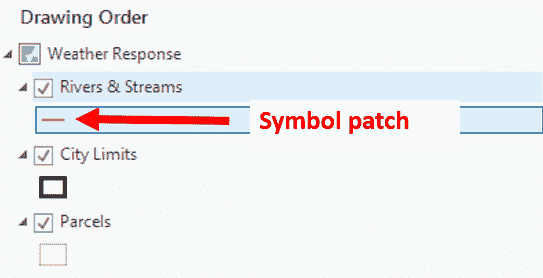

1.  在符号面板中，确保您正在查看提供预配置符号的图库。

1.  选择 ArcGIS 2D 样式中的水（线）符号，如图所示，然后关闭符号面板：

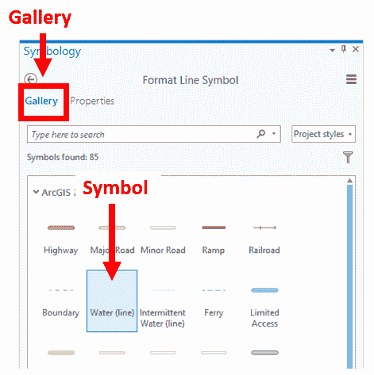

符号面板中的“图库”选项卡

1.  右键点击 NWS_Local_Storm_Reports 并选择属性。

1.  在左侧窗格中点击“常规”选项，并将图层重命名为“GEMA 的本地风暴报告”。

1.  点击“元数据”并查看其中的信息。

1.  审查与图层相关的其他属性。然后点击“确定”以关闭属性窗口。

1.  在内容面板中，展开 GEMA 的本地风暴报告图层。然后展开 NWS Local Storm Reports Past 24 Hrs 组，以便您可以看到相关的符号。

正如你现在所看到的，这个图层的符号是作为服务的一部分预先配置的。你也应该注意到，属性列表比河流和溪流图层可用的列表要短得多。这是因为 GEMA 图层的本地风暴报告引用的是一个 ArcGIS 地图服务，这是一种栅格服务。作为用户，你有限的能力来更改或调整 ArcGIS 地图服务的显示设置。

当你将数据发布到网络上时，无论是通过 ArcGIS Online、ArcGIS Server 还是 ArcGIS Enterprise，你必须选择你将发布的服务类型。你可以发布的基本网络服务类型包括地图、要素、地理编码、地理数据库、几何、地理处理、图像和网络分析服务。每种服务都有自己的独特功能。有关所有这些不同服务类型的更多信息，请访问[`doc.arcgis.com/en/arcgis-online/reference/arcgis-server-services.htm`](https://doc.arcgis.com/en/arcgis-online/reference/arcgis-server-services.htm)。

1.  随意检查你添加到地图上的其他图层。完成后，保存你的项目。

1.  关闭 ArcGIS Pro。

# 在 ArcGIS Pro 中访问简单的 demographic 数据

ArcGIS Pro 和 ArcGIS Online 之间另一个有用的集成是能够访问一些简单的通过 Esri 的 GeoEnrichment 服务发布的 demographic 数据。这些数据可以通过地图标签上的信息图表工具访问。

此工具将数据以一系列图表、表格和报告的形式呈现。它可以帮助你回答你在工作区域中的一些问题，例如：

+   平均收入水平是多少？

+   总人口是多少？

+   人口多样性如何？

+   该地区的年龄人口分布是怎样的？

可用信息的数量、详细程度和比例将取决于你在世界上的工作地点。Esri 维护了一个庞大的 demographic 数据集，然而它并不总是 100%完整。要了解特定区域或地区可用的数据，请访问[`doc.arcgis.com/EN/ESRI-DEMOGRAPHICS/DATA/DATA.HTM`](http://doc.arcgis.com/EN/ESRI-DEMOGRAPHICS/DATA/DATA.HTM)。

使用信息图表工具确实会消耗积分。因此，每次你在使用信息图表工具时点击地图或场景，你都会消耗积分的一部分。每次使用的成本非常小。每 1000 次查看或点击将消耗 10 积分。因此，每次点击只消耗 0.01 积分。然而，在访问基于 ArcGIS Online 的功能时，你应该始终牢记这一点。

在这个菜谱中，你将检查信息图表工具。你将学习如何使用和配置它以获取你需要的信息。

# 准备工作

在开始这个之前，你必须完成本章中的其他菜谱。这将确保你对 ArcGIS Online 及其与 ArcGIS Pro 的关联有一个更坚实的基础理解。你还需要确保在继续之前安装了样本数据。

这个菜谱，就像本章中的其他菜谱一样，将需要你有一个 ArcGIS Online 用户账户。任何用户级别和角色都应该允许你完成这个菜谱。这个菜谱将使用你一些的 ArcGIS Online 积分。在大多数情况下，这个数量应该非常小，不到一个积分。

# 如何操作...

1.  启动 ArcGIS Pro 并打开你在上一个菜谱中使用的`ArcGISOnline`项目。这个项目应该包含在你的最近打开的项目列表中。

1.  关闭你在上一个菜谱中使用的天气响应地图，通过点击视图顶部带有地图名称的标签页中的 X 来关闭。

建议你始终关闭你未使用的任何地图、场景、表格或窗格。这应该会减少 ArcGIS Pro 使用的计算机资源量，从而提高应用程序的性能并减少崩溃的可能性。

1.  在目录窗格中，展开地图文件夹，以便你可以看到其内容。

1.  右键单击人口统计地图并选择打开。现在你的地图视图区域应该显示如图所示的人口统计地图：

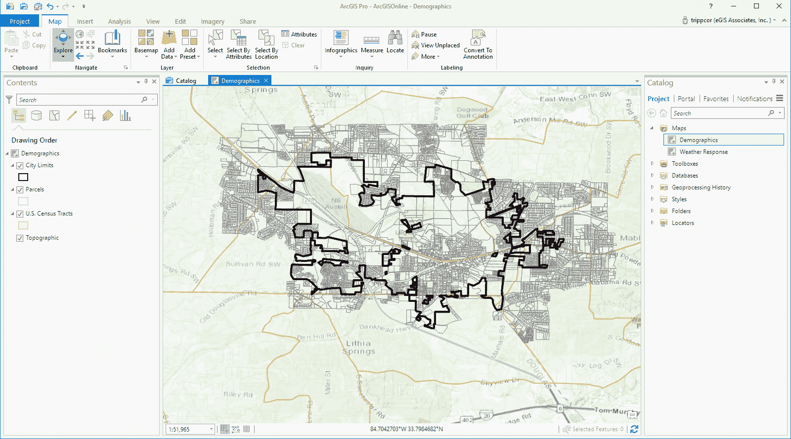

你现在应该已经打开的人口统计地图

1.  审查内容窗格中的图层列表。

如你所见，这张地图只包含四个图层：城市边界、地块、美国人口普查区和底图。如果你已经完成了这本书中的其他菜谱，你应该熟悉城市边界和地块图层。美国人口普查区是一个你尚未使用过的新的图层。你将快速检查其属性，以便熟悉这个新图层。

1.  右键单击美国人口普查区图层，并从出现的菜单中选择属性。

1.  点击图层属性窗口左侧面板中的元数据选项。然后回答以下问题：

**问题**：这些边界适用于哪些年份？

**答案**：

**问题**：最初是谁创建了这些数据？

**答案**：

**问题**：这个图层代表什么？

**答案**：

通过查看元数据和回答前面的问题，你应该对这个图层有了更好的理解。你现在知道这个图层代表的是 2010 年至 2015 年美国 50 个州以及华盛顿特区和波多黎各的美国人口普查区边界。你还知道它最初是由美国人口普查局创建的。了解这一点可以帮助你更好地确定如何使用这些信息。

1.  回答完问题后，关闭图层属性窗口。

1.  右键单击美国人口普查区图层，并选择属性表。

1.  审查属性表以查看它包含的信息。这为你提供了对这个新图层更多的洞察。

1.  审查完毕后，关闭属性表。

美国信息图表工具检索的大部分数据始于美国人口普查局。Esri 随后将此信息与其他来源一起外推，以开发出更深入的数据层次，这些数据有助于预测增长、新设施的位置等。大多数国家都有类似的机构，负责监测人口和其他人口构成。

1.  在内容窗格中右键点击城市边界层。从出现的菜单中选择缩放到图层。您的地图应该缩放到显示城市边界层的完整范围，如图所示：

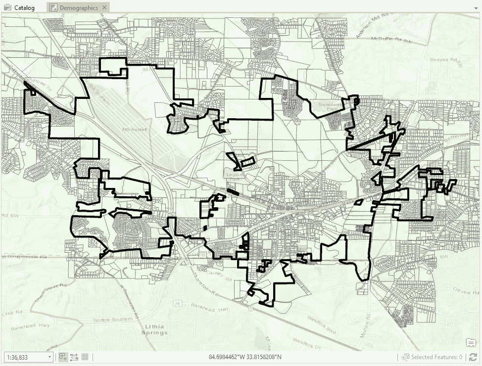

地图缩放到城市边界层

1.  如果需要，激活功能区中的地图标签页。

首先，让我们学习如何配置信息图表工具的设置。这将有助于确保显示您需要查看的数据。

1.  点击信息图表按钮下方位于的下拉箭头，并选择配置信息图表。这将打开配置信息图表窗口，如图所示：

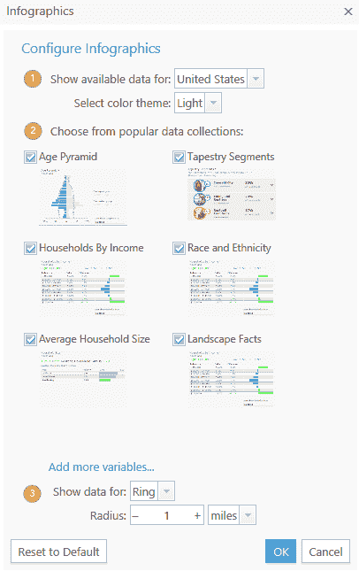

1.  抽空注意一下您可以配置的基本选项。首先，选择您想要探索的国家。对于这个食谱，如果需要，使用下拉箭头将其设置为显示可用数据：美国。

1.  如果需要，您可以更改颜色主题。默认为浅色。

1.  注意默认可用的数据集合，并回答以下问题：

**问题**：工具有哪些六个默认数据集合可供使用？

**答案**：

信息图表工具默认提供六个不同的数据集合供您访问。您可以通过点击复选框来控制您能看到哪些集合，启用或禁用这些集合。您还可以通过点击添加更多变量来访问设置和数据。这允许您进一步细化在信息图表工具中显示的数据。

1.  您可以控制工具分析的区域。注意，默认情况下，它基于环形距离开始。点击显示数据为：的下拉菜单，查看其他可用的选项。将其设置为环形。

1.  点击确定以关闭配置信息图表窗口。

现在，您将使用此工具。

1.  点击位于查询组中的地图标签页上的信息图表工具。

1.  在 Trippville 的城市边界内任意点击一点。随后，信息图表窗口应该会出现，如图所示。您的窗口可能因工具的配置方式以及您是否以前使用过它而有所不同。

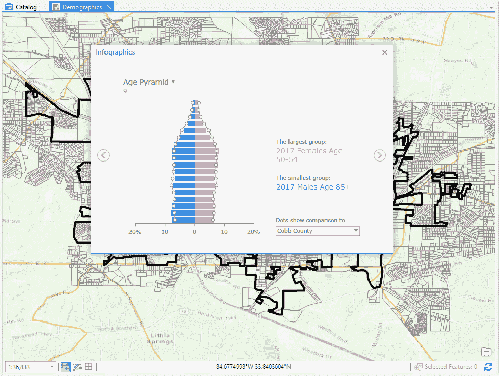

1.  在窗口的左上角，您应该看到一个带有下拉箭头的值。这控制着窗口中显示的内容。如果需要，点击下拉箭头，如图所示，并选择年龄金字塔：

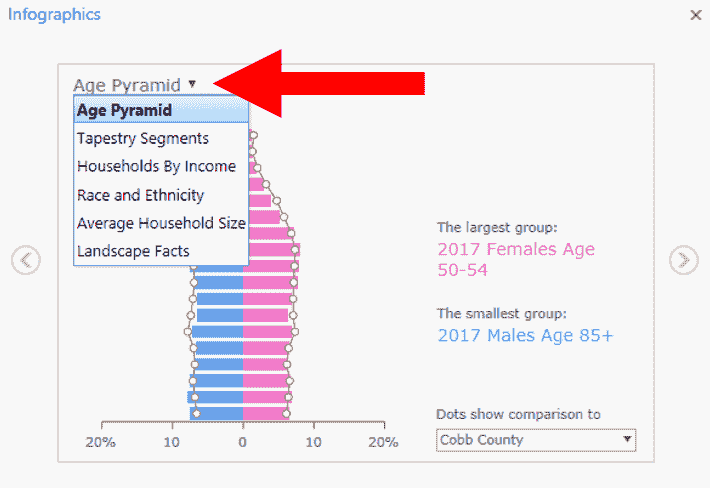

1.  确保将“点显示比较”选项设置为科布县，使用下拉箭头。它位于信息图表窗口的右下角。

现在，您的信息图表窗口应该看起来与您迄今为止看到的所有图形非常相似。信息图表工具可以配置为显示不同的信息。我们稍后会探讨这一点。现在，让我们继续检查默认配置中可用的信息。

1.  将“点显示比较”从科布县更改为乔治亚州。注意图表是如何变化的。

1.  现在将其更改为美国，并观察图表的变化。

每次您调整工具比较的级别时，图表都会变化。彩色条代表您点击区域的数据。带有圆圈的线代表比较的值（即科布县、乔治亚州或美国）。现在让我们看看一些其他选项。

1.  在您点击下拉箭头将窗口更改为年龄金字塔的地方，再次点击并选择按收入划分的家庭。这将显示一个不同的图表，显示不同收入阶层的家庭百分比以及您点击的区域与由“条显示偏差从”选项在右下角定义的较大区域相比的情况。

您还可以使用信息图表窗口左右两侧的小箭头更改显示的数据。这与左上角的下拉菜单做的是同样的事情。

1.  尝试一些其他的数据和比较选项。

1.  在探索完可以显示的数据选项后，关闭信息图表窗口。

1.  保存您的项目。

1.  如果您正在继续下一个菜谱，您可以保持 ArcGIS Pro 打开。如果您不继续，您可以关闭它。

您现在已经看到了如何使用信息图表工具访问非常简单但信息丰富的人口统计数据。ArcGIS Pro 允许您通过信息图表配置窗口自定义此工具，以便显示您需要的信息，以获取您正在寻找的答案。这仅仅是 Esri 在其库中拥有的数据的一个小子集。如果您想访问更详细和精细的人口统计数据，您可能需要调查 ArcGIS 商业分析师 ([`www.esri.com/software/businessanalyst`](http://www.esri.com/software/businessanalyst)) 和社区分析师 ([`www.esri.com/software/arcgis/community-analyst`](http://www.esri.com/software/arcgis/community-analyst))。

# 使用 ArcGIS Online 地理处理服务

ArcGIS Online 不仅仅是数据和地图。它还包含强大的分析或地理处理工具。这些工具可以允许您执行通常需要扩展才能执行的分析，例如计算服务区域、确定流域和创建高程剖面。

正如提到的，这类分析通常需要一个扩展。例如，要计算服务区域，你需要网络分析师扩展。然而，在 ArcGIS Pro 中，你可以无需扩展即可访问此功能作为现成的工具。这些现成的工具确实使用积分，并且通常比信息图工具使用更多的积分。每个工具使用的积分量由工具的基本水平加上你选择的增加分析复杂性的附加选项决定。例如，如果你需要根据简单的驾驶距离来计算服务区域，这将使用比基于驾驶时间、在指定时间段内考虑单向街道和重量限制并避开收费道路的服务区域使用更少的积分。

虽然这些工具确实使用积分，但它们可能仍然比购买 Esri ArcGIS 扩展更便宜。ArcGIS 扩展的单个许可证标价为 2,500.00 美元。而每个分析所需的积分只是这个数字的一小部分。所以，除非你还需要创建用于分析的数据并维护它，否则 ArcGIS Online 工具可能是你考虑的更具可持续性的财务选择。

在这个菜谱中，你为一家 GIS 咨询公司工作。你被分配了一个新的客户，该客户是一家混凝土供应商。他们在佐治亚州有几个工厂。他们需要你根据估计的一小时驾驶时间计算每个工厂的服务区域。这是在送货卡车中的混凝土开始变得不可使用之前的时间上限。

# 准备工作

建议你完成本章中的其他菜谱，以及第一章中提到的*ArcGIS Pro 功能和术语*，以确保你对这些主题和在此菜谱中使用的基本工作流程有必要的理解。你还需要确保在继续之前安装了样本数据，并且你有权限使用积分的 ArcGIS Online 用户账户。你还需要互联网访问才能完成此菜谱。

这个菜谱将需要你使用一些你的 ArcGIS 在线积分。预计这个菜谱应该需要大约两个积分或更少来完成。

# 如何做到这一点...

1.  如果你完成了上一个菜谱后关闭了 ArcGIS Pro，请启动 ArcGIS Pro 并打开本章中之前菜谱中使用的`ArcGISOnline`项目。该项目应包含在你的最近打开的项目列表中。

1.  关闭你在上一个菜谱中使用的 Demographics 地图，并从目录窗格中打开 Corbin Concrete 地图。新地图应该以显示 Corbin Concrete 所属的七个混凝土工厂的位置图层打开，如下面的截图所示：

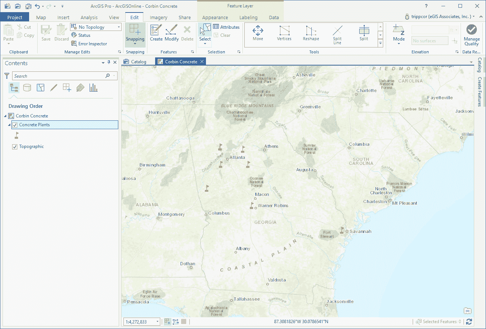

显示 Corbin 混凝土工厂位置的地图

现在您可以看到混凝土工厂的位置，您需要根据一小时的车程时间计算每个工厂的服务区域。传统上，为此您需要网络分析师扩展和道路网络数据集。由于这是一个从未使用过或拥有 GIS 的新客户，您没有为他们专门收集这些数据。幸运的是，使用 ArcGIS Online 的现成工具，您不需要这些。您需要的只是访问 ArcGIS Online 和少量信用额度来运行分析。

1.  点击工具栏中的分析选项卡。

1.  在地理处理组中点击“现成工具”，并选择“生成服务区域”，如图所示。此工具正在访问来自 ArcGIS Online 的地理处理服务：

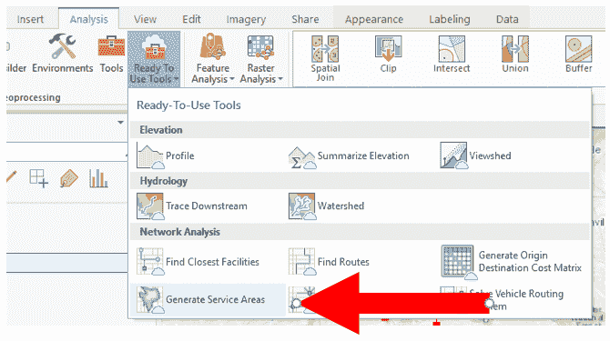

访问现成的生成服务区域工具

1.  使用下拉箭头将设施设置为混凝土工厂。

1.  将断点值设置为`1`，通过输入数字来替换默认值。

1.  使用下拉箭头将断点单位设置为小时。

1.  接受默认的旅行模式`Custom`。默认情况下，此模式假定您是乘坐车辆出行，并将自动避开私人道路、未铺路的道路以及其他几种交通项目。稍后，您将调查这些设置并进行调整。

1.  确认您的 GenerateServiceAreas 工具看起来如下，然后点击运行：

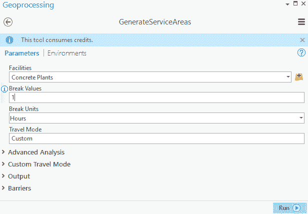

根据您的互联网连接速度和计算机配置，此工具可能需要几分钟才能完成。

当 GenerateServiceAreas 工具完成后，您的地图中会出现一个新的图层。这个新区域显示了基于估计的一小时车程时间的每个工厂的服务区域，应该看起来像以下截图：

客户赞赏您的努力，并认为这是有用的信息。然而，他们现在希望对您的分析进行一些调整。鉴于混凝土在开始变得不可使用之前的时间最长为一个小时，他们希望在分析中内置一个 15 分钟的缓冲时间。因此，新的时间将是 45 分钟而不是一个小时。他们还希望确保计算避开收费道路和限制道路，以及有高度限制和重量限制的道路。您需要使用新参数重新运行分析。

1.  右键单击刚刚添加到您地图中的服务区域图层，并从出现的菜单中选择“删除”。

1.  在 GenerateServiceAreas 工具中设置以下参数：

    +   设施：混凝土工厂

    +   断点值：`45`

    +   断点单位：分钟

    +   旅行模式：`Custom`

1.  展开自定义旅行模式选项，并启用以下限制：

    +   避免拼车道路

    +   避免快速车道

    +   避免渡轮

    +   避免大门

    +   避免私人道路

    +   避免卡车收费道路

    +   驾驶卡车

    +   高度限制

    +   禁止施工道路

    +   禁止交通

    +   重量限制

1.  接受所有其他参数的默认值。

1.  一旦您已配置所有限制条件，请点击运行。再次提醒，由于您要求它执行的分析复杂，该工具可能需要几分钟才能运行。

再次，您的地图中会出现一个新的图层。这代表您刚刚使用较短驾驶时间和额外限制条件创建的新服务区域。为了使地图和数据更容易理解，您现在将对图层及其符号系统做一些调整。

1.  关闭地理处理面板。

1.  右键点击服务区域图层并选择“属性”。

1.  在窗口的左侧面板中点击“常规”选项。然后重命名图层 `Plant Services Areas Based on 45 Minute Drive`。

1.  在功能区点击“外观”选项卡。

1.  在符号按钮下方点击下拉箭头，并从出现的选项中选择“唯一值”。这将打开符号系统面板。

1.  使用下拉箭头将字段 1 设置为“Facility: Name”。

1.  使用下拉箭头将颜色方案设置为基本随机颜色渐变。

当您点击下拉箭头查看可用颜色渐变的列表时，如果您查看列表底部，您将看到一些选项。其中之一将显示每个颜色渐变的名字。您可能需要启用该选项以确保您选择正确的渐变。

1.  在您选择颜色渐变的下方网格中，将 `Facility: Name` 更改为 `Plant ID`，如图所示：

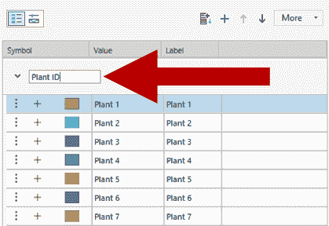

1.  关闭符号系统面板。

1.  在外观选项卡的“效果”组中将图层透明度设置为 40%，如图所示。这将允许您看到服务区域下面的底图。

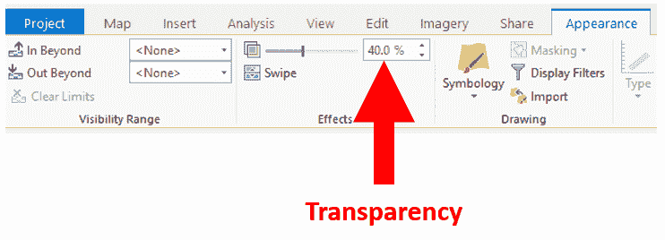

您现在已创建了一张地图，显示了每个混凝土工厂的位置以及该工厂的相关服务区域。现在，Corbin Concrete 的调度员将知道他们可以向哪些地区提供混凝土，以及哪个或哪些工厂将是发送卡车最佳的选择。您将在未来的配方中使用这张地图。

1.  保存您的项目并关闭 ArcGIS Pro。
