# 将您自己的内容发布到 ArcGIS Online

在本章中，我们将介绍以下菜谱：

+   使用您的浏览器发布 shapefile

+   使用 CSV 文件创建图层

+   使用 ArcGIS Pro 发布图层包

+   使用 ArcGIS Pro 发布网络图层

+   发布 2D 地图

+   共享已发布的内容

# 简介

如果您完成了上一章，您会看到 ArcGIS Online 是一个惊人的资源。它提供了访问大量数据和工具的途径，这些工具可以极大地增强您 GIS 的能力。但是，您能否将您自己的数据和地图添加到您的内容中，或者您是否仅限于已有的内容？

ArcGIS Online 允许您发布自己的内容。这可以有多种形式，包括：

+   数据文件：

    +   Shapefile

    +   文本文件（TXT 和 CSV）

    +   电子表格

    +   PDF 文件

    +   地图包

    +   图层包

    +   KML

    +   样式

    +   以及更多……

+   网络地图和要素服务：

    +   直接通过 ArcGIS Online 发布

    +   从您的 ArcGIS Server 或 Portal 连接到网络地图

+   网络应用程序

+   以及更多

要查看您可以添加到您的 ArcGIS Online 内容的所有项目的完整列表，请访问 [`doc.arcgis.com/en/arcgis-online/reference/supported-items.htm`](https://doc.arcgis.com/en/arcgis-online/reference/supported-items.htm)。

根据您试图发布的具体内容，您可以使用不同的方法来发布它。文件可以通过您的网络浏览器直接上传到 ArcGIS Online。地图和场景可以直接从 ArcGIS Pro 发布。最佳方法将取决于内容类型、大小和所需的功能。您拥有的积分数量也会影响方法。

在本章中，您将开始探索您可以将自己的内容发布到 ArcGIS Online 的几种方法。您将上传 shapefile 和 CSV 文件到 ArcGIS Online。然后，您将配置与上传文件相关的 ArcGIS Online 选项。接下来，您将从 ArcGIS Pro 发布图层包到您的 ArcGIS Online 内容。从那里，您将学习如何将整个 2D 地图和 3D 场景发布到 ArcGIS Online。最后，您将探索分享您已发布的一些新内容的一些简单方法。

# 使用您的浏览器发布 shapefile

ArcGIS Online 可以用作 GIS 数据和文件的存储库。将这些文件上传到 ArcGIS Online 允许您在任何有互联网连接的地方访问信息，就像 Google Drive 或 DropBox 一样。它还允许您使用这些数据创建网络地图并与他人共享。通过使数据在您需要时可用，而不是仅在您回到办公室时可用，这可以极大地提高您 GIS 的整体灵活性。

如果您打算上传和发布文件到 ArcGIS Online，其中一些文件在您上传之前可能需要准备或配置。例如，shapefile 必须在您能够将其发布到 ArcGIS Online 之前压缩成一个单独的 ZIP 文件。这是因为每个 shapefile 实际上由多个文件组成。如果您还记得第二章，*创建和存储数据*，一个 shapefile 至少将包含一个 SHP、SHX 和 DBF 文件。PRJ、SBN 和 SBX 等附加文件也可能存在。所有这些文件共同构成了一个 shapefile。因此，为了将其发布到 ArcGIS Online，您首先需要将这些所有文件压缩成一个单独的 ZIP 文件是有意义的。

CSV 或 TXT 文件的格式要求将取决于您在 ArcGIS Online 中打算如何使用它。如果您只想使文件可供下载，则不需要任何格式。然而，如果您想将文件中包含的数据进行制图，则需要特定的格式。您将在下面的步骤中了解这一点。

在此步骤中，您将上传一个 shapefile 和 CSV 文件到您的 ArcGIS Online 内容。您将首先将代表 Trippville 城市边界的 shapefile 进行压缩。您将使用这些数据作为您将创建的新网络地图中的一个图层。然后，您将上传一个包含您朋友发送给您自然野生动物观赏地点的 CSV 文件。

# 准备工作

此步骤将要求您拥有 ArcGIS Online 账户并能够访问互联网。您需要是 2 级用户。如果您没有 ArcGIS Online 用户登录，或者不想使用您组织的账户来完成本章中的步骤，您可以从 Esri 请求试用许可证，网址为[`www.esri.com/arcgis/trial`](http://www.esri.com/arcgis/trial)。

您还需要一个支持 HTML 5 和 JavaScript 的网页浏览器。这包括 Chrome、Edge、Firefox 和 Safari 的最新版本。11 或更高版本的 Internet Explorer 也受支持。其他浏览器也可能工作，但尚未由 Esri 测试。

建议您在开始此步骤之前完成第十二章，*介绍 ArcGIS Online*中的所有步骤。这将确保您对 ArcGIS Online 是什么以及它与 ArcGIS Pro 如何集成有一个坚实的基础理解。

您还需要确保在开始此练习之前已安装示例数据。此步骤还将使用积分。估计它将使用不到 1 积分。

# 如何操作...

1.  要开始，您首先需要创建一个 ZIP 文件，该文件包含构成城市边界 shapefile 所需的所有文件。打开`文件资源管理器`，或`Windows 资源管理器`，具体取决于您使用的 Microsoft Windows 版本。您的任务栏上应该有一个类似于立式文件柜的快速启动图标，如图下所示：

1.  在文件资源管理器窗口的左侧面板中，展开`This PC`或`My Desktop`，具体取决于你的 Windows 版本。从现在开始，我们将假设你正在运行 Windows 10。

1.  定位并选择`C:`驱动器，它通常被标记为操作系统或本地驱动器。

1.  在右侧面板中，向下滚动并双击`Student`文件夹。

1.  然后，双击`ArcGISProCookbook`文件夹。

1.  再次双击`Chapter13`文件夹，然后是`Files`文件夹。

1.  你现在应该会看到这个文件夹内的一系列文件。你现在将选择构成 Trippville 城市边界 shapefile 的所有这些文件。在右侧面板的顶部，点击名称以确保你按名称排序文件。

1.  选择`Trippville_City_Limits.cpg`文件。然后，按住你的*Shift*键并选择`Trippville_City_Limits.shx`文件。这应该会选中构成单个 Trippville 城市边界 shapefile 的所有文件。

为了使 shapefile 能够上传并在 ArcGIS Online 中工作，它必须包含 SHP、DBF、SHX 和 PRJ 文件。其他文件也有帮助，但不是必需的。

1.  一旦你选择了文件，右键单击所选文件中的任何一个。然后，在出现的菜单中转到发送到并压缩（zipped）文件夹，如图所示：

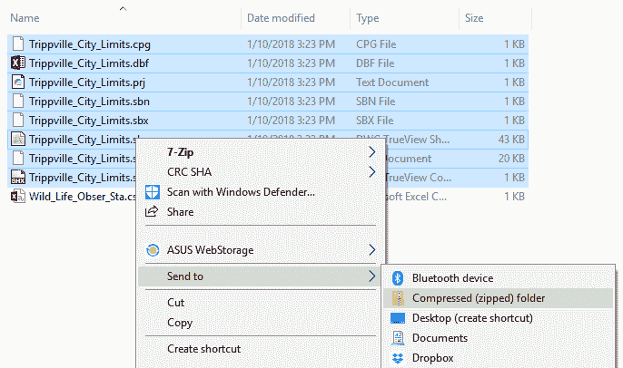

如果你更喜欢使用 WinZip 或 7-Zip 等 ZIP 实用程序，你也可以使用它。上面演示的方法对每个人来说都适用，无需任何额外的软件。

1.  将新的 ZIP 文件命名为`Trippville_City_Limits.zip`：

你刚刚完成了上传 shapefile 到 ArcGIS Online 所需的第一道工序。现在，是时候通过上传文件到你的内容来完成它。

1.  打开你的网络浏览器，并使用你在上一章中学到的技能登录 ArcGIS Online。

1.  点击“我的内容”标签页。

1.  点击位于“我的内容”标签页下方左上角的“添加项目”，并选择如图所示的“从我的电脑”：

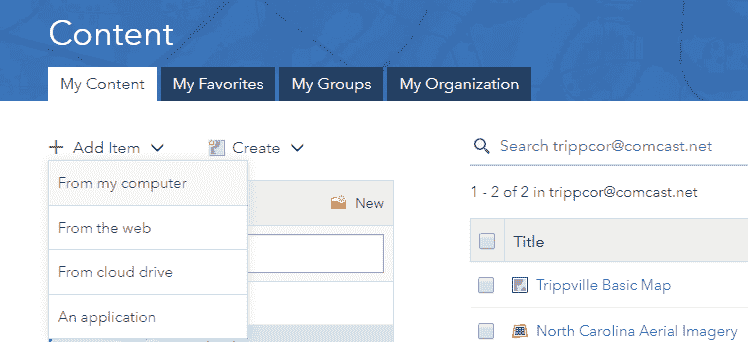

1.  在文件下的添加项目到我的电脑窗口中，点击如图所示的“选择文件”按钮：

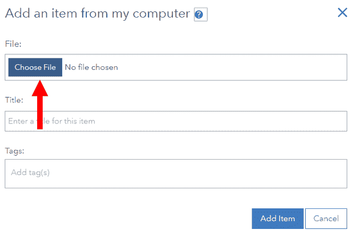

1.  使用你在前面的菜谱中学到的技能，导航到`C:\Student\ArcGISProCookbook\Chapter13\Files`。然后，选择你刚刚创建的`Trippville_City_Limits.zip`文件，并点击打开。

添加项目到我的电脑窗口应更改以指示你选择的文件内容是一个 shapefile。

1.  确保启用“发布此文件为托管层”（添加与同一名称的托管层项目）。

此选项不仅将 ZIP 文件添加到你的内容中，还会创建一个托管网络层。然后，你可以使用 ArcGIS Online 创建的 Web 地图以及使用 ArcGIS Pro 创建的本地地图中的网络层。这会略微增加使用的信用额度，但只是微不足道。

1.  将新项目命名为“Trippville 城市边界”。如果你的组织中有多个人也在通过这个食谱，或者过去曾经这样做过，请将你的名字添加到标题的末尾。

1.  为新项目添加以下标签：`Trippville`、“城市边界”、“边界”、“多边形”和“培训”。记得为每个标签按*Enter*键。

1.  确认你的“从我的电脑添加项目”窗口看起来如下，然后点击“添加项目”。

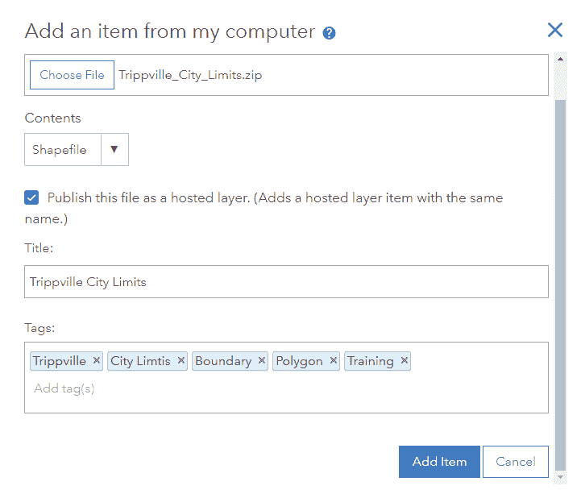

文件成功上传后，你将被带到属性页面。在这里，你可以看到与你刚刚上传到内容的 ArcGIS Online 属性相关联的信息和设置。确保你的内容和设置信息正确且最新非常重要。这构成了元数据，用户将看到这些元数据以确定这些数据是否是他们需要的。它还决定了用户使用这些数据时将拥有的功能。

现在，你将更新与刚刚上传的新文件相关的一些属性。你将从概览开始，然后通过其他级别，包括数据、可视化、使用和设置。

1.  在缩略图旁边，点击“添加关于此项目的简要总结”。这将允许你提供关于这些数据的非常简短描述。

1.  输入以下摘要：“这代表 Trippville 城市的城市边界”。然后点击“保存”。

1.  在缩略图和“描述”一词下方，点击“添加关于此项目的详细描述”。

1.  将打开一个强大的文本编辑窗口，允许你创建关于这些数据的详细描述。它可以包括图片、链接到其他网站等。你可以提供多少细节取决于你。我们将为这个新图层保持简单。输入以下描述：“这些数据代表虚构的 Trippville 城市的城市边界”。它使用各种信息来源创建，并调整以适应现有的地块数据。这些数据仅用于培训。在输入描述完成后，点击“保存”。

1.  滚动到“使用条款”。这是你可以识别使用限制、免责声明或其他你或你的组织认为必要的法律信息的地方。点击“添加任何特殊限制”。这将打开另一个文本编辑窗口。输入以下内容：“仅限培训使用”，然后点击“保存”。

Trippville 城市边界属性的概览标签现在应该看起来像以下截图：

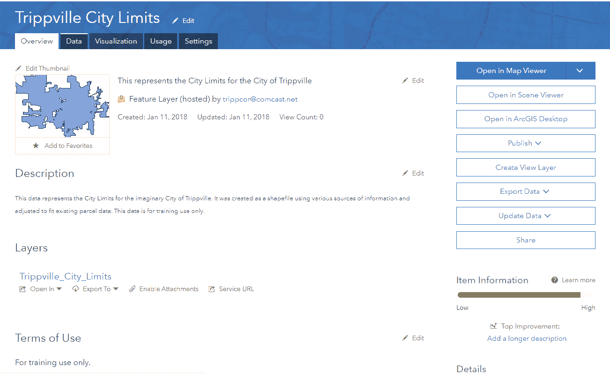

ArcGIS Online 中 Trippville 城市边界数据的属性

1.  现在，点击页面顶部附近的位置的“数据”标签。

1.  在这里，你可以审查并修改城市边界形状文件的属性表。你现在不会做出任何更改；只需快速浏览一下。

1.  点击位于您刚刚点击的数据标签旁边的可视化标签。这将允许您在地图中查看数据。从这里，您可以设置默认符号，当此数据添加到地图或场景时使用。您现在将对默认符号进行一些更改。

1.  在左侧面板中，点击“更改样式”按钮。

如果您不记得哪个是“更改样式”按钮，请参考前一章中“在 ArcGIS Online 中创建简单 Web 地图”菜谱的第 14 步。

1.  点击位于第 2 项下方的“选项”按钮，选择以下截图所示的绘图样式：

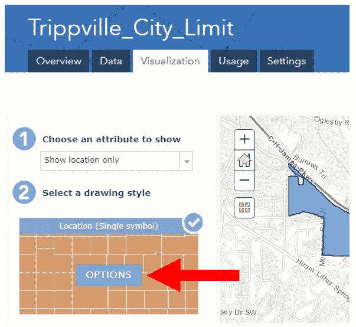

1.  点击“符号”一词以打开符号设置窗口。

1.  使用您在前一章中学到的技能，将填充设置为无颜色，轮廓设置为黑色，线宽设置为 6 px。然后，点击“确定”。

1.  确认您的可视化标签现在看起来如下，然后点击“确定”。

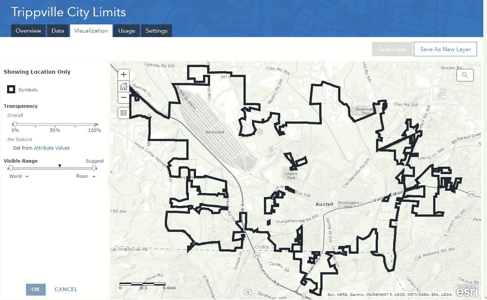

使用在 Web 地图中显示的 ArcGIS Online 中存储的城市边界数据

1.  点击“确定”后，点击“完成”以完成符号更改。然后点击“保存图层”以保存更改。

1.  点击位于您刚刚点击的数据标签旁边的可视化标签。使用标签允许您监控此特定项的使用频率和程度。

1.  现在，点击位于使用标签旁边的设置标签。

1.  设置标签允许您配置与您刚刚上传的数据相关的各种设置。花点时间浏览所有可用的选项。

1.  随意进行任何您希望进行的调整。完成后，点击位于 ArcGIS Online 页面顶部的“内容”标签。

假设您在开始本书之前没有创建过 ArcGIS Online 内容，您的内容现在应包含四个项，如下面的截图所示：

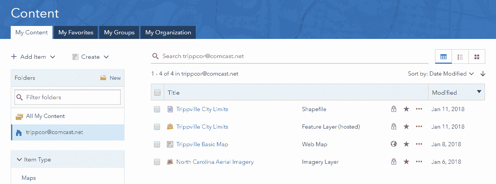

您已发布到 ArcGIS Online 的项的内容

注意有两个 Trippville City Limits 项。一个是要素层。要素层是可以作为图层添加到地图或场景中的项。它是从您上传的 shapefile 创建的。shapefile 是您实际上传的 ZIP 文件。该文件可以从 ArcGIS Online 下载用于本地使用，类似于您可以从 Google Drive 或 Dropbox 下载文件的方式。

1.  如果您正在继续下一个菜谱，请保持浏览器打开。否则，您可以关闭它。

# 使用 CSV 文件创建图层

现在您已上传了一个 shapefile 并基于该 shapefile 创建了一个要素层，让我们看看 CSV 文件。您可以像上传 shapefile 一样上传 CSV 或 TXT 文件到您的内容。因为它是一个单个文件，所以在上传到您的 ArcGIS Online 内容之前不需要将其 ZIP 压缩。

当您将 CSV 文件添加到内容中时，它通常以两种方式之一使用。第一种是仅允许其他人下载文件或将其用作独立表。文件不用于在地图或场景中创建图层。在这种情况下，您不需要担心格式。

然而，如果您想从 CSV 文件中的数据创建地图或场景中的图层，则需要将其格式化为支持该操作。如果您想使用 CSV 文件创建图层，以下是其格式要求。这也适用于 TXT 文件：

+   第一行必须包含列标题，而不是特征值

+   第一行必须包含两个列的标识符，用于确定特征的位置

+   位置列标识符必须命名为：

    +   `Lat` 和 `Long`

    +   `Latitude` 和 `Longitude`

    +   `Longitude83`, `Latitude83`

    +   `Longdecdeg`, `Latdecdeg`

    +   `Long_dd`, `Latdd`

    +   `Y`, `X`

    +   `Ycenter`, `Xcenter`

    +   `Xcenter`, `Ycenter`

    +   `Point-y`, `Point-x`

    +   `Point-x`, `Point-y`

    +   `MGRS`

    +   `USNG`

    +   `Address`

    +   `City`

    +   `State`

    +   `ZIP`

在此配方中，您将上传一个包含您从朋友那里获得的野生动物观察点信息的 CSV 文件。他想让您创建一个显示这些位置的地图。与您之前使用 shapefile 上传的方法不同，您将拖放它到网络地图中。但在您这样做之前，您将检查 CSV 文件以确保其格式正确。

# 准备工作

此配方将要求您拥有 ArcGIS Online 账户并能够访问互联网。您需要是 2 级用户。如果您没有 ArcGIS Online 用户登录，或者不想使用您组织的账户来完成本章中的配方，您可以从 Esri 请求试用许可证，请访问 [`www.esri.com/arcgis/trial`](http://www.esri.com/arcgis/trial)。

您还需要一个支持 HTML 5 和 JavaScript 的网页浏览器。这包括 Chrome、Edge、Firefox 和 Safari 的最新版本。11 或更高版本的 Internet Explorer 也受支持。其他浏览器也可能工作，但尚未由 Esri 测试。

在开始此配方之前，您需要完成先前的配方。还建议您在开始此配方之前完成第十二章中的所有配方，*介绍 ArcGIS Online*。这将确保您对 ArcGIS Online 是什么以及它与 ArcGIS Pro 如何集成有一个坚实的基础理解。

在开始此练习之前，您还需要确保已安装样本数据。此配方还将使用积分。预计将使用不到 1 积分。

# 如何操作...

1.  首先，您将检查您朋友提供的 CSV 文件。使用您在先前的配方中学到的技能，打开 `文件资源管理器` 并导航到 `C:\Student\ArcGISProCookbook\Chapter13\Files`。

1.  右键单击 `Wild_Life_Obser_Sta.csv` 文件，并从出现的菜单中选择编辑。这应该会在记事本中打开文件，如下所示：

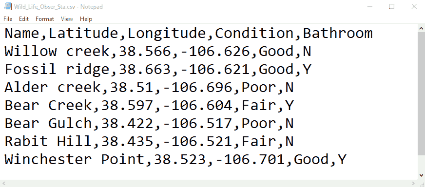

1.  花点时间审阅 CSV 的内容，并将其与菜谱开头列出的要求进行比较。然后，回答以下问题。

**问题**：第一行包含列名吗？

**答案**：

**问题**：如果是这样，列名是什么？

**答案**：

**问题**：它是否包含带有所需列名的位置信息？

**答案**：

审阅完文件中的信息后，您将看到第一行确实包含列名，这些列名将被 ArcGIS Online 解释为字段名。它还包括每个要素的位置坐标，以及这些位置值所需字段名。因此，此文件格式正确。您可以使用它来在地图或场景中创建图层。

1.  审阅完信息后，关闭记事本。如果要求，不要保存或编辑此文件中的任何更改。保持“文件资源管理器”打开。

1.  如果您在完成最后一个菜谱后关闭了浏览器，请重新打开它并登录到您的 ArcGIS Online 账户。

1.  在 ArcGIS Online 页面的顶部点击“地图”标签。

1.  现在，将“文件资源管理器”和 ArcGIS Online 放置在您的屏幕上，使它们并排，如下面的截图所示：

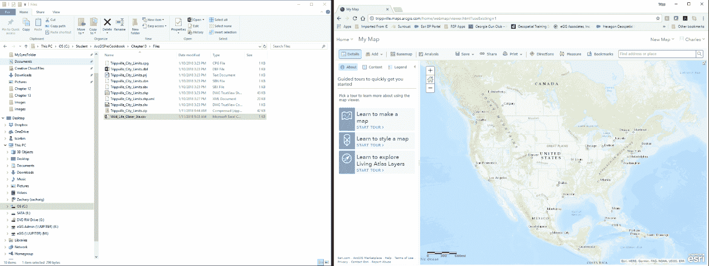

文件资源管理器和 ArcGIS Online 并排显示

1.  在“文件资源管理器”中选择`Wild_Life_Obser_Sta.csv`文件。然后，将其拖放到地图中的 ArcGIS Online。如果您成功完成此操作，地图上应会出现表示野生动物观察站位置的点。

1.  您可以选择为新创建的图层配置符号。在这种情况下，您将仅接受 ArcGIS Online 确定的默认设置。因此，点击“完成”按钮。

1.  您现在需要保存地图。点击“保存”按钮，然后从出现的列表中选择“另存为”。

1.  将您的地图命名为“野生动物观察站”。如果您的组织中的其他人也在阅读这本书，或者已经阅读过，您可能需要在标题末尾添加您的名字以确保其唯一性。

1.  添加以下标签：`野生动物`、`观察`、`位置`和`培训`。

1.  输入以下摘要：`由我的朋友识别的野生动物观察站的位置`。

1.  确认您的“保存地图”窗口看起来如下，然后点击“保存地图”：

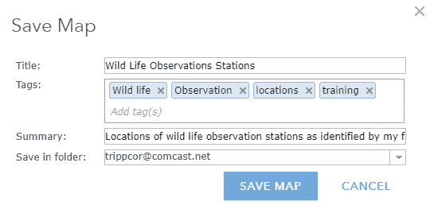

您刚刚创建了一个新的网络地图，其中包含一个由 CSV 文件中的数据构建的图层。此地图应类似于以下图形：

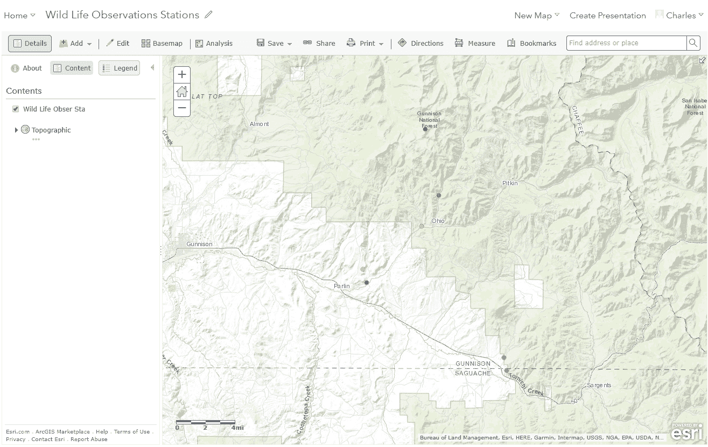

将 CSV 数据添加到网络地图的结果

此完全相同的流程也适用于 TXT 文件。然而，您可能不仅仅创建了一个带有图层的地图。让我们探索您的 ArcGIS Online 内容，看看您是否创建了更多内容。

1.  点击 ArcGIS Online 页面左上角“主页”旁边的下拉箭头。从出现的列表中选择“内容”。

1.  审阅您的内容并回答以下问题。

**问题**：您用于添加 CSV 文件的过程是否在内容中创建了多个项目？

**答案**:

**问题**：此过程创建了哪些项目？

**答案**:

仅通过将拖放过程应用于地图中创建的单个网络地图，与您用于创建多个项目的 shapefile 的过程不同。因为 CSV 文件中的数据是为朋友准备的，并且只会用于单个地图，所以使用拖放方法是有意义的。如果您知道您将在其他地图中再次使用这些数据，那么使用与 shapefile 相同的处理方法将更有意义。

1.  审阅完内容后，关闭浏览器。

# 使用 ArcGIS Pro 发布图层包

您现在已经体验了如何将文件发布到 ArcGIS Online。这包括 GIS 文件，如 shapefile，以及非 GIS 文件，如 CSV 文件。到目前为止，您没有使用 ArcGIS Pro 完成此操作。但是，您可以直接从 ArcGIS Pro 将内容发布到 ArcGIS Online。

ArcGIS Pro 不仅可以使用已发布到 ArcGIS Online 的内容，还可以用于创建内容。类似于您将 shapefile 发布到 ArcGIS Online 的方式，您可以从 ArcGIS Pro 中的地图发布一个图层作为图层包。图层包将包含您在 ArcGIS Pro 中配置的所有图层属性设置，以及数据。图层引用的数据可以存储在各种格式中，包括地理数据库要素类、shapefile、电子表格等。当您需要与不在您的网络中或没有直接访问您 GIS 数据的人共享信息时，这非常有用。

在此配方中，您将从 ArcGIS Pro 发布一个图层包到您的 ArcGIS Online 内容。在这种情况下，Trippville 市聘请了一位规划顾问来审查他们的分区条例和 GIS 数据。顾问无法访问城市的网络，因此您需要使用图层包与他们共享这些数据。顾问确实有一个 ArcGIS Online 账户，这使得与他们共享变得容易。

# 准备工作

与本章中此前的配方一样，您需要完成第十二章，*介绍 ArcGIS Online*，以及本章中所有之前的配方，以确保您具备完成此配方所需的基础知识和技能。您还需要安装 ArcGIS Pro 并分配许可证。任何许可证级别都可以完成此配方。

此配方还要求您拥有至少分配了发布者级别角色的 ArcGIS Online 账户。您还需要互联网访问以及支持 HTML5 和 JavaScript 的网页浏览器。您必须在开始此配方之前安装示例数据。

# 如何做到这一点...

1.  你将首先启动 ArcGIS Pro 并打开`ArcGISOnlineContent`项目。此项目位于`C:\Student\ArcGISProCookbook\Chapter13\ArcGISOnlineContent`文件夹中。当项目打开时，你应该看到分区地图在视图中打开，如以下截图所示。如果没有，请使用你学到的技能从“目录”窗格中打开地图：

现在应显示的 Trippville 分区地图

此地图包含多个图层。你只需要与顾问共享一个图层。因此，你需要创建一个图层包并将其通过单个工具上传到 ArcGIS Online。

1.  在“内容”窗格中选择“分区图层”。

1.  点击工具栏中的“共享”选项卡。

1.  在“共享”选项卡中，点击“包”组中的“图层”按钮。这将打开“作为图层包共享”工具。

1.  在“开始打包”下，确保已启用“上传包到在线账户”。

1.  通过在单元格中输入该值将名称和位置设置为`Trippville_Zoning`。请确保包括下划线；不允许使用空格或其他特殊字符。

1.  接受显示的“摘要”和“标签”值。这些值是从图层元数据中复制的。

1.  确保选项下的任何项目都没有启用。这些选项不适用于此图层中的数据。

1.  在“共享选项”下，确保只选择了“我的内容”。目前，你不会与任何人共享此内容。你将在后面的菜谱中学习如何共享。

1.  确保你的“作为图层包共享”工具配置如以下图形所示。然后，点击“分析”按钮：

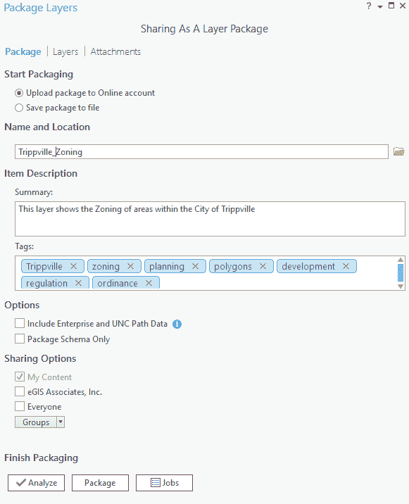

“分析”按钮将检查你的设置和图层，以查找可能阻止图层包成功发布的任何内容。然后，结果将在工具窗口中显示。任何被识别为错误的错误必须在打包图层之前修复。应检查消息，但在打包图层之前不需要采取行动。在这个菜谱中，你不应该得到任何错误或消息。

1.  一旦分析完成且没有错误返回，点击“包”按钮。这将创建图层包并将其上传到你的 ArcGIS Online 内容。

1.  一旦工具成功运行，请关闭它。

你也可以通过在“内容”窗格中的图层上右键单击，然后从出现的菜单中选择“作为图层包共享”来访问此相同工具。

1.  现在，为了验证工具是否已将新的图层包上传到你的 ArcGIS Online 内容，在“目录”窗格中，点击位于“项目”标签旁边的“门户”标签。

1.  确保当前活动资源是“我的内容”。它应该是位于“项目”一词下方第一个按钮，图标类似于一个云朵，前面站着一个单人。

1.  检查你的 ArcGIS Online 内容。你应该看到你在前面的菜谱中创建的内容以及你刚刚创建的新图层文件。

如果您看不到您刚刚创建的 Trippville_Zoning 图层包，您可能需要刷新面板。要刷新面板，请点击右上角的三排堆叠的条形，然后从出现的菜单中选择刷新。在目录面板被选中时，按下 F5 键也会刷新面板。

1.  注意与您的内容关联的不同图标。Esri 使用不同的图标来帮助您快速识别不同类型的内容。

1.  保存您的项目并关闭 ArcGIS Pro。

在本配方中，您学习了如何成功将新的图层包上传到 ArcGIS Pro。图层包包含您在 ArcGIS Pro 中配置的所有图层属性，例如符号、标签、高程、透明度、定义查询等，以及实际数据本身。所有这些都被压缩或打包成一个单一的 LPKX 文件，然后上传到 ArcGIS Online。一旦上传，它就成为您内容的一部分，您可以与他人共享，以便他们可以下载并在自己的地图或场景中使用它。

在处理图层包时，需要记住的一个重要事项是它们是在创建包时的数据副本。如果在此之后对数据进行更改或修改图层属性，则必须更新图层包。此外，如果您在图层包中对数据进行更改，这些更改也不会反映在原始源数据中。

# 使用 ArcGIS Pro 发布网络图层

如果您需要与需要访问整个数据集并对其副本进行工作的人共享数据，则将图层包发布到 ArcGIS Online 非常有用。这允许他们运行不同的场景、执行不同的分析以及更改数据，而不会实际影响通过 ArcGIS Online 的数据共享。如果您想将图层发布到 ArcGIS Online，并希望它包含在网络地图中，用户将通过 ArcGIS Online Web Map Viewer 或其他自定义网络或移动应用程序访问它，那么图层包就无法实现这一点。您需要的是网络图层。

网络图层允许您发布单个图层，以便将其添加到网络地图中。您可以使用与第十二章中相同的过程添加图层，即 *介绍 ArcGIS Online* 和 *在 ArcGIS Online 中创建简单的网络地图* 的配方。一旦添加到网络地图中，您就可以使用 *Web Map Viewer* 应用程序来可视化它，甚至可以将其集成到您自己的自定义网络或移动应用程序中。

您可以从 ArcGIS Pro 创建七种不同的网络图层。这些包括：要素、瓦片、矢量瓦片、地图图像、影像、场景和高程。要素、瓦片、矢量瓦片、地图图像和影像图层是从 2D 数据创建的。场景和高程图层是从 3D 数据创建的。要了解更多关于这些不同类型的网络图层的信息，请访问[`pro.arcgis.com/en/pro-app/help/sharing/overview/introduction-to-sharing-web-layers.htm`](http://pro.arcgis.com/en/pro-app/help/sharing/overview/introduction-to-sharing-web-layers.htm)。

在这个菜谱中，您将为 Trippville 市的土地地块创建一个新的网络图层。该市有几个部门正在考虑部署 GIS 网络应用程序。其中大部分都需要包含地块数据，因此创建一个新的网络图层是有意义的。对于这个菜谱，我们将保持简单，您将创建它作为一个要素图层。这也使用了最少的信用积分。

# 准备工作

在开始此菜谱之前，您必须完成本章中的其他菜谱以及第十二章中的那些，*介绍 ArcGIS Online*。这将确保您对 ArcGIS Online 及其与 ArcGIS Pro 的关联有一个坚实的基础理解。您还需要在继续之前确保已安装示例数据。

这个菜谱，就像本章中的其他菜谱一样，需要您拥有一个 ArcGIS Online 用户账户。用户级别 2 和发布者角色也是完成此菜谱所必需的。此菜谱将消耗您一些 ArcGIS Online 信用积分。在大多数情况下，这个数量应该非常小，不到 1 个信用积分。

# 如何操作...

1.  您将首先启动 ArcGIS Pro 并打开之前菜谱中使用的`ArcGISOnlineContent`项目。该项目应该包含在您最近打开的项目列表中。

1.  区划图应该仍然处于打开状态。如果它没有打开，请从目录窗格中打开它。

1.  注意这张地图包含了您需要上传到 ArcGIS Online 作为网络图层的地块图层。选择地块图层，然后右键单击它。

1.  从出现的菜单中选择“作为网络图层共享”。此选项将位于菜单的底部附近。

1.  将您要创建的网络图层命名为`Trippville_Parcels`。请记住，不允许使用空格和特殊字符。此外，如果您有其他人正在通过这本书工作，或者过去曾经工作过，您可能需要在网络图层的名称末尾添加您的名字，以确保它是唯一的，并且尚未存在。

1.  确认图层类型设置为要素。这是非常重要的。如果您将其设置为瓦片或矢量瓦片，您将使用大量的 ArcGIS Online 信用积分。

1.  输入以下摘要：`This contains the parcel data for the City of Trippville and surrounding area. It was originally compiled by the county in which Trippville is located.`

1.  输入以下标签：`Trippville`、`parcels`、`polygons`、`property`和`boundary`。

1.  在共享选项下，选择我的内容以及您组织的名称。这将不仅允许您访问这些数据，还可以访问您组织中所有 ArcGIS Online 用户的数据。

1.  确认您的常规信息看起来像下面的图形。然后，点击工具窗口顶部的配置选项卡。

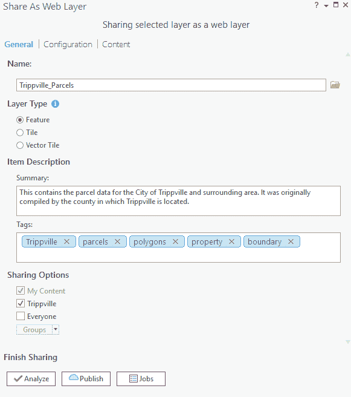

1.  在操作选项下，点击启用同步。这将允许数据在没有数据连接的情况下下载到设备。

1.  点击工具底部的分析按钮。这将警告您在尝试将图层发布到 ArcGIS Online 之前可能存在的问题。

1.  如果没有发现错误，请点击发布。

这可能需要几分钟的时间才能完成，具体取决于您的计算机和互联网速度。如果出现这种情况，请不要担心。

1.  一旦工具成功完成，请关闭它。

1.  现在要验证 Parcels 网络层是否已成功发布到 ArcGIS Online。在目录窗格中，点击门户选项卡。

1.  查看您的内容。现在您的内容列表中应该至少有六个项目，包括您刚刚创建的新要素层。如果没有，请刷新视图。如果新的网络层已成功创建，它应该出现在您的门户中的我的内容下。

1.  注意，Trippville_Parcels 网络层旁边的图标与 Trippville_Zoning 图层包的图标不同。这是因为它们是两种不同类型的数据。

1.  保存您的项目并关闭 ArcGIS Pro。

您刚刚学会了另一种将图层发布到 ArcGIS Online 的方法。这次，您将其作为网络层发布，可以在网络地图中使用，您可以在 ArcGIS 网络地图查看器中查看，或者您创建的自定义网络或移动应用程序中。

# 发布二维地图

现在您知道了如何将图层作为图层文件或网络层发布，您是否可以将整个地图发布到 ArcGIS Online？当然可以。就像图层一样，您可以将地图作为地图包或作为网络地图发布。

将地图作为地图包发布使用的基本程序与发布图层包相同。它将整个地图（包括图层属性和数据）打包成一个单个的 MAPX 文件。然后您可以将其上传到 ArcGIS Online，这样其他人就可以像下载图层包一样下载它。虽然这当然是一个宝贵的工具，但它用途有限。发布网络地图提供了更多的灵活性。

网络地图可以通过多种方式访问和使用。您可以将它添加到 ArcGIS Pro 中的项目，或者将其集成到网络应用程序中，以便通过网络浏览器使用，并成为移动应用程序的一部分。根据您配置的设置，用户可能可以使用这些访问方法中的任何一种或全部来查询、打印、编辑和下载数据。所有这些使网络地图非常灵活。

如果您打算将 ArcGIS Pro 中的地图发布为网络地图，您需要确保它已优化以提供最佳性能。通常，这意味着越简单越好。您希望使用简单的符号；基本的线型、简单的标记符号和通用的多边形填充。为了提高性能，您还可以应用缩放范围，这些范围会在用户放大或缩小地图时自动打开和关闭图层。限制标签的使用；标签会大大降低网络地图的性能，因为它们需要大量的处理来渲染。仅使用您绝对需要的图层数量也有助于提高性能。每张地图都应该有一个特定的目的。确保地图中的每一层都支持这个主要目的。

在此配方中，公用设施主管要求您创建 Trippville 市下水道系统的网络地图。他打算部署一个新的网络和移动应用程序，用于检查和维护该设施。他希望在地图上显示下水道的当前状况，以便在检查管线时，地图将反映检查期间确定的状况。

# 准备工作

在开始此配方之前，请确保您已完成了本章以及第十二章“介绍 ArcGIS Online”中所有之前的配方。这将确保您具备完成此配方所需的基础知识和技能。

要完成此配方，您需要一个具有发布者角色权限的 2 级 ArcGIS Online 用户帐户。您还需要互联网连接、支持 HTML 5 和 JavaScript 的网页浏览器以及 ArcGIS Pro。本书的示例数据也必须安装到您的计算机上。

# 如何操作...

1.  我们将首先启动 ArcGIS Pro 并打开我们在上一个配方中使用的项目`ArcGISOnlineContent`。该项目应包含在您最近打开的项目列表中。

1.  主管需要一张显示下水道管线状况的 Trippville 下水道系统地图。项目已经有一张地图，我们将从这张地图开始。通过在目录窗格中右键单击并选择打开，打开 Trippville 下水道地图。

1.  新地图应在您的视图中打开，包含主管所需的所有图层，如下所示图形所示。如果分区地图仍然打开，您可以将其关闭。

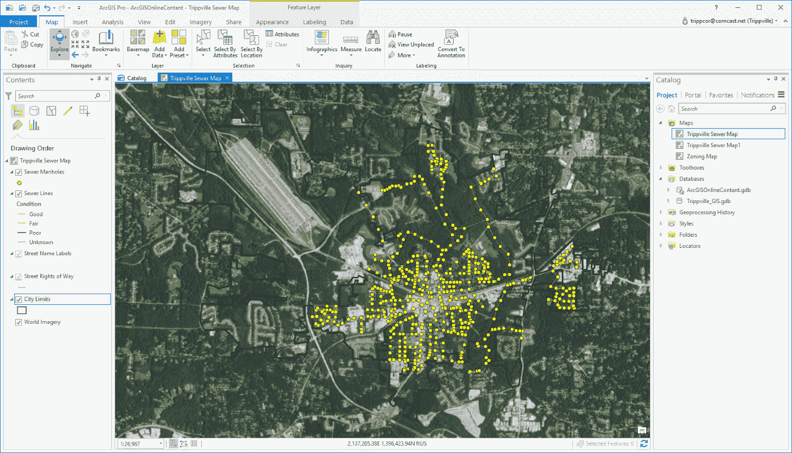

Trippville 下水道地图

这张地图将为你提供一个起点。它已经包含了所需的图层。它们已经用简单的符号表示，以确保通过网络获得更好的性能。Sewer Lines 图层已经根据每条线的条件进行了符号化。因此，基础工作已经完成。如果你想了解如何从头开始创建地图，请查阅第一章，*ArcGIS Pro 功能与术语*。你也可能想通过 Packt Publishing 出版的 Tripp Corbin 的*Learning ArcGIS Pro*进行练习。*Learning ArcGIS Pro*详细介绍了创建地图所需的流程。

现在，你将配置一些图层以提供更好的性能。

1.  你将要做的一件最早的事情是将地图的范围限制在 Trippville 的城市边界内。这将使用户能够点击“缩放范围”按钮并到达城市的边界。在内容面板的顶部右键单击 Trippville Sewer Map。从出现的菜单中选择“属性”。

1.  在地图属性窗口的左侧面板中，选择“范围”。

1.  点击“自定义范围”旁边的单选按钮。这应该会启用“从以下选项计算”选项。

1.  点击“选择计算类型”并从显示的列表中选择“城市边界”。

顶部、底部、左侧和右侧的值应该会改变。这些值定义了用作地图全范围的边界限制。

默认情况下，地图的范围等于地图中最大的图层。这包括底图。因此，如果你使用 Esri 提供的底图，你的地图的全范围等于整个世界。

1.  在左侧面板中点击“元数据”选项。审查这里包含的数据。正如你所见，这些信息已经为你填写好了。如果这是一个全新的地图，在发布地图到 ArcGIS Online 之前，你需要自己填写这些信息。

1.  点击“确定”以关闭地图属性窗口。

1.  现在，你将设置 Sewer Manholes 图层的比例可见性。这将通过仅在放大到特定比例时显示此图层来提高地图的整体性能。你将首先放大到你想使此图层可见的所需比例。在地图视图的左下角，找到地图比例，如图所示：

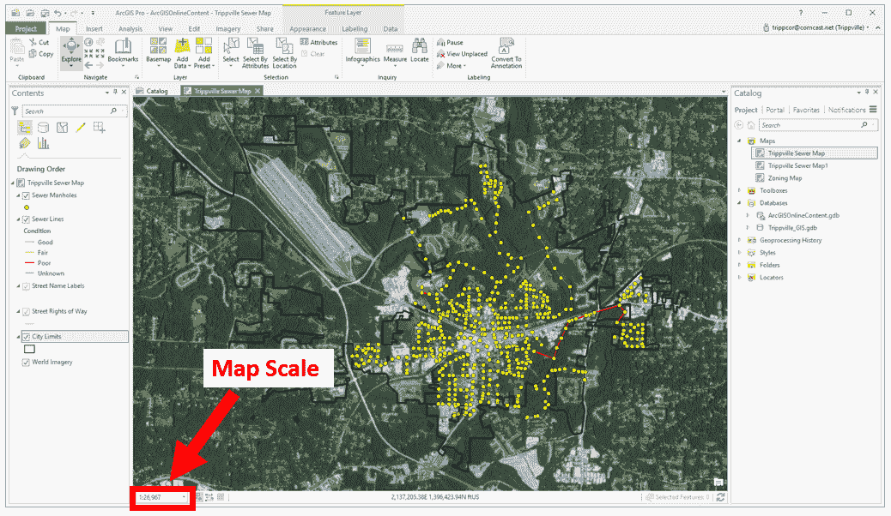

地图比例位于地图视图区域的左下角

1.  在那个单元格中，输入`1:4000`，然后按*Enter*键。你的地图将放大到你刚才输入的比例。区域将基于你的地图视图中心。

您也可以只输入`4000`，ArcGIS Pro 会自动在前面添加`1:`。在未来的情况下，如果您希望地图设置为 1 单位等于许多不同单位的比例，例如 1 英寸等于 100 英尺或 1 厘米等于 5 公里，您也可以直接输入这个单元格。ArcGIS Pro 会自动进行必要的转换。

1.  在内容窗格中，右键单击污水检查井图层，并从出现的菜单中选择“属性”。

1.  在图层属性窗口的左侧面板中，选择“常规”选项。

1.  在窗口右侧，在“超出（最小比例）”下方点击下拉箭头，并从出现的列表中选择《当前》。这应该将值设置为`1:4000`。

1.  点击“确定”。这将设置它，使得检查井图层在您放大到比例`1:4000`之前不可见。这减少了计算机在放大到该比例之外时必须渲染的数据量。这提高了地图的性能。

1.  点击位于地图选项卡上的导航组中的“全范围”按钮。这将使您的地图缩放到您之前设置的地图范围，以匹配城市边界图层。

1.  看一下地图。污水检查井不再可见。这是因为您已经放大到`1:4000`比例之外。

1.  看一下“污水检查井”图层旁边的框。注意它被灰色显示，并且下面有一个小矩形。这表明图层被分配了比例可见范围，并且您没有缩放到使图层可见的比例。现在，回答以下问题。

**问题**：在这个地图中，还有哪些图层似乎被分配了比例可见范围？

**答案**：

如您所见，有几个图层被分配了比例可见范围。这包括街道名称标签和街道通行权。唯一没有分配的是污水管线、城市边界和世界影像。

1.  在内容窗格中选择污水管线图层。

1.  点击功能区中的外观选项卡。

1.  在外观选项卡上的可见性组中，点击“超出”的下拉箭头，并从提供的列表中选择`1:4000`。如果您仍然放大到全范围，污水管线图层应该不再在您的地图中可见。

您已经使用两种不同的方法为地图内的两个图层分配了可见比例。一种是通过图层属性，另一种是使用功能区中的外观选项卡。这两种方法都做同样的事情。将来，您可以使用最适合您的方法。

您几乎准备好将此地图作为网络地图发布。您已验证符号是简单的线条、点和多边形。您通过限制范围和应用比例可见范围提高了地图的性能。下一步是验证所有图层都有元数据，就像您为地图本身所做的那样。虽然这不是必需的，但它是一个推荐的最佳实践。

1.  使用您学到的技能，为每个图层打开属性并验证每个图层的元数据是否已填写。在您能够打开下一个图层的属性之前，您需要关闭属性窗口。至少有一个图层缺少元数据信息。使用其他图层的元数据作为指南，完成缺少元数据的图层或图层的元数据。

1.  保存您的项目。

1.  点击工具栏上的共享选项卡。

1.  在共享选项卡上的“共享为”组中点击 Web Map 按钮。这将打开“共享为网状图”工具。

1.  接受默认名称，默认名称应为 Trippville_Sewer_Map。如果您的组织中的其他人也在通过这本书学习，或者已经学习过，您可能需要在末尾添加您的名字以使名称唯一。记住，不允许使用空格和特殊字符。

1.  查看摘要并回答以下问题。

**问题**：摘要是从哪里来的？

**答案**：

如果您记得审查过 Trippville 排水地图的属性，特别是查看元数据，工具中的摘要应该看起来很熟悉。它来自地图的元数据。对于标签也是如此。

1.  在共享选项下，启用与您的组织共享。这将允许您的组织中的其他人访问您即将创建的网状图。

1.  使用下拉箭头，将“选择配置”选项设置为“复制所有数据：可编辑”。此选项将上传地图中引用的所有数据到 ArcGIS Online，并将其作为要素图层发布，这样数据就可以使用网络或移动应用程序以及 ArcGIS Pro 进行编辑。此选项还使用了最少的积分。

可用的配置选项将取决于地图中引用的数据来源。因为除了底图外，所有图层都引用了文件地理数据库，您将看到三个选项，所有选项都将数据复制到 ArcGIS Online。如果您的地图包含引用网络资源的数据，您将看到不同的选项。要了解更多关于您可能遇到的所有配置选项的信息，请访问 [`pro.arcgis.com/en/pro-app/help/sharing/overview/share-a-web-map.htm/`](http://pro.arcgis.com/en/pro-app/help/sharing/overview/share-a-web-map.htm/)

1.  验证地图选项看起来像以下图形，然后点击工具窗口顶部附近的配置选项卡。

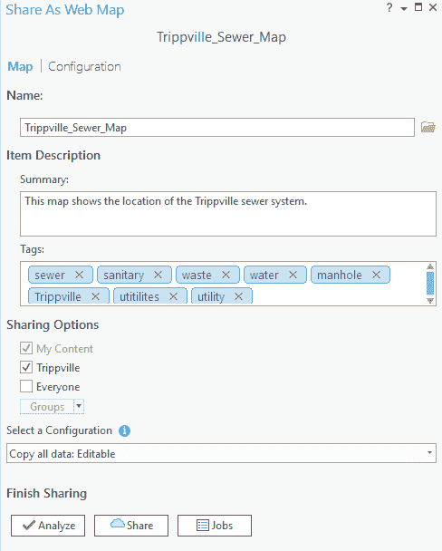

使用“共享为网状图”工具共享 Trippville 排水地图作为网状图

1.  在工具中间的窗口区域，选择 Trippville_Sewer_Map_WFL1 项。

1.  在窗口上方找到 Properties 选项，现在应该可用。点击 Properties。

1.  确保图层类型设置为特征。如果设置为瓦片或矢量瓦片，则在步骤 29 中选择了错误的配置。

1.  在顶部紧邻常规选项卡的位置点击配置选项卡。

1.  现在，分析您的地图以查看是否包含任何会阻止其作为网上地图发布的因素。点击工具底部的“分析”按钮。

当分析完成时，您不应该看到任何错误。当您将网上地图发布到 ArcGIS Online 时，您应该知道这需要您拥有一个底图。如果您使用的是 Esri 底图，那么您的地图必须使用 WGS84 Web Mercator 辅助球体坐标系。

1.  点击工具底部的“分享”按钮，位于“分析”按钮旁边。这将把您的地图发布到 ArcGIS Online。

1.  工具成功后，关闭它。

您已成功将第一个网上地图从 ArcGIS Pro 发布到 ArcGIS Online。如您所见，为了成功发布，您需要考虑许多事项。现在，让我们看看您刚刚使用 ArcGIS Online 网上地图查看器应用程序发布的新的地图。

1.  启动您的网络浏览器，并访问 [www.arcgis.com](http://www.arcgis.com)。

1.  使用您学到的技能，登录到您的 ArcGIS Online 账户。

1.  点击 ArcGIS Online 顶部附近的内容标签，就像您在之前的菜谱中所做的那样。

1.  检查您的内容。假设您在开始这本书之前没有使用过 ArcGIS Online，您现在应该有 11 个内容项。其中三个是在您将 Trippville 排水地图作为网上地图发布时创建的。

1.  在您的文档中点击 Trippville_Sewer_Map 网上地图。这将带您到您发布的网上地图的属性。

1.  现在在地图查看器中查看它。点击页面右侧的“在地图查看器中打开”按钮。您创建的网上地图现在应该在视图中打开，如下面的截图所示：

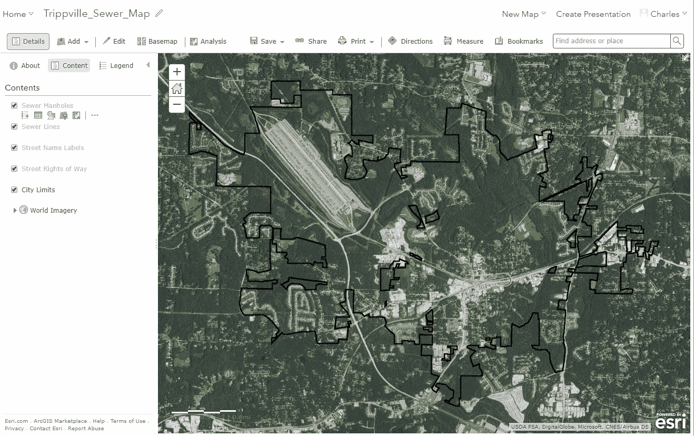

在 ArcGIS Online 中显示的 Trippville 排水地图作为一个网上地图

1.  将鼠标指针放在城市的约中心位置，并使用鼠标滚轮放大，直到您开始看到排水层。

1.  随意浏览您的新地图。完成后，关闭浏览器以退出 ArcGIS Online。

1.  关闭 ArcGIS Pro。

您已成功将网上地图从 ArcGIS Pro 发布到 ArcGIS Online。现在，这个地图可以以许多不同的方式与您组织中的其他人一起使用。用户可以登录到 ArcGIS Online 并在地图查看器中打开它，就像您所做的那样。它还可以集成到自定义网络应用程序中，您将在下一章中学习如何做到这一点。

# 分享已发布的内容

正如您所看到的，ArcGIS Online 是一个内容丰富的存储库，包括地图和数据。然而，ArcGIS Online 提供的最强大的功能之一是能够与他人共享这些内容。您添加到 ArcGIS Online 的任何内容都可以共享，以便其他人也可以访问并使用它。这使得内容更加动态，可以极大地增加其价值。

如果您选择共享您的内容，您有三种共享方式。首先，您可以仅与您自己共享。这意味着您可以在任何连接到 ArcGIS Online 的地方访问它，但其他人不能。下一个选项是将它与您的组织共享。这允许您的组织中任何拥有 ArcGIS Online 用户登录的人都能访问您的内容。最后，您可以选择将您的内容与特定组共享。组可以包括您组织中的特定用户，如果您的组织允许，也可能包括外部用户。

用户可以对共享内容执行的操作取决于三个因素：他们的用户级别、用户角色和内容的设置。级别 1 用户将只有非常有限的能力，而级别 2 用户被允许有更大的潜在能力。用户角色是决定用户使用内容能力的下一级。用户级别和角色在介绍第十二章 介绍 ArcGIS Online 时进行了更详细的讨论。如果您想刷新您的记忆，您可能需要回顾第十二章 介绍 ArcGIS Online。

决定用户能力的是他们可以访问的内容的设置。这最初由内容的类型决定。例如，网络地图的设置将不同于要素层的设置。当您在之前的菜谱中从 ArcGIS Pro 发布这些内容时，您已经看到了一些这些差异。您可能允许的一些可选设置包括：

+   下载数据副本的能力

+   启用编辑

+   启用同步

+   防止删除

+   允许另存为副本

+   如果在应用程序中使用，允许工具和能力

这些只是您可能遇到的可能的设置选项中的一小部分。通常，您在发布内容时配置这些设置。然而，您可以通过浏览器和“我的内容”调整您发布到 ArcGIS Online 的任何内容的设置。

但您实际上如何共享您的内容呢？实际上非常简单。如您在之前的菜谱中所见，当您从 ArcGIS Pro 发布内容时，您可以选择是否与他人共享内容。如果您已经发布了内容，您可以通过您的网络浏览器和 ArcGIS Online 门户选择共享内容或更改共享设置。

在第十二章“介绍 ArcGIS Online”中，您在 ArcGIS Online 中创建了一个 Trippville 城市的基本地图。该地图的目的是创建一个模板，其他人可以用作创建他们自己的网络地图的起点。在此菜谱中，您将调整第十二章“介绍 ArcGIS Online”中创建的网络地图的共享设置。此外，您将审查此网络地图的设置，以确保所有您认为将需要的功能都已启用。

# 准备工作

在开始此菜谱之前，请确保您已完成了本章以及第十二章“介绍 ArcGIS Online”中的所有先前菜谱。这将确保您将需要的 Trippville Basic Map 存在，同时确保您拥有完成此菜谱所需的基础知识和技能。

要完成此菜谱，您需要一个具有发布者级别角色权限的二级 ArcGIS Online 用户账户。您还需要一个互联网连接、支持 HTML 5 和 JavaScript 的网络浏览器，以及 ArcGIS Pro。您还需要在您的计算机上安装本书的示例数据。

# 如何操作...

1.  我们将首先启动您的网络浏览器并登录到 ArcGIS Online。因此，启动您的网络浏览器并转到 [www.arcgis.com](http://www.arcgis.com)。使用您在先前菜谱中学到的技能，登录到您的 ArcGIS Online 账户。

1.  一旦您登录到您的 ArcGIS Online 账户，点击内容，您就可以看到您所有的 ArcGIS Online 内容。它应该看起来类似于以下截图。根据您使用 ArcGIS Online 的时间长短，您可能拥有更多内容。

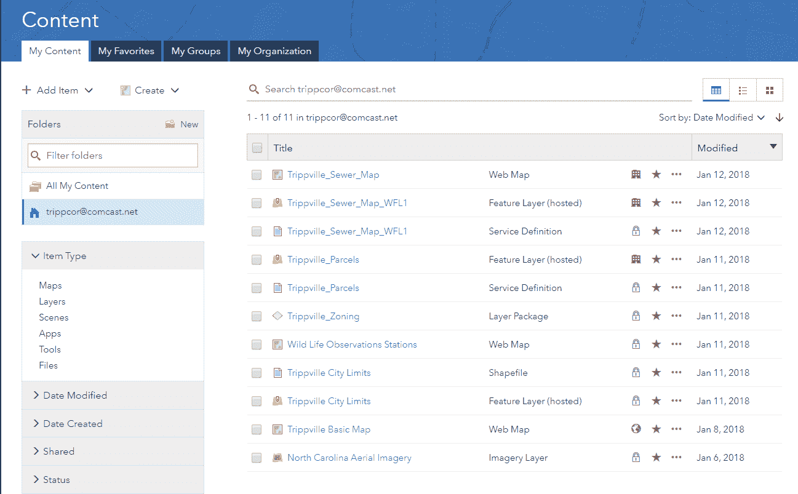

ArcGIS Online 中的我的内容页面

1.  在内容页面的顶部中心有一个搜索功能。搜索以下值：`Trippville Basic Map`。这将过滤您的所有内容，以便只显示与搜索字符串匹配的项目。

1.  点击搜索结果中返回的 Trippville Basic Map。这将带您到该项目的属性。这是共享项目的起点。

1.  在您与他人共享项目之前，完成与项目相关的元数据是一个推荐的最佳实践。因此，您现在将这样做。在描述下，点击添加项目的详细描述。这将打开一个文本编辑框。

1.  滚动到使用条款并点击位于右侧的编辑按钮。这将打开一个文本编辑框。

1.  在编辑框中输入`仅用于培训`，然后点击保存。

1.  现在，点击位于网络地图名称下方、顶部附近的设置选项卡。

1.  确保已勾选“防止意外删除此项目”。由于您打算让此地图作为其他可能创建的新网络地图的基础，您不希望有人意外删除它。点击“保存”按钮。

1.  滚动并审查其他可用的设置。接受默认设置。

1.  审查完所有可用选项后，滚动到顶部并点击“概述”标签以返回元数据。

1.  在您实际共享 Trippville 基本地图之前，您想为那些将在您的组织中创建自己的网络地图的人员创建一个组。点击页面顶部的“组”标签。这将带您到 ArcGIS Online 中的组页面。

1.  点击“创建新组”按钮以开始创建新组的过程。

1.  为新组命名：`地图制作者`

1.  输入以下摘要：`此组是为组织内允许创建新网络地图的人员而设的`。

1.  添加以下标签：`Trippville`、`网络地图`、`模板`、`基础图层`。

1.  按照指示设置剩余的设置：

    +   谁可以查看此组？ – 组织内的人员

    +   谁可以加入此组？ – 只有被组长邀请的人员

    +   谁可以贡献内容？ – 组成员

    +   组成员可以更新哪些项目？ - 所有项目（组成员资格限于组织）

1.  确认您的“创建新组”页面看起来如下，然后点击“创建组”：

>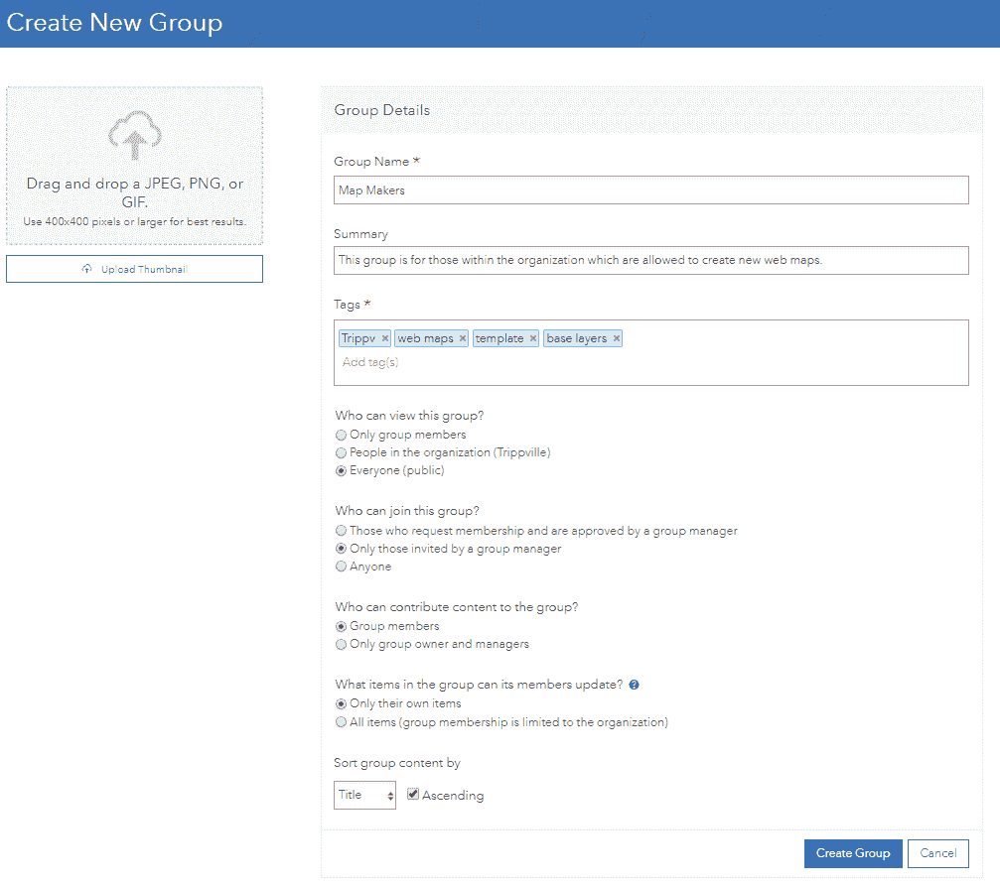

在 ArcGIS Online 中创建新的组页面

您还可以添加一个自定义图标/标志，这有助于他人识别您的组和其目的。这必须是一个包含 GIF、PNG 和 JPG 文件的位图文件。位图应为方形，最小尺寸为 400 x 400 像素。

1.  您已经在您的组织中创建了一个新的组。组可以用来控制您与谁共享内容。使用您学到的技能编辑您新组的描述，为 ArcGIS Pro 中的其他项目创建描述。将您创建的摘要用作创建描述的指南。

1.  点击 ArcGIS Online 顶部的“内容”标签，位于“组”和“组织”之间。这将带您回到您的“内容”页面。

1.  点击“Trippville 基本地图”网络地图以返回其属性。如果需要，请使用搜索工具定位它。

1.  点击右侧的“共享”按钮。这将打开共享窗口。

1.  取消选择“所有人（公开）”和“Trippville”选项。启用“这些组”选项。然后，启用您刚刚创建的“地图制作者”组。

1.  确认您的“共享”窗口看起来如下，然后点击“确定”：

1.  点击 ArcGIS Online 顶部的“组”标签。

1.  在页面右侧面板中选择“地图制作者”组。这将打开该组。

1.  点击位于组地图下方的“内容”标签。这将显示所有与该组共享的内容。

1.  确认你看到了以下截图所示的 Trippville 基础地图：

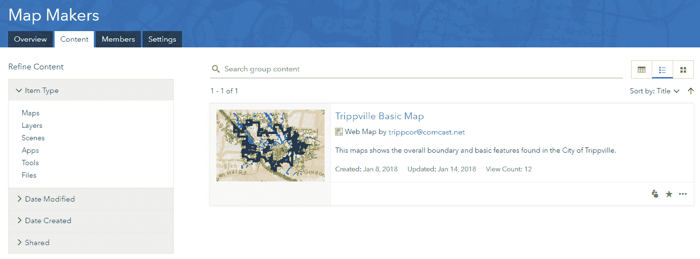

在 ArcGIS Online 中创建地图的制作者将内容分组

1.  你已经完成了。就这么简单。现在，关闭你的网络浏览器。

1.  如果 ArcGIS Pro 仍然是从之前的菜谱中打开的，请确保也将其关闭。如果被问及是否要保存打开的项目，请点击“是”。

你刚刚将之前在某个菜谱中创建的内容与你组织内创建的新组共享。正如你所见，与他人共享内容非常简单。你可以选择要共享的具体内容，并对与谁共享你的内容有主动控制权。所有这些都有助于确保你的内容安全可靠。有一点需要记住的是，如果你选择将内容与所有人共享，这可能意味着所有可以访问 ArcGIS Online 的人，即使他们不是你组织的一部分。
