# 使用 ArcGIS Online 创建 Web 应用程序

在本章中，我们将介绍以下菜谱：

+   使用 Esri 模板创建简单网络应用程序

+   使用 Web AppBuilder 创建自定义应用程序

+   分享您的应用程序

+   在网页中嵌入 ArcGIS Online 地图

# 简介

到现在为止，您已经知道 ArcGIS Pro 和 ArcGIS Online 的结合为组织提供了一个非常强大的 GIS 解决方案。它们允许您与组织内外的人维护、分析和共享 GIS 数据，这反过来又增加了您 GIS 的有效性和灵活性。

ArcGIS Online 不仅允许您共享数据和地图。您还可以使用 ArcGIS Online 创建和共享网络应用程序。你可能自己在想，*我不是程序员*。*我不知道如何创建应用程序*。这没关系。使用 ArcGIS Online，您不需要是程序员就能创建快速但有效的网络应用程序，让其他人可以访问您创建的数据和地图。只需一点 ArcGIS Online 的知识，您就可以在 5 到 10 分钟内创建一个类似于这里展示的网络应用程序：

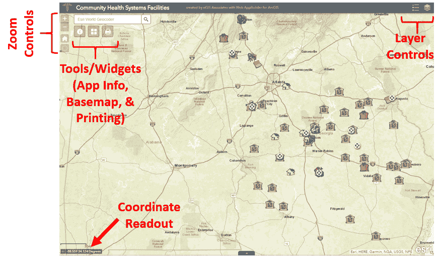

样本网络 GIS 应用程序

ArcGIS Online 提供了至少两种快速轻松创建网络应用程序的方法，即使您没有先前的编程经验。第一种是使用 Esri 创建的许多预定义应用程序模板之一。第二种是使用 Esri 的 Web AppBuilder 通过向导创建自定义应用程序。这两种方法中的任何一种都允许您创建用户可以通过他们喜欢的网络浏览器访问的 Web 应用程序或应用，从而开始使用您的 GIS 内容。这是将 GIS 扩展到没有访问权限或使用 ArcGIS Pro 技能的用户的一种极好方式。您维护和发布数据与地图，而用户则通过网络应用程序完成他们所需的数据操作。他们不需要成为 GIS 专家。他们可以访问允许他们使用 GIS 的工具，这样他们就可以更容易、更好地完成工作。

在本章中，您将学习如何快速简单地使用这两种方法创建一些简单应用程序。然后，您将学习如何与他人分享您的应用程序，无论是组织内部还是外部。您将首先使用许多 Esri 标准应用程序模板之一创建一个应用程序。然后您将使用 Web AppBuilder 创建一个自定义应用程序。

# 使用 Esri 模板创建简单网络应用程序

能够通过网络应用程序发布您的数据和地图，这将开启一个全新的使用和访问级别，这在以简单的网络地图、功能服务或数据下载方式共享时是无法实现的。网络应用程序允许您包含 ArcGIS Pro 中一些工具提供的功能。您可以让人们从应用程序内部进行平移、缩放、查询、打印、编辑等操作。这使得即使没有 GIS 经验或软件的用户也能成为 GIS 用户。

在过去，你需要编程技能来创建 GIS 网络应用程序。现在不再是这样了。现在，有工具允许任何具备一些基本 GIS 和计算机技能的人创建他们自己的 GIS 网络应用程序。如介绍中所述，ArcGIS Online 包含几个预定义的网络应用程序模板，你可以使用这些模板创建自己的应用程序。目前，你可以访问超过 20 个应用程序模板。这些模板几乎不需要编程知识。你所要做的就是插入你的地图和数据，配置一些项目，然后就可以出发了。根据你选择的模板和你希望的功能，你可以在不到 5 分钟内拥有一个运行中的网络应用程序。

在本食谱中，你将发布你在第十二章，*介绍 ArcGIS Online* 中为 Corbin Concrete 创建的地图，并将其发布为一个网络应用程序。客户希望有一个网络应用程序，允许他的调度员和销售团队输入混凝土交付的地址，并查看他们的工厂中是否有工厂可以提供混凝土。

# 准备工作

本食谱将要求你拥有 ArcGIS Online 账户和互联网访问权限。你需要是 2 级用户。如果你没有 ArcGIS Online 用户登录或不想使用你组织的账户来完成本章的食谱，你可以从 Esri 在[`www.esri.com/arcgis/trial`](http://www.esri.com/arcgis/trial)请求试用许可证。

你还需要一个支持 HTML 5 和 JavaScript 的网络浏览器。这些是当前版本的 Chrome、Edge、Firefox 和 Safari。Internet Explorer 11 或更新版本也受支持。其他浏览器也可能工作，但尚未由 Esri 测试。

在开始本食谱之前，你必须完成第十二章，*介绍 ArcGIS Online* 和第十三章，*将您的内容发布到 ArcGIS Online* 中所有的食谱。这将确保你拥有所需的地图和数据，以及对于 ArcGIS Online 是什么以及它如何与 ArcGIS Pro 集成的坚实基础理解。

在开始此练习之前，你还需要确保已经安装了示例数据。本食谱还将使用积分。预计将使用不到三个积分。

# 如何操作...

1.  你将首先启动 ArcGIS Pro 并打开位于 `C:\Student\ArcGISProCookbook\Chapter14` 的 Corbin Concrete 项目。使用你在前面的食谱中学到的技能，导航到 `Chapter14` 文件夹并打开 `Corbin Concrete.aprx` 项目。

1.  项目应该以地图的形式打开，这个地图看起来与第十二章中介绍的相似，如图所示。在你能够创建网络应用之前，你需要将此地图发布到你的 ArcGIS Online 内容中。第一步是确保地图和元数据已配置。在内容窗格中右键点击 Corbin Concrete 地图。从出现的菜单中选择属性：

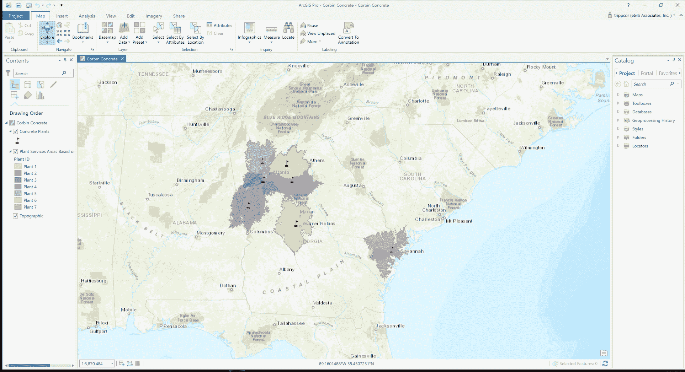

Corbin Concrete 地图

1.  点击地图属性窗口左侧面板中的范围选项。

1.  确保已选择自定义范围。如果没有，请选择它并将计算来源设置为基于 45 分钟车程的 Plant Service Areas。

1.  点击地图属性窗口左侧面板中的元数据选项。

1.  使用你在之前的菜谱中学到的知识和技能，完成 Corbin Concrete 地图的元数据部分。完成后点击确定。

1.  点击功能区上的共享选项卡。

1.  在共享选项卡上的共享组中点击位于页面顶部的 Web Map 按钮。这将启动共享为 Web Map 工具。

1.  接受默认名称，应该是`Corbin_Concrete`。如果你的组织中有其他人也在使用这本书，或者你之前使用过，你可能需要在末尾添加你的名字以确保名称唯一。

1.  接受摘要和标签的值，这些值是从你刚刚输入的地图元数据中提取的。

1.  将你的共享选项设置为我的内容和你的组织。它们应该是前两个选项。

1.  使用下拉菜单将选择配置参数设置为复制所有数据：探索。此选项将允许用户查看、查询和打印地图。它不允许他们编辑数据。

1.  点击分析按钮。你应该会收到一个警告，说：“图层没有设置特征模板”。由于你不会通过网络应用编辑此地图中的数据，因此可以忽略此警告。

1.  点击共享按钮将此地图发布到你的 ArcGIS Online 内容。

1.  当工具成功完成后，关闭它。

1.  现在，你将验证 Corbin Concrete 地图是否已成功发布到 ArcGIS Online。在目录窗格中，点击窗格顶部附近的门户选项卡。

1.  查看你的内容中可用的项目列表。验证你是否看到了你刚刚发布的`Corbin_Concrete`地图，如图所示。记住，你可能需要刷新窗格才能看到它：

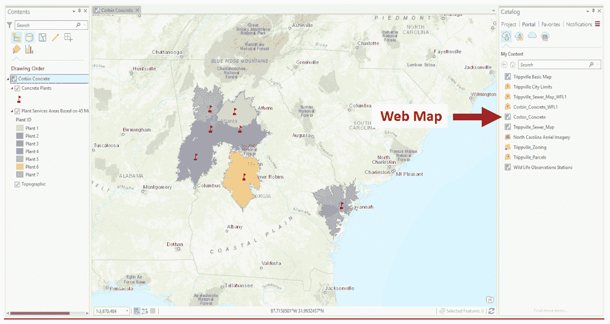

Corbin Concrete 地图成功发布到 ArcGIS Online，如门户选项卡所示

1.  一旦你验证地图已成功发布到 ArcGIS Online，保存你的项目并关闭 ArcGIS Pro。

1.  打开你的网络浏览器并转到[www.arcgis.com](http://www.arcgis.com)。然后登录到你的 ArcGIS Online 账户，就像你在之前的菜谱中做的那样。

1.  点击页面顶部的内容选项卡以查看你的 ArcGIS Online 内容。

1.  定位并点击 Corbin_Concrete 网络地图以打开其属性页面。

记住，当您从 ArcGIS Pro 发布网络地图时，它通常会在您的 ArcGIS Online 内容中创建多个项目。这通常包括网络地图、服务定义和要素层。请确保您点击的是网络地图，而不是要素层或服务定义。

1.  点击页面右侧的“在地图查看器中打开”按钮。这将打开您在过去菜谱中使用的 ArcGIS Online 查看器中的网络地图，如图所示：

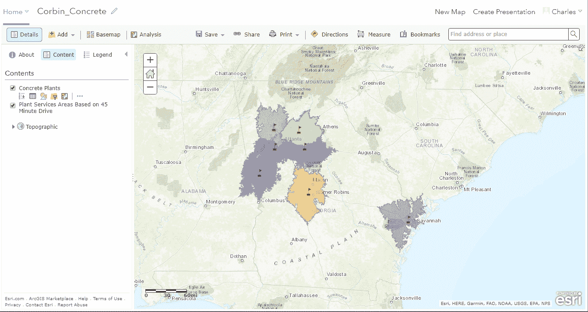

在 ArcGIS Online 网络查看器中查看的 Corbin Concrete 地图

1.  点击地图顶部的“共享”按钮以打开共享窗口。

注意到这个窗口有几个选项。您可以选择谁可以查看地图。目前，只有您组织内部的人可以查看。还有一个指向此地图的链接，您可以复制并发送给与您共享地图的人。如果您与所有人共享，您还可以将地图发布到您的 Facebook 页面和 Twitter。

在“嵌入此地图”下，有两个选项：嵌入网站和创建网络应用。嵌入网站选项被灰色显示。您稍后会了解更多关于这个选项的信息。

1.  点击“创建网络应用”按钮。这将允许您开始创建自己的网络 GIS 应用程序的过程。

1.  将会打开“创建新的网络应用”窗口。您应该在顶部看到三个标签：可配置应用、Web AppBuilder 和操作仪表板，如图所示。目前，您将专注于“可配置应用”标签。确保从窗口左侧的选项中选择“显示所有”： 

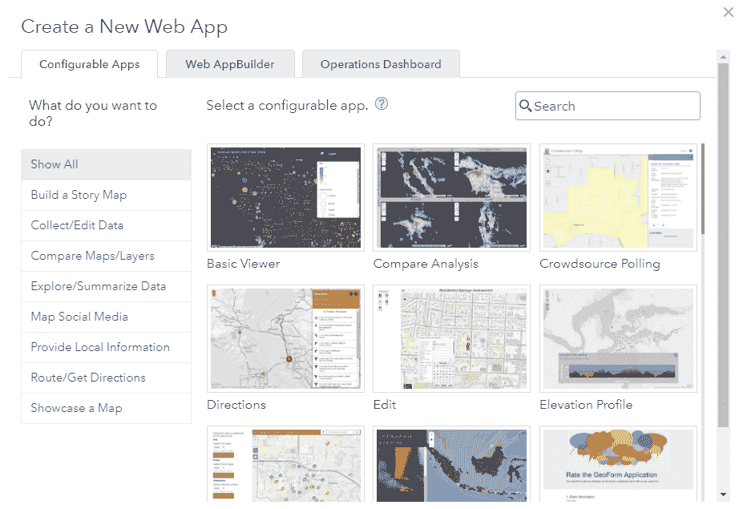

ArcGIS Online 应用模板库

可配置应用是预定义的应用程序模板，包括特定的功能。您为每个这些应用都有限制的配置选项。ArcGIS Online 目前包括超过 20 个可配置模板应用程序，从简单的地图查看到分析和报告应有尽有。如果您想了解更多关于不同可用的应用程序模板，请访问[`doc.arcgis.com/en/arcgis-online/create-maps/choose-configurable-app.htm`](http://doc.arcgis.com/en/arcgis-online/create-maps/choose-configurable-app.htm)。

1.  点击“*基本查看器模板*”应用。这将允许 Corbin Concrete 的调度员和销售团队执行他们请求的功能。

1.  当您点击“基本查看器”模板时，在“创建新的网络应用”窗口的右侧将出现一个新面板，如图所示。这个新面板允许您创建一个新的网络应用，预览网络应用以便您了解其外观，并下载应用的代码，以便您可以在自己的网络服务器上部署它。点击“创建网络应用”按钮：

1.  你现在将为你新网络应用程序配置一些初始选项。将应用程序标题命名为`科宾混凝土工厂位置与服务区域`。

1.  接受从网络地图继承的标签和摘要。

1.  确认你的创建新网络应用程序窗口看起来像以下内容，然后点击完成。你可能需要向下滚动以看到完成按钮。你的保存文件夹也会不同：

1.  网络应用程序配置应用程序将出现。你现在将配置你新网络应用程序的功能和外观。在应用程序标题下，键入：`工厂位置`。

1.  对于应用程序副标题，键入：`45 分钟服务区域`。

1.  在详细信息窗口中点击并键入以下内容：`此应用程序显示科宾混凝土工厂位置以及每个工厂 45 分钟车程内的服务区域。用户可以在应用程序顶部的搜索框中输入地址，以查看该地址是否位于服务区域内，如果是，则最近的工厂是哪个，以便为输入的地址提供混凝土`。

1.  点击位于网络地图下的保存按钮。这将使用你配置的当前设置保存你的新应用程序。

记得经常保存。没有自动保存。如果你失去网络连接或浏览器锁定，你所有的作品都将丢失。

1.  点击主题选项卡。这将允许你配置网络应用程序的外观。

1.  将标题颜色设置为浅灰色到中等灰色。尝试颜色调色板第一行的最后两个选项。

1.  点击保存按钮以应用颜色更改。你可以自由调整任何其他颜色设置，只要你觉得合适。记得点击保存以在预览区域中查看这些更改。

1.  在颜色选项下方是布局选项。它们控制应用程序中工具的显示方式和位置。尝试选择布局下的每个选项。记得在每个选项之间点击保存按钮，看看它看起来像什么。一旦你审查了所有选项，请选择菜单栏并点击保存。

你几乎完成了。你只需要设置一些更多的配置设置。你的应用程序现在应该看起来非常类似于以下内容：

科宾混凝土草稿网络应用程序

接下来，你将配置你希望在新的应用程序中包含的功能：

1.  点击选项卡开始配置功能。

1.  启用地图上的显示比例尺。科宾混凝土的销售团队要求这个功能，以便他们可以大致估算他们输入的地址与最近的工厂之间的距离。

1.  在工具栏选项下，启用以下选项：

+   +   底图图库

    +   图例

    +   地图详情

    +   测量工具

1.  确保所有其他工具栏选项都已禁用。你刚刚配置了将在你的网络应用程序中可用的工具。

1.  确保显示编辑器已禁用。你不希望调度员或销售团队通过此应用程序编辑数据。

1.  确保打印工具已启用，并点击位于图层名称右侧的“添加图例到输出”以启用此选项。

1.  滚动并启用“添加工具栏标签”功能。这将给应用程序中的每个按钮标注其基本功能。这将帮助非 GIS 用户更容易理解这些工具。

1.  点击“保存”按钮以应用并保存您所做的更改。您的应用程序现在应该看起来如下所示：

您一直在构建的植物位置应用程序

最后，对于此应用程序模板，您需要配置搜索选项。这控制了应用程序顶部的搜索窗口能够搜索的内容。默认情况下，它使用 Esri World Geocoder 服务根据地址、坐标或常用名称定位位置。您可以通过允许它搜索地图中的图层和其他数据来提高搜索能力。您将配置它以允许应用程序也搜索您的服务区域：

1.  点击页面顶部的“搜索”标签。

1.  注意默认设置。点击“基于 45 分钟车程的植物服务区域”旁边的框。这将允许应用程序搜索该层指定的值。

1.  现在点击“编辑”，位于图层名称的右侧。这将允许您配置此层搜索的方式。

1.  选择“启用建议”。这将使用户在输入值时提供可能的匹配建议。

1.  使用下拉箭头将“最大建议数”设置为 4。

1.  使用下拉箭头将“显示字段”设置为“名称”。

1.  选择“名称”作为搜索字段并点击“保存”按钮。

1.  通过点击“保存”按钮保存您的应用程序。

1.  现在点击“启动”以查看您刚刚创建的应用程序。这将在新窗口中启动您的新应用程序，如下面的截图所示：

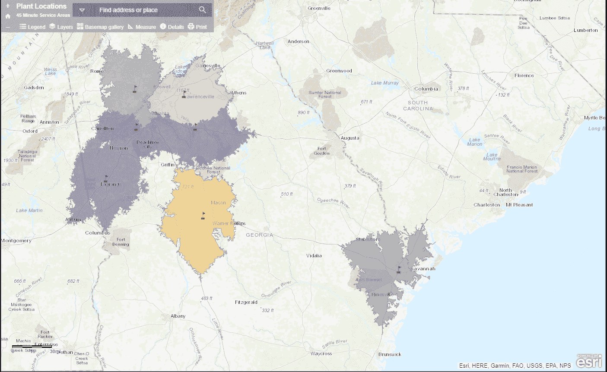

您已经成功创建了您的第一个 GIS 网络应用程序，无需任何编程技能：

1.  现在，让我们对您的新应用程序进行测试。在搜索工具中点击“查找地址或地点”。输入此值：`2712 Wilding Green Lane, Dacula GA`。注意，当您输入时，您的应用程序正在提供可能的匹配搜索建议。一旦您觉得您看到了正确的匹配建议，请选择该建议。地图将自动放大到您选择的位置。在这个比例下，很难确定哪个特定的植物服务于这个地址，但因为你可以看到填充图案，你可以立即知道这个位置由 Corbin Concrete 提供服务。因此，这满足了 Corbin Concrete 的一个要求。

1.  现在，让我们看看我们是否可以轻松地确定哪个植物服务于这个位置。在地址位置周围的区域点击一下。在您点击的地方应该会弹出一个地图窗口，如图所示。审查此弹出窗口的内容：

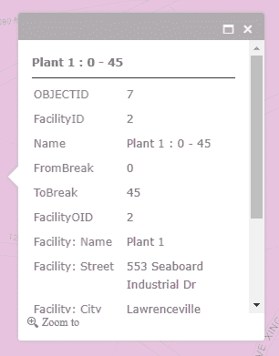

如您从弹出窗口中看到的那样，该位置由工厂 1 提供服务。因此，您已经满足了应用的其他主要要求。用户可以轻松确定哪个工厂为输入的地址提供服务：

1.  审查完弹出窗口的内容后，关闭它。

1.  检查您新应用中的其他工具。看看用户能够访问哪些其他功能。

1.  审查完您的新应用后，关闭您的网络浏览器。

您刚刚创建了自己的第一个 GIS 网络应用，该应用允许用户使用地址或常用名称在地图上定位一个点。然后用户可以确定该位置是否位于 Corbin Concrete 工厂的某个服务区域内。然而，使用您的网络应用时，用户可以做的不仅仅是这些。用户还可以查看图例，打开和关闭图层，更改底图，测量长度和面积，以及打印。您创建了这个功能强大且易于使用的网络应用，而无需编写一行代码。

# 使用 Web AppBuilder 创建自定义应用

您刚刚使用 Esri 的可定制模板之一创建了自己的第一个 GIS 网络应用。虽然这些模板很棒，确实产生了一些强大的应用，但您可能找不到完全符合您需求的模板。这就是您创建网络应用的另一个选项，Web AppBuilder 的用武之地。

Web AppBuilder 允许您创建自己的自定义网络应用，并选择您想要包含的工具。这些工具被称为小部件。Web AppBuilder 包含许多基础小部件，您可以根据自己的特定需求进行自定义。这在使用您自己的 GIS 网络应用时提供了更多的灵活性。如果您具备编程技能，您甚至可以创建自己的小部件，并将其插入 Web AppBuilder 以获得更多功能和灵活性。

Web AppBuilder 有两个版本：**ArcGIS Online** 和 **开发者**。ArcGIS Online 版本嵌入在 ArcGIS Online 中。它不需要您在本地安装任何软件或具备编程技能。开发者版本稍微复杂一些；它必须下载并本地安装。虽然安装后您可以使用它就像使用 ArcGIS Online 版本一样，但它允许您在 Web AppBuilder 框架内创建自己的小部件或工具。如果您想下载 Web AppBuilder 的开发者版本，请访问 [`developers.arcgis.com/web-appbuilder/`](https://developers.arcgis.com/web-appbuilder/)。在本食谱的剩余部分，我们将重点关注 ArcGIS Online 版本。

Corbin Concrete 对您在之前菜谱中为他们创建的网络应用程序印象深刻。这真正帮助他们看到了 GIS 的价值。这给了他们另一个想法，即第二个应用程序，该应用程序将主要用于他们的销售团队。他们想要一个功能更强大的新应用程序。他们希望能够在应用程序中绘制混凝土浇筑的位置，并能够打印出来供内部估算师使用。他们还希望应用程序能够定位到位置最近的工厂，以及能够找到指定距离内的任何工厂。

在这个菜谱中，您将使用 Web AppBuilder 创建一个新的网络应用程序，该应用程序满足之前概述的 Corbin Concrete 的需求。您将从之前菜谱中创建的现有 Corbin Concrete 网络地图开始。然后，您将使用 Web AppBuilder 创建和配置新的应用程序，包括所需的组件以及其一般外观。

# 准备工作

要完成这个菜谱，您需要完成第十二章，*介绍 ArcGIS Online*，以及第十三章，*使用 ArcGIS Online 创建网络应用程序*，以及本章中的上一个菜谱。这将确保您有完成此菜谱所需的数据和知识。您还需要 ArcGIS Online 账户和互联网访问权限。您需要是 2 级用户。如果您已经完成了所需的菜谱，您应该已经满足这些要求。

您还需要一个支持 HTML 5 和 JavaScript 的网络浏览器。这包括当前版本的 Chrome、Edge、Firefox 和 Safari。11 或更高版本的 Internet Explorer 也受支持。其他浏览器也可能工作，但尚未由 Esri 测试。

此菜谱还将使用积分。预计将使用不到三个积分。

# 如何操作...

1.  您需要做的第一件事是登录到您的 ArcGIS Online 账户。因此，启动您的网络浏览器并访问[www.arcgis.com](http://www.arcgis.com)。然后像之前菜谱中那样登录到您的账户。

1.  点击页面顶部的“内容”选项卡以查看您的内容。

1.  在您的内容中，点击`Corbin_Concrete`网络地图。这将打开网络地图的属性页面，您在之前的菜谱中已经见过，如下面的截图所示：

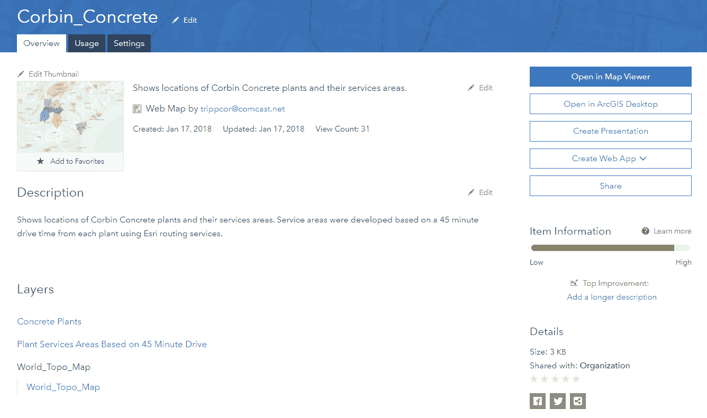

记住，将有几个名为`Corbin_Concrete`的项目。您至少有三个：`Web Map`、`Feature Layer`和`Service Definition`。

1.  点击右侧的“创建网络应用程序”按钮，并从提供的选项中选择使用 Web AppBuilder，如下面的截图所示。这将允许您开始创建新网络应用程序的过程：

您可以在任意数量的网络应用程序中使用单个网络地图，没有任何限制。因此，单个网络地图可以成为您可能部署的任意数量网络甚至移动应用程序的起点。在设计并发布您的网络地图时，您应该始终牢记这一点。记住，您还需要平衡性能。地图中的数据越多，其性能越慢。

1.  将您的新网络应用程序命名为“Corbin Concrete 销售团队应用程序”。

1.  将以下标签添加到现有标签列表中：`sales`、`Web AppBuilder`、`draw`和`find nearest`。

1.  输入以下描述：“此应用程序是为 Corbin Concrete 的销售团队创建的，以便他们能够定位最近的混凝土工厂并绘制现场浇筑混凝土的位置。”

1.  确认您的“创建新网络应用程序”窗口看起来如下，然后点击“确定”：

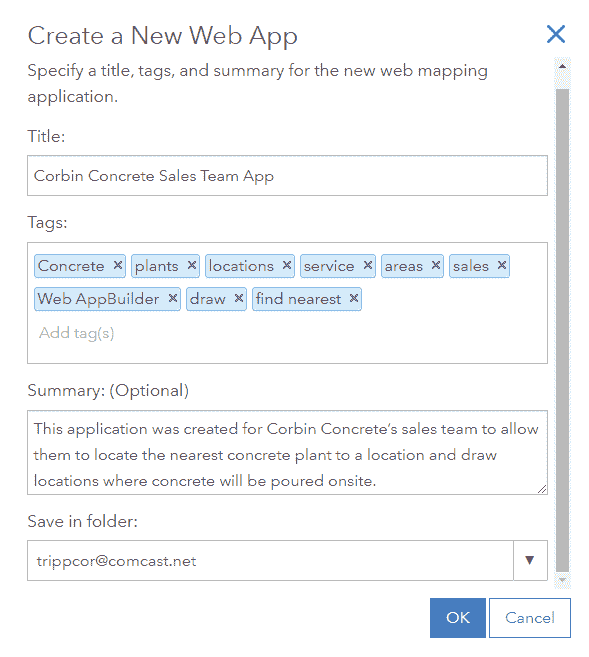

一旦您点击“确定”，Web AppBuilder 将在您的浏览器中自动启动。如您所见，它与您在先前的菜谱中配置模板应用程序所使用的工具有些相似。然而，您有更多可用的选项。您将通过选择和配置一个主题来开始配置您应用程序的一般外观。

1.  如您所见，Web AppBuilder 至少包括九种不同的主题，您可以从中选择以创建您的网络应用程序。花点时间选择并审查每一个。

每个主题都针对特定的功能进行了优化。例如，Billboard 主题旨在支持简单的任务，如打印或查看数据，而仪表板则旨在允许您同时查看多个小部件。要了解更多关于 Web AppBuilder 中可用的每个主题的信息，请访问[`doc.arcgis.com/en/web-appbuilder/create-apps/themes-tab.htm`](http://doc.arcgis.com/en/web-appbuilder/create-apps/themes-tab.htm)。

当您预览右侧的网络应用程序时，它将更新以向您展示您的应用程序将如何看起来，以及工具/小部件将位于何处。样式和布局选项也会改变。

1.  审查完主题后，选择“Billboard”主题。这将创建一个支持基本功能的应用程序，例如 Corbin Concrete 所请求的功能。

1.  选择您喜欢的样式颜色；任何选项都可以。为了未来的图形，作者选择了蓝色选项。

1.  对于布局，选择如图所示的第二个选项。这将把您稍后添加的小部件放置在您新应用程序的右上角：

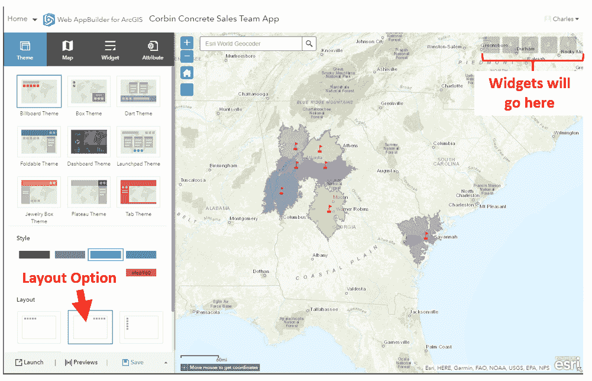

在这个菜谱中，你会跳过地图标签，因为你已经从一个特定的网络地图开始了。现在，是时候开始将你需要添加到应用程序中的 Widget 添加进来了。记住，Widget 是可配置的工具，它们为你的应用程序提供功能。正如你在预览窗口中可以看到的，一些 Widget 已经默认添加。这包括缩放滑块、主页按钮、我的位置按钮、比例尺和坐标读数。

缩放滑块允许你在地图内进行放大和缩小。主页按钮类似于 ArcGIS Pro 中的全图范围按钮。它将把你缩放到网络地图的全图范围。我的位置按钮将自动将地图中心定位到应用程序认为你所在的位置。如果应用程序将在带有 GPS 的移动设备上使用，这是一个很好的 Widget。它不一定在办公室的电脑上工作得很好。此 Widget 还需要一个 HTTPS 连接。

1.  在 Web AppBuilder 的左上角点击 Widget 标签。这里是你添加和配置将在应用程序中使用的 Widget 的地方。

1.  注意，已经有几个被突出显示了。这些对应于默认包含的 Widget。同时注意默认 Widget 下方有五个灰色方块。这些与应用程序预览右上角的五个灰色方块相匹配。

1.  Corbin Concrete 决定他们不需要在这个新应用程序中包含概述地图。这是默认 Widget 之一。你现在将禁用它。将鼠标指针移到概述 Widget 上。当你这样做时，会出现两个小图标：一个在右下角用于配置 Widget，一个在右上角用于隐藏它，如图所示。点击隐藏图标以在你的新应用程序中禁用此 Widget：

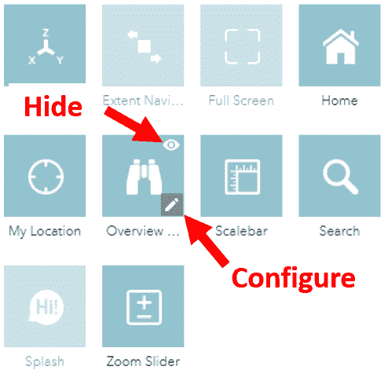

一旦你点击了隐藏图标，Widget 应该会变成灰色。这表示你成功隐藏了 Widget，因此它将不会出现在你的应用程序中。要将来启用其他默认 Widget，只需反转此过程。现在，为了将可定制的 Widget 添加到你的新应用程序中，我们将从图层列表 Widget 开始。这将允许用户在地图中打开或关闭图层：

1.  在 Web AppBuilder 的左侧面板中，点击第一个标有 Widget 的灰色方块，其中包含数字一。这将打开选择 Widget 的窗口。

你选择的 Billboard 主题包含大量可能的 Widget，这些 Widget 将与该主题一起工作。这个列表将根据你选择的主题而变化。

1.  点击位于中间行的图层列表 Widget，如图所示。然后点击“确定”来配置 Widget：

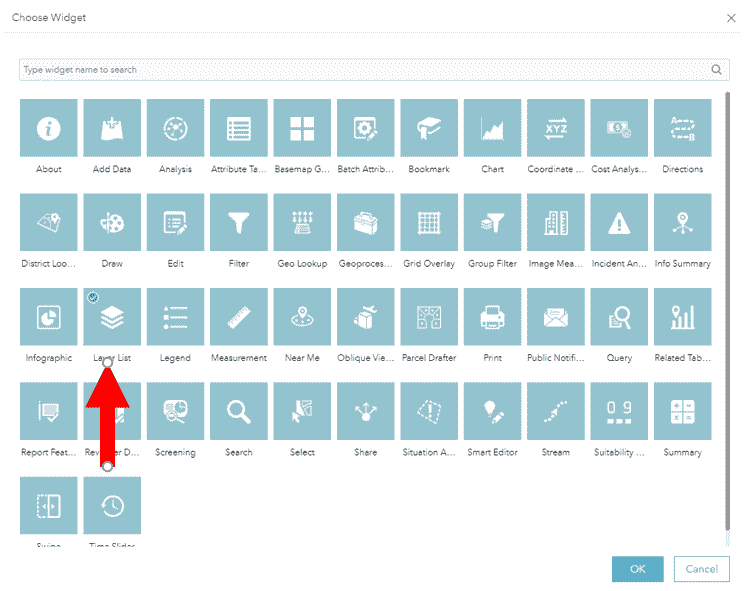

1.  因此，您可以看到此小部件包含几个选项。通常，您总是希望尽可能保持简单。记住，您的用户将是销售人员，而不是 GIS 专家。您将禁用一些选项以减少小部件的复杂性，使其仅提供所需的 capability。通过点击复选框禁用以下选项：

    +   透明度

    +   启用/禁用弹出窗口

    +   上移/下移

    +   描述/显示项目详情/下载

1.  确保您的配置图层列表看起来如下，然后点击“确定”：

您应该注意到图层列表小部件现在出现在 Web AppBuilder 的左侧面板中，以及应用预览区域的右上角。这表明您已成功添加了第一个小部件。现在您将添加一个打印小部件：

1.  在添加另一个小部件之前，点击 Web AppBuilder 底部的“保存”标签，以保存您迄今为止已完成的工作。

1.  点击现在标记为“小部件”，内部有一个数字一的小方块。它应该位于您刚刚添加的图层列表小部件旁边。

1.  从显示的库中选择打印小部件。它与图层列表小部件在同一行。选择小部件后，点击“确定”。

1.  按照指示设置以下值：

    +   服务 URL：保留默认值。

    +   默认标题：`Corbin Concrete Potential Project`

    +   默认作者：`Corbin Concrete Sales Team`

    +   默认版权：`Copyright Corbin Concrete. All rights reserved.`

    +   默认格式：PDF

    +   默认布局：Letter ANSI A 竖排

1.  确保您的配置打印窗口看起来如下，然后点击“确定”：

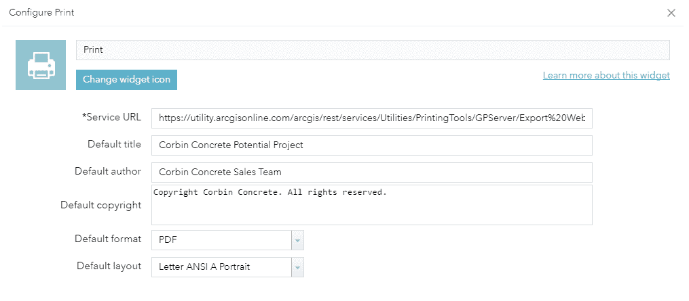

打印小部件现已添加到您的应用程序中。Corbin Concrete 还要求添加一项功能，即在地图上绘制图形，以显示混凝土浇筑项目的位置。您接下来将添加绘图小部件，它提供此功能。

1.  在继续之前，请确保保存您的应用程序。

1.  再次，点击左侧面板中的一个灰色小部件方块。

1.  从库中选择绘图小部件，然后点击“确定”。

1.  配置绘图窗口未打开。此小部件有多个选项。再次简化它。由于 Corbin Concrete 在美国运营，您将从小部件中删除所有公制选项。将鼠标指针移至千米所在行的操作列。将出现几个图标。点击以下截图所示的删除图标，以从列表中删除千米：

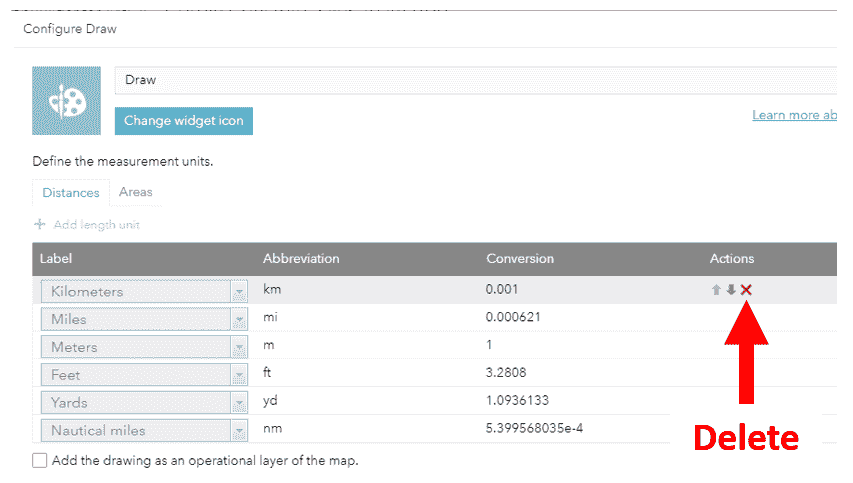

1.  对米和海里重复此过程。您应该剩下英里、英尺和码。

1.  您已设置距离选项。现在为面积设置选项。点击位于更改小部件图标按钮下方的小部件标签页。

1.  您现在应该看到一个区域测量单位的列表。使用与移除距离单位相同的过程移除所有公制单位。仅保留平方英里、英亩、平方英尺和平方码。

1.  在从区域列表中移除所有公制单位后，点击确定。

1.  保存您的应用程序。

您刚刚向您的应用程序添加了第三个小部件。前三个相对简单。现在您将添加一个更复杂的小部件，即“附近”。这将允许销售人员找到他们位置附近或他们在地图上点击位置的最近工厂。

1.  再次点击一个灰色的小部件方块以打开选择小部件窗口。

1.  从库中选择“附近”小部件并点击确定。

当“配置附近”窗口打开时，您应立即注意到，此小部件比您迄今为止配置的任何其他小部件都要复杂得多。此小部件有五个不同的选项卡，每个选项卡都包含您将配置的多个参数。

1.  您将开始设置搜索源设置。根据此处指示配置参数：

    +   地理编码器 URL：接受自动提供的默认值

    +   地理编码器名称：接受自动提供的默认值

    +   占位符文本：输入项目地址

    +   国家或地区代码：`USA`

    +   最大建议数：`6`

    +   最大结果数：`1`

    +   缩放比例：`50,000`

    +   最小比例：`300,000`

    +   半径：`50,000`

1.  确认您已正确设置参数，然后点击搜索设置选项卡。

1.  点击“选择搜索层”右侧的设置按钮。点击混凝土工厂层旁边的复选框，然后点击确定。

您选择了混凝土工厂层作为搜索层，因为您希望此小部件定位给定位置最近的混凝土工厂。

1.  启用设置位置按钮。这将允许用户在地图上点击以选择一个位置，从而找到最近的工厂。

1.  启用设置缓冲区可见性。这还将允许用户设置工具将用于搜索和查找最近工厂的距离。

1.  将默认缓冲距离设置为`10`。

1.  设置最大缓冲距离为`25`。

1.  将缓冲距离单位设置为英里。

1.  限制结果数量为一条。

1.  确认您的搜索设置与以下截图匹配，然后点击确定。您不需要配置其他选项卡：

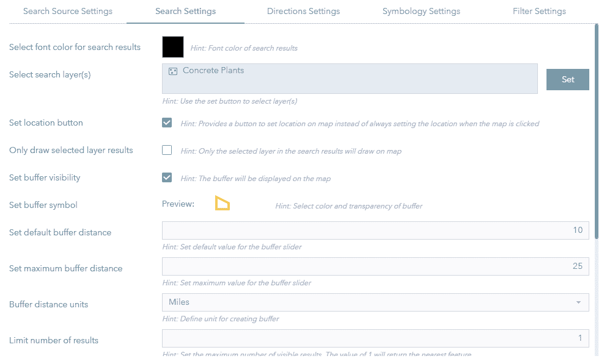

那就是您的第四个也是最后一个小部件。现在，此应用程序应包含 Corbin Concrete 请求的所有功能。接下来，您将测试您的新应用程序，并预览它在不同设备上的外观：

1.  在继续之前保存您的应用程序。

1.  在 Web AppBuilder 左侧面板底部点击预览选项卡。

1.  您应该在左侧面板中看到不同移动设备的列表。这允许您查看您的应用程序在这些设备屏幕上的外观。点击几个设备选项，看看您的新应用程序在这些设备上使用时的外观。

这些预览是功能性的。因此，你可以测试工具并查看它们在设备屏幕上的工作方式。这并不在实际设备环境中测试它们，因此不应用于或被视为代码的调试工具。然而，它将帮助你测试给定设备的整体工作流程。

1.  在 Web AppBuilder 面板底部点击“启动”标签。这将在新浏览器窗口中启动你的新应用。

1.  点击应用右上角的位置列表工具。这将打开工具窗口。

1.  点击“基于 45 分钟车程的植物服务区域”旁边的复选框，并观察地图上发生了什么。

1.  这一层不再可见。再次点击复选框以重新打开这一层。

1.  使用应用左上角的缩放滑块或鼠标，将视图缩放到四个服务交汇的区域，如图所示：

1.  现在，你将测试“附近”工具，以查看它是否能够定位你点击地图上的位置最近的工厂。点击应用右上角的“附近”工具。它是你包含在应用中的工具行中的第一个工具。

1.  在“附近”工具窗口中，点击“在地图上定位”按钮。它位于 Esri 世界地理编码搜索单元格的右侧。

1.  在地图上点击，点击此处所示的位置，位于东点的东北方向：

一旦你在地图上点击，应该会发生几件事情。首先，一个地址将出现在 Esri 世界地理编码单元格中。接下来，应该会出现一个圆圈，显示搜索区域，默认为 10 英里，因为这是你配置小部件开始时的值。最后，任何结果都将出现在工具窗口中。如果你点击截图所示的位置附近，不应出现任何结果。这意味着在这个位置 10 英里范围内没有植物。然而，工具中有一个距离滑块，允许用户增加或减少搜索距离。

1.  使用“显示结果在 10 英里内”下的滑块，将值更改为“15 英里”。这应该会显示一个结果，表明植物 3 是你所选位置最近的，如图所示，尽管它位于几个工厂的服务区域内：

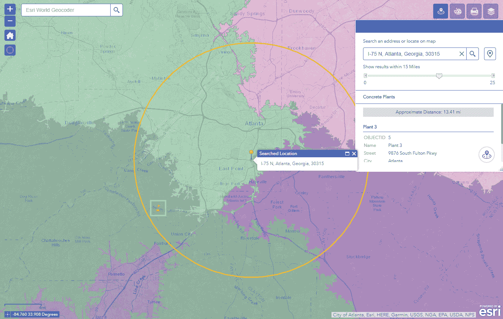

1.  关闭“附近”工具。如果你愿意，可以自由测试其他工具。

1.  探索完你的新应用后，请关闭浏览器。

你刚刚创建了一个新的网络应用。这次你使用了 Esri Web AppBuilder 工具创建了一个自定义应用，其中只包含了你的客户 Corbin Concrete 请求的工具。这让你能够创建一个功能强大且易于使用的 GIS 网络应用。同样，你做到了这一切，而不需要写一行代码。

# 分享你的应用

您已经创建了两个非常强大的 GIS 网络应用程序。然而，目前只有您可以访问它们。正如您必须分享网络地图、要素服务和数据文件以便其他人可以访问它们一样，您也必须对您的应用程序做同样的事情。

分享应用程序的过程与您分享其他内容的方式非常相似。在分享对象方面，您有相同的选择：您的组织、一个或多个组，以及所有人。

在本食谱中，您将分享刚刚创建的“Corbin Concrete Sales Team”应用程序，以便 Corbin Concrete 的员工可以访问该应用程序。他们目前没有 ArcGIS Online 账户或用户登录，因此您将将其与所有人共享。这将允许他们无需登录即可访问应用程序。

# 准备工作

您必须完成本章以及第十二章“介绍 ArcGIS Online”和第十三章“将您的内容发布到 ArcGIS Online”中的所有先前食谱，然后才能开始本食谱。本食谱还要求您拥有至少分配了发布者级别角色的 ArcGIS Online 账户。您还需要互联网访问以及支持 HTML5 和 JavaScript 的网络浏览器。

# 如何操作...

1.  第一步是登录到您的 ArcGIS 在线账户。启动您的网络浏览器并访问[www.arcgis.com](http://www.arcgis.com)。登录到您的账户。

1.  在 ArcGIS Online 的顶部点击“内容”标签以访问您的内容。

1.  在您的内容中找到并点击“Corbin Concrete Sales Team”应用程序。正如您在之前的方法中体验到的，这将带您到该应用程序的属性。

与之前的方法一样，在分享应用程序之前，您需要完成应用程序的元数据。

1.  点击“添加详细描述”按钮，该按钮位于“描述”下方。这将打开一个文本编辑窗口。使用页面顶部的应用程序摘要以及您以往的经验，为该应用程序编写一个详细的描述，解释其目的、一般功能、它是使用 Web AppBuilder 创建的，以及它是为谁创建的。完成描述后，务必点击“保存”按钮。

1.  点击位于“使用条款”右侧的“编辑”。将以下内容输入出现的文本编辑框中：此应用程序仅作为培训工具。不保证或暗示准确性。完成后点击“保存”。

现在您已经完成了与您的应用程序相关的元数据，您就可以分享它了。

1.  在 ArcGIS Online 的右侧点击“分享”按钮。这将打开分享窗口。

1.  点击“所有人（公开）”旁边的复选框。这将允许任何人访问此应用程序。同时，请注意您的组织会自动被选中。

1.  确认你的“共享”窗口看起来如下，然后点击“确定”以应用新设置并关闭“共享”窗口：

一旦你点击“确定”，将出现另一个窗口，如以下截图所示，因为应用程序引用了你内容中的其他项目。因此，当你共享应用程序时，相同的共享设置也必须应用于你网络应用程序中引用的内容。这意味着你还需要更新 Corbin_Concrete 网络地图和要素层的共享设置。幸运的是，ArcGIS Online 通过出现的窗口使这变得很容易：

在更新共享设置时，要记住的是你正在允许其他人访问你的内容。所以，确保你分享的内容适合与你分享的人。你不想与每个人分享敏感信息。此外，记住，尽管某人可能能够访问它，但他们可以对该内容执行的操作也受其角色的控制。如果他们没有 ArcGIS Online 用户账户，他们执行的操作将非常有限，仅限于查看、查询和打印。

1.  点击出现的窗口中的“更新共享”按钮。

1.  如果你希望测试你的共享设置，请将浏览器向下滚动，直到你在右侧看到一个 URL。这是你应用的网页地址。你可以点击地址旁边的“复制”按钮，然后将 URL 粘贴到电子邮件中并发送给朋友或同事。看看他们是否能访问你创建的应用程序。

1.  完成后，关闭你的浏览器。

你已经完成了。你已经共享了你的网络应用程序，使得组织内外的人都能访问它。

# 在网页中嵌入 ArcGIS Online 网络地图

虽然创建网络应用程序确实允许你创建有用的工具来扩展你的 GIS 功能，但有时可能有些过度。也许你只是想创建一个显示办公地点的地图，并在公司网站上展示。也许你正在计划一个特别活动，只想在活动网站上包含一个显示活动地点的地图。你其实并不需要一个网络应用程序。

ArcGIS Online 还提供了一种方法，让你能够轻松地将你的 ArcGIS Online 内容中的网络地图嵌入到网页中。就像创建网络应用程序一样，这相当简单。如果你对创建网页有一些了解，这将有助于工作顺利，特别是对 HTML 有基本的理解，这是创建网页的基本语言。

Trippville 市的规划总监想在规划部门的网页上展示城市的分区地图。他不需要一个花哨的应用程序，他只想有一个简单的地图，市民可以使用它来查看城市内各区域的分区分类。

在此食谱中，您将嵌入一个新的分区网络地图到 Trippville 市现有的网页中。您将首先使用在第十二章，“介绍 ArcGIS Online”中创建的 Trippville Basic Map 创建一个新的网络地图。然后，您将添加已发布到地图中的分区图层，以创建新的分区地图。然后，您将在网页中共享和嵌入新地图。

# 准备工作

在开始此食谱之前，您必须完成本章中的其他食谱，以及第十二章，“介绍 ArcGIS Online”中的那些食谱。这将确保您拥有完成此食谱所需的地图和数据。

您还需要一个具有发布角色权限的 ArcGIS Online 级别 2 用户账户。完成此食谱不应花费任何积分。如果确实花费了，将少于一个。

# 如何操作...

1.  首先，您需要登录到您的 ArcGIS Online 账户。启动您的网络浏览器并访问[www.arcgis.com](http://www.arcgis.com)。然后像之前食谱中那样登录到您的账户。

1.  点击 ArcGIS Online 顶部的“内容”选项卡以访问您的内容。

1.  在内容中向下滚动，直到找到 Trippville Basic Map 网络地图。点击它以访问其属性页面。

1.  点击右侧的“在地图查看器中打开”按钮。这将打开地图，在 ArcGIS Online 地图查看器应用程序中，如图所示：

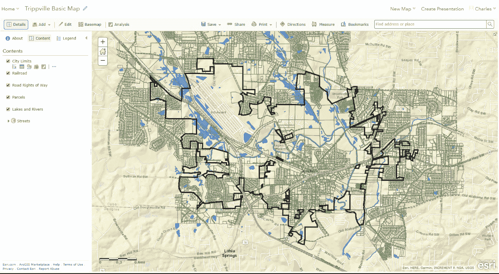

1.  点击地图查看区域顶部的“保存”按钮。从显示的列表中选择“另存为”。

1.  将新地图命名为“Trippville 分区地图”。

1.  添加您认为合适的任何标签，例如“分区”。

1.  将摘要更改为：“此地图显示 Trippville 市的分区分类”。然后点击保存地图。

1.  点击“添加”按钮，并从出现的列表中选择“搜索图层”。

1.  使用下拉箭头将“输入”选项设置为 ArcGIS Online。

1.  在“查找”单元格中输入`Trippville Zoning`并点击 GO。

新的分区图层应出现在您的地图中，如图所示：

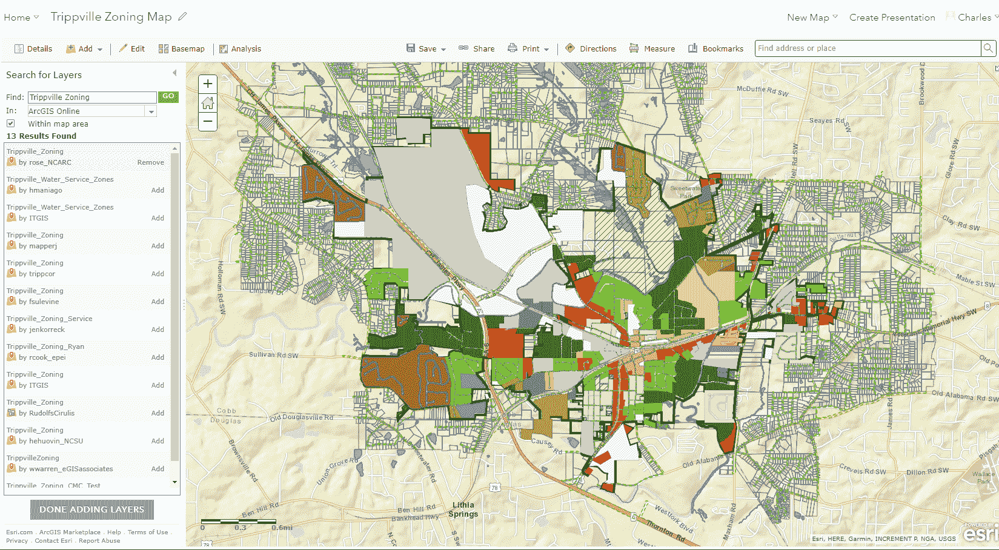

1.  点击“完成添加图层”以完成此过程。

1.  Trippville 分区图层出现在图层列表的顶部。它遮挡了其他图层。在内容中选择该图层，并将其拖动到 Lakes and Rivers 图层下方。

您也可以点击图层下方菜单中的三个点，并选择“向下移动”以更改图层在图层列表中的位置。

1.  通过点击“保存”按钮保存您的地图。

您的网络地图现在应该看起来像以下截图。它应包含 City Limits、Railroad、Road Rights of Way、Parcels、Lakes and Rivers 以及 Trippville Zoning 图层：

你现在已经创建了所需的地图，规划主任想在部门的网页上显示这个地图。现在是你分享新地图并嵌入代码的时候了。

1.  点击地图视图顶部的“共享”按钮。这将打开你在之前菜谱中看到的共享窗口。

1.  由于此地图将在城市的公共网站上显示，你将把它与所有人共享。点击“所有人（公开）”旁边的复选框。

1.  另一个弹出窗口将出现。阅读窗口的内容，然后点击“确定”关闭它。

1.  注意，由于你选择了所有人，嵌入网站选项不再灰色显示。点击“嵌入网站”按钮。

1.  现在你将配置地图在网站上的显示设置。首先将宽度设置为`940`，高度设置为`600`。确保启用允许响应式大小。这将允许大小自动调整以适应较小的屏幕。

1.  对于地图选项，启用以下选项：

    +   缩放控件

    +   主页按钮

    +   图例

1.  选择你喜欢的任何主题。

注意，当你调整大小和选项时，位于大小和地图选项之间的 HTML 代码会发生变化。ArcGIS Online 正在自动创建和调整嵌入网络地图到网页所需的 HTML 代码。你现在可以嵌入地图到部门的网页中：

1.  点击嵌入网站窗口右侧的“复制”按钮。这将把 HTML 代码复制到你的剪贴板，以便你可以将其粘贴到你的网站上。

1.  打开你的`文件资源管理器`，使用你在之前菜谱中学到的技能导航到`C:\Student\ArcGISProCookbook\Chapter14`。

1.  你应该在这个文件夹中看到几个文件，包括`Zoning.html`。这代表你想要嵌入地图的网页。双击该文件以在网页浏览器中打开它；你可以看到它是一个非常简单的网页。

1.  一旦你查看了网页，返回到`文件资源管理器`。

1.  右键单击`Zoning.html`文件，选择“打开方式”|“记事本”，如图所示：

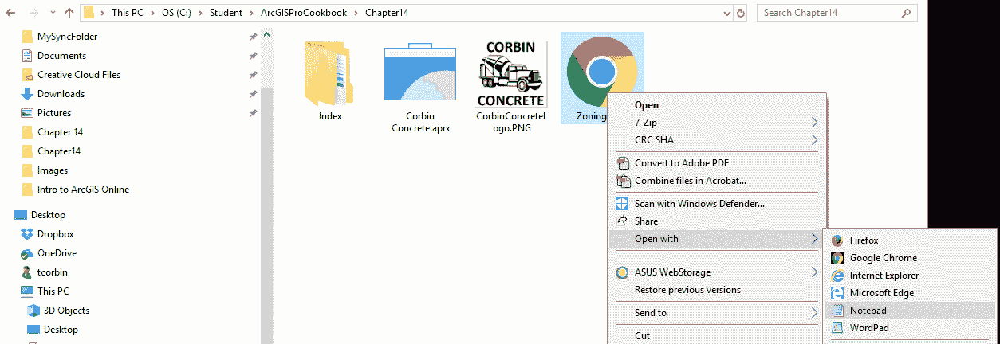

现在，你可以看到用于创建你在浏览器中查看的网页的 HTML 代码。正如你所见，这是一个非常简单的网页。现在你将把你的地图嵌入到这个页面中。

HTML 代表超文本标记语言。它是一种相当简单的编程语言，用于创建网页。它使用一系列标签来标识和显示内容。例如，`
`表示一个段落，`<strong>`或`<b>`表示以粗体字体显示，而`<body>`表示要在网页中显示的主要代码部分。每个标签必须使用相同的起始标签并带有斜杠来关闭，例如`
`。

1.  将光标移到页面中“
请联系我们的规划主任”之前，然后按*Enter*键在两个段落之间创建一行。

1.  将您的光标放在您刚刚创建的行中，然后同时按下 *Ctrl* + *V* 键来将 ArcGIS Online 中的代码粘贴到网页中。

根据您的设置，ArcGIS Online 生成的代码现在应该出现在网页代码中，如下面的截图所示。ArcGIS Online 代码已被突出显示，以便更容易看到：

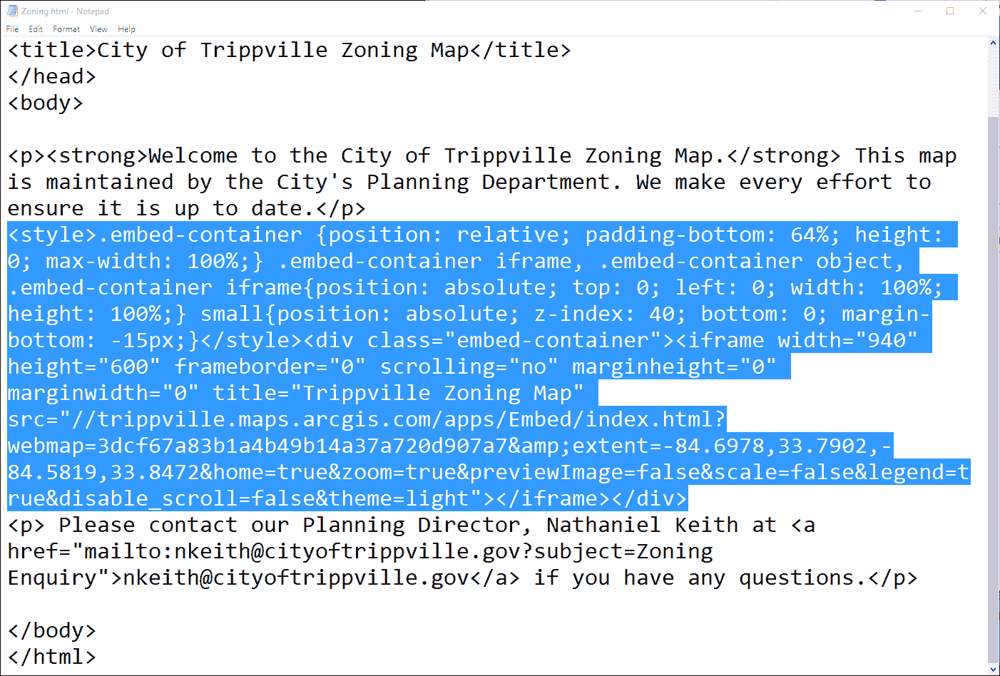

1.  在记事本顶部的菜单中，点击文件，然后选择保存以保存对网页代码所做的更改。

1.  返回到您编辑网页之前预览网页的网页浏览器。按下您的 *F5* 键刷新页面。现在您应该能在页面中间看到您刚刚嵌入的地图。

1.  花一点时间探索页面上的地图。完成后，关闭您的网页浏览器、文件资源管理器和记事本。

您已经完成了。您刚刚成功地将一个网络地图嵌入到网页中。正如您刚才所体验的，这并不困难，并且可以为您的网站添加一些精彩的内容。
