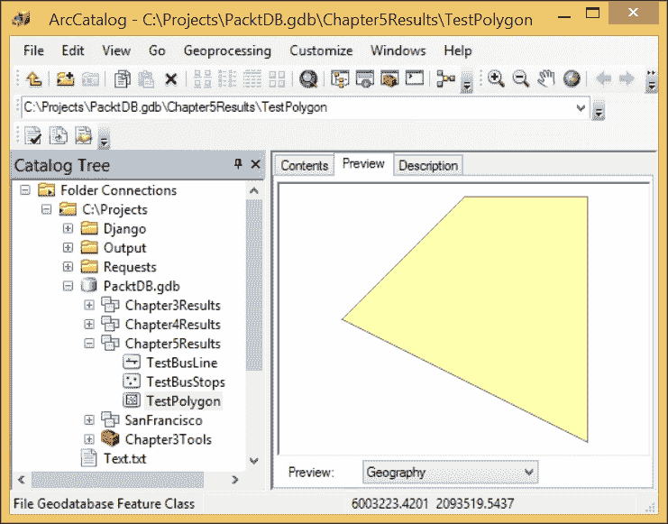

# 第五章。ArcPy 游标 – 搜索、插入和更新

现在我们已经了解了如何使用 ArcPy 与 ArcToolbox 工具交互，并且我们也已经介绍了如何使用 Python 创建函数和导入模块，我们对如何使用 Python 提高 GIS 工作流程有了基本的了解。在本章中，我们将介绍数据游标和数据访问模块，这些模块是在 10.1 版本中引入的。这些数据访问游标在 arcgisscripting 模块（ArcPy 的前身）和 ArcPy 的早期版本中使用的游标上有了很大的改进。游标不仅可以像我们所看到的那样搜索数据，还可以使用更新游标更新数据，并可以使用插入游标添加新的数据行。

数据游标用于通过逐行迭代方法访问数据表中的数据记录。这个概念是从关系数据库中借用的，在关系数据库中，数据游标用于从 SQL 表达式返回的表中提取数据。游标用于搜索数据，但也用于更新数据或添加新数据。

当我们讨论使用 ArcPy 游标创建数据搜索时，我们不仅仅是在谈论属性信息。新的数据访问模型游标可以直接与形状字段交互，并且当与 ArcPy 几何对象结合使用时，可以执行地理空间函数，从而取代将数据传递给 ArcToolbox 工具的需要。数据访问游标代表了在 Python 自动化 GIS 领域中最有用的创新。

在本章中，我们将介绍：

+   使用搜索游标访问属性和空间数据

+   使用更新游标调整行内的值

+   使用插入游标向数据集中添加新数据

+   使用游标和 ArcPy 几何对象类型在内存中执行地理空间分析

# 数据访问模块

随着 ArcGIS 10.1 的发布，新的数据访问模块 `arcpy.da` 使得数据交互比之前的数据游标更加容易和快速。通过允许以各种形式（形状对象、X 值、Y 值、质心、面积、长度等）直接访问形状字段，以及多种格式（JavaScript 对象表示法 (JSON)、Keyhole 标记语言 (KML)、已知二进制 (WKB)、已知文本 (WKT)），数据访问模块大大提高了 GIS 分析师提取和控制形状字段数据的能力。

数据访问游标接受一系列必需和可选参数。必需参数包括作为字符串（或表示路径的变量）的特征类路径以及要返回的字段。如果需要所有字段，可以使用星号表示法，并提供一个包含星号作为字符串的字段参数列表（[ * ]）。如果只需要少数几个字段，请提供这些字段的字符串字段名（例如 [ "NAME", "DATE"]）。

其他参数是可选的，但对于搜索和更新游标都非常重要。可以提供下一个以 SQL 表达式形式的`where`子句；此子句将限制从数据集中返回的行数（如最后一章中的脚本中演示的 SQL 表达式所示）。搜索和更新游标使用的 SQL 表达式不是完整的 SQL 表达式，因为游标的选择或更新命令是由游标的选择自动提供的。此参数只需要 SQL 表达式的`where`子句。

可以在 ArcPy 空间参考格式中提供下一个空间参考；如果数据格式正确，则这不是必需的，但可以用于在运行时将数据转换到另一个投影。然而，无法指定使用的空间变换。第三个可选参数是一个布尔值（或 True/False），声明数据是否应以展开的点（即单个顶点的列表）或原始几何格式返回。最后一个可选参数是另一个列表，可以用来组织游标返回的数据；此列表将包括 SQL 关键字，如 DISTINCT、ORDER BY 或 GROUP BY。然而，此最终参数仅在处理地理数据库时可用。

让我们看看如何使用`arcpy.da.SearchCursor`进行形状字段交互。如果我们需要生成一个包含特定路线沿线所有公交车站的电子表格，并包含以 X/Y 格式显示的数据位置，我们可以使用 ArcToolbox 中的添加 XY 工具。然而，这会在我们的数据中添加两个新字段，这并不总是允许的，尤其是在数据存储在具有固定模式的企业地理数据库中时。相反，我们将使用数据访问模块中内置的 SHAPE@XY 令牌来轻松提取数据并将其传递给第四章中的`createCSV()`函数，*复杂的 ArcPy 脚本和泛化函数*，以及限制结果只到感兴趣站点的 SQL 表达式：

```py
csvname = "C:\Projects\Output\StationLocations.csv"
headers = 'Bus Line Name','Bus Stop ID', 'X','Y'
createCSV(headers, csvname, 'wb') 
sql = "(NAME = '71 IB' AND BUS_SIGNAG = 'Ferry Plaza') OR (NAME = '71 OB' AND BUS_SIGNAG = '48th Avenue')"
with arcpy.da.SearchCursor(Bus_Stops,['NAME', 'STOPID', 'SHAPE@XY'], sql) as cursor:
 for row in cursor:
 linename = row[0]
 stopid = row[1]
 locationX = row[2][0]
 locationY = row[2][1]
 locationY = row[2][1]
 data = linename, stopid, locationX, locationY
 createCSV(data, csvname)

```

注意，每行数据都作为元组返回；这是有意义的，因为搜索游标不允许任何数据操作，一旦创建，元组就是不可变的。相比之下，来自更新游标的数据以列表格式返回，因为列表可以更新。两者都可以使用之前显示的索引进行访问。

光标返回的每一行都是一个包含三个对象的元组：公交车站的名称、公交车站 ID，以及最后包含该站点 X/Y 位置的另一个元组。变量`row`中元组内的对象可以通过索引访问：公交车站名称位于索引 0，ID 位于索引 1，位置元组位于索引 2。

在位置元组中，X 值位于索引 0，Y 值位于索引 1；这使得通过传递一个值来访问位置元组中的数据变得很容易，如下所示：

```py
 locationX = row[2][0]

```

能够将列表、元组甚至字典添加到另一个列表、元组或字典中是 Python 的一个强大组件，这使得数据访问逻辑性和数据组织变得容易。

然而，前一段代码返回的电子表格有几个问题：位置以要素类的本地投影（在本例中为州平面投影）返回，并且有一些数据行是重复的。如果能提供电子表格中的纬度和经度值并删除重复值，那就更有帮助了。在我们将数据传递给 `createCSV()` 函数之前，使用可选的空间参考参数和列表对数据进行排序：

```py
spatialReference = arcpy.SpatialReference(4326)
sql = "(NAME = '71 IB' AND BUS_SIGNAG = 'Ferry Plaza') OR (NAME = '71 OB' AND BUS_SIGNAG = '48th Avenue')"
dataList = []
with arcpy.da.SearchCursor(Bus_Stops, ['NAME','STOPID','SHAPE@XY'], sql, spatialReference) as cursor:
 for row in cursor:
 linename = row[0]
 stopid = row[1]
 locationX = row[2][0]
 locationY = row[2][1]
 data = linename, stopid, locationX, locationY
 if data not in dataList:
 dataList.append(data)

csvname = "C:\Projects\Output\StationLocations.csv"
headers = 'Bus Line Name','Bus Stop ID', 'X','Y'
createCSV(headers, csvname, 'wb') 
for data in dataList: 

```

空间参考是通过传递代表所需投影系统的代码来创建的。在这种情况下，WGS 1984 纬度和经度地理系统的代码是 4326，并将其传递给 `arcpy.SpatialReference()` 方法来创建一个空间参考对象，该对象可以传递给搜索光标。此外，`if` 条件用于过滤数据，只接受一个列表作为每个停止点进入名为 dataList 的列表。这个新版本的代码将生成一个包含所需数据的 `CSV` 文件。这个 CSV 文件可以随后通过 [www.convertcsv.com/csv-to-kml.htm](http://www.convertcsv.com/csv-to-kml.htm) 提供的服务转换为 KML，或者甚至更好地使用 Python。使用字符串格式化和循环将数据插入到预构建的 KML 字符串中。

## 属性字段交互

除了形状字段交互之外，数据访问模块光标提供的另一项改进是，可以使用列表调用要素类中的字段，如前所述。早期数据光标需要使用效率较低的 `get` `value` 函数调用，或者需要将字段调用得像函数可用的方法一样。新方法允许通过传递一个星号来调用所有字段，这对于访问之前未检查过的要素类中的字段来说是一个有价值的方法。

更有价值的一项改进是，无需知道数据集是要素类还是形状文件，就能访问唯一标识字段。因为形状文件有一个要素 ID 或 FID，而要素类有一个对象 ID，所以编写脚本工具来访问唯一标识字段更困难。数据访问模块光标允许使用 `OID@` 字符串从任何类型的输入中请求唯一标识。这使得了解唯一标识的类型变得无关紧要。

如前所述，其他属性字段是通过列表中的字符串请求的。字段名称必须与字段的真正名称匹配；别名名称不能传递给游标。字段可以在列表中以任何所需的顺序排列，并将按请求的顺序返回。列表中只需要包含所需的字段。

这里是一个请求字段信息的演示：

```py
sql = "OBJECTID = 1"
with arcpy.da.SearchCursor(Bus_Stops,
 ['STOPID','NAME', 'OID@'],
 sql) as cursor:
for row in cursor:

```

如果字段列表中的字段被调整，结果行中的数据将反映这些调整。此外，游标返回的元组的所有成员都可以通过零索引访问。

## 更新游标

更新游标用于调整现有数据行中的数据。在计算数据或将空值转换为非空值时，更新变得非常重要。结合特定的 SQL 表达式，可以使用新收集或计算的数据值来针对数据进行更新。

注意，运行包含更新游标的代码将更改或更新其操作的数据。在将代码运行在原始数据上之前，制作数据的副本以测试代码是一个好主意。

所有之前讨论过的数据访问模块搜索游标参数对更新游标同样有效。主要区别在于更新游标返回的数据行是以列表形式返回的。因为列表是可变的，所以可以使用列表值赋值来调整它们。

例如，让我们假设 71 路公交车线路将被重命名为 75 路。这将影响所有往返线路，因此必须包含一个 SQL 表达式来获取与该线路相关的所有数据行。一旦创建数据游标，返回的行必须调整名称，重新添加到列表中，并调用更新游标的`updateRow`方法。以下是这种情况在代码中的样子：

```py
sql = "NAME LIKE '71%'"
with arcpy.da.UpdateCursor(Bus_Stops, ['NAME'],sql),) as cursor:
 for row in cursor:
 lineName = row[0]
 newName = lineName.replace('71','75')
 row[0] = newName

```

SQL 表达式将返回所有以`71`开头的数据行；这包括`71 IB`和`71 OB`。请注意，SQL 表达式必须用双引号括起来，因为属性值需要用单引号。

对于每一行数据，返回的行中位置零的名称被分配给变量`lineName`。这个变量，一个字符串，使用`replace()`方法将字符`71`替换为字符`75`。这也可以只是将`1`替换为`5`，但我想要明确指出正在替换的内容。

生成新的字符串后，它被分配给变量`newName`。然后使用列表赋值将此变量添加到游标返回的列表中；这将替换列表中最初占据零位置的原始数据值。一旦行值被分配，它随后被传递到游标的`updateRow()`方法。此方法接受行并更新特定行的要素类中的值。

## 更新形状字段

对于每一行，光标返回的列表中包含的所有值都可以进行更新，除了唯一标识符（尽管不会抛出异常，UID 值将不会被更新）。即使是形状字段也可以进行调整，但有一些注意事项。主要注意事项是更新的形状字段必须与原始行的几何类型相同，一个点可以被一个点替换，一条线可以被一条线替换，一个多边形可以被另一个多边形替换。

## 调整点位置

如果一个公交车站从当前位置沿街道向下移动，则需要使用更新光标来更新它。此操作需要一个 X/Y 格式的新的位置，最好与要素类相同的投影，以避免在空间变换中丢失位置精度。根据访问数据的方法，我们有两种创建新点位置的方法。第一种方法是在使用`SHAPE@`令牌请求位置数据时使用，需要使用 ArcPy 几何类型，在这种情况下是点类型。ArcPy 几何类型将在下一章中详细讨论。

```py
sql = 'OBJECTID < 5'
with arcpy.da.UpdateCursor(Bus_Stops, [ 'OID@', 'SHAPE@'],sql) as cursor:
 for row in cursor:
 row[1] = arcpy.Point(5999783.78657, 2088532.563956)

```

通过向 ArcPy 点几何传递 X 和 Y 值，创建一个点形状对象并将其传递给光标，在光标返回的更新列表中。将新位置分配给形状字段，然后使用光标的`updateRow()`方法允许调整形状字段值到新位置。因为前四个公交车站位于同一位置，它们都被移动到新位置。

第二种方法适用于所有其他形状字段交互形式，包括`SHAPE@XY`、`SHAPE@JSON`、`SHAPE@KML`、`SHAPE@WKT`和`SHAPE@WKB`令牌。这些通过将新位置以请求的格式返回给光标并更新列表来更新：

```py
sql = 'OBJECTID < 5'
with arcpy.da.UpdateCursor(Bus_Stops, [ 'OID@', 'SHAPE@XY'],sql) as cursor:
 for row in cursor:
 row[1] =(5999783.786500007, 2088532.5639999956)

```

这里是使用`SHAPE@JSON`关键字和数据 JSON 表示的相同代码：

```py
sql = 'OBJECTID < 5'
with arcpy.da.UpdateCursor(Bus_Stops, [ 'OID@', 'SHAPE@JSON'],sql) as cursor:
 for row in cursor:
 print row
 row[1] = u'{"x":5999783.7865000069, "y":2088532.5639999956,
 "spatialReference":{"wkid":102643}}'

```

只要关键字、数据格式和几何类型匹配，位置就会更新到新坐标。关键字方法在更新点时非常有用，然而，`SHAPE@XY`关键字不能与线或多边形一起使用，因为返回的位置代表请求的几何体的质心。

## 使用更新光标删除行

如果我们需要删除一行数据，`UpdateCursor`有一个`deleteRow`方法可以用来删除行。请注意，这将完全删除数据行，使其无法恢复。此方法不需要传递任何参数；相反，它将删除当前行：

```py
sql = 'OBJECTID < 2'
Bus_Stops = r'C:\Projects\PacktDB.gdb\Bus_Stops'
with arcpy.da.UpdateCursor(Bus_Stops,
 ['OID@',
 'SHAPE@XY'],sql) as cursor:
 for row in cursor:

```

## 使用插入光标

现在我们已经掌握了如何更新现有数据的方法，让我们来研究如何使用插入游标创建新数据并将其添加到要素类中。涉及的方法与其他数据访问游标的使用非常相似，只是我们不需要创建一个可迭代的游标来提取数据行；相反，我们将创建一个具有特殊 `insertRow` 方法的游标，该方法能够逐行将数据添加到要素类行中。

可以使用相同的 `with..as` 语法来调用插入游标，但通常它是在脚本流程中作为一个变量创建的。

### 注意

注意，一次只能调用一个游标；如果没有首先使用 Python 的 `del` 关键字删除初始游标来从内存中移除游标变量，创建两个插入（或更新）游标将生成异常（Python 错误）。这就是为什么许多人都更喜欢使用 `with..as` 语法。

数据访问模块的插入游标需要与其他游标相同的某些参数。需要写入的要素类和将要插入数据的字段列表（包括形状字段）是必需的。空间参考将不会被使用，因为新的形状数据必须与要素类具有相同的空间参考。不允许在插入游标中使用 SQL 表达式。

要添加到要素类中的数据将以元组或列表的形式存在，其顺序与字段列表参数中列出的字段顺序相同。只需要包含感兴趣的字段在字段列表中，这意味着不是每个字段都需要在添加到列表中的值。当向要素类添加新行数据时，唯一 ID 将自动生成，因此不需要在添加字段的列表中显式包含唯一 ID（以 `OID@` 关键字的形式）。

让我们探索可以用来生成新的公交车站的代码。我们将写入一个名为 `TestBusStops` 的测试数据集。我们只对名称和车站 ID 字段感兴趣，因此这些字段以及形状字段（位于州平面投影系统中）将被包含在要添加的数据列表中：

```py
Bus_Stops = r'C:\Projects\PacktDB.gdb\TestBusStops'
insertCursor = arcpy.da.InsertCursor(Bus_Stops, ['SHAPE@', 'NAME','STOPID'])
coordinatePair = (6001672.5869999975, 2091447.0435000062)
newPoint = arcpy.Point(*coordinatePair)
dataList = [newPoint,'NewStop1',112121]
insertCursor.insertRow(dataList)
del insertCursor

```

如果有一个可迭代的列表数据需要插入到要素类中，在进入迭代之前创建插入游标变量，一旦数据迭代完成，就删除插入游标变量，或者使用 `with..as` 方法在迭代完成后自动删除插入游标变量：

```py
Bus_Stops = r'C:\Projects\PacktDB.gdb\TestBusStops'
listOfLists = [[(6002672.58675, 2092447.04362),'NewStop2',112122],
 [(6003672.58675, 2093447.04362),'NewStop3',112123],
 [(6004672.58675, 2094447.04362),'NewStop4',112124]
 ]

with arcpy.da.InsertCursor(Bus_Stops,
 ['SHAPE@',
 'NAME',
 'STOPID']) as iCursor:
 for dataList in listOfLists:
 newPoint = arcpy.Point(*dataList[0])
 dataList[0] = newPoint

```

作为列表，`listOfLists` 变量是可迭代的。其中的每个列表在迭代时被视为 `dataList`，`dataList` 中的第一个值（坐标对）被传递给 `arcpy.Point()` 函数以创建一个 `Point` 对象。`arcpy.Point()` 函数需要两个参数，`X` 和 `Y`；这些参数通过星号从坐标对元组中提取，星号会将元组“展开”，并将包含的值传递给函数。然后，使用基于索引的列表赋值将 `Point` 对象添加回 `dataList`，如果 `dataList` 变量是一个元组（我们则必须创建一个新的列表，并将 `Point` 对象和其他数据值添加进去），则我们无法使用这种方法。

# 插入折线几何

要从一系列点创建并插入多边形类型的形状字段，最好使用 `SHAPE@` 关键字。我们还将进一步探讨 ArcPy 几何类型，这些内容将在下一章中讨论。当使用 `SHAPE@` 关键字时，我们必须使用 ESRI 的空间二进制格式中的数据，并且必须使用 ArcPy 几何类型以相同的格式将数据写回字段。

要创建折线，有一个要求，至少由两个坐标对组成的两个有效点。当使用 `SHAPE@` 关键字时，有一种将坐标对转换为 ArcPy 点并将其添加到 ArcPy 数组中的方法，然后该数组被转换为 ArcPy 折线，并写回到形状字段：

```py
listOfPoints = [(6002672.58675, 2092447.04362),
 (6003672.58675, 2093447.04362),
 (6004672.58675, 2094447.04362)
 ]
line = 'New Bus Line'
lineID = 12345
busLine = r'C:\Projects\PacktDB.gdb\TestBusLine'
insertCursor = arcpy.da.InsertCursor(busLine, ['SHAPE@',                   'LINE', 'LINEID'])
lineArray = arcpy.Array()
for pointsPair in listOfPoints:
 newPoint = arcpy.Point(*pointsPair)
 lineArray.add(newPoint)
newLine = arcpy.Polyline(lineArray)
insertData = newLine, line, lineID

```

元组中的三个坐标对被迭代并转换为 `Point` 对象，这些对象随后被添加到名为 `lineArray` 的数组对象中。然后，该数组对象被添加到名为 `newLine` 的折线对象中，该对象随后与其它数据属性一起添加到一个元组中，并通过 `InsertCursor` 插入到要素类中。

# 插入多边形几何

多边形也是通过游标插入或更新的。ArcPy 多边形几何类型不需要坐标对包含第一个点两次（即作为第一个点和最后一个点）。多边形会自动通过 `arcpy.Polygon()` 函数关闭：

```py
listOfPoints = [(6002672.58675, 2092447.04362),
 (6003672.58675, 2093447.04362),
 (6004672.58675, 2093447.04362),
 (6004672.58675, 2091447.04362)
 ]
polyName = 'New Polygon'
polyID = 54321
blockPoly = r'C:\Projects\PacktDB.gdb\Chapter5Results\TestPolygon'
insertCursor = arcpy.da.InsertCursor(blockPoly, ['SHAPE@', 'BLOCK', 'BLOCKID'])
polyArray = arcpy.Array()
for pointsPair in listOfPoints:
 newPoint = arcpy.Point(*pointsPair)
 polyArray.add(newPoint)
newPoly = arcpy.Polygon(polyArray)
insertData = newPoly, polyName, polyID
insertCursor.insertRow(insertData)

```

下面是插入操作结果的可视化：



# 摘要

在本章中，我们介绍了数据访问模块游标的基本用法。探讨了搜索、更新和插入游标，并特别关注了这些游标用于从形状字段提取形状数据的使用。还介绍了游标参数，包括空间参考参数和 SQL 表达式 `where` 子句参数。在下一章中，我们将进一步探讨游标的使用，特别是与 ArcPy 几何类型的使用。
