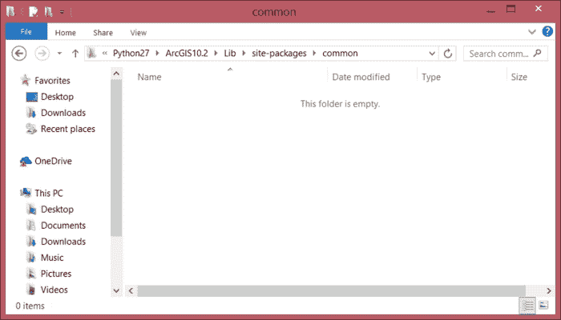
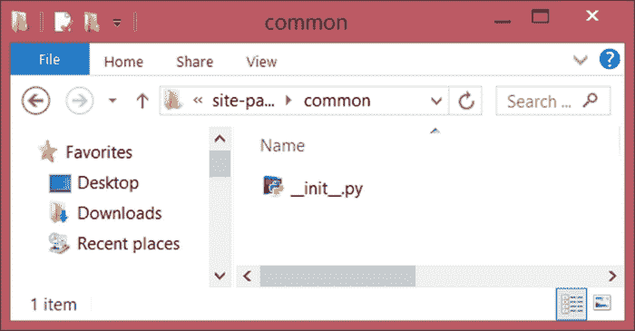
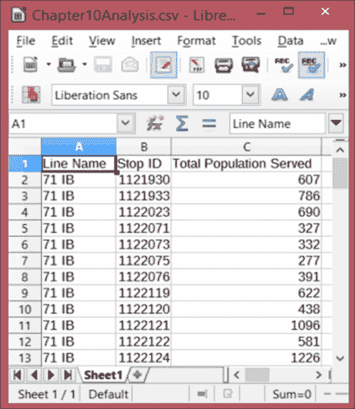

# 第十章。高级几何对象方法

在本章中，我们将讨论之前在第六章中讨论过的高级几何对象方法，即*使用 ArcPy 几何对象*。本书的目标是介绍 ArcPy 及其模块，同时展示如何在创建持久的 GIS 工作流程时应用这些工具。进行一次分析是好的，但反复进行，只需点击一下按钮，就更好了。使分析结果以行业标准格式共享也是理想的选择。在 ArcGIS 世界中，实现这一目标最佳的方式是使用 ArcPy 和利用几何对象方法的脚本工具。

本章将涵盖以下主题：

+   将常用函数添加到 Python 路径中的模块

+   通过添加点生成使分析更高级

+   高级多边形对象方法

+   使用 XLWT 创建 Excel 电子表格

# 创建 Python 模块

创建可重用代码的重要一步是将组件函数打包成一个模块，这样任何脚本都可以从 Python 路径中调用它。首先，我们需要在`site-packages`文件夹中创建一个文件夹，Python 模块在下载并使用 Python 模块过程提取时放置在这个文件夹中，或者当运行包含在共享模块中的`setup.py`脚本时。在 Windows 资源管理器中打开`site-packages`文件夹，导航到`C:\Python27\ArcGIS10.2\Lib\site-packages`（如果你使用的是标准 Python 2.7 安装，则为`C:\Python27\Lib\site-packages`）。一旦进入文件夹，创建一个名为**common**的新文件夹，如图所示：

模块将一个或多个脚本中的函数打包到一个文件夹中，以便与他人共享（尽管它们通常依赖于其他模块才能运行）。我们已经使用了一些内置模块，如`csv`模块和第三方模块如 ArcPy。让我们探索它们的构建，以了解模块是如何打包以供使用和共享的。

### 注意

许多模块并没有放置在`site-packages`文件夹中，但它们需要修改 Python 路径才能使它们**可导入**。将模块放置在`site-packages`文件夹中可以消除这一要求。

在 Windows 资源管理器中打开`site-packages`文件夹，导航到`C:\Python27\ArcGIS10.2\Lib\site-packages`（如果你使用的是标准 Python 2.7 安装，则为`C:\Python27\Lib\site-packages`）文件夹。一旦进入文件夹，创建一个名为**common**的新文件夹，如图所示：



## __init__.py 文件

在这个文件夹中，需要添加一个特殊文件，以便 Python 能够识别该文件夹为模块。这个文件称为`__init__.py`，它利用 Python 的一个特殊属性，即`magic`对象或属性，这些属性是内置到 Python 中的。这些`magic`对象使用前导和尾随的双下划线来避免与自定义函数混淆。

### 注意

注意，这些是**双下划线**；单下划线通常用于自定义 Python 类中的所谓私有函数。

`__init__.py` 文件用于指示该文件夹是一个模块（使其可以通过 `import` 关键字导入），并通过调用它可能依赖的任何模块来初始化该模块。然而，没有要求在 `__init__.py` 文件中添加导入命令；它可以是空文件，并且仍然会执行我们所需的模块识别功能。

1.  打开 **IDLE** 或 **Aptana** 或您喜欢的 IDE，在名为 **common** 的文件夹中添加一个新的 `Python` 文件，并将其命名为 `__init__.py`。这个文件现在将保持为空。

1.  现在我们已经初始化了模块，我们需要创建一个脚本，用于存放我们的公共函数。让我们称它为 `useful.py`，因为这些函数将在这个分析和其他分析中非常有用。

1.  下一步是将我们在早期章节中创建的函数转移过来。这些宝贵的函数被锁定在这些脚本中，所以通过将它们添加到 `useful.py`，我们将使它们对所有其他我们编写的脚本可用。

    ### 注意

    一个重要的函数是来自 第四章 的 `formatSQLMultiple` 函数，它使用模板和数据列表生成 SQL 语句。通过将其添加到 `useful.py`，我们将在需要 SQL 语句时随时可以调用该函数。

1.  打开脚本 `Chapter4Modified2.py`，复制函数，然后将其粘贴到 `useful.py` 中。它没有依赖项，因此不需要修改。

那个脚本中另一个有用的函数是 `formatIntersect` 函数，它生成在运行 ArcToolbox Intersect 工具时使用的文件路径字符串。虽然自从该函数设计以来我们已经深入到 ArcPy 中，并且不再需要在我们的公交车站分析中调用 Intersect 工具，但这并不意味着我们将来永远不会需要调用它。它仍然很有用，应该添加到 `useful.py` 中。

我们可以访问的最后一个函数是 `createCSV()` 函数。从 `Chapter4Modified.py` 复制并粘贴到 `useful.py` 中。但是，为了避免需要单独导入 CSV 模块，我们需要稍微修改该函数。以下是它应该看起来像什么：

```py
def createCSV(data, csvname, mode ='ab'):
 'creates a csv file'
 import csv
 with open(csvname, mode) as csvfile:
 csvwriter = csv.writer(csvfile, delimiter=',')
 csvwriter.writerow(data)
 del csv

```

通过导入然后删除 `csv` 模块，我们能够使用它来生成 `csv` 文件，并使用 `del` 关键字从内存中移除该模块。

现在我们已经将将要重用的函数保存在 `useful.py` 脚本中，在公共模块内部，让我们探索如何使用 Python 的 `import` 方法调用它们。打开 Python 可执行文件，使用 `Python.exe` 或 IDLE，或者在 Aptana 中的内置终端。在三个箭头提示符（**>>>**）中，输入以下行：

```py
>>> from common.useful import createCSV>>>

```

如果出现第二个三重箭头形状的提示，则表示函数已正确从模块中导入。要在脚本中导入此模块中的函数，请使用相同的导入结构，并列出所需的函数，使用逗号分隔：

```py
from common.useful import createCSV, formatSQLMultiple

```

脚本`useful.py`中的函数使用 Python 点符号调用。这是由于`__init__.py`文件告诉 Python，文件夹`common`现在是一个模块，并且它应该期望存在一个名为`useful`的方法，其中包含`createCSV`和`formatSQLMultiple`函数。

# 添加高级分析组件

我们用来介绍 ArcPy 的公交车站分析可以进一步扩展以生成更精确的结果。为了更好地估计每个公交车站服务的真实人数，让我们添加一个函数，该函数将在考虑的区块内生成随机点，同时消除公园和其他不含住宅的区域。

要做到这一点，我们需要从`San Francisco`地理数据库中引入一个新的数据集，即`RPD_Parks`要素类。通过使用这个要素类来减少我们分析考虑的区域，我们可以为每个公交车站生成一个更现实的客运服务区人口评估。

当运行空间分析时，使用**ArcToolbox 擦除工具**擦除`RPD_Parks`多边形所表示的区域通常是一个常规步骤，但这个选项存在一些缺点。第一个缺点是**擦除**工具仅在 ArcGIS for Desktop 高级许可证级别下可用，这使得它仅对某些用户可用。第二个缺点是工具会产生一个中间数据集，在可能的情况下应尽量避免。

使用 ArcPy 将使我们能够避免这两个缺点。我们可以创建一个脚本，该脚本将仅在未与`RPD_Parks`要素类相交的普查区块多边形的一部分内生成随机点。为此，我们将深入到 ArcPy `Polygon`对象的方法中。

## 高级多边形对象方法

在第六章*使用 ArcPy 几何对象*中，我们开始探索 ArcPy 几何对象以及如何使用它们的方法来执行内存中的空间分析。介绍了**缓冲区**和**交集**方法，并使用这些方法生成分析结果。接下来，我们将讨论更多这些方法，并展示它们如何有助于改进内存中的空间分析。

`Polygon` 对象有一个名为 `Difference` 的方法，允许我们找到两个多边形相交时的非相交区域。将 `census block polygon` 和 `park polygon` 作为参数传递将返回（作为多边形对象）第一个参数中不发生重叠的部分。另一个重要的方法是 `Overlaps`，它用于测试两个几何对象（点、线或多边形）是否相交。如果存在重叠，则 `Overlaps` 方法将返回 **True**，如果没有重叠，则返回 **False**。`Union` 也是一个重要的方法，将在本章中使用，它允许将两个几何对象 **合并** 成一个对象。

让我们探索这些重要的方法。为了找到两个多边形对象的非相交区域，以下函数结合了 `Overlaps` 和 `Difference` 方法：

```py
def nonIntersect(poly1,poly2):
 'returns area of non-intersect between two polygons'
 if poly1.overlaps(poly2) == True:
 return poly1.difference(poly2)

```

函数 `nonIntersect` 接受两个 `Polygon` 对象作为参数。第一个参数，`poly1`，是相交的多边形（人口普查区块多边形），第二个参数，`poly2`，是要检查重叠的多边形。if 条件语句使用 `Overlaps` 方法，如果两个参数之间存在重叠，则返回 **True**。如果存在任何重叠，则 `difference()` 方法将返回非相交区域作为多边形对象。然而，这个函数应该扩展以涵盖 `Overlaps()` 方法返回 False 的情况：

```py
def nonIntersect(poly1,poly2):
 'returns area of non-intersect between two polygons'
 if poly1.overlaps(poly2) == True:
 return poly1.difference(poly2)
 else:
 return poly1

```

当 `Overlaps` 方法返回 `False` 时，函数现在将返回第一个参数，这表明两个多边形对象之间没有重叠。现在这个函数已经完成，可以在分析中使用。因为 `nonIntersect()` 是一个可以在其他空间分析中使用的函数，所以复制它并将其添加到 `useful.py` 中。

## 生成随机点以表示人口

改进公交车站分析的下一步是生成点以表示每个人口普查区块的人口。虽然随机点不能完美地表示人口，但它将作为良好的人口模型，并允许我们避免对每个由公交车站服务的区块进行面积平均以找到粗略的人口。ArcToolbox 数据管理工具集中的 `CreateRandomPoints` 工具使生成点变得简单。

工具 `CreateRandomPoints` 接受一系列必需和可选参数。由于该工具生成要素类，必需参数是要素类将被放置的工作空间和要素类的名称。感兴趣的可选参数是约束要素类和要生成的点数。由于我们希望在分析的中途步骤中避免创建新的要素类，我们可以利用 `in_memory` 工作空间，这意味着要素类将在内存中生成，这意味着它们不会被写入硬盘。

由于需要为每个普查区生成特定数量的随机点，我们应该创建一个函数，该函数将接受一个约束多边形和表示每个普查区的总人口数。然而，`in_memory`工作空间并不适用于所有情况，因此我们将提供工作空间参数的默认值：

```py
def generatePoints(fc, pop,constrant, workspace='in_memory'):
 'generate random points'
 import os, arcpy
 arcpy.CreateRandomPoints_management(workspace, fc,                  constrant, "", pop, "")
 return os.path.join(workspace, fc)

```

该函数将在所需的工作空间中创建要素类，并将返回要素类的路径（使用`os`模块连接），以便在脚本的其他部分中使用。此函数也可重用，应将其复制到`useful.py`文件中。

## 在脚本中使用函数

现在我们已经创建了帮助我们在脚本中运行更高级空间分析的函数，让我们将它们添加到脚本中，并添加一些`SearchCursors`来遍历数据：

```py
# Import the necessary modules
import arcpy, os
from common.useful import nonIntersect, generatePoints,createCSV

# Add an overwrite statement
arcpy.env.overwriteOutput = True

# Define the data inputs
busStops = r'C:\Projects\SanFrancisco.gdb\SanFrancisco\Bus_Stops'
parks = r'C:\Projects\SanFrancisco.gdb\SanFrancisco\RPD_Parks'
censusBlocks = r'C:\Projects\SanFrancisco.gdb\SanFrancisco\CensusBlocks2010'
csvName = r'C:\Projects\Output\Chapter10Analysis.csv'

# Create the spreadsheet in memory and add field headers
headers = 'Line Name','Stop ID', 'Total Population Served'
createCSV(headers,csvName,mode='wb')

# Copy the census block data into a feature layer
arcpy.MakeFeatureLayer_management(censusBlocks,'census_lyr')

# Copy the park data geometries into a list and union them allparkGeoms = arcpy.CopyFeatures_management(parks,arcpy.Geometry())
parkUnion = parkGeoms[0]
for park in parkGeoms[1:]:
 parkUnion = parkUnion.union(park)

# Create a search cursor to iterate the bus stop data
sql = "NAME = '71 IB' AND BUS_SIGNAG = 'Ferry Plaza'"
with arcpy.da.SearchCursor(busStops, ['NAME','STOPID','SHAPE@'],sql) as cursor:
 for row in cursor:

lineName = row[0]
 stopID = row[1]
 stop = row[2]
 busBuf = stop.buffer(400)
 # Select census blocks that intersect the bus buffer
 arcpy.SelectLayerByLocation_management("census_lyr","intersect", busBuf,'','NEW_SELECTION')
 # Use a second Cursor to find the selected population
 totalPopulation = 0
 with arcpy.da.SearchCursor("census_lyr",['SHAPE@','POP10',
 'BLOCKID10']) as ncursor:
 for nrow in ncursor:
 block = nrow[0]
 checkedBlock = nonIntersect(block, parkUnion)

blockName = nrow[2]
 population = nrow[1]
 if population != 0:
 points = generatePoints("PopPoints",
 population,checkedBlock)
 pointsGeoms = arcpy.CopyFeatures_management(points,arcpy.Geometry())
 pointsUnion = pointsGeoms[0]
 for point in pointsGeoms[1:]:
 pointsUnion = pointsUnion.union(point)
 pointsInBuffer=busBuf.intersect(pointsUnion, 1)
 intersectedPoints = pointsInBuffer.pointCount
 totalPopulation += intersectedPoints
 # Add the tallied data to the spreadsheet

data = lineName, stopID, totalPopulation
 print 'data written', data
 createCSV(data, csvName)

#Start the spreadsheet to see the results
os.startfile(csvName)

```

让我们逐节回顾代码，因为一开始要吸收的内容很多。

导入部分是我们调用常规模块，如 arcpy 和 os，以及`common`模块中的自定义函数：

```py
import arcpy, os
from common.useful import nonIntersect
from common.useful import generatePoints
from common.useful import formatSQLMultiple
from common.useful import nonIntersectcreateCSV

```

如前所述，`common`模块的`useful`方法中的函数使用 Python 点符号和`from … import ...`导入风格调用，使它们直接可用。许多函数可以在一行中导入，用逗号分隔，或者像这里一样单独导入。

下一个设置 ArcPy 环境`overwrite`属性为`True`的行非常重要，因为它允许我们覆盖创建随机点操作的结果。如果不覆盖，函数结果将使用所有可用内存并导致脚本失败：

```py
arcpy.env.overwriteOutput = True

```

### 注意

在此覆盖设置上要小心，因为它将允许覆盖任何要素类。我们所有的输出都在内存中，并且只为分析生成，所以这里几乎不需要担心，但运行脚本时要确保没有重要内容被覆盖。

下一个部分是将在脚本中使用的一组变量，并将初始化用于收集分析结果的电子表格：

```py
busStops = r'C:\PacktDB.gdb\SanFrancisco\Bus_Stops'
parks = r'C:\PacktDB.gdb\SanFrancisco\RPD_Parks'
censusBlocks = r'C:\PacktDB.gdb\SanFrancisco\CensusBlocks2010'
csvName = r'C:\Projects\Output\Chapter10Analysis.csv'
headers = 'Line Name','Stop ID', 'Total Population Served'
createCSV(headers,csvName,mode='wb')

```

这里分配给变量的文件路径如果要将此转换为脚本工具，可以替换为 ArcPy 参数，但到目前为止，硬编码的路径是可行的。在变量下方，创建结果电子表格并添加列字段标题。

值得注意的是，电子表格是使用`wb`模式创建的。这种以二进制文件打开的模式称为`wb`（写二进制），用于创建新文件。必须显式传递给`createCSV()`函数作为默认模式参数是`ab`（追加二进制），如果不存在将创建新文件，或者添加到已存在的文件中（第三种二进制模式是**rb**或**read binary**，用于打开现有文件）。

接下来的几行代码使特征类中的数据在内存中可用。人口普查区块数据被转换为`Feature Layer`，而`RPD_Parks`数据则被读取到内存中，作为一系列`Polygon`对象，然后这些对象被合并成一个单一的、统一的`Polygon`对象，称为`parkUnion`：

```py
arcpy.MakeFeatureLayer_management(censusBlocks,'census_lyr')parkGeoms = arcpy.CopyFeatures_management(parks,arcpy.Geometry())
parkUnion = parkGeoms[0]
for park in parkGeoms[1:]:
 parkUnion = parkUnion.union(park)

```

通过使用**数据管理**工具集中的`CopyFeatures`工具，`parkGeoms`变量接收`RPD_Parks`特征类中每行数据的几何形状列表。然而，我们不想必须遍历公园几何形状来与每个区块进行比较，因此调用`Union`方法从整个列表创建一个`Polygon`对象。通过将列表的第一个成员分配给`parkUnion`变量，然后遍历`parkGeoms`列表逐个合并其他几何形状，最终得到一个代表`RPD_Parks`数据集中所有公园的`Polygon`对象。

一旦所有模块都已导入并且变量已分配，我们就可以进入数据访问`SearchCursor`的`for`循环以开始分析。然而，我们不想对所有公交车站进行分析，因此我们将使用 SQL 语句的`where`子句来限制分析范围到单条公交线：

```py
sql = "NAME = '71 IB' AND BUS_SIGNAG = 'Ferry Plaza'"
with arcpy.da.SearchCursor(busStops, ['NAME','STOPID','SHAPE@'],sql) as cursor:
 for row in cursor:
 lineName = row[0]
 stopID = row[1]
 stop = row[2]
 busBuf = stop.buffer(400)
 arcpy.SelectLayerByLocation_management("census_lyr","intersect,busBuf,'','NEW_SELECTION')
 totalPopulation = 0

```

迭代的第一部分涉及进入`for`循环并将每行的值分配给一个变量。在`SearchCursor`返回的`PointGeometry`对象周围创建一个`400`英尺的`Polygon`对象缓冲区。然后，使用这个缓冲区与人口普查区块的`Feature Layer`相交，以找到并选择所有与缓冲区相交的区块。为了统计每个缓冲区服务的人口总数，创建了变量`totalPopulation`。

一旦执行了选择操作，就可以使用第二个`SearchCursor`遍历所选区块，以检索它们的 人口值和用于随机点生成的`Polygon`对象：

```py
with arcpy.da.SearchCursor("census_lyr",['SHAPE@','POP10',
 'BLOCKID10']) as ncursor:
 for nrow in ncursor:

block = nrow[0]
 checkedBlock = nonIntersect(block, parkUnion)
 blockName = nrow[2]
 population = nrow[1]

```

在这个迭代过程中，一旦检索到每个区块（以`Polygon`对象的形式），就使用之前创建的`nonIntersect`函数将该区块与合并的公园几何形状进行比对。这确保了点只会在非公园区域内创建，即更有可能代表人们居住的地方。同时也会检索人口值。

一旦评估了约束多边形（例如人口普查区块），移除了任何潜在的公园部分，并且获得了人口值，就可以使用`generatePoints()`函数生成随机点：

```py
if population != 0:
 points = generatePoints("PopPoints",population,checkedBlock)
 pointsGeoms = arcpy.CopyFeatures_management(points,arcpy.Geometry())
 pointsUnion = pointsGeoms[0]
 for point in pointsGeoms[1:]:
 pointsUnion = pointsUnion.union(point)
 pointsInBuffer = busBuf.intersect(pointsUnion,1)
 intersectedPoints = pointsInBuffer.pointCount
 totalPopulation += intersectedPoints

```

`generatePoints()`函数需要三个参数。第一个是要生成的特征类的名称；每次生成时都会覆盖，从而避免为每个区块创建一个`in_memory`特征类，以避免过度使用内存。其他两个参数是人口值和约束多边形对象。

一旦这些参数传递给函数，它将返回新创建的特征类的文件路径，并将该文件路径分配给变量 points。然后使用`CopyFeatures`工具从 points 中提取几何形状，并将其分配给变量`points`。再次使用`Union`方法创建一个单一的、统一的`PointGeometry`对象，该对象将与公交车站缓冲区相交。一旦运行了此交集，结果几何形状将被分配给`pointsInBuffer`变量，并使用`pointCount`方法找到在缓冲区域内生成的点的数量。这是我们估计的人口普查区块内的人口，该值被添加到`totalPopulation`变量中，最终得出距离公交车站 400 英尺内的总估计人口。

脚本的最后几行演示了如何将数据收集到一个元组中，并将其传递给`createCSV()`模块以写入我们的最终电子表格：

```py
 data = lineName, stopID,totalPopulation
 print 'data written', data
 createCSV(data, csvName)
os.startfile(csvName)

```

最后一行，`os.startfile(csvName)`，使用`os`模块的`startfile`方法在分析完成后自动打开电子表格。在这种情况下，电子表格`C:\Projects\Output\Chapter10Analysis.csv`已填充了分析结果，并打开以显示这些结果。然而，用户可能需要指示这些行是逗号分隔值，才能打开脚本。



而不是创建逗号分隔值，我们可以利用 ArcGIS 10.2 和 ArcPy 安装时安装的另一个 Python 模块。这个模块被称为`XLWT`，用于生成 Excel 电子表格，并且与 Excel 电子表格读取模块`XLRD`一起，是 Python 用户可用最有用的模块之一。

## 使用 XLWT 创建 XLS

XLWT 是一个功能强大的模块，允许多种样式选项。然而，对于我们的目的，我们可以忽略这些选项，创建一个将生成我们的空间分析结果的电子表格的函数。当然，此函数可以添加到`common.useful`中：

```py
def generateXLS(indatas, sheetName, fileName):
 import xlwt
 workbook = xlwt.Workbook()
 sheet = workbook.add_sheet(sheetName)
 for YCOUNTER, data in enumerate(indatas):
 for XCOUNTER, value in enumerate(data):
 sheet.write(YCOUNTER, XCOUNTER, value)
 workbook.save(fileName)

```

此函数需要三个参数，`indatas`-一个包含可迭代数据行的列表，一个字符串工作表名称，以及一个以`.xls`扩展名结尾的字符串文件名。

要使用此函数，将其添加到`common.useful`中。一旦添加，复制并重命名较旧的脚本分析，以便进行调整：

```py
import arcpy, os
from common.useful import nonIntersect, generatePoints, generateXLS

arcpy.env.overwriteOutput = True

busStops = r'C:\Projects\PacktDB.gdb\SanFrancisco\Bus_Stops'
parks = r'C:\Projects\PacktDB.gdb\SanFrancisco\RPD_Parks'
censusBlocks = r'C:\Projects\PacktDB.gdb\SanFrancisco\CensusBlocks2010'
xlsName = r'C:\Projects\Output\Chapter10Analysis.xls'

headers = 'Line Name','Stop ID', 'Total Population Served'
indatas = [headers]

arcpy.MakeFeatureLayer_management(censusBlocks,'census_lyr')parkGeoms = arcpy.CopyFeatures_management(parks,arcpy.Geometry())
parkUnion = parkGeoms[0]
for park in parkGeoms[1:]:

parkUnion = parkUnion.union(park)

sql = "NAME = '71 IB' AND BUS_SIGNAG = 'Ferry Plaza'"
with arcpy.da.SearchCursor(busStops, ['NAME','STOPID',
 'SHAPE@'],sql) as cursor:
 for row in cursor:
 lineName = row[0]
 stopID = row[1]
 stop = row[2]
 busBuf = stop.buffer(400)
 arcpy.SelectLayerByLocation_management("census_lyr","intersect",busBuf,'','NEW_SELECTION')
 totalPopulation = 0
 with arcpy.da.SearchCursor("census_lyr", ['SHAPE@','POP10',
 'BLOCKID10']) as ncursor:
 for nrow in ncursor:

block = nrow[0]
 checkedBlock = nonIntersect(block, parkUnion)
 blockName = nrow[2]
 population = nrow[1]
 if population != 0:
 points = generatePoints("PopPoints",population,checkedBlock)

 pointsGeoms = arcpy.CopyFeatures_management(points,arcpy.Geometry())
 pointsUnion = pointsGeoms[0]
 for point in pointsGeoms[1:]:
 pointsUnion = pointsUnion.union(point)
 pointsInBuffer = busBuf.intersect(pointsUnion,1)

intersectedPoints = pointsInBuffer.pointCount
 totalPopulation += intersectedPoints
 data = lineName, stopID, totalPopulation
 indatas.append(data)
generateXLS(indatas, "Results", xlsName)
os.startfile(xlsName)

```

我们现在可以像生成`CSV`文件一样轻松地生成 Excel 电子表格，同时使用可重用的函数。我们现在能够快速执行可重复的空间分析，并以行业标准格式生成结果。

# 摘要

在本章中，我们探讨了如何创建模块和可重用的函数，这些函数将节省未来的脚本编写时间，使我们能够避免重写这些有用的函数。我们还进一步探讨了通过 ArcPy 几何对象可用的方法，包括 `Intersect`（交集）、`Overlaps`（重叠）和 `Union`（并集）方法。我们创建了一个不将要素类写入磁盘的空间分析，这样分析时间就减少了，并且避免了不必要的文件。最后，我们探讨了如何使用 `XLWT` 模块生成 Excel 电子表格，以便分析结果可以以行业标准格式共享。

在下一章中，我们将探讨如何使用 ArcPy 与 ArcGIS for Desktop 的扩展程序如网络分析师和空间分析师进行交互。通过在脚本中整合它们的功能，我们进一步增强了创建快速且可重复的空间分析工作流程的能力。
