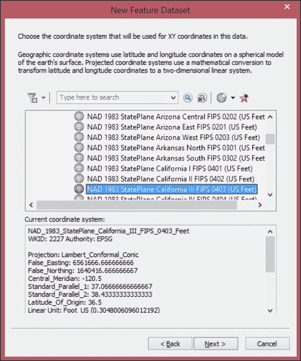
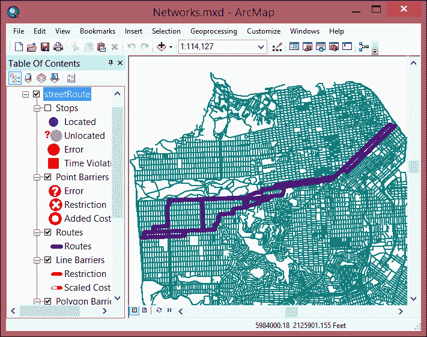

# 第十一章：使用 ArcPy 的网络分析师和空间分析师

使用 ArcGIS for Desktop 扩展也受益于 Python 和 ArcPy 的强大功能。使用街道数据集或公交车路线数据集通过 ArcPy 建模路线的能力将帮助我们把整个工作流程转换为脚本工具。网络分析师和空间分析师都内置了 ArcPy 的访问模块，以增强对可用工具、方法和属性的掌控。

本章将涵盖以下主题：

+   创建简单的网络数据集

+   检查扩展

+   ArcPy 网络分析师模块

+   ArcPy 空间分析师模块

# 网络分析师扩展

ESRI 的网络分析师扩展是一个强大的工具，可以在 ArcGIS 中启用路由和网络连接功能。当用于街道路由时，该扩展允许用户在道路网络中找到两点之间的最短路径。路线可以由多个因素限制，例如交通或左转，以更好地模拟道路旅行。使用其他类型的网络，如水管网络或电网，也可以运行类似的分析。

# 使用网络分析师

要使用网络分析师扩展，需要 ArcGIS for Desktop 高级许可证。在 ArcCatalog 或 ArcMap 中，点击**自定义**菜单并选择**扩展**。一旦扩展菜单打开，点击旁边的复选框以启用**网络分析师扩展**。

## 创建要素数据集

使用网络数据集的第一步是在要素数据集中创建一个。为此，我们将生成一个要素数据集来保存感兴趣的数据。在包含**公交站**数据的**文件**地理数据库上右键单击，然后从**新建**菜单中选择**要素数据集**。将其命名为`Chapter11Results`并点击**下一步**。



接下来，选择**空间参考系统**（**SRS**）。在这种情况下，我们将使用旧金山的本地州平面区域的空间参考系统。它是一个投影坐标系统，因此选择该文件夹，然后点击`State Plane`文件夹。一旦打开，选择名为**NAD 1983(US Feet)**的文件夹。从可用的参考系统中，选择名为**NAD 1983 StatePlane California III FIPS 0403 (US Feet)**的选项。点击**下一步**进入下一个菜单。

### 注意

该系统也被称为 2227，在**已知 ID**（**WKID**）或**欧洲石油调查组**（**EPSG**）系统中。有关这些代码的更多信息可在[`spatialreference.org`](http://spatialreference.org)网站找到，该网站用于查找全球使用的数千个空间参考系统。

点击**垂直坐标系统**文件夹，然后选择**北美洲**文件夹。选择**北美洲 1988 年垂直基准（英尺）**（**NAVD 1988 US survey feet**）。这将使得垂直和水平线性单位处于相同的测量系统。点击**下一步**进入下一个菜单。

下一页上的容限也非常重要，但在此处我们不会详细说明。接受默认设置并点击**完成**以最终确定**要素数据集**。

## 导入数据集

将公交车站、街道和公交路线要素类导入到`Chapter 11 Results Feature Dataset`中。右键单击数据集并选择**导入**，然后**要素类（单个**）。逐个添加要素类，并给它们一个新名字，以保持它们与**SanFrancisco Feature Dataset**中包含的版本分开。导入它们将确保它们位于正确的 SRS 中，并且可以创建网络数据集。

## 创建网络数据集

现在我们有了数据容器，我们可以从街道要素类创建一个网络数据集。右键单击**Chapter11Results**要素数据集并选择**新建**，然后选择**网络数据集**。


将**网络数据集**命名为`Street_Network`并点击**下一步**。选择**街道要素类**作为将参与网络数据集的类，并点击**下一步**进入下一个菜单。选择**全局转弯**来模拟网络内的转弯。在下一个菜单中，使用默认的连通性设置。然后，接受**使用几何中的 Z 坐标值**设置。接受默认的成本限制和驾驶方向设置，最后点击**完成**以生成网络数据集。然后，使用最终菜单构建网络数据集。网络数据集已准备好使用。

## 使用 ArcPy 访问网络数据集

现在必要的设置已经完成，可以将 street_network 网络数据集添加到脚本中以生成路线。因为这是一个简单的分析，将使用的唯一阻抗值将是街道段落的长度。通过使用`SearchCursor`，可以访问并添加来自公交车站的`PointGeometry`对象作为要搜索的位置：

```py
import arcpy
arcpy.CheckOutExtension("Network")
busStops = r'C:\Projects\PacktDB.gdb\Chapter11Results\BusStops'
networkDataset = r'C:\Projects\PacktDB.gdb\Chapter11Results\street_network'
networkLayer = "streetRoute"
impedance = "Length"
routeFile = "C:\Projects\Layer\{0}.lyr".format(networkLayer)
arcpy.MakeRouteLayer_na(networkDataset,
 networkLayer, impedance)
print 'layer created'
sql = "NAME = '71 IB' AND BUS_SIGNAG = 'Ferry Plaza'"
with arcpy.da.SearchCursor(busStops,['SHAPE@', 'STOPID'],sql) as cursor:
 for row in cursor:
 stopShape = row[0]
 print row[1]
 arcpy.AddLocations_na(networkLayer,'Stops',stopShape, "", "") 
 arcpy.Solve_na(networkLayer,"SKIP")
arcpy.SaveToLayerFile_management(networkLayer,routeLayerFile,"RELATIVE")
print 'finished'

```

### 脚本分解

让我们剖析这个脚本，一旦完成，它将生成一个包含添加的停靠点和街道上的路线的图层文件，以最佳方式从起点停靠站到达目的地停靠站。

脚本首先导入 arcPy 模块。下一行允许我们使用网络分析扩展：

```py
arcpy.CheckOutExtension("Network")

```

使用`arcpy.CheckOutExtension()`方法调用网络分析扩展时，需要将正确的关键字作为参数传递给方法。一旦调用，扩展的工具就可以在脚本中调用和执行。

将公交车站要素类和街道网络网络数据集分配给变量后，它们可以传递给 ArcPy 的 `MakeRouteLayer_na()` 方法，以及一个表示阻抗值的变量：

```py
arcpy.MakeRouteLayer_na(networkDataset,
 networkLayer, impedance)

```

`MakeRouteLayer_na` 工具在内存中生成一个 `RouteLayer`。这个空白层需要填充停靠点以生成它们之间的路线（s）。为此，我们需要一个 `SearchCursor` 来访问 `PointGeometry` 对象，以及一个 SQL 语句，该语句将返回的结果限制在感兴趣的线上：

```py
sql = "NAME = '71 IB' AND BUS_SIGNAG = 'Ferry Plaza'"
with arcpy.da.SearchCursor(busStops,['SHAPE@', 'STOPID'],sql) as cursor:
 for row in cursor:
 stopShape = row[0]
 print row[1]
 arcpy.AddLocations_na(networkLayer,'Stops',stopShape,"", "")

```

搜索游标将允许当与 `AddLocations` 工具结合使用时，填充由 MakeRouteLayer 工具生成的层的 **Stops** 子层。一旦填充，`RouteLayer` 可以传递给 **Solve** 工具以找到感兴趣点之间的路线。再次强调，路线是通过在两点之间找到最低的 **阻抗** 来解决的。在这个例子中，唯一的阻抗是段长度，但如果有数据可用，它可能是交通、海拔或其他限制类型：

```py
 arcpy.Solve_na(networkLayer,"SKIP")
arcpy.SaveToLayerFile_management(networkLayer,routeLayerFile,"RELATIVE")

```

最终结果是使用 `SaveToLayerFile` 工具写入磁盘的图层文件。



# 网络分析模块

为了使网络分析扩展的使用更加 **Pythonic**，较新的网络分析器 (`na`) 模块调整了访问与 ArcToolbox 网络分析工具相对应的方法的方式。现在，不是直接从 ArcPy 调用工具，而是将工具作为 `na` 模块的方法。移除网络分析工具集的首字母缩写词也减少了混淆，并使得记住方法名称更容易。如下所示，可以看到差异：

```py
import arcpy
arcpy.CheckOutExtension("Network")
busStops = r'C:\Projects\SanFrancisco.gdb\SanFrancisco\Bus_Stops
networkDataset = r'C:\Projects\SanFrancisco.gdb\Chapter11Results\street_network'
networkLayer = "streetRoute"
impedance = "Length"
routeLayerFile = "C:\Projects\Layer\{0}_2.lyr".format(networkLayer)arcpy.na.MakeRouteLayer(networkDataset, networkLayer,impedance)
print 'layer created'
sql = "NAME = '71 IB' AND BUS_SIGNAG = 'Ferry Plaza'"
with arcpy.da.SearchCursor(busStops,['SHAPE@','STOPID'],sql) as cursor:
 for row in cursor:
 stopShape = row[0]
 print row[1]
 arcpy.na.AddLocations(networkLayer,'Stops', stopShape, "", "")
arcpy.na.Solve(networkLayer,"SKIP")
arcpy.management.SaveToLayerFile(networkLayer,routeLayerFile,"RELATIVE")
print 'finished'

```

工具将产生与原始脚本相同的层输出，但将网络分析工具重新组织到 `na` 模块中使得代码更加逻辑。例如，使用 `arcpy.na.Solve()` 调用 `Solve` 比使用 `arcpy.Solve_na()` 更有意义，因为这强调了 `Solve` 是网络分析器 (`na`) 模块的方法。随着 ArcPy 的不断发展，我预计将发生更多的 **Pythonic** 代码重组。

# 访问空间分析扩展

空间分析扩展对于对栅格和矢量数据集进行分析非常重要，但它通常用于执行地表分析和栅格数学。通过使用 ArcPy，这些操作变得更加容易，因为空间分析工具箱中所有可用的工具都通过空间分析访问模块公开。这包括栅格计算器工具，通过使用简单表达式中的工具和运算符，使得地图代数变得简单。

## 将海拔添加到公交车站

高程栅格 "sf_elevation" 已从 NOAA 下载并添加到文件地理数据库中。然而，它覆盖了整个湾区，我们应该编写一个脚本来仅提取旧金山城市的某个区域，这将减少我们脚本运行所需的时间。我们将使用 SQL 语句作为 `where` 子句来限制结果仅限于南市场（SoMa）街区。为此，让我们利用搜索游标和空间分析访问模块的 Extract by Polygon 属性：

```py
import arcpy
arcpy.CheckOutExtension("Spatial")
busStops = r'C:\Projects\PacktDB.gdb\SanFrancisco\Bus_Stops'
sanFranciscoHoods = r'C:\Projects\PacktDB.gdb\SanFrancisco\SFFind_Neighborhoods'
sfElevation = r'C:\Projects\PacktDB.gdb\sf_elevation'
somaGeometry = []
sql = "name = 'South of Market'"
with arcpy.da.SearchCursor(sanFranciscoHoods,['SHAPE@XY'],sql,None, True) as cursor:
 for row in cursor:
 X = row[0][0]
 Y = row[0][1]
 somaGeometry.append(arcpy.Point(X,Y))
somaElev = arcpy.sa.ExtractByPolygon(sfElevation,somaGeometry,"INSIDE")
somaOutPath = sfElevation.replace('sf_elevation','SOMA_elev')
somaElev.save(somaOutPath)
print 'extraction finished'

```

`ExtractByPolygon()` 方法有些误导，因为它不接受 `Polygon` 对象作为参数。相反，它需要一个表示我们想要提取的区域顶点的 `Point` 对象列表。当 `SearchCursor` 遍历街区数据集时，游标会返回一个 `Polygon` 对象。幸运的是，`SearchCursor` 有一个我们尚未探索的最终参数，允许我们提取构成 `Soma` 街区多边形的单个点或顶点。通过将搜索游标的可选 Explode to Points 参数（它将多边形对象转换为每个顶点的坐标对）设置为 `True`，可以通过将每个返回顶点的 `XY` 值传递给 `arcpy.Point` 方法来生成点对象。这些 `Point()` 对象被追加到 `somaGeometry` 列表中，然后传递给空间分析访问模块的 `ExtractByPolygon` 方法。

### 注意

使用多边形对象而不是点对象将返回一个错误。

## 使用地图代数生成英尺高程

我们现在有一个栅格可以用来提取高程值。然而，原始栅格和生成的 SoMa 街区栅格都包含以米为单位的高程值，最好将它们转换为英尺，以保持与公交车站投影的一致性。让我们使用栅格数学和 `Times()` 方法将值从米转换为英尺：

```py
somaOutPath = sfElevation.replace('sf_elevation','SOMA_elev')
outTimes = arcpy.sa.Times(somaOutPath, 3.28084)
somaFeetOutPath = sfElevation.replace('sf_elevation','SOMA_feet')
outTimes.save(somaFeetOutPath)

```

`Times()` 方法生成一个新的栅格，以获取我们需要的感兴趣公交车站的地面高程值。

## 添加公交车站和获取高程值

现在我们已经生成了一个可以用来查找英尺高程值的栅格，我们需要添加一个新的 `arcpy.sa()` 方法来生成点。`ExtractValuesToPoints()` 方法将生成一个新的公交车站要素类，其中包含一个新的字段，用于存储高程值：

```py
with arcpy.da.SearchCursor(sanFranciscoHoods,['SHAPE@'],sql) as cursor:
 for row in cursor:
 somaPoly = row[0]
arcpy.MakeFeatureLayer_management(busStops, 'soma_stops')
arcpy.SelectLayerByLocation_management("soma_stops", "INTERSECT",somaPoly)
outStops = r'C:\Projects\PacktDB.gdb\Chapter11Results\SoMaStops'
arcpy.sa.ExtractValuesToPoints("soma_stops", somaOutFeet,outStops,"INTERPOLATE","VALUE_ONLY")
print 'points generated'

```

# 最终结果

我们生成了一个包含高程值字段的公交车站子要素类。这个过程可以重复应用于整个城市，一次一个街区，或者可以在原始高程栅格的整个公交车站要素类上执行，为每个车站生成一个值：

```py
import arcpy
arcpy.CheckOutExtension("Spatial")
arcpy.env.overwriteOutput = True
busStops = r'C:\Projects\PacktDB.gdb\SanFrancisco\Bus_Stops'
sanFranciscoHoods = r'C:\Projects\SanFrancisco.gdb\SanFrancisco\SFFind_Neighborhoods'
sfElevation = r'C:\Projects\SanFrancisco.gdb\sf_elevation'

somaGeometry = []
sql = "name = 'South of Market'"
with arcpy.da.SearchCursor(sanFranciscoHoods,['SHAPE@XY'],sql,None, True) as cursor:
 for row in cursor:
 somaGeometry.append(arcpy.Point(row[0][0],row[0][1]))
somaElev = arcpy.sa.ExtractByPolygon(sfElevation, somaGeometry,"INSIDE")
somaOutput = sfElevation.replace('sf_elevation','SOMA_elev')
somaElev.save(somaOutput)
print 'extraction finished'

somaOutput = sfElevation.replace('sf_elevation','SOMA_elev')
outTimes = arcpy.sa.Times(somaOutput, 3.28084)
somaOutFeet = sfElevation.replace('sf_elevation','SOMA_feet')
outTimes.save(somaOutFeet)
print 'conversion complete'

with arcpy.da.SearchCursor(sanFranciscoHoods,['SHAPE@'],sql) as cursor:
 for row in cursor:
 somaPoly = row[0]

arcpy.MakeFeatureLayer_management(busStops, 'soma_stops')
arcpy.SelectLayerByLocation_management("soma_stops", "INTERSECT",somaPoly)

outStops = r'C:\Projects\SanFrancisco.gdb\Chapter11Results\SoMaStops'
arcpy.sa.ExtractValuesToPoints("soma_stops", somaOutFeet,outStops,"INTERPOLATE","VALUE_ONLY")
print 'points generated'

```

此脚本很好地展示了访问 ArcPy 中高级扩展的价值，并将它们与 `SearchCursors` 和 `Geometry` 对象结合使用。该脚本可以通过添加一个 `SearchCursor` 来进一步扩展，以遍历 `outstops` 数据集并导出结果到电子表格，或者甚至向原始公交车站数据集添加一个新字段以填充海拔值。它甚至可以用作阻抗值输入到网络分析师扩展分析中——这是一个有趣的编码任务，我希望你们会尝试。

# 摘要

在本章中，我们介绍了在 ArcPy 中使用常见的 ArcGIS for Desktop Advanced 扩展的基础知识，重点关注网络分析师访问模块和空间分析师访问模块。我们探讨了如何生成网络以及如何使用 ArcPy 创建网络路径。我们还探讨了如何访问空间分析师工具，并使用它们与 `SearchCursors` 结合来处理栅格和矢量数据以进行空间分析。

在下一章中，我们将探讨 ArcPy 的一些最终拼图，这将允许创建高级脚本和脚本工具。
