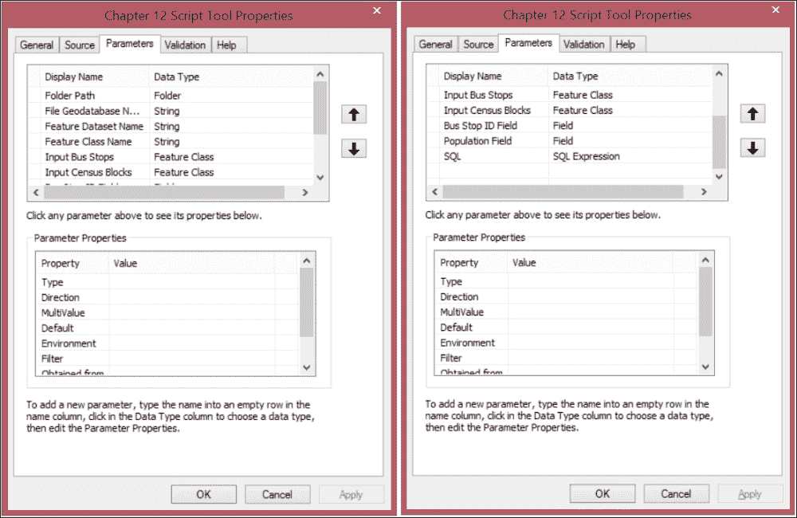
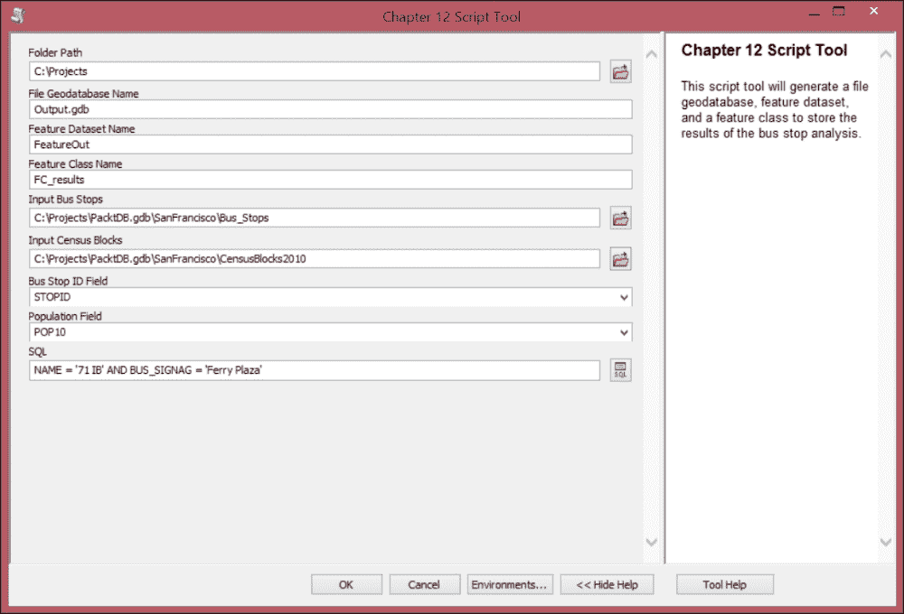
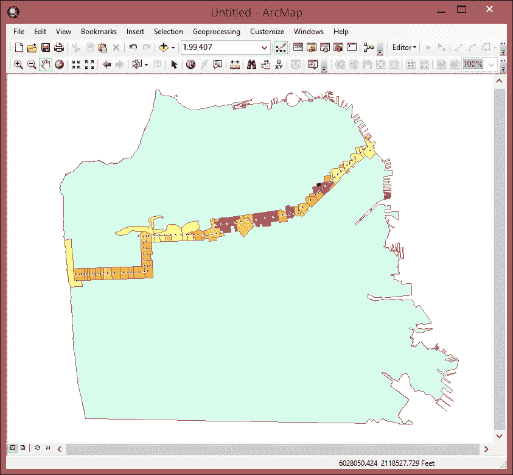

# 第十二章。开端的结束

本书几乎完成，但关于在 Python 和 ArcPy 中编写代码还有很多东西要了解。不幸的是，我无法将其全部放入一本书中，但这也意味着你可以享受探索 ArcPy 的所有方法和属性。作为本书的结论，我们将涵盖一些在编写 ArcPy 脚本时可能出现的其他重要主题。结合前面章节的教训，我希望你很快就能在工作中、在学校里或只是为了乐趣（为什么不呢？）使用 ArcPy。

本章将涵盖以下主题：

+   处理字段信息 - 类型、别名、域、空间类型等

+   访问描述要素类的信息

+   自动生成要素类并填充字段

+   自动创建文件地理数据库和要素数据集

+   创建一个脚本工具，该工具将运行公交车站分析，并在自动生成的文件地理数据库、要素数据集和要素类中生成结果

# 从要素类获取字段信息

在创建脚本工具或仅运行脚本时，有时需要从要素类（或形状文件）中提取字段信息。这些信息可以包括字段名称和别名、字段类型和长度、比例、域或子类型。这些都是通过 `arcpy.ListFields` 方法可用的属性。我们将探讨许多属性，如何提取它们，以及如何在脚本中使用它们。

通过将 ArcPy 方法组织成函数，数据将以我们偏好的形式组织，而不是依赖于 ArcPy 设计者使用的默认组织方式。重要的是要记住，你创建的脚本应该反映你的需求，而创建这些函数**包装器**是向将原始 ArcPy 工具精炼以适应你的工作流程迈出的第一步。

## 访问 ListFields 的属性

列表字段工具作为 ArcPy 方法提供。`Arcpy.ListFields` 只接受一个参数，即要素类或形状文件。一旦参数传递成功，就可以使用点符号访问一系列重要属性。为了进一步利用这些属性，我们将创建函数，使其能够轻松获取所需的信息，并按照所需的格式进行。

### 列表推导式

在这些字段信息函数中，我们将利用一种名为列表推导式的 Python 数据结构。它们简化了 `for` 循环结构，使其更容易填充所需值（在这种情况下为字段信息）的列表。

要创建列表推导式，需要在括号内生成一个 `for` 循环，并将列表填充生成的值。以下是一个示例，它创建了一个包含从 1 到 10 的数字的平方值的列表，在 Python 解释器中运行：

```py
>>>originalList = range(1,11)
>>>print originalList
[1, 2, 3, 4, 5, 6, 7, 8, 9, 10]
>>>newList =  [x**2 for x in originalList]
>>>print newList
[1, 4, 9, 16, 25, 36, 49, 64, 81, 100]

```

使用列表推导式是因为它们更快、更容易编写，尽管可能需要一些时间来习惯语法。通过实验来更好地理解它们的用途和限制，并查阅网上可用的许多资源。

## 创建字段信息函数

每个函数都将是一个独立的实体，但它们都将具有相似的结构。每个函数都将接受一个参数，即感兴趣的要素类。ArcPy 将被导入，并在稍后从内存中删除，以确保`ListFields()`方法可以无错误地调用。一旦要素类被传递给`ListFields()`方法，所需值将填充在列表推导式内的一个列表中。一旦填充完成，它将通过使用`return`关键字从函数中返回。

这里是字段名称的函数集：

```py
def returnfieldnames(fc):
 import arcpy
 fieldnames = [f.name for f in arcpy.ListFields(fc)]
 del arcpy
 return fieldnames

def returnfieldalias(fc):
 import arcpy
 fieldalias = [f.aliasName for f in arcpy.ListFields(fc)]
 del arcpy
 return fieldalias

def returnfieldbasename(fc):
 import arcpy
 fieldtypes = [f.baseName for f in arcpy.ListFields(fc)]
 del arcpy
 return fieldtypes

```

这些名称函数在基于另一个要素类创建新要素类时非常有用。有时需要保留原始要素类的确切名称和别名，使用这些函数可以使这一点成为可能。在这种情况下，还需要提供其他字段信息。以下是与字段类型、长度、精度和比例相关的函数：

```py
def returnfieldtypes(fc):
 import arcpy
 fieldtypes = [f.type for f in arcpy.ListFields(fc)]
 del arcpy
 return fieldtypes

def returnfieldlength(fc):
 import arcpy
 fieldlengths = [f.length for f in arcpy.ListFields(fc)]
 del arcpy
 return fieldlengths

def returnfieldprecision(fc):
 import arcpy
 fieldprecise = [f.precision for f in arcpy.ListFields(fc)]
 del arcpy
 return fieldprecise

def returnfieldscale(fc):
 import arcpy
 fieldscales = [f.scale for f in arcpy.ListFields(fc)]
 del arcpy
 return fieldscales

```

甚至有一个属性用于请求域信息：

```py
def returnfielddomain(fc):
 import arcpy
 fielddomains = [f.domain for f in arcpy.ListFields(fc)]
 del arcpy
 return fielddomains

```

这些函数都具有前面讨论的结构，并且具有使用简单、易于搜索的优点。因为要素类中的字段有特定的顺序，所以每个函数返回的列表都将有一个信息返回的顺序，可以通过特定的索引号访问。

`fieldsubtypes`也通过数据访问模块提供。因为它们与字段相关，所以作为字典返回：

```py
def returnfieldsubtypes(fc):
 import arcpy
 fieldsubdic = {}
 subtypes = arcpy.da.ListSubtypes(fc)
 for stcode, stdict in subtypes.iteritems():
 for stkey in stdict.iterkeys():
 if stkey == 'FieldValues':
 fields = stdict[stkey]
 for field, fieldvals in fields.iteritems():
 sub = fieldvals[0]
 desc = fieldvals[1]
 fieldsubdic[field] = sub, desc

 del arcpy
 return fieldsubdic

```

### 注意

将这些函数添加到公共模块中的`useful.py`脚本中，将使它们对任何脚本或脚本工具可用。使用`import`关键字将它们添加到任何新脚本中。它们是自包含的函数，只需要提供感兴趣要素类的文件路径。

## 查询要素类信息

使用`ListFields()`方法无法访问有关传入要素类的一些重要信息。相反，将使用许多不同的方法来查找每个要素类的几何类型、空间参考或字段子类型。其中一些是通过 ArcPy 的`Describe`方法发现的，该方法旨在提供

对于几何类型，我们将使用`Describe()`方法的`shapeType`属性：

```py
def returngeometrytype(fc):
 import arcpy
 arcInfo = arcpy.Describe(fc)
 geomtype = arcInfo.shapeType
 del arcpy
 return str(geomtype)

```

Shape 字段的名称（通常默认为 Shape）也可以通过`Describe`方法请求，并返回一个字符串数据类型：

```py
def returngeometryname(fc):
 import arcpy
 arcInfo = arcpy.Describe(fc)
 geomname = arcInfo.shapeFieldName
 del arcpy
 return str(geomname)

```

通过`Describe`方法，要素类的`spatial_reference`也是可用的。数据以`spatial_reference`对象的形式返回：

```py
def returnspatialreference(fc):
 import arcpy
 spatial_reference = arcpy.Describe(fc).spatialReference
 del arcpy
 return spatial_reference

```

`spatial_reference`对象具有许多重要的属性。`projectionname`和`projectioncode`是其中重要的属性

```py
def returnprojectioncode(fc):
 import arcpy
 spatial_reference = arcpy.Describe(fc).spatialReference
 proj_code = spatial_reference.projectionCode
 del arcpy
 return  proj_code

def returnprojectionname(fc):
 import arcpy
 spatial_reference = arcpy.Describe(fc).spatialReference
 proj_name = spatial_reference.name
 del arcpy
 return  proj_name

```

许多其他属性和方法可以类似地利用，使它们在脚本或脚本工具中可用。探索 ArcGIS 帮助文档，以获取通过`Describe`方法可用的属性的更多信息。

## 生成文件地理数据库和特征类

文件地理数据库不需要在运行脚本之前存在；相反，它们可以在使用`CreateFileGDB`工具执行脚本时生成，该工具也是 ArcPy 的一个方法。一旦创建了`File`地理数据库，就可以添加`Feature Datasets`。

生成文件地理数据库非常简单。唯一的参数是将它放置在内的文件夹和地理数据库的名称：

```py
import arcpy
folderPath = r"C:\Projects"
gdbName = "ArcPy.gdb"
arcpy.CreateFileGDB_management(folderPath, gdbName)

```

特征数据集的创建比较困难，因为有一个可选的空间参考参数，需要生成空间参考对象。虽然空间参考对象是可选的，但强烈建议使用。

有几种选项可以生成`SpatialReference`对象。其中之一是使用之前定义的`return specialReference()`函数；通过向函数传递一个特征类，创建一个空间参考对象。另一种方法是将投影文件的文件路径`.prj`作为可选的第三个参数传递。第三种方法是通过使用`arcpy.SpatialReference`方法并传递投影代码或投影字符串来生成空间参考对象：

```py
spatialReference = arcpy.SpatialReference(2227)

```

无论如何生成，它随后都会传递给`arcpy.CreateFeatureDataset`方法，包括文件地理数据库的文件路径和特征数据集的名称：

```py
spatialReference = arcpy.SpatialReference(2227)
fileGDB = r"{0}\{1}".format(folderPath,gdbName)
featureDataset = "Chapter12Results"
arcpy.CreateFeatureDataset_management(fileGDB, featureDataset,   spatialReference) 

```

## 生成特征类

现在已经创建了一个文件地理数据库和特征数据集，让我们在特征数据集中生成一个特征类。这是通过使用`arcpy.CreateFeatureClass`方法完成的。此方法有许多可选参数，包括用作模板的特征类和一个空间参考。对于这个例子，不需要使用空间参考参数，因为它将被写入特征数据集，这决定了使用哪个空间参考。模板参数将复制模板特征类的字段，但到目前为止，我们只创建形状字段：

```py
featureClass = "BufferArea"
geometryType = "POLYGON"
featurePath = r"{0}\{1}".format(fileGDB,featureDataset)
arcpy.CreateFeatureclass_management(featurePath, featureClass,  geometryType) 

```

创建的特征类需要一些字段，这些字段将包含稍后填充的属性信息。字段有许多参数，取决于字段类型，包括长度、精度和别名等：

```py
fieldName = "STOPID"
fieldAlias = "Bus Stop Identifier"
fieldType = "LONG"
fieldPrecision = 9
featureClassPath = r"{0}\{1}".format(featurePath,featureClass)
arcpy.AddField_management(featureClassPath, fieldName,fieldType, fieldPrecision,
"", "", fieldAlias)

```

让我们添加一个字段来存储公交车站分析产生的平均人口值：

```py
fieldName2 = "AVEPOP"
fieldAlias2 = "Average Census Population"
fieldType2 = "FLOAT"
featureClassPath = r"{0}\{1}".format(featurePath,featureClass)
arcpy.AddField_management(featureClassPath, fieldName2, fieldType2, "", "", "", fieldAlias2)

```

文件地理数据库、特征数据集和特征类字段现在已经生成。让我们通过添加公交车站分析函数并将结果写入生成的**特征类**来将脚本扩展为脚本工具。创建一个填充特征类的脚本工具。

此脚本工具将借鉴第十章中概述的思想，*高级几何对象方法*，并将创建与缓冲公交车站相交的 Polygon 几何对象集合，以填充**Shape 字段**，以及与每个缓冲区相交的区块的**公交车站 ID**和平均人口。

打开脚本`Chapter12_3.py`并探索其内容。结合前面提到的代码片段和`arcpy.GetParameterAsText`的使用来从脚本工具获取数据，生成的数据将通过以下代码写入要素类：

```py
arcpy.AddMessage("Beginning Analysis")
insertCursor = arcpy.da.InsertCursor(featureClassPath,['SHAPE@',fieldName, fieldName2])
arcpy.MakeFeatureLayer_management(censusBlocks2010,"census_lyr")

with arcpy.da.SearchCursor(busStops, ['SHAPE@', busStopField],sql) as cursor:
 for row in cursor:
 stop = row[0]
 stopID = row[1]
 busBuffer = stop.buffer(400)
 arcpy.SelectLayerByLocation_management("census_lyr","intersect",busBuffer,'','NEW_SELECTION')
 censusShapes = []
 censusPopList = []
 with arcpy.da.SearchCursor("census_lyr", ['SHAPE@',censusBlockPopField]) as ncursor:
 for nrow in ncursor:
 censusShapes.append(nrow[0])
 censusPopList.append(nrow[1])

 censusUnion = censusShapes[0]
 for block in censusShapes[1:]:
 censusUnion = censusUnion.union(block)

 censusPop = sum(censusPopList)/len(censusPopList)
 finalData = (censusUnion,stopID, censusPopulation)
 insertCursor.insertRow(finalData)
arcpy.AddMessage("Analysis Complete")

```

该脚本结合了本书中介绍的一些想法，使用户能够运行一个完整的流程，生成包含分析结果的要素类。通过仅添加感兴趣的字段，并用合并的`Polygon`对象填充它们，脚本消除了在运行空间分析时通常创建的大部分冗余，并生成可以在 ArcMap 中查看的结果数据集。

## 设置脚本工具参数

这是设置脚本工具参数时的样子：



参数列表很长，所以我使用了两张图片来展示它们。为每个参数选择正确的数据类型很重要，因为它将控制用于检索数据的对话框。

**公交车站 ID 字段**和**人口**字段都是从它们各自的要素类中获取的。**文件地理数据库**名称是一个字符串，如果最初没有输入，代码将向输入字符串的末尾追加`.gdb`，以确保它可以正确生成。它不应已经存在；如果它存在，则不会生成（如果需要，可以在`import`语句之后将`arcpy.env.overwriteOutput`属性设置为`True`来更改此行为）。

一旦设置了参数，并且工具有了名称和描述，保存它然后打开工具。一旦填写完毕，它应该看起来像这样：



点击**确定**以运行工具。打开**ArcMap**并添加结果，以及来自*第四章*的旧金山多边形和`Inbound71`要素类，*高级 ArcPy 脚本和泛化函数*。经过一些制图符号化后，结果将类似于以下内容：



最终结果将按每个选定的公交车站有一行，包括平均人口和公交车站 ID 值。而不是使用电子表格作为输出，要素类将允许制作地图或进行进一步的空间分析。使用自定义脚本工具生成自定义数据使你在进行地理空间分析时处于驾驶员的位置，并使你的工具和 yourself 成为任何团队的有价值资产。

## 环境设置

ArcPy 模块允许通过 ArcPy 的`env`类控制全局设置，这些设置控制输入和输出过程。这些设置将对使用地理空间分析工具产生数据的精度产生影响。可以控制*X*、*Y*、*Z*和*M*坐标的分辨率和公差，以及输出范围、栅格单元格大小、分析工作空间和许多其他设置。

要使用 ArcPy 访问环境设置，需要从`arcpy`导入`env`类：

```py
>>> from arcpy import env

```

它也可以使用以下点表示法调用。设置工作空间消除了在后续调用`workspace`上的任何方法时传递文件路径的需要。以下是一个设置工作空间并调用`ListDatasets()`方法的示例，而不将文件路径作为参数传递：

```py
>>> import arcpy
>>> arcpy.env.workspace = r"C:\Projects\SanFrancisco.gdb"
>>> arcpy.ListDatasets()
[u'SanFrancisco', u'Chapter3Results', u'Chapter4Results', u'Chapter5Results', u'Chapter7Results', u'Chapter11Results']

```

### 分辨率和公差设置

分辨率和公差设置控制由 ArcToolbox 中的工具或使用 ArcPy 运行脚本产生的任何数据的输出精度。这些设置（并且应该）为文件地理数据库或企业地理数据库中的要素数据集设置，但在内存中运行分析或使用形状文件时，或者如果地理空间分析需要比那些地理数据库使用的精度更高时，设置它们非常重要。

设置分辨率和公差需要了解您项目所需的精度。这些设置将限制对齐到线或找到与线相交的点的能力。线性单位需要反映所选的坐标系：

```py
import arcpy
arcpy.env.MResolution = 0.0005
arcpy.env.MTolerance = 0.005
arcpy.env.ZResolution = "0.0025 Feet"
arcpy.env.ZTolerance = "0.001 Feet"
arcpy.env.XYResolution = "0.00025 Feet"
arcpy.env.XYTolerance = "0.0005 Feet"

```

其他重要的环境设置包括：

+   **范围**设置，通过使用`范围`对象设置感兴趣区域的矩形，或使用当前坐标系中用空格分隔的坐标（`Xmin`、`Ymin`、`Xmax`、`Ymax`）的字符串来限制由分析产生的任何数据的范围。

+   **掩膜**设置，将栅格分析限制为与要素类或作为字符串文件路径参数传递给设置的栅格相交的区域。

+   **单元格大小**设置，控制使用栅格分析产生的数据的单元格大小。

抽时间探索强大的 ArcPy 环境设置，以减少编写代码所需的时间并确保高质量的数据生产。

# 摘要

本章和本书展示了 ArcPy 可以用于自动化地理空间分析的许多方法之一。通过应用这些课程，并通过在 ArcPy 的许多方法和属性上发挥创意，可以编写脚本并将重复且缓慢的地理空间过程制作成自定义工具，这将节省大量时间。

我希望您喜欢学习使用 ArcPy 和 Python 的基本脚本知识。我真心希望您甚至开始喜欢编程的想法，因为它强大且赋权。还有更多需要掌握的内容，但我认为您会发现，您编写的脚本越多，理解起来就越容易。

深入理解 ArcPy 的最佳资源是 ArcGIS 帮助文档，您可以通过 ArcCatalog 或 ArcMap 中的帮助菜单访问这些文档。文档也可在[`resources.arcgis.com/en/help/main/10.2/index.html`](http://resources.arcgis.com/en/help/main/10.2/index.html)找到。在 Google 中输入正确的问题也可能非常有帮助。编程论坛，如 Stack Exchange ([`gis.stackexchange.com/`](http://gis.stackexchange.com/)) 或 ESRI 的 GeoNet ([`geonet.esri.com/welcome`](https://geonet.esri.com/welcome))，都是询问各种编程问题的宝贵资源。几乎每个问题都有答案（但永远不要害怕自己提问！）。

享受创造解决方案和工具的过程，并在你未来的所有地理空间编程挑战中好运！
