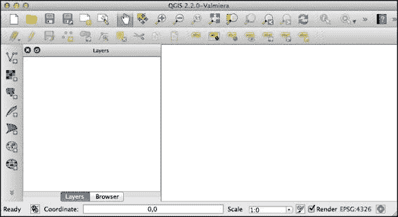
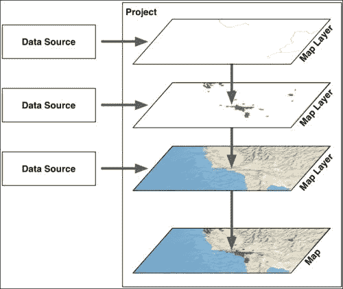
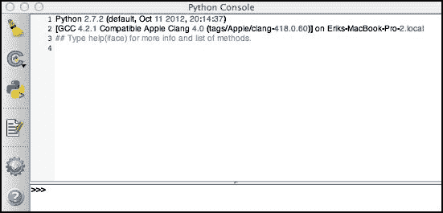
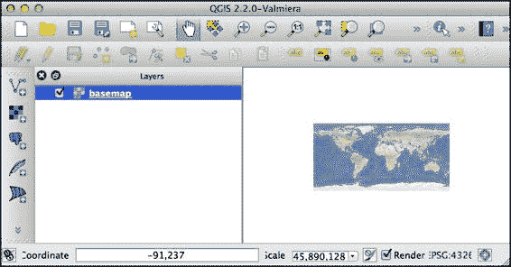
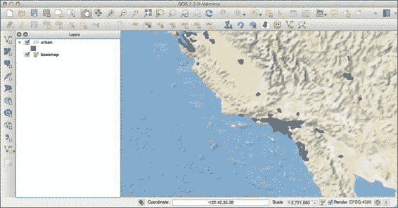
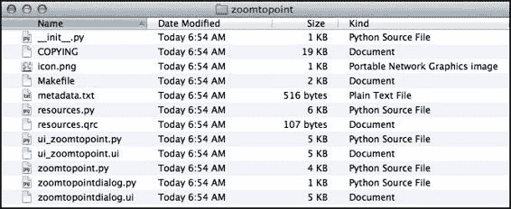
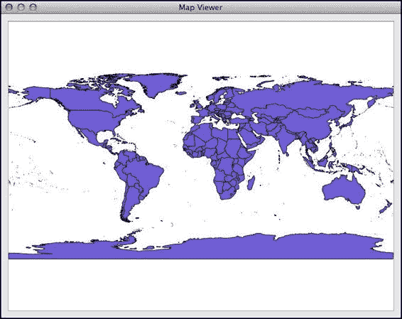

# 第一章. QGIS 入门

本章概述了 QGIS 系统，以及您如何使用 Python 编程语言与之交互。特别是，本章将涵盖以下内容：

+   下载、安装和运行 QGIS

+   熟悉 QGIS 应用程序

+   在 QGIS 中使用 Python

+   使用 Python 控制台作为 QGIS 环境的窗口

+   QGIS Python 插件的工作原理

+   从外部 Python 程序与 QGIS Python API 交互

# 关于 QGIS

QGIS 是一个流行的、免费的、开源的 **地理信息系统** (**GIS**)，可在所有主要操作系统上运行。人们通常使用 QGIS 来查看、编辑和分析地理空间数据。然而，对于我们来说，QGIS 不仅仅是一个 GIS 系统；它还是一个地理空间编程环境，我们可以使用它来构建自己的地理空间应用程序，使用 Python 实现。

QGIS 拥有一个全面的网站 ([`qgis.org`](http://qgis.org))，这使得下载、安装和使用变得容易。

在继续阅读之前，您应该花 15 分钟浏览网站，熟悉应用程序和在线可用的文档。特别是，您应该查看 **文档** 页面，其中提供了三本重要的手册：*QGIS 用户指南/手册*、*QGIS 培训手册* 和 *PyQGIS 烹饪书*。

*QGIS 用户指南/手册* 提供了深入的用户文档，您可能会发现它很有用。*QGIS 培训手册* 是基于 QGIS 的 GIS 系统和概念的详细介绍；如果您不熟悉地理空间数据和技巧，您可能会发现完成这门课程很有用。最后，*PyQGIS 烹饪书* 将成为您在开发基于 QGIS 的自己的映射应用程序时的必备参考。

## 安装和运行 QGIS

如果您尚未安装 QGIS，请点击 QGIS 主网页上的 **立即下载** 按钮，以下载 QGIS 软件。您接下来的操作取决于您在计算机上运行的操作系统：

+   对于 MS Windows，您可以下载一个可双击的安装程序，该安装程序一次安装 QGIS 和所有必需的库。请确保您使用的是 OSGeo4W 安装程序，它包括 Python 解释器、QGIS 本身以及所有必需的库。

+   对于 Mac OS X，您需要访问 Kyngchaos 网站 ([`www.kyngchaos.com/software/qgis`](http://www.kyngchaos.com/software/qgis)) 下载并安装 GDAL 和 matplotlib 库，然后再安装为您的操作系统专门构建的 QGIS 版本。所有必需的软件包都可在 Kyngchaos 网站上找到。

+   对于类 Unix 系统，您将使用包管理器从适当的软件仓库下载、编译和安装 QGIS 及所需库。有关在类 Unix 系统上安装的更多信息，请参阅[`qgis.org/en/site/forusers/alldownloads.html#linux`](http://qgis.org/en/site/forusers/alldownloads.html#linux)。

一旦您安装了 QGIS 系统，您就可以像在计算机上运行任何其他应用程序一样运行它，例如，通过双击您`应用程序`文件夹中的 QGIS 图标。

如果一切顺利，QGIS 应用程序将启动，您将看到以下窗口：



### 注意

窗口的精确外观可能因您的操作系统而异。不必担心，只要出现一个类似于前一个屏幕截图的窗口，您就是在运行 QGIS。

您现在不必太担心 QGIS 用户界面；QGIS 用户指南详细描述了界面和各种选项。我们不如深入了解一下 QGIS 的工作原理。

## 理解 QGIS 概念

要理解 QGIS，您必须熟悉以下基本术语和概念：

+   QGIS 与从各种**数据源**加载的地理空间信息一起工作。这些数据源可以包括磁盘上的矢量数据和栅格数据文件、各种空间数据库，甚至提供来自互联网的地理空间数据的 Web 服务，如**Web 地图服务**（WMS）服务器。

+   无论数据来自何处，它都由 QGIS 检索并以**地图层**的形式显示。地图层可以显示或隐藏，并且可以通过各种方式自定义，以影响数据在地图上的显示方式。

+   然后将地图层组合并在**地图**上显示。

+   最后，各种地图层、地图和其他设置共同构成了一个项目。QGIS 始终只有一个项目，并且正在处理该项目。项目包括所有地图层、地图显示选项和当前加载到 QGIS 中的各种设置。

这些概念以以下方式相关联：



### 注意

注意数据源位于 QGIS 之外。虽然地图层引用数据源，但数据本身存储在其他地方，例如，磁盘上的文件或数据库中。

无论您何时使用 QGIS，您总是在当前项目中工作。您可以保存项目并在以后重新加载它们，或者开始一个新的项目以将 QGIS 重置到其原始状态。

# 链接 QGIS 和 Python

虽然 QGIS 本身是用 C++编写的，但它提供了广泛的 Python 编程支持。内置了一个 Python 解释器，可以通过 Python 控制台交互式使用，或运行用 Python 编写的插件。还有一个全面的 API，可以使用 Python 代码查询和控制 QGIS 应用程序。

您可以使用以下三种方式使用 Python 与 QGIS 系统一起工作：

+   **Python 控制台**：您可以打开这个控制台，它运行的是 QGIS 内置的交互式 Python 解释器，允许您输入命令并立即看到结果。

+   **Python 插件**：这些是为在 QGIS 环境中运行而设计的 Python 包。

+   **外部应用程序**：你可以在自己的应用程序中使用 QGIS Python API。这让你可以使用 QGIS 作为地理空间处理引擎，甚至基于 QGIS 构建自己的交互式应用程序。

无论你如何使用 Python 和 QGIS，你都将大量使用 QGIS Python 库，这些库通常被称为 **PyQGIS**。它们为 QGIS 系统提供了一个完整的程序接口，包括将数据源加载到图层中、操作地图、导出地图可视化以及使用 QGIS 用户界面构建自定义应用程序的调用。虽然对 PyQGIS 库的深入探讨将不得不等到 第三章，即 *学习 QGIS Python API*，但我们将在下一节关于 Python 控制台的下一节中立即开始尝试。

在本章的剩余部分，我们将检查你可以使用 QGIS 和 Python 交互的三个方法。

## 探索 Python 控制台

可以通过在 **插件** 菜单中使用 **Python 控制台** 项来访问 QGIS Python 控制台窗口。当你选择此命令时，Python 控制台将出现在 QGIS 窗口的右下角。以下是在你首次打开它时 Python 控制台的外观：



虽然 Python 控制台是一个与现有 QGIS 项目交互的出色工具，但我们将用它从头开始创建一个新项目。不过，在我们这样做之前，我们需要为我们的 QGIS 项目下载一些地理空间数据源。

我们将需要一个合适的 **底图** 用于我们的项目，以及一些河流和城市信息，以便在底图上显示。让我们使用自然地球网站来获取所需的信息。转到 [`naturalearthdata.com`](http://naturalearthdata.com) 并点击 **下载** 选项卡。

首先，我们希望下载一个看起来很不错的底图。为此，在 **中等比例数据，1:50m** 部分下选择 **栅格** 链接，选择 **自然地球 1** 数据集，然后在 **自然地球 I 带阴影和水的** 标题下点击 **下载小尺寸** 链接。

接下来，我们需要一个叠加图层，它将在底图上显示湖泊和河流。要获取这些信息，回到 **下载** 选项卡，并在 **中等比例数据，1:50m** 部分下选择 **物理** 链接。你想要的数据集称为 *Rivers, Lake Centerlines*，因此点击 **下载河流和湖泊中心线** 链接以获取此文件。

最后，我们希望突出显示底图上的城市。回到 **下载** 页面，并在 **中等比例数据，1:50m** 标题下选择 **文化** 链接。底部有一个标记为 **城市区域** 的部分。点击 **下载城市区域** 链接以下载此文件。

一旦完成所有这些，你应该有以下三个文件：

+   一个名为 `NE1_50M_SR_W.zip` 的栅格底图

+   文件名为 `ne_50m_rivers_lake_centerlines.zip` 的湖泊和河流矢量数据

+   文件名为 `ne_50m_urban_areas.zip` 的城市区域矢量数据

由于这些是 ZIP 存档，你需要解压缩这些文件并将它们存储在硬盘上方便的位置。

### 小贴士

你需要输入这些数据集的完整路径，因此你可能希望将它们放在一个方便的位置，例如你的家目录或用户目录中。这样，你输入的路径就不会太长。

现在我们有了数据，让我们使用 QGIS Python 控制台将此数据导入到项目中。如果你已经将一些数据加载到 QGIS 中（例如，通过遵循 QGIS 用户指南中的教程），请从 **项目** 菜单中选择 **新建** 选项，以使用空白项目重新开始。然后，在 QGIS Python 控制台中输入以下内容：

```py
layer1 = iface.addRasterLayer("/path/to/NE1_50M_SR_W/NE1_50M_SR_W.tif", "basemap")
```

确保将 `/path/to/` 替换为你下载的 `NE1_50M_SR_W` 目录的完整路径。假设你输入了正确的路径，自然地球 1 基础地图应该出现在 QGIS 窗口中：



如你所见，我们的基础地图现在有点小。你可以使用窗口顶部的工具栏中的各种平移和缩放命令将其放大，但让我们使用 Python 来做同样的事情：

```py
iface.zoomFull()
```

这将扩展基础地图以填充整个窗口。

现在我们有了基础地图，让我们将我们的两个矢量图层添加到项目中。为此，请输入以下内容：

```py
layer2 = iface.addVectorLayer("/path/to/ne_50m_urban_areas/ne_50m_urban_areas.shp", "urban", "ogr")
```

再次确认，将 `/path/to/` 替换为你之前下载的 `ne_50m_urban_areas` 目录的完整路径。城市区域形状文件将被加载到 QGIS 项目中，并作为一系列彩色区域出现在基础地图上。让我们放大到加利福尼亚的一个区域，以便我们可以更清楚地看到它。为此，请在 Python 控制台窗口中输入以下命令：

```py
iface.mapCanvas().setExtent(QgsRectangle(-125, 31, -113, 38))
iface.mapCanvas().refresh()
```

这将放大地图，以便加利福尼亚的一个区域，包括洛杉矶和旧金山的南部，现在显示在地图上：



最后，让我们将河流和湖泊数据添加到我们的项目中。为此，请在 Python 控制台中输入以下内容：

```py
layer3 = iface.addVectorLayer("/path/to/ne_50m_rivers_lake_centerlines/ne_50m_rivers_lake_centerlines.shp", "water", "ogr")
```

如果你查看地图，你会看到河流和湖泊现在可见。然而，它们是以默认的绿色绘制的。让我们将其改为蓝色，以便水现在是蓝色：

```py
from PyQt4.QtGui import QColor
layer3.rendererV2().symbols()[0].setColor(QColor("#4040FF"))
iface.mapCanvas().refresh()
```

这段代码可能有点令人困惑，但别担心——我们将在 第三章 中学习关于渲染器和符号的内容，*学习 QGIS Python API*。

现在我们已经完成，你可以使用 **项目** 菜单中的 **另存为...** 项保存你的项目。正如你所见，使用 Python 设置和自定义 QGIS 项目是完全可能的。

## 检查 Python 插件

虽然 Python 控制台是一个交互式编码的绝佳工具，但如果你想使用 Python 来扩展 QGIS 的功能，它就不是很实用了。这就是 QGIS 插件发挥作用的地方；你可以创建（或下载）一个插件，添加新功能或改变 QGIS 的工作方式。

由于 QGIS 是使用 Qt 框架编写的，QGIS 插件利用了 Qt 中的 Python 绑定，这些绑定被称为 **PyQt**。当我们开始在 第四章 中构建自己的插件时，我们将下载并安装 PyQt 和相关工具，*创建 QGIS 插件*。

为了了解 Python 插件是如何工作的，让我们看看 **缩放到点** 插件。正如其名所示，此插件允许你缩放以显示地图上的给定坐标。它也是用 Python 编写的，是学习插件的一般方便示例。

在我们能够使用它之前，我们必须安装这个插件。从 **插件** 菜单中选择 **管理和安装插件...** 项，然后点击 **未安装** 选项卡。你应该会在可用插件的列表底部看到 **缩放到点**；点击此插件，然后点击 **安装插件** 按钮来下载并安装它。

让我们运行这个插件来看看它是如何工作的；在之前创建的项目仍然加载的情况下，点击工具栏中的 **缩放到点** 插件图标，它看起来像这样：


尝试输入你当前位置的经纬度（如果你不知道，你可能需要 [`itouchmap.com/latlong.html`](http://itouchmap.com/latlong.html) 的帮助）。你应该能看到你当前位置的基础地图、城市区域和水道。

### 小贴士

不要忘记 x 等于经度，y 等于纬度。很容易弄错它们的位置。

现在我们已经知道了插件的功能，让我们看看它是如何工作的。下载的插件存储在你用户或主目录中名为 `.qgis2` 的隐藏目录中。使用你喜欢的文件管理器进入这个隐藏目录（对于 Mac OS X，你可以在 Finder 的 **Go** 菜单中使用 **Go to Folder...** 项），然后找到 `python/plugins` 子目录。Python 插件就是存储在这里。

### 小贴士

根据你的操作系统和使用的 QGIS 版本，这个隐藏目录的名称可能不同。如果你找不到它，寻找名为 `.qgis` 或 `.qgis2` 或类似名称的目录。

你应该会看到一个名为 `zoomtopoint` 的目录（该目录的完整路径将是 `~/.qgis2/python/plugins/zoomtopoint`）。在这个目录中，你会找到组成缩放到点插件的各个文件：



让我们看看这些各种文件的作用：

| 文件名 | 用途 |
| --- | --- |
| `__init__.py` | 这是一个标准的 Python 包初始化文件。此文件还初始化插件并使其可供 QGIS 系统使用。 |
| `COPYING` | 这是一个 GNU **通用公共许可证** (**GPL**) 的副本。由于 Zoom to Point 插件通常是可用的，这定义了它可以在哪种许可下使用。 |
| `icon.png` | 如其名所示，这是插件的工具栏图标。 |
| `Makefile` | 这是一个标准的 *nix Makefile，用于自动化插件的编译和部署过程。 |
| `metadata.txt` | 这个文件包含了插件的元数据，包括插件的完整名称、描述、当前版本号等。 |
| `resources.qrc` | 这是一个 Qt 资源文件，定义了插件使用的各种资源，如图像和声音文件。 |
| `resources.py` | 这表示 `resources.qrc` 文件的内容被编译成一个 Python 模块。 |
| `ui_zoomtopoint.ui` | 这是一个 Qt 用户界面模板，定义了插件的主要 UI。 |
| `ui_zoomtopoint.py` | 这表示 `ui_zoomtopoint.ui` 文件的内容被编译成一个 Python 模块。 |
| `zoomtopoint.py` | 这个文件包含了插件的主要 Python 代码。 |
| `zoomtopointdialog.ui` | 这是一个 `ui_zoomtopoint.ui` 文件的副本。看起来这个文件是意外包含进来的，因为插件可以在没有它的情况下运行。 |
| `zoomtopointdialog.py` | 这个 Python 模块定义了一个 `QtGui.QDialog` 子类，它从 `ui_zoomtopoint.py` 加载对话框的内容。 |

在你喜欢的文本编辑器中打开 `zoomtopoint.py` 模块。正如你所看到的，它包含了插件的主要 Python 代码，形式为一个 `ZoomToPoint` 类。这个类具有以下基本结构：

```py
class ZoomToPoint:
    def __init__(self, iface):
        self.iface = iface

    def initGui(self):
        ...

    def unload(self):
        ...

    def run(self):
        ...
```

如果你打开 `__init__.py` 模块，你会看到这个类是如何用来定义插件行为的：

```py
def classFactory(iface): 
      from zoomtopoint import ZoomToPoint 
      return ZoomToPoint(iface) 
```

当插件被加载时，一个名为 `iface` 的参数传递给 `ClassFactory` 函数。这个参数是 `QgsInterface` 的一个实例，它提供了访问正在运行的 QGIS 应用程序各个部分的能力。正如你所看到的，类工厂创建了一个 `ZoomToPoint` 对象，并将 `iface` 参数传递给初始化器，以便 `ZoomToPoint` 可以使用它。

注意在 `Zoomtopoint.py` 模块中的 `ZoomToPoint.__init__()`，如何将 `iface` 参数存储在一个实例变量中，这样其他方法就可以通过 `self.iface` 来引用 QGIS 接口。例如：

```py
def __init__(self, iface):
    self.iface = iface

def initGui(self):
    ...
    self.iface.addPluginToMenu("&Zoom to point...", self.action)
```

这使得插件能够与 QGIS 用户界面进行交互和操作。

`ZoomToPoint` 类定义的四个方法都非常直接：

+   `__init__()`: 这个方法初始化一个新的 `ZoomToPoint` 对象。

+   `initGui()`: 这个方法初始化插件的用户界面，准备使用。

+   `unload()`: 这个方法从 QGIS 用户界面中移除插件。

+   `run()`: 当插件被激活时调用这个方法，即当用户在工具栏中点击插件的图标，或从插件菜单中选择插件时。

不要过于担心这里的所有细节；我们将在后面的章节中查看初始化和卸载插件的过程。现在，更仔细地看看 `run()` 方法。这个方法本质上看起来如下：

```py
def run(self):
    dlg = ZoomToPointDialog()
    ...
    dlg.show()
    result = dlg.exec_()
    if result == 1:
        x = dlg.ui.xCoord.text()
        y = dlg.ui.yCoord.text()
        scale = dlg.ui.spinBoxScale.value()
        rect = QgsRectangle(float(x) – scale,
                            float(y) - scale,
                            float(x) + scale,
                            float(y) + scale)
        mc=self.iface.mapCanvas() 
        mc.setExtent(rect)
        mc.refresh()
        ...
```

我们已经排除了记住用户之前输入的值并将这些值在插件运行时复制回对话框的代码。查看之前的代码，逻辑似乎相当简单，解释如下：

+   创建一个 `ZoomToPointDialog` 对象。

+   向用户显示对话框。

+   如果用户点击 **确定** 按钮，提取输入的值，使用这些值创建一个新的边界矩形，并将地图的范围设置为这个矩形。

虽然这个插件相当简单直接，实际代码并没有做很多，但它是一个有用的示例，说明了 Python 插件应该是什么样子，以及 Python 插件所需的各个文件。特别是，你应该注意以下几点：

+   插件只是一个包含 Python 包初始化文件 (`__init__.py`)、一些 Python 模块以及其他使用 Qt Designer 创建的文件的目录。

+   `__init__.py` 模块必须定义一个名为 `ClassFactory` 的顶级函数，该函数接受一个 `iface` 参数并返回一个代表插件的对象。

+   插件对象必须定义一个 `initGui()` 方法，该方法用于初始化插件的用户界面，以及一个 `unload()` 方法，该方法用于从 QGIS 应用程序中移除插件。

+   插件可以通过传递给类工厂的 `iface` 对象与 QGIS 应用程序交互并操作。

+   `resources.qrc` 文件列出了各种资源，如图片，这些资源由插件使用。

+   使用 PyQt 命令行工具将 `resources.qrc` 文件编译成 `resources.py` 文件。

+   对话框和其他窗口是通过 Qt Designer 模板创建的，这些模板通常存储在名为 `ui_Foo.ui` 的文件中。

+   然后将 UI 模板文件编译成 Python 代码，使用 PyQt 命令行工具。如果模板命名为 `ui_foo.ui`，则相关的 Python 模块将被命名为 `ui_foo.py`。

+   一旦定义了对话框的用户界面，你将创建 `QtGui.QDialog` 的一个子类，并将该用户界面模块加载到其中。这根据你的模板定义了对话框的内容。

+   你的插件可以按要求显示对话框，提取输入的值，并使用这些结果通过 `iface` 变量与 QGIS 交互。

插件是扩展和定制 QGIS 的有用方式。我们将在 第四章 中回到 QGIS 插件的主题，我们将从头开始创建自己的插件。

## 编写外部应用程序

与 Python 和 QGIS 一起工作的最终方式是编写一个完全独立的 Python 程序，该程序导入 QGIS 库并直接与之交互。在许多方面，这是编写您自己的自定义地图应用程序的理想方式，因为您的程序不需要在现有的 QGIS 用户界面中运行。然而，当您尝试以这种方式使用 Python 和 QGIS 时，有一些事情您需要注意：

1.  您的 Python 程序需要在运行之前能够找到 QGIS Python 库。由于这些库捆绑在 QGIS 应用程序本身中，您需要将 PyQGIS 库安装的目录添加到您的 Python 路径中。

1.  您还需要告诉 PyQGIS 库 QGIS 应用程序资源存储的位置。

1.  由于应用程序是在 QGIS 应用程序外部运行的，因此您将无法访问 `iface` 变量。您也不能使用假设您在 QGIS 内部运行的 PyQGIS 库的某些部分。

虽然这些都不是很繁重，但它们可能会在您第一次尝试从外部 Python 代码访问 PyQGIS 时让您感到困惑。让我们看看在编写您自己的 Python 程序时如何避免这些陷阱。

首先，为了使您的程序能够访问 PyQGIS 库，您需要在导入任何 QGIS 包之前修改您的 Python 路径（以及可能的一些其他环境变量）。对于 MS Windows，您可以在命令行中运行以下操作：

```py
SET OSGEO4W_ROOT=C:\OSGeo4W
SET QGIS_PREFIX=%OSGEO4W_ROOT%\apps\qgis
SET PATH=%PATH%;%QGIS_PREFIX%\bin
SET PYTHONPATH=%QGIS_PREFIX%\python;%PYTHONPATH%

```

如果你正在运行 Mac OS X，以下命令将为你设置 Python 路径：

```py
export PYTHONPATH="$PYTHONPATH:/Applications/QGIS.app/Contents/Resources/python"
export DYLD_FRAMEWORK_PATH="/Applications/QGIS.app/Contents/Frameworks"
export QGIS_PREFIX="/Applications/QGIS.app/Contents/Resources"

```

对于运行 Linux 版本的计算机，您可以使用以下命令：

```py
export PYTHONPATH="/path/to/qgis/build/output/python/"
export LD_LIBRARY_PATH="/path/to/qgis/build/output/lib/"
export QGIS_PREFIX="/path/to/qgis/build/output/"

```

### 注意

显然，您需要将 `/path/to/qgis` 替换为您 QGIS 安装的实际路径。

如果您将 QGIS 安装在非标准位置，您可能需要修改这些命令才能使其生效。要检查它们是否已生效，请启动 Python 解释器并输入以下命令：

```py
>>> import qgis

```

如果一切顺利，您将简单地看到 Python 提示符：

```py
>>> 

```

另一方面，您可能会看到以下错误：

```py
ImportError: No module named qgis

```

在这种情况下，`PYTHONPATH` 变量尚未正确设置，您将不得不检查您之前输入的设置此环境变量的命令，并可能对其进行修改以允许非标准位置的 QGIS 库。

### 注意

注意，在某些情况下，这还不够，因为 Python 库只是底层 C++ 库的包装器；您可能还需要告诉您的计算机在哪里可以找到这些 C++ 库。为了检查这是否是一个问题，您可以尝试以下操作：

```py
import qgis.core
```

您可能会遇到一个看起来像这样的错误：

```py
ImportError: libqgis_core.so.1.5.0: cannot open shared object file: No such file or directory

```

您将不得不告诉您的计算机在哪里可以找到底层共享库。我们将在查看编写我们自己的外部应用程序时返回这个问题；如果您想查看详细信息，请跳转到第五章，*在外部应用程序中使用 QGIS*。

路径设置好后，你现在可以导入你想要使用的 PyQGIS 库的各个部分，例如：

```py
from qgis.core import *
```

现在我们已经可以访问 PyQGIS 库了，我们的下一个任务是要初始化这些库。如前所述，我们必须告诉 PyQGIS 它可以找到各种 QGIS 资源。我们使用 `QgsApplication.setPrefixPath()` 函数来做这件事，如下所示：

```py
import os
QgsApplication.setPrefixPath(os.environ['QGIS_PREFIX'], True)
```

这使用我们之前设置的 `QGIS_PREFIX` 环境变量来告诉 QGIS 它的资源在哪里。完成这个步骤后，你可以通过以下调用初始化 PyQGIS 库：

```py
QgsApplication.initQgis()
```

现在，我们可以使用 PyQGIS 在我们的应用程序中做我们想做的任何事情。当我们的程序退出时，我们还需要通知 PyQGIS 库我们正在退出：

```py
QgsApplication.exitQgis()
```

将所有这些放在一起，我们的最小 Python 应用程序看起来像这样：

```py
import os
from qgis.core import *

QgsApplication.setPrefixPath(os.environ['QGIS_PREFIX'], True)
QgsApplication.initQgis()

# ...

QgsApplication.exitQgis()
```

当然，这个应用程序目前还没有做任何有用的事情——它只是启动并关闭 PyQGIS 库。所以让我们用一些有用的代码替换掉 "`...`" 行，以显示一个基本的地图小部件。为此，我们需要定义一个 `QMainWindow` 子类，它显示地图小部件，然后创建并使用一个 `QApplication` 对象来显示这个窗口，并在应用程序运行时处理各种用户界面事件。

### 注意

`QMainWindow` 和 `QApplication` 都是 PyQt 类。在我们使用 QGIS 和 Python 开发自己的外部应用程序时，我们将广泛使用各种 PyQt 类。

让我们先替换掉 "`...`" 行，用以下代码替换，该代码显示地图查看器，然后运行应用程序的主事件循环：

```py
app = QApplication(sys.argv)

viewer = MapViewer("/path/to/shapefile.shp")
viewer.show()

app.exec_()
```

如你所见，创建并显示了一个 `MapViewer` 实例（我们很快就会定义它），并通过调用 `exec_()` 方法运行 `QApplication` 对象。为了简单起见，我们传递了一个 shapefile 的名称，在地图查看器中显示。

运行此代码将导致地图查看器显示，并且应用程序将运行，直到用户关闭窗口或从菜单中选择 **退出** 命令。

现在，让我们定义 `MapViewer` 类。以下是类的定义看起来像这样：

```py
class MapViewer(QMainWindow):
    def __init__(self, shapefile):
        QMainWindow.__init__(self)
        self.setWindowTitle("Map Viewer")

        canvas = QgsMapCanvas()
        canvas.useImageToRender(False)
        canvas.setCanvasColor(Qt.white)
        canvas.show()

        layer = QgsVectorLayer(shapefile, "layer1", "ogr")
        if not layer.isValid():
            raise IOError("Invalid shapefile")

        QgsMapLayerRegistry.instance().addMapLayer(layer)
        canvas.setExtent(layer.extent())
        canvas.setLayerSet([QgsMapCanvasLayer(layer)])

        layout = QVBoxLayout()
        layout.addWidget(canvas)

        contents = QWidget()
        contents.setLayout(layout)
        self.setCentralWidget(contents)
```

不要过于担心这个类的细节；我们基本上只是创建一个窗口，并在其中放置一个 `QgsMapCanvas` 对象。然后我们创建一个地图图层（`QgsVectorLayer` 的实例）并将其添加到地图画布上。最后，我们将画布添加到窗口的内容中。

注意到 `QgsMapCanvas` 和 `QgsVectorLayer` 都是 PyQGIS 的一部分，而 `QMainWindow`、`QVBoxLayout` 和 `QWidget` 都是 PyQt 类。这个应用程序在 PyQt 应用程序中使用 PyQGIS 类，混合了两个来源的类。这是可能的，因为 QGIS 是使用 Qt 构建的，而各种 PyQGIS 类都是基于 PyQt 的。

要将前面的代码转换成一个可工作的应用程序，我们只需要在模块顶部添加一些额外的 `import` 语句：

```py
import sys
from PyQt4.QtGui import *
from PyQt4.QtCore import Qt
```

### 提示

**下载示例代码**

您可以从[`www.packtpub.com`](http://www.packtpub.com)下载您购买的所有 Packt Publishing 书籍的示例代码文件。如果您在其他地方购买了这本书，您可以访问[`www.packtpub.com/support`](http://www.packtpub.com/support)并注册，以便直接将文件通过电子邮件发送给您。

如果您运行此应用程序，地图查看器将显示，显示由代码引用的 shapefile 内容。例如：



这个应用程序仍然有点丑陋——您可以看到地图顶部和底部有空白，因为它们没有考虑到地图数据的长宽比。此外，也没有放大或滚动地图的功能。然而，这些功能可以很容易地添加，如您所见，创建基于 QGIS 的独立地图应用程序并不困难。

# 摘要

在本章中，我们熟悉了 QGIS 以及它作为 Python 地理空间开发系统可以使用的各种方式。我们安装并探索了 QGIS 应用程序本身，然后查看 Python 如何与 QGIS 一起使用。我们看到了 QGIS 如何使用数据源、地图图层、地图和项目来组织和处理地理空间数据。接下来，我们检查了您可以使用 Python 和 QGIS 的三种方式：通过在 Python 控制台中输入命令、编写 Python 插件或编写利用 QGIS Python API 的外部应用程序。

我们然后查看与 QGIS 一起提供的广泛的 Python 库集，称为 PyQGIS，您可以使用它进行地理空间开发。我们看到了如何使用 QGIS Python 控制台直接操作 QGIS 项目，添加图层，放大缩小，更改选项等。

接下来，我们下载并检查了一个 QGIS Python 插件。在这个过程中，我们了解到 QGIS 插件只是安装在您家目录或用户目录中名为`.qgis2`（或`.qgis`）的隐藏目录中的 Python 包。插件利用 Qt 库来定义和构建资源，例如用户界面模板。

最后，我们看到了如何编写外部 Python 应用程序，这些应用程序可以从 QGIS 系统中加载 PyQGIS 库，然后在更大的 PyQt 应用程序中使用这些库。

在下一章中，我们将更详细地探讨 QGIS Python 控制台，并使用它来熟悉 PyQGIS 库，同时看看我们如何在我们的 Python 地理空间开发项目中使用它。
