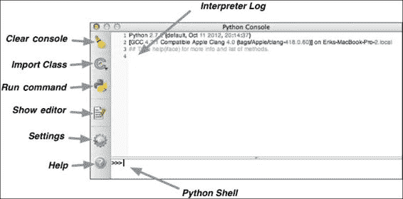
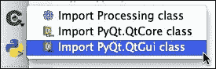
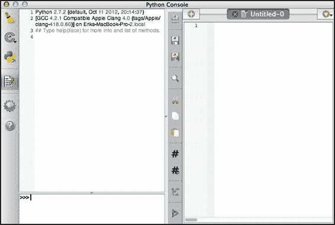
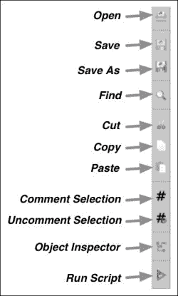
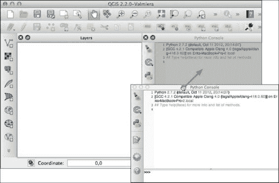
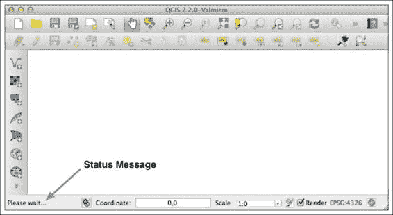
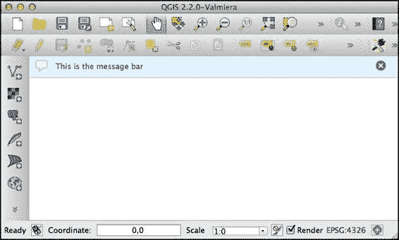
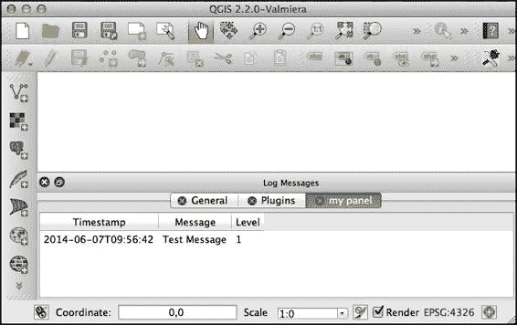
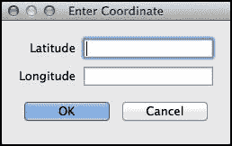

# 第二章 QGIS Python 控制台

在本章中，我们将探讨您可以使用 QGIS Python 控制台作为地理空间开发工具的方法。我们还将使用控制台作为窥视镜来检查 QGIS 编程的世界。特别是，我们将学习以下内容：

+   探索控制台可以用来开发和执行 Python 代码的方法

+   学习如何使用控制台的内置源代码编辑器编写 Python 脚本

+   发现各种技巧和技术来使用 QGIS 控制台

+   想出如何使用 Python 命令在 QGIS 中操作当前项目

+   使用控制台访问地理空间数据并执行地理空间计算

+   在我们的 Python 程序中使用各种 QGIS 用户界面元素

# 使用控制台

虽然您在上一章中已经短暂使用过 QGIS 控制台，但详细检查 QGIS 控制台窗口是值得的，这样您就会了解可用的各种功能。

如果您还没有打开它，请从**插件**菜单中选择**Python 控制台**项以打开控制台。以下截图显示了控制台窗口的各个部分：



让我们更详细地看看这些不同的部分：

+   **清除控制台**按钮会清除解释器日志的内容

+   **导入类**弹出窗口包含导入一些常用 PyQGIS 类的快捷方式

    这些相当于输入`import Processing`，`from PyQt4.QtCore import *`和`from PyQt4.QtGui import *`。

+   **运行命令**按钮简单地执行在 Python Shell 字段中输入的命令

    ### 注意

    当然，您也可以通过按*回车*键来运行输入的命令，所以这个命令只有在您真的想使用鼠标运行命令时才有用。

+   **显示编辑器**按钮用于显示或隐藏内置的源代码编辑器。我们稍后会查看这一点

+   **设置**按钮显示控制台的设置窗口，允许您自定义控制台的外观和行为

+   **帮助**按钮会弹出内置的帮助查看器页面，其中包含有关如何使用控制台的有用信息

+   **Python Shell**字段是您输入 Python 命令和其他输入的地方

+   **解释器日志**显示了您输入的命令和 Python 解释器的输出的完整历史记录

正如我们已经看到的，您可以在 shell 中输入 Python 命令并按*回车*键来执行它们。您输入的命令以及 Python 解释器的输出将出现在解释器日志中。

Python Shell 被设计成使与 Python 的交互式工作更加容易。以下是目前支持的功能：

+   按下上箭头和下箭头键可以在命令历史记录中移动，这使得重新输入之前输入的 Python 命令变得容易。

+   您可以通过按*Ctrl* + *Shift* + *Space*（在 Mac 上为*command* + *Shift* + *Space*）来显示之前输入的命令列表。

+   如果你选中了解释器日志中的某些文本，你可以使用**输入选中**命令将文本移动到 shell 中并执行它。此命令在控制台的弹出菜单中可用，或者可以通过按 *Ctrl* + *E*（如果你正在运行 Mac OS X，则为 *command* + *E*）来访问。

+   Python Shell 支持**自动完成**。当你输入时，会出现一个弹出菜单，显示 PyQGIS 和 PyQt API 中的匹配类、函数和方法名称。然后你可以按上箭头和下箭头键选择你想要的确切名称，并按 *Tab* 键来选择它。

+   当你输入一个开括号时，控制台会自动为你输入闭括号。如果你希望关闭这个功能，可以通过使用**设置**窗口来实现。

+   当你输入 `from XXX` 时，控制台会自动为你输入单词 `import`。同样，你可以在**设置**窗口中关闭这个功能，如果你不喜欢这种行为。

+   当你为函数或方法输入开括号时，该函数或方法的 C++ 签名将显示出来。尽管它是 C++ 格式，但这告诉你期望的参数和返回值的类型。

+   你可以在 shell 中输入 `_api`；你的网络浏览器将打开 PyQGIS API 参考文档。同样，如果你输入 `_pyqgis`，你的网络浏览器将显示 PyQGIS 开发者手册。

虽然在 Python Shell 中输入命令是探索 QGIS Python 库的有用方法，并且对于一次性命令来说很好用，但如果需要输入多行 Python 文本或者反复输入相同的命令集，很快就会变得乏味。毕竟，这就是我们为什么将 Python 代码存储在 `.py` 文件中并执行它们，而不是直接在 Python 命令行界面中输入所有内容的原因。

QGIS 控制台自带编辑器，允许你在控制台中直接编写 Python 脚本并执行它们。让我们快速看看这是如何工作的。

在 QGIS 控制台打开的情况下，点击**显示编辑器**图标（）。控制台窗口将分为两部分，Python 源代码编辑器现在占据了窗口的右侧：



不同的工具栏图标提供了标准的编辑行为，例如加载和保存文件、复制粘贴文本、检查语法以及执行你的脚本：



你可能需要记住前三个图标，因为目前还没有快捷键可以用来打开和保存 Python 脚本。

让我们使用控制台编辑器创建一个简单的 Python 程序并运行它。在加载了 QGIS 项目后，将以下内容输入到编辑器中：

```py
for layer in iface.legendInterface().layers():
    print layer.name() 
```

如您可能猜到的，此程序会打印出当前项目中各种图层的名称。要运行此程序，请通过点击 **另存为...** 工具栏图标保存它；然后，要么点击 **运行脚本** 工具栏图标 ，要么输入键盘快捷键，*Ctrl* + *Shift* + *E*（在 Mac 上是 *command* + *Shift* + *E*）。您应该在解释器日志中看到如下内容：

```py
>>> execfile(u'/.../tmp1NR24f.py'.encode('utf-8'))
water
urban
basemap

```

注意，QGIS 使用 `execfile()` 函数（它是 Python 标准库的一部分）来执行您的脚本。

### 小贴士

如果您的程序没有显示任何图层的名称，请确保您已加载了一个至少包含一个图层的项目。在这个例子中，我们使用了我们在上一章中创建的示例项目，其中包含三个图层。

当然，我们可以用 QGIS 控制台及其内置的 Python 编辑器做更多的事情，我们很快就会用它来做一些有用的工作。在我们这样做之前，还有两件关于 QGIS 控制台的事情您应该知道。

首先，控制台本身是用 PyQt 和 `PyQScintilla2` 编辑器用 Python 编写的。您可以通过查看控制台的源代码来了解 QGIS 的实现方式，控制台的源代码可在 [`github.com/qgis/QGIS/tree/master/python/console`](https://github.com/qgis/QGIS/tree/master/python/console) 找到。

您应该知道的第二件事是，控制台作为 Qt “可停靠”窗口实现；也就是说，它可以被拖动到主 QGIS 窗口内的一个面板中。如果您点击并按住控制台的标题栏，您可以将其拖入主窗口，如下面的插图所示：



控制台可以被移动到 QGIS 窗口中的任何现有面板中，并且它将停留在那里，直到您将其移出。

要将控制台再次转换为窗口，请点击标题栏并将其拖出 QGIS 窗口。或者，您可以双击控制台的标题栏，在作为独立窗口或停靠面板之间切换。

如果您在小型屏幕上工作，这种停靠行为可能会让人烦恼，因为在移动控制台窗口以查看其下方内容时，您可能会意外地将控制台窗口停靠。幸运的是，由于 QGIS 控制台是用 PyQt 实现的，您可以通过运行以下 Python 代码轻松禁用此功能：

```py
from console import console
from PyQt4.QtCore import Qt
console._console.setAllowedAreas(Qt.DockWidgetAreas(Qt.NoDockWidgetArea))
```

如果你想，你可以创建一个启动脚本，这样每次 QGIS 启动时都会自动显示控制台，并使其不可停靠。启动脚本存储在你用户或主文件夹中的一个隐藏目录中。使用你的文件管理器，在你的用户或主目录中查找名为 `.qgis2` 的隐藏目录（或 `.qgis`，具体取决于你运行的 QGIS 版本）（对于 Mac OS X，你可以在 Finder 的 **Go** 菜单中使用 **Go to Folder...** 项）。在这个目录内，将有一个名为 `python` 的子目录。在 `python` 目录内，创建一个名为 `startup.py` 的文件，并将以下内容放入此文件中：

```py
from console import console
from PyQt4.QtCore import Qt
console.show_console()
console._console.setAllowedAreas(Qt.DockWidgetAreas(Qt.NoDockWidgetArea))
```

如你所见，我们唯一改变的是添加了对 `console.show_console()` 的调用，以便在 QGIS 启动时打开控制台窗口。

### 注意

如果控制台当前已停靠，此脚本不会将其取消停靠，尽管它会防止你意外再次停靠控制台。

# 在控制台中处理地理空间数据

到目前为止，我们已将 QGIS 控制台用作一个华丽的 Python 解释器，运行标准 Python 程序并操作 QGIS 用户界面。但 QGIS 是一个地理信息系统（GIS），GIS 的主要用途之一是操作和查询地理空间数据。因此，让我们编写一些 Python 代码，以便在 QGIS 控制台中直接处理地理空间数据。

在上一章中，我们使用 Python 将三个 shapefile 加载到 QGIS 项目中。以下是我们将 shapefile 加载到 QGIS 地图层中使用的典型指令：

```py
layer = iface.addVectorLayer("/path/to/shapefile.shp", "layer_name", "ogr")
```

虽然这在你想以编程方式创建 QGIS 项目时很有用，但你可能只想加载一个 shapefile，以便分析其内容，而不将数据放入地图层。为此，我们必须获取适当的数据提供者，并要求它打开 shapefile，如下所示：

```py
registry = QgsProviderRegistry.instance()
provider = registry.provider("ogr","/path/to/shapefile.shp")
if not provider.isValid():
    print "Invalid shapefile."
    return
```

如果 shapefile 无法加载，`isValid()` 方法将返回 `False`；这允许我们在出现错误时优雅地失败。

一旦我们有了数据提供者，我们可以要求它提供用于存储 shapefile 每个特征的属性值的字段列表：

```py
for field in provider.fields():
      print field.name(), field.typeName()
```

我们还可以使用 `QgsFeatureRequest` 对象扫描 shapefile 内的特征。例如：

```py
for feature in provider.getFeatures(QgsFeatureRequest()):
    print feature.attribute("name")
```

当然，这仅仅是对使用 QGIS 库查询和操作地理空间数据所能做到的一小部分。然而，让我们利用我们所学的知识来构建一个简单的程序，该程序可以计算并显示 shapefile 内容的信息。Shapefiles 包含地理空间特征，如多边形、线和点，每个特征可以与任何数量的属性相关联。我们将编写一个程序，打开并扫描 shapefile，识别特征并计算每条线特征的长度和每个多边形特征的面积。我们还将计算所有特征的总长度和面积。

我们将面临的挑战之一是 shapefile 可以是任何地图投影。这意味着我们的面积和长度计算必须考虑地图投影；例如，如果我们简单地在一个使用 EPSG 4326 投影（即经纬度坐标）的 shapefile 中计算一个要素的线性长度，那么计算出的长度将是纬度和经度的度数——这是一个完全没有意义的数字。我们希望以千米为单位计算要素长度，以平方千米为单位计算面积。这是可能的，但需要我们做更多的工作。

让我们开始编写我们的程序。首先创建一个新的 Python 脚本，并输入以下内容：

```py
from PyQt4.QtGui import *
```

为了使程序更容易使用，我们将定义一个函数并将所有程序逻辑放在这个函数中，如下所示：

```py
def analyze_shapefile():
    ...

analyze_shapefile()
```

现在，让我们开始编写`analyze_shapefile()`函数的内容。到目前为止，我们一直在硬编码 shapefile 的名称，但这次，让我们使用 QGIS 的图形界面提示用户选择一个 shapefile：

```py
def analyze_shapefile():
    filename = QFileDialog.getOpenFileName(iface.mainWindow(),
                                           "Select Shapefile",
                                           "~", '*.shp')
    if not filename:
        print "Cancelled."
        return
```

然后，我们可以打开选定的 shapefile：

```py
    registry = QgsProviderRegistry.instance()
    provider = registry.provider("ogr",filename)
    if not provider.isValid():
        print "Invalid shapefile."
        return
```

为了识别一个要素，我们需要为该要素显示一个有意义的标签。为此，我们将寻找一个看起来可能的名字的属性。如果没有合适的属性，我们不得不使用要素的 ID。

首先，让我们构建一个包含在这个 shapefile 中存储的各种属性的列表：

```py
    attr_names = []
    for field in provider.fields():
        attr_names.append(field.name())
```

现在，我们已经准备好开始扫描 shapefile 的要素。在我们这样做之前，让我们初始化一些变量来保存我们需要计算的总量：

```py
    tot_length = 0
    tot_area = 0
```

我们还需要设置一个`QgsDistanceArea`对象来为我们进行距离和面积计算。

```py
    crs = provider.crs()
    calculator = QgsDistanceArea()
    calculator.setSourceCrs(crs)
    calculator.setEllipsoid(crs.ellipsoidAcronym())
    calculator.setEllipsoidalMode(crs.geographicFlag())
```

我们将使用此对象来计算 shapefile 要素的真实长度和面积，分别以米和平方米为单位。

现在，我们已经准备好扫描 shapefile 的内容，依次处理每个要素：

```py
    for feature in provider.getFeatures(QgsFeatureRequest()):
        ...
```

对于每个要素，我们想要计算一个标签来标识该要素。我们将通过寻找名为`"name"`、`"NAME"`或`"Name"`的属性，并使用该属性的值作为要素标签来完成此操作。如果没有具有这些字段名称之一的属性，我们将回退到使用要素的 ID。以下是相关代码：

```py
        if "name" in attr_names:
            feature_label = feature.attribute("name")
        elif "Name" in attr_names:
            feature_label = feature.attribute("Name")
        elif "NAME" in attr_names:
            feature_label = feature.attribute("NAME")
        else:
            feature_label = str(feature.id())
```

接下来，我们需要获取与要素相关联的几何对象。几何对象代表一个多边形、线或点。获取要素底层几何对象的引用很简单：

```py
        geometry = feature.geometry()
```

现在，我们可以使用我们之前初始化的`QgsDistanceArea`计算器来计算线要素的长度和多边形要素的面积。为此，我们首先必须确定我们正在处理要素的类型：

```py
        if geometry.type() == QGis.Line:
            ...
        elif geometry.type() == QGis.Polygon:
            ...
        else:
            ...
```

对于线几何形状，我们将计算线的长度并更新总长度：

```py
        if geometry.type() == QGis.Line:
            length = int(calculator.measure (geometry) / 1000)
            tot_length = tot_length + length
            feature_info = "line of length %d kilometers" % length
```

对于多边形几何形状，我们将计算多边形的面积并更新总面积：

```py
        elif geometry.type() == QGis.Polygon:
            area = int(calculator.measure (geometry) / 1000000)
            tot_area = tot_area + area
            feature_info = "polygon of area %d square kilometers" % area
```

最后，对于其他类型的几何形状，我们只需显示几何形状的类型：

```py
        else:
            geom_type = qgis.vectorGeometryType(geometry.type())
            feature_info = "geometry of type %s" % geom_type
```

现在我们已经完成了这些计算，我们可以显示要素的标签以及我们为此要素计算的信息：

```py
        print "%s: %s" % (feature_label, feature_info)
```

最后，当我们完成对要素的迭代后，我们可以显示该 shapefile 中所有要素的总行长度和多边形面积：

```py
    print "Total length of all line features: %d" % tot_length
    print "Total area of all polygon features: %d" % tot_area
```

这完成了我们分析 shapefile 内容的程序。此程序的完整源代码可在本书提供的代码示例中找到。要测试我们的程序，请在控制台的脚本编辑器中键入或复制粘贴，保存文件，然后单击**运行脚本**按钮（或按*Ctrl* + *Shift* + *E*）。以下是程序输出的示例：

```py
Antigua and Barbuda: polygon of area 549 square kilometers
Algeria: polygon of area 2334789 square kilometers
Azerbaijan: polygon of area 86109 square kilometers
Albania: polygon of area 28728 square kilometers
Armenia: polygon of area 29732 square kilometers
...
Jersey: polygon of area 124 square kilometers
South Georgia South Sandwich Islands: polygon of area 3876 square kilometers
Taiwan: polygon of area 36697 square kilometers
Total length of all line features: 0
Total area of all polygon features: 147363163

```

### 小贴士

此输出是使用可在[`thematicmapping.org/downloads/world_borders.php`](http://thematicmapping.org/downloads/world_borders.php)找到的世界边界数据集生成的。这是一组有用的地理空间数据，它提供了简单的世界地图和相关元数据。如果您还没有这样做，您应该为自己获取一份此数据集的副本，因为我们将在此书中使用此 shapefile。

如您所见，创建能够读取和分析地理空间数据的 Python 程序是完全可能的，并且您可以直接从 QGIS 控制台运行这些程序。您还可以使用 PyQGIS 库创建和操作地理空间数据源。

# 脚本化 QGIS 用户界面

尽管我们之前创建的示例程序用户交互非常有限，但完全有可能构建您的程序以直接使用 QGIS 用户界面元素，例如状态栏、消息栏、进度指示器和 QGIS 日志窗口。您还可以创建自定义表单和窗口，以便您的程序输出看起来就像 QGIS 本身的任何其他功能。让我们更详细地看看如何在您的 Python 程序中使用一些这些 QGIS 用户界面元素。

## 状态栏

QGIS 窗口有一个状态栏。您可以使用它来显示 Python 程序当前的状态，例如：

```py
iface.mainWindow().statusBar().showMessage("Please wait...")
```

状态消息将出现在窗口底部，如下所示：



如您所见，状态栏上空间有限，因此您需要保持状态消息简短。要再次隐藏消息，请执行以下操作：

```py
iface.mainWindow().statusBar().clearMessage()
```

## 消息栏

消息栏出现在窗口中，用于向用户显示消息，例如：



消息栏有几个有用的功能：

+   消息可以堆叠，这样如果同时出现多个消息，用户就不会错过早期的消息

+   消息有一个级别，它表示消息的重要性，并影响消息的显示方式

+   消息有一个可选的标题以及要显示的文本

+   消息可以留在屏幕上，直到用户关闭它们，或者它们可以超时，在给定秒数后自动消失

+   您可以向消息栏添加各种 Qt 小部件来自定义其行为和外观

QGIS 中的任何窗口都可以有自己的消息栏。`iface`变量有一个`messageBar()`方法，它返回主 QGIS 窗口的消息栏，但您也可以根据需要向自己的自定义窗口添加消息栏。

要向消息栏添加消息，请调用消息栏的`pushMessage()`方法。要创建不带标题的消息，请使用以下方法签名：

```py
messageBar.pushMessage(text, level=QsgMessageBar.INFO, duration=None)
```

例如：

```py
from qgis.gui import *
iface.messageBar().pushMessage("Hello World",
         level=QgsMessageBar.INFO)
```

要包含标题，请使用以下方法签名：

```py
messageBar.pushMessage(title, text, level=QgsMessageBar.INFO, duration=None)
```

在这两种情况下，`level`参数可以设置为`QgsMessageBar.INFO`、`QgsMessageBar.WARNING`或`QgsMessageBar.CRITICAL`，如果指定了`duration`参数，则表示消息隐藏前的秒数。

要移除当前显示的所有消息，您可以调用`messageBar.clearWidgets()`方法。

## 进度指示器

您还可以利用消息栏来显示 Qt 进度指示器。为此，请使用`messageBar.createMessage()`方法创建一个用于显示消息的小部件，然后修改该小部件以包含额外的 Qt 控件，最后调用`messageBar.pushWidget()`方法来显示消息和您添加的控件。例如：

```py
progressMessage = iface.messageBar().createMessage("Please wait")
progressBar = QProgressBar()
progressBar.setMaximum(100)
progressBar.setAlignment(Qt.AlignLeft | Qt.AlignVCenter)
progressMessage.layout().addWidget(progressBar)
iface.messageBar().pushWidget(progressMessage)
...
progressBar.setValue(n)
...
iface.messageBar().clearWidgets()
```

### 注意

QGIS 2.2 的 Mac 版本中存在一个错误，这会阻止用户界面在 Python 代码运行时更新。解决这个问题的方法是在以下文章中描述的线程：[`snorf.net/blog/2013/12/07/multithreading-in-qgis-python-plugins`](http://snorf.net/blog/2013/12/07/multithreading-in-qgis-python-plugins)

## QGIS 日志

您可以使用 QGIS 内置的日志功能在单独的窗口中显示输出。例如：

```py
for i in range(100):
    QgsMessageLog.logMessage("Message %d" % i)
```

日志消息将在日志视图中显示，您可以通过导航到**视图** | **面板** | **日志消息**来显示它。

如果您愿意，您可以通过在`logMessage()`调用中添加消息级别来更改消息的重要性，例如：

```py
QgsMessageLog.logMessage("Something is wrong",
                         level=QgsMessageLog.CRITICAL)
```

您也可以选择让所有日志消息单独出现在一个面板中，通过在`logMessage()`调用中添加一个标签，如下所示：

```py
QgsMessageLog.logMessage("Test Message", tag="my panel")
```

您的日志消息将随后出现在一个单独的面板中，如下所示：



## 自定义对话框和窗口

由于 QGIS 建立在 Qt 之上，您可以使用 PyQt 类创建自己的窗口和对话框，并直接从 Python 代码中显示它们。例如，以下是一个显示自定义对话框的脚本，提示用户输入纬度和经度值：

```py
from PyQt4.QtGui import *

class MyDialog(QDialog):
    def __init__(self):
        QDialog.__init__(self)
        self.setWindowTitle("Enter Coordinate")

        layout = QFormLayout(self)

        self.lat_label = QLabel("Latitude", self)
        self.lat_field = QLineEdit(self)

        self.long_label = QLabel("Longitude", self)
        self.long_field = QLineEdit(self)

        self.ok_btn = QPushButton("OK", self)
        self.ok_btn.clicked.connect(self.accept)

        self.cancel_btn = QPushButton("Cancel", self)
        self.cancel_btn.clicked.connect(self.reject)

        btn_layout = QHBoxLayout(self)
        btn_layout.addWidget(self.ok_btn)
        btn_layout.addWidget(self.cancel_btn)

        layout.addRow(self.lat_label, self.lat_field)
        layout.addRow(self.long_label, self.long_field)
        layout.addRow(btn_layout)

        self.setLayout(layout)

dialog = MyDialog()
if dialog.exec_() == QDialog.Accepted:
    lat = dialog.lat_field.text()
    long = dialog.long_field.text()
    print lat,long
```

运行此脚本将显示以下对话框：



如果用户点击 **确定** 按钮，输入的纬度和经度值将被打印到控制台。当然，这只是一个简单的示例——这里没有错误检查或将输入的值从文本转换回数字。然而，这只是一个简单的示例。使用 PyQt 库可以完成更多的事情，而且人们已经为此主题撰写了整本书。然而，现在要认识到的主要一点是，由于 QGIS 是建立在 Qt 之上的，您可以使用 PyQt 的所有功能来构建复杂的用户界面。您当然不仅仅局限于使用 Python 控制台与用户交互。

# 摘要

在本章中，我们探讨了 QGIS Python 控制台及其在多种编程任务中的应用。我们还使用控制台更深入地研究了 QGIS Python 编程环境。

在我们学习这一章的过程中，我们了解了 QGIS 控制台中的各种工具栏按钮和控制功能，以及如何使用 Python Shell 输入命令。我们探讨了如何使用 Python 解释器日志查看之前的输出并重新输入之前执行的命令。我们看到了如何使用自动完成快速输入 Python 代码，还了解了各种 PyQGIS 函数和方法接受的参数。

然后，我们探讨了如何使用内置的源代码编辑器输入和执行 Python 脚本。我们发现 Python 控制台本身是用 Python 编写的，这使得您可以使用 Python 代码探索源代码并操纵控制台本身。

我们学习了如何创建一个启动脚本，该脚本在 QGIS 启动时自动运行，以及如何使用它来设置控制台以自动打开并防止其作为可停靠窗口运行。

接下来，我们检查了直接使用您的 Python 脚本加载地理空间数据的过程，而无需首先将其加载到 QGIS 地图图层中。我们了解了如何识别由 shapefile 定义的属性，如何扫描 shapefile 内部的要素，以及 PyQGIS 库允许您执行常见地理空间计算的方式。

然后，我们探讨了在您的 Python 脚本中如何使用 QGIS 用户界面元素的各种方法，包括状态栏、消息栏、进度指示器和 QGIS 消息日志。

最后，我们看到了如何使用标准的 PyQt 类创建自己的窗口和对话框，为您的 Python 脚本提供复杂的用户界面。

在下一章中，我们将更直接地与 QGIS Python 库合作，学习这些库的结构以及如何使用它们执行各种类型的地理空间数据处理并在地图上显示结果。
