# 第三章 学习 QGIS Python API

在本章中，我们将更深入地了解 QGIS Python 开发者可用的 Python 库，并探讨我们可以使用这些库在 QGIS 中执行有用任务的多种方式。

尤其是你会学到：

+   QGIS Python 库是如何基于底层 C++ API 的

+   如何将 C++ API 文档作为参考来处理 Python API

+   PyQGIS 库是如何组织的

+   PyQGIS 库中最重要概念和类以及如何使用它们

+   使用 PyQGIS 执行有用任务的实用示例

# 关于 QGIS Python API

QGIS 系统本身是用 C++编写的，并有一套自己的 API，这些 API 也是用 C++编写的。Python API 作为这些 C++ API 的包装器来实现。例如，有一个名为`QgisInterface`的 Python 类，它作为同名的 C++类的包装器。`QgisInterface`的 C++版本实现的所有方法、类变量等，都通过 Python 包装器提供。

这意味着当你访问 Python QGIS API 时，你不是直接访问 API。相反，包装器将你的代码连接到底层的 C++对象和方法，如下所示：

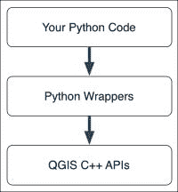

幸运的是，在大多数情况下，QGIS Python 包装器简单地隐藏了底层 C++代码的复杂性，所以 PyQGIS 库会按你期望的方式工作。然而，也有一些需要注意的问题，我们将在遇到时进行讨论。

# 解读 C++文档

由于 QGIS 是用 C++实现的，因此 QGIS API 的文档都是基于 C++的。这可能会让 Python 开发者难以理解和使用 QGIS API。例如，`QgsInterface.zoomToActiveLayer()`方法的 API 文档：

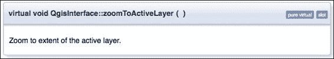

如果你不太熟悉 C++，这可能会相当令人困惑。幸运的是，作为一个 Python 程序员，你可以跳过很多复杂性，因为它们对你不适用。特别是：

+   `virtual`关键字是你不需要关心的实现细节

+   `void`表示该方法不返回任何值

+   `QgisInterface::zoomToActiveLayer`中的双冒号是 C++中用于分隔类名和方法名的约定

就像在 Python 中一样，括号表明该方法不接收任何参数。所以如果你有一个`QgisInterface`的实例（例如，作为 Python 控制台中的标准`iface`变量），你可以通过简单地输入以下内容来调用此方法：

```py
iface.zoomToActiveLayer()
```

现在，让我们看看一个稍微复杂一点的例子：`QgisInterface.addVectorLayer()`方法的 C++文档如下所示：

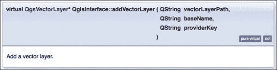

注意 `virtual` 关键字后面跟随的是 `QgsVectorLayer*` 而不是 `void`。这是此方法的返回值；它返回一个 `QgsVector` 对象。

### 注意

从技术上来说，`*` 表示该方法返回一个指向类型为 `QgsVectorLayer` 的对象的指针。幸运的是，Python 包装器会自动处理指针，因此您无需担心这一点。

注意文档底部对此方法的简要描述；虽然许多 C++ 方法几乎没有，甚至没有任何附加信息，但其他方法有更详细的信息。显然，您应该仔细阅读这些描述，因为它们会告诉您更多关于方法的功能。

即使没有任何描述，C++ 文档仍然很有用，因为它告诉您方法的名称、它接受哪些参数以及返回的数据类型。

在前面的方法中，您可以看到在括号之间列出了三个参数。由于 C++ 是一种强类型语言，因此在定义函数时必须定义每个参数的类型。这对 Python 程序员很有帮助，因为它告诉您应该提供什么类型的值。除了 QGIS 对象外，您还可能在 C++ 文档中遇到以下数据类型：

| 数据类型 | 描述 |
| --- | --- |
| `int` | 标准的 Python 整数值 |
| `long` | 标准的 Python 长整数值 |
| `float` | 标准的 Python 浮点（实数）数 |
| `bool` | 布尔值（`true` 或 `false`） |
| `QString` | 字符串值。请注意，QGIS Python 包装器会自动将 Python 字符串转换为 C++ 字符串，因此您无需直接处理 `QString` 对象 |
| `QList` | 此对象用于封装其他对象的列表。例如，`QList<QString*>` 表示字符串列表 |

就像在 Python 中一样，方法可以为每个参数设置默认值。例如，`QgisInterface.newProject()` 方法的样子如下：

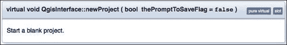

在此情况下，`thePromptToSaveFlag` 参数有一个默认值，如果没有提供值，将使用此默认值。

在 Python 中，类使用 `__init__` 方法进行初始化。在 C++ 中，这被称为构造函数。例如，`QgsLabel` 类的构造函数如下所示：

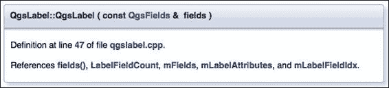

就像在 Python 中一样，C++ 类会 *继承* 它们的超类中定义的方法。幸运的是，QGIS 没有庞大的类层次结构，因此大多数类没有超类。但是，如果您在类的文档中找不到您要查找的方法，不要忘记检查超类。

最后，请注意，C++ 支持方法重载的概念。一个方法可以定义多次，其中每个版本接受不同的参数集。例如，看看 `QgsRectangle` 类的构造函数——您会看到有四种不同版本的这个方法。

第一个版本接受四个坐标作为浮点数：

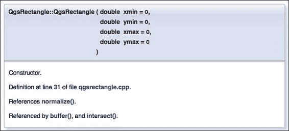

第二个版本使用两个 `QgsPoint` 对象构建一个矩形：

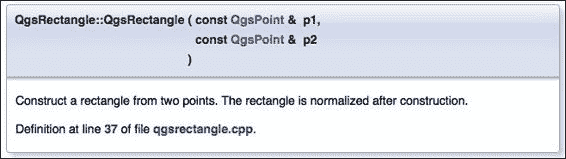

第三个版本将坐标从 `QRectF`（这是一个 Qt 数据类型）复制到一个 `QgsRectangle` 对象中：

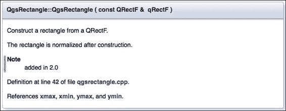

最后一个版本将坐标从另一个 `QgsRectangle` 对象复制过来：

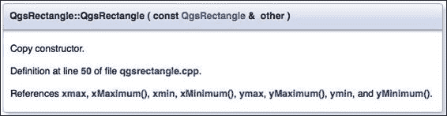

C++ 编译器根据提供的参数选择正确的方法。Python 没有方法重载的概念；只需选择接受您想要提供的参数的方法版本，QGIS Python 包装器将自动为您选择正确的方法。

如果您记住这些指南，解读 QGIS 的 C++ 文档并不那么困难。它看起来比实际更复杂，这要归功于所有特定的 C++ 复杂性。然而，您的头脑很快就会开始过滤掉 C++ 的混乱，您将能够几乎像阅读为 Python 编写的文档一样轻松地使用 QGIS 参考文档。

# 组织 QGIS Python 库

现在我们能够理解面向 C++ 的文档，让我们看看 PyQGIS 库是如何组织的。所有的 PyQGIS 库都组织在一个名为 `qgis` 的包下。然而，您通常不会直接导入 `qgis`，因为所有有趣的库都是这个主包内的子包；以下是构成 PyQGIS 库的五个包：

| `qgis.core` | 这提供了访问 QGIS 中使用的核心 GIS 功能。 |
| --- | --- |
| `qgis.gui` | 这定义了一系列 GUI 小部件，您可以将它们包含在自己的程序中。 |
| `qgis.analysis` | 这提供了分析矢量格式和栅格格式数据的空间分析工具。 |
| `qgis.networkanalysis` | 这提供了构建和分析拓扑的工具。 |
| `qgis.utils` | 这实现了允许您使用 Python 与 QGIS 应用程序一起工作的各种函数。 |

前两个包（`qgis.core` 和 `qgis.gui`）实现了 PyQGIS 库的最重要部分，花些时间熟悉它们定义的概念和类是值得的。现在让我们更详细地看看这两个包。

## `qgis.core` 包

`qgis.core`包定义了在整个 QGIS 系统中使用的根本类。这个包的大部分内容是专门用于处理矢量格式和栅格格式地理空间数据，并在地图中显示这些类型的数据。让我们看看这是如何实现的。

### 地图和地图图层

地图由多个图层组成，这些图层一个叠在另一个上面：

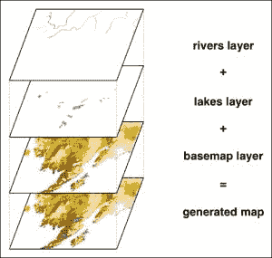

QGIS 支持三种类型的地图图层：

+   **矢量图层**：此图层绘制地理空间特征，如点、线和多边形

+   **栅格图层**：此图层将栅格（位图）数据绘制到地图上

+   **插件图层**：此图层允许插件直接在地图上绘制

这些类型的地图图层在`qgis.core`库中都有相应的类。例如，矢量地图图层将由`qgis.core.QgsVectorLayer`类型的对象表示。

我们将很快更详细地了解矢量图层和栅格图层。不过，在我们这样做之前，我们需要了解地理空间数据（矢量数据和栅格数据）是如何定位在地图上的。

### 坐标参考系统

由于地球是一个三维物体，而地图将地球表面表示为二维平面，因此必须有一种方法将地球表面的点转换为地图内的(x,y)坐标。这是通过使用**坐标参考系统**（**CRS**）来完成的：

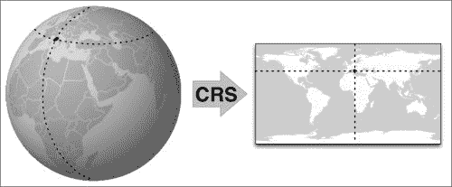

地球仪图像由维基媒体提供（[`commons.wikimedia.org/wiki/File:Rotating_globe.gif`](http://commons.wikimedia.org/wiki/File:Rotating_globe.gif)）

坐标参考系统（CRS）有两个部分：一个**椭球体**，它是地球表面的数学模型，以及一个**投影**，它是一个将球面上各点转换为地图上的(x,y)坐标的公式。

幸运的是，大多数时候，你可以简单地选择与你要使用的数据的 CRS 相匹配的适当 CRS。然而，由于多年来已经设计了多种不同的坐标参考系统，因此在绘制你的地理空间数据时使用正确的 CRS 至关重要。如果你不这样做，你的特征将显示在错误的位置或具有错误的形状。

今天大多数可用的地理空间数据使用**EPSG 4326**坐标参考系统（有时也称为 WGS84）。此 CRS 定义坐标为经纬度值。这是将新数据导入 QGIS 时使用的默认 CRS。但是，如果你的数据使用不同的坐标参考系统，你将需要为你的地图图层创建并使用不同的 CRS。

`qgis.core.QgsCoordinateReferenceSystem`类表示一个 CRS。一旦你创建了你的坐标参考系统，你可以告诉你的地图图层在访问底层数据时使用该 CRS。例如：

```py
crs = QgsCoordinateReferenceSystem(4326,
           QgsCoordinateReferenceSystem.EpsgCrsId)
layer.setCrs(crs)
```

注意，不同的地图图层可以使用不同的坐标参考系统。每个图层在将图层内容绘制到地图上时都会使用其自己的 CRS。

### 矢量图层

矢量层以点、线、多边形等形式将地理空间数据绘制到地图上。矢量格式的地理空间数据通常从**矢量数据源**（如 shapefile 或数据库）加载。其他矢量数据源可以在内存中存储矢量数据，或从互联网上的网络服务加载数据。

矢量格式数据源具有许多特征，其中每个特征代表数据源中的单个*记录*。`qgis.core.QgsFeature`类代表数据源中的特征。每个特征具有以下组件：

+   **ID**：这是特征在数据源中的唯一标识符

+   **几何形状**：这是地图上特征的底层点、线、多边形等，代表地图上的特征。例如，城市数据源会为每个城市有一个特征，几何形状通常是表示城市中心的点，或者表示城市轮廓的多边形（或多边形集合）。

+   **属性**：这些是键值对，提供了关于特征的额外信息。例如，代表城市的城市数据源可能具有`total_area`（总面积）、`population`（人口）、`elevation`（海拔）等属性。属性值可以是字符串、整数或浮点数。

在 QGIS 中，**数据提供者**允许矢量层访问数据源中的特征。数据提供者是一个`qgis.core.QgsVectorDataProvider`的实例，包括：

+   **几何类型**：这是在数据源中存储的几何类型

+   一个提供关于每个特征存储的属性信息的**字段**列表

+   使用`getFeatures()`方法和`QgsFeatureRequest`类在数据源中的特征中进行搜索的能力

您可以通过使用`qgis.core.QgsProviderRegistry`类来访问各种矢量（以及栅格）数据提供者。

矢量层本身由一个`qgis.core.QgsVectorLayer`对象表示。每个矢量层包括：

+   **数据提供者**：这是连接到包含要显示的地理空间信息的底层文件或数据库的连接

+   **坐标参考系统**：这表示地理空间数据使用哪个 CRS

+   **渲染器**：这决定了如何显示特征

让我们更详细地看看渲染器的概念以及如何在矢量地图层中显示特征。

#### 显示矢量数据

矢量地图层中的特征是通过**渲染器**和**符号**对象的组合来显示的。渲染器选择用于特定特征的符号，而符号执行实际的绘制。

QGIS 定义了三种基本的符号类型：

+   **标记符号**：这以填充圆的形式显示点

+   **线符号**：这使用给定的线宽和颜色绘制线

+   **填充符号**：这使用给定的颜色绘制多边形的内部

这三种类型的符号作为`qgis.core.QgsSymbolV2`类的子类实现：

+   `qgis.core.QgsMarkerSymbolV2`

+   `qgis.core.QgsLineSymbolV2`

+   `qgis.core.QgsFillSymbolV2`

    ### 注意

    你可能想知道为什么所有这些类的名称中都有“V2”。这是 QGIS 的历史特性。QGIS 的早期版本支持渲染的“旧”和“新”系统，而“V2”命名指的是新的渲染系统。旧的渲染系统已不再存在，但“V2”命名继续与现有代码保持向后兼容。

内部来说，符号相当复杂，使用“符号层”来在彼此之上绘制多个元素。然而，在大多数情况下，你可以使用“简单”版本的符号。这使得创建新符号时不必处理符号层的内部复杂性。例如：

```py
symbol = QgsMarkerSymbolV2.createSimple({'width' : 1.0,
                                         'color' : "255,0,0"})
```

当符号将特征绘制到地图上时，渲染器用于选择用于绘制特定特征的符号。在最简单的情况下，同一符号用于图层内的每个特征。这被称为**单个符号渲染器**，由`qgis.core.QgsSingleSymbolRenderV2`类表示。其他可能性包括：

+   **分类符号渲染器**（`qgis.core.QgsCategorizedSymbolRendererV2`）：此渲染器根据属性的值选择符号。分类符号渲染器具有属性值到符号的映射。

+   **渐变符号渲染器**（`qgis.core.QgsGraduatedSymbolRendererV2`）：此类渲染器使用属性值的范围，并将每个范围映射到适当的符号。

使用单个符号渲染器非常直接：

```py
symbol = ...
renderer = QgsSingleSymbolRendererV2(symbol)
layer.setRendererV2(renderer)
```

要使用分类符号渲染器，你首先定义一个`qgis.core.QgsRendererCategoryV2`对象的列表，然后使用它来创建渲染器。例如：

```py
symbol_male = ...
symbol_female = ...

categories = []
categories.append(QgsRendererCategoryV2("M", symbol_male, "Male"))
categories.append(QgsRendererCategoryV2("F", symbol_female,
                    "Female"))

renderer = QgsCategorizedSymbolRendererV2("", categories)
renderer.setClassAttribute("GENDER")
layer.setRendererV2(renderer)
```

注意，`QgsRendererCategoryV2`构造函数接受三个参数：所需的值、使用的符号以及用于描述该类别的标签。

最后，要使用渐变符号渲染器，你首先定义一个`qgis.core.QgsRendererRangeV2`对象的列表，然后使用它来创建你的渲染器。例如：

```py
symbol1 = ...
symbol2 = ...

ranges = []
ranges.append(QgsRendererRangeV2(0, 10, symbol1, "Range 1"))
ranges.append(QgsRendererRange(11, 20, symbol2, "Range 2"))

renderer = QgsGraduatedSymbolRendererV2("", ranges)
renderer.setClassAttribute("FIELD")
layer.setRendererV2(renderer)
```

#### 访问矢量数据

除了在地图中显示矢量图层的内容外，你还可以使用 Python 直接访问底层数据。这可以通过数据提供者的`getFeatures()`方法完成。例如，要遍历图层内的所有特征，你可以执行以下操作：

```py
provider = layer.dataProvider()
for feature in provider.getFeatures(QgsFeatureRequest()):
  ...
```

如果你想要根据某些标准搜索特征，你可以使用`QgsFeatureRequest`对象的`setFilterExpression()`方法，如下所示：

```py
provider = layer.dataProvider()
request = QgsFeatureRequest()
request.setFilterExpression('"GENDER" = "M"')
for feature in provider.getFeatures(QgsFeatureRequest()):
  ...
```

一旦你有了特征，很容易获取特征的几何形状、ID 和属性。例如：

```py
  geometry = feature.geometry()
  id = feature.id()
  name = feature.attribute("NAME")
```

`feature.geometry()`调用返回的对象，它将是一个`qgis.core.QgsGeometry`实例，代表特征的几何形状。此对象有大量你可以使用的方法来提取底层数据并执行各种地理空间计算。

#### 空间索引

在前面的章节中，我们根据属性值搜索特征。然而，有时您可能希望根据它们在空间中的位置来查找特征。例如，您可能希望找到所有位于给定点一定距离内的特征。为此，您可以使用**空间索引**，该索引根据特征的位置和范围进行索引。空间索引在 QGIS 中由`QgsSpatialIndex`类表示。

为了性能原因，不会为每个矢量图层自动创建空间索引。然而，当您需要时创建一个很容易：

```py
provider = layer.dataProvider()
index = QgsSpatialIndex()
for feature in provider.getFeatures(QgsFeatureRequest()):
  index.insertFeature(feature)
```

不要忘记，您可以使用`QgsFeatureRequest.setFilterExpression()`方法来限制添加到索引中的特征集。

一旦您有了空间索引，您就可以使用它来根据特征的位置执行查询。特别是：

+   您可以使用`nearestNeighbor()`方法找到与给定点最近的特征。例如：

    ```py
    features = index.nearestNeighbor(QgsPoint(long, lat), 5)
    ```

    注意，此方法需要两个参数：所需的点作为一个`QgsPoint`对象以及要返回的特征数量。

+   您可以使用`intersects()`方法找到与给定矩形区域相交的所有特征，如下所示：

    ```py
    features = index.intersects(QgsRectangle(left, bottom,
                         right, top))
    ```

### 栅格图层

栅格格式的地理空间数据本质上是一个位图图像，其中图像中的每个像素或“单元格”对应于地球表面的一个特定部分。栅格数据通常组织成**波段**，其中每个波段代表不同的信息。波段的一个常见用途是在单独的波段中存储像素颜色的红色、绿色和蓝色成分。波段也可能代表其他类型的信息，例如湿度水平、海拔或土壤类型。

栅格信息可以以多种方式显示。例如：

+   如果栅格数据只有一个波段，则像素值可以用作**调色板**的索引。调色板将每个像素值映射到特定的颜色。

+   如果栅格数据只有一个波段但没有提供调色板，则像素值可以直接用作**灰度**值；也就是说，较大的数字较亮，较小的数字较暗。或者，像素值可以通过**伪彩色算法**来计算要显示的颜色。

+   如果栅格数据有多个波段，那么通常，波段会被组合起来生成所需的颜色。例如，一个波段可能代表颜色的红色成分，另一个波段可能代表绿色成分，而另一个波段可能代表蓝色成分。

+   或者，可以使用调色板、灰度或伪彩色图像绘制多波段栅格数据源，通过选择用于颜色计算的特定波段。

让我们更仔细地看看如何将栅格数据绘制到地图上。

#### 栅格数据的显示方式

与栅格波段关联的**绘图风格**控制了栅格数据的显示方式。以下是目前支持的绘图风格：

| 绘图风格 | 描述 |
| --- | --- |
| `PalettedColor` | 对于单波段栅格数据源，调色板将每个栅格值映射到颜色。 |
| `SingleBandGray` | 对于单波段栅格数据源，栅格值直接用作灰度值。 |
| `SingleBandPseudoColor` | 对于单波段栅格数据源，栅格值用于计算伪颜色。 |
| `PalettedSingleBandGray` | 对于具有调色板的单波段栅格数据源，这种绘图风格告诉 QGIS 忽略调色板并直接使用栅格值作为灰度值。 |
| `PalettedSingleBandPseudoColor` | 对于具有调色板的单波段栅格数据源，这种绘图风格告诉 QGIS 忽略调色板并使用栅格值计算伪颜色。 |
| `MultiBandColor` | 对于多波段栅格数据源，为红色、绿色和蓝色颜色组件分别使用一个单独的波段。对于这种绘图风格，可以使用`setRedBand()`、`setGreenBand()`和`setBlueBand()`方法来选择每个颜色组件使用的波段。 |
| `MultiBandSingleBandGray` | 对于多波段栅格数据源，选择一个波段用作灰度颜色值。对于这种绘图风格，使用`setGrayBand()`方法指定要使用的波段。 |
| `MultiBandSingleBandPseudoColor` | 对于多波段栅格数据源，选择一个波段用于计算伪颜色。对于这种绘图风格，使用`setGrayBand()`方法指定要使用的波段。 |

要设置绘图风格，使用`layer.setDrawingStyle()`方法，传入包含所需绘图风格名称的字符串。您还需要调用前面表格中描述的各个`setXXXBand()`方法，以告诉栅格层哪些波段包含用于绘制每个像素的值。

注意，当您调用前面的函数来更改栅格数据的显示方式时，QGIS 不会自动更新地图。要立即显示您的更改，您需要执行以下操作：

1.  关闭栅格图像缓存。这可以通过调用`layer.setImageCache(None)`来实现。

1.  告诉栅格层重新绘制自身，通过调用`layer.triggerRepaint()`。

#### 访问栅格数据

与矢量格式数据一样，您可以通过数据提供者的`identify()`方法访问底层栅格数据。这样做最简单的方法是传入一个坐标并检索该坐标处的值或值。例如：

```py
provider = layer.dataProvider()
values = provider.identify(QgsPoint(x, y),
              QgsRaster.IdentifyFormatValue)
if values.isValid():
  for band,value in values.results().items():
    ...
```

如您所见，您需要检查给定坐标是否存在于栅格数据中（使用`isValid()`调用）。`values.results()`方法返回一个将波段编号映射到值的字典。

使用这种技术，您可以提取与栅格层中给定坐标相关联的所有底层数据。

### 提示

你还可以使用 `provider.block()` 方法一次性检索大量坐标的波段数据。我们将在本章后面讨论如何做到这一点。

### 其他有用的 qgis.core 类

除了所有涉及数据源和地图图层操作的相关类和功能外，`qgis.core` 库还定义了其他一些你可能觉得有用的类：

| 类 | 描述 |
| --- | --- |
| `QgsProject` | 这代表当前的 QGIS 项目。请注意，这是一个单例对象，因为一次只能打开一个项目。`QgsProject` 类负责加载和存储属性，这对于插件可能很有用。 |
| `QGis` | 这个类定义了 QGIS 系统中使用的各种常量、数据类型和函数。 |
| `QgsPoint` | 这是一个通用类，用于存储二维平面内点的坐标。 |
| `QgsRectangle` | 这是一个通用类，用于存储二维平面内矩形区域的坐标。 |
| `QgsRasterInterface` | 这是处理栅格数据的基础类，例如，将一组栅格数据重新投影到新的坐标系中，应用过滤器以改变栅格数据的亮度和颜色，重采样栅格数据，以及通过以各种方式渲染现有数据来生成新的栅格数据。 |
| `QgsDistanceArea` | 这个类可以用来计算给定几何形状的距离和面积，自动将源坐标参考系统转换为米。 |
| `QgsMapLayerRegistry` | 这个类提供了对当前项目中所有已注册地图图层的访问。 |
| `QgsMessageLog` | 这个类在 QGIS 程序中提供了一般的日志功能。这让你可以将调试消息、警告和错误发送到 QGIS 的“日志消息”面板。 |

## qgis.gui 包

`qgis.gui` 包定义了一系列用户界面小部件，你可以将其包含在你的程序中。让我们首先看看最重要的 `qgis.gui` 类，然后简要地看看一些你可能觉得有用的其他类。

### QgisInterface 类

`QgisInterface` 代表 QGIS 系统的用户界面。它允许以编程方式访问地图画布、菜单栏和其他 QGIS 应用程序的各个部分。当在脚本或插件中运行 Python 代码，或直接从 QGIS Python 控制台运行时，通常可以通过 `iface` 全局变量获得对 `QgisInterface` 的引用。

### 注意

`QgisInterface` 对象仅在运行 QGIS 应用程序本身时才可用。如果你正在运行外部应用程序并将 PyQGIS 库导入到你的应用程序中，`QgisInterface` 将不可用。

你可以使用 `QgisInterface` 对象做一些更重要的事情：

+   通过 `legendInterface()` 方法获取当前 QGIS 项目中图层列表的引用。

+   使用 `mapCanvas()` 方法获取主应用程序窗口中显示的地图画布的引用。

+   使用 `activeLayer()` 方法检索项目中的当前活动层，并使用 `setActiveLayer()` 方法设置当前活动层。

+   通过调用 `mainWindow()` 方法获取应用程序的主窗口引用。如果您想创建使用主窗口作为其父窗口的附加 Qt 窗口或对话框，这可能很有用。

+   通过调用 `messageBar()` 方法获取 QGIS 系统的消息栏引用。这允许您在 QGIS 主窗口中直接向用户显示消息。

### QgsMapCanvas 类

**地图画布**负责将各种地图层绘制到窗口中。`QgsMapCanvas` 类代表一个地图画布。此类包括：

+   当前显示的**地图层**列表。可以使用 `layers()` 方法访问。

    ### 小贴士

    注意，地图画布内可用的地图层列表与 `QgisInterface.legendInterface()` 方法中包含的地图层列表之间有一个细微的区别。地图画布的层列表仅包括当前可见的层列表，而 `QgisInterface.legendInterface()` 返回所有地图层，包括当前隐藏的层。

+   该地图使用的**地图单位**（米、英尺、度等）。可以通过调用 `mapUnits()` 方法检索地图的单位。

+   **范围**，即当前在画布中显示的地图区域。当用户缩放和平移地图时，地图的范围将发生变化。可以通过调用 `extent()` 方法获取当前地图的范围。

+   **当前地图工具**，用于控制用户与地图画布内容的交互。可以使用 `setMapTool()` 方法设置当前地图工具，并通过调用 `mapTool()` 方法检索当前地图工具（如果有）。

+   用于绘制所有地图层背景的**背景颜色**。您可以通过调用 `canvasColor()` 方法来更改地图的背景颜色。

+   **坐标转换**，将地图坐标（即数据源坐标参考系中的坐标）转换为窗口内的像素。您可以通过调用 `getCoordinateTransform()` 方法检索当前坐标转换。

### QgsMapCanvasItem 类

**地图画布项**是在地图画布上绘制的项。地图画布项将出现在地图层之前。虽然您可以根据需要创建 `QgsMapCanvasItem` 的子类以在地图画布上绘制自定义项，但您会发现使用现有的子类更容易，这些子类为您做了很多工作。目前有三个 `QgsMapCanvasItem` 的子类可能对您有用：

+   `QgsVertexMarker`：在地图上给定点的周围绘制一个图标（一个 "X"、一个 "+" 或一个小方块）。

+   `QgsRubberBand`：这将在地图上绘制任意多边形或多段线。它的目的是在用户在地图上绘制多边形时提供视觉反馈。

+   `QgsAnnotationItem`：这用于以气球的形式显示有关要素的附加信息，该气球与要素相连。`QgsAnnotationItem` 类有各种子类，允许您自定义信息显示的方式。

### QgsMapTool 类

**地图工具**允许用户与地图画布进行交互和操作，捕获鼠标事件并做出相应的响应。许多 `QgsMapTool` 子类提供了标准地图交互行为，例如点击放大、拖动平移地图以及点击要素进行识别。您还可以通过继承 `QgsMapTool` 并实现响应用户界面事件的各种方法来创建自己的自定义地图工具，例如按下鼠标按钮、拖动画布等。

一旦您创建了地图工具，您可以通过将地图工具与工具栏按钮关联来允许用户激活它。或者，您也可以通过在您的 Python 代码中调用 `mapCanvas.setMapTool(...)` 方法来激活它。

我们将在 *使用 PyQGIS 库* 这一部分中查看创建您自己的自定义地图工具的过程。

### 其他有用的 qgis.gui 类

虽然 `qgis.gui` 包定义了大量的类，但您最可能发现有用的类在以下表中给出：

| 班级 | 描述 |
| --- | --- |
| `QgsLegendInterface` | 这提供了访问地图图例的途径，即当前项目中的地图图层列表。请注意，地图图层可以在图例中分组、隐藏和显示。 |
| `QgsMapTip` | 当用户将鼠标悬停在要素上时，在地图画布上显示提示。地图提示将显示要素的显示字段；您可以通过调用 `layer.setDisplayField("FIELD")` 来设置此字段。 |
| `QgsColorDialog` | 这是一个允许用户选择颜色的对话框。 |
| `QgsDialog` | 这是一个具有垂直框布局和按钮框的通用对话框，这使得向对话框中添加内容和标准按钮变得容易。 |
| `QgsMessageBar` | 这是一个显示非阻塞消息给用户的栏。我们在上一章中讨论了消息栏类。 |
| `QgsMessageViewer` | 这是一个通用类，它在一个模态对话框中向用户显示长消息。 |
| `QgsBlendModeComboBox` `QgsBrushStyleComboBox` `QgsColorRampComboBox` `QgsPenCapStyleComboBox` `QgsPenJoinStyleComboBox` `QgsScaleComboBox` | 这些 `QComboBox` 用户界面小部件允许您提示用户选择各种绘图选项。除了允许用户选择地图比例的 `QgsScaleComboBox` 之外，所有其他的 `QComboBox` 子类都允许用户选择各种 Qt 绘图选项。 |

# 使用 PyQGIS 库

在上一节中，我们查看了一些由 PyQGIS 库提供的类。让我们利用这些类来执行一些实际的地理空间开发任务。

## 分析栅格数据

我们将首先编写一个程序来加载一些栅格格式数据并分析其内容。为了使这个过程更有趣，我们将使用**数字高程模型**（**DEM**）文件，这是一种包含高程数据的栅格格式数据文件。

**全球陆地一千米基础高程项目**（**GLOBE**）为全球提供免费的 DEM 数据，其中每个像素代表地球表面的一个平方公里。GLOBE 数据可以从[`www.ngdc.noaa.gov/mgg/topo/gltiles.html`](http://www.ngdc.noaa.gov/mgg/topo/gltiles.html)下载。下载 E 图块，它包括美国西部的一半。生成的文件，命名为`e10g`，包含您所需的高度信息。您还需要下载`e10g.hdr`头文件，以便 QGIS 能够读取该文件——您可以从[`www.ngdc.noaa.gov/mgg/topo/elev/esri/hdr`](http://www.ngdc.noaa.gov/mgg/topo/elev/esri/hdr)下载。一旦下载了这两个文件，将它们合并到一个方便的目录中。

您现在可以使用以下代码将 DEM 数据加载到 QGIS 中：

```py
registry = QgsProviderRegistry.instance()
provider = registry.provider("gdal", "/path/to/e10g")
```

不幸的是，这里有一点复杂性。由于 QGIS 不知道数据使用的是哪个坐标参考系统，它会显示一个对话框，要求您选择 CRS。由于 GLOBE DEM 数据位于 WGS84 CRS 中，这是 QGIS 默认使用的，因此此对话框是多余的。为了禁用它，我们需要在程序顶部添加以下内容：

```py
from PyQt4.QtCore import QSettings
QSettings().setValue("/Projections/defaultBehaviour", "useGlobal")
```

现在我们已经将我们的栅格 DEM 数据加载到 QGIS 中，我们可以分析它了。虽然我们可以用 DEM 数据做很多事情，但让我们计算数据中每个唯一高程值出现的频率。

### 注意

注意，我们正在直接使用`QgsRasterDataProvider`加载 DEM 数据。我们不想在地图上显示这些信息，因此我们不想（或不需要）将其加载到`QgsRasterLayer`中。

由于 DEM 数据是栅格格式，您需要遍历单个像素或单元格以获取每个高度值。`provider.xSize()`和`provider.ySize()`方法告诉我们 DEM 中有多少个单元格，而`provider.extent()`方法给出了 DEM 覆盖的地球表面区域。使用这些信息，我们可以以下述方式从 DEM 的内容中提取单个高程值：

```py
raster_extent = provider.extent()
raster_width = provider.xSize()
raster_height = provider.ySize()
block = provider.block(1, raster_extent, raster_width,
            raster_height)
```

返回的`block`变量是`QgsRasterBlock`类型的一个对象，它本质上是一个值的二维数组。让我们遍历栅格并提取单个高程值：

```py
for x in range(raster_width):
  for y in range(raster_height):
    elevation = block.value(x, y)
    ....
```

现在我们已经加载了单个高程值，很容易从这些值中构建直方图。以下是整个程序，用于将 DEM 数据加载到内存中，然后计算并显示直方图：

```py
from PyQt4.QtCore import QSettings
QSettings().setValue("/Projections/defaultBehaviour", "useGlobal")

registry = QgsProviderRegistry.instance()
provider = registry.provider("gdal", "/path/to/e10g")

raster_extent = provider.extent()
raster_width = provider.xSize()
raster_height = provider.ySize()
no_data_value = provider.srcNoDataValue(1)

histogram = {} # Maps elevation to number of occurrences.

block = provider.block(1, raster_extent, raster_width,
            raster_height)
if block.isValid():
  for x in range(raster_width):
    for y in range(raster_height):
      elevation = block.value(x, y)
      if elevation != no_data_value:
        try:
          histogram[elevation] += 1
        except KeyError:
          histogram[elevation] = 1

for height in sorted(histogram.keys()):
  print height, histogram[height]
```

注意，我们在代码中添加了一个 *无数据值* 检查。栅格数据通常包括没有与之关联值的像素。在 DEM 的情况下，高程数据仅提供陆地区域的数据；海洋上的像素没有高程，我们必须排除它们，否则我们的直方图将不准确。

## 操作矢量数据并将其保存为 shapefile

让我们创建一个程序，该程序接受两个矢量数据源，从另一个数据源中减去一组矢量，并将结果几何体保存到一个新的 shapefile 中。在这个过程中，我们将了解 PyQGIS 库的一些重要内容。

我们将使用 `QgsGeometry.difference()` 函数。此函数执行从一个几何体到另一个几何体的几何减法，如下所示：

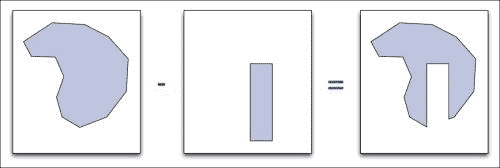

让我们先让用户选择第一个 shapefile，并为该文件打开一个矢量数据提供者：

```py
filename_1 = QFileDialog.getOpenFileName(iface.mainWindow(),
                     "First Shapefile",
                     "~", "*.shp")
if not filename_1:
  return

registry = QgsProviderRegistry.instance()
provider_1 = registry.provider("ogr", filename_1)
```

然后，我们可以从该文件中读取几何体到内存中：

```py
geometries_1 = []
for feature in provider_1.getFeatures(QgsFeatureRequest()):
  geometries_1.append(QgsGeometry(feature.geometry()))
```

这段代码的最后一句包含了一个重要的特性。注意，我们使用以下方法：

```py
QgsGeometry(feature.geometry())
```

我们使用前面的行而不是以下行：

```py
feature.geometry()
```

这是为了获取要添加到列表中的几何体对象。换句话说，我们必须基于现有几何体对象创建一个新的几何体对象。这是 QGIS Python 包装器工作方式的一个限制：`feature.geometry()` 方法返回一个几何体的引用，但 C++ 代码不知道你在 Python 代码中将这个引用存储起来。所以，当特征不再需要时，特征几何体使用的内存也会被释放。如果你后来尝试访问该几何体，整个 QGIS 系统将会崩溃。为了解决这个问题，我们创建几何体的一个副本，这样我们就可以在特征内存释放后仍然引用它。

现在我们已经将第一组几何体加载到内存中，让我们对第二个 shapefile 也做同样的操作：

```py
filename_2 = QFileDialog.getOpenFileName(iface.mainWindow(),
                     "Second Shapefile",
                     "~", "*.shp")
if not filename_2:
  return

provider_2 = registry.provider("ogr", filename_2)

geometries_2 = []
for feature in provider_2.getFeatures(QgsFeatureRequest()):
  geometries_2.append(QgsGeometry(feature.geometry()))
```

当两组几何体被加载到内存中后，我们就可以开始从一组中减去另一组了。然而，为了使这个过程更高效，我们将第二个 shapefile 中的几何体合并成一个大的几何体，然后一次性减去，而不是逐个减去。这将使减法过程变得更快：

```py
combined_geometry = None
for geometry in geometries_2:
  if combined_geometry == None:
    combined_geometry = geometry
  else:
    combined_geometry = combined_geometry.combine(geometry)
```

我们现在可以通过减去一个来计算新的几何体集：

```py
dst_geometries = []
for geometry in geometries_1:
  dst_geometry = geometry.difference(combined_geometry)
  if not dst_geometry.isGeosValid(): continue
  if dst_geometry.isGeosEmpty(): continue
  dst_geometries.append(dst_geometry)
```

注意，我们检查目标几何体是否在数学上是有效的，并且不为空。

### 注意

在操作复杂形状时，无效的几何体是一个常见问题。有修复它们的方法，例如将多几何体分开并执行缓冲操作。然而，这超出了本书的范围。

我们最后的任务是保存结果几何体到一个新的 shapefile 中。我们首先会要求用户输入目标 shapefile 的名称：

```py
dst_filename = QFileDialog.getSaveFileName(iface.mainWindow(),
                      "Save results to:",
                      "~", "*.shp")
if not dst_filename:
  return
```

我们将使用**矢量文件写入器**将几何形状保存到形状文件中。让我们首先初始化文件写入器对象：

```py
fields = QgsFields()
writer = QgsVectorFileWriter(dst_filename, "ASCII", fields,
               dst_geometries[0].wkbType(),
               None, "ESRI Shapefile")
if writer.hasError() != QgsVectorFileWriter.NoError:
  print "Error!"
  return
```

我们的形状文件中没有属性，因此字段列表为空。现在写入器已经设置好，我们可以将几何形状保存到文件中：

```py
for geometry in dst_geometries:
  feature = QgsFeature()
  feature.setGeometry(geometry)
  writer.addFeature(feature)
```

现在所有数据都已写入磁盘，让我们显示一个消息框，通知用户我们已经完成：

```py
QMessageBox.information(iface.mainWindow(), "",
            "Subtracted features saved to disk.")
```

如您所见，在 PyQGIS 中创建新的形状文件非常简单，使用 Python 操作几何形状也很容易——只要您复制您想要保留的`QgsGeometry`对象。如果您的 Python 代码在操作几何形状时开始崩溃，这可能是您应该首先查找的问题。

## 在地图中使用不同符号表示不同特征

让我们使用在上一章中下载的世界边界数据集来绘制世界地图，为不同的洲使用不同的符号。这是一个使用分类符号渲染器的良好示例，尽管我们将将其组合到一个脚本中，该脚本将将形状文件加载到地图层中，并设置符号和地图渲染器以显示您想要的地图。然后我们将保存生成的地图为图像。

让我们首先创建一个地图层来显示世界边界数据集形状文件的内容：

```py
layer = iface.addVectorLayer("/path/to/TM_WORLD_BORDERS-0.3.shp", 
               "continents", "ogr")
```

世界边界数据集形状文件中的每个唯一区域代码对应一个洲。我们想要定义每个这些区域使用的名称和颜色，并使用这些信息来设置显示地图时使用的各种类别：

```py
from PyQt4.QtGui import QColor
categories = []
for value,color,label in [(0,   "#660000", "Antarctica"),
                          (2,   "#006600", "Africa"),
                          (9,   "#000066", "Oceania"),
                          (19,  "#660066", "The Americas"),
                          (142, "#666600", "Asia"),
                          (150, "#006666", "Europe")]:
  symbol = QgsSymbolV2.defaultSymbol(layer.geometryType())
  symbol.setColor(QColor(color))
  categories.append(QgsRendererCategoryV2(value, symbol, label))
```

在设置好这些类别后，我们只需更新地图层以使用基于`region`属性值的分类渲染器，然后重新绘制地图：

```py
layer.setRendererV2(QgsCategorizedSymbolRendererV2("region",
                          categories))
layer.triggerRepaint()
```

由于这是一个可以多次运行的脚本，让我们让我们的脚本在添加新层之前自动删除现有的`continents`层（如果存在）。为此，我们可以在脚本的开头添加以下内容：

```py
layer_registry = QgsMapLayerRegistry.instance()
for layer in layer_registry.mapLayersByName("continents"):
  layer_registry.removeMapLayer(layer.id())
```

现在当我们的脚本运行时，它将创建一个（并且只有一个）层，显示不同颜色的各种大陆。这些在打印的书中将显示为不同的灰色阴影，但在计算机屏幕上颜色将是可见的：

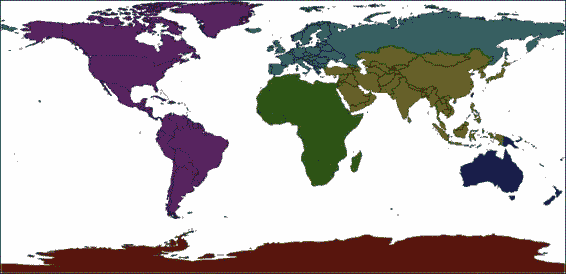

现在，让我们使用相同的数据集根据每个国家的相对人口对其进行着色。我们首先删除现有的`"population"`层（如果存在）：

```py
layer_registry = QgsMapLayerRegistry.instance()
for layer in layer_registry.mapLayersByName("population"):
  layer_registry.removeMapLayer(layer.id())
```

接下来，我们将世界边界数据集打开到一个新的层中，称为`"population"`：

```py
layer = iface.addVectorLayer("/path/to/TM_WORLD_BORDERS-0.3.shp", 
               "population", "ogr")
```

然后，我们需要设置我们的各种人口范围：

```py
from PyQt4.QtGui import QColor
ranges = []
for min_pop,max_pop,color in [(0,        99999,     "#332828"),
                              (100000,   999999,    "#4c3535"),
                              (1000000,  4999999,   "#663d3d"),
                              (5000000,  9999999,   "#804040"),
                              (10000000, 19999999,  "#993d3d"),
                              (20000000, 49999999,  "#b33535"),
                              (50000000, 999999999, "#cc2828")]:
  symbol = QgsSymbolV2.defaultSymbol(layer.geometryType())
  symbol.setColor(QColor(color))
  ranges.append(QgsRendererRangeV2(min_pop, max_pop,
                   symbol, ""))
```

现在我们有了人口范围及其相关颜色，我们只需设置一个渐变符号渲染器，根据`pop2005`属性值选择符号，并告诉地图重新绘制自己：

```py
layer.setRendererV2(QgsGraduatedSymbolRendererV2("pop2005",
                         ranges))
layer.triggerRepaint()
```

结果将是一个地图层，根据每个国家的人口进行着色：

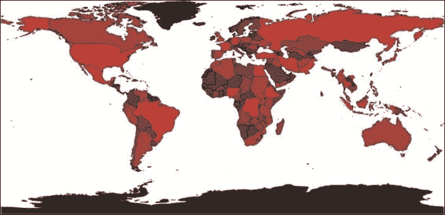

## 计算两个用户定义点之间的距离

在我们使用 PyQGIS 库的最后一个示例中，我们将编写一些代码，当运行时，它将开始监听用户的鼠标事件。如果用户点击一个点，拖动鼠标，然后再次释放鼠标按钮，我们将显示这两个点之间的距离。这是一个如何将您自己的地图交互逻辑添加到 QGIS 中的好例子，使用 `QgsMapTool` 类。

这是我们的 `QgsMapTool` 子类的结构基础：

```py
class DistanceCalculator(QgsMapTool):
  def __init__(self, iface):
    QgsMapTool.__init__(self, iface.mapCanvas())
    self.iface = iface

  def canvasPressEvent(self, event):
    ...

  def canvasReleaseEvent(self, event):
    ...
```

要使这个地图工具生效，我们将创建一个新的实例并将其传递给 `mapCanvas.setMapTool()` 方法。一旦完成，当用户在地图画布上点击或释放鼠标按钮时，我们的 `canvasPressEvent()` 和 `canvasReleaseEvent()` 方法将被调用。

让我们从响应用户在画布上点击的代码开始。在这个方法中，我们将从用户点击的像素坐标转换为相应的地图坐标（即纬度和经度值）。然后我们将记住这些坐标，以便以后可以引用它们。以下是必要的代码：

```py
def canvasPressEvent(self, event):
  transform = self.iface.mapCanvas().getCoordinateTransform()
  self._startPt = transform.toMapCoordinates(event.pos().x(),
                        event.pos().y())
```

当调用 `canvasReleaseEvent()` 方法时，我们希望对用户释放鼠标按钮的点执行相同的操作：

```py
def canvasReleaseEvent(self, event):
  transform = self.iface.mapCanvas().getCoordinateTransform()
  endPt = transform.toMapCoordinates(event.pos().x(),
                    event.pos().y())
```

现在我们有了两个所需的坐标，我们想要计算它们之间的距离。我们可以使用 `QgsDistanceArea` 对象来完成这项工作：

```py
  crs = self.iface.mapCanvas().mapRenderer().destinationCrs()
  distance_calc = QgsDistanceArea()
  distance_calc.setSourceCrs(crs)
  distance_calc.setEllipsoid(crs.ellipsoidAcronym())
  distance_calc.setEllipsoidalMode(crs.geographicFlag())
  distance = distance_calc.measureLine([self._startPt,
                     endPt]) / 1000
```

注意，我们将结果值除以 1000。这是因为 `QgsDistanceArea` 对象返回的距离是以米为单位的，而我们希望以千米为单位显示距离。

最后，我们将计算出的距离显示在 QGIS 消息栏中：

```py
  messageBar = self.iface.messageBar()
  messageBar.pushMessage("Distance = %d km" % distance,
              level=QgsMessageBar.INFO,
              duration=2)
```

现在我们已经创建了我们的地图工具，我们需要激活它。我们可以通过将以下内容添加到脚本末尾来实现：

```py
calculator = DistanceCalculator(iface)
iface.mapCanvas().setMapTool(calculator)
```

在地图工具激活后，用户可以在地图上点击并拖动。当鼠标按钮释放时，两个点之间的距离（以千米为单位）将在消息栏中显示：

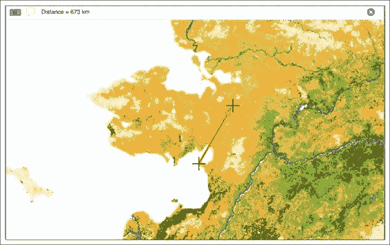

# 摘要

在本章中，我们深入探讨了 PyQGIS 库以及如何在您的程序中使用它们。我们了解到，QGIS Python 库作为 C++ 中实现的 QGIS API 的包装器来实现。我们看到了 Python 程序员如何理解和使用 QGIS 参考文档，尽管它是为 C++ 开发人员编写的。我们还了解了 PyQGIS 库是如何组织成不同的包的，并学习了在 `qgis.core` 和 `qgis.gui` 包中定义的最重要类。

然后，我们看到了如何使用坐标参考系统（CRS）将地球三维表面上的点转换为二维地图平面内的坐标。

我们了解到矢量格式数据由特征组成，其中每个特征都有一个 ID、一个几何形状和一组属性，并且使用符号在地图层上绘制矢量几何形状，而渲染器用于选择给定特征应使用的符号。

我们了解到如何使用空间索引来加速对矢量特征的访问。

接着，我们看到了栅格格式数据是如何组织成代表颜色、高程等信息的光谱的，并探讨了在地图层中显示栅格数据源的各种方法。在这个过程中，我们学习了如何访问栅格数据源的内容。

最后，我们探讨了使用 PyQGIS 库执行有用任务的各种技术。

在下一章中，我们将学习更多关于 QGIS Python 插件的内容，然后继续使用插件架构作为在地图应用程序中实现有用功能的一种方式。
