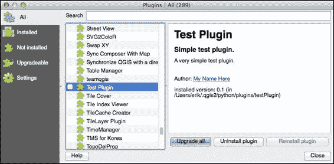
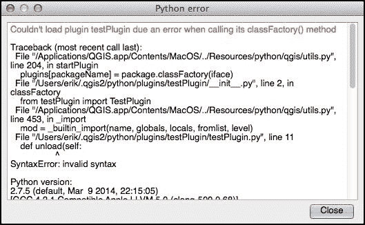
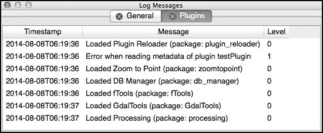
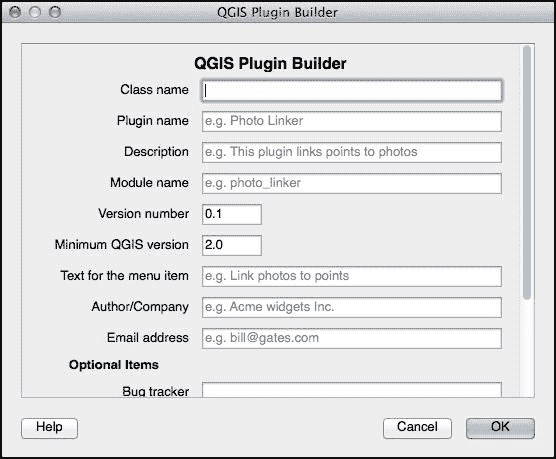
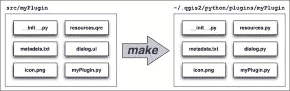
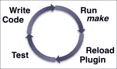
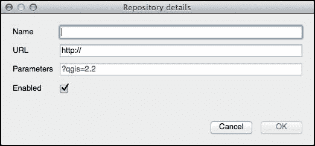
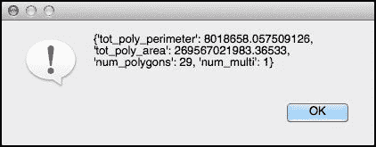
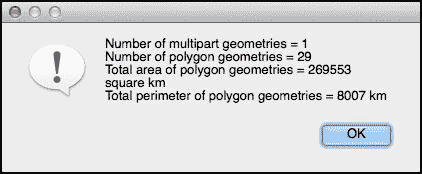

# 第四章 创建 QGIS 插件

在第一章中，我们简要地了解了 QGIS Python 插件的组织方式。在本章中，我们将利用这些知识来创建两个插件：一个简单的“Hello World”风格插件，以便您了解过程，以及一个更复杂、更有用的插件，它可以显示关于点击的几何体的信息。在这个过程中，我们将学习插件的工作原理，如何创建和分发插件，插件将允许我们做什么，以及将您的映射应用程序作为 QGIS 插件实现的一些可能性和局限性。

# 准备就绪

在我们深入插件开发过程之前，您需要做三件事：

1.  从 Qt 开发者网站([`qt-project.org`](http://qt-project.org))安装**Qt 开发者工具**。

1.  从[`www.riverbankcomputing.co.uk/software/pyqt`](http://www.riverbankcomputing.co.uk/software/pyqt)安装 Qt 的 Python 绑定，称为**PyQt**。虽然我们不会直接使用 Python 绑定，但 PyQt 中包含两个我们将需要的命令行工具。

    ### 小贴士

    QGIS 目前基于 PyQt4。请确保您安装 Qt 开发者工具和 PyQt 绑定的第 4 版本，以确保您获得兼容版本。

    PyQt 可以作为 MS Windows 的安装程序和 Linux 的源代码形式提供。对于 Mac OS X 用户，可以在[`sourceforge.net/projects/pyqtx`](http://sourceforge.net/projects/pyqtx)找到二进制安装程序。

1.  您应该安装并启用 QGIS 的**插件重载器**插件。这使得开发测试插件变得更加容易。为此，您需要通过从**插件**菜单中选择**管理并安装插件…**项，点击**设置**选项卡，然后打开**显示实验性插件**复选框来开启实验性插件支持。您将能够看到实验性插件，包括插件重载器。选择此插件，然后点击**安装插件**按钮进行安装。

    插件重载器向 QGIS 工具栏中添加了按钮，您可以通过点击这些按钮来重新加载您的插件：

    

    这允许您对插件进行修改并立即看到结果。如果没有插件重载器，您将不得不退出并重新启动 QGIS 才能使您的更改生效。

# 理解 QGIS 插件架构

正如我们在第一章中看到的，QGIS 插件存储在`~/.qgis2/python/plugins`目录中，作为 Python 包。

### 小贴士

根据您的操作系统和您使用的 QGIS 版本，`.qgis2`目录可能被命名为`.qgis`。

插件的包包括多个 Python 模块和其他文件。至少，插件包必须包括：

+   `__init__.py`：这是一个包初始化模块，其中包含**类工厂**函数，该函数创建并初始化插件。

+   `metadata.txt`：这是一个包含有关插件信息的文本文件，包括插件的版本号、插件名称和插件作者。

此外，大多数插件还会包括：

+   一个单独的 Python 模块，其中包含插件的类定义。插件类实现了一些特别命名的、用于启动和关闭插件的方法。

+   一个或多个扩展名为`.ui`的用户界面模板文件。

+   每个用户界面模板的编译版本，形式为一个与模板同名的 Python 模块。

+   一个`resources.qrc`文件，这是一个 XML 格式文件，列出了插件使用的各种图像和其他资源。

+   资源文件的编译版本，形式为一个名为`resources.py`的 Python 模块。

各种`.ui`模板文件是使用**Qt Designer**创建的，它是标准 Qt 安装的一部分。将`.qrc`和`.ui`文件转换为 Python 模块的命令行工具是 PyQt 的一部分。

当 QGIS 启动时，它会查找在`~/.qgis2/python/plugins`目录中找到的各个 Python 包。对于每个包，它会尝试调用插件`__init__.py`文件中的顶级函数`ClassFactory()`。这个函数应该导入并返回插件对象的实例，如下所示：

```py
  def ClassFactory(iface):
  from myPlugin import MyPlugin
  return MyPlugin(iface)
```

### 小贴士

显然，当你编写真正的插件时，你应该将`myPlugin`（以及`MyPlugin`）的名称改为更有意义的东西。

虽然通常会在单独的模块中定义插件，但如果你愿意，也可以直接在`__init__.py`模块中创建它。重要的是要定义一个提供以下方法的类：

+   `__init__(iface)`：这个方法初始化插件对象。请注意，这应该接受传递给类工厂的`iface`变量并将其存储在实例变量中以供以后使用。

+   `initGui()`：这个方法初始化插件的用户界面。这通常涉及将插件添加到 QGIS 菜单和工具栏，并设置信号处理程序以响应各种事件。

+   `unload()`：这个方法移除插件的用户界面元素。这通常包括从 QGIS 菜单和工具栏中移除插件，以及断开在插件的`initGui()`方法中定义的信号处理程序。

`__init__(iface)`方法由你的类工厂函数调用以初始化插件对象本身。然后，当程序启动或用户安装插件时，QGIS 会调用`initGui()`方法。最后，当用户卸载插件或 QGIS 关闭时，会调用`unload()`方法。

插件通常在 QGIS 启动时不会立即运行。相反，它安装各种菜单和工具栏项，用户可以选择这些项来执行各种操作。例如，一个简单的插件可能只有一个菜单项和一个工具栏项，当用户选择其中一个时，插件执行其唯一且仅有的操作。更复杂的插件可能有各种菜单和工具栏项，每个项执行不同的操作。

许多插件使用 `iface.addPluginToMenu()` 方法将其菜单项添加到 **插件** 菜单中。这为插件的菜单项在 **插件** 菜单中创建了一个子菜单，使用户能够轻松地看到哪些菜单项是由某个插件提供的。或者，插件可能会选择将其菜单项添加到 **向量**、**栅格** 或 **数据库** 菜单中的现有子菜单中，具体取决于情况。

以同样的方式，插件可能会将其图标或小部件添加到插件工具栏中，或者如果它更喜欢的话，添加到其他工具栏中。如果插件想要的话，它还可以在 QGIS 窗口中添加一个全新的工具栏。

# 创建一个简单的插件

现在我们已经看到了插件的结构和使用方法，让我们创建一个非常简单的 "Hello World" 风格的插件，看看制作一个插件需要哪些步骤。虽然有一些工具，如 **插件构建器** 插件，可以为您创建各种文件，但我们将避免使用它们，而是手动创建插件。这将使过程更清晰，并避免出现代码在没有了解原因或方式的情况下神奇地工作的情况。

前往 `~/.qgis2/python/plugins` 目录，并创建一个名为 `testPlugin` 的子目录。在这个目录中，创建一个名为 `metadata.txt` 的文件，并将以下值输入到其中：

```py
[general]
name=Test Plugin
email=test@example.com
author=My Name Here
qgisMinimumVersion=2.0
description=Simple test plugin.
about=A very simple test plugin.
version=version 0.1
```

这是您为插件需要输入的最小元数据。显然，如果您想的话，可以更改这些值。现在，创建一个包初始化文件，`__init__.py`，并将以下内容输入到该文件中：

```py
def classFactory(iface):
  from testPlugin import TestPlugin
  return TestPlugin(iface)
```

如您所见，我们将定义一个名为 `TestPlugin` 的类，它代表我们的插件对象，并在名为 `testPlugin.py` 的模块中实现它。现在让我们创建这个模块：

```py
from PyQt4.QtCore import *
from PyQt4.QtGui import *

class TestPlugin:
  def __init__(self, iface):
    self.iface = iface

  def initGui(self):
    self.action = QAction("Run", self.iface.mainWindow())
    QObject.connect(self.action, SIGNAL("triggered()"),
            self.onRun)
    self.iface.addPluginToMenu("Test Plugin", self.action)

  def unload(self):
    self.iface.removePluginMenu("Test Plugin", self.action)

  def onRun(self):
    QMessageBox.information(self.iface.mainWindow(), "debug",
                "Running")
```

如您所见，我们为我们的菜单项创建了一个 Qt `QAction` 对象，命名为 `Run`，并将其添加到名为 "Test Plugin" 的子菜单中的 **插件** 菜单中。然后我们将该操作连接到我们的 `onRun()` 方法，该方法简单地显示一个消息给用户，说明插件正在运行。

对于一个非常简单的插件，我们只需要这些。让我们来测试一下。启动 QGIS 并从 **插件** 菜单中选择 **管理并安装插件…** 项。QGIS **插件管理器** 窗口将出现，如果您向下滚动，应该会看到您的插件列在列表中：



如果您点击复选框，插件将被激活。如果您然后在 **插件** 菜单中查看，应该会看到您的插件列在列表中，如果您从插件的子菜单中选择 **运行** 项，应该会显示 "正在运行" 消息框。

如果您的插件不起作用，或者它没有在插件管理器窗口中列出，您可能在代码中犯了错误。如果由于某种原因插件无法加载，当您尝试安装或重新加载插件时，将出现一个窗口，显示 Python 跟踪回溯：



如果您的插件代码在运行时生成异常，此窗口也会出现。

### 小贴士

如果您的插件存在问题，阻止其加载（例如，`metadata.txt`文件中的错误），您可能需要检查**日志消息**面板以查看错误。您可以通过从**视图**菜单中的**面板**子菜单中选择它来显示此面板；确保您点击**插件**选项卡以查看与您的插件相关的日志消息：



让我们在测试插件中添加一个额外的功能：一个工具栏项，当点击时，也会调用`onRun()`方法。找到一个合适的 24 x 24 像素的 PNG 格式图像（这是 QGIS 工具栏图标的默认大小），并将该图像保存到您的插件目录下，文件名为`icon.png`。然后，将您的`initGui()`方法更改为以下内容：

```py
  def initGui(self):
 icon = QIcon(":/plugins/testPlugin/icon.png")
 self.action = QAction(icon, "Run",
 self.iface.mainWindow())
    QObject.connect(self.action, SIGNAL("triggered()"),
            self.onRun)
    self.iface.addPluginToMenu("Test Plugin", self.action)
 self.iface.addToolBarIcon(self.action)

```

已更改的行已被突出显示。正如您所看到的，我们已向我们的`QAction`对象添加了一个图标，然后还调用了`addToolBarIcon()`方法将我们的操作添加到插件工具栏中。

我们还必须在`unload()`方法中添加一行额外的代码，以便在插件卸载时删除工具栏图标：

```py
  def unload(self):
    self.iface.removePluginMenu("Test Plugin", self.action)
 self.iface.removeToolBarIcon(self.action)

```

在我们的工具栏图标起作用之前，我们还需要做最后一件事；我们需要告诉 QGIS，`icon.png`文件是我们插件使用的**资源**。这是通过`resources.qrc`文件完成的。现在创建此文件，将其放入您的插件目录中，并使用您喜欢的文本编辑器进行编辑，使其包含以下 XML 格式文本：

```py
<RCC>
  <qresource prefix="/plugins/testPlugin">
    <file>icon.png</file>
  </qresource>
</RCC>
```

QGIS 无法直接使用此文件；它必须使用**pyrcc4**命令行工具编译成`resources.py`模块。此工具作为 PyQt 的一部分安装；一旦您创建了您的`resources.qrc`文件，请使用以下命令编译它：

```py
pyrcc4 resources.qrc -o resources.py
```

### 小贴士

根据 PyQt 安装的位置，您可能需要包含`pyrcc4`命令的路径。如果您从除插件目录以外的目录运行此命令，您还需要包含`resources.qrc`和`resource.py`文件的路径。

最后，我们需要将以下内容添加到我们的`testPlugin.py`模块顶部：

```py
import resources
```

这使得编译后的资源可供我们的插件使用。当您重新加载插件时，工具栏中应出现一个图标，并且如果您点击该图标，应显示“正在运行”消息框。

虽然这个插件非常基础，但我们实际上学到了很多：如何创建和安装插件，插件如何将自己添加到 QGIS 用户界面，插件如何与用户交互，插件中的错误如何处理，以及如何处理图像和其他插件资源。现在，在我们创建一个真正有用的插件之前，让我们更详细地看看通常用于开发和分发插件的过程。

# 插件开发过程

在上一节中，我们手动创建了一个插件，直接将必要的文件存储在隐藏的`~/.qgis2`目录中。这不是构建插件的一种特别稳健的方法。在本节中，我们将探讨一些开发和管理插件的最佳实践，以及创建自己的插件时需要注意的一些事项。

## 使用插件构建器

QGIS 提供了一个名为**插件构建器**的插件，您可以使用它从标准模板创建新的插件。插件构建器是一个复杂且有用的工具，用于创建插件，但它确实对您的插件结构以及它将执行的操作做了一些假设。因此，我们故意没有在我们的示例插件中使用插件构建器。

更多关于插件构建器的信息可以在[`geoapt.net/pluginbuilder`](http://geoapt.net/pluginbuilder)找到。您可以直接从 QGIS 中安装插件构建器，使用**插件**菜单中的**管理并安装插件...**项。安装后，您只需在工具栏中点击插件构建器的图标，系统会提示您填写有关您新插件的各种详细信息：



填写信息后，您将被提示选择存储插件源代码的目录。然后，插件构建器将为您创建必要的文件。

是否使用插件构建器以及是否使用它提供的所有功能取决于您。例如，插件构建器提供了一个*make*目标，用于使用 Sphynx 创建您插件的 HTML 格式帮助文件。如果您更喜欢以不同的方式创建帮助文件，或者根本不想创建帮助文件，您可以直接忽略此选项。

使用插件构建器的一个问题是生成的插件复杂性。从一开始，您的插件将包括：

+   帮助文件，包括 reStructuredText 和 HTML 格式，以及用于存储图像和 HTML 模板的目录

+   国际化支持

+   一个用于自动化插件构建过程的 Makefile

+   一个用于将插件上传到 QGIS 插件库的 Python 脚本

+   一个`pylintrc`文件，允许您使用 Pylint 代码分析系统检查您的插件 Python 源文件

+   两个单独的 README 文件，一个是 HTML 格式，另一个是纯文本格式

+   各种 shell 脚本

+   一系列标准单元测试

+   当插件运行时显示对话框的 UI 模板和 Python 代码

所有这些都导致了一个相当复杂的目录结构，其中包含许多可能或可能与你无关的文件。你当然可以删除你不需要的各种文件和目录，但如果你不知道这些文件和目录的作用，这可能会很危险。

由于所有这些复杂性，我们不会在这本书中使用 Plugin Builder。相反，我们将手动创建我们的插件，只添加你需要的文件和目录，这样你就可以理解每件事的作用。

## 自动化构建过程

对于我们的示例插件，我们必须创建 `resources.qrc` 文件，然后使用 `pyrcc4` 命令行工具将此文件编译成 `resources.py` 文件。每次我们对 `resources.qrc` 文件进行更改时，都必须记得重新编译它。同样，这也适用于插件中的任何用户界面模板（`.ui`）文件。

每次更改时手动运行编译器是糟糕的编程实践。相反，你应该使用 **Makefile**来自动化这个过程。我们不会详细介绍如何使用 *make*（有关于这个主题的完整书籍），但我们将使用它通过单个命令编译所有必要的文件。我们还将把插件源文件存储在不同的目录中，并使用 *make* 编译和复制所有必要的文件到 `~/.qgis2` 目录：



这确保了运行中的插件中的各种文件都是一致的——你不会忘记编译一个模板，或者在没有重新编译模板之前运行更新的 Python 源文件，从而破坏正在运行的插件。将源文件与运行代码分开也是一项优秀的编程实践。

通过这种方式使用 *make*，你最终会得到一个高度高效的插件开发和测试过程：



一个典型的用于构建和运行 QGIS 插件的 Makefile 看起来像这样：

```py
PLUGINNAME = testPlugin
PY_FILES = testPlugin.py __init__.py
EXTRAS = icon.png metadata.txt
UI_FILES = testPluginDialog.py
RESOURCE_FILES = resources.py

default: compile

compile: $(UI_FILES) $(RESOURCE_FILES)

%.py : %.qrc
  pyrcc4 -o $@ $<

%.py : %.ui
  pyuic4 -o $@ $<

deploy: compile
  mkdir -p $(HOME)/.qgis2/python/plugins/$(PLUGINNAME)
  cp -vf $(PY_FILES) $(HOME)/.qgis2/python/plugins/$(PLUGINNAME)
  cp -vf $(UI_FILES) $(HOME)/.qgis2/python/plugins/$(PLUGINNAME)
  cp -vf $(RESOURCE_FILES) $(HOME)/.qgis2/python/plugins/$(PLUGINNAME)
  cp -vf $(EXTRAS) $(HOME)/.qgis2/python/plugins/$(PLUGINNAME)

clean:
  rm $(UI_FILES) $(RESOURCE_FILES)
```

Makefile 的顶部部分设置了五个变量，告诉 *make* 关于你的插件的信息：

+   `PLUGINNAME` 当然是你的插件名称。

+   `PY_FILES` 是一个包含构成你的插件源代码的 Python 源文件的列表。

+   `EXTRAS` 是一个包含应与你的插件一起包含的附加文件的列表。你通常会包含 `metadata.txt` 文件以及插件使用的任何其他图像或其他文件。

+   `UI_FILES` 是一个包含需要编译以使插件工作的 UI 模板的列表。请注意，你必须为每个模板文件使用 `.py` 后缀，这样你就是在告诉 *make* 当相应的 `.ui` 文件更改时，你想重新编译哪个文件。

+   `RESOURCE_FILES` 是一个包含应用程序使用的资源文件的列表。同样，你必须为每个资源文件使用 `.py` 后缀，而不是文件的 `.qrc` 版本。

通常，您只需更改这五个变量的值即可设置您的 Makefile。然而，如果 `pyrcc4` 或 `pyuic4` 命令行工具位于非标准位置，或者如果 QGIS 使用除 `~/.qgis2/python/plugins` 之外的其他目录作为其 Python 插件目录，那么您将不得不修改 Makefile 的其他部分，以便它与您的特定开发设置兼容。

一旦设置好，Makefile 提供了三个 **make 目标**，您可以使用：

+   `make compile`（或仅 `make`）将您的插件 `.ui` 和 `.qrc` 文件编译成相应的 `.py` 模块。

+   `make deploy` 将编译 `.ui` 和 `.qrc` 文件，然后将所有必要的文件复制到 QGIS 插件目录中。

+   `make clean` 将删除 `.ui` 和 `.qrc` 文件的 `.py` 版本。

您可以使用 `make deploy` 并在 QGIS 中点击插件重载工具来运行您插件的最新版本，以便您可以对其进行测试。

## 插件帮助文件

QGIS 允许您为您的插件包含一个 HTML 格式的帮助文件。如果您的插件调用 `qgis.utils.showPluginHelp()` 函数，则该文件将使用内置的 QGIS 帮助浏览器显示。此函数具有以下签名：

```py
showPluginHelp(packageName=None, filename='index', section='')
```

各种参数如下：

+   `packageName`：这是可以找到帮助文件的 Python 包的名称。如果指定了包，QGIS 将在给定的包目录中查找帮助文件。否则，它将在调用 `showPluginHelp()` 的 Python 模块所在的同一目录中查找帮助文件。请注意，插件使用此参数的情况相当不常见，您通常会将其设置为 `None`。

+   `filename`：这是要显示的 HTML 帮助文件的基名。请注意，将添加适当的后缀（例如，`.html`）到该基名。

+   `section`：这是一个可选的 HTML 锚点标签的名称，当帮助文件打开时，它将滚动到该标签。

注意，`filename` 参数是所需 HTML 文件的 *基本* 名称。QGIS 允许您将帮助文件翻译成多种语言，并且会根据当前区域设置自动选择适当的文件版本。如果当前语言中没有可用的翻译版本，则 QGIS 将回退到显示帮助文件的美国英语版本；如果该版本也不可用，则将使用名为 `filename.html` 的文件。

这允许您在需要时包含翻译版本的帮助文件（例如，`index-es.html`、`index-de.html` 和 `index-fr-ca.html`），但如果您不想有翻译的帮助文件，一个单独的 `index.html` 文件就足够了。

您可以通过几种方式组织您插件的在线帮助。以下是一些示例：

1.  您可以将您插件的全部文档放入一个名为 `index.html` 的单个文件中，然后只需调用 `showPluginHelp()` 函数（不带参数）来显示该帮助文件，当用户请求帮助时。

1.  你可以为你的帮助文件使用不同的文件名，并在调用`showPluginHelp()`时在`filename`参数中提供该名称，例如，`showPluginHelp(filename="plugin_help")`。

1.  你不仅限于只有一个帮助文件。你可以有一个包含多个帮助文件的整个目录，让`index.html`文件充当插件在线帮助的目录。为此，调用`showPluginHelp`时将`filename`设置为类似`os.path.join("help_files", "index")`的值，这样帮助文件就会在子目录中而不是主插件目录中找到。

1.  如果你有多份帮助文件，例如，每份对应你插件的主要功能之一，你可能根据用户当时使用的是哪个功能来选择显示相应的帮助文件。例如，你可能会在复杂的对话框或窗口中添加一个**帮助**按钮，并让该按钮调用`showPluginHelp(filename="my_dialog")`。

1.  最后，你可能将所有文档放入一个单独的文件中，并使用 HTML 锚点标签（例如，`<a id="my_dialog">My Dialog</a>`）来定义文档的各个部分。然后，你可以使用`section`参数直接跳转到插件文档的该部分，如下所示：`showPluginHelp(section="my_dialog")`。

当然，虽然你的帮助文件最终需要以 HTML 格式呈现，但你可能不想直接编写 HTML。相反，你可以使用 Markdown、reStructuredText 或 Latex 等标记语言编写你的文档，然后使用文档生成器将标记文件转换为 HTML。这是一个可以通过 Makefile 自动化的完美示例，实际上，插件构建器的默认 Makefile 包括了使用 Sphinx 将 reStructuredText 标记转换为 HTML 的支持。

## 单元测试

单元测试是一种常见的编程技术，用于确保你的代码的每一部分都能按预期工作。以下是一个用 Python 编写的非常简单的单元测试示例：

```py
import unittest

def double(n):
  return n * 2

class TestDouble(unittest.TestCase):
  def test(self):
    self.assertEqual(double(2), 4)
```

你可以直接从命令行运行这个单元测试，或者添加额外的代码来创建一个`TestRunner`对象，然后你可以使用该对象来运行测试。

我们不会描述单元测试背后的原理，或者如何使用`unittest`库来测试你的 Python 代码。然而，花些时间学习如何为你的 QGIS 插件编写和运行单元测试是值得的。

### 注意

如果你之前没有使用过`unittest`模块，请查看[`docs.python-guide.org/en/latest/writing/tests`](http://docs.python-guide.org/en/latest/writing/tests)。

单元测试是在 QGIS 本身之外进行的；也就是说，单元测试作为外部 Python 应用程序运行，该应用程序加载你的插件然后对其进行测试。这样做并不像听起来那么糟糕；在 第一章，*QGIS 入门* 中，我们查看了一个基于 QGIS 的简单外部应用程序，我们可以使用几乎相同的过程来编写我们的测试代码。以下是从 第一章，*QGIS 入门* 复制的样板外部应用程序示例：

```py
import os

from qgis.core import *

QgsApplication.setPrefixPath(os.environ['QGIS_PREFIX'], True)
QgsApplication.initQgis()

# ...

QgsApplication.exitQgis()
```

你还需要使用一个适当的包装脚本，如 第一章，*QGIS 入门* 中所述，以确保正确设置 Python 路径和其他环境变量。

在 QGIS 单元测试中，你必须在测试运行之前设置 QGIS 环境，然后在测试完成后再次关闭。这是通过将样板代码的适当部分放入单元测试的 `setup()` 和 `tearDown()` 方法中实现的，如下所示：

```py
import unittest

import os

from qgis.core import *

class MyTest(unittest.TestCase):
  def setup(self):
    QgsApplication.setPrefixPath(os.environ['QGIS_PREFIX'], True)
    QgsApplication.initQgis()

  def tearDown(self):
    QgsApplication.exitQgis()

  def test_plugin(self):
    ...
```

然后，你可以在 `test_plugin()` 方法中导入并测试你的插件 Python 代码。

### 小贴士

当然，你可以在你的测试用例中拥有多个 `test_XXX()` 方法。PyQGIS 库将在第一个测试运行之前初始化，并在最后一个测试完成后关闭。

以这种方式测试插件确实揭示了这种方法的一个主要局限性：没有 `QgisInterface` 对象可供你的插件使用。这意味着你正在测试的插件部分不能通过 `iface` 变量与 QGIS 系统的其他部分交互。

单元测试通过创建一个假的 QGIS 环境（包括 `QgisInterface` 的 Python 实现）来克服这个限制，插件可以使用这个环境进行测试。然后，通过将插件目录添加到 `sys.path` 并调用插件的 `ClassFactory()` 函数，使用假的 `QgisInterface` 来加载插件：

```py
sys.path.append("/path/to/my/plugin")
import MyPlugin
plugin = MyPlugin.classFactory(fake_iface)
```

虽然这个过程看起来很复杂，可能会引入仅在插件测试期间出现的错误，但实际上这个过程非常有用。如果你想使用单元测试，你可以实现自己的 `QgsInterface` 或使用 Plugin Builder 提供的单元测试框架。

### 注意

如果你想要自己编写单元测试，一个很好的起点可以在 [`snorf.net/blog/2014/01/04/writing-unit-tests-for-qgis-python-plugins`](http://snorf.net/blog/2014/01/04/writing-unit-tests-for-qgis-python-plugins) 找到。

如果你正在进行单元测试，那么你通常会向你的 Makefile 中添加一个额外的目标，这样你就可以通过简单地输入命令来运行单元测试：

```py
make test
```

## 分发你的插件

为了与他人分享你的插件，你必须将其上传到插件仓库。让我们看看完成这一步骤的步骤。

首先，你需要确保你的插件遵循以下规则：

+   您插件文件夹的名称必须只包含大写和小写字母、数字、下划线和连字符，并且不能以数字开头。

+   您的 `metadata.txt` 文件必须存在，并包含以下条目：

    | 元数据条目 | 描述 |
    | --- | --- |
    | `name` | 您插件的名称。 |
    | `qgisMinimumVersion` | 您的插件将运行的 QGIS 的最低版本。 |
    | `description` | 您插件及其功能的简要文本描述。 |
    | `version` | 您插件的版本号，作为字符串。请注意，您不能上传具有相同版本的插件副本。 |
    | `author` | 插件作者的姓名。 |
    | `email` | 作者的电子邮件地址。 |

如果您不遵循这些规则，当您尝试上传插件时，它将被拒绝。

下一步是将插件压缩成 ZIP 归档。请注意，您应该压缩包含您的插件的文件夹，这样 ZIP 归档就只有一个条目（插件的目录），而不是一系列单独的文件。

最后一步是将 ZIP 归档上传到 QGIS 插件仓库。这里有您两个选择：

+   您可以使用官方插件仓库[`plugins.qgis.org`](http://plugins.qgis.org)。这将使您的插件对所有 QGIS 用户可用。

+   您可以设置自己的插件仓库。这意味着只有知道您的仓库或可以访问它的人（例如，通过 VPN）才能下载您的插件。

设置您自己的插件仓库并不像听起来那么可怕；您只需创建一个 XML 文件，列出您希望提供的插件，然后将该 XML 文件以及插件本身上传到 Web 服务器。以下是 XML 文件的外观：

```py
<?xml version="1.0"?>
<plugins>
 <pyqgis_plugin name="MyPlugin" version="0.1">
  <description>This is a test plugin</description>
  <homepage>http://my-site.com/qgis/myplugin</homepage>
  <qgis_minimum_version>2.2</qgis_minimum_version>
  <file_name>myplugin.zip</file_name>
  <author_name>My Name</author_name>
  <download_url>http://my-site.com/myplugin.zip</download_url>
 </pyqgis_plugin>
</plugins>
```

为您仓库中的每个插件创建一个 `<pyqgis_plugin>` 部分。一旦上传此文件，用户只需转到 QGIS 插件管理器窗口，点击 **设置** 选项卡，然后点击窗口中 **插件仓库** 部分的 **添加** 按钮。用户将被要求输入新仓库的详细信息：



**URL** 字段应设置为已上传 XML 文件的完整 URL，例如 `http://my-site.com/qgis_plugins.xml`。一旦添加了仓库，XML 文件中列出的插件将出现在插件管理器中，用户可以直接安装它们。

# 编写有用的插件

现在我们将所学知识应用于构建一个有用的有趣插件。虽然 QGIS 中有内置工具可以查询要素并识别要素的属性，但没有简单的方法来获取与要素相关的 *几何形状* 信息。因此，让我们编写一个插件，允许用户点击要素并显示该要素几何形状的各种统计数据。

我们将把我们的新插件命名为**几何信息**。当用户点击我们的插件工具栏图标时，我们将激活一个地图工具，该工具会监听地图画布上的鼠标点击。当用户点击地图画布时，我们将找到用户点击的特征，并计算并显示该特征的几何统计信息。

让我们先为我们的插件设置一个基本模板。创建一个名为`geometryInfo`的目录，将其放置在方便的位置，并在该目录中创建一个`__init__.py`文件。在该文件中，放置以下代码：

```py
def classFactory(iface):
  from geometryInfo import GeometryInfoPlugin
  return GeometryInfoPlugin(iface)
```

接下来，我们需要定义我们插件的数据。创建`metadata.txt`文件，并将以下内容添加到该文件中：

```py
[general]
name=Geometry Info
email=*your email address*
author=*your name*
qgisMinimumVersion=2.0
description=Displays information about the clicked-on geometry.
about=Plugin used as an example in Chapter 4 of Building Mapping
   Applications with QGIS.
version=version 0.1
```

接下来，我们需要为我们的插件创建一个图标。我们将使用以下图标：


该图标的副本包含在此书的示例代码中，尽管您可以创建自己的图标或找到其他图标来使用；只需确保生成的图像文件命名为`icon.png`，并且图标大小为 24 x 24 像素。将此文件放入您的`geometryInfo`目录中，与其他文件一起放置。

我们接下来需要定义一个`resources.qrc`文件，这个文件会告诉 QGIS 关于我们图标的信息。创建这个文件，并将以下文本放入其中：

```py
<RCC>
  <qresource prefix="/plugins/geometryInfo">
    <file>icon.png</file>
  </qresource>
</RCC>
```

最后，让我们创建一个 Makefile 来自动化编译和部署我们插件的过程。以下是一个合适的 Makefile，供您开始使用：

```py
PLUGINNAME = geometryInfo
PY_FILES = geometryInfo.py __init__.py
EXTRAS = icon.png metadata.txt
RESOURCE_FILES = resources.py

default: compile

compile: $(RESOURCE_FILES)

%.py : %.qrc
  pyrcc4 -o $@ $<

deploy: compile
  mkdir -p $(HOME)/.qgis2/python/plugins/$(PLUGINNAME)
  cp -vf $(PY_FILES) $(HOME)/.qgis2/python/plugins/$(PLUGINNAME)
  cp -vf $(RESOURCE_FILES) $(HOME)/.qgis2/python/plugins/$(PLUGINNAME)
  cp -vf $(EXTRAS) $(HOME)/.qgis2/python/plugins/$(PLUGINNAME)

clean:
  rm $(RESOURCE_FILES)
```

您可能需要修改此文件中的路径以适应您的开发设置。请注意，由于我们的插件没有任何 UI 模板，我们已经从 Makefile 中移除了编译和部署模板文件的相应部分。

现在我们已经为我们的插件创建了框架，让我们开始编写实际工作的代码。我们插件需要的最后一个文件将命名为`geometryInfo.py`。创建此文件，并将以下代码放入其中：

```py
from PyQt4.QtCore import *
from PyQt4.QtGui import *
import resources
from qgis.core import *
from qgis.gui import *

class GeometryInfoPlugin:
  def __init__(self, iface):
    self.iface = iface

  def initGui(self):
    icon = QIcon(":/plugins/geometryInfo/icon.png")
    self.action = QAction(icon, "Get Geometry Info",
               self.iface.mainWindow())
    QObject.connect(self.action, SIGNAL("triggered()"),
            self.onClick)
    self.iface.addPluginToMenu("Geometry Info", self.action)
    self.iface.addToolBarIcon(self.action)

  def unload(self):
    self.iface.removePluginMenu("Geometry Info", self.action)
    self.iface.removeToolBarIcon(self.action)

  def onClick(self):
    QMessageBox.information(self.iface.mainWindow(), "debug",
                "Click")
```

除了几个额外的`import`语句（我们稍后会用到）之外，这几乎与我们的早期示例插件相同。`onClick()`方法当然只是一个占位符，这样我们就可以知道插件是否在正常工作。

我们现在可以通过在命令行中输入`make deploy`来运行我们的插件，启动 QGIS，并使用**管理并安装插件...**命令启用插件，就像我们之前做的那样。如果一切顺利，插件图标应该出现在 QGIS 工具栏中，并且当您选择它时，应该显示“点击”消息。

接下来，我们希望使我们的工具栏图标可勾选。也就是说，当用户点击我们的图标时，我们希望突出显示它，激活我们的地图工具，并保持图标突出显示，直到用户再次点击图标或切换到不同的工具。为了使工具栏图标可勾选，请将以下行添加到您的`initGui()`方法中，紧接在`self.action = QAction(...)`语句之后：

```py
    self.action.setCheckable(True)
```

然后，我们必须对工具栏图标的勾选和取消勾选做出响应，通过激活和停用我们的地图工具。以下是代码的示例：

```py
  def onClick(self):
    if not self.action.isChecked():
      # ...deactivate map tool...
      return
    self.action.setChecked(True)
    # ...activate map tool...
```

我们首先检查用户是否取消选中了我们的图标，如果是这样，我们就停用地图工具。否则，我们通过调用 `self.action.setChecked(True)` 来视觉上突出显示图标，然后激活我们的地图工具。这样，我们的插件将像 QGIS 中的一个模式一样工作；点击图标将激活地图工具，再次点击它（或选择不同的图标）将停用它。

现在，我们已经准备好实现我们的地图工具。之前，我们看了如何使用 `QgsMapTool` 类来响应地图画布内的鼠标点击。在这种情况下，我们将使用 `QgsMapTool` 的一个子类，称为 `QgsMapToolIdentify`。这个类使得在给定点查找功能变得容易。当用户点击地图画布时，我们将使用 `QgsMapToolIdentify.identify()` 方法来找到第一个点击的功能，然后计算并显示该功能几何形状的各种统计数据。

将以下代码添加到您的 `geometryInfo.py` 模块末尾：

```py
class GeometryInfoMapTool(QgsMapToolIdentify):
  def __init__(self, iface):
    QgsMapToolIdentify.__init__(self, iface.mapCanvas())
    self.iface = iface

  def canvasReleaseEvent(self, event):
    QMessageBox.information(self.iface.mainWindow(), "debug",
                "Canvas Click")
```

这定义了我们的 `QgsMapToolIdentify` 子类。目前它还没有做任何有用的事情，但它会在用户点击地图画布时响应一个简单的“Canvas Click”消息。现在，让我们完成编写我们插件中的 `onClick()` 方法，以便在用户点击我们的工具栏图标时激活和停用我们的地图工具。`onClick()` 方法应该看起来像这样：

```py
  def onClick(self):
    if not self.action.isChecked():
      self.iface.mapCanvas().unsetMapTool(self.mapTool)
      self.mapTool = None
      return
    self.action.setChecked(True)
    self.mapTool = GeometryInfoMapTool(self.iface)
    self.mapTool.setAction(self.action)
    self.iface.mapCanvas().setMapTool(self.mapTool)
```

现在，您应该能够通过输入 `make deploy` 来运行您的插件，然后在 QGIS 中重新加载它以查看其工作情况。如果一切顺利，当您点击图标时，工具栏图标将被突出显示，当您点击地图画布时，“Canvas Click”消息应该会出现。

现在，让我们用识别用户点击的功能的代码替换 `GeometryInfoMapTool.canvasReleaseEvent()` 方法。以下是必要的代码：

```py
    def canvasReleaseEvent(self, event):
    found_features = self.identify(event.x(), event.y(),
                    self.TopDownStopAtFirst,
                    self.VectorLayer)
    if len(found_features) > 0:
      layer = found_features[0].mLayer
      feature = found_features[0].mFeature
      geometry = feature.geometry()
```

如您所见，我们调用 `QgsMapToolIdentify.identify()` 来查看用户点击了哪个功能。我们使用的参数告诉该方法只返回用户点击点的最顶层矢量功能；`identify()` 方法还可以返回给定点的所有功能或像素值（如果用户点击了栅格图层），但在此情况下，我们只想得到最顶层的矢量功能。

一旦我们找到了点击的功能，我们就确定该功能位于哪个地图图层上，并提取该功能的几何形状。有了这些信息，我们可以分析几何形状并显示计算出的统计数据，这正是我们插件的全部目的。

一个 `QGSGeometry` 对象可以表示一个点、一条线、一个多边形、多个点、多条线、多个多边形，或者不同类型几何形状的集合。为了分析任何 `QGSGeometry` 对象的统计数据，我们必须准备好处理所有这些不同类型的几何形状。幸运的是，基本逻辑非常简单：

+   如果几何形状有多个部分，我们将几何形状分割成其组成部分，并依次处理每个部分

+   对于点几何形状，我们计算点的数量

+   对于线几何形状，我们计算线的数量并计算它们的总长度

+   对于多边形几何形状，我们计算多边形的数量并计算它们的总面积和周长

让我们在`GeometryInfoMapTool`类中添加两个方法来分析几何形状：

```py
  def analyzeGeometry(self, geometry, layer, info):
    crs = layer.dataProvider().crs()
    calculator = QgsDistanceArea()
    calculator.setSourceCrs(crs)
    calculator.setEllipsoid(crs.ellipsoidAcronym())
    calculator.setEllipsoidalMode(crs.geographicFlag())

    if geometry.isMultipart():
      self.add(info, 'num_multi', 1)
      parts = geometry.asGeometryCollection()
      for sub_geometry in parts:
        self.analyzeGeometry(sub_geometry, layer, info)
    elif geometry.type() == QGis.Point:
      self.add(info, 'num_points', 1)
    elif geometry.type() == QGis.Line:
      self.add(info, 'num_lines', 1)
      self.add(info, 'tot_line_length',
           calculator.measure(geometry))
    elif geometry.type() == QGis.Polygon:
      self.add(info, 'num_polygons', 1)
      self.add(info, 'tot_poly_area',
           calculator.measure(geometry))
      self.add(info, 'tot_poly_perimeter',
           calculator.measurePerimeter(geometry))

  def add(self, info, key, n):
    if key in info:
      info[key] = info[key] + n
    else:
      info[key] = n
```

`add()`方法只是一个辅助方法，如果字典条目存在，则将其添加到数字中，如果不存在，则创建该条目。这允许我们使用`info`字典在计算过程中存储结果。

如您所见，`analyzeGeometry()`方法使用`QgsDistanceArea`对象来计算几何形状的长度和面积。请注意，我们的`analyzeGeometry()`方法是递归的；如果一个几何形状有多个部分，每个子几何形状也可能有多个部分，因此我们在每个部分上递归调用`analyzeGeometry()`以正确处理这些嵌套几何形状。

当我们在给定的`QGSGeometry`上调用`analyzeGeometry()`时，分析结果将存储在`info`字典中。让我们在我们的`canvasReleaseEvent()`方法的末尾添加一些代码来分析点击的几何形状并显示结果：

```py
  info = {}
  self.analyzeGeometry(geometry, layer, info)
  QMessageBox.information(self.iface.mainWindow(), "debug",
              repr(info))
```

如果您现在执行`make deploy`并重新加载插件，您应该能够点击一个要素并显示该要素几何形状的信息。插件输出应如下所示：



这当然告诉我们一些有用的信息，但可读性并不高。让我们看看我们如何改进显示统计数据的方式。

首先，请注意面积和周长值并不特别有用；`QgsDistanceArea`对象返回的长度和面积以米为单位，但对于大多数几何形状，这些值过于精确且过大。让我们通过将计算出的长度和面积转换为千米整数来使其更易于阅读。为此，请在您的`analyzeGeometry()`方法中进行以下突出显示的更改：

```py
    ...
    elif geometry.type() == QGis.Line:
      self.add(info, 'num_lines', 1)
      self.add(info, 'tot_line_length',
 int(calculator.measure(geometry)/1000))
    elif geometry.type() == QGis.Polygon:
      self.add(info, 'num_polygons', 1)
      self.add(info, 'tot_poly_area',
 int(calculator.measure(geometry)/1000000))
      self.add(info, 'tot_poly_perimeter',
 int(calculator.measurePerimeter(geometry)/1000))

```

如您所见，我们只是将计算出的长度除以一千以得到千米长度，将计算出的面积除以一百万以得到平方千米面积。

我们想要做的最后一件事是以更友好的方式显示这些计算出的统计数据。为此，将您的`canvasReleaseEvent()`方法末尾的`QMessageBox.information()`调用替换为以下内容：

```py
      fields = [("num_multi",
             "Number of multipart geometries", ""),
           ("num_points",
             "Number of point geometries", ""),
           ("num_lines",
             "Number of line geometries", ""),
           ("tot_line_length",
             "Total length of line geometries",
             "km"),
           ("num_polygons",
             "Number of polygon geometries", ""),
           ("tot_poly_area",
             "Total area of polygon geometries",
             "square km"),
           ("tot_poly_perimeter",
             "Total perimeter of polygon geometries",
             "km")]

      results = []
      for field,label,suffix in fields:
        if field in info:
          results.append("%s = %s %s" %
                  (label, str(info[field]),
                  suffix))

      QMessageBox.information(self.iface.mainWindow(),
                  "Geometry Info",
                  "\n".join(results))
```

您的插件现在将以更易读的格式显示统计数据，例如：



现在我们已经完成了我们的插件，并且可以使用它来显示 QGIS 中任何几何形状的信息。更重要的是，我们已经学会了如何创建一个完整且有用的 QGIS 插件，您可以根据这些知识创建自己的插件。

# 插件的可能性和局限性

正如我们所见，编写一个作为复杂地图工具直接集成到 QGIS 用户界面中的插件是完全可能的，该插件与地图画布交互，并以各种方式响应用户的操作。您可以使用 QGIS 插件完成的其他一些事情包括：

+   创建自己的`QgsMapCanvasItem`子类，这样您的插件就可以直接在 QGIS 地图画布上绘制项目。

+   通过继承`QgsPluginLayer`来创建自定义地图图层。这使得您的插件可以作为一个完全独立的地图图层。

+   使用信号处理器来拦截标准 QGIS 操作，例如，在发送信号时重绘画布并执行自己的代码。

+   通过编程方式创建地图图层，设置数据提供者，以及创建自定义符号和渲染器来控制地图数据的显示方式。

+   使用 QGIS 地图组合工具来组合渲染的地图图层、标签、图例、表格等，模仿纸质地图的布局。生成的地图视图可以在窗口中显示、打印或保存为图像或 PDF 文件。

然而，QGIS 插件所能做的事情有一些限制：

+   由于插件本质上是位于运行的 QGIS 应用程序内部，因此您的插件将与用户安装的所有其他插件并行运行，并共享相同的外观界面和菜单结构。这意味着您不能将一键式地图应用程序作为 QGIS 插件实现。QGIS 的全部复杂性都呈现给用户，这可能对那些寻找只执行一项任务的定制应用程序的用户来说令人望而却步。在这种情况下，最好将您的代码编写为使用 PyQGIS 库的外部应用程序，而不是尝试将其编写为插件。

+   由于插件在 QGIS 本身内运行，插件代码与 QGIS 环境之间有许多接触点。由于 QGIS 不断进化，这意味着当发布新的 QGIS 版本时，插件可能会停止工作。与使用 PyQGIS 库编写的代码相比，这种情况在插件中更为常见。

+   由于插件使用的是 QGIS 本身内置的 Python 解释器，您无法使用 QGIS Python 解释器中未包含的第三方 Python 库。虽然您可以绕过这一点来使用纯 Python 库（通过将 Python 源代码作为插件的一部分包含），但如果您想要的库使用了用 C 编写的扩展，那么您将无法在插件中使用该库。

最终，决定是否使用插件来实现您的地图应用程序取决于您。对于某些应用程序，插件是理想的；它们当然比外部应用程序更容易开发和分发，如果您的应用程序的目标用户已经是 QGIS 用户，那么插件方案是一种合理的做法。在其他情况下，基于 PyQGIS 构建的外部应用程序可能更适合。

# 摘要

在本章中，我们深入探讨了 QGIS 插件编程的主题。我们创建了两个独立的插件，一个简单的用于入门，一个更复杂且实用的插件，用于显示点击特征几何信息。我们还探讨了 QGIS 插件架构、插件开发过程以及 QGIS 插件的一些可能性和限制。在这个过程中，我们了解了开发 QGIS 插件所需的工具，发现插件只是包含某些特殊文件的 Python 包，并看到了如何使用 PyQt 命令行工具将用户界面模板和资源描述文件编译成 Python 模块，以便在插件中使用。

我们还探讨了你的插件如何通过图标和菜单项集成到 QGIS 用户界面中，如何运行你的插件，以及当你的插件崩溃时会发生什么。我们还简要地介绍了插件构建器，以及它可能的有用之处。

接下来，我们探讨了如何使用 Makefile 来自动化插件的编译和部署，以及用于开发插件时常用的编写-重新加载-测试循环。我们看到了如何在插件内部编写和使用 HTML 帮助文件，如何使用单元测试来为 QGIS 插件服务，以及如何分发你的插件，无论是到官方 QGIS 插件仓库还是到你自己设置的仓库。

我们了解到，你可以用插件做很多事情，包括在地图画布上绘图、创建自定义图层、拦截 QGIS 操作、以编程方式创建地图图层，以及组合复杂地图。同时，我们也看到了 QGIS 插件在功能上的一些限制，包括需要与其他所有插件共享 QGIS 用户界面、无法创建一键式地图应用、兼容性问题，以及使用某些第三方 Python 库的困难。

在下一章中，我们将探讨如何在你的外部 Python 程序中使用 PyQGIS 库的过程。这可以绕过 QGIS 插件的一些限制，但代价是增加了额外的复杂性。
