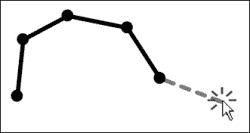
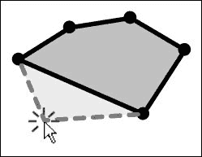
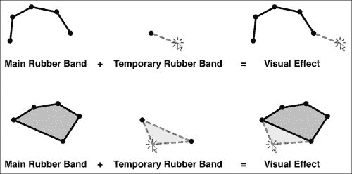
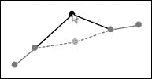
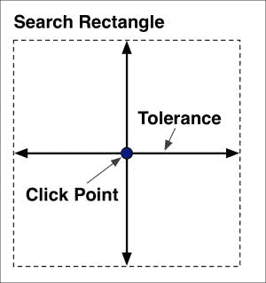

# 第七章. 在 PyQGIS 应用程序中选择和编辑要素

当运行 QGIS 应用程序时，用户有一系列工具可用于创建和操作地理要素。例如，**添加要素**工具允许用户创建新要素，而**移动要素**工具和**节点**工具允许用户移动和编辑现有的地理要素。然而，这些工具仅在 QGIS 本身内可用——如果您想在 PyQGIS 库之上编写外部应用程序，这些内置工具不可用，您将必须自己实现这些功能。

在本章中，我们将探讨向 PyQGIS 应用程序添加功能所涉及的内容，以便用户可以选择和编辑地理要素。特别是，我们将检查：

+   如何处理选择

+   如何使用图层编辑模式来保存或撤销用户对地图层所做的更改

+   如何创建允许用户添加和编辑点几何形状的地图工具

+   如何允许用户从地图层中删除几何形状

+   如何实现自定义地图工具，允许用户将线字符串和多边形几何形状添加到地图层

+   如何允许用户编辑线字符串或多边形几何形状

# 处理选择

向量图层类`QgsVectorLayer`包括跟踪用户当前选择的支持。这样做相对简单：有设置和更改选择的方法，以及检索所选要素的方法。当要素被选中时，它们在屏幕上以视觉方式突出显示，以便用户可以看到已选择的内容。

### 小贴士

如果你创建了自己的自定义符号层，你需要自己处理所选要素的高亮显示。我们已经在第六章，*掌握 QGIS Python API*，标题为*在 Python 中实现符号层*的部分中看到了如何做到这一点。

虽然用户有多种选择要素的方法，但最直接的方法是点击它们。这可以通过使用一个简单的地图工具来实现，例如：

```py
class SelectTool(QgsMapToolIdentify):
    def __init__(self, window):
        QgsMapToolIdentify.__init__(self, window.mapCanvas)
        self.window = window
        self.setCursor(Qt.ArrowCursor)

    def canvasReleaseEvent(self, event):
        found_features = self.identify(event.x(), event.y(),
                         self.TopDownStopAtFirst,
                         self.VectorLayer)
        if len(found_features) > 0:
            layer = found_features[0].mLayer
            feature = found_features[0].mFeature

            if event.modifiers() & Qt.ShiftModifier:
                layer.select(feature.id())
            else:
                layer.setSelectedFeatures([feature.id()])
        else:
            self.window.layer.removeSelection()
```

这与我们在上一章 Lex 应用程序中实现的`ExploreTool`非常相似。唯一的区别是，我们不是显示关于点击的要素的信息，而是告诉地图层选择它。

注意，我们检查是否按下了*Shift*键。如果是，则将点击的要素添加到当前选择中；否则，当前选择将被新选中的要素替换。此外，如果用户点击地图的背景，当前选择将被移除。这些都是用户熟悉的标准的用户界面约定。

一旦我们有了选择，从地图层中获取所选要素就相当简单。例如：

```py
if layer.selectedFeatureCount() == 0:
    QMessageBox.information(self, "Info",
                            "There is nothing selected.")
else:
    msg = []
    msg.append("Selected Features:")
    for feature in layer.selectedFeatures():
        msg.append("   " + feature.attribute("NAME"))
    QMessageBox.information(self, "Info", "\n".join(msg))
```

如果您想看到所有这些功能在实际中的应用，您可以下载并运行本章示例代码中包含的 **SelectionExplorer** 程序。

# 使用图层编辑模式

要让用户更改地图图层的内容，您首先必须打开该图层的**编辑模式**。图层编辑模式类似于数据库中处理事务的方式：


您对图层所做的更改将保留在内存中，直到您决定将更改**提交**到图层，或者**回滚**更改以丢弃它们。以下伪代码是使用 PyQGIS 实现此功能的示例：

```py
layer.startEditing()

# ...make changes...

if modified:
    reply = QMessageBox.question(window, "Confirm",
                                 "Save changes to layer?",
                                 QMessageBox.Yes | QMessageBox.No,
                                 QMessageBox.Yes)
    if reply == QMessageBox.Yes:
        layer.commitChanges()
    else:
        line.rollBack()
else:
     layer.rollBack()
```

如您所见，我们通过调用 `layer.startEditing()` 打开特定地图图层的编辑模式。除了设置一个内部 *编辑缓冲区* 来保存您所做的更改外，这还告诉图层通过在每个顶点上绘制小顶点标记来视觉上突出显示图层的要素，如下面的图像所示：


然后，我们允许用户更改图层的要素。我们将在本章的后续部分学习如何实现这一点。当用户关闭编辑模式时，我们会检查是否进行了更改，如果有，则向用户显示确认消息框。根据用户的响应，我们通过调用 `layer.commitChanges()` 保存更改，或者通过调用 `layer.rollBack()` 抛弃更改。

`commitChanges()` 和 `rollBack()` 都会关闭编辑模式，隐藏顶点标记并擦除编辑缓冲区的内容。

### 注意

当您使用图层的编辑模式时，您**必须**使用 `QgsVectorLayer` 中的各种方法来修改要素，而不是使用数据提供者中的等效方法。例如，您应该调用 `layer.addFeature(feature)` 而不是 `layer.dataProvider().addFeatures([feature])`。

图层的编辑方法仅在图层处于编辑模式时才有效。这些方法将更改添加到内部编辑缓冲区，以便在适当的时候提交或回滚。如果您直接对数据提供者进行更改，您将绕过编辑缓冲区，因此回滚功能将不会工作。

现在我们已经看到了编辑地图图层内容的整体过程，让我们创建一些地图工具，使用户能够添加和编辑地理空间数据。

# 添加点

以下地图工具允许用户向给定图层添加新的点要素：

```py
class AddPointTool(QgsMapTool):
    def __init__(self, canvas, layer):
        QgsMapTool.__init__(self, canvas)
        self.canvas = canvas
        self.layer  = layer
        self.setCursor(Qt.CrossCursor)

    def canvasReleaseEvent(self, event):
        point = self.toLayerCoordinates(self.layer, event.pos())

        feature = QgsFeature()
        feature.setGeometry(QgsGeometry.fromPoint(point))
        self.layer.addFeature(feature)
        self.layer.updateExtents()
```

如您所见，这个简单的地图工具将鼠标光标设置为十字形，当用户在地图画布上释放鼠标时，会创建一个新的 `QgsGeometry` 对象，该对象代表当前鼠标位置的一个点。然后，使用 `layer.addFeature()` 将此点添加到图层中，并更新图层的范围，以防新添加的点位于图层的当前范围之外。

当然，这个地图工具只是一个起点——你通常会添加代码来设置特征的属性，并通知应用程序一个点已经被添加。然而，正如你所见，允许用户创建一个新的点特征相当简单。

# 编辑点

编辑点特征也相当简单：由于几何形状只包含一个点，用户可以简单地点击并拖动来在地图层中移动点。以下是一个实现此行为的地图工具：

```py
class MovePointTool(QgsMapToolIdentify):
    def __init__(self, mapCanvas, layer):
        QgsMapToolIdentify.__init__(self, mapCanvas)
        self.setCursor(Qt.CrossCursor)
        self.layer    = layer
        self.dragging = False
        self.feature  = None

    def canvasPressEvent(self, event):
        found_features = self.identify(event.x(), event.y(),
                                       [self.layer],
                                       self.TopDownAll)
        if len(found_features) > 0:
            self.dragging = True
            self.feature  = found_features[0].mFeature
        else:
            self.dragging = False
            self.feature  = None

    def canvasMoveEvent(self, event):
        if self.dragging:
            point = self.toLayerCoordinates(self.layer,
                                            event.pos())

            geometry = QgsGeometry.fromPoint(point)

            self.layer.changeGeometry(self.feature.id(), geometry)
            self.canvas().refresh()

    def canvasReleaseEvent(self, event):
        self.dragging = False
        self.feature  = None
```

正如你所见，我们为这个地图工具继承自 `QgsMapToolIdentify`。这让我们可以使用 `identify()` 方法找到用户点击的几何形状，就像我们在本章前面实现的 `SelectTool` 一样。

注意，我们的 `canvasMoveEvent()` 方法跟踪用户当前的鼠标位置。它还通过调用 `layer.changeGeometry()` 来更新特征的几何形状，以记住用户移动点时的变化鼠标位置。`canvasPressEvent()` 只在用户点击点时启用拖动，而 `canvasReleaseEvent()` 方法整理好，以便用户可以通过点击来移动另一个点。

如果你正在编写一个包含基于点的 `QgsVectorLayer` 的独立 PyQGIS 应用程序，你可以使用我们在这里定义的 `AddPointTool` 和 `MovePointTool` 类来允许用户在你的矢量层中添加和编辑点特征。对于点几何来说，唯一缺少的功能是删除点的功能。现在让我们来实现这个功能。

# 删除点和其他特征

幸运的是，删除点特征所需的代码也适用于其他类型的几何形状，因此我们不需要实现单独的 `DeletePointTool`、`DeleteLineTool` 和 `DeletePolygonTool` 类。相反，我们只需要一个通用的 `DeleteTool`。以下代码实现了这个地图工具：

```py
class DeleteTool(QgsMapToolIdentify):
    def __init__(self, mapCanvas, layer):
        QgsMapToolIdentify.__init__(self, mapCanvas)
        self.setCursor(Qt.CrossCursor)
        self.layer   = layer
        self.feature = None

    def canvasPressEvent(self, event):
        found_features = self.identify(event.x(), event.y(),
                                       [self.layer],
                                       self.TopDownAll)
        if len(found_features) > 0:
            self.feature = found_features[0].mFeature
        else:
            self.feature = None

    def canvasReleaseEvent(self, event):
        found_features = self.identify(event.x(), event.y(),
                                       [self.layer],
                                       self.TopDownAll)
        if len(found_features) > 0:
            if self.feature.id() == found_features[0].mFeature.id():
                self.layer.deleteFeature(self.feature.id())
```

再次强调，我们使用 `QgsMapToolIdentify` 类来快速找到用户点击的特征。我们使用 `canvasPressEvent()` 和 `canvasReleaseEvent()` 方法来确保用户在同一个特征上点击和释放鼠标；这确保了地图工具比简单地删除用户点击的特征更加用户友好。如果鼠标点击和释放都在同一个特征上，我们会删除它。

在这些地图工具的帮助下，实现一个允许用户在地图层中添加、编辑和删除点特征的 PyQGIS 应用程序相当简单。然而，这些都是“低垂的果实”——我们的下一个任务，即让用户添加和编辑 LineString 和 Polygon 几何形状，要复杂得多。

# 添加线和多边形

要添加 LineString 或 Polygon 几何形状，用户将依次点击每个顶点来 *绘制* 所需的形状。用户点击每个顶点时，将显示适当的反馈。例如，LineString 几何形状将以以下方式显示：



要绘制 Polygon 几何形状的轮廓，用户将再次依次单击每个顶点。然而，这次，多边形本身将显示出来，以便使结果形状清晰，如下面的图像所示：



在这两种情况下，点击每个顶点和显示适当反馈的基本逻辑是相同的。

QGIS 包含一个名为 `QgsMapToolCapture` 的地图工具，它正好处理这种行为：它允许用户通过依次单击每个顶点来绘制 LineString 或 Polygon 几何形状的轮廓。不幸的是，`QgsMapToolCapture` 并不是 PyQGIS 库的一部分，因此我们必须自己使用 Python 重新实现它。

让我们从查看我们的 `QgsMapToolCapture` 端口设计开始，我们将称之为 `CaptureTool`。这将是一个标准的地图工具，由 `QgsMapTool` 派生而来，它使用 `QgsRubberBand` 对象来绘制 LineString 或 Polygon 在绘制时的视觉高亮。

`QgsRubberBand` 是一个地图画布项，它在地图上绘制一个几何形状。由于橡皮筋以单色和样式绘制其整个几何形状，因此在我们的捕获工具中，我们必须使用两个橡皮筋：一个用于绘制已经捕获的几何形状的部分，另一个临时橡皮筋用于将几何形状扩展到当前鼠标位置。以下插图显示了这对于 LineString 和 Polygon 几何形状是如何工作的：



这里有一些我们将在 `CaptureTool` 中包含的附加功能：

+   它将有一个 *捕获模式*，指示用户是否正在创建 LineString 或 Polygon 几何形状。

+   用户可以按 *Backspace* 或 *Delete* 键来删除最后添加的顶点。

+   用户可以按 *Enter* 或 *Return* 键来完成捕获过程。

+   如果我们正在捕获 Polygon，当用户完成捕获时，几何形状将被 *封闭*。这意味着我们向几何形状添加一个额外的点，以便轮廓从同一点开始和结束。

+   当用户完成捕获几何形状时，几何形状将被添加到层中，并使用回调函数来通知应用程序已添加新的几何形状。

既然我们知道我们在做什么，让我们开始实现 `CaptureTool` 类。我们类定义的第一部分将看起来如下：

```py
class CaptureTool(QgsMapTool):
    CAPTURE_LINE    = 1
    CAPTURE_POLYGON = 2

    def __init__(self, canvas, layer, onGeometryAdded,
                 captureMode):
        QgsMapTool.__init__(self, canvas)
        self.canvas          = canvas
        self.layer           = layer
        self.onGeometryAdded = onGeometryAdded
        self.captureMode     = captureMode
        self.rubberBand      = None
        self.tempRubberBand  = None
        self.capturedPoints  = []
        self.capturing       = False
        self.setCursor(Qt.CrossCursor)
```

在我们类的顶部，我们定义了两个常量，`CAPTURE_LINE` 和 `CAPTURE_POLYGON`，它们定义了可用的捕获模式。然后我们有类初始化器，它将接受以下参数：

+   `canvas`：这是这个地图工具将作为一部分的 `QgsMapCanvas`。

+   `layer`：这是几何形状将被添加到的 `QgsVectorLayer`。

+   `onGeometryAdded`：这是一个 Python 可调用对象（即，一个方法或函数），当新的几何形状被添加到地图层时将被调用。

+   `captureMode`：这表示我们正在捕获 LineString 或 Polygon 几何形状。

然后我们将各种实例变量设置为其初始状态，并告诉地图工具使用十字光标，这使用户更容易看到他们确切点击的位置。

我们接下来的任务是实现各种 `XXXEvent()` 方法以响应用户的操作。我们将从 `canvasReleaseEvent()` 开始，它响应左键点击通过向几何形状添加新顶点，以及右键点击通过完成捕获过程然后将几何形状添加到地图层。

### 注意

我们在 `canvasReleaseEvent()` 方法中实现这种行为，而不是 `canvasPressEvent()`，因为我们希望顶点在用户释放鼠标按钮时添加，而不是在它们最初按下时。

这是 `canvasReleaseEvent()` 方法的实现。注意我们使用了几个辅助方法，我们将在稍后定义：

```py
    def canvasReleaseEvent(self, event):
        if event.button() == Qt.LeftButton:
            if not self.capturing:
                self.startCapturing()
            self.addVertex(event.pos())
        elif event.button() == Qt.RightButton:
            points = self.getCapturedGeometry()
            self.stopCapturing()
            if points != None:
                self.geometryCaptured(points)
```

接下来，我们有 `canvasMoveEvent()` 方法，它响应用户移动鼠标的动作，通过更新临时橡皮筋以反映当前鼠标位置：

```py
    def canvasMoveEvent(self, event):
        if self.tempRubberBand != None and self.capturing:
            mapPt,layerPt = self.transformCoordinates(event.pos())
            self.tempRubberBand.movePoint(mapPt)
```

这里有趣的部分是对 `tempRubberBand.movePoint()` 的调用。`QgsRubberBand` 类在地图坐标中工作，因此我们首先必须将当前鼠标位置（以像素为单位）转换为地图坐标。然后我们调用 `movePoint()`，它将橡皮筋中的当前顶点移动到新位置。

还有一个事件处理方法需要定义：`onKeyEvent()`。该方法响应用户按下 *Backspace* 或 *Delete* 键，通过移除最后一个添加的顶点，以及用户按下 *Return* 或 *Enter* 键通过关闭并保存当前几何形状。以下是此方法的代码：

```py
    def keyPressEvent(self, event):
        if event.key() == Qt.Key_Backspace or \
           event.key() == Qt.Key_Delete:
            self.removeLastVertex()
            event.ignore()
        if event.key() == Qt.Key_Return or event.key() == Qt.Key_Enter:
            points = self.getCapturedGeometry()
            self.stopCapturing()
            if points != None:
                self.geometryCaptured(points)
```

现在我们已经定义了事件处理方法，接下来定义这些事件处理器所依赖的各种辅助方法。我们将从 `transformCoordinates()` 方法开始，该方法将鼠标位置（在画布坐标中）转换为地图和层坐标：

```py
    def transformCoordinates(self, canvasPt):
        return (self.toMapCoordinates(canvasPt),
                self.toLayerCoordinates(self.layer, canvasPt))
```

例如，如果鼠标当前位于画布上的 `(17,53)` 位置，这可能转换为地图和层坐标 `lat=37.234` 和 `long=-112.472`。由于地图和层可能使用不同的坐标参考系统，我们计算并返回两者的坐标。

现在让我们定义 `startCapturing()` 方法，它准备我们的两个橡皮筋并将 `self.capturing` 设置为 `True`，这样我们知道我们目前正在捕获几何形状：

```py
    def startCapturing(self):
        color = QColor("red")
        color.setAlphaF(0.78)

        self.rubberBand = QgsRubberBand(self.canvas,
                                        self.bandType())
        self.rubberBand.setWidth(2)
        self.rubberBand.setColor(color)
        self.rubberBand.show()

        self.tempRubberBand = QgsRubberBand(self.canvas,
                                            self.bandType())
        self.tempRubberBand.setWidth(2)
        self.tempRubberBand.setColor(color)
        self.tempRubberBand.setLineStyle(Qt.DotLine)
        self.tempRubberBand.show()

        self.capturing = True
```

注意，我们使用另一个辅助方法 `bandType()` 来决定橡皮筋应该绘制的几何类型。现在让我们定义这个方法：

```py
    def bandType(self):
        if self.captureMode == CaptureTool.CAPTURE_POLYGON:
            return QGis.Polygon
        else:
            return QGis.Line
```

接下来是 `stopCapturing()` 方法，它从地图画布中移除我们的两个橡皮筋，将实例变量重置到初始状态，并告诉地图画布刷新自身，以便隐藏橡皮筋：

```py
    def stopCapturing(self):
        if self.rubberBand:
            self.canvas.scene().removeItem(self.rubberBand)
            self.rubberBand = None
        if self.tempRubberBand:
            self.canvas.scene().removeItem(self.tempRubberBand)
            self.tempRubberBand = None
        self.capturing = False
        self.capturedPoints = []
        self.canvas.refresh()
```

现在我们来到`addVertex()`方法。此方法在点击的鼠标位置向当前几何形状添加一个新的顶点，并更新橡皮筋以匹配：

```py
    def addVertex(self, canvasPoint):
        mapPt,layerPt = self.transformCoordinates(canvasPoint)

        self.rubberBand.addPoint(mapPt)
        self.capturedPoints.append(layerPt)

        self.tempRubberBand.reset(self.bandType())
        if self.captureMode == CaptureTool.CAPTURE_LINE:
            self.tempRubberBand.addPoint(mapPt)
        elif self.captureMode == CaptureTool.CAPTURE_POLYGON:
            firstPoint = self.rubberBand.getPoint(0, 0)
            self.tempRubberBand.addPoint(firstPoint)
            self.tempRubberBand.movePoint(mapPt)
            self.tempRubberBand.addPoint(mapPt)
```

注意，我们将捕获的点添加到`self.capturedPoints`列表中。这是我们完成捕获后定义几何形状的点列表。设置临时橡皮筋有点复杂，但基本思想是定义 LineString 或 Polygon，使其覆盖新几何形状当前高亮显示的部分。

现在让我们定义`removeLastVertex()`方法，当用户按下*退格*或*删除*键撤销上一次点击时，该方法会被调用。这个方法稍微复杂一些，因为我们必须更新两个橡皮筋以移除最后一个顶点，以及更新`self.capturedPoints`列表：

```py
    def removeLastVertex(self):
        if not self.capturing: return

        bandSize     = self.rubberBand.numberOfVertices()
        tempBandSize = self.tempRubberBand.numberOfVertices()
        numPoints    = len(self.capturedPoints)

        if bandSize < 1 or numPoints < 1:
            return

        self.rubberBand.removePoint(-1)

        if bandSize > 1:
            if tempBandSize > 1:
                point = self.rubberBand.getPoint(0, bandSize-2)
                self.tempRubberBand.movePoint(tempBandSize-2,
                                              point)
        else:
            self.tempRubberBand.reset(self.bandType())

        del self.capturedPoints[-1]
```

我们现在已经为我们的`CaptureTool`定义了相当多的方法。幸运的是，只剩下两个方法。现在让我们定义`getCapturedGeometry()`方法。此方法检查 LineString 几何形状是否至少有两个点，以及 Polygon 几何形状是否至少有三个点。然后关闭多边形并返回组成捕获几何形状的点列表：

```py
    def getCapturedGeometry(self):
        points = self.capturedPoints
        if self.captureMode == CaptureTool.CAPTURE_LINE:
            if len(points) < 2:
                return None
        if self.captureMode == CaptureTool.CAPTURE_POLYGON:
            if len(points) < 3:
                return None
        if self.captureMode == CaptureTool.CAPTURE_POLYGON:
            points.append(points[0]) # Close polygon.
        return points
```

最后，我们有`geometryCaptured()`方法，它响应捕获的几何形状。此方法创建给定类型的新几何形状，将其作为要素添加到地图层，并使用传递给我们的`CaptureTool`初始化器的`onGeometryAdded`可调用对象，通知应用程序其余部分已向层添加了新几何形状：

```py
    def geometryCaptured(self, layerCoords):
        if self.captureMode == CaptureTool.CAPTURE_LINE:
            geometry = QgsGeometry.fromPolyline(layerCoords)
        elif self.captureMode == CaptureTool.CAPTURE_POLYGON:
            geometry = QgsGeometry.fromPolygon([layerCoords])

        feature = QgsFeature()
        feature.setGeometry(geometry)
        self.layer.addFeature(feature)
        self.layer.updateExtents()
        self.onGeometryAdded()
```

虽然`CaptureTool`很复杂，但它是一个非常强大的类，允许用户向地图层添加新的线和多边形。这里还有一些我们没有实现的功能（坐标捕捉、检查生成的几何形状是否有效，以及添加对形成多边形内环的支持），但即使如此，这也是一个有用的工具，可以用来向地图添加新要素。

# 编辑线和多边形

我们将要考察的最后一项主要功能是编辑 LineString 和 Polygon 要素的能力。正如`CaptureTool`允许用户点击并拖动来创建新的线和多边形一样，我们将实现`EditTool`，它允许用户点击并拖动来移动现有要素的顶点。以下图片显示了当用户使用此工具移动顶点时将看到的内容：



我们的编辑工具还将允许用户通过双击线段来添加新的顶点，并通过右击相同的线段来删除顶点。

让我们定义我们的`EditTool`类：

```py
class EditTool(QgsMapTool):
    def __init__(self, mapCanvas, layer, onGeometryChanged):
        QgsMapTool.__init__(self, mapCanvas)
        self.setCursor(Qt.CrossCursor)
        self.layer             = layer
        self.onGeometryChanged = onGeometryChanged
        self.dragging          = False
        self.feature           = None
        self.vertex            = None
```

如您所见，`EditTool`是`QgsMapTool`的子类，初始化器接受三个参数：地图画布、要编辑的图层，以及一个`onGeometryChanged`可调用对象，当用户对几何形状进行更改时，将调用此对象。

接下来，我们想要定义`canvasPressEvent()`方法。我们首先将识别用户点击的要素：

```py
    def canvasPressEvent(self, event):
        feature = self.findFeatureAt(event.pos())
        if feature == None:
            return
```

我们将在稍后实现`findFeatureAt()`方法。现在我们知道用户点击了哪个要素，我们想要识别该要素中离点击点最近的顶点，以及用户点击离顶点有多远。以下是相关代码：

```py
        mapPt,layerPt = self.transformCoordinates(event.pos())
        geometry = feature.geometry()

        vertexCoord,vertex,prevVertex,nextVertex,distSquared = \
            geometry.closestVertex(layerPt)

        distance = math.sqrt(distSquared)
```

如您所见，我们正在使用`transformCoordinates()`方法的副本（从我们的`CaptureTool`类中借用）来将画布坐标转换为地图和图层坐标。然后，我们使用`QgsGeometry.closestVertex()`方法来识别鼠标点击位置最近的顶点。此方法返回多个值，包括从最近顶点到鼠标位置的距离的平方。我们使用`math.sqrt()`函数将其转换为常规距离值，该值将在图层坐标中。

现在我们知道鼠标点击离顶点有多远，我们必须决定距离是否太远。如果用户没有在顶点附近点击任何地方，我们将想要忽略鼠标点击。为此，我们将计算一个**容差**值。容差是指点击点可以离顶点多远，同时仍然将其视为对该顶点的点击。与之前计算的距离值一样，容差是以图层坐标来衡量的。我们将使用一个辅助方法`calcTolerance()`来计算这个值。以下是需要在我们的`canvasPressEvent()`方法末尾添加的相关代码：

```py
        tolerance = self.calcTolerance(event.pos())
        if distance > tolerance: return
```

如您所见，如果鼠标点击位置离顶点太远，即距离大于容差，我们将忽略鼠标点击。现在我们知道用户确实在顶点附近点击了，我们想要对此鼠标点击做出响应。我们如何做这取决于用户是否按下了左键或右键：

```py
        if event.button() == Qt.LeftButton:
            # Left click -> move vertex.
            self.dragging = True
            self.feature  = feature
            self.vertex   = vertex
            self.moveVertexTo(event.pos())
            self.canvas().refresh()
        elif event.button() == Qt.RightButton:
            # Right click -> delete vertex.
            self.deleteVertex(feature, vertex)
            self.canvas().refresh()
```

如您所见，我们依赖于许多辅助方法来完成大部分工作。我们将在稍后定义这些方法，但首先，让我们完成我们的事件处理方法实现，从`canvasMoveEvent()`开始。此方法响应用户将鼠标移过画布。它是通过将拖动的顶点（如果有）移动到当前鼠标位置来实现的：

```py
    def canvasMoveEvent(self, event):
        if self.dragging:
            self.moveVertexTo(event.pos())
            self.canvas().refresh()
```

接下来，我们有`canvasReleaseEvent()`，它将顶点移动到其最终位置，刷新地图画布，并更新我们的实例变量以反映我们不再拖动顶点的事实：

```py
    def canvasReleaseEvent(self, event):
        if self.dragging:
            self.moveVertexTo(event.pos())
            self.layer.updateExtents()
            self.canvas().refresh()
            self.dragging = False
            self.feature  = None
            self.vertex   = None
```

我们最终的事件处理方法是`canvasDoubleClickEvent()`，它通过向要素添加新顶点来响应双击。此方法与`canvasPressEvent()`方法类似；我们必须识别被点击的要素，然后识别用户双击的是哪条线段：

```py
    def canvasDoubleClickEvent(self, event):
        feature = self.findFeatureAt(event.pos())
        if feature == None:
            return

        mapPt,layerPt = self.transformCoordinates(event.pos())
        geometry      = feature.geometry()

        distSquared,closestPt,beforeVertex = \
            geometry.closestSegmentWithContext(layerPt)

        distance = math.sqrt(distSquared)
        tolerance = self.calcTolerance(event.pos())
        if distance > tolerance: return
```

如您所见，如果鼠标位置离线段太远，我们将忽略双击。接下来，我们想要将新顶点添加到几何形状中，并更新地图图层和地图画布以反映这一变化：

```py
        geometry.insertVertex(closestPt.x(), closestPt.y(),
                              beforeVertex)
        self.layer.changeGeometry(feature.id(), geometry)
        self.canvas().refresh()
```

这完成了我们 `EditTool` 的所有事件处理方法。现在让我们实现我们的各种辅助方法，从识别点击的要素的 `findFeatureAt()` 方法开始：

```py
    def findFeatureAt(self, pos):
        mapPt,layerPt = self.transformCoordinates(pos)
        tolerance = self.calcTolerance(pos)
        searchRect = QgsRectangle(layerPt.x() - tolerance,
                                  layerPt.y() - tolerance,
                                  layerPt.x() + tolerance,
                                  layerPt.y() + tolerance)

        request = QgsFeatureRequest()
        request.setFilterRect(searchRect)
        request.setFlags(QgsFeatureRequest.ExactIntersect)

        for feature in self.layer.getFeatures(request):
            return feature

        return None
```

我们使用容差值来定义一个以点击点为中心的搜索矩形，并识别与该矩形相交的第一个要素：



接下来是 `calcTolerance()` 方法，它计算在点击被认为太远于顶点或几何形状之前我们可以容忍的距离：

```py
    def calcTolerance(self, pos):
        pt1 = QPoint(pos.x(), pos.y())
        pt2 = QPoint(pos.x() + 10, pos.y())

        mapPt1,layerPt1 = self.transformCoordinates(pt1)
        mapPt2,layerPt2 = self.transformCoordinates(pt2)
        tolerance = layerPt2.x() - layerPt1.x()

        return tolerance
```

我们通过识别地图画布上相距十像素的两个点，并将这两个坐标都转换为层坐标来计算这个值。然后我们返回这两个点之间的距离，这将是层坐标系中的容差。

现在我们来到了有趣的部分：移动和删除顶点。让我们从将顶点移动到新位置的方法开始：

```py
    def moveVertexTo(self, pos):
        geometry = self.feature.geometry()
        layerPt = self.toLayerCoordinates(self.layer, pos)
        geometry.moveVertex(layerPt.x(), layerPt.y(), self.vertex)
        self.layer.changeGeometry(self.feature.id(), geometry)
        self.onGeometryChanged()
```

如您所见，我们将位置转换为层坐标，告诉 `QgsGeometry` 对象将顶点移动到这个位置，然后告诉层保存更新的几何形状。最后，我们使用 `onGeometryChanged` 可调用对象告诉应用程序的其他部分几何形状已被更改。

删除一个顶点稍微复杂一些，因为我们必须防止用户在没有足够的顶点来构成有效几何形状的情况下删除顶点——LineString 至少需要两个顶点，而多边形至少需要三个。以下是我们的 `deleteVertex()` 方法的实现：

```py
    def deleteVertex(self, feature, vertex):
        geometry = feature.geometry()

        if geometry.wkbType() == QGis.WKBLineString:
            lineString = geometry.asPolyline()
            if len(lineString) <= 2:
                return
        elif geometry.wkbType() == QGis.WKBPolygon:
            polygon = geometry.asPolygon()
            exterior = polygon[0]
            if len(exterior) <= 4:
                return

        if geometry.deleteVertex(vertex):
            self.layer.changeGeometry(feature.id(), geometry)
            self.onGeometryChanged()
```

注意，多边形检查必须考虑到多边形外部的第一个和最后一个点实际上是相同的。这就是为什么我们检查多边形是否至少有四个坐标而不是三个。

这完成了我们对 `EditTool` 类的 `EditTool` 类的实现。要查看这个地图工具的实际效果，以及其他我们在本章中定义的几何形状编辑地图工具，请查看包含在本章示例代码中的 **GeometryEditor** 程序。

# 摘要

在本章中，我们学习了如何编写一个 PyQGIS 应用程序，允许用户选择和编辑要素。我们创建了一个地图工具，它使用 `QgsVectorLayer` 中的选择处理方法来让用户选择要素，并学习了如何在程序内部处理当前选定的要素。然后我们探讨了层的编辑模式如何允许用户进行更改，然后要么提交这些更改，要么丢弃它们。最后，我们创建了一系列地图工具，允许用户在地图层内添加、编辑和删除点、线字符串和多边形几何形状。

将所有这些工具整合在一起，您的 PyQGIS 应用程序将具备一套完整的选区和几何编辑功能。在本书的最后两章中，我们将使用这些工具，结合前几章所获得的知识，利用 Python 和 QGIS 构建一个完整的独立地图应用程序。
